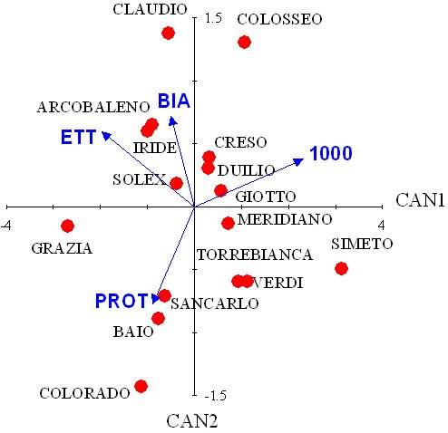

---

#Introduzione

Nell'ambito della statistica multivariata, il problema delle riduzione della dimensionalità dei dati è centrale per ogni applicazione sperimentale. In particolare, se guardiamo il nostro dataset multivariato (con $n$ soggetti/righe e $p$ variabili/colonne) come un insieme di punti nello spazio a $p$ dimensioni, è utile cercare di riorganizzare le osservazioni in uno spazio con un ridotto numero di dimensioni, che ci dia un punto di vista migliore per l'interpretazione dei risultati. Se le osservazioni sono tra loro indipendenti, l'analisi delle componenti principali opera questa riduzione di dimensionalità, cercando di conservare la distanza Euclidea tra i soggetti. In questo modo è possibile, ad esempio, riportare i soggetti in uno spazio a due dimensioni (biplot) con la certezza che la distanza tra i punti nel biplot è una buona approssimazione della loro distanza  originale in $p$ dimensioni.

In molti problemi sperimentali agronomici e biologici, tuttavia, le osservazioni sperimentali non sono indipendenti l'una dall'altra, ma sono divisibili in gruppi noti a priori. Guardiamo l'esempio in Figura 1, dove sono individuabili tre gruppi (noti a priori) e i loro 'centroidi' (medie di ogni variabile).


In questa situazione la nostra attenzione può essere rivolta alla discriminazione tra gruppi ed, eventualmente, alla classificazione di nuovi individui in uno dei gruppi pre-esistenti. Di conseguenza, potremmo essere interessati a rappresentare il dataset in una nuova prospettiva che, con un ridotto numero di dimensioni, evidenzi al meglio le differenze tra gruppi, trascurando invece le differenze tra individui. Per questo fine, è chiaro che la prospettiva offerta dalle componenti principali non corrisponde adeguatamente alle nostre esigenze, perché guarda ai soggetti, ma non ai gruppi.

In ambito agronomico, due esempi sono particolarmente rilevanti: la valutazione della qualità produttiva nelle sperimentazioni varietali e la valutazione dell'efficacia di diverse strategie di diserbo. In entrambi i casi, viene osservato un numero elevato di variabili (ad esempio: contenuto in proteine, in amidi, valore nutritivo nelle sperimentazioni varietali e ricoprimento delle diverse specie infestanti nel confronto erbicida), che debbono essere preferibilmente valutate nel loro complesso e non separatamente l'una dall'altra. Inoltre, considerando ad esempio una sperimentazione varietale ripetuta in più anni, i dati registrati per ogni varietà costituiscono un gruppo da valutare nel suo complesso, mettendo quindi in luce le differenze tra varietà, e non tanto quelle tra ogni singolo dato.

In altre parole, l'analisi canonica discriminante trova applicazione quando si tratta di discriminare tra gruppi (e non tra soggetti) noti a priori. Da questo punto di vista è evidente la differenza con l'analisi *cluster* che permette di suddividere a posteriori i dati in gruppi omogenei.

# Un caso studio

Come esempio di analisi delle variabili canoniche riportiamo una sperimentazione varietale eseguita su grano duro, in più annate consecutive. Questo esempio costituisce una buona base di partenza per altri tipi di applicazioni.

I dati sono relativi a quattro prove sperimentali eseguite tra il 1999 ed il 2003, i cui risultati sono stati già pubblicati altrove (Belocchi *et al.*, 2003; Ciriciofolo *et al.*, 2001; Ciriciofolo *et al.*, 2002; Desiderio *et al.*, 2000). Le unità sperimentali sono 64 (16 varietà di grano duro x quattro anni) e su ognuna di esse sono state rilevate quattro caratteristiche qualitative, cioè il il peso ettolitrico (WPH), la percentuale di cariossidi bianconate (YB), il peso di 1000 cariossidi (TKW) e il contenuto di proteina grezza (PC). In questa sede operiamo sulle medie delle tre repliche di ciascuna annata. I dati sono disponibili nella 'repository' indicata nel codice sottostante.

```{r}
rm(list=ls())
dati <- read.csv("https://www.statforbiology.com/pca/WheatQuality.csv", header=T)
head(dati)
```

Se su questo data set calcolassimo le componenti principali riusciremmo ad evidenziare al massimo le differenze tra individui, cioè tra ogni singolo dato produttivo ottenuto in ogni anno da ciascuna varietà. In realtà il nostro obiettivo è invece quello di evidenziare al massimo le differenze tra varietà, al di là dei risultati di ogni singolo anno. Se operassimo separatamente con la statistica univariata sulle singole variabili, perderemmo ogni informazione sulle relazioni tra di esse; optiamo pertanto per l'analisi canonica discriminante.

##Qual è il principio di fondo?

Come nel caso delle componenti principali, dobbiamo prendere la matrice delle osservazioni originali e 'ruotarla', in modo da definire delle nuove variabili, dette variabili canoniche, che abbiano le caratteristiche desiderate. La rotazione è un'operazione di moltiplicazione matriciale, del tipo:

$$ VC = X \times V$$

dove X e VC hanno $n$ righe e $p$ colonne ($n$ soggetti e $p$ variabili), mentre V è una matrice quadrata $v \times v$, che definisce la rotazione. Il nostro problema è quindi quello di trovare la matrice $V$, in modo che le variabili ruotate (VC) permettano di osservare meglio le differenze tra gruppi.

Possiamo iniziare pensando che i gruppi sono facili da discriminare quando gli individui nel gruppo sono molto simili (bassa variabilità entro gruppo) e le medie dei gruppi sono invece molto diverse (alta variabilità tra gruppi). In questa situazione il valore di F nell'ANOVA univariata risulta molto alto e significativo. L'analisi delle variabili canoniche sfrutta questo principio: $V$ viene scelta in modo che le variabili canoniche assicurino la minima variabilità entro gruppo e la massima variabilità tra gruppi.

##Come si calcolano le variabili canoniche?

Per il calcolo, procediamo inizialmente alla standardizzazione dei dati. Anche se ciò non è necessario, ci consente di evitare che una variabile assuma un peso maggiore rispetto ad un'altra; indicheremo con $Z$ la matrice dei dati standardizzati, della quale mostriamo solo le prime righe:

```{r}
dataset <- dati[,3:6]
Z <- apply(dataset, 2, scale, center=T, scale=T)
head(Z)
```

**ATTENZIONE**: alcuni programmi statistici (come SPSS) considerano anche un ulteriore tipo di standardizzazione che impiega al posto della deviazione standard totale la deviazione standard entro gruppi. Ne parleremo tra poco. 

Indichiamo inoltre con U la matrice ottenuta da Z, sostituendo ad ogni dato in ogni colonna la media del gruppo (varietà) a cui il dato appartiene (matrice dei centroidi).

```{r}
groups <- as.factor(dati[,1])
maovst <- manova(Z ~ groups)
U <- fitted(maovst)
head(U)
```

Con questi ingredienti siamo in grado di iniziare i calcoli. Calcoliamo la matrice delle devianze/codevianze totali (T):

```{r}
T <- t(Z) %*% Z
T
```

Ora calcoliamo la matrice delle devianze/codevianze tra gruppi (B):

```{r}
B <- t(U)%*%U
B
```

La matrice delle devianze/codevianze entro gruppo (W) è data da $T - B = W$:

```{r}
W <- T - B
W
```

Vediamo bene che esistono forti correlazioni tra le variabili, sia totali, che tra gruppi, che entro gruppo. Insomma, quattro variabili sono ridondanti per la discriminazione tra gruppi, visto che ognuna veicola parte dell'informazione già veicolata da altre. Possiamo calcolare il rapporto tra W e B, che rappresenta il rapporto tra le devianze/codevianze tra gruppi e quelle entro gruppo (una sorta di test F, per semplificare). Utilizzando la moltiplicazione matriciale possiamo scrivere:


```{r}
WB <- solve(W)%*%B 
WB
```

Gli autovalori della matrice $WB$ sono:

```{r}
A <- eigen(WB)$values
A
```

Mentre gli autovettori associati con ciascun autovalore sono:

```{r}
V1 <- eigen(WB)$vectors
V1
```

La matrice degli autovettori può essere utilizzata per 'ruotare' la matrice dei dati originali, analogamente a quanto avviene nell'analisi delle componenti principali. In questo modo otterremo quattro variabili 'ruotate' dette *variabili canoniche centrate* (VCC). Queste variabili hanno:

1. media = 0
2. varianze unitarie
3. correlazioni nulle


```{r}
VCC <- Z %*% V1
colnames(VCC) <- c("VCC1", "VCC2", "VCC3", "VCC4")
apply(VCC, 2, mean)
cor(VCC)
```

Se sottoponiamo ad ANOVA le quattro VCC, possiamo calcolare le deviazioni standard dei residui:

```{r}
zseq <- apply(VCC, 2, function(x) lm(x ~ Genotype, data = dati))
RMSE <- lapply(zseq, function(mod) summary(mod)$sigma)
RMSE
```

Queste deviazioni standard risulteranno utili tra poco.


##I coefficienti canonici

Sappiamo che il calcolo degli autovettori di una matrice non ammette un'unica soluzione, ma infinite. In questo caso, gli autovettori indicati in precedenza sono stati scelti in modo che la loro norma fosse unitaria. Infatti:


```{r}
t(V1) %*% V1
```

Più comunemente, gli autovettori vengono scalati dividendoli proprio per la deviazione standard entro gruppi della variabile canonica centrata corrispondente. In questo modo si ottengono i *coefficienti canonici standardizzati* ($Vst$):

```{r}
scaling <- diag(1/unlist(RMSE))
Vst <- V1 %*% scaling
Vst
```

I coefficienti canonici standardizzati sono usualmente utilizzati al posto degli autovettori V1 per ruotare le variabili originali, ottenendo le **Variabili Canoniche Standardizzate**, dette anche punteggi canonici (*canonical scores*):

```{r}
VCst <- Z %*% Vst
colnames(VCst) <- c("VC1", "VC2", "VC3", "VC4")
cor(VCst)
zseq <- apply(VCst, 2, function(x) lm(x ~ Genotype, data = dati))
RMSE <- lapply(zseq, function(mod) summary(mod)$sigma)
RMSE
MSB <- lapply(zseq, function(mod) anova(mod)[1,2])
MSW <- lapply(zseq, function(mod) anova(mod)[2,2])
unlist(MSB)/unlist(MSW)
```

Vediamo più sopra che le variabili canoniche standardizzate:
1. non sono correlate tra loro (notare gli zero fuori dalla diagonale principale nella matrice di correlazione)
2. hanno varianze entro gruppi unitarie
3. i rapporti devianza tesi/devianza errore sono pari agli autovalori. La loro somma è pari a 2.158 + 0.754 + 0.477 + 0.066 = 3.455, il che eguaglia esattamente la somma della diagonale principale di W $^{-1}$ B. 

Quest'ultimo aspetto può essere ulteriormente evidenziato se calcoliamo per le variabili canoniche la matrice $W_y^{-1} B_y$, in analogia alla matrice $W^{-1} B$ già calcolata per le variabili originali.

```{r}
maovst2 <- manova(VCst ~ groups)
U2 <- maovst2$fitted
T2 <- t(VCst)%*%VCst
B2 <- t(U2)%*%U2
W2 <- T2 - B2
solve(W2)%*%B2
```

Possiamo osservare che questa matrice conserva la traccia di $W^{-1} B$, a dimostrazione che il contributo totale delle quattro variabili canoniche alla discriminazione tra gruppi è lo stesso delle quattro variabili originali, ma cambiano i rapporti. Ora la prima variabile canonica da sola garantisce una discriminazione pari al 62.5% del totale delle variabili originali (2.155/3.540 $\cdot$ 100), mentre due variabili canoniche arrivano quasi all'85% del totale.


** Se quindi usiamo due variabili canoniche invece che le quattro variabili originali, riduciamo la dimensionalità del problema perdendo solo una piccola parte del potere discriminatorio iniziale. E' un bel guadagno!**


A questi risultati si arriva in modi certamente più ortodossi di quelli qui accennati, ma per questo si rimanda ai testi specializzati (Sadocchi, 1986). A me basta che abbiate compreso i criteri fondamentali di calcolo.


##Perchè i coefficienti canonici standardizzati differiscono da un programma all'altro?

In questo tutorial abbiamo iniziato l'analisi standardizzando i dati, cioè sottraendo da ogni dato la media della colonna e dividendo per la sua deviazione standard. Alcuni software statistici (come SPSS o WINSTAT 6.0) eseguono un diverso tipo di standardizzazione, dividendo ogni dato centrato per la deviazione standard entro gruppo. Nel codice sottostante calcoliamo, con quattro ANOVA, la deviazione standard del residuo per le quattro variabili e la utilizziamo per standardizzare i dati, producendo la matrice $Zw$.

```{r}
rm(scaling, T, T2, U, U2, W, W2, WB)

#Calculate the RMSE for the original variables
zseq <- apply(dataset, 2, function(x) lm(x ~ Genotype, data = dati))
RMSE <- lapply(zseq, function(mod) summary(mod)$sigma)

#Standardise by using the above RMSE
Zw <- t(t(apply(dati[,3:6], 2, function(x) scale(x, center=T, scale=F)) )/unlist(RMSE) )
head(Zw)
```

Se iniziamo le analisi da Z$w$ invece che da $Z$, i coefficienti canonici standardizzati che otteniamo ($Vw$), sono diversi da quelli calcolati in precedenza:


```{r}
#Calcolo coefficienti canonici a partire da Zw
T <- t(Zw) %*% Zw
maovst <- manova(Zw ~ groups)
U <- fitted(maovst)
B <- t(U)%*%U
W <- T - B
WB <- solve(W)%*%B 
V1w <- eigen(WB)$vectors
VCCw <- Zw %*% V1w
zseq <- apply(VCCw, 2, function(x) lm(x ~ Genotype, data = dati))
RMSE <- lapply(zseq, function(mod) summary(mod)$sigma)
scaling <- diag(1/unlist(RMSE))
Vw <- V1w %*% scaling
Vw
```

Possiamo tuttavia notare che il rapporto tra $Vw$ è $Vst$ è costante (0.938, 1.031, 0.864 e 0.935) e riflette il rapporto tra la deviazione standard totale e la deviazione standard entro gruppi delle variabili originali.  

```{r}
Vw/Vst
sdTot <- apply(dataset, 2, sd)
zseq <- apply(dati[3:6], 2, function(x) lm(x ~ Genotype, data = dati))
RMSE <- lapply(zseq, function(mod) summary(mod)$sigma)
unlist(RMSE)/sdTot
```

Se ruotiamo $Zw$ utilizzando $Vw$ arriviamo alle stesse variabili canoniche già determinate in precedenza (anche qui mostriamo solo le prime sei righe).

```{r}
head(Zw %*% Vw)
```

Oltre ai coefficienti canonici standardizzati, abbiamo anche i cosidetti *raw coefficients* ($Vr$) che si ottengono iniziando le analisi dalla matrice dei dati centrati e non standardizzati ($Zc$).

```{r}
#Calcolo coefficienti canonici a partire da Zc
rm(scaling, T, U, W, WB)
Zc <- apply(dati[,3:6], 2, function(x) scale(x, center=T, scale=F))
T <- t(Zc) %*% Zc
maovst <- manova(Zc ~ groups)
U <- fitted(maovst)
B <- t(U)%*%U
W <- T - B
WB <- solve(W)%*%B 
V1r <- eigen(WB)$vectors
VCCr <- Zc %*% V1r
zseq <- apply(VCCr, 2, function(x) lm(x ~ Genotype, data = dati))
RMSE <- lapply(zseq, function(mod) summary(mod)$sigma)
scaling <- diag(1/unlist(RMSE))
Vr <- V1r %*% scaling
Vr
```

Anche in questo caso, se ruotiamo $Zc$ utilizzando $Vr$, arriviamo agli stessi punteggi canonici.

```{r}
head(Zc %*% Vr)
```

Insomma i coefficienti canonici possono cambiare perchè la matrice di partenza può essere diversa. Tuttavia le variabili canoniche non cambiano: esse possono essere ottenute (indifferentemente):

1. moltiplicando $Z$ per $Vst$ (come abbiamo fatto più sopra);
2. moltiplicando $Zw$ per $Vw$;
3. moltiplicando $Zc$ per $Vr$ ("raw coefficients").


##Punteggi canonici dei centroidi

Riepilogando, i coefficienti canonici sono un metodo per riorganizzare le nostre osservazioni sperimentali in uno spazio diverso, con meno dimensioni, ma senza perdere la capacità di differenziare i gruppi (ricordiamo che nel caso della PCA si cercava invece di non perdere la distanza tra individui!).

In realtà, più che le variabili canoniche, ci interessa calcolare i punteggi canonici dei centroidi di ogni gruppo (le medie delle variabili originali), cioè la loro posizione nel nuovo spazio di riferimento dopo la rotazione. Le nuove coordinate dei centroidi (punteggi canonici dei centroidi) possono essere ottenute allo stesso modo delle variabili canoniche, moltiplicando la matrice delle medie delle variabili standardizzate (con 16 elementi, cioè le sedici medie per ogni combinazione varietà x anno) per la matrice dei coefficienti canonici standardizzati (Vst). I punteggi, ottenuti con R, sono i seguenti:

```{r}
medie <- aov(Z ~ groups-1)$coefficients
scores <- medie %*% Vst
scores
```


##La struttura canonica

Immaginiamo di calcolare, oltre alle variabili canoniche, anche i punteggi canonici relativi alla matrice delle medie delle variabili standardizzate (U) e quella dei residui (differenza tra i dati standardizzati e le loro medie, cioè Z - U). Otteniamo rispettivamente $Vu$ e $Vzu$

```{r}
VU <- U%*%Vst
head(VU)
VZU  <- (Z-U)%*%Vst
head(VZU)
```


Le nuove variabili così ottenute, non sono non sono correlate tra loro, ma hanno un certo grado di correlazione con le variabili originali. La matrice di correlazione delle variabili canoniche ($VCst$) con le variabili originali (Z) prende il nome di **Struttura Canonica Totale**.

```{r}
cor(Z, VCst)
```

Allo stesso modo, la correlazione tra U e $Vu$ prende il nome di Struttura Canonica tra gruppi ('between'):

```{r}
cor(U, VU)
```

Ancora, la correlazione tra i residui (Z - U) e i loro punteggi canonici ($Vzu$) prende il nome di Struttura Canonica entro gruppi ('within'):

```{r}
cor((Z-U), VZU)
```

La struttura canonica è estremamente importante perchè rappresenta il collegamento tra le variabili canoniche e le variabili originali e quindi può aiutarci ad interpretare i risultati dell'analisi.

# Interpretazione dei risultati

##Esame dei punteggi canonici

L'esame dei punteggi canonici mostra che SIMETO e GRAZIA sono più distanti sulla prima variabile canonica, mentre CLAUDIO e COLORADO sono molto distanti sulla seconda. Inoltre, alcune varietà sono caratterizzate da punteggi positivi o negativi su entrambe le variabili canoniche, mentre altre sono caratterizzate da situazioni opposte (positive su una variabile e negative sull'altra). In ogni caso, emergono chiaramente le differenze tra varietà, sotto forma di distanze su una o entrambe le variabili canoniche (anche se le distanze euclidea tra centroidi non rappresentano al meglio le distanze euclidee tra indivdui, come nel caso delle componenti principali).

##Esame dei coefficienti canonici e della struttura canonica

Le considerazioni appena esposte non hanno molto senso se non si riesce a comprendere come ogni variabile canonica si rapporta con le variabili originali. Per questo è necessario considerare, oltre ai punteggi canonici delle medie, anche la struttura canonica o i coefficienti canonici.

In particolare, questi ultimi costituiscono il contributo unico (peso) che ogni variabile originale ha dato nella creazione dei punteggi canonici delle medie (si veda in precedenza l'esempio d'uso delle funzioni canoniche). Per esempio, considerando il primo vettore dei coefficienti canonici (quello che crea la prima variabile canonica) possiamo notare che l'alto coefficiente relativo al peso di 1000 cariossidi implica che le varietà con valori elevati per questa caratteristica avranno probabilmente un elevato valore positivo sulla prima variabile canonica. Allo stesso modo, il valore negativo per il coefficiente del peso ettolitrico implica che le varietà con un elevato peso ettolitrico avranno probabilmente valori negativi sulla prima variabile canonica.

Considerazioni analoghe potrebbero essere fatte osservando la struttura canonica.

##Visualizzazione geometrica dei risultati dell'analisi

Come già detto più volte, il calcolo delle variabili canoniche ci permette di riorganizzare nello spazio le nostre osservazioni, in modo più agevole da comprendere e spiegare. Ovviamente, per poter rappresentare in un grafico il risultato di questa riorganizzazione dobbiamo limitarci alle prime due variabili canoniche, anche se abbiamo già visto come con esse, in questo esempio, si riesca a conservare un potere discriminante pari all'85\% di quello originale. 

Possiamo quindi utilizzare un biplot, nel quale vengono riportati i punteggi canonici delle medie, insieme ai coefficienti canonici standardizzati, in forma di vettori geometrici (uno per ogni variabile originale). Questo biplot (CVA biplot) non ha la stessa interpretazione geometrica di un PCA biplot, perchè è frutto di elaborazioni algebriche/geometriche diverse. Per la sua interpretazione dovremo considerare che:

1 - La distanza euclidea tra i soggetti (le varietà) nel biplot approssima la loro distanza di Mahalanobis nella scala orginale ed è quindi la più adatta per valutare le differenze tra gruppi.
2 - I vettori geometrici 'tirano' le medie lungo la loro direzione in modo tanto più intenso quanto più è alto il loro valore originale della caratteristica rilevata. In questo modo si può facilmente comprendere quali caratteristiche contribuiscono più delle altre alla discriminazione.




Si può osservare ad esempio che Colorado, Baio e Sancarlo sono distinguibili per il loro alto contenuto in proteine (il loro punteggio canonico giace lungo la direzione del vettore corrispondente) associato ad un basso grado di bianconatura (il vettore relativo a questa caratteristica punta in direzione opposta). D'altra parte, Claudio e Colosseo sono discriminate dal loro basso contenuto in proteine e da un'alta percentuale di bianconatura.

Grazia ha mostrato un contenuto di proteine abbastanza alto, associato ad un buon peso ettolitrico (la sua posizione in figura risulta dalla combinazione dei due vettori corrispondenti allecaratteristiche sopracitate) ed un basso peso dei 1000 semi.

Arcobaleno è Iride hanno invece mostrato un alto peso ettolitrico, un alto grado di bianconatura, un basso contenuto di proteine e un basso peso dei 1000 semi.

Si deve comunque notare che alcune situazioni sono poco "chiare"; in particolare alcune varietà si trovano vicine all'origine degli assi, il che significa che non hanno mostrato caratteristiche di spicco (in senso negativo o positivo) e si sono mantenute vicino alla media. Inoltre, Verdi mostra un punteggio abbastanza poco chiaro, dato che la sua posizione sul biplot non evidenzia l'alto grado di bianconatura che era invece chiaro dai dati originali (non dimentichiamoci che parte dell'informazione iniziale è comunque persa nel processo di combinazione lineare delle variabili originali).

Insomma, anche se l'analisi canonica riveste un'indubbia utilità per riassumere i dati, essa non potrà mai sostituire un'accurata analisi puntiforme dei risultati dell'esperimento, altrimenti il rischio di perdere o confondere le informazioni può essere abbastanza serio.

#L'analisi canonica con R

L'analisi canonica discriminante, in R, può essere eseguita con il package MASS e la funzione lda(). Vediamo un esempio.


```{r}
library(MASS)
cva1 <- lda(groups ~ WPH + YB + TKW + PC, data=as.data.frame(Zw))
cva2 <- lda(groups ~ WPH + YB + TKW + PC, data=dati)
cva1
cva2

#Standardised coefficients
cva1$scaling

#Raw coefficients
cva2$scaling

#Standardised canonical scores (same for the two models)
predict(cva1)$x
predict(cva2)$x

#Scores for centroids
cva1.centr <- cva1$means%*%cva1$scaling

#biplot
biplot(cva1.centr[,1:2], cva1$scaling[,1:2])
```

# Altre letture

1. Crossa, J., 1990. Advances in Agronomy 44, 55-85.
2. NIST/SEMATECH, 2004. In "e-Handbook of Statistical Methods". NIST/SEMATECH, http://www.itl.nist.gov/div898/handbook/.
3. Sadocchi S., 1981. Manuale di analisi statistica multivariata per le scienze sociali. Franco Angeli Editore, Milano, 274 pp.
4. Moeller F., 1995. Analisi multivariata lineare. Franco Angeli, Milano, pp. 358.
5. Manly F.J., 1986. Multivariate statistical methods: a primer. Chapman \& Hall, London, pp. 159.
6. Adugna W. e Labuschagne M. T., 2003. Cluster and canonical variate analyses in multilocation trials of linseed. Journal of Agricultural Science  (140), 297-304.
7. Barberi P., Silvestri N. e Bonari E., 1997. Weed communities of winter wheat as influenced by input level and rotation. Weed Research 37, 301-313.
8. Casini P. e Proietti C., 2002. Morphological characterisation and production of Quinoa genotypes (Chenopodium quinoa Willd.) in the Mediterranean environment. Agricoltura Mediterranea 132, 15-26.
9. Onofri A. e Ciriciofolo E., 2004. Characterisation of yield quality in durum wheat by canonical variate anaysis. Proceedings VIII ESA Congress "European Agriculture in a global context", Copenhagen, 11-15 July 2004, 541-542.
10. Shresta A., Knezevic S. Z., Roy R. C., Ball-Cohelo B. R. e Swanton C. J., 2002. Effect of tillage, cover crop and crop rotation on the composition of weed flora in a sandy soil. Weed Research 42 (1), 76-87.
11. Streit B., Rieger S. B., Stamp P. e Richner W., 2003. Weed population in winter wheat as affected by crop sequence, intensity of tillage and time of herbicide application in a cool and humid climate. Weed Research 43, 20-32.
