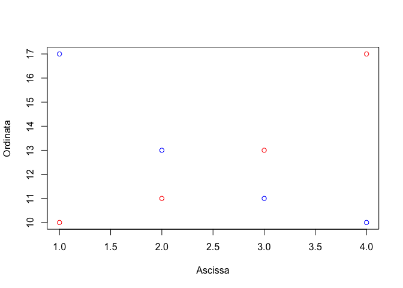

# Premessa {-}

Placeholder


## Obiettivi {-}
## Organizzazione  {-}
## Software statistico {-}
## Gli autori {-}
## Ringraziamenti e scuse {-}

<!--chapter:end:index.Rmd-->


# Scienza e pseudo-scienza

Placeholder


## Scienza = dati
## Dati 'buoni' e 'cattivi'
## Dati 'buoni' e metodi 'buoni'
## Il principio di falsificazione
## Falsificare un risultato
## Elementi fondamentali del disegno sperimentale
### Controllo degli errori
### Replicazione
### Randomizzazione
### Esperimenti invalidi
#### Cattivo controllo degli errori
#### 'Confounding' e correlazione spuria
#### Pseudo-repliche e randomizzazione poco attenta
## Chi valuta se un esperimento è attendibile?
## Conclusioni
## Altre letture

<!--chapter:end:01-introBiometria.Rmd-->


# Progettare un esperimento

Placeholder


## Gli elementi della ricerca
## Ipotesi scientifica $\rightarrow$ obiettivo dell'esperimento
## Identificazione dei fattori sperimentali
### Esperimenti (multi-)fattoriali
### Controllo o testimone
## Le unità sperimentali
## Allocazione dei trattamenti
## Le variabili sperimentali
### Variabili nominali (categoriche)
### Variabili ordinali
### Variabili quantitative discrete
### Variabili quantitative continue
### Rilievi visivi e sensoriali
### Variabili di confondimento
## Esperimenti di campo
### Scegliere il campo
### Le unità sperimentali in campo
### Numero di repliche
### La mappa di campo
### Lay-out sperimentale
#### Disegni completamente randomizzati
#### Disegni a blocchi randomizzati
#### Disegni a quadrato latino
#### Disegni a split-plot
#### Disegni a strip-plot
## Altre letture

<!--chapter:end:02-ProgettoRicerca.Rmd-->


# Richiami di statistica descrittiva

Placeholder


## Descrizione di dati quantitativi
### Indicatori di tendenza centrale
### Indicatori di dispersione
### Incertezza delle misure derivate
### Relazioni tra variabili quantitative: correlazione
## Descrizione di dati qualitativi
### Distribuzioni di frequenze e classamento
### Statistiche descrittive per le distribuzioni di frequenze 
### Distribuzioni di frequenza bivariate: le tabelle di contingenze
### Connessione
## Statistiche descrittive con R
### Descrizione dei sottogruppi
### Distribuzioni di frequenze e classamento
### Connessione
## Altre letture

<!--chapter:end:03-StatisticaDescrittiva.Rmd-->


# Modelli statistici ed analisi dei dati

Placeholder


## Verità 'vera' e modelli deterministici
## Genesi deterministica delle osservazioni sperimentali
## Errore sperimentale e modelli stocastici
### Funzioni di probabilità
### Funzioni di densità
### La distribuzione normale (curva di Gauss)
## Modelli 'a due facce'
## E allora?
## Le simulazioni Monte Carlo
## Analisi dei dati e 'model fitting'
## Modelli stocastici non-normali
## Altre letture

<!--chapter:end:04-ModelliSperimentazione.Rmd-->


# Stime ed incertezza

Placeholder


## Esempio: una soluzione erbicida
### Analisi dei dati: stima dei parametri
### La 'sampling distribution'
### L'errore standard
## Stima per intervallo
## L'intervallo di confidenza
## Qual è il senso dell'intervallo di confidenza?
## Come presentare i risultati degli esperimenti
## Alcune precisazioni
### Campioni numerosi e non
### Popolazioni gaussiane e non 
## Analisi statistica dei dati: riassunto del percorso logico
## Da ricordare
## Per approfondire un po'...
## *Coverage* degli intervalli di confidenza
### Intervalli di confidenza per fenomeni non-normali
## Altre letture

<!--chapter:end:05-InferenzaStatistica.Rmd-->


# Decisioni ed incertezza

Placeholder


## Confronto tra due medie: il test t di Student
### L'ipotesi nulla e alternativa
### La statistica T
### Simulazione Monte Carlo
### Soluzione formale
### Interpretazione del P-level
### Tipologie alternative di test t di Student
## Confronto tra due proporzioni: il test $\chi^2$
### Simulazione Monte Carlo
### Soluzione formale
## Conclusioni e riepilogo
## Altre letture

<!--chapter:end:06-TestIpotesi.Rmd-->


# Modelli ANOVA ad una via

Placeholder


## Caso-studio: confronto tra erbicidi in vaso
## Descrizione del dataset
## Definizione di un modello lineare
## Parametrizzazione del modello
## Assunzioni di base
## Fitting del modello: metodo manuale
### Stima dei parametri
### Calcolo dei residui
### Stima di $\sigma$
## Scomposizione della varianza
## Test d'ipotesi
## Inferenza statistica
## Fitting del modello con R
## Medie marginali attese
## Per concludere ...
## Altre letture

<!--chapter:end:07-ANOVAunaVia.Rmd-->


# La verifica delle assunzioni di base

Placeholder


## Violazioni delle assunzioni di base
## Procedure diagnostiche
## Analisi grafica dei residui
### Grafico dei residui contro i valori attesi
### QQ-plot
## Test d'ipotesi
## Risultati contraddittori
## 'Terapia'
### Correzione/Rimozione degli outliers
### Correzione del modello
### Trasformazione della variabile indipendente
### Impiego di metodiche statistiche avanzate
### Trasformazioni stabilizzanti
## Esempio 1
## Esempio 2
## Altre letture

<!--chapter:end:08-AssunzioniBase.Rmd-->


# Contrasti e confronti multipli

Placeholder


## Esempio
## I contrasti
## I contrasti con R
## I confronti multipli a coppie (pairwise comparisons)
## Display a lettere
## Tassi di errore per confronto e per esperimento
## Aggiustamento per la molteplicità
## E le classiche procedure di confronto multiplo?
## Consigli pratici
## Altre letture

<!--chapter:end:09-ConfrontoMultiplo.Rmd-->


# Modelli ANOVA con fattori di blocco

Placeholder


## Caso-studio: confronto tra erbicidi in campo
## Definizione di un modello lineare
## Stima dei parametri
### Coefficienti del modello
### Stima di $\sigma$
## Scomposizione della varianza
## Adattamento del modello con R
## Disegni a quadrato latino
## Caso studio: confronto tra metodi costruttivi
## Definizione di un modello lineare

<!--chapter:end:10-MultiWayANOVAModels.Rmd-->


# La regressione lineare semplice

Placeholder


## Caso studio: effetto della concimazione azotata al frumento
## Analisi preliminari
## Definizione del modello lineare
## Stima dei parametri
## Valutazione della bontà del modello
### Valutazione grafica
### Errori standard dei parametri
### Test F per la mancanza d'adattamento
### Test F per la bontà di adattamento
### Coefficiente di determinazione
## Previsioni
## Disegni a blocchi randomizzati
## Altre letture

<!--chapter:end:11-LinearRegression.Rmd-->


# Modelli ANOVA a due vie con interazione

Placeholder


## Il concetto di ’interazione’
## Effetti incrociati: interazione tra lavorazioni e diserbo chimico
## Definizione del modello lineare
## Calcoli manuali
### Scomposizione della varianza
## Calcoli con R
### Model fitting
### Verifica delle assunzioni di base
### Scomposizione della varianza
### Medie marginali attese e confronti multipli con R
## Effetti innestati: valutazione di ibridi di mais
## Definizione del modello lineare
## Fitting del modello con R

<!--chapter:end:12-AnovaDueLivelli.Rmd-->


# Breve introduzione ai modelli misti

Placeholder


## Raggruppamenti tra parcelle
## Esperimenti a split-plot
### Definizione del modello lineare
### Model fitting con R
## Esperimenti a strip-plot
### Definizione del modello lineare
### Model fitting con R
## Altre letture

<!--chapter:end:13-SplitStrip.Rmd-->


# La regressione non-lineare

Placeholder


## Caso studio: degradazione di un erbicida nel terreno
## Scelta della funzione
## Stima dei parametri
### Linearizzazione della funzione
### Approssimazione della vera funzione tramite una polinomiale in X
### Minimi quadrati non-lineari
## La regressione non-lineare con R
## Verifica della bontà del modello
### Analisi grafica dei residui
### Test F per la mancanza di adattamento (approssimato)
### Errori standard dei parametri
### Coefficiente di determinazione
## Funzioni lineari e nonlineari dei parametri
## Previsioni		 
## Gestione delle situazioni 'patologiche'
### Trasformazione del modello
### Trasformazione dei dati
## Per approfondire un po'...
### Riparametrizzazione delle funzioni non-lineari
### Altre letture

<!--chapter:end:14-NonLineare.Rmd-->


# Esercizi

Placeholder


## Il disegno degli esperimenti (Cap. 1 e 2)
### Domanda 1
### Domanda 2
### Domanda 3
### Domanda 4
### Domanda 5
### Domanda 6
### Domanda 7
### Domanda 8
### Domanda 9
### Domanda 10
### Domanda 12
### Domanda 13
### Esercizio 1
### Esercizio 2
### Esercizio 3
### Esercizio 4
### Esercizio 5
## Statistica descrittiva (Cap. 3)
### Domanda 1
### Domanda 2
### Domanda 3
### Domanda 4
### Esercizio 1
### Esercizio 2
### Esercizio 3
### Esercizio 4
### Esercizio 5
## Modelli statistici (Cap. 4)
### Esercizio 1
### Esercizio 2
### Esercizio 3
### Esercizio 4
### Esercizio 5
### Esercizio 6
### Esercizio 7
### Esercizio 8
### Esercizio 9
### Esercizio 10
## Stima dei parametri (Cap. 5)
### Esercizio 1
### Esercizio 2
### Esercizio 3
### Esercizio 4
### Esercizio 5
### Esercizio 6
## Inferenza (Cap. 6)
### Esercizio 1
### Esercizio 2
### Esercizio 3
### Esercizio 4
### Esercizio 5
### Esercizio 6
### Esercizio 7
### Esercizio 8
### Esercizio 9
### Esercizio 10
### Esercizio 11
## Modelli ANOVA ad una via (Cap. da 7 a 9)
### Esercizio 1 
### Esercizio 2
### Esercizio 3
### Esercizio 4
## ANOVA a due vie (Cap. 10)
### Esercizio 1
### Esercizio 2
### Esercizio 3
## Regressione (Cap. 11)
### Esercizio 1
### Esercizio 2
## ANOVA a due vie con interazione (Cap. 12 e 13)
### Esercizio 1
### Esercizio 2
### Esercizio 3
### Esercizio 4
### Esercizio 5
### Esercizio 6
## Regressione non-lineare (Cap. 14)
### Esercizio 1
### Esercizio 2
### Esercizio 3
### Esercizio 4
### Esercizio 5
### Esercizio 6
### Esercizio 7

<!--chapter:end:15-Esercizi.Rmd-->

# Appendice: breve introduzione ad R


## Cosa è R?

R è un software cugino di S-PLUS, con il quale condivide la gran parte delle procedure ed una perfetta compatibilità. Rispetto al cugino più famoso, è completamente freeware (sotto la licenza GNU General Public Licence della Free Software Foundation) ed è nato proprio per mettere a disposizione degli utenti uno strumento gratuito, potente, che permette di lavorare in modo estremamente professionale, senza usare software di frodo. Inoltre, si tratta di un programma *Open Source*, cioè ognuno può avere accesso al suo codice interno ed, eventualmente, proporne modifiche o ampliarne le funzionalità programmando apposite librerie aggiuntive.

A fronte di questi vantaggi, bisogna tuttavia considerare il fatto che R, almeno all'inizio, presenta alcune difficoltà legate al fatto che manca una vera e propria interfaccia grafica (Graphical User Interface: GUI) e, di conseguenza, ogni operazione deve essere eseguita digitando il codice necessario. Parte di queste difficoltà possono essere alleviate utilizzando R dall'interno di RStudio, un'interfaccia che garantisce una più facile digitazione del codice. Per questo motivo, dopo aver installato R [da questo link](https://cran.r-project.org), è opportuno installare anche RStudio, da [quest'altro link](https://posit.co). 

## Prima di iniziare

Ci sono alcune nozioni che è bene conoscere prima di mettersi al lavoro con R. Riassumiamole:

1. *Case sensitivity*. Per evitare noiosi errori che possono essere molto comuni per chi è abituato a lavorare in ambiente WINDOWS, è bene precisare subito che R, come tutti i linguaggi di derivazione UNIX, è *case sensitive*, cioè distingue tra lettere maiuscole e lettere minuscole.
2. Spazi. Gli spazi possono essere aggiunti ovunque nel codice per renderlo più leggibile. Tuttavia, non si possono aggiungere spazi all'interno dei nomi delle funzioni, dei nomi degli oggetti e degli operatori composti da più di un carattere.
3. Pannelli. In RStudio, ci sono quattro pannelli e noi ne utilizzeremo prevalentemente due, denominati, rispettivamente SOURCE e CONSOLE. Il codice si scrive nel pannello SOURCE, che è un semplice editor di testi, salvabili con l'estensione '.R'. Il codice composto nel pannello SOURCE *DEVE* essere inviato alla console, dove viene eseguito, utilizzando i tasti 'ctrl-r' (Windows) oppure 'ctrl-invio' (Windows) o 'cmd-invio' (Mac). **Se il codice non è inviato alla console non viene eseguito: è come scrivere un messaggio in Whattsapp**, senza inviarlo al destinatario!
4. Operatori. In informatica e programmazione, un operatore è un simbolo che specifica quale operazione applicare ad uno o più operandi, per generare un risultato. Si distinguono in (1) aritmetici (+, -, * e /); (2) di assegnazione (<- oppure =); (3) logici (TRUE, FALSE, & e |); (4) Condizionali (if); (5) di relazione (<, <=, ==, >= e >)
5. Tipi di dati. In R, abbamo dati (1) numerici a doppia precisione; (2) 'integer'; (3) carattere (con virgolette, ad es. "Germinato", "Non germinato") e (4) logici (TRUE o FALSE, T o F).

## Oggetti e assegnazioni

In R, si lavora creando ed assegnando loro un nome, che identifica la porzione di memoria in cui questo oggetto viene collocato. Nel principio, questo è molto simile a quello che facciamo in un foglio elettronico, dove assegniamo un oggetto (lo memorizziamo) in una determinata cella. Ad esempio, il comando:


```r
y  <-  3
```

assegna al valore numerico 3 il nome *y*. Invece il comando:


```r
x  <-  "Biondo"
```

assegna al testo "Biondo" il nome *x*.

Gli oggetti che possiamo creare sono di diverso tipo, principalmente:

1. costanti,
2. vettori,
3. matrici,
4. dataframes.

### Costanti e vettori

Le costanti sono, ad esempio, quelle indicate in precedenza, ma, solitamente, in R si creano oggetti più organizzati, come i 'vettori', cioè degli elenchi di dati dello stesso tipo. Ad esempio, il codice segente crea un vettore di nome x, contenente i numeri 1, 2 e 3. Bisogna precisare che il 'vettore', in R, non ha alcun legame con la fisica o l'algebra, ed è semplicemente una collezione di elementi affini.


```r
x <- c(1, 2, 3)
```

Oltre che numerici, i vettori possono contenere testi alfanumerici. Ad esempio, nel codice sottostante abbiamo creato un vettore contenente nomi di persona.


```r
nomi <- c("Andrea", "Luca", "Sandro", "Mario")
nomi
```

```
## [1] "Andrea" "Luca"   "Sandro" "Mario"
```

Un oggetto leggermente diverso è il fattore sperimentale ('factor'), che contiene caratteri alfanumerici (come nel caso precedente), ma rappresenta una variabile qualitativa di classificazione in categorie.


```r
classe <- factor(c("Uomo", "Uomo", "Donna", "Donna", "Donna"))
classe
```

```
## [1] Uomo  Uomo  Donna Donna Donna
## Levels: Donna Uomo
```


### Matrici

Oltre ai vettori, in R possiamo definire le matrici. Ad esempio il comando:


```r
z  <-  matrix(c(1, 2, 3, 4, 5, 6, 7, 8), nrow = 2, ncol = 4, 
              byrow = TRUE)
```

crea una matrice *z* a 2 righe e 4 colonne, contenente i numeri da 1 a 8. La matrice viene riempita per riga.

### Dataframe

Oltre a vettori e matrici, in R esiste un altro importante oggetto, cioè il *dataframe*, costituito da una tabella di dati con una o più colonne di variabili e una o più righe di dati. A differenza della matrice, il dataframe può essere utilizzato per memorizzare variabili di diverso tipo (numeri e caratteri). Un dataframe può essere creato unendo più vettori, come nell'esempio seguente; fare attenzione a non confondere il nome assegnato alla colonna, con il nome del vettore il cui contenuto viene immesso nella colonna stessa (nel codice sottostante, "Parc" = parcelle significa che la prima colonna della tabella si chiama "Parc" e contiene i dati del vettore 'parcelle').


```r
parcelle  <-  c(1, 2, 3, 4, 5, 6)
tesi  <-  factor(c("A", "A", "B", "B", "C", "C"))
dati  <-  c(12, 15, 16, 13, 11, 19)
tabella  <-  data.frame("Parc" = parcelle, "Tesi" = tesi,
                        "Produzioni" = dati)
```

Per visualizzare un oggetto basta invocare il suo nome:


```r
z
```

```
##      [,1] [,2] [,3] [,4]
## [1,]    1    2    3    4
## [2,]    5    6    7    8
```

oppure:


```r
tabella
```

```
##   Parc Tesi Produzioni
## 1    1    A         12
## 2    2    A         15
## 3    3    B         16
## 4    4    B         13
## 5    5    C         11
## 6    6    C         19
```

### Indicizzazione

Vettori, matrici e dataframe sono oggetti organizzati caratterizzati da una o due dimensioni. Gli elementi che sono in essi contenuti possono essere identificati per mezzo di 'indici', un po' come avviene nella battaglia navale. Gli indici sono inclusi tra parentesi quadre. Ad esempio, il secondo elemento del vettore 'x' creato in precedenza può essere richiamato in questo modo:


```r
x[2]
```

```
## [1] 2
```

Nel caso delle matrici e dei dataframes, che sono oggetti bidimensionali, gli indici sono due, uno per le righe e uno per le colonne, separati da virgole:


```r
tabella[2,1]
```

```
## [1] 2
```

Per questi oggetti bidimensionali, è possibile anche accedere agli elementi di un'intera riga o di un'intera colonna, lasciando vuoto l'indice relativo ad una delle due dimensioni. Ad esempio:


```r
tabella[,1]
```

```
## [1] 1 2 3 4 5 6
```

oppure:


```r
tabella[1,]
```

```
##   Parc Tesi Produzioni
## 1    1    A         12
```

Per un dataframe, si può accedere alle singole colonne utilizzando l'estrattore *$* seguito dal nome della colonna, ad esempio:


```r
tabella$Parc
```

```
## [1] 1 2 3 4 5 6
```


## Espressioni e funzioni

Gli oggetti numerici possono essere creati e manipolati anche con opportune operazioni algebriche (espressioni), utilizzando gli operatori indicati in precedenza. Ad esempio:


```r
f  <-  2 * y
f
```

```
## [1] 6
```

Le operazioni più complesse ed usuali sono implementate in apposite funzioni, che hanno un nome ed uno o più argomenti. Ad esempio, la funzione:


```r
abs(-5)
```

```
## [1] 5
```

restituisce il valore assoluto e richiede un solo argomento, cioè il numero di cui calcolare il valore assoluto. Al contrario, la funzione:


```r
log(100, 2)
```

```
## [1] 6.643856
```

Calcola il logaritmo in base 2 di 100 e richiede due argomenti, cioè il numero di cui calcolare il logaritmo e la base del logaritmo. A volte, gli argomenti hanno valori di default, per cui, se digitiamo:


```r
log(5)
```

```
## [1] 1.609438
```

otteniamo il logaritmo naturale di 5, in quanto il secondo argomento (la base) ha, per default, il valore $e$ (operatore di Nepero).

Quando sono necessari due o più argomenti essi debbono essere messi nell'ordine esatto in cui R se li aspetta (in questo caso prima il numero, poi la base), oppure possono essere specificati per nome. Ad esempio, i due comandi:


```r
log(x=100, base=2)
```

```
## [1] 6.643856
```

```r
log(base=2, x=100)
```

```
## [1] 6.643856
```

restituiscono lo stesso risultato, al contrario dei due comandi seguenti:


```r
log(100, 2)
```

```
## [1] 6.643856
```

```r
log(2, 100)
```

```
## [1] 0.150515
```

perchè il primo restituisce il logaritmo di 100 in base 2, mentre il secondo restituisce il logaritmo di 2 in base 100. Per conoscere gli argomenti di una funzione ed il loro ordine, si può digitare il nome della funzione preceduto dal punto interrogativo:

```
?log
```

A volte le funzioni restituiscono diversi risultati, che vengono messi in appositi 'slots'. Ad esempio, se vogliamo calcolare autovettori ed autovalori di una matrice, utilizziamo la funzione 'eigen()'. Questa funzione restituisce una lista che, al suo interno, contiene i due oggetti, denominati, rispettivamente, 'values' (autovalori) e 'vectors' (autovettori). Per recuperare l'uno o l'altro dei due oggetti (autovettori o autovalori) si usa l'estrattore '$', come abbiamo visto prima per le colonne dei dataframes:


```r
matrice  <-  matrix(c(2,1,3,4),2,2)
ev  <-  eigen(matrice)
ev$values
```

```
## [1] 5 1
```

```r
ev$vectors
```

```
##            [,1]       [,2]
## [1,] -0.7071068 -0.9486833
## [2,] -0.7071068  0.3162278
```


## Funzioni di uso comune

Nella pratica operativa, ci troviamo spesso nelle condizioni di creare una serie di numeri progressivi, utilizzando il comando `seq(n, m, by=step)`, che genera una sequenza da $n$ a $m$ con passo pari a $step$. Il codice sottostante crea una serie da 1 a 12.


```r
options(width = 55)
parcelle  <-  seq(1, 12, 1)
parcelle
```

```
##  [1]  1  2  3  4  5  6  7  8  9 10 11 12
```

Altre volte, abbiamo la necessità di creare vettori, ripetendo più volte alcune categorie. Ad esempio, potremmo avere quattro osservazioni che appartengono alla varietà BAIO, quattro osservazioni che appartengono alla varietà DUILIO e quattro osservazioni che appartengono alla varietà PLINIO. Per creare velocemente questo vettore, possiamo utilizzare la funzione `rep() `, in questo modo:


```r
tesi  <-  factor(c("BAIO", "DUILIO", "PLINIO"))
tesi
```

```
## [1] BAIO   DUILIO PLINIO
## Levels: BAIO DUILIO PLINIO
```

```r
rep(tesi, each=4)
```

```
##  [1] BAIO   BAIO   BAIO   BAIO   DUILIO DUILIO DUILIO
##  [8] DUILIO PLINIO PLINIO PLINIO PLINIO
## Levels: BAIO DUILIO PLINIO
```

Notare l'uso della funzione `factor() ` per creare un vettore di dati qualitativi (fattore sperimentale). Notare anche che il codice sottostante restituisce lo stesso risultato, ma ordinato in modo diverso, in quanto viene ripetuto l'intero vettore, non i singoli elementi che lo costituiscono:


```r
rep(tesi, times = 4)
```

```
##  [1] BAIO   DUILIO PLINIO BAIO   DUILIO PLINIO BAIO  
##  [8] DUILIO PLINIO BAIO   DUILIO PLINIO
## Levels: BAIO DUILIO PLINIO
```

Un'altra funzione molto usata è 'str()' che permette di avere informazioni sulla struttura di un oggetto creato in R:


```r
str(tabella)
```

```
## 'data.frame':	6 obs. of  3 variables:
##  $ Parc      : num  1 2 3 4 5 6
##  $ Tesi      : Factor w/ 3 levels "A","B","C": 1 1 2 2 3 3
##  $ Produzioni: num  12 15 16 13 11 19
```

R ci informa che l'oggetto 'tabella' è in realtà un dataframe composto da tre colonne, di cui la prima e la terza sono numeriche, mentre la seconda è una variabile qualitativa (fattore).

Altre informazioni riassuntive su un oggetto possono essere ottenute con la funzione  'summary()', che fornisce un output diverso a seconda dell'oggetto che le viene passato come argomento:


```r
summary(nomi)
```

```
##    Length     Class      Mode 
##         4 character character
```

```r
summary(classe)
```

```
## Donna  Uomo 
##     3     2
```

```r
summary(tabella)
```

```
##       Parc      Tesi    Produzioni   
##  Min.   :1.00   A:2   Min.   :11.00  
##  1st Qu.:2.25   B:2   1st Qu.:12.25  
##  Median :3.50   C:2   Median :14.00  
##  Mean   :3.50         Mean   :14.33  
##  3rd Qu.:4.75         3rd Qu.:15.75  
##  Max.   :6.00         Max.   :19.00
```

Tra le funzioni di uso comune, citiamo quelle che si impiegano per fare alcune semplici operazioni su un dataframe, come l'ordinamento o la selezione di records. Ad esempio, è possibile estrarre da un dataframe un subset di dati utilizzando la funzione 'subset()':


```r
tabella2  <-  subset(tabella, Tesi == "A" | Tesi == "C")
tabella2
```

```
##   Parc Tesi Produzioni
## 1    1    A         12
## 2    2    A         15
## 5    5    C         11
## 6    6    C         19
```

Notare il carattere "|" che esprime la condizione logica OR. La condizione logica AND si esprime con il carattere "&". L'esempio seguente isola i record in cui le varietà sono A o C e, contemporaneamente, la produzione è minore di 19.


```r
tabella3  <-  subset(tabella, Tesi == "A" | Tesi == "C" & 
                       Produzioni < 19)
tabella3
```

```
##   Parc Tesi Produzioni
## 1    1    A         12
## 2    2    A         15
## 5    5    C         11
```


Un vettore (numerico o carattere) può essere ordinato con la funzione 'sort()':


```r
y  <-  c(12, 15, 11, 17, 12, 8, 7, 15)
sort(y, decreasing = FALSE)
```

```
## [1]  7  8 11 12 12 15 15 17
```

```r
z  <-  c("A", "C", "D", "B", "F", "L", "M", "E")
sort(z, decreasing = TRUE)
```

```
## [1] "M" "L" "F" "E" "D" "C" "B" "A"
```

Un dataframe può essere invece ordinato con la funzione `order()`, facendo attenzione al segno meno utilizzabile per l'ordinamento decrescente.

```
dataset[order(dataset$z, dataset$y), ]
dataset[order(dataset$z, -dataset$y), ]
```

## Creazione di funzioni personalizzate

Anche se R contiene tantissime funzioni, a volte ci troviamo nella necessità di creare una funzione personale, se questa non fosse già disponibile. Immaginiamo, ad esempio, di voler scrivere una funzione che, dato il valore della produzione rilevata in una parcella di orzo di 20 $ m^2 $ (in kg) e la sua umidità percentuale, calcoli automaticamente il valore della produzione secca in kg/ha. La funzione che dobbiamo implementare è:

$$ PS = PU \cdot \frac{100 - U}{100} \cdot \frac{10000}{20}$$

dove PS è la produzione secca in kg/ha e PU è la produzione in kg per 20 $ m^2 $ con l'umidità percentuale U. Il codice è: 


```r
PS  <-  function(PU, U) {
  PU*((100-U)/100)*(10000/20)
}
```

Notare l'uso delle parentesi graffe. Una volta creata ed inviata alla console, la funzione può essere utilizzata come ogni altre funzione di R:


```r
PS(PU = 20, U = 85)
```

```
## [1] 1500
```

## Uso di librerie aggiuntive

Le funzionalità di R possono essere anche estese installando librerie aggiuntive. Il comando è:

```
install.packages("NomeLibreria")
```


Un libreria si installa 'una tantum', ma va caricata ogni volta che la si vuole usare:

```
library("NomeLibreria")
```


## Workspace


Gli oggetti creati durante una sessione di lavoro vengono memorizzati nel cosiddetto workspace (ambiente di lavoro). Per il salvataggio del workspace nella directory corrente si usa il menu (File/Save Workspace) oppure il comando:

```
save.image('nomefile.RData')
```

Il contenuto del workspace viene visualizzato con:

```
ls()
```

Il workspace viene richiamato da menu (File/Open Workspace) oppure con il comando:

```
load('nomefile.RData')
```

Per un lavoro efficiente in R è bene tenere il workspace molto pulito, eliminando gli oggetti non necessari. La completa eliminazione degli oggetti nel workspace si esegue con:

```
rm(list=ls())
```

Uno o più oggetti specifici possono essere eliminati con:

```
rm(oggetto1, oggetto2, .....)
```

Gli oggetti possono anche essere richiamati in base alla loro posizione; ad esempio il comando:

```
rm(list=ls()[3:4])
```

elimina il terzo e il quarto oggetto dal workspace.

Un comando particolarmente utile è il seguente:

```
rm(list=ls()[ls()!="oggetto1"])
```

che permette di eliminare dal workspace ogni oggetto meno "oggetto1". Si possono utilizzare anche clausole logiche più articolate come la seguente:

```
rm(list=ls()[ls()!="oggetto1" & ls()!="oggetto2"])
```

che elimina tutto meno "oggetto1" e "oggetto2".


## Importare dati esterni

Oltre che immessi da tastiera, i dati possono essere importati in R da files esterni, ad esempio in formato EXCEL. Per essere importata, una tabella deve essere in formato 'ordinato' (tidy data), vale a dire:

1. la prima riga dovrebbe contenere i nomi delle colonne
2. ci dovrebbe essere una riga per ogni soggetto
3. ci dovrebbe essere una colonna per ogni attributo dei soggetti

Detto ciò, avremo bisogno di una libreria addizionale, che dovremo installare ('una tantum') e poi caricare in memoria, utilizzando il codice sottostante:


```r
# install.packages("readxl") # solo la prima volta
library(readxl)
```

A questo punto, in R, possiamo digitare il seguente comando, che permette di selezionare un file, tramite una 'form' di selezione e, da questo, importare il foglio di lavoro con il nome 'Foglio1'.

```
dati <- read_xlsx(file.choose(), sheet = "Foglio1")
dati
```

Per importare un file di testo (ad esempio in formato *comma delineated*, cioè *.csv*) si utilizza il seguente comando:

```
dataset <- read.csv("NomeFile.csv", sep = ";", dec = ",")
```

dove gli argomenti 'sep' e 'dec' permettono di specificare, rispettivamente, il separatore di elenco e il separatore decimale. E' possibile anche esportare un dataframe in un file di testo, con il codice seguente:

```
write.table(nomeDataframe, file = "residui.csv", 
             row.names=FALSE, 
             sep=";", dec = ",")
```


## Cenni sulle funzionalità grafiche in R

R è un linguaggio abbastanza potente e permette di creare grafici interessanti. Ovviamente un trattazione esauriente esula dagli scopi di questo testo, anche se è opportuno dare alcune indicazioni che potrebbero essere utili in seguito.

La funzione più utilizzata per produrre grafici è:

```
plot(x, y, type, xlab, ylab, col)
```

dove x ed y sono i vettori con le coordinate dei punti da disegnare, 'type' rappresenta il tipo di grafico (''p'' produce un grafico a punti, ''l'' un grafico a linee, ''b'' disegna punti uniti da linee, ''h'' disegna istogrammi), 'xlab' e 'ylab' le etichette degli assi, 'col' è il colore dei punti/linee.

Per una descrizione più dettagliata si consiglia di consultare la documentazione on line. A titolo di esempio, i comandi mostrati qui sotto producono l'output in Figura \@ref(fig:figName231).


```r
x  <-  c(1, 2, 3, 4)
y  <-  c(10, 11, 13, 17)
plot(x, y, type = "p", col="red", xlab="Ascissa", ylab="Ordinata")
```

<div class="figure" style="text-align: center">

<p class="caption">(\#fig:figName231)Esempio di un semplice grafico a dispersione</p>
</div>

Per sovrapporre una seconda serie di dati alla prima possiamo utilizzare la funzione 'plot()', come sopra e, successivamente la funzione 'points()' per aggiungere la nuova serie. Il risultato è quello mostrato in Figura \@ref(fig:figName232).


```r
y2  <-  c(17,13,11,10)
plot(x, y, type = "p", col="red", xlab="Ascissa", ylab="Ordinata")
points(x, y2, col="blue")
```

<div class="figure" style="text-align: center">

<p class="caption">(\#fig:figName232)Esempio di grafico con due serie di dati</p>
</div>

Se avessimo voluto sovrapporre un grafico a linee avremmo potuto utilizzare la funzione 'lines()' al posto della funzione 'points()', ottenendo l'output in Figura \@ref(fig:figName233).


```r
plot(x, y, "p", col="red", xlab="Ascissa", ylab="Ordinata")
points(x, y2, col="blue")
lines(x, y2, col="blue")
```

<div class="figure" style="text-align: center">

<p class="caption">(\#fig:figName233)Esempio di grafico con due serie di dati, con linee e punti</p>
</div>

Per disegnare una curva si può utilizzare la funzione 'curve()' ottenendo, ad esempio, l'output in Figura \@ref(fig:figName233b).


```r
curve(5 + 4 * x + 2 * x^2, from = -15, to = 15, ylab = "y")
```

<div class="figure" style="text-align: center">

<p class="caption">(\#fig:figName233b)Esempio di una parabola</p>
</div>


Un grafico a barre può essere ottenuto con il codice indicato più sotto, che produce il grafico in Figura \@ref(fig:figName234) e che è di facile interpretazione.


```r
Produzioni <- c(10, 12, 13, 15, 17)
Genotipo <- c("A", "B", "C", "D", "E")
barplot(Produzioni, names.arg = Genotipo,
        ylab = "Produzioni (t/ha)",
        main = "Produzioni di diversi genotipi di mais")
```

<div class="figure" style="text-align: center">

<p class="caption">(\#fig:figName234)Esempio di grafico a barre</p>
</div>


L'ultima cosa che desideriamo menzionare è la possibilità di disegnare grafici a torta, utilizzando il comando:

```
pie(vettoreNumeri, vettoreEtichette, vettoreColori)
```

Ad esempio il comando sottostante, produce l'output in Figura \@ref(fig:figName235).


```r
pie(c(20,35,45),label=c("A", "B", "C"),
        col=c("blue", "green", "red"))
```

<div class="figure" style="text-align: center">

<p class="caption">(\#fig:figName235)Esempio di grafico a torta</p>
</div>

---

## Altre letture {-}


1. Maindonald J. Using R for Data Analysis and Graphics - Introduction, Examples and Commentary. (PDF, data sets and scripts are available at [JM's homepage](https://cran.r-project.org/doc/contrib/usingR.pdff).
2. Oscar Torres Reina, 2013. Introductio to RStudio (v. 1.3). [This homepage](https://dss.princeton.edu/training/RStudio101.pdf)

<!--chapter:end:17-IntroduzioneR.Rmd-->

