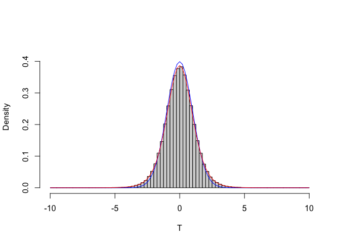

# Introduzione {-}

Placeholder


## Organizzazione del testo {-}
## Gli autori {-}
## Pre-requisiti {-}

<!--chapter:end:index.Rmd-->


# Scienza e pseudo-scienza

Placeholder


## Introduzione
### Cosa è quindi una prova scientifica?
##  Esperimenti buoni e cattivi!
### L'errore sperimentale
### Il campionamento
## Scienza = metodo
## Chi valuta se un esperimento è attendibile?
## Il metodo sperimentale
## Metodi sperimentali validi ed invalidi
### Primo esperimento
### Secondo esperimento
### Terzo esperimento
### Quarto esperimento: quello buono
## Incertezza residua
## Il ruolo della statistica
## Conclusioni

<!--chapter:end:01-introBiometry.Rmd-->


# Esperimenti validi ed invalidi

Placeholder


## Definizioni
## Elementi fondamentali del disegno sperimentale
### Primo elemento: controllo degli errori
#### Campionamento rappresentativo
#### Omogeneità
#### Rigore
#### Evitare le 'intrusioni demoniache'
### Secondo elemento: replicazione
### Terzo elemento: randomizzazione
#### Gradienti e blocking
#### E se ricercatori/soggetti sono influenzabili?
### Esperimenti non validi
#### Cattivo controllo degli errori
#### 'Confounding' e correlazione spuria
#### Pseudo-repliche e randomizzazione poco attenta
## Conclusione
## Per approfondimenti

<!--chapter:end:02-IntroExpMethods.Rmd-->


# Progettare un esperimento

Placeholder


## Ipotesi scientifica $\rightarrow$ obiettivo dell'esperimento
## Identificazione dei fattori sperimentali
### Esperimenti (multi)fattoriali
### Aggiungere un controllo?
### Fattori sperimentali di trattamento e di blocco
## Identificazione delle unità sperimentali
### Cornice di campionamento
### Scelta delle unità sperimentali
### Unità sperimentali in campo: le parcelle
## Allocazione dei trattamenti e disegno sperimentale
### Disegni completamente randomizzati
### Disegni a blocchi randomizzati
### Disegni a quadrato latino
## Scelta delle variabili da rilevare
### Variabili nominali (categoriche)
### Variabili ordinali
### Variabili quantitative discrete
### Variabili quantitative continue
### Rilievi visivi e sensoriali
### Variabili di confondimento
## Impianto delle prove
## Scrivere un progetto/report di ricerca: semplici indicazioni

<!--chapter:end:03-ResProject.Rmd-->


# Modelli matematici a 'due facce'

Placeholder


## Verità 'vera' e modelli deterministici
## Qualche esempio di modello deterministico
## Genesi deterministica delle osservazioni sperimentali
## Errore sperimentale e modelli stocastici
### Funzioni di probabilità
### Funzioni di densità
## La distribuzione normale (curva di Gauss)
## Modelli 'a due facce'
### Esercizio 1
### Esercizio 2
### Esercizio 3
### Esercizio 4
### Esercizio 5
### Esercizio 6
### Esercizio 7
## Altri modelli stocastici di interesse per lo sperimentatore
## E allora?
## Le simulazioni Monte Carlo
## Analisi dei dati e 'model fitting'

<!--chapter:end:04-ModelliSperimentazione.Rmd-->


# Esperimenti, stime ed incertezza

Placeholder


## L'analisi dei dati: gli 'ingredienti' fondamentali
## Esempio: una soluzione erbicida
### Il modello dei dati
### Analisi dei dati: stima dei parametri
### La 'sampling distribution'
### L'errore standard
## Riepilogo 1: Caratterizzare l'incertezza di un esperimento
## L'intervallo di confidenza
## Qual è il senso dell'intervallo di confidenza?
## Come presentare i risultati degli esperimenti
## Alcune precisazioni
### Campioni numerosi e non
### Popolazioni gaussiane e non 
## Analisi statistica dei dati: riassunto del percorso logico
## Da ricordare
## Esercizi

<!--chapter:end:06-InferenzaStatistica.Rmd-->

# Breve introduzione al test d'ipotesi

Nel capitolo precedente abbiamo visto come la *sampling distribution* (o *sample space* o *distribuzione campionaria*) può essere utilizzata per l'inferenza statistica (stima per intervallo). Analogamente, essa può essere utilizzata per il test d'ipotesi. Anche in questo caso, vediamo alcuni esempi, partendo da quello esposto nel capitolo precedente.


## Confronto tra una media osservata e una media teorica

Nel capitolo precedente, abbiamo misurato la concentrazione di una soluzione erbicida tramite un gascromatografo. Facendo l'analisi in triplicato, abbiamo ottenuto i tre valori riportati di seguito.


```
## [1] 125.1584 114.7349 105.6998
```

Abbiamo calcolato la media, la deviazione standard, l'errore standard e l'intervallo di confidenza. Ora immaginiamo che esista un livello soglia pari a 200 mg/l, al disopra del quale il prodotto diviene tossico per i mammiferi. Dato che non conosciamo il vero valore di $\mu$ ci chiediamo: *è possibile che le nostre tre repliche, nella realtà, provengano da una popolazione che ha media uguale a 200*?

In questo caso sappiamo bene che non è possibile, visto che abbiamo generato i dati sperimentali (vedi il capitolo precedente), tramite simulazione Monte Carlo, partendo da una verità vera nota ($\mu$ = 120 e $\sigma$ = 12); tuttavia, nella realtà, la domanda è lecita.

In particolare, possiamo calcolare una statistica, che abbiamo già utilizzato per l'intervallo di confidenza, in grado di misurare la discrepanza tra quanto abbiamo osservato e l'ipotesi nulla:

$$ T = \frac{m - 200}{s_m} $$

Il valore da noi osservato è:


```r
T <- (m - 200)/sm
T
```

```
## [1] -15.08407
```


il che implica un certo grado di discrepanza, altrimenti avremmo dovuto osservare un valore di T più vicino a 0. **Possiamo affermare che ciò sia imputabile solo alla variabilità di campionamento e che quindi il nostro esperimento conferma l’ipotesi di partenza ($\mu = 200$)**?

Definiamo quindi la nostra ipotesi di lavoro come **ipotesi nulla** ($H_0$):

$$H_0: \mu = 200$$

oppure, che è anche meglio:

$$H_0: T = 0$$

Oltre all'ipotesi nulla, dobbiamo anche definire l'ipotesi alternativa semplice (a 'due code'), che potrebbe essere:

$$H_1: T \neq 0$$

E'possibile anche definire ipotesi alternative complesse del tipo:

$$H_1: T \leq 0$$

oppure:

$$H_1: T \geq 0$$

Bisogna ricordare che le ipotesi debbono essere stabilite prima di effettuare l'esperimento. In questo caso abbiamo fatto un campionamento e abbiamo trovato un valore (115.198) inferiore a quello atteso (200). Che cosa ci attendevamo prima di fare l'esperimento? Un valore diverso da 200, senza poter lecitamente immaginare se sarebbe stato maggiore o minore? In questo caso l'ipotesi alternativa dovrebbe essere la prima (quella semplice). Avevamo invece ragionevoli motivi per ritenere che $m$ avrebbe potuto essere inferiore, ma non superiore?  In questo caso l'ipotesi alternativo potrebbe essere la seconda (ipotesi alternativa complessa). Propendiamo per quest'ultima ipotesi, cioè $\mu \leq 200$.

Siamo in totale coerenza con la logica Galileiana: abbiamo un ipotesi di partenza e un esperimento, col quale eventualmente rigettare questa ipotesi. Fisher, negli anni 20 del 1900, propose di utilizzare come **‘forza dell’evidenza scientifica’ la probabilità di ottenere un risultato uguale o più estremo di quello osservato, calcolata supponendo vera l’ipotesi nulla.** Si tratta quindi di capire, tramite la definizione di un'apposita 'sampling distribution' per T, qual è la proporzione di valori pari o inferiori a -15.084. Per rispondere utilizzeremo la doppia strada: quella empirica (simulazione Monte Carlo) e quella formale.

### Simulazione Monte Carlo

Ci chiediamo: come sarebbe la *sampling distribution* di T, se $\mu$ fosse uguale a 200? Possiamo costruirla con una simulazione Monte Carlo, ripetendo molte volte (es. 100'000) l'estrazione di campioni con numerosità pari a 3, da una distribuzione normale con media pari a 200 e deviazione standard pari a 9.738 e calcolando la statistica T. Utilizziamo questo valore di deviazione standard perché è quello osservato nel campione e, nella realtà, sarebbe l'unico valore disponibile, dato che non sapremmo nulla della popolazione originale. Per eseguire questa operazione utilizziamo il seguente codice R:


```r
set.seed(1234)
result <- rep(0, 100000)
for (i in 1:100000){
  sample <- rnorm(3, 200, s)
  result[i] <- (mean(sample) - 200) / (sd(sample)/sqrt(3))
}
```


In questo modo otteniamo 100'000 valori di T e possiamo calcolare la proporzione di questi che è pari o inferiore al valore da noi osservato (-15.084):


```r
pLev <- length(result[result < T])/100000
pLev
```

```
## [1] 0.0021
```

Eseguendo questa simulazione, otteniamo una proporzione di valori pari a 0.0021. Il risultato si riassume dicendo che il P-level per l’ipotesi nulla è pari a 0.0021. La regola di condotta della statistica tradizionale è quella di rigettare l’ipotesi nulla quando il P-level è inferiore ad una certa soglia prefissata (normalmente P $\leq$ 0.05). Di conseguenza, concludiamo che vi sono elementi sufficienti per rifiutare l’ipotesi che il valore incognito della concentrazione di erbicida sia pari a 200 mg/l.

In altre parole, l'evidenza scientifica è sufficiente buona per il rifiuto dell'ipotesi nulla, anche se esiste una certa probabilità d'errore, pari appunto alla probabilità che l'ipotesi nulla sia vera (P = 0.0021).

### Soluzione formale

Possiamo definire una distribuzione di frequenze per T? Empiricamente possiamo osservare che, analogamente al caso degli intervalli di confidenza, la distribuzione di riferimento non è normale, bensì t di Student, con due gradi di libertà.


```r
#Sampling distribution per T 
max(result);min(result)
```

```
## [1] 195.249
```

```
## [1] -169.5243
```

```r
b <- seq(-600, 600, by=0.25)
hist(result, breaks = b, freq=F, 
  xlab = expression(paste(m)), ylab="Density", 
  xlim=c(-10,10), ylim=c(0,0.45), main="")
curve(dnorm(x), add=TRUE, col="blue")
curve(dt(x, 2), add=TRUE, col="red")
```

<div class="figure" style="text-align: center">

<p class="caption">(\#fig:figName71)Sampling distribution empirica a confronto con una distribuzione normale (in rosso) e una distribuzione t di Student con due gradi di libertà</p>
</div>

Senza ricorrere alla simulazione Monte Carlo, possiamo quindi risolvere il problema utilizzando la distribuzione t di Student, nella quale cercheremo il valore di probabilità di ottenere valori di T minori o uguali a quello da noi osservato:


```r
pt(T, df=2)
```

```
## [1] 0.002183138
```


dove gli argomenti indicano rispettivamente il valore osservato. Il P-level è molto simile a quello ottenuto con la simulazione Monte Carlo.

Allo stesso valore, più semplicemente, si giunge utilizzando la funzione "t.test()":


```r
t.test(Y, mu=200, alternative="less")
```

```
## 
## 	One Sample t-test
## 
## data:  Y
## t = -15.084, df = 2, p-value = 0.002183
## alternative hypothesis: true mean is less than 200
## 95 percent confidence interval:
##      -Inf 131.6138
## sample estimates:
## mean of x 
##  115.1977
```


### Interpretazione del P-level

Quando il P-level è inferiore a 0.05, rifiutiamo l’ipotesi nulla e concludiamo che vi sono elementi sufficienti (prove scientifiche sufficientemente forti) per rifiutare la nostra ipotesi di partenza.

Bisogna sottolineare come il P-level nella statistica tradizionale sia stato inizialmente proposto da Fisher come criterio di comportamento e non come un vero e proprio criterio inferenziale-probabilistico. Successivamente, Jarzy Neyman ed Egon Pearson, intorno al 1930, proposero di utilizzare il P-level come probabilità di errore di I specie, cioè come probabilità di rifiutare erroneamente l’ipotesi nulla. Tuttavia, trattandosi di una probabilità calcolata a partire da una *sampling distribution*, cioè da un’ipotetica infinita ripetizione dell’esperimento, essa non ha alcun valore in relazione al singolo esperimento effettivamente eseguito, come i due autori menzionati in precedenza hanno esplicitamente chiarito.

Di conseguenza, nel caso in esempio, affermare che abbiamo una probabilità di errore pari a 0.0051 nel rifiutare l’ipotesi nulla, rappresenterebbe un abuso: le nostre conclusioni potrebbero essere false o vere, ma non abbiamo alcun elemento per scegliere tra le due opzioni. Possiamo solo affermare che, se ripetessimo infinite volte l’esperimento e se l’ipotesi nulla fosse vera, otterremmo un risultato estremo come il nostro o più estremo solo in 5 casi (circa) su 1000. In altre parole, nel lungo periodo, basando le nostre conclusioni sul criterio anzidetto (rifiuto l'ipotesi nulla se il P-value è inferiore a 0.05) commettiamo un errore in non più del 5% dei casi. Insomma, il P-level non può essere guardato come la probabilità di ‘falso-positivo’ ad ogni singolo test, ma solo nel lunghissimo periodo.


## Confronto tra due medie: il test t di Student

Un ricercatore ha scelto casualmente dieci piante da una popolazione; ne ha trattate cinque con l'erbicida A e cinque con il placebo P. Alla fine dell'esperimento ha determinato il peso di ognuna delle dieci piante. E' evidente che le piante oggetto dell'esperimento sono solo un campione di quelle possibili, così come è evidente che il peso, come ogni altra variabile biologica è soggetto ad una certa variabilità naturale, legata sia a questioni genotipiche che fenotipiche, oltre che ad eventuali errori casuali di misura.

I risultati sono i seguenti:


A (peso in g): 65 - 68 - 69 - 71 - 78; la media è pari a 70.2, mentre la deviazione standard è pari a 4.87. L'errore standard è pari a 2.18 e quindi l'intervallo di confidenza della media è 70.2 $\pm$ 6.04

P (peso in g): 80 - 81 - 84 - 88 - 94; la media è 85.4, mentre la deviazione standard è pari a 5.72. L'errore standard è pari a 2.56, mentre l'intervallo di confidenza per la media è 85.4 $\pm$ 7.11

Possiamo affermare che A riduce il peso delle piante trattate, coerentemente con le aspettative riguardo ad una molecola erbicida? Nel rispondere a questa domanda bisogna tener presente che i campioni sono totalmente irrilevanti, dato che il nostro interesse è rivolto alle popolazioni che hanno generato i campioni. Vogliamo cioè che le nostre conclusioni abbiano carattere di universalità e non siano specifiche a quanto abbiamo osservato nel nostro esperimento. Intanto possiamo notare che il limite di confidenza superiore per A (70.2 + 6.04 = 76.24) è inferiore al limite di confidenza inferiore per P (75.4 - 7.11 = 68.29). Questo non è un criterio sul quale basare le nostre considerazioni, ma è comunque un segno che le popolazioni da cui provengono i due campioni potrebbero essere diverse.

Per trovare un criterio decisionali più rigoroso, possiamo formulare **l'ipotesi nulla in questi termini**:

$$H_0: \mu_1 = \mu_2 = \mu$$

In altre parole, la nostra ipotesi di lavoro è che i due campioni siano in realtà estratti da due distribuzioni normali con la stessa media e la stessa deviazione standard, il che equivale a dire che i due campioni provengono da un unica distribuzione normale con media $\mu$ e deviazione standard $\sigma$.

L'ipotesi alternativa semplice può essere definita:

$$H_1 :\mu_1  \ne \mu_2$$

Se abbiamo elementi sufficienti già prima di effettuare l'esperimento (e non dopo aver visto i risultati), possiamo anche adottare ipotesi alternative complesse, del tipo

$$H_1 :\mu _1  > \mu _2$$

oppure:

$$H_1 :\mu _1  < \mu _2$$


Quale statistica potrebbe meglio descrivere l'andamento dell'esperimento, in relazione all'ipotesi nulla? E' evidente che questa statistica dovrebbe essere basata su due indicatori diversi:

1. l'entità della differenza tra le medie: più la differenza tra le due medie è alta e più è probabile che essa sia significativa;
2. l'entità dell'errore standard. Più è elevata la variabilità dei dati (e quindi l'errore di stima) più è bassa la probabilità che le differenze osservate tra le medie siano significative.

Su queste basi, si può individuare la seguente statistica:

$$T = \frac{m_1 - m_2}{SED}$$

Si può osservare che T, in realtà, non è altro che il rapporto tra le quantità indicate in precedenza ai punti 1 e 2: infatti la quantità al numeratore è la differenza tra le medie dei due campioni, mentre la quantità al denominatore è il cosiddetto errore standard della differenza tra due medie (SED). Quest'ultima quantità si può ottenere pensando che i due campioni sono estratti in modo indipendente e, pertanto, la varianza della somma (algebrica) è uguale alla somma delle varianze. La varianza delle due medie è data dal quadrato delle loro deviazioni standard, cioè dal quadrato degli errori standard (SEM). Pertanto:

$$SED^2 = SEM_1^2 + SEM_2^2$$

Sappiamo anche che il SEM si ottiene dividendo la deviazione standard di ogni campione per la radice quadrata del numero dei dati, quindi:

$$SED^2 = \frac{s_1^2}{n_1} +  \frac{s_2^2}{n_2}$$

cioè:

$$SED = \sqrt{ \frac{s_1^2}{n_1} +  \frac{s_2^2}{n_2} }$$

Possiamo anche scrivere:

$$SED = \sqrt{ \frac{s_1^2 \, n_2 + s_2^2 \, n_1}{n_1 \, n_2} }$$

e, se le varianze sono uguali ($s_1^2 = s_2^2 = s^2$), segue che: 

$$SED = \sqrt {s^2 \frac{n_1  + n_2}{n_1 \, n_2 } }$$

Se fosse anche $n_1 = n_2 =n$, potremmo scrivere:

$$SED = \sqrt{2 \, \frac{s^2}{n} } = \sqrt{2} \times SEM$$

Il valore osservato per T è quindi uguale a:

$$T = \frac{85.4 - 70.2}{3.361547} = 4.5217$$

dove il denominatore è ottenuto come:

$$SED = \sqrt{ 2.18^2 +  2.56^2 } = 3.361547$$

A questo punto avendo osservato T = 4.5217, possiamo chiederci: qual è la 'sampling distribution' per T, cioè quali valori potrebbe assumere questa statistica se ripetessimo il campionamento infinite volte, assumendo che l'ipotesi nulla fosse vera?

La sampling distribution per T potrebbe essere ottenuta empiricamente, utilizzando una simulazione Monte Carlo. Il codice da utilizzare per questa simulazione è fornito in appendice, dove si può vedere che, formalmente, la sampling distribution per T è una distribuzione t di Student, con 8 gradi di libertà (quattro per campione). Siamo quindi in grado di calcolare la probabilità di ottenere valori di T altrettanto estremi o più estremi di quello da noi osservato, tenendo però presente che il test è 'a due code'. Infatti, il T osservato è positivo, ma solo perché abbiamo scritto la differenza come $m_2 - m_1$ invece che come $m_1 - m_2$. Tuttavia, entrambe le differenze sono possibili, quindi dobbiamo considerare anche il valore reciproco -T. In altre parole, ci chiediamo qual è la possibilità di campionare da una distribuzione t di Student valori esterni all'intervallo (-4.5217; 4.5217). La risposta, con R, è piuttosto semplice da ottenere:


```r
2 * pt(T, 8, lower.tail=T)
```

```
## [1] 3.690001e-07
```

Abbiamo moltiplicato per 2 il risultato, in quanto la funzione 'dt()' fornisce la probabilità di trovare individui inferiori a -4.5217 ('lower.tail = T'). Essendo la distribuzione simmetrica, la probabilità di trovare soggetti superiori a 4.5217 è esattamente la stessa.

Vediamo che il P-level è minore di 0.05 e possiamo quindi rifiutare l'ipotesi nulla. Concludiamo che vi è un'evidenza scientifica abbastanza forte per ritenere che l'erbicida A induca una riduzione del peso delle piante trattate.

Allo stesso valore, più semplicemente, si perviene utilizzando la funzione:


```r
t.test(A, P, var.equal=T)
```

```
## 
## 	Two Sample t-test
## 
## data:  A and P
## t = -4.5217, df = 8, p-value = 0.001945
## alternative hypothesis: true difference in means is not equal to 0
## 95 percent confidence interval:
##  -22.951742  -7.448258
## sample estimates:
## mean of x mean of y 
##      70.2      85.4
```

Gli argomenti della funzione 't.test()' sono i due vettori è l'argomento 'var.equal', che in questo caso è stato settato su TRUE. Per comprendere il significato di quest'ultimo argomento, dobbiamo sapere che esistono diversi tipi di test di t. L'argomento è trattato in modo più dettagliato in appendice, ma è bene sapere che si possono presentare tre casi diversi:

1. Le misure sono prese su soggetti diversi (indipendenti) e possiamo suppore che i due campioni provengano da due popolazioni con la stessa varianza (test t omoscedastico).
2. Le misure sono prese su soggetti diversi, ma le varianze delle due popolazioni non sono ragionevolmente omogenee (test t eteroscedastico).
1. Le misure sono prese a coppia sullo stesso soggetto e non sono quindi indipendenti (test t appaiato).


Nel nostro esempio vediamo che le varianze dei campioni sono piuttosto simili e quindi  adottiamo un test t omoscedastico ('var.equal = T').

Se dovessimo supporre che i due campioni provengono da popolazioni con varianze diverse, allora dovremmo adottare un test di t esteroscedastico, con il codice che segue:


```r
t.test(A, P, var.equal=F)
```

```
## 
## 	Two Sample t-test
## 
## data:  A and P
## t = -4.5217, df = 8, p-value = 0.001945
## alternative hypothesis: true difference in means is not equal to 0
## 95 percent confidence interval:
##  -22.951742  -7.448258
## sample estimates:
## mean of x mean of y 
##      70.2      85.4
```

Se invece avessimo rilevato le misure accoppiate su quattro individui, dovremmo utilizzare un test di t appaiato, con il codice seguente:


```r
t.test(A, P, var.equal=T, paired=T)
```

```
## 
## 	Paired t-test
## 
## data:  A and P
## t = -22.915, df = 4, p-value = 2.149e-05
## alternative hypothesis: true difference in means is not equal to 0
## 95 percent confidence interval:
##  -17.04169 -13.35831
## sample estimates:
## mean of the differences 
##                   -15.2
```


## Confronto tra due proporzioni: il test $\chi^2$

Il test di t è molto utile, ma soltanto nel caso in cui si abbia a che fare con caratteri quantitativi, cioè con variabili misurate su una scala continua, per le quali sia possibile calcolare statistiche descrittive, come appunto la media. Talvolta, i ricercatori sono interessati a rilevare caratteristiche qualitative, come ad esempio lo stato di una pianta in seguito ad un trattamento (morta o viva), il colore dei semi (si ricordino i piselli verdi e gialli di Mendel) ed altre caratteristiche che non sono misurabili su una scala continua.

Avendo a che fare con variabili qualitative, l'unica statistica rilevabile è il numero di soggetti che presentano le diverse modalità. Ad esempio, immaginiamo un esperimento per verificare se un coadiuvante aumenta l'efficacia di un erbicida. In questo esperimento, utilizziamo l'erbicida da solo e miscelato con il coadiuvante su due gruppi di soggetti diversi. Nel primo gruppo (trattato con erbicida) contiamo 56 morti su 75 piante trattate, mentre nel secondo gruppo (trattato con erbicida e coadiuvante) otteniamo 48 morti su 50 piante trattate.

I risultati di questo esperimento si riducono ad una tabella di contingenza:


```r
counts <- c(56, 19, 48, 2)
tab <- matrix(counts, 2, 2, byrow = T)
row.names(tab) <- c("E", "EC")
colnames(tab) <- c("M", "V")
tab
```

```
##     M  V
## E  56 19
## EC 48  2
```


Sappiamo già che, per una tabella di contingenza, possiamo determinare una statistica che misura la connessione tra variabili (trattamento e mortalità) connessione, detta $\chi^2$. La connession è l'indicatore giusto per rispondere alla nostra domanda di ricerca; infatti ci stiamo chiedendo se la proporzione dei morti è indipendente dal tipo di trattamento oppure no.

Sappiamo che, con R, il $\chi^2$ si calcola applicando la funzione summary all'oggetto 'data.table':


```r
summary( as.table(tab) )
```

```
## Number of cases in table: 125 
## Number of factors: 2 
## Test for independence of all factors:
## 	Chisq = 9.768, df = 1, p-value = 0.001776
```

Il valore di $\chi^2$ osservato è pari a 9.768, il che indica un certo grado di connessione. Infatti, ricordimao che, in caso di indipendenza tra le variabili, $\chi^2$ dovrebbe essere zero. Tuttavia, noi non siamo interessati ai due campioni, in quanto i 125 soggetti osservati sono tratti da due popolazioni più ampie. Considerando queste due popolazioni, poniamo l'ipotesi nulla in questi termini:

$$H_o :\pi_1  = \pi_2  = \pi$$

Vediamo che, come negli altri esempio, l'ipotesi nulla riguarda i parametri delle popolazioni ($\pi_1$ e $\pi_2$), non quelli dei campioni  ($p_1$ e $p_2$). Ci chiediamo: se l'ipotesi nulla è vera ($\pi_1  = \pi_2$), qual è la sampling distribution per $\chi^2$? E soprattutto, quanto è probabile ottenere un valore alto come il nostro o più alto?

In appendice mostriamo come si possa arrivare a questo risultato con una simulazione Monte Carlo. In modo formale, si può dimostrare che, se $n$ è sufficientemente grande (n > 30), il valore osservato di $\chi^2$ segue appunto la distribuzione di probabilità $\chi^2$, con un numero di gradi di libertà $\nu$ pari al numero dei dati indipendenti, che, in questo caso, è pari ad 1. Infatti, una volta fissata una frequenza, le altre sono automaticamente definite, dovendo restituire i totali marginali. In R, possiamo utilizzare la funzione 'pchi()' per calcolare la probabilità di ottenere valori pari o superiori a 9.768:


```r
pchisq(9.76801, 1, lower.tail=F)
```

```
## [1] 0.9982243
```

Allo stesso risultato, ma in modo più semplice, è possibile pervenire utilizzando la già citata funzione 'summary()', applicata alla tabella di contingenza (vedi sopra), oppure:


```r
chisq.test(tab, correct=F)
```

```
## 
## 	Pearson's Chi-squared test with Yates' continuity correction
## 
## data:  tab
## X-squared = 8.3014, df = 1, p-value = 0.003962
```


## Conclusioni

Abbiamo visto quale strumento abbiamo a disposizione per tirare conclusioni in presenza di incertezza sperimentale. Dovrebbe essere evidente che anche le nostre conclusioni sono incerte, in quanto soggette all'errore di campionamento. In particolare, abbiamo visto che esiste un rischio di errore di prima specie, cioè rifiutare erronamente l'ipotesi nulla (falso positivo). Allo stesso modo, esiste anche un rischio di errore di II specie, cioè accettare erroneamente l'ipotesi nulla (falso negativo). Di questi due tipi di errore abbiamo parlato più diffusamente in appendice.

## Riepilogo

Lo schema di lavoro, nel test d'ipotesi, è il seguente:

1. Si formula l'ipotesi nulla;
2. Si individua una statistica che descriva l'andamento dell'esperimento, in relazione all'ipotesi nulla;
3. Si individua la sampling distribution per questa statistica, assumendo vera l'ipotesi nulla; la sampling distribution può essere empirica (ottenuta per simulazione) o teorica, scelta in base a considerazioni probabilistiche
4. Si calcola la probabilità che, essendo vera l'ipotesi nulla, si possa osservare una valore altrettanto estremo o più estremo di quello calcolato, per la statistica di riferimento;
5. Se il livello di probabilità è inferiore ad una certa soglia $\alpha$ prefissata (generalmente 0.05), si rifiuta l'ipotesi nulla.

## Esercizi

1. Uno sperimentatore ha impostato un esperimento verificare l’effetto di un fungicida (A) in confronto al testimone non trattato (B), in base al numero di colonie fungine sopravvissute. Il numero delle colonie trattate è di 200, con 180 colonie sopravvissute al trattamento. Il numero di quelle non trattate è di 100, con 50 colonie sopravvissute. Stabilire se i risultati possono essere considerati significativamente diversi, per un livello di probabilità del 5%
2. Uno sperimentatore ha impostato un esperimento per confrontare due tesi sperimentali (A, B). Per la tesi A sono stati osservate le seguenti produzioni: 9.3, 10.2, 9.7. Per la tesi B, sono state osservati valori di 12.6, 12.3 e 12.5. Stabilire se i risultati possono essere considerati significativamente diversi, per un livello di probabilità del 5%.
3. Uno sperimentatore ha impostato un esperimento per confrontare se l’effetto di un fungicida è significativo, in un disegno sperimentale con tre ripetizioni. Con il trattamento, i risultati produttivi (in t/ha) sono 65, 71 e 68. Con il non trattato, i risultati sono 54, 51 e 59. E’significativo l’effetto del trattamento fungicida sulla produzione, per un livello di probabilità di errore del 5%?
4. Immaginate di aver riscontrato che, in determinate condizioni ambientali, 60 olive su 75 sono attaccate da *Daucus olee* (mosca dell’olivo). Nelle stesse condizioni ambientali, diffondendo in campo un insetto predatore siamo riusciti a ridurre il numero di olive attaccate a 12 su 75. Si tratta di una oscillazione casuale del livello di attacco o possiamo concludere che l’insetto predatore è stato un mezzo efficace di lotta biologica alla mosca dell’olivo?

<!--chapter:end:07-TestIpotesi.Rmd-->


# Modelli ANOVA ad una via

Placeholder


## La situazione sperimentale
## Descrizione del dataset
## Assunzioni di base
## Stima dei parametri
### Modello 'nullo'
### Modello 'completo'
### Stima per intervallo
### Stime derivate
## Test d'ipotesi
## Per concludere ...
## Per approfondimenti

<!--chapter:end:09-oneWayANOVA.Rmd-->


# La verifica delle assunzioni di base

Placeholder


## Procedure diagnostiche
## Analisi grafica dei residui
### Grafico dei residui contro i valori attesi
### QQ-plot
## Altri strumenti diagnostici
## Risultati contraddittori
## 'Terapia'
### Correzione/Rimozione degli outliers
### Correzione del modello
### Non-normalità dei residui ed eterogeneità delle varianze
### La procedura di Box e Cox
## Referenze bibliografiche per approfondimenti

<!--chapter:end:10-AssunzioniBase.Rmd-->


# Modelli lineari con più variabili indipendenti

Placeholder


## Introduzione
## ANOVA a blocchi randomizzati
## ANOVA a quadrato latino

<!--chapter:end:11-MultiWayANOVAModels.Rmd-->


# Contrasti e confronti multipli con R

Placeholder


## Introduzione
## Esempio
## I contrasti
### Varianza del contrasto e intervalli di confidenza
### Significatività del contrasto e intervalli di confidenza
### I contrasti con R
## I confronti multipli a coppie (pairwise comparisons)
## Problemi di molteplicità: tassi di errore per confronto e per esperimento
## Intervalli di confidenza simultanei
## E le classiche procedure di confronto multiplo?
## Consigli pratici

<!--chapter:end:12-ConfrontoMultiplo.Rmd-->


# Analisi della varianza (ANOVA) a due vie

Placeholder


## Il concetto di ’interazione’
## Tipi di interazione
## Descrizione del caso studio
## Analisi dei dati
## Stima dei parametri
## Scomposizione delle varianze
## Funzioni dei parametri
### Medie delle combinazioni 'lavorazioni x diserbo'
## Contrasti, medie attese e confronti multipli con R

<!--chapter:end:13-AnovaDueLivelli.Rmd-->


# La regressione lineare semplice

Placeholder


## Introduzione
## Esempio
## Stima dei parametri
## Valutazione della bontà del modello
### Valutazione grafica
### Errori standard dei parametri
### Test F per la mancanza d'adattamento
### Test F per la bontà di adattamento e coefficiente di determinazione
## Previsioni

<!--chapter:end:14-LinearRegression.Rmd-->


# La regressione non-lineare

Placeholder


## Introduzione
## Esempio 1
#### Linearizzazione della funzione
#### Approssimazione della vera funzione tramite una polinomiale in X
#### Adattamento di funzioni curvilinee qualunque: regressione non-lineare
### La regressione non-lineare con R
## Riparametrizzazione delle funzioni
### Esempio 2
## Inferenze statistiche e verifiche delle assunzioni di base
### Analisi grafica dei residui
### Errori standard dei parametri
### Coefficiente di determinazione
### Coefficiente di determinazione aggiustato
### Altre statistiche
## Gestione delle situazioni 'patologiche'
### Trasformazione del modello
### Trasformazione dei dati
## Confronto tra modelli alternativi
### Confronto tra modelli non-nested
## Il package 'drc'
## Previsioni		 
## Bibliografia

<!--chapter:end:15-NonLineare.Rmd-->


# Appendix 1: breve introduzione ad R {-}

Placeholder


## Cosa è R? {-}
## Oggetti e assegnazioni {-}
## Costanti e vettori {-}
## Matrici {-}
## Operazioni ed operatori {-}
## Funzioni ed argomenti {-}
## Dataframe {-}
## Quale oggetto sto utilizzando? {-}
## Consigli per l'immissione di dati sperimentali {-}
### Immissione manuale di dati {-}
### Immissione di numeri progressivi {-}
### Immissione dei codici delle tesi e dei blocchi {-}
### Leggere e salvare dati esterni {-}
## Alcune operazioni comuni sul dataset {-}
### Selezionare un subset di dati {-}
### Ordinare un vettore o un dataframe {-}
## Workspace {-}
## Script o programmi {-}
## Interrogazione di oggetti {-}
## Altre funzioni matriciali {-}
## Cenni sulle funzionalità grafiche in R {-}
## Per approfondimenti {-}

<!--chapter:end:23-IntroduzioneR.Rmd-->


# Appendix 2: richiami di statistica descrittiva {-}

Placeholder


## Le variabili quantitative: analisi chimiche e altre misurazioni fondamentali {-}
### Indicatori di tendenza centrale {-}
### Indicatori di variabilità {-}
### Arrotondamenti {-}
## Descrizione dei sottogruppi {-}
## Distribuzioni di frequenza e classamento {-}
## Statistiche descrittive per le distribuzioni di frequenza  {-}
## Distribuzioni di frequenza bivariate: le tabelle di contingenza  {-}
## Connessione {-}
## Correlazione {-}
## Esercizi {-}
### Esercizio 1 {-}
### Esercizio 2 {-}

<!--chapter:end:24-StatisticaDescrittiva.Rmd-->


# Appendix 3: Per chi vuole approfondire un po'... 

Placeholder


## Capitolo 3: Progettare un esperimento
### Organizzare un esperimento di diserbo chimico
### Organizzare un esperimento di confronto varietale
### Organizzare un esperimento fattoriale
### Organizzare un esperimento con una coltura poliennale
### Utilizzare R per disegnare gli esperimenti
## Capitolo 4: Modelli matematici a 'due facce'
### La distribuzione t di Student
### La distribuzione F di Fisher
### La distribuzione binomiale
#### Esercizio
#### Esercizio
## Capitolo 5: Esperimenti stime ed incertezza
### E' realistico l'intervallo di confidenza?
### Che cosa NON significa l'intervallo di confidenza?
### Popolazioni non gaussiane
#### Il modello dei dati
#### Stima dei parametri
#### Sampling distribution
## Capitolo 6. Introduzione al test d'ipotesi
### Simulazione Monte Carlo di un test t di Student
### Tipologie alternative di test t di Student
### Simulazione di un test di chi quadro
### Errori di prima e di seconda specie

<!--chapter:end:25-PerApprofondire.Rmd-->

