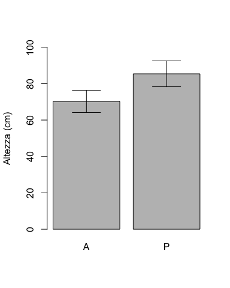

# Premessa {-}

Placeholder


## Obiettivi {-}
## Organizzazione  {-}
## Software statistico {-}
## The authors {-}
## Ringraziamenti {-}

<!--chapter:end:index.Rmd-->


# Scienza e pseudo-scienza

Placeholder


## Scienza = dati
## Dati 'buoni' e 'cattivi'
## Dati 'buoni' e metodi 'buoni'
## Il principio di falsificazione
## Falsificare un risultato
## Elementi fondamentali del disegno sperimentale
### Controllo degli errori
### Replicazione
### Randomizzazione
### Esperimenti invalidi
#### Cattivo controllo degli errori
#### 'Confounding' e correlazione spuria
#### Pseudo-repliche e randomizzazione poco attenta
## Chi valuta se un esperimento è attendibile?
## Conclusioni
## Altre letture

<!--chapter:end:01-introBiometry.Rmd-->


# Progettare un esperimento

Placeholder


## Gli elementi della ricerca
## Ipotesi scientifica $\rightarrow$ obiettivo dell'esperimento
## Identificazione dei fattori sperimentali
### Esperimenti (multi-)fattoriali
### Controllo o testimone
## Le unità sperimentali
## Allocazione dei trattamenti
## Le variabili sperimentali
### Variabili nominali (categoriche)
### Variabili ordinali
### Variabili quantitative discrete
### Variabili quantitative continue
### Rilievi visivi e sensoriali
### Variabili di confondimento
## Esperimenti di campo
### Scegliere il campo
### Le unità sperimentali in campo
### Numero di repliche
### La mappa di campo
### Lay-out sperimentale
#### Disegni completamente randomizzati
#### Disegni a blocchi randomizzati
#### Disegni a quadrato latino
#### Disegni a split-plot
#### Disegni a strip-plot
## Altre letture

<!--chapter:end:02-ResProject.Rmd-->


# Richiami di statistica descrittiva

Placeholder


## Dati quantitativi
### Indicatori di tendenza centrale
### Indicatori di dispersione
### Incertezza delle misure derivate
### Relazioni tra variabili quantitative: correlazione
## Dati qualitativi
### Distribuzioni di frequenze e classamento
### Statistiche descrittive per le distribuzioni di frequenze 
### Distribuzioni di frequenza bivariate: le tabelle di contingenze
### Connessione
## Statistiche descrittive con R
### Descrizione dei sottogruppi
### Distribuzioni di frequenze e classamento
### Connessione
## Altre letture

<!--chapter:end:03-StatisticaDescrittiva.Rmd-->


# Modelli statistici ed analisi dei dati

Placeholder


## Verità 'vera' e modelli deterministici
## Genesi deterministica delle osservazioni sperimentali
## Errore sperimentale e modelli stocastici
### Funzioni di probabilità
### Funzioni di densità
### La distribuzione normale (curva di Gauss)
## Modelli 'a due facce'
## E allora?
## Le simulazioni Monte Carlo
## Analisi dei dati e 'model fitting'
## Modelli stocastici non-normali
## Altre letture

<!--chapter:end:04-ModelliSperimentazione.Rmd-->


# Stime ed incertezza

Placeholder


## Esempio: una soluzione erbicida
### Analisi dei dati: stima dei parametri
### La 'sampling distribution'
### L'errore standard
## Stima per intervallo
## L'intervallo di confidenza
## Qual è il senso dell'intervallo di confidenza?
## Come presentare i risultati degli esperimenti
## Alcune precisazioni
### Campioni numerosi e non
### Popolazioni gaussiane e non 
## Analisi statistica dei dati: riassunto del percorso logico
## Da ricordare
## Per approfondire un po'...
## *Coverage* degli intervalli di confidenza
### Intervalli di confidenza per fenomeni non-normali
### Altre letture

<!--chapter:end:05-InferenzaStatistica.Rmd-->

# Decisioni ed incertezza


Nel capitolo precedente abbiamo visto come è possibile esprimere l'incertezza che il campionamento e, in genere, l'errore sperimentale producono sulle nostre stime. In particolare, abbiamo visto che, per una certa statistica rilevata su un campione, è possibile costruire una *sampling distribution* (o *sample space* o *distribuzione campionaria*), che descrive la variabilità della statistica stessa tra un campionamento e l'altro. Utilizzando le caratteristiche di questa *sampling distribution* ed, in particolare, la sua deviazione standard (detta **errore standard**) è possibile definire una 'banda' di incertezza per la nostra stima, con un procedimento che prende il nome di inferenza statistica (stima per intervallo). Analogamente, la *sampling distribution* può essere utilizzata per prendere decisioni in presenza di incertezza, con un procedimento che si chiama **test d'ipotesi**. Anche in questo capitolo, vediamo alcuni semplici, ma realistici esempi.


## Confronto tra due medie: il test t di Student

Un ricercatore ha scelto casualmente dieci piante da una popolazione; ne ha trattate cinque con l'erbicida A e cinque con il placebo P. Alla fine dell'esperimento ha determinato il peso di ognuna delle dieci piante. E' evidente che le piante in prova sono solo un campione di quelle possibili, così come è evidente che il peso, come ogni altra variabile biologica, è soggetto ad una certa variabilità naturale, legata sia a questioni genotipiche che fenotipiche, oltre che ad eventuali errori casuali di misura.

I risultati sono i seguenti:


```r
A <- c(65, 68, 69, 71, 78)
P <- c(80, 81, 84, 88, 94)
```


Nel campione A la media è pari a 70.2, mentre la deviazione standard è pari a 4.87. L'errore standard è pari a 2.18 e quindi l'intervallo di confidenza della media è 70.2 $\pm$ 6.04. Invece, nel campione P, la media è 85.4, mentre la deviazione standard è pari a 5.72. L'errore standard è pari a 2.56, mentre l'intervallo di confidenza per la media è 85.4 $\pm$ 7.11.

Dopo aver completato questo esperimento, ci chiediamo se sia possibile concludere che l'erbicida A riduce il peso delle piante trattate, coerentemente con le aspettative riguardo ad una molecola di questo tipo. Nel rispondere a questa domanda bisogna tener presente che i campioni sono totalmente irrilevanti, dato che il nostro interesse è rivolto alle popolazioni che hanno generato i campioni; vogliamo infatti che le nostre conclusioni abbiano carattere di universalità e non siano specifiche per il nostro esperimento. **Si pone quindi il problema di trovare un metodo euristico per decidere se la popolazione delle piante trattate con A ha una media diversa dalla popolazione delle piante trattate con P**.

Un primo approccio intuitivo potrebbe essere basato sugli intervalli di confidenza delle due medie. Possiamo notare che il limite di confidenza superiore per A (70.2 + 6.04 = 76.24) è inferiore al limite di confidenza inferiore per P (85.4 - 7.11 = 78.29), in modo che gli intervalli di confidenza non si sovrappongono. In base a questo criterio, quindi, potremmo concludere che le popolazioni da cui provengono i due campioni sono diverse e, di conseguenza, A è un erbicida efficace (Figura \@ref(fig:figName70)).

<div class="figure" style="text-align: center">

<p class="caption">(\#fig:figName70)Medie ed intervalli di confidenza calcolati sue due campioni. Si può notare che gli intervalli di confidenza non si sovrappongono.</p>
</div>


Anche se questo criterio è accettabile, in pratica si preferisce utilizzare un altro criterio più rigoroso, che illustreremo di seguito.

### L'ipotesi nulla e alternativa

Innanzitutto, ricordiamo la logica Popperiana illustrata nel primo capitolo, secondo la quale nessun esperimento può dimostrare che un'ipotesi scientifica è vera, mentre è possibile dimostrare che essa è falsa. E'quindi conveniente porre la nostra ipotesi scientifica in modo che essa possa essere falsificata; dovendo dimostrare che l'effetto di A è diverso da quello di P, possiamo formulare l'ipotesi scientifica ($H_0$) in questo modo:

$$H_0: \mu_A = \mu_P = \mu$$

In altre parole, la nostra ipotesi di lavoro è che i due campioni siano in realtà estratti da due distribuzioni normali con la stessa media e la stessa deviazione standard, il che equivale a dire che essi provengono da un'unica distribuzione normale con media $\mu$ e deviazione standard $\sigma$. Questa ipotesi si chiama **ipotesi nulla** e, se riuscissimo a falsificarla, avremmo conseguito il nostro obiettivo in totale coerenza con la logica Popperiana. Vi chiediamo di fare nuovamente attenzione al fatto che l'ipotesi nulla riguarda le popolazioni che hanno generato i campioni, non i campioni stessi, per i quali già sappiamo che le medie osservate sono diverse.

Oltre all'ipotesi nulla, oggetto del nostro lavoro, possiamo anche definire l'ipotesi alternativa, che abbracceremmo se dovessimo riuscire a falsificare quella nulla. L'ipotesi alternativa semplice è:

$$H_1 :\mu_A  \ne \mu_P$$

Se avessimo elementi sufficienti già prima di effettuare l'esperimento (e non dopo aver visto i risultati), potremmo anche adottare ipotesi alternative complesse, del tipo

$$H_1 :\mu_A  > \mu_P$$

oppure:

$$H_1 :\mu_A  < \mu_P$$

Abbiamo già anticipato che le ipotesi (nulla ed alternativa) debbono essere stabilite prima di effettuare l'esperimento. Che cosa è possibile attendersi prima di un esperimento, in relazione all'effetto di una molecola erbicida? Ci si potrebbe aspettare che $\mu_A  < \mu_P$, anche se questo non sarebbe del tutto vero, dato che molti erbicidi, soprattutto se utilizzati a certe dosi, possono indurre una stimolazione della crescita, con un fenomeno detto 'ormesi'. Quindi non è possibile escludere del tutto la possibilità che $\mu_A  > \mu_P$. Per questo motivo, l'ipotesi alternativa dovrebbe essere posta nella forma prudenziale $\mu_A  \neq \mu_P$, dato che non vi sono elementi sufficienti per escludere una delle due ipotesi alternative complesse. Più in generale, l'ipotesi alternativa semplice è quella più diffusa, mentre è possibile adottare una delle due ipotesi alternative complesse solo quando l'altra avrebbe potuto essere sicuramente esclusa, già prima di aver visto i dati (l'ipotesi deve essere sempre indipendente dai dati).

### La statistica T

Ma torniamo a lavorare sull'ipotesi nulla. Possiamo intuire che l'idea che $\mu_A = \mu_P$ non è 'fuori dal mondo'; infatti, se avessimo una sola popolazione gaussiana con media $\mu$, non sarebbe impossibile campionare cinque soggetti sulla coda sinistra (e quindi con bassa altezza) e cinque soggetti sulla coda destra (a quindi con elevata altezza), in modo che $m_A \neq m_P$. Il problema è capire quanto questo sia probabile.

Cerchiamo di definire una statistica che, posto $\mu_A = \mu_P$, ci permetta di capire che possibilità ho di trovare $m_A \neq m_P$. Due sono i valori di cui tenere conto:

1. l'entità della differenza tra le medie: più la differenza tra le due medie è alta e più è improbabile che essa si produca quando $\mu_A = \mu_P$;
2. l'entità dell'errore standard. Maggiore l'incertezza di stima delle due medie, maggiore la probabilità di trovare ampie differenze tra $m_A$ ed $m_P$ anche quando $\mu_A = \mu_P$.

Una buona statistica è quella indicata di seguito:

$$T = \frac{m_A - m_P}{SED}$$

Si può osservare che T, in realtà, non è altro che il rapporto tra le quantità indicate in precedenza ai punti 1 e 2: infatti la quantità al numeratore è la differenza tra le medie dei due campioni, mentre la quantità al denominatore è il cosiddetto errore standard della differenza tra due medie (SED). Quest'ultima quantità si può ottenere pensando che i due campioni sono estratti in modo indipendente e, pertanto, la varianza della somma (algebrica) è uguale alla somma delle varianze. La varianza di ogni media è data dal quadrato dell'errore standard (SEM) e, pertanto, possiamo scrivere:

$$SED^2 = SEM_1^2 + SEM_2^2$$

Sappiamo anche che il SEM si ottiene dividendo la deviazione standard di ogni campione per la radice quadrata del numero dei dati, quindi:

$$SED^2 = \frac{s_1^2}{n_1} +  \frac{s_2^2}{n_2}$$

cioè:

$$SED = \sqrt{ \frac{s_1^2}{n_1} +  \frac{s_2^2}{n_2} }$$

Possiamo anche scrivere:

$$SED = \sqrt{ \frac{s_1^2 \, n_2 + s_2^2 \, n_1}{n_1 \, n_2} }$$

e, se le varianze sono uguali ($s_1^2 = s_2^2 = s^2$), segue che: 

$$SED = \sqrt {s^2 \frac{n_1  + n_2}{n_1 \, n_2 } }$$

Se fosse anche $n_1 = n_2 =n$, potremmo scrivere:

$$SED = \sqrt{2 \, \frac{s^2}{n} } = \sqrt{2} \times SEM$$

Il valore osservato per T è quindi uguale a:

$$T = \frac{70.2 - 85.4}{3.361547} = -4.5217$$

dove il denominatore è ottenuto come:

$$SED = \sqrt{ 2.18^2 +  2.56^2 } = 3.361547$$

### Simulazione Monte Carlo

Ipotizzando che l'ipotesi nulla sia vera ($\mu_A = \mu_P$), che valori dovrebbe assumere la statistica T? E'facile intuire che il valore più probabile sia 0, ma, dato che la media di un campione non necessariamente coincide con la media della popolazione da cui proviene, possiamo anche aspettarci che T sia diverso da zero. Tuttavia, trovare valori di T molto alti o molto bassi dovrebbe essere via via meno probabile.

Nel nostro esperimento, il valore di T che abbiamo ottenuto è abbastanza diverso da zero, il che indica un certo grado di discrepanza tra l'osservazione è l'ipotesi nulla. **Possiamo affermare che ciò sia imputabile solo alla variabilità di campionamento e che quindi il nostro esperimento confermi l’ipotesi nulla**?

Per rispondere a questa domanda, supponiamo che l'ipotesi nulla sia vera. In questo caso, immaginiamo che le nostre dieci piante siano tutte estratte da una sola popolazione con media e deviazione standard stimate (stima puntuale) come segue:


```r
media <- mean(c(A, P))
devSt <- sd(c(A, P))
media
```

```
## [1] 77.8
```

```r
devSt
```

```
## [1] 9.44928
```

Prendiamo quindi questa popolazione normale, con $\mu = 77.8$ e $\sigma = 9.45$, ed utilizziamo un generatore di numeri casuali gaussiani per estrarre numerose (100’000) coppie di campioni, calcolando, per ogni coppia, il valore T, come abbiamo fatto con la nostra coppia iniziale.

Il codice da utilizzare in R per le simulazioni è il seguente:


```r
T_obs <- -4.521727
set.seed(34)
result <- rep(0, 100000)
for (i in 1:100000){
  sample1 <- rnorm(5, media, devSt)
  sample2 <- rnorm(5, media, devSt)
  SED <- sqrt( (sd(sample1)/sqrt(5))^2 +
                 (sd(sample2)/sqrt(5))^2 )
  result[i] <- (mean(sample1) - mean(sample2)) / SED
}

# Valutazione dei valori di T
mean(result)
```

```
## [1] -0.001230418
```

```r
max(result)
```

```
## [1] 9.988315
```

```r
min(result)
```

```
## [1] -9.993187
```

```r
# Quanti valori sono più discrepanti del mio?
length(result[result < T_obs]) / 100000
```

```
## [1] 0.00095
```

```r
length(result[result > - T_obs]) /100000
```

```
## [1] 0.00082
```

Il vettore 'result' contiene un elenco di valori di T che è possibile osservare quando l'ipotesi nulla è vera, cioè quando $\mu_A = \mu_P$; vediamo che ci sono anche valori piuttosto alti ($> 9$) e piuttosto bassi ($< - 9$). Negli anni 20 del 1900, Fischer propose di utilizzare come **‘forza dell’evidenza scientifica’** proprio la probabilità di ottenere un risultato uguale o più estremo di quello osservato, supponendo vera l’ipotesi nulla. Per applicare questo criterio, dobbiamo partire dalla nostra osservazione (T = -4.521727) e considerare che il valore è negativo, ma solo perché abbiamo scritto la differenza come $m_A - m_P$ invece che come $m_P - m_A$. Quindi dobbiamo andarci a cercare nel vettore 'result' i valori che risultano minori di -4.5217 e maggiori di 4.5217, che sono più discrepanti di quello da noi osservato.

Vediamo che, dei 100'000 valori di T simulati assumendo vera l'ipotesi nulla, poco meno dell'uno per mille sono inferiori a -4.5217 e altrettanti sono superiori al suo reciproco (4.5217). In totale, la probabilità di osservare un valore di T uguale o più estremo di quello da noi osservato è molto bassa a pari allo 0.18% circa. Questo valore di probabilità è detto **P-level** e viene utilizzato come criterio decisionale: se esso è inferiore a 0.05 (5%), come in questo caso, rifiutiamo l'ipotesi nulla ed abbracciamo l'alternativa, concludendo che i due trattamenti sono significativamente diversi tra loro (in termini di risposta prodotta nei soggetti trattati, ovviamente).


### Soluzione formale

Eseguire una simulazione di Monte Carlo per costruire una *sampling distribution* per T non è sempre agevole e, pertanto, ci dobbiamo chiedere se esista una funzione di densità in grado di descriverla velocemente. Nel grafico sottostante abbiamo considerato una scala discreta da -10 a +10, con intervalli di ampiezza pari a 2.5. Poi abbiamo trasformato il vettore 'result' in una distribuzione di frequenze relative in ogni intervallo, ottenendo una *sampling distribution* discreta.


```r
#Sampling distribution per T 
max(result);min(result)
```

```
## [1] 9.988315
```

```
## [1] -9.993187
```

```r
b <- seq(-10, 10, by = 0.25)
hist(result, breaks = b, freq=F, 
  xlab = "T", ylab="Density", 
  xlim=c(-10,10), ylim=c(0,0.45), main="")
curve(dnorm(x), add=TRUE, col="blue")
curve(dt(x, 8), add=TRUE, col="red")
```

<div class="figure" style="text-align: center">

<p class="caption">(\#fig:figName71)Sampling distribution empirica a confronto con una distribuzione normale (in rosso) e una distribuzione t di Student con otto gradi di libertà</p>
</div>

Vediamo che la *sampling distribution* di Monte Carlo, non è esattamente gaussiana (curva blu), in quanto le code sono leggermente più alte. Invece, possiamo notare che una funzione di densità 't di Student' con otto gradi di libertà (in rosso) fornisce una descrizione molto più precisa (Figura \@ref(fig:figName71)). Gli otto gradi di libertà sono ottenuti considerando che abbiamo due campioni con cinque individui e, quindi, quattro gradi di libertà ciascuno.

La curva di densità di 't di Student' ci permette di calcolare il P-level molto velocemente, senza dover ricorrere ad una simulazione Monte Carlo. Chiaramente, dato che l'ipotesi alternativa è quella semplice dobbiamo prendere entrambe le code (test a due code), utilizzando il codice sottostante. 


```r
2 * pt(-4.5217, 8, lower.tail=T) 
```

```
## [1] 0.00194554
```

Abbiamo moltiplicato per 2 il risultato, in quanto la funzione `dt()` fornisce la probabilità di trovare individui inferiori a -4.5217 ('lower.tail = T'), ma, essendo la distribuzione simmetrica, la probabilità di trovare soggetti superiori a 4.5217 è esattamente la stessa.

Vediamo che il P-level ottenuto formalmente è simile a quello ottenuto empiricamente, ma, rispetto a quest'ultimo, è più preciso, in quanto con la simulazione di Monte Carlo non abbiamo potuto considerare, come avremmo dovuto, un numero infinito di repliche dell'esperimento.

Allo stesso valore, più semplicemente, si perviene utilizzando la funzione `t.test()`:


```r
t.test(A, P, var.equal = T)
```

```
## 
## 	Two Sample t-test
## 
## data:  A and P
## t = -4.5217, df = 8, p-value = 0.001945
## alternative hypothesis: true difference in means is not equal to 0
## 95 percent confidence interval:
##  -22.951742  -7.448258
## sample estimates:
## mean of x mean of y 
##      70.2      85.4
```

Gli argomenti di questa funzione sono i due vettori, oltre all'argomento 'var.equal', che in questo caso è stato impostato su 'TRUE', considerando i due campioni estratti da distribuzioni gaussiane con la stessa varianza. Torneremo su questo aspetto tra poco.

### Interpretazione del P-level

Abbiamo detto che quando il P-level è inferiore a 0.05, concludiamo che vi sono prove scientifiche sufficientemente forti per rifiutare la nostra ipotesi di partenza.

Bisogna sottolineare come il P-level nella statistica tradizionale sia stato inizialmente proposto da Fisher come criterio di comportamento e non come un vero e proprio criterio inferenziale-probabilistico. Successivamente, Jarzy Neyman ed Egon Pearson, intorno al 1930, proposero di utilizzare il P-level come probabilità di errore di I specie, cioè come probabilità di rifiutare erroneamente l’ipotesi nulla. Tuttavia, trattandosi di una probabilità calcolata a partire da una *sampling distribution*, cioè da un’ipotetica infinita ripetizione dell’esperimento, essa non ha alcun valore in relazione al singolo esperimento effettivamente eseguito, come i due autori menzionati in precedenza hanno esplicitamente chiarito.

Di conseguenza, nel caso in esempio, affermare che abbiamo una probabilità di errore pari a 0.0019 nel rifiutare l’ipotesi nulla, rappresenterebbe un abuso: le nostre conclusioni potrebbero essere false o vere, ma non abbiamo alcun elemento per scegliere tra le due opzioni. Possiamo solo affermare che, se ripetessimo infinite volte l’esperimento e se l’ipotesi nulla fosse vera, otterremmo un risultato estremo come il nostro o più estremo solo in 2 casi (circa) su 1000. In altre parole, nel lungo periodo, basando le nostre conclusioni sul criterio anzidetto (rifiuto l'ipotesi nulla se il P-value è inferiore a 0.05) commettiamo un errore in non più del 5% dei casi. Insomma, il P-level non può essere guardato come la probabilità di ‘falso-positivo’ ad ogni singolo test, ma solo nel lunghissimo periodo.


### Tipologie alternative di test t di Student

Chiunque abbia utilizzato un computer per eseguire un test di t, si sarà accorto che è necessario scegliere tra tre procedure alternative. Infatti, abbiamo:

1. t-test appaiato. In questo caso le misure sono prese a coppia sullo stesso soggetto e non sono quindi indipendenti.
2. t-test omoscedastico. Le misure sono prese su soggetti diversi (indipendenti) e possiamo supporre che i due campioni provengano da due popolazioni con la stessa varianza.
3. t-test eteroscedastico. Le misure sono prese su soggetti diversi, ma le varianze non sono omogenee.

Quello che abbiamo appena utilizzato con la funzione `t.test()` è un test omoscedastico, che suppone che le varianze dei campioni siano simili tra loro, almeno dello stesso ordine di grandezza (omogeneità delle varianze od omoscedasticità).

Se consideriamo invece la coppia di campioni riportata di seguito, possiamo notare che le varianza sono molto diverse e l'ipotesi di omoscedasticità non è difendibile. 


```r
D1
```

```
## [1] 12.06608 11.79470 11.85008 12.14712 12.14591
```

```r
D2
```

```
## [1] 35.14014 35.20918 31.96391 34.51307 33.91213
```

```r
mean(D1)
```

```
## [1] 12.00078
```

```r
mean(D2)
```

```
## [1] 34.14769
```

```r
var(D1)
```

```
## [1] 0.02798071
```

```r
var(D2)
```

```
## [1] 1.767402
```

Pertanto, dobbiamo utilizzare un test t eteroscedastico (test di Welch), nel quale il numero di gradi di libertà non è ottenuto per semplice somma dei gradi di libertà di ogni campione, ma è approssimato con la formula di Satterthwaite:

$$DF_s \simeq \frac{ \left( s^2_1 + s^2_2 \right)^2 }{ \frac{(s^2_1)^2}{DF_1} + \frac{(s^2_2)^2}{DF_2} }$$

Vediamo che se le varianze e i gradi di libertà sono uguali, la formula precedente riduce a:

$$DF_s = 2 \times DF$$

Nel nostro caso:


```r
dfS <- (var(D1) + var(D2))^2 / 
  ((var(D1)^2)/4 + (var(D2)^2)/4)
dfS
```

```
## [1] 4.126621
```

Con R, il test di Welch si esegue utilizzando l'argomento 'var.equal = F':


```r
t.test(D1, D2, var.equal = F)
```

```
## 
## 	Welch Two Sample t-test
## 
## data:  D1 and D2
## t = -36.959, df = 4.1266, p-value = 2.326e-06
## alternative hypothesis: true difference in means is not equal to 0
## 95 percent confidence interval:
##  -23.79070 -20.50312
## sample estimates:
## mean of x mean of y 
##  12.00078  34.14769
```

Il test di t appaiato è invece quello in cui le misure sono state prese negli stessi soggetti, prima e dopo un certo trattamento sperimentale. Ad esempio, se le misure D1 e D2 fossero state rilevate sugli stessi soggetti (due misure per soggetto, in posizioni corrispondenti dei vettori D1 e D2), allora avremmo cinque soggetti invece che dieci e, di conseguenza, avremmo solo solo 4 gradi di libertà invece che 8:


```r
t.test(D1, D2, var.equal=F, paired=T)
```

```
## 
## 	Paired t-test
## 
## data:  D1 and D2
## t = -38.002, df = 4, p-value = 2.864e-06
## alternative hypothesis: true difference in means is not equal to 0
## 95 percent confidence interval:
##  -23.76497 -20.52885
## sample estimates:
## mean of the differences 
##               -22.14691
```


## Confronto tra due proporzioni: il test $\chi^2$

Il test di t è molto utile, ma soltanto nel caso in cui si abbia a che fare con caratteri quantitativi, cioè con variabili misurate su una scala continua, per le quali sia possibile calcolare statistiche descrittive, come appunto la media. Talvolta, i ricercatori sono interessati a rilevare caratteristiche qualitative, come ad esempio lo stato di una pianta in seguito ad un trattamento (morta o viva), il colore dei semi (si ricordino i piselli verdi e gialli di Mendel) ed altre caratteristiche che non sono misurabili su una scala continua.

Avendo a che fare con variabili qualitative, l'unica statistica rilevabile è il numero di soggetti che presentano le diverse modalità. Ad esempio, immaginiamo un esperimento per verificare se un coadiuvante aumenta l'efficacia di un insetticida. In questo esperimento, utilizziamo l'insetticida da solo e miscelato con il coadiuvante su due gruppi di insetti diversi. Nel primo gruppo (trattato con insetticida) contiamo 56 morti su 75 insetti trattate, mentre nel secondo gruppo (trattato con insetticida e coadiuvante) otteniamo 48 morti su 50 insetti trattati.

Nel capitolo 3 abbiamo visto che i risultati di questo esperimento si riducono ad una tabella di contingenze, per la quale sappiamo già calcolare una statistica che misuri la connessione tra variabili (trattamento e mortalità), detta $\chi^2$:


```r
counts <- c(56, 19, 48, 2)
tab <- matrix(counts, 2, 2, byrow = T)
row.names(tab) <- c("I", "IC")
colnames(tab) <- c("M", "V")
tab
```

```
##     M  V
## I  56 19
## IC 48  2
```

```r
summary( as.table(tab) )
```

```
## Number of cases in table: 125 
## Number of factors: 2 
## Test for independence of all factors:
## 	Chisq = 9.768, df = 1, p-value = 0.001776
```


La connessione è la statistica giusta per rispondere alla nostra domanda di ricerca; infatti ci stiamo chiedendo se la proporzione dei morti è indipendente dal tipo di trattamento oppure no. Il valore di $\chi^2$ osservato è pari a 9.768, il che indica un certo grado di connessione. Infatti, ricordiamo che, in caso di indipendenza tra le variabili, $\chi^2$ dovrebbe essere zero (Capitolo 3).

Tuttavia, noi non siamo interessati ai due campioni, in quanto i 125 soggetti osservati sono tratti da due popolazioni più ampie. Considerando queste due popolazioni, poniamo l'ipotesi nulla in questi termini:

$$H_o :\pi_1  = \pi_2  = \pi$$

Vediamo che, come negli altri esempio, l'ipotesi nulla riguarda i parametri delle popolazioni ($\pi_1$ e $\pi_2$), non quelli dei campioni  ($p_1$ e $p_2$). Ci chiediamo: se l'ipotesi nulla fosse vera ($\pi_1  = \pi_2$), quale sarebbe la *sampling distribution* per $\chi^2$? E soprattutto, quanto sarebbe probabile ottenere un valore alto come il nostro o più alto?

Vediamo che l'output della funzione `summary()` ci da già il P-level, che, essendo inferiore a 0.05, ci consente di rigettare l'ipotesi nulla, affermando che esiste una differenza significativa tra l'effetto dell'insetticida quando è utilizzato da solo e quando è utilizzando in abbinamento con un coadiuvante.

### Simulazione Monte Carlo

 Per chi fosse interessato, proviamo a vedere come si costruisce la *sampling distribution* per $\chi^2$ con una simulazione Monte Carlo. Possiamo utilizzare la funzione `r2dtable()`, che produce il numero voluto di tabelle di contingenza (nel nostro caso 10'000), con righe e colonne indipendenti, rispettando i totali marginali della nostra tabella di partenza. Le tabelle prodotte  sono restituite come lista, quindi possiamo utilizzare la funzione `lapply()` per applicare ad ogni elemento della lista la funzione che restituisce il $\chi^2$ ('chiSim'). 


```r
chiSim <- function(x) summary(as.table(x))$stat
set.seed(1234)
tabs <- r2dtable(10000, apply(tab, 1, sum), apply(tab, 2, sum))
chiVals <- as.numeric( lapply( tabs, chiSim) )
length(chiVals[chiVals > 9.768])
```

```
## [1] 19
```

Vediamo che vi sono 19 valori più alti di quello da noi osservato, quindi il P-value è 0.0019.

### Soluzione formale

In modo formale, si può dimostrare che, se $n$ è sufficientemente grande (n > 30), il valore osservato di $\chi^2$ segue appunto la distribuzione di probabilità $\chi^2$, con un numero di gradi di libertà $\nu$ pari al numero dei dati indipendenti, che, in questo caso, è pari ad 1. Infatti, una volta fissata una frequenza, le altre sono automaticamente definite, dovendo restituire i totali marginali. In R, possiamo utilizzare la funzione `pchisq()` per calcolare la probabilità di ottenere valori pari o superiori a 9.768:


```r
pchisq(9.76801, 1, lower.tail=F)
```

```
## [1] 0.001775746
```

Allo stesso risultato, ma in modo più semplice, è possibile pervenire utilizzando la funzione `chisq.test()`, applicata alla tabella di contingenza:


```r
chisq.test(tab, correct = F)
```

```
## 
## 	Pearson's Chi-squared test
## 
## data:  tab
## X-squared = 9.768, df = 1, p-value = 0.001776
```

Come nel caso del 't' di Student, abbiamo diversi tipi di test di chi quadro. In particolare, possiamo applicare o no la correzione per la continuità, che è necessaria quando il numero dei soggetti è piccolo (minore di 30, grosso modo). Nel nostro caso, non lo abbiamo ritenuto necessario ed abbiamo quindi aggiunto l'argomento 'correct = F'.

## Conclusioni e riepilogo

Abbiamo visto il P-level è lo strumento giusto per tirare conclusioni in presenza di incertezza sperimentale. Dovrebbe essere evidente che anche le nostre conclusioni sono incerte, in quanto soggette all'errore di campionamento. In particolare, abbiamo visto che esiste un rischio di errore di prima specie, cioè rifiutare erroneamente l'ipotesi nulla (falso positivo). Allo stesso modo, esiste anche un rischio di errore di II specie, cioè accettare erroneamente l'ipotesi nulla (falso negativo). Insomma, per quanto possiamo affannarci, la ricerca scientifica non consente mai soluzioni certe, anche se rimane la certezza del metodo, che è largamente condiviso all'interno della comunità di scienziati.

Concludiamo proprio ricordando questo metodo di lavoro:

1. si formula l'ipotesi nulla.
2. Si individua una statistica che descriva l'andamento dell'esperimento, in relazione all'ipotesi nulla.
3. Si individua la *sampling distribution* per questa statistica, assumendo vera l'ipotesi nulla; la sampling distribution può essere empirica (ottenuta per simulazione Monte Carlo) o meglio teorica, scelta in base a considerazioni probabilistiche.
4. Si calcola la probabilità che, essendo vera l'ipotesi nulla, si possa osservare una valore altrettanto estremo o più estremo di quello calcolato, per la statistica di riferimento.
5. Se il livello di probabilità è inferiore ad una certa soglia $\alpha$ prefissata (generalmente 0.05), si rifiuta l'ipotesi nulla e si accetta l'ipotesi alternativa.

---

## Altre letture

1. Hastie, T., Tibshirani, R., Friedman, J., 2009. The elements of statistical learning, Springer Series in Statistics. Springer Science + Business Media, California, USA.


<!--chapter:end:06-TestIpotesi.Rmd-->


# Modelli ANOVA ad una via

Placeholder


## Caso-studio: confronto tra erbicidi in vaso
## Descrizione del dataset
## Definizione di un modello lineare
## Assunzioni di base
## Fitting del modello: metodo manuale
### Stima dei parametri
### Calcolo dei residui
### Stima di $\sigma$
## Scomposizione della varianza
## Test d'ipotesi
### Inferenza statistica
## Fitting del modello con R
## Medie marginali attese
## Per concludere ...
## Per approfondire un po'...
### Simulazione della *sampling distribution* per F
### Altre letture

<!--chapter:end:09-oneWayANOVA.Rmd-->


# La verifica delle assunzioni di base

Placeholder


## Procedure diagnostiche
## Analisi grafica dei residui
### Grafico dei residui contro i valori attesi
### QQ-plot
## Strumenti diagnostici formali
## Risultati contraddittori
## 'Terapia'
### Correzione/Rimozione degli outliers
### Correzione del modello
### Trasformazione della variabile indipendente
### Impiego di metodiche statistiche avanzate
### Trasformazioni stabilizzanti
## Esempio
## Per approfondire un po' ...

<!--chapter:end:10-AssunzioniBase.Rmd-->


# Contrasti e confronti multipli

Placeholder


## Esempio
## I contrasti
### Varianza del contrasto e test d'ipotesi
### I contrasti con R
## I confronti multipli a coppie (pairwise comparisons)
## Display a lettere
## Problemi di molteplicità: tassi di errore per confronto e per esperimento
### Correzione per la molteplicità
## E le classiche procedure di confronto multiplo?
## Consigli pratici
## Per approfondire un po'...
### Intervallo di confidenza di un contrasto
### Correzione per la molteplicità: qualche dettaglio ulteriore
### Altre letture

<!--chapter:end:11-ConfrontoMultiplo.Rmd-->


# Modelli ANOVA con fattori di blocco

Placeholder


## Caso-studio: confronto tra erbicidi in campo
## Definizione di un modello lineare
## Stima dei parametri
### Coefficienti del modello
### Residui e devianze
## Scomposizione della varianza
## Disegni a quadrato latino
## Caso studio: confronto tra metodi costruttivi
## Definizione di un modello lineare

<!--chapter:end:12-MultiWayANOVAModels.Rmd-->


# Modelli ANOVA a due vie

Placeholder


## Il concetto di ’interazione’
## Tipi di interazione
## Caso-studio: interazione tra lavorazioni e diserbo chimico
## Definizione del modello lineare
## Stima dei parametri
## Verifica delle assunzioni di base
## Scomposizione delle varianze
## Medie marginali attese
## Calcolo degli errori standard (SEM e SED)
## Medie marginali attese e confronti multipli con R
## Per approfondire un po'....
### Anova a due vie: scomposizione 'manuale' della varianza

<!--chapter:end:13-AnovaDueLivelli.Rmd-->


# La regressione lineare semplice

Placeholder


## Caso studio: effetto della concimazione azotata al frumento
## Analisi preliminari
## Definizione del modello lineare
## Stima dei parametri
## Valutazione della bontà del modello
### Valutazione grafica
### Errori standard dei parametri
### Test F per la mancanza d'adattamento
### Test F per la bontà di adattamento e coefficiente di determinazione
## Previsioni
## Per approfondire un po'...

<!--chapter:end:14-LinearRegression.Rmd-->


# La regressione non-lineare

Placeholder


## Caso studio: degradazione di un erbicida nel terreno
## Scelta della funzione
## Stima dei parametri
### Linearizzazione della funzione
### Approssimazione della vera funzione tramite una polinomiale in X
### Minimi quadrati non-lineari
## La regressione non-lineare con R
## Verifica della bontà del modello
### Analisi grafica dei residui
### Test F per la mancanza di adattamento (approssimato)
### Errori standard dei parametri
### Coefficienti di determinazione
## Funzioni lineari e nonlineari dei parametri
## Previsioni		 
## Gestione delle situazioni 'patologiche'
### Trasformazione del modello
### Trasformazione dei dati
## Per approfondire un po'...
### Riparametrizzazione delle funzioni non-lineari
### Altre letture

<!--chapter:end:15-NonLineare.Rmd-->


# Esercizi

Placeholder


## Capitoli 1 e 2
### Esercizio 1
## Capitolo 3
### Esercizio 1
### Esercizio 2
### Esercizio 3
## Capitolo 4
### Esercizio 1
### Esercizio 2
### Esercizio 3
### Esercizio 4
### Esercizio 5
### Esercizio 6
### Esercizio 7
### Esercizio 8
## Capitolo 5
### Esercizio 1
### Esercizio 2
### Esercizio 3
### Esercizio 4
### Esercizio 5
## Capitolo 6
### Esercizio 1
### Esercizio 2
### Esercizio 3
### Esercizio 4
### Esercizio 5
### Esercizio 6
### Esercizio 7
### Esercizio 8
### Esercizio 9
### Esercizio 10
## Capitoli da 7 a 9
### Esercizio 1
### Esercizio 2
### Esercizio 3
### Esercizio 4
## Capitolo 10
### Esercizio 1
### Esercizio 2
### Esercizio 3
## Capitoli 11 e 12
### Esercizio 1
### Esercizio 2
### Esercizio 3
### Esercizio 4
### Esercizio 5
### Esercizio 6
## Capitolo 13
### Esercizio 1
### Esercizio 2
## Capitolo 14
### Esercizio 1
### Esercizio 2
### Esercizio 3
### Esercizio 4
### Esercizio 5
### Esercizio 6
### Esercizio 7

<!--chapter:end:16-Esercizi.Rmd-->


# Appendice 1: breve introduzione ad R

Placeholder


## Cosa è R? {-}
## Oggetti e assegnazioni {-}
### Costanti e vettori {-}
### Matrici {-}
### Dataframe {-}
### Quale oggetto sto utilizzando? {-}
## Operazioni ed operatori {-}
## Funzioni ed argomenti {-}
## Consigli per l'immissione di dati sperimentali {-}
### Immissione di numeri progressivi {-}
### Immissione dei codici delle tesi e dei blocchi {-}
### Immissione dei valori e creazione del datframe {-}
### Leggere e salvare dati esterni {-}
## Alcune operazioni comuni sul dataset {-}
### Selezionare un subset di dati {-}
### Ordinare un vettore o un dataframe {-}
## Workspace {-}
## Script o programmi {-}
## Interrogazione di oggetti {-}
## Altre funzioni matriciali {-}
## Cenni sulle funzionalità grafiche in R {-}
## Altre letture {-}

<!--chapter:end:17-IntroduzioneR.Rmd-->

