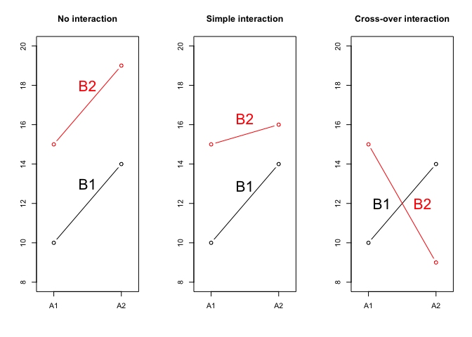
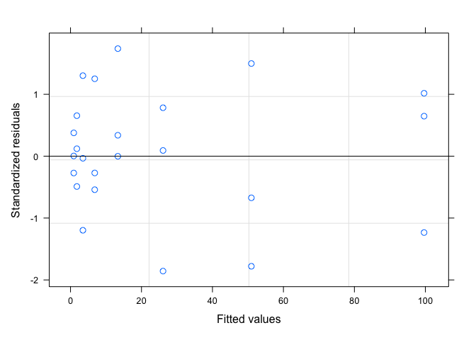

# Premessa {-}


In questo sito troverete il libro "Metodologia sperimentale per le scienze agrarie", con il quale ci siamo posti il compito di fornirvi informazioni su come sia possibile ottenere informazioni scientificamente attendibili, partendo da un esperimento opportunamente pianificato ed organizzato. Siamo convinti che già sappiate come gli esperimenti siano l'elemento chiave del progresso scientifico; forse però non siete coscienti del fatto che non tutti gli esperimenti sono ugualmente buoni e producono dati ugualmente validi. In questo libro, cercheremo di mostrarvi come si riconosce un buon esperimento da un cattivo esperimento e, di conseguenza, come si riconosce la scienza dalla pseudoscienza.

Ovviamente, un buon ricercatore non è soltanto in grado di pianificare un esperimento valido ed ottenere quindi risultati scientificamente affidabili. Un buon ricercatore deve essere anche in grado di interpretarne correttamente i risultati, attraverso l'impiego di metodiche di analisi statistica, che consentano di separare l'informazione dal rumore di fondo. Siamo perfettamente coscienti del fatto che la statistica non è una materia molto praticata nei piani di studio relativi alle scienze agrarie e, di conseguenza, in questo libro seguiremo un approccio fondamentalmente pratico, orientato al 'problem solving'; in fin dei conti, quando impariamo a guidare un auto ci preoccupiamo di riuscire a raggiungere la nostra destinazione senza incidenti, ma non ci preoccupiamo esattamente di capire quali siano le reazioni chimiche che avvengono all'interno del motore.

Secondo questo approccio, faremo grande uso di esempi, in gran parte relativi a sperimentazioni tipiche delle scienze agrarie, con le quali si confrontano tecniche colturali, genotipi innovativi, erbicidi ed altri metodi di controllo dei patogeni, degli insetti e delle piante infestanti. Siamo fermamente convinti che qualunque progresso tecnico in agricoltura debba sempre essere basata su dati attendibili ottenuti con esperimenti validi; delle opinioni, per quanto autorevoli, abbiamo da sempre imparato a dubitare...

Questo sito web è e sempre sarà gratuito, seconda la licenza Creative Commons Attribution-NonCommercial-NoDerivs 3.0. È stato scritto in R, con un linguaggio favoloso, chiamato RMarkdown e utilizzando la libreria 'bookdown'. Viene ricompilato di frequente, perché sia sempre il più aggiornato possibile, cosa che è indispensabile in quanto R è un linguaggio che si evolve molto rapidamente.

## Obiettivi {-}

In questo libro non cerchiamo di essere esaustivi perché la materia è molto ampia. Abbiamo cercato di adattare la lunghezza ad un corso di 6 CFU anche se, probabilmente, qualche capitolo sembrerà un po' eccessivo. Tuttavia, abbiamo preferito aggiungerlo, in quanto ci sembrava che alcune parti, pur non essendo indispensabili per la preparazione dell'esame, potrebbero risultare utili per le applicazioni professionali. È un libro introduttivo, il primo passo in questa affascinante disciplina e dovrebbe mettervi nelle condizioni di affrontare studi più avanzati, se mai lo vorrete.


## Organizzazione  {-}

I primi due capitoli di questo libro riguardano il disegno sperimentale; spiegano come distinguere un esperimento buono da uno cattivo. Forse vi sembrerà strano, ma non avremo mai la garanzia che i dati che abbiamo raccolto siano infallibili e quindi il nostro giudizio sulla loro attendibilità sarà solo ed esclusivamente basato sulla bontà dei metodi impiegati: se i metodi sono buoni i dati sono buoni, altrimenti no.

Nel terzo capitolo vedremo come descrivere i risultati ottenuti, utilizzando semplici statistiche come la media, la mediana il valore di chi quadro e il coefficiente di correlazione di Pearson. Nel quarto capitolo vedremo come il dataset che abbiamo ottenuto possa essere immaginato come il prodotto finale di una serie di processi deterministici e stocastici, che possiamo descrivere utilizzando un modello statistico.

Nei capitoli cinque e sei vedremo come il dataset che abbiamo raccolto, proprio perché prodotto in conseguenza di processi, almeno in parte, stocastici, debba essere considerato come un campione estratto da un universo di possibili risultati. Visto che vogliamo sempre ottenere informazioni generali, non saremo mai interessati solo ai risultati ottenuti, ma cercheremo di ottenere informazioni su tutto l'universo da cui i nostri data sono stati campionati. Generalizzare i risultati di un campione comporta sempre un certo grado di incertezza, che dovremo imparare ad esplicitare e presentare come una componente integrante del nostro report.

Nei capitoli da sette a dodici ci occuperemo dell'ANOVA, una delle tecniche più importanti per l'analisi dei dati. Gli ultimi due capitoli si occuperanno invece dei modelli di regressione.

In ogni capitolo, partiremo da un esempio pratico, in modo che possiate cogliere la finalità del lavoro prima di passare ad un'analisi più dettagliata. Nell'ultimo capitolo forniremo una serie di esercizi, con i quali potrete acquisire un po' più di familiarità con gli argomenti trattati.


## Software statistico {-}

In questo libro lavoreremo con il software R, all'interno dell'interfaccia grafica RStudio. Abbiamo scelto questo software per un certo numero di ragioni: in primo luogo, ci piace molto e pensiamo che sia un piacere utilizzarlo. Vi sembrerà strano, ma vi assicuriamo che alcuni studenti, dopo aver superato le iniziali difficoltà rimangono affascinati dal linguaggio. Alcuni altri, purtroppo, imparano ad odiarlo... speriamo nessuno di voi sia tra quelli!

In secondo luogo, R è gratuito (freeware), cosa che è fondamentale per uno studente. Terzo, dobbiamo dire che le capacità informatiche dello studente medio si sono moltiplicate negli ultimi anni e, a livello di laurea specialistica, abbiamo notato che nessuno è ormai ad un livello così basso da non riuscire a scrivere quei semplici pezzi di codice che utilizzeremo per le nostre elaborazioni. Infine, vogliamo anche dire che la richiesta di lavorare con R è arrivata anche dai vostri colleghi più anziani, che si sono accorto che la capacità, almeno elementare, di lavorare con questo software è spesso richiesta dalle aziende che assumono laureati in agraria.

R ha una struttura modulare e le sue potenzialità possono essere notevolmente estese installando librerie aggiuntive. Per semplicità, in questo libro abbiamo deciso di utilizzare l'installazione di base, evitando il più possibile l'installazione di altre librerie aggiuntive. In alcuni casi ciò non è stato possibile e quindi sarà necessario installare i componenti che vi indicheremo di volta in volta.

Riconosciamo che la curva di apprendimento con R è un po' ripida, all'inizio. Non preoccupatevi, non daremo nulla per scontato e partiremo dall'inizio, procedendo lentamente, passo dopo passo.


## Gli autori {-}

Andrea è Professore Associato al Dipartimento di Scienze Agrarie, Alimentari e Ambientali dell'Università degli Studi di Perugia ed insegna Metodologia Sperimentale in Agricoltura dal 2000. Dario era Professore Associato al Dipartimento di Scienze Agrarie, Forestali e Alimentari dell'Università degli Studi di Torino e ha insegnato Metodologia Sperimentale fino al 2020, quando è venuto improvvisamente a mancare prematuramente nel 2020. Purtroppo non ha mai visto questo libro completo... Ciao Dario!


## Ringraziamenti e scuse {-}

Iniziamo con le scuse. C'è una cosa che, probabilmente non piacerà a qualcuno: in questo testo abbiamo utilizzato il punto come separatore decimale. Sappiamo che questo non è del tutto corretto nella tradizione italiano, ma ci siamo resi conto che se avessimo utilizzato la virgola nel testo avremmo generato una gran confusione, in quanto non saremmo comunque riusciti ad evitare l'uso del punto decimale nel codice R e nei suoi risultati.

Per quanto riguarda i ringraziamenti, siamo profondamente grati a tutto il Core Team di R per aver creato e per mantenere questo ambiente di programmazione estremamente potente e gratuito. Siamo inoltre grati a Yihui Xie e ai suoi collaboratori per la disponibilità di Rmarkdown e Bookdown, due pacchetti fondamentali per la redazione di questo testo, nelle due versioni online e a stampa.

<!--chapter:end:index.Rmd-->

# Scienza e pseudo-scienza

In una società caratterizzata dal sovraccarico cognitivo, è chiedersi (e chiedere) che cosa sia la scienza, cioè cosa distingua le informazioni scientifiche da tutto quello che invece non è altro che pura opinione, magari autorevole, ma senza il sigillo dell'oggettività.

Per quanto affascinante possa sembrare l'idea del ricercatore che con un'improvviso colpo di genio elabora una stupefacente teoria, dovrebbe essere chiaro che l'intuizione, per quanto geniale ed innovativa, è solo un possibile punto di partenza, che non necessariamente prelude al progresso scientifico. In generale, almeno in ambito biologico, nessuna teoria acquisisce automaticamente valenza scientifica, ma rimane solo nell'ambito delle opinioni, indipendentemente dal fatto che nasca da un colpo di genio, oppure da un paziente e meticoloso lavoro di analisi intellettuale, che magari si concretizza in un modello matematico altamente elegante e complesso.

Che cosa è che permette ad una prova scientifica di uscire dall'ambito delle opinioni legate a divergenze di cultura, percezione e/o credenze individuali, per divenire, al contrario, oggettiva e universalmente valida? Che cosa è che distingue la verità scientifica da altre verità di natura metafisica, religiosa o pseudoscientifica?

A questo proposito, è utile leggere questi aforismi interessanti e significativi:

1.  Analogy cannot serve as proof (Pasteur)
2.  The interest I have in believing a thing is not a proof of the existence of that thing (Voltaire)
3.  A witty saying proves nothing (Voltaire)

## Scienza = dati

La base di tutta la scienza risiede nel cosiddetto 'metodo scientifico', che si fa comunemente risalire a Galileo Galilei (1564-1642) e che è riassunto nella Figura \@ref(fig:figName11).

<div class="figure" style="text-align: center">

<p class="caption">(\#fig:figName11)Il metodo scientifico Galileiano</p>
</div>

Senza andare troppo in profondità, è importante notare due aspetti:

1.  il ruolo fondamentale dell'esperimento scientifico, che produce dati a supporto di ipotesi pre-esistenti;
2.  lo sviluppo di teorie basate sui dati, che rimangono valide fino a che non si raccolgono altri dati che le confutano, facendo nascere nuove ipotesi che possono portare allo sviluppo di nuove teorie, più affidabili o più semplici.

Insomma, l'ingrediente fondamentale di una prova scientifica è quello di essere supportata dai dati sperimentali: di fatto, non esiste scienza senza dati! Resta famoso l'aforisma "In God we trust, all the others bring data", attribuito all'ingegnere e statistico americano W. Edwards Deming (1900-1993), anche se pare che egli, in realtà, non l'abbia mai pronunciato.

## Dati 'buoni' e 'cattivi'

Detto che la scienza si basa sui dati, bisogna anche dire che non tutti i dati sono ugualmente 'buoni'. Nelle scienze biologiche, così come nelle altre scienze, è importante che i dati siano in grado di cogliere gli effetti che vogliamo studiare, senza introdurre distorsioni.

In agricoltura e nelle altre scienze quantitative abbiamo a che fare con fenomeni 'misurabili' e, di conseguenza, i nostri dati consistono di un set di misure di diverso tipo (ci torneremo nel secondo capitolo). L'aspetto più importante è che, per tutta una serie di motivi che dettaglieremo tra poco, le nostre misure non necessariamente riflettono il valore vero della caratteristica misurata nel nostro soggetto. Ciò è noto con il termine di **errore sperimentale**, che non significa che abbiamo necessariamente fatto qualcosa di sbagliato. Anzi, l'errore sperimentale è considerato una componente inevitabile di ogni esperimento, in grado di proiettare un alea d'incertezza su ogni risultato scientifico.

Ci sono tre fondamentali fonti di errore sperimentale:

1.  Errore di misura
2.  Variabilità dei soggetti sperimentali
3.  Campionamento

Gli errori di misura sono legati allo strumento e dipendono dall'errata taratura, dall'impiego di un protocollo sbagliato, da inesattezze strumentali, da errori nella trascrizione dei risultati oppure dall'irregolarità dell'oggetto da misurare. Ad esempio, pensate alla misurazione dell'altezza di una pianta di mais: è facile riscontrare difficoltà legate, ad esempio, all'individuazione del punto esatto in cui inizia il culmo e del punto esatto dove termina l'infiorescenza apicale.

A parte gli errori di misura, ci sono anche altre sorgenti di errore meno evidenti e legate al fatto che, nel lavoro sperimentale, siamo di solito interessati non ad un singolo soggetto, ma ad un gruppo più o meno numeroso. Ad esempio, se dobbiamo misurare l'effetto di un erbicida, non possiamo farlo trattando una sola pianta, ma dobbiamo ripetere le misure su un gruppo di piante, il che ci porta ad avere un gruppo di misure, una diversa dall'altra. Quindi, qual è l'effetto dell'erbicida? Il fatto di avere tanti effetti diversi quante sono le piante studiate crea comunque un certo grado di variabilità che non dipende da alcun errore tecnico, ma è una caratteristica intrinseca del fenomeno biologico in studio.

Di per se', la variabilità naturale dei soggetti sperimentali non sarebbe un grosso problema, in quanto potremmo calcolarci l'effetto medio e ritenerci soddisfatti in relazione alle finalità dell'esperimento. Tuttavia sorge un nuovo problema legato al fatto che spesso i soggetti sono così numerosi che non possiamo misurarli tutti e siamo costretti a misurare un campione composto da un ridotto numero di individui. Abbiamo un nuovo elemento di incertezza: come facciamo ad essere sicuri che la media, o qualunque altra statistica, misurata nel nostro campione rifletta la media dell'intera popolazione? Anche se abbiamo fatto del tutto per scegliere un campione rappresentativo, è evidente che il campione perfetto non esiste: cosa potrebbe succedere se prendessimo un altro campione?

## Dati 'buoni' e metodi 'buoni'

Quindi la ricerca scientifica non è esente da 'errori' in senso lato (componenti di incertezza). Tuttavia, gli errori non sono tutti uguali e si dividono in **sistematici** ed **accidentali (casuali)**. L'errore sistematico è provocato da difetti intrinseci dello strumento o incapacità peculiari dell'operatore e tende a ripetersi costantemente e con lo stesso segno in misure successive. Un esempio tipico è quello di una bilancia non tarata, che tende ad aggiungere 20 grammi ad ogni misura che effettuiamo. D'altra parte, l'errore accidentale, essendo di natura casuale, tende a ripresentarsi con valori e segni diversi. Di conseguenza, è ragionevole pensare che le repliche, nel lungo periodo, producano sovrastime e sottostime con uguale probabilità, in modo che la media tende a coincidere con il valore vero.

È facile capire che le conseguenze degli errori sistematici e accidentali sono ben diverse. A questi proposito, dobbiamo considerare due aspetti molto importanti, cioè:

1.  precisione
2.  accuratezza

Con il termine **precisione** intendiamo due cose: la prima è relativa al numero di decimali che ci fornisce il nostro strumento di misura. E'evidente, ad esempio, come un calibro sia più preciso di un metro da sarto. Oltre a questo significato, abbastanza intuitivo, ce n'è un altro, più specificatamente legato agli esperimenti scientifici: la precisione di un dato ottenuto attraverso un processo di misurazione non è altro che la variabilità riscontrata quando la misurazione viene ripetuta più volte. L'errore casuale produce sempre un calo di precisione.

Il termine accuratezza ha invece un significato completamente diverso, riconducibile alla differenza tra la misura effettuata e il valore vero della caratteristica da misurare. Può sembrare una banalità, ma proviamo a pensare ad uno strumento non tarato, come, ad esempio, un gascromatografo, che restituisce sempre una concentrazione maggiorata del 20%. Se noi ripetessimo le analisi 100 volte, in assenza di altri errori, otterremmo sempre lo stesso risultato, molto preciso, ma totalmente inaffidabile, nel senso che non riflette la concentrazione reale della soluzione in studio. L'errore sistematico, oltre a produrre un calo di precisione, produce anche inaccuratezza.

Comprendiamo bene che l'accuratezza è più importante della precisione: infatti una misura accurata, ma imprecisa, riflette bene la realtà, anche se in modo vago. Al contrario, una misura precisa, ma inaccurata, ci porta completamente fuori strada, perché non riflette la realtà. Con linguaggio tecnico, un dato non accurato si dice 'distorto' (*biased*) e, siccome la distosione dipende dagli errori sistematici, questi ultimi vanno assolutamente evitati, ad esempio con la perfetta taratura degli strumenti e l'adozione di metodi di misura rigidamente standardizzati e accettati dalla comunità scientifica mondiale.

L'inaccuratezza preoccupa molto i laboratori di analisi, che spesso utilizzano standard di confronto, la cui misura è perfettamente nota e viene periodicamente confrontata con quella rilevabile dallo strumento stesso, per verificarne la taratura. Altro metodo utilizzato nelle procedure di accreditamento dei laboratori è il *ring test*, dove campioni reali della matrice da misurare sono inviati a più laboratori a livello nazionale, in modo da poter confrontare le misure ottenute e valutarne la variabilità. Con un *ring test*, un laboratorio può valutare la sua stessa affidabilità in confronto con laboratori simili, basandosi sull'eventuale differenza tra il risultato ottenuto e quelli ottenuti in tutti gli altri laboratori valutati.

Sfortunatamente la possibilità di raccogliere dati inaccurati è tutt'altro che remota. Gli scienziati americani Pons e Fleischmann, il 23 Marzo del 1989, diffusero pubblicamente la notizia di essere riusciti a riprodurre la fusione nucleare fredda, causando elevatissimo interesse nella comunità scientifica (Fig. \@ref(fig:figName2)). Purtroppo le loro misure erano viziate da una serie di problemi e il loro risultato fu smentito da esperimenti successivi.

<div class="figure" style="text-align: center">

<p class="caption">(\#fig:figName2)Conseguenze di un esperimento sbagliato</p>
</div>

A parte questo clamoroso esempio, torniamo alla nostra domanda iniziale: come facciamo ad essere sicuri che i dati siano validi ed affidabili? La risposta è semplice: non possiamo mai essere sicuri, ma **dobbiamo fare del nostro meglio per applicare metodi rigorosi, così da minimizzare la possibilità di ottenere errori sistematici**. In altre parole, dati 'buoni' sono conseguenza di metodi 'buoni' e, pertanto **una prova scientifica è tale non perché siamo certi che corrisponda alla realtà, ma perché siamo ragionevolmente certi che sia stata ottenuta con metodi validi!**.

## Il principio di falsificazione

L'approccio che abbiamo indicato poco sopra ha un'importante conseguenza: anche se abbiamo utilizzato un metodo perfettamente valido non potremo mai avere la certezza di aver ottenuto un risultato corrispondente alla realtà e, quindi, ci dovremo sempre aspettare che ulteriori dati smentiscano la nostra conclusione. Questa è la base del principio di falsificazione, definito da Karl Popper (1902-1994): non potremo mai dimostrare che una nostra ipotesi è vera, ma potremo solo dimostrare che è falsa.

In pratica, tornando al metodo scientifico, partiamo da un'ipotesi e organizziamo un esperimento perfettamente valido che produce, di conseguenza, dati validi. Se i nostri dati sconfermano l'ipotesi, abbiamo dimostrato che questa è falsa e dovremo quindi produrre una nuova ipotesi da sottoporre a verifica. Se invece i dati confermano la nostra ipotesi (o meglio, non la smentiscono) allora, non potremo concludere che l'ipotesi è vera, in quanto rimarrà sempre il dubbio che non abbiamo raccolto abbastanza dati. Tuttavia, in mancanza di altre informazioni, prenderemo per buona la nostra ipotesi, fino a che non sarà smentita. Una sorta di 'assoluzione' per insufficienza di prove, quindi...

Il principio di falsificazione è piuttosto importante nel mondo scientifico ed ha alcune importanti implicazioni:

1.  Scienza non necessariamente significa 'certezza' o 'verità'. Tutto quello che possiamo fare con certezza è rigettare ipotesi (provare che sono false), ma non dimostrarne la validità.
2.  Il nostro compito è quello di cercare di eliminare tutte le fonti di errore sistematico, per rendere il risultato il più accurato possibile.
3.  Eliminato l'errore sistematico, l'evantuale errore casuale residuo deve essere sempre quantificato e visualizzato insieme ai risultati.
4.  In considerazione dell'errore residuo, dobbiamo decidere se i dati raccolti consentono di rigettare la nostra ipotesi di partenza. Altrimenti, l'esperimento è inconclusivo e, pur non avendone la certezza, terremo per vera la nostra ipotesi di partenza fino a che non sarà smentita da future osservazioni.

Oltre al principio di falsificazione, la scienza fa largo uso del principio del 'rasoio di Occam'. Guglielmo di Occam (XIV secolo) era un frate francescano che, in un periodo in cui le dimostrazioni scientifiche iniziavano a divenire troppo complesse, voleva ribadire l'importanza della semplicità. Il suo principio è solitamente formulato come '*Entia non sunt multiplicanda praeter necessitatem*' ed è noto come il 'rasoio' in quanto porta a respingere con nettezza (tagliare con il rasoio) le spiegazioni troppo complesse. Nella comunità scientifica, applichiamo questo principio preferendo sempre, tra due ipotesi alternative ugualmente buone, quella più semplice.

## Falsificare un risultato

Se un esperimento è inconclusivo e porta ad eccettare un'ipotesi, è sempre possibile eseguire un ulteriore esperimento per rigettarla. Se anche questo secondo esperimento non riesce a rigettare l'ipotesi di partenza, allora la bontà di quest'ultima è certamente rafforzata. Parliamo quindi di esperimenti confermativi che costituiscono un elemento molto importante del metodo scientifico.

A questo proposito, distinguiamo:

1.  replicabilità
2.  riproducibilità

Un esperimento è replicabile se, quando ripetuto in condizioni assolutamente analoghe (stessi soggetti, ambiente, strumenti...), restituisce risultati equivalenti. Per questo motivo, quando si pubblicano i risultati di un esperimento, è sempre necessario descrivere accuratamente i metodi impiegati, in modo da consentire a chiunque la verifica dei risultati.

In alcuni casi, tuttavia, questa verifica indipendente è pressoché impossibile; ad esempio, nelle scienze agronomiche, le caratteristiche genetiche e pedo-climatiche giocano un ruolo molto importante e non è facile replicare un esperimento di pieno campo esattamente nelle stesse condizioni. Per questo motivo, alcuni biostatistici distinguono la replicabilità dalla riproducibilità, definita come il grado di concordanza tra esperimenti ripetuti in condizioni diverse (diversi soggetti, diverso ambiente...). Se la replicabilità di un esperimento non può essere dimostrata, bisogna avere almeno un'idea della sua riproducibilità, ripetendo l'esperimento in condizioni diverse e discutendo attentamente le eventuali differenze riscontrate nei risultati.

---

## Elementi fondamentali del disegno sperimentale

La metodica di organizzazione di un esperimento valido prende il nome di *disegno sperimentale* e le sue basi si fanno in genere risalire a Sir Ronald A. Fisher, vissuto in Inghilterra dal 7 Febbraio 1890 al 29 luglio 1962. Laureatosi nel 1912, lavora come statistico per il comune di Londra, fino a quando diviene socio della prestigiosa Eugenics Education Society di Cambridge, fondata nel 1909 da Francis Galton, cugino di Charles Darwin. Dopo la fine della guerra, Karl Pearson gli propone un lavoro presso il rinomato Galton Laboratory, ma egli non accetta a causa della profonda rivalità esistente tra lui e Pearson stesso. Nel 1919 viene assunto presso la Rothamsted Experimental Station, dove si occupa dell'elaborazione dei dati sperimentali e, nel corso dei successivi 7 anni, definisce le basi del disegno sperimentale ed elabora la sua teoria della "analysis of variance". Il suo libro più importante è "The design of experiment", del 1935. E' sua la definizione delle tre componenti fondamentali del disegno sperimentale:

1.  controllo degli errori;
2.  replicazione;
3.  randomizzazione.

### Controllo degli errori

Controllare gli errori, o, analogamente, eseguire un esperimento controllato significa fondamentalmente due cose:

1.  adottare provvedimenti idonei ad evitare le fonti di errore, mantenendole al livello più basso possibile (alta precisione);
2.  agire in modo da isolare l'effetto in studio (accuratezza), evitando che si confonda con effetti casuali e di altra natura. Ad esempio, se dobbiamo confrontare due fitofarmaci, dobbiamo fare in modo che i soggetti inclusi nell'esperimento differiscano tra di loro solo per il fitofarmaco impiegato e non per altro.

Mettere in pratica questi principi fondamentali richiede una vita di esperienza! Tuttavia, vogliamo solo sottolineare alcuni aspetti, come il rigore metodologico. È evidente che, ad esempio, se vogliamo sapere la cinetica di degradazione di un erbicida a 20 °C dovremo realizzare una prova esattamente a quella temperatura, con un erbicida uniformemente distribuito nel terreno, dentro una camera climatica capace di un controllo perfetto della temperatura. Gli strumenti dovranno essere ben tarati e sarà necessario attenersi scrupolosamente a metodi validati e largamente condivisi. Tuttavia, a proposito di rigore, non bisogna scordare quanto diceva C.F. Gauss a proposito della precisione nei calcoli, e che può essere anche riferito al rigore nella ricerca : "*Manca di mentalità matematica tanto chi non sa riconoscere rapidamente ciò che è evidente, quanto chi si attarda nei calcoli con una precisione superiore alla necessità*"

Oltre al rigore metodologico, è bene anche ricordare come un esperimento ben fatto passi sempre attraverso la giusta selezione dei soggetti sperimentali, che debbono essere omogenei, ma rappresentativi della popolazione alla quale intendiamo riferire i risultati ottenuti. Ad esempio, se si vuole ottenere un risultato riferito alla collina umbra, bisognerà scegliere parcelle di terreno omogenee, ma che rappresentano bene la variabilità pedo-climatica di quell'ambiente, né di più, né di meno.

Per concludere, vogliamo anche ricordare le cosiddette 'intrusioni' cioè quegli eventi che accadono in modo inaspettato e condizionano negativamente la riuscita di un esperimento in corso. E' evidente che, ad esempio, un'alluvione, l'attacco di insetti o patogeni, la carenza idrica hanno una pesante ricaduta sulla precisione di un esperimento e sulla sua riuscita. Per quanto possibile, controllare gli errori significa anche essere capaci di prevedere le eventuali intrusioni. In un suo famoso lavoro scientifico del 1984, lo scienziato americano Stuart Hurlbert usa il termine 'intrusione demoniaca' per indicare quelle intrusioni che, pur casuali, avrebbero potuto essere previste con un disegno più accurato, sottolineando in questo caso la responsabilità dello sperimentatore.

Un esempio è questo: uno sperimentatore vuole studiare l'entità della predazione dovuta alle volpi e quindi usa campi senza staccionate (dove le volpi possono entrare) e campi protetti da staccionate (e quindi liberi da volpi). Se le staccionate, essendo utilizzate dai falchi come punto d'appoggio, finiscono per incrementare l'attività predatoria di questi ultimi, si viene a creare un'intrusione demoniaca, che rende l'esperimento distorto. Il demonio, in questo caso, non è il falco, che danneggia l'esperimento, ma il ricercatore stesso, che non ha saputo prevedere una possibile intrusione.

### Replicazione

In ogni esperimento, i trattamenti dovrebbe essere replicati su due o più unità sperimentali. Ciò permette di:

1.  dimostrare che i risultati sono replicabili (ma non è detto che siano riproducibili!);
2.  rassicurare che eventuali circostanze aberranti casuali non abbiano provocato risultati distorti;
3.  misurare la precisione dell'esperimento, come variabilità di risposta tra repliche trattate nello stesso modo;
4.  incrementare la precisione dell'esperimento (più sono le repliche più l'esperimento è preciso, perché si migliora la stima della caratteristica misurata, diminuendo l'incertezza).

Per poter essere utili, le repliche debbono essere indipendenti, cioè debbono **aver subito tutte le manipolazioni necessarie per l'allocazione del trattamento in modo totalmente indipendente l'una dall'altra**. Le manipolazioni comprendono tutte le pratiche necessarie, come ad esempio la preparazione delle soluzioni, la diluizione dei prodotti, ecc..

La manipolazione indipendente è fondamentale, perché in ogni parte del processo di trattamento possono nascondersi errori più o meno grandi, che possono essere riconosciuti solo se colpiscono in modo casuale le unità sperimentali. Se la manipolazione è, anche solo in parte, comune, questi errori colpiscono tutte le repliche allo stesso modo, diventano sistematici e quindi non più riconoscibili. Di conseguenza, si inficia l'accuratezza dell'esperimento. Quando le repliche non sono indipendenti, si parla di **pseudorepliche**, contrapposte alle **repliche vere**.

Il numero di repliche dipende dal tipo di esperimento: più sono e meglio è, anche se è necessario trovare un equilibrio accettabile tra precisione e costo dell'esperimento. Nella sperimentazione di campo, due repliche sono poche, tre appena sufficienti, quattro costituiscono la situazione più comune, mentre un numero maggiore di repliche è abbastanza raro, non solo per la difficoltà di seguire l'esperimento, ma anche perché aumentano la dimensione della prova e, di conseguenza, la variabilità del terreno.

### Randomizzazione

L'indipendenza di manipolazione non garantisce da sola un esperimento corretto. Infatti potrebbe accadere che le caratteristiche innate dei soggetti, o una qualche 'intrusione' influenzino in modo sistematico tutte le unità sperimentali trattate nello stesso modo, così da confondersi con l'effetto del trattamento. Un esempio banale è che potremmo somministrare un farmaco a quattro soggetti in modo totalmente indipendente, ma se i quattro soggetti fossero sistematicamente più alti di quelli non trattati finiremmo per confondere una caratteristica innata con l'effetto del farmaco. Oppure, se le piante di una certa varietà di sorgo si trovassero tutte più vicine alla scolina rispetto a quelle di un'altra varietà, potrebbero essere più danneggiate dal ristagno idrico, il cui effetto si confonderebbe con quello del trattamento stesso.

Questi problemi sono particolarmente insidiosi e si nascondono anche dietro ai particolari apparentemente più insignificanti. La randomizzazione è l'unico sistema per evitare, o almeno rendere molto improbabile, la confusione dell'effetto del trattamento con fattori casuali e/o comunque diversi dal trattamento stesso. La randomizzazione si declina in vari modi:

1.  allocazione casuale del trattamento alle unità sperimentali. Gli esperimenti che prevedono l'allocazione del trattamento sono detti 'manipolativi' o 'disegnati'.
2.  A volte l'allocazione del trattamento non è possibile o non è etica. Se volessimo studiare l'effetto delle cinture di sicurezza nell'evitare infortuni gravi, non potremmo certamente provocare incidenti deliberati. In questo caso la randomizzazione è legata alla scelta casuale di soggetti che sono 'naturalmente' trattati. Esperimenti di questi tipo, si dicono **osservazionali**. Un esempio è la valutazione dell'effetto dell'inquinamento con metalli pesanti nella salute degli animali: ovviamente non è possibile, se non su piccola scala, realizzare il livello di inquinamento desiderato e, pertanto, dovremo scegliere soggetti che sono naturalmente sottoposti a questo genere di inquinamento, magari perché vivono vicino a zone industriali.
3.  Se i soggetti sono immobili, la randomizzazione ha anche una connotazione legata alla disposizione spaziale e/o temporale casuale.

L'assegnazione casuale del trattamento, o la selezione casuale dei soggetti trattati, fanno si che tutti i soggetti abbiano la stessa probabilità di ricevere qualunque trattamento oppure qualunque intrusione casuale. In questo modo, la probabilità che tutte le repliche di un trattamento abbiano qualche caratteristica innata o qualche intrusione comune che li penalizzi/avvantaggi viene minimizzata. Di conseguenza, confondere l'effetto del trattamento con variabilità casuale ('confounding'), anche se teoricamente possibile, diviene altamente improbabile.

### Esperimenti invalidi

A questo punto, dovrebbe essere chiaro che un esperimento valido deve essere controllato, replicato e randomizzato: la mancanza anche di uno solo di questi elementi pone dubbi ragionevoli sull'affidabilità dei risultati. In particolare, gli esperimenti 'invalidi' sono caratterizzati da:

1.  Cattivo controllo degli errori
2.  Fondati sospetti di confounding
3.  Mancanza di repliche vere
4.  Confusione tra repliche vere e pseudo-repliche
5.  Mancanza di randomizzazione
6.  Presenza di vincoli alla randomizzazione, trascurati in fase di analisi.

Le conseguenze di queste problematiche sono abbastanza diverse.

#### Cattivo controllo degli errori

Bisogna verificare se il problema è relativo a questioni come la mancanza di scrupolosità, l'uso di soggetti poco omogenei o di un ambiente poco omogeneo, o altri aspetti che inficiano solo la precisione, ma non l'accuratezza dell'esperimento. In questo caso, l'esperimento è ancora valido (accurato), ma la bassa precisione probabilmente impedirà di trarre conclusioni forti. Quindi, un esperimento impreciso si 'elimina' da solo, perché sarà inconclusivo. Di questi esperimenti bisogna comunque diffidare, soprattutto quando siano pianificati per mostrare l'assenza di differenze tra due trattamenti alternativi. Mostrare l'assenza di differenze è facile: basta fare male un esperimento, in modo che vi sia un alto livello di incertezza e quindi l'evidenza scientifica sia molto debole.

Diversa è la situazione in cui un cattivo controllo degli errori, ad esempio l'adozione di metodi sbagliati, porta a mancanza di accuratezza, cioè a risultati che non riflettono la realtà (campionamento sbagliato, ad esempio; oppure strumenti non tarati; impiego di metodi non validati e/o non accettabili). In questo caso venendo a mancare l'accuratezza, l'esperimento deve essere rigettato, in quanto non fornisce informazioni realistiche.

#### 'Confounding' e correlazione spuria

Abbiamo appena menzionato il problema fondamentale della ricerca, cioè il **confounding**, vale a dire la confusione tra l'effetto del trattamento e un qualche altro effetto casuale, legato alle caratteristiche innate del soggetto o a qualche intrusione più o meno 'demoniaca'. Abbiamo detto che non possiamo mai avere la certezza dell'assenza di confounding, ma abbiamo anche detto che l'adozione di una pratica sperimentale corretta ne minimizza la probabilità.

Chiaramente, rimangono dei rischi che sono tipici di situazioni nelle quali il controllo adottato non è perfetto, come capita, ad esempio, negli esperimenti osservazionali. In questo ambito è piuttosto temuta la cosiddetta 'correlazione spuria', una forma di confounding casuale per cui due variabili variano congiuntamente (sono direttamente o inversamente proporzionali), ma in modo del tutto casuale. Esistono, ad esempio, dati che mostrano una chiara correlazione tra le vendite di panna acida e le morti per incidenti in motocicletta (Fig. \@ref(fig:figName22)). Chiaramente, non esistono spiegazioni scientifiche per questo effetto, che è, ovviamente, del tutto casuale. Il problema è che questa correlazione spuria non è sempre così semplice da rintracciare.

<div class="figure" style="text-align: center">

<p class="caption">(\#fig:figName22)Esempio di correlazione spuria</p>
</div>

A volte il confounding non è casuale, ma è legato ad una variabile esterna che si agisce all'insaputa dello sperimentatore. Ad esempio, è stato osservato che il tasso di crimini è più alto nelle città che hanno più chiese. La spiegazione di questo paradosso sta nel fatto che esiste un 'confounder', cioè l'ampiezza della popolazione. Nelle grandi città si riscontrano sia una maggiore incidenza criminale, sia un grande numero di chiese. In sostanza, la popolazione determina sia l'elevato numero di chiese che l'elevato numero di crimini, ma queste ultime due variabili non sono legate tra loro da una relazione causa-effetto (A implica B e A implica C, ma B non implica C).

Il confounding non casuale è spesso difficile da evidenziare, soprattutto se le correlazioni misurate sono spiegabili. Inoltre, non è eliminabile con un'accurata randomizzazione, ma solo con l'esecuzione di un esperimento totalmente controllato, nel quale ci si preoccupa di rilevare tutte le variabili necessarie per spiegare gli effetti riscontrati. Di questo è importante tener conto soprattutto negli esperimenti osservazionali, dove il controllo è sempre più difficile e meno completo.

#### Pseudo-repliche e randomizzazione poco attenta

Per evidenziare questi problemi e comprendere meglio la differenza tra un esperimento corretto e uno non corretto, è utilissima la classificazione fatta da Hurlbert (1984), che riportiamo in Figura \@ref(fig:figName23).

<div class="figure" style="text-align: center">

<p class="caption">(\#fig:figName23)Indicazioni per una corretta randomizzazione (Hurlbert, 1984)</p>
</div>

Vengono mostrati 8 soggetti, sottoposti a due trattamenti (bianco e nero), con 8 disegni sperimentali diversi.

Il disegno A1 è corretto, in quanto si tratta di un esperimento completamente randomizzato. Ugualmente, è valido il disegno A2, nel quale le unità sperimentali sono state divise in quattro gruppi omogenei e sono state trattate in modo randomizzato all'interno di ogni gruppo.

Il disegno A3 è quantomeno 'sospetto': vi sono repliche vere, ma l'allocazione dei trattamenti non è randomizzata ed avviene con un processo sistematico per il quale 'nero' e 'bianco' si alternano. Cosa succederebbe se vi fosse un gradiente di fertilità decrescente da destra verso sinistra? Le unità nere sarebbero avvantaggiate rispetto alle bianche! Insomma, rimangono sospetti di confounding, a meno che non si sia assolutamente certi dell'assenza di gradienti, come capita ad esempio se all'interno dei blocchi, dobbiamo creare una sequenza spazio-temporale. Vediamo tre esempi:

1.  ho quattro piante e, per ogni pianta, voglio confrontare un ramo basso con uno alto: è evidente che i due trattamenti sono sempre ordinati in modo sistematico (basso prima di alto).
2.  Dobbiamo valutare l'effetto di fitofarmaci somministrati in due epoche diverse (accestimento e inizio-levata); anche qui non possiamo randomizzare, giacché un'epoca precede sempre l'altra.
3.  Dobbiamo confrontare la presenza di residui di un fitofarmaco a due profondità e non possiamo randomizzare, perché una profondità precede sempre l'altra nello spazio.

In queste situazioni l'esperimento rimane valido, anche se la randomizzazione segue un processo sistematico e non casuale.

Il disegno B1 è usualmente invalido: non vi è randomizzazione e ciò massimizza i problemi del disegno A3: la separazione delle unità sperimentali 'bianche' e 'nere' non consente una valutazione adeguata dell'effetto del trattamento, che è confuso con ogni potenziale differenza tra la parte destra e la sinistra dell'ambiente in cui la sperimentazione viene eseguita. Ovviamente, la separazione può essere non solo spaziale, ma anche temporale. Anche in questo caso diamo alcuni esempi in cui una situazione come quella descritta in B1 è valida:

1.  Vogliamo confrontare la produzione in pianura e in collina. Ovviamente dobbiamo scegliere campioni in due situazioni fisicamente separate
2.  Vogliamo confrontare la pescosità di due laghetti
3.  Vogliamo confrontare la produttività di due campi contigui.

Queste situazioni sono valide, anche se con una restrizione: non siamo in grado di stabilire a chi debba essere attribuito l'effetto. Ad esempio, per la prima situazione, pianura e collina possono dare produzioni diverse per il suolo diverso, il clima diverso, la precessione colturale diversa o un qualunque altro elemento che differenzi le due località.

Il disegno B2 è analogo al disegno B1, ma il problema è più grave, perché la separazione fisica è più evidente. Questo disegno è totalmente sbagliato, a meno che non siamo specificatamente interessati all'effetto località (vedi sopra).

Il disegno B3 è analogo al disegno B2, ma costituisce una situazione molto frequente nella pratica scientifica. Immaginiamo infatti di voler confrontare la germinazione dei semi a due temperature diverse, utilizzando due camere climatiche e mettendo, in ognuna di esse, quattro capsule Petri identiche. In questa situazione, l'effetto temperatura è totalmente confuso con l'effetto 'camera climatica (località)' e risente di ogni malfunzionamento relativo ad una sola delle due camere. Inoltre, le unità sperimentali con lo stesso trattamento di temperature non sono manipolate in modo indipendente, dato che condividono la stessa camera climatica. Di conseguenza, non si può parlare di repliche vere, bensì di **pseudorepliche**.

Altri esempi di **pseudorepliche** sono schematizzati con il codice B4. Ad esempio:

1.  trattare piante in vaso ed analizzare in modo indipendente i singoli individui invece che tutto il vaso;
2.  trattare una parcella di terreno e prelevare da essa più campioni, analizzandoli separatamente;
3.  trattare una capsula Petri ed analizzare separatamente i semi germinati al suo interno.

Questi disegni, in assenza di repliche vere aggiuntive non sono da considerarsi validi. Ad esempio, se io ho due vasetti trattati in modo totalmente indipendente e da ciascuno di essi prelevo due piante e le analizzo separatamente, il disegno è caratterizzato da due repliche vere e due pseudorepliche per ogni replica ed è, pertanto, valido.

Il disegno B5 è invece evidentemente invalido, per totale mancanza di repliche.

## Chi valuta se un esperimento è attendibile?

Quanto detto finora vorrebbe chiarire come il punto centrale della scienza non è la certezza delle teorie, bensì il metodo che viene utilizzato per definirle. Ognuno di noi è quindi responsabile di verificare che le informazioni in suo possesso siano 'scientificamente' attendibili, cioè ottenute con un metodo sperimentale adeguato. Il fatto è che non sempre siamo in grado di compiere questa verifica, perché non abbiamo strumenti 'culturali' adeguati, se non nel ristretto ambito delle nostre competenze professionali. Come fare allora?

L'unica risposta accettabile è quella di controllare l'attendibilità delle fonti di informazione. In ambito biologico, le riviste autorevoli sono caratterizzate dal procedimento di '*peer review*', nel quale i manoscritti scientifici, prima della pubblicazione, sono sottoposti ad un comitato editoriale ed assegnati ad un 'editor', il quale legge il lavoro e contemporaneamente lo invia a due o tre scienziati anonimi e particolarmente competenti in quello specifico settore scientifico (*reviewers* o revisori).

I revisori, insieme all'*editor*, compiono un attento lavoro di esame e stabiliscono se l'evidenza scientifica presentata è sufficientemente 'forte'. Le eventuali critiche vengono presentate all'autore, che è tenuto a rispondere in modo convincente, anche ripetendo gli esperimenti se necessario. Il processo richiede spesso interi mesi ed è abbastanza impegnativo per uno scenziato. E' piuttosto significativa l'immagine presentata in [scienceBlog.com](http://scienceblogs.com/startswithabang/2013/06/07/the-4-jobs-of-a-referee-in-peer-review/), che allego qui.

<div class="figure" style="text-align: center">

<p class="caption">(\#fig:figName3)Il processo di peer review</p>
</div>

In sostanza il meccanismo di *peer review* porta a rigettare un lavoro scientifico in presenza di qualunque ragionevole dubbio metodologico. Desideriamo sottolineare che abbiamo parlato di dubbio metodologico, dato che il dubbio sul risultato non può essere allontanato completamente e i reviewer controlleranno solo che il rischio di errore sia al disotto della soglia massima arbitrariamente stabilita (di solito pari al 5%). Questo procedimento, se effettuato con competenza, dovrebbe aiutare a separare la scienza dalla pseudo-scienza e, comunque, ad eliminare la gran parte degli errori metodologici dai lavori scientifici.

## Conclusioni

In conclusione, possiamo ripartire dalla domanda iniziale: "Che cosa è la scienza?", per rispondere che è scienza tutto ciò che è supportato da dati che abbiano passato il vaglio della *peer review*, dimostrando di essere stati ottenuti con un procedimento sperimentale privo di vizi metodologici e di essere sufficientemente affidabili in confronto alle fonti di incertezza cui sono associati.

Qual è il *take-home message* di questo capitolo? Fidatevi solo delle riviste scientifiche attendibili, cioè quelle che adottano un serio processo di *peer review* prima della pubblicazione.

---

## Altre letture

1.  Fisher, Ronald A. (1971) [1935]. The Design of Experiments (9th ed.). Macmillan. ISBN 0-02-844690-9.
2.  Hurlbert, S., 1984. Pseudoreplication and the design of ecological experiments. Ecological Monographs, 54, 187-211
3.  Kuehl, R. O., 2000. Design of experiments: statistical principles of research design and analysis. Duxbury Press (CHAPTER 1)

<!--chapter:end:01-introBiometria.Rmd-->

# Progettare un esperimento

## Gli elementi della ricerca

Nel capitolo precedente abbiamo visto che ogni esperimento, per essere valido, deve conformarsi a tre principi di base, cioè la replicazione, la randomizzazione e il controllo. Non è facile spiegare come si mettano in atto questi principi e, certamente, non esiste una risposta generalmente valida; l'esperienza gioca un ruolo fondamentalmente e, quando si muovono i primi passi, è sempre bene cercare l'aiuto di un collega più anziano.

In questo capitolo prenderemo in esame una serie di elementi che riguardano tutti gli esperimenti scientifici, indipendentemente dalla disciplina e dalle finalità. Per la loro importanza, ognuno di questi elementi richiederà decisioni opportune in fase di pianificazione e dovrà essere accuratamente dettagliato in ogni progetto o rapporto di ricerca, per permettere la valutazione della bontà della ricerca stessa. Questi elementi sono:

1. ipotesi ed obiettivi
2. fattore/i sperimentale/i;
3. soggetti sperimentali (unità sperimentali);
4. allocazione dei trattamenti;
5. le variabili sperimentali.


## Ipotesi scientifica $\rightarrow$ obiettivo dell'esperimento

Trascurando la ricerca bibliografica, che è pur fondamentale, nel metodo scientifico galileiano, il punto di partenza di un esperimento è l'**ipotesi scientifica**, dalla quale discende tutto il lavoro successivo. Questa ipotesi deve essere rilevante,  chiaramente definita e specifica; insomma, dobbiamo aver individuato con chiarezza una connessione tra eventi che potrebbe essere spiegata da una relazione causa-effetto. Un ipotesi, solitamente si pone in forma dubitativa: "*la germinazione di un lotto di semi potrebbe dipendere dall'adozione di un certo metodo di priming*"; oppure: "*la produttività di una coltura potrebbe migliorare con l'adozione di una maggiore fittezza d'impianto*".

Dall'ipotesi, in modo consequenziale scaturiscono gli obiettivi della ricerca, cioè le domande alle quali la ricerca intende dare risposta. Questi obiettivi dovranno essere raggiungibili/realistici e temporalmente organizzati; inoltre, dovrà essere possibile capire se e quando siano stati raggiunti attraverso un qualche indicatore misurabile. 

Il rischio che si corre con obiettivi mal posti è quello di eseguire una ricerca dispersiva, con raccolta di dati non necessari e/o mancanza di dati fondamentali, con costi più elevati del necessario e un uso poco efficiente delle risorse. In genere, prima si definisce un obiettivo generale, poi si definiscono uno o più obiettivi specifici, proiettati su un più breve spazio temporale, anche per marcare le fasi necessarie per raggiungere l'obiettivo generale.

Non è un caso se, in un lavoro scientifico, gli obiettivi della ricerca sono posti in fondo all'introduzione, appena prima dell'esposizione dei materiali e metodi.

## Identificazione dei fattori sperimentali

A differenza degli esperimenti **osservazionali**, più tipici delle scienze mediche e sociali, dove ci si limita ad osservare quanto accade in natura, gli esperimenti **manipolativi** sono basati appunto sulla 'manipolazione' dei soggetti sperimentali, che vengono sottoposti a stimoli differenti, a seconda della risposta che si vuole valutare.

Dopo aver definito l'obiettivo di un esperimento, pertanto, è necessario chiarire esattamente quali saranno gli stimoli ai quali sottoporremo le unità sperimentali. Uno 'stimolo' sperimentale prende il nome di **fattore sperimentale**, che può avere più **livelli**, detti **trattamenti (o tesi) sperimentali**. Ad esempio, se l'obiettivo è quello di valutare l'effetto della temperatura sulla germinazione dei semi di quinoa, il fattore sperimentale sarà la temperatura, con tre livelli, 10, 15 e 25°C, ai quali verranno sottoposte le capsule Petri incluse in prova.


### Esperimenti (multi-)fattoriali

Talvolta gli obiettivi dell'esperimento comportano lo studio di più di un fattore sperimentale; ad esempio, oltre che alla temperatura, potremmo anche essere interessati a studiare l'effetto dell'umidità sulla germinazione dei semi. In questo caso potremmo pianificare due esperimenti separati oppure un unico esperimento, in cui prendiamo in considerazione entrambi i fattori sperimentali. Un esperimenti di questo tipo si dice  **fattoriale**, o meglio, **multi-fattoriale** ed i fattori possono essere **incrociati (crossed)** oppure **innestati**. Nel primo caso includeremo in prova tutte le possibili combinazioni tra i livelli di ogni fattore. Ad esempio, se volessimo studiare il comportamento di tre varietà di girasole (A, B e C) con due tipi di concimi (pollino e urea), potremmo disegnare un esperimento con 6 trattamenti, rappresentati da tutte le possibili combinazioni di varietà e concimi, cioè A-pollina, A-urea, B-pollina, B-urea, C-pollina e C-urea.

In un disegno a fattori innestati, invece, i livelli di un fattore cambiano al cambiare dei livelli dell'altro. Ad esempio, se volessimo confrontare tre varietà di frumento in due sistemi colturali (convenzionale e biologico), potremmo decidere di utilizzare varietà diverse in sistemi diversi, alla ricerca del miglior adattamento possibile per una certa specie. In questo caso avremmo comunque sei trattamenti, ma le combinazioni sarebbero: biologico-A, biologico-B, biologico-C, convenzionale-D, convenzionale-E e convenzionale-F.

Il vantaggio degli esperimenti fattoriali è che permettono di valutare la presenza di 'interazione', un fenomeno che si produce quando le combinazioni tra alcuni dei livelli inclusi in prova per ogni fattore producono risposte inattese, particolarmente buone o cattive rispetto a quello che avremmo potuto attenderci, considerando i due fattori sperimentali uno separatamente dall'altro. Ad esempio, se considerassimo le due varietà di mais A e B, con A mediamente più produttiva di B, coltivate in due annate, ad esempio 2025 e 2026, con la seconda molto più sfavorevole, perché siccitosa, dovremmo aspettarci che la combinazione A-2025 fornisca i migliori risultati, mentre la combinazione B-2026 fornisca i peggiori. Se questo non avviene, ad esempio perché B è particolarmente adatta a resistere alla siccità, allora abbiamo un fenomeno d'interazione, che è molto importante studiare nel dettaglio, con un esperimento fattoriale.

### Controllo o testimone

In alcuni casi è necessario inserire in prova un trattamento che funga da riferimento per tutti gli altri; questo trattamento è comunemente detto **controllo** o **testimone**. Possiamo avere:

1. controllo non trattato
2. controllo trattato con placebo
3. controllo trattato secondo le modalità usuali

Il controllo cosiddetto 'non trattato' è tipico degli esperimenti in ambito fitopatologico, ad esempio quando si vogliono confrontare sostanze chimiche caratterizzate da attività biologica contro un certo organismo. In questi esperimenti, si include sempre un controllo non trattato, che ci permette di capire quale sarebbe stato lo sviluppo dell'organismo sensibile in assenza del trattamento. Nelle prove di confronto erbicida, in assenza del controllo non trattato, non saremmo in grado di stabilire l'efficacia degli erbicidi di pre-emergenza, perché non sapremmo mai se l'assenza delle piante infestanti sia dovuta all'effetto del diserbo o ad altri effetti ambientali.

In alcuni casi, il soggetto è influenzabile e può reagire alla semplice idea di essere stato trattato. Ciò capita soprattutto con soggetti umani in ambito medico e, pertanto, invece che il controllo non trattato, si preferisce utilizzare un controllo trattato con placebo, cioè una preparazione che contiene tutti gli ingredienti della formulazione, meno che il principio attivo. In ambito agrario non si parla di placebo, ma talvolta si impiegano formulazioni senza principio attivo con funzioni di controllo, quando si sospetti che i co-formulanti o la soluzione impiegata per veicolare il principio attivo possano mostrare un qualche effetto biologico sul soggetto. Ad esempio, se volessimo provare un erbicida miscelato con un olio minerale, che ha di per se' un certo effetto sulla flora infestante, dovremmo includere sia un controllo non trattato, che un controllo trattato solo con olio minerale.

In altri casi, i trattamenti sperimentali non sono costituiti da trattamenti chimici e, pertanto, non possiamo parlare di controllo non trattato. Anche in questi casi, tuttavia, può sussistere la necessità di avere un riferimento, contro il quale valutare l'efficacia, per esempio, di una tecnica agronomica innovativa. In questi casi siamo soliti includere in prova una tecnica di riferimento, che di solito è quella più consolidata negli usi locali; ad esempio, in un confronto varietale, viene sempre inclusa una varietà di riferimento locale, che ci consente di capire se le prestazioni delle varietà innovative siano effettivamente interessanti oppure no. Diversamente, non saremmo in grado di capire se le produzioni osservate siano dovute al genotipo, oppure ad effetti ambientali favorevoli/sfavorevoli.

Un altro esempio importante è relativo alle prove di diserbo, nelle quali, oltre al controllo non trattato, viene spesso inserito un controllo scerbato manualmente, che diviene il riferimento per valutare potenziali effetti fitotossici verso la coltura.


## Le unità sperimentali

L'unità sperimentale è l'entità fisica che riceve il trattamento sperimentale; può essere una pianta, un animale, un vaso, una capsula Petri o ogni altra entità di rilievo per lo studio in atto. Le unità sperimentali non vanno confuse con le unità osservazionali, perché le due entità non sempre coincidono. Ad esempio, noi potremmo allocare il trattamento erbicida ad un vaso e poi misurare l'altezza delle singole piante trattate; in questo caso il vaso è l'unità sperimentale (perché ha subito il trattamento), mentre la pianta è l'unità osservazionale. Avere chiara questa differenza è fondamentale per evitare problemi di pseudo-replicazione, come abbiamo dettagliato nel capitolo precedente.

Le unità sperimentali sono sempre selezionate da una popolazione più grande, detta **cornice di campionamento**; ad esempio, noi selezioniamo le parcelle da un campo, gli animali da una mandria e le piante da una coltura. Comunque sia, il campione selezionato deve essere omogeneo e rappresentativo, anche se i due concetti sono spesso discordanti. Infatti, se  selezioniamo soggetti molto omogenei, potremmo ottenere un campione che non rappresenta più tutte le caratteristiche della cornice di campionamento. Ad esempio, se selezioniamo solo individui maschi in buona salute, il campione non necessariamente rappresenta l'intera popolazione, se composta anche da femmine e da soggetti con patologie in atto.

Campionare una popolazione d'interesse non è un procedimento banale, specie nelle scienze sociali, laddove è stato necessario definire diversi protocolli di campionamento (casuale, sistematico, stratificato, a quota ...), per i quali si rimanda ai testi specializzati (ad esempio, Daniel 2011). In questo libro noi facciamo riferimento soprattutto alle prove di pieno campo e di laboratorio. Per le prime, la selezione delle unità sperimentali corrisponde fondamentalmente con la selezione dell'appezzamento di prova e l'identificazione delle parcelle, di cui parleremo tra poco.

Per le prove di laboratorio, invece, la situazione può essere abbastanza diversa, in quanto le unità sperimentali sono specificatamente create per un certo esperimento (vasetti, capsule Petri ad altri preparati). Di conseguenza, non vi è un vero e proprio processo di selezione, il che, tuttavia, non significa che non ci sia campionamento. Infatti, anche le unità sperimentali preparate in laboratorio debbono comunque essere considerate come campionate da un universo più grande, costituito da tutte le altre unità sperimentali che avremmo potuto preparare.

## Allocazione dei trattamenti

Il problema dell'allocazione dei trattamenti non si pone con gli esperimenti osservazionali, in quanto con questi si scelgono unità sperimentali già 'naturalmente' trattate.

Per tutti gli esperimenti manipolativi si pone invece il problema di scegliere quali soggetti trattare e come. In generale, seguendo il principio Fisheriano di randomizzazione, l'allocazione dei trattamenti dovrebbe essere effettuata scegliendo le unità sperimentali completamente a caso (**esperimenti completamente randomizzati**). Tuttavia vedremo che in molte circostanze è conveniente porre dei vincoli al processo di randomizzazione, il che non è sbagliato se questi vincoli sono tenuti in debita considerazione durante il processo di analisi dei dati (*Analyse them as you have randomised them! R. Fisher*). Questi vincoli costituiscono la base del **disegno sperimentale** di cui parleremo tra breve.

In alcuni casi è opportuno nascondere i dettagli dell'allocazione dei trattamenti. Parliamo quindi di esperimento **cieco**, quando i soggetti non sono coscienti del trattamento che ricevono o **doppio cieco**, quando neanche i ricercatori lo sono. Un esperimento cieco o doppio cieco è necessario quando sapere quale trattamento è stato allocato può provocare effetti inconsci o indurre errori di valutazione nel ricercatore. Quest'ultimo caso è importante anche nelle scienze agrarie, dove sapere con che principio attivo è stata diserbata una parcella può indurre preconcetti in chi deve realizzare un rilievo visivo.

## Le variabili sperimentali

Per ogni singolo carattere, l'insieme delle modalità/valori che ognuno dei soggetti presenta prende il nome di **variabile** (proprio perché varia, cioè assume diversi valori, a seconda del soggetto). In questo senso è necessario precisare che non è corretto utilizzare il termine parametri, in quanto in statistica i parametri sono entità che rimangono costanti all'interno di una popolazione di soggetti. Ne parleremo meglio nei prossimi capitoli.

Fondamentalmente, esistono due grandi gruppi di variabili: quelle che definiscono lo 'stimolo' sperimentale e quelle che misurano la risposta dei soggetti trattati. Le variabili che definiscono uno 'stimolo' sperimentale sono anche dette variabili 'indipendenti' in quanto non dipendono da nessun altro elemento interno all'esperimento, a parte la volontà dello sperimentatore. Di queste variabili abbiamo già parlato, in quanto esse sono definite all'inizio dell'esperimento e rappresentano i livelli del/dei trattamento/i sperimentali, ad esempio, le modalità di lavorazione del suolo (aratura, minima lavorazione, semina su sodo) o il valore di azoto apportato (0, 50, 100, 150 kg N ha^-1^). 

Durante e al termine dell'esperimento vengono invece rilevate le variabili 'risposta' che esprimono l'effetto dei trattamenti sperimentali, come, ad esempio, la produzione della coltura, il peso delle piante trattate con un diserbante, la quantità di azoto lisciviato dopo la fertilizzazione. Queste variabili vengono normalmente definite 'dipendenti', in quanto i valori assunti da ogni unità sperimentale dipendono, normalmente' dallo stimolo che hanno ricevuto. 

Sia le variabili indipendenti che quelle dipendenti possono essere di diversi tipi, che dobbiamo saper riconoscere per scegliere che tipo di analisi statistica da eseguire. In particolare, distinguiamo:

1. variabili nominali (categoriche);
2. variabili ordinali;
3. variabili quantitative discrete;
4. variabili quantitative continue.

### Variabili nominali (categoriche)

Le variabili nominali esprimono, per ciascun soggetto, l'appartenenza ad una determinata categoria o raggruppamento ed il valore che assumono lo definiamo modalità. L'unica caratteristica delle modalità è l'esclusività, cioè un soggetto che ha una certa modalità non può averne nessun altra. Le variabili nominali sono, ad esempio, il sesso, la varietà, il tipo di diserbante impiegato, la lavorazione e così via. Le variabili categoriche permettono di raggruppare i soggetti, ma non possono essere utilizzate per fare calcoli, se non per definire le frequenze dei soggetti in ciascun gruppo.

### Variabili ordinali

Anche le variabili ordinali esprimono, per ciascun soggetto, l'appartenenza ad una determinata categoria o raggruppamento. Tuttavia, le diverse categorie sono caratterizzate, oltre che dall'esclusività, anche da una relazione di ordine, nel senso che è possibile stabilire una naturale graduatoria tra esse. Ad esempio, la risposta degli agricoltori a domande relative alla loro percezione sull'utilità di una pratica agronomica può essere espressa utilizzando una scala con sei categorie (0, 1, 2, 3, 4 e 5), in ordine crescente da 0 a 5 (scala Likert). Di conseguenza possiamo confrontare categorie diverse ed esprimere un giudizio di ordine (2 è maggiore di 1, 3 è minore di 5), ma non possiamo eseguire operazioni matematiche, tipo sottrarre dalla categoria 3 la categoria 2 e così via, dato che la distanza tra le categorie non è specificata e, soprattutto, non è necessariamente la stessa.

### Variabili quantitative discrete

Le variabili discrete sono caratterizzate dal fatto che possiedono, oltre alle proprietà dell'esclusività e dell'ordine, anche quella dell'equidistanza tra gli attributi (es., in una scala a 5 punti, la distanza – o la differenza – fra 1 e 3 è uguale a quella fra 2 e 4 e doppia di quella tra 1 e 2). Una tipica variabile discreta è il conteggio di piante infestanti all'interno di una parcella di terreno. Anche le proporzioni sono da considerare variabili discrete, in quanto non possono assumere valori nell'ambito dei numeri reali.

Le variabili discrete consentono la gran parte delle operazioni matematiche e permettono di calcolare molte importanti statistiche come la media, la mediana, la varianza e la deviazione standard.


### Variabili quantitative continue

Le variabili quantitative continue possiedono tutte le proprietà precedentemente esposte (esclusività delle categorie, ordine, distanza) oltre alla continuità, almeno in un certo intervallo. Tipiche variabili continue sono l'altezza, la produzione, il tempo e la fittezza.

Dato che gli strumenti di misura, nella realtà, sono caratterizzati da una risoluzione non infinita, si potrebbe arguire che le variabili continue, in pratica, non esistano. Tuttavia questo argomento è più teorico che pratico e, nella ricerca biologica, consideriamo continue tutte le variabili misurate con strumenti caratterizzati da un risoluzione sufficientemente buona rispetto alla grandezza da misurare. Insomma, se dobbiamo misurare l'altezza del mais ed utilizziamo un metro da sarto, possiamo ottenere una variabile che può essere considerata continua.

Talvolta, per esigenze di rappresentazione, le variabili continue possono essere espresse su una scale qualitativa, adottando un'opportuna operazione di classamento. Il contrario, cioè trasformare in quantitativa una variabile qualitativa, non è invece possibile.

### Rilievi visivi e sensoriali

Nella pratica sperimentale è molto frequente l'adozione di metodi di rilievo basati sull'osservazione di un fenomeno attraverso uno dei sensi (più spesso, la vista, ma anche gusto e olfatto) e l'assegnazione di una valutazione su scala categorica, ordinale o, con un po' di prudenza, quantitativa discreta o continua. Ad esempio, il ricoprimento delle piante infestanti, la percentuale di controllo di un erbicida e la sua fitotossicità vengono spesso rilevati visivamente, su scale da 0 a 100 o simili.

I vantaggi di questa tecnica sono molteplici:

1. Basso costo ed elevata velocità
2. Possibilità di tener conto di alcuni fattori perturbativi esterni, che sono esclusi dalla valutazione, contrariamente a quello che succede con metodi oggettivi di misura
3. non richiede strumentazione costosa

A questi vantaggi fanno da contraltare alcuni svantaggi, cioè:

1. Minor precisione (in generale)
2. Soggettività
3. L'osservatore può essere influenzabile
4. Difficoltà di mantenere uniformità di giudizio
5. Richiede esperienza specifica e allenamento

I rilievi sensoriali sono ben accettati nella pratica scientifica in alcuni ambiti ben definiti, anche se richiedono attenzione nell'analisi dei dati non potendo essere assimilati *tout court* con le misure oggettive su scala continua.

### Variabili di confondimento

Quando si pianificano i rilievi da eseguire, oppure anche nel corso dell'esecuzione di un esperimento, bisogna tener presente non soltanto la variabile che esprime l'effetto del trattamento, ma anche tutte le variabili che misurano possibili fattori di confondimento.

Ad esempio, immaginiamo di voler valutare la produttività di una specie arborea in funzione della varietà. Immaginiamo anche di sapere che, per questa specie, la produttività dipende anche dall'età. Se facciamo un esperimento possiamo utilizzare alberi della stessa età per minimizzare la variabilità dei soggetti. Tuttavia, se questo non fosse possibile, per ogni albero dobbiamo rilevare non solo la produttività, ma anche l'età, in modo da poter valutare anche l'effetto di questo fattore aggiuntivo e separarlo dall'effetto della varietà. In questo modo l'esperimento diviene molto più preciso.

## Esperimenti di campo

Una volta che tutti gli elementi della ricerca sono stati attentamente pianificati possiamo realizzare l'esperimento. Le tecniche che utilizzeremo saranno fortemente dipendenti dalla discipline, dagli obiettivi, dalla scala (esperimento di laboratorio, serra, campo...) e non è possibile dare indicazioni generali, a parte che ogni esperimento valido deve essere controllato, replicato e randomizzato.
In questo capitolo parleremo solo di esperimenti di pieno campo, che costituiscono un elemento fondamentale della ricerca in agricoltura. Tuttavia, si può ragionevolmente ritenere che la gran parte delle informazioni che troverete sono valide anche per altri tipi di esperimenti.

### Scegliere il campo

Per quanto riguarda la sperimentazione di pieno campo, l'omogeneità dell'ambiente è fondamentale per aumentare la precisione dell'esperimento, cosa che si consegue, innanzitutto, con la scelta dell'appezzamento giusto. Questa scelta è particolarmente delicata ed è guidata soprattutto dall'esperienza, tenendo conto anche di aspetti come la facilità di accesso e la vicinanza di strutture (laboratori, capannoni...), che consentano un'accurata esecuzione degli eventuali prelievi. In genere, si cerca di non avvicinarsi troppo alle scoline, dove possono manifestarsi ristagni idrici, oppure a zone del campo che presentino evidenti segni di difformità.

Oltre a scegliere correttamente l'appezzamento, è importante anche porre in atto alcune operazioni preliminari che consentano di migliorare l'omogeneità del campo o della coltura. Ad esempio, talvolta si usa far precedere la prova da una coltura come l'avena, che è molto avida di azoto e lascia nel terreno poca fertilità residua. Oppure, si può impiantare un prato di erba medica, che, grazie agli sfalci periodici, lascia il terreno libero da piante infestanti. Un'altra tecnica molto usata è quella di seminare a densità più alte del normale e poi diradare, per assicurare una migliore uniformità d'impianto.


### Le unità sperimentali in campo

Dopo aver scelto il campo dobbiamo scegliere le unità sperimentali, distinguendo:

1. prove dimostrative
2. prove parcellari

Le prove dimostrative, di solito, costituiscono la fase finale dello sviluppo di una nuova tecnica agronomica e, pertanto, vengono condotte su scala aziendale, utilizzando i normali macchinari di un'azienda agraria e considerando tutta la variabilità tipica delle normali condizioni di coltivazione in pieno campo. Questi esperimenti, usualmente, vengono condotti su **striscie di terreno** (strip), usualmente di forma rettangolare e di dimensione adatta alle normali seminatrici e trebbiatrici aziendali.

Di solito il numero dei trattamenti è basso, spesso pari a due: la tecnica innovativa e quella usuale, con funzioni di controllo. Questi due trattamenti sono allocati a due strisce contigue che costituiscono un 'blocco', ripetuto tre o quattro volte, in modo da catturare la variabilità del campo. Per semplicità, considerando l'ampia dimensione delle strisce, la randomizzazione può essere omessa, cosi che il disegno assomiglia al tipo A3 nella Figura 1.4 (capitolo precedente). Un esempio di questo lay-out è riportato in Figura \@ref(fig:figName30a), dove si vedono quattro campi con due strisce ciascuno. In un campo, i trattamenti sono allocati a ciascuna delle due strisce.

<div class="figure" style="text-align: center">

<p class="caption">(\#fig:figName30a)Esempio di disegno sperimentale per una prova dimostrativa, con quattro campi, due strisce per campo e un diverso trattamento per striscia (giallo e bianco)</p>
</div>

Gli esperimenti dimostrativi sono spesso ripetuti nello spazio e nel tempo, per ottenere informazioni più attendibili sulla validità della tecnica innovativa.

Le prove parcellari sono, invece, una via di mezzo tra le prove dimostrative e gli esperimenti di laboratorio: pur essendo in pieno campo, le parcelle di terreno sono sufficientemente piccole per consentire un elevato grado di precisione e di controllo (Figura \@ref(fig:figName21) ). Ovviamente, questo elevato grado di controllo consente di ottenere produzioni che sono, mediamente, un 10-30% maggiori di quelle ottenibili su scala aziendale.

<div class="figure" style="text-align: center">

<p class="caption">(\#fig:figName21)Una prova sperimentale in campo (Foto D. Alberati)</p>
</div>

La **dimensione delle parcelle** viene scelta in modo da avere un numero di piante sufficientemente alto da essere rappresentativo. Per questo motivo le colture a bassa fittezza (es. mais) hanno sempre bisogno di parcelle più grandi che non quelle ad alta fittezza (es. frumento). La dimensione non deve tuttavia essere troppo elevata, in quanto si viene a determinare un incremento della variabilità del terreno e, di conseguenza, una diminuzione della precisione dell'esperimento. Per questo motivo, talvolta si preferisce diminuire la dimensione delle parcelle ed, avendo lo spazio sufficiente, aumentare il numero delle repliche. E' poi importante tenere conto delle dimensioni delle macchine operatrici che verranno utilizzate per le pratiche colturali; in genere, la larghezza della parcella dovrebbe essere pari a un multiplo della larghezza di lavoro delle seminatrici e/o raccoglitrici e/o delle macchine per la distribuzione dei fitofarmaci. 

Nello stabilire la dimensione delle parcelle, dovremo tener conto del fatto che la parte più delicata è il bordo, in quanto le piante che si trovano lungo di esso risentono di condizioni diverse dalle altre piante situate al centro della parcella (**effetto bordo**). Questo determina variabilità all'interno della parcella, che possiamo minimizzare raccogliendo solo la parte centrale. Si viene così a distinguere la superficie totale della parcella dalla superficie di raccolta (**superficie utile**), che può essere anche molto minore di quella totale.

Tenendo conto degli aspetti detti in precedenza, riteniamo che le colture ad elevata fittezza (frumento, cereali, erba medica...) dovrebbero avere parcelle di almeno 10-20 m^2^, mentre le colture a bassa fittezza (mais, girasole...) dovrebbero avere parcelle di almeno 20-40 m^2^, con riferimento alla superficie utile di raccolta.

Per quanto riguarda la **forma delle parcelle**, anche se il quadrato minimizzerebbe l'effetto bordo, perché, a parità di superficie, ha un perimetro più basso, nella pratica le parcelle sono sempre rettangolari, per facilitare l'esecuzione delle operazioni meccaniche.Come già detto, la larghezza dovrebbe essere pari ad un multiplo del fronte di lavoro delle macchine operatrici da impiegare.

### Numero di repliche

Per gli esperimenti di pieno campo il numero di repliche oscilla tra tre e cinque; con meno repliche l'esperimento è inefficiente, mentre un numero più elevato di repliche può essere dannoso, in quanto aumenta la dimensione dell'esperimento e, con essa, la variabilità del campo. Inoltre, un numero alto di repliche aumenta i costi e i tempi di esecuzione dei rilievi. Il numero totale di parcella, alla fine, risulta dal prodotto tra il numero delle tesi sperimentali e il numero delle repliche. 

### La mappa di campo

Il disegno di un esperimento, di solito, è pianificato su una mappa. Un esempio è riportato in Figura \@ref(fig:figName31), relativamente ad un esperimento sistemato su un appezzamento largo 30 metri e lungo 400 metri. In questo caso abbiamo disegnato otto file di parcelle in senso trasversale (8 x 2.25 m = 18 m di larghezza), e quattro parcelle in senso longitudinale. Intorno all'esperimento abbiamo sistemato una serie di parcelle addizionali, con lo scopo di ridurre l'effetto 'bordo'. Vediamo in figura che la mappa riporta tutte le informazioni che consentono di collocare correttamente l'esperimento nello spazio ed, inoltre, che le parcelle sono tutte chiaramente identificate con un codice numerico.

<div class="figure" style="text-align: center">

<p class="caption">(\#fig:figName31)Mappa di campo di un esperimento con 32 parcelle</p>
</div>

### Lay-out sperimentale

Abbiamo già parlato di come possa essere conveniente, nella pratica sperimentale, porre dei vincoli alla randomizzazione. A seconda di come poniamo questi vincoli, distinguiamo diversi disegni sperimentali, che descriveremo nei prossimi paragrafi.

#### Disegni completamente randomizzati

Per queste prove, le più semplici, la scelta dei soggetti da trattare è totalmente casuale, senza vincoli di sorta. Il vantaggio principale è la semplicità; lo svantaggio sta nel fatto che tutte le eventuali differenze e disomogeneità tra unità sperimentali restano non riconosciute ed entrano nella definizione della variabilità residua. Per questo, i disegno completamente randomizzati sono utilizzato soprattutto per le situazioni di buona uniformità ambientale e tra i soggetti.

Come esempio, mostriamo un disegno completamente randomizzato utilizzando le parcelle della figura \@ref(fig:figName31), alle quali abbiamo allocato 8 trattamenti (da A ad H) con quattro repliche. Come si può notare, l'allocazione è completamente casuale (figura \@ref(fig:figName33))

<div class="figure" style="text-align: center">

<p class="caption">(\#fig:figName33)Esempio di uno schema sperimentale a randomizzazione completa</p>
</div>

#### Disegni a blocchi randomizzati

Quando le unità sperimentali non sono totalmente omogenee, ma vi è una certa variabilità per una qualche caratteristiche rilevante, potremo dividere i soggetti in base a questa caratteristica, in tanti gruppi quante sono le repliche.

Ad esempio, nel caso dello schema in figura \@ref(fig:figName33), se ammettiamo l'esistenza di un gradiente di fertilità crescente das sinistra verso destra, allora il trattamento H è stato avvantaggiato, perché tre delle quattro repliche si trovano nella parte destra, mentre il trattamento G è stato svantaggiato, per il motivo opposto.

Si può ottenere un disegno più efficiente se dividendo l'esperimento in quattro blocchi perpendicolari al gradiente di fertilità. Ad esempio il blocco 1 conterrà le parcelle 1, 9, 17, 25, 2, 10, 18 e 26, cioè le prime due colonne della mappa, con un numero di parcelle esattamente uguali al numero dei trattamenti. Il blocco 2 conterrà le colonne 3 e 4 e così via. Dato che il gradiente è trasversale, le parcelle di un stesso blocco saranno più omogenee che non parcelle su blocchi diversi. Dopo aver diviso la mappa in quattro blocchi di otto parcelle, potremo allocare gli otto trattamenti a random all'interno di ogni blocco (\@ref(fig:figName34))

<div class="figure" style="text-align: center">

<p class="caption">(\#fig:figName34)Esempio di uno schema sperimentale a blocchi randomizzati</p>
</div>

Un disegno a blocchi randomizzati non è solo tipico della sperimentazione di campo. Ad esempio, volendo determinare la contaminazione da micotossine nelle confezioni di datteri, a seconda della modalità di confezionamento (es. carta, busta di plastica, scatola di plastica perforata), si può sospettare che il supermercato nel quale le confezioni vengono vendute potrebbe avere un certo effetto, legato alle modalità di conservazione. Per cui, invece che prelevare trenta confezioni (dieci per metodo) a caso nei supermercati di una città, scegliamo dieci supermercati e, in ognuno, prendiamo una confezione per tipo. In questo caso, il supermercato fa da blocco.

Il vantaggio del disegno a blocchi randomizzati sta nel fatto che ci permetto di utilizzare soggetti sperimentali con una più bassa omogeneità iniziale, aspetto importante quando il numero di unità sperimentali richieste comincia ad essere elevato. Infatti, le differenze tra soggetti sperimentali, almeno in parte, possono essere spiegate attraverso l'appartenenza ad un determinato gruppo (blocco) e possono quindi essere scorporate dal calcolo della variabilità residua.

#### Disegni a quadrato latino

In questo caso, le unità sperimentali presentano due 'gradienti', cioè vi sono differenze legate a due elementi importanti, oltre al trattamento sperimentale. La Figura \@ref(fig:figName35) mostra un esperimento con quattro trattamenti e altrettante repliche, nel quale ogni trattamento si trova in tutte le righe e tutte le colonne, in modo da poter considerare eventuali gradienti di fertilità da destra verso sinistra e dall'alto verso il basso. La figura mostra anche perché si parli di quadrato latino: in effetti il numero di righe è uguale al numero di colonne, secondo una griglia quadrata. Qualcuno di voi riconoscerà in questo schema i principi di fondo del Sudoku.

<div class="figure" style="text-align: center">

<p class="caption">(\#fig:figName35)Esempio di un disegno sperimentale a quadrato latino, con quattro trattamenti (A, B, C e D) ed altrettante repliche. I colri aiutano ad identificare i quattro trattamenti e la posizione delle rispettive parcelle</p>
</div>

I disegni a quadrato latino non sono solo utili per gli esperimenti di pieno campo; ad esempio, se un certo oggetto richiede un solo operatore per essere costruito e vogliamo confrontare quattro metodi costruttivi, possiamo pianificare un esperimento dove l'unità sperimentale è il lavoratore. Volendo lavorare con quattro repliche, avremmo bisogno di sedici operatori per disegnare un esperimento completamente randomizzato. Possiamo tuttavia considerare che un operatore, in quattro turni successivi, può operare con tutti e quattro i metodi. Quindi possiamo disegnare un esperimento in cui il turno fa da unità sperimentale e l'operatore fa da blocco (esperimento a blocchi randomizzati).

Tuttavia, in ogni blocco (operatore) vi è un gradiente, nel senso che i turni successivi al primo sono via via meno efficienti, perché l'operatore accumula stanchezza. Per tener conto di questo, potremmo lasciare all'operatore un congruo periodo di tempo tra un turno e l'altro. Oppure, potremmo introdurre un vincolo ulteriore, per ogni operatore, randomizzando i quattro metodi tra i turni, in modo che ogni metodo, in operatori diversi, capiti in tutti i turni. In sostanza, l'operatore fa da blocco, perché in esso sono contenuti tutti i metodi. Ma anche il turno (per tutti gli operatori) fa da blocco, in quanto in esso sono ancora contenuti tutti i metodi. Proviamo a schematizzare, nella figura seguente (\@ref(fig:figName391) ).

<div class="figure" style="text-align: center">

<p class="caption">(\#fig:figName391)Allocazione di quattro metodi di lavoro (A, B, C e D), tra quattro operatori, in quattro turni, seguendo uno schema a quadrato latino</p>
</div>

Il disegno a quadrato latino è utile, perché possiamo dar conto sia delle differenza tra righe (es. turni), che delle differenze tra colonne (es. operatori), in modo da ridurre al minimo possibile la variabilità inspiegabile. Lo svantaggio sta nel fatto che, dovendo avere tante repliche quanti sono i trattamenti, è utilizzabile solo per esperimenti abbastanza piccoli.

#### Disegni a split-plot

Gli esperimenti fattoriali possono essere disegnati con uno schema a randomizzazione completa o a blocchi randomizzati, allocando alle unità sperimentali tutte le combinazioni dei fattori in studio. Per esempio, consideriamo un esperimento per confrontare tre tipi di lavorazioni del terreno (minimum tillage = MIN; aratura superficiale = SP; aratura profonda = DP) e due tipi di controllo chimico delle piante infestanti (a pieno campo = TOT; lungo la fila = PARZ). Se vogliamo fare quattro repliche, i sei trattamenti sperimentali (MIN-TOT, SP-TOT, DP-TOT, MIN-PARZ, SP-PARZ and DP-PARZ) possono essere allocati alle 24 parcelle secondo uno schema a blocchi randomizzati, come indicato in Figura \@ref(fig:figName37). In questo caso è necessario lasciare un ampio spazio tra le parcelle, in modo da permettere la circolazione delle macchine operatrici per la lavorazione ed, inoltre, le parcelle debbono essere grandi, per consentire una buona esecuzione dell'aratura.

<div class="figure" style="text-align: center">

<p class="caption">(\#fig:figName37)Mappa di campo per un esperimento fattoriale con due fattori, disegnato a blocchi randomizzati</p>
</div>

Dato che il trattamento di diserbo non richiede parcelle altrettanto grosse, potremmo pensare di suddividere ogni parcella in due sub-parcelle, sulle quali allocare il trattamento di diserbo (disegno a **parcella suddivisa** o **split-plot**). Un esempio è riportato in Figura \@ref(fig:figName38), dove possiamo osservare che le lavorazioni sono allocate su 12 parcelle principali (mainplots), secondo uno schema a blocchi randomizzati, mentre i trattamenti di diserbo sono allocati in modo randomizzato sulle due subplot in ogni mainplot. Tecnicamente, diciamo che la lavorazione è il fattore di primo ordine, mentre il diserbo chimico è il fattore di secondo ordine. Notiamo che l'esperimento diviene più piccolo e quindi più preciso.


<div class="figure" style="text-align: center">

<p class="caption">(\#fig:figName38)Stesso esperimento descritto nella figura precedente, ma disegnato con uno schema a split-plot.</p>
</div>

In generale, un disegno a split-plot può rendersi necessario per i seguenti motivi:

1. un fattore sperimentale richiede parcelle più grandi dell'altro. Di conseguenza si disegna l'esperimento per il fattore che richiede parcelle più grandi, che vengono poi suddivise per accomodare l'altro fattore sperimentale.
2. Uno dei due fattori sperimentali è più 'difficile' da assegnare rispetto all'altro e quindi è preferibile manipolare congiuntamente tutto il gruppo di unità sperimentali che deve riceverlo. Ad esempio, se vogliamo misurare la resistenza alla corrosione di barre d'acciaio con diversi rivestimenti e forgiate a diverse temperature, è evidente che la gestione della temperatura nella fornace è piuttosto complessa, perché richiede tempi lunghi per essere cambiata e raggiungere un nuovo equilibrio. Invece che preparare una fornace per ogni rivestimento (manipolazione indipendente delle unità sperimentali), si mettono nella stessa fornace tutte le unità sperimentali con i diversi rivestimenti. Una situazione analoga si può avere se vogliamo provare diverse miscele per torte (con vari ingredienti), e diversi tempi di cottura; dato che non è agevole preparare una miscela diversa per ogni tempo di cottura, potremmo preparare una miscela tutta insieme, per poi suddividerla tra i diversi tempi di cottura.
3. La disponibilità di unità sperimentali è limitata, come accade con gli armadi climatici, che vengono impostati a diversa temperatura e all'interno delle quali vengono randomizzate le tesi sperimentali di secondo ordine.

Un'importante conseguenza dei disegni a split-plot è che ogni mainplot funge da replica per il fattore sperimentale di secondo ordine. In effetti, se guardiamo alla Figura \@ref(fig:figName38), possiamo osservare che ci sono quattro repliche per ogni lavorazione, ma 12 repliche per ogni tipo di diserbo chimico. Di conseguenza, l'effetto del fattore sperimentale di secondo ordine è stimato con maggior precisione.

#### Disegni a strip-plot

In alcune circostanze, soprattutto nelle prove di diserbo chimico, potrebbe trovare applicazione un altro tipo di schema sperimentale, nel quale ogni blocco viene diviso in tante righe quanti sono i livelli di un fattore sperimentale e tante colonne quanti sono i livelli dell'altro. In questo modo, il primo trattamento sperimentale viene applicato a tutte le parcelle di una riga e l'altro trattamento a tutte le parcelle di una colonna. Ovviamente, l'allocazione alle righe e alle colonne è casuale e cambia in ogni blocco.

Questo disegno è detto **strip-plot** ed è molto comodo perché consente di lavorare velocemente. Se consideriamo il caso studio precedente, un disegno a strip-plot potrebbe essere immaginato come in Figura \@ref(fig:figName253).


<div class="figure" style="text-align: center">

<p class="caption">(\#fig:figName253)Esempio di un disegno a strip-plot per il dataset 'beet.csv', che prevede tre livelli di lavorazione e due livelli di diserbo chimico</p>
</div>


---

## Altre letture

1. Cochran, W.G., Cox, G.M., 1950. Experimental design. John Wiley & Sons, Inc., Books.
2. LeClerg, E.L., Leonard, W.H., Clark, A.G., 1962. Field Plot Technique. Burgess Publishing Company, Books.


<!--chapter:end:02-ProgettoRicerca.Rmd-->

# Richiami di statistica descrittiva

Qualunque esperimento include un processo di raccolta dati, tramite osservazioni e/o misurazioni, al termine del quale abbiamo a disposizione un collettivo di valori, di solito organizzati sotto forma di tabella ('dataset'), dove ogni riga corrisponde ad un'unità sperimentale (soggetto) con tutti i suoi attributi, mentre ogni colonna (detta anche variabile) corrisponde ad un attributo e contiene i valori rilevati per tutte le unità sperimentali. Un esempio di dataset è riportato nella Tabella \@ref(tab:tabName1).


Table: (\#tab:tabName1)Numero totale (in migliaia) di passeggeri nei voli internazionali dal 1949 al 1960 (Box and Jenkins airline data).

|     | Gen| Feb| Mar| Apr| Mag| Giu| Lug| Ago| Set| Ott| Nov| Dic|
|:----|---:|---:|---:|---:|---:|---:|---:|---:|---:|---:|---:|---:|
|1949 | 112| 115| 145| 171| 196| 204| 242| 284| 315| 340| 360| 417|
|1950 | 118| 126| 150| 180| 196| 188| 233| 277| 301| 318| 342| 391|
|1951 | 132| 141| 178| 193| 236| 235| 267| 317| 356| 362| 406| 419|
|1952 | 129| 135| 163| 181| 235| 227| 269| 313| 348| 348| 396| 461|
|1953 | 121| 125| 172| 183| 229| 234| 270| 318| 355| 363| 420| 472|
|1954 | 135| 149| 178| 218| 243| 264| 315| 374| 422| 435| 472| 535|
|1955 | 148| 170| 199| 230| 264| 302| 364| 413| 465| 491| 548| 622|
|1956 | 148| 170| 199| 242| 272| 293| 347| 405| 467| 505| 559| 606|
|1957 | 136| 158| 184| 209| 237| 259| 312| 355| 404| 404| 463| 508|
|1958 | 119| 133| 162| 191| 211| 229| 274| 306| 347| 359| 407| 461|
|1959 | 104| 114| 146| 172| 180| 203| 237| 271| 305| 310| 362| 390|
|1960 | 118| 140| 166| 194| 201| 229| 278| 306| 336| 337| 405| 432|


Il nostro primo compito è quello di comprendere e descrivere le caratteristiche fondamentali di ogni variabile, utilizzando statistiche descrittive opportunamente scelte, in base al tipo di dato e alle caratteristiche che si vogliono descrivere.


## Descrizione di dati quantitativi

Se i dati sono stati ottenuti con un processo di misurazione e rappresentano una quantità, come, ad esempio, il peso, l'altezza, la concentrazione e così via, abbiamo una variabile quantitativa, della quale dobbiamo descrivere almeno due caratteristiche fondamentali:

1. tendenza centrale
2. dispersione

La tendenza centrale è un valore che rappresenta il 'centro', attorno al quale si collocano tutte le osservazioni; al contrario, la dispersione misura la distanza delle osservazioni tra di loro, cioè, in altre parole, la loro variabilità. Ovviamente, esistono anche altre importanti proprietà di una variabile quantitativa, come la simmetria e la curtosi, anche se in questo capitolo ci accontenteremo di esaminare le più diffuse statistiche descrittive di tendenza centrale e dispersione. 

### Indicatori di tendenza centrale

L'indicatore di tendenza centrale più diffuso è la *media* aritmetica, che non necessita di particolari spiegazioni: si tratta della somma dei dati ($x$) divisa per il loro numero ($n$):

$$\mu = \frac{\sum\limits_{i = 1}^n x}{n}$$

Per esempio, consideriamo il seguente dataset, che elenca le altezze di quattro piante di mais $d = [178, 175, 158, 153]$

Il calcolo della media è banale:

$$\mu = \frac{178 + 175 + 158 + 153}{4} = 166$$

La media è 'centrale' nel senso che la somma delle sue distanze da ogni altra osservazione è nulla. Di conseguenza, è molto sensibile ai valori estremi; se, ad esempio, supponiamo di avere i cinque valori: 1, 4, 7, 9 e 10 con media pari a 6,2 e supponiamo di sostituire il valore più alto con 100, la media aumenta di conseguenza, diventando pari a 24,2. Per questa sua sensibilità ai valori estremi, si dice che la media non è un indicatore di tendenza centrale 'robusto' nei confronti degli *outliers*, cioè delle osservazioni in qualche modo 'aberranti'. In presenza di queste osservazioni, che potrebbero essere frutto di un errore sperimentale rilevante, la media tende a non rappresentare più la tendenza centrale del collettivo in modo affidabile.

Un altro indicatore di tendenza centrale è la *mediana*, cioè il valore che bipartisce i dati in modo che la metà di essi siano più alti e la metà più bassi. Per calcolare la mediana, basta ordinare i soggetti in ordine crescente: se il numero di individui è dispari, la mediana è data dal valore dall’individuo che occupa il posto centrale o, se gli individui sono in numero pari, dalla media delle due osservazioni centrali. Nell'esempio precedente, i dati sono in numero pari, quindi la mediana è: $(158 + 175)/2 = 166.5$.

La mediana è un indicatore più robusto della media: infatti, se consideriamo gli stessi cinque valori elencati in precedenza (1, 4, 7, 9 e 10), la mediana è pari a 7 e non cambia quando sostituiamo il valore più alto con 100.


### Indicatori di dispersione

Conoscere la tendenza centrale di un collettivo è importante, ma non è sufficiente. Infatti, una media pari a 100 può essere ottenuta con tre individui che misurano 99, 100 e 101, rispettivamente, o con tre individui che misurano 1, 100 e 199. E’ evidente che i due gruppi hanno la stessa tendenza centrale, ma sono molto diversi in termini di dispersione (o variabilità) rispetto alla media. Per descrivere la dispersione dei dati possiamo utilizzare il *campo di variazione*, che è la differenza tra la misura più bassa e la misura più alta. In realtà, questo indicatore è poco diffuso, perché considera solo i valori estremi del collettivo e non necessariamente cresce al crescere della variabilità. Altri indicatori sono più diffusi ed affidabili, come la devianza, la varianza, la deviazione standard ed il coefficiente di variabilità, tutti legati da relazioni algebriche ben definite.

La *devianza*, generalmente nota come somma dei quadrati (abbreviata SS, da *sum of squares*) è data da:

$$SS = \sum\limits_{i = 1}^n {(x_i  - \mu)^2 }$$

Ad esempio, per le quattro altezze menzionate in precedenza, la devianza è pari a:

$$SS = \left(178 - 166 \right)^2 + \left(175 - 166 \right)^2 + \left(158 - 166 \right)^2  + \left(153 - 166 \right)^2 = 458$$

La devianza è un indicatore di dispersione molto utilizzato, soprattutto perché ha un suo preciso significato geometrico, in quanto somma delle distanze euclidee al quadrato, rispetto alla media. Tuttavia, ha due aspetti che vanno tenuti in considerazione: in primo luogo, proprio perché è una somma, il valore finale dipende dal numero di addendi e quindi non la si può utilizzare per confrontare la variabilità di collettivi con diversa numerosità. Inoltre, l'unità di misura della devianza è pari al quadrato dell'unità di misura originale dei dati; ad esempio se le osservazioni sono espresse in centimetri (come nel nostro esempio), la devianza è espressa in centimetri quadrati, il che rende più difficoltosa l'interpretazione dei risultati.

Oltre dalla devianza, un indicatore molto utilizzato è la *varianza campionaria* (o semplicemente *varianza*), che è data dalla devianza divisa per il numero di dati meno uno:

$$\sigma^2  = \frac{SS}{n - 1}$$

Nel caso delle nostre altezze:

$$\sigma^2  = \frac{458}{3} = 152.67$$

La varianza è anche detta scarto quadratico medio è permette di confrontare la variabilità di collettivi diversamente numerosi, anche se permane il problema dell'unità di misura, che è sempre il quadrato di quella delle singole osservazioni. Per eliminare questo problema si ricorre alla radice quadrata della varianza, cioè la *deviazione standard*, che si indica con $\sigma$. La deviazione standard è espressa nella stessa unità di misura dei dati originali ed è quindi molto utilizzata per descrivere l'*incertezza assoluta* di misure ripetute più volte. Nel nostro caso, risulta che:

$$\sigma  = \sqrt{152.67} = 12.36$$

e questo valore ci fa capire che, 'mediamente', la distanza euclidea tra ogni valore e $\mu$ è pari $12.36$ centimetri. Media e deviazione standard sono spesso riportate contemporaneamente, utilizzando un intervallo $l$ definito come:

$$l = \mu \pm \sigma$$

Un problema della deviazione standard è che essa, in assenza della media, non riesce a dare informazioni facilmente comprensibili; infatti, se dicessimo semplicemente che un gruppo di individui ha una deviazione standard pari a $12.36$, cosa potremmo concludere in relazione alla variabilità di questo collettivo? È alta o bassa? È evidente che, senza sapere la media, non riusciamo a rispondere a questa domanda: la variabilità potrebbe essere considerata molto alta se la media fosse bassa (ad esempio 16), oppure molto bassa, se la media fosse alta (esempio 1600). Per questo, se dovessimo descrivere la variabilità dei dati indipendentemente dalla media, dovremmo  utilizzare il *coefficiente di variabilità* (CV):

$$CV = \frac{\sigma }{\mu } \times 100$$

Il CV è un numero puro e non dipende dall’unità di misura e dall’ampiezza del collettivo, sicché è molto adatto ad esprimere, ad esempio, l’errore degli strumenti di misura e delle apparecchiature di analisi (**incertezza relativa**). Nel nostro caso, abbiamo:

$$CV = \frac{12.36}{166} \times 100 = 7.45 \%$$

Come la media, anche la devianza, la varianza e la deviazione standard sono sensibili agli *outliers*. Pertanto, in presenza di osservazioni aberranti, preferiamo descrivere la variabilità del collettivo utilizzando i cosiddetti *percentili*, che, estendendo il concetto di mediana, bipartiscono il collettivo in modo da lasciare una certa percentuale di individui alla loro sinistra. Ad esempio, il primo percentile bipartisce il collettivo in modo che l’1% dei soggetti sono più bassi e il 99% sono più alti. Allo stesso modo, l’ottantesimo percentile bipartisce il collettivo in modo che l’80% dei soggetti sono più bassi e il 20% sono più alti. Ovviamente, la mediana rappresenta il 50-esimo percentile.

I percentili più utilizzati per descrivere la dispersione di un collettivo sono il 25-esimo e il 75-esimo, che individuano un intervallo all'interno del quale è compreso il 50% dei soggetti: se questo intervallo è piccolo, significa che la variabilità è bassa. Calcolare i percentili a mano non è banale e, di conseguenza, lo faremo nei paragrafi successivi, utilizzando R. 

### Incertezza delle misure derivate

A volte noi misuriamo due quantità e poi le combiniamo, per ottenere una misura derivata, ad esempio la somma o la differenza. Se le due misure hanno un certo grado di incertezza, quantificabile, ad esempio, con la deviazione standard, qual è l'incertezza della loro somma o della loro differenza? La legge di propagazione degli errori dice che, in caso di misure indipendenti, **la deviazione standard di una somma o di una differenza è uguale alla radice quadrata della somma dei quadrati delle deviazioni standard degli addendi**. Ad esempio, se abbiamo fatto due misure indipendenti in triplicato, ottenendo le due medie $22$ e $14$, con deviazioni standard rispettivamente pari a $2$ e $3$, la somma sarà pari a $36$, con deviazione standard pari $\sqrt{2^2 + 3^2} = 3.6$, mentre la differenza sarà pari ad $8$ con deviazione standard comunque pari a $3.6$. Ovviamente è anche possibile calcolare la deviazione standard di misure derivate con funzioni diverse dalla somma o dalla differenza, ma si tratta di una situazione meno comune, che non tratteremo in questo libro.

### Relazioni tra variabili quantitative: correlazione

Se su ogni soggetto abbiamo rilevato due caratteri quantitativi (ad esempio il peso e l'altezza, oppure la produzione e il contenuto di proteina della granella), è possibile verificare se esista una relazione tra la coppia di variabili ottenute, cioè se al variare di una cambi anche il valore dell’altra, in modo congiunto (variazione congiunta).

Per questo fine, si utilizza il *coefficiente di correlazione di Pearson* costituito dal rapporto tra la codevianza (o somma dei prodotti) delle due variabili e la radice quadrata del prodotto delle loro devianze. Vedremo tra poco il metodo di calcolo, ma vogliamo anticipare che il coefficiente di correlazione varia tra $-1$ e $+1$; se è pari ad 1, abbiamo una situazione ideale di concordanza perfetta (quando aumenta una variabile, aumenta anche l’altra in modo esattamente proporzionale), mentre quando è pari a $-1$, abbiamo una situazione ideale di discordanza perfetta (quando aumenta una variabile, diminuisce l’altra in modo inversamente proporzionale). Un valore pari a $0$ è altrettanto ideal ed indica assenza di qualunque grado di variazione congiunta (assenza di correlazione). Nell'intervallo tra $-1$ ed $1$, il coefficiente indica una correlazione imperfetta, ma tanto migliore quanto più ci allontaniamo dallo zero e ci avviciniamo a $-1$ o $1$. Due esempi di ottima correlazione sono mostrati in Figura \@ref(fig:figName311); si evidenzia un elevato grado di correlazione, che, tuttavia, non è perfetta, in quanto i punti non sono esattamente allineati. 

<div class="figure" style="text-align: center">

<p class="caption">(\#fig:figName311)Esempio di correlazione positiva (destra) e negativa (sinistra)</p>
</div>


Proviamo a considerare questo esempio: il contenuto di olio di 9 lotti di acheni di girasole è stato misurato con due metodi diversi ed è riportato più sotto.


```r
A <- c(45, 47, 49, 51, 44, 37, 48, 44, 53)
B <- c(44, 44, 49, 53, 48, 34, 47, 46, 51)
```

Per valutare la entità della correlazione tra i risultati dei due metodi di analisi, dobbiamo eseguire alcune operazioni preliminari, cioè:

1. calcolare i residui per A ($z_A$)
2. calcolare i residui per B ($z_B$)
3. calcolare devianze e codevianze

In primo luogo, calcoliamo le due medie, che sono, rispettivamente, 46.44 e 46.22. Successivamente, possiamo calcolare i residui, come differenze tra ogni dato e la sua media, i loro quadrati ed i loro prodotti, come indicato in Tabella \@ref(tab:tabName3).


Table: (\#tab:tabName3)Calcolo manuale del coefficiente di correlazione

|  A|  B|  $z_A$|   $z_B$| $z_A^2$| $z_B^2$| $z_A \times z_B$|
|--:|--:|------:|-------:|-------:|-------:|----------------:|
| 45| 44| -1.444|  -2.222|   3.210|   2.086|            4.938|
| 47| 44|  0.556|  -2.222|  -1.235|   0.309|            4.938|
| 49| 49|  2.556|   2.778|   7.099|   6.531|            7.716|
| 51| 53|  4.556|   6.778|  30.877|  20.753|           45.938|
| 44| 48| -2.444|   1.778|  -4.346|   5.975|            3.160|
| 37| 34| -9.444| -12.222| 115.432|  89.198|          149.383|
| 48| 47|  1.556|   0.778|   1.210|   2.420|            0.605|
| 44| 46| -2.444|  -0.222|   0.543|   5.975|            0.049|
| 53| 51|  6.556|   4.778|  31.321|  42.975|           22.827|

La somma dei quadrati dei residui ci permette di calcolare le devianze di $A$ e $B$ (rispettivamente 176.22 e 239.56), mentre la somme dei prodotti degli residui ci permette di calcolare la codevianza (pari a 184.11).

Il coefficiente di correlazione è quindi:

$$r = \frac{184.11}{\sqrt{176.22 \times 239.56}} = 0.896$$


Vediamo che il coefficiente di correlazione è abbastanza vicino ad 1 e quindi possiamo concludere che i due metodi di analisi danno risultati ben concordanti.

## Descrizione di dati qualitativi

Nel capitolo 2 abbiamo visto che le variabili qualitative sono ottenute assegnando ogni soggetto di un collettivo ad una classe scelta tra due o più possibili opzioni. Al termine di questo processo di classificazione, di solito calcoliamo le *frequenza assolute*, cioè il numero di individui assegnato ad ogni classe. Ad esempio, se abbiamo esaminato 500 insetti rilevando l'ordine a cui appartengono, le frequenze assolute potrebbero essere: 100 ditteri, 200  imenotteri e 150 ortotteri.

Oltre alle frequenze assolute, possiamo calcolare anche le *frequenze relative*, dividendo le frequenze assolute per il numero totale degli individui del collettivo. Nel caso precedentemente menzionato, la frequenza relativa dei ditteri è pari a $100/500 = 0.2$.

Se le classi possono essere logicamente ordinate, oltre alle frequenze assolute e relative, possiamo calcolare anche le cosiddette *frequenze cumulate*, che si ottengono cumulando le frequenze relative di una classe con quelle di tutte le classi precedenti.

### Distribuzioni di frequenze e classamento

Quando rappresentiamo, in un grafico o in una tabella, le frequenze (assolute, relative o cumulate) per tutte le classi e tutti gli individui del collettivo, otteniamo una *distribuzione di frequenze*. 

Ad esempio, se consideriamo il famoso database 'mtcars', relativo alle 32 auto storiche censite dalla rivista Motor Trends nel 1974, e analizziamo il numero delle marce, otteniamo la seguente distribuzione di frequenze assolute, relative e cumulate.


| Marce| Freq.Ass| Freq.Rel| Freq.Cum|
|-----:|--------:|--------:|--------:|
|     3|       15|     0.47|     0.47|
|     4|       12|     0.38|     0.84|
|     5|        5|     0.16|     1.00|


Le distribuzioni di frequenze possono essere costruite anche per le variabili quantitative, tramite un’operazione di *classamento*, che consiste nel suddividere il campo di variazione dei dati in una serie di intervalli (esempio, da 10 a 20, da 20 a 40 e così via) e contare i soggetti in ogni classe. In questo modo, se le osservazioni sono molto numerose, la lettura delle informazioni risulta più semplice e più completa che non elencando tutti i valori o, d'altra parte, riportando solo la loro media e la loro deviazione standard. Daremo un esempio di questa tecnica in un paragrafo successivo.


### Statistiche descrittive per le distribuzioni di frequenze 

Per una distribuzione di frequenze, il più semplice indicatore di tendenza centrale è la *moda*, cioè il valore della classe che presenta la maggior frequenza. Ovviamente, se la variabile è quantitativa ed è stata sottoposta a classamento, si considera come moda il punto centrale della classe con maggior frequenza. L’individuazione della moda è banale e non richiede calcoli di sorta.

In alcune condizioni (distribuzioni di frequenze per caratteri qualitativi ordinabili o quantitativi sottoposti a classamento), oltre alla moda possiamo calcolare la *mediana* e gli altri percentili, nonché la media e le altre statistiche descrittive indicate per i caratteri quantitativi. Tuttavia, si tratta di una situazione più tipica delle scienze economiche e sociali che non delle scienze agrarie e biologiche e, per questo motivo, non la prenderemo in ulteriore considerazione.

### Distribuzioni di frequenza bivariate: le tabelle di contingenze

In alcuni casi, in ciascuna unità sperimentale del collettivo vengono studiati due (o più) caratteri qualitativi, che possiamo rappresentare in una *tabella di contingenze*. Si tratta di tabelle a due (o più) entrate, nelle quali ogni valore rappresenta la frequenza assoluta per una particolare combinazione dei caratteri rilevati.

Ad esempio, potremmo aver valutato la germinabilità di cariossidi di frumento sottoposte a due tipi di illuminazione, rossa o blu. Per ogni cariosside abbiamo quindi due informazioni, il trattamento a cui è stata sottoposta (luce rossa o blu) e se è germinata oppure no, per un totale di quattro possibili combinazioni (Rosso-si, Rosso-no, Blu-si, Blu-no). Supponendo di aver osservato 95 cariossidi germinate su 110 testate con luce rossa e 67 germinate su 120 testate con luce blu, possiamo definire la tabella di contingenze riportata di seguito.


|      | SI| NO|
|:-----|--:|--:|
|ROSSO | 95| 15|
|BLU   | 67| 53|

Ogni riga della tabella sovrastante costituisce una distribuzione di frequenze per la germinabilità, data una certa tipologia di luce (distribuzione di frequenze condizionate).


### Connessione

Se guardiamo le due distribuzioni condizionate per la luce rossa e blu, possiamo notare che esiste una certa differenza e che la germinabilità pare maggiore con luce rossa. Potremmo chiederci quindi se una certa modalità del carattere luce (rossa o blue) influenzi il presentarsi di una particolare modalità del carattere germinabilità (si o no). Se così fosse, potremmo parlare di dipendenza o connessione, mentre, nel caso contrario, si dovrebbe parlare di indipendenza dei caratteri.

Come si fa a stabilire se i caratteri sono indipendenti o connessi? Il punto di partenza è pensare che, se i caratteri fossero indipendenti, la germinabilità dovrebbe essere la stessa con entrambi i trattamenti; in totale, abbiamo osservato 230 semi, di cui 162 sono germinati e 68 non lo sono e, di conseguenza, la  proporzione di semi germinati è stata pari a 162/230 = 0.704. Ebbene, questa proporzione la si dovrebbe riscontrare con entrambi i trattamenti. In cifre, il numero di semi germinati con luce rossa dovrebbe essere pari a $110 \times 0.704 = 77.44$, mentre il numero di semi germinati con luce blu dovrebbe essere pari a $120 \times 0.704 = 84.48$. Rispettando i totali marginali (cioè il numero totale di semi saggiati con luce rossa e blu dovrebbe essere pari, rispettivamente a 110 e 120), possiamo costruire la tabella delle frequenze assolute attese, nell'ipotesi di indipendenza completa tra i due caratteri.


|      |    SI|    NO|
|:-----|-----:|-----:|
|ROSSO | 77.44| 32.56|
|BLU   | 84.48| 35.52|

A questo punto possiamo costruire un indice statistico di connessione, detto $\chi^2$, che misuri la discrepanzatra le due tabelle, quella delle frequenze osservate e quella delle frequenze teoriche che si sarebbero dovute osservare nell’ipotesi di indipendenza perfetta:

$$\chi ^2  = \sum \left[ \frac{\left( {f_o  - f_a } \right)^2 }{f_a } \right]$$

dove $f_o$ sta per frequenza osservata ed $f_a$ sta per frequenza attesa nel caso indipendenza. Questo indice assume valore pari a zero nel caso di indipendenza completa (le frequenze osservate sono uguali a quelle attese) ed assume un valore positivo tanto più alto quanto maggiore è la connessione tra i due caratteri.

Nel nostro esempio:

$$\chi^2  = \frac{\left( {95  - 77.44 } \right)^2 }{77.44 } + \frac{\left( {15  - 32.56 } \right)^2 }{32.56 } + \frac{\left( {67  - 84.48 } \right)^2 }{84.48 } + \frac{\left( {53  - 35.52 } \right)^2 }{35.52 } = 25.67$$


Se i caratteri fossero veramente indipendenti, la tabella delle frequenze osservate dovrebbe essere uguale a quella delle frequenze atteso, il che implicherebbe $\chi^2 = 0$. Il valore da noi osservato è maggiore di 0 e quindi possiamo dire che esiste un certo grado di connessione, ma non sappiamo dire quanto questa sia elevata. Qual è il $\chi^2$ massimo possibile?

Intuitivamente, possiamo immaginare che la connessione potrebbe essere la più elevata possibile quando con uno dei due trattamenti i semi sono tutti germinati, mentre con l'altro non ne è germinato nessuno, come indicato nella tabella seguente:


|      |  SI|  NO|
|:-----|---:|---:|
|ROSSO | 110|   0|
|BLU   |   0| 120|


Se calcoliamo il valore di $\chi^2$ per la tabella sovrastante otteniamo 230, che è appunto il massimo valore possibile nella nostra condizione. Più in generale, il $\chi^2$ massimo è dato dal prodotto del numero degli individui per il valore minimo tra il numero di righe meno una e il numero di colonne meno una:

$$\max \chi ^2  = n \cdot \min (r - 1,\,c - 1)$$

Possiamo concludere che la connessione tra i due caratteri è pari all'11% circa di quello massima ($25.67/230 = 0.112$).


## Statistiche descrittive con R

Le statistiche descrittive si calcolano facilmente con R. Per esercizio, utilizziamo il dataset 'heights.csv', che è disponibile in una repository online. Il box sottostante mostra come caricare il dataset, del quale utilizzeremo la colonna 'height' che riporta le altezze di venti piante di mais.


```r
filePath <- "https://www.casaonofri.it/_datasets/heights.csv"
dataset <- read.csv(filePath, header = T)
dataset$height
##  [1] 172 154 150 188 162 145 157 178 175 158 153 191 174 141 165 163
## [17] 148 152 169 185
```

La media si calcola con la funzione `mean()`, mentre la mediana si calcola con la funzione `median()`.


```r
mean(dataset$height)
## [1] 164
median(dataset$height)
## [1] 162.5
```

Per la devianza, non esiste una funzione dedicata e dobbiamo utilizzare l'equazione fornita in precedenza:


```r
sum( (dataset$height - mean(dataset$height))^2 )
## [1] 4050
```

Varianza e deviazione standard sono molto facili da calcolare, grazie alle funzioni apposite, mentre il coefficiente di variabilità si può calcolare con la formula fornita in precedenza:


```r
var(dataset$height)
## [1] 213.1579
sd(dataset$height)
## [1] 14.59993
sd(dataset$height)/mean(dataset$height) * 100
## [1] 8.902395
```

Per calcolare i percentili si usa la funzione `quantile()`, fornendo le proporzioni di soggetti da lasciare sulla sinistra con l'argomento 'probs'. Ad esempio, per il 25-esimo percentile utilizzeremo 0.25, mentre per il 75-esimo utilizzeremo 0.75:


```r
quantile(dataset$height, probs = c(0.25, 0.75))
##    25%    75% 
## 152.75 174.25
```

La correlazione si calcola invece con la funzione `cor()`, come indicato più sotto.


```r
cor(A, B)
## [1] 0.8960795
```


### Descrizione dei sottogruppi

In biometria è molto comune che il gruppo di soggetti sia divisibile in più sottogruppi, corrispondenti, ad esempio, ai diversi trattamenti sperimentali. In questa comune situazione siamo soliti calcolare, per ogni gruppo, le statistiche descrittive già viste in precedenza, utilizzando la funzione `tapply()` in R, come mostrata più sotto.


```r
m <- tapply(dataset$height, dataset$var, mean)
s <- tapply(dataset$height, dataset$var, sd)
descript <- data.frame(Media = m, SD = s)
descript
##    Media       SD
## C 165.00 14.36431
## N 164.00 16.19877
## S 160.00 12.16553
## V 165.25 19.51709
```

Nel codice immediatamente precedente, `height` è la variabile che contiene i valori da mediare, `var` è la variabile che contiene la codifica di gruppo, `mean` è la funzione che dobbiamo calcolare. Ovviamente `mean` può essere sostituito da qualunque altra funzione ammissibile in R, come ad esempio la deviazione standard. Nel codice precedente abbiamo utilizzato la funzione `data.frame()` per creare una tabella riassuntiva con le medie e le deviazioni standard dei quattro gruppi.

Oltre che in una tabella, i risultati possono anche essere riportati in un grafico a barre, con l'indicazione della variabilità dei dati. Possiamo utilizzare la funzione `barplot()` alla quale passeremo come argomenti l'altezza delle barre, data dalle medie dei diversi gruppi, i nomi dei gruppi medesimi e, opzionalmente, la scala dell'asse delle ordinate. La funzione `barplot()`, oltre che creare il grafico, restituisce le ascisse del centro di ogni barra, che possiamo utilizzare per creare dei segmenti verticali corrispondenti alle deviazioni standard di ogni gruppo, attraverso la funzione `arrows()`.

L'uso di quest'ultima funzione non è immediato; poniamo che le ascisse del centro di ogni barra siano contenute nel vettore 'coord'; allora i segmenti di variabilità dovranno avere punti di partenza con ascisse contenute in 'coord' ed ordinate uguali all'altezza di ogni barra meno la deviazione standard. I punti di arrivo, invece, dovranno avere le stesse ascisse dei punti di partenza ed ordinate uguali all'altezza di ogni barra più la deviazione standard. Gli altri argomenti della funzione `arrows()` servono per meglio specificare l'aspetto dei segmenti di variabilità; ad esempio, il codice sottostante produce il risultato mostrato in Figura \@ref(fig:figName242); il grafico non è bellissimo, ma, con un po' di esercizio, è possibile ottenere grafici altamente professionali.


```r
coord <- barplot(descript$Media, names.arg = row.names(descript), 
                 ylim = c(0, 200))
arrows(coord, descript$Media - descript$SD, 
       coord, descript$Media + descript$SD, 
       length = 0.05, angle = 90, code = 3)
```

<div class="figure" style="text-align: center">

<p class="caption">(\#fig:figName242)Esempio di boxplot in R</p>
</div>

Quando abbiamo a che fare con gruppi molto numerosi, con un certo numero di outliers, è bene sostituire la mediana alla media, in associazione con il 25-esimo e 75-esimo percentile, come indicazioni di variabilità. Da un punto di vista grafico, possiamo utilizzare un *boxplot* (grafico Box-Whisker). Si tratta di una scatola (box) che ha per estremi il 25-esimo e il 75-esimo percentile ed è tagliata da una linea centrale in corrispondenza della mediana. Dalla scatola partono due linee verticali (baffi = whiskers) che identificano il valore massimo e il minimo. Se il massimo (o il minimo) distano dalla mediana più di 1.5 volte la differenza tra la mediana stessa e il 75-esimo (o 25-esimo) percentile, allora le linee verticali si fermano ad un valore pari ad 1.5 volte il 75-esimo (o il 25-esimo) percentile ed i dati più estremi vengono considerati outliers e rappresentati con un piccolo cerchio. In Figura \@ref(fig:figName241) abbiamo raprresentato tre gruppi di valori estratti casualmente nell'intervallo da 0 ad 1.


```r
set.seed(1234)
A <- runif(20)
B <- runif(20)
C <- runif(20)
series <- rep(c("A", "B", "C"), each = 20)
values <- c(A, B, C)
boxplot(values ~ series)
```

<div class="figure" style="text-align: center">

<p class="caption">(\#fig:figName241)Esempio di boxplot in R</p>
</div>


### Distribuzioni di frequenze e classamento

Utilizziamo il dataset 'mtcars' disponibile nell'installazione di gbase di R, che possiamo caricare utilizzando la funzione `data()`.


```r
data(mtcars)
```

In questo dataset, la variabile 'gear' indica il numero di marce e le frequenze assolute possono essere ottenute con la funzione `table()`.


```r
# Frequenze assolute
table(mtcars$gear)
## 
##  3  4  5 
## 15 12  5
```

Per le frequenze relative e percentuali, possiamo combinare il codice soprastante con l’impiego della funzione `length()`, che restituisce il numero di elementi in un vettore.


```r
#Frequenze relative
table(mtcars$gear)/length(mtcars$gear)
## 
##       3       4       5 
## 0.46875 0.37500 0.15625
#Frequenze percentuali
table(mtcars$gear)/length(mtcars$gear) * 100
## 
##      3      4      5 
## 46.875 37.500 15.625
```

Mostriamo ora l'operazione di classamento di una variabile quantitativa, che tornerà utile nei prossimi capitoli. Prendiamo con R mille valori casuali da una distribuzione uniforme nell'intervallo da 130 a 200 ed esprimiamo questi mille valori tramite una distribuzione di frequenze nelle sei classi: <140, 140-150, 150-160, 160-170, 170-190, >190. Per il classamento si utilizza la funzione `cut()`, che con l'argomento `breaks()` consente di specificare gli estremi inferiori delle classi, inclusi per default nella classe precedente (intervalli aperti a destra e chiusi a sinistra).


```r
vals <- runif(1000, min = 130, max = 200)
freq <- table( cut(vals, breaks = c(100, 140,150,160,170,190,200)) )
freq
## 
## (100,140] (140,150] (150,160] (160,170] (170,190] (190,200] 
##       141       135       143       139       282       160
```

Per le frequenze cumulate si usa invece la funzione `cumsum()`.


```r
cumsum(freq)
## (100,140] (140,150] (150,160] (160,170] (170,190] (190,200] 
##       141       276       419       558       840      1000
```

Una distribuzione di frequenze può essere rappresentata con un grafico a torta, che, in R, può essere disegnato con le funzioni `pie()`. Il grafico sottostante è abbastanza banale, in quanto le classi sono più o meno di ampiezza equivalente, dato che abbiamo utilizzato un campionamento da una distribuzione uniforme.


```r
pie(table(freq))
```

<div class="figure" style="text-align: center">

<p class="caption">(\#fig:figName243)Rappresentazione di una distribuzione di frequenze con un grafico a torta</p>
</div>


### Connessione

Consideriamo il dataset 'HairEyeColor', disponibile nell'installazione di base di R e relativo al colore degli occhi e dei capelli di 520 studenti di statistica. La tabella delle contingenze, per le femmine, è la seguente:


```r
data(HairEyeColor)
tab <- HairEyeColor[,,2]
tab
##        Eye
## Hair    Brown Blue Hazel Green
##   Black    36    9     5     2
##   Brown    66   34    29    14
##   Red      16    7     7     7
##   Blond     4   64     5     8
```

Se vogliamo sapere se il colore degli occhi è legato a quello dei capelli, possiamo utilizzare la funzione `as.table()` per trasformare l'oggetto  `tab` in una tabella di contingenze (in questo caso non sarebbe necessario, visto che 'tab' è già una tabella di contingenze) ed applicare la funzione `summary()`. Oltre al chi quadro, l'output fornisce altre informazioni, che approfondiremo in un prossimo capitolo.


```r
summary(as.table (tab))
## Number of cases in table: 313 
## Number of factors: 2 
## Test for independence of all factors:
## 	Chisq = 106.66, df = 9, p-value = 7.014e-19
## 	Chi-squared approximation may be incorrect
```


---

## Altre letture

1. F. Crivellari (2006). Analisi statistica dei dati con R. Apogeo, Milano.
2. G. Leti e L. Cerbara (2009). Elementi di statistica descrittiva. Il Mulino Editore, Bologna.


<!--chapter:end:03-StatisticaDescrittiva.Rmd-->

# Modelli statistici ed analisi dei dati


L'eredità galileiana ci porta ad immaginare che il funzionamento della natura sia basato su una serie di relazioni causa-effetto, descrivibili utilizzando il linguaggio universale della matematica. La conoscenza esatta di queste relazioni, nella teoria, ci potrebbe consentire di prevedere l'andamento di ogni fenomeno naturale, almeno quelli osservabili con sufficiente precisione.

In effetti era proprio questa l'ambizione più grande degli scienziati all'inizio dell'ottocento: conoscendo lo stato iniziale di un sistema, doveva essere possibile prevederne con precisione l'evoluzione futura. Laplace diceva: *"Possiamo considerare lo stato attuale dell'universo come l'effetto del suo passato e la causa del suo futuro. Un intelletto che ad un determinato istante dovesse conoscere tutte le forze che mettono in moto la natura, e tutte le posizioni di tutti gli oggetti di cui la natura è composta, se questo intelletto fosse inoltre sufficientemente ampio da sottoporre questi dati ad analisi, esso racchiuderebbe in un'unica formula i movimenti dei corpi più grandi dell'universo e quelli degli atomi più piccoli; per un tale intelletto nulla sarebbe incerto ed il futuro proprio come il passato sarebbe evidente davanti ai suoi occhi"*. In realtà si è ben presto scoperto che si trattava di un'ambizione irrealistica, non tanto e non solo per la comparsa della meccanica quantistica un secolo dopo, ma anche per l'aumento di importanza degli studi in ambito psichiatrico e medico/biologico. Questi studi, infatti, venivano (e vengono) eseguiti su organismi viventi molto complessi, che, se sottoposti allo stesso stimolo, davano risposte altamente variabili e, spesso, anche difficilmente misurabili e controllabili.

Queste difficoltà fecero prevalere, tra i biologi, la convinzione che la natura funzionasse in base a meccanismi deterministici ben definiti, anche se difficilmente osservabili nella pratica sperimentale, a causa dei numerosi elementi d'incertezza che si manifestavano nel corso delle osservazioni sperimentali. Insomma, la natura è perfetta, ma l'osservazione è fallace, perché influenzata dalla presenza di una forte componente stocastica ed imprevedibile, che va sotto il nome generico di errore sperimentale. Di questo abbiamo già parlato nei capitoli precedenti. Abbiamo anche visto che Ronald Fisher, nel suo famoso testo “Il disegno degli esperimenti” ha posto le basi per una corretta metodica sperimentale, finalizzata a minimizzare l'impatto della componente stocastica e, soprattutto, ad impedire che essa si confondesse con gli effetti degli stimoli sperimentali in studio. 

Minimizzare, tuttavia, non significa eliminare ed è evidente che, pur con tutti gli sforzi possibili, è impossibile evitare che i risultati sperimentali siano influenzati, sempre e comunque, da una certa quota di variabilità stocastica. Si vengono quindi a creare due contrapposte situazioni:

1. la verità 'vera', immanente, che 'agisce' in base a meccanismi deterministici causa-effetto ben definiti.
2. La 'verità' sperimentale, che si produce a partire dalla verità 'vera', per effetto dell'azione di elementi perturbativi casuali, che non ci permettono di osservare la verità 'vera'.

Di conseguenza, la descrizione di qualunque risultato sperimentale non può essere realistica se non utilizzando un modello in grado di considerare contemporaneamente sia i nessi causa-effetto, che le altre forze ignote e, almeno apparentemente, di natura stocastica. I modelli matematici che incorporano anche effetti di natura casuale sono detti modelli statistici.

## Verità 'vera' e modelli deterministici

In semplice linguaggio algebrico, possiamo porrescrivere un modello deterministico causa-effetto utilizzando una funzione di questo tipo:

$$ Y_E = f(X, \theta) $$

dove $Y_E$ è l'effetto atteso dello stimolo $X$, secondo la funzione $f$, basata su una collezioni di parametri $\theta$. 

In questo modello vi sono una serie di componenti, che proviamo a guardare un po' più nel dettaglio. La risposta attesa ($Y_E$) è l'oggetto del nostro studio e può assumere le forme più disparate: spesso è numerica, ma a volte rappresenta una qualità. In questo libro consideremo solo la situazione in cui $Y_E$ è rappresentato da una sola variabile (analisi univariata), ma esistono casi in cui viene osservata ed analizzata la risposta di soggetti in relazione a molte variabili (analisi multivariata).

Lo stimolo sperimentale ($X$) è costituito da una o più variabili continue, discrete o categoriche, che rappresentano i trattamenti sperimentali. Insieme ad $Y_E$, $X$ è l'elemento noto di un esperimento, in quanto viene definito *a priori* con il disegno sperimentale.

La 'funzione' di risposta ($f$) è un'equazione, lineare o non-lineare, scelta in base a considerazioni di carattere biologico, o con un approccio puramente empirico, osservando l’andamento della curva di risposta.

I parametri di una funzione ($\theta$) sono un insieme di valori numerici che permettono di definire l’equazione di risposta.

Vediamo alcuni esempi.

Il modello più semplice è il cosiddetto *modello della media*:

$$ Y = \mu $$

Si tratta di una funzione identità, secondo la quale un'osservazione sperimentale dovrebbe conformarsi ad un certo valore atteso, come effetto di un unico stimolo sperimentale noto. Ha un solo parametro, cioè $\mu$.

Un modello analogo, ma più complesso è il cosidetto *modello ANOVA*:

$$
Y = \left\{ {\begin{array}{ll}
\mu_1 & se \quad X = A \\
\mu_2 & se \quad X = B
\end{array}} \right.
$$

In questo caso la risposta attesa dipende dallo stimolo sperimentale $X$, che è composto di due trattamenti: se il soggetto è trattato con A, fornisce la risposta $\mu_1$, se è trattato con B fornisce $\mu_2$. Il trattamento sperimentale è costituito da una variabile categorica con due modalità e quindi abbiamo due parametri ($\mu_1$ e $\mu_2$), ma l'estensione a più di due modalità è immediata.

Un ulteriore esempio di modello che vedremo in questo libro è la *regressione lineare semplice*, dove la relazione di risposta è descrivibile con una retta, la cui equazione generale è:

$$ Y = \beta_0 + \beta_1 \times X $$

In questo caso sia la $Y$ che la $X$ sono variabili quantitative e vi sono due parametri $\beta_0$ e $\beta_1$.

I modelli finora descritti sono lineari, ma esistono numerose funzioni che descrivono relazioni curvilinee, come, ad esempio, la parabola:

$$ Y = \beta_0 + \beta_1 \, X + \beta_2 \, X^2$$

caratterizzata da tre parametri, oppure la funzione esponenziale:

$$ Y = \beta_0 \, e^{\beta_1 X} $$

caratterizzata da due parametri ($\beta_0$ e $\beta_1$), mentre $e$ è l'operatore di Nepero. Delle funzioni curvilinee parleremo al termine di questo libro.

## Genesi deterministica delle osservazioni sperimentali

Le equazioni esposte più sopra sono tutte nella loro forma generale e non sono utilizzabili se ai parametri non viene sostituito un valore numerico. E'proprio questo il nostro punto di partenza: **un fenomeno scientifico può essere descritto attraverso un'equazione, nella quale ogni parametro assume un valore numerico specifico**.

Facciamo un esempio: un pozzo è inquinato e contiene esattamente 120 $mg/L$ di una sostanza erbicida. Pertanto, se facciamo un esperimento è preleviamo un'aliquota d'acqua da quel pozzo, determinando la concentrazione di erbicida, dovremmo ottenere un valore pari a 120 $mg/L$. Utilizzando il modello della media, questo concetto si può esprimere come: $Y_E = 120$; in questo caso $f$ è la funzione identità e $\theta = \mu = 120$.

Innalzando leggermente il livello di complessità, potremmo immaginare che la risposta produttiva (Y) del frumento dipenda dalla dose della concimazione azotata (X), seguendo un andamento lineare, con $\beta_0 = 25$ e $\beta_1 = 0.15$. Rifacendosi alla notazione esposta sopra, diremo che $f$ è una retta e $\theta = [25, 0.15]$. Di conseguenza, un eventuale esperimento di concimazione azotata, in assenza di qualunque fattore perturbativo, dovrebbe dare risultati assolutamento prevedili, come mostrato nel *box* sottostante, considerando livelli di concimazione pari a 0, 60, 120 e 180 kg/ha di azoto per ettaro.


```r
X <- c(0, 60, 120, 180)
Ye <- 25 + 0.15 * X
Ye
## [1] 25 34 43 52
```

Qualcuno potrebbe obiettare che si tratta di una situazione irrealistica, perché la relazione tra concimazione azotata e produzione del frumento non è lineare. Non importa; in questo momento vogliamo semplicemente illustrare qual è la genesi delle osservazioni sperimentali. Fondamentalmente postuliamo l'esistenza di un modello matematico deterministico (causa-effetto) che, in assenza di errore sperimentale, è in grado di descrivere il comportamento della natura in una data situazione pedo-climatica.

## Errore sperimentale e modelli stocastici

In pratica, le risposte attese sono impossibili da riscontrare; infatti, l'errore sperimentale, puramente stocastico, confonde le nostre osservazioni e le rende diverse da quanto previsto dal modello deterministico. Come fare per incorporare questi effetti stocastici in un modello matematico?

Continuiamo a considerare l'esempio precedente, relativo al pozzo inquinato con un erbicida e caratterizzato da una concentrazione pari a 120 $mg/L$. Anche se un qualunque campione di acqua analizzata con un gas-cromatografo dovrebbe restituire una misura pari esattamente a 120 $mg/L$, ci rendiamo conto che, nella pratica, è molto probabile che questo non accada. Infatti, lo strumento è comunque caratterizzato da una sua imprecisione di misura che, per quanto piccola, fa si che ogni campione di acqua $i$ restituisca una concentrazione diversa da quella degli altri campioni eventualmente analizzati. Quindi non osserveremo esattamente $Y_E = 120$, ma, al suo posto, osserveremo $Y_O \neq Y_E$, o meglio $Y_O = 120 + \varepsilon$, dove $\varepsilon$ è appunto una misura della componente stocastica individuale che distorce i risultati ogni volta che ripetiamo la misura.

Ci chiediamo: che valori potrebbe assumere $\varepsilon$? I valori individuali esatti non possiamo prevederli perchè sono frutto di errori casuali. Ma possiamo fare alcune considerazioni probabilistiche: se il valore atteso è 120, trovare concentrazioni comprese tra 119 e 121 (quindi $\varepsilon = \pm 1$) dovrebbe essere molto più frequente che non trovare concentrazioni pari a 40 $mg/L$ o 200 $mg/L$ ($\varepsilon = \pm 80$). In generale, trovare valori di $\varepsilon$ vicini allo 0 dovrebbe essere molto più probabile che non trovarli lontani.

Insomma, anche se non siamo in grado di prevedere con esattezza $\varepsilon$ per ogni misura che andremo a fare, potremmo pensare di utilizzare una funzione che restituisca la probabilità di ottenere una certa risposta, piuttosto che un'altra. Potremmo quindi pensare di modellizzare l'elemento stocastico con una **funzione di probabilità**.

### Funzioni di probabilità

Se avessimo rilevato una qualità del soggetto, come il sesso (M/F), la mortalità (vivo/morto), la germinabilità (germinato/non germinato), avremmo una variabile categorica nominale e potremmo calcolare le probabilità definita come rapporto tra il numero degli eventi favorevoli e il numero totale di eventi possibili (probabilità 'frequentista').

Ad esempio, immaginiamo di aver rilevato il numero di germogli 'laterali' di accestimento di 20 piante di frumento e di averne trovate 4 con 0 germogli, 6 con 1 germoglio, 8 con due germogli e 2 con tre germogli. La funzione che assegna la probabilità P ad ognuno dei quattro eventi Y possibili (**funzione di probabilità**) è:

$$
P(Y) = \left\{ \begin{array}{l}
 4/20 = 0.2 \,\,\,\,\,\,se\,\,\,\,\,\,Y = 0 \\ 
 6/20 = 0.3 \,\,\,\,\,\,se\,\,\,\,\,\,Y = 1 \\ 
 8/20 = 0.4\,\,\,\,\,\,se\,\,\,\,\,\, Y = 2 \\ 
 2/20 = 0.1 \,\,\,\,\,\,se\,\,\,\,\,\,Y = 3 \\ 
 \end{array} \right.
$$

Viene ad essere definita una **distribuzione di probabilità**, che ha due caratteristiche importanti:

1. P(Y) è sempre non-negativo (ovvio! le probabilità sono solo positive o uguali a 0);
2. la somma delle probabilità di tutti gli eventi è sempre pari ad 1 (ovvio anche questo: la probabilità che capiti uno qualunque degli eventi è sempre 1).

Se gli eventi possibili sono ordinabili (come nel caso precedente), oltre alla funzione di probabilità, si può definire anche la **funzione di probabilità cumulata**, detta anche **funzione di ripartizione**, con la quale si assegna ad ogni evento la sua probabilità più quella di tutti gli eventi 'inferiori'. Nell'esempio precedente:

$$
P(Y) = \left\{ \begin{array}{l}
 0.2\,\,\,\,\,\,se\,\,\,\,\,\,Y \leq 0 \\ 
 0.5\,\,\,\,\,\,se\,\,\,\,\,\,Y \leq 1 \\ 
 0.9\,\,\,\,\,\,se\,\,\,\,\,\,Y \leq 2 \\ 
 1.0\,\,\,\,\,\,se\,\,\,\,\,\,Y \leq 3 \\ 
 \end{array} \right.
$$


Per una distribuzione di probabilità come questa (classi numeriche ordinate), considerando il valore centrale di ogni classe, possiamo calcolare la media (valore atteso) come:
 
$$
\mu  = E(Y) = \sum{\left[ y_i \cdot P(Y = y_i ) \right]}
$$
 
e la varianza come:

$$\sigma ^2  = Var(Y) = E\left[ {Y - E(Y)} \right]^2  = \sum{ \left[ {\left( {y_i  - \mu } \right)^2 \cdot P(Y = y_i )} \right]}$$

In questo caso specifico, la media è pari a:


```r
mu <- 0 * 0.2 + 1 * 0.3 + 2 * 0.4 + 3 * 0.1
mu
## [1] 1.4
```

e la varianza è pari a:


```r
(0 - mu)^2 * 0.2 + (1 - mu)^2 * 0.3 + (2 - mu)^2 * 0.4 +
  (3 - mu)^2 * 0.1
## [1] 0.84
```

Mediamente, le nostre piante hanno 1.4 germogli con una varianza pari a 0.84.


### Funzioni di densità

Ciò che abbiamo detto finora non si applica al nostro caso, in quanto abbiamo rilevato una variabile continua (concentrazione) e non abbiamo intenzione di discretizzarla in classi. In teoria, misure ripetute di concentrazione possono portare ad un numero di valori pressoché infinito e non ha molto senso chiedersi, ad esempio, qual è la probabilità di trovare una concentrazione esattamente pari a 120 $mg/L$ (e non 120.0000001, o 119.99999). Capiamo da soli che questa probabilità è infinitesima.

Al contrario, potremmo pensare di calcolare la probabilità di ottenere un valore compreso in un intervallo, per esempio da 119 a 121 $mg/L$, anche se questa operazione porterebbe all'introduzione di un elemento arbitrario, cioè l'ampiezza dell'intervallo prescelto. Possiamo tuttavia pensare di calcolare la **densità di probabilità**, vale a dire il rapporto tra la probabilità di un intervallo e la sua ampiezza (cioè la probabilità per unità di ampiezza dell'intervallo; per questo si parla di densità). Ora, se immaginiamo di restringere l’intervallo fino a farlo diventare infinitamente piccolo, anche la probabilità tende a diventare infinitesima con la stessa 'velocità', in modo che la densità di probabilità di un singolo valore di concentrazione tende ad un numero finito (ricordate il limite del rapporto di polinomi?).

Insomma, con i fenomeni continui non possiamo calcolare la probabilità dei singoli eventi puntiformi, ma possiamo calcolare la loro densità di probabilità e definire quindi apposite **funzioni di densità**. Analogamente alle funzioni di probabilità, le funzioni di densità debbono avere due caratteristiche:

1. assumere solo valori non-negativi;
2. la somma delle probabilità di tutti gli eventi possibili, calcolabile come integrale della funzione di densità, deve essere unitaria (anche in questo caso la densità di probabilità di tutti gli eventi possibili è pari ad 1).

Data una funzione di densità, possiamo costruire la corrispondente **funzione di probabilità cumulata**, facendo l'integrale per ogni evento pari o inferiore a quello dato (esempio: probabilità di trovare concentrazioni inferiori a 120 $mg/L$). Più in generale, per variabili continue sia la funzione di ripartizione (probabilità cumulata), che la media o la devianza sono definite ricorrendo agli integrali:

$$ \begin{array}{l}
P(Y) = f(y) \\ 
P(Y \leq y) = \int\limits_{ - \infty }^y {f(y)} dy \\ 
\mu  = E(Y) = \int\limits_{ - \infty }^{ + \infty } {yf(y)} dy \\ 
\sigma^2  = Var(Y) = \int\limits_{ - \infty }^{ + \infty } {\left( {y - \mu } \right)^2 f(y)} dy \\ 
\end{array}$$
 
 
In pratica, vedremo che, a seconda della funzione di densità, è possibile adottare formule semplificate per le diverse statistiche descrittive.


### La distribuzione normale (curva di Gauss)

Torniamo ancora alla nostra popolazione di misure, relative alle concentrazioni di campioni di acqua prelevati dal pozzo inquinato. E' ragionevole pensare che, effettuando le misurazioni con uno strumento sufficientemente preciso e in presenza delle sole variazioni casuali (visto che abbiamo idealmente rimosso ogni differenza sistematica spiegabile), i risultati tendono a differire tra di loro, muovendosi intorno ad un valor medio, rispetto al quale le misure superiori ed inferiori sono equiprobabili e tendono ad essere più rare, via via che ci si allontana dal valore medio. Questo ragionamento ci porta verso una densità di probabilità (parliamo di variabili continue) a forma di campana, che potrebbe essere descritta con una funzione continua detta **curva di Gauss**.

La curva è descritta dalla seguente funzione di densità:

$$P(Y) = \frac{1}{{\sigma \sqrt {2\pi } }}\exp \left[{\frac{\left( {Y - \mu } \right)^2 }{2\sigma ^2 }} \right]$$

ove $P(Y)$ è la densità di probabilità di una certa misura $Y$, mentre $\mu$ e $\sigma$ sono rispettivamente la media e la deviazione standard della popolazione (per la dimostrazione si rimanda a testi specializzati). Le variabili casuali che possono essere descritte con la curva di Gauss, prendono il nome di *variabili normali* o *normalmente distribuite*.

Studiare le principali proprietà matematiche della curva di Gauss è estremamente utile. Ad esempio, senza voler entrare troppo nel dettaglio, guardando la curva di Gauss possiamo notare che:

1. la forma della curva dipende da solo da $\mu$ e $\sigma$ (figura \@ref(fig:figName51)). Ciò significa che, se prendiamo un gruppo di individui e partiamo dal presupposto (**assunzione parametrica**) che in relazione ad un determinato carattere quantitativo (es. produzione) la distribuzione di frequenza è normale (e quindi può essere descritta con una curva di Gauss), allora basta conoscere la media e la deviazione standard degli individui e immediatamente conosciamo l'intera distribuzione di frequenza (cioè l'intera popolazione di misure);
2. la curva ha due asintoti e tende a 0 quando x tende a infinito. Questo ci dice che se assumiamo che un fenomeno è descrivibile con una curva di Gauss, allora assumiamo che tutte le misure sono possibili, anche se la loro frequenza decresce man mano che ci si allontana dalla media;
3. la probabilità che la x assuma valori compresi in un certo intervallo è data dall'integrale della curva di Gauss in quell'intervallo. Ad esempio, la figura \@ref(fig:figName52) mostra l'80° percentile, cioè la misura più alta dell'80% delle misure possibili;
4. Se la curva di Gauss è stata costruita utilizzando le frequenze relative, l'integrale della funzione è uguale ad 1. Infatti la somma delle frequenze relative di tutte le varianti possibili non può che essere uguale ad 1;
5. la curva è simmetrica. Questo indica che la frequenza dei valori superiori alla media è esattamente uguale alla frequenza dei valori inferiori alla media.
6. dato  $\sigma$, possiamo dire che la frequenza dei valori superiori a $\mu + \sigma$ è pari al 15.87\% ed è uguale alla frequenza dei valori inferiori a $\mu - \sigma$.


<div class="figure" style="text-align: center">

<p class="caption">(\#fig:figName51)Distribuzioni normali con diversa media e deviazione standard (rispettivamente 5 e 1 a sinistra, 6 e 3 a destra</p>
</div>


<div class="figure" style="text-align: center">

<p class="caption">(\#fig:figName52)Integrale della curva di densità normale (80° percentile; sinistra) e curva di probabilità cumulata (destra)</p>
</div>


## Modelli 'a due facce'

Teendo conto di quanto appena detto, possiamo modificare i nostri modelli per la descrizione dei risultati degli esperimenti in questo modo:


$$Y_i = f(X, \theta) + \varepsilon_i$$

introducendo l'elemento stocastico $\varepsilon$ per descrivere l' effetti casuali che subisce ogni soggetto $i$. Globalmente, questi effetti vengono considerati come normalmente distribuiti, con media 0 e deviazione standard $\sigma$:

$$ \varepsilon_i \sim N(0, \sigma) $$

Analogamente, possiamo scrivere:

$$Y_i \sim N[f(X, \theta), \sigma]$$

cioè che il valore osservato è normalmente distribuita con media che cambia in funzione dello stimolo $X$ e deviazione standard $\sigma$. Dato che si tratta di una semplice traslazione di una distribuzione normale lungo l'asse delle ascisse (come in figura \@ref(fig:figName51)), le due espressioni sono totalmente equivalenti.

Un modello di questo tipo (a due facce: deterministica + stocastica) ci consente la miglior descrizione di un qualunque fenomeno biologico: la parte deterministica ci consente di prevedere il risultato atteso, quella stocastica ci consente di capire quali osservazioni sono più probabili in pratica. Ad esempio, se ipotizziamo di misurare la concentrazione del nostro pozzo con uno strumento caratterizzato da $\sigma = 12$, possiamo rispondere a tutte le seguenti domande

1. Qual è la misura di concentrazione più probabile?
2. Qual è la densità di probabilità di ottenere una concentrazione pari a 120 $mg/L$?
3. Qual è la probabilità di ottenere una concentrazione inferiore a 110 $mg/L$?
4. Qual è la probabilità di ottenere una concentrazione superiore a 130 $mg/L$?
5. Qual è la probabilità di ottenere una concentrazione compresa tra 110 e 130 $mg/L$
6. Quale concentrazione è superiore al 90% di tutte i valori ottenibili (90° percentile)?
7. Quali sono quei due valori, simmetrici rispetto alla media e tali da formare un intervallo all'interno del quale cadono il 95% delle misure possibili?

La risposta alla prima domanda è banale ($Y_E = 120$), mentre per rispondere alle altre domande possiamo utilizzare le apposite funzioni di R. Per ogni distribuzione abbiamo a disposizione una funzione di densità (con prefisso 'd'), una funzione di probabilità cumulata (con prefisso 'p') e una funzione inversa (prefisso 'q') che consente di calcolare i percentili. Nel caso della funzione gaussiana, abbiamo le funzioni `dnorm()`, `pnorm()` e `qnorm()`, che possiamo utilizzare per calcolare densità, probabilità e percentili, come indicato di seguito. 


```r
# Domanda 2
dnorm(120, mean = 120, sd = 12)
## [1] 0.03324519
# Domanda 3
pnorm(110, mean = 120, sd = 12)
## [1] 0.2023284
```

Per la quarta domanda dobbiamo considerare che la funzione `pnorm()` fornisce la coda bassa della funzione, mentre dobbiamo individuare la coda alta (altezze maggiori della soglia data). Pertanto, abbiamo due possibili soluzioni, come indicato più sotto.


```r
# Domanda 4
pnorm(130, mean = 120, sd = 12, lower.tail = F)
## [1] 0.2023284
1 - pnorm(130, mean = 120, sd = 12)
## [1] 0.2023284
# Domanda 5
pnorm(130, mean = 120, sd = 12) - pnorm(110, mean = 120, sd = 12)
## [1] 0.5953432
# Domanda 6
qnorm(0.9, mean = 120, sd = 12)
## [1] 135.3786
# Domanda 7
qnorm(0.025, mean = 120, sd = 12)
## [1] 96.48043
qnorm(0.975, mean = 120, sd = 12)
## [1] 143.5196
```


## E allora?

Cerchiamo di ricapitolare. I risultati sperimentali sono un oggetto largamente ignoto e inconoscibile, perché sono, in parte, determinati in base a relazioni causa-effetto, ma, d'altra parte, essi sono puramente stocastici. Tuttavia è ragionevole supporre che essi seguano una qualche funzione di probabilità/densità (**assunzione parametrica**). Se questo è vero, allora possiamo utilizzare queste funzioni e i loro integrali per calcolare la probabilità di ottenere un certo risultato o un insieme di risultati.

## Le simulazioni Monte Carlo

Guardandolo dal punto di vista che abbiamo appena illustrato, ogni esperimento scientifico non è altro che un'operazione di campionamento da una certa distribuzione di probabilità e questo campionamento può essere simulato impiegando un generatore di numeri casuali, con un procedimento che prende il nome di 'metodo Monte Carlo'.

Prendiamo ancora il nostro pozzo inquinato e contenente 120 $mg/L$ di un erbicida e immaginiamo di misurare la concentrazione di tre campioni d'acqua, utilizzando uno strumento caratterizzato da $\sigma = 12$. I risultati di questo esperimento possono essere simulati:

1. usando il modello deterministico per definire il valore atteso della produzione per ogni dose di azoto, che sarà la stessa per tutte le repliche (in questo caso $Y_E = 120$);
2. utilizzando un generatore gaussiano di numeri casuali, per simulare gli effetti stocastici, campionandoli da una distribuzione normale, con le caratteristiche desiderate.


```r
set.seed(1234)
Y_E <- 120
epsilon <- rnorm(3, 0, 12)
Y_O <- Y_E + epsilon
Y_O
## [1] 105.5152 123.3292 133.0133
```

La generazione di numeri casuali con il computer viene fatta attraverso algoritmi che, a partire da un *seed* iniziale, forniscono sequenze che obbediscono a certe proprietà fondamentali (numeri pseudo-casuali). Il comando `set.seed(1234)` ci permette di partire da un *seed* predefinito, in modo che, chiunque ripeta la simulazione con lo stesso *seed*, ottiene lo stesso risultato. Un'altra cosa da notare è che il nome della funzione che genera numeri casuali è formato dal nome della distribuzione ('norm') più il prefisso 'r'. Questo è vero per tutte le altre distribuzioni in R ('rbinom', 'rt' e così via). Inoltre, il primo argomento definisce il numero di valori che vogliamo ottenere (tre, tanti quante sono le repliche).

La stessa strategia può essere utilizzata per simulare risultati sotto modelli deterministici più complessi: definisco i risultati attesi con il modello deterministico prescelto e ci aggiungo una componente casuale, campionandola da un distribuzione di probabilità/densità adeguata (usualmente gaussiana). Come ulteriore esempio possiamo considerare il codice sottostante, che può essere utilizzato per simulare un esperimento di concimazione azotata del frumento, con quattro dosi (0, 60, 120 e 180 kg/ha) e quattro repliche (sedici dati in totale).


```r
set.seed(1234)
Dose <- rep(c(0, 60, 120, 180), each=4) 
Yield_E <- 25 + 0.15 * Dose
epsilon <- rnorm(16, 0, 2.5)
Yield <- Yield_E + epsilon
dataset <- data.frame(Dose, Yield)
dataset
##    Dose    Yield
## 1     0 21.98234
## 2     0 25.69357
## 3     0 27.71110
## 4     0 19.13576
## 5    60 35.07281
## 6    60 35.26514
## 7    60 32.56315
## 8    60 32.63342
## 9   120 41.58887
## 10  120 40.77491
## 11  120 41.80702
## 12  120 40.50403
## 13  180 50.05937
## 14  180 52.16115
## 15  180 54.39874
## 16  180 51.72429
```


## Analisi dei dati e 'model fitting'

Nelle simulazioni sovrastanti abbiamo ipotizzato di conoscere il meccanismo di base che ha generato le nostre osservazioni sperimentali. In particolare, considerando il modello $Y = f(X, \theta)$   abbiamo ipotizzato di conoscere $f$, $X$ e $\theta$ ed abbiamo simulato $Y$.

Nella realtà, noi non conosciamo i meccanismi che governano i fenomeni naturali ed è proprio per questo che facciamo esperimenti. Di conseguenza noi conosciamo $X$ (stimolo sperimentale) ed $Y$, ma ignoriamo $f$ e $\theta$. L'aspetto interessante è che l'ipotesi scientifica che sta alla base di un esperimento può essere posta sotto forma di modello matematico $f$ e i risultati sperimentali possono essere utilizzati per determinare $\theta$, con una tecnica definita *model fitting*. 

Le diverse tecniche di analisi dei dati che descriveremo nei capitoli successivi sono accomunate dall'essere appunto tecniche di *model fitting*. Vedremo anche come queste tecniche possono essere utilizzate per verificare che le osservazioni sperimentali si conformino ad un dato modello (*goodness of fit*) oppure per confrontare due ipotesi alternative poste sotto forma di modelli diversi (*model comparison*).


## Modelli stocastici non-normali

In questo capitolo abbiamo utilizzato un solo modello stocastico, cioè la funzione di densità gaussiana. Oltre a questa, che è largamente la più importante, esistono molti altri modelli stocastici, sia per eventi continui che discreti. Chi volesse approfondire queste distribuzioni trova informazioni in letteratura e, in particolare, nel primo dei riferimenti bibliografici forniti più sotto.

---

## Altre letture

1. Bolker, B.M., 2008. Ecological models and data in R. Princeton University Press, Books.
2. Schabenberger, O., Pierce, F.J., 2002. Contemporary statistical models for the plant and soil sciences. Taylor & Francis, CRC Press, Books.


<!--chapter:end:04-ModelliSperimentazione.Rmd-->

# Stime ed incertezza


Nel capitolo precedente abbiamo visto che: 

1.  I fenomeni biologici seguono una legge di natura (verità 'vera'), che ne costituisce il meccanismo deterministico fondamentale. Questa legge di natura produce un risultato atteso $Y_E$.
2.  Quando si organizza un esperimento, i soggetti sperimentali obbediscono a questo meccanismo di fondo, al quale tuttavia si sovrappongono molto altri elementi di 'confusione', altamente incontrollabili, che vanno sotto il nome di errore sperimentale.
3.  L'osservazione sperimentale è quindi un'immagine confusa della verità vera ($Y_O \neq Y_E$) e, soprattutto, essa tende ad essere diversa per ogni sforzo di campionamento.
4.  Compito del ricercatore è comprendere come sia la verità 'vera', separata dal 'rumore di fondo' generato dall'errore sperimentale.


Questo dualismo tra verità 'vera' (inconoscibile) e verità sperimentale (esplorabile tramite un esperimento opportunamente pianificato) è l'aspetto centrale di tutta la biometria ed è schematizzato nella figura \@ref(fig:figName61).


<div class="figure" style="text-align: center">

<p class="caption">(\#fig:figName61)Osservazioni sperimentali e meccanismi perturbativi</p>
</div>


## Esempio: una soluzione erbicida

Nel capitolo precedente, abbiamo introdotto un esempio relativo ad un pozzo inquinato da un erbicida a concentrazione pari a 120 $mg/L$, che viene misurata tramite un gascromatografo. Questo strumento di misura, unitamente a tutte le altre fonti ignote di errore, produce un coefficiente di variabilità del 10% (corrispondente ad una deviazione standard di 12 $mg/L$). Abbiamo anche visto che, se immaginiamo di fare le analisi in triplicato, come usuale per questo tipo di lavori, i risultati di questo esperimento possono essere simulati ricorrendo ad un generatore di numeri casuali:


```r
set.seed(1234)
Y <- rnorm(3, 120, 12)
Y
## [1] 105.5152 123.3292 133.0133
```

Ricordiamo che i numeri casuali, in quanto tali, dovrebbero essere diversi ogni volta che li estraiamo, anche se, utilizzando la funzione `set.seed()`, è possibile indurre l'algoritmo a produrre sempre gli stessi valori, in modo che i calcoli di questo capitolo siano riproducibili.

### Analisi dei dati: stima dei parametri

A questo punto mettiamoci in una situazione reale e, di conseguenza, dimentichiamo di conoscere che la concentrazione ignota è pari a 120 $mg/L$ e che $\sigma = 12$. Ipotizziamo quindi che le nostre osservazioni sperimentali siano generate da un modello del tipo:

$$Y_i = \mu + \varepsilon_i$$

con:

$$\varepsilon_i \sim N(0, \sigma)$$

Nelle due equazioni sovrastanti, gli elementi incogniti sono $\mu$ e $\sigma$. Guardando il campione, le nostre migliori stime per queste due quantità, che chiameremo rispettivamente $m$ ed $s$, sono pari rispettivamente alla media e alla deviazione standard del campione.


```r
m <- mean(Y)
s <- sd(Y)
m; s
## [1] 120.6192
## [1] 13.9479
```

Questo processo con il quale assegniamo alla popolazione le caratteristiche del campione prende il nome di **stima puntuale** dei parametri. Vediamo ancora una volta che l'osservazione sperimentale non coincide con la verità 'vera' ($m \neq \mu$ e $s \neq \sigma)$, ma non siamo molto distanti, considerando il 10% di variabilità dello strumento di analisi. Tuttavia, visto che dobbiamo trarre conclusioni che riguardano la popolazione e non il campione, è giustificato da parte nostra un atteggiamento prudenziale: prima di dire che la concentrazione erbicida nella soluzione è pari 120.6192187, dobbiamo chiederci: che cosa succederebbe se ripetessimo l'esperimento molte altre volte?


### La 'sampling distribution'

In questo caso l'esperimento è solo 'elettronico' e possiamo quindi ripeterlo un numero anche molto elevato di volte, seguendo questa procedura:

1.  Ripetiamo l'estrazione precedente per 100'000 volte (ripetiamo l'analisi chimica per 100'000 volte, sempre con tre repliche)
2. Otteniamo 100'000 medie
3. Calcoliamo la media delle medie e la deviazione standard delle medie


```r
# Simulazione MONTE CARLO - Esempio 1
set.seed(1234)
result <- rep(0, 100000)
for (i in 1:100000){
  sample <- rnorm(3, 120, 12)
  result[i] <- mean(sample)
}
mean(result)
## [1] 120.0341
sd(result)
## [1] 6.939063
```

In sostanza, la simulazione Monte Carlo ci consente di fare quello che dovremmo sempre fare, cioè ripetere l'esperimento un numero di volte molto elevato, anche se finito (un numero infinito è chiaramente impossibile!). A questo punto abbiamo in mano una popolazione di medie, che viene detta **sampling distribution**, un 'oggetto' abbastanza 'teorico', ma fondamentale per la statistica frequentista, perché caratterizza la variabilità dei risultati di un esperimento, e quindi la sua riproducibilità.

Notiamo che:

1.  La media delle medie è praticamente coincidente con $\mu$, la verità 'vera'. Ciò conferma che l'unico modo di ottenere risultati totalmente precisi è ripetere infinite volte l'esperimento;
2.  La deviazione standard delle medie è pari a 6.939063. Questo valore prende il nome di **errore standard** della media (SEM).

Esploriamo meglio la *sampling distribution*. Con R possiamo provare a discretizzarla e a riportarla su di un grafico a barre (figura \@ref(fig:figName62) ).

<div class="figure" style="text-align: center">

<p class="caption">(\#fig:figName62)Sampling distribution empirica e teorica</p>
</div>


### L'errore standard

La *sampling distribution* che abbiamo ottenuto con la simulazione Monte Carlo è puramente empirica. Sarebbe interessante capire con più esattezza se esista una funzione di densità che permetta di descriverla con esattezza. In effetti, il grafico precedente mostra che la *sampling distribution* assomiglia molto ad una distribuzione normale, con media pari a 120 e deviazione standard pari all'errore standard.

Formalmente, il problema si può risolvere grazie alla legge di propagazione degli errori, che stabilisce tre importanti elementi:

1. Se ho due variabili normalmente distribuite e le sommo tra di loro, la variabile risultante è ancora normale. Se ho una variabile normalmente distribuita e la moltiplico per una costante, la variabile risultante è ancora normale.
2. Per variabili indipendenti, la varianza della somma è uguale alla somma delle varianze.
3. La varianza del prodotto di una variabile per una costante $k$ è pari alla varianza della variabile originale moltiplicata per $k^2$. 

Consideriamo che, quando preleviamo alcuni individui da una popolazione, ognuno di essi porta con sé una sua componente di incertezza, che egli 'eredita' dalla popolazione di cui fa parte. In questo caso, la popolazione ha una varianza pari a $12^2 = 144$ e quindi ognuno dei tre soggetti campionati eredita tale varianza. Quando calcolo la media di tre osservazioni, in prima battuta io le sommo. A questo punto, dato che si tratta di osservazioni indipendenti, la propagazione degli errori (punto 2) ci dice che la varianza della somma è uguale a $144 \times 3 = 432$.

Dopo aver sommato, il calcolo della media richiede che il risultato venga diviso per 3. La legge di propagazione degli errori (punto 3) ci dice quindi che la varianza viene divisa per $3^2 = 9$. Insomma la popolazione delle medie è normale (punto 1), ha media pari a 120 e varianza pari a $432/9  = 48$ e, di conseguenza, deviazione standard pari a $\sqrt{48} = 6.928$, cioè $12/\sqrt{3}$. In generale, l'errore standard di una media è:

$$\sigma_m  = \frac{\sigma }{\sqrt n }$$

dove *n* è la dimensione del campione.


## Stima per intervallo

Che cosa ci insegna questo esperimento? Ci insegna che, se prendiamo una distribuzione normale con media $\mu$ e deviazione standard $\sigma$ e cominciamo ad estrarre campioni, le medie dei campioni sono variabili, secondo una distribuzione normale con media $\mu$ e deviazione standard $\sigma / \sqrt{n}$. Questo concetto è interessante e può essere utilizzato per caratterizzare l'incertezza dei risultati di un esperimento. Riassumiamo:

1.  Abbiamo fatto un esperimento con tre repliche campionando da una distribuzione normale incognita.
2.  Abbiamo ottenuto i tre valori 105.5152, 123.3292 e 133.0133.
3.  In base alle osservazioni in nostro possesso, m = 120.6192 $mg/L$, e, considerando che la cosa più probabile è che la media del campione sia uguale a quella della popolazione, concludiamo che $\mu = m$.
4.  Dobbiamo adottare un atteggiamento prudenziale in relazione alla media, dato che non sappiamo il valore vero di $\mu$. Sappiamo che le medie campionarie producono una sampling distribution caratterizzata da una deviazione standard pari a $\sigma / \sqrt{n}$. Non conoscendo $\sigma$, utilizziamo la sua miglior stima $s$ e concludiamo che $ES = 13.95/\sqrt{3} = 8.05$.
5. Concludiamo quindi che $\mu$ è pari a 120.6192 $\pm$ 8.053.

Abbiamo caratterizzato l'incertezza del risultato attraverso un intervallo di valori (**stima per intervallo**).

## L'intervallo di confidenza

La stima per intervallo fu uno degli interessi di ricerca del matematico polacco Jerzy Neyman (1894-1981), che definì la teoria degli intervalli di confidenza, ancora molto seguita anche ai giorni nostri. Partendo dal presupposto che le medie campionarie sono distribuite normalmente con media $\mu$ e deviazione standard $\sigma/\sqrt{n}$, è possibile calcolare la probabilità $\alpha$ di trovare un campione la cui media era contenuta in un certo intervallo. Prendiamo, ad esempio, la nostra popolazione iniziale, con $\mu$ = 120 e $\sigma$ = 12. È facile vedere che c'è il 68% circa di probabilità di ottenere un campione con media inclusa nell'intervallo $120 \pm 12a/\sqrt{3}$:


```r
pnorm(120 + 12/sqrt(3), 120, 12/sqrt(3)) - 
  pnorm(120 - 12/sqrt(3), 120, 12/sqrt(3))
## [1] 0.6826895
```

Aumentando l'ampiezza dell'intervallo, è possibile aumentare la probabilità di campionare al suo interno. Ad esempio, se moltiplichiamo l'errore standard per due, la probabilità di ottenere un campione con una media inclusa nell'intervallo $120 \pm 2 \times 12/\sqrt{3}$ supera (di poco) il 95%:


```r
mult <- 2
pnorm(120 + mult * 12/sqrt(3), 120, 12/sqrt(3)) - 
  pnorm(120 - mult * 12/sqrt(3), 120, 12/sqrt(3))
## [1] 0.9544997
```

È possibile ottenere esattamente una probabilità del 95% utilizzando come moltiplicatore dell'errore standard il 97.5-esimo quantile della distribuzione normale standardizzata ^[Tra tutte le distribuzioni normali, ce n'è una particolare, che ha media 0 e deviazione standard 1. Questa si chiama **distribuzione normale standardizzata**]:


```r
mult <- qnorm(0.975, mean = 0, sd = 1)
pnorm(120 + mult * 12/sqrt(3), 120, 12/sqrt(3)) - 
  pnorm(120 - mult * 12/sqrt(3), 120, 12/sqrt(3))
## [1] 0.95
```


Se approssimiamo il 97.5-esimo quantile della distribuzione normale standardizzata alla seconda cifra decimale (per semplicità), possiamo scrivere:

$$ P \left[ \mu - 1.96 \times \frac{\sigma}{\sqrt{n} } \leq m \leq \mu + 1.96 \times \frac{\sigma}{\sqrt{n} } \right] = 0.95 $$

Per il nostro esempio possiamo concludere che la probabilità di estrarre un campione di acqua dal nostro pozzo inquinato, analizzarlo in triplicato ed ottenere una concentrazione media all'interno dell'intervallo $\mu \pm 1.96 \times\sigma/\sqrt{n}$ è del 95%.

Con semplici passaggi algebrici, possiamo ottenere l'intervallo di confidenza:

$$ P \left[ m - 1.96 \times \frac{\sigma}{\sqrt{n} } \leq \mu \leq m + 1.96 \times \frac{\sigma}{\sqrt{n} } \right] = 0.95 $$

Proviamo a leggere l'espressione sovrastante: se prendiamo la stima $m$ e il suo errore standard $\sigma_m$ e calcoliamo un intervallo di confidenza come 1.96 volte $\sigma_m$, **esiste una probabilità pari a 0.95 che questo intervallo contenga $\mu$, cioè la media vera e ignota della popolazione**. In pratica, l'intervallo di confidenza potrebbe essere approssimato con il doppio dell'errore standard.

Il problema è che, nella pratica sperimentale, $\sigma$ non è noto. Neyman propose di utilizzare $s$ al posto di $\sigma$, cioè la deviazione standard del campione, invece che quella della popolazione. Quindi, nel nostro caso, i limiti dell'intervallo di confidenza sono pari a:


```r
m - qnorm(0.975) * s/sqrt(3)
## [1] 104.836
m + qnorm(0.975) * s/sqrt(3)
## [1] 136.4025
```

più semplicemente:


```r
m - 2 * s/sqrt(3)
## [1] 104.5136
m + 2 * s/sqrt(3)
## [1] 136.7249
```

Questo che abbiamo calcolato è l'intervallo di confidenza per una probabilità del 95%. Aumentando opportunamente il moltiplicatore possiamo calcolare gli intervalli di confidenza per una probabilità del 99%, del 99.9% e così via. Di fatto, l'intervallo di confidenza del 95% è il più utilizzato in pratica.


## Qual è il senso dell'intervallo di confidenza?

E' utile ricordare il nostro punto di partenza e il nostro punto di arrivo:

1.  PUNTO DI PARTENZA: una distribuzione normale con $\mu$ = 120 e $\sigma$ = 12. Nella realtà assumiamo che la distribuzione di partenza sia normale, mentre i suoi parametri sono totalmente ignoti.
2.  PUNTO DI ARRIVO: una stima di $\mu$ ed un intervallo di confidenza.

Che cosa significa questo intervallo? Esso fornisce:

1.  una misura di precisione: più piccolo è l'intervallo, maggiore è la precisione della stima;
2.  un'espressione di confidenza nel fatto che, se ripetessimo molte volte l'esperimento, nel 95% dei casi l'intervallo calcolato conterrebbe $\mu$.

Insomma, l'intervallo di confidenza serve ad esplicitare la nostra incertezza sulla media vera della popolazione in studio.

## Come presentare i risultati degli esperimenti

Dopo aver letto questo capitolo e quelli precedenti, dovrebbe essere chiaro che la presenza dell'errore sperimentale crea incertezza in relazione alle caratteristiche della popolazione da cui abbiamo estratto il campione. Pertanto, è sempre obbligatorio associare alle nostre stime un indicatore di incertezza, la cui assenza non è, in linea di principio, accettabile. Possiamo considerare le seguenti possibilità:

1.  riportare la media associata alla deviazione standard, per descrivere la variabilità originale del fenomeno in studio;
2.  riportare la media associata all'errore standard, per descrivere l'incertezza associata alla stima della media;
3. riportare l'intervallo di confidenza ottenuto sottraendo/aggiungendo alla media il doppio dell'errore standard, per descrivere l'incertezza associata alla stima della media;

## Alcune precisazioni

### Campioni numerosi e non

Calcolare l'intervallo di confidenza utilizzando il doppio dell'errore standard costituisce un'approssimazione che è valida solo quando abbiamo esperimenti con un numero elevato di soggetti (maggiore di 15-20 circa). Per gli esperimenti piccoli, è necessario incrementare opportunamente il moltiplicatore. A questo fine viene utilizzato il valore corrispondente al 97.5-esimo percentile della distribuzione t di Student (non alla normale standardizzata, come abbiamo fatto finora), con un numero di gradi di libertà pari a quelli del campione studiato. Con tre soggetti il moltiplicatore sarebbe:


```r
qt(0.975, 2)
## [1] 4.302653
```

Il moltiplicatore diminuisce all'aumentare della numerosità e, con 20 soggetti, diviene molto vicino a 2.


```r
qt(0.975, 20)
## [1] 2.085963
```

Nel nostro esempio, con tre soggetti, l'intervallo di confidenza sarebbe:


```r
m - qt(0.975, 2) * s/sqrt(3)
## [1] 85.97071
m + qt(0.975, 2) * s/sqrt(3)
## [1] 155.2677
```

Quindi, ben più alto di quello approssimato calcolato in precedenza. Chi ne volesse sapere di più, trova ulteriori informazioni in appendice.

### Popolazioni gaussiane e non 

In questo esempio siamo partiti da una popolazione con distribuzione gaussiana. In altri casi potrebbe non essere così. Ad esempio, immaginiamo di avere una popolazione di insetti, nella quale il rapporto tra maschi e femmine è ignoto. Campioniamo 40 insetti e contiamo 15 femmine. Qual è la proporzione di femmine nella popolazione originaria?

In questo caso stiamo studiando una grandezza che, almeno nel principio, non può essere gaussiana, ma è binomiale (vedi il capitolo precedente). Nonostante questo, possiamo utilizzare la stessa tecnica per la stima dell'intervallo di confidenza: sappiamo che la media di una distribuzione binomiale è $p = 14/40 = 0.375$, mentre la deviazione standard è $\sigma = \sqrt{0.375 \times (1 - 0.375)} = 0.484$.  Di conseguenza, l'errore standard è $0.484 / \sqrt{40} = 0.077$. L'intervallo di confidenza  sarà dato quindi da:


```r
0.375 - 2 * 0.077
## [1] 0.221
0.375 + 2 * 0.077
## [1] 0.529
```

Chi fosse interessato ad approfondire questi aspetti può proseguire nella lettura, dopo gli esercizi. Gli altri potranno fermarsi agli esercizi sottostanti.

## Analisi statistica dei dati: riassunto del percorso logico

Considerando quanto finora detto, possiamo riassumere la logica dell'inferenza tradizionale nel modo seguente:

1.  Un esperimento è solo un campione di un numero infinito di esperimenti simili che avremmo potuto/dovuto eseguire, ma che non abbiamo eseguito, per mancanza di risorse;
2.  Assumiamo che i dati del nostro esperimento sono generati da un modello matematico probabilistico, che prende una certa forma algebrica e ne stimiamo i parametri utilizzando i dati osservati;
3.  Costruiamo la sampling distribution per i parametri stimati o per altre statistiche rilevanti, in modo da caratterizzare i risultati delle infinite repliche del nostro esperimento, che avremmo dovuto fare, ma che non abbiamo fatto.
4.  Utilizziamo la sampling distribution per l'inferenza statistica.

## Da ricordare

1.  La natura genera i dati
2.  Noi scegliamo un modello deterministico che simula il meccanismo di generazione dei dati attuato dalla natura.
3.  Stimiamo i parametri.
4.  Confrontiamo le previsioni con i dati osservati. Determiniamo $\epsilon$ e la sua deviazione standard ($\sigma$)
5.  Assumiamo un modello stocastico ragionevole per spiegare $\epsilon$, quasi sempre di tipo gaussiano, con media 0 e deviazione standard pari a $\sigma$, indipendente dalla X (omoscedasticità)
6.  Qualunque stima sperimentale deve essere associata ad un indicatore di variabilità (errore standard o intervallo di confidenza).


---

## Per approfondire un po'...

## *Coverage* degli intervalli di confidenza

Abbiamo visto che un metodo semplice per costruire un intervallo di confidenza è utilizzare il doppio dell'errore standard. Questo intervallo, se viene utilizzato come misura di precisione/incertezza, è sempre accettabile. Tuttavia, da un punto di vista strettamente probabilistico, è lecito chiedersi: ma è proprio vero che se io ripeto l'esperimento molte volte e calcolo sempre l'intervallo di confidenza, riesco a centrare la media $\mu$ nel 95% dei casi? È bene sapere che, con termine inglese, l'effettiva percentuale di campioni per i quali l'intervallo di confidenza, calcolato per un certo P nominale (es. P = 0.95), contiene effettivamente la media $\mu$ della popolazione, viene detta  *coverage*. Quindi la nostra domanda è: qual è il *coverage* dell'intervallo di confidenza calcolato con il doppio dell'errore standard?

Proviamo a rispondere a questa domanda con una simulazione Monte Carlo. Prendiamo la solita popolazione normalmente distribuita con $\mu = 120$ e $\sigma = 12$ ed estraiamo centomila campioni. Per ogni campione, calcoliamo l'intervallo di confidenza della media (P = 0.95) considerando il doppio dell'errore standard. Verifichiamo poi se questo intervallo contiene il valore 120: se si, assegniamo al campionamento il valore 1 (successo), altrimenti assegniamo il valore 0. 


```r
result <- rep(0, 100000)
set.seed(1234)
for (i in 1:100000){
  sample <- rnorm(3, 120, 12)
  limInf<- mean(sample) - sd(sample)/sqrt(3) * 2 
  limSup<- mean(sample) + sd(sample)/sqrt(3) * 2
  if (limInf<= 120 & limSup>= 120) result[i] = 1
}
sum(result)/100000
## [1] 0.81708
```

La simulazione mostra che la risposta alla domanda precedente è no: il nostro intervallo di confidenza non è riuscito a centrare la media nel 95% dei casi; ciò è avvenuto in poco più dell'80% dei casi (*coverage* dell 81.7%, circa). In realtà, possiamo facilmente verificare, con altre simulazioni di Monte Carlo, che il *coverage* si avvicina al 95% solo se abbiamo campioni di numerosità superiore a 15-20 circa.


```r
result <- rep(0, 100000)
set.seed(1234)
for (i in 1:100000){
  n <- 15
  sample <- rnorm(n, 120, 12)
  limInf<- mean(sample) - sd(sample)/sqrt(n) * 2 
  limSup<- mean(sample) + sd(sample)/sqrt(n) * 2
  if (limInf<= 120 & limSup>= 120) result[i] = 1
}
sum(result)/100000
## [1] 0.93594
```

Insomma, quando gli esperimenti sono piccoli, con poche repliche, dovremmo trovare un metodo di calcolo degli intervalli di confidenza un po' più affidabile, se veramente volessimo ottenere un *coverage* pari a quello nominale (P = 0.95).

Il problema, già accennato, nasce dal fatto che $\sigma_m$ viene sostituito con $s_m$, cioè il valore di errore standard stimato nel campione. Come tutte le stime, anche $s_m$ è soggetto ad incertezza, il che aggiunge un elemento ulteriore di imprecisione nella sampling distribution di $T$. Insomma ci chiediamo, la *sampling distribution* di T, calcolata con $s$ invece che $\sigma$ è ancora normale? Verifichiamo questo aspetto empiricamente, con una nuova simulazione Monte Carlo. Questa volta facciamo la seguente operazione:

1. campioniamo tre individui
2. Calcoliamo il valore di $T$ con la statistica precedente, utilizzando la deviazione standard del campione e lo salviamo
3. Con un po' di pazienza, ripetiamo il tutto 100'000 volte.


```r
#SIMULAZIONE MONTE CARLO - t di Student
set.seed(435)
result <- c()
for (i in 1:100000){
  sample3 <- rnorm(3, 120, 12)
  Ti <- (mean(sample3) - 120) / (sd(sample3)/sqrt(3))
  result[i] <- Ti
  }
```

Se riportiamo i valori ottenuti su una distribuzione di frequenze otteniamo il grafico in Figura \@ref(fig:figName2531).

<div class="figure" style="text-align: center">

<p class="caption">(\#fig:figName2531)Sampling distribution empirica per le medie campionarie, insieme ad una distribuzione gaussiana (blue) e t di Student con 2 gradi di libertà (rossa)</p>
</div>

Vediamo che la *sampling distribution* di $T$, determinata utilizzando $s$ invece che $\sigma$ è solo approssimativamente normale. E' facile vedere che questa approssimazione è sufficientemente buona solo se la numerosità del campione diviene abbastanza grande (es. $n > 30)$, ma non certamente quando $n$ = 3. In questo caso, la *sampling distribution* che osserviamo è più 'dispersa' di quella normale, con un maggior numero di valori sulle code.

Neyman scoprì che la sampling distribution di T poteva essere perfettamente descritta utilizzando la distribuzione t di Student, con un numero di gradi di libertà pari a quelli del campione (in questo caso 2), come vediamo nella figura \@ref(fig:figName2531). In realtà questa conclusione era stata già raggiunta da William Sealy Gosset (1876 - 1937), uno statistico impiegato presso la fabbrica londinese della famosa birra Guinness, dove elaborava i dati relativi all'andamento del processo di maltazione. Egli, avendo definito questa nuova funzione di densità, per aggirare il divieto di pubblicazione imposto dal suo datore di lavoro, pubblicò i risultati sotto lo pseudonimo Student, da cui deriva il nome della distribuzione di densità. 

Quindi, quando i campioni sono piccoli, il modo giusto di calcolare l'intervallo di confidenza è quello di utilizzare l'espressione seguente:

$$P \left( m - \textrm{qt}(0.975,n - 1) \cdot s_m \le \mu  \le m + \textrm{qt}(0.975,n - 1) \cdot s_m \right) = 0.95$$

dove $\textrm{qt}(0.025,n - 1)$ e $\textrm{qt}(0.975,n - 1)$ sono rispettivamente il 2.5-esimo e il 97.5-esimo percentile della distribuzione t di Student, con n-1 gradi di libertà.

E' facile osservare che, se l'intervallo di confidenza è calcolato in questo modo, il suo *coverage* effettivo e pari al 95%. 


```r
result <- rep(0, 100000)
set.seed(1234)
for (i in 1:100000){
  sample <- rnorm(3, 120, 12)
  limInf<- mean(sample) + sd(sample)/sqrt(3) * qt(0.025, 2) 
  limSup<- mean(sample) + sd(sample)/sqrt(3) * qt(0.975, 2) 
  if (limInf<= 120 & limSup>= 120) result[i] = 1
}
sum(result)/100000
## [1] 0.94936
```


Tuttavia, la formula di Neyman, anche se assicura un *coverage* pari a quello nominale, si presta a cattive letture, che sono insensate da un punto di vista probabilistico, ma tuttavia molto frequenti nella pratica operativa. Ad esempio, immaginiamo di aver effettuato un campionamento dalla nostra popolazione con $\mu = 120$ e $\sigma = 12$. Il risultato è:


```r
set.seed(1234)
x <- rnorm(3, 120, 12)
m <- mean(x)
s <- sd(x)
m; s
## [1] 120.6192
## [1] 13.9479
```

Di conseguenza, l'intervallo di confidenza va da 85.9707117 a 155.2677256

1.  **NON E' VERA** l'affermazione che: *c'è il 95% di probabilità che la media 'vera' sia tra 85.0 e 155.3*. La media vera della popolazione è sempre fissa e pari a 120 e non cambia seguendo una distribuzione di probabilità. L'affermazione probabilistica deve essere riferita alla possibilità che l'intervallo di confidenza la centri, non al valore della media.
3. **E' DUBBIA** l'affermazione che: *c'è il 95% di probabilità che l'intervallo di confidenza contenga $\mu$*. In questa affermazione, la probabilità è legata all'intervallo di confidenza, ma l'affermazione è ugualmente sbagliata se si riferisce al singolo campionamento. Infatti, il singolo e specifico intervallo di confidenza (86.0 - 155.3) può contenere o no $\mu$, ma non abbiamo alcun elemento per sapere se effittavamento lo contiene, neanche in termini di probabilità. Invece l'affermazione è corretta se si riferisce al futuro, cioè alle ipotetiche repliche dell'esperimento.
3.  **NON E' VERA:** l'affermazione che *ripetendo infinite volte l'esperimento, il 95% delle stime che otteniamo cadono nell'intervallo 86.0 e 155.3*. Una semplice simulazione mostra che tutte le medie campionate cadono in quell'intervallo


```r
result <- rep(0, 100000)
set.seed(1234)
for (i in 1:100000){
  sample <- rnorm(3, 120, 12)
  if (mean(sample) <= 155.0 & mean(sample) >= 85.3) result[i] = 1
}
sum(result)/100000
## [1] 1
```

Insomma, l'intervallo di confidenza vale per la sampling distribution e non vale per ogni singolo campionamento (esperimento). L'unica cosa che possiamo lecitamente affermare è che, se ripetessimo l'esperimento un numero molto elevato di volte e calcolassimo l'intervallo di confidenza sempre con la formula di Neyman, nel 95% dei casi saremmo in grado di 'catturare' la media vera della popolazione all'interno del nostro intervallo di confidenza, che diviene in questo modo una sorta di polizza assicurativa, per contenere la nostra probabilità d'errore, nel lungo periodo, al disotto del 5%.


### Intervalli di confidenza per fenomeni non-normali

Nel sottocapitolo precedente abbiamo presentato un esempio in cui avevamo campionato da una distribuzione normale, riscontrando una *sampling distribution* per la media campionaria anch'essa normale (almeno approssimativamente). Ma che succede se la distribuzione di partenza è non-normale? La *sampling distribution* di uno stimatore è ancora normale? Vediamo un nuovo esempio.

Immaginiamo di avere 4'000'000 di semi ben mischiati (in modo che non ci siano raggruppamenti non casuali di qualche tipo), che costituiscono la nostra popolazione di partenza. Vogliamo appurare la frequenza relativa (p) dei semi dormienti. Questa informazione, nella realtà, esiste ($\pi$ = 0.25), ma non è nota.

Dato l'elevato numero di 'soggetti', non possiamo testare la germinabilità di tutti i semi, ma dobbiamo necessariamente prelevare un campione casuale di 40 soggetti; ogni seme viene saggiato e, dato che la popolazione è molto numerosa, l'estrazione di un seme non modifica sensibilmente la proporzione di quelli dormienti nella popolazione (esperimenti indipendenti).

Dopo aver descritto la popolazione e l'esperimento, ci chiediamo quale sia il modello matematico che genera i nostri dati (numero di successi su 40 semi estratti). Il disegno sperimentale ci assicura che ogni estrazione è totalmente indipendente dalla precedente e dalla successiva ed ha due soli risultati possibili, cioè successo (seme dormiente), o insuccesso (seme germinabile). Di conseguenza, ogni singola estrazione si configura come un esperimento Bernoulliano, con probabilità di successo pari a $\pi$, il cui valore 'vero' esiste, è fisso, pre-determinato (esiste ancor prima di organizzare l'esperimento), anche se incognito e inconoscibile, a meno di non voler/poter esaminare tutti i semi disponibili. L'insieme delle 40 estrazioni (40 esperimenti Bernoulliani) può produrre un ventaglio di risultati possibili, da 40 successi a 40 insuccessi, per un totale di 41 possibili 'outcomes'.

E' evidente che i 41 possibili risultati non sono ugualmente probabili e si può dimostrare che la probabilità di ottenere *k* successi (con *k* che va da 0 ad *n*; *n* è al numero delle estrazioni) dipende da $\pi$ ed è descrivibile matematicamente con la distribuzione binomiale $\phi$:

$$\phi(k, n, p) = \frac{n!}{(n-k)!k!} p^k (1 - p)^{(n-k)}$$

Abbiamo quindi definito il modello matematico che descrive la probabilità di tutti i possibili risultati del nostro esperimento e quindi può in qualche modo essere considerato il 'meccanismo' che 'genera' i dati sperimentali osservati. Si tratta di un meccanismo puramente 'stocastico' nel quale è solo il caso che, attraverso il campionamento, determina il risultato dell'esperimento.

Con queste informazioni, possiamo simulare un esperimento con R, ottenendo i seguenti risultati:


```r
set.seed(236)
rbinom(1, 40, 0.25)
## [1] 9
```

Abbiamo ottenuto 9 successi su 40, cioè 9 semi dormienti su 40 saggiati.La proporzione osservata è *p* = 9/40 = 0.225. Concludiamo (stima puntuale) che $\pi$ = 0.225. Anche in questo caso vi è chiara discrasia tra la verità 'vera' e l'osservazione sperimentale (tra $\pi$ e $p$).

Cosa succede se ripetiamo l'esperimento? Come abbiamo imparato a fare, possiamo cercare una risposta attraverso la simulazione Monte Carlo, ricorrendo ad un generatore di numeri casuali da una distribuzione binomiale con n = 40 e $\pi$ = 0.25 (in R si usa la funzione 'rbinom(numeroDatiCasuali, n, p)'). Il codice è più semplice, in quanto non è necessario impostare un ciclo iterativo:


```r
set.seed(1234)
result <- rbinom(10000000, 40, 0.25)
```

Esploriamo i risultati ottenuti:


```r
result_p <- result/40
mean(result_p)
## [1] 0.2499795
sd(result_p)
## [1] 0.06849423
```

Osserviamo subito che, anche se i singoli esperimenti portano a stime diverse da $\pi$ vero, la media di $p$ tende ad essere uguale a $\pi$. L'errore standard (deviazione standard della *sampling distribution*) è 0.0685. Fino a qui, non vi è nulla di diverso dall'esempio precedente, se teniamo presente che la deviazione standard della popolazione originale (che è binomiale) è pari a $\sqrt{p \times (1 - p)}$, quindi l'errore standard è $\sqrt{0.25 \times 0.75 / 40} = 0.0685$.

Rimane da stabilire se la *sampling distribution* di $p$ è normale. Possiamo utilizzare i 10'000'000 di valori ottenuti per costruire una distribuzione empirica di frequenze, come nel codice sottostante.


```r
breaks <- seq(0, 0.7, by=0.025)
freqAss <- as.numeric( table(cut(result_p, breaks) ) ) 
freqRel <- freqAss/length(result_p)
density <- freqRel/0.025
p_oss <- breaks[2:length(breaks)]
```

La distribuzione empirica della proporzione campionaria è visibile in Figura \@rif(fig:figName2541).


```r
plot(density ~ p_oss, type = "h",
     xlab = expression(paste(bar(p))),
     ylab="Density", 
    xlim=c(0,0.6) )
b <- seq(0, 1, by=0.1)
curve(dnorm(x, 0.25, 0.0685), add=TRUE, col="red")
```

<div class="figure" style="text-align: center">

<p class="caption">(\#fig:figName2541)Sampling distribution per le proporzioni campionarie</p>
</div>

Vediamo che *sampling distribution* è approssimativamente normale con media pari a 0.25 e deviazione standard pari a 0.0685. Lo percepiamo chiaramente dal grafico soprastante, ma c'è una spiegazione scientifica per questo, basata sul **TEOREMA DEL LIMITE CENTRALE**:

1.  La sampling distribution di una statistica ottenuta da campioni casuali e indipendenti è approssimativamente normale, indipendentemente dalla distribuzione della popolazione da cui i campioni sono stati estratti.
2.  La media della sampling distribution è uguale al valore della statistica calcolata sulla popolazione originale, la deviazione standard della sampling distribution (errore standard) è pari alla deviazione standard della popolazione originale divisa per la radice quadrata della numerosità di un campione.

---

## Altre letture

1. Hastie, T., Tibshirani, R., Friedman, J., 2009. The elements of statistical learning, Springer Series in Statistics. Springer Science + Business Media, California, USA.


<!--chapter:end:05-InferenzaStatistica.Rmd-->

# Decisioni ed incertezza


Nel capitolo precedente abbiamo visto come è possibile esprimere l'incertezza che il campionamento e, in genere, l'errore sperimentale producono sulle nostre stime. In particolare, abbiamo visto che, per una certa statistica rilevata su un campione, è possibile costruire una *sampling distribution* (o *sample space* o *distribuzione campionaria*), che descrive la variabilità della statistica stessa tra un campionamento e l'altro. La *sampling distribution* è, almeno approssimativamente, gaussiana e la sua deviazione standard (detta **errore standard**) può essere utilizzata per definire una 'banda' di incertezza per la nostra stima, con un procedimento che prende il nome di inferenza statistica (stima per intervallo). Analogamente, la *sampling distribution* può essere utilizzata per prendere decisioni in presenza di incertezza, con un procedimento che si chiama **test d'ipotesi**. Anche in questo capitolo, vediamo alcuni semplici, ma realistici esempi.


## Confronto tra due medie: il test t di Student

Un ricercatore ha scelto casualmente dieci piante da una popolazione; ne ha trattate cinque con l'erbicida A e cinque con il placebo P. Alla fine dell'esperimento ha determinato il peso di ognuna delle dieci piante. E' evidente che le piante in prova sono solo un campione di quelle possibili, così come è evidente che il peso, come ogni altra variabile biologica, è soggetto ad una certa variabilità naturale, legata sia a questioni genotipiche che fenotipiche, oltre che ad eventuali errori casuali di misura.

I risultati sono i seguenti:


```r
A <- c(65, 68, 69, 71, 78)
P <- c(80, 81, 84, 88, 94)
```


Nel campione A la media è pari a 70.2, mentre la deviazione standard è pari a 4.87. L'errore standard è pari a 2.18 e quindi l'intervallo di confidenza della media è 70.2 $\pm$ 6.04. Invece, nel campione P, la media è 85.4, mentre la deviazione standard è pari a 5.72. L'errore standard è pari a 2.56, mentre l'intervallo di confidenza per la media è 85.4 $\pm$ 7.11.

Dopo aver completato questo esperimento, ci chiediamo se sia possibile concludere che l'erbicida A riduca il peso delle piante trattate, coerentemente con le aspettative riguardo ad una molecola di questo tipo. Nel rispondere a questa domanda bisogna tener presente che i campioni sono totalmente irrilevanti, dato che il nostro interesse è rivolto alle popolazioni che hanno generato i campioni; vogliamo infatti che le nostre conclusioni abbiano carattere di universalità e non siano specifiche per il nostro esperimento. Dobbiamo quindi **trovare un metodo per decidere se la popolazione delle piante trattate con A ha una media diversa dalla popolazione delle piante trattate con P**, pur in presenza dell'incertezza legata all'errore sperimentale.

Un primo approccio intuitivo potrebbe essere basato sugli intervalli di confidenza delle due medie. Possiamo notare che il limite di confidenza superiore per A (70.2 + 6.04 = 76.24) è inferiore al limite di confidenza inferiore per P (85.4 - 7.11 = 78.29), in modo che gli intervalli di confidenza non si sovrappongono (Figura \@ref(fig:figName70)). In base a questo criterio, quindi, potremmo concludere che le popolazioni da cui provengono i due campioni sono diverse e, di conseguenza, A è un erbicida efficace.

<div class="figure" style="text-align: center">

<p class="caption">(\#fig:figName70)Medie ed intervalli di confidenza calcolati sue due campioni. Si può notare che gli intervalli di confidenza non si sovrappongono.</p>
</div>


Anche se questo criterio è accettabile, in pratica si preferisce utilizzare un altro criterio più rigoroso, che illustreremo di seguito.

### L'ipotesi nulla e alternativa

Innanzitutto, ricordiamo la logica Popperiana illustrata nel primo capitolo, secondo la quale nessun esperimento può dimostrare che un'ipotesi scientifica è vera, mentre è possibile dimostrare che essa è falsa. E'quindi conveniente porre la nostra ipotesi scientifica in modo che essa possa essere falsificata; dovendo dimostrare che l'effetto di A è diverso da quello di P, possiamo formulare l'ipotesi scientifica ($H_0$) in questo modo:

$$H_0: \mu_A = \mu_P = \mu$$

In altre parole, la nostra ipotesi di lavoro è che i due campioni siano in realtà estratti da due distribuzioni normali con la stessa media e la stessa deviazione standard, il che equivale a dire che essi provengono da un'unica distribuzione normale con media $\mu$ e deviazione standard $\sigma$. Questa ipotesi si chiama **ipotesi nulla** e, se riuscissimo a falsificarla, avremmo conseguito il nostro obiettivo in totale coerenza con la logica Popperiana. Vi chiediamo di fare nuovamente attenzione al fatto che l'ipotesi nulla riguarda le popolazioni che hanno generato i campioni, non i campioni stessi, per i quali già sappiamo che le medie osservate sono diverse.

Oltre all'ipotesi nulla possiamo anche definire l'ipotesi alternativa, che abbracceremmo se dovessimo riuscire a falsificare quella nulla. L'ipotesi alternativa semplice è:

$$H_1 :\mu_A  \ne \mu_P$$

Se avessimo elementi sufficienti già prima di effettuare l'esperimento (e non dopo aver visto i risultati), potremmo anche adottare ipotesi alternative complesse, del tipo

$$H_1 :\mu_A  > \mu_P$$

oppure:

$$H_1 :\mu_A  < \mu_P$$

Abbiamo già anticipato che le ipotesi (nulla ed alternativa) debbono essere stabilite prima di effettuare l'esperimento. Che cosa è possibile attendersi prima di un esperimento, in relazione all'effetto di una molecola erbicida? Ci si potrebbe aspettare che $\mu_A  < \mu_P$, anche se questo non sarebbe del tutto vero, dato che molti erbicidi, soprattutto se utilizzati a certe dosi, possono indurre una stimolazione della crescita, con un fenomeno detto 'ormesi'. Quindi non è possibile escludere 'a priori' la possibilità che $\mu_A  > \mu_P$, il che ci induce a considerare l'ipotesi alternativa semplice $\mu_A  \neq \mu_P$. Più in generale, è possibile adottare una delle due ipotesi alternative complesse solo quando l'altra può essere esclusa 'a priori', già prima di aver visto i risultati dell'esperimento.

### La statistica T

Ma torniamo a lavorare sull'ipotesi nulla. Possiamo intuire che l'idea che $\mu_A = \mu_P$ non è impossibile; infatti, se avessimo una sola popolazione gaussiana con media $\mu$, potremmo comunque campionare cinque soggetti sulla coda sinistra (e quindi con basso peso) e cinque soggetti sulla coda destra (con elevato peso), in modo che $m_A \neq m_P$. Il problema è capire quanto questo sia probabile.

Cerchiamo di definire una statistica che, posto $\mu_A = \mu_P$, ci permetta di capire che possibilità ho di trovare $m_A \neq m_P$. Due sono i valori di cui tenere conto:

1. l'entità della differenza tra le medie dei campioni: più la differenza tra le due medie è alta e più è improbabile che essa si produca quando $\mu_A = \mu_P$;
2. l'entità dell'errore standard. Maggiore l'incertezza di stima delle due medie, maggiore la probabilità di trovare ampie differenze tra $m_A$ ed $m_P$ anche quando $\mu_A = \mu_P$.

Una buona statistica è quella indicata di seguito:

$$T = \frac{m_A - m_P}{SED}$$

Si può osservare che T, in realtà, non è altro che il rapporto tra le quantità indicate in precedenza ai punti 1 e 2: infatti la quantità al numeratore è la differenza tra le medie dei due campioni, mentre la quantità al denominatore è il cosiddetto errore standard della differenza tra due medie (SED). Quest'ultima quantità si può ottenere pensando che i due campioni sono estratti in modo indipendente e, pertanto, la varianza della somma (algebrica) è uguale alla somma delle varianze. La varianza di ogni media è data dal quadrato dell'errore standard (SEM) e, pertanto, possiamo scrivere:

$$SED^2 = SEM_1^2 + SEM_2^2$$

Sappiamo anche che il SEM si ottiene dividendo la deviazione standard di ogni campione per la radice quadrata del numero dei dati, quindi:

$$SED^2 = \frac{s_1^2}{n_1} +  \frac{s_2^2}{n_2}$$

cioè:

$$SED = \sqrt{ \frac{s_1^2}{n_1} +  \frac{s_2^2}{n_2} }$$

Possiamo anche scrivere:

$$SED = \sqrt{ \frac{s_1^2 \, n_2 + s_2^2 \, n_1}{n_1 \, n_2} }$$

e, se le varianze sono uguali ($s_1^2 = s_2^2 = s^2$), segue che: 

$$SED = \sqrt {s^2 \frac{n_1  + n_2}{n_1 \, n_2 } }$$

Se fosse anche $n_1 = n_2 =n$, potremmo scrivere:

$$SED = \sqrt{2 \, \frac{s^2}{n} } = \sqrt{2} \times SEM$$

Il valore da noi osservato per T è:

$$T = \frac{70.2 - 85.4}{3.361547} = -4.5217$$

dove il denominatore è ottenuto come:

$$SED = \sqrt{ 2.18^2 +  2.56^2 } = 3.361547$$

### Simulazione Monte Carlo

Ipotizzando che l'ipotesi nulla sia vera ($\mu_A = \mu_P$), che valori può assumere la statistica T? E'facile intuire che il valore più probabile sia 0, ma, dato che la media di un campione non necessariamente coincide con la media della popolazione da cui proviene, possiamo anche aspettarci che T sia diverso da zero. Tuttavia, trovare valori di T molto alti o molto bassi dovrebbe essere via via meno probabile.

Nel nostro esperimento, il valore di T che abbiamo ottenuto è abbastanza diverso da zero, il che indica un certo grado di discrepanza tra l'osservazione è l'ipotesi nulla. **Possiamo affermare che ciò sia imputabile solo alla variabilità di campionamento e che quindi il nostro esperimento confermi l’ipotesi nulla**?

Per rispondere a questa domanda, supponiamo che l'ipotesi nulla sia vera. In questo caso, immaginiamo che le nostre dieci piante siano tutte estratte da una sola popolazione con media e deviazione standard stimate (stima puntuale) come segue:


```r
media <- mean(c(A, P))
devSt <- sd(c(A, P))
media
## [1] 77.8
devSt
## [1] 9.44928
```

Prendiamo quindi questa popolazione normale, con $\mu = 77.8$ e $\sigma = 9.45$, ed utilizziamo un generatore di numeri casuali gaussiani per estrarre numerose (100’000) coppie di campioni, calcolando, per ogni coppia, il valore T, come abbiamo fatto con la nostra coppia iniziale.

Il codice da utilizzare in R per le simulazioni è il seguente:


```r
T_obs <- -4.521727
set.seed(34)
result <- rep(0, 100000)
for (i in 1:100000){
  sample1 <- rnorm(5, media, devSt)
  sample2 <- rnorm(5, media, devSt)
  SED <- sqrt( (sd(sample1)/sqrt(5))^2 +
                 (sd(sample2)/sqrt(5))^2 )
  result[i] <- (mean(sample1) - mean(sample2)) / SED
}

# Valutazione dei valori di T
mean(result)
## [1] -0.001230418
max(result)
## [1] 9.988315
min(result)
## [1] -9.993187
# Quanti valori sono più discrepanti del mio?
length(result[result < T_obs]) / 100000
## [1] 0.00095
length(result[result > - T_obs]) /100000
## [1] 0.00082
```

Come risultato (vettore 'result') otteniamo una lista di 100'000 valori di T, tutti compatibili con l'ipotesi nulla vera ($\mu_A = \mu_P$); in altre parole, otteniamo una *sampling distribution* per T, in quanto le variazioni tra un valore e l'altro sono solo dovute al campionamento, visto che l'ipotesi nulla è vera. In mezzo a questi 100'000 valori ne troviamo alcuni piuttosto alti ($> 9$) e piuttosto bassi ($< - 9$). Negli anni 20 del 1900, Fischer propose di utilizzare come **‘forza dell’evidenza scientifica’** proprio la probabilità di ottenere un risultato uguale o più estremo di quello osservato, supponendo vera l’ipotesi nulla. Per applicare questo criterio, dobbiamo partire dalla nostra osservazione (T = -4.521727) e considerare che il valore è negativo, ma solo perché abbiamo scritto la differenza come $m_A - m_P$ invece che come $m_P - m_A$. Quindi dobbiamo andarci a cercare nel vettore 'result' i valori che risultano minori di -4.5217 e maggiori di 4.5217, che sono più discrepanti di quello da noi osservato.

Vediamo che, dei 100'000 valori di T simulati assumendo vera l'ipotesi nulla, poco meno dell'uno per mille sono inferiori a -4.5217 e altrettanti sono superiori al suo reciproco (4.5217). In totale, la probabilità di osservare un valore di T uguale o più estremo di quello da noi osservato è molto bassa a pari allo 0.18% circa. Questo valore di probabilità è detto **P-level** (o **P-value**) e viene utilizzato come criterio decisionale: se esso è inferiore a 0.05 (5% di probabilità), come in questo caso, rifiutiamo l'ipotesi nulla ed abbracciamo l'alternativa, concludendo che i due trattamenti sono significativamente diversi tra loro (in termini di risposta prodotta nei soggetti trattati, ovviamente).


### Soluzione formale

Eseguire una simulazione di Monte Carlo per costruire una *sampling distribution* per T non è sempre agevole e, pertanto, ci dobbiamo chiedere se esista una funzione di densità per rappresentare questa *sampling distribution*. Nel grafico sottostante abbiamo trasformato il vettore 'result' in una distribuzione di frequenze relative, considerando intervalli di ampiezza pari a 2.5, in modo da poter rappresentare la *sampling distribution* di T con un istogramma.


```r
#Sampling distribution per T 
max(result);min(result)
## [1] 9.988315
## [1] -9.993187
b <- seq(-10, 10, by = 0.25)
hist(result, breaks = b, freq=F, 
  xlab = "T", ylab="Density", 
  xlim=c(-10,10), ylim=c(0,0.45), main="")
curve(dnorm(x), add=TRUE, col="blue")
curve(dt(x, 8), add=TRUE, col="red")
```

<div class="figure" style="text-align: center">

<p class="caption">(\#fig:figName71)Sampling distribution empirica a confronto con una distribuzione normale (in rosso) e una distribuzione t di Student con otto gradi di libertà</p>
</div>

Vediamo che l'istogramma non è rappresentabile fedelmente con una curva gaussiana (curva blu in Figura \@ref(fig:figName71)), in quanto le code sono leggermente più alte. Oltre alla funzione di densità gaussian esiste un'altra funzione simile, detta 't di Student', che, rispetto alla gaussiana, è caratterizzata da una più elevata densità nelle code e quindi è in grado di fornire una descrizione più precisa del nostro istogramma (curva rossa in Figura \@ref(fig:figName71)). La forma della funzione t di Student dipende dal numero di gradi di libertà; in questo caso ne abbiamo otto, in quanto abbiamo due campioni con cinque individui e, quindi, quattro gradi di libertà ciascuno.

La curva di densità di 't di Student' ci permette di calcolare il P-level molto velocemente, senza dover ricorrere ad una simulazione Monte Carlo. Chiaramente, dato che l'ipotesi alternativa è quella semplice dobbiamo prendere entrambe le code (test a due code), utilizzando il codice sottostante. 


```r
2 * pt(-4.5217, 8, lower.tail=T) 
## [1] 0.00194554
```

Abbiamo moltiplicato per 2 il risultato, in quanto la funzione `dt()` fornisce la probabilità di trovare individui inferiori a -4.5217 ('lower.tail = T'), ma, essendo la funzione simmetrica, la probabilità di trovare soggetti superiori a 4.5217 è esattamente la stessa.

Vediamo che il P-level ottenuto formalmente è simile a quello ottenuto empiricamente, ma, rispetto a quest'ultimo, è più preciso, in quanto con la simulazione di Monte Carlo non abbiamo potuto considerare, come avremmo dovuto, un numero infinito di repliche dell'esperimento.

Allo stesso valore, più semplicemente, si perviene utilizzando la funzione `t.test()`:


```r
t.test(A, P, var.equal = T)
## 
## 	Two Sample t-test
## 
## data:  A and P
## t = -4.5217, df = 8, p-value = 0.001945
## alternative hypothesis: true difference in means is not equal to 0
## 95 percent confidence interval:
##  -22.951742  -7.448258
## sample estimates:
## mean of x mean of y 
##      70.2      85.4
```

Gli argomenti di questa funzione sono i due vettori, oltre all'argomento 'var.equal', che in questo caso è stato impostato su 'TRUE', considerando i due campioni estratti da distribuzioni gaussiane con la stessa varianza. Torneremo su questo aspetto tra poco.

### Interpretazione del P-level

Abbiamo detto che quando il P-level è inferiore a 0.05, concludiamo che vi sono prove scientifiche sufficientemente forti per rifiutare la nostra ipotesi di partenza.

Bisogna sottolineare come il P-level nella statistica tradizionale sia stato inizialmente proposto da Fisher come criterio di comportamento e non come un vero e proprio criterio inferenziale-probabilistico. Successivamente, Jarzy Neyman ed Egon Pearson, intorno al 1930, proposero di utilizzare il P-level come probabilità di errore di I specie, cioè come probabilità di rifiutare erroneamente l’ipotesi nulla. Tuttavia, trattandosi di una probabilità calcolata a partire da una *sampling distribution*, cioè da un’ipotetica infinita ripetizione dell’esperimento, essa non ha alcun valore in relazione al singolo esperimento effettivamente eseguito, come i due autori menzionati in precedenza hanno esplicitamente chiarito.

Di conseguenza, nel caso in esempio, affermare che abbiamo una probabilità di errore pari a 0.0019 nel rifiutare l’ipotesi nulla, rappresenterebbe un abuso: le nostre conclusioni potrebbero essere false o vere, ma non abbiamo alcun elemento per scegliere tra le due opzioni. Possiamo solo affermare che, se ripetessimo infinite volte l’esperimento e se l’ipotesi nulla fosse vera, otterremmo un risultato estremo come il nostro o più estremo solo in 2 casi (circa) su 1000. In altre parole, basando sempre le nostre conclusioni sul criterio anzidetto (rifiuto l'ipotesi nulla se il P-value è inferiore a 0.05) commettiamo un errore in non più del 5% dei casi, cosicché  il P-level può essere guardato come la probabilità di ‘falso-positivo’ nel lungo periodo, non in relazione ad ogni singolo sforzo sperimentale di campionamento. 


### Tipologie alternative di test t di Student

Chiunque abbia utilizzato un computer per eseguire un test di t, si sarà accorto che è necessario scegliere tra tre procedure alternative. Infatti, abbiamo:

1. t-test appaiato. In questo caso le misure sono prese a coppia sullo stesso soggetto e non sono quindi indipendenti.
2. t-test omoscedastico. Le misure sono prese su soggetti diversi (indipendenti) e possiamo supporre che i due campioni provengano da due popolazioni con la stessa varianza.
3. t-test eteroscedastico. Le misure sono prese su soggetti diversi, ma le varianze non sono omogenee.

Quello che abbiamo appena utilizzato con la funzione `t.test()` è un test omoscedastico, che suppone che le varianze dei campioni siano simili tra loro, almeno dello stesso ordine di grandezza (omogeneità delle varianze od omoscedasticità).

Se consideriamo invece la coppia di campioni riportata di seguito, possiamo notare che le varianza sono molto diverse e l'ipotesi di omoscedasticità non è difendibile. 


```r
D1
## [1] 12.06608 11.79470 11.85008 12.14712 12.14591
D2
## [1] 35.14014 35.20918 31.96391 34.51307 33.91213
mean(D1)
## [1] 12.00078
mean(D2)
## [1] 34.14769
var(D1)
## [1] 0.02798071
var(D2)
## [1] 1.767402
```

Pertanto, dobbiamo utilizzare un t-test eteroscedastico (test di Welch), nel quale il numero di gradi di libertà non è ottenuto per semplice somma dei gradi di libertà di ogni campione, ma è approssimato con la formula di Satterthwaite:

$$DF_s \simeq \frac{ \left( s^2_1 + s^2_2 \right)^2 }{ \frac{(s^2_1)^2}{DF_1} + \frac{(s^2_2)^2}{DF_2} }$$

Vediamo che se le varianze e i gradi di libertà sono uguali, la formula precedente riduce a:

$$DF_s = 2 \times DF$$

Nel nostro caso:


```r
dfS <- (var(D1) + var(D2))^2 / 
  ((var(D1)^2)/4 + (var(D2)^2)/4)
dfS
## [1] 4.126621
```

Con R, il test di Welch si esegue utilizzando l'argomento 'var.equal = F':


```r
t.test(D1, D2, var.equal = F)
## 
## 	Welch Two Sample t-test
## 
## data:  D1 and D2
## t = -36.959, df = 4.1266, p-value = 2.326e-06
## alternative hypothesis: true difference in means is not equal to 0
## 95 percent confidence interval:
##  -23.79070 -20.50312
## sample estimates:
## mean of x mean of y 
##  12.00078  34.14769
```

Il t-test appaiato è invece quello in cui le misure sono state prese negli stessi soggetti, prima e dopo un certo trattamento sperimentale. Ad esempio, se le misure D1 e D2 fossero state rilevate sugli stessi soggetti (due misure per soggetto, in posizioni corrispondenti dei vettori D1 e D2), allora avremmo cinque soggetti invece che dieci e, di conseguenza, avremmo solo solo 4 gradi di libertà invece che 8:


```r
t.test(D1, D2, var.equal=F, paired=T)
## 
## 	Paired t-test
## 
## data:  D1 and D2
## t = -38.002, df = 4, p-value = 2.864e-06
## alternative hypothesis: true difference in means is not equal to 0
## 95 percent confidence interval:
##  -23.76497 -20.52885
## sample estimates:
## mean of the differences 
##               -22.14691
```


## Confronto tra due proporzioni: il test $\chi^2$

Il test di t è molto utile, ma soltanto nel caso in cui si abbia a che fare con caratteri quantitativi, cioè con variabili misurate su una scala continua, per le quali sia possibile calcolare statistiche descrittive, come appunto la media. Talvolta, i ricercatori sono interessati a rilevare caratteristiche qualitative, come ad esempio lo stato di una pianta in seguito ad un trattamento (morta o viva), il colore dei semi (si ricordino i piselli verdi e gialli di Mendel) ed altre caratteristiche che non sono misurabili su una scala continua.

Avendo a che fare con variabili qualitative, l'unica statistica rilevabile è il numero di soggetti che presentano le diverse modalità. Ad esempio, immaginiamo un esperimento per verificare se un coadiuvante aumenta l'efficacia di un insetticida. In questo esperimento, utilizziamo l'insetticida da solo e miscelato con il coadiuvante su due gruppi di insetti diversi. Nel primo gruppo (trattato con insetticida) contiamo 56 morti su 75 insetti trattate, mentre nel secondo gruppo (trattato con insetticida e coadiuvante) otteniamo 48 morti su 50 insetti trattati.

Nel capitolo 3 abbiamo visto che i risultati di questo esperimento si riducono ad una tabella di contingenze, per la quale sappiamo già calcolare una statistica che misuri la connessione tra variabili (trattamento e mortalità), detta $\chi^2$:


```r
counts <- c(56, 19, 48, 2)
tab <- matrix(counts, 2, 2, byrow = T)
row.names(tab) <- c("I", "IC")
colnames(tab) <- c("M", "V")
tab
##     M  V
## I  56 19
## IC 48  2
summary( as.table(tab) )
## Number of cases in table: 125 
## Number of factors: 2 
## Test for independence of all factors:
## 	Chisq = 9.768, df = 1, p-value = 0.001776
```


La connessione è la statistica giusta per rispondere alla nostra domanda di ricerca; infatti ci stiamo chiedendo se la proporzione dei morti è indipendente dal tipo di trattamento oppure no. Il valore di $\chi^2$ osservato è pari a 9.768, il che indica un certo grado di connessione. Infatti, ricordiamo che, in caso di indipendenza tra le variabili, $\chi^2$ dovrebbe essere zero (Capitolo 3).

Tuttavia, noi non siamo interessati ai due campioni, in quanto i 125 soggetti osservati sono tratti da due popolazioni più ampie. Considerando queste due popolazioni, poniamo l'ipotesi nulla in questi termini:

$$H_o :\pi_1  = \pi_2  = \pi$$

Vediamo che, come negli altri esempio, l'ipotesi nulla riguarda i parametri delle popolazioni ($\pi_1$ e $\pi_2$), non quelli dei campioni  ($p_1$ e $p_2$). Ci chiediamo: se l'ipotesi nulla fosse vera ($\pi_1  = \pi_2$), quale sarebbe la *sampling distribution* per $\chi^2$? E soprattutto, quanto sarebbe probabile ottenere un valore alto come il nostro o più alto?

Vediamo che l'output della funzione `summary()` ci da già il P-level, che, essendo inferiore a 0.05, ci consente di rigettare l'ipotesi nulla, affermando che esiste una differenza significativa tra l'effetto dell'insetticida quando è utilizzato da solo e quando è utilizzando in abbinamento con un coadiuvante.

### Simulazione Monte Carlo

 Per chi fosse interessato, proviamo a vedere come si costruisce la *sampling distribution* per $\chi^2$ con una simulazione Monte Carlo. Possiamo utilizzare la funzione `r2dtable()`, che, partendo da una situazione in cui l'ipotesi nulla è vera (cioè $\pi_1  = \pi_2$) e quindi i due caratteri sono indipendenti, produce tante tabelle di contingenza (nel nostro caso 10'000), rispettando i totali marginali della nostra tabella di partenza. Le tabelle prodotte  sono restituite come lista, quindi possiamo utilizzare la funzione `lapply()` per applicare ad ogni elemento della lista la funzione che restituisce il $\chi^2$ ('chiSim'). 


```r
chiSim <- function(x) summary(as.table(x))$stat
set.seed(1234)
tabs <- r2dtable(10000, apply(tab, 1, sum), apply(tab, 2, sum))
chiVals <- as.numeric( lapply( tabs, chiSim) )
length(chiVals[chiVals > 9.768])
## [1] 19
```

Vediamo che vi sono 19 valori più alti di quello da noi osservato, quindi il P-value è 0.0019.

### Soluzione formale

In modo formale, si può dimostrare che, se $n$ è sufficientemente grande (n > 30), il valore osservato di $\chi^2$ segue appunto la distribuzione di probabilità $\chi^2$, con un numero di gradi di libertà $\nu$ pari al numero dei dati indipendenti, che, in questo caso, è pari ad 1. Infatti, una volta fissata una frequenza, le altre sono automaticamente definite, dovendo restituire i totali marginali. In R, possiamo utilizzare la funzione `pchisq()` per calcolare la probabilità di ottenere valori pari o superiori a 9.768:


```r
pchisq(9.76801, 1, lower.tail=F)
## [1] 0.001775746
```

Allo stesso risultato, ma in modo più semplice, è possibile pervenire utilizzando la funzione `chisq.test()`, applicata alla tabella di contingenza:


```r
chisq.test(tab, correct = F)
## 
## 	Pearson's Chi-squared test
## 
## data:  tab
## X-squared = 9.768, df = 1, p-value = 0.001776
```

Come nel caso del 't' di Student, abbiamo diversi tipi di test di chi quadro. In particolare, possiamo applicare o no la correzione per la continuità, che è necessaria quando il numero dei soggetti è piccolo (minore di 30, grosso modo). Nel nostro caso, non lo abbiamo ritenuto necessario ed abbiamo quindi aggiunto l'argomento 'correct = F'.

## Conclusioni e riepilogo

Abbiamo visto il P-level è lo strumento giusto per tirare conclusioni in presenza di incertezza sperimentale. Dovrebbe essere evidente che anche le nostre conclusioni sono incerte, in quanto soggette all'errore di campionamento. In particolare, abbiamo visto che esiste un rischio di errore di prima specie, cioè rifiutare erroneamente l'ipotesi nulla (falso positivo). Allo stesso modo, esiste anche un rischio di errore di II specie, cioè accettare erroneamente l'ipotesi nulla (falso negativo). Insomma, per quanto possiamo affannarci, la ricerca scientifica non consente mai soluzioni certe, anche se rimane la certezza del metodo, che è largamente condiviso all'interno della comunità di scienziati.

Concludiamo proprio ricordando questo metodo di lavoro:

1. si formula l'ipotesi nulla.
2. Si individua una statistica che descriva l'andamento dell'esperimento, in relazione all'ipotesi nulla.
3. Si individua la *sampling distribution* per questa statistica, assumendo vera l'ipotesi nulla; la sampling distribution può essere empirica (ottenuta per simulazione Monte Carlo) o meglio teorica, scelta in base a considerazioni probabilistiche.
4. Si calcola la probabilità che, essendo vera l'ipotesi nulla, si possa osservare una valore altrettanto estremo o più estremo di quello calcolato, per la statistica di riferimento.
5. Se il livello di probabilità è inferiore ad una certa soglia $\alpha$ prefissata (generalmente 0.05), si rifiuta l'ipotesi nulla e si accetta l'ipotesi alternativa.

---

## Altre letture

1. Hastie, T., Tibshirani, R., Friedman, J., 2009. The elements of statistical learning, Springer Series in Statistics. Springer Science + Business Media, California, USA.


<!--chapter:end:06-TestIpotesi.Rmd-->

# Modelli ANOVA ad una via


Nel capitolo 4 abbiamo già parlato di come assumiamo che risultati di un esperimento si generino attraverso un doppio meccanismo deterministico e stocastico, rappresentabile attraverso un modello matematico contenento uno o più elementi casuali, descritti da una funzione di densità, solitamente gaussiana. Abbiamo già visto che i modelli più utilizzati sono lineari e, tra questi, il gruppo più diffuso, almeno in ambito biologico-agrario, è quello dei modelli ANOVA.

La nomenclatura è impropria; infatti, con il termine ANOVA, si intende un'operazione di scomposizione della varianza, inventata da Fisher negli anni '30 del '900, che costituisce ancora oggi una delle più fondamentali tecniche di analisi dei dati sperimentali. Tuttavia, ci sono alcuni modelli che, più naturalmente di altri, sono connessi all'esecuzione dell'ANOVA fisheriana. Si tratta di modelli lineari nei quali la/le variabile/i indipendenti, che descrivono gli stimoli sperimentali, sono nominali (categoriche) e, nella letteratura anglosassone, prendono il nome di 'factors' (fattori sperimentali).

Questi modelli rappresentano il punto di ingresso nell'analisi dei dati e la gran parte della letteratura scientifica è basata proprio su questi modelli. Pertanto, ad essi dedicheremo ampio spazio nel seguito di questo libro.

## Caso-studio: confronto tra erbicidi in vaso

Abbiamo eseguito un esperimento in vaso, nel quale abbiamo utilizzato quattro trattamenti erbicidi:

1.  Metribuzin
2.  Rimsulfuron
3.  Metribuzin + rimsulfuron
4.  Testimone non trattato

Lo scopo dell'esperimento era quello di verificare se la miscela metribuzin e rimsulfuron è più efficace dei due componenti utilizzati separatamente. L'esperimento era disegnato a randomizzazione completa con quattro repliche e prevedeva il rilievo della biomassa presente su ogni vaso, tre settimane dopo il trattamento: un più basso valore di biomassa implica un miglior effetto del trattamento.

I risultati di questo esperimento sono riportati nel dataset 'mixture.csv', che è disponibile su una repository web. Per prima cosa, carichiamo il file.

\vspace{12pt}


```r
fileName <- "https://www.casaonofri.it/_datasets/mixture.csv"
dataset <- read.csv(fileName, header = T)
head(dataset)
##             Treat Weight
## 1 Metribuzin__348  15.20
## 2 Metribuzin__348   4.38
## 3 Metribuzin__348  10.32
## 4 Metribuzin__348   6.80
## 5     Mixture_378   6.14
## 6     Mixture_378   1.95
```

Il dataset è organizzato come un database, nel quale ogni riga contraddistingue un'unità sperimentale (record) e ogni colonna rappresenta una caratteristica del record (campo). In questo caso abbiamo due colonne: una per la variabile indipendente (fattore sperimentale 'Treat'), che ci dice con quale erbicida è stata trattata ogni unità sperimentale, ed una per la variabile dipendente ('Weight').

## Descrizione del dataset

La prima analisi dei dati consiste nella valutazione descrittiva del dataset. In particolare, calcoliamo:

1.  le medie per ogni tesi sperimentale
2.  Le deviazioni standard per ogni tesi sperimentale

Utilizziamo la funzione `tapply` in R.


```r
medie <- tapply(dataset$Weight, dataset$Treat, mean)
SDs <- tapply(dataset$Weight, dataset$Treat, sd)
descrit <- cbind(medie, SDs)
descrit
##                   medie      SDs
## Metribuzin__348  9.1750 4.699089
## Mixture_378      5.1275 2.288557
## Rimsulfuron_30  16.8600 4.902353
## Unweeded        26.7725 3.168673
```

Che cosa ci dice questa tabella, in base agli obiettivi dell'esperimento?

Ci suggerisce che:

1.  La miscela sembra leggermente più efficace dei prodotti singoli
2.  Esiste una certa variabilità (errore sperimentale), che impedisce un giudizio certo
3.  La variabilità è abbastanza simile per tutti i trattamenti

## Definizione di un modello lineare

Sappiamo che, dietro ai campioni osservati, vi sono una o più popolazioni di riferimento, alle quali è rivolto il nostro interesse: abbiamo infatti osservato $m_1$, $m_2$, $m_3$ ed $m_4$ (le medie dei campioni), ma siamo effettivamente interessati a conoscere $\mu_1$, $\mu_2$, $\mu_3$ e $\mu_4$, cioè le medie delle popolazioni da cui i campioni sono tratti. E siamo anche interessati a capire se la differenza è sufficientemente ampia da poter ritenere che non sia di natura puramente casuale.

Per descrivere le osservazioni possiamo utilizzare un modello lineare del tipo:

$$Y_i = \mu + \alpha_j + \varepsilon_i$$

Questo modello impone che le osservazioni $Y$ derivino da una valore $\mu$, detto intercetta, a cui si aggiunge l'effetto del trattamento $\alpha_j$ e l'effetto stocastico $\varepsilon$, che è un elemento che influenza ogni singola osservazione $i$.

Il valore atteso per un soggetto, in assenza di errore sperimentale, è:

$$\bar{Y_i} = \mu + \alpha_j$$

È abbastanza facile intuire che, se non ci fosse l'errore sperimentale, un soggetto dovrebbe avere un valore pari alla media del gruppo di cui fa parte, per cui:

$$\bar{Y_i} = \mu_j = \mu + \alpha_j$$

## Parametrizzazione del modello

Dobbiamo spendere alcune parole per capire il significato della espressione prima riportata ($Y_i = \mu + \alpha_j + \varepsilon_i$) con la quale, di fatto, ci stiamo proponendo di ottenere la quantità $Y_i$ (ognuno dei dati osservati) come somma di tre valori incogniti. È chiaro che, posto in questi termini, il problema è indeterminato. Infatti esistono infinite triplette di valori che, sommati, possono restituire $Y_i$, qualunque esso sia. Proviamo per un attimo a considerare il primo dato del nostro dataset, cioè $15.20$: esso può essere ottenuto come $10 + 5 + 0.2$ oppure come $9 + 6 + 0.2$ oppure in un numero infinito di altri modi diversi. Come facciamo allora a individuare i valori $\mu$, $\alpha_j$ e $\varepsilon_i$? Dobbiamo porre qualche vincolo, in modo che il problema diventi determinato.

Una prima possibilità consiste nell'imporre che la somma degli $\alpha_j$ sia pari a 0 (**vincolo sulla somma**). Abbiamo visto che le medie dei quattro gruppi ($\mu_j$) sono pari alla somma $\mu + \alpha_j$ e quindi, sommando le quattro medie otteniamo:

$$ \mu_1 + \mu_2 + \mu_3 + \mu_4 = 4 \mu + \sum{\alpha_j}$$

Con il vincolo sulla somma:

$$ \mu_1 + \mu_2 + \mu_3 + \mu_4 = 4 \mu$$

quindi:

$$\mu = \frac{\mu_1 + \mu_2 + \mu_3 + \mu_4}{4} $$

cioè $\mu$ è la media generale e $\alpha_j$ rappresentano gli scostamenti di ogni trattamento rispetto alla media generale, usualmente definiti **effetti dei trattamenti**. Se un prodotto è efficace, abbasserà di più il peso delle infestanti e quindi avrà un elevato effetto negativo.

Ora il problema è completamente definito: se $\mu = 14.48375$ e $\mu_1 = 9.175$ allora deve essere $\alpha_1 = 9.175 - 14.48375 = -5.30875$ ed $\epsilon_1 = 15.20 - 9.175 = 6.025$, cosicché $14.48375 - 5.30875 + 6.025 = 15.20 = Y_1$.

Questa parametrizzazione con vincolo sulla somma è abbastanza ben 'comprensibile' e, se il disegno è bilanciato, è facile stimare i parametri 'a mano', partendo dalle medie aritmetiche dei trattamenti e dalla media generale, come vedremo tra poco. Tuttavia, non possiamo non precisare che questa parametrizzazione non è quella utilizzata di default dalla gran parte dei software statistici, incluso R. In particolare, R impone il vincolo che $\alpha_1 = 0$ (**vincolo sul trattamento**), in modo che:

$$ \left\{ {\begin{array}{l}
\mu_1 = \mu + \alpha_1 = \mu + 0\\
\mu_2 = \mu + \alpha_2 \\
\mu_3 = \mu + \alpha_3 \\
\mu_4 = \mu + \alpha_4
\end{array}} \right.$$

Di conseguenza, $\mu$ è la media del primo trattamento, usualmente inteso in ordine alfabetico (ma il riferimento può cambiare, a seconda delle esigenze) a i valori $\alpha_j$, sono differenze tra le medie dei gruppi da 2 a 4 con la media del gruppo 1. Anche in questo caso, il problema è completamente definito: la prima osservazione deve essere ottenuta sommando $\mu = 9.175$ (media del primo trattamento), $\alpha_1 = 0$ ed un valore $\epsilon$ che possiamo individuare come pari a $\epsilon_1 = Y_1 - \mu_1 = 5.20 - 9.175 = 6.025$.

Vediamo che le stima di $\mu$ ed $\alpha_j$ ottenute con le due parametrizzazioni sono diverse, ma il residuo $\epsilon$ non cambia. Nel seguito di questo libro, per i calcoli manuali utilizzeremo sempre il vincolo sulla somma, che è più facile da gestire e dovremo tener presente che le nostre stime non corrisponderanno con quelle ottenute con R con le impostazioni di default. Ma, come vedremo, entrambi i metodi ci porteranno alle stesse conclusioni.

## Assunzioni di base

In questa costruzione algebrica abbiamo implicitamente posto alcuni 'punti fermi', detti **assunzioni di base**, che sono i seguenti:

1.  la componente deterministica è lineare e additiva ($\mu + \alpha_j$)
2.  non vi sono altri effetti, se non il trattamento e l'errore, che è puramente stocastico, senza componenti sistematiche
3.  gli errori sono campionati in modo indipendente, da una distribuzione normale, con media 0 e deviazione standard $\sigma$
4.  le varianze sono omogenee (unico valore di $\sigma$, comune per tutti i gruppi)

È evidente che il nostro dataset deve conformarsi a queste nostre aspettative, altrimenti il modello è invalido. Ci occuperemo di questa verifica nel prossimo capitolo.

## Fitting del modello: metodo manuale

Abbiamo definito un modello con il quale descrivere le nostre osservazioni sperimentali. Ora bisogna assegnare un valore ai parametri di questo modello, cioè $\mu$, $\alpha_1$, $\alpha_2$, $\alpha_3$, $\alpha_4$ e $\sigma$, in modo che il modello non sia più una rappresentazione generale di un fenomeno, bensì diventi una rappresentazione specifica del nostro esperimento. Anche se nella pratica professionale il *model fitting* viene eseguito con il computer, inzialmente procederemo a mano, per comprendere bene il senso delle operazioni effettuate. In genere, il model fitting si compone delle seguenti fasi:

1.  stima dei parametri $\mu$ ed $\alpha$;
2.  calcolo dei residui;
3.  stima di $\sigma$
4.  scomposizione delle varianze;
5.  test d'ipotesi ed inferenza.

### Stima dei parametri

Imponendo un vincolo sulla somma e considerando che il disegno è bilanciato (stesso numero di repliche per tutti i trattamenti), la stima dei parametri può essere fatta a mano, a partire dalle medie aritmetiche dei trattamenti e dalla media generale (metodo dei momenti). La media generale è $14.48375$, quindi:

$$ \left\{ {\begin{array}{l}
\mu = 14.48375\\
\alpha_1 = \mu_1 - \mu = 9.175 - 14.48375 =  - 5.30875\\
\alpha_2 = \mu_2 - \mu = 5.1275 - 14.48375 =  - 9.35625\\
\alpha_3 = \mu_3 - \mu = 16.86 - 14.48375 =  2.37625\\
\alpha_4 = \mu_4 - \mu = 26.7725 - 14.48375 =  12.28875\\
\end{array}} \right.$$

### Calcolo dei residui

Abbiamo già visto che i valori attesi ($\bar{Y_i}$) sono pari, per ogni osservazione, alla somma tra $\mu$ e il valor $\alpha$ relativo al gruppo di cui l'osservazione fa parte. Per facilitare i calcoli, costruiamo una tabella in cui riportiamo la media generale, gli affetti $\alpha_j$ e i valori attesi, ottenuti come indicato poco fa. I residui possono essere calcolati facilmente, come scostamenti tra i valori osservati e i valori attesi (Tabella \@ref(tab:tabResidui)).


Table: (\#tab:tabResidui)Tabella dei dati osservati, dei valori attesi, dei residui e dei loro quadrati

|Erbicida        | Weight|     mu|  alpha| Attesi| Residui|
|:---------------|------:|------:|------:|------:|-------:|
|Metribuzin__348 |  15.20| 14.484| -5.309|  9.175|   6.025|
|Metribuzin__348 |   4.38| 14.484| -5.309|  9.175|  -4.795|
|Metribuzin__348 |  10.32| 14.484| -5.309|  9.175|   1.145|
|Metribuzin__348 |   6.80| 14.484| -5.309|  9.175|  -2.375|
|Mixture_378     |   6.14| 14.484| -9.356|  5.127|   1.012|
|Mixture_378     |   1.95| 14.484| -9.356|  5.128|  -3.178|
|Mixture_378     |   7.27| 14.484| -9.356|  5.128|   2.142|
|Mixture_378     |   5.15| 14.484| -9.356|  5.128|   0.022|
|Rimsulfuron_30  |  10.50| 14.484|  2.376| 16.860|  -6.360|
|Rimsulfuron_30  |  20.70| 14.484|  2.376| 16.860|   3.840|
|Rimsulfuron_30  |  20.74| 14.484|  2.376| 16.860|   3.880|
|Rimsulfuron_30  |  15.50| 14.484|  2.376| 16.860|  -1.360|
|Unweeded        |  24.62| 14.484| 12.289| 26.773|  -2.152|
|Unweeded        |  30.94| 14.484| 12.289| 26.773|   4.168|
|Unweeded        |  24.02| 14.484| 12.289| 26.773|  -2.753|
|Unweeded        |  27.51| 14.484| 12.289| 26.773|   0.738|

### Stima di $\sigma$

Abbiamo detto che $\sigma$ è la deviazione standard dei residui, che tuttavia deve essere calcolata facendo attenzione al numero dei gradi di libertà. In primo luogo, calcoliamo la devianza dei residui, cioè la somma dei quadrati degli scarti rispetto alla media (RSS: *Residual Sum of Squares*). Siccome la media dei residui è zero per definizione, la devianza dei residui non è altro che la somma dei loro quadrati ed è pari a:

$$\textrm{RSS} = 6.025^2 + (-4.795^2) ... + 0.738^2 = 184.1774$$

I residui costituiscono lo scostamento di ogni dato rispetto alla media del trattamento e, di conseguenza, per ogni gruppo la loro somma deve essere 0. Quindi per ogni gruppo vi sono 3 gradi di libertà, cioè 12 gradi di libertà in totale (3 $\times$ 4, cioè il numero dei trattamenti per il numero delle repliche meno una). Ne consegue che la varianza dei residui è pari a:

$$MS_{e}  = \frac{184.178}{12} = 15.348$$

La deviazione standard $\sigma$ è:

$$ \sqrt{15.348} = 3.9177$$

## Scomposizione della varianza

La scomposizione della varianza, il cui significato sarà più chiaro in seguito, è la vera e propria ANOVA fisheriana, che può essere eseguita facilmente utilizzando la Tabella \@ref(tab:tabResidui).

Il primo elemento da stimare è la devianza totale dei dati, cioè la somma dei quadrati degli scarti di ogni dato rispetto alla media generale:

$$\begin{array}{c}
SS = \left(24.62 - 14.48375\right)^2 + \left(30.94 - 14.48375\right)^2 + ... \\
... + \left(15.50 - 14.48375\right)^2 = 1273.706
\end{array}$$

Questa devianza esprime la variabilità totale tra un dato e l'altro, sia quella dovuta al trattamento, sia quella puramente stocastica.

Abbiamo già calcolato la devianza dei residui (RSS = 184.17745), che quantifica la variabilità dei dati dovuta ad effetti puramente casuali, ma non al trattamento sperimentale. Infatti, la variabilità di un dato rispetto alla media del gruppo a cui appartiene non può essere dovuta al trattamento, in quanto i soggetti dello stesso gruppo sono trattati allo stesso modo.

A questo punto ci chiediamo: qual è la devianza prodotta dal trattamento sperimentale? La devianza totale rappresenta la variabilità totale dei dati (trattamento + effetti stocastici), la devianza residua rappresenta la sola variabilità stocastica, di conseguenza, la differenza di queste due quantità rappresenta la devianza dovuta al trattamento sperimentale:

$$SS_t = SS - RSS = 1273.706 + 184.1774 = 1089.529$$

In realtà, oltreché per differenza, la devianza del trattamento potrebbe anche essere ottenuta direttamente, sommando i quadrati dei valori $\alpha$, il che equivale al quadruplo (abbiamo quattro repliche) della devianza tra le medie dei trattamenti:

$${\begin{array}{l}
SS_t = 4 \times \left[ \left(9.1750 - 14.48375\right)^2 
+ \left(5.1275 - 14.48375\right)^2 + \right. \\
+ \left. \left(16.86 - 14.48375\right)^2 + \left(26.7725 - 14.48375\right)^2 \right] = 1089.529
\end{array}}$$

A questo punto, ricordiamo che il nostro obiettivo è stabilire se il trattamento ha avuto un effetto significativo, cioè se l'effetto da esso prodotto si distingue dal 'rumore di fondo', ossia dall'elemento casuale rappresentato dal residuo. Tuttavia, le devianza del trattamento e del residuo non possono essere confrontate direttamente, in quanto hanno un numero diverso di gradi di libertà.

In particolare, la devianza del trattamento ha tre gradi di libertà (tre scarti liberi; in genere numero dei trattamenti - 1) e quindi la relativa varianza è:

$$MS_t = \frac{1089.529}{3} = 363.1762$$

La varianza del residuo è invece pari a 15.348 e, come abbiamo visto più sopra, ha 12 gradi di libertà. Le due varianze così ottenute possono essere confrontate, all'interno di una procedura di test d'ipotesi, che vedremo di seguito.

Prima, però, vale la pena di sottolineare come la procedura precedente ci abbia permesso di suddividere la variabilità totale delle osservazioni in due componenti, una dovuta al trattamento e una dovuta all'errore sperimentale. Per questo motivo, parliamo di scomposizione della varianza (variance partitioning) o analisi della varianza (ANalysis Of VAriance = ANOVA), che è lo strumento più utilizzato nella sperimentazione biologica e che dobbiamo totalmente all'inventiva di Ronald Fisher.

## Test d'ipotesi

Abbiamo descritto il nostro esperimento e ne abbiamo individuato le caratteristiche rilevanti, stimando i parametri che meglio le descrivono (effetti dei trattamenti e varianza). Come già detto, dobbiamo chiederci se i dati rispettano le assunzioni di base del modello, ma di questo parleremo in una lezione a parte.

Ora, il nostro scopo è capire se il trattamento sperimentale abbia prodotto un effetto rilevante, maggiore di quello prodotto da altri elementi puramente casuali ('rumore di fondo').

L'ipotesi nulla è che il trattamento non abbia avuto effetto, cioè che:

$$H_0: \mu_1 = \mu_2 = \mu_3 = \mu_4$$

In altri termini, se l'ipotesi nulla è vera, i quattro campioni sono estratti da quattro popolazioni identiche, o meglio, dalla stessa popolazione. Ciò può essere anche declinato come:

$$H_0: \alpha_1 = \alpha_2 = \alpha_3 = \alpha_4 = 0$$

Una statistica rilevante per testare questa ipotesi è data dal rapporto tra la varianza del trattamento e quella dell'errore:

$$F = \frac{MS_t}{MS_e} = \frac{363.18}{15.348} = 23.663$$

E' evidente che se il trattamento non fosse stato efficace, non dovrebbe aver prodotto una variabilità di molto superiore a quella dell'errore (quindi F = 1). In questo caso la variabilità prodotta dal trattamento è stata oltre 23 volte superiore a quella dell'errore. Delle due l'una: o il trattamento è stato efficace oppure io sono stato particolarmente sfortunato e, nell'organizzare questo esperimento, si è verificato un caso particolarmente raro.

Ci chiediamo: "se l'ipotesi nulla è vera, qual è la probabilità di osservare un valore di F così alto o più alto?". In altre parole, "qual è la *sampling distribution* per F?". Potremmo costruire questa distribuzione empiricamente, attraverso una simulazione Monte Carlo.

Se assumiamo che l'ipotesi nulla è vera, allora i dati dovrebbero essere campionati da una distribuzione gaussiana con media pari a 14.48375 e deviazione standard pari a 3.9177 (vedi sopra). In base a questo, possiamo utilizzare un generatore di numeri casuali gaussiani, per ottenere un dataset, per il quale l'ipotesi nulla è certamente vera, perché non vi è l'effetto del trattamento, come mostriamo nel box sottostante:


```r
Ysim <- rnorm(16, 14.48375, 3.9177)
Ysim
##  [1] 11.25108 15.84385 10.87910 13.35805 12.32459 17.80849 19.59052
##  [8] 12.41272 17.47276 21.49765 16.50393 16.48161 17.92167 13.28823
## [15] 10.57145 17.53845
```

Se sottoponiamo questo dataset alla scomposizione della varianza, possiamo calcolare il relativo valore F. Se ripetiamo questo processo, ad esempio, 100'000 volte, otteniamo 100'000 valori F compatibili con l'ipotesi nulla, in quanto generati assumendola come vera. Otteniamo quindi una *sampling distribution* empirica per F e possiamo valutare qual è la probabilità di ottenere valori superiori a 23.66. In questo caso, il test è ad una sola coda, perché la statistica F è un rapporto do varianze, che sono, per definizione, positive.

Per chi voglia eseguire questa simulazione, il codice da utilizzare è riportato nel box sottostante.


```r
# Fvals <- c()
# set.seed(1234)
# for(i in 1:100000){
#   Ysim <- rnorm(16, 14.48375, 3.9177)
#   mu <- mean(Ysim)
#   muj <- rep(tapply(Ysim, dataset$Treat, mean), each = 4)
#   alpha <- muj - mu
#   epsilon <- Ysim - (mu + alpha)
#   Fvals[i] <- (sum(alpha^2)/3)/(sum(epsilon^2)/12)
# }
# min(Fvals)
# max(Fvals)
# length(Fvals[Fvals > 23.663])
# min(Fvals)
# [1] 0.0001855014
# max(Fvals)
# [1] 32.87431
# mean(Fvals)
# [1] 1.194453
# median(Fvals)
# [1] 0.8362404
# length(Fvals[Fvals > 23.663])
# [1] 2
```


Il valore minimo di F è stato 0.00019, il massimo 32.87, la media è stata 1.19 e la mediana 0.84. Tra tutti i 100'000 valori, ne abbiamo trovati solo due pari o superiori a quello osservato, il che vuol dire che la probabilità che l'ipotesi nulla sia vera con F = 23.66 è pari a 2 $\times 10^{-5}$.

La sampling distribution (opportunamente discretizzata) è riportata in figura \@ref(fig:figName91). Si tratta di una distribuzione chiaramente non normale, ma descrivibile con la funzione di densità F di Fisher (in realtà l'invenzione è di Snedecor, allievo di Fisher), con 3 gradi di libertà al numeratore e 12 al denominatore (in blue in figura).


<div class="figure" style="text-align: center">

<p class="caption">(\#fig:figName91)Sampling distribution empirica per la statistica F, ottenuta assumendo vera l'ipotesi nulla. La linea azzurra rappresenta la funzione di densità F di Fisher, con 3 e 12 gradi di libertà.</p>
</div>

Di conseguenza, possiamo evitare la simulazione Monte Carlo ed utilizzare la F di Fisher per calcolare la probabilità di ottenere un valore di F altrettanto estremo o più estremo del nostro. Ad esempio, in R, possiamo utilizzare la funzione:


```r
pf(23.663, 3, 12, lower.tail = F)
## [1] 2.508789e-05
```

che porta ad un risultato molto simile a quello ottenuto con la simulazione di Monte Carlo. Insomma, in assenza di un effetto del trattamento (quindi per il solo effetto del caso), se ripetessimo l'esperimento infinite volte, avremmo una probabilità molto bassa che si produca un valore di F altrettanto alto o più alto di quello da noi osservato.

Di conseguenza, rifiutiamo l'ipotesi nulla di assenza di effetto del trattamento e accettiamo l'ipotesi alternativa (il trattamento ha avuto effetto significativo). In questo modo, ci assumiamo un rischio d'errore estremamente piccolo, comunque molto al disotto della soglia prefissata del 5%.

## Inferenza statistica

Abbiamo visto che la varianza d'errore è pari a 15.348 e pertiene ad ogni singola osservazione effettuata durante l'esperimento. Questa osservazione ci può aiutare a costruire una banda di inferenza attorno alle medie stimate; infatti, noi abbiamo osservato $m_1$, $m_2$, $m_3$ ed $m_4$ e con la nostra stima puntuale, abbiamo assunto che i valori osservati coincidessero rispettivamente con $\mu_1$, $\mu_2$, $\mu_3$ e $\mu_4$. Analogamente a quanto abbiamo visto in un capitolo precedente, possiamo calcolare l'incertezza associata alle nostre stime attraverso l'Errore Standard di una Media (SEM), pari a:

$$SEM = \sqrt{ \frac{MS_e}{n} } =  \frac{3.9177}{\sqrt{4}}$$

Oltre che di una media, spesso siamo interessati anche a conoscere la varianza della differenza di due medie. Dato che la differenza di variabili casuali ha una varianza pari alla somma delle varianza delle due variabili originali, possiamo scrivere che:

$$SED = \sqrt{ MS_{media1} + MS_{media2} } = \sqrt{ 2 \cdot \frac{MS_e}{n} } =  \sqrt{2}  \cdot \frac{3.9177}{\sqrt{4}} = \sqrt{2} \cdot SEM$$

## Fitting del modello con R

La stima dei parametri di un modello lineare, in R, può essere eseguita in modo molto banale, utilizzando la funzione 'lm()' Il codice è il seguente:


```r
mod <- lm(Weight ~ factor(Treat), data = dataset)
```

Il primo argomento rappresenta il modello lineare che vogliamo adattare ai dati: l'incusione dell'intercetta, codificata con il carattere '1' è opzionale ('Weight \~ 1 + Treat' e 'Weight \~ Treat' sono equivalenti), mentre il termine stocastico $\epsilon$ viene incluso di default e non deve essere indicato. Il termine 'factor' sta a significare che la variabile 'Treat' è un fattore sperimentale; questa specifica è opzionale quando la variabile è di tipo 'carattere' (come in questo caso), ma è fondamentale quando abbiamo a che fare con una variabile a codifica numerica.

Una volta operato l'adattamento, l'oggetto 'mod' contiene tutti i risultati, che possiamo ottenere con opportuni 'estrattori'. Ad esempio, la funzione 'summary()' restituisce le stime dei parametri:

\vspace{12pt}

\tiny

```r
summary(mod)
## 
## Call:
## lm(formula = Weight ~ factor(Treat), data = dataset)
## 
## Residuals:
##    Min     1Q Median     3Q    Max 
## -6.360 -2.469  0.380  2.567  6.025 
## 
## Coefficients:
##                             Estimate Std. Error t value Pr(>|t|)    
## (Intercept)                    9.175      1.959   4.684 0.000529 ***
## factor(Treat)Mixture_378      -4.047      2.770  -1.461 0.169679    
## factor(Treat)Rimsulfuron_30    7.685      2.770   2.774 0.016832 *  
## factor(Treat)Unweeded         17.598      2.770   6.352 3.65e-05 ***
## ---
## Signif. codes:  0 '***' 0.001 '**' 0.01 '*' 0.05 '.' 0.1 ' ' 1
## 
## Residual standard error: 3.918 on 12 degrees of freedom
## Multiple R-squared:  0.8554,	Adjusted R-squared:  0.8193 
## F-statistic: 23.66 on 3 and 12 DF,  p-value: 2.509e-05
```
\normalsize

Notiamo immediatamente che viene utilizzata la parametrizzazione con vincolo sul trattamento, visto che l'intercetta coincide con la media del primo trattamento. I valori di $\alpha$ non sono altro che differenze tra questa media e tutte le altre medie.

I valori attesi e i residui possono essere ottenuti, in R, applicando due metodi 'fitted()' e 'residuals()' all'oggetto ottenuto dal fitting:


```r
attesi <- fitted(mod)
epsilon <- residuals(mod)
```

La devianza del residuo (somma dei quadrati degli scarti) è:


```r
deviance(mod)
## [1] 184.1774
```

ementre la deviazione standard del residuo ($\sigma$), già visualizzabile nell'output della funzione 'summary()', può essere estratta come:


```r
summary(mod)$sigma
## [1] 3.917668
```

La tabella finale dell'ANOVA può essere ottenuta in R utilizzando la seguente funzione:


```r
anova(mod)
## Analysis of Variance Table
## 
## Response: Weight
##               Df  Sum Sq Mean Sq F value    Pr(>F)    
## factor(Treat)  3 1089.53  363.18  23.663 2.509e-05 ***
## Residuals     12  184.18   15.35                      
## ---
## Signif. codes:  0 '***' 0.001 '**' 0.01 '*' 0.05 '.' 0.1 ' ' 1
```

## Medie marginali attese

Abbiamo visto che le somme $\mu + \alpha_j$ restituiscono le medie dei trattamenti e prendono il nome di **medie marginali attese**. Quando l'esperimento è bilanciato (ugual numero di repliche per ogni trattamento), esse sono uguali alle medie aritmetiche di ogni gruppo, mentre, quando l'esperimento è sbilanciato esso sono diverse, ma costituiscono una stima migliore delle medie delle popolazioni da cui i gruppi sono estratti rispetto alle medie aritmetiche. In R, il metodo più semplice per calcolare le medie marginali attese è quello di utilizzare la funzione 'emmeans()', nel package 'emmeans' (Lenth, 2016), che deve essere preventivamente installato e caricato in memoria.


```r
#install.packages("emmeans") # Installare il package
library(emmeans) #Caricare il package in memoria
medie <- emmeans(mod, ~Treat)
medie
##  Treat           emmean   SE df lower.CL upper.CL
##  Metribuzin__348   9.18 1.96 12     4.91     13.4
##  Mixture_378       5.13 1.96 12     0.86      9.4
##  Rimsulfuron_30   16.86 1.96 12    12.59     21.1
##  Unweeded         26.77 1.96 12    22.50     31.0
## 
## Confidence level used: 0.95
```

## Per concludere ...

1.  Con l'ANOVA la variabilità totale dei dati viene decomposta in due quote, una attribuibile al trattamento sperimentale ed una inspiegabile (residuo)
2.  L'effetto del trattamento è significativo, se la variabilità che esso provoca è superiore a quella inspiegabile
3.  Il confronto tra varianze viene impostato sotto forma di rapporto (F).
4.  L'ipotesi nulla è che il trattamento NON HA AVUTO effetto significativo
5.  Sotto questa ipotesi nulla, l'F osservato ha una distribuzione F di Fisher
6.  L'ipotesi nulla è rifiutata quando P $\leq$ 0.05 (livello di protezione arbitrario, ma universalmente accettato)

Ovviamente, è necessario ricordare che tutte le considerazioni fatte finora sono valide se il dataset è conforme alle assunzioni di base per l'ANOVA, per cui bisogna sempre eseguire i necessari controlli, di cui parleremo nel prossimo capitolo.

----


## Altre letture

1.  Faraway, J.J., 2002. Practical regression and Anova using R. <http://cran.r-project.org/doc/contrib/Faraway-PRA.pdf>, R.
2.  Fisher, Ronald (1918). "Studies in Crop Variation. I. An examination of the yield of dressed grain from Broadbalk" (PDF). Journal of Agricultural Science. 11 (2): 107--135.
3.  Kuehl, R. O., 2000. Design of experiments: statistical principles of research design and analysis. Duxbury Press (CHAPTER 2)
4.  Lenth, R.V., 2016. Least-Squares Means: The R Package lsmeans. Journal of Statistical Software 69. <https://doi.org/10.18637/jss.v069.i01>

<!--chapter:end:07-ANOVAunaVia.Rmd-->

# La verifica delle assunzioni di base


Torniamo ad esaminare il modello che abbiamo impiegato nel capitolo precedente:

$$Y_i = \mu + \alpha_j + \varepsilon_i$$

con:

$$ \varepsilon_i \sim N(0, \sigma) $$

Questa equazione implica che la componente random $\varepsilon_i$ (residuo) sia ottenibile per differenza tra i valori attesi e quelli osservati:

$$\varepsilon_i = Y_i - Y_{Ei}$$

dove:

$$Y_{Ei} = \mu + \alpha_i$$

Per costruzione, la media dei residui deve essere zero e la deviazione standard è comune a tutti i trattamenti. Potete notare che stiamo facendo un certo numero di assunzioni (**assunzioni di base**), la cui validità generale non è scontata, ma deve essere attentamente verificata ogni volta. In particolare, assumiamo:

1. **bontà di adattamento**: la parte deterministica del modello descrive la risposta osservata in modo sufficientemente fedele, senza deviazioni sistematiche di alcun tipo;
2. **indipendenza dei residui**: i residui sono puramente stocastici, indipendenti dal modello ed indipendenti tra loro;
3. **normalità**: i residui sono normalmente distribuiti;
4. **omoscedasticità** (dal greco 'skedasis' = dispersione): i residui hanno media zero e varianze omogenee per tutti i trattamenti (omoscedasticità).

Il rispetto di alcune di queste assunzioni di base, come l'indipendenza dei residui e l'assenza di errori sistematici, è garantito dal disegno sperimentale, quando questo sia eseguito a 'regola d'arte', cioè basato su repliche indipendenti e randomizzate. Bisogna tenere presente che gli eventuali vincoli alla randomizzazione introdotti in fase di disegno possono inficiare l'indipendenza dei residui; ad esempio, con i blocchi randomizzati, le osservazioni all'interno di ogni blocco si assomigliano di più che non quelle in blocchi diversi, proprio perché condividono le condizioni ambientali caratteristiche di ciascun blocco. Insomma, si realizza un certo grado di 'parentela' tra le osservazioni, che non è compatibile con l'ipotesi di totale indipendenza. Vedremo nei capitoli successivi che queste situazioni vengono gestite includendo nel modello ANOVA anche il fattore blocco o gli altri vincoli eventualmente imposti alla randomizzazione completa. 

Per quanto riguarda le altre assunzioni, come la bontà di adattamento l'omogeneità delle varianze e la normalità dei residui, la verifica può essere fatta solo *a posteriori*, cioè dopo aver effettuato la stima dei parametri ed aver individuato i residui stessi.

Oltre a quanto abbiamo finora esposto, dobbiamo anche tener presente che il dataset non dovrebbe contenere le cosiddette osservazioni aberranti od *outliers*. Si tratta di osservazioni molto diverse dalle altre, che spesso fanno sospettare che sia avvenuto qualche errore grossolano; la loro assenza non è postulata da alcun modello statistico, anche se esse, proprio perché molto diverse dalle altre, finiscono per inficiare la normalità dei residui e l'omogeneità delle varianze, oltre a stravolgere pericolosamente le nostre conclusioni. Pertanto, alla loro individuazione deve essere sempre dedicata la debita attenzione.

## Violazioni delle assunzioni di base

Il rispetto delle assunzioni di normalità e omogeneità delle varianze è fondamentale, dato che la *sampling distribution* di F, e quindi il P-level, sono costruiti campionando residui normali ed omoscedastici. Nel codice sottostante abbiamo immaginato di campionare residui da distribuzioni normali con la stessa media, ma diverse deviazioni standard per ognuno dei quattro trattamenti sperimentali. Abbiamo quindi ottenuti 100'000 datasets nei quali l'ipotesi nulla è vera (nessuna differenza tra le medie), ma non sussiste l'omogeneità delle varianze. Sottoponendo questi datasets ad ANOVA, notiamo che la *sampling distribution* per F non può essere descritta con la curva di densità F di Fisher e, soprattutto, che quest'ultima funzione, nella coda destra, produce una chiara sottostima della probabilità reale e, quindi del P-level. In altre parole, quando non vi è omoscedasticità, si può incorrere in un incremento del rischio di rifiutare erroneamente l'ipotesi nulla, il che rende le nostre conclusioni meno attendibili.

```
Fvals <- c()
set.seed(1234)
Treat <- factor(rep(1:4, each = 4))
for(i in 1:100000){
  # Ysim <- rnorm(16, 14.48375, 3.9177) # Omoscedasticità
  Ysim1 <- rnorm(4, 14.48375, 0.39177)
  Ysim2 <- rnorm(4, 14.48375, 3.9177)
  Ysim3 <- rnorm(4, 14.48375, 6.9177)
  Ysim4 <- rnorm(4, 14.48375, 9.9177)
  Ysim <- c(Ysim1, Ysim2, Ysim3, Ysim4)
  mod <- lm(Ysim ~ Treat)
  Fvals[i] <- anova(mod)$F[1]
}
```

<div class="figure" style="text-align: center">

<p class="caption">(\#fig:figName101a)Sampling distribution empirica per F, in caso di disomogeneità delle varianze. Vediamo che, in questo caso, la funzione di densità F di Fisher non costituisce un buon riferimento per il calcolo del P-level.</p>
</div>


## Procedure diagnostiche


Per diagnosticare eventuali problemi con le assunzioni di base, possiamo utilizzare sia metodi grafici che metodi formali, basati sul test d'ipotesi. Vediamo ora alcune possibilità.


## Analisi grafica dei residui

Dato che la gran parte delle assunzioni riguarda la struttura dei residui, l’ispezione grafica di questi ultimi è in grado di evidenziare chiaramente la gran parte dei problemi e dovrebbe, pertanto, essere considerata come una metodica da applicare in modo routinario. Esistono diversi tipi di grafici, ma ne elenchiamo fondamentalmente due: il grafico dei residui contro i valori attesi e il QQ-plot.


### Grafico dei residui contro i valori attesi

Il metodo grafico più utilizzato per l'analisi dei residui consiste nel plottare i residui verso i valori attesi. Se non vi sono problemi, i punti nel grafico dovrebbero essere distribuiti in modo assolutamente casuale, come in Figura \@ref(fig:figName101).


<div class="figure" style="text-align: center">

<p class="caption">(\#fig:figName101)Grafico dei residui verso gli attesi: non è visibile nessuna deviazione rispetto agli assunti di base dei modelli lineari</p>
</div>

Le osservazioni aberranti (*outliers*) appaiono come punti isolati rispetto agli altri (Figura \@ref(fig:figName102)). 

<div class="figure" style="text-align: center">

<p class="caption">(\#fig:figName102)Grafico dei residui verso gli attesi: presenza di un dato aberrante</p>
</div>

L’eterogeneità delle varianze è invece indicata da residui che si allargano o si stringono procedendo verso i margini del grafico (Figura \@ref(fig:figName103)), facendo emergere una sorta di proporzionalità tra media e varianza.

<div class="figure" style="text-align: center">

<p class="caption">(\#fig:figName103)Grafico dei residui verso gli attesi: esempio di eteroscedasticità</p>
</div>

La mancanza di adattamento è un problema che non riguarda tanto i modelli ANOVA, ma, soprattutto i modelli di regressione, di cui parleremo al termine di questo libro. Essa provoca effetti sul segno dei residui, che non è più casuale, ma mostra un qualche evidente *pattern* legato al valore assunto dalla variabile indipendente. Ad esempio, nella figura \@ref(fig:figName104) i residui sono tendenzialmente negativi per bassi valori attesi e positivi per alti valori, chiaro segnale di un modello deterministico che sovrastima le osservazioni quando sono basse e le sottostima quando sono alte.

<div class="figure" style="text-align: center">

<p class="caption">(\#fig:figName104)Grafico dei residui verso gli attesi: esempio di lack of fit (nonlinearità)</p>
</div>

### QQ-plot

Per evidenziare problemi di non-normalità, risulta molto utile un QQ-plot (quantile-quantile plot), nel quale i residui *standardizzati* vengono 'plottati' contro i rispettivi percentili di una distribuzione normale standardizzata. Con residui normali, queste due entità (i residui standardizzati e i percentili corrispondenti di una distribuzione normale standardizzata) sono largamente coincidenti, in modo che i punti nel QQ-plot giacciono lungo la bisettrice del primo e del terzo quadrante (\@ref(fig:figName105)).

<div class="figure" style="text-align: center">

<p class="caption">(\#fig:figName105)QQ-plot per un dataset normalmente distribuito</p>
</div>

Le deviazioni più diffuse dalla normalità sono relative alla simmetria (skewness) e alla curtosi della popolazione da cui i residui sono campionati. In particolare, può capitare che i residui provengano da una popolazione con asimmetria positiva (right-skewed), come, ad esempio, una popolazione log-normale. In questo caso, la media è maggiore della mediana e i residui negativi sono più numerosi, ma più piccoli in valore assoluto di quelli positivi. Il QQ-plot si presenta come in figura \@ref(fig:figName106).

<div class="figure" style="text-align: center">

<p class="caption">(\#fig:figName106)QQ-plot per un dataset con asimmetria positiva (right-skewed)</p>
</div>


Al contrario, se i residui provengono da una popolazione con asimmetria negativa ('left-skewed'), caratterizzata, ad esempio, da una funzione di densità 'beta', la media è minore della mediana e, di conseguenza, i valori positivi sono più numerosi, ma più vicini allo zero di quelli negativi. In questa situazione, il QQ-plot presenta un andamento abbastanza tipico, come indicato in Figura \@ref(fig:figName107).

<div class="figure" style="text-align: center">

<p class="caption">(\#fig:figName107)QQ-plot per un dataset con asimmetria negativa (left-skewed)</p>
</div>

Per quanto riguarda la curtosi, è necessario osservare le code della distribuzione: se queste sono più alte di una distribuzione normale parliamo di distribuzione platicurtica, mentre se sono più basse parliamo di distribuzione leptocurtica. Ad esempio, se i residui provengono da una distribuzione t di Student con pochi gradi di libertà sono platicurtici ed il QQ-plot mostra l'andamento indicato in figura \@ref(fig:figName108).

<div class="figure" style="text-align: center">

<p class="caption">(\#fig:figName108)QQ-plot per un dataset con distribuzione platicurtica</p>
</div>

Al contrario, se i residui provengono da una distribuzione uniforme sono tipicamente leptocurtici e presentano un QQ-plot come quello riportato in Figura \@ref(fig:figName109).


<div class="figure" style="text-align: center">

<p class="caption">(\#fig:figName109)QQ-plot per un dataset con distribuzione leptocurtica</p>
</div>


## Test d'ipotesi

La valutazioni precedentemente esposte sono basate sulla semplice osservazione di uno o più grafici, ma sono considerate sufficientemente attendibili per la maggior parte delle situazioni. Tuttavia, esistono anche test statistici formali che consentono di saggiare l’ipotesi nulla di ’assenza di deviazioni’, rifiutandola quando il P-level è inferiore a 0.05.

Per l'omogeneità delle varianze veniva utilizzato il test di Bartlett, che, tuttavia, è oggi caduto in disuso, data la sua sensibilità alla non-normalità dei residui, quasi sempre presente, insieme all'eteroscedasticità. Oggi si preferisce utilizzare il test di Levene, che consiste nel sottoporre ad ANOVA i residui in valore assoluto, al posto dei dati osservati. Per ogni trattamento, i residui hanno media zero, ma se vengono presi in valore assoluto, hanno medie più alte quando la loro varianza è alta. Per esempio, possiamo prendere due campioni centrati, con media zero a varianza rispettivamente pari a 1 e 4:


```r
A <- c(-1, 0, 1); B <- c(-4, 0, 4)
mean(A); mean(B)
## [1] 0
## [1] 0
var(A); var(B)
## [1] 1
## [1] 16
```

Se prendiamo i valori assoluti, la media del primo campione è 2/3, mentre la media del secondo campione è 8/3. Se questa differenza è significativa, essa produce il rifiuto dell'ipotesi nulla di omogeneità delle varianze. Il test di Levene, in R, si può eseguire con la funzione 'leveneTest()' nel package 'car'.


```r
res <- c(A, B)
tratt <- rep(c("A", "B"), each = 3)
model <- lm(res ~ factor(tratt))
anova(model)
## Analysis of Variance Table
## 
## Response: res
##               Df Sum Sq Mean Sq F value Pr(>F)
## factor(tratt)  1      0     0.0       0      1
## Residuals      4     34     8.5
car::leveneTest(res ~ factor(tratt), center=mean)
## Levene's Test for Homogeneity of Variance (center = mean)
##       Df F value Pr(>F)
## group  1  2.1176 0.2193
##        4
```

Il test di Levene può anche essere effettuato considerando gli scarti rispetto alla mediana (invece che alla media), in modo da ottenere un test più robusto nei confronti degli outliers.

Per quanto riguarda le deviazioni dalla normalità, può essere utilizzato il test di Shapiro-Wilks. Per esempio, nel caso di un dataset ottenuto da una distribuzione uniforme (quindi non-normale), il test di Shapiro porta al rifiuto dell'ipotesi nulla.


```r
shapiro.test(runif(100, min = -2, max = 2))
## 
## 	Shapiro-Wilk normality test
## 
## data:  runif(100, min = -2, max = 2)
## W = 0.94547, p-value = 0.0004227
```

## Risultati contraddittori

La valutazione degli assunti di base è un passo fondamentale nell’analisi dei dati sperimentali è non deve mai essere dimenticata. Tuttavia, l'esperienza insegna che, nella pratica, è molto facile incontrare situazioni dubbie, nelle quali i risultati ottenuti con le diverse tecniche diagnostiche appaiono contraddittori e difficili da interpretare. Come comportarsi in questi casi? A mio parere bisogna sempre ricordare che la ’verità vera’ ci sfugge e, di conseguenza, tutte le valutazioni debbono essere sempre condotte con il massimo ’buon senso’.

Un aspetto importante da considerare è la tipologia del dato: conteggi e proporzioni difficilmente sono normalmente distribuiti ed omoscedastici e, con questi dati, la prudenza non è mai troppa, quando si tratta di impiegare modelli lineari. Allo stesso modo, è necessaria una grande prudenza quando si analizzano variabili quantitative dove la differenza tra le diverse tesi è molto grande, orientativamente più di un ordine di grandezza. Con conteggi proporzioni e variabili quantitative con medie molto diverse tra loro, l'assunzione di omogeneità delle varianze è quasi sempre violata ed è quindi necessario essere molto prudenti prima di confermare il rispetto delle assunzioni di base.


## 'Terapia'

Se le procedure diagnostiche hanno evidenziato deviazioni rispetto agli assunti di base, è necessario valutare se e come intraprendere azioni correttive. Ovviamente,  la 'terapia' cambia al cambiare della 'patologia'.

### Correzione/Rimozione degli outliers

In presenza di outliers, la 'terapia' più opportuna è, banalmente, quella di rimuoverli, ottenendo così un dataset 'sbilanciato' (diverso numero di repliche per trattamento). Oggigiorno, trattare un dataset sbilanciato non costituisce un problema, ovviamente se si utilizzano le metodiche di analisi opportune. Qualche anno fa, al contrario, si cercava di evitare lo sbilanciamento a tutti i costi, utilizzando tecniche di *imputing* per l'immissione di valori ’ragionevoli’ in sostituzione di quelli mancanti/aberranti. Con le dovute eccezioni, le tecniche di *imputing* sembrano oggi abbastanza obsolete, almeno in questo contesto.

Vorrei porre l'attenzione sul fatto che i dati aberranti sono dati molto 'influenziali', nel senso che possono influenzare in modo molto marcato il risultato dell’analisi. Pertanto, se è sbagliato correggerli arbitrariamente, senza aver prima accertato che siano effettivamente frutto di errore, può essere altrettanto sbagliato lasciarli nel dataset. Ovviamente, la rimozione non può che riguardare una larga minoranza dei dati sperimentali raccolti, altrimenti si dovrà necessariamente pensare di ripetere l’esperimento.


### Correzione del modello

Abbiamo visto che il modello impiegato potrebbe non essere adatto a descrivere il dataset (mancanza di adattamento). Gli effetti potrebbero non essere additivi, ma moltiplicativi, oppure potrebbero essere non-lineari. Potrebbero essere presenti asintoti che il nostro modello non è in grado di descrivere, oppure la crescita/decrescita osservata potrebbero essere più lente/veloci di quanto la nostra funzione sia in grado di descrivere. Per tutti questi casi, ovviamente, la strategia più consigliabile è quella di utilizzare un diverso modello, capace di descrivere meglio le osservazioni sperimentali.

### Trasformazione della variabile indipendente

A volte la variabile dipendente non è qualitativa, bensì quantitativa. Vedremo meglio questo aspetto nei prossimi capitoli, quando parleremo di regressione. Tuttavia, anticipiamo che, quando la variabile indipendente è quantitativa, essa può essere sottoposta ad opportuna trasformazione. Ad esempio, se i dati mostrano un andamento esponenziale, la trasformazione della variabile indipendente in logaritmo può portare al sensibile miglioramento del fitting con un'equazione lineare.

### Impiego di metodiche statistiche avanzate

In presenza di deviazioni sistematiche rispetto agli assunti di base, la cosa più logica sarebbe quella di chiedersi perché il dataset è non-normale e/o eteroscedastico ed incorporare queste informazioni nel modello. Ad esempio, un conteggio potrebbe seguire la distribuzione di Poisson, oppure una serie di proporzioni potrebbero seguire la distribuzione binomiale. In questi casi sarebbe opportuno utilizzare modelli lineari generalizzati (GLiM), basati non sulla distribuzione normale, ma su altre distribuzioni, più adatte per il fenomeno in studio. Allo stesso modo, l'eterogeneità delle varianze può essere incorporata nel modello, utilizzando tecniche dei minimi quadrati generalizzati (GLS). In altri casi, quando non si riescono a rispettare le assunzioni di base dei modelli, si può ricorrere a metodiche statistiche che ne fanno di meno e che, pertanto, sono dette metodiche 'non-parametriche'.

In questo libro, non tratteremo né i GLiM, né i GLS, né le metodiche non parametriche, ritenendole più adatte ad un corso di livello più avanzato.

### Trasformazioni stabilizzanti

Una strategia empirica, ma molto seguita in pratica e caratterizzata da un'efficacia non disprezzabile, è quella di ricorrere alle trasformazioni correttive. Con questa tecnica, si va a cercare una metrica sulla quale le assunzioni di base dell’ANOVA siano rispettate e si esegue l’elaborazione dei dati trasformati invece che di quelli non trasformati.

Per i conteggi e per l’eterogeneità delle varianze di variabili continue, si consiglia la trasformazione in radice quadrata o in logaritmo, scegliendo in base a quella che consente la miglior distribuzione dei residui. Per evitare di scegliere la trasformazione 'al buio', si può impiegare la procedura suggerita da Box e Cox (1964), basata su una 'famiglia di trasformazioni', definita come segue:

$$ W = \left\{ \begin{array}{ll}
\frac{Y^\lambda - 1}{\lambda} & \quad \textrm{if} \,\,\, \lambda \neq 0 \\
\log(Y) & \quad \textrm{if} \,\,\, \lambda = 0
\end{array} \right.$$

dove $W$ è la variabile trasformata, $Y$ è la variabile originale e $\lambda$ è il parametro che definisce la trasformazione. In particolare, osserviamo che se $\lambda$ è pari ad 1 i dati non sono, di fatto, trasformati, se è pari a 0.5 abbiamo una trasformazione equivalente alla radice quadrata, se è pari a 0 abbiamo la trasformazione logaritmica, se è pari a -1 abbiamo una trasformazione equivalente al reciproco.

La scelta del valore $\lambda$ può essere effettuata in modo empirico, confrontando la verosimiglianza di modelli basati su trasformazioni diverse. In R, questa procedura è automatizzata nella funzione `boxcox()`, disponibile nel package MASS è verrà illustrata in un esempio successivo.

## Esempio 1

Prima di tutto, sottoponiamo a controllo il dataset impiegato nel capitolo precedente ('mixture.csv'). Carichiamo il file e ripetiamo il fitting di un modello ANOVA ad una via, utilizzando la variabile 'Weight' come risposta e 'Treat' come fattore sperimentale.


```r
repo <- "https://www.casaonofri.it/_datasets/"
file <- "mixture.csv"
pathData <- paste(repo, file, sep = "")

dataset <- read.csv(pathData, header = T)
head(dataset)
##             Treat Weight
## 1 Metribuzin__348  15.20
## 2 Metribuzin__348   4.38
## 3 Metribuzin__348  10.32
## 4 Metribuzin__348   6.80
## 5     Mixture_378   6.14
## 6     Mixture_378   1.95
dataset$Treat <- factor(dataset$Treat)
mod <- lm(Weight ~ Treat, data = dataset)
```

Dopo aver effettuato la stima dei parametri, i grafici dei residui possono essere ottenuti utilizzando la funzione `plot() ` applicata al risultato del fitting lineare. L'argomento 'which' specifica il tipo di grafico: se utilizziamo: 'which = 1' otteniamo il grafico dei residui verso gli attesi, se invece utilizziamo 'which = 2' otteniamo il QQ-plot. I due comandi sono:

```
plot(mod, which = 1)
plot(mod, which = 2)
```

e il risultato è mostrato nella figura \@ref(fig:figName110a).

<div class="figure" style="text-align: center">

<p class="caption">(\#fig:figName110a)Analisi grafica dei residui per un modello ANOVA ad una via adattato al dataset 'mixture.csv'</p>
</div>

Nessuno dei grafici suggerisce l'esistenza di particolari problematiche e, considerando anche che che non si tratta di un conteggio o una proporzione e che le differenze tra le medie sono piuttosto piccole (meno di un ordine di grandezza), possiamo concludere che non vi sono motivi per dubitare del rispetto delle assunzioni di base.


## Esempio 2

Proviamo ad analizzare il dataset 'insects', disponibile nella solita repository online. Si tratta di un dataset nel quale quindici piante sono state trattate con tre insetticidi diversi in modo completamente randomizzato, scegliendo cinque piante a caso per insetticida. Alcune settimane dopo il trattamento è stato rilevato il numero di insetti presenti su ciascuna pianta. Lasciando da parte le statistiche descrittive, eseguiamo subito la stima dei parametri.


```r
fileName <- "https://www.casaonofri.it/_datasets/insects.csv"
dataset <- read.csv(fileName, header = T)
dataset$Insecticide <- factor(dataset$Insecticide)
mod <- lm(Count ~ Insecticide, data = dataset)
```

L'analisi grafica dei residui fornisce l'output riportato in figura \@ref(fig:figName110).

<div class="figure" style="text-align: center">

<p class="caption">(\#fig:figName110)Analisi grafica dei residui per il dataset 'insects.csv'</p>
</div>

Questo dataset mostra una chiara eteroscedasticità (vedi il grafico di sinistra) e qualche indizio di asimmetria positiva.


```r
car::leveneTest(mod)
## Levene's Test for Homogeneity of Variance (center = median)
##       Df F value Pr(>F)
## group  2  1.0263 0.3878
##       12
shapiro.test(residuals(mod) )
## 
## 	Shapiro-Wilk normality test
## 
## data:  residuals(mod)
## W = 0.87689, p-value = 0.04265
```

I test di Levene e Shapiro-Wilks confermano che la mancanza di normalità è significativa e, pertanto, scegliamo di impiegare una trasformazione correttiva. Utilizziamo quindi la funzione `boxcox()` per individuare la trasformazione più adatta a correggere la patologia riscontrata. Il comando è:

```
library(MASS)
boxcox(mod)
```

e fornisce l'output in figura \@ref(fig:figName111).

<div class="figure" style="text-align: center">

<p class="caption">(\#fig:figName111)Scelta del valore ottimale di lambda per la trasformazione di Box e Cox</p>
</div>

Vediamo che la verosimiglianza del modello raggiunge il massimo valore quando $\lambda$ è pari a 0.14. I limiti dell'intervallo di confidenza (linee verticali tratteggiate) vanno da poco sotto lo 0 a 0.5 circa. Rimanendo nell'ambito dell'intervallo di confidenza, scegliamo il valore $\lambda = 0$, che corrisponde alla trasformazione logaritmica. Questa scelta è motivata dal fatto che si tratta di una trasformazione molto nota e facilmente comprensibile.

Pertanto, trasformiamo i dati nel logaritmo e ripetiamo la stima dei parametri.


```r
mod <- lm(log(Count) ~ Insecticide, data = dataset)
par(mfrow = c(1,2))
plot(mod, which = 1)
plot(mod, which = 2)
```

<div class="figure" style="text-align: center">

<p class="caption">(\#fig:figName112)Analisi grafica dei residui per il dataset 'insects.csv', previa trasformazione logaritmica</p>
</div>

Vediamo che i dati trasformati non mostrano più alcun sintomo di eteroscedasticità e, di conseguenza, l'ANOVA su questa metrica è totalmente affidabile. Ovviamente, avendo lavorato con il logaritmo dei dati, commentare i risultati potrebbe essere più complicato, in quanto dovremmo calcolare le medie marginali attese su scala logaritmica, come indicato nel codice sottostante.


```r
library(emmeans)
medie <- emmeans(mod, ~Insecticide)
medie
##  Insecticide emmean    SE df lower.CL upper.CL
##  T1            6.34 0.178 12     5.96     6.73
##  T2            5.81 0.178 12     5.43     6.20
##  T3            3.95 0.178 12     3.56     4.34
## 
## Results are given on the log (not the response) scale. 
## Confidence level used: 0.95
```

È evidente che presentare le medie su scala logaritmica potrebbe non essere di immediata o facile lettura. Per questo, potremmo pensare di retro-trasformare le medie, utilizzando la trasformazione inversa di quella logaritmica, cioè l'antilogaritmo. Ad esempio, per la prima media:


$$e^{6.34} = 566.7963$$

In questo modo la nostra unità di misura ridiventa quella originale, anche se il valore ottenuto non coincide con la media dei dati originali; in effetti la trasformazione è non lineare e la media dei logaritmi non può coincidere con il logaritmo della media. Possiamo osservare che la media del trattamento A, sulla scala originale, è:


```r
mean(dataset[dataset$Insecticide == "A","Count"])
## [1] NaN
```

e risulta più alta della media retro-trasformata. In realtà, se è vero che i logaritmi sono normalmente distribuiti, la media dei logaritmi (6.34) dovrebbe essere uguale alla mediana (ricordiamo che in una distribuzione normale media e mediana coincidono). La mediana è il valore centrale; dato che la retro-trasformazione è monotona, il valore centrale resta centrale, anche se io retro-trasformo. Quindi la media retro-trasformata è uno stimatore della mediana della popolazione originale, non della sua media. Questo non è uno svantaggio: infatti il QQ-plot suggerisce un'asimmetria positiva (confronta la Figura \@ref(fig:figName111) con la Figura \@ref(fig:figName106) ) cosa che è confermata dal fatto che la mediana è minore della media. Se la distribuzione dei dati è asimmetrica, la mediana è un indicatore di tendenza centrale migliore della media, perché meno sensibile ai valori estremi, che sono più frequenti in caso di asimmetria.

Il problema è che, se vogliamo utilizzare la media retro-trasformata, dobbiamo trovare un valore di errore standard per questo stima, con il quale esprimere la sua incertezza. In realtà, anche l'errore standard può essere retro-trasformato, con una tecnica detta metodo 'delta', che costituisce un estensione della legge di propagazione degli errori per le trasformazioni non-lineari. È inutile andare nel dettaglio; diciamo solo che la funzione `emmeans()` rende semplicissima l'implementazione del metodo delta, con il comando seguente:


```r
retroMedie <- emmeans(mod, ~Insecticide, transform = "response")
retroMedie
##  Insecticide response     SE df lower.CL upper.CL
##  T1             568.6 101.01 12    348.5      789
##  T2             335.1  59.54 12    205.4      465
##  T3              51.9   9.22 12     31.8       72
## 
## Confidence level used: 0.95
```

Con questo abbiamo tutto quello che ci serve: stime ed errori standard, che, ovviamente, sono diversi per le diverse medie retro-trasformate, coerentemente con la mancanza di omoscedasticità.

---

## Altre letture


1. Ahrens, W. H., D. J. Cox, and G. Budwar. 1990, Use of the arcsin and square root trasformation for subjectively determined percentage data. Weed science 452-458.
2. Anscombe, F. J. and J. W. Tukey. 1963, The examination and analysis of residuals. Technometrics 5: 141-160.
3. Box, G. E. P. and D. R. Cox. 1964, An analysis of transformations. Journal of the Royal Statistical Society, B-26, 211-243, discussion 244-252.
4. D’Elia, A. 2001, Un metodo grafico per la trasformazione di Box-Cox: aspetti esplorativi ed inferenziali. STATISTICA LXI: 630-648.
5. Saskia, R. M. 1992, The Box-Cox transformation technique: a review. Statistician 41: 169-178.
6. Weisberg, S., 2005. Applied linear regression, 3rd ed. John Wiley & Sons Inc. (per il metodo 'delta')


<!--chapter:end:08-AssunzioniBase.Rmd-->

# Contrasti e confronti multipli


La scomposizione della varianza (ANOVA fisheriana) rappresenta frequentemente il primo passo nell'elaborazione statistica dei dati sperimentali. Essa consente di quantificare l'errore sperimentale e ci permette di sapere se l'effetto del trattamento (nel suo complesso) è risultato significativo. Tuttavia, con la sola ANOVA non possiamo ancora definire una graduatoria di merito tra i diversi trattamenti sperimentale e capire cosa è stato meglio di cosa.  Per questo motivo, dopo l'ANOVA, l'analisi dei dati prosegue, di solito, con il confronto tra medie o tra gruppi di medie, per capire se vi siano differenze significative tra un trattamento e l'altro. Ovviamente, La significatività di queste differenze è solo uno degli aspetti che più ci interessano, in quanto è anche molto importante valutare la loro rilevanza biologica. Infatti una differenza potrebbe essere significativa, ma irrilevante da un punto di vista agronomico o, viceversa, essa potrebbe essere non significativa, ma estremamente rilevante, quindi meritevole di ulteriori approfondimenti scientifici.

Questa parte del lavoro viene usualmente eseguita utilizzando i **contrasti lineari**, che introdurremo utilizzando lo stesso dataset che abbiamo già iniziato ad analizzare nei due capitoli precedenti ('mixture.csv').

## Esempio

Torniamo al nostro esperimento in cui abbiamo confrontato due erbicidi e la loro miscela con il testimone non trattato, in un disegno sperimentale completamente randomizzato con quattro repliche. Ricarichiamo il dataset ed eseguiamo l'ANOVA, come abbiamo visto nel Capitolo 7. Ricordiamo anche che, nel Capitolo 8, l'analisi grafica dei residui ha confermato che, per questo dataset, non vi sono problemi con le assunzioni di base per i modelli lineari.


```r
repo <- "https://www.casaonofri.it/_datasets/"
file <- "mixture.csv"
pathData <- paste(repo, file, sep = "")
dataset <- read.csv(pathData, header = T)
model <- lm(Weight ~ Treat, data=dataset)
anova(model)
## Analysis of Variance Table
## 
## Response: Weight
##           Df  Sum Sq Mean Sq F value    Pr(>F)    
## Treat      3 1089.53  363.18  23.663 2.509e-05 ***
## Residuals 12  184.18   15.35                      
## ---
## Signif. codes:  0 '***' 0.001 '**' 0.01 '*' 0.05 '.' 0.1 ' ' 1
```

L'analisi della varianza ed il relativo test di F ci dicono che esiste una qualche differenza significativa tra i trattamenti, ma rimane il problema di classificare le soluzioni diserbanti in ordine di efficacia. Per prima cosa, calcoliamo le medie dei trattamenti, utilizzando la funzione `emmeans()` del package 'emmeans':


```r
library(emmeans)
medie <- emmeans(model, ~Treat)
medie
##  Treat           emmean   SE df lower.CL upper.CL
##  Metribuzin__348   9.18 1.96 12     4.91     13.4
##  Mixture_378       5.13 1.96 12     0.86      9.4
##  Rimsulfuron_30   16.86 1.96 12    12.59     21.1
##  Unweeded         26.77 1.96 12    22.50     31.0
## 
## Confidence level used: 0.95
```

Vediamo che l'output di R riporta anche gli errori standard delle medie (SEM) e gli intervalli di confidenza. 

## I contrasti

Si definisce CONTRASTO una combinazione lineare delle medie dei trattamenti, in modo che i coefficienti sommati diano 0. Ad esempio, considerando i parametri del modello precedente, una combinazione lineare del tipo:


$$k = \frac{1}{3} \cdot 9.18 + \frac{1}{3} \cdot 5.13 + \frac{1}{3} \cdot 16.86 - 1 \cdot 26.77  = -16.385$$

è un contrasto, in quanto la somma dei coefficienti è:

$$\frac{1}{3} + \frac{1}{3} + \frac{1}{3} - 1 = 0$$

Al contrario una combinazione lineare del tipo:

$$k2 = 1 \cdot 9.18 + 1 \cdot 5.13 + 1 \cdot 16.86 - 1 \cdot 26.77$$


non è un contrasto, perché la somma dei coefficienti non è zero (1 + 1 + 1 - 1 = 2).

Il primo contrasto $k$, ha un preciso significato biologico, in quanto stima la differenza tra il non diserbato e la media dei diserbati. Il risultato è -16.39, il che farebbe pensare che, nei vasetti diserbati vi siano, mediamente, meno infestanti che non in quelli non trattati. Tuttavia, noi non siamo interessati ai soli vasetti impiegati in prova, ma vogliamo trarre conclusioni di carattere generale. Sappiamo già che l'errore sperimentale produce incertezza sulla stima delle medie delle popolazioni, che si propaga al contrasto, per il quale dovremmo cercare di calcolare la deviazione standard e l'intervallo di confidenza.

La varianza di un contrasto può essere calcolata come combinazione lineare di varianze, attraverso il metodo di propagazione degli errori. Considerando che le medie sono, usualmente, indipendenti, la varianza di un contrasto tra medie è:


$$\textrm{var}(A \mu_1 + B \mu_2) = (A \cdot \sigma_{\mu_1} )^{2}  + (B \cdot \sigma_{\mu_2} ) ^ 2$$


dove A e B sono i coefficienti del contrasto, $\mu_1$ e $\mu_2$ sono due medie e $\sigma_{\mu_1}$ e $\sigma_{\mu_2}$ sono gli errori standard di $\mu_1$ e $\mu_2$. Nel nostro caso, la varianza del contrasto è:

$$\textrm{var}(k) = \left( \frac{1}{3} \right)^2 \cdot 3.83703  +  \left( \frac{1}{3}\right)^2 \cdot 3.83703 + \left( \frac{1}{3}  \right)^2 \cdot 3.83703 + \left( - 1 \right)^2 \cdot 3.83703  = 5.11604$$

mentre la deviazione standard (cioè l'errore standard) del contrasto è pari a:

$$ SE(k) = \sqrt{5.11604} = 2.261866$$

Insomma, per il contrasto $k$ abbiamo una stima puntuale (-16.4) e un errore standard (2.26), che può essere utilizzato per calcolare l'intervallo di confidenza del contrasto, secondo le metodiche usuali che abbiamo gia visto in un capitolo precedente. Ovviamente, se l'intervallo di confidenza di un contrasto contiene lo 0, siamo portati, intuitivamente, a concludere che il contrasto stesso non è significativo.

In modo più formale, potremmo chiederci: "E' possibile che il contrasto, nella realtà, sia uguale a 0?". Ovviamente è possibile: il nostro è solo un campione e, se ripetessimo il campionamento, potremmo ottenere valori di $k$ totalmente diversi da quello effettivamente osservato. Poniamo l'ipotesi nulla in questi termini:

$$H_0: \kappa = 0$$

dove $\kappa$ è il valore 'vero' del contrasto, per le popolazioni che hanno generato i dati. Scriviamo la statistica:

$$T = \frac{k}{ES(k)} = \frac{-16.385}{2.261866} = -7.244$$

Se l'ipotesi nulla è vera, che probabilità abbiamo di osservare T = -7.244? Abbia già visto che il rapporto tra una stima ed il suo errore standard ha una distribuzione t di Student, con un numero di gradi di libertà pari a quelli del residuo dell'ANOVA. Di conseguenza possiamo saggiare l'ipotesi nulla che il contrasto è uguale a 0 calcolando la probabilità di trovare un valore di T pari o superiore (in valore assoluto) a quello da noi ottenuto. Nell'esempio sottostante abbiamo moltiplicato la probabilità trovata per 2, dato che si tratta di un test a due code:


```r
Tval <- -16.385 / 2.261866
2 * pt(Tval, 12, lower.tail = T)
## [1] 1.023001e-05
```


Possiamo quindi concludere che la differenza tra la media dei vasetti trattati e quella dei vasetti non trattati è pari a -16.34 g e ci sono elementi sufficienti per ritenere che essa sia diversa da 0.


## I contrasti con R

Nel caso in esempio, si potrebbero pianificare quattro contrasti (incluso quello già discusso):

1. trattato vs. non trattato (in media)
2. miscela vs. erbicidi singoli (in media)
3. miscela vs. rimsulfuron
4. miscela vs. metribuzin

Per eseguire i contrasti con R, dobbiamo, in primo luogo, definire i vettori dei coefficienti. Per il primo contrasto, abbiamo già visto che questo vettore è:


```r
k1 <- c(1/3, 1/3, 1/3, -1)
```

Per gli altri tre contrasti, i coefficienti sono:


```r
k2 <- c(1/2, -1, 1/2, 0)
k3 <- c(0, -1, 1, 0)
k4 <- c(1, -1, 0, 0)
```

Una volta definiti i coefficienti, possiamo utilizzare il package  ‘emmeans’, con la funzione `contrast()`, passandole, come argomento, l'oggetto 'medie', ottenuto con la funzione `emmeans()` (vedi sopra), ed una lista contenente i quattro vettori dei coefficienti (k1, k2, k3, k4).

\small


```r
K <- list(k1 = k1, K2 = k2, k3 = k3, k4 = k4)
contrast(medie, method = K, adjust="none")
##  contrast estimate   SE df t.ratio p.value
##  k1         -16.39 2.26 12  -7.244  <.0001
##  K2           7.89 2.40 12   3.289  0.0065
##  k3          11.73 2.77 12   4.235  0.0012
##  k4           4.05 2.77 12   1.461  0.1697
```

\normalsize

Il test mostra che il diserbo ha avuto, in media, un effetto significativo, che la miscela è più efficace dei trattamenti singoli, che la miscela è più efficace di rimsulfuron da solo, ma non è significativamente più efficace di metribuzin da solo.

## I confronti multipli a coppie (pairwise comparisons)

Non sempre le prove sperimentali consentono di saggiare pochi contrasti pre-stabiliti, ma spesso è necessario confrontare tutte le possibili coppie di trattamenti  (*pairwise comparisons*). In questo caso dovremmo definire un contrasto per ogni coppia di medie, anche se l'impiego del package ‘emmeans’ agevola, non di poco, il lavoro.

In particolare, possiamo immaginare due situazioni di riferimento: tutti contro tutti (confronti tipo "Tukey") e tutti verso uno (confronti tipo "Dunnett"). Questo secondo tipo di contrasto può essere interessante, quando sia importante confrantare tutti i trattamenti verso un riferimento prescelto, ad esempio la miscela tra i due erbicidi.

Nel quadro sottostante mostriamo un confronto tipo Tukey (tutti contro tutti), eseguito utilizzando la funzione `contrast()` (come sopra) e passando il valore 'pairwise' all'argomento 'method'. Vediamo che ci sono sei contrasti a coppie, tutti significativi, meno uno.

\footnotesize

```r
#Confronti multipli a coppie
contrast(medie, adjust="none", method="pairwise")
##  contrast                         estimate   SE df t.ratio p.value
##  Metribuzin__348 - Mixture_378        4.05 2.77 12   1.461  0.1697
##  Metribuzin__348 - Rimsulfuron_30    -7.68 2.77 12  -2.774  0.0168
##  Metribuzin__348 - Unweeded         -17.60 2.77 12  -6.352  <.0001
##  Mixture_378 - Rimsulfuron_30       -11.73 2.77 12  -4.235  0.0012
##  Mixture_378 - Unweeded             -21.64 2.77 12  -7.813  <.0001
##  Rimsulfuron_30 - Unweeded           -9.91 2.77 12  -3.578  0.0038
```
\normalsize

Per i confronti del tipo 'tutti verso uno' è possibile utilizzare la stessa funzione, assegnando però il valore 'dunnett' (invece che 'pairwise') all' argomento 'method'.

\small


```r
contrast(medie, adjust="none", method="dunnett")
##  contrast                         estimate   SE df t.ratio p.value
##  Mixture_378 - Metribuzin__348       -4.05 2.77 12  -1.461  0.1697
##  Rimsulfuron_30 - Metribuzin__348     7.68 2.77 12   2.774  0.0168
##  Unweeded - Metribuzin__348          17.60 2.77 12   6.352  <.0001
```
\normalsize

Così facendo vediamo che R confronta tutte le tesi con metribuzin, che è il primo livello in ordine alfabetico, mentre noi volevamo confrontare tutte le tesi con la miscela. Per ottenere questo risultato basta aggiungere l'argomento 'ref' ed assgnare il valore '2', considerando che la miscela è la seconda tesi in ordine alfabetico:

\small


```r
contrast(medie, adjust="none", method="dunnett", ref = 2)
##  contrast                      estimate   SE df t.ratio p.value
##  Metribuzin__348 - Mixture_378     4.05 2.77 12   1.461  0.1697
##  Rimsulfuron_30 - Mixture_378     11.73 2.77 12   4.235  0.0012
##  Unweeded - Mixture_378           21.64 2.77 12   7.813  <.0001
```

\normalsize

Il risultato delle elaborazioni sovrastanti mostra i contrasti con il loro errore standard e potrebbe essere interessante calcolare anche l'intervallo di confidenza per le differenze stimate. Ciò può esser fatto facilmente assegnando il risultato della funzione `contrast()` ad una variabile ed esplorando quest'ultima con il metodo `confint()`.

\small

```r
# Confidence intervals
con <- contrast(medie, adjust="none", 
                method="pairwise", ref = 2)
confint(con)
##  contrast                         estimate   SE df lower.CL upper.CL
##  Metribuzin__348 - Mixture_378        4.05 2.77 12    -1.99    10.08
##  Metribuzin__348 - Rimsulfuron_30    -7.68 2.77 12   -13.72    -1.65
##  Metribuzin__348 - Unweeded         -17.60 2.77 12   -23.63   -11.56
##  Mixture_378 - Rimsulfuron_30       -11.73 2.77 12   -17.77    -5.70
##  Mixture_378 - Unweeded             -21.64 2.77 12   -27.68   -15.61
##  Rimsulfuron_30 - Unweeded           -9.91 2.77 12   -15.95    -3.88
## 
## Confidence level used: 0.95
```
\normalsize

## Display a lettere

I risultati di un confronto multiplo a coppie possono essere presentati anche con un display a lettere, nel quale le medie seguite da lettere diverse sono significativamente diverse per un livello di probabilità di errore minore di quello dato. 

Realizzare un display a lettere manualmente è piuttosto facile, utilizzando la seguente procedura:

1. ordinare le medie in senso crescente/decrescente
2. partire dalla prima media e aggiungere la lettera A a tutte quelle che non sono significativamente diverse
3. passare alla seconda media e aggiungere la lettera B a tutte quelle che non sono significativamente diverse
4. procedere analogamente con tutte le medie successive, finche non vengono più individuate differenze significative.

Con R si può sfruttare il package 'emmeans', utilizzando i comandi sottostanti.


```r
multcomp::cld(medie, adjust="none", Letters=LETTERS)
##  Treat           emmean   SE df lower.CL upper.CL .group
##  Mixture_378       5.13 1.96 12     0.86      9.4  A    
##  Metribuzin__348   9.18 1.96 12     4.91     13.4  A    
##  Rimsulfuron_30   16.86 1.96 12    12.59     21.1   B   
##  Unweeded         26.77 1.96 12    22.50     31.0    C  
## 
## Confidence level used: 0.95 
## significance level used: alpha = 0.05 
## NOTE: Compact letter displays can be misleading
##       because they show NON-findings rather than findings.
##       Consider using 'pairs()', 'pwpp()', or 'pwpm()' instead.
```


## Tassi di errore per confronto e per esperimento

Operando nel modo anzidetto, ogni contrasto/confronto ha una probabilità di errore del 5% ($\alpha_C = 0.05$). Se i contrasti/confronti sono più di uno (‘famiglia’ di *n* contrasti), la probabilità di sbagliarne almeno uno (*maximum experimentwise error rate*: $\alpha_E$) è data da:

$$\alpha_E = 1 - (1 - \alpha_C)^n$$

Bisogna premettere che l'anzidetta formula vale quando i contrasti sono totalmente indipendenti tra loro, cosa che quasi mai avviene, dato che, anche in un semplice modello ANOVA, i contrasti condividono la stessa varianza d'errore e sono quindi più o meno correlati tra di loro. Con contrasti non indipendenti la formula anzidetta fornisce una sovrastima di $\alpha_E$  (per questo si parla di *maximum experimentwise error rate*).

Il numero di confronti a coppie per esperimento può essere anche molto elevato: se ho *k* medie il numero dei confronti possibili è pari a $k \cdot (k-1)/2$. Di conseguenza, la probabilità di errore per esperimento ($\alpha_E$) può essere molto più alta del valore $\alpha_C$ prefissato per confronto.

Ad esempio, se ho 15 medie, ho $(15 \cdot 14)/2 = 105$ confronti possibili. Se uso $\alpha_C = 0.05$ per ogni confronto, la probabilità di sbagliarne almeno uno è pari (in caso di confronti indipendenti) a $1 - (1 - 0.05)^105 = 0.995$. Sostanzialmente, vi è pressoché la certezza che in questo esperimento qualcosa sia sbagliato!

Per questo motivo, quando si elaborano i dati di un esperimento nel quale è necessario fare molti contrasti, o confronti, o, più in generale, molti test d'ipotesi simultanei, si potrebbe voler esprimere un giudizio globale (simultaneo) sull'intera famiglia di contrasti/confronti, minimizzando la possibilità che anche solo uno o pochi di essi siano sbagliati. In particolare, ciò potrebbe capitare quando:

1. vogliamo trovare i migliori di *k* trattamenti, senza correre rischi di escluderne erroneamente qualcuno. In questa situazione, facendo ogni confronto con il 5% di probabilità di errore, la probabilità di escludere erroneamente anche solo un trattamento dal lotto dei migliori è molto più alta di quella prefissata, perché basta sbagliare anche uno solo dei *k - 1* confronti con il migliore.
2. Abbiamo utilizzato un display a lettere e intendiamo affermare che 'i trattamenti seguiti da lettere diverse sono significativamente diversi'. In questo caso, stiamo tirando una conclusione basata sull'intera famiglia di confronti e non possiamo lecitamente riportare la probabilità di errore di un singolo confronto.

## Aggiustamento per la molteplicità

In tutte le condizioni analoghe a quelle più sopra accennate si pone il problema di applicare un aggiustamento per la molteplicità, in modo da rispettare un certo livello prestabilito di protezione per esperimento (e non per confronto). La prima possibilità che abbiamo è quella di aggiustare il P-level per ogni confronto, in modo da diminuire la probabilità di errore per l'intera famiglia di sei confronti. Utilizzando la formula che lega la probabilità d'errore per esperimento ($\alpha_E$) alla probabilità d'errore per confronto ($\alpha_C$; vedi sopra), possiamo prendere la sesta colonna del dataframe 'con', quella che contiene i P-levels non corretti, e trasformarla come segue:

\scriptsize

```r
alphaC <- as.data.frame(con)[,6]
1 - (1 - alphaC)^6
## [1] 6.722991e-01 9.683462e-02 2.190543e-04 6.923077e-03 2.869757e-05
## [6] 2.255183e-02
```
\normalsize

Più facilmente, possiamo arrivare allo stesso risultato con il package 'emmeans':

\scriptsize


```r
contrast(medie, method = "pairwise", adjust = "sidak")
##  contrast                         estimate   SE df t.ratio p.value
##  Metribuzin__348 - Mixture_378        4.05 2.77 12   1.461  0.6723
##  Metribuzin__348 - Rimsulfuron_30    -7.68 2.77 12  -2.774  0.0968
##  Metribuzin__348 - Unweeded         -17.60 2.77 12  -6.352  0.0002
##  Mixture_378 - Rimsulfuron_30       -11.73 2.77 12  -4.235  0.0069
##  Mixture_378 - Unweeded             -21.64 2.77 12  -7.813  <.0001
##  Rimsulfuron_30 - Unweeded           -9.91 2.77 12  -3.578  0.0226
## 
## P value adjustment: sidak method for 6 tests
```

\normalsize

Vediamo che il secondo confronto, che era significativo, non è più tale adottando la correzione di Sidak.

Un'alternativa più nota (e semplice) è quella di utilizzare la diseguaglianza di Bonferroni:

$$\alpha_E = \alpha_C \cdot k$$


Quest'ultima è un po' più conservativa della precedente, nel senso che fornisce un P-level aggiustato leggermente più alto dell'altra.


```r
alphaC * 6
## [1] 1.018071e+00 1.009900e-01 2.190743e-04 6.943132e-03 2.869792e-05
## [6] 2.276671e-02
```

Oppure possiamo utilizzare la funzione `contrast()`:


```r
contrast(medie, method = "pairwise", adjust = "bonferroni")
##  contrast                         estimate   SE df t.ratio p.value
##  Metribuzin__348 - Mixture_378        4.05 2.77 12   1.461  1.0000
##  Metribuzin__348 - Rimsulfuron_30    -7.68 2.77 12  -2.774  0.1010
##  Metribuzin__348 - Unweeded         -17.60 2.77 12  -6.352  0.0002
##  Mixture_378 - Rimsulfuron_30       -11.73 2.77 12  -4.235  0.0069
##  Mixture_378 - Unweeded             -21.64 2.77 12  -7.813  <.0001
##  Rimsulfuron_30 - Unweeded           -9.91 2.77 12  -3.578  0.0228
## 
## P value adjustment: bonferroni method for 6 tests
```


Esistono altre procedure di aggiustamento del P-level (metodi di Holm, Hochberg, Hommel), ma nessuna di queste tiene conto della correlazione eventualmente esistente tra i contrasti e tutte quindi sono da definirsi più o meno 'conservative'.

Oltre che aggiustare il P-level, possiamo anche utilizzare altre procedure di aggiustamento, basate sulla distribuzione multivariata di t e in grado di tener conto dell'eventuale correlazione esistente tra i contrasti stessi. Una di queste procedure viene impiegata di default nella funzione `contrast()` nel package 'emmeans':

\small


```r
#Confronti multipli a coppie, basati sul t multivariato
contrast(medie, method="pairwise")
##  contrast                         estimate   SE df t.ratio p.value
##  Metribuzin__348 - Mixture_378        4.05 2.77 12   1.461  0.4885
##  Metribuzin__348 - Rimsulfuron_30    -7.68 2.77 12  -2.774  0.0698
##  Metribuzin__348 - Unweeded         -17.60 2.77 12  -6.352  0.0002
##  Mixture_378 - Rimsulfuron_30       -11.73 2.77 12  -4.235  0.0055
##  Mixture_378 - Unweeded             -21.64 2.77 12  -7.813  <.0001
##  Rimsulfuron_30 - Unweeded           -9.91 2.77 12  -3.578  0.0173
## 
## P value adjustment: tukey method for comparing a family of 4 estimates
```

\normalsize

Possiamo notare che i P-levels sono leggermente più bassi di quelli ottenuti con Bonferroni, che conferma quindi di essere una procedura molto conservativa, mentre l'impiego del t multivariato consente di rispettare esattamente il tasso di errore 'per esperimento'.

Ovviamente la correzione per la molteplicità ed il conseguente innalzamento del P-level sono fortemente dipendenti dal numero di contrasti effttuati; se utilizziamo un set di confronti tipo 'dunnett' invece che tipo 'pairwise', avremo meno confronti e quindi una correzione più 'leggera'.


```r
#Confronti multipli a coppie, basati sul t multivariato
contrast(medie, method="dunnett")
##  contrast                         estimate   SE df t.ratio p.value
##  Mixture_378 - Metribuzin__348       -4.05 2.77 12  -1.461  0.3711
##  Rimsulfuron_30 - Metribuzin__348     7.68 2.77 12   2.774  0.0442
##  Unweeded - Metribuzin__348          17.60 2.77 12   6.352  0.0001
## 
## P value adjustment: dunnettx method for 3 tests
```


## E le classiche procedure di confronto multiplo?

Il confronto multiplo tradizionale è basato sul calcolo di una differenza critica minima, da utilizzare come base per il confronto tra due medie. In pratica, due medie sono considerate significativamente diverse quando la loro differenza supera la differenza critica. Nella letteratura scientifica si trovano molte procedure di confronto multiplo, tra le quali segnaliamo:

1. Minima Differenza Significativa (MDS o LSD)
2. *Honest Significant Difference* di Tukey
3. Test di Dunnett
4. Test di Duncan
5. Test di Newman-Keuls
6. Test di confronto multiplo di Tukey

Il primo metodo corrisponde esattamente a quello che abbiamo utilizzato all'inizio, per fare confronti multipli 'tutti contro tutti', senza correzione per la molteplicità. Il secondo e il terzo metodo corrispondono rispettivamente al test di confronto 'tutti verso tutti' e 'uno verso tutti' indicati in precedenza, con correzione per la molteplicità.

Non è necessario dettagliare gli altri test, in quanto, seppur siano ancora molto utilizzati, vengono ormai ritenuti obsoleti e sconsigliabili, da parecchi ricercatori. Chi vuole, trova altre informazioni nella letteratura indicata in fondo al capitolo.

## Consigli pratici

La cosa fondamentale è muoversi in coerenza con le finalità dell'esperimento. Si consiglia di:

1. Quando è possibile, pianificare gli esperimenti in modo da ottenere le risposte cercate con pochi contrasti di interesse. In questo modo il problema della molteplicità è minimizzato.
2. Non usare mai contrasti con serie di dati quantitative. In questo caso la regressione è l'approccio corretto e ne parleremo in un prossimo capitolo. In generale, utilizzare i contrasti solo se sono coerenti con la logica dell'esperimento.
3. Pianificare esattamente il numero di contrasti necessari ed eseguirli, fornendo il valore del contrasto e il suo errore standard.
4. Decidere è necessario aggiustare il p-level (e gli intervalli di confidenza) per la molteplicità (tasso di errore *comparisonwise* o *experimentwise*). 
5. Se si decide di aggiustare il p-level, considerare che le procedure di Bonferroni o Sidak possono essere eccessivamente protette. Preferire quindi le procedure di aggiustamento basate sulla distribuzione t multivariata, il che, a livello di confronto multiplo con dati bilanciati, è equivalente ad utilizzate la Tukey HSD o il test di Dunnett.
6. Evitare le procedure di Duncan e Newmann-Keuls: non danno il livello di protezione cercato e, inoltre, non sono basate su una differenza critica costante (quindi sono difficili da discutere).

--- 

## Altre letture

1. Hsu, J., 1996. Multiple comparisons. Theory and methods. Chapman and Hall.
1. Bretz, F., T. Hothorn, and P. Westfall. 2002, On Multiple Comparison Procedures in R. R News 2: 14-17.
2. Calinsky, T. and L. C. A. Corsten. 1985, Clustering means in ANOVA by simultaneus testing. Biometrics, 41, 39-48.
3. Cargnelutti, A. F., L. Storck, L. A. Dal'Col, L. Pisaroglo de Carvalho, and P. Machado dos Santos. 2003, A precisao experimental relacionada ao uso de bordaduras nas extremidades das fileiras em ensaios de milho. Ciencia Rural 33: 607-614.
4. Carmer, S. G. and M. R. Swanson. 1971, Detection of difference between mens: a Monte Carlo study of five pairwise multiple comparison procedures. Agronomy Journal, 63, 940-945.
5. Carmer, S. G. 1976, Optimal significance levels for application of the least significant difference in crop performance trials. Crop Science, 16, 95-99.
6. Chew, V. 1976, Comparing treatment means: a compendium. Hortscience, 11(4), 348-357.
7. Cousens, R. 1988, Misinterpretetion of results in weed research through inappropriate use of statistics. Weed Research, 28, 281-289.
8. Edwards, A. W. F. and L. L. Cavalli-Sforza. 1965, A method for cluster analysis. Biometrics, 21, 362-375.
9. Gates, C. E. and J. D. Bilbro. 1978, Illustration of a cluster analysis method for mean separation. Agronomy journal, 70, 462-465.
10. O'Neill, R. and G. B. Wetherill. 1971, The present state of multiple comparison methods. Journ. Roy. Stat. Soc. , 2, 218-249.
11. Petersen, R. G. 1977, Use and misuse of multiple comparison procedurs. Agronomy Journal, 69, 205-208.
12. Scott, A. J. and M. Knott. 1974, A cluster analysis method for grouping means in the analysis of variance. Biometrics, 30, 507-512.
13. Willavize, S. A., S. G. Carmer, and W. M. Walker. 1980, Evaluation of cluster analysis for comparing treatment means. Agronomy journal, 72,317-320.

<!--chapter:end:09-ConfrontoMultiplo.Rmd-->

# Modelli ANOVA con fattori di blocco


Nel capitolo 7 abbiamo impiegato un modello ANOVA con una sola variabile indipendente categorica, assumendo che le unità sperimentali, escluso l'effetto del trattamento, fossero totalmente indipendenti tra di loro. Questa assunzione era totalmente realistica, poiché si trattava di un disegno sperimentale a randomizzazione completa, dove non sussistevano raggruppamenti di alcun tipo, escluso quello dettato dal trattamento in studio.

Se invece l'esperimento include uno o più *blocking factors*, le osservazioni che appartengono allo stesso blocco sono più simila tra loro delle osservazioni che appartengono a blocchi diversi, proprio perché condividono le condizioni del blocco stesso. Per non invalidare l'indipendenza dei residui dobbiamo definire un modello ANOVA che tenga conto anche dei fattori di raggruppamento, in modo che il loro effetto non sia trascurato e, di conseguenza, si sommi agli effetti residui. Come al solito, affrontiamo questo tema partendo da alcuni esempi pratici.

## Caso-studio: confronto tra erbicidi in campo

Abbiamo una prova di confronto tra erbicidi in mais, con 13 formulati, due testimoni inerbiti (che, per comodità, considereremo due trattamenti diversi) e un testimone scerbato. Al momento di impiantare la prova, era lecito ipotizzare che, pur scegliendo un appezzamento il più omogeneo possibile, avremmo potuto riscontrare differenze di infestazione tra un punto e l'altro del campo, con un presumibile gradiente procedendo dai lati (vicino alle fosse) verso il centro. In questa situazione, se l'esperimento fosse stato disegnato a randomizzazione completa, le differenze di infestazione tra una parte e l'altra del campo sarebbero state trascurate e avrebbero finito per incrementare l'errore sperimentale, diminuendo l'efficienza dell'esperimento.

Abbiamo quindi impiegato un disegno a blocchi randomizzati con quattro repliche; il campo è stato suddiviso in tante sezioni (dette blocchi) quante erano le repliche (quattro), perpendicolarmente al gradiente di infestazione trasversale. In questo modo, l'ambiente era relativamente omogeneo all'interno di ciascun blocco, nel quale è stata collocata una replica per trattamento.

Il dataset dei risultati ('rimsulfuron.csv') è disponibile nella solita *repository* online. Nel box sottostante, carichiamo il file e trasformiamo le due variabili esplicative (blocco e trattamento) in fattori sperimentali. Più sotto, mostriamo la tabella in formato 'WIDE' (una riga per trattamento, con le repliche sulle colonne), con le medie di riga (trattamento) e di colonna (blocco)


```r
fileName <- "https://www.casaonofri.it/_datasets/rimsulfuron.csv"
rimsulfuron <- read.csv(fileName)
rimsulfuron$Code <- factor(rimsulfuron$Code)
rimsulfuron$Herbicide <- factor(rimsulfuron$Herbicide)
rimsulfuron$Block <- factor(rimsulfuron$Block)
```

\scriptsize


```
##                                                 1       2       3       4  Medie
## Alachlor + terbuthylazine                  12.060  49.580  41.340  16.370 29.838
## Hand-Weeded                                77.580  92.080  86.590  99.630 88.970
## Metolachlor + terbuthylazine (pre)         51.770  52.100  49.460  34.670 47.000
## Pendimethalin (post) + rimsuulfuron (post) 94.820  87.720 102.050 101.940 96.632
## Pendimethalin (pre) + rimsulfuron (post)   65.510  88.720  95.520  82.390 83.035
## Rimsulfuron (40)                           85.910  91.090 111.420  93.150 95.392
## Rimsulfuron (45)                           93.030 105.000  89.190  79.040 91.565
## Rimsulfuron (50)                           86.930 105.820 110.020  89.100 97.968
## Rimsulfuron (50+30 split)                  71.360  77.570 115.910  92.160 89.250
## Rimsulfuron (60)                           52.990 102.860 100.620  97.040 88.377
## Rimsulfuron + Atred                        94.110  89.860 104.340  99.630 96.985
## Rimsulfuron + hoeing                       73.220  86.060 118.010  98.320 93.903
## Rimsulfuron + thyfensulfuron               75.280  82.590  94.960  85.850 84.670
## Thifensulfuron                             78.470  42.320  62.520  24.340 51.913
## Unweeded 1                                 10.880  31.770  23.920  20.850 21.855
## Unweeded 2                                 27.580  51.550  25.130  38.610 35.718
## Medie                                      65.719  77.293  83.188  72.068 74.567
```

\normalsize

## Definizione di un modello lineare

La produzione di ogni unità sperimentale (parcella) è condizionata da più di un effetto:

1. il diserbante con cui essa è stata trattata;
2. il blocco di cui essa fa parte;
3. ogni altro effetto non conoscibile e puramente casuale (residuo).


Il modello è quindi:

$$ Y_{ij} = \mu + \gamma_i + \alpha_j + \varepsilon_{ij}$$

dove $Y$ è la produzione nel blocco $i$ e con il diserbo $j$, $\mu$ è l'intercetta, $\gamma$ è l'effetto del blocco $i$, $\alpha$ è l'effetto del trattamento $j$ e $\varepsilon$ è l'errore sperimentale per ogni singola parcella, che si assume normalmente distribuito, con media 0 e deviazione standard $\sigma$. Anche in questo caso, come nel capitolo 7, poniamo un vincolo sulla somma degli effetti del trattamento e del blocco ($\sum \gamma_i = 0$ e $\sum \alpha_j = 0$), in modo che $\mu$ rappresenti la media generale. In totale, vi sono 19 parametri da stimare (un'intercetta, 15 effetti dei trattamenti e tre effetti dei blocchi, più $\sigma$).

## Stima dei parametri

### Coefficienti del modello

In questo caso l'esperimento è completamente bilanciato e la stima dei parametri può essere fatta banalmente, considerando i valori osservati e le medie aritmetiche per gruppo. Per prima cosa, calcoliamo tutte le medie (generale, dei blocchi e dei trattamenti), come mostrato nel box sottostante.


```r
mu <- mean(rimsulfuron$Yield)
mu_bl <- with(rimsulfuron, tapply(Yield, Block, mean))
mu_tr <- with(rimsulfuron, tapply(Yield, Code, mean))
mu
## [1] 74.56687
mu_bl
##        1        2        3        4 
## 65.71875 77.29313 83.18750 72.06812
mu_tr
##       1       2       3       4       5       6       7       8       9      10      11      12      13      14      15      16 
## 95.3925 91.5650 97.9675 88.3775 89.2500 84.6700 93.9025 83.0350 96.6325 96.9850 51.9125 47.0000 29.8375 88.9700 21.8550 35.7175
```


L'effetto dei blocchi si calcola sottraendo dalle relative medie la media generale, mentre l'effetto dei trattamenti si calcola in modo analogo, sostituendo alla media dei blocchi la media dei trattamenti.


```r
gamma <- mu_bl - mu
alpha <- mu_tr - mu
```

A questo punto, per ogni osservazione, possiamo calcolare il valore atteso, sommando i valori $\mu$, $\gamma$ ed $\alpha$ corrispondenti; inoltre, possiamo calcolare i residui, come scostamenti tra i valori osservati e i valori attesi. La tabella sottostante schematizza i calcoli necessari per le prime otto osservazioni e mostra come la somma degli elementi del modello restituisca le osservazioni originali.


```r
gamma <- gamma[rimsulfuron$Block]
alpha <- alpha[rimsulfuron$Code]
res <- data.frame(Yield = rimsulfuron$Yield,
                  mu = mu, gamma = gamma, alpha = alpha,
                  Atteso = mu + gamma + alpha)
res$Residuo = res$Yield - res$Atteso
res$Verifica = res$Atteso + res$Residuo
print(round(res, 2)[1:8,])
##   Yield    mu gamma alpha Atteso Residuo Verifica
## 1 85.91 74.57 -8.85 20.83  86.54   -0.63    85.91
## 2 93.03 74.57 -8.85 17.00  82.72   10.31    93.03
## 3 86.93 74.57 -8.85 23.40  89.12   -2.19    86.93
## 4 52.99 74.57 -8.85 13.81  79.53  -26.54    52.99
## 5 71.36 74.57 -8.85 14.68  80.40   -9.04    71.36
## 6 75.28 74.57 -8.85 10.10  75.82   -0.54    75.28
## 7 73.22 74.57 -8.85 19.34  85.05  -11.83    73.22
## 8 65.51 74.57 -8.85  8.47  74.19   -8.68    65.51
```


### Stima di $\sigma$

In primo luogo, calcoliamo la devianza dei residui, come somma dei loro quadrati; da questa, possiamo ottenere la deviazione standard ($\sigma$), considerando che abbiamo 16 gruppi con quattro repliche, quindi tre gradi di libertà per gruppo. Tuttavia, dobbiamo anche tener presente che le repliche di ogni gruppo non differiscono solo per motivi casuali, ma anche perché appartengono a blocchi diversi. Abbiamo quattro blocchi, quindi tre gradi di libertà, che vanno dedotti dai 48 (16 x 3) precedentemente calcolati.


```r
RSS <- sum( res$Residuo^2 )
sigma <- sqrt(RSS/45)
RSS; sigma
## [1] 7187.348
## [1] 12.63799
```


Da $\sigma$ possiamo ottenere anche SEM e SED, anche se questo calcolo ve lo lascio per esercizio (ricordate che abbiamo quattro repliche per trattamento).

## Scomposizione della varianza

La scomposizione della varianza è analoga a quella che abbiamo operato per l'ANOVA ad una via; tuttavia, dobbiamo tener presente che, in questo caso, la devianza totale delle osservazione deve essere decomposta in tre quote: una dovuta al trattamento, una dovuta al blocco ed una dovuta agli effetti stocastici.

La devianza dei residui l'abbiamo già calcolata, mentre la devianza dei trattamenti possiamo calcolarla come somma dei quadrati degli scarti del vettore 'alpha'. Analogamente, possiamo ottenere la devianza dei blocchi, considerando il vettore 'gamma'.


```r
TSS <- sum(res$alpha^2)
BSS <- sum(res$gamma^2)
TSS; BSS
## [1] 43931.23
## [1] 2660.491
```

Verifichiamo che la devianza del trattamento, sommata alle devianze dei blocchi e dei residui restituisce la devianza totale delle osservazioni (somma dei quadrati degli scarti rispetto alla media generale).


```r
TSS + BSS + RSS
## [1] 53779.07
sum( (rimsulfuron$Yield - mu)^2 )
## [1] 53779.07
```


Ci chiediamo se gli effetti attribuibili ai blocchi e ai trattamenti siano significativamente più grandi degli effetti stocastici. Sappiamo già di non poter confrontare le devianze, ma possiamo calcolare e confrontare con un test di F le relative varianze. Basta tener conto che i gradi di libertà dei blocchi e dei trattamenti sono rispettivamente 3 e 15, cioè il numero dei blocchi meno uno e il numero dei trattamenti meno uno.


```r
MSt <- TSS/15
MSb <- BSS/3
MSe <- RSS/45
```

La significatività della differenza tra blocchi è poco rilevate, mentre siamo interessati a valutare la significatività della differenza tra trattamenti con un apposito test di F:


```r
Fratio <- MSt/MSe
Fratio
## [1] 18.3369
```

Il valore osservato si mostra abbastanza discrepante rispetto all'ipotesi nulla, che possiamo porre nella forma $H_0: \mu_1 = \mu_2 = ... = \mu_{16} = \mu$. Notate come stiamo facendo riferimento alle medie delle 16 popolazioni che hanno generato i nostri campioni, assumendole uguali tra di loro, come se i 16 campioni fossero stati, nella realtà, estratti dalla stessa popolazione. Ancora una volta, come nel capitolo 7, vedete che stiamo anche assumendo che le varianze delle 16 popolazioni siano omogenee.

Ci chiediamo, che possibilità esiste che, nonostante l'ipotesi nulla sia vera, noi osserviamo un valore di F così alto o più alto? Potremmo determinare la *sampling distribution* per F attraverso una simulazione di Monte Carlo, oppure, assumendo che i residui siano gaussiani, possiamo utilizzare la funzione di densità F di Fisher, con 15 gradi di libertà al numeratore e 45 gradi di libertà al denominatore.


```r
pf(Fratio, 15, 45, lower.tail = F)
## [1] 2.328653e-14
```

Vediamo che la probabilità che l'ipotesi nulla sia vera è molto piccola e, pertanto, rifiutiamo l'ipotesi nulla, accettando l'alternativa: esiste in effetti una differenza significativa tra i trattamenti erbicidi.

## Adattamento del modello con R

Il model fitting può essere comodamente effettuato con R, utilizzando la funzione `lm()`, come mostrato nel box sottostante. Per brevità, utilizziamo il codice del trattamento erbicida invece che il nome.


```r
mod <- lm(Yield ~ Block + Code, data = rimsulfuron)
```


La tabella ANOVA può essere facilmente ottenuta con la funzione `anova()`:


```r
anova(mod)
## Analysis of Variance Table
## 
## Response: Yield
##           Df Sum Sq Mean Sq F value    Pr(>F)    
## Block      3   2660  886.83  5.5524  0.002496 ** 
## Code      15  43931 2928.75 18.3369 2.329e-14 ***
## Residuals 45   7187  159.72                      
## ---
## Signif. codes:  0 '***' 0.001 '**' 0.01 '*' 0.05 '.' 0.1 ' ' 1
```

Ovviamente, prima di considerare questa tabella dovremo preoccuparci del fatto che le assunzioni di base siano rispettate (vedi capitolo 8), cosa che possiamo facilmente verificare con un'analisi grafica dei residui, utilizzando il codice sottostante. L'output è visibile in Figura \@ref(fig:figName121).

```
par(mfrow=c(1,2))
plot(mod, which = 1)
plot(mod, which = 2)
```


<div class="figure" style="text-align: center">

<p class="caption">(\#fig:figName121)Analisi grafica dei residui per la prova di confronto erbicida</p>
</div>


Dopo esserci rassicurati su questo importante aspetto, possiamo vedere che abbiamo due ipotesi nulle da testare (effetto dei trattamenti non significativo ed effetto dei blocchi non significativo), che possono essere entrambe rifiutate per P < 0.05.

Da questo punto in avanti, l'analisi procede come usuale, calcolando le medie marginali attese ed, eventualmente, confrontandole tra loro con una procedura di confronto multiplo, come descritto nei capitoli precedenti. Tener presente che, in questo esperimento, abbiamo 16 trattamenti, cioè $16 \times 15 / 2 = 120$ confronti; di conseguenza, è opportuno operare la correzione per la molteplicità. Inoltre, dato che il trattamento più interessante è quello che rende massima la produzione, sarà opportuno ordinare le medie in senso decrescente, utilizzando l'argomento 'reverse = T'.

\scriptsize


```r
library(emmeans)
medie <- emmeans(mod, ~Code)
multcomp::cld(medie, Letters = LETTERS, reverse = T)
##  Code emmean   SE df lower.CL upper.CL .group
##  3      98.0 6.32 45    85.24    110.7  A    
##  10     97.0 6.32 45    84.26    109.7  A    
##  9      96.6 6.32 45    83.91    109.4  A    
##  1      95.4 6.32 45    82.67    108.1  A    
##  7      93.9 6.32 45    81.18    106.6  A    
##  2      91.6 6.32 45    78.84    104.3  A    
##  5      89.2 6.32 45    76.52    102.0  A    
##  14     89.0 6.32 45    76.24    101.7  A    
##  4      88.4 6.32 45    75.65    101.1  A    
##  6      84.7 6.32 45    71.94     97.4  A    
##  8      83.0 6.32 45    70.31     95.8  AB   
##  11     51.9 6.32 45    39.19     64.6   BC  
##  12     47.0 6.32 45    34.27     59.7    C  
##  16     35.7 6.32 45    22.99     48.4    C  
##  13     29.8 6.32 45    17.11     42.6    C  
##  15     21.9 6.32 45     9.13     34.6    C  
## 
## Results are averaged over the levels of: Block 
## Confidence level used: 0.95 
## P value adjustment: tukey method for comparing a family of 16 estimates 
## significance level used: alpha = 0.05 
## NOTE: Compact letter displays can be misleading
##       because they show NON-findings rather than findings.
##       Consider using 'pairs()', 'pwpp()', or 'pwpm()' instead.
```

\normalsize

Vi lascio il commento dei risultati come esercizio.

## Disegni a quadrato latino

A volte i fattori di blocco sono più di uno e danno origine ad un disegno sperimentale detto 'quadrato latino' di cui abbiamo parlato nel capitolo 3. Qui, forniremo un esempio tratto dalla pratica sperimentale industriale.

## Caso studio: confronto tra metodi costruttivi

Immaginiamo di voler studiare il tempo necessario per costruire un componente elettronico, utilizzando quattro metodi diversi: è evidente che il tempo di costruzione sarà influenzato dalla perizia del tecnico e, per questo, utilizziamo quattro tecnici diversi, ad ognuno dei quali facciamo utilizzare tutti e quattro i metodi. Un esperimento così disegnato sarebbe a blocchi randomizzati, con il tecnico che fa da blocco per i trattamenti. Tuttavia, dobbiamo anche riconoscere che i quattro tecnici saranno via via meno efficienti, e quindi il metodo che utilizzeranno per primo sarà avvantaggiato, mentre quello che utilizzeranno per ultimo sarà svantaggiato. E'vero che i metodi sono assegnati in ordine random ad ogni tecnico, ma non si può comunque evitare che un metodo venga avvantaggiato rispetto ad un altro, perché, ad esempio, non viene mai ad occupare l'ultima posizione (o meglio, l'ultimo turno). Abbiamo già illustrato questa situazione in un capitolo precedente ed abbiamo visto come essa possa essere gestita imponendo un vincolo ulteriore alla randomizzazione e facendo in modo che ogni metodo occupi tutte e quattro i turni, in tecnici diversi. Il disegno è quindi a quadrato latino.

Il dataset dei risultati è disponibile online:


```r
fileName <- "https://www.casaonofri.it/_datasets/Technicians.csv"
dataset <- read.csv(fileName, header=T)
dataset
##    Shift Technician Method Time
## 1      I     Andrew      C   90
## 2     II     Andrew      B   90
## 3    III     Andrew      A   89
## 4     IV     Andrew      D  104
## 5      I       Anna      D   96
## 6     II       Anna      C   91
## 7    III       Anna      B   97
## 8     IV       Anna      A  100
## 9      I    Michael      A   84
## 10    II    Michael      D   96
## 11   III    Michael      C   98
## 12    IV    Michael      B  104
## 13     I      Sarah      B   88
## 14    II      Sarah      A   88
## 15   III      Sarah      D   98
## 16    IV      Sarah      C  106
```

## Definizione di un modello lineare

In questo caso abbiamo un trattamento (metodo) e due effetti 'blocco' (tecnico e turno) da includere nel modello, che può essere così definito:

$$Y_{ijk} = \mu + \gamma_k + \beta_j + \alpha_i + \varepsilon_{ijk}$$

dove $\mu$ è l'intercetta, $\gamma$ è l'effetto del turno k, $\beta$ è l'effetto del tecnico j e $\alpha$ è l'effetto del metodo i. L'elemento $\varepsilon_{ijk}$ rappresenta la componente random individuale, di ogni osservazione e si assume normalmente distribuita, con media 0 e deviazione standard $\sigma$.

Avendo già illustrato il processo di stima dei parametri e di scomposizione della varianza, quindi utilizziamo subito R per il 'model fitting':


```r
mod <- lm(Time ~ Method + Technician
          + Shift, data = dataset)
```

Verifichiamo il rispetto delle assunzioni di base, con l'analisi grafica dei residui, riportata in Figura \@ref(fig:figName122) (il codice è analogo a quello fornito più sopra).

<div class="figure" style="text-align: center">

<p class="caption">(\#fig:figName122)Analisi grafica dei residui per la prova di confronto tra metodi costruttivi</p>
</div>

Non essendovi evidenti problemi, valutiamo la significatività degli effetti nel modello, analogamente a quanto abbiamo fatto nel caso dell'ANOVA a blocchi randomizzati. L'unica differenza sta nel fatto che, nei disegni a quadrato latino, vi sono tre effetti da testare, anche se l'unico ad avere una certa rilevanza è l'effetto del metodo di lavoro.


```r
anova(mod)
## Analysis of Variance Table
## 
## Response: Time
##            Df Sum Sq Mean Sq F value    Pr(>F)    
## Method      3 145.69  48.563 12.7377 0.0051808 ** 
## Technician  3  17.19   5.729  1.5027 0.3065491    
## Shift       3 467.19 155.729 40.8470 0.0002185 ***
## Residuals   6  22.87   3.812                      
## ---
## Signif. codes:  0 '***' 0.001 '**' 0.01 '*' 0.05 '.' 0.1 ' ' 1
```

Vediamo che esiste una differenza significativa tra i metodi e l'ipotesi nulla può essere rifiutata con una bassissima probabilità di errore di prima specie.

Ovviamente, dopo aver eseguito un'ANOVA a blocchi randomizzati o a quadrato latino, andremo eventualmente ad eseguire un test di confronto multiplo, seguendo le raccomandazioni esposte nel capitolo precedente. Anche questa parte ve la lasciamo per esercizio.

<!--chapter:end:10-MultiWayANOVAModels.Rmd-->

# La regressione lineare semplice


Nei capitoli precedenti abbiamo parlato di modelli basati su una fattori sperimentali in forma di categorie, ad esempio diversi erbicidi o diverse varietà. Abbiamo visto che, con questi fattori sperimentali, si utilizzano i cosiddetti modelli ANOVA.

Nella sperimentazione agronomica e, in genere, biologica, la variabile indipendente (o le variabili indipendenti) può (possono) rappresentare una quantità, come, ad esempio, la dose di un farmaco, il tempo trascorso da un certo evento, la fittezza di semina e così via. In questa condizione, l'analisi dei dati richiede modelli diversi da qualli visti finora, di solito identificati con il nome di modelli di regressione. Questa classe di modelli è estremamente interessante e si presta a sviluppi potentissimi. In questo libro ci accontenteremo di trattare la regressione lineare semplice, cioè un modello lineare (retta) con una variabile dipendente ed un regressore. In un capitolo successivo estenderemo le considerazioni fatte ai modelli non-lineari.


## Caso studio: effetto della concimazione azotata al frumento

Per individuare la relazione tra la concimazione azotata e la produzione del frumento, è stato organizzato un esperimento a randomizzazione completa, con quattro dosi di azoto e quattro repliche. I risultati ottenuti sono riportati nella Tabella \@ref(tab:tabName141) e possono essere caricati direttamente da gitHub, con il codice sottostante. A differenza dei capitoli precedenti, in questo caso il dataset non è ottenuto da una prova vera, ma è stato generato, con il codice riportato nel capitolo 4. Pertanto, l'esempio, pur essendo efficace da un punto di vista didattico, potrebbe non essere totalmente realistico.


```r
fileName <- "https://www.casaonofri.it/_datasets/NWheat.csv"
dataset <- read.csv(fileName, header=T)
```


Table: (\#tab:tabName141)Dataset relativo ad una prova di concimazione azotata su frumento

| Dose|     1|     2|     3|     4|
|----:|-----:|-----:|-----:|-----:|
|    0| 21.98| 25.69| 27.71| 19.14|
|   60| 35.07| 35.27| 32.56| 32.63|
|  120| 41.59| 40.77| 41.81| 40.50|
|  180| 50.06| 52.16| 54.40| 51.72|

## Analisi preliminari

Questo esperimento è replicato ed è totalmente analogo a quello presentato nel capitolo 7, con l'unica differenza che, in questo caso, la variabile indipendente è quantitativa. Tuttavia, è del tutto logico considerare la dose di azoto come un predittore qualitativo ('factor') ed utilizzare un modello descrittivo ANOVA ad una via. Eseguiamo il 'fitting' con R, che è preceduto dalla trasformazione della variabile 'dose' in un fattore (funzione `factor()`).


```r
dataset$DoseF <- factor(dataset$Dose)
model <- lm(Yield ~ DoseF, data = dataset)
anova(model)
## Analysis of Variance Table
## 
## Response: Yield
##           Df  Sum Sq Mean Sq F value    Pr(>F)    
## DoseF      3 1725.96  575.32  112.77 4.668e-09 ***
## Residuals 12   61.22    5.10                      
## ---
## Signif. codes:  0 '***' 0.001 '**' 0.01 '*' 0.05 '.' 0.1 ' ' 1
```

Osserviamo che l'effetto del trattamento è significativo e il SEM è pari a $\sqrt{5.10/4} = 1.129$. Prima di proseguire, verifichiamo che non ci siano problemi relativi alle assunzioni parametriche di base e che, quindi, la trasformazione dei dati non sia necessaria. I grafici dei residui, riportati in Figura \@ref(fig:figName141), non mostrano  patologie rilevanti.

<div class="figure" style="text-align: center">

<p class="caption">(\#fig:figName141)Analisi grafica dei residui per una prova di concimazione azotata del frumento</p>
</div>

Da questo momento in avanti, diversamente a quanto abbiamo visto nei capitoli precedenti, l'analisi non prosegue con un test di confronto multiplo, che in questa situazione, se non del tutto errato, sarebbe comunque da considerare 'improprio'. Infatti, quale senso avrebbe confrontare la risposta produttiva a 60 kg N ha^-1^ con quella a 120 kg N ha ^-1^? In realtà noi non siamo specificatamente interessati a queste due dosi, ma a qualunque altra dose nell'intervallo da 0 a 180 kg N ha^-1^. Abbiamo selezionato quattro dosi per organizzare l'esperimento, ma resta il fatto che siamo interessati a definire una funzione di risposta per tutto l'intervallo delle dosi, non a confrontare le risposte a due dosi in particolare.

Per questo motivo, quando la variabile indipendente è una dose, l'analisi dei dati dovrebbe essere basata sull'impiego di un modello di regressione, in quanto ciò è più coerente con le finalità dell'esperimento, rispetto all'adozione di una procedura di confronto multiplo.

## Definizione del modello lineare

Immaginiamo che, almeno nell'intervallo di dosi incluso nell'esperimento, l'effetto della concimazione azotata sulla produzione sia lineare. In effetti, l'andamento dei dati conferma questa impressione e, pertanto, poniamo il modello lineare nei termini usuali:

$$Y_i = b_0 + b_1 X_i + \varepsilon_i$$

dove $Y$ è la produzione della parcella $i$, trattata con la dose $X_i$, $b_0$ è l'intercetta (produzione a dose di azoto pari a 0) e $b_1$ è la pendenza, cioè l'incremento di produzione per ogni incremento unitario della dose. La componente stocastica $\varepsilon$ viene assunta omoscedastica e normalmente distribuita, con media 0 e deviazione standard $\sigma$.


## Stima dei parametri

Dobbiamo a questo punto individuare i parametri $b_0$ e $b_1$ in modo tale che la retta ottenuta sia la più vicina ai dati, cioè in modo da minimizzare gli scostamenti tra i valori di produzione osservati e quelli stimati dal modello (soluzione dei minimi quadrati). La funzione dei minimi quadrati è:


$$\begin{array}{l}
Q = \sum\limits_{i = }^N {\left( {{Y_i} - \hat Y} \right)^2 = \sum\limits_{i = }^N {{{\left( {{Y_i} - {b_0} - {b_1}{X_i}} \right)}^2}}  = } \\
 = \sum\limits_{i = }^N {\left( {Y_i^2 + b_0^2 + b_1^2X_i^2 - 2{Y_i}{b_0} - 2{Y_i}{b_1}{X_i} + 2{b_0}{b_1}{X_i}} \right)}  = \\
 = \sum\limits_{i = }^N {Y_i^2 + Nb_0^2 + b_1^2\sum\limits_{i = }^N {X_i^2 - 2{b_0}\sum\limits_{i = }^N {Y_i^2 - 2{b_1}\sum\limits_{i = }^N {{X_i}{Y_i} + } } } } 2{b_0}{b_1}\sum\limits_{i = }^N {{X_i}} 
\end{array}$$


Calcolando le derivate parziali rispetto a $b_0$ e $b_1$ che, al momento, sono le nostre incognite, ed eguagliandole a 0 si ottengono le seguenti formule risolutive:


$${b_1} = \frac{{\sum\limits_{i = 1}^N {\left[ {\left( {{X_i} - {\mu _X}} \right)\left( {{Y_i} - {\mu _Y}} \right)} \right]} }}{{\sum\limits_{i = 1}^N {{{\left( {{X_i} - {\mu _X}} \right)}^2}} }}$$

e:

$${b_0} = {\mu _Y} - {b_1}{\mu _X}$$

Invece che svolgere i calcoli a mano, possiamo eseguire il fitting ai minimi quadrati con R; l'unica differenza tra questo modello di regressione e il modello ANOVA utilizzato poco sopra è che qui utilizziamo la variabile 'Dose' come tale, senza prima trasformarla in un 'factor'.


```r
modelReg <- lm(Yield ~ Dose, data = dataset)
summary(modelReg)
## 
## Call:
## lm(formula = Yield ~ Dose, data = dataset)
## 
## Residuals:
##     Min      1Q  Median      3Q     Max 
## -4.6537 -1.5350 -0.4637  1.9250  3.9163 
## 
## Coefficients:
##              Estimate Std. Error t value Pr(>|t|)    
## (Intercept) 23.793750   0.937906   25.37 4.19e-13 ***
## Dose         0.154417   0.008356   18.48 3.13e-11 ***
## ---
## Signif. codes:  0 '***' 0.001 '**' 0.01 '*' 0.05 '.' 0.1 ' ' 1
## 
## Residual standard error: 2.242 on 14 degrees of freedom
## Multiple R-squared:  0.9606,	Adjusted R-squared:  0.9578 
## F-statistic: 341.5 on 1 and 14 DF,  p-value: 3.129e-11
```

Ora sappiamo che la relazione tra la dose di azoto e la risposta produttiva del frumento è:

$$ Y_i = 23.111 + 0.1544 \times X_i $$

L'elemento stocastico $\varepsilon_i$ è normalmente distribuito, con media 0 e deviazione standard 2.029 (vedi la voce 'Residual standard error' nell'output sovrastante).

Come al solito, prima di qualunque altra considerazione, dobbiamo verificare la bontà del modello e il rispetto delle assunzioni di base, con una procedura che, per un modello di regressione, deve riguardare un maggior numero di aspetti rispetto ad un modello ANOVA.

## Valutazione della bontà del modello

In primo luogo, è necessario verificare il rispetto delle assunzioni di base di normalità e omoscedasticità dei residui. Per questo, possiamo utilizzare gli stessi metodi impiegati per i modelli ANOVA, vale a dire un grafico dei residui verso gli attesi ed un QQ-plot dei residui standardizzati. In realtà, abbiamo già eseguito questo controllo con il modello ANOVA corrispondente e non vi è la necessità di ripeterlo con questo modello.

Dobbiamo invece assicurarci che i dati osservati siano ben descritti dal modello adottato, senza nessuna componente sistematica di mancanza d'adattamento. In altre parole, le osservazioni non debbono contraddire l'ipotesi che la risposta è lineare, salvo per le eventuali deviazioni casuali insite in qualunque esperimento. Per la verifica della **bontà di adattamento** possiamo utilizzare diverse procedure, che illustreremo di seguito.

### Valutazione grafica

Nel modo più semplice, la bontà di adattamento può essere valutata attraverso un grafico dei valori attesi e dei valori osservati, come quello in Figura \@ref(fig:figName142). Notiamo che non c'è alcun elemento che faccia pensare ad una sistematica deviazione rispetto alle previsioni fatte dal modello.

<div class="figure" style="text-align: center">

<p class="caption">(\#fig:figName142)Risposta produttiva del frumento alla concimazione azotata: dati osservati (simboli) e valori attesi (linea tratteggiata).</p>
</div>

### Errori standard dei parametri

In secondo luogo, possiamo valutare gli errori standard delle stime dei parametri, che non debbono mai essere superiori alla metà del valore del parametro stimato, cosa che in questo caso è pienamente verificata. Se così non fosse, l'intervallo di confidenza del parametro, usualmente stimato utilizzando il doppio dell'errore standard, conterrebbe lo zero, il che equivarrebbe a dire che, ad esempio, la pendenza 'vera' (cioè quella della popolazione da cui il nostro campione è estratto) potrebbe essere nulla. In altre parole, la retta potrebbe essere 'piatta', dimostrando l'inesistenza di relazione tra la dose di concimazione e la produzione della coltura. Si può notare che, nell'esempio in studio, questo dubbio non sembra sussistere.


### Test F per la mancanza d'adattamento

In terzo luogo, possiamo analizzare i residui della regressione, cioè gli scostamenti dei punti rispetto alla retta e, in particolare, la somma dei loro quadrati. Possiamo vedere che questo valore è pari a 70.37, ed è più alto di quello del corrispondente modello ANOVA, impiegato in precedenza (61.22):


```r
anova(modelReg)
## Analysis of Variance Table
## 
## Response: Yield
##           Df  Sum Sq Mean Sq F value    Pr(>F)    
## Dose       1 1716.80 1716.80  341.54 3.129e-11 ***
## Residuals 14   70.37    5.03                      
## ---
## Signif. codes:  0 '***' 0.001 '**' 0.01 '*' 0.05 '.' 0.1 ' ' 1
```


Il risultato è perfettamente normale, dato che il residuo del modello ANOVA contiene solo la misura dello scostamento di ogni dato rispetto alla media del suo gruppo, che si può considerare 'errore puro', mentre il residuo della regressione, oltre all'errore puro, contiene anche una componente detta 'mancanza d'adattamento' (*lack of fit*), misurabile con lo scostamento di ogni media dalla linea di regressione. In effetti, la regressione lineare è solo un'approssimazione della reale relazione biologica tra la concimazione e la produzione del frumento.

Insomma, il modello di regressione è un modello che ha sempre minor capacità descrittiva rispetto ad un modello ANOVA. La differenza può essere quantificata utilizzando le devianze dei rispettivi residui:

$$\textrm{Lack of fit} = 70.37 - 61.22 = 9.15$$

Bisogna però anche dire che il modello di regressione è più parsimonioso, nel senso che ci ha costretto a stimare solo due parametri ($b_0$ e $b_1$), mentre il modello ANOVA ce ne ha fatti stimare quattro ($\mu$, $\alpha_2$, $\alpha_3$ e $\alpha_4$, considerando che $\alpha_1 = 0$). Quindi il residuo del modello di regressione ha 14 gradi di libertà (16 dati meno due parametri stimati), mentre il residuo del modello ANOVA ne ha 12 (16 - 4). La componente di lack of fit ha quindi 14 - 12 = 2 gradi di libertà. Ci chiediamo, questa componente di lack of fit è significativamente più grande dell'errore puro?

L'ipotesi nulla di assenza di lack of fit può essere testata con un test di F, per il confronto di due varianze: se questo è significativo allora la componente di mancanza d'adattamento non è trascurabile, ed il modello di regressione dovrebbe essere rifiutato. L'espressione è:

$$ F_{lack} = \frac{\frac{RSS_r - RSS_a}{DF_r-DF_a} } {\frac{RSS_a}{DF_a}} = \frac{MS_{lack}}{MSE_a}$$

dove RSS~r~ è la devianza residua della regressione con i sui gradi di liberta DF~r~ e RSS~a~ è la devianza residua del modello ANOVA, con i suoi gradi di libertà DF~a~. In R, il test F per la mancanza d'adattamento può essere eseguito con la funzione `anova()`, confrontando i due modelli alternativi:


```r
anova(modelReg, model)
## Analysis of Variance Table
## 
## Model 1: Yield ~ Dose
## Model 2: Yield ~ DoseF
##   Res.Df    RSS Df Sum of Sq      F Pr(>F)
## 1     14 70.373                           
## 2     12 61.219  2    9.1542 0.8972 0.4334
```

Vediamo che non otteniamo risultati significativi (P = 0.4334). Ciò supporta l'idea che non vi sia mancanza d'adattamento e quindi la regressione fornisca una descrizione altrettanto adeguata dei dati sperimentali rispetto al più 'complesso' modello ANOVA. Scegliamo quindi il modello di regressione, in quanto più semplice, nel rispetto del principio del rasoio di Occam.

### Test F per la bontà di adattamento e coefficiente di determinazione

Abbiamo dimostrato che il modello di regressione non è significativamente peggiore del modello ANOVA corrispondente. Un approccio alternativo per dimostrare la bontà di adattamento è verificare se il modello di regressione è significativamente migliore di un modello 'nullo'. Ricordiamo che con il modello 'nullo' ($Y_i = \mu + \varepsilon_i$) si assume che la risposta sia costante e pari alla media di tutti i dati, escludendo così ogni effetto della dose di concimazione. La devianza del residuo di un modello nullo non è altro che la devianza totale dei dati, che risulta pari a 1787.178:


```r
modNull <- lm(Yield ~ 1, data = dataset)
deviance(modNull)
## [1] 1787.178
```

Abbiamo visto che la devianza del modello di regressione è pari a 70.37: la differenza (1716.81) rappresenta la 'bontà di adattamento', cioè una misura di quanto migliora il potere descrittivo del modello aggiungendo l'effetto 'dose'. Quindi, un test di F per la bontà di adattamento può essere costruito come:

$$ F_{good} = \frac{\frac{RSS_t - RSS_r}{DF_t - DF_r} } {\frac{RSS_r}{DF_r}} = \frac{MS_{good}}{MSE_r}$$

dove RSS~t~ è la devianza totale dei dati con i sui gradi di liberta DF~t~. In R, il test F per la bontà d'adattamento può essere eseguito con la funzione `anova()`, senza la necessità di includere come argomento il modello 'nullo':


```r
anova(modelReg)
## Analysis of Variance Table
## 
## Response: Yield
##           Df  Sum Sq Mean Sq F value    Pr(>F)    
## Dose       1 1716.80 1716.80  341.54 3.129e-11 ***
## Residuals 14   70.37    5.03                      
## ---
## Signif. codes:  0 '***' 0.001 '**' 0.01 '*' 0.05 '.' 0.1 ' ' 1
```

Vediamo che in questo caso l'ipotesi nulla deve essere rifiutata: la varianza spiegata dalla regressione è significativamente maggiore di quella del residuo.

Più frequentemente, la devianza spiegata dalla regressione viene rapportata alla devianza totale, per individuare quanta parte della variabilità dei dati è spiegata dal modello prescelto. Questa proporzione definisce il cosiddetto **coefficiente di determinazione** o R^2^:

$$R^2 = \frac{SS_{reg}}{SS_{tot}} = \frac{1716.81}{1787.18} = 0.961$$
 
Questa statistica varia da 0 ad 1 e la regressione è tanto migliore quanto più essa si avvicina ad 1. In realtà il coefficiente di determinazione è visibile nell'output della funzione `summary()` applicata all'oggetto 'modelReg' (vedi più sopra).

## Previsioni

Dato che il modello ha mostrato di funzionare bene, con prudenza, possiamo utilizzarlo per effettuare due tipi di previsioni: diretta ed inversa. Nel primo caso, possiamo prevedere la risposta per una qualunque dose, nel secondo caso, possiamo prevedere la dose che ha indotto una data risposta (Figure \@ref(fig:figName143)).

<div class="figure" style="text-align: center">

<p class="caption">(\#fig:figName143)Esempio di previsioni: a destra, previsione della risposta per una data dose, a sinistra previsione della dose per ottenere una data risposta</p>
</div>

Per entrambi i tipi di previsione ci si dovrebbe mantenere entro i livelli di dosi e risposte massimi e minimi inclusi ed osservati in prova, per evitare pericolose estrapolazioni (la risposta ha mostrato di essere lineare solo nell'intervallo osservato, ma non sappiamo cosa potrebbe capitare fuori da questo).

I parametri stimati possono essere facilmente utilizzati per fare previsioni dirette, come indicato nel box sottostante.


```r
23.793750 + 0.154417 * 30
## [1] 28.42626
23.793750 + 0.154417 * 80
## [1] 36.14711
```

Anche queste stime, come tutte le altre, si riferiscono al campione in prova, mentre noi siamo interessati a fornire una previsione per l'intera popolazione da cui i nostri dati sono capionati. Per questo motivo, abbiamo la necessità di quantificare l'incertezza, attraverso un'opportuna stima dell'errore standard. In R, ciò è possibile utilizzando la funzione `predict()`, passando come argomento le dosi alle quali effettuare la previsione, organizzate in un data frame. Ad esempio, se si vuole prevedere la produzione a 30 e 80 kg N ha^-1^, il codice è:


```r
pred <- predict(modelReg, newdata=data.frame(Dose=c(30, 80)), se=T)
pred
## $fit
##        1        2 
## 28.42625 36.14708 
## 
## $se.fit
##         1         2 
## 0.7519981 0.5666999 
## 
## $df
## [1] 14
## 
## $residual.scale
## [1] 2.242025
```

E'anche possibile effettuare la previsione inversa, cioè chiedere ai dati qual è la dose a cui corrisponde una produzione di 45 q/ha. In questo caso dobbiamo tener presente che l'equazione inversa è:

$$X = \frac{Y - b_0}{b_1}$$
e la previsione corrispondente è:


```r
(45 - 23.793750)/0.154417
## [1] 137.3311
```

Per determinare l'errore standard possiamo utilizzare la funzione `deltaMethod()`, nel package 'car', che ci calcola anche gli errori standard con il metodo della propagazione degli errori:


```r
car::deltaMethod(modelReg, "(45 - b0)/b1", 
                 parameterNames=c("b0", "b1"))
##              Estimate       SE    2.5 % 97.5 %
## (45 - b0)/b1 137.3314   4.4424 128.6244 146.04
```


Il procedimento sopra descritto è molto comune, per esempio nei laboratori chimici, dove viene utilizzato nella fase di calibrazione di uno strumento. Una volta che la retta di calibrazione è stata individuate, essa viene utilizzata per determinare le concentrazioni incognite di campioni per i quali sia stata misurata la risposta.

---

## Altre letture

1. Draper, N.R., Smith, H., 1981. Applied Regression Analysis, in: Applied Regression. John Wiley & Sons, Inc., IDA, pp. 224–241.
2. Faraway, J.J., 2002. Practical regression and Anova using R. http://cran.r-project.org/doc/contrib/Faraway-PRA.pdf, R.


<!--chapter:end:11-LinearRegression.Rmd-->

# Modelli ANOVA a due vie con interazione


## Il concetto di ’interazione’

In alcuni casi siamo interessati a valutare l’effetto combinato di due fattori sperimentali, ad esempio, la lavorazione del terreno ed il diserbo chimico, in modo da mettere in evidenza possibili "interazioni". Con questo termine, intendiamo il fenomeno per cui l’effetto di un fattore (ad es. la lavorazione) cambia a seconda del livello dell’altro fattore (il diserbo chimico).

Per comprendere meglio il concetto, osserviamo la Figura \@ref(fig:figName131), dove sono mostrate le medie di quattro trattamenti, ottenuti dalla combinazione fattoriale di un trattamento A con due livelli (A1 e A2) e di un trattamento B con altrettanti livelli (B1 e B2). Nel grafico, ogni combinazione è rappresentata da un simbolo.

Concentriamoci un attimo sul grafico di sinistra e consideriamo la prima combinazione in ordine alfabetico (A1B1): per questa, la media è pari a 10. Se passiamo da A1 ad A2, fermo restando B1, l'incremento è + 4. Se invece passiamo da B1 a B2, fermo restando A1, l'incremento è + 5. Si deduce che, se gli effetti fossero puramente additivi, la media di A2B2 dovrebbe essere pari a 10 + 4 + 5 = 19, in quanto vengono modificati entrambi i livelli, da A1 ad A2 e da B1 a B2. Vediamo che l'osservazione conferma questa aspettativa di additività degli effetti e di mancanza di interazione.

Al contrario, nel grafico centrale vediamo che il risultato osservato di A2B2 non può essere ottenuto per semplice somma di effetti, perché, a fronte di un risultato atteso pari a 19 otteniamo invece 16. Evidentemente, vi è qualcosa in questa combinazione che altera l'effetto congiunto di A e B. Questo qualcosa può essere quantificato con il valore -3, così che la media A2B2 è pari a 10 + 4 + 5 - 3 = 16. Il valore -3 rappresenta la mancanza di additività o interazione; in questo caso si tratta di **interazione semplice**, in quanto la graduatoria dei trattamenti non cambia: A2 è sempre meglio di A1 e B2 è sempre meglio di B1, anche se gli effetti non sono quelli previsti.

Nel grafico di sinistra la situazione è analoga, ma più estrema: l'effetto dell'interazione è -10 e comporta un'inversione della graduatoria, per cui parliamo di **interazione cross-over**.


<div class="figure" style="text-align: center">

<p class="caption">(\#fig:figName131)Esempi di interazione tra fattori sperimentali</p>
</div>

Perchè siamo così interessati all'interazione e, in particolare, all'interazione cross-over? Esaminiamo più da vicino i valori nel grafico a destra in Figura \@ref(fig:figName131), riportandoli nella tabella \@ref(tab:tabName131), insieme alle medie dei quattro livelli A1, A2, B1 e B2. Le medie delle combinazioni sono dette **medie di cella**, mentre le medie dei livelli principali sono dette **medie marginali**, perché si trovano al margine della tabella.


Table: (\#tab:tabName131)Interazione cross-over tra fattori sperimentali

|      |   B1|   B2| Media|
|:-----|----:|----:|-----:|
|A1    | 10.0| 14.0|  12.0|
|A2    | 15.0|  9.0|  12.0|
|Media | 12.5| 11.5|  12.0|

Se guardassimo solo le medie marginali, avremmo l'impressione sbagliata che il fattore A, da solo, non ha alcun effetto (le medie A1 e A2 sono uguali) e che il fattore B ha solo un piccolissimo effetto. La realtà è invece che entrambi i fattori hanno un grande effetto, ma la presenza dell'interazione lo nasconde completamente, impedendoci di raggiungere conclusioni attendibili guardando ai due fattori, uno separatamente dall'altro. 

## Effetti incrociati: interazione tra lavorazioni e diserbo chimico

Un ricercatore ha organizzato un esperimento fattoriale a blocchi randomizzati, dove ha valutato l’effetto di tre tipi di lavorazione del terreno (lavorazione minima = MIN; aratura superficiale = SP; aratura profonda = DP) e di due tipi di diserbo chimico (a pieno campo = TOT; localizzato sulla fila della coltura = PART). L’ipotesi scientifica è che, in caso di diserbo localizzato, il rovesciamento del terreno prodotto dall’aratura sia fondamentale, in quanto sotterra i semi prodotti dalle piante infestanti, impedendone l’emergenza nella coltura successiva.

L'esperimento è completamente incrociato ed include, in totale, sei tratatmenti (tutte e sei le possibili combinazioni tra i due fattori sperimentali) e quattro repliche per un totale di 24 parcelle. Come consuetudine in pieno campo, l’esperimento è organizzato a blocchi randomizzati e le sei tesi sperimentali sono allocate a caso all’interno di ciascun blocco.

I risultati ottenuti con questo esperimento sono disponibili nel file 'beet.csv', che si trova nella solita repository online. Col codice sottostante possiamo caricare il file e trasformare tutte le variabili indipendenti in 'factors'.


```r
fileName <- "https://www.casaonofri.it/_datasets/beet.csv"
dataset <- read.csv(fileName, header=T)
dataset$Tillage <- as.factor(dataset$Tillage)
dataset$WeedControl <- as.factor(dataset$WeedControl)
dataset$Block <- as.factor(dataset$Block)
head(dataset)
##   Tillage WeedControl Block  Yield
## 1     MIN         TOT     1 11.614
## 2     MIN         TOT     2  9.283
## 3     MIN         TOT     3  7.019
## 4     MIN         TOT     4  8.015
## 5     MIN        PART     1  5.117
## 6     MIN        PART     2  4.306
```


## Definizione del modello lineare

I risultati di questo esperimento sono determinati da quattro elementi:

1. l'effetto del blocco
2. l'effetto della lavorazione
3. l'effetto del diserbo chimico
4. l'interazione 'lavorazione $\times$ diserbo'

Un modello lineare con questi quattro effetti potrebbe essere scritto:

$$Y_{ijk} = \mu + \gamma_k + \alpha_i + \beta_j + \alpha\beta_{ij} + \varepsilon_{ijk}$$
dove $\gamma$ è l’effetto del blocco $k$, $\alpha$ è l’effetto della lavorazione $i$, $\beta$ è l’effetto del diserbo $j$, $\alpha\beta$ è l'effetto dell'interazione per la specifica combinazione della lavorazione $i$ e del diserbo $j$. Oltre a questi elementi 'deterministici', i risultati sono influenzati dall'elemento stocastico $\varepsilon$, associato ad ogni osservazione, che si assume normalmente distribuito con media 0 e deviazione standard pari a $\sigma$.

## Calcoli manuali

Per completezza d'informazione, illustriamo i calcoli necessari per la scomposizione 'manuale' della varianza. Il punto di partenza, come al solito, sono le medie per i livelli di ogni fattore sperimentale e per le loro combinazioni, che calcoliamo con l'usuale funzione `tapply()`.


```r
medieComb <- with(dataset, tapply(Yield, 
                                  list(WeedControl, Tillage), 
                                  mean))
medieComb
##            DP     MIN      SP
## PART 10.62875 5.99500 8.47525
## TOT   9.20675 8.98275 9.14125
medieLav <- with(dataset, tapply(Yield, Tillage, 
                                  mean))
medieLav
##       DP      MIN       SP 
## 9.917750 7.488875 8.808250
medieWC <- with(dataset, tapply(Yield, WeedControl, 
                                  mean))
medieWC
##     PART      TOT 
## 8.366333 9.110250
medieB <- with(dataset, tapply(Yield, Block, 
                                  mean))
medieB
##        1        2        3        4 
## 9.385500 8.347500 8.557833 8.662333
```

La media generale è:


```r
mu <- mean(dataset$Yield)
mu
## [1] 8.738292
```


Per calcolare gli effetti principali (blocchi, lavorazioni e diserbi), sottraiamo da ogni media la media generale:


```r
gamma <- medieB - mu
alpha <- medieLav - mu
beta <- medieWC - mu
gamma; alpha; beta
##           1           2           3           4 
##  0.64720833 -0.39079167 -0.18045833 -0.07595833
##          DP         MIN          SP 
##  1.17945833 -1.24941667  0.06995833
##       PART        TOT 
## -0.3719583  0.3719583
```


Per l'interazione, dobbiamo considerare che la media di ogni combinazione è pari a:

$$ \mu_{ij.} = \mu + \alpha_i + \beta_j + \alpha\beta_{ij}$$

e quindi:

$$ \alpha\beta_{ij} = \mu_{ij.} - \mu - \alpha_i - \beta_j$$

Ora, siccome 

$$\alpha_i = \mu_{i..} - \mu$$

e 

$$\beta_j = \mu_{.j.} - \mu$$

possiamo scrivere:

$$ \alpha\beta_{ij} = \mu_{ij.} - \mu - \mu_{i..} + \mu - \mu_{.j.} + \mu = \mu_{ij.} - \mu_{i..} - \mu_{.j.} + \mu$$

Ad esempio:

$$ \alpha\beta_{sp,part} = 5.995 - 7.488875 - 8.366333 + 8.738292 = - 1.121916$$
Completando i calcoli, gli effetti dell'interazione sono pari a:


```r
alphaBeta <- medieComb - rbind(medieLav, medieLav) - 
  cbind(medieWC, medieWC, medieWC) + mu
alphaBeta
##             DP       MIN          SP
## PART  1.082958 -1.121917  0.03895833
## TOT  -1.082958  1.121917 -0.03895833
```

A questo punto possiamo calcolare i valori attesi e i residui, come scostamenti tra valori osservati e valori attesi, anche se questa parte ve la lasciamo per esercizio. 

### Scomposizione della varianza

Come abbiamo visto nei capitoli precedenti, le devianze di blocchi, lavorazioni e diserbo si calcolano come somme dei quadrati degli effetti, tenendo conto del numero di osservazioni per ogni blocco/lavorazione/diserbo. Ad esempio, in un blocco, abbiamo 6 osservazioni e quindi ognuno dei quattro effetti è ripetuto per sei volte; di conseguenza, la devianza dei blocchi è:


```r
SSb <- 6 * sum(gamma^2)
SSb
## [1] 3.65959
```

Le altre devianze si calcolano allo stesso modo:


```r
SStil <- 8 * sum(alpha^2)
SStil
## [1] 23.65647
SSwc <- 12 * sum(beta^2)
SSwc
## [1] 3.320472
SScomb <- 4 * sum(alphaBeta^2)
SScomb
## [1] 19.46411
```

Questi calcoli manuali possono essere utili per meglio comprendere il senso della scomposizione della varianza, ma sono da considerare obsoleti, in quanto, nell'uso comune, nessuno li esegue più senza l'aiuto di un computer.


## Calcoli con R


### Model fitting

Nella pratica quotidiana, per la stima dei parametri ci affidiamo ad R e al metodo dei minimi quadrati. La definizione del modello è:

```
Yield ~ Block + Tillage + WeedControl + Tillage:WeedControl
```

e può essere abbreviata utilizzando l'operatore '*':

```
Yield ~ Block + Tillage * WeedControl
```

L'intero codice è mostrato nel box sottostante:


```r
mod <- lm(Yield ~ Block + Tillage * WeedControl,
          data=dataset)
```


### Verifica delle assunzioni di base

Prima di procedere, dobbiamo verificare il rispetto delle assunzioni di base, attraverso l'analisi grafica dei residui, come indicato in un capitolo precedente. Il grafico dei residui contro i valori attesi ed il QQ-plot sono riportati in Figura \@ref(fig:figName133).


<div class="figure" style="text-align: center">

<p class="caption">(\#fig:figName133)Analisi grafica dei residui con R</p>
</div>

Il grafico dei residui mostra un sospetto outlier (il settimo dato). Tuttavia, non abbiamo memoria di errori durante la sperimentazione e a parte questo outlier, non paiono esserci problemi di omogeneità delle varianze. Pertanto, decidiamo di ignorare questo potenziale dato aberrante e proseguire nell’analisi, in quanto non sussistono particolare elementi che facciano sospettare qualche patologia dei dati più o meno rilevante.

### Scomposizione della varianza

Sfruttando le funzionalità di R e, in particolare, la funzione `anova()`, otteniamo il seguente risultato:

\footnotesize


```r
anova(mod)
## Analysis of Variance Table
## 
## Response: Yield
##                     Df  Sum Sq Mean Sq F value  Pr(>F)  
## Block                3  3.6596  1.2199  0.6521 0.59389  
## Tillage              2 23.6565 11.8282  6.3228 0.01020 *
## WeedControl          1  3.3205  3.3205  1.7750 0.20266  
## Tillage:WeedControl  2 19.4641  9.7321  5.2023 0.01922 *
## Residuals           15 28.0609  1.8707                  
## ---
## Signif. codes:  0 '***' 0.001 '**' 0.01 '*' 0.05 '.' 0.1 ' ' 1
```

\normalsize

Come abbiamo visto nei capitoli precedenti, i gradi di libertà degli effetti principali sono pari al numero dei livelli di ogni trattamento meno uno; per quanto riguarda l'interazione, il numero dei gradi di libertà è pari al prodotto dei gradi di libertà degli effetti principali interessati dalla combinazione. In questo caso, l'interazione 'lavorazione x diserbo' ha $2 \times 1 = 2$ gradi di libertà. I gradi di libertà dei residui si ottengono invece per differenza tra i gradi di libertà totali (per 24 dati abbiamo 23 gradi libertà) e i gradi di libertà di tutti gli altri effetti in gioco.

Nel leggere una tabella ANOVA a due (o più) vie, è **fondamentale procedere dal basso verso l’alto**, guardando subito se l'interazione sia significativa. Se fosse così, dovremmo considerare solo le medie per le combinazioni degli effetti in studio (medie di cella), trascurando invece le medie degli effetti principali (medie marginali), che potrebbero portare a una cattiva interpretazione dei risultati, come abbiamo visto all'inizio di questo capitolo. Se invece l'interazione fosse non significativa, allora potremmo considerare separatamente le medie marginali dei due fattori sperimentali, cosa che potrebbe semplificare notevolmente l'interpretazione.


### Medie marginali attese e confronti multipli con R

In questo caso, l'interazione è significativa e, di conseguenza, dobbiamo determinare e confrontare le medie delle sei combinazioni tra lavorazioni e diserbi. In R, possiamo utilizzare la funzione 'emmeans()', come abbiamo fatto nei capitoli precedenti. Il codice sottostante permette di calcolare le medie per le combinazioni 'lavorazione x diserbo' e confrontare i diserbi a parità di lavorazione (notare l'operatore '|').


```r
library(emmeans)
medie <- emmeans(mod, ~WeedControl|Tillage)
multcomp::cld(medie, Letters = LETTERS)
## Tillage = DP:
##  WeedControl emmean    SE df lower.CL upper.CL .group
##  TOT           9.21 0.684 15     7.75    10.66  A    
##  PART         10.63 0.684 15     9.17    12.09  A    
## 
## Tillage = MIN:
##  WeedControl emmean    SE df lower.CL upper.CL .group
##  PART          6.00 0.684 15     4.54     7.45  A    
##  TOT           8.98 0.684 15     7.53    10.44   B   
## 
## Tillage = SP:
##  WeedControl emmean    SE df lower.CL upper.CL .group
##  PART          8.48 0.684 15     7.02     9.93  A    
##  TOT           9.14 0.684 15     7.68    10.60  A    
## 
## Results are averaged over the levels of: Block 
## Confidence level used: 0.95 
## significance level used: alpha = 0.05 
## NOTE: Compact letter displays can be misleading
##       because they show NON-findings rather than findings.
##       Consider using 'pairs()', 'pwpp()', or 'pwpm()' instead.
```

Se volessimo confrontare le lavorazioni a parità di diserbo o tutte le combinazioni dovremmo utilizzare una sintassi leggermente diversa:


```r
medie <- emmeans(mod, ~Tillage|WeedControl)
multcomp::cld(medie, Letters=LETTERS)
## WeedControl = PART:
##  Tillage emmean    SE df lower.CL upper.CL .group
##  MIN       6.00 0.684 15     4.54     7.45  A    
##  SP        8.48 0.684 15     7.02     9.93  AB   
##  DP       10.63 0.684 15     9.17    12.09   B   
## 
## WeedControl = TOT:
##  Tillage emmean    SE df lower.CL upper.CL .group
##  MIN       8.98 0.684 15     7.53    10.44  A    
##  SP        9.14 0.684 15     7.68    10.60  A    
##  DP        9.21 0.684 15     7.75    10.66  A    
## 
## Results are averaged over the levels of: Block 
## Confidence level used: 0.95 
## P value adjustment: tukey method for comparing a family of 3 estimates 
## significance level used: alpha = 0.05 
## NOTE: Compact letter displays can be misleading
##       because they show NON-findings rather than findings.
##       Consider using 'pairs()', 'pwpp()', or 'pwpm()' instead.
medie <- emmeans(mod, ~Tillage:WeedControl)
multcomp::cld(medie, Letters=LETTERS)
##  Tillage WeedControl emmean    SE df lower.CL upper.CL .group
##  MIN     PART          6.00 0.684 15     4.54     7.45  A    
##  SP      PART          8.48 0.684 15     7.02     9.93  AB   
##  MIN     TOT           8.98 0.684 15     7.53    10.44  AB   
##  SP      TOT           9.14 0.684 15     7.68    10.60   B   
##  DP      TOT           9.21 0.684 15     7.75    10.66   B   
##  DP      PART         10.63 0.684 15     9.17    12.09   B   
## 
## Results are averaged over the levels of: Block 
## Confidence level used: 0.95 
## P value adjustment: tukey method for comparing a family of 6 estimates 
## significance level used: alpha = 0.05 
## NOTE: Compact letter displays can be misleading
##       because they show NON-findings rather than findings.
##       Consider using 'pairs()', 'pwpp()', or 'pwpm()' instead.
```

Le tre analisi (contronti tra lavorazioni a parità di diserbo, tra diserbi a parità di lavorazione e tutti verso tutti) portano a risultati leggermente diversi per il diverso numero di confronti effettuati: tre nel primo caso, sei nel secondo e 15 nel terzo, che richiedono una diversa correzione per la molteplicità.

Per completezza di informazioni mostriamo anche il codice necessario per calcolare le medie marginali per le lavorazioni e per il diserbo, anche se non eseguiamo il confronto multiplo, per il motivo indicato in precedenza.


```r
emmeans(mod, ~Tillage)
##  Tillage emmean    SE df lower.CL upper.CL
##  DP        9.92 0.484 15     8.89    10.95
##  MIN       7.49 0.484 15     6.46     8.52
##  SP        8.81 0.484 15     7.78     9.84
## 
## Results are averaged over the levels of: Block, WeedControl 
## Confidence level used: 0.95
emmeans(mod, ~WeedControl)
##  WeedControl emmean    SE df lower.CL upper.CL
##  PART          8.37 0.395 15     7.52     9.21
##  TOT           9.11 0.395 15     8.27     9.95
## 
## Results are averaged over the levels of: Block, Tillage 
## Confidence level used: 0.95
```

Ci soffermiamo un attimo sugli errori standard delle medie, che sono diversi per lavorazioni, i diserbi o le loro combinazioni. Infatti, nonostante la varianza dei residui sia la stessa, il numero di dati che concorrono a formare una medie è diverso. Più precisamente, le medie di ogni combinazione 'diserbo x lavorazione' hanno quattro repliche, mentre le medie delle lavorazioni hanno otto repliche, cioè quattro per il numero dei diserbi. Analogamente, Le medie dei diserbi hanno dodici repliche, cioè quattro per il numero delle lavorazioni.

Le formula per il calcolo degli errori standard sono le seguenti:

$$SEM_A = \sqrt{\frac{1.87}{4 \cdot 2}} = 0.483$$


$$SEM_B = \sqrt{\frac{1.87}{4 \cdot 3}} = 0.395$$


$$SEM_{AB} = \sqrt{\frac{1.87}{4}} = 0.684$$


Possiamo notare che le medie degli effetti principali, grazie al numero di repliche più elevato, sono stimate con maggiore precisione rispetto alle medie delle combinazioni.


## Effetti innestati: valutazione di ibridi di mais

L'esempio precedente era relativo ad un disegno fattoriale completamente incrociato, dato che i livelli delle lavorazioni erano gli stessi per ogni livello di diserbo. In alcuni casi possiamo trovare disegni innestati, dove i livelli di un fattore cambiano al cambiare dei livelli dell'altro fattore. Nell'esempio seguente abbiamo considerato tre linee pure impollinanti di mais (A1, A2 ed A3), che abbiamo incrociato con tre linee pure portaseme, diverse per ogni impollinante (B1, B2, B3 per A1, B4, B5, B6 per A2 e B7, B8, B9 per A3). Alla fine abbiamo nove ibridi in tre gruppi, a seconda della linea impollinante.

Il dataset 'crosses.csv' riporta i risultati ottenuti con un esperimento a blocchi randomizzati con quattro repliche  (36 dati in totale) e può essere caricato dalla solita repository online.


```r
fileName <- "https://www.casaonofri.it/_datasets/crosses.csv"
dataset <- read.csv(fileName, header=T)
head(dataset, 15)
##    Male Female Block     Yield
## 1    A1     B1     1  9.984718
## 2    A1     B1     2 13.932663
## 3    A1     B1     3 12.201312
## 4    A1     B1     4  1.916661
## 5    A1     B2     1  8.928465
## 6    A1     B2     2 10.513908
## 7    A1     B2     3 10.035964
## 8    A1     B2     4  2.375822
## 9    A1     B3     1 21.511028
## 10   A1     B3     2 21.859852
## 11   A1     B3     3 17.626284
## 12   A1     B3     4 13.966646
## 13   A2     B4     1 17.483089
## 14   A2     B4     2 19.480893
## 15   A2     B4     3 12.838792
```


## Definizione del modello lineare

In questo esperimento, la produzione del mais dipende dal blocco e dall'effetto paterno, mentre l'effetto materno può essere solo determinato entro ogni linea impollinante. Si dice che l'effetto materno è innestato entro l'effetto paterno, come mostrato in Figura \@ref(fig:figNameA3113). Pertanto, il modello lineare risulta così definito:

$$Y_{ijk} = \mu + \gamma_k + \alpha_i + \delta_{ij} + \varepsilon_{ijk}$$

dove $\gamma_k$ è l'effetto del blocco $k$, $\alpha_i$ è l'effetto dell'impollinante $i$ e $\delta_{ij}$ è l'effetto del portaseme  $j$ entro ogni linea impollinante $i$. La componente random $\varepsilon$ viene assunta, come al solito, gaussiana e omoscedastica, con media 0 e deviazione standard uguale a $\sigma$.

La differenza con un modello ANOVA completamente incrociato dovrebbe essere chiara: in quest'ultimo caso abbiamo due effetti, A, B e la loro interazione A:B, mentre in un modello innestato abbiamo solo l'effetto A e l'effetto B entro A (A/B), mentre l'effetto principale B manca, in quanto non esiste in pratica.


<div class="figure" style="text-align: center">

<p class="caption">(\#fig:figNameA3113)Struttura di un disegno sperimentale gerarchico</p>
</div>


## Fitting del modello con R

Il modello viene codificato senza l'effetto principale del portaseme, utilizando l'operatore '/'.

\scriptsize


```r
mod <- lm(Yield ~ factor(Block) + Male + Male/Female,
          data = dataset)
```
\normalsize

L'ispezione dei residui viene fatta col metodo grafico usuale; la Figura \@ref(fig:figName137) non mostra problemi visibili e quindi si può procedere con la scomposizione della varianza.

<div class="figure" style="text-align: center">

<p class="caption">(\#fig:figName137)Analisi grafica dei residui per un modello ANOVA a due vie, con effetti innestati</p>
</div>


```r
anova(mod)
## Analysis of Variance Table
## 
## Response: Yield
##               Df Sum Sq Mean Sq F value    Pr(>F)    
## factor(Block)  3 383.75 127.917  44.355 6.051e-10 ***
## Male           2 134.76  67.378  23.363 2.331e-06 ***
## Male:Female    6 575.16  95.860  33.239 1.742e-10 ***
## Residuals     24  69.21   2.884                      
## ---
## Signif. codes:  0 '***' 0.001 '**' 0.01 '*' 0.05 '.' 0.1 ' ' 1
```

La tabella ANOVA mostra che tutti gli effetti sono significativi e, pertanto, possiamo esaminare e confrontare le medie dei diversi ibridi, anche considerando che l'effetto paterno è relativamente poco importante, dato che le linee impollinanti sono incrociate con linee portaseme diverse.


```r
library(emmeans)
mfMeans <- emmeans(mod, ~Female|Male)
multcomp::cld(mfMeans, Letters = LETTERS)
## Male = A1:
##  Female emmean    SE df lower.CL upper.CL .group
##  B2       7.96 0.849 24     6.21     9.72  A    
##  B1       9.51 0.849 24     7.76    11.26  A    
##  B3      18.74 0.849 24    16.99    20.49   B   
## 
## Male = A2:
##  Female emmean    SE df lower.CL upper.CL .group
##  B6       8.72 0.849 24     6.97    10.47  A    
##  B5      11.23 0.849 24     9.48    12.98  AB   
##  B4      15.18 0.849 24    13.43    16.93   B   
## 
## Male = A3:
##  Female emmean    SE df lower.CL upper.CL .group
##  B9      10.11 0.849 24     8.35    11.86  A    
##  B8      17.73 0.849 24    15.97    19.48   B   
##  B7      20.12 0.849 24    18.36    21.87   B   
## 
## Results are averaged over the levels of: Block 
## Confidence level used: 0.95 
## Results are averaged over some or all of the levels of: Block 
## P value adjustment: tukey method for comparing a family of 9 estimates 
## significance level used: alpha = 0.05 
## NOTE: Compact letter displays can be misleading
##       because they show NON-findings rather than findings.
##       Consider using 'pairs()', 'pwpp()', or 'pwpm()' instead.
```

In conclusione, vediamo che l'analisi dei disegni con due fattori innestati è piuttosto simile a quella per due fattori incrociati, con l'unica eccezione che l'effetto principale per il fattore innestato non è incluso nel modello.

<!--chapter:end:12-AnovaDueLivelli.Rmd-->

# Breve introduzione ai modelli misti


In questo libro abbiamo affrontato le questioni più rilevanti in relazione all'attività di ricerca e sperimentazione, almeno quelle che dovrebbero far parte del bagaglio culturale di ogni laureato in agraria o altre discipline biologiche. La trattazione non è affatto esaustiva e quindi, se si avesse l'intenzioni intraprendere una carriera professionale nel mondo dell'analisi dei dati, non si potrebbe prescindere dalla lettura di altri testi di approfondimento, che sono stati via via segnalati. Ci sembra comunque opportuno, in questo capitolo e quello successivo, dare almeno alcune informazioni di base su altri modelli un po' più complessi, il cui impiego è abbastanza comune nella sperimentazione di pieno campo.


## Raggruppamenti tra parcelle

Nel capitolo 2 abbiamo parlato dei disegni a split-plot o a strip-plot, caratterizzati da trattamenti che non sono allocati a caso, ma a gruppi di parcelle contigue.

Ad esempio, nella Figura 2.9 abbiamo mostrato come, in un esperimento a split-plot, i livello del fattore principale vengano allocati alle *main-plots*, ognuna delle quali è poi suddivisa in tante *sub-plots*, alle quali vengono allocati i livelli del trattamento secondario.  Analogamente, in uno schema a strip-plot, il blocco viene diviso in righe e colonne, alle quali vengono rispettivamente allocati i livelli dei due fattori sperimentali.

Questi gruppi di parcelle trattate in modo non indipendente costituiscono dei veri e propri *blocking factors*, che si aggiungono agli altri fattori sperimentali di cui abbiamo parlato finora. Trascurare questi elementi di raggruppamento nel corso dell'analisi dei dati è sbagliato, in quanto si viene a rompere l'indipendenza dei residui. Ad esempio, in un disegno a split-plot, se una *main-plot* è più fertile di un'altra, tutte le misurazioni effettuate su di essa condivideranno lo stesso effetto positivo e saranno quindi più simili tra di loro che le misurazioni effettuate su *main-plots* diverse. Insomma, con uno schema a split-plot, i dati ottenuti sulla stessa *main-plot* non sono indipendenti, ma sono in qualche modo 'apparentati'; più propriamente, si parla di **correlazione intra-classe**, un concetto simile, ma non totalmente coincidente con quello di correlazione di Pearson. Se l'effetto prodotto dalle *main-plots* o dagli altri *blocking factor* non viene incluso nel modello statistico descrittivo, esso rimane tra gli effetti non spiegati e, di conseguenza, viene incluso nei residui, che, pertanto, saranno correlati e quindi non indipendenti tra di loro.

In generale, dobbiamo tener presente che, ogni volta in cui l'allocazione dei trattamenti comporta una qualche forma di raggruppamento tra parcelle, l'elemento di raggruppamento, o meglio, l'effetto da esso provocato, deve essere introdotto nel modello, in modo che nei residui rimangano solo effetti puramente stocastici ed ignoti.

## Esperimenti a split-plot

Consideriamo nuovamente l'esempio presentato nel capitolo 12, nel quale avevamo due fattori sperimentali a confronto: il diserbo, con due livelli (totale o localizzato sulla fila) e la lavorazione, con tre livelli (aratura profonda, aratura superficiale e *minimum tillage*). In precedenza abbiamo analizzato i dati come se l'esperimento fosse stato disegnato a blocchi randomizzati, secondo la mappa di campo riportata nel Capitolo 2, in Figura 2.8. In realtà, questo esperimento era stato disegnato seguendo uno schema a split-plot, come indicato in Figura 2.9; vediamo quindi come procedere all'analisi dei dati in modo corretto. 


### Definizione del modello lineare

Il modello ANOVA per un disegno a split-plot è simile a quello dell'ANOVA fattoriale, fatta salva la presenza di un effetto aggiuntivo, cioè quello delle parcelle principali, che costituiscono un elemento di raggruppamento delle osservazioni:

$$Y_{ijk} = \mu + \gamma_k + \alpha_i + \theta_{ik} + \beta_j + \alpha\beta_{ij} + \varepsilon_{ijk}$$


dove $\gamma$ è l’effetto del blocco $k$, $\alpha$ è l’effetto della lavorazione $i$, $\beta$ è l’effetto del diserbo $j$, $\alpha\beta$ è l'effetto dell'interazione per la specifica combinazione della lavorazione $i$ e del diserbo $j$. Abbiamo incluso anche $\theta$ che è l'effetto della main-plot; dato che ogni parcella principale è identificata univocamente dal blocco $k$ a cui appartiene e dalla lavorazione $i$ in essa eseguita, abbiamo utilizzato i pedici corrispondenti.

Concentriamoci per un attimo sulle *main-plots*: esiste una differenza sostanziale tra questo effetto e gli altri effetti in gioco. In particolare, mentre i livelli delle lavorazioni e del diserbo li abbiamo attentamente prescelti, perché eravamo specificatamente interessati ad essi, nel caso delle *main-plots* non abbiamo nessun interesse specifico, abbiamo operato una selezione casuale da un universo più grosso, quello di tutte le *main-plots* possibili nel nostro appezzamento. In altre parole, possiamo dire che le *main-plots* potrebbero essere cambiate a piacimento senza snaturare le finalità del nostro esperimento, cosa che non possiamo altrettanto dire dei livelli delle lavorazioni e del diserbo. In termini statistici diciamo che lavorazioni e diserbo sono **effetti fissi** mentre le *main-plots* sono un **effetto random**, che si aggiunge ad $\varepsilon$.

Abbiamo quindi definito un modello che, a differenza di tutti quelli che abbiamo considerato finora, ha due effetti random, entrambi assunti come gaussiani, con media zero e deviazioni standard rispettivamente pari a $\sigma_{\theta}$ e $\sigma$. I modelli che hanno più di un effetto random si chiamano **modelli misti** e, di conseguenza, i dati provenienti da esperimenti a split-plot e, vedremo tra poco, a *strip-plot* debbono essere analizzati utilizzando un modello misto.

La piattaforma dei modelli misti presenta molte differenze concettuali rispetto alla piattaforma dei modelli lineari, che abbiamo utilizzato finora. Data la complessità, l'argomento richiede un corso di livello più avanzato e non può essere introdotto qui, anche se ci sembra opportuno mostrare almeno come trattare i dati provenienti da questi esperimenti così comuni in ambito agrario.


### Model fitting con R

Come abbiamo visto, i risultati di questo esperimento sono disponibili nel file 'beet.csv', che può essere aperto direttamente dalla solita repository online, utilizzando il codice sottostante. Subito dopo aver caricato il file, trasformiamo le variabili indipendenti in 'factors', come al solito.


```r
fileName <- "https://www.casaonofri.it/_datasets/beet.csv"
dataset <- read.csv(fileName, header=T)
dataset$Tillage <- as.factor(dataset$Tillage)
dataset$WeedControl <- as.factor(dataset$WeedControl)
dataset$Block <- as.factor(dataset$Block)
head(dataset)
##   Tillage WeedControl Block  Yield
## 1     MIN         TOT     1 11.614
## 2     MIN         TOT     2  9.283
## 3     MIN         TOT     3  7.019
## 4     MIN         TOT     4  8.015
## 5     MIN        PART     1  5.117
## 6     MIN        PART     2  4.306
```


Prima di tutto, dobbiamo creare una variabile che identifichi in modo univoco le *main-plots*. Per questo potremmo utilizzare una codifica numerica, oppure, più semplicemente, costruire un nuovo fattore combinando i livelli del blocco e della lavorazione, dato che ogni *main-plot* è identificata univocamente dal blocco di cui fa parte e dalla lavorazione che ha subito.


```r
dataset$mainPlot <- with(dataset, factor(Block:Tillage))
```

In secondo luogo, il model fitting non può essere effettuato con la funzione `lm()`, che ci permette di definire un solo effetto random. Dobbiamo invece utilizzare una delle funzioni di R per i modelli misti, tra le quali proponiamo `lmer()`, che richiede due packages aggiuntivi: 'lme4' e 'lmerTest', che dobbiamo installare, se non lo abbiamo già fatto, e caricare in memoria.

```
install.packages("lme4") #only at first time
install.packages("lmerTest") #only at first time
```
La sintassi di `lmer()` è simile a quella di `lm()` e gli effetti random possono essere inseriti tra parentesi, utilizzando l'operatore '1|', come mostrato nel box sottostante.


```r
library(lme4)
library(lmerTest)
mod.split <- lmer(Yield ~ Block + Tillage * WeedControl +
                  (1|mainPlot), data=dataset)
```

Per quanto riguarda le assunzioni di base, i modelli misti sono sempre e comunque modelli linear e quindi fanno le stesse assunzioni di moscedasticità e normalità dei residui. L'ispezione grafica di questi utlimi può essere condotta nel modo usuale, se non che la funzione `plot()` restituisce solo il grafico dei residui verso i valori attesi (quello corrispondente all'argomento 'which = 1' in `lm()`). D'altro canto, non c'è un modo veloce per ottenere un QQ-plot e, pertanto, per la valutazione della normalità dei residui, possiamo utilizzare il test di Shapiro-Wilks, già indicato nel capitolo 8.

<div class="figure" style="text-align: center">

<p class="caption">(\#fig:figName141b)Analisi grafica dei residui per un modello misto</p>
</div>


```r
shapiro.test(residuals(mod.split))
## 
## 	Shapiro-Wilk normality test
## 
## data:  residuals(mod.split)
## W = 0.93838, p-value = 0.1501
```

Dopo esserci accertati della validità delle assunzioni di base, possiamo procedere con la scomposizione della varianza, utilizzando l'usuale funzione `anova()`, che fornisce però un output leggermente diverso dal solito. Come secondo argomento è necessario indicare il metodo prescelto per la stima dei gradi di libertà, che non è così semplice come nel caso dei modelli lineari generali. Consigliamo il metodo 'Kenward-Roger' che, pur fornendo comunque un'approssimazione, ha dimostrato ottima affidabilità.


```r
anova(mod.split, ddf="Kenward-Roger")
## Type III Analysis of Variance Table with Kenward-Roger's method
##                      Sum Sq Mean Sq NumDF DenDF F value  Pr(>F)  
## Block                3.6596  1.2199     3     6  0.6521 0.61016  
## Tillage             23.6565 11.8282     2     6  6.3228 0.03332 *
## WeedControl          3.3205  3.3205     1     9  1.7750 0.21552  
## Tillage:WeedControl 19.4641  9.7321     2     9  5.2023 0.03152 *
## ---
## Signif. codes:  0 '***' 0.001 '**' 0.01 '*' 0.05 '.' 0.1 ' ' 1
```

Da qui in avanti l'analisi procede con il metodo usuale, già spiegato nel capitolo 12, utilizzando la funzione `emmeans()` per il calcolo delle medie marginali e per i confronti multipli. Questa parte di lavoro viene lasciata per esercizio.


## Esperimenti a strip-plot

In alcune circostanze, soprattutto nelle prove di diserbo chimico, potrebbe trovare applicazione un altro tipo di schema sperimentale, nel quale ogni blocco viene diviso in tante righe quanti sono i livelli di un fattore sperimentale e tante colonne quanti sono i livelli dell'altro. In questo modo, il primo trattamento sperimentale viene applicato a tutte le parcelle di una riga e l'altro trattamento a tutte le parcelle di una colonna. Ovviamente, l'allocazione alle righe e alle colonne è casuale e cambia in ogni blocco.

Questo disegno è detto **strip-plot** ed è molto comodo perché consente di lavorare velocemente. Nel capitolo 2 abbiamo già presentato un esempio di come l'esperimento di cui stiamo parlando (interazione tra lavorazioni e diserbo chimico) avrebbe potuto essere pianificato, con uno schema a strip-plot (Figura 2.10).

### Definizione del modello lineare

Dalla mappa si può osservare che, entro ogni blocco, le osservazioni sono raggruppate per riga e per colonna. Di conseguenza, anche le righe e le colonne debbono essere incluse nel modello lineare, per ripristinare l'indipendenza dei residui. Il modello è quindi:


$$Y_{ijk} = \mu + \gamma_k + \alpha_i + \theta_{ik} + \beta_j + \zeta_{jk} + \alpha\beta_{ij} + \varepsilon_{ijk}$$

Analogamente a quanto abbiamo visto per lo split-plot, le 12 righe sono univocamente definite da un livello di lavorazione e un blocco e, per questo, l'effetto $\theta$ porta i pedici $i$ e $k$. D'altra parte, le 8 colonne sono definite da un livello di diserbo e un blocco, per cui l'effetto $\zeta$ porta i pedici $j$ e $k$. Entrambi gli effetti sono da considerare random, per cui anche questo è un modello 'misto', con tre effetti random.

### Model fitting con R

Il codice da utilizzare è analogo a quello precedentemente esposto per il disegno a split-plot e prevede l'introduzione degli effetti random 'riga' e 'colonna', che vengono inseriti tra parentesi e con l'operatore '1|', come indicato nel box sottostante.


```r
dataset$column <- with(dataset, factor(Block:Tillage))
dataset$row <- with(dataset, factor(Block:WeedControl))
mod.strip <- lmer(Yield ~ Block + Tillage * WeedControl +
                  (1|column) + (1|row), data=dataset)
anova(mod.strip, ddf = "Kenward-Roger")
## Type III Analysis of Variance Table with Kenward-Roger's method
##                      Sum Sq Mean Sq NumDF  DenDF F value  Pr(>F)  
## Block                1.6323  0.5441     3 2.5022  0.3631 0.78795  
## Tillage             23.6565 11.8282     2 6.0000  7.8934 0.02089 *
## WeedControl          1.4810  1.4810     1 3.0000  0.9883 0.39343  
## Tillage:WeedControl 19.4641  9.7321     2 6.0000  6.4946 0.03155 *
## ---
## Signif. codes:  0 '***' 0.001 '**' 0.01 '*' 0.05 '.' 0.1 ' ' 1
```

Anche in questo caso, il calcolo delle medie e i confronti multipli vengono effettuati con la tecnica usuale, indicata nei capitoli precedenti.


## Altre letture

1. Bates, D., Mächler, M., Bolker, B., Walker, S., 2015. Fitting Linear Mixed-Effects Models Using lme4. Journal of Statistical Software 67. https://doi.org/10.18637/jss.v067.i01
2. Gałecki, A., Burzykowski, T., 2013. Linear mixed-effects models using R: a step-by-step approach. Springer, Berlin.
3. Kuznetsova, A., Brockhoff, P.B., Christensen, H.B., 2017. lmerTest Package: Tests in Linear Mixed Effects Models. Journal of Statistical Software 82, 1--26.


<!--chapter:end:13-SplitStrip.Rmd-->

# La regressione non-lineare


I fenomeni biologici, come ad esempio la crescita di una coltura, la cinetica degradativa degli erbicidi nel terreno, la risposta produttiva delle colture a densità crescenti di malerbe o a dosi crescenti di concime, la risposta fitotossica di una specie infestante alla dose di un erbicida, hanno in genere andamenti curvilinei, posseggono punti di massimo o minimo, flessi e, soprattutto, hanno frequentemente asintoti. Pertanto, difficilmente possono essere descritti con funzioni lineari, a meno che non ci accontentiamo di approssimare localmente l'andamento dei dati, in un intervallo ristretto della variabile indipendente.

Da un punto di vista pratico, è quindi fondamentale saper adattare ai dati funzioni curvilinee di ogni tipo. Introduciamo il problema con un esempio, per il quale avremo bisogno di un package aggiuntivo che potremo installare (la prima volta) e caricare con il codice riportato più sotto.


```r
# Solo la prima volta
# install.packages("devtools")
# devtools::install_github("onofriandreapg/nlstools2")
library(nlstools2)
```


## Caso studio: degradazione di un erbicida nel terreno

Un suolo è stato trattato con metamitron (un erbicida) alla concentrazione di 100 ng g^1^. Dopo essere stato opportunamente mescolato, è stato distribuito in 24 contenitori di alluminio e posto in cella climatica alla temperatura di 20 °C. In 8 tempi diversi dopo l'inizio del saggio, sono stati prelevati 3 contenitori e sottoposti ad analisi chimica per la determinazione della concentrazione residua dell'erbicida. I risultati sono disponibili nel file 'degradation.csv', nella solita repository online.


```r
fileName <- "https://www.casaonofri.it/_datasets/degradation.csv"
degradation <- read.csv(fileName)
head(degradation, 10)
##    Time   Conc
## 1     0  96.40
## 2    10  46.30
## 3    20  21.20
## 4    30  17.89
## 5    40  10.10
## 6    50   6.90
## 7    60   3.50
## 8    70   1.90
## 9     0 102.30
## 10   10  49.20
```

Per prima cosa, plottiamo i dati osservati (Figura \@ref(fig:figName151)). Vediamo che l'andamento della concentrazione nel tempo è chiaramente curvilineo e, di conseguenza, non possiamo utilizzare la regressione lineare semplice, esposta nel capitolo precedente. 

<div class="figure" style="text-align: center">

<p class="caption">(\#fig:figName151)Degradazione di metamitron nel terreno</p>
</div>

In realtà, possiamo ancora utilizzare la stessa equazione generale che abbiamo introdotto nel capitolo 4, cioè:


$$ Y_i = f(X_i, \theta) + \varepsilon_i $$

In questa funzione, $X$ è il tempo, $Y$ la concentrazione, $\theta$ sono i parametri del modello (da stimare) ed $\varepsilon$ sono i residui, che si assumono omoscedastici e normalmente distribuiti. La differenza sta nel fatto che $f$ è non lineare.


## Scelta della funzione

Uno dei criteri fondamentali, seppur empirico, per la selezione di una funzione non-lineare  è quello di considerarne la forma, in relazione al fenomeno biologico in studio. Per questo scopo, le equazioni sno spesso classificate in base alla forma, come:

1. Lineari (es. retta)
2. Convesse/concave (es. funzione esponenziale, funzione di potenza, funzione logaritmica, iperbole)
3. Sigmoidali (es. funzione logistica, funzione di Gompertz)
4. Curve con massimi/minimi (esequazione di Brain-Cousens, equazione di Braggs)

La descrizione di queste equazioni esula dallo scopo di questo libro, anche se il loro studio può essere di notevole interesse, anche per un biologo o un agronomo. Infatti, riuscire a tradurre nel linguaggio matematico un fenomeno biologico è forse uno degli obiettivi più affascinanti che un ricercatore si possa porre. Per chi fosse interessato, riportiamo in calce al capitolo alcuni interessanti riferimenti.

Noi ci poniamo nella situazione più comune, quella in cui la scelta del modello viene fatta in base all'esperienza o alle informazioni disponibili in letteratura. In questo caso, le conoscenze relative alla cinetica di degradazione dei composti chimici ci suggeriscono un'equazione di decadimento esponenziale (cinetica del primo ordine), così definita:

$$Y_i = A e^{-k \,X_i} + \varepsilon_i$$ 

dove $A$ è la concentrazione iniziale e $k$ e il tasso di degradazione (costante nel tempo). Come anticipato, la componente stocastica $\varepsilon$ si assume normalmente distribuita e omoscedastica.

## Stima dei parametri

Dopo aver definito $f$, dobbiamo stimare i parametri $A$ e $k$. In generale esistono tre tecniche fondamentali:

1. linearizzazione della funzione tramite trasformazione delle variabili;
2. approssimazione della vera funzione curvilinea con una polinomiale in X;
3. adattamento ai dati sperimentali di funzioni curvilinee, tramite metodiche di regressione non-lineare.

### Linearizzazione della funzione

Nel caso specifico, prendendo il logaritmo di entrambe le parti dell'equazione esponenziale, otteniamo la seguente equazione:

$$ log(Y) = log(A) - k \, X $$

Quindi, se trasformiamo la Y (Concentrazione) nel suo logaritmo, possiamo utilizzare un modello di regressione lineare semplice per la stima dei parametri. Ovviamente, otterremo, come intercetta, il logaritmo della concentrazione iniziale e, come pendenza, otterremo un valore negativo per $k$, in quanto la retta è decrescente.


```r
mod <- lm(log(Conc) ~ Time, data=degradation)
summary(mod)
## 
## Call:
## lm(formula = log(Conc) ~ Time, data = degradation)
## 
## Residuals:
##      Min       1Q   Median       3Q      Max 
## -2.11738 -0.09583  0.05336  0.31166  1.01243 
## 
## Coefficients:
##              Estimate Std. Error t value Pr(>|t|)    
## (Intercept)  4.662874   0.257325   18.12 1.04e-14 ***
## Time        -0.071906   0.006151  -11.69 6.56e-11 ***
## ---
## Signif. codes:  0 '***' 0.001 '**' 0.01 '*' 0.05 '.' 0.1 ' ' 1
## 
## Residual standard error: 0.6905 on 22 degrees of freedom
## Multiple R-squared:  0.8613,	Adjusted R-squared:  0.855 
## F-statistic: 136.6 on 1 and 22 DF,  p-value: 6.564e-11
```

Le funzioni non-lineari che possono essere trasformate in lineari sono dette *linearizzabili* e hanno il vantaggio di semplificare molto i calcoli richiesti per la stima dei parametri. Un grave svantaggio è dato dal fatto che, trasformando la risposta, si trasforma anche la distribuzione degli errori e quindi bisogna verificare che le assunzioni di base dei modelli lineari (omogeneità delle varianze e normalità dei residui) siano valide nella scala trasformata.


```r
par(mfrow = c(1,2))
plot(mod, which = 1)
plot(mod, which = 2)
```

<div class="figure" style="text-align: center">

<p class="caption">(\#fig:figName152)Linearizzazione di una funzione esponenziale.</p>
</div>


Il grafico dei residui (Figura \@ref(fig:figName152) ) suggerisce che questi sono  inversamente proporzionali ai valori attesi (più alto il logaritmo della concentrazione più bassi i residui). Questo fa sospettare che le varianze potrebbero essere omogenee sulla scala originale, impedendoci quindi di analizzare i dati nella scala trasformata.

Per completezza, dobbiamo comunque dire che, qualora le assunzioni di base fossero rispettate nella scala trasformata, il metodo della linearizzazione rappresenterebbe una tecnica corretta ed affidabile per l'analisi dei dati.

### Approssimazione della vera funzione tramite una polinomiale in X

Molte andamenti non-lineari possono essere approssimati tramite funzioni polinomiali di ordine \textit{n}. Le funzioni polinomiali sono molto flessibili; contengono la funzione lineare come caso particolare (n = 1) e permettono di descrivere curvature anche molto complesse, semplicemente aumentando l' ordine della funzione. In questo modo, è possibile ottenere un adattamento ai dati sperimentali teoricamente anche perfetto.

Le funzioni polinomiali sono un tipico esempio di funzioni curvilinee, ma lineari nei parametri; esse possono essere trattate ricorrendo alle metodiche di calcolo normalmente utilizzate per la regressione lineare.

Gli svantaggi delle funzioni polinomiali sono relativi al fatto che queste presentano raramente giustificazione biologica. Per esempio, con le funzioni polinomiali non è possibile descrivere relazioni asintotiche, che sono invece molto comuni in biologia. Nel nostro esempio si potrebbe utilizzare una funzione polinomiale di II grado (parabola), che, con il suo braccio decrescente, potrebbe descrivere la degradazione di un erbicida in modo sufficientemente buono.

Eseguiamo il fitting con R, utilizzando l'usuale funzione 'lm()'. Successivamente, utilizziamo la funzione 'predict()' per generare valori attesi per una sequenza temporale da 0 a 70 giorni e plottarli.


```r
mod2 <- lm(Conc ~ Time + I(Time^2), data=degradation)
pred <- predict(mod2, newdata = data.frame(Time = seq(0, 70, by = 0.1)))
plot(Conc ~ Time, data=degradation)
lines(pred ~ seq(0, 70, by = 0.1), col = "red")
```

<div class="figure" style="text-align: center">

<p class="caption">(\#fig:figName153)Approssimazione della cinetica di degradazione con una funzione polinomiale (parabola)</p>
</div>

Vediamo come la funzione inserita, mentre approssima abbastanza bene i dati nell'intervallo da 0 a 40 giorni, successivamente mostra una ricrescita, che non ha alcun senso biologico (Figura \@ref(fig:figName153) ).

In generale, le polinomiali sono utilizzate quando non si hanno conoscenze 'a priori' sul fenomeno in studio e sia necessario approssimarlo con una funzione curvilinea, in un intervallo della X molto ristretto, senza la necessità di estrapolare previsioni al di fuori di questo intervallo. Per questi motivi, il campo d'impiego delle funzioni polinomiale è abbastanza ristretto.

### Minimi quadrati non-lineari

La terza strada, quella più percorsa, è utilizzare metodiche di regressione non-lineare, basate su algoritmi numerici di ricerca delle stime dei minimi quadrati, come il metodo di Gauss-Newton. Nel principio, questo metodo funziona partendo da stime iniziali approssimate dei parametri, che vengono corrette in ogni iterazione successiva fino ad ottenere la convergenza sui valori che minimizzano lo scostamento tra i valori osservati e quelli previsti dalla funzione. Ovviamente, trattandosi di metodi iterativi, le stime ottenute sono solo un'approssimazione dei valori reali, ma più che accettabile per le nostre finalità.

## La regressione non-lineare con R

La funzione più comune in R per la parametrizzazione di funzioni non-lineari è `nls()`. Nella chiamata alla funzione dobbiamo anche fornire stime iniziali per i valori dei parametri. Ottenere queste stime è facile pensando al loro significato biologico: $A$ è la concentrazione iniziale e quindi una stima ragionevole è data dal valor medio osservato al tempo 0 (100). Il parametro $k$ è invece il tasso di degradazione relativo; possiamo notare che nei primi 10 giorni la concentrazione si riduce della metà circa, cioè si abbassa mediamente un po' più del 5% al giorno. Possiamo quindi assegnare a $k$ un valore iniziale pari a 0.05.


```r
modNlin <- nls(Conc ~ A*exp(-k*Time), 
               start=list(A=100, k=0.05), 
               data=degradation)
summary(modNlin)
## 
## Formula: Conc ~ A * exp(-k * Time)
## 
## Parameters:
##    Estimate Std. Error t value Pr(>|t|)    
## A 99.634902   1.461047   68.19   <2e-16 ***
## k  0.067039   0.001887   35.53   <2e-16 ***
## ---
## Signif. codes:  0 '***' 0.001 '**' 0.01 '*' 0.05 '.' 0.1 ' ' 1
## 
## Residual standard error: 2.621 on 22 degrees of freedom
## 
## Number of iterations to convergence: 5 
## Achieved convergence tolerance: 4.33e-07
```


## Verifica della bontà del modello

Le assunzioni parametriche di base relative ai modelli non-lineari sono le stesse dei modelli lineari e, di conseguenza, gli strumenti diagnostici sono analoghi. Bisogna tuttavia menzionare il fatto che, dato l'impiego di metodi iterativi per la ricerca dei valori dei parametri, tutti i risultati a cui si perviene (stima dei parametri, della varianza residua e numero dei gradi di libertà relativi) sono solo una approssimazione di quelli reali. Per questo motivo, nel caso non-lineare i metodi grafici (analisi dei residui) sono largamente preferiti.

### Analisi grafica dei residui

L'analisi grafica dei residui viene eseguita in modo del tutto analogo a quanto visto per la regressione lineare. In primo luogo, verifichiamo le assunzioni di base di normalità e omoscedasticità, mediante il metodo `plot()` per l'oggetto 'nls', che è disponibile nel package 'aomisc', già caricato in precedenza.


```r
par(mfrow=c(1,2))
plot(modNlin, which = 1)
plot(modNlin, which = 2)
```

<div class="figure" style="text-align: center">

<p class="caption">(\#fig:figName154)Analisi grafica dei residui per la regressione non-lineare, relativa alla degradazione di metamitron nel suolo</p>
</div>

La Figura \@ref(fig:figName154) non mostra deviazioni rispetto agli assunti di base. Pertanto, proseguiamo l'analisi grafica della bontà di adattamento, verificando il plot dei valori attesi e di quelli osservati (Figure \@ref(fig:figName155)). Questo grafico, per gli oggetti 'nls' può essere ottenuto velocemente utilizzando la funzione 'plotnls()', nel package 'aomisc'.


```r
library(lattice)
plotfit(modNlin, smooth = T)
```

<div class="figure" style="text-align: center">

<p class="caption">(\#fig:figName155)Cinetica di degradazione di metamitron nel suolo: i punti mostrano i valori osservati, la linea mostra i valori attesi con l'equazione esponziale.</p>
</div>

### Test F per la mancanza di adattamento (approssimato)

Se abbiamo le repliche (come nellesempio in studio) possiamo effettuare il fitting di un modello ANOVA. Come abbiamo detto nel capitolo precedente, nel modello ANOVA i valori attesi sono costituiti dalle medie dei trattamenti (tempi e livelli di densità, rispettivamente per i due esempi) e lo scostamento di ogni dato rispetto alla 'sua' media è evidentemente dovuto solo all'errore sperimentale 'puro'. Nel modello di regressione, invece, esiste una componente aggiuntiva di errore, cioè lo scostamento di ogni media dalla curva di regressione. Questa componente si chiama mancanza d'adattamento e può essere stimata per differenza.


```r
modAov <- lm(Conc ~ factor(Time), data=degradation)
anova(modAov)
## Analysis of Variance Table
## 
## Response: Conc
##              Df  Sum Sq Mean Sq F value    Pr(>F)    
## factor(Time)  7 24698.4  3528.3  415.29 < 2.2e-16 ***
## Residuals    16   135.9     8.5                      
## ---
## Signif. codes:  0 '***' 0.001 '**' 0.01 '*' 0.05 '.' 0.1 ' ' 1
SSa <- anova(modAov)[2,2]
SSa
## [1] 135.9387
```

Inseriamo il tempo come fattore (quindi variabile qualitativa, non quantitativa) e notiamo che la devianza del residuo è pari a 135.9. La varianza del residuo del modello di regressione si ottiene facendo la somma dei quadrati degli scarti dei dati rispetto ai valori attesi.


```r
SSr <- sum(residuals(modNlin)^2)
SSr
## [1] 151.1766
```

Come ci aspettavamo, il modello di regressione ha una devianza più alta, in quanto questa contiene la componente di mancanza d'adattamento, pari alla differenza tra SSa e SSr, cioè:


```r
SSl <- SSr - SSa
SSl
## [1] 15.23792
```

Mentre la devianza del residuo dell'ANOVA ha 16 gradi di libertà (24 dati meno 8 parametri stimati), quella del residuo della regression ha 22 gradi di libertà (24 dati meno 2 parametri stimati). La devianza del 'lack of fit' ha quindi 22 - 16 = 6 gradi di libertà. La varianza del lack of fit è quindi pari a:


```r
SSl/6
## [1] 2.539654
```

Possiamo quindi confrontare formalmente, con un test di F, le due varianze dell'errore puro (dall'ANOVA: 8.5) e quella della mancanza di adattamento, per vedere se quest'ultima è significativamente più 'grande' di quella dell'errore puro. L'ipotesi nulla è che la mancanza d'adattamento non è rilevante ed il test di F è:


```r
(Fvalue <- (SSl/6) / anova(modAov)[2,3]) #F value
## [1] 0.2989175
pf(0.2989, 6, 16, lower.tail=F)
## [1] 0.928442
```

Chiaramente il test è non significativo. A questo risultato si arriva facilmente utilizzando la funzione 'anova()' e passandole i due modelli da confrontare anche se uno dei due è un modello di regressione non-lineare.


```r
anova(modNlin, modAov)
## Analysis of Variance Table
## 
## Model 1: Conc ~ A * exp(-k * Time)
## Model 2: Conc ~ factor(Time)
##   Res.Df Res.Sum Sq Df Sum Sq F value Pr(>F)
## 1     22     151.18                         
## 2     16     135.94  6 15.238  0.2989 0.9284
```


### Errori standard dei parametri

Un'altra valutazione importante da fare è quella relativa agli errori standard delle stime dei parametri, che non debbono mai essere superiori alla metà del valore del parametro stimato, cosa che in questo caso è pienamente verificata. Abbiamo già spiegato come, se l'intervallo di confidenza del parametro contiene lo zero, evidentemente quel parametro potrebbe essere rimosso dal modello senza che il fitting peggiori significativamente. Nel nostro esempio, se il tasso di degradazione fosse stato non significativamente diverso da zero, avremmo avuto un'indicazione per sostenere che l'erbicida, di fatto, non mostra degradazione nel tempo.

### Coefficienti di determinazione

Abbiamo visto che il residuo della regressione è pari a 151.2 con 16 gradi di libertà. La devianza totale dei dati (somma dei quadrati degli scarti rispetto alla media generale) è invece:


```r
SSt <- deviance(lm(Conc ~ 1, data=degradation))
```

ed ha 23 gradi di libertà. La differenza:


```r
SSt - SSr
## [1] 24683.13
```

costituisce la devianza spiegata dalla regressione. Il coefficente di determinazione $R^2$ è quindi:

$$R^2 = \frac{SSt - SSr}{SSt} = \frac{24683.13}{24834.3} = 0.994$$
 
Il valore ottenuto attesta un ottimo adattamento, in quanto è vicino ad 1. Bisogna ricordare che, pur essendo utilizzato in modo pressoché ubiquitario, il coefficiente di determinazione per i modelli non-lineari fornisce solo un'indicazione abbastanza grezza sulla bontà del modello, in quanto può rimanere alto anche quando vi sono sistematiche violazioni rispetto alla forma della funzione.

Oltre al coefficiente di determinazione tradizionale, può essere utilizzato anche il coefficiente di determinazione corretto, dato dalla proporzione di varianza (MS) spiegata dalla regressione: 


$$R_a^2  = 1 - \frac{MS_{residuo} }{MS_{tot} } = 0.9936$$

L'$R^2$ corretto è sempre più basso dell $R^2$ e tende a penalizzare i modelli con molti parametri. Di conseguenza, favorisce i modelli semplici, nel rispetto del principio del rasoio di Occam.

I due coefficienti di determinazione (tradizionale e corretto) possono essere ottenuti con la funzione 'R2nls()', disponibile nel package 'aomisc'.


```r
library(aomisc)
R2nls(modNlin)
## $PseudoR2
## [1] 0.9939126
## 
## $R2
## [1] 1.001821
```

## Funzioni lineari e nonlineari dei parametri

Gli studi di degradazione, in genere, richiedono la determinazione della semivita. E'facile vedere che questa può essere ricavata dalla funzione di degradazione in questo modo:

$$\frac{A}{2} = A \exp ( - k \,\, t_{1/2})$$

da cui:

$$t_{1/2} = - \frac{ \log \left( {\frac{1}{2}} \right) }{k}$$

Vediamo insomma che la semivita $t_{1/2}$ è una funzione non-lineare di $k$ e può essere ricavata facilmente come:


```r
-log(1/2) / coef(modNlin)[2]
##        k 
## 10.33945
```

Si pone ora il problema di ricavare l'errore standard di questa stima e/o i suoi intervalli di confidenza. La legge di propagazione degli errori ci insegna a calcolare gli errori standard per le combinazioni lineari dei parametri e ne abbiamo parlato nel capitolo 9. Per le combinazioni non-lineari, come quella che abbiamo utilizzato per calcolare la semivita, esiste un'estensione chiamata 'metodo delta'. Non ne parleremo in dettaglio, in quanto si tratta di un argomento che richiede alcune conoscenza di analisi matematica; tuttavia, mostreremo un esempio del codice R da utilizzare per applicarlo.

In particolare, possiamo utilizzare la funzione deltaMethod() del package 'car'. Per evitare problemi, consiglio di estrarre le stime dei parametri dall'oggetto 'nls' ed assegnare a queste nomi corrispondenti a quelli utilizzati nella definizione della funzione di trasformazione, che deve essere fornita come stringa. 


```r
library(car)
coefs <- coef(modNlin) 
names(coefs) <- c("A", "k")
strFun <- "-log(0.5)/k"
deltaMethod(object=coefs, g=strFun, vcov.=vcov(modNlin))
##             Estimate       SE    2.5 % 97.5 %
## -log(0.5)/k 10.33945  0.29102  9.76907  10.91
```


## Previsioni		 

In taluni casi, abbastanza frequenti per la verità, l' analisi di regressione viene eseguita per stimare o predire il valore della Y corrispondente ad una data X (calibrazione), oppure della X corrispondente ad un dato Y (esempio: determinazione delle dosi efficaci). Normalmente il problema si riduce alla definizione di un'equazione predittiva; nel caso della calibrazione essa coincide con l'equazione originale, nell'altro caso con la sua inversa. Utilizzando queste equazioni è possibile ottenere il valore cercato e il suo errore standard, tramite il metodo delta.

Analogamente alla regressione lineare, per la calibrazione possiamo utilizzare il metodo 'predict()'; ad esempio, per calcolare la concentrazione dell'erbicida ai tempi 10, 15 e 20 giorni utilizziamo il codice sottostante, ricordando che i valori del tempo debbono essere forniti sotto forma di data frame, con una sola colonna, dal nome corrispondente a quello del regressore nel dataset originale


```r
predict(modNlin, newdata=data.frame(Time=c(10, 15, 20)) )
## [1] 50.96413 36.44947 26.06860
```

Come abbiamo visto, l'output non fornisce gli errori standard di queste stime. Tuttavia, dato che la calibrazione non è altro che una combinazione dei parametri del modello, possiamo ottenere lo stesso risultato utilizzando il metodo delta.


```r
strFun <- "A*exp(-k*10)"
deltaMethod(object=coefs, g=strFun, vcov.=vcov(modNlin))
##                  Estimate       SE    2.5 % 97.5 %
## A * exp(-k * 10) 50.96413  0.91006 49.18044 52.748
strFun <- "A*exp(-k*15)"
deltaMethod(object=coefs, g=strFun, vcov.=vcov(modNlin))
##                  Estimate       SE    2.5 % 97.5 %
## A * exp(-k * 15) 36.44947  0.92053 34.64526 38.254
strFun <- "A*exp(-k*20)"
deltaMethod(object=coefs, g=strFun, vcov.=vcov(modNlin))
##                  Estimate       SE    2.5 % 97.5 %
## A * exp(-k * 20) 26.06860  0.87816 24.34744  27.79
```

La funzione inversa è:

$$X = - \frac{log \left( \frac{Y}{A} \right)}{k} $$

Per calcolare il tempo necessario a raggiungere una certa concentrazione (es. 10 mg/g), possiamo ancora utilizzare il metodo delta.


```r
strFun <- "-(log(10/A)/k)"
deltaMethod(object=coefs, g=strFun, vcov.=vcov(modNlin))
##                Estimate       SE    2.5 % 97.5 %
## -(log(10/A)/k) 34.29237  0.88714 32.55360 36.031
```


## Gestione delle situazioni 'patologiche'

In alcuni casi la verifica della bontà del modello mette in luce situazioni patologiche. In particolare, potrebbe capitare che il modello non sia adatto ai dati, o, al contrario, che i dati non siano adatti al modello. Nel primo caso è necessario trasformare il modello, mentre nel secondo caso l'azione più comune è quella di trasformare i dati. Vediamo queste due operazioni un po' più nel dettaglio.

### Trasformazione del modello

A volte può capitare che il modello non si adatti ai dati. Ad esempio, perché la cinetica degradativa non è del primo ordine ma è lineare, oppure più concava di quello che il modello esponenziale riesca a prevedere. In una situazione del genere, la cosa migliore è cambiare equazione, utilizzandone una che mostri un miglior adattamento ai dati sperimentali.

### Trasformazione dei dati

Se non è il modello ad essere mal definito, ma sono invece i dati a non conformarsi alle assunzioni di base della regressione, è necessario valutare l'esigenza di una trasformazione stabilizzante.

Nelle regressioni non-lineari, come in quelle lineari, è possibile utilizzare la trasformazione di Box e Cox, facendo attenzione, però, al fatto che la sola trasformazione della variabile dipendente comporta anche la modifica della scala sulla quale vengono stimati i parametri, che quindi non conservano il loro valore biologico. Ad esempio, nel modello esponenziale, il parametro $A$ rappresenta la concentrazione inziale e, se i dati vengono trasformati in logaritmo, l'unità di misura di $A$ risulta anch'essa trasformata nella nuova scala logaritmica.

Per questo motivo, dato che le regressioni non-lineari vengono spesso eseguite perchè si è interessati alle stime dei parametri nella loro unità di misura originale, si preferisce adottare la cosiddetta tecnica della "trasformazione di entrambe le parti", o metodo TBS ("Transform Both Sides"). Con questo metodo, vengono trasformati sia i dati osservati per la variabile dipendente, sia il modello:

$$Y^\lambda  = f(X)^\lambda$$


Con questa tecnica, le stime dei parametri sono nella loro scala originale, come se la trasformazione non fosse stata eseguita per niente.

Con un oggetto 'nls', possiamo utilizzare la funzione 'boxcox' nel package 'aomisc', che trova il valore ottimale di $\lambda$ ed esegue la trasformazione. La funzione 'summary()' restituisce la stima dei parametri dopo la trasformazione.


```r
class(modNlin)
## [1] "nls"
modNlin2 <- boxcox(modNlin)
modNlin2
## Nonlinear regression model
##   model: bcFct1(Conc) ~ bcFct2(A * exp(-k * Time))
##    data: degradation
##        A        k 
## 99.41873  0.06665 
##  residual sum-of-squares: 51.88
## 
## Number of iterations to convergence: 2 
## Achieved convergence tolerance: 7.511e-06
summary(modNlin2)
## 
## Formula: bcFct1(Conc) ~ bcFct2(A * exp(-k * Time))
## 
## Parameters:
##    Estimate Std. Error t value Pr(>|t|)    
## A 99.418732   2.091374   47.54   <2e-16 ***
## k  0.066654   0.002042   32.65   <2e-16 ***
## ---
## Signif. codes:  0 '***' 0.001 '**' 0.01 '*' 0.05 '.' 0.1 ' ' 1
## 
## Residual standard error: 1.536 on 22 degrees of freedom
## 
## Number of iterations to convergence: 2 
## Achieved convergence tolerance: 7.511e-06
```

Invece che far scegliere alla funzione 'boxcox' il valore di $\lambda$ ottimale, possiamo imporlo noi, con l'argomento 'lambda'.


```r
modNlin3 <- boxcox(modNlin, lambda = 0.5)
summary(modNlin3)
## 
## Formula: bcFct1(Conc) ~ bcFct2(A * exp(-k * Time))
## 
## Parameters:
##    Estimate Std. Error t value Pr(>|t|)    
## A 99.532761   4.625343   21.52 2.87e-16 ***
## k  0.067068   0.002749   24.40  < 2e-16 ***
## ---
## Signif. codes:  0 '***' 0.001 '**' 0.01 '*' 0.05 '.' 0.1 ' ' 1
## 
## Residual standard error: 0.9196 on 22 degrees of freedom
## 
## Number of iterations to convergence: 1 
## Achieved convergence tolerance: 7.541e-06
```

Gli outputs mostrano che, nonostante la trasformazione, i parametri hanno conservato la loro scala originale e, di conseguenza, il loro significato biologico.

---

## Per approfondire un po'...

### Riparametrizzazione delle funzioni non-lineari

In alcuni casi abbiamo a disposizione modelli matamatici che non sono immediatamente utili per la regressione non-lineare, in quanto non si adattano alla tipologia di dati in nostro possesso o non sono adeguati alle nostre finalità. Per questo motivo, essi debbono essere opportunamente riparametrizzati, cioè posti in una differente forma algebrica. Illustriamo meglio questo aspetto con un esempio, relativo ad un esperimento nel quale è stata valutata la produzione del girasole a densità crescenti di piante infestanti, da 0 a 100 piante per metro quadrato. I risultati ottenuti sono riportati nel dataset 'competition', che è disponibile nel package 'aomisc'. L'esperimento è stato organizzato a randomizzazione completa.


```r
library(aomisc)
data(competition)
head(competition)
##   Dens    Yield
## 1    0 29.58587
## 2   10 20.16776
## 3   20 17.82846
## 4   30  9.02289
## 5   40 13.41521
## 6   50 12.80159
```

Secondo la letteratura, la relazione tra perdite produttive e densità delle piante infestanti può essere descritta con una funzione iperbolica di questo tipo (Cousens, 1985):

$$YL = \frac{iD}{1 + \frac{iD}{A}}$$

 
Dove $YL$ sta per perdite produttive (Yield Loss) percentuali, $D$ è la densità delle piante infestanti, $i$ è la pendenza nel punto iniziale (D = 0) ed $A$ è la perdita produttiva percentuale massima asintotica. Il grafico è mostrato qui sotto.

<div class="figure" style="text-align: center">

<p class="caption">(\#fig:figName25131)Relazione iperbolica tra fittezza delle piante infestanti e perdite produttive. È  visualizzata la pendenza iniziale (i) e la perdita produttiva massima asintotica (A).</p>
</div>

Normalmente, in campo non vengono determinate le perdite produttive, bensì le produzioni, come nel caso dell'esperimento relativo al dataset d'esempio. Di conseguenza, il modello iperbolico presentato più sopra non è adatto ai nostri dati,  in quanto rappresenta una funzione crescente, mentre i nostri dati mostrano una variabile dipendente (produzione) che decresce al crescera della variabile indipendente (fittezza dell piante infestanti). Pertanto, abbiamo due possibilità:

1. modificare il dataset, esprimendo i dati in termini di perdite produttive percentuali;
2. modificare il modello, per utilizzare la produzione come variabile dipendente, al posto della perdita produttiva.

La prima strada è più agevole, ma ha un problema importante. Infatti, per calcolare la perdita produttiva percentuale nella parcella $i$, possiamo utilizzare la seguente equazione:

$$YL_i = \frac{YWF - Y_i}{YWF} \times 100$$

dove $YWF$ è la produzione nel testimone non infestato e $Y_i$ è la produzione nella parcella $i$. Trattandosi di una prova replicata, abbiamo quattro valori di produzione corrispondenti a YWF; quale usiamo? La scelta più logica è quella di utilizzare il valore medio, cioè;


```r
YWF <- mean(competition$Yield[competition$Dens==0])
YWF
## [1] 30.42637
```

Operando la trasformazione otteniamo una nuova variabile (YL), che possiamo sottoporre a regressione non-lineare, con il modello iperbolico precedentemente indicato. Per ottenere i valori iniziali, possiamo considerare che, con 10 piante per metro quadrato, la perdita produttiva è del 30-35%. Quindi si può immaginare che la prima pianta infestante aggiunta possa (quella che fa più danni) possa causare perdite produttive del 6-7% circa. Vediamo inoltre che la perdita produttiva massima osservata è del 70% circa, quindi possiamo immaginare una perdita produttiva massima asintotica del 75%.  


```r
YL <- (YWF - competition$Yield)/YWF * 100
mod1 <- nls(YL ~ i * Dens / (1 + i * Dens / A),
            start = list(i = 6.5, A = 75),
            data = competition)
summary(mod1)
## 
## Formula: YL ~ i * Dens/(1 + i * Dens/A)
## 
## Parameters:
##   Estimate Std. Error t value Pr(>|t|)    
## i    8.207      1.187   6.914 1.93e-08 ***
## A   75.049      2.353  31.894  < 2e-16 ***
## ---
## Signif. codes:  0 '***' 0.001 '**' 0.01 '*' 0.05 '.' 0.1 ' ' 1
## 
## Residual standard error: 6.061 on 42 degrees of freedom
## 
## Number of iterations to convergence: 3 
## Achieved convergence tolerance: 7.497e-06
```

Qual è il problema di questo approccio? Se ci facciamo caso, questo modello prevede che, quando la fittezza delle piante infestanti è 0 (testimone non infestato), la perdita produttiva è 0. Di conseguenza la produzione osservata deve essere pari alla media del testimone non infestato. Insomma, abbiamo involontariamente imposto il vincolo YWF = 30.42637, anche se sappiamo che questo vincolo non ha alcuna giustificazione, dato che la media della popolazione da cui le nostre quattro osservazioni non inerbite derivano, difficilmente coincide con la media osservata.

Invece che riorganizzare i dati perché si adattino al modello, potremmo forse tentare di riorganizzare il modello, affinchè si adatti meglio ai dati. 

Dalla precedente funzione si ricava che:

$$Y_i = YWF - \frac{YL \times YWF}{100} = YWF\left( {1 - \frac{YL}{100}} \right)$$

che mostra come la produzione in una qualunque parcella ($Y_i$) può essere ottenuta in funzione della perdita produttiva e di YWF. Considerando l'equazione precedente e il modello delle perdite produttive, possiamo scrivere:

$$Y_i = YWF\left( {1 - \frac{iD}{100\left( {1 + \frac{iD}{A}} \right)}} \right)$$

Questa equazione consente di utilizzare i dati produttivi osservati come variabile dipendente e di stimare i parametri competitivi $i$ ed $A$, insieme alla produzione stimata in asssenza di competizione.


```r
modComp <- nls(Yield ~ YWF * (1 - (i*Dens)/(100 * (1 + i * Dens/A))),
               list(YWF = 30.4, i = 6.5, A = 75),
               data=competition)
summary(modComp)
## 
## Formula: Yield ~ YWF * (1 - (i * Dens)/(100 * (1 + i * Dens/A)))
## 
## Parameters:
##     Estimate Std. Error t value Pr(>|t|)    
## YWF   30.472      0.930  32.765  < 2e-16 ***
## i      8.240      1.387   5.943 5.22e-07 ***
## A     75.073      2.422  30.998  < 2e-16 ***
## ---
## Signif. codes:  0 '***' 0.001 '**' 0.01 '*' 0.05 '.' 0.1 ' ' 1
## 
## Residual standard error: 1.866 on 41 degrees of freedom
## 
## Number of iterations to convergence: 3 
## Achieved convergence tolerance: 9.819e-06
```

Vediamo che, in questo caso, la produzione nel testimone non infestato non è più fissata al valor medio osservato, ma è stimata utilizzando tutti i dati sperimentali ed è, pertanto, più precisa.

Pur essendo entrambi gli approcci corretti, il secondo è certamente più elegante e attendibile.

### Altre letture

1. Bates, D.M., Watts, D.G., 1988. Nonlinear regression analysis & its applications. John Wiley & Sons, Inc., Books.
2. Bolker, B.M., 2008. Ecological models and data in R. Princeton University Press, Books.
3. Carroll, R.J., Ruppert, D., 1988. Transformation and weighting in regression. Chapman and Hall, Books.
4. Ratkowsky, D.A., 1990. Handbook of nonlinear regression models. Marcel Dekker Inc., Books.
5. Ritz, C., Streibig, J.C., 2008. Nonlinear regression with R. Springer-Verlag New York Inc., Books.


<!--chapter:end:14-NonLineare.Rmd-->

# Esercizi


## Capitoli 1 e 2

### Esercizio 1

Vi è stata affidata una prova sperimentale per la taratura agronomica di un nuovo diserbante appartenente al gruppo chimico delle solfoniluree (AGRISULFURON), utilizzabile alla dose presumibile di 20 g/ha, per il diserbo di post-emergenza del mais. Gli obiettivi della prova sono:

1.  Valutare se è opportuno un certo aggiustamento della dose (incremento/diminuzione)
2.  Valutare se è opportuna l'aggiunta di un bagnante non-ionico
3.  Valutare se è opportuno splittare la dose di 20 g/ha in due distribuzioni
4.  Valutare l'efficacia del nuovo diserbante con gli opportuni controlli (testimoni)

Coerentemente con questi obiettivi, scrivere un protocollo sperimentale sufficientemente dettagliato (una pagina) ed aggiungere la mappa di campo della prova

### Esercizio 2

Dovete progettare una prova sperimentale per valutare i possibili effetti dell'epoca di semina (autunnale oppure primaverile) su sette varietà di favino (che etichetteremo con le lettere da A a G). Progettare un esperimento di pieno campo, decidendo il numero di repliche ed il lay-out sperimentale. Redigere la mappa di campo ed allocare i trattamenti, in base al lay-out prescelto. Aggiungere alla mappa di campo tutti i dettagli necessari (dimensioni delle parcelle, localizzazione ed orientamento dell'esperimento).

### Esercizio 3

Illustrate il disegno sperimentale che adottereste per organizzare una prova sperimentale che metta a confronto quattro concimi azotati (urea, solfato ammonico, nitrato di calcio e nitrato di sodio) e un testimone non concimato su barbabietola da zucchero. Motivate opportunamente le vostre scelte.

### Esercizio 4

Descrivete lo schema sperimentale che adottereste per organizzare un esperimento di confronto tra quattro dosi di un diserbate per il frumento, utilizzato con e senza un coadiuvante. Motivate opportunamente le vostre scelte.

### Esercizio 5

Descrivete lo schema sperimentale che utilizzereste per organizzare una prova su pomodoro da industria, per la valutazione dell'effetto di tre livelli di concimazione azotata (0, 80 e 160 kg/ha) e tre tipologie di interventi irrigui (asciutto, basso volume irriguo, alto volume irriguo). Motivate opportunamente le vostre scelte.

---

## Capitolo 3

### Esercizio 1

Un'analisi chimica è stata eseguita i triplicato e i risultati sono stati i seguenti: 125, 169 and 142 ng/g. Calcolate a mano la media e tutti gli indicatori di variabilità che conoscete. In che modo può essere espressa l'incertezza della misura?

### Esercizio 2

Un ricercatore ha confrontato il rapporto tra maschi e femmine in una popolazione di insetti sottoposta a due trattamenti sperimentali diversi e si chiede se maschi e femmine manifestino una diversa sensibilità al trattamento in studio. Considerando la tabella sottostante, valutare il grado di dipendenza tra i due caratteri (sesso e sensibilità), in rapporto al valore minimo e massimo possibile per l'indicatore prescelto. Eseguire i calcoli manualmente.


|   | Male| Female|
|:--|----:|------:|
|A  |  275|    175|
|B  |  326|    297|

### Esercizio 3

Un ricercatore ha misurato l'altezza di quattro alberi ed il loro diametro (entrambi in metri). I risultati ottenuti sono i seguenti:


```r
Altezza <- c(2.3, 2.7, 3.1, 3.5)
Diametro <- c(0.46, 0.51, 0.59, 0.64)
```

Calcolare (a mano) il coefficiente di correlazione di Pearson e valutare la ampiezza della correlazione in base ai valori massimi e minimi ammissibili per questa statistica.

### Esercizio 4

Considerate il file EXCEL 'rimsulfuron.csv', che potete trovare in questo percorso: 'https://www.casaonofri.it/_datasets/students.csv'. In questo file sono riportati i risultati di un esperimento con 16 trattamenti e 4 repliche, nel quale sono stati posti a confronti diversi erbicidi e/o dosi per il diserbo nel mais. Calcolare le medie produttive ottenute con le diverse tesi sperimentali e riportarle su un grafico, includendo anche un'indicazione di variabilità. Verificare se la produzione è correlata con il ricoprimento (WeedCover) delle piante infestanti.

### Esercizio 5

Caricare il datasets 'students' disponibile al link: 'https://www.casaonofri.it/_datasets/students.csv'. In questo file potete trovare una database relativo alla valutazione degli studenti in alcune materie del primo anno di Agraria. Ogni record rappresenta un esame, con il relativo voto, la materia e la scuola di provenienza dello studente. Con un uso appropriato delle tabelle di contingenza e del chi quadro, valutare se il voto dipende dalla materia e dalla scuola di provenienza dello studente.

---

## Capitolo 4

### Esercizio 1

E' data una distribuzione normale con $\mu$ = 23 e $\sigma$ = 1. Calcolare la probabilità di estrarre individui:

1.  maggiori di 25
2.  minori di 21
3.  compresi tra 21 e 25

### Esercizio 2

E' data una distribuzione normale con $\mu$ = 156 e $\sigma$ = 13. Calcolare la probabilità di estrarre individui:

1.  maggiori di 170
2.  minori di 140
3.  compresi tra 140 e 170

### Esercizio 3

Un erbicida si degrada nel terreno seguendo una cinetica del primo ordine:

$$Y = 100 \, e^{-0.07 \, t}$$

dove Y è la concentrazione al tempo t. Dopo aver spruzzato questo erbicida, che probabilità abbiamo di osservare, dopo 50 giorni, una concentrazione che risulti erroneamente al disotto della soglia di tossicità per i mammiferi (2 ng/g)? Tenere conto che lo strumento di misura produce un coefficiente di variabilità del 20%


### Esercizio 4

Una sostanza xenobiotica si degrada nell'acqua a 20°C seguendo una cinetica del primo ordine:

$$Y = C_0 \, e^{-0.06 \, t}$$

dove Y è la concentrazione al tempo t. Simulare i risultati di un esperimento in cui, dopo la somministrazione di questa sostanza alla dose $C_0 = 63$ ng/mL, facciamo dodici prelievi settimanali e misuriamo la concentrazione del residuo. Considerare che (1) l'errore sperimentale è gaussiano e omoscedastico sul logaritmo della concentrazione, con media 0 e deviazione standard pari a 0.25; (2) l'esperimento è a randomizzazione completa con tre repliche.


### Esercizio 5

Una coltura produce in funzione della sua fittezza, secondo la seguente relazione:

$$ Y = 0.8 + 0.8 \, X - 0.07 \, X^2$$


Stabilire la fittezza necessaria per ottenere il massimo produttivo (graficamente o analiticamente). Valutare la probabilità di ottenere una produzione compresa tra 2.5 e 3 t/ha, seminando alla fittezza ottimale. Considerare che la variabilità stocastica è del 12%.


### Esercizio 6

La tossicità di un insetticida varia con la dose, secondo la legge log-logistica:

$$ Y = \frac{1}{1 + exp\left\{ -2 \, \left[log(X) - log(15)\right] \right\}}$$

dove Y è la proporzione di animali morti e X è la dose. Se trattiamo 150 insetti con una dose pari a 35 g, qual è la probabilità di trovare più di 120 morti? Considerare che la risposta è variabile da individuo ad individuo nella popolazione e questa variabilità può essere approssimata utilizzando una distribuzione gaussiana con una deviazione standard pari a 0.10.


### Esercizio 7

Simulare i risultati di un esperimento varietale, con sette varietà di frumento e quattro repliche. Considerare che il modello deterministico è un modello ANOVA, nel quale vengono definite le medie delle sette varietà (valori attesi). Decidere autonomamente sui parametri da impiegare per la simulazione (da $\mu_1$ a $\mu_7$ e $\sigma$)

### Esercizio 8

Considerando il testo dell'esercizio 5, simulare un esperimento in cui la coltura viene seminata a fittezze di 2, 4, 6, 8 piante per metro quadrato, con quattro repliche.


### Esercizio 9

Considerando il testo dell'esercizio 6, simulare un esperimento in cui l'insetticida viene utilizzato a cinque dosi crescenti (a vostra scelta), con quattro repliche.

---

## Capitolo 5

### Esercizio 1

In un campo di frumento sono state campionate trenta aree di saggio di un metro quadrato ciascuna, sulle quali è stata determinata la produzione. La media delle trenta aree è stata di 6.2 t/ha, con una varianza pari a 0.9. Stimare la produzione dell'intero appezzamento.

### Esercizio 2

Siamo interessati a conoscere il contenuto medio di nitrati dei pozzi della media valle del Tevere. Per questo organizziamo un esperimento, durante il quale campioniamo 20 pozzi rappresentativi, riscontrando  le seguenti concentrazioni:

```
38.3 38.6 38.1 39.9 36.3 41.6 37.0 39.8 39.1     
35.0 38.1 37.4 38.3 34.8 40.4 39.3 37.0 38.7    
38.2 38.4    
```


Stimare la concentrazione media per l'intera valle del Tevere

### Esercizio 3

E'stata impostata una prova sperimentale per confrontare due varietà di mais, con uno schema sperimentale a blocchi randomizzati con tre repliche. La prima varietà ha mostrato produzioni di 14, 12, 15 e 13 t/ha, mentre la seconda varietà ha mostrato produzioni pari a 12, 11, 10.5 e 13 t/ha. Stimare le produzioni medie delle due varietà, nell'ambiente di studio.

### Esercizio 4

Un campione di 400 insetti a cui è stato somministrato un certo insetticida mostra che 136 di essi sono sopravvissuti. Determinare un intervallo di confidenza con grado di fiducia del 95% per la proporzione della popolazione insensibile al trattamento.

### Esercizio 5

È stata studiata la risposta produttiva del sorgo alla concimazione azotata. I dati ottenuti sono:

| Dose | Yield |
|:----:|:----:|
| 0   | 1.26 |
| 30  | 2.50 |
| 60  | 3.25 |
| 90  | 4.31 |
|120  | 5.50 |

Assumendo che la relazione sia lineare (retta), stimare la pendenza e l'intercetta della popolazione di riferimento, dalla quale è stato estratto il campione in studio. Utilizzare la funzione `lm(Yield ~ Dose)` ed estrarre gli errori standard con il metodo `summary()`.

---

## Capitolo 6

### Esercizio 1

Uno sperimentatore ha impostato un esperimento verificare l'effetto di un fungicida (A) in confronto al testimone non trattato (B), in base al numero di colonie fungine sopravvissute. Il numero delle colonie trattate è di 200, mentre il numero di quelle non trattate è di 100. Le risposte (frequenze) sono come segue:

|     | Morte | Sopravvissute |
|-----|:-----:|:-------------:|
| A   |  180  |      20       |
| B   |  50   |      50       |

Stabilire se i risultati possono essere considerati significativamente diversi, per un livello di probabilità del 5%.

### Esercizio 2

Uno sperimentatore ha impostato un esperimento per confrontare due tesi sperimentali (A, B). I risultati sono i seguenti (in q/ha):

|  A   |  B   |
|:----:|:----:|
| 9.3  | 12.6 |
| 10.2 | 12.3 |
| 9.7  | 12.5 |

Stabilire se i risultati per le due tesi sperimentali possono essere considerati significativamente diversi, per un livello di probabilità del 5%.

### Esercizio 3

Uno sperimentatore ha impostato un esperimento per confrontare se l'effetto di un fungicida è significativo, in un disegno sperimentale con tre ripetizioni. Con ognuna delle due opzioni di trattamento i risultati produttivi sono i seguenti (in t/ha):

|  A  | NT  |
|:---:|:---:|
| 65  | 54  |
| 71  | 51  |
| 68  | 59  |

E'significativo l'effetto del trattamento fungicida sulla produzione, per un livello di probabilità del 5%?

### Esercizio 4

Immaginate di aver riscontrato che, in determinate condizioni ambientali, 60 olive su 75 sono attaccate da *Daucus olee* (mosca dell'olivo). Nelle stesse condizioni ambientali, diffondendo in campo un insetto predatore siamo riusciti a ridurre il numero di olive attaccate a 12 su 75. Si tratta di una oscillazione casuale del livello di attacco o possiamo concludere che l'insetto predatore è stato un mezzo efficace di lotta biologica alla mosca dell'olivo?

### Esercizio 5

In un ospedale, è stata misurata la concentrazione di colesterolo nel sangue di otto pazienti, prima e dopo un trattamento medico. Per ogni paziente, sono stati analizzati due campioni, ottenendo le seguenti concentrazioni:

| Paziente | Prima | Dopo  |
|---------:|------:|:-----:|
|        1 | 167.3 | 166.7 |
|        2 | 186.7 | 184.2 |
|        3 | 107.0 | 104.9 |
|        4 | 214.5 | 205.3 |
|        5 | 149.5 | 148.5 |
|        6 | 171.5 | 157.3 |
|        7 | 161.5 | 149.4 |
|        8 | 243.6 | 241.5 |

Si può concludere che il trattamento medico è stato efficace?

### Esercizio 6

I Q.I. di 16 studenti provenienti da un quartiere di una certa città sono risultati pari a:


```r
QI1 <- c(90.31, 112.63, 101.93, 121.47, 111.37, 100.37, 106.80,
         101.57, 113.25, 120.76,  88.58, 107.53, 102.62, 104.26,
         95.06, 104.88)
```

Gli studenti provenienti da un'altra parte della stessa città hanno invece mostrato i seguenti Q.I.:


```r
QI2 <- c(90.66, 101.41, 104.61,  91.77, 107.06,  89.51,  87.91,
         92.31, 112.96,  90.33,  99.86,  88.99,  98.97,  97.92)
```

Esiste una differenza significativa tra i Q.I. dei due gruppi?

### Esercizio 7

Viene estratto un campione di rondelle da una macchina in perfette condizioni di funzionamento. Lo spessore delle rondelle misurate è:


```r
S1 <- c(0.0451, 0.0511, 0.0478, 0.0477, 0.0458, 0.0509, 0.0446,
        0.0516, 0.0458, 0.0490)
```

Dopo alcuni giorni, per determinare se la macchina sia ancora a punto, viene estratto un campione di 10 rondelle, il cui spessore medio risulta:


```r
S2 <- c(0.0502, 0.0528, 0.0492, 0.0556, 0.0501, 0.0500, 0.0498,
        0.0526, 0.0517, 0.0550)
```


Verificare se la macchina sia ancora ben tarata, oppure necessiti di revisione.

### Esercizio 8

Sono stati osservati 153 calciatori registrando la dominanza della mano e quella del piede, ottenendo la tabella riportata qui di seguito.


|         | piede.sx    | piede.dx    |
|:-------:|:----:|:----:|
| mano sx | 26  | 11 |
| mano dx | 21  | 95 |


Esiste dipendenza tra la dominanza della mano e del piede?

### Esercizio 9

Un agronomo ha organizzato un esperimento varietale, per confrontare tre varietà di frumento, cioè GUERCINO, ARNOVA e BOLOGNA. Per far questo ha individuato, in un campo uniforme dell'areale umbro, trenta parcelle da 18 m^2^ e ne ha selezionate dieci a caso, da coltivare con GUERCINO, altre dieci a caso sono state coltivate con ARNOVA e le ultime dieci sono state coltivate con BOLOGNA.

Al termine dell'esperimento, le produttività osservate erano le seguenti:


| guercino | arnova | bologna |
|:--------:|:------:|:-------:|
|   53.2   |  53.1  |  43.5   |
|   59.1   |  51.0  |  41.0   |
|   62.3   |  51.9  |  41.2   |
|   48.6   |  55.3  |  44.8   |
|   59.7   |  58.8  |  40.2   |
|   60.0   |  54.6  |  37.2   |
|   55.7   |  53.0  |  45.3   |
|   55.8   |  51.4  |  38.9   |
|   55.7   |  51.7  |  42.9   |
|   54.4   |  64.7  |  39.3   |

1. Descrivere i tre campioni, utilizzando opportunamente un indicatore di tendenza centrale ed un indicatore di variabilità
2. Inferire le medie delle tre popolazioni (cioè quelle che hanno generato i tre campioni), utilizzando opportunamente un intervallo di incertezza
3. Per ognuna delle tre coppie (guercino vs arnova, guercino vs bologna, arnova vs bologna), valutare la differenza tra le medie e il suo errore standard. Valutare la significatività della differenza tra le medie delle tre popolazioni, esplicitando l'ipotesi nulla e calcolando il livello di probabilità di errore nel rifiuto dell'ipotesi nulla.


### Esercizio 10

Un botanico ha valutato il numero di semi germinati per colza sottoposto a due diversi regimi termici dopo l'imbibizione (15 e 25°C). Per la temperatura più bassa, su 400 semi posti in prova, ne sono germinati 358. Alla temperatura più alta, su 380 semi in prova, ne sono germinati 286.

1. Descrivere i due campioni, in termini di proporzione di semi germinati
2. Inferire la proporzione di germinati nell'intera popolazione di semi da cui è stato estratto il nostro campione casuale di 780 semi. Utilizzare opportunamente un intervallo di incertezza, sapendo che la varianza di una proporzione è una quantità fissa, che si calcola come $p ( 1- p)$.
3. Esiste una differenza significativa tra le proporzioni delle due popolazioni? Esplicitare l'ipotesi nulla e calcolare la probabilità di errore relativa al suo rifiuto.


---

## Capitoli da 7 a 9

### Esercizio 1

Un esperimento a randomizzazione completa relativo ad una prova varietale di frumento ha l'obiettivo di porre a confronto la produzione di 5 varietà. Le produzioni (in bushels per acre) osservate siano le seguenti:

| Variety |  1   |  2   |  3   |
|:-------:|:----:|:----:|:----:|
|    A    | 32.4 | 34.3 | 37.3 |
|    B    | 20.2 | 27.5 | 25.9 |
|    C    | 29.2 | 27.8 | 30.2 |
|    D    | 12.8 | 12.3 | 14.8 |
|    E    | 21.7 | 24.5 | 23.4 |

Eseguire l'ANOVA, presentare i risultati e commentarli (esempio tratto da Le Clerg *et al*., 1962)

### Esercizio 2

Colture di tessuto di pomodoro sono state allevate su capsule Petri trattate con una diversa concentrazione di zuccheri, utilizzando cinque repliche. La crescita colturale è riportata in tabella

| Control | Glucose | Fructose | Sucrose |
|:-------:|:-------:|:--------:|:-------:|
|   45    |   25    |    28    |   31    |
|   39    |   28    |    31    |   37    |
|   40    |   30    |    24    |   35    |
|   45    |   29    |    28    |   33    |
|   42    |   33    |    27    |   34    |

Calcolare le medie ed eseguire l'ANOVA. Eseguire i test di confronto multiplo. Commentare i risultati.

### Esercizio 3

E'stato impostato un test di durata su un impianto di riscaldamento, per verificare come la temperatura di esercizio influenza la durata del riscaldatore. Sono state testate 4 temperature, con sei repliche e, per ciascun riscaldatore, è stato rilevato il numero di ore prima della rottura. I risultati sono i seguenti:

| Temp. | Hours to failure |
|------:|-----------------:|
|  1520 |             1953 |
|  1520 |             2135 |
|  1520 |             2471 |
|  1520 |             4727 |
|  1520 |             6134 |
|  1520 |             6314 |
|  1620 |             1190 |
|  1620 |             1286 |
|  1620 |             1550 |
|  1620 |             2125 |
|  1620 |             2557 |
|  1620 |             2845 |
|  1660 |              651 |
|  1660 |              837 |
|  1660 |              848 |
|  1660 |             1038 |
|  1660 |             1361 |
|  1660 |             1543 |
|  1708 |              511 |
|  1708 |              651 |
|  1708 |              651 |
|  1708 |              652 |
|  1708 |              688 |
|  1708 |              729 |

Valutare se la temperatura di esercizio infleunza significativamente la durata del riscaldatore. Quale/i temperatura/e consentono la maggior durata?

### Esercizio 4

Un entomologo ha contato il numero di uova deposte da un lepidottero sulle foglie di tre varietà di tabacco, valutando 15 femmine per varietà. I risultati sono i seguenti:

| Female | Field | Resistant | USDA |
|-------:|------:|----------:|-----:|
|      1 |   211 |         0 |  448 |
|      2 |   276 |         9 |  906 |
|      3 |   415 |       143 |   28 |
|      4 |   787 |         1 |  277 |
|      5 |    18 |        26 |  634 |
|      6 |   118 |       127 |   48 |
|      7 |     1 |       161 |  369 |
|      8 |   151 |       294 |  137 |
|      9 |     0 |         0 |   29 |
|     10 |   253 |       348 |  522 |
|     11 |    61 |         0 |  319 |
|     12 |     0 |        14 |  242 |
|     13 |   275 |        21 |  261 |
|     14 |     0 |         0 |  566 |
|     15 |   153 |       218 |  734 |

Eseguite l'ANOVA. Quali sono le assunzioni necessarie per l'ANOVA? Sono rispettate? Vi sono outliers? Calcolate SEM e SED in modo attendibile.

---

## Capitolo 10

### Esercizio 1

E' stato impostanto un esperimento a blocchi randomizzati per confrontare sei tipi di irrigazione, in un aranceto della Spagna. I risultati sono i seguenti (in pounds per parcella):

|            Metodo |   1 |   2 |   3 |   4 |   5 |
|------------------:|----:|----:|----:|----:|----:|
|            Goccia | 438 | 413 | 375 | 127 | 320 |
|            Conche | 413 | 398 | 348 | 112 | 297 |
|        Aspersione | 346 | 334 | 281 |  43 | 231 |
| Aspersione+goccia | 335 | 321 | 267 |  33 | 219 |
|       Sommersione | 403 | 380 | 336 | 101 | 293 |

Eseguire l'ANOVA. Quali sono le assunzioni necessarie per l'ANOVA? Sono rispettate? Calcolate SEM e SED ed eseguite il confronto multiplo. Qual è il metodo di irrigazione migliore?

### Esercizio 2

E' stato impostato un esperimento di fertilizzazione secondo uno schema a blocchi randomizzati. I dati ottenuti sono i contenuti percentuali (moltiplicati per 100) in fosforo, in un campione di tessuti vegetali prelevato per parcella:

|           Trattamento |    1 |    2 |   3 |    4 |    5 |
|----------------------:|-----:|-----:|----:|-----:|-----:|
|      Non fertilizzato |  5.6 |  6.1 | 5.3 |  5.9 |  7.4 |
|               50 lb N |  7.3 |   NA | 7.7 |  7.7 |  7.0 |
|              100 lb N |  6.9 |    6 | 5.6 |  7.4 |  8.2 |
|  50 lb N + 75 lb P2O5 | 10.8 | 11.2 | 8.8 | 12.9 | 10.4 |
| 100 lb N + 75 lb P205 |  9.6 |  9.3 |  12 | 10.6 | 11.6 |

Eseguire l'ANOVA, considerando il dato mancante. Calcolare SEM e SED. Qual è il trattamento migliore? Aumentare il dosaggio di N senza P2O5 è conveniente? E in presenza di P2O5?

### Esercizio 3

È stato condotto un esperimento a quadrato latino per valutare l'effetto di quattro diversi metodi di fertilizzazione. Sono stati osservati i seguenti risultati:

| Fertiliser | Row | Column | Yield |
|-----------:|:---:|:------:|:-----:|
|          A |  1  |   1    |  104  |
|          B |  1  |   2    |  114  |
|          C |  1  |   3    |  90   |
|          D |  1  |   4    |  140  |
|          A |  2  |   4    |  134  |
|          B |  2  |   3    |  130  |
|          C |  2  |   1    |  144  |
|          D |  2  |   2    |  174  |
|          A |  3  |   3    |  146  |
|          B |  3  |   4    |  142  |
|          C |  3  |   2    |  152  |
|          D |  3  |   1    |  156  |
|          A |  4  |   2    |  147  |
|          B |  4  |   1    |  160  |
|          C |  4  |   4    |  160  |
|          D |  4  |   3    |  163  |

Analizzate i dati e commentate i risultati ottenuti

---

## Capitolo 11

### Esercizio 1

È stato condotto uno studio per verificare l'effetto della concimazione azotata sulla lattuga, utilizzando uno schema a blocchi randomizzati. I risultat sono i seguenti:

| N level | B1  | B2  | B3  | B4  |
|:-------:|:---:|:---:|:---:|:---:|
|    0    | 124 | 114 | 109 | 124 |
|   50    | 134 | 120 | 114 | 134 |
|   100   | 146 | 132 | 122 | 146 |
|   150   | 157 | 150 | 140 | 163 |
|   200   | 163 | 156 | 156 | 171 |

Analizzare i dati e commentare i risultati

### Esercizio 2

Per valutare la soglia economica d'intervento, è necessario definire la relazione tra la densità di una pianta infestante e la perdita produttiva della coltura. Ipotizziamo che, nel range di densità osservato, il modello di competizione sia una retta. Per parametrizzare questo modello e verificarne la validità, è stato organizzato un esperimento a blocchi randomizzati, dove sono stati inclusi sette diversi livelli di infestazione di *Sinapis arvensis* ed è stata rilevata la produzione di acheni del girasole. I risultati sono:

| density | Rep y | ield   |
|:-------:|------:|:-------|
|    0    |     1 | 36.63  |
|   14    |     1 | 29.73  |
|   19    |     1 | 32.12  |
|   28    |     1 | 30.61  |
|   32    |     1 | 27.7   |
|   38    |     1 | 27.43  |
|   54    |     1 | 24.79  |
|    0    |     2 | 36.11  |
|   14    |     2 | 34.72  |
|   19    |     2 | 30.12  |
|   28    |     2 | 30.8   |
|   32    |     2 | 26.53  |
|   38    |     2 | 27.6   |
|   54    |     2 | 23.31  |
|    0    |     3 | 38.35  |
|   14    |     3 | 32.16  |
|   19    |     3 | 31.72  |
|   28    |     3 | 28.69  |
|   32    |     3 | 25.88  |
|   38    |     3 | 28.43  |
|   54    |     3 | 30.26  |
|    0    |     4 | 36.74  |
|   14    |     4 | 32.566 |
|   19    |     4 | 29.57  |
|   28    |     4 | 33.663 |
|   32    |     4 | 28.751 |
|   38    |     4 | 27.114 |
|   54    |     4 | 24.664 |

Eseguire l'ANOVA e verificare il rispetto delle assunzioni di base. E'corretto eseguire un test di confronto multiplo e perchè? Eseguire l'analisi di regressione lineare, verificando la bontà di adattamento del modello. Definire il modello parametrizzato. Stabilire la soglia d'intervento, ipotizzando il costo del prodotto e dell'intervento diserbante.

---

## Capitoli 12 e 13

### Esercizio 1

La biologia di *Sorghum halepense* da rizoma mostra che il peso dei rizomi raggiunge un minimo intorno alla quarta foglia. Di conseguenza, eseguire un trattamento in quest'epoca dovrebbe minimizzare le possibilità di ripresa degli individui trattati, portando anche ad un certo risanamento del terreno. Tuttavia, ci si attende che gli effetti siano maggiori quando le piante provengono da rizomi più piccoli, con un minor contenuto di sostanze di riserva. Per affrontare questi argomenti è stata organizzata una prova in vaso, secondo un disegno a randomizzazione completa con quattro repliche. I risultati sono i seguenti:

| Sizes ↓ / Timing → |  2-3  |  4-5  |  6-7  |  8-9  | 3-4/8-9 | Untreated |
|:-------------------|:-----:|:-----:|:-----:|:-----:|:-------:|:---------:|
| 2-nodes            | 34.03 | 0.10  | 30.91 | 33.21 |  2.89   |   41.63   |
|                    | 22.31 | 6.08  | 35.34 | 43.44 |  19.06  |   22.96   |
|                    | 21.70 | 3.73  | 24.23 | 44.06 |  0.10   |   52.14   |
|                    | 14.90 | 9.15  | 28.27 | 35.34 |  0.68   |   59.81   |
| 4-nodes            | 42.19 | 14.86 | 52.34 | 39.06 |  8.62   |   68.15   |
|                    | 51.06 | 36.03 | 43.17 | 61.59 |  0.05   |   42.75   |
|                    | 43.77 | 21.85 | 57.28 | 48.89 |  0.10   |   57.77   |
|                    | 31.74 | 8.71  | 29.71 | 49.14 |  9.65   |   44.85   |
| 6-nodes            | 20.84 | 11.37 | 55.00 | 41.77 |  9.80   |   43.20   |
|                    | 26.12 | 2.24  | 28.46 | 37.38 |  0.10   |   40.68   |
|                    | 35.24 | 14.17 | 21.81 | 39.55 |  1.42   |   34.11   |
|                    | 13.32 | 23.93 | 60.72 | 48.37 |  6.83   |   32.21   |

Eseguite l'ANOVA. Verificate il rispetto delle assunzioni parametriche di base e, se necessario, trasformate i dati. Preparate una tabella per le medie marginali e le medie di cella ed aggiungete i rispettivi errori standard (SEMs). Ha senso considerare le medie marginali? Impostate un test di confronto multiplo per gli effetti significativi, coerentemente con la risposta alla domanda precedente.

### Esercizio 2

Un agronomo ha organizzato un confronto varietale in favino, considerando due epoche di semina: autunnale e primaverile. E' stato utilizzato un disegno a blocchi randomizzati e a parcella suddivisa, con le epoche di semina nelle parcelle principali e le varietà nelle sub-parcelle. I risultati sono i seguenti:

| Sowing Time |  Genotype |  1   |  2   |  3   |  4   |
|:------------|----------:|:----:|:----:|:----:|:----:|
| Autum       |    Chiaro | 4.36 | 4.00 | 4.23 | 3.83 |
|             | Collameno | 3.01 | 3.32 | 3.27 | 3.40 |
|             | Palombino | 3.85 | 3.85 | 3.68 | 3.98 |
|             |     Scuro | 4.97 | 3.98 | 4.39 | 4.14 |
|             |   Sicania | 4.38 | 4.01 | 3.94 | 2.99 |
|             |   Vesuvio | 3.94 | 4.47 | 3.93 | 4.21 |
| Spring      |    Chiaro | 2.76 | 2.64 | 2.25 | 2.38 |
|             | Collameno | 2.50 | 1.79 | 1.57 | 1.77 |
|             | Palombino | 2.24 | 2.21 | 2.50 | 2.05 |
|             |     Scuro | 3.45 | 2.94 | 3.12 | 2.69 |
|             |   Sicania | 3.24 | 3.60 | 3.16 | 3.08 |
|             |   Vesuvio | 2.34 | 2.44 | 1.71 | 2.00 |

Eseguite l'ANOVA. Verificate il rispetto delle assunzioni parametriche di base e, se necessario, trasformate i dati. Preparate una tabella per le medie marginali e le medie di cella ed aggiungete i rispettivi errori standard (SEMs). Ha senso considerare le medie marginali? Impostate un test di confronto multiplo per gli effetti significativi, coerentemente con la risposta alla domanda precedente.

### Esercizio 3

Gli erbicidi mostrano sempre un certo grado di persistenza nel terreno. Di conseguenza, se la coltura fallisce subito dopo il diserbo, la scelta delle colture di sostituzione può essere condizionata dal diserbo già eseguito. Per questo motivo, è stato impostato un esperimento di pieno campo volto a valutare se tre erbicidi del mais (rimsulfuron, imazethapyr and primisulfuron) erano in grado di danneggiare quattro colture (soia, girasole, rapa e sorgo) seminate 20 giorni dopo il trattamento. Gli erbicidi sono stati distribuiti su terreno nudo, seguendo un disegno a blocchi randomizzati, su parcelle di elevate dimensioni. Per ogni blocco, la semina è stata eseguita su strisce trasversali, perpendicolari ai trattamenti eseguiti (schema a strip-plot). I risultati sono i seguenti:

| Herbidicide   | Block | sorghum | rape | soyabean | sunflower |
|:--------------|:-----:|:-------:|:----:|:--------:|:---------:|
| Untreated     |   1   |   180   | 157  |   199    |    201    |
|               |   2   |   236   | 111  |   257    |    358    |
|               |   3   |   287   | 217  |   346    |    435    |
|               |   4   |   350   | 170  |   211    |    327    |
| Imazethapyr   |   1   |   47    |  10  |   193    |    51     |
|               |   2   |   43    |  1   |   113    |     4     |
|               |   3   |    0    |  20  |   187    |    13     |
|               |   4   |    3    |  21  |   122    |    15     |
| primisulfuron |   1   |   271   |  8   |   335    |    379    |
|               |   2   |   182   |  0   |   201    |    201    |
|               |   3   |   283   |  22  |   206    |    307    |
|               |   4   |   147   |  24  |   240    |    337    |
| rimsulfuron   |   1   |   403   | 238  |   226    |    290    |
|               |   2   |   227   | 169  |   195    |    494    |
|               |   3   |   400   | 364  |   257    |    397    |
|               |   4   |   171   | 134  |   137    |    180    |

Eseguite l'ANOVA. Verificate il rispetto delle assunzioni parametriche di base e, se necessario, trasformate i dati. Preparate una tabella per le medie marginali e le medie di cella ed aggiungete i rispettivi errori standard (SEMs). Ha senso considerare le medie marginali? Impostate un test di confronto multiplo per gli effetti significativi, coerentemente con la risposta alla domanda precedente.

### Esercizio 4

E' stato condotto un esperimento parcellare per valutare l'interazione tra il momento dell'applicazione dell'azoto al terreno (early, optimum, late) e due livelli di un inibitore della nitrificazione (none, 5 lb/acre). L'inibitore ritarda la nitrificazione e riduce le perdite per lisciviazione profonda. L'azoto è stato somministrato in forma marcata ($^{15}$N) e i dati raccolti riguardano la percentuale di azoto assorbito dalla pianta.

| Genotype | Block | Early | Med  | Late |
|:---------|:-----:|:-----:|:----:|:----:|
| A        |   1   | 21.4  | 50.8 | 53.2 |
|          |   2   | 11.3  | 42.7 | 44.8 |
|          |   3   | 34.9  | 61.8 | 57.8 |
| B        |   1   | 54.8  | 56.9 | 57.7 |
|          |   2   | 47.9  | 46.8 | 54.0 |
|          |   3   | 40.1  | 57.9 | 62.0 |

Analizzare i dati e commentare i risultati

### Esercizio 5

E' stato organizzato un esperimento per valutare l'effetto della temperatura di lavaggio sulla riduzione di lunghezza di alcuni tessuti. I risultati sono espressi in percentuale di riduzione e sono stati ottenuti in un disegno sperimentale a randomizzazione completa, con quattro tessuti e altrettante temperature.

| Fabric | 210 °F | 215 °F | 220 °F | 225 °F |
|:------:|:------:|:------:|:------:|:------:|
|   A    |  1.8   |  2.0   |  4.6   |  7.5   |
|        |  2.1   |  2.1   |  5.0   |  7.9   |
|   B    |  2.2   |  4.2   |  5.4   |  9.8   |
|        |  2.4   |  4.0   |  5.6   |  9.2   |
|   C    |  2.8   |  4.4   |  8.7   |  13.2  |
|        |  3.2   |  4.8   |  8.4   |  13.0  |
|   D    |  3.2   |  3.3   |  5.7   |  10.9  |
|        |  3.6   |  3.5   |  5.8   |  11.1  |

Analizzare i dati e commentare i risultati

### Esercizio 6

Un processo di sintesi chimica prevede due reazioni, la prima richiede un alcool e la seconda richiede una base. Viene impostato un esperimento fattoriale 3 x 2, con tre alcools e due basi, con uno schema sperimentale completamente randomizzato a quattro repliche. Quali sono le vostre raccomandazioni per la prima e la seconda reazione, sulla base dei risultati dell'esperimento. La variabile rilevata mostra la produzione percentuale del processo.

| Base | Alcohol 1 | Alcohol 2 | Alcohol 3 |
|:----:|:---------:|:---------:|:---------:|
|  A   |   91.3    |   89.9    |   89.3    |
|      |   88.1    |   89.5    |   87.6    |
|      |   90.7    |   91.4    |   90.4    |
|      |   91.4    |   88.3    |   90.3    |
|  B   |   87.3    |   89.4    |   92.3    |
|      |   91.5    |   93.1    |   90.7    |
|      |   91.5    |   88.3    |   90.6    |
|      |   94.7    |   91.5    |   89.8    |

Analizzare i dati e commentare i risultati


---


## Capitolo 14

### Esercizio 1

Due campioni di terreno sono stati trattati con due erbicidi diversi e sono stati posti in cella climatica alle medesime condizioni di temperatura ed umidità. In tempi diversi dopo l'inizio dell'esperimento sono state prelevate aliquote di ciascun terreno e ne è stata determinata la concentrazione residua di erbicida. I risultati ottenuti sono i seguenti:

| Time | Herbicide A | Herbicide B |
|:----:|:-----------:|:-----------:|
|  0   |   100.00    |   100.00    |
|  10  |    50.00    |    60.00    |
|  20  |    25.00    |    40.00    |
|  30  |    15.00    |    23.00    |
|  40  |    7.00     |    19.00    |
|  50  |    3.50     |    11.00    |
|  60  |    2.00     |    5.10     |
|  70  |    1.00     |    3.00     |

Ipotizzando che la degradazione dei due erbicidi segue una cinetica del primo ordine, parametrizzare la relativa equazione e determinare la semivita dei due erbicidi. Quale sostanza degrada più velocemente?

### Esercizio 2

Un popolazione microbica in condizioni non-limitanti di substrato cresce seguendo una cinetica del primo ordine. Un esperimento da i seguenti risultati:

| Time | Cells |
|:----:|:-----:|
|  0   |   2   |
|  10  |   3   |
|  20  |   5   |
|  30  |   9   |
|  40  |  17   |
|  50  |  39   |
|  60  |  94   |
|  70  |  201  |

Parametrizzare un modello esponenziale e calcolarne la bontà di adattamento.

### Esercizio 3

E' stato organizzato un esperimento per valutare il tasso di assorbimento radicale di azoto da parte di *Lemna minor* allevata in coltura idroponica. I risultati medi ottenuti sono i seguenti:

|  conc  |  rate  |
|:------:|:------:|
|  2.86  | 14.58  |
|  5.00  | 24.74  |
|  7.52  | 31.34  |
| 22.10  | 72.97  |
| 27.77  | 77.50  |
| 39.20  | 96.09  |
| 45.48  | 96.97  |
| 203.78 | 108.88 |

Parametrizzare il modello iperbolico di Michaelis-Menten:

$$y = \frac{a x} {b + x}$$

Valutarne la bontà di adattamento.

### Esercizio 4

E' stato organizzato un esperimento di competizione per valutare l'effetto di densità crescenti di *Ammi majus* sulla produttività del girasole. I risultati ottenuti sono i seguenti:

| Weed density | Yield |
|:------------:|:-----:|
|      0       | 3.52  |
|      23      | 2.89  |
|      31      | 2.76  |
|      39      | 2.75  |
|      61      | 2.48  |

Parametrizzare l'iperbole di Cousens:

$$Y_W  = Y_{WF} \left( 1 - \frac{i \cdot x}{100\left( 1 + \frac{i \cdot x}{a} \right)} \right)$$

Valutarne la bontà di adattamento. Determinare la soglia economica di intervento.

### Esercizio 5

Uno degli aspetti fondamentali degli studi relativi alla diversità degli ambienti è la valutazione delle curve area-specie. E' stato considerato un aranceto siciliano, del quale è stata valutata con un apposito campionamento 'innestato' la curva area-specie.

| Area | numSpecie |
|:----:|:---------:|
|  1   |     4     |
|  2   |     5     |
|  4   |     7     |
|  8   |     8     |
|  16  |    10     |
|  32  |    14     |
|  64  |    19     |
| 128  |    22     |
| 256  |    22     |

Parametrizzare una curva 'di potenza' (power curve):

$$a \cdot x^b$$

Valutarne la bontà di adattamento. Determinare l'area minima di campionamento.

### Esercizio 6

Si ritiene che la crescita di una coltura possa essere descritta accuratamente con un'equazione di Gompertz. Si ritiene inoltre che la presenza delle piante infestanti possa modificare la crescita della coltura, alterando i valori dei parametri del modello anzidetto. Per questo motivo viene organizzato un esperimento a randomizzazione completa con tre repliche, 6 tempi di prelievo (DAE) e 2 stati di infestazione (infestato e libero). In ogni tempo di prelievo, le tre repliche vengono raccolte e viene determinato il peso della coltura. I risultati ottenuti sono i seguenti:

| DAE | Infested | Weed Free |
|:---:|:--------:|:---------:|
| 21  |   0.06   |   0.07    |
| 21  |   0.06   |   0.07    |
| 21  |   0.11   |   0.07    |
| 27  |   0.20   |   0.34    |
| 27  |   0.20   |   0.40    |
| 27  |   0.21   |   0.25    |
| 38  |   2.13   |   2.32    |
| 38  |   3.03   |   1.72    |
| 38  |   1.27   |   1.22    |
| 49  |   6.13   |   11.78   |
| 49  |   5.76   |   13.62   |
| 49  |   7.78   |   12.15   |
| 65  |  17.05   |   33.11   |
| 65  |  22.48   |   24.96   |
| 65  |  12.66   |   34.66   |
| 186 |  21.51   |   38.83   |
| 186 |  26.26   |   27.84   |
| 186 |  27.68   |   37.72   |

Parametrizzare il modello di Gompertz:

$$a \cdot exp(-b \cdot exp(-c \cdot x))$$

e verificarne la bontà di adattamento nelle due situazioni. Quali parametri del modello di Gompertz sono maggiormente influenzati dalle piante infestanti? Abbiamo elementi per ritenere che la crescita segua un'equazione di Gompertz piuttosto che una logistica simmetrica?

### Esercizio 7

Piante di *Tripleuspermum inodorum* in vaso sono state trattate con erbicida sulfonilureico (tribenuron-methyl) a dosi crescenti. Tre settimano deopo il trattamento è stato registrato il peso delle piante sopravvissute, ottenendo i risulti riportati nella tabella seguente:

| Dose (g a.i. ha$^{-1}$) | Fresh weight (g pot $^{-1}$) |
|:-----------------------:|:----------------------------:|
|            0            |            115.83            |
|            0            |            102.90            |
|            0            |            114.35            |
|          0.25           |            91.60             |
|          0.25           |            103.23            |
|          0.25           |            133.97            |
|           0.5           |            98.66             |
|           0.5           |            92.51             |
|           0.5           |            124.19            |
|            1            |            93.92             |
|            1            |            49.21             |
|            1            |            49.24             |
|            2            |            21.85             |
|            2            |            23.77             |
|            2            |            22.46             |

Si ipotizza che la relazione dose-effetto possa essere descritta con un modello log-logistico:

$$c + \frac{d - c}{1 + exp(b ( log (x) - log (a))}$$

Parametrizzare questo modello e verificarne la bontà d'adattamento.

<!--chapter:end:15-Esercizi.Rmd-->

# Appendice 1: breve introduzione ad R


## Cosa è R? {-}

R è un software cugino di S-PLUS, con il quale condivide la gran parte delle procedure ed una perfetta compatibilità. Rispetto al cugino più famoso, è completamente freeware (sotto la licenza GNU General Public Licence della Free Software Foundation) ed è nato proprio per mettere a disposizione degli utenti un software gratuito, potente, mantenendo comunque la capacità di lavorare in proprio senza usare software di frodo.

E'uno strumento molto potente, anche da un punto di vista grafico, ma necessita di una certa pratica, in quanto manca di una vera e propria interfaccia grafica (Graphical User Interface: GUI) e, di conseguenza, è spesso necessario scrivere codice.

Inoltre, si tratta di un programma *Open Source*, cioè ognuno può avere accesso al suo codice interno ed, eventualmente, proporne modifiche. Altro vantaggio è che, oltre che un programma, R è anche un linguaggio *object oriented*, che può essere utilizzato dall'utente per creare funzioni personalizzate.

**Per evitare noiosi errori che possono essere molto comuni per chi è abituato a lavorare in ambiente WINDOWS, è bene precisare subito che R, come tutti i linguaggi di derivazione UNIX, è *case sensitive*, cioè distingue tra lettere maiuscole e lettere minuscole.**

## Oggetti e assegnazioni {-}

### Costanti e vettori {-}

R lavora con valori, stringhe di caratteri, vettori e matrici, che vengono assegnati alle variabili con opportuni comandi. Ad esempio, il comando:


```r
y  <-  3
y
## [1] 3
```

assegna il valore 3 alla variabile *y*. Invece il comando:


```r
x  <-  c(1, 2, 3)
x
## [1] 1 2 3
```

crea un vettore *x* contenente i numeri 1,2 e 3. Bisogna precisare che il 'vettore', in R, non ha alcun legame con la fisica o l'algebra, ed è semplicemente una collezione di numeri (o strighe) consecutivi.

Gli elementi dei vettori possono essere richiamati con il relativo indice tra parentesi quadre. Ad esempio, il secondo elemento di 'x' può essere richiamato come:


```r
x[2]
## [1] 2
```

I vettori possono essere numerici, oppure a stringa, cioè possono contenere caratteri alfanumerici. Ad esempio, nel codice sottostante abbiamo creato un vettore contenente nomi di persona.


```r
nomi <- c("Andrea", "Luca", "Sandro", "Mario")
nomi
## [1] "Andrea" "Luca"   "Sandro" "Mario"
```

Un oggetto leggermente diverso è il fattore sperimentale ('factor'), che contiene caratteri alfanumerici (come nel caso precedente), ma rappresenta una variabile qualitativa di classificazione in categorie.


```r
classe <- factor(c("Uomo", "Uomo", "Donna", "Donna", "Donna"))
classe
## [1] Uomo  Uomo  Donna Donna Donna
## Levels: Donna Uomo
```


### Matrici {-}

Oltre ai vettori, in R possiamo definire le matrici. Ad esempio il comando:


```r
z  <-  matrix(c(1, 2, 3, 4, 5, 6, 7, 8), 2, 4, 
              byrow=TRUE)
```

crea una matrice *z* a 2 righe e 4 colonne, contenente i numeri da 1 a 8. La matrice viene riempita per riga.

Come già mostrato, per visualizzare il contenuto di una variabile basta digitare il nome della variabile. Ad esempio:


```r
z
##      [,1] [,2] [,3] [,4]
## [1,]    1    2    3    4
## [2,]    5    6    7    8
```

Gli elementi di una matrice possono essere richiamati con gli indici e, dato che vi sono due dimensioni (righe e colonne), abbiamo bisogno di due indici, separati da virgole:


```r
z[1,3]
## [1] 3
```


### Dataframe {-}

Oltre a vettori e matrici, in R esiste un altro importante oggetto, cioè il *dataframe*, costituito da una tabella di dati con una o più colonne di variabili e una o più righe di dati. A differenza della matrice, il dataframe può essere utilizzato per memorizzare variabili di diverso tipo (numeri e caratteri). Un dataframe può essere creato unendo più vettori, come nell'esempio seguente.


```r
parcelle  <-  c(1, 2, 3, 4, 5, 6)
tesi  <-  factor(c("A", "A", "B", "B", "C", "C"))
dati  <-  c(12, 15, 16, 13, 11, 19)
tabella  <-  data.frame("Parc"=parcelle,"Tesi"=tesi,"Produzioni"=dati)
tabella
##   Parc Tesi Produzioni
## 1    1    A         12
## 2    2    A         15
## 3    3    B         16
## 4    4    B         13
## 5    5    C         11
## 6    6    C         19
```

Per utilizzare i dati in un dataframe, bisognerà accedere ai singoli vettori colonna che lo costituiscono. Per far questo possiamo utilizzare l'estrattore *$*:


```r
tabella$Parc
## [1] 1 2 3 4 5 6
```

oppure possiamo utilizzare gli indici, che come nel caso delle matrici, sono due, uno per le righe e uno per le colonne, separati da virgole:


```r
tabella[2,1]
## [1] 2
```

### Quale oggetto sto utilizzando? {-}

Per avere informazioni sulla natura di un oggetto creato in R, posso usare la funzione `str()`, come nell'esempio seguente:


```r
str(tabella)
## 'data.frame':	6 obs. of  3 variables:
##  $ Parc      : num  1 2 3 4 5 6
##  $ Tesi      : Factor w/ 3 levels "A","B","C": 1 1 2 2 3 3
##  $ Produzioni: num  12 15 16 13 11 19
```

Vediamo infatti che R ci informa che l'oggetto 'tabella' è in realtà un dataframe composto da tre colonne, di cui la prima e la terza sono numeriche, mentre la seconda è una variabile qualitativa (fattore).

Inoltre, esiste un'altra funzione molto comune in R, che permette di ottenere informazione riassuntive su un oggetto. Si tratta della funzione 'summary()', che fornisce un output diverso a seconda dell'oggetto che le viene passato come argomento:


```r
summary(nomi)
##    Length     Class      Mode 
##         4 character character
summary(classe)
## Donna  Uomo 
##     3     2
summary(tabella)
##       Parc      Tesi    Produzioni   
##  Min.   :1.00   A:2   Min.   :11.00  
##  1st Qu.:2.25   B:2   1st Qu.:12.25  
##  Median :3.50   C:2   Median :14.00  
##  Mean   :3.50         Mean   :14.33  
##  3rd Qu.:4.75         3rd Qu.:15.75  
##  Max.   :6.00         Max.   :19.00
```


## Operazioni ed operatori {-}

Gli oggetti numerici possono essere manipolati anche con opportune operazioni algebriche, che si eseguono utilizzando i normali operatori (+, -, *, /). Ad esempio:


```r
f  <-  2 * y
f
## [1] 6
```


## Funzioni ed argomenti {-}

Per eseguire operazioni particolari si utilizzano, in genere, le funzioni. Una funzione è richiamata con un nome ed uno o più argomenti. Ad esempio, il comando:


```r
log(5)
## [1] 1.609438
```

Calcola il logaritmo naturale di 5 e richiede un solo argomento, cioè il numero di cui calcolare il logaritmo. Al contrario, il comando:


```r
log(100, 2)
## [1] 6.643856
```

Calcola il logaritmo in base 2 di 100 e richiede due argomenti, cioè il numero di cui calcolare il logaritmo e la base del logaritmo. Quando sono necessari due o più argomenti essi debbono essere messi nell'ordine esatto (in questo caso prima il numero poi la base) oppure debbono essere utilizzati i riferimenti corretti. Ad esempio, i due comandi:


```r
log(100, base=2)
## [1] 6.643856
log(base=2, 100)
## [1] 6.643856
```

restituiscono lo stesso risultato, al contrario dei due comandi seguenti:


```r
log(100, 2)
## [1] 6.643856
log(2, 100)
## [1] 0.150515
```


## Consigli per l'immissione di dati sperimentali {-}

I dati delle prove sperimentali si possono o importare in R da altri software (ad esempio Excel) oppue si possono digitare direttamente in R. In quest'ultimo caso, in genere, si crea  un vettore per ogni colonna di dati e, successivamente, si riuniscono i vettori in un dataframe, che viene poi salvato nel workspace, come vedremo immediatamente. 


### Immissione di numeri progressivi {-}

In genere le osservazioni debbono essere identificate univocamente e, per questo, immetteremo una serie di codici numerici progressivi da uno al numero di dati da immettere. Per creare velocemente una serie progressiva, si può utilizzare il comando `seq(n, m, by=step)` che genera una sequenza da $n$ a $m$ con passo pari a $step$. Il codice sottostante crea una serie da 1 a 12.


```r
options(width = 55)
parcelle  <-  seq(1, 12, 1)
parcelle
##  [1]  1  2  3  4  5  6  7  8  9 10 11 12
```

### Immissione dei codici delle tesi e dei blocchi {-}

A volte i codici delle tesi sono sequenze ripetute di stringhe. Ad esempio, i primi quattro dati potrebbero essere riferiti alla varietà BAIO, i secondi quattro alla varietà DUILIO, i successivi quattro alla varietà PLINIO. Per creare velocemente questo vettore, possiamo utilizzare la funzione `rep() `, in questo modo.


```r
options(width = 55)
tesi  <-  factor(c("BAIO", "DUILIO", "PLINIO"))
tesi
## [1] BAIO   DUILIO PLINIO
## Levels: BAIO DUILIO PLINIO
tesi  <-  rep(tesi,each=4)
tesi
##  [1] BAIO   BAIO   BAIO   BAIO   DUILIO DUILIO DUILIO
##  [8] DUILIO PLINIO PLINIO PLINIO PLINIO
## Levels: BAIO DUILIO PLINIO
```

Notare l'uso della funzione `factor() ` per creare un vettore di dati qualitativi (fattore). Allo stesso modo, per immettere i codici dei blocchi possiamo utilizzare la stessa funzione in un modo diverso. Ammettiamo infatti che i quattro valori di ogni tesi appartengano rispettivamente ai quattro blocchi; si opera quindi in questo modo.


```r
blocchi  <-  (c (1, 2, 3, 4))
blocchi <- rep(blocchi, times=3)
blocchi
##  [1] 1 2 3 4 1 2 3 4 1 2 3 4
```

### Immissione dei valori e creazione del datframe {-}

A questo punto possiamo immettere i dati, creando un vettore con 12 valori.


```r
yield <- c(12, 15, 17, 13, 19, 21, 22, 17, 12, 14, 16, 12)
```

A questo punto creiamo una tabella di dati, con la funzione `data.frame()`


```r
tab <- data.frame(parcelle, tesi, blocchi, yield)
tab
##    parcelle   tesi blocchi yield
## 1         1   BAIO       1    12
## 2         2   BAIO       2    15
## 3         3   BAIO       3    17
## 4         4   BAIO       4    13
## 5         5 DUILIO       1    19
## 6         6 DUILIO       2    21
## 7         7 DUILIO       3    22
## 8         8 DUILIO       4    17
## 9         9 PLINIO       1    12
## 10       10 PLINIO       2    14
## 11       11 PLINIO       3    16
## 12       12 PLINIO       4    12
```

È importante notare come i dati siano sistemati in modo ordinato, vale a dire:

1. Vi è una sola riga per soggetto sperimentale
2. ogni colonna contiene le diverse informazioni per ogni soggetto
3. i nomi delle colonne sono immessi come 'header', cioè come etichette di colonna, ma non fanno parte fisicamente del dataset
4. i nomi delle colonne sono semplici e non contengono spazi e altri caratteri invalidi.

### Leggere e salvare dati esterni {-}

Oltre che immessi da tastiera, i dati possono essere importati in R da files esterni, ed, inoltre, gli oggetti di R creati nel corso di una sessione possono essere memorizzati su files esterni. Partiamo dal presupposto di aver creato (come frequentemente avviene) il nostro database con EXCEL e di volerlo importare in R nel DATAFRAME *dati*. Per far questo avremo bisogno di una libreria addizionale, che dovremo installare e poi caricare in memoria, utilizzando il codice sottostante:


```r
#install.packages("readxl")
library(readxl)
```

A questo punto, in R, possiamo digitare il seguente comando, che permette di selezionare un file, tramite una form di selezione e di leggere il foglio di lavoro con il nome indicato.

```
dati <- read_xlsx(file.choose(), sheet = "Foglio1")
dati
```


I dati contenuti in un dataframe o in qualunque altro oggetto possono essere salvati in un file esterno (in formato R binario):

```
save(file="dati1.rda", dati)
```

ed eventualmente ricaricati:

```
load("dati1.rda")
```

Per scrivere in un file di testo (in questo caso *comma delineated*, ma il separatore di elenco può essere modificato secondo le nostre esigenze con l'argomento `sep`) si utilizza il seguente comando:

```
write.table(dati, "residui.csv", row.names=FALSE, 
              col.names=TRUE, sep=",")
```

## Alcune operazioni comuni sul dataset {-}

### Selezionare un subset di dati {-}

E' possibile estrarre da un dataframe un subset di dati utilizzando la funzione:

```
subset(dataframe, condizione)
```

Ad esempio, se consideriamo il dataframe tabella creato in precedenza, è possibile selezionare tutte le righe relative alle Tesi A e C come segue:


```r
tabella2  <-  subset(tabella, Tesi == "A" | Tesi == "C")
tabella2
##   Parc Tesi Produzioni
## 1    1    A         12
## 2    2    A         15
## 5    5    C         11
## 6    6    C         19
```

Notare il carattere "|" che esprime la condizione logica OR. La condizione logica AND si esprime con il carattere "&". L'esempio seguente isola i record in cui le varietà sono A o C e, contemporaneamente, la produzione è minore di 19.


```r
tabella3  <-  subset(tabella, Tesi == "A" | Tesi == "C" & 
                       Produzioni < 19)
tabella3
##   Parc Tesi Produzioni
## 1    1    A         12
## 2    2    A         15
## 5    5    C         11
```


### Ordinare un vettore o un dataframe {-}

Un vettore (numerico o carattere) può essere ordinato con il comando `sort`:


```r
y  <-  c(12, 15, 11, 17, 12, 8, 7, 15)
sort(y, decreasing = FALSE)
## [1]  7  8 11 12 12 15 15 17
z  <-  c("A", "C", "D", "B", "F", "L", "M", "E")
sort(z, decreasing = TRUE)
## [1] "M" "L" "F" "E" "D" "C" "B" "A"
```

Un dataframe può essere invece ordinato con il comando `order()`, facendo attenzione al segno meno utilizzabile per l'ordinamento decrescente.

```
dataset[order(dataset$z, dataset$y), ]
dataset[order(dataset$z, -dataset$y), ]
```

## Workspace {-}

Gli oggetti creati durante una sessione di lavoro vengono memorizzati nel cosiddetto workspace. Per il salvataggio del workspace nella directory corrente si usa il menu (File/Save Workspace) oppure il comando:

```
save.image('nomefile.RData')
```

Il contenuto del workspace viene visualizzato con:

```
ls()
```

Il workspace viene richiamato da menu (File/Open Workspace) oppure con il comando:

```
load('nomefile.RData')
```

Per un lavoro efficiente in R è bene tenere il workspace molto pulito, eliminando gli oggetti non necessari. La completa eliminazione degli oggetti nel workspace si esegue con:

```
rm(list=ls())
```

Uno o più oggetti specifici possono essere eliminati con:

```
rm(oggetto1, oggetto2, .....)
```

Gli oggetti possono anche essere richiamati in base alla loro posizione; ad esempio il comando:

```
rm(list=ls()[3:4])
```

elimina il terzo e il quarto oggetto dal workspace.

Un comando particolarmente utile è il seguente:

```
rm(list=ls()[ls()!="oggetto1"])
```

che permette di eliminare dal workspace ogni oggetto meno "oggetto1". Si possono utilizzare anche clausole logiche più articolate come la seguente:

```
rm(list=ls()[ls()!="oggetto1" & ls()!="oggetto2"])
```

che elimina tutto meno "oggetto1" e "oggetto2".

## Script o programmi {-}

Come è possibile memorizzare dati e workspace, è anche possibile creare uno script (procedura, funzione...) da memorizzare e richiamare in seguito. Nel caso più semplice è possibile scrivere comandi in un semplice editor di testo e salvarli in un file con estensione '.r'. I comandi possono poi essere riutilizzati per semplice copia ed incolla sulla console, opppure, nel caso in cui si utilizzi Rstudio (FILE -$>$ APRI SCRIPT o NUOVO SCRIPT) selezionando il comando (o i comandi) da inviare alla console e premendo la combinazione CTRL + INVIO.

Lavorare con scripts è molto comodo e consigliabile perchè non si deve partire da zero ad ogni sessione, ma è sufficiente correggere i comandi digitati in sessioni precedenti.

Oltre agli script, è possibile creare funzioni personalizzate fino ad arrivare a veri e propri programmi (packages). Immaginiamo ad esempio di voler scrivere una funzione che, dato il valore della produzione rilevata in una parcella di orzo di 20 $ m^2 $ (in kg) e la sua umidità percentuale, calcoli automaticamente il valore della
produzione secca in kg/ha. La funzione che dobbiamo implementare è:

$$
PS = PU \cdot \frac{100 - U}{100} \cdot \frac{10000}{20}
$$

ove PS è la produzione secca in kg/ha e PU è la produzione all'umidità U in kg per 20 $ m^2 $.

Scriveremo un file di testo (ad esempio con il *Block notes* o con l'editor interno ad R):

```
PS  <-  function(PU, U) {
  PU*((100-U)/100)*(10000/20)
}
```

Notare l'uso delle parentesi graffe. Salveremo il file di testo con il nome (ad esempio) "prova.r".

Aprendo una nuova sessione in R, possiamo ricaricare in memoria il file di programma (FILE - SORGENTE CODICE R, oppure da console, con il comando:

```
source('prova.r')
```

A differenza di quanto avviene con uno script, i comandi memorizzati nella funzione non vengono eseguiti, ma la funzione 'PS' diviene disponibile nel workspace e può essere utilizzata nel modo seguente:

```
PS(20,85)
```

## Interrogazione di oggetti {-}

A differenza di altri linguaggi statistici come SAS o SPSS, R immagazzina i risultati delle analisi negli oggetti, mostrando un output video piuttosto minimale. Per ottenere informazioni è necessario interrogare opportunamente gli oggetti che al loro interno possono contenere altri oggetti da cui recuperare le informazioni interessanti. Gli oggetti che contengono altri oggetti sono detti
**liste**.

Ad esempio, se vogliamo calcolare autovettori ed autovalori di una
matrice, utilizziamo la funzione 'eigen'. Questa funzione restituisce una lista di oggetti, che al suo interno contiene i due oggetti values (autovalori) e vectors (autovettori). Per recuperare l'uno o l'altro dei due risultati (autovettori o autovalori) si usa l'operatore di concatenamento (detto anche estrattore) \$.


```r
matrice  <-  matrix(c(2,1,3,4),2,2)
matrice
##      [,1] [,2]
## [1,]    2    3
## [2,]    1    4
ev  <-  eigen(matrice)
ev
## eigen() decomposition
## $values
## [1] 5 1
## 
## $vectors
##            [,1]       [,2]
## [1,] -0.7071068 -0.9486833
## [2,] -0.7071068  0.3162278
ev$values
## [1] 5 1
ev$vectors
##            [,1]       [,2]
## [1,] -0.7071068 -0.9486833
## [2,] -0.7071068  0.3162278
```

## Altre funzioni matriciali {-}

Oltre che autovettori ed autovalori di una matrice, R ci permette di gestire altre funzioni di matrice. Se ad esempio abbiamo
le matrici:

$$
Z = \left( {\begin{array}{*{20}c}
   1 & 2  
   2 & 3  
\end{array}} \right)\,\,\,\,\,\,\,Y = \left( {\begin{array}{*{20}c}
   3 & 2  
\end{array}} \right)
$$


queste possono essere caricate in R con i seguenti comandi:


```r
Z  <-  matrix(c(1,2,2,3),2,2)
Y  <-  matrix(c(3,2),1,2)
```

Possiamo poi ottenere la trasposta di Z con il comando:


```r
t(Z)
##      [,1] [,2]
## [1,]    1    2
## [2,]    2    3
```

Possiamo moltiplicare Y e Z utilizzando l'operatore \%*\%:


```r
Y%*%Z
##      [,1] [,2]
## [1,]    7   12
```

Possiamo calcolare l'inversa di Z con:

```r
solve(Z)
##      [,1] [,2]
## [1,]   -3    2
## [2,]    2   -1
```

## Cenni sulle funzionalità grafiche in R {-}

R è un linguaggio abbastanza potente e permette di creare grafici interessanti. Ovviamente un trattazione esauriente esula dagli scopi di questo testo, anche se è opportuno dare alcune indicazioni che potrebbero essere utili in seguito.
La funzione più utilizzata per produrre grafici è:

```
plot(x,y, type, xlab, ylab, col, lwd, lty...)
```

ovex ed y sono i vettori con le coordinate dei punti da disegnare. ` Type ` rappresenta il tipo di grafico (''p'' produce un grafico a punti, ''l'' un grafico a linee, ''b'' disegna punti uniti da linee, ''h'' disegna istogrammi), 'Title disegna il titolo del grafico, sub il sottotitolo,xlab e ylab le etichette degli assi,  col è il colore dell'oggetto,  lwd il suo spessore, lty il tipo di linea e così via.

Per una descrizione più dettagliata si consiglia di consultare la documentazione on line. A titolo di esempio, i comandi mostrati qui sotto producono l'output in Figura \@ref(fig:figName231).


```r
x  <-  c(1, 2, 3, 4)
y  <-  c(10, 11, 13, 17)
plot(x, y, type = "p", col="red", lwd=5, xlab="Ascissa", ylab="Ordinata")
```

<div class="figure" style="text-align: center">

<p class="caption">(\#fig:figName231)Esempio di un semplice grafico a dispersione</p>
</div>

Per sovrapporre una seconda serie di dati alla prima possiamo utilizzare la funzione 'plot()', come sopra e, successivamente la funzione 'points()' per aggiungere la nuova serie. Il risultato è quello mostrato in Figura \@ref(fig:figName232).


```r
y2  <-  c(17,13,11,10)
plot(x, y, type = "p", col="red", lwd=5, xlab="Ascissa", ylab="Ordinata")
points(x, y2, col="blue", lwd=5)
```

<div class="figure" style="text-align: center">

<p class="caption">(\#fig:figName232)Esempio di grafico con due serie di dati</p>
</div>

Se avessimo voluto sovrapporre una grafico a linee avremmo utilizzato la funzione 'lines()' al posto della funzione 'points()', ottenendo l'output in Figura \@ref(fig:figName233).


```r
plot(x, y, "p", col="red", lwd=5,xlab="Ascissa", ylab="Ordinata")
points(x, y2, col="blue", lwd=5)
lines(x, y2, col="blue", lwd=2)
```

<div class="figure" style="text-align: center">

<p class="caption">(\#fig:figName233)Esempio di grafico con due serie di dati, con linee e punti</p>
</div>

Per disegnare una curva si può utilizzare la funzione:

```
curve(funzione, Xiniziale, Xfinale, add=FALSE/TRUE)
```

dove l'argomento 'add' serve per specificare se la funzione deve essere aggiunta ad un grafico preesistente.

Per aggiungere un titolo ad un grafico possiamo utilizzare la funzione:

```
title(main="Titolo")
```

mentre per aggiungere una legenda utilizziamo la funzione:

```
legend(Xcoord, YCoord , legend=c("Punti","X+10"), pch=c(19,-1),
      col=c("Red","Blue"),
      lwd=c(3,3), lty=c(0,3))
```


ove i vettori indicano, per ogni elemento della legenda, il testo che deve essere riportato (legend), il tipo di simbolo (pch, con -1 che indica nessun simbolo), il colore (col), la larghezza (lwd) e il tipo di linea (lty, con 0 che indica nessuna linea).

Ad esempio, il codice riportato più sotto produce l'output in Figura \@ref(fig:figName234).


```r
plot(x, y, "p", col="red", lwd=5, xlab="Ascissa", 
       ylab = "Ordinata")
curve(10+x, add=TRUE, lty=1, lwd=2, col="blue")
title(main="Grafico di prova")
legend(1,17, legend=c("Punti", "X+10"), pch=c(19,-1), 
  col=c("Red", "Blue"), lwd=c(3,3), lty=c(0,1))
```

<div class="figure" style="text-align: center">

<p class="caption">(\#fig:figName234)Esempio di grafico con titolo e legenda</p>
</div>


L'ultima cosa che desideriamo menzionare è la possibilità di disegnare grafici a torta, utilizzando il comando:

```
pie(vettoreNumeri, vettoreEtichette, vettoreColori)
```

Ad esempio il comando sottostante, produce l'output in Figura \@ref(fig:figName235).


```r
pie(c(20,30,50),label=c("B", "C"),
        col=c("blue", "green", "red"))
```

<div class="figure" style="text-align: center">

<p class="caption">(\#fig:figName235)Esempio di grafico a torta</p>
</div>

---

## Altre letture {-}


1. Maindonald J. Using R for Data Analysis and Graphics - Introduction, Examples and Commentary. (PDF, data sets and scripts are available at [JM's homepage](https://cran.r-project.org/doc/contrib/usingR.pdff).
2. Oscar Torres Reina, 2013. Introductio to RStudio (v. 1.3). [This homepage](https://dss.princeton.edu/training/RStudio101.pdf)

<!--chapter:end:17-IntroduzioneR.Rmd-->

