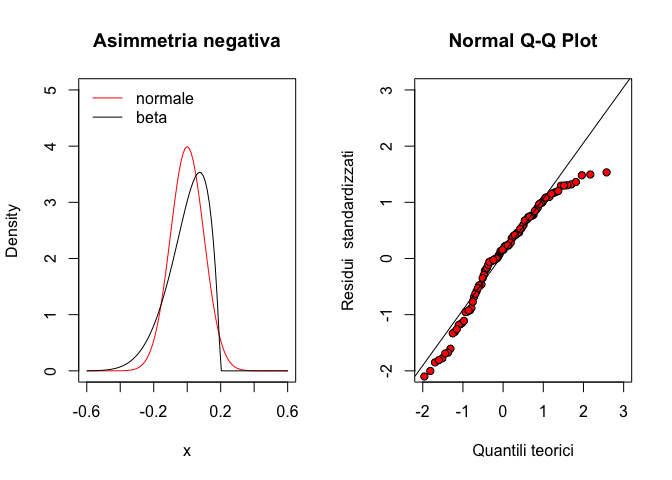
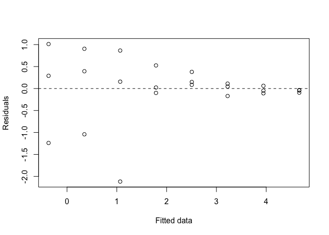
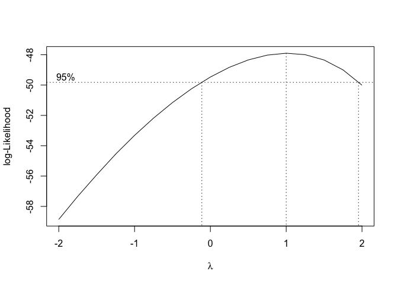
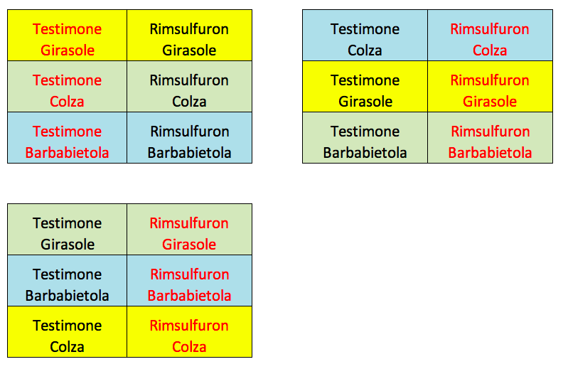

# Introduzione {-}


## Organizzazione del testo {-}

[Da fare]

## Gli autori {-}

[Da fare]

## Pre-requisiti {-}

<!--chapter:end:index.Rmd-->

# Scienza e pseudo-scienza


## Introduzione

In una società caratterizzata dal sovraccarico cognitivo immagino sia giusto chiedersi (e chiedere) che cosa sia la scienza, cosa distingua le informazioni scientifiche da tutto quello che invece non è altro che pura opinione, magari autorevole, ma senza il sigillo dell'oggettività.

Per quanto affascinante possa sembrare l'idea del ricercatore che con un'improvviso colpo di genio elabora una stupefacente teoria, dovrebbe essere chiaro che l'intuizione è solo un possibile punto di partenza, che non necessariamente prelude al progresso scientifico, per quanto geniale ed innovativa possa essere. In generale, almeno in ambito biologico, nessuna teoria acquisisce automaticamente valenza scientifica, ma rimane solo nell'ambito delle opinioni, indipendentemente dal fatto che nasca da un colpo di genio, oppure grazie ad un paziente e meticoloso lavoro di analisi intellettuale, che magari si concretizza in un modello matematico altamente elegante e complesso.

Da un punto di vista puramente intuitivo, è ovvio aspettarsi che una prova scientifica debba  uscire dall'ambito delle opinioni legate a divergenze di cultura, percezione e/o credenze individuali, per divenire, al contrario, oggettiva e universalmente valida, distinguendosi quindi da altre verità di natura metafisica, religiosa o pseudoscientifica. Che cosa è che permette alla scienza di divenire tale?

A questo proposito, riporto alcuni aforismi significativi:

1. Proof is a justified true belief (Platone, Dialoghi)
2. The interest I have in believing a thing is not a proof of the existence of that thing (Voltaire)
3. A witty saying proves nothing (Voltaire)

### Cosa è quindi una prova scientifica?

La base di tutta la scienza risiede nel cosiddetto 'metodo scientifico', che si fa comunemente risalire a Galileo Galilei (1564-1642) e che è riassunto nella figura seguente.


<div class="figure" style="text-align: center">

<p class="caption">(\#fig:figName11)Il metodo scientifico Galileiano</p>
</div>

Senza andare troppo in profondità, è importante notare due aspetti:

1. il ruolo fondamentale dell'esperimento scientifico, che produce dati a supporto di ipotesi pre-esistenti;
2. lo sviluppo di teorie basate sui dati, che rimangono valide fino a che non si raccolgono altri dati che le confutano, facendo nascere nuove ipotesi che possono portare allo sviluppo di nuove teorie, più affidabili o più semplici.

Insomma, l'ingrediente fondamentale di una prova scientifica è che è supportata da un insieme dei dati sperimentali; di fatto, non esiste scienza senza dati! Resta famoso l'aforisma "In God we trust, all the others bring data", attribuito all'ingegnere e statistico americano W. Edwards Deming (1999-1923), anche se pare che egli in realtà non l'abbia mai pronunciato.

##  Esperimenti buoni e cattivi!

Non tutti gli esperimenti sono buoni e, di conseguenza, non tutti i dati sono buoni. In particolare, due sono gli elementi che possono portare a dati di diversa affidabilità:

1. Errore sperimentale
2. Campionamento

Vediamo qualche dettaglio in più a proposito di questi due elementi.

### L'errore sperimentale

Alla base della raccolta di dati sperimentali vi è un processo di **misurazione**, attraverso la quale il fenomeno oggetto di studio viene caratterizzato con appositi strumenti scientifici, più o meno complessi. Il problema è che nessuna misura può essere considerata precisa in senso assoluto, cioè perfettamente coincidente col valore reale della grandezza misurata, che è destinato a rimanere un'entità incognita e indeterminabile.

In particolare, in ogni esperimento scientifico esiste un potenziale elemento di confusione che gli scienziati conoscono con il termine di **errore sperimentale**, con la cui presenza è necessario confrontarsi sempre e comunque.


Nel misurare una determinata grandezza fisica, indipendentemente dal metodo scelto per la misura, possiamo sempre commettere due tipi di errore: **sistematico** ed **accidentale (casuale)**.

L'errore sistematico è provocato da difetti intrinseci dello strumento o incapacità peculiari dell'operatore e tende a ripetersi costantemente in misure successive. Un esempio tipico è quello di una bilancia non tarata, che tende ad aggiungere 20 grammi ad ogni misura che effettuiamo. Per queste sue peculiarità, l'errore sistematico non è quantificabile e deve essere contenuto al minimo livello possibile tramite la perfetta taratura degli strumenti e l'adozione di metodi di misura rigidamente standardizzati e accettati dalla comunità scientifica mondiale.

L'errore accidentale (o casuale) è invece legato a fattori variabili nel tempo e nello spazio, quali:

1. *malfunzionamenti accidentali dello strumento*. Si pensi ad esempio al rumore elettrico di uno strumento, che fa fluttuare i risultati delle misure effettuate;
2. *imprecisioni o disattenzioni casuali dell'operatore*. Si pensi ad esempio ad un banale errore di lettura dello strumento, che può capitare soprattutto ad un operatore che esegua moltissime misure manuali con procedure di routine;
3. *irregolarità* dell'oggetto da misurare} unite ad una precisione relativamente elevata dello strumento di misura. Si pensi alla misurazione del diametro di un melone con un calibro: è facile che compaiano errori legati all'irregolarità del frutto o al fatto che l'operatore non riesce a misurare lo stesso nel punto in cui il suo diametro è massimo. Oppure, più semplicemente si pensi alla misurazione della produzione di granella di una certa varietà di frumento: anche ipotizzando di avere uno strumenti di misura perfetto e quindi esente da errore, la produzione mostrerebbe comunque una fluttuazione naturale da pianta a pianta, in base al patrimonio genetico e, soprattutto, in base alle condizioni di coltivazione che non possono essere standardizzate oltre ad un certo livello (si pensi alla variabilità del terreno agrario).

Dato che queste imprecisioni sono assolutamente casuali è chiaro che le fluttuazioni positive (misura maggiore di quella vera) sono altrettanto probabili di quelle negative e tendono a presentarsi con la stessa frequenza quando si ripetano le misure più volte. Di conseguenza, l'errore sperimentale casuale può essere gestito attraverso la **replicazione delle misure**: infatti, se ripeto una misura soggetta a questo tipo di errore, nel lungo periodo gli errori positivi e negativi tendono ad annullarsi reciprocamente e la media delle misure effettuate tende quindi a coincidero con il valore reale della grandezza da misurare.

### Il campionamento

Se è vero, e la pratica sperimentale lo conferma, che ripetere le misure porta ad ottenere molti risultati diversi, nasce il problema di capire quante repliche sono necessarie. Se si ripensa a quanto detto finora, dovrebbe risultare evidente che, per ottenere misure pari all'effettivo (reale) valore della grandezza da misurare, bisognerebbe effettuare infinite repliche. Tuttavia è altrettanto evidente che questo procedimento è totalmente improponibile!!!

Qual è la strada seguita dagli scenziati, quindi? E' quella di raccogliere un numero finito di misure, sufficientemente basso da essere compatibile con le umane risorse di tempo e denaro, ma sufficientemente alto da essere giudicato attendibile. Qualunque sia questo valore finito, è evidente che ci troviamo difronte solo ad un campione delle infinite misure che avremmo dovuto fare, ma che non abbiamo fatto. La domanda è: questo campione è rappresentativo o no? E' in grado di descrivere adeguatamente la realtà? E' possibile che gli errori sperimentali positivi e negativi non si siano annullati tra loro, confondendosi con l'effetto biologico in studio? In altre parole: possiamo fidarci dei dati che abbiamo raccolto?

La possibilità di raccogliere dati sbagliati è tutt'altro che remota. Gli scienziati american Pons e Fleischmann il 23 Marzo del 1989 diffusero pubblicamente la notizia di essere riusciti a riprodurre la fusione nucleare fredda, causando elevatissimo interesse nella comunità scientifica. Purtroppo le loro misure erano vizite da una serie di problemi e il loro risultato fu clamorosamente smentito da esperimenti successivi.

<div class="figure" style="text-align: center">

<p class="caption">(\#fig:figName2)Conseguenze di un esperimento sbagliato</p>
</div>

## Scienza = metodo

Insomma, la scienza deve essere basata sui dati, ma i dati contengono inevitabili fonti di incertezza, legate all'errore sperimentale e al processo di campionamento. Come si può procedere in queste condizioni? Il punto fondamentale è quello di adottare un metodo sperimentale che consenta di ottenere dati **il più  affidabili possibile**. Insomma, questa semplice affermazione significa che bisogna fare eseperimenti ben condotti, precisi, seguendo procedure standardizzate e/o largamente condivise dalla comunità scientifica.

Certo è che, per quanto detto in precedenza, il fatto che i dati provengano da un processo di campionamento impedisce, di fatto, di ottenere un'affidabilità totale. Cosa succederebbe se ripetessimo l'esperimento?

Insomma, bisogna fare alcune considerazioni, che elenco di seguito:

1. in primo luogo si dovrà accettare il fatto che, contrariamente a quanto si potrebbe o vorrebbe credere, non esistono prove scientifiche totalmente certe, ma l'incertezza è un elemento intrinseco della scienza.
2. In secondo luogo si dovranno utilizzare gli strumenti della statistica necessari per quantificare l'incertezza residua, che dovrà essere sempre riportata a corredo dei risultati di ogni esperimento scientifico.
 3. Ogni risultato sarà quindi valutato dalla comunità scientifica sullo sfondo della sua incertezza, seguendo alcune regole di natura probabilistica che consentono di stabilire se la prova scientifica è sufficientemente forte per essere considerata tale.

Un elemento fondamentale di valutazione della bontà di un esperimento e dei dati da esso ottenuti sta nella cosiddetta **replicabilità**, cioè nella probabilità di ottenere risultati molto simili (se non uguali) replicando l'esperimento in condizioni analoghe. Per valutare se un esperimento è replicabile è necessario che questo sia descritto con un grado di dettaglio tale da permettere a chinque di ripeterlo, ottenendo risultati comparabili e non contraddittori. Nessun risultato di cui non sia provata la riproducibilità è da considerarsi valido.

E'chiaro comunque che ogni esperimento può essere smentito. Questo non è un problema: la scienza è pronta a considerare una prova scientifica valida fino a che non si raccolgono dati altrettanto affidabili che la confutino. In questo caso, si abbandona la teoria confutata e si abbraccia la nuova. L'abbandono può anche non essere totale: ad esempio la teoria gravitazionale di Newton è ancora oggi valida per molto situazioni pratiche, anche se è stata abbandonata in favore della teoria della relatività, che spiega meglio il moto dei corpi ad altissime velocità.

In effetti, la scienza considere sempre con attenzione il principio del rasoio di Occam, per il quale si accetta sempre la teoria più semplice per interpretare una dato fenomeno, riservando le teorie più complesse alle situazioni più difficili, che giustificano tale livello di complessità.

## Chi valuta se un esperimento è attendibile?

Quanto detto finora vorrebbe chiarire come il punto centrale della scienza non è la certezza delle teorie, bensì il metodo che viene utilizzato per definirle. Ognuno di noi è quindi responsabile di verificare che le informazioni in suo possesso siano 'scientificamente' attendibili, cioè ottenute con un metodo sperimentale adeguato. Il fatto è che non sempre siamo in grado di compiere questa verifica, perché non abbiamo strumenti 'culturali' adeguati, se non nel ristretto ambito delle nostre competenze professionali. Come fare allora?

L'unica risposta accettabile è quella di controllare l'attendibilità delle fonti di informazione. In ambito biologico, le riviste autorevoli sono caratterizzate dal procedimento di '*peer review*', nel quale i manoscritti scientifici, prima della pubblicazione, sono sottoposti ad un comitato editoriale ed assegnati ad un 'editor', il quale legge il lavoro e contemporaneamente lo invia a due o tre scienziati anonimi e particolarmente competenti in quello specifico settore scientifico (*reviewers* o revisori).

I revisori, insieme all'*editor*, compiono un attento lavoro di esame  e stabiliscono se l'evidenza scientifica presentata è sufficientemente 'forte'. Le eventuali critiche vengono presentate all'autore, che è tenuto a rispondere in modo convincente, anche ripetendo gli esperimenti se necessario. Il processo richiede spesso interi mesi ed è abbastanza impegnativo per uno scenziato. E' piuttosto significativa l'immagine presentata in [scienceBlog.com](http://scienceblogs.com/startswithabang/2013/06/07/the-4-jobs-of-a-referee-in-peer-review/), che allego qui.


<div class="figure" style="text-align: center">

<p class="caption">(\#fig:figName3)Il processo di peer review</p>
</div>

In sostanza il meccanismo di *peer review* è l'analogo scientifico di un processo, nel quale l’inputato (lavoro scientifico) viene assolto (rilasciato, leggi: rigettato) in presenza di qualunque ragionevole dubbio metodologico. Attenzione: il dubbio che non deve esistere è quello metodologico, dato che il dubbio sul risultato non può essere allontanato completamente e i reviewer controlleranno solo che esso si trovi al disotto della soglia massima, stabilita con metodiche statistiche.

Questo procedimento, se effettuato con competenza, dovrebbe aiutare a separare la scienza dalla pseudo-scienza e, comunque, ad eliminare la gran parte degli errori metodologici dai lavori scientifici.

## Il metodo sperimentale

Almeno in ambito biologico, la definizione del metodo sperimentale è fondamentalmente attribuita allo scienziato inglese Ronald Fisher (1890-1962), che l'ha esplicitata nel suo famoso testo del 1935 (The design of experiments). Mi sembra opportuno riassumerla nelle tre espressioni 'chiave': controllo locale degli errori, replicazione e randomizzazione. Si tratta di:

1. contenere al massimo possibile l'errore sperimentale, con l'adozione di tecniche opportune, in modo da separare le fonti di variabilità, isolando qualla oggetto di studio (controllo locale degli errori);
2. replicare le misure più volte (replicazione)
3. Scegliere le unità sperimentali da misurare in modo totalmente casuale, così da avere un campione rappresentativo ed evitare di confondere gli effetti prodotti dall'errore sperimentale con quelli prodotti dal fenomeno biologico oggetto di studio (randomizzazione)

Vediamo ora un'esempio banale di come procedere.

## Metodi sperimentali validi ed invalidi

Immaginiamo un ricercatore che abbia un'idea brillante: egli ha inventato un nuovo fertilizzante 'prodigioso'. E' evidente che non può presentarsi alla comunità scientifica declamando le doti di questo fertilizzante, in quanto egli verrebbe immediatamente esposto al pubblico ludibrio, perchè sta presentando delle opinioni, non delle evidenze scientifiche (almeno, così dovrebbe essere, in una società sana... purtroppo in un'era di pseudo-scienza siamo sempre pronti a dar credito a chiunque, senza un'adeguata dose di scetticismo... )

### Primo esperimento

Come ogni scenziato, egli deve raccogliere dati. E lo fa, organizzando un esperimento, nel quale prende un campo di mais e lo fertilizza con il suo nuovo composto, ritraendo una produzione del 20% superiore a quella usuale. Ovviamente, se prova a pubblicare questa notizia, il suo lavoro verrà certamente (si spera...) rigettato, in quanto rimane il dubbio su chi sia la causa dell'effetto riscontrato: il fertilizzante? il clima dell'anno di prova? il suolo? la varietà di mais impiegata? E' chiaro che questo non è un esperimento controllato: il campo trattato e quello non trattato (riferimento) differiscono per molte altre caratteristiche, oltre al fertilizzante impiegato.

### Secondo esperimento

A questo punto il ricercatore pianifica un esperimento comparativo controllato: prende due campi di mais, vicini, con lo stesso terreno, semina la stessa varietà di mais e coltiva i due campi esattamente nello stesso modo, con l'unica differenza che in uno di essi somministra il fertilizzante in studio (campo trattato) e nell'altro no (testimone o controllo). Alla fine osserva che il campo trattato produce 130 tonnellate per ettaro, mentre quello non trattato ne produce 115 e conclude che il nuovo fertilizzante è efficace (+ 12% circa). Infatti egli ritiene che, dato che i due campi sono totalmente uguali, l'incremento di produzione non possa che essere attribuito al fertilizzante. Scrive un report, che, purtroppo, viene rigettato.

Anche se questo secondo esperimento è meglio del primo, permane tuttavia il dubbio che l'effetto si sia prodotto per caso. Potrebbe infatti esserci stata una qualche situazione non osservata che ha avvantaggiato uno dei due campi. Ad esempio un attacco di insetti, una carenza idrica, o qualsivoglia altra situazione. Questo vi sembra improbabile? Non importa, con una sola osservazione il ricercatore non è in grado di provare che il risultato è replicabile.

### Terzo esperimento

Avendo imparato la lezione, il ricercatore fa un nuovo esperimento, utilizzando stavolta otto campi: quattro trattati e quattro non trattati. Anche in questo caso osserva un incremento produttivo medio del 12% circa ed è sicuro che l'effetto è replicabile, perché lo ha osservato più volte. Purtroppo, anche questo esperimento non viene considerato affidabile e, di conseguenza, il lavoro non è pubblicabile. Stavolta il problema è che il ricercatore, senza accorgersene, ha scelto i campi trattati con un criterio sistematico: procedendo da sinistra verso destra, ha trattato un campo ed ha lasciato non trattato quello immediatamente contiguo alla sua destra e così via. Di conseguenza, i campi trattati sono tutti a sinistra di quelli non trattati, il che crea un ragionevole dubbio: e se vi fosse un gradiente di fertilità da destra verso sinistra? Questo potrebbe dare origine ad una produttività maggiore dei campi a destra, rispetto a quelli a sinistra, indipendentemente dall'effetto del concime. In presenza di questo 'ragionevole' dubbio, la prova non può avere valenza scientifica.


### Quarto esperimento: quello buono

Il ricercatore prende allora otto campi ed assegna il trattamento a quattro di essi, scelti in modo totalmente casuale. In questo caso è sicuro che, anche se vi fosse un qualche elemento estraneo di confusione (gradiente di fertilità, attacco di insetti...), esso dovrebbe colpire le unità sperimentali casualmente disposte senza creare vantaggi particolari all'uno o all'altro dei due trattamenti. Ovviamente egli non è certo (e non può esserlo) che l'esperimento sia del tutto attendibile; infatti potrebbe essere stato così sfortunato che un qualche elemento estraneo ignoto si è accanito proprio sulle parcelle non trattate, danneggiandone la produttività. Solo che, grazie alla scelta casuale, questa evenienza diviene altamente improbabile, così da rendere i dubbi irragionevoli. In questo caso l'esperimento è controllato, replicato e randomizzato e il risultato ottenuto, in quanto ragionevolmente attendibile, può essere pubblicato.

## Incertezza residua

Insomma, un esperimento valido è controllato, replicato e randomizzato. Tuttavia le misure raccolte sono poche e sono solo un campione di tutte quelle possibili. Infatti il nostro ricercatore ha usato otto campi, ma ne avrebbe potuti usare 16, 32 e così via. Rimane quindi il dubbio, che, se facessimo altre misure (cioè ampliassimo il campione), queste potrebbero invalidare i risultati ottenuti fino a quel momento.

Se mi è concesso un paragone calcistico, è un po' come chiedersi come finirà una partita di calcio dopo aver assistito solo al primo tempo: in alcune circostanze, quando una delle due squadre ha mostrato una chiara superiorità, la previsione è abbastanza facile, mentre in altre circostanze l'equivalenza dei valori in campo la rende alquanto difficile. In tutti i casi, si tratta solo di una previsione, che può essere sempre smentita alla prova dei fatti.

Anche la scienza funziona così. Noi osserviamo solo il primo tempo, che, nel caso del nostro ricercatore, consiste di otto misure. Osserviamo che le quattro misure del fertilizzato sono tutte in modo consistente molto più alte di quelle del non trattato e quindi possiamo concludere, con ragionevole certezza, che il fertilizzante è efficace. In altri casi, dove la produzione media del trattato fosse solo lievemente più alta del non trattato, l'esperimento potrebbe essere inconclusivo, cioè incapace di dare risultati attendibili sull'effettiva efficacia del nostro fertilizzante. Avremmo quindi bisogno di fare altre prove di conferma.

## Il ruolo della statistica

Nell'ottica esposta in precedenza, la statistica ci fornisce gli strumenti per riassumere le misure effettuate, calcolarne l'incertezza e rappresentare la forza dell'evidenza scientifica, in modo da poter prendere decisioni sull'efficacia dei trattamenti e sull'esigenza di ulteriori verifiche. Imparare a conoscere e comprendere questi strumenti statistici è l'obiettivo di questo corso.

## Conclusioni

In conclusione, possiamo ripartire dalla domanda iniziale: "Che cosa è la scienza?", per rispondere che è scienza tutto ciò che è supportato da dati che abbiano passato il vaglio della *peer review*, dimostrando di essere stati ottenuti con un procedimento sperimentale privo di vizi metodologici e di essere sufficientemente affidabili in confronto alle fonti di incertezza cui sono associati.

Qual è il *take-home message* di questo capitolo? Fidatevi solo delle riviste scientifiche attendibili, cioè quelle che adottano un serio processo di *peer review* prima della pubblicazione.

<!--chapter:end:01-introBiometry.Rmd-->

# Esperimenti validi ed invalidi

## Definizioni

La ricerca scientifica trova la sua unità elementare nell'esperimento, cioè un *processo investigativo, con il quale, seguendo un adeguato protocollo, si osserva e si misura la risposta prodotta da uno o più 'stimoli' sperimentali nei soggetti coinvolti nello studio*. Raramente gli esperimenti sono isolati, più spesso fanno parte di uno sforzo collettivo organizzato, generalmente identificato con il nome di progetto di ricerca.

Ogni esperimento deve essere attentamente pianificato. Infatti, sappiamo che la variabilità esistente tra soggetti sperimentali, il campionamento, le irregolarità di misura e molti altri fattori perturbativi ci impediscono di osservare la realtà con assoluta precisione. E' come se osservassimo un fenomeno attraverso una sorta di lente deformante, che ci impone di adottare un metodo sperimentale rigoroso, per evitare di attribuire al fenomeno in studio effetti che sono invece puramente casuali o, anche peggio, dovuti a qualche elemento ignoto.

In particolare, gli esperimenti debbono essere:

1. Precisi
2. Accurati
3. Replicabili/Riproducibili

In mancanza di questi requisiti, al termine dell'esperimento possono rimanere dubbi sui risultati, tali da inficiare la validità delle conclusioni raggiunte. Cerchiamo di chiarire cosa si intende con questi tre termini.

**Precisione**. Con il termine precisione intendiamo due cose: la prima è relativa al numero di decimali che ci fornisce il nostro strumento di misura. E'evidente, ad esempio, come un calibro sia più preciso di un metro da sarto. Oltre a questo concetto abbastanza intuitivo di precisione ce n'è un altro, specificatamente legato agli esperimenti scientifici, nei quali le misure vengono ripetute più volte. La precisione di un esperimento non è altro che la variabilità dei risultati tra una replica e l'altra.

**Accuratezza**. La precisione, da sola, non garantisce che l'esperimento sia affidabile. Abbiamo menzionato nel capitolo precedente che l'errore sperimentale può essere casuale o sistematico. Quest'ultimo può essere dovuto, per esempio, ad uno strumento non accurato che sovrastima tutte le misure. In questo caso, posso ripetere cento volte la misura, ottenendo sempre lo stesso risultato, molto preciso, ma totalmente inaffidabile, nel senso che non riflette la misura reale del soggetto. L'accuratezza è proprio la capacità di un procedimento di misura di restituire il valore vero del soggetto misurato, anche se come media di un numero molto elevato di replicazioni. L'accuratezza è molto più importante della precisione: infatti una misura accurata, ma imprecisa, riflette bene la realtà, anche se in modo vago. Al contrario, una misura precisa, ma inaccurata ci porta completamente fuori strada, perchè non riflette la realtà! Un esperimento/risultato non accurato si dice 'distorto' (*biased*).

**Replicabilità/Riproducibilità**. Un esperimento o una misura sono replicabili se, quando ripetuti in condizioni assolutamente analoghe (stessi soggetti, ambiente, strumenti...), restituiscono risultati equivalenti. Alcuni biostatistici distinguono la replicabilità dalla riproducibilità, in quanto considerano quest'ultima come la possibilità di ottenere risultati equivalenti ripetendo una misura in condizioni diverse (diversi soggetti, diverso ambiente...). E'evidente che un esperimento può essere totalmente accurato e replicabile, ma non riproducibile con soggetti e condizioni ambientali diverse. Se è così, le conclusioni raggiunte, anche se accurate, non sono generalizzabili.

## Elementi fondamentali del disegno sperimentale

La metodica di organizzazione di un esperimento prende il nome di *disegno sperimentale* e deve essere sempre adeguatamente formalizzata tramite la redazione di un *protocollo sperimentale* sufficientemente dettagliato da consentire a chiunque la replicazione dell'esperimento e la verifica dei risultati.

Le basi del disegno sperimentale si fanno in genere risalire a Sir Ronald A. Fisher, vissuto in Inghilterra dal 7 Febbraio 1890 al 29 luglio 1962. Laureatosi nel 1912, lavora come statistico per il comune di Londra, fino a quando diviene socio della prestigiosa Eugenics Education Society di Cambridge, fondata nel 1909 da Francis Galton, cugino di Charles Darwin. Dopo la fine della guerra, Karl Pearson gli propone un lavoro presso il rinomato Galton Laboratory, ma egli non accetta a causa della profonda rivalità esistente tra lui e Pearson stesso. Nel 1919 viene assunto presso la Rothamsted Experimental Station, dove si occupa dell'elaborazione dei dati sperimentali e, nel corso dei successivi 7 anni, definisce le basi del disegno sperimentale ed elabora la sua teoria della "analysis of variance". Il suo libro più importante è "The design of experiment", del 1935. E' sua la definizione delle tre componenti fondamentali del disegno sperimentale:

1. controllo degli errori;
2. replicazione;
3. randomizzazione.

Abbiamo già menzionato questi aspetti nel capitolo precedente; ora li riprendiamo in esame con maggior dettaglio.

### Primo elemento: controllo degli errori

Controllare gli errori, o, analogamente, eseguire un esperimento controllato signfica fondamentalmente due cose:

1. adottare provvedimenti idonei ad evitare le fonti di errore, mantenendole al livello più basso possibile (alta precisione);
2. agire in modo da isolare l'effetto in studio (accuratezza), evitando che si confonda con effetti casuali e di altra natura. Ad esempio, se dobbiamo confrontare due fitofarmaci, dobbiamo fare in modo che i soggetti inclusi nell'esperimento differiscano tra di loro solo per il fitofarmaco impiegato e non per altro.

Declinare questi principi richiederebbe una vita di esperienza! Vogliamo solo ricordare alcuni aspetti fondamentali, relativi all'importanza di:

1. Campionamento rappresentativo
2. Omogeneità
3. Rigore metodologico
4. Evitare le 'intrusioni'

#### Campionamento rappresentativo

E' evidente che il primo requisito di un esperimento è una corretta scelta delle unità sperimentali, cioè le più piccole unità che ricevono lo 'stimolo' rappresentato dal trattamento, in modo indipendente da tutte le altre.

Cerchiamo subito di comprendere una fondamentale distinzione tra unità sperimentali e unità osservazionali. Le prime sono state definite nel paragrafo precedente; le seconde sono quelle che costituiscono l'oggetto della misura e possono anche non coincidere con le prime. Ad esempio: immaginiamo di trattare con un diserbante due vasetti, in modo indipendente l'uno dall'altro. Immaginiamo poi di pesare singolarmente le quattro piante di ciascun vasetto; in questa situazione, il vasetto è l'unità sperimentale, le piante sono invece le unità osservazionali. L'elemento discriminante di questo esempio è l'indipendenza: mentre le unità sperimentali hanno ricevuto il trattamento in modo indipendente l'una dall'altra, le unità osservazionali no. Questa differenza è fondamentale, per motivi che vedremo più avanti.

Le unità sperimentali possono essere di varia natura (persone, semi, piante, animali...); nel caso degli esperimenti di campo, le unità sperimentali sono dette **parcelle** e sono un pezzetto di terreno, di varia forma e dimensione.


<div class="figure" style="text-align: center">

<p class="caption">(\#fig:figName21)Una prova sperimentale in campo (Foto D. Alberati)</p>
</div>

Le unità sperimentali sono scelte per campionamento, che è un elemento fondamentale dell'esperimento ed avviene all'interno della cosiddetta **cornice di campionamento**, cioè la popolazione da cui io devo campionare. Quest'ultima deve essere scelta in modo adeguato: devo effettuare un esperimento valido per l'Italia centrale, per una località particolare, per tutta Italia? Devo fare un esperimento che riguarda una stalla in particolare o tutte le stalle dove si allevano bovini? Di quale razza? La **cornice di campionamento** è fondamentale in quanto il campione, se ben scelto, rappresenta la popolazione da cui deriva, non altre.

E' superfluo dire che, nell'ambito della cornice di campionamento, il campione deve essere prescelto in modo da essere rappresentativo, altrimenti l'esperimento è invalido. Dare indicazioni su come si possa assicurare la rappresentatività del campione è impossibile, in quanto ciò dipende dalla tipologia di esperimento. Il campionamento è fondamentale nelle scienze sociali, dove vengono applicate tecniche particolari, come il campionamento randomizzato (completamente casuale), quello stratificato (che avviene all'interno di strati omogenei della popolazione), quello sistematico (es. prendo il primo soggetto che incontro e poi ne prendo uno ogni dieci), ecc.. Chi fosse interessato può reperire informazioni in letteratura [@DanielSamplingessentialspractical2011].

Nelle scienze agrarie e biologiche, il campionamento si giova di metodologie meno 'raffinate' e spesso si prendono i soli soggetti disponibili (le parcelle di un campo sperimentale o gli animali della stalla del Dipartimento in cui si opera...). E' chiaro che, pur non eseguendo una vera e propria operazione di campionamento, non bisogna scordare che i soggetti sperimentali rappresentano solo la popolazione da cui sono stati estratti. Ad esempio, se faccio un esperimento in un'azienda sperimentale del centro Italia, i risultati che ottengo sono riferibili solo a questa zona geografica; se volessi conclusioni più generali dovrei cercare anche altre aziende in situazioni pedo-climatiche diverse.


#### Omogeneità

Anche in questo caso, l'importanza di scegliere soggetti uniformi e posti in un ambiente uniforme (nello spazio e nel tempo) è evidente. Bisogna comunque tener presente che i risultati di un esperimento si estendono alla popolazione da cui il campione è estratto e della quale esso rappresenta le caratteristiche. Esperimenti nei quali si restringe il campo di variabilità dei soggetti e dell'ambiente sono certamente più precisi, ma forniscono anche risultati meno generalizzabili. L'importante è avere ben chiaro su quale è il campo di validità che si vuole dare ai risultati. Ad esempio, se si vuole ottenere un risultati riferito alla collina umbra, bisognerà scegliere soggetti che rappresentano bene la variabilità pedo-climatica della collina Umbra; né più, né meno.

#### Rigore

Direi che questo aspetto è ovvio e non richiede commenti particolari: una ricerca deve essere condotta 'a regola d'arte'. E' evidente che, ad esempio, se vogliamo sapere la cinetica di degradazione di un erbicida a 20 °C dovremo realizzare una prova esattamente a quella temperatura, con un erbicida uniformemente distribuito nel terreno, dentro una camera climatica capace di un controllo perfetto della temperatura. Gli strumenti dovranno essere ben tarati e sarà necessario attenersi scrupolosamente a metodi validati e largamente condivisi.

Tuttavia, a proposito di rigore, non bisogna scordare quanto diceva C.F. Gauss a proposito della precisione nei calcoli, e che può essere anche riferito al rigore nella ricerca : "*Manca di mentalità matematica tanto chi non sa riconoscere rapidamente ciò che è evidente, quanto chi si attarda nei calcoli con una precisione superiore alla necessità*"


#### Evitare le 'intrusioni demoniache'

Secondo Hurlbert (1984), le intrusioni sono eventi totalmente casuali che impattano negativamente con un esperimento in corso. E' evidente che, ad esempio, un'alluvione, l'attacco di insetti o patogeni, la carenza idrica hanno una pesante ricaduta sulla precisione di un esperimento e sulla sua riuscita. Nello stesso lavoro, Hurlbert usa il termine 'intrusione demoniaca' per indicare quelle intrusioni che, pur casuali, avrebbero potuto essere previste con un disegno più accurato, sottolineando in questo caso la responsabilità dello sperimentatore.

Un esempio è questo: uno sperimentatore vuole studiare l'entità della predazione dovuta alle volpi e quindi usa campi senza staccionate (dove le volpi possono entrare) e campi protetti da staccionate (e quindi liberi da volpi). Se le staccionate, essendo utilizzate dai falchi come punto d'appoggio, finiscono per incrementare l'attività predatoria di questi ultimi, si viene a creare un'intrusione demoniaca, che rende l'esperimento distorto. Il demonio, in questo caso, non è il falco, che danneggia l'esperimento, ma il ricercatore stesso, che non ha saputo prevedere una possibile intrusione.

### Secondo elemento: replicazione

In ogni esperimento, i trattamenti dovrebbe essere replicati su due o più unità sperimentali. Ciò permette di:

1. dimostrare che i risultati sono replicabili (ma non è detto che siano riproducibili!)
2. rassicurare che eventuali circostanze aberranti casuali non abbiano provocato risultati distorti
3. misurare l'errore sperimentale, come variabilità di risposta tra repliche trattate nello stesso modo (precisione dell'esperimento)
4. incrementare la precisione dell'esperimento (più sono le repliche più l'esperimento è preciso, perché si migliora la stima della caratteristica misurata, diminuendo l'incertezza)

Per poter essere utili, le repliche debbono essere indipendenti, cioè debbono **aver subito tutte le manipolazioni necessarie per l'allocazione del trattamento in modo totalmente indipendente l'una dall'altra**. Le manipolazioni comprendono tutte le pratiche necessarie, come ad esempio la preparazione delle soluzioni, la diluizione dei prodotti, ecc..

La manipolazione indipendente è fondamentale, perché in ogni parte del processo di trattamento possono nascondersi errori più o meno grandi, che possono essere riconosciuti solo se colpiscono in modo casuale le unità sperimentali. Se la manipolazione è, anche solo in parte, comune, questi errori colpiscono tutte le repliche allo stesso modo, diventano sistematici e quindi non più riconoscibili. Di conseguenza, si inficia l'accuratezza dell'esperimento. Quando le repliche non sono indipendenti, si parla di **pseudorepliche**, contrapposte alle **repliche vere**.

Il numero di repliche dipende dal tipo di esperimento: più sono e meglio è, anche se è necessario trovare un equilibrio accettabile tra precisione e costo dell'esperimento. Nella sperimentazione di campo, due repliche sono poche, tre appena sufficienti, quattro costituiscono la situazione più comune, mentre un numero maggiore di repliche è abbastanza raro, non solo per la difficoltà di seguire l'esperimento, ma anche perché aumentano la dimensione della prova e, di conseguenza, la variabilità del terreno.


### Terzo elemento: randomizzazione

L'indipendenza di manipolazione non garantisce da sola un esperimento corretto. Infatti potrebbe accadere che le caratteristiche innate dei soggetti, o una qualche 'intrusione' influenzino in modo sistematico tutte le unità sperimentali trattate nello stesso modo, così da confondersi con l'effetto del trattamento. Un esempio banale è che potremmo somministrare un farmaco a quattro soggetti in modo totalmente indipendente, ma se i quattro soggetti fossero sistematicamente più alti di quelli non trattati finiremmo per confondere una caratteristica innata con l'effetto del farmaco. Oppure, se le repliche di un certo trattamento si trovassero tutte vicine alla scolina, potrebbero essere più danneggiate delle altre unità sperimentali dal ristagno idrico, il cui effetto si confonderebbe con quello del trattamento stesso.

Questi problemi sono particolarmente insidiosi e si nascondono anche dietro ai particolari apparentemente più insignificanti. La randomizzazione è l'unico sistema per evitare, o almeno rendere molto improbabile, la confusione dell'effetto del trattamento con fattori casuali e/o comunque diversi dal trattamento stesso. La randomizzazione si declina in vari modi:

1. allocazione casuale del trattamento alle unità sperimentali. Gli esperimenti che prevedono l'allocazione del trattamento sono detti 'manipolativi' o 'disegnati'.
2. A volte l'allocazione del trattamento non è possibile o non è etica. Se volessimo studiare l'effetto delle cinture di sicurezza nell'evitare infortuni gravi, non potremmo certamente provocare incidenti deliberati. In questo caso la randomizzazione è legata alla scelta casuale di soggetti che sono 'naturalmente' trattati. Esperimenti di questi tipo, si dicono **osservazionali**. Un esempio è la valutazione dell'effetto dell'inquinamento con metalli pesanti nella salute degli animali: ovviamente non è possibile, se non su piccola scala, realizzare il livello di inquinamento desiderato e, pertanto, dovremo scegliere soggetti che sono naturalmente sottoposti a questo genere di inquinamento, magari perché vivono vicino a zone industriali.
3. Se i soggetti sono immobili, la randomizzazione ha anche una connotazione legata alla disposizione spaziale e/o temporale casuale.

L'assegnazione casuale del trattamento, o la selezione casuale dei soggetti trattati, fanno si che tutti i soggetti abbiano la stessa probabilità di ricevere qualunque trattamento oppure qualunque intrusione casuale. In questo modo, la probabilità che tutte le repliche di un trattamento abbiano qualche caratteristica innata o qualche intrusione comune che li penalizzi/avvantaggi viene minimizzata. Di conseguenza, confondere l'effetto del trattamento con variabilità casuale ('confounding’), anche se teoricamente possibile, diviene altamente improbabile.

#### Gradienti e blocking

Un esperimento in cui l'allocazione del trattamento, o la scelta dei soggetti trattati, o la disposizione spaziale dei soggetti sono totalmente casuali si dice ‘completamente randomizzato’. E' perfettamente valido, perché non pone dubbi fondati di inaccuratezza. Tuttavia, in alcune circostanze è possibile porre restrizioni (vincoli) alla randomizzazione, perché ciò porta ad un esperimento più preciso.

In particolare, le unità sperimentali possono presentare delle differenze, ad esempio di fertilità, oppure di sesso. Ad esempio, randomizzare completamente l'allocazione dei trattamenti potrebbe far si che tra le repliche di un trattamento vi siano più maschi che femmine, il che crea un certo livello di 'confounding'. Pertanto potrebbe essere utile divider i soggetti in due gruppi (maschi e femmine), oppure in più gruppi (molto fertile, mediamente fertile, poco fertile...) e randomizzare i trattamenti all'interno di ogni gruppo.

In generale, il *blocking* consiste nel suddividere i soggetti in gruppi uniformi e ripetere lo stesso esperimento (o parte di esso) all'interno di ciascun gruppo, cioè in una situazione di maggiore omogeneità.

Il raggruppamento delle unità sperimentali può tener conto di:

1. vicinanza spaziale (campi, parcelle, stalle ...)
2. caratteristiche fisiche (età, peso, sesso ... )
3. vicinanza temporale
4. gestione dei compiti (tecnico, valutatore, giudice ...)

A volte si possono anche avere situazioni in cui abbiamo soggetti raggruppati per due caratteristiche o più; ad esempio potremmo avere quattro classi di età e quattro di peso: ogni trattamento deve essere applicato ad ogni combinazione pesò ed età (eta1 + peso1, età2 + peso2, età3 + peso3 ed età4 + peso4). In questo modo riusciamo a diminuire ulteriormente la variabilità non spiegata e, pertanto, ad aumentare la precisione dell'esperimento.

Chiaramente, randomizzare all'interno del gruppo invece che randomizzare completamente crea un vincolo. Posto che non si deve violare l'indipendenza delle repliche, l'inclusione di vincoli alla randomizzazione è consentita, **ma questa deve sempre essere tenuta presente in fase di analisi dei dati**.

Ronald Fisher diceva "*Analyse them as you have randomised them*". Meglio seguire il consiglio.

#### E se ricercatori/soggetti sono influenzabili?

Per concludere questa parte, è opportuno menzionare il fatto che, in un esperimento scientifico, il fatto che lo sperimentatore e il soggetto siano coscienti del trattamento somministrato può portare a risultati distorti. Per esempio, nell'eseguire un rilievo, lo sperimentatore può essere influenzato dal sapere con quale diserbante è stata trattata una parcella, cercando inconsciamente conferme alle sue conoscenze pregresse. D'altro canto, nei soggetti sperimentali dotati di coscienza (uomo) sapere di essere stati trattati può influenzare l'esito del trattamento (effetto placebo).

Per evitare questi problemi, soprattutto in ambito medico, un esperimento può essere pianificato come:

1. cieco: l'unità sperimentale o lo sperimentatore non sono coscienti dei dettagli del trattamento;
2. doppio cieco: né l'unità sperimentale né lo sperimentatore sono a coscienza dei dettagli del trattamento

Un esperimento cieco e/o doppio cieco possono non essere eticamente corretti oppure inutili, nel qual caso si torna ad un esperimento tradizionale 'aperto' (*open experiment*: Tutti sanno tutto’)

### Esperimenti non validi

A questo punto dovrebbero essere chiare le caratteristiche di un esperimento valido. A completamento, cerchiamo di elencare alcune caratteristiche di un esperimento non valido.

1. Cattivo controllo degli errori
2. Fondati sospetti di confounding
3. Mancanza di repliche vere
4. Confusione tra repliche vere e pseudo-repliche
5. Mancanza di randomizzazione
6. Presenza di vincoli alla randomizzazione, trascurati in fase di analisi.

Le conseguenze di queste problematiche sono abbastanza diverse.

#### Cattivo controllo degli errori

Bisogna verificare se il problema è relativo a questioni come la mancanza di scrupolosità, l'uso di soggetti poco omogenei o di un ambiente poco omogeneo, o altri aspetti che inficiano solo la precisione, ma non l'accuratezza dell'esperimento. In questo caso, l'esperimento è ancora valido (accurato), ma la bassa precisione probabilmente impedirà di trarre conclusioni forti. Quindi, un esperimento impreciso si 'elimina' da solo, perché sarà inconclusivo. Di questi esperimenti bisogna comunque diffidare, soprattutto quando siano pianificati per mostrare l'assenza di differenze tra due trattamenti alternativi. Mostrare l'assenza di differenze è facile: basta fare male un esperimento, in modo che vi sia un alto livello di incertezza e quindi l'evidenza scientifica sia molto debole.

Diversa è la situazione in cui un cattivo controllo degli errori, ad esempio l'adozione di metodi sbagliati, porta a mancanza di accuratezza, cioè a risultati che non riflettono la realtà (campionamento sbagliato, ad esempio; oppure strumenti non tarati; impiego di metodi non validati e/o non accettabili). In questo caso venendo a mancare l'accuratezza, l'esperimento deve essere rigettato, in quanto non fornisce informazioni realistiche.

#### 'Confounding' e correlazione spuria

Abbiamo appena menzionato il problema fondamentale della ricerca, cioè il **confounding**, vale a dire la confusione tra l'effetto del trattamento e un qualche altro effetto casuale, legato alle caratteristiche innate del soggetto o a qualche intrusione più o meno 'demoniaca'. Abbiamo detto che non possiamo mai avere la certezza dell'assenza di confounding, ma abbiamo anche detto che l'adozione di una pratica sperimentale corretta ne minimizza la probabilità.

Chiaramente, rimangono dei rischi che sono tipici di situazioni nelle quali il controllo adottato non è perfetto, come capita, ad esempio, negli esperimenti osservazionali. In questo ambito è piuttosto temuta la cosiddetta 'correlazione spuria', una forma di confounding casuale per cui due variabili variano congiuntamente (sono direttamente o inversamente proporzionali), ma in modo del tutto casuale. Esistono, ad esempio, dati che mostrano una chiara correlazione tra le vendite di panna acida e le morti per incidenti in motocicletta. Chiaramente, non esistono spiegazioni scientifiche per questo effetto, che è, ovviamente, del tutto casuale. Il problema è che questa correlazione spuria non è sempre così semplice da rintracciare.

<div class="figure" style="text-align: center">

<p class="caption">(\#fig:figName22)Esempio di correlazione spuria</p>
</div>

A volte il confounding non è casuale, ma è legato ad una variabile esterna che si agisce all'insaputa dello sperimentatore. Ad esempio, è stato osservato che il tasso di crimini è più alto nelle città che hanno più chiese. La spiegazione di questo paradosso sta nel fatto che esiste un 'confounder', cioè l'ampiezza della popolazione. Nelle grandi città si riscontrano sia una maggiore incidenza criminale, sia un grande numero di chiese. In sostanza, la popolazione determina sia l'elevato numero di chiese che l'elevato numero di crimini, ma queste ultime due variabili non sono legate tra loro da una relazione causa-effetto (A implica B e A implica C, ma B non implica C). 

Il confounding non casuale è spesso difficile da evidenziare, soprattutto se le correlazioni misurate sono spiegabili. Inoltre, non è eliminabile con un'accurata randomizzazione, ma solo con l'esecuzione di un esperimento totalmente controllato, nel quale ci si preoccupa di rilevare tutte le variabili necessarie per spiegare gli effetti riscontrati. Di  questo è importante tener conto soprattutto negli esperimenti osservazionali, dove il controllo è sempre più difficile e meno completo.


#### Pseudo-repliche e randomizzazione poco attenta

Per evidenziare questi problemi e comprendere meglio la differenza tra un esperimento corretto e uno non corretto, è utilissima la classificazione fatta da Hurlbert (1984), che riportiamo di seguito.

<div class="figure" style="text-align: center">

<p class="caption">(\#fig:figName23)Indicazioni per una corretta randomizzazione (Hurlbert, 1984)</p>
</div>

Vengono mostrati 8 soggetti, sottoposti a due trattamenti (bianco e nero), con 8 disegni sperimentali diversi.

Il disegno A1 è corretto, in quanto si tratta di un esperimento completamente randomizzato. Ugualmente, è valido il disegno A2, nel quale le unità sperimentali sono state divise in quattro gruppi omogenei e sono state trattate in modo randomizzato all'interno di ogni gruppo.

Il disegno A3 è quantomeno 'sospetto': vi sono repliche vere, ma l'allocazione dei trattamenti non è randomizzata ed avviene con un processo sistematico per il quale 'nero' e 'bianco' si alternano. Cosa succederebbe se vi fosse un gradiente di fertilità decrescente da destra verso sinistra? Le unità nere sarebbero avvantaggiate rispetto alle bianche! Insomma, rimangono sospetti di confounding, a meno che non si sia assolutamente certi dell'assenza di gradienti, come capita ad esempio se all'interno dei blocchi, dobbiamo creare una sequenza spazio-temporale. Vediamo tre esempi:

1. ho quattro piante e, per ogni pianta, voglio confrontare un ramo basso con uno alto: è evidente che i due trattamenti sono sempre ordinati in modo sistematico (basso prima di alto).
2. Dobbiamo valutare l'effetto di fitofarmaci somministrati in due epoche diverse (accestimento e inizio-levata); anche qui non possiamo randomizzare, giacché un'epoca precede sempre l'altra.
3. Dobbiamo confrontare la presenza di residui di un fitofarmaco a due profondità e non possiamo randomizzare, perché una profondità precede sempre l'altra nello spazio.

In queste situazioni l'esperimento rimane valido, anche se la randomizzazione segue un processo sistematico e non casuale.

Il disegno B1 è usualmente invalido: non vi è randomizzazione e ciò massimizza i problemi del disegno A3: la separazione delle unità sperimentali 'bianche' e 'nere' non consente una valutazione adeguata dell'effetto del trattamento, che è confuso con ogni potenziale differenza tra la parte destra e la sinistra dell'ambiente in cui la sperimentazione viene eseguita. Ovviamente, la separazione può essere non solo spaziale, ma anche temporale. Anche in questo caso diamo alcuni esempi in cui una situazione come quella descritta in B1 è valida:

1. Vogliamo confrontare la produzione in pianura e in collina. Ovviamente dobbiamo scegliere campioni in due situazioni fisicamente separate
2. Vogliamo confrontare la pescosità di due laghetti
3. Vogliamo confrontare la produttività di due campi contigui.

Queste situazioni sono valide, anche se con una restrizione: non siamo in grado di stabilire a chi debba essere attribuito l'effetto. Ad esempio, per la prima situazione, pianura e collina possono dare produzioni diverse per il suolo diverso, il clima diverso, la precessione colturale diversa o un qualunque altro elemento che differenzi le due località.

Il disegno B2 è analogo al disegno B1, ma il problema è più grave, perché la separazione fisica è più evidente. Questo disegno è totalmente sbagliato, a meno che non siamo specificatamente interessati all'effetto località (vedi sopra).

Il disegno B3 è analogo al disegno B2, ma costituisce una situazione molto frequente nella pratica scientifica. Immaginiamo infatti di voler confrontare la germinazione dei semi a due temperature diverse, utilizzando due camere climatiche e mettendo, in ognuna di esse, quattro capsule Petri identiche. In questa situazione, l'effetto temperatura è totalmente confuso con l'effetto 'camera climatica (località)' e risente di ogni malfunzionamento relativo ad una sola delle due camere. Inoltre, le unità sperimentali con lo stesso trattamento di temperature non sono manipolate in modo indipendente, dato che condividono la stessa camera climatica. Di conseguenza, non si può parlare di repliche vere, bensì di **pseudorepliche**.

Altri esempi di **pseudorepliche** sono schematizzati con il codice B4. Ad esempio:

1. trattare piante in vaso ed analizzare in modo indipendente i singoli individui invece che tutto il vaso;
2. trattare una parcella di terreno e prelevare da essa più campioni, analizzandoli separatamente;
3. trattare una capsula Petri ed analizzare separatamente i semi germinati al suo interno.

Questi disegni, in assenza di repliche vere aggiuntive non sono da considerarsi validi. Ad esempio, se io ho due vasetti trattati in modo totalmente indipendente e da ciascuno di essi prelevo due piante e le analizzo separatamente, il disegno è caratterizzato da due repliche vere e due pseudorepliche per ogni replica ed è, pertanto, valido.

Il disegno B5 è invece evidentemente invalido, per totale mancanza di repliche.

## Conclusione

Disegnare un esperimento valido è un'arte e richiede profonda attenzione; i principi fondamentali sono tre (controllo, replicazione e randomizzazione) anche se declinarli non è sempre facile in tutti i contesti di ricerca. Resta il fatto che nessuna informazione scientificamente fondata può essere ottenuta da un esperimento che sia invalido, per cattiva interpretazione di uno dei principi anzidetti.

## Per approfondimenti

1. Hurlbert, S., 1984. Pseudoreplication and the design of ecological experiments. Ecological Monographs, 54, 187-211
2. Kuehl, R. O., 2000. Design of experiments: statistical principles of research design and analysis. Duxbury Press (CHAPTER 1)


<!--chapter:end:02-IntroExpMethods.Rmd-->

# Progettare un esperimento

Qualunque sia l'ambito scientifico, nella progettazione di un esperimento possiamo individuare alcune fasi fondamentali, che proviamo ad elencare:

1. individuazione del background (ricerca bibliografica)
2. definizione dell'ipotesi scientifica e dell'obiettivo;
3. identificazione dei fattore/i sperimentale/i;
4. identificazione dei soggetti sperimentali e delle repliche;
5. identificazione delle variabili da rilevare;
6. allocazione dei trattamenti;
7. impianto dell'esperimento.

Nell'analizzare questi aspetti, faremo riferimento ad alcuni esempi pratici, che verranno presentati tra poco.

## Ipotesi scientifica $\rightarrow$ obiettivo dell'esperimento

Trascurando la parte di ricerca bibliografica, che è pur fondamentale, nel metodo scientifico galileiano, il punto di partenza di un esperimento è l'**ipotesi scientifica**, che determina l'obiettivo dell'esperimento. Si tratta del passaggio fondamentale dal quale dipende in modo logico tutto il lavoro successivo. Gli obiettivi debbono essere:

1. rilevanti
2. chiaramente definiti;
3. specifici;
4. misurabili;
5. raggiungibili/realistici;
6. temporalmente organizzati.

Il rischio che si corre con obiettivi mal posti è quello di eseguire una ricerca dispersiva, con raccolta di dati non necessari e/o mancanza di dati fondamentali, con costi più elevati del necessario e un uso poco efficiente delle risorse. In genere, prima si definisce un obiettivo generale, seguito da uno o più obiettivi specifici, in genere proiettati su un più breve spazio temporale e che possono essere visti anche come le fasi necessarie per raggiungere l'obiettivo generale.

## Identificazione dei fattori sperimentali

Dopo aver definito l'obiettivo di un esperimento, è necessario chiarire esattamente gli stimoli a cui saranno sottoposte le unità sperimentali. Uno 'stimolo' sperimentale prende il nome di **fattore sperimentale**, che può avere più **livelli**. I livelli del fattore sperimentale prendono il nome di **trattamenti (o tesi) sperimentali**.


### Esperimenti (multi)fattoriali

In alcuni casi è necessario inserire in prova più di un fattore sperimentale. In questo caso si parla di esperimenti **fattoriali**, che possono essere **incrociati (crossed)** quando sono presenti in prova tutte le possibili combinazioni dei livelli di ogni fattore, oppure di esperimenti **innestati (nested)** quando i livelli di un fattore cambiano al cambiare dei livelli dell'altro.

Ad esempio:

1. Immaginiamo di voler studiare due fattori sperimentali: la varietà di girasole (tre livelli: A, B e C) e la concimazione (2 livelli: pollino e urea). Abbiamo quindi 6 possibili trattamenti (combinazioni): A-pollina, A-urea, B-pollina, B-urea, C-pollina e C-urea. Il disegno è completamente incrociato.
2. Immaginiamo di voler confrontare due specie in agricoltura biologica (orzo e triticale), con tre varietà ciascuna (A, B e C per orzo, D, E e F per triticale). Anche in questo caso abbiamo sei trattamenti: orzo-A, orzo-B, orzo-C, triticale-D, triticale-E e triticale-F, ma il disegno è innestato, perché per il fattore sperimentale 'varietà' i livelli cambiano a seconda dei livelli del fattore 'specie'.

### Aggiungere un controllo?

In alcuni casi si pone il problema di inserire in prova un trattamento che funga da riferimento per tutti gli altri. In questi casi si parla comunemente di **controllo** o **testimone**, che può essere

1. non sottoposto a trattamento
2. trattato con placebo
3. trattato secondo le modalità usuali di riferimento

Ad esempio, è usuale includere in un confronto varietale, la varietà di riferimento, che ci consente di capire se le prestazione delle nuove varietà sono effettivamente interessanti oppure no.

Per quello che riguarda invece gli studi tossicologici, è evidente l'importanza di includere un controllo non trattato. Il placebo è una preparazione che contiene tutti gli ingredienti della formulazione attiva, meno che il principio attivo. Il placebo si rende necessario in una serie di circostanze, ad esempio:

1. quando il soggetto è influenzabile e può reagire alla semplice idea di essere stato trattato (effetto placebo)
2. quando i co-formulanti o la soluzione impiegata per veicolare il principio attivo possono mostrare un effetto sul soggetto

### Fattori sperimentali di trattamento e di blocco

Finora abbiamo menzionato quelli che, in lingua inglese, vengono definiti *treatment factor* (trattamenti sperimentali). Tuttavia, possono esserci altri fattori sperimentali non allocati, ma 'innati' e legati alla collocazione spazio-temporale o alle caratteristiche dei soggetti. Questi fattori vengono definiti, sempre in inglese, *blocking factors*. Di questi fanno parte, ad esempio, il blocco, la località ed ogni altro elemento che permette di raggruppare i soggetti. Anche questi *blocking factors* devono essere chiaramente identificati ed elencati.

## Identificazione delle unità sperimentali

### Cornice di campionamento

Prima di iniziare un esperimento, deve essere chiaro qual è la popolazione di riferimento (cornice di campionamento). Ad esempio, se vogliamo determinare la produttività delle varietà di tabacco e la loro adattabilità alle condizioni umbre, la cornice di campionamento sarà la media e alta valle del Tevere. Se invece vogliamo individuare la risposta di bovini adulti ad un certo tipo di alimentazione, dovremo campionare soggetti di entrambi i sessi, diverse età (ma comunque adulti) e in buone condizioni di salute. Insomma, la cornice di campionamento deve essere composta da soggetti che presentano tutte le caratteristiche richieste dall'obiettivo dell'esperimento.

La scelta della cornice di campionamento è fondamentale, perché è ad essa che si riferiscono i risultati ottenuti; ad esempio, se la cornice di campionamento è la media valle del Tevere, i risultati ottenuti non potranno essere rappresentativi della Pianura Padana oppure del Tavoliere delle Puglie.

### Scelta delle unità sperimentali

All'interno della cornice di campionamento, adottando criteri rigorosi, andremo a scegliere i soggetti da includere in prova. I soggetti dovranno essere rappresentativi della cornice di campionamento, ma, per il resto, il più possibile omogenei, per minimizzare le fluttuazioni casuali di rispsposta.

Per quanto riguarda la sperimentazione di pieno campo, l'omogeneità dell'ambiente è fondamentale per aumentare la precisione dell'esperimento, cosa che si consegue, innanzitutto, con la scelta dell'appezzamento giusto. Questa scelta è particolarmente delicata ed è guidata soprattutto dall'esperienza, tenendo conto anche di aspetti come la facilità di accesso e la vicinanza di strutture (laboratori, capannoni...), che consentano un'accurata esecuzione degli eventuali prelievi. Oltre a scegliere correttamente l'appezzamento, è importante anche porre in atto alcune operazioni che consentano di incrementare ulteriormente l'omogenità dell'appezzamento prescelto. Ad esempio, talvolta si usa far precedere la prova da una coltura di 'omogeneizzazione', ad esempio avena, che è molto avida di azoto e lascia nel terreno poca fertilità residua. Oppure un prato di erba medica, che, grazie agli sfalci periodici, lascia il terreno libero da piante infestanti.

### Unità sperimentali in campo: le parcelle

Solitamente, nella ricerca biologica, le unità sperimentali sono chiaramente definite: un animale, una persona, un insetto, un'aliquota di terreno. In genere, qualunque esse siano, debbono essere chiaramente identificate prima di procedere all'allocazione dei trattamenti.

Nella sperimentazione di pieno campo, le unità sperimentali sono costituite dalle cosiddette 'parcelle', che, alemno inizialmente, non sono chiaramente identificate. La loro identificazione, dopo aver selezionato l'appezzamento giusto e averlo reso più uniforme possibile, viene usualmente eseguita su carta, redigendo la **mappa dell'esperimento**.

In primo luogo, si decide la **dimensione e la forma della parcella**. L'aspetto fondamentale è che ogni parcella deve contenere un numero di piante sufficientemente alto da essere rappresentativo. Per questo motivo le colture a bassa fittezza (es. mais) hanno sempre bisogno di parcelle più grandi che non quelle ad alta fittezza (es. frumento). La dimensione non deve tuttavia eccedere una certa soglia, in quanto con essa aumenta anche la variabilità del terreno e, di conseguenza, diminuisce l'omogeneità dell'esperimento. Per questo motivo, talvolta si preferisce diminuire la dimensione delle parcelle ed, avendo lo spazio sufficiente, aumentare il numero delle repliche.

Nello stabilire la dimensione delle parcelle, dovremo tener conto del fatto che la parte più delicata è il bordo, in quanto le piante che si trovano lungo il bordo esterno risentono di condizioni diverse dalle altre piante situate al centro della parcella (**effetto bordo**). Questo determina variabilità all'interno della parcella, che possiamo minimizzare raccogliendo solo la parte centrale. Si viene così a distinguere la superficie totale della parcella dalla superficie di raccolta (**superficie utile**), che può essere anche molto minore di quella totale.

Tenendo conto degli aspetti detti in precedenza, ritieniamo che le colture ad elevata fittezza (frumento, cereali, erba medica...) dovrebbero avere parcelle di almeno 10-20 m^2^, mentre a bassa fittezza (mais, girasole...) dovrebbero avere parcelle di almeno 20-40 m^2^. Queste dimensioni sono riferite alla superficie utile di raccolta, non alla dimensione totale: se si ritiene di dover raccogliere solo una parte della parcella per limitare l'effetto bordo, allora le dimensioni totali dovranno essere opportunamente aumentate, rispetto a quanto indicato sopra.

Per quanto riguarda la forma, le parcelle quadrate minimizzano l'effetto bordo, perché, a parità di superficie, hanno un perimetro più basso. Tuttavia esse sono di più difficile gestione, in quanto, considerando il fronte di lavoro di una seminatrice o una mietitrebbiatrice parcellare, possono richiedere la semina o la raccolta in più passate, il che finisce per essere una fonte di errore. Per questo motivo le parcelle sono usualmente rettangolari, con una larghezza pari a quella della macchina impiegata per la semina.

Dopo aver stabilito la forma e la dimensione delle parcelle, si può procedere alla redazione della mappa, tenendo conto che il numero delle parcelle risulta dal prodotto tra il numero delle tesi sperimentali e il numero delle repliche.  

In genere, si cerca di fare in modo che l'esperimento no sia troppo lungo (il che potrebbe aumenterebbe la variabilità), ma neanche troppo largo, per evitare di avvicinarsi troppo alle scoline, dove possono manifestarsi ristagni idrici. Lungo il contorno della prova è possibile sistemare altre parcelle fuori esperimento con funzione di 'bordi'. In questo modo si evita che i bordi esterni delle parcelle esterne siano esposti a condizioni molto diverse dagli altri, cosa che potrebbe accentuare l'effetto 'bordo', di cui abbiamo parlato in precedenza. Queste parcelle di bordo verranno trattate in modo ordinario (semina e diserbo tradizionale del pomodoro).

La figura \@ref(fig:figName31) riporta la mappa di un esperimento sistemato su un appezzamento largo 30 metri e lungo 400 metri. In questo caso abbiamo disegnato otto file di parcelle in senso trasversale (8 x 2.25 m = 18 m di larghezza), e quattro parcelle in senso longitudinale. Vediamo in figura che la mappa riporta tutte le informazioni relative al disegno sperimentale, inclusa del Nord, in modo da facilitare l'orientamento della mappa stessa. Un altro fondamentale aspetto è che le parcelle sono tutte chiaramente identificate con un numero.

<div class="figure" style="text-align: center">

<p class="caption">(\#fig:figName31)Mappa di campo di un esperimento con 32 parcelle</p>
</div>

## Allocazione dei trattamenti e disegno sperimentale

Il problema dell'allocazione dei trattamenti non si pone con gli esperimenti osservazionali, in quanto con questi si scelgono unità sperimentali già 'naturalmente' trattate.

Per tutti gli esperimenti disegnati si pone invece il problema di scegliere quali soggetti trattare e con cosa. A seconda di quali vincoli introduciamo nella selezioni dei soggetti possiamo avere diversi schemi sperimentali. Quelli che descriviamo di seguito, sono quelli più comunemente usati nella sperimentazione di pieno campo [@leclerg1962_FieldPlotTechnique], ma, con le opportune modifiche, possono trovare impiego anche in molte altre discipline scientifiche.


### Disegni completamente randomizzati

Per queste prove, le più semplici, la seclta dei soggetti da trattare è totalmente casuale, senza vincoli di sorta. Il vantaggio principale è la semplicità; lo svantaggio sta nel fatto che tutte le eventuali differenze e disomogeneità tra unità sperimentali restano non riconosciute ed entrano nella definizione dell'errore sperimentale. Per questo, i disegno completamente randomizzati sono utilizzato soprattutto per le situazioni di buona uniformità ambientale e tra i soggetti.

Come eempio mostriamo un disegno completamente randomizzato utilizzando le parcelle della figura \@ref(fig:figName31), dove abbiamo allocato 8 trattamenti) identificati con le lettere da A ad H) con quattro repliche. Come si può notare, l'allocazione è completamente casuale (figura \@ref(fig:figName33))

<div class="figure" style="text-align: center">

<p class="caption">(\#fig:figName33)Esempio di uno schema sperimentale a randomizzazione completa</p>
</div>

### Disegni a blocchi randomizzati

Quando le unità sperimentali non sono totalmenete omogenee, ma vi è una certa variabilità per una qualche caratteristiche rilevante, potremo dividere i soggetti in base a questa caratteristica, in tanti gruppi quante sono le repliche.

Ad esempio, nel caso dello schema in figura \@ref(fig:figName31), è lecito aspettarsi un gradiente trasversale, dato che il campo sarà certamente meno fertile vicino alle scoline. Per questo motivo, dato che abbiamo scelto di fare quattro repliche, divideremo l'appezzamento in quattro blocchi perpendicolari al gradiente di fertilità. Ad esempio il blocco 1 conterrà le parcelle 1, 9, 17, 25, 2, 10, 18 e 26, cioè le prime due colonne della mappa, con un numero di parcelle esattamente uguali al numero delle tesi. Il blocco 2 conterrà le colonne 3 e 4 e così via. Dato che il gradiente è trasversale, le parcelle di un stesso blocco saranno più omogenee che non parcelle su blocchi diversi. Dopo aver diviso la mappa in quattro blocchi di otto parcelle, possiamo allocare gli otto trattamenti a random all'interno di ogni blocco (\@ref(fig:figName34))

<div class="figure" style="text-align: center">

<p class="caption">(\#fig:figName34)Esempio di uno schema sperimentale a blocchi randomizzati</p>
</div>

Un disegno a blocchi randomizzati non è solo tipico della sperimentazione di campo. Ad esempio, volendo determinare la contaminazione da micotossine nelle confezioni di datteri, a seconda della modalità di confezionamento (es. carta, busta di plastica, scatola di plastica perforata), si può sospettare che il supermercato nel quale le confezioni vengono vendute potrebbe avere un certo effetto, legato alle modalità di conservazione. Per cui, invece che prelevare trenta confezioni (dieci per metodo) a caso nei supermercati di Perugia, scegliamo dieci supermercati e in ognuno, prendiamo una confezione per tipo. In questo caso, il supermercato fa da blocco.

In generale, potremmo immaginare un esperimento con trattamenti che vengono allocati a caso agli animali di una stalla e ripetuti su stalle diverse, o a soggetti in guppi omogenei di età e così via.

Il vantaggio del disegno a blocchi randomizzati sta nel fatto che le differenze tra gruppi sono spiegabili attraverso l'appartenenza ad un determinato gruppo e possono quindi essere scorporate dal calcolo dell'errore sperimentale.

### Disegni a quadrato latino

In questo caso, le unità sperimentali presentano due 'gradienti', cioè vi sono differenze legate a due elementi importanti, oltre al trattamento sperimentale. Vediamo un esempio.

Una certo oggetto richiede un solo operatore per essere costruito, ma l'operazione può essere eseguita in quattro modi diversi. Vogliamo capire qual è il modo più veloce e, pertanto, pianifichiamo un esperimento. L'unità sperimentale è il lavoratore. I metodi sono quattro e, volendo lavorare con quattro repliche, avremmo bisogno di sedici operatori per disegnare un esperimento completamente randomizzato. Possiamo tuttavia considerare che un operatore, in quattro turni successivi, può operare con tutti e quattro i metodi. Quindi possiamo disegnare un esperimento in cui il turno fa da unità sperimentale e l'operatore fa da blocco (esperimento a blocchi randomizzati).

Tuttavia, in ogni blocco (operatore) vi è un gradiente, nel senso che i turni successivi al primo sono via via meno efficienti, perché l'operatore accumula stanchezza. Per tener conto di questo potremmo lasciare all'operatore un congruo periodo di tempo tra un turno e l'altro. Oppure, potremmo introdurre un vincolo ulteriore, per ogni operatore, randomizzando i quattro metodi tra i turni, in modo che ogni metodo, in operatori diversi, capiti in tutti i turni. In sostanza, l'operatore fa da blocco, perché in esso sono contenuti tutti i metodi. Ma anche il turno (per tutti gli operatori) fa da blocco, in quanto in esso sono ancora contenuti tutti i metodi. Proviamo a schematizzare, nella figura seguente (\@ref(fig:figName391) ).

<div class="figure" style="text-align: center">

<p class="caption">(\#fig:figName391)Allocazione di quattro metodi di lavoro (A, B, C e D), tra quattro operatori, in quattro turni, seguendo uno schema a quadrato latino</p>
</div>

Questo schema prende il nome di quadrato latino, in quanto il numero delle repliche è uguale al numero dei trattamenti e, schematizzando lo schema su una mappa, otteniamo una griglia quadrata, nella quale ogni trattamento occupa tutte le righe e tutte le colonne. Chi lo conosce, riconosce in questo schema i principi di fondo del Sudoku.

Questo disegno è utile, perché possiamo dar conto sia delle differenza tra righe (turni), che delle differenze tra colonne (operatori), in modo da ridurre al minimo possibile la variabilità inspiegata. Lo svantaggio sta nel fatto che, dovendo avere tante repliche quanti sono i trattamenti, è utilizzabile solo per esperimenti abbastanza piccoli.


## Scelta delle variabili da rilevare

Durate e al termine dell'esperimento, sarà necessario rilevare le più importanti caratteristiche dei soggetti sperimentali, sia quelle innate, sia quelle indotte dai trattamenti sperimentali. Per ogni singolo carattere, l'insieme delle modalità/valori che ognuno dei soggetti presenta prende il nome di **variabile** (proprio perché varia, cioè assume diversi valori, a seconda del soggetto). Ad esempio, quando stiamo studiando l'effetto di due diserbanti su piante infestanti appartenenti ad una certa specie, posto che l'unità sperimentale è costituita da una singola pianta, possiamo avere le seguenti variabili: il prodotto diserbante con cui ogni pianta è stata trattata, il peso di ogni pianta prima del trattamento, il peso di ogni pianta dopo il trattamento.

Le variabili sperimentali possono essere molto diverse tra di loro ed è piuttosto importante saperle riconoscere, perché questo condiziona il tipo di analisi statistica da eseguire.

### Variabili nominali (categoriche)

Le variabili nominali esprimono, per ciascun soggetto, l'appartenenza ad una determinata categoria o raggruppamento. L'unica caratteristica delle categorie è l'esclusività, cioè un soggetto che appartiene ad una di esse non può appartenere a nessuna delle altre. Variabili nominali sono, ad esempio, il sesso, la varietà, il tipo di diserbante impiegato, la modalità di lavorazione e così via. Le variabili categoriche permettono di raggruppare i soggetti, ma non possono essere utilizzate per fare calcoli, se non per definire le proporzioni dei soggetti in ciascun gruppo.

### Variabili ordinali

Anche le variabili ordinali esprimono, per ciascun soggetto, l'appartenenza ad una determinata categoria o raggruppamento. Tuttavia, le diverse categorie sono caratterizzate, oltre che dall'esclusività, anche da una relazione di ordine, nel senso che è possibile stabilire una naturale graduatoria tra esse. Ad esempio, la risposta degli agricoltori a domande relative alla loro percezione sull'utilità di una pratica agronomica può essere espressa utilizzando una scala con sei categorie (0, 1, 2, 3, 4 e 5), in ordine crescente da 0 a 5 (scala Likert). Di conseguenza possiamo confrontare categorie diverse ed esprimere un giudizio di ordine (2 è maggiore di 1, 3 è minore di 5), ma non possiamo eseguire operazioni matematiche, tipo sottrarre dalla categoria 3 la categoria 2 e così via, dato che la distanza tra le categorie non è necessariamente la stessa.


### Variabili quantitative discrete

Le variabili discrete sono caratterizzate dal fatto che possiedono, oltre alle proprietà dell'esclusività e dell'ordine, anche quella dell'equidistanza tra gli attributi (es., in una scala a 5 punti, la distanza – o la differenza – fra 1 e 3 è uguale a quella fra 2 e 4 e doppia di quella tra 1 e 2). Una tipica variabile discreta è il conteggio di piante infestanti all'interno di una parcella di terreno.

Le variabili discrete consentono la gran parte delle operazioni matematiche e permettono di calcolare molte importanti statistiche come la media, la mediana, la varianza e la deviazione standard.


### Variabili quantitative continue

Le variabili quantitative continue possiedono tutte le proprietà precedentemente esposte (esclusività delle categorie, ordine, distanza) oltre alla continuità, almeno in un certo intervallo. Tipiche variabili continue sono l'altezza, la produzione, il tempo, la fittezza...

Dato che gli strumenti di misura nella realtà sono caratterizzati da una certa risoluzione, si potrebbe arguire che misure su scala continua effettivamente non esistono. Tuttavia questo argomento è più teorico che pratico e, nella ricerca biologica, consideriamo continue tutte le misure nelle quali la risoluzione dello strumento è sufficientemente piccola rispetto alla grandezza da misurare. Viceversa, le variabili continue sono piuttosto rare nelle scienze economiche e sociali in genere.

La quantità di informazione fornita dagli strumenti di valutazione cresce passando dalle scale nominali, di più basso livello, a quelle quantitative continue, di livello più elevato. Variabili esprimibili con scale quantitative continue o discrete possono essere espresse anche con scale qualitative, adottando un'opportuna operazione di classamento. Il contrario, cioè trasformare in quantitativa una variabile qualitativa, non è invece possibile.

### Rilievi visivi e sensoriali

Nella pratica sperimentale è molto frequente l'adozione di metodi di rilievo basati sull'osservazione di un fenomeno attraverso uno dei sensi (più spesso, la vista, ma anche gusto e olfatto) e l'assegnazione di una valutazione su scala categorica, ordinale o, con un po' di prudenza, quantitativa discreta o continua. Ad esempio, il ricoprimento delle piante infestanti, la percentuale di controllo di un erbicida e la sua fitotossicità vengono spesso rilevati visivamente, su scale da 0 a 100 o simili.

I vantaggi di questa tecnica sono molteplici:

1. Basso costo ed elevata velocità
2. Possibilità di tener conto di alcuni fattori perturbativi esterni, che sono esclusi dalla valutazione, contrariamente a quello che succede con metodi oggettivi di misura
3. non richiede strumentazione costosa

A questi vantaggi fanno da contraltare alcuni svantaggi, cioè:

1. Minor precisione (in generale)
2. Soggettività
3. L'osservatore può essere prevenuto
4. Difficoltà di mantenere uniformità di giudizio
5. Richiede esperienza specifica e allenamento

I rilievi sensoriali sono ben accettati nella pratica scientifica in alcuni ambiti ben definiti, anche se richiedono attenzione nell'analisi dei dati non potendo essere assimilati *tout court* con le misure oggettive su scala continua.

### Variabili di confondimento

Quando si pianificano i rilievi da eseguire, oppure anche nel corso dell'esecuzione di un esperimento, bisogna tener presente non soltanto la variabile che esprime l'effetto del trattamento, ma anche tutte le variabili che misurano possibili fattori di confondimento.

Ad esempio, immaginiamo di voler valutare la produttività di una specie arborea in funzione della varietà. Immaginiamo anche di sapere che, per questa specie, la produttività dipende anche dall'età. Se facciamo un esperimento possiamo utilizzare alberi della stessa età per minimizzare la variabilità dei soggetti. Tuttavia, se questo non fosse possibile, per ogni albero dobbiamo rilevare non solo la produttività, ma anche l'età, in modo da poter valutare anche l'effetto di questo fattore aggiuntivo e separarlo dall'effetto della varietà. In questo modo l'esperimento diviene molto più preciso.


## Impianto delle prove

Da questo punto in poi, subentrano le competenze agronomiche e fitopatologiche necessarie per codurre gli esperimenti, Mi piace solo ricordare alcune pratiche usuali nella sperimentazione di pieno campo, destinate a migliorare l'efficienza della prova.

1. Seminare a densità più alte e poi diradare, per assicurare una migliore uniformità di impianto
2. Prelevare da ogni parcella più campioni ed, eventualmente, omogeneizzarli o mediare i risultati ottenuti (vedi il caso dei 1000 semi)
3. Considerare le caratteristiche naturalmente meno variabili (es. la produzione areica e non la produzione per pianta)

Voglio inoltre ricordare che gli esperimenti parcellari configurano una situazione nella quale, per l'elevata cura che si pone nelle tecniche agronomiche, si riesce ad ottenere una produttività almeno del 20% superiore rispetto a quanto avviene nella normale pratica agricola.

## Scrivere un progetto/report di ricerca: semplici indicazioni

Quanto abbiamo finora esposto costituisce uno schema generale che può essere adottato per redigere un progetto di ricerca o un report sui risultati ottenuti (tesi, pubblicazione). Bisogna provare che la ricerca che si è eseguita è precisa, accurata e replicabile/riproducibile e, di conseguenza, i risultati sono validi.

Nella redazione di un progetto di ricerca o di un report, è fondamentale tratteggiare bene i seguenti elementi:


1. Titolo della ricerca
2. Descrizione del problema e background scientifico
3. Ipotesi scientifica, motivazioni e obiettivi
4. Tipo di esperimento e durata
5. Disegno sperimentale: trattamenti sperimentali (tesi) a confronto con dettagli relativi all'applicazione
6. Unità sperimentali e criteri per la loro selezione. Dettagli su repliche e randomizzazione
7. Dettagli su eventuali tecniche di 'blocking'
8. Variabili da rilevare/rilevate
9. Dettagli su come le variabili saranno/sono state rilevate
10. Esposizione dei risultati (solo report)
11. Discussione (solo report)
12. Conclusioni (solo report)


Alcuni aspetti che divengono elemento di valutazione del progetto e/o del report sono i seguenti:

1. La selezione dei metodi deve essere coerente con gli obiettivi
2. Descrizione dettagliata dei materiali e metodi (bisogna che chiunque sia in grado di replicare l'esperimento)
3. Esposizione dei risultati chiara e convincente
4. Discussione approfondita e con molti riferimenti alla letteratura.


<!--chapter:end:03-ResProject.Rmd-->

# Modelli matematici a 'due facce'


L'eredità galileiana ci porta ad immaginare che il funzionamento della natura sia basato su una serie di relazioni causa-effetto, descrivibili utilizzando il linguaggio universale della matematica. La conoscenza esatta di queste relazioni, nella teoria, ci potrebbe consentire di prevedere l'andamento di ogni fenomeno naturale, almeno quelli osservabili con sufficiente precisione.

In effetti era proprio questa l'ambizione più grande degli scienziati all'inizio dell'ottocento: conoscendo lo stato iniziale di un sistema, doveva essere possibile prevederne l'evoluzione futura. In realtà si è ben presto scoperto che si trattava di un'ambizione irrealistica, non tanto e non solo per la comparsa della meccanica quantistica un secolo dopo, ma anche per l'aumento di importanza degli studi in ambito psichiatrico e medico/biologico. Questi studi, infatti, venivano (e vengono) eseguiti su organismi viventi altamente complessi, che, se sottoposti allo stesso stimolo, danno risposte altamente variabili e, spesso, anche difficilmente misurabili e controllabili. Immaginiamo quanto possa essere difficile quantificare uno stato legato ad una patologia mentale e individuare un pattern di risposta ad un certo stimolo, ad esempio farmacologico. 

Queste difficoltà fecero prevalere, tra i biologi, la convinzione che la natura funzionasse in base a meccanismi deterministici ben definiti, anche se difficilmente osservabili nella pratica sperimentale, a causa dei numerosi elementi di incertezza che si manifestavano nel corso delle osservazioni sperimentali. Insomma, la natura è perfetta, ma l'osservazione è fallace, perché influenzata dalla presenza di una forte componente stocastica e imprevedibile, che va sotto il nome generico di ’errore sperimentale’.

Dell'errore sperimentale abbiamo già parlato nei capitoli precedenti. Abbiamo anche visto che Ronald Fisher, nel suo famoso testo “Il disegno degli esperimenti” ha posto le basi per una corretta metodica sperimentale, volta a minimizzare l'impatto della componente stocastica e, soprattutto, ad impedire che essa possa confondersi con gli effetti degli stimoli sperimentali in studio. Minimizzare, tuttavia, non significa eliminare ed è evidente che, pur con tutti gli sforzi possibili, i risultati sperimentali saranno influenzati sempre e comunque da una certa quota di variabilità stocastica. Si vengono quindi a creare due contrapposte situazioni:

1. la verità 'vera', immanente, di natura fondamentalmente deterministica e legata a relazioni causa-effetto ben definite.
2. La 'verità' sperimentale, che si produce a partire dalla verità 'vera', per effetto dell'azione di elementi perturbativi casuali, che non ci permettono di osservare la verità 'vera'.

Tenendo conto di questo, nella logica galileiana, possiamo provare ad utilizzare dei modelli matematici per descrivere le nostre osservazioni sperimentali e come esse si producono.

## Verità 'vera' e modelli deterministici

In semplice linguaggio algebrico, potremmo immaginare che la natura opera secondo un modello deterministico causa-effetto di questo tipo:

$$ Y_E = f(X, \theta) $$

dove $Y_E$ è l'effetto atteso dello stimolo $X$, secondo la funzione $f$, basata su una collezioni di parametri $\theta$. 

In questo modello vi sono una serie di componenti, che proviamo a guardare un po' più nel dettaglio.

La risposta attesa ($Y_E$) è l'oggetto del nostro studio e può assumere le forme più disparate: spesso è numerica, ma a volte rappresenta una qualità. In questo libro consideremo solo la situazione in cui $Y$ è rappresentato da una sola variabile (analisi univariate), ma esistono casi in cui viene osservata e analizzata la risposta di soggetti in relazione a molte variabili risposta (analisi multivariate).

Lo stimolo sperimentale ($X$) è costituito da una o più variabili continue, discrete o categoriche, che rappresenta/ano il/i trattamento/i sperimentale/i (fattore/i sperimentale/i). Insieme ad $Y$ è l'elemento noto di un esperimento, in quanto viene definito *a priori* con il disegno sperimentale.

La 'funzione' di risposta ($f$) è un'equazione, altrimenti detta 'modello matematico'. L'equazione può essere lineare o non-lineare ed è selezionata o in base a considerazioni di carattere biologico, o con un approccio puramente empirico, nel quale osservo la risposta e scelgo un'equazione la cui forma si adatta bene ad essa.

I parametri di una funzione ($\theta$) sono un insieme di valori numerici che definiscono il modello. Nel prossimo paragrafo vedremo qualche esempio.

## Qualche esempio di modello deterministico

Il modello più semplice è il cosiddetto modello della media:

$$ Y = \mu $$

Con questo modello si vuole indicare che un'osservazione dovrebbe conformarsi ad un certo valore atteso, in assenza di ogni stimolo sperimentale noto. Ha un solo parametro, cioè $\mu$.

Un modello appena più complesso è il cosidetto modello ANOVA:

$$
Y = \left\{ {\begin{array}{ll}
\mu_1 & se \quad X = A \\
\mu_2 & se \quad X = B
\end{array}} \right.
$$

In questo caso la risposta attesa dipende dallo stimolo sperimentale X, che è composto di due trattamenti: se il soggetto è trattato con A, fornisce la risposta $\mu_1$, se è trattato con B fornisce $\mu_2$. Il trattamento sperimentale è costituito da una variabile categorica con due modalità, ma l'estensione a più modalità è immediata. In questo caso, abbiamo due parametri ($\mu_1$ e $\mu_2$).

Un ulteriore esempio di modello che vedremo in questo libro è la regressione lineare semplice, dove la relazione di risposta è descrivibile con una retta, la cui equazione generale è:

$$ Y = a + b \times X $$

In questo caso sia la $Y$ che la $X$ sono variabili quantitative e vi sono due parametri $a$ e $b$.

I modelli finora descritti sono lineari, ma esistono numerosi funzioni che descrivono relazioni curvilinee. Come esempio possiamo citare la parabola:

$$ Y = a + b \times X + c \times X^2$$
caratterizzata da tre parametri, oppure la funzione esponenziale:

$$ Y = a \, e^{b X} $$

caratterizzata da due parametri ($a$ e $b$), mentre $e$ è l'operatore di Nepero. Delle funzioni curvilinea parleremo al termine di questo libro.

## Genesi deterministica delle osservazioni sperimentali

Le espressioni date più sopra sono tutte nella loro forma generale e non sono utilizzabili se ai parametri non viene sostituito un valore numerico. E'proprio questo il nostro punto di partenza: un fenomeno scientifico può essere determinato (meglio, descritto) attraverso un'equazione e dei parametri.

Ad esempio, potremmo immaginare che la risposta produttiva (Y) di una coltura (es. frumento) dipenda dalla dose della concimazione azotata (X), seguendo un andamento lineare, con $a = 20$ e $b = 0.3$. Rifacendosi alla notazione esposta sopra diremmo che $\theta$ è l'insieme dei valori 20 e 0.3.

Se questo assunto è vero, un eventuale esperimento di concimazione azotata, in assenza di qualunque fattore perturbativo, dovrebbe dare risultati assolutamento prevedili. Ad esempio, se concimiamo il frumento con 0, 30, 60, 90, 120 e 150 kg/ha di azoto, dovremmo osservare le risposte riportate qui di seguito.


```r
X <- c(0, 30, 60, 90, 120, 150)
Ye <- 20 + 0.3 * X
Ye
## [1] 20 29 38 47 56 65
```

Qualcuno potrebbe obiettare che si tratta di una situazione irrealistica, perché la relazione tra concimazione azotata e produzione del frumento non è lineare. Non importa, in questo momento vogliamo semplicemente illustrare qual è la genesi delle osservazioni sperimentali. Fondamentalmente postuliamo l'esistenza di un modello matematico deterministico (causa-effetto) che, in assenza di errore sperimentale, è in grado di descrivere il comportamento della natura in una data situazione pedo-climatica.

## Errore sperimentale e modelli stocastici

Tuttavia esiste un problema: l'errore sperimentale, puramente stocastico, confonde le nostre osservazioni e le rende diverse da quanto previsto dal modello deterministico. Come fare per incorporare questi effetti stocastici in un modello matematico? Ne parliamo immediatamente attraverso un esempio, semplice, ma concreto.

Immaginiamo un campo di frumento, di notevoli dimensioni. Un campo nella valle del Tevere, con milioni di piante geneticamente simili, in un ambiente abbastanza uniforme da un punto di vista del microclima. Immaginiamo di voler determinare l'altezza delle piante di questo campo. Immaginiamo di non avere limitazioni e di poter determinare l'altezza di tutte le piante dell'appezzamento. La nostra popolazione di soggetti diviene una popolazione di misure. Come è fatta questa popolazione? Quali sono le sue caratteristiche? Basiamoci sulla nostra esperienza professionale, cercando di utilizzare argomenti che possano essere condivisibili per l'intera comunità scientifica.

In primo luogo, possiamo dire che l'altezza delle piante dovrebbe essere quella dettata dal loro patrimonio genetico. Poniamo che questa altezza sia $\mu = 100$; di conseguenza, il valore atteso di altezza è:

$$Y_E  = \mu = 100$$

In realtà, questo valore $\mu$ non è osservabile, a causa dell'errore sperimentale. Al suo posto osserveremo $Y_O \neq Y_E$, con:

$$ Y_O = \mu + \varepsilon $$

dove $\varepsilon$ è appunto una misura della componente stocastica individuale che distorce i risultati. Che valori potrebbe assumere $\varepsilon$? I valori individuali non possiamo conoscerli, ma possiamo fare alcune considerazioni probabilistiche: se il valore atteso è 100, trovare altezze comprese tra 99 e 101 cm dovrebbe essere molto più frequente che non trovare altezze pari a 40 cm o 180 cm. Quindi trovare valori di $\varepsilon$ vicini allo 0 dovrebbe essere molto più frequente che non trovarli lontani.

In generale, esiste una funzione che ci permetta di assegnare valori di probabilità alle diverse altezze che possiamo trovare in un campo di frumento? La risposta è si: funzioni di questo tipo si chiamano **funzioni di probabilità**.

### Funzioni di probabilità

Se avessimo rilevato una qualità del soggetto, come il sesso (M/F), la mortalità (vivo/morto), la germinabilità (germinato/non germinato), avremmo una variabile categorica nominale e potremmo calcolare le probabilità definita come rapporto tra il numero degli eventi favorevoli e il numero totale di eventi possibili (probabilità 'frequentista').

Ad esempio, immaginiamo di aver rilevato il numero di germogli di accestimento di 20 piante di frumento e di averne trovate 4 con 0 germigli, 6 con 1 germoglio, 8 con due germogli e 2 con tre germogli. La funzione che assegna la probabilità P ad ognuno dei quattro eventi X possibili (**funzione di probabilità**) è:

$$
P(X) = \left\{ \begin{array}{l}
 4/20 = 0.2 \,\,\,\,\,\,se\,\,\,\,\,\,X = 0 \\ 
 6/20 = 0.3 \,\,\,\,\,\,se\,\,\,\,\,\,X = 1 \\ 
 8/20 = 0.4\,\,\,\,\,\,se\,\,\,\,\,\, X = 2 \\ 
 2/20 = 0.1 \,\,\,\,\,\,se\,\,\,\,\,\,X = 3 \\ 
 \end{array} \right.
$$

Viene ad essere definita una **distribuzione di probabilità**, che ha due caratteristiche importanti:

1. P(X) è sempre non-negativo (ovvio! le probabilità sono solo positive o uguali a 0);
2. la somma delle probabilità di tutti gli eventi è sempre pari ad 1 (ovvio anche questo: la probabilità che capiti uno qualunque degli eventi è sempre 1).

Se gli eventi possibili sono ordinabili (come nel caso precedente), oltre alla funzione di probabilità, si può definire anche la **funzione di probabilità cumulata**, detta anche **funzione di ripartizione** con la quale si assegna ad ogni evento la sua probabilità più quella di tutti gli eventi 'inferiori'. Nell'esempio precedente:

$$
P(X) = \left\{ \begin{array}{l}
 0.2\,\,\,\,\,\,se\,\,\,\,\,\,X \leq 0 \\ 
 0.5\,\,\,\,\,\,se\,\,\,\,\,\,X \leq 1 \\ 
 0.9\,\,\,\,\,\,se\,\,\,\,\,\,X \leq 2 \\ 
 1.0\,\,\,\,\,\,se\,\,\,\,\,\,X \leq 3 \\ 
 \end{array} \right.
$$


Per una distribuzione di probabilità come questa (classi numeriche ordinate), considerando il valore centrale di ogni classe, possiamo calcolare la media (valore atteso) come:
 
$$
\mu  = E(X) = \sum{\left[ x_i \cdot P(X = x_i ) \right]}
$$
 
e la varianza come:

$$\sigma ^2  = Var(X) = E\left[ {X - E(X)} \right]^2  = \sum{ \left[ {\left( {x_i  - \mu } \right)^2 \cdot P(X = x_i )} \right]}$$

In questo caso specifico, la media è pari a:


```r
mu <- 0 * 0.2 + 1 * 0.3 + 2 * 0.4 + 3 * 0.1
mu
## [1] 1.4
```

e la varianza è pari a:


```r
(0 - mu)^2 * 0.2 + (1 - mu)^2 * 0.3 + (2 - mu)^2 * 0.3 +
  (3 - mu)^2 * 0.2
## [1] 1.06
```

Mediamente, le nostre piante hanno 1.4 germogli con una varianza pari a 1.06.


### Funzioni di densità

Quanto abbiamo detto finora non si applica al nostro caso, in quanto abbiamo rilevato una variabile continua (altezza) e non abbiamo intenzione di discretizzarla in classi. In questo caso le altezze che possiamo riscontrare sono pressoché infinite e non ha molto senso chiedersi, ad esempio, qual è la probabilità di trovare un individuo alto esattamente 96 cm. Capiamo da soli che questa probabilità è un infinitesimo.

Al contrario, come abbiamo visto più sopra, possiamo calcolare la probabilità di ottenere un valore compreso in un intervallo, per esempio da 80 a 90 cm. Tuttavia, abbiamo detto di non voler discretizzare, anche perché la probabilità dipenderebbe dall'ampiezza dell'intervallo prescelto, il che introdurrebbe un elemento arbitrario. Possiamo tuttavia pensare di calcolare la **densità di probabilità**, vale a dire il rapporto tra la probabilità di un intervallo e la sua ampiezza (cioè la probabilità per unità di ampiezza dell'intervallo; per questo si parla di densità). E' evidente che se un intervallo diventa infinitamente piccolo anche la probabilità tende a zero con la stessa 'velocità', in modo che la densità di probabilità tende ad un numero finito (ricordate il limite del rapporto di polinomi?).

Insomma, con i fenomeni continui non possiamo lavorare con la probabilità dei singoli eventi, ma possiamo lavorare con la densità di probabilità e definire quindi apposite **funzioni di densità**. Analogamente alle funzioni di probabilità, le funzioni di densità debbono avere due caratteristiche:

1. assumere solo valori non-negativi;
2. la somma delle probabilità di tutti gli eventi possibili, calcolabile come integrale della funzione di densità, deve essere unitaria (anche in questo caso la densità di probabilità di tutti gli eventi possibili è pari ad 1).

Data una funzione di densità, possiamo costruire la corrispondente **funzione di probabilità cumulata**, facendo l'integrale per ogni evento pari o inferiore a quello dato. Più in generale, per variabili continue sia la funzione di ripartizione (probabilità cumulata), che la media o la devianza sono definite ricorrendo agli integrali:

$$ \begin{array}{l}
P(X) = f(x) \\ 
P(X \le x) = \int\limits_{ - \infty }^x {f(x)} dx \\ 
\mu  = E(X) = \int\limits_{ - \infty }^{ + \infty } {xf(x)} dx \\ 
\sigma ^2  = Var(X) = \int\limits_{ - \infty }^{ + \infty } {\left( {x - \mu } \right)^2 f(x)} dx \\ 
\end{array} $$
 
 
In pratica, vedremo che, a seconda della funzione di densità, è possibile adottare formule semplificate per le diverse statistiche descrittive.


## La distribuzione normale (curva di Gauss)

Torniamo ancora alla nostra popolazione di misure, relative alle altezze del frumento nella media Valle del Tevere. E' ragionevole pensare che, effettuando le misurazioni con uno strumento sufficientemente preciso e in presenza delle sole variazioni casuali (visto che abbiamo idealmente rimosso ogni differenza sistematica spiegabile), i risultati tendono a differire tra di loro, muovendosi intorno ad un valore medio, rispetto al quale le misure superiori ed inferiori sono equiprobabili e tendono ad essere più rare, via via che ci si allontana dal valore medio. Questo ragionamento ci porta verso una densità di probabilità (parliamo di variabili continue) a forma di campana, che potrebbe essere descritta con una funzione continua detta **curva di Gauss**.

La curva è descritta dalla seguente funzione di densità:

$$P(x) = \frac{1}{{\sigma \sqrt {2\pi } }}\exp \left[{\frac{\left( {x - \mu } \right)^2 }{2\sigma ^2 }} \right]$$

ove $P(x)$ è la densità di probabilità di una certa misura $x$, mentre $\mu$ e $\sigma$ sono rispettivamente la media e la deviazione standard della popolazione (per la dimostrazione si rimanda a testi specializzati). Le variabili casuali che possono essere descritte con la curva di Gauss, prendono il nome di *variabili normali* o *normalmente distribuite*.

Studiare le principali proprietà matematiche della curva di Gauss è estremamente utile. Ad esempio, senza voler entrare troppo nel dettaglio, guardando la curva di Gauss possiamo notare che:

1. la forma della curva dipende da solo da $\mu$ e $\sigma$ (figura \@ref{fig:figName51}). Ciò significa che, se prendiamo un gruppo di individui e partiamo dal presupposto (**assunzione parametrica**) che in relazione ad un determinato carattere quantitativo (es. produzione) la distribuzione di frequenza è normale (e quindi può essere descritta con una curva di Gauss), allora basta conoscere la media e la deviazione standard degli individui e immediatamente conosciamo l'intera distribuzione di frequenza (cioè l'intera popolazione di misure);
2. la curva ha due asintoti e tende a 0 quando x tende a infinito. Questo ci dice che se assumiamo che un fenomeno è descrivibile con una curva di Gauss, allora assumiamo che tutte le misure sono possibili, anche se la loro frequenza decresce man mano che ci si allontana dalla media;
3. la probabilità che la x assuma valori compresi in un certo intervallo è data dall'integrale della curva di Gauss in quell'intervallo. Ad esempio, la figura \@ref{fig:figName52} mostra l'80° percentile, cioè la misura più alta dell'80% delle misure possibili;
4. Se la curva di Gauss è stata costruita utilizzando le frequenze relative, l'integrale della funzione è uguale ad 1. Infatti la somma delle frequenze relative di tutte le varianti possibili non può che essere uguale ad 1;
5. la curva è simmetrica. Questo indica che la frequenza dei valori superiori alla media è esattamente uguale alla frequenza dei valori inferiori alla media.
6. dato  $\sigma$, possiamo dire che la frequenza dei valori superiori a $\mu + \sigma$ è pari al 15.87\% ed è uguale alla frequenza dei valori inferiori a $\mu - \sigma$.


<div class="figure" style="text-align: center">

<p class="caption">(\#fig:figName51)Distribuzioni normali con diversa media e deviazione standard (rispettivamente 5 e 1 a sinistra, 6 e 3 a destra</p>
</div>


<div class="figure" style="text-align: center">

<p class="caption">(\#fig:figName52)Integrale della curva di densità normale (80° percentile; sinistra) e curva di probabilità cumulata (destra)</p>
</div>

## Modelli 'a due facce'

A questo punto, sempre in relazione all'altezza del nostro frumento, possiamo scrivere che l'altezza della pianta $i$ è:

$$Y_i = \mu + \varepsilon$$
dove:

$$ \varepsilon \sim N(0, \sigma) $$

cioè la componente stocastica $\varepsilon$ è normalmente distribuita con media 0 e deviazione standard $\sigma$. E'abbastanza evidente che è possibile scrivere:

$$Y_i \sim N(\mu, \varepsilon)$$

cioè che l'altezza del frumento è normalmente distribuita con media $\mu$ e deviazione standard $\sigma$. Dato che si tratta di una semplice traslazione di una distribuzione normale lungo l'asse delle ascisse (come in figura \#ref{figName51}), le due espressioni sono totalmente equivalenti.

Ora si può dire che conosciamo perfettamente la popolazione di partenza se conosciamo $\mu$ e $\sigma$, cioè la parte ('faccia') deterministica e la parte ('faccia') stocastica del modello. Se quindi immaginiamo che $\mu = 100$ (come abbiamo detto in precedenza) e $\sigma = 8$, possiamo risolvere alcuni semplici esercizi, utilizzando le funzioni di calcolo di probabilità di R.

### Esercizio 1

Calcolare la densità di un'altezza pari a 120 cm.


```r
dnorm(120, mean = 100, sd = 8)
## [1] 0.002191038
```

### Esercizio 2

Qual è la probabilità di ottenere piante con altezza inferiore a 80 cm?


```r
pnorm(80, mean = 100, sd = 8)
## [1] 0.006209665
```

### Esercizio 3

Qual è la probabilità di ottenere piante con altezza superiore a 110 cm?


```r
pnorm(110, mean = 100, sd = 8, lower.tail = F)
## [1] 0.1056498
```

Si utilizza l'argomento lower.tail=FALSE, in quanto stiamo cercando la probabilità di un'a concentrazione pari o superiore ad 1.1, e non pari od inferiore.'altezza pari o superiore a 110 cm (upper-tail) e non quella pari o inferiore a 110 cm (lower-tail), che sarebbe fornita di default. E' totalmente equivalente utilizzare la funzione sottostante.


```r
1 - pnorm(110, mean = 100, sd = 8)
## [1] 0.1056498
```


### Esercizio 4

Qual è la probabilità di ottenere piante con altezza compresa tra 80 e 110 cm?


```r
pnorm(110, mean = 100, sd = 8) - pnorm(80, mean = 100, sd = 8)
## [1] 0.8881406
```

### Esercizio 5

Qual è quella misura che è superiore al 90% di tutte le piante del campo (90° percentile?


```r
qnorm(0.9, 100, 8)
## [1] 110.2524
```

### Esercizio 6

Qual è quella misura che è inferiore al 20% di tutte le piante del campo (80° percentile?


```r
qnorm(0.8, 100, 8)
## [1] 106.733
qnorm(0.2, 100, 8, lower.tail=F)
## [1] 106.733
```

### Esercizio 7

Quali sono quei due valori, simmetrici rispetto alla media e tali da formare un intervallo all'interno del quale cadono il 95% delle piante?


```r
qnorm(0.025, 100, 8)
## [1] 84.32029
qnorm(0.975, 100, 8)
## [1] 115.6797
```

## Altri modelli stocastici di interesse per lo sperimentatore

Oltre alla distribuzione gaussiana, che è largamente la più importante, esistono molti altri modelli stocastici, sia per eventi continui che discreti. Menzioniamo solamente la distribuzione $t$ di Student, la distribuzione binomiale, la distribuzione $\chi^2$ e la distribuzione $F$ di Fisher. Chi volesse approfondire queste distribuzioni trova informazioni in seguito. Per gli altri vogliamo solo far notare che le funzioni di R per il calcolo di probabilità hanno sempre la stessa sintassi, che, dato il nome della distribuzione (es. 'norm' per la distribuzione normale), assegna il prefisso 'd' per la funzione di probabilità/densità, 'p' per la funzione di probabilità cumulata, 'q' per la funzione quantile. Alcuni esempi sono dati nel quadro sottostante

```
# BINOMIALE
dbinom()
pbinom()
qbinom()

# t di Student
dt()
pt()
qt
```


## E allora?

Cerchiamo di ricapitolare. Le popolazioni di soggetti sperimentali e delle loro misure sono un oggetto largamente ignoto e inconoscibile. Infatti, le caratteristiche dei soggetti della popolazione sono, in parte, determinate in base a relazioni causa-effetto, ma, in altra parte, esse sono puramente stocastiche. Tuttavia è ragionevole supporre che esse seguano una qualche funzione di probabilità/densità (**assunzione parametrica**). Se questo è vero, allora possiamo utilizzare queste funzioni e i loro integrali per calcolare la probabilità di ottenere una certa misura o un certo insieme di misure.

## Le simulazioni Monte Carlo

Se quanto abbiamo detto è vero, ogni esperimento scientifico non è altro che un'operazione di campionamento da una certa distribuzione di probabilità. Questo campionamento può essere simulato impiegando un generatore di numeri casuali. Immaginiamo di avere disegnato un esperimento con otto parcelle (repliche) per determinare la produzione del mais in un certo appezzamento e immaginiamo che queste parcelle costituiscano un campione rappresentativo della popolazione di parcelle di quell'appezzamento. Se la popolazione è distribuita normalmente, con media pari a 12 t/ha e deviazione standard pari ad 1.2 t/ha, allora possiamo simulare i risultati del nostro esperimento come segue:


```r
set.seed(1234)
Y <- rnorm(8, 15, 1.2)
Y
## [1] 15.51584 14.47349 13.56998 13.70647 14.85936 14.12243 14.80915 13.61789
mean(Y)
## [1] 14.33433
sd(Y)
## [1] 0.7023494
```

La generazione di numeri casuali con il computer viene fatta attraverso algoritmi che, a partire da un *seed* iniziale, forniscono sequenze che obbediscono a certe proprietà fondamentali (numeri pseudo-casuali). Il comando 'set.seed(1234)' ci permette di partire dallo stesso valore e quindi di ottenere lo stesso campione. Un'altra cosa da notare è che il nome della funzione che genara numeri casuali è formato con il nome della distribuzione ('norm') più il prefisso 'r'. Questo è vero per tutte le altre distribuzioni in R ('rbinom', 'rt' e così via)

I valori campionati non riflettono le caratteristiche della popolazione, nel senso che la media e la deviazione standard del campione differiscono da quelle della popolazione. E' esattamente ciò che capita durante un esperimento!

Faremo largo uso delle simulazioni di Monte Carlo nei capitoli seguenti.

## Analisi dei dati e 'model fitting'

Secondo il principio illustrato in questo capitolo, un ricercatore arriverebbe a conoscere perfettamente la realtà se riuscisse ad individuare l'equazione e i parametri che governano il fenomeno in studio. Di conseguenza, l'ipotesi scientifica che sta alla base di un esperimento può essere posta sotto forma di modello matematico. Ad esempio, potremmo ipotizzare che la degradazione di un erbicida nel terreno segua una legge di decadimento esponenziale, rappresentabile, in genere, con l'equazione:

$$ C= a \, e^{-k T} + \varepsilon$$

dove $C$ è la concentrazione dell'erbicida in un dato momento $T$ ed $a$ e $k$ sono i parametri. Per quanto riguarda l'elemento stocastico, possiamo assumere che:

$$ \varepsilon \sim N(0, \sigma)$$

In modo equivalente, potremmo scrivere:

$$ C \sim N(a \, e^{-k T}, \sigma)$$

Questo modello è assolutamente generale; se vogliamo specificarlo per una situazione specifica, ad esempio per la degradazione di imazethapyr a 20°C, possiamo realizzare un esperimento nel quale contaminamo un terreno con questo erbicida, lo mettiamo a 20°C e, in tempi diversi, preleviamo aliquote di terreno da sottoporre a determinazione gascromatografica. L'analisi dei dati raccolti consisterànell'individuare $a$, $k$ e $\sigma$, con una tecnica definita di *model fitting*. 

Le diverse tecniche di analisi dei dati che descriveremo nei capitoli successivi sono accomunate dall'essere appunto tecniche di *model fitting*. Vedremo anche come queste tecniche possono essere utilizzate per verificare che le osservazioni sperimentali si conformino ad un dato modello (*goodness of fit*) oppure per confrontare due ipotesi alternative poste sotto forma di modelli diversi (*model comparison*).


<!--chapter:end:04-ModelliSperimentazione.Rmd-->

# Esperimenti, stime ed incertezza


Abbiamo già visto che un esperimento scientifico non è altro che un'operazione di campionamento, con la quale io, invece che studiare una popolazione enorme di soggetti, posso studiarne un gruppo sufficientemente piccolo e compatibile con le mie limitate risorse di tempo e denaro. Anche se il campione estratto è effettivamente rappresentativo della popolazione, rimane il fatto che esso è il risultato di uno solo degli infiniti sforzi di campionamento possibili. Con due importanti conseguenze:

1. le sue caratteristiche non necessariamente riflettono quelle della popolazione che lo ha generato;
2. campionamenti successivi forniscono risultati diversi, perché diversi sono i soggetti e, spesso, anche le condizioni in cui l'esperimento viene eseguito.

Di conseguenza, al di là del campione, il nostro interesse rimane fondamentalmente rivolto verso la popolazione che lo ha generato. Ci dobbiamo chiedere quale sia la relazione tra le caratteristiche del campione e quelle della popolazione da cui esso è estratto. Questo processo logico prende il nome di *inferenza statistica* e può essere condotto secondo le teorie di Karl Pearson (1857-1936), Egon Pearson (suo figlio: 1895-1980) e Jarzy Neyman (1894-1981), oltre al solito Ronald Fisher.

## L'analisi dei dati: gli 'ingredienti' fondamentali

Richiamiamo il percorso logico che abbiamo introdotto nel capitolo precedente:

1.  I fenomeni biologici seguono una legge di natura (verità 'vera'), che ne costituisce il meccanismo deterministico fondamentale.
2.  Quando si organizza un esperimento, i soggetti sperimentali obbediscono a questo meccanismo di fondo, al quale tuttavia si sovrappongono molto altri elementi di 'confusione', altamente incontrollabili, che vanno sotto il nome di errore sperimentale.
3.  L'osservazione sperimentale è quindi un'immagine confusa della verità vera e, soprattutto, l'osservazione sperimentale tende ad essere diversa per ogni sforzo di campionamento.
4.  Compito del ricercatore è quello di separare l'informazione (che rappresenta la verità 'vera') dal 'rumore di fondo' provocato dall'errore sperimentale.


Questo dualismo tra verità 'vera' (inconoscibile) e verità sperimentale (esplorabile tramite un esperimento opportunamente pianificato) è l'aspetto centrale di tutta la biometria ed è schematizzato nella figura \@ref(fig:figName61). Di esso abbiamo fatto menzione più volte nei capitoli precedenti.

<div class="figure" style="text-align: center">

<p class="caption">(\#fig:figName61)Osservazioni sperimentali e meccanismi perturbativi</p>
</div>

In questo percorso logico ci sono due aspetti fondamentali che debbono essere attentamente valutati:

1.  modello di generazione dei dati sperimentali;
2.  sampling distribution (o sample space).

Chiariamo i due concetti con un esempio.

## Esempio: una soluzione erbicida

Immaginiamo questa situazione: abbiamo una soluzione erbicida a concentrazione pari a 120 $mg/l$, che viene misurata tramite un gascromatografo. Lo strumento di misura, unitamente a tutte le altre fonti ignote di errore, produce un coefficiente di variabilità del 10% (corrispondete ad una deviazione standard pari a 12 $mg/l$). Facciamo le analisi in triplicato, come usuale per questo tipo di lavori.

### Il modello dei dati

In primo luogo, ci chiediamo quale sia il modello matematico che genera le nostre osservazioni. Considerando quanto detto nel capitolo precedente, possiamo assumere che:

$$ Y_i = \mu + \varepsilon_i$$

dove:

$$ \varepsilon_i \sim N(\mu, \sigma)$$

cioè possiamo assumere che i risultati delle nostre misure siano normalmente distribuiti con media $\mu = 120$ e deviazione standard $\sigma = 12$.

Con queste informazioni possiamo simulare un esperimento con R, ottenendo i seguenti risultati:


```r
set.seed(1234)
Y <- rnorm(3, 120, 12)
Y
## [1] 125.1584 114.7349 105.6998
```

### Analisi dei dati: stima dei parametri

Nelle due equazioni sovrastanti, gli elementi incogniti sono $\mu$ e $\sigma$. In realtà, dato che si tratta di una simulazione, sappiamo che essi sono pari, rispettivamente, a 120 e 12; tuttavia, nella realtà questa informazione sarebbe totalmente sconosciuta. Guardando il campione, le nostre migliori stime $\mu$ e $\sigma$, che chiameremo rispettivamente $m$ ed $s$, sono pari rispettivamente alla media e alla deviazione standard del campione.


```r
m <- mean(Y)
s <- sd(Y)
m; s
## [1] 115.1977
## [1] 9.737554
```

Questo processo con il quale assegniamo alla popolazione le caratteristiche del campione prende il nome di **stima puntuale** dei parametri. Vediamo ancora una volta che l'osservazione sperimentale non coincide con la verità 'vera' ($m \ne \mu$ e $s \ne \sigma)$, ma non siamo molto distanti, considerando il 10% di variabilità dello strumento di analisi. Tuttavia, visto che dobbiamo trarre conclusioni che riguardano la popolazione e non il campione, è giustificato da parte nostra un atteggiamento prudenziale: prima di dire che la concentrazione erbicida nella soluzione è pari 115.1976637, dobbiamo chiederci: che cosa succederebbe se ripetessimo l'esperimento molte altre volte?


### La 'sampling distribution'

In questo caso l'esperimento è solo 'elettronico' e possiamo quindi ripeterlo un numero anche molto elevato di volte, seguendo questa procedura:

1.  Ripetiamo l'estrazione precedente per 100'000 volte (ripetiamo l'analisi chimica per 100'000 volte, sempre con tre repliche)
2.  Otteniamo 100'000 medie
3. Calcoliamo la media delle medie e la deviazione standard delle medie


```r
# Simulazione MONTE CARLO - Esempio 1
set.seed(1234)
result <- rep(0, 100000)
for (i in 1:100000){
  sample <- rnorm(3, 120, 12)
  result[i] <- mean(sample)
}
mean(result)
## [1] 119.9882
sd(result)
## [1] 6.924185
```

In sostanza, la simulazione Monte Carlo ci consente di fare quello che dovremmo sempre fare, cioè ripetere l'esperimento un numero di volte molto elevato, anche se finito (un numero infinito è chiaramente impossibile!). A questo punto abbiamo in mano una popolazione di medie, che viene detta **sampling distribution**, un 'oggetto' abbastanza 'teorico', ma fondamentale per la statistica frequentista, perché caratterizza la variabilità dei risultati di un esperimento, e quindi la sua riproducibilità.

Notiamo che:

1.  La media delle medie è praticamente coincidente con $\mu$, la verità 'vera'. Ciò conferma che l'unico modo di ottenere risultati totalmente precisi è ripetere infinite volte l'esperimento;
2.  La deviazione standard delle medie è pari a 6.9241851. Questo valore prende il nome di **errore standard** della media (SEM).

Esploriamo meglio la *sampling distribution*. Con R possiamo provare a discretizzarla e a riportarla su di un grafico a barre (figura \@ref(fig:figName62) ).


```r
b <- seq(80, 160, by=2.5)
hist(result, breaks = b, freq=F, xlab = expression(paste(m)),
  ylab="Density", main="")
curve(dnorm(x, 120, 6.94), add = TRUE, col = "red")
```

<div class="figure" style="text-align: center">

<p class="caption">(\#fig:figName62)Sampling distribution empirica e teorica</p>
</div>


### L'errore standard

La *sampling distribution* che abbiamo ottenuto con la simulazione Monte Carlo è puramente empirica. Sarebbe interessante capire con più esattezza se esiste una funzione di densità che permetta di descriverla con esattezza. In effetti, il grafico precedente mostra che la *sampling distribution* assomiglia molto ad una distribuzione normale, con media pari a 120 e deviazione standard pari all'errore standard.

Formalmente, il problema si può risolvere grazie alla legge di propagazione degli errori, che stabilisce tre importanti elementi:

1. Se ho due variabili normalmente distribuite e le sommo tra di loro, la variabile risultante è ancora normale. Se ho una variabile normalmente distribuita e la moltiplico per una costante, la variabile risultante è ancora normale.
2. Per variabili indipendenti, la varianza della somma è uguale alla somma delle varianze.
3. La varianza del prodotto di una variabile per una costante $k$ è pari alla varianza della variabile originale moltiplicata per $k^2$. 

Consideriamo che, quando preleviamo alcuni individui da una popolazione, ognuno di essi porta con sé una sua componente di incertezza, che egli 'eredita' dalla popolazione di cui fa parte. In questo caso, la popolazione ha una varianza pari a $12^2 = 144$ e quindi ognuno dei tre soggetti campionati eredita tale varianza. Quando calcolo la media di tre osservazioni, in prima battuta io le sommo. A questo punto, dato che si tratta di osservazioni indipendenti, la propagazione degli errori (punto 2) ci dice che la varianza della somma è uguale a $144 \times 3 = 432$.

Dopo aver sommato, il calcolo della media richiede che il risultato venga diviso per 3. La legge di propagazione degli errori (punto 3) ci dice quindi che la varianza viene divisa per $3^2 = 9$. Insomma la popolazione delle medie è normale (punto 1), ha media pari a 120 e varianza pari a $432/9  = 48$ e, di conseguenza, deviazione standard pari a $\sqrt{48} = 6.928$, cioè $12/\sqrt{3}$. In generale, l'errore standard di una media è:

$$\sigma_m  = \frac{\sigma }{\sqrt n }$$

dove *n* è la dimensione del campione.


## Riepilogo 1: Caratterizzare l'incertezza di un esperimento

Che cosa ci insegna questo esperimento? Ci insegna che, se prendiamo una distribuzione normale con media $\mu$ e deviazione standard $\sigma$ e cominciamo ad estrarre campioni, le medie dei campioni sono variabili, secondo una distribuzione normale con media $\mu$ e deviazione standard $\sigma / \sqrt{n}$. Questo concetto è interessante e può essere utilizzato per caratterizzare l'incertezza dei risultati di un esperimento. Riassumiamo:

1.  Abbiamo fatto un esperimento con tre repliche campionando da una distribuzione normale incognita.
2.  Abbiamo ottenuto i tre valori 105.5152, 123.3292 e 133.0133.
3.  In base alle osservazioni in nostro possesso, concludiamo che la concentrazione erbicida è pari a m = 120.6192 $mg/l$, con una deviazione standard pari a 13.9479 $mg/l$.
4.  Dobbiamo adottare un atteggiamento prudenziale in relazione alla media, dato che non sappiamo il valore vero di $\mu$.
5.  Immaginiamo di conoscere la sampling distribution, che avrà una deviazione standard pari a:


```r
sd(Y) / sqrt(3)
## [1] 5.62198
```
6.  Concludiamo quindi che $\mu$ è pari a 120.6192 $\pm$ 8.053

Abbiamo caratterizzato l'incertezza del risultato attraverso un intervallo di valori (**stima per intervallo**).

## L'intervallo di confidenza

Sarebbe interessante poter rispondere a questa domanda: ”qual è la proporzione di medie (cioè di ipotetici risultati del mio esperimento) che si trova all'interno della fascia di incertezza data?”. Un passo in avanti in questo senso è stato fatto da Neyman (1941). Egli ha osservato che, se guardiamo la *sampling distribution* delle medie campionarie è possibile isolare due valori simmetrici rispetto a $\mu$, che includono al loro interno il 95% dei possibili risultati di un esperimento. questi due valori sono:


```r
qnorm(0.025, 120, 12/sqrt(3))
## [1] 106.421
qnorm(0.975, 120, 12/sqrt(3))
## [1] 133.579
```

Se prendiamo quindi l'intervallo da 106.421 a 133.579 sapppiamo che resta escluso solo il 5% dei possibili risultati, cioè quelli di gran lunga meno probabili. Formalmente potremmo scrivere (uso la notazione R, per comodità; i dettagli sono nel capitolo precedente):

$$P  \left[ \textrm{qnorm} ( 0.025,\mu,\sigma/\sqrt{n}) \leq m \leq \textrm{qnorm}(0.975,\mu,\sigma/\sqrt{n} ) \right] = 0.95$$

cioè: esiste una probabilità pari a 0.95 che $m$ sia compreso tra il 2.5-esimo e il 97.5-esimo percentile di una distribuzione normale con media $\mu$ e deviazione standard $\sigma/\sqrt{n}$. In realtà, invece che lavorare con $m$, Neyman propose di lavorare con una statistica diversa, cioè:

$$T = \frac{m - \mu}{\sigma_m}$$

dove $\sigma_m$ è l'errore standard $\sigma / \sqrt{n}$. Se $m$ è distribuito normalmente con media $\mu$ e deviazione standard $\sigma$, la legge di propagazione degli errori ci dice che T è distribuito normalmente con media pari a $m - \mu = 0$ e deviazione standard $\sigma_m/\sigma_m = 1$. Cioè la *sampling distribution* di T è una distribuzione normale standardizzata, con media 0 e deviazione standard 1. ^[Tra tutte le distribuzioni normali, ce n'è una particolare, che ha media 0 e deviazione standard 1. Questa si chiama **distribuzione normale standardizzata**]

Quindi possiamo scrivere (si deduce facilmente dall'espressione precedente):

$$ P \left[ \textrm{qnorm}(0.025, 0, 1) \le \frac{m - \mu }{\sigma_m} \le \textrm{qnorm}(0.975, 0, 1) \right] = 0.95 $$

cioè: esiste una probabilità pari a 0.95 che $T = (m - \mu)/\sigma_m$ è compreso tra il 2.5-esimo e il 97.5-esimo percentile di una distribuzione normale standardizzata. E' facile vedere che:


```r
qnorm(0.025, 0, 1)
## [1] -1.959964
qnorm(0.975, 0, 1)
## [1] 1.959964
```

Quindi, approssimando alla seconda cifra decimale:

$$P \left[ -1.96 \le \frac{m - \mu }{\sigma_m} \le 1.96 \right] = 0.95$$

Con semplici passaggi algebrici, possiamo ottenere l'intervallo di confidenza:

$$P \left[ m -1.96 \times \sigma_m \le \mu \le m + 1.96 \times \sigma_m \right] = 0.95$$

Proviamo a leggere l'espressione sovrastante: **esiste una probabilità pari a 0.95 che $\mu$ (la media vera e ignota della popolazione), sia compreso all'interno di due valori che si ottengono sottraendo e aggiungendo alla media del campione $m$ un multiplo dell'errore standard. Il coefficiente moltiplicativo è circa pari a due.**

Il problema è che, nella pratica sperimentale, $\sigma$ non è noto. Neyman propose di utilizzare $s$ al posto di $\sigma$, cioè la deviazione standard del campione, invece che quella della popolazione. Quindi, nel nostro caso, i limiti dell'intervallo di confidenza sono pari a:


```r
m + qnorm(0.025) * s/sqrt(3)
## [1] 104.1788
m + qnorm(0.975) * s/sqrt(3)
## [1] 126.2165
```

più semplicemente:


```r
m + 2 * s/sqrt(3)
## [1] 126.4416
m + 2 * s/sqrt(3)
## [1] 126.4416
```

Questo che abbiamo calcolato è l'intervallo di confidenza per P = 0.95. Aumentando opportunamente il moltiplicatore possiamo calcolare gli intervalli di confidenza per P = 0.99, P = 0.999 e così via. Di fatto, l'intervallo di confidenza per P = 0.95 è il più utilizzato in pratica.


## Qual è il senso dell'intervallo di confidenza?

E' utile ricordare il nostro punto di partenza e il nostro punto di arrivo:

1.  PUNTO DI PARTENZA: una distribuzione normale con $\mu$ = 120 e $\sigma$ = 12. Nella realtà assumiamo che la distribuzione di partenza sia normale, mentre i suoi parametri sono totalmente ignoti.
2.  PUNTO DI ARRIVO: una stima di $\mu$ ed un intervallo di confidenza.

Che cosa significa questo intervallo? Esso fornisce:

1.  una misura di precisione: più piccolo è l'intervallo, maggiore è la precisione della stima;
2.  un'espressione di confidenza nel fatto che, se ripetessimo molte volte l'esperimento, nel 95% dei casi l'intervallo calcolato conterrebbe $\mu$.

Insomma, l'intervallo di confidenza serve ad esplicitare la nostra incertezza sulla media vera della popolazione in studio.

## Come presentare i risultati degli esperimenti

Dopo aver letto questo capitolo e quelli precedenti, dovrebbe essere chiaro che la presenza dell'errore sperimentale crea incertezza in relazione alle caratteristiche della popolazione da cui abbiamo estratto il campione. Pertanto, è sempre obbligatorio associare alle nostre stime un indicatore di incertezza, la cui assenza non è, in linea di principio, accettabile. Possiamo considerare le seguenti possibilità:

1.  riportare la media associata alla deviazione standard, per descrivere la variabilità originale del fenomeno in studio;
2.  riportare la media associata all'errore standard, per descrivere l'incertezza associata alla stima della media;
3. riportare l'intervallo di confidenza ottenuto sottraendo/aggiungendo alla media il doppio dell'errore standard, per descrivere l'incertezza associata alla stima della media;

## Alcune precisazioni

### Campioni numerosi e non

Calcolare l'intervallo di confidenza utilizzando il doppio dell'errore standard costituisce un'approssimazione che è valida solo quando abbiamo esperimenti con un numero elevato di soggetti (maggiore di 15-20 circa). Per gli esperimenti piccoli, è necessario incrementare opportunamente il moltiplicatore. A questo fine viene utilizzato il valore corrispondente al 97.5-esimo percentile della distribuzione t di Student (non alla normale standardizzata, come abbiamo fatto finora), con un numero di gradi di libertà pari a quelli del campione studiato. Con tre soggetti il moltiplicatore sarebbe:


```r
qt(0.975, 2)
## [1] 4.302653
```

Il moltiplicatore diminuisce all'aumentare della numerosità e, con 20 soggetti, diviene molto vicino a 2.


```r
qt(0.975, 20)
## [1] 2.085963
```

Nel nostro esempio, con tre soggetti, l'intervallo di confidenza sarebbe:


```r
m + qt(0.025, 2) * s/sqrt(3)
## [1] 91.00824
m + qt(0.975, 2) * s/sqrt(3)
## [1] 139.3871
```

Quindi, ben più alto di quello approssimato calcolato in precedenza.

### Popolazioni gaussiane e non 

In questo esempio siamo partiti da una popolazione con distribuzione gaussiana. In altri casi potrebbe non essere così. Ad esempio, immaginiamo di avere una popolazione di insetti, nella quale il rapporto tra maschi e femmine è ignoto. Campioniamo 40 insetti e contiamo 15 femmine. Qual è la proporzione di femmine nella popolazione originaria?

In questo caso stiamo studiando una grandezza che, almeno nel principio, non può essere gaussiana, ma è binomiale (vedi il capitolo precedente). Nonostante questo, possiamo utilizzare la stessa tecnica per la stima dell'intervallo di confidenza: sappiamo che la media di una distribuzione binomiale è $p = 14/40 = 0.375$, mentre la deviazione standard è $\sigma = \sqrt{0.375 \times (1 - 0.375)} = 0.484$. ^[La distribuzione binomiale è trattata in appendice]. Di conseguenza, l'errore standard è $0.484 / \sqrt{40} = 0.077$. L'intervallo di confidenza  sarà dato quindi da:


```r
0.375 - 2 * 0.077
## [1] 0.221
0.375 + 2 * 0.077
## [1] 0.529
```

Chi fosse interessato ad approfondire questi aspetti può proseguire nella lettura, dopo gli esercizio. Gli altri potranno fermarsi agli esercizi sottostanti.

## Analisi statistica dei dati: riassunto del percorso logico

Considerando quanto finora detto, possiamo riassumere la logica dell'inferenza tradizionale nel modo seguente:

1.  Un esperimento è solo un campione di un numero infinito di esperimenti simili che avremmo potuto/dovuto eseguire, ma che non abbiamo eseguito, per mancanza di risorse;
2.  Assumiamo che i dati del nostro esperimento sono generati da un modello matematico probabilistico, che prende una certa forma algebrica e ne stimiamo i parametri utilizzando i dati osservati;
3.  Costruiamo la sampling distribution per i parametri stimati o per altre statistiche rilevanti, in modo da caratterizzare i risultati delle infinite repliche del nostro esperimento, che avremmo dovuto fare, ma che non abbiamo fatto.
4.  Utilizziamo la sampling distribution per l'inferenza statistica.


## Da ricordare

1.  La natura genera i dati
2.  Noi scegliamo un modello deterministico che simula il meccanismo di generazione dei dati attuato dalla natura.
3.  Stimiamo i parametri.
4.  Confrontiamo le previsioni con i dati osservati. Determiniamo $\epsilon$ e la sua deviazione standard ($\sigma$)
5.  Assumiamo un modello stocastico ragionevole per spiegare $\epsilon$, quasi sempre di tipo gaussiano, con media 0 e deviazione standard pari a $\sigma$, indipendente dalla X (omoscedasticità)
6.  Qualunque stima sperimentale deve essere associata ad un indicatore di variabilità (errore standard o intervallo di confidenza).

## Esercizi

1.  Un'analisi chimica è stata eseguita in triplicato, ottenendo i seguenti risultati: 125, 169 e 142 ng/g. Calcolare media, devianza, varianza, deviazione standard, coefficiente di variabilità ed errore standard.
2.  Considerare il campione composto dai valori 140 - 170 - 155 e stimare i limiti di confidenza della media (P = 0.95).
3.  Un campione di 400 insetti a cui è stato somministrato un certo insetticida mostra che 136 di essi sono sopravvissuti. Determinare un intervallo di confidenza con grado di fiducia del 95% per la proporzione della popolazione insensibile al trattamento.


<!--chapter:end:06-InferenzaStatistica.Rmd-->

# Breve introduzione al test d'ipotesi

Nel capitolo precedente abbiamo visto come la *sampling distribution* (o *sample space* o *distribuzione campionaria*) può essere utilizzata per l'inferenza statistica (stima per intervallo). Analogamente, essa può essere utilizzata per il test d'ipotesi. Anche in questo caso, vediamo alcuni esempi, partendo da quello esposto nel capitolo precedente.


## Confronto tra una media osservata e una media teorica

Nel capitolo precedente, abbiamo misurato la concentrazione di una soluzione erbicida tramite un gascromatografo. Facendo l'analisi in triplicato, abbiamo ottenuto i tre valori riportati di seguito.


```
## [1] 125.1584 114.7349 105.6998
```

Abbiamo calcolato la media, la deviazione standard, l'errore standard e l'intervallo di confidenza. Ora immaginiamo che esista un livello soglia pari a 200 mg/l, al disopra del quale il prodotto diviene tossico per i mammiferi. Dato che non conosciamo il vero valore di $\mu$ ci chiediamo: *è possibile che le nostre tre repliche, nella realtà, provengano da una popolazione che ha media uguale a 200*?

In questo caso sappiamo bene che non è possibile, visto che abbiamo generato i dati sperimentali (vedi il capitolo precedente), tramite simulazione Monte Carlo, partendo da una verità vera nota ($\mu$ = 120 e $\sigma$ = 12); tuttavia, nella realtà, la domanda è lecita.

In particolare, possiamo calcolare una statistica, che abbiamo già utilizzato per l'intervallo di confidenza, in grado di misurare la discrepanza tra quanto abbiamo osservato e l'ipotesi nulla:

$$ T = \frac{m - 200}{s_m} $$

Il valore da noi osservato è:


```r
T <- (m - 200)/sm
T
## [1] -15.08407
```


il che implica un certo grado di discrepanza, altrimenti avremmo dovuto osservare un valore di T più vicino a 0. **Possiamo affermare che ciò sia imputabile solo alla variabilità di campionamento e che quindi il nostro esperimento conferma l’ipotesi di partenza ($\mu = 200$)**?

Definiamo quindi la nostra ipotesi di lavoro come **ipotesi nulla** ($H_0$):

$$H_0: \mu = 200$$

oppure, che è anche meglio:

$$H_0: T = 0$$

Oltre all'ipotesi nulla, dobbiamo anche definire l'ipotesi alternativa semplice (a 'due code'), che potrebbe essere:

$$H_1: T \neq 0$$

E'possibile anche definire ipotesi alternative complesse del tipo:

$$H_1: T \leq 0$$

oppure:

$$H_1: T \geq 0$$

Bisogna ricordare che le ipotesi debbono essere stabilite prima di effettuare l'esperimento. In questo caso abbiamo fatto un campionamento e abbiamo trovato un valore (115.198) inferiore a quello atteso (200). Che cosa ci attendevamo prima di fare l'esperimento? Un valore diverso da 200, senza poter lecitamente immaginare se sarebbe stato maggiore o minore? In questo caso l'ipotesi alternativa dovrebbe essere la prima (quella semplice). Avevamo invece ragionevoli motivi per ritenere che $m$ avrebbe potuto essere inferiore, ma non superiore?  In questo caso l'ipotesi alternativo potrebbe essere la seconda (ipotesi alternativa complessa). Propendiamo per quest'ultima ipotesi, cioè $\mu \leq 200$.

Siamo in totale coerenza con la logica Galileiana: abbiamo un ipotesi di partenza e un esperimento, col quale eventualmente rigettare questa ipotesi. Fisher, negli anni 20 del 1900, propose di utilizzare come **‘forza dell’evidenza scientifica’ la probabilità di ottenere un risultato uguale o più estremo di quello osservato, calcolata supponendo vera l’ipotesi nulla.** Si tratta quindi di capire, tramite la definizione di un'apposita 'sampling distribution' per T, qual è la proporzione di valori pari o inferiori a -15.084. Per rispondere utilizzeremo la doppia strada: quella empirica (simulazione Monte Carlo) e quella formale.

### Simulazione Monte Carlo

Ci chiediamo: come sarebbe la *sampling distribution* di T, se $\mu$ fosse uguale a 200? Possiamo costruirla con una simulazione Monte Carlo, ripetendo molte volte (es. 100'000) l'estrazione di campioni con numerosità pari a 3, da una distribuzione normale con media pari a 200 e deviazione standard pari a 9.738 e calcolando la statistica T. Utilizziamo questo valore di deviazione standard perché è quello osservato nel campione e, nella realtà, sarebbe l'unico valore disponibile, dato che non sapremmo nulla della popolazione originale. Per eseguire questa operazione utilizziamo il seguente codice R:


```r
set.seed(1234)
result <- rep(0, 100000)
for (i in 1:100000){
  sample <- rnorm(3, 200, s)
  result[i] <- (mean(sample) - 200) / (sd(sample)/sqrt(3))
}
```


In questo modo otteniamo 100'000 valori di T e possiamo calcolare la proporzione di questi che è pari o inferiore al valore da noi osservato (-15.084):


```r
pLev <- length(result[result < T])/100000
pLev
## [1] 0.0021
```

Eseguendo questa simulazione, otteniamo una proporzione di valori pari a 0.0021. Il risultato si riassume dicendo che il P-level per l’ipotesi nulla è pari a 0.0021. La regola di condotta della statistica tradizionale è quella di rigettare l’ipotesi nulla quando il P-level è inferiore ad una certa soglia prefissata (normalmente P $\leq$ 0.05). Di conseguenza, concludiamo che vi sono elementi sufficienti per rifiutare l’ipotesi che il valore incognito della concentrazione di erbicida sia pari a 200 mg/l.

In altre parole, l'evidenza scientifica è sufficiente buona per il rifiuto dell'ipotesi nulla, anche se esiste una certa probabilità d'errore, pari appunto alla probabilità che l'ipotesi nulla sia vera (P = 0.0021).

### Soluzione formale

Possiamo definire una distribuzione di frequenze per T? Empiricamente possiamo osservare che, analogamente al caso degli intervalli di confidenza, la distribuzione di riferimento non è normale, bensì t di Student, con due gradi di libertà.


```r
#Sampling distribution per T 
max(result);min(result)
## [1] 195.249
## [1] -169.5243
b <- seq(-600, 600, by=0.25)
hist(result, breaks = b, freq=F, 
  xlab = expression(paste(m)), ylab="Density", 
  xlim=c(-10,10), ylim=c(0,0.45), main="")
curve(dnorm(x), add=TRUE, col="blue")
curve(dt(x, 2), add=TRUE, col="red")
```

<div class="figure" style="text-align: center">

<p class="caption">(\#fig:figName71)Sampling distribution empirica a confronto con una distribuzione normale (in rosso) e una distribuzione t di Student con due gradi di libertà</p>
</div>

Senza ricorrere alla simulazione Monte Carlo, possiamo quindi risolvere il problema utilizzando la distribuzione t di Student, nella quale cercheremo il valore di probabilità di ottenere valori di T minori o uguali a quello da noi osservato:


```r
pt(T, df=2)
## [1] 0.002183138
```


dove gli argomenti indicano rispettivamente il valore osservato. Il P-level è molto simile a quello ottenuto con la simulazione Monte Carlo.

Allo stesso valore, più semplicemente, si giunge utilizzando la funzione "t.test()":


```r
t.test(Y, mu=200, alternative="less")
## 
## 	One Sample t-test
## 
## data:  Y
## t = -15.084, df = 2, p-value = 0.002183
## alternative hypothesis: true mean is less than 200
## 95 percent confidence interval:
##      -Inf 131.6138
## sample estimates:
## mean of x 
##  115.1977
```


### Interpretazione del P-level

Quando il P-level è inferiore a 0.05, rifiutiamo l’ipotesi nulla e concludiamo che vi sono elementi sufficienti (prove scientifiche sufficientemente forti) per rifiutare la nostra ipotesi di partenza.

Bisogna sottolineare come il P-level nella statistica tradizionale sia stato inizialmente proposto da Fisher come criterio di comportamento e non come un vero e proprio criterio inferenziale-probabilistico. Successivamente, Jarzy Neyman ed Egon Pearson, intorno al 1930, proposero di utilizzare il P-level come probabilità di errore di I specie, cioè come probabilità di rifiutare erroneamente l’ipotesi nulla. Tuttavia, trattandosi di una probabilità calcolata a partire da una *sampling distribution*, cioè da un’ipotetica infinita ripetizione dell’esperimento, essa non ha alcun valore in relazione al singolo esperimento effettivamente eseguito, come i due autori menzionati in precedenza hanno esplicitamente chiarito.

Di conseguenza, nel caso in esempio, affermare che abbiamo una probabilità di errore pari a 0.0051 nel rifiutare l’ipotesi nulla, rappresenterebbe un abuso: le nostre conclusioni potrebbero essere false o vere, ma non abbiamo alcun elemento per scegliere tra le due opzioni. Possiamo solo affermare che, se ripetessimo infinite volte l’esperimento e se l’ipotesi nulla fosse vera, otterremmo un risultato estremo come il nostro o più estremo solo in 5 casi (circa) su 1000. In altre parole, nel lungo periodo, basando le nostre conclusioni sul criterio anzidetto (rifiuto l'ipotesi nulla se il P-value è inferiore a 0.05) commettiamo un errore in non più del 5% dei casi. Insomma, il P-level non può essere guardato come la probabilità di ‘falso-positivo’ ad ogni singolo test, ma solo nel lunghissimo periodo.


## Confronto tra due medie: il test t di Student

Un ricercatore ha scelto casualmente dieci piante da una popolazione; ne ha trattate cinque con l'erbicida A e cinque con il placebo P. Alla fine dell'esperimento ha determinato il peso di ognuna delle dieci piante. E' evidente che le piante oggetto dell'esperimento sono solo un campione di quelle possibili, così come è evidente che il peso, come ogni altra variabile biologica è soggetto ad una certa variabilità naturale, legata sia a questioni genotipiche che fenotipiche, oltre che ad eventuali errori casuali di misura.

I risultati sono i seguenti:


A (peso in g): 65 - 68 - 69 - 71 - 78; la media è pari a 70.2, mentre la deviazione standard è pari a 4.87. L'errore standard è pari a 2.18 e quindi l'intervallo di confidenza della media è 70.2 $\pm$ 6.04

P (peso in g): 80 - 81 - 84 - 88 - 94; la media è 85.4, mentre la deviazione standard è pari a 5.72. L'errore standard è pari a 2.56, mentre l'intervallo di confidenza per la media è 85.4 $\pm$ 7.11

Possiamo affermare che A riduce il peso delle piante trattate, coerentemente con le aspettative riguardo ad una molecola erbicida? Nel rispondere a questa domanda bisogna tener presente che i campioni sono totalmente irrilevanti, dato che il nostro interesse è rivolto alle popolazioni che hanno generato i campioni. Vogliamo cioè che le nostre conclusioni abbiano carattere di universalità e non siano specifiche a quanto abbiamo osservato nel nostro esperimento. Intanto possiamo notare che il limite di confidenza superiore per A (70.2 + 6.04 = 76.24) è inferiore al limite di confidenza inferiore per P (75.4 - 7.11 = 68.29). Questo non è un criterio sul quale basare le nostre considerazioni, ma è comunque un segno che le popolazioni da cui provengono i due campioni potrebbero essere diverse.

Per trovare un criterio decisionali più rigoroso, possiamo formulare **l'ipotesi nulla in questi termini**:

$$H_0: \mu_1 = \mu_2 = \mu$$

In altre parole, la nostra ipotesi di lavoro è che i due campioni siano in realtà estratti da due distribuzioni normali con la stessa media e la stessa deviazione standard, il che equivale a dire che i due campioni provengono da un unica distribuzione normale con media $\mu$ e deviazione standard $\sigma$.

L'ipotesi alternativa semplice può essere definita:

$$H_1 :\mu_1  \ne \mu_2$$

Se abbiamo elementi sufficienti già prima di effettuare l'esperimento (e non dopo aver visto i risultati), possiamo anche adottare ipotesi alternative complesse, del tipo

$$H_1 :\mu _1  > \mu _2$$

oppure:

$$H_1 :\mu _1  < \mu _2$$


Quale statistica potrebbe meglio descrivere l'andamento dell'esperimento, in relazione all'ipotesi nulla? E' evidente che questa statistica dovrebbe essere basata su due indicatori diversi:

1. l'entità della differenza tra le medie: più la differenza tra le due medie è alta e più è probabile che essa sia significativa;
2. l'entità dell'errore standard. Più è elevata la variabilità dei dati (e quindi l'errore di stima) più è bassa la probabilità che le differenze osservate tra le medie siano significative.

Su queste basi, si può individuare la seguente statistica:

$$T = \frac{m_1 - m_2}{SED}$$

Si può osservare che T, in realtà, non è altro che il rapporto tra le quantità indicate in precedenza ai punti 1 e 2: infatti la quantità al numeratore è la differenza tra le medie dei due campioni, mentre la quantità al denominatore è il cosiddetto errore standard della differenza tra due medie (SED). Quest'ultima quantità si può ottenere pensando che i due campioni sono estratti in modo indipendente e, pertanto, la varianza della somma (algebrica) è uguale alla somma delle varianze. La varianza delle due medie è data dal quadrato delle loro deviazioni standard, cioè dal quadrato degli errori standard (SEM). Pertanto:

$$SED^2 = SEM_1^2 + SEM_2^2$$

Sappiamo anche che il SEM si ottiene dividendo la deviazione standard di ogni campione per la radice quadrata del numero dei dati, quindi:

$$SED^2 = \frac{s_1^2}{n_1} +  \frac{s_2^2}{n_2}$$

cioè:

$$SED = \sqrt{ \frac{s_1^2}{n_1} +  \frac{s_2^2}{n_2} }$$

Possiamo anche scrivere:

$$SED = \sqrt{ \frac{s_1^2 \, n_2 + s_2^2 \, n_1}{n_1 \, n_2} }$$

e, se le varianze sono uguali ($s_1^2 = s_2^2 = s^2$), segue che: 

$$SED = \sqrt {s^2 \frac{n_1  + n_2}{n_1 \, n_2 } }$$

Se fosse anche $n_1 = n_2 =n$, potremmo scrivere:

$$SED = \sqrt{2 \, \frac{s^2}{n} } = \sqrt{2} \times SEM$$

Il valore osservato per T è quindi uguale a:

$$T = \frac{85.4 - 70.2}{3.361547} = 4.5217$$

dove il denominatore è ottenuto come:

$$SED = \sqrt{ 2.18^2 +  2.56^2 } = 3.361547$$

A questo punto avendo osservato T = 4.5217, possiamo chiederci: qual è la 'sampling distribution' per T, cioè quali valori potrebbe assumere questa statistica se ripetessimo il campionamento infinite volte, assumendo che l'ipotesi nulla fosse vera?

La sampling distribution per T potrebbe essere ottenuta empiricamente, utilizzando una simulazione Monte Carlo. Il codice da utilizzare per questa simulazione è fornito in appendice, dove si può vedere che, formalmente, la sampling distribution per T è una distribuzione t di Student, con 8 gradi di libertà (quattro per campione). Siamo quindi in grado di calcolare la probabilità di ottenere valori di T altrettanto estremi o più estremi di quello da noi osservato, tenendo però presente che il test è 'a due code'. Infatti, il T osservato è positivo, ma solo perché abbiamo scritto la differenza come $m_2 - m_1$ invece che come $m_1 - m_2$. Tuttavia, entrambe le differenze sono possibili, quindi dobbiamo considerare anche il valore reciproco -T. In altre parole, ci chiediamo qual è la possibilità di campionare da una distribuzione t di Student valori esterni all'intervallo (-4.5217; 4.5217). La risposta, con R, è piuttosto semplice da ottenere:


```r
2 * pt(T, 8, lower.tail=T)
## [1] 3.690001e-07
```

Abbiamo moltiplicato per 2 il risultato, in quanto la funzione 'dt()' fornisce la probabilità di trovare individui inferiori a -4.5217 ('lower.tail = T'). Essendo la distribuzione simmetrica, la probabilità di trovare soggetti superiori a 4.5217 è esattamente la stessa.

Vediamo che il P-level è minore di 0.05 e possiamo quindi rifiutare l'ipotesi nulla. Concludiamo che vi è un'evidenza scientifica abbastanza forte per ritenere che l'erbicida A induca una riduzione del peso delle piante trattate.

Allo stesso valore, più semplicemente, si perviene utilizzando la funzione:


```r
t.test(A, P, var.equal=T)
## 
## 	Two Sample t-test
## 
## data:  A and P
## t = -4.5217, df = 8, p-value = 0.001945
## alternative hypothesis: true difference in means is not equal to 0
## 95 percent confidence interval:
##  -22.951742  -7.448258
## sample estimates:
## mean of x mean of y 
##      70.2      85.4
```

Gli argomenti della funzione 't.test()' sono i due vettori è l'argomento 'var.equal', che in questo caso è stato settato su TRUE. Per comprendere il significato di quest'ultimo argomento, dobbiamo sapere che esistono diversi tipi di test di t. L'argomento è trattato in modo più dettagliato in appendice, ma è bene sapere che si possono presentare tre casi diversi:

1. Le misure sono prese su soggetti diversi (indipendenti) e possiamo suppore che i due campioni provengano da due popolazioni con la stessa varianza (test t omoscedastico).
2. Le misure sono prese su soggetti diversi, ma le varianze delle due popolazioni non sono ragionevolmente omogenee (test t eteroscedastico).
1. Le misure sono prese a coppia sullo stesso soggetto e non sono quindi indipendenti (test t appaiato).


Nel nostro esempio vediamo che le varianze dei campioni sono piuttosto simili e quindi  adottiamo un test t omoscedastico ('var.equal = T').

Se dovessimo supporre che i due campioni provengono da popolazioni con varianze diverse, allora dovremmo adottare un test di t esteroscedastico, con il codice che segue:


```r
t.test(A, P, var.equal=F)
## 
## 	Welch Two Sample t-test
## 
## data:  A and P
## t = -4.5217, df = 7.7977, p-value = 0.002076
## alternative hypothesis: true difference in means is not equal to 0
## 95 percent confidence interval:
##  -22.986884  -7.413116
## sample estimates:
## mean of x mean of y 
##      70.2      85.4
```

Se invece avessimo rilevato le misure accoppiate su quattro individui, dovremmo utilizzare un test di t appaiato, con il codice seguente:


```r
t.test(A, P, var.equal=T, paired=T)
## 
## 	Paired t-test
## 
## data:  A and P
## t = -22.915, df = 4, p-value = 2.149e-05
## alternative hypothesis: true difference in means is not equal to 0
## 95 percent confidence interval:
##  -17.04169 -13.35831
## sample estimates:
## mean of the differences 
##                   -15.2
```


## Confronto tra due proporzioni: il test $\chi^2$

Il test di t è molto utile, ma soltanto nel caso in cui si abbia a che fare con caratteri quantitativi, cioè con variabili misurate su una scala continua, per le quali sia possibile calcolare statistiche descrittive, come appunto la media. Talvolta, i ricercatori sono interessati a rilevare caratteristiche qualitative, come ad esempio lo stato di una pianta in seguito ad un trattamento (morta o viva), il colore dei semi (si ricordino i piselli verdi e gialli di Mendel) ed altre caratteristiche che non sono misurabili su una scala continua.

Avendo a che fare con variabili qualitative, l'unica statistica rilevabile è il numero di soggetti che presentano le diverse modalità. Ad esempio, immaginiamo un esperimento per verificare se un coadiuvante aumenta l'efficacia di un erbicida. In questo esperimento, utilizziamo l'erbicida da solo e miscelato con il coadiuvante su due gruppi di soggetti diversi. Nel primo gruppo (trattato con erbicida) contiamo 56 morti su 75 piante trattate, mentre nel secondo gruppo (trattato con erbicida e coadiuvante) otteniamo 48 morti su 50 piante trattate.

I risultati di questo esperimento si riducono ad una tabella di contingenza:


```r
counts <- c(56, 19, 48, 2)
tab <- matrix(counts, 2, 2, byrow = T)
row.names(tab) <- c("E", "EC")
colnames(tab) <- c("M", "V")
tab
##     M  V
## E  56 19
## EC 48  2
```


Sappiamo già che, per una tabella di contingenza, possiamo determinare una statistica che misura la connessione tra variabili (trattamento e mortalità) connessione, detta $\chi^2$. La connession è l'indicatore giusto per rispondere alla nostra domanda di ricerca; infatti ci stiamo chiedendo se la proporzione dei morti è indipendente dal tipo di trattamento oppure no.

Sappiamo che, con R, il $\chi^2$ si calcola applicando la funzione summary all'oggetto 'data.table':


```r
summary( as.table(tab) )
## Number of cases in table: 125 
## Number of factors: 2 
## Test for independence of all factors:
## 	Chisq = 9.768, df = 1, p-value = 0.001776
```

Il valore di $\chi^2$ osservato è pari a 9.768, il che indica un certo grado di connessione. Infatti, ricordimao che, in caso di indipendenza tra le variabili, $\chi^2$ dovrebbe essere zero. Tuttavia, noi non siamo interessati ai due campioni, in quanto i 125 soggetti osservati sono tratti da due popolazioni più ampie. Considerando queste due popolazioni, poniamo l'ipotesi nulla in questi termini:

$$H_o :\pi_1  = \pi_2  = \pi$$

Vediamo che, come negli altri esempio, l'ipotesi nulla riguarda i parametri delle popolazioni ($\pi_1$ e $\pi_2$), non quelli dei campioni  ($p_1$ e $p_2$). Ci chiediamo: se l'ipotesi nulla è vera ($\pi_1  = \pi_2$), qual è la sampling distribution per $\chi^2$? E soprattutto, quanto è probabile ottenere un valore alto come il nostro o più alto?

In appendice mostriamo come si possa arrivare a questo risultato con una simulazione Monte Carlo. In modo formale, si può dimostrare che, se $n$ è sufficientemente grande (n > 30), il valore osservato di $\chi^2$ segue appunto la distribuzione di probabilità $\chi^2$, con un numero di gradi di libertà $\nu$ pari al numero dei dati indipendenti, che, in questo caso, è pari ad 1. Infatti, una volta fissata una frequenza, le altre sono automaticamente definite, dovendo restituire i totali marginali. In R, possiamo utilizzare la funzione 'pchi()' per calcolare la probabilità di ottenere valori pari o superiori a 9.768:


```r
pchisq(9.76801, 1, lower.tail=F)
## [1] 0.001775746
```

Allo stesso risultato, ma in modo più semplice, è possibile pervenire utilizzando la già citata funzione 'summary()', applicata alla tabella di contingenza (vedi sopra), oppure:


```r
chisq.test(tab, correct=F)
## 
## 	Pearson's Chi-squared test
## 
## data:  tab
## X-squared = 9.768, df = 1, p-value = 0.001776
```


## Conclusioni

Abbiamo visto quale strumento abbiamo a disposizione per tirare conclusioni in presenza di incertezza sperimentale. Dovrebbe essere evidente che anche le nostre conclusioni sono incerte, in quanto soggette all'errore di campionamento. In particolare, abbiamo visto che esiste un rischio di errore di prima specie, cioè rifiutare erronamente l'ipotesi nulla (falso positivo). Allo stesso modo, esiste anche un rischio di errore di II specie, cioè accettare erroneamente l'ipotesi nulla (falso negativo). Di questi due tipi di errore abbiamo parlato più diffusamente in appendice.

## Riepilogo

Lo schema di lavoro, nel test d'ipotesi, è il seguente:

1. Si formula l'ipotesi nulla;
2. Si individua una statistica che descriva l'andamento dell'esperimento, in relazione all'ipotesi nulla;
3. Si individua la sampling distribution per questa statistica, assumendo vera l'ipotesi nulla; la sampling distribution può essere empirica (ottenuta per simulazione) o teorica, scelta in base a considerazioni probabilistiche
4. Si calcola la probabilità che, essendo vera l'ipotesi nulla, si possa osservare una valore altrettanto estremo o più estremo di quello calcolato, per la statistica di riferimento;
5. Se il livello di probabilità è inferiore ad una certa soglia $\alpha$ prefissata (generalmente 0.05), si rifiuta l'ipotesi nulla.

## Esercizi

1. Uno sperimentatore ha impostato un esperimento verificare l’effetto di un fungicida (A) in confronto al testimone non trattato (B), in base al numero di colonie fungine sopravvissute. Il numero delle colonie trattate è di 200, con 180 colonie sopravvissute al trattamento. Il numero di quelle non trattate è di 100, con 50 colonie sopravvissute. Stabilire se i risultati possono essere considerati significativamente diversi, per un livello di probabilità del 5%
2. Uno sperimentatore ha impostato un esperimento per confrontare due tesi sperimentali (A, B). Per la tesi A sono stati osservate le seguenti produzioni: 9.3, 10.2, 9.7. Per la tesi B, sono state osservati valori di 12.6, 12.3 e 12.5. Stabilire se i risultati possono essere considerati significativamente diversi, per un livello di probabilità del 5%.
3. Uno sperimentatore ha impostato un esperimento per confrontare se l’effetto di un fungicida è significativo, in un disegno sperimentale con tre ripetizioni. Con il trattamento, i risultati produttivi (in t/ha) sono 65, 71 e 68. Con il non trattato, i risultati sono 54, 51 e 59. E’significativo l’effetto del trattamento fungicida sulla produzione, per un livello di probabilità di errore del 5%?
4. Immaginate di aver riscontrato che, in determinate condizioni ambientali, 60 olive su 75 sono attaccate da *Daucus olee* (mosca dell’olivo). Nelle stesse condizioni ambientali, diffondendo in campo un insetto predatore siamo riusciti a ridurre il numero di olive attaccate a 12 su 75. Si tratta di una oscillazione casuale del livello di attacco o possiamo concludere che l’insetto predatore è stato un mezzo efficace di lotta biologica alla mosca dell’olivo?

<!--chapter:end:07-TestIpotesi.Rmd-->

# Una variabile indipendente categorica: ANOVA ad una via

## La situazione sperimentale

Immaginiamo di aver posto a confronto cinque trattamenti sperimentali qualitativi (tipi di concime o varietà di frumento o diserbanti) e di aver registrato il loro effetto su una variabile quantitativa (ad esempio la produzione). Ci troviamo quindi ad avere un collettivo di osservazioni, all'interno delle quali esistono gruppi diversi di soggetti, classificabili in base al trattamento a cui sono stati sottoposti. Al solito, sappiamo che i soggetti osservati sono solo un campione di tutti quelli possibili, quindi dietro ai nostri soggetti vi è almeno una popolazione di riferimento. Più precisamente: se i trattamenti effettuati non avessero avuto effetto, avremmo una sola popolazione di riferimento e cinque campioni diversi provenienti dalla stessa popolazione. Se invece i trattamenti fossero stati efficaci, allora avremmo cinque popolazioni diverse, per la media, per la deviazione standard o per entrambe. Per semplicità, assumiamo che le cinque popolazioni differiscano solo per la media e non per la deviazione standard.

La prima ipotesi scientifica può essere tradotta in questo modo:

$$ Y_i = \mu + \varepsilon$$

con $\varepsilon \sim N(0, \sigma)$. Insomma, abbiamo una sola popolazione distribuita normalmente, con media $\mu$ e deviazione standard $\sigma$. La seconda ipotesi, più interessante da un punto di vista sperimentale, è questa:


$$Y_i = \mu + \alpha_j + \varepsilon$$

Qui abbiamo un'intercetta $\mu$ (vedremo tra breve cosa rappresenta), mentre $\alpha_j$ è l'effetto del j-esimo trattamento. Per capire cosa rappresenta $\mu$ dobbiamo pensare a due trattamenti, la cui media sia rispettivamente pari a 15 e 25. Se poniamo $\mu = 20$ (la media generale), allora $\alpha_1 = - 5$ e $\alpha_2 = 5$. Ma è anche vero che alla stessa soluzione si potrebbe pervenire ponendo $\mu = 19$ e quindi $\alpha_1 = -4$ e $\alpha_2 = 6$. ugualmente potremmo porre $\mu = 18$ e quindi $\alpha_1 = -3$ e $\alpha_2 = 7$. E così via. Insomma, l'equazione lineare sovrastante ha infinite soluzioni.

Per uscire da questo impasse, dobbiamo porre dei vincoli. Ad esempio potremmo porre il vincolo che $\alpha_1 = 0$. In questo caso risulta definito che $\mu$ deve essere pari alla media del primo trattamento ($\mu = 15$) e $\alpha_2 = 10$ (vincolo sul trattamento). Oppure potremmo porre il vincolo che $\sum{\alpha} = 0$, quindi risulta definito che $\mu$ deve essere pari alla media generale ($\mu = 20$) e $\alpha_1 = -5$ (vincolo sulla somma). Un'altra possibilità è imporre che $\mu$ sia uguale a 0 (vincolo sull'intercetta).

Questi vincoli prendono il nome di PARAMETRIZZAZIONI del modello lineare; la prima parametrizzazione (con vincolo sul trattamento) è quella di default, nella gran parte dei software statistici, incluso R.

## La verità 'vera' (la popolazione) 

Immaginiamo che, nella nostra popolazione, le medie dei cinque trattamenti siano:

1. A =  9
2. B =  5
3. C = 16
4. D = 27
5. E = 31

Immaginiamo anche che l'errore sperimentale si gaussiano, con media 0 e deviazione standard pari a $\sigma = 1.5$.

Penso sia opportuno ricordare l'elenco delle assunzioni che abbiamo posto:

1. il modello deterministico è lineare, additivo
2. non vi sono altri effetti, se non il trattamento e l'errore (puramente stocastico, con media 0 e valori indipendenti)
3. gli errori sono normalmente distribuiti
4. le varianze sono omogenee (unico valore di $\sigma$, comune per tutti i gruppi)


## Esecuzione dell'esperimento

Immaginiamo di fare un esperimento con 8 repliche e generiamo i dati con una simulazione di Monte Carlo.


```r
treat <- rep(LETTERS[1:5], each = 8)
mu <- 9; alpha2 <- -4; alpha3 <- 7; alpha4 <- 18
alpha5 <- 22; sigma <- 1.5
alpha <- c(0, alpha2, alpha3, alpha4, alpha5)
Ye <- rep(mu + alpha, each = 8)
set.seed(1234)
Y <- Ye + rnorm(40, 0, sigma)
dataset <- data.frame(treat = treat, Y = Y)
rm(list=(ls()[ls()!="dataset"]))
head(dataset)
##   treat        Y
## 1     A 9.644795
## 2     A 8.341859
## 3     A 7.212470
## 4     A 7.383091
## 5     A 8.824202
## 6     A 7.903032
```

## Analisi dei dati

### Statistiche descrittive

Descriviamo la tendenza centrale e la variabilità dei cinque gruppi.


```r
library(plyr)
statDesc <- medie2 <- ddply(dataset, ~treat, summarise, media = mean(Y), devSt = sd(Y))
statDesc
##   treat     media     devSt
## 1     A  8.167906 0.8779368
## 2     B  5.698595 1.5159899
## 3     C 16.280251 1.3902306
## 4     D 27.149423 1.7569298
## 5     E 30.948257 1.3541870
```

Vediamo che i risultati riflettono abbastanza bene, ma non perfettamente, le caratteristiche della popolazione.

### Stima dei parametri

In questo caso (disegno bilanciato, con lo stesso numero di repliche per trattamento), la stima dei parametri potrebbe essere fatta a mano, abbastanza facilmente. Più in generale, utilizziamo R.


```r
mod <- lm(Y ~ factor(treat), data = dataset)
```

La specifica del modello è chiara, considerando che l'incusione dell'intercetta è opzionale ('~ 1 + treat') è $\epsilon$ viene incluso di default. Il termine 'factor' sta a significare che la variabile 'treat' è un fattore sperimentale. Questa specifica è opzionale in questo caso in cui la variabile è di tipo 'carattere', ma è fondamentale quando abbiamo a che fare con una codifica numerica.

Vediamo ora le stime dei parametri.


```r
summary(mod)
## 
## Call:
## lm(formula = Y ~ factor(treat), data = dataset)
## 
## Residuals:
##     Min      1Q  Median      3Q     Max 
## -3.4779 -0.8498 -0.0626  1.0956  2.0180 
## 
## Coefficients:
##                Estimate Std. Error t value Pr(>|t|)    
## (Intercept)      8.1679     0.4981  16.400  < 2e-16 ***
## factor(treat)B  -2.4693     0.7044  -3.506  0.00127 ** 
## factor(treat)C   8.1123     0.7044  11.517 1.86e-13 ***
## factor(treat)D  18.9815     0.7044  26.949  < 2e-16 ***
## factor(treat)E  22.7804     0.7044  32.342  < 2e-16 ***
## ---
## Signif. codes:  0 '***' 0.001 '**' 0.01 '*' 0.05 '.' 0.1 ' ' 1
## 
## Residual standard error: 1.409 on 35 degrees of freedom
## Multiple R-squared:  0.983,	Adjusted R-squared:  0.981 
## F-statistic: 505.6 on 4 and 35 DF,  p-value: < 2.2e-16
```

Notiamo immediatamente che viene utilizzata la parametrizzazione con vincolo sul trattamento, visto che l'intercetta coincide con la media del primo trattamento.

### Stima della varianza

Il residuo $\varepsilon$ rappresenta la componente casuale: se non vi fosse errore. la prima osservazione dovrebbe avere un valore pari al valore atteso del gruppo di cui fa parte (8.5543). In realtà essa è pari a 9.6447955, con un residuo, rispetto all'atteso' pari a 1.0904955.

La serie completa dei residui può essere ottenuta come segue:


```r
epsilon <- residuals(mod)
```

La devianza del residuo (somma dei quadrati degli scarti) è:


```r
RSS <- sum( epsilon^2 )
RSS
## [1] 69.45655
```

Quanri gradi di libertà ha questa somma? Dobbiamo tener presente che i residui sono somme di quadrati di scarti rispetto alla media di ogni trattamento. Di conseguenza, la media dei residui è costretta ad essere zero per ogni trattamento, il che significa che, sempre per ogni trattamento, sette scarti sono liberi (7 gradi di libertà), mentre l'ottavo deve essere tale che sommato con gli altri restituisce zero. Quindi abbiamo 7 $\times$ 5 = 35 gradi di libertà. Possiamo quindi calcolare la deviazione standard del residuo come:


```r
sigma <- sqrt( RSS/35 )
sigma
## [1] 1.408713
```

In realtà, questo valore l'avevamo già visto applicando la funzione 'summary()' all'oggetto 'mod'. Da questo valore possiamo calcolare l'errore standard di una media (SEM) e l'errore standard di una differenza (SED):


```r
SEM <- sigma / sqrt(8)
SED <- sqrt(2) * sigma / sqrt(8)
SEM; SED
## [1] 0.4980553
## [1] 0.7043566
```

Anche questi valori erano già presenti nell'output della funzione 'summary()'. Bastava ricordare che l'intercetta è una media, mentre gli altri valori $\alpha$ sono differenze tra medie.

SEM e SED sono espresse nella stessa unità di misura dei dati (sono deviazioni standard) e possono essere utilizzati per costruire intervalli di confidenza intorno alle medie e alle loro differenze. Nell'ipotesi verificata di omogeneità delle varianze, il SEM può essere utilizzato per quantificare l'incertezza di una media, al posto dell'errore standard calcolato per le singole repliche.

### Effetto del trattamento

Abbiamo calcolato la devianza del residuo, cioè abbiamo misurato la quota parte di variabilità di natura stocastica. Possiamo ora considerare i valori attesi, cioè le osservazioni deurate dall'errore:


```r
dataset$Y - residuals(mod)
##         1         2         3         4         5         6         7 
##  8.167906  8.167906  8.167906  8.167906  8.167906  8.167906  8.167906 
##         8         9        10        11        12        13        14 
##  8.167906  5.698595  5.698595  5.698595  5.698595  5.698595  5.698595 
##        15        16        17        18        19        20        21 
##  5.698595  5.698595 16.280251 16.280251 16.280251 16.280251 16.280251 
##        22        23        24        25        26        27        28 
## 16.280251 16.280251 16.280251 27.149423 27.149423 27.149423 27.149423 
##        29        30        31        32        33        34        35 
## 27.149423 27.149423 27.149423 27.149423 30.948257 30.948257 30.948257 
##        36        37        38        39        40 
## 30.948257 30.948257 30.948257 30.948257 30.948257
```

che possiamo più semplicemente ottenere con la funzione 'fitted(mod)'. In questo vettore sono rappresentate le medie dei trattamenti; la differenza tra i dati è solo imputabile al trattamento, visto che l'errore l'abbiamo deliberatamente rimosso. Possiamo calcolare la devianza dei dati:


```r
Ye <- fitted(mod)
SSt <- sum( ( Ye - mean(Ye) )^2 )
SSt
## [1] 4013.64
```

In questa caso abbiamo solo cinque valori liberi, dato che tutti i valori appartenenti allo stesso trattamento debbono essere uguali. La devianza del trattamento ha quindi 4 gradi di libertà.

In realtà, esiste anche un altro modo per determinare l'effetto del trattamento, che è utile per comprendere meglio ciò di cui stiamo parlando. Possiamo pensare di adattare ai dati il modello più semplice, quello che non include l'effetto del trattamento (modello della media)


```r
modNull <- lm(Y ~ 1, data = dataset)
RSSnull <- sum(residuals(modNull) ^ 2)
RSSnull
## [1] 4083.097
```

Vediamo che la devianza del residuo, in questo caso, è molto più alta di quella calcolata per il modello più complesso, che include l'effetto del trattamento. Questo è ovvio... come è ovvio che la differenza tra i due residui corrisponde proprio all'effetto del trattamento.


```r
RSSnull - RSS
## [1] 4013.64
```


### Test d'ipotesi

Abbiamo descritto il nostro esperimento e ne abbiamo individuato le caratteristiche rilevanti, stimando i parametri che meglio le descrivono (effetti dei trattamenti e varianza). Le nostre stime non coincidono con la verità vera, ma la riflettono bene, perché i dati sono stati generati rispettando le assunzioni di base del modello (additività, indipendenza, normalità e omogeneità delle varianze).

Normalmente non conosciamo il modello generativo, quindi dobbiamo chiederci se i dati rispettano le assunzioni di base del modello. Di questo parleremo in una lezione a parte.

Ora, il nostro scopo è capire se il trattamento sperimentale ha prodotto un effetto rilevante, distinguibile da quel del caso ('rumore di fondo'). In statistica, come nei tribunali, si assume che l'imputato (in questo caso l'effetto del trattamento) non ha commesso il fatto (non è stato efficace) fino a prova contraria. Di conseguenza, l'ipotesi nulla è che il trattamento non ha avuto effetto, cioè che:

$$H_0: \mu_1 = \mu_2 = \mu_3 = \mu_4 = \mu_5 = \mu$$

La stessa cosa può essere declinata come:

$$H_0: \alpha_1 = \alpha_2 = \alpha_3 = \alpha_4 = \alpha_5 = 0$$

Una statistica rilevante per testare questa ipotesi è data dal rapporto tra la varianza del trattamento e quella dell'errore:

$$F = \frac{MS_t}{MS_e} $$

Nel nostro caso:


```r
MSt <- SSt / 4
MSe <- RSS / 35
Foss <- MSt / MSe
Foss
## [1] 505.6306
```

E' evidente che se il trattamento non fosse stato efficace non dovrebbe aver prodotto una variabilità superiore a quella dell'errore (quindi F = 1). In questo caso la variabilità prodotta dal trattamento è stata quasi 526 volte superiore a quella dell'errore. Delle due l'una: o il trattamento è stato efficace oppure io sono stato particolarmente sfortunato e, nell'organizzare questo esperimento, si è verificato un caso particolarmente raro.

Ci chiediamo: "se l'ipotesi nulla è vera, qual è la 'sampling distribution' per F? Potremmo costruire questa distribuzione empiricamente, attraverso una simulazione MONTE CARLO. Con un modello lineare, R ci aiuta, in quanto ci evita di dover programmare la simulazione.

In primo luogo, abbiamo già visto che la situazione in cui il trattamento non ha effetto può anch'essa essere descritta da un modello lineare (vedi sopra: $Y_i = \mu + \varepsilon$), che abbiamo già parametrizzato in precedenza ('modNull').

Partendo da questo fittibg, R ci consente di simulare dataset con questo modello, cioè dataset nei quali non vi è l'effetto del trattamento. In questo modo possiamo vedere come variano i valori di F tra una simulazione e l'altra. A questo scopo utilizziamo la funzione 'simulate()'.


```r
Ysim <- simulate(modNull, 10000)
simF <- function(x) anova ( lm(x ~ factor(treat), data = dataset))$F[1]
Fvals <- apply(Ysim, 2, simF)
Fvals[1:10]
##     sim_1     sim_2     sim_3     sim_4     sim_5     sim_6     sim_7 
## 0.8548588 0.6712136 0.7070373 0.1392298 1.2238092 0.3931931 0.8924572 
##     sim_8     sim_9    sim_10 
## 0.6645767 0.5080306 1.7989212
```

I valori di F riportati non riflettono differenze tra i trattamenti e dovrebbero quindi essere bassi. Infatti vediamo che il minimo è 0.005809 ed il massimo 8.6521682. Tra tutti i 10'000 valori, non ce ne è neanche uno pari o superiore a quello dato, il che vuol dire che la probabilità che l'ipotesi nulla sia vera con F = 525.8 è minore di 1 su 10'000.

La sampling distribution (opportunamente discretizzata) è riportata in figura. Si tratta di una distribuzione chiaramente non normale, con media pari a 1.0575004, mediana pari a 0.8571902.


```r
b <- seq(0, 10, by=0.1)
counts <- table(cut(Fvals, breaks=b))
counts <- c(as.numeric(counts), 0)
plot(counts/1000 ~ I(b + 0.05), type="h")
curve(df(x, 4, 35), add=T, col="blue")
```

<!-- -->


Più formalmente, si può dimostrare che la sampling distribution di F è data dalla distribuzione F di Fisher, con 4 gradi di libertà al numeratore e 35 al denominatore (in blue in figura).

Di conseguenza, possiamo utilizzare la F di Fisher per calcolare la probabilità di ottenere un valore di F altrettanto estremo o più estremo del nostro. Ad esempio, in R, possiamo utilizzare la funzione:


```r
1 - pf(Foss, 4, 35)
## [1] 0
```

praticamente pari a 0. Insomma, in assenza di un effetto del trattamento (quindi per il solo effetto del caso), se ripetiamo l'esperimento infinite volte, abbiamo abbiamo una probabilità praticamente nulla che si produca un valore di F altrettanto alto o più alto di quello da noi osservato.

Di conseguenza, se rifiutiamo l'ipotesi nulla di assenza di effetto del trattamento e accettiamo l'ipotesi alternativa (il trattamento ha avuto effetto significativo) ci portiamo dietro un rischio di errore estremamente piccolo, comunque molto al disotto della soglia prefissata del 5%.

INSOMMA:

1. Con l'ANOVA la variabilità totale dei dati viene decomposta in due quote, una attribuibile al trattamento sperimentale ed una inspiegabile (residuo)
2. L'effetto del trattamento è significativo, se la variabilità che esso provoca è superiore a quella inspiegabile
3. Confronto tra varianze (test F). L'ipotesi nulla è che il trattamento NON E' significativo
4. P rappresenta la probabilità di errore nel rifiutare l'ipotesi nulla
5. L'ipotesi nulla è rifiutata quando P $\leq$ 0.05 (livello di protezione arbitrario, ma universalmente accettato)

La tabella finale dell'ANOVA può essere ottenuta in R utilizzando la seguente funzione.


```r
anova(mod)
## Analysis of Variance Table
## 
## Response: Y
##               Df Sum Sq Mean Sq F value    Pr(>F)    
## factor(treat)  4 4013.6 1003.41  505.63 < 2.2e-16 ***
## Residuals     35   69.5    1.98                      
## ---
## Signif. codes:  0 '***' 0.001 '**' 0.01 '*' 0.05 '.' 0.1 ' ' 1
```


Ovviamente, è necessario ricordare che tutte  le considerazioni fatte finora sono valide se il dataset è conforme alle assunzioni di base per l'anova, cioè normalità dei residui e omogeneità delle varianze. In questo caso sappiamo che è vero, in generale bisogna eseguire i necessari controlli, di cui parleremo in un prossimo capitolo.

## Per approfondimenti

Kuehl, R. O., 2000. Design of experiments: statistical principles of research design and analysis. Duxbury Press (CHAPTER 2)


<!--chapter:end:09-oneWayANOVA.Rmd-->

# La verifica delle assunzioni di base: metodi diagnostici


## Introduzione

Nel momento in cui eseguiamo test d’ipotesi nell’ambito di un modello lineare, assumiamo implicitamente che i dati rispondano ai seguenti requisiti:

1.  il modello è corretto;
2.  la risposta osservata è una funzione del modello più o meno l’errore sperimentale;
3.  l’ errore sperimentale è indipendente dal modello;
4.  gli errori sono normalmente distribuiti, con media zero e varianze omogenee;
5.  gli errori rilevati in esperimenti ripetuti sono tra loro indipendenti.
6.  assenza di osservazioni aberranti;

In genere, le assunzioni di base non possono essere verificate *a priori*, perché per quasi nessuno dei fenomeni naturali sono note le vere relazioni causa-effetto. Per questo motivo, si procede in primo luogo al fitting del modello e, successivamente, si verifica il rispetto delle assunzioni di base.

Il problema è importante perché ogni deviazione rispetto agli anzidetti requisiti può inficiare la validità dei test d’ipotesi, modificando il livello di significatività. A proposito dei dati aberranti, dobbiamo dire che, se è sbagliato correggerli arbitrariamente, senza aver prima accertato che siano effettivamente frutto di errore, potrebbe essere altrettanto sbagliato lasciarli nel dataset, in quanto essi possono influenzare in modo molto marcato il risultato dell’analisi. E’evidente comunque che l'eventuale correzione dovrebbe riguardare una larga minoranza dei dati sperimentali raccolti (orientativamente, non più del 5%), altrimenti si dovrà necessariamente pensare di ripetere l’esperimento.

## Procedure diagnostiche

In questo capitolo ci occuperemo di diverse procedure, così classificate:

1. ispezione grafica dei residui
2. test di Anscombe e Tukey per la ricerca degli outliers
3. test di Bartlett e test di Levene per l'omogeneità delle varianze
4. Procedura di Box e Cox per la scelta delle trasformazioni stabilizzanti

## Analisi grafica dei residui

La gran parte dei pre-requisiti fondamentali di un dataset riguardano la struttura dei residui e, di conseguenza, l’ispezione grafica di questi ultimi, eventualmente accompagnata da semplici strumenti algebrici, possono permetterci di evidenziare la gran parte delle ’patologie’ di cui soffrono i dati sperimentali. Si può affermare che l’ispezione dei residui è uno strumento diagnostico fondamentale il cui impiego dovrebbe rientrare tra le metodiche di routine per ogni elaborazione statistica dei dati.

Ricordo che i residui sono gli scostamenti tra i valori osservati e quelli attesi sulla base del modello in studio; hanno sempre media 0, mentre la deviazione standard cambia di volta in volta.

### Grafico dei residui contro i valori attesi

Il metodo grafico più utilizzato per l'analisi dei residui consiste nel plottare i residui verso i valori attesi. Se non vi sono problemi, i punti nel grafico dovrebbero essere distribuiti in modo assolutamente casuale, come nel grafico sottostante.


```r
set.seed(1234)
plot(rnorm(100, 0, 2.5) ~ c(1:100), xlab="Valori attesi", 
     ylab = "Residui", pch=21, bg="red")
```

<!-- -->

Le osservazioni aberranti (*outliers*) sono chiaramente indicate nel grafico dei residui come punti isolati rispetto agli altri (Figura sottostante).


```r
set.seed(122)
plot(c(rnorm(100, 0,2.5), 16) ~ c(1:100, 60), xlab="Valori attesi", 
     ylab = "Residui", pch=21, bg="red")
```

<!-- -->

L’eterogeneità delle varianze è invece indicata da residui che si allargano o si stringono procedendo verso i margini del grafico (Figura sottostante), facendo emergere una sorta di proporzionalità tra media e varianza.


```r
set.seed(424)
dati <- c(1:100)
plot(rnorm(100, 0, dati/20) ~ dati, xlab="Valori attesi", 
     ylab = "Residui", pch=21, bg="red")
```

<!-- -->

A volte la relazione causa effetto non è lineare o, comunque, il modello devia sistematicamente dai dati osservati. Di conseguenza, i residui mostrano un evidente pattern legato al segno. Ad esempio, i residui sono tendenzialmente negativi per bassi valori attesi e positivi per alti valori.


```r
set.seed(424)
dati <- c(1:100)
plot(rnorm(100, -5 + 0.1*dati, 1.5) ~ dati, xlab="Valori attesi", ylab = "Residui", pch=21, bg="red")
abline()
```

<!-- -->


### QQ-plot

Il grafico dei residui verso i valori attesi non è invece in grado di evidenza problemi di non-normalità. A questo fine, risulta molto utile un QQ-plot (quantile-quantile plot), nel quale i residui *standardizzati* vengono plottati contro i rispettivi quantili di una distribuzione normale standardizzata (figura sottostante).


```r
par(mfrow=c(1,2))
curve(dnorm(x, 0, 1), from=-5, to=5, col="red",
      ylab="Density", main="Distribuzione normale")
set.seed(424)
res <- scale(rnorm(100, 0, 2.5), scale=T)
qqnorm(res, xlab="Valori attesi", 
     ylab = "Residui", pch=21, bg="red", xlim=c(-4,4),
     ylim=c(-4,4))
qqline(res)
```

<!-- -->

Le deviazioni più diffuse dalla normalità sono relative alla simmetria (skewness) e alla curtosi della popolazione. In particolare, i nostri residui potrebbero avere asimmetria positiva (right-skewed: la media è maggiore della mediana), in modo che abbiamo più residui negativi che positivi, mentre questi ultimi sono mediamente di più elevato valore assoluto. Ad esempio, una distribuzione log-normale centrata è right-skewed. In questa situazione, i residui alti positivi dovrebbero avere una maggior frequenza che nella distribuzione normale corrispondente, al contrario di quelli bassi negativi.


```r
par(mfrow=c(1,2))
curve(dnorm(x, 0, 1), from=-5, to=5, col="red",
      ylab="Density", main="Asimmetria positiva",
      ylim=c(0,0.5))
curve(dlnorm(x + 3, log(3), 0.35), add=T)
legend("topright", legend=c("n", "log-n"),
       lty=c(1,1), col=c("red", "black"), bty="n")

#Estraggo una campione da una log-normale
set.seed(1234)
d <- rlnorm(100, 2, 0.5)
res <- scale(d, scale=T)

#Produco un QQ-plot
qqnorm(res, xlab="Quantili teorici", 
     ylab = "Residui  standardizzati", 
     pch=21, bg="red", xlim=c(-4,4), ylim=c(-4,4))
qqline(res)
```

<!-- -->


Al contrario, una distribuzione left-skewed (skewness negativo, cioè media minore della mediana; esempio: una distribuzione beta con traslazione, alto $a$ e basso $b$), si comporta come indicato nel grafico seguente:


```r
#Estraggo una campione da una distribuzione beta
par(mfrow=c(1,2))
curve(dnorm(x, 0, 0.10), from=-0.6, to=0.6, col="red", 
      ylab="Density", main="Asimmetria negativa",
      ylim=c(0,5))
curve(dbeta(x + 0.8, 8, 2), add=T)
legend("topleft", legend=c("normale", "beta"),
       lty=c(1,1), col=c("red", "black"), bty="n")
set.seed(1230)
d <- rbeta(100, 8, 2)
res <- scale(d, scale=T)
#Produco un QQ-plot
qqnorm(res, xlab="Quantili teorici", 
     ylab = "Residui  standardizzati", 
     pch=21, bg="red", xlim=c(-2,3), ylim=c(-2,3))
qqline(res)
```

<!-- -->

Per quanto riguarda la curtosi, è necessario osservare le code della distribuzione: se queste sono più alte di una distribuzione normale parliamo di distribuzione platicurtica, come, ad esempio, una distribuzione di t di Student con pochi gradi di libertà.


```r
#Estraggo una campione da una t di Student
par(mfrow=c(1,2))
curve(dnorm(x), from=-5, to=5, col="red", 
      ylab="Density", main="Distribuzione platicurtica")
curve(dt(x, 1), add=T)
legend("topleft", legend=c("normale", "t (1 DF)"),
       lty=c(1,1), col=c("red", "black"), bty="n")
set.seed(1230)
d <- rt(100, 1)
res <- scale(d, scale=T)
#Produco un QQ-plot
qqnorm(res, xlab="Quantili teorici", 
     ylab = "Residui  standardizzati",
     pch=21, bg="red", xlim=c(-2,3), ylim=c(-2,3))
qqline(res)
```

<!-- -->

Analogamente, vediamo come si presenta un QQ-plot per una distribuzione leptocurtica (più bassa sulle code; esempio: distribuzione uniforme).


```r
#Estraggo una campione da una distribuzione uniforme
par(mfrow=c(1,2))
curve(dunif(x, -2,2), from=-5, to=5, ylab="Density", main="Distribuzione leptocurtica")
curve(dnorm(x, 0, 2), add=T, col="red")
set.seed(1230)
d <- runif(100, -2, 2)
res <- scale(d, scale=T)
#Produco un QQ-plot
qqnorm(res, xlab="Quantili teorici", 
     ylab = "Residui  standardizzati", 
     pch=21, bg="red", xlim=c(-2,3), ylim=c(-2,3))
qqline(res)
```

<!-- -->


## Altri strumenti diagnostici

La valutazioni precedentemente esposte sono di tipo grafico e sono considerate sufficientemente robuste per la maggior parte delle situazioni. Tuttavia, esistono anche test statistici che consentono di saggiare l’ipotesi nulla di ’assenza di deviazioni’. Per tutti questi test, l'ipotesi nulla è quella di assenza di deviazioni. Pertanto, basta guardare il ’p value’: se questo è inferiore a 0.05 l’ipotesi nulla deve essere rifiutata e può essere necessario intraprendere azioni correttive.

Per l'omogeneità delle varianze veniva utilizzato il test di Bartlett, che, tuttavia, è oggi caduto in disuso, data la sua sensibilità alla non-normalità dei residui, quasi sempre presente, insieme all'eteroscedasticità. Oggi si preferisce utilizzare il test di Levene, che consiste in un'ANOVA dei residui, al posto dei dati osservati:


```r
library(aomisc)
data(sinapis)
head(sinapis)
##   density yield
## 1       0 36.63
## 2      14 29.73
## 3      19 32.12
## 4      28 30.61
## 5      32 27.70
## 6      38 27.43
model <- lm(yield ~ factor(density), data=sinapis)
anova( lm (abs(residuals(model)) ~ factor(density), data=sinapis))
## Analysis of Variance Table
## 
## Response: abs(residuals(model))
##                 Df  Sum Sq Mean Sq F value Pr(>F)
## factor(density)  6  8.4359 1.40598  1.4215 0.2531
## Residuals       21 20.7714 0.98911
car::leveneTest(yield ~ factor(density), data=sinapis, center=mean)
## Levene's Test for Homogeneity of Variance (center = mean)
##       Df F value Pr(>F)
## group  6  1.4215 0.2531
##       21
```

Il test di Levene può anche essere effettuato considerando gli scarti rispetto alla mediana (invece che alla media), in modo da ottenere un test più robusto nei confronti degli outliers.

Per quanto riguarda le deviazioni dalla normalità, può essere
utilizzato il test di Shapiro-Wilks. Per esempio, nel caso di un dataset ottenuto da una distribuzione uniforme, il test di Shapiro porta ai risultati sotto indicati. 


```r
shapiro.test(runif(100, min = -2, max = 2))
## 
## 	Shapiro-Wilk normality test
## 
## data:  runif(100, min = -2, max = 2)
## W = 0.94318, p-value = 0.0003028
```


## Risultati contraddittori

La valutazione degli assunti di base è un passo fondamentale nell’analisi dei dati sperimentali è non può essere evitata in nessun modo. Il problema è importante perché ogni deviazione rispetto agli anzidetti requisiti può inficiare la validità dei test d’ipotesi, modificando il livello di significatività e di protezione.

Tuttavia, ricordiamo sempre che la ’verità vera’ ci sfugge e, di conseguenza, le valutazioni sull’adozione di eventuali trasformazioni stabilizzanti debbono essere condotte con il massimo ’buon senso’!

In particolare nella pratica è molto facile incontrare situazioni dubbie, nelle quali l’analisi dei residui mostra deviazioni, mentre il test di Bartlett è significativo e quello di Levene no. Come comportarsi? Misurare sempre la forza dell’evidenza ’patologica’: quanti campanelli di allarme abbiamo?

## 'Terapia'

Se le procedure diagnostiche hanno evidenziato deviazioni rispetto agli assunti di base, è necessario valutare se e come intraprendere azioni correttive. Ovviamente,  la 'terapia' cambia al cambiare della 'patologia'.

### Correzione/Rimozione degli outliers

In presenza di outliers, la 'terapia' più opportuna è, banalmente, quella di rimuoverli, ottenendo così un dataset 'sbilanciato' (diverso numero di repliche per trattamento). Oggigiorno, trattare un dataset sbilanciato non costituisce un problema, ovviamente se si utilizzano le metodiche di analisi opportune. Qualche anno fa, al contrario, si cercava di evitare lo sbilanciamento a tutti i costi, utilizzando tecniche di imputing per l'immissione di valori ’ragionevoli’ in sostituzione di quelli mancanti/aberranti. 

Ad esempio, se il disegno sperimentale era a randomizzazione completa, il dato mancante veniva sostituito con la media delle altre repliche. Se invece il disegno era a blocchi randomizzati, allora si teneva conto non solo della media del trattamento di cui il dato mancante faceva parte, ma anche delle media del blocco nel quale esso si trovava. La formula era la seguente:

$$Y = \frac{tT + rR - G}{(t - 1)(r - 1)}$$

dove *t* è il numero delle tesi, *r* è il numero delle repliche, *T* è la somma dei dati relativi alla tesi che contiene il dato mancante (ovviamente escluso quest’ultimo), *R* è la somma dei dati relativi al blocco che contiene il dato mancante (sempre escluso quest’ultimo), *G* è il totale generale (escluso il dato mancante).

Un aspetto da non trascurare è che, imputando un dato, si rimuove lo sbilanciamento, ma non si recuperano le informazioni mancanti. Infatti il dato imputato non fornisce informazioni aggiuntive, perché è ottenuti come combinazione lineare degli altri. Di conseguenza, per ogni dato imputato, è necessario ridurre di un'unità il numero dei gradi di libertà della varianza residua, e ricalcolare F, SEM e SED di conseguenza.

Possiamo comunque ritenere che, oggigiorno, le tecniche di imputing dei dati aberranti/mancanti sono da ritenersi obsolete. Inoltre, vogliamo porre l'attenzione sul fatto che i dati aberranti sono dati molto 'influenziali', nel senso che possono influenzare in modo molto marcato il risultato dell’analisi. Pertanto, se è sbagliato correggerli arbitrariamente, senza aver prima accertato che siano effettivamente frutto di errore, è altrettanto sbagliato lasciarli nel dataset. Ovviamente, la correzione non può che riguardare una larga minoranza dei dati sperimentali raccolti (uno o due dati), altrimenti si dovrà necessariamente pensare di ripetere l’esperimento.


### Correzione del modello

Abbiamo visto che il modello impiegato potrebbe non essere adatto a descrivere il dataset (mancanza di adattamento). Gli effetti potrebbero non essere addittivi, ma moltiplicativi, oppure potrebbero essere non-lineari. Potrebbero essere presenti asintoti che il nostro modello non è in grado di descrivere, oppure la crescita/decrescita osservata potrebbero essere più lente/veloci di quanto la nostra funzione sia in grado di modellizzare.

Per tutti questi casi, l'unica operazione consigliabile è quella di modificare il modello, adottando ai dati un diverso modello. Un'altra strategia è quella di trasformare la variabile dipendente, in modo che il modello impiegato possa descriverla più correttamente. Ad esempio, se i dati mostrano un andamento esponenziale, trasformandoli in logaritmo questi potreanno essere descritti molto meglio con un equazione lineare.

### Non-normalità dei residui ed eterogeneità delle varianze

Trattiamo queste due deviazioni insieme in quanto esse sono spesso associate nello stesso dataset. Entrambe hanno conseguenze gravi: gli intervalli di confidenza non hanno un buon grado di copertura e i test d'ipotesi sono invalidi. I reviewer delle riviste scientifiche sono sempre molto sospettosi delle eventuali deviazioni rispetto agli assunti di base, soprattutto quando i dati sono non-continui (conteggi e/o proporzioni) e, di conseguenza, non sono naturalmente riconducibilli ad una distribuzione normale.

Evidentemente, la cosa più corretta è quella di chiedersi perché il dataset è non-normale e/o eteroscedastico ed incorporare queste informazioni nel modello. Ad esempio, un conteggio potrebbe seguire la distribuzione di Poisson, oppure una serie di proporzioni potrebbero seguire la distribuzione binomiale. In questi casi potrebbe essere opportuno utilizzare modelli lineari generalizzati (GLiM), oppure, in caso di eterogeneità delle varianze, si potrebbero incorporare nel modello eventuali relazioni di proporzionalità tra media e varianza, con tecniche di minimi quadrati generalizzati (GLS). Si tratta di tecniche statistiche piuttosto avanzate, che richiedono una buona esperienza per essere utilizzate con profitto.

In altri casi si può ricorrere a metodiche statistiche che fanno meno assunzioni e che, pertanto, sono dette metodiche 'non-parametriche'. Di queste non parleremo, per una questione di preferenze personali: a mio modo di vedere, utilizzare metodiche non-parametriche è come rinuciare in partenza a comprendere le basi biologiche del fenomeno e le intrinseche relazioni causa-effetto che sussistono nella realtà.

Una strategia empirica, ma molto seguita in pratica e caratterizzata da un'efficacia non disprezzabile, è quella di ricorrere alle trasformazioni correttive. Con questa tecnica, si va a cercare una metrica sulla quale le assunzioni di base dell’ANOVA siano rispettate e si esegue l’elaborazione dei dati trasformati invece che di quelli non trasformati.

Per i conteggi e per l’eterogeneità delle varianze di variabili continue, si consiglia la trasformazione in radice quadrata o in logaritmo, scegliendo in base a quella che consente la miglior distribuzione dei residui. Per le proporzioni, taluni consigliano la trasformazione nell’arcoseno della radice del valore, che è implementata nel package 'aomisc', nella funzione 'angularTransform()'. Questa funzione rivceve come input un valore percentuale e resituisce l'arcoseno della radice quadrata della proporzione corrispondente.


```r
aomisc::angularTransform(c(26, 47, 25, 28, 24))
## [1] 30.65730 43.28009 30.00000 31.94806 29.33387
```


### La procedura di Box e Cox

Per evitare una trasformazione al buio, si può impiegare la procedura suggerita da Box e Cox (1964), basata su 'famiglie di trasformazioni', tra cui la più diffusa è:

$$ W = \left\{ \begin{array}{ll}
\frac{Y^\lambda}{\lambda - 1} & \quad \textrm{if} \, \lambda \neq 0 \\
\log(Y) & \quad \textrm{if} \, \lambda = 0
\end{array} \right. $$

dove W è la variabile trasformata, Y è la variabile originale e $\lambda$ è il parametro che definisce la trasformazione. In particolare, osserviamo che se $\lambda$ è pari ad 1 i dati non sono, di fatto, trasformati, se è pari a 0.5 abbiamo una trasformazione equivalente alla radice quadrata, se è pari a 0 abbiamo la trasformazione logaritmica, se è pari a -1 abbiamo una trasformazione equivalente al reciproco.

Se consideriamo valori di $\lambda$ variabili tra -2.5 e 2.5 (ad esempio) con uno scarto di 0.25, operiamo le relative trasformazioni e applichiamo il modello lineare ai dati trasformati, possiamo calcolare la verosimiglianza della trasformazione, individuare il valore di $\lambda$ che la massimizza ed utilizzarlo per la trasformazione.

In R questa procedura è automatizzata nella funzione 'boxcox()', disponibile nel package MASS. Proviamo ud utilizzare questa procedura nel dataset 'insects', disponibile nel package 'aomisc'.


```r
data(insects)
mod <- lm(Count ~ Insecticide, data = insects)
plot(mod, which = 1)
```

<!-- -->

Questo dataset mostra una chiara eteroscedasticità. Utilizziamo quindi la funzione 'boxcox()' per individuare la trasformazione più adatta a correggere questa patologia.


```r
MASS::boxcox(mod)
```

<!-- -->

Dal grafico si individua chiaramente che la trasformazione migliore, scelta tra quelle più semplici e comprensibili, è quella che corrisponde a $\lambda = 0$, cioè la trasformazione logaritmica.


```r
mod <- lm(log(Count) ~ Insecticide, data = insects)
plot(mod, which = 1)
```

<!-- -->

Vediamo che i dati trasformati non mostrano più alcun sintomo di eteroscedasticità e, di conseguenza, l'ANOVA su questa metrica è affidabile.

Ovviamente, vi sarà la complicazione che i risultati dovranno essere commentati nella scala trasformata e quindi la loro interpretazione risulterà più complicata.


## Referenze bibliografiche per approfondimenti

Ahrens, W. H., D. J. Cox, and G. Budwar. 1990, Use of the arcsin and square root trasformation for subjectively determined percentage data. Weed science 452-458.\
Anscombe, F. J. and J. W. Tukey. 1963, The examination and analysis of residuals. Technometrics 5: 141-160.\
Babbini, M., B. Chiandotto, G. Chisci, R. d. Cristofaro, G. A. Maccararo, N. Montanaro, F. Nicolis, E. Ottaviano, F. Salvi, and M. Turri. 1978. Biometria: principi e metodi per studenti e ricercatori biologi. Padova: P. 552.\
Box, G. E. P. and D. R. Cox. 1964, An analysis of transformations. Journal of the Royal Statistical Society, B-26, 211-243, discussion 244-252.\
Camussi , A., F. Moller , E. Ottaviano , and M. Sarli Gorla . 1986, Metodi statistici per la sperimentazione biologica. Ed. Zanichelli.\
Chatfield, C. 1985, The initial examination of data. J. R. Statist. Soc. A-148, 3, 214-253 A-148: 214-253.\
D’Elia, A. 2001, Un metodo grafico per la trasformazione di Box-Cox: aspetti esplorativi ed inferenziali. STATISTICA LXI: 630-648.\
Draper, N. R. and H. Smith. 1981, Applied regression. John Wiley & Sons, Inc. , New York, 2nd ed.\
Saskia, R. M. 1992, The Box-Cox transformation technique: a review. Statistician 41: 169-178.\
Snedecor, G. W. and W. G. Cochran. 1991. Statistical methods. AMES (Iowa): IOWA State University Press, VIII Edition. P. 503.\

<!--chapter:end:10-AssunzioniBase.Rmd-->

# Modelli lineari con più variabili indipendenti

## Introduzione

Nel capitolo precedente abbiamo visto come è possibile costruire modelli nei quali abbiamo una sola variabile dipendente quantitativa e una variabile indipendente categorica. Abbiamo anche visto che questo tipo di modelli lineari sono normalmente noti come modelli 'ANOVA'. Ovviamente è possibile definire modelli analoghi, ma più complessi, caratterizzati da più di una variabile indipendente categorica, con i quali è possibile descrivere i risultati di esperimenti multi-fattoriali. Vediamo ora alcuni esempi

## ANOVA a blocchi randomizzati

Abbiamo una prova di confronto tra erbicidi in mais, con 13 formulati, due testimoni inerbiti (che, per comodità, considereremo due trattamenti diversi) e un testimone scerbato. Date le dimensioni della prova, è lecito ipotizzare che, pur scegliendo un appezzamento il più omogeneo possibile, ci potrebbero essere differenze di infestazione tra un punto e l'altro del campo, con un presumibile gradiente procedendo dai lati (vicino alle fosse) verso il centro. In questa situazione, se l'esperimento fosse disegnato a randomizzazione completa, le differenze di infestazione tra una parte e l'altra del campo sarebbero trascurate e finirebbero per incrementare l'errore sperimentale, diminuendo l'efficienza dell'esperimento.

Si impiega quindi un disegno a blocchi randomizzati con quattro repliche. Ricordiamo che, con questo disegno, il campo è suddiviso in tante sezioni (dette blocchi) quante sono le repliche (quattro), perpendicolarmente al gradiente di infestazione trasversale. In questo modo, l'ambiente è relativamente omogeneo all'interno di ciascun blocco nel quale si è collocata una replica per trattamento.

Il dataset dei risultati ('rimsulfuron') è contenuto nel package 'aomisc'; consideriamo come variabile risposta la produzione ('Yield').


```r
library(aomisc)
library(reshape)
data(rimsulfuron)
```


La produzione di ogni unità sperimentale (parcella) è condizionata da più di un effetto:

1. il diserbante con cui essa è stata trattata;
2. il blocco di cui essa fa parte;
3. ogni altro effetto non conoscibile e puramente casuale.


Il modello è quindi:

$$ Y_{ij} = \mu + \gamma_i + \alpha_j + \varepsilon_{ij}$$

dove $Y$ è la produzione nel blocco $i$ e con il diserbo $j$, $\mu$ è l'intercetta, $\gamma$ è l'effetto del blocco $i$, $\alpha$ è l'effetto del trattamento $j$ e $\varepsilon$ è l'errore sperimentale per ogni singola parcella, che si assume normalmente distribuito, con media 0 e deviazione standard $\sigma$. Per gli usuali problemi di stimabilità, poniamo i vincoli $\gamma_1 = 0$ e $\alpha_1 = 0$ (vincolo sul trattamento), in modo che $\mu$ rappresenta il valore atteso nel primo blocco e per il primo trattamento in ordine alfabetico. In totale, vi sono 19 parametri da stimare, più $\sigma$.

La stima dei parametri viene eseguita con il metodo dei minimi quadrati. Per motivi didattici, costruiamo il modello in modo incrementale, inserendo gli effetti uno alla volta nel modello. Il primo modello è quindi quello che contiene la sola intercetta e il residuo:


```r
mod1 <- lm(Yield ~ 1, data = rimsulfuron)
RSS1 <- sum( residuals(mod1)^2 )
RSS1
## [1] 53779.07
```

Di questo modello, calcoliamo la somma dei quadrati dei residui (devianza del residuo), che è visibile più sopra.

In seconda battuta, inseriamo l'effetto blocco:


```r
mod2 <- lm(Yield ~ factor(Block), data = rimsulfuron)
RSS2 <- sum( residuals(mod2)^2 )
RSS2
## [1] 51118.58
```

Vediamo che la devianza del residuo è calata di `RSS1 - RSS2` unità, che corrispondono all'effetto del blocco e alla sua introduzione nel modello.

Infine, inseriamo anche l'effetto del trattamento:


```r
mod3 <- lm(Yield ~ factor(Block) + factor(Code),
           data = rimsulfuron)
RSS3 <- sum( residuals(mod3)^2 )
RSS3
## [1] 7187.348
```

L'inserimento di quest'ultimo effetto ha determinato un calo della devianza del residuo pari `RSS2 - RSS3`, che corrisponde appunto all'effetto del diserbo. Insomma, ogni effetto introdotto nel modello ha determinato un decremento della variabilità non spiegata, quantitativamente pari alla variabilità attribuibile all'effetto stesso. Alla fine del processo rimane comunque un certo residuo (RSS3) non spiegato, cioè $\varepsilon$.

Ci chiediamo se gli effetti attribuibili al blocco e al trattamento sono significativamente più grandi del residuo. Sappiamo già di non poter confrontare le devianze, ma possiamo calcolare e confrontare con un test di F le relative varianze. Basta tener conto che i gradi di libertà dei blocchi e dei trattamenti sono rispettivamente 3 e 15, cioè il numero dei blocchi meno uno e il numero dei trattamenti meno uno.

La tabella ANOVA può essere facilmente ottenuta con R:


```r
anova(mod3)
## Analysis of Variance Table
## 
## Response: Yield
##               Df Sum Sq Mean Sq F value    Pr(>F)    
## factor(Block)  3   2660  886.83  5.5524  0.002496 ** 
## factor(Code)  15  43931 2928.75 18.3369 2.329e-14 ***
## Residuals     45   7187  159.72                      
## ---
## Signif. codes:  0 '***' 0.001 '**' 0.01 '*' 0.05 '.' 0.1 ' ' 1
```

Ovviamente, prima di considerare questa tabella dovremo preoccuparci del fatto che le assunzioni di base siano rispettate, cosa che possiamo facilmente verificare con un'analisi grafica dei residui.


```r
par(mfrow=c(1,2))
plot(mod3, which = 1)
plot(mod3, which = 2)
```

<!-- -->

Dopo esserci rassicurati su questo importante aspetto, possiamo vedere che abbiamo due ipotesi nulle da testare (effetto del trattamento non significativo ed effetto del blocco non significativo), che possono essere entrambe rifiutate per P < 0.05.

## ANOVA a quadrato latino

Immaginiamo di voler studiare il tempo necessario per costruire un componente elettronico, utilizzando quattro metodi diversi. E' evidente che il tempo di costruzione sarà influenzato dalla perizia del tecnico e, per questo, utilizziamo quattro tecnici diversi, ad ognuno dei quali facciamo utilizzare tutti e quattro i metodi. Un esperimento così disegnato sarebbe a blocchi randomizzati, con il tecnico che fa da blocco per i trattamenti. Tuttavia, dobbiamo anche riconoscere che i quattro tecnici saranno via via meno efficienti, e quindi il metodo che utilizzeranno per primo sarà avvantaggiato, mentre quello che utilizzeranno per ultimo sarà svantaggiato. E'vero che i metodi sono assegnati in ordine random ad ogni tecnico, ma non si può comunque evitare che un metodo venga avvantaggiato rispetto ad un altro, perché, ad esempio, non viene mai ad occupare l'ultima posizione (o meglio, l'ultimo turno).

Per evitare questo problema imponiamo un vincolo ulteriore alla randizzazione e facciamo in modo che ogni metodo occupi tutte e quattro i turni, in tecnici diversi. Il disegno è quindi a quadrato latino.

Il dataset dei risultati è disponibile su gitHub:


```r
dataset <- read.csv("https://raw.githubusercontent.com/OnofriAndreaPG/aomisc/master/data/Technicians.csv", header=T)
dataset
##    Shift Technician Method Time
## 1      I     Andrew      C   90
## 2     II     Andrew      B   90
## 3    III     Andrew      A   89
## 4     IV     Andrew      D  104
## 5      I       Anna      D   96
## 6     II       Anna      C   91
## 7    III       Anna      B   97
## 8     IV       Anna      A  100
## 9      I    Michael      A   84
## 10    II    Michael      D   96
## 11   III    Michael      C   98
## 12    IV    Michael      B  104
## 13     I      Sarah      B   88
## 14    II      Sarah      A   88
## 15   III      Sarah      D   98
## 16    IV      Sarah      C  106
```

In questo caso abbiamo un trattamento (metodo) e due effetti 'blocco' (tecnico e turno), che debbono tutti essere inclusi nel modello, che può essere così definito:

$$Y_{ijk} = \mu + \gamma_k + \beta_j + \alpha_i + \varepsilon_{ijk}$$

dove $\mu$ è l'intercetta, $\gamma$ è l'effetto del turno k, $\beta$ è l'effetto del tecnico j e $\alpha$ è l'effetto del metodo i. L'elemento $\varepsilon_{ijk}$ rappresenta la componente random individuale, di ogni osservazione e si assume normalmente distribuita, con media 0 e deviazione standard $\sigma$.

Avendo già illustrato il processo di sviluppo incrementale del modello e quindi utilizziamo subito R e il metodo dei minimi quadrati per la stima dei parametri:


```r
mod <- lm(Time ~ Method + Technician
          + Shift, data = dataset)
```

Verifichiamo il rispetto delle assunzioni di base, con l'analisi grafica dei residui.


```r
par(mfrow=c(1,2))
plot(mod, which = 1)
plot(mod, which = 2)
```

<!-- -->

Non essendovi evidenti problemi, valutiamo la significatività degli effetti nel modello, analogamente a quanto abbiamo fatto nel caso dell'ANOVA a blocchi randomizzati. L'unica differenza sta nel fatto che, nei disegni a quadrato latino, vi sono tre effetti da testare, anche se l'unico ad avere una certa rilevanza è l'effetto del metodo di lavoro.


```r
anova(mod)
## Analysis of Variance Table
## 
## Response: Time
##            Df Sum Sq Mean Sq F value    Pr(>F)    
## Method      3 145.69  48.563 12.7377 0.0051808 ** 
## Technician  3  17.19   5.729  1.5027 0.3065491    
## Shift       3 467.19 155.729 40.8470 0.0002185 ***
## Residuals   6  22.87   3.812                      
## ---
## Signif. codes:  0 '***' 0.001 '**' 0.01 '*' 0.05 '.' 0.1 ' ' 1
```

Vediamo che esiste una differenza significativa tra i metodi e l'ipotesi nulla può essere rifiutata con una bassissima probabilità di errore di prima specie.

<!--chapter:end:11-MultiWayANOVAModels.Rmd-->

# Contrasti e confronti multipli con R


## Introduzione

L'ANOVA rappresenta frequentemente il primo passo nell'elaborazione statistica dei dati sperimentali. Essa consente di quantificare l'errore sperimentale e ci permette di sapere se l'effetto del trattamento (nel suo complesso) è risultato significativo. Tuttavia, con la sola ANOVA non siamo ancora capaci di definire una graduatoria di merito tra i diversi livelli del trattamento sperimentale. Dopo l'ANOVA è quindi logico chiedersi (in ordine crescente di importanza):

1. Il generico trattamento A ha un effetto diverso dal trattamento B?
2. Il trattamento A è migliore/uguale/peggiore di B?
3. Quant'è la differenza tra A e B?

La prima domanda è abbastanza sciocca, in quanto due trattamenti non sono quasi mai esattamente uguali. Le altre due domande sono invece più rilevanti, specialmente la seconda, in quanto conoscere l'entità della differenza, oltre che la sua significatività, è fondamentale per comprendere anche la sua rilevanza biologica. Infatti una differenza potrebbe essere significativa, ma irrilevante da un punto di vista agronomico o, viceversa, essa potrebbe essere non significativa, ma estremamente rilevante, quindi meritevole di ulteriori approfondimenti scientifici. Per rispondere alle domande precedenti in genere utilizziamo i contrasti e i confronti multipli, che introdurremo con un esempio.

## Esempio

Ammettiamo di aver effettuato una prova con un trattamento sperimentali caratterizzato da quattro livelli qualitativi (tesi di concimazione), con i risultati riportati di seguito:


```r
yield <- c(20,21,23,22,19,20,12,15,13,19,18,16)
fert <- factor(rep(c("Minerale", "Minerale lento", 
          "Non concimato", "Organico"), each=3))
dataset <- data.frame(yield, fert)
rm(yield, fert)
dataset
##    yield           fert
## 1     20       Minerale
## 2     21       Minerale
## 3     23       Minerale
## 4     22 Minerale lento
## 5     19 Minerale lento
## 6     20 Minerale lento
## 7     12  Non concimato
## 8     15  Non concimato
## 9     13  Non concimato
## 10    19       Organico
## 11    18       Organico
## 12    16       Organico
```

L'ANOVA può essere eseguita facilmente con R o con un altro software.


```r
model <- lm(yield ~ fert, data=dataset)
anova(model)
## Analysis of Variance Table
## 
## Response: yield
##           Df  Sum Sq Mean Sq F value    Pr(>F)    
## fert       3 115.000  38.333  16.429 0.0008821 ***
## Residuals  8  18.667   2.333                      
## ---
## Signif. codes:  0 '***' 0.001 '**' 0.01 '*' 0.05 '.' 0.1 ' ' 1
```

In questo caso, l'analisi della varianza ed il relativo test di F ci dicono che esiste una differenza significativa tra le medie, ma rimane il problema di classificare le soluzioni concimanti in ordine di efficacia. Per calcolare le medie dei trattamenti utilizziamo la funzione *emmeans()* del package *emmeans*:


```r
library(emmeans)
library(multcomp)
medie <- emmeans(model, ~fert)
medie
##  fert             emmean        SE df lower.CL upper.CL
##  Minerale       21.33333 0.8819171  8 19.29963 23.36704
##  Minerale lento 20.33333 0.8819171  8 18.29963 22.36704
##  Non concimato  13.33333 0.8819171  8 11.29963 15.36704
##  Organico       17.66667 0.8819171  8 15.63296 19.70037
## 
## Confidence level used: 0.95
```

Vediamo che l'output di R riporta anche gli errori standard delle medie (SEM) e gli intervalli di confidenza. 

## I contrasti

Si definisce CONTRASTO una combinazione lineare dei parametri di un modello (ad esempio le medie dei trattamenti), in modo che i coefficienti sommati diano 0. Ad esempio, considerando i parametri del modello precedente, una combinazione lineare del tipo:


$$ C = \frac{1}{3} \cdot 21.33 + \frac{1}{3} \cdot 20.33 - 1 \cdot 13.33 + \frac{1}{3} \cdot 17.67 = 6.446667$$

è un contrasto, in quanto i coefficienti sommati 1/3 + 1/3 - 1 + 1/3 = 0. Al contrario una combinazione del tipo:

$$C1 = 1 \cdot 21.33  + 1 \cdot 20.33 - 1 \cdot 13.33 + 1 \cdot 17.67$$


non è un contrasto valido, perché la somma dei coefficienti non è zero (1 + 1 - 1 + 1 = -2).

Il primo contrasto C, ha un preciso significato biologico, in quanto stima la differenza tra il non fertilizzato e la media dei fertilizzati e risponde a tutte e tre le domande:

1. La fertilizzazione (in media) ha un effetto diverso dal testimone non fertilizzato? Risposta: si, perché la differenza è non nulla
2. La fertilizzazione in media è migliore/uguale/peggiore del testimone? Risposta: migliore, perché la differenza è positiva.
3. Quant'è la differenza tra il fertilizzato e il non-fertilizzato? Risposta: è pari a 6.45

E' evidente, tuttavia, che l'errore sperimentale produce incertezza, che sarebbe bene includere nei risultati, sotto forma di intervallo di confidenza. La domanda quindi è: qual è la varianza del contrasto?


### Varianza del contrasto e intervalli di confidenza

Ogni contrasto ha la sua varianza, ottenuta come combinazione lineare di varianze, attraverso il metodo di propagazione degli errori. In generale:


$$var(A x + B y) = A^{2} var(x) + B^2 var(y) + 2 A \times B \,\, covar (x y)$$


dove A e B sono i coefficienti del contrasto, x e y sono i parametri del modello. Se i parametri non sono correlati (come in questo caso e, in genere, nell'ANOVA) la covarianza è zero e quindi la varianza della somma/differenza è uguale alla somma delle varianze.
 
Nel nostro caso, la varianza del contrasto è:

$$var(C) = \left( \frac{1}{3} \cdot 0.882 \right)^2 +  \left( \frac{1}{3} \cdot 0.882 \right)^2 + 0.882^2 +  \left( \frac{1}{3} \cdot 0.882 \right)^2 = 1.037$$

mentre la deviazione standard è pari ad 1.0183. Dopo aver calcolato la deviazione standard, possiamo costruire un intervallo di confidenza per il contrasto, utilizzando le formule usuali (quantili della distribuzione di t):


```r
limSup <- 6.4467 + qt(0.975, 8) * 1.018277
limInf <- 6.4467 - qt(0.975, 8) * 1.018277
limInf; limSup
## [1] 4.098549
## [1] 8.794851
```

Con questo abbiamo risposto a tutte e tre le nostre domande di ricerca:

1. Fertilizzare non produce lo stesso effetto che non fertilizzare;
2. Fertilizzare permette di produrre di più che non fertilizzare.
3. La differenza è pari a 6.44 q/ha e, ripetendo questo esperimento, nel 95% dei casi otterremo differenze variabili entro l'intervallo tra 4.1 e 8.8 q/ha.

### Significatività del contrasto e intervalli di confidenza

E' importante notare che l'intervallo di confidenza esposto in precedenza non contiene lo zero e quindi la differenza tra i due trattamenti in studio è significativa (significativamente diversa da 0). Tuttavia potremmo essere intenzionati a testare questa differenza in modo formale, a prescindere dal calcolo dell'intervallo di confidenza. Secondo Tukey (1991), questo tipo di test è sciocco ('foolish') almeno per due motivi:

1. la domanda  non è realistica: due trattamenti diversi non possono che dare risultati diversi, magari in modo impercettibile, ma pur sempre diversi;
2. l'eventuale rifiuto dell'ipotesi nulla non ci da nessuna informazione sulla rilevanza biologica della differenza, che è indipendente dalla sua significatività.

Ferma restando l'importanza dell'intervallo di confidenza, quale misura della *effect size*, il test d'ipotesi è pratica usuale e quindi la tratteremo nel dovuto dettaglio. Dovrebbe essere noto che il rapporto tra una stima ed il suo errore standard ha una distribuzione di t di Student, con un numero di gradi di libertà pari all'errore. Di conseguenza possiamo saggiare l'ipotesi nulla che il contrasto è uguale a 0 calcolando la probabilità di trovare un valore di t pari o superiore (in valore assoluto) a quello da noi ottenuto. Nell'esempio sottostante abbiamo moltiplicato la probabilità trovata per 2, dato che si tratta di un test a due code:


```r
t <- 6.4467 / 1.018277
2 * pt(t, 8, lower.tail = F)
## [1] 0.0002251554
```


### I contrasti con R

Nel caso in esempio, si potrebbero pianificare tre contrasti (incluso quello già discusso):

1. non concimato vs concimato (in media)
2. concime organico vs. concimi minerali (in media)
3. minerale tradizionale vs. lento rilascio.

Eseguire questi contrasti con R è abbastanza semplice, utilizzando il package  *emmeans*. La procedura di lavoro è la seguente:

1. adattare il modello e stimarne i parametri (funzione lm(), utilizzata più sopra)
2. costruire un vettore per ogni contrasto, contenente i relativi coefficienti, tenendo presente l'ordine delle medie nell'oggetto 'medie' (m1, m2, m3; vedi più sotto)
3. Impiegare la funzione *contrast*, passandole come argomento l'oggetto 'medie' ottenuto con la funzione *emmeans* (vedi sopra) ed una lista contenente i tre vettori dei coefficienti (m1, m2, m3), ai quali si può assegnare un nome, ad esempio, C1, C2 e C3.
4. Con la funzione *confint* possiamo ottenere gli intervalli di confidenza, invece che le significanze.

\small

```
m1 <- c(1/3, 1/3,  -1, 1/3)
m2 <- c(0.5, 0.5, 0, -1)
m3 <- c(1, -1, 0, 0)
contrast(medie, method=list(C1=m1, C2=m2, C3=m3), 
           adjust="none")
confint(contrast(medie, method=list(C1=m1, C2=m2, C3=m3), 
           adjust="none"))
```

\normalsize

Il test mostra che la concimazione ha, in media, un effetto significativo, che il concime organico differisce significativamente dai minerali (in media) e che il concime a lento rilascio non è significativamente diverso da quello normale.

## I confronti multipli a coppie (pairwise comparisons)

Non sempre le prove sperimentali consentono di saggiare pochi contrasti pre-stabiliti, ma spesso è necessario confrontare tutte le possibili coppie di trattamenti  (*pairwise comparisons*). In questo caso dovremmo definire un contrasto per ogni coppia di medie, anche se l'impiego del package *emmeans* agevola, non di poco, il lavoro.

In particolare, possiamo immaginare due situazioni di riferimento: tutti contro tutti (confronti tipo "Tukey") e tutti verso uno (confronti tipo "Dunnett").

Nell'esempio sottostante mostriamo un confronto tipo Tukey (tutti contro tutti), eseguito utilizzando la funzione 'contrast' (come sopra), passando il valore 'pairwise' all'argomento 'method'.

\footnotesize


```r
#Confronti multipli a coppie
contrast(medie, adjust="none", method="pairwise")
##  contrast                        estimate       SE df t.ratio p.value
##  Minerale - Minerale lento       1.000000 1.247219  8   0.802  0.4458
##  Minerale - Non concimato        8.000000 1.247219  8   6.414  0.0002
##  Minerale - Organico             3.666667 1.247219  8   2.940  0.0187
##  Minerale lento - Non concimato  7.000000 1.247219  8   5.612  0.0005
##  Minerale lento - Organico       2.666667 1.247219  8   2.138  0.0650
##  Non concimato - Organico       -4.333333 1.247219  8  -3.474  0.0084
confint(contrast(medie, adjust="none", method="pairwise"))
##  contrast                        estimate       SE df   lower.CL  upper.CL
##  Minerale - Minerale lento       1.000000 1.247219  8 -1.8760925  3.876092
##  Minerale - Non concimato        8.000000 1.247219  8  5.1239075 10.876092
##  Minerale - Organico             3.666667 1.247219  8  0.7905742  6.542759
##  Minerale lento - Non concimato  7.000000 1.247219  8  4.1239075  9.876092
##  Minerale lento - Organico       2.666667 1.247219  8 -0.2094258  5.542759
##  Non concimato - Organico       -4.333333 1.247219  8 -7.2094258 -1.457241
## 
## Confidence level used: 0.95
```
\normalsize

Per i confronti del tipo 'tutti verso uno' è possibile utilizzare la stessa funzione, assegnando però il valore 'dunnett' (invece che 'pairwise') all' argomento 'method'.

\small


```r
contrast(medie, adjust="none", method="dunnett")
##  contrast                   estimate       SE df t.ratio p.value
##  Minerale lento - Minerale -1.000000 1.247219  8  -0.802  0.4458
##  Non concimato - Minerale  -8.000000 1.247219  8  -6.414  0.0002
##  Organico - Minerale       -3.666667 1.247219  8  -2.940  0.0187
```
\normalsize

Purtroppo vediamo che R confronta tutte le tesi con 'Minerale', che non è quello che volevamo. Bisogna ricordare infatti che il livello di riferimento è, per default, il primo in ordine alfabetico e, se vogliamo utiizzare 'Non concimato' come riferimento, dobbiamo dobbiamo ricodificare il vettore 'fert' e, successivamente, ripetere l'analisi. 

\small

```
#Confronti tutti vs uno (il primo in ordine alfabetico)
dataset$fert

#Vediamo che il riferimento è "Minerale". Lo cambiamo in "Non concimato"
dataset$fert <- relevel(dataset$fert, ref="Non concimato")
dataset$fert

#A questo punto dobbiamo ripetere le analisi
model <- lm(yield ~ fert, data=dataset)
medie <- emmeans(model, ~fert)
contrast(medie, adjust="none", method="dunnett")
confint(contrast(medie, adjust="none", method="dunnett"))
```

\normalsize

##Display a lettere

I risultati di un confronto multiplo a coppie (pairwise) possono essere presentati anche con un display a lettere, nel quale le medie seguite da lettere diverse sono significativamente diverse per un livello di probabilità di errore minore di quello dato. 

Realizzare un display a letter manualmente è piuttosto facile, utilizzando la seguente procedura:

1. ordinare le medie in senso crescente/decrescente
2. partire dalla prima media e aggiungere la lettera A a tutte quelle che non sono significativamente diverse
3. passare alla seconda media e aggiungere la lettera B a tutte quelle che non sono significativamente diverse
4. procedere analogamente con tutte le medie successive

Con R si può sfruttare il package emmeans, con la sintassi sottostante.


```r
#Per aggiungere le lettere di significanza
cld(medie, adjust="none", Letters=LETTERS)
##  fert             emmean        SE df lower.CL upper.CL .group
##  Non concimato  13.33333 0.8819171  8 11.29963 15.36704  A    
##  Organico       17.66667 0.8819171  8 15.63296 19.70037   B   
##  Minerale lento 20.33333 0.8819171  8 18.29963 22.36704   BC  
##  Minerale       21.33333 0.8819171  8 19.29963 23.36704    C  
## 
## Confidence level used: 0.95 
## significance level used: alpha = 0.05
```

## Problemi di molteplicità: tassi di errore per confronto e per esperimento

Operando nel modo anzidetto, ogni contrasto/confronto ha una probabilità di errore del 5%. Se i contrasti/confronti sono più di uno (family of *n* contrasts), la probabilità di sbagliarne almeno uno (*maximum experimentwise error rate*) è data da:

$$\alpha_E = 1 - (1 - \alpha_C)^n$$

Bisogna premettere che l'anzidetta formula vale quando i contrasti sono totalmente indipendenti tra loro, cosa che quasi mai avviene, dato che, anche in un semplice modello ANOVA, i contrasti condividono la stessa varianza d'errore e sono quindi più o meno correlati tra di loro. Con contrasti non indipendenti la formula anzidetta fornisce una sovrastima di $\alpha_E$  (per questo si parla di *maximum experimentwise error rate*).

Il numero di confronti a coppie per esperimento può essere anche molto elevato: se ho *k* medie il numero dei confronti possibili è pari a $k \cdot (k-1)/2$. Di conseguenza, la probabilità di errore per esperimento ($\alpha_E$) può essere molto più alta del valore $\alpha_C$ prefissato per confronto.

Ad esempio, se ho 15 medie, ho $(15 \cdot 14)/2 = 105$ confronti possibili. Se uso $\alpha_C = 0.05$ per ogni confronto, la probabilità di sbagliarne almeno uno è pari (in caso di confronti indipendenti) a $1 - (1 - 0.05)^105 = 0.995$. Sostanzialmente, vi è pressoché la certezza che in questo esperimento qualcosa è sbagliato!

###Correzione per la molteplicità

Quando si elaborano i dati di un esperimento nel quale è necessario fare molti contrasti, o confronti, o, più in generale, molti test d'ipotesi simultanei, si potrebbe voler esprimere un giudizio globale (simultaneo) sull'intera famiglia di contrasti/confronti, minimizzando la possibilità che anche solo uno o pochi di essi siano sbagliati. Vediamo alcuni esempi di quando questo potrebbe capitare.

1. Non vogliamo correre rischi di escludere erroneamente alcun trattamento dal lotto dei migliori. Infatti, poniamo di voler trovare i migliori di *k* trattamenti, intendendo con ciò quelli che non sono significativamente inferiori a nessun altro. In questa situazione, facendo ogni confronto con il 5% di probabilità di errore, la probabilità di escludere erroneamente anche solo un trattamento dal lotto dei migliori è molto più alta di quella prefissata, perché basta sbagliare anche uno solo dei *k - 1* confronti con il migliore.
2. Abbiamo utilizzato un display a lettere e intendiamo affermare che 'i trattamenti seguiti da lettere diverse sono significativamente diversi'. In questo caso, stiamo tirando una conclusione basata sull'intera famiglia di confronti e non possiamo lecitamente riportare la probabilità di errore di un singolo confronto.

In tutte le condizioni analoghe a quelle più sopra accennate si pone il problema di aggiustare il p-level) di ogni contrasto in modo da rispettare un certo livello prestabilito di errore per esperimento (e non per confronto).

Per aggiustare il p-level e correggere quindi per la molteplicità abbiamo parecchie possibilità. La prima è quella di utilizzare la formula precedente (metodo di Sidak). Ad esempio, nel caso del terzo dei sei confronti a coppie illustrati in precedenza (Minerale - Organico = 3.667; p = 0.018713), la correzione del p-level per la molteplicità è:

$$ \alpha_E = 1 - (1 - 0.018713)^6 = 0.1051546 $$

Con R possiamo utilizzare il seguente comando:

\small

```
contrast(medie, method="pairwise", adjust="sidak")
```

\normalsize

Vediamo che alcuni confronti che prima erano significativi, ora non lo sono più.

Un'alternativa più nota (e semplice) è quella di utilizzare la diseguaglianza di Bonferroni:

$$\alpha_E = \alpha_C \cdot k$$

Quest'ultima è un po' più conservativa della precedente, nel senso che fornisce un p-level aggiustato leggermente più alto dell'altra.

$$\alpha_E = 0.018713 \cdot 6 = 0.112278 $$

Con R:

\small

```
contrast(medie, method="pairwise", adjust="bonferroni")
```

\normalsize

Sono possibili altre procedure di aggiustamento del p-level (metodi di Holm, Hochberg, Hommel), ma nessuna di queste tiene conto della correlazione eventualmente esistente tra i contrasti e tutte quindi sono da definirsi più o meno 'conservative'.
 
Invece che aggiustare il p-level con uno dei metodi indicati più sopra è possibile considerare che, nel caso di contrasti e/o confronti, ogni singolo test d'ipotesi consiste in un rapporto tra una stima e il suo errore standard e segue la distribuzione di t univariata (vedi sopra). Di conseguenza, una famiglia di confronti/contrasti segue la distribuzione di t multivariato, con una matrice di correlazione che deducibile dal contesto, come indicato da Bretz et al., (2011), pag. 73. In altre parole, noto che sia il valore di t di ogni contrasto/confronto, posso desumere la relativa probabilità dalla distribuzione di t multivariata, invece che da quella univariata. Ovviamente il calcolo manuale è complesso e dovremo affidarci al software, come esemplificato più sotto. Questo tipo di correzione è quella di default in R, come si può desumere dal fatto che in tutti i frammenti di codice dati finora abbiamo dovuto specificare esplicitamente 'correct="none"'.

\small


```r
#Confronti multipli a coppie, basati sul t multivariato
contrast(medie, method="pairwise")
##  contrast                        estimate       SE df t.ratio p.value
##  Minerale - Minerale lento       1.000000 1.247219  8   0.802  0.8518
##  Minerale - Non concimato        8.000000 1.247219  8   6.414  0.0009
##  Minerale - Organico             3.666667 1.247219  8   2.940  0.0724
##  Minerale lento - Non concimato  7.000000 1.247219  8   5.612  0.0022
##  Minerale lento - Organico       2.666667 1.247219  8   2.138  0.2203
##  Non concimato - Organico       -4.333333 1.247219  8  -3.474  0.0342
## 
## P value adjustment: tukey method for comparing a family of 4 estimates
contrast(medie, method="dunnett")
##  contrast                   estimate       SE df t.ratio p.value
##  Minerale lento - Minerale -1.000000 1.247219  8  -0.802  0.7516
##  Non concimato - Minerale  -8.000000 1.247219  8  -6.414  0.0006
##  Organico - Minerale       -3.666667 1.247219  8  -2.940  0.0479
## 
## P value adjustment: dunnettx method for 3 tests
```

\normalsize

Possiamo notare che i p-levels sono leggermente più bassi di quelli ottenuti con Bonferroni, che conferma quindi di essere una procedura molto conservativa, mentre l'impiego del t multivariato consente di rispettare esattamente il tasso di errore 'per esperimento'familywise'. 

## Intervalli di confidenza simultanei

Nell'ottica esposta in precedenza, che prevede l'uso preferenziale degli intervalli di confidenza al posto del test d'ipotesi, è molto più interessante creare degli intervalli di confidenza *familywise*. Nel caso più semplice dei confronti a coppie nell'ANOVA per disegni ortogonali (bilanciati), si può utilizzare al posto del valore $t_{\alpha/2, \nu}$ il valore ottenuto dalla distribuzione t multivariata, che, per nostra fortuna, si può facilmente desumere dalle tabelle dello 'Studentised Range', in funzione del numero di trattamenti in prova. Ad esempio, si può consultare [questo link](http://davidmlane.com/hyperstat/sr_table.html), da dove desumiamo che lo Studentised Range per 4 medie e 8 gradi di libertà dell'errore è 4.529. Di conseguenza, se consideriamo ancora il terzo dei sei confronti a coppie illustrati in precedenza (Organico vs Minerale; SE = 1.247), l'intervallo di confidenza non corretto sarebbe:


```r
limSup <- 3.667 + qt(0.975, 8) * 1.247
limInf <- 3.667 - qt(0.975, 8) * 1.247
limInf; limSup
## [1] 0.7914128
## [1] 6.542587
```

Mentre l'intervallo di confidenza corretto sarebbe :


```r
limSup <- 3.667 + 1/sqrt(2) * 4.529 * 1.247
limInf <- 3.667 - 1/sqrt(2) * 4.529 * 1.247
limSup; limInf
## [1] 7.660501
## [1] -0.3265008
```

Possiamo osservare che lo Studentised Range viene diviso per $\sqrt{2}$. Con R possiamo ottenere lo stesso risultato:

\scriptsize


```r
confint(contrast(medie, method="pairwise"))
##  contrast                        estimate       SE df  lower.CL   upper.CL
##  Minerale - Minerale lento       1.000000 1.247219  8 -2.994035  4.9940347
##  Minerale - Non concimato        8.000000 1.247219  8  4.005965 11.9940347
##  Minerale - Organico             3.666667 1.247219  8 -0.327368  7.6607013
##  Minerale lento - Non concimato  7.000000 1.247219  8  3.005965 10.9940347
##  Minerale lento - Organico       2.666667 1.247219  8 -1.327368  6.6607013
##  Non concimato - Organico       -4.333333 1.247219  8 -8.327368 -0.3392987
## 
## Confidence level used: 0.95 
## Conf-level adjustment: tukey method for comparing a family of 4 estimates
```

\normalsize

Nel caso dei confronti tutti contro uno (tipo Dunnet), l'intervallo di confidenza può essere analogamente calcolato con la distribuzione t-multivariato. Le tabelle da consultare in questo caso sono diverse, perché, a parità di numero di medie, il numero di confronti è inferiore. Segnaliamo [questo link](http://www.stat.ufl.edu/~winner/tables/dunnett-2side.pdf). A titolo di esempio, il valore tabulato per 4 medie e 8 gradi di libertà è pari a 2.8826 e, di conseguenza, l'intervallo di confidenza per l'ultimo dei tre confronti tutti verso uno è pari a:


```r
limSup <- 4.333333 + 2.88 * 1.247
limInf <- 4.333333 - 2.88 * 1.247
limSup; limInf
## [1] 7.924693
## [1] 0.741973
```

che è più o meno uguale a quello ottenuto con R (anche se vi sono alcune differenza, che lasciano pensare a qualche piccolo bug nel programma).

\small


```r
confint(contrast(medie, method="dunnett"))
##  contrast                   estimate       SE df   lower.CL    upper.CL
##  Minerale lento - Minerale -1.000000 1.247219  8  -4.630378  2.63037782
##  Non concimato - Minerale  -8.000000 1.247219  8 -11.630378 -4.36962218
##  Organico - Minerale       -3.666667 1.247219  8  -7.297044 -0.03628885
## 
## Confidence level used: 0.95 
## Conf-level adjustment: dunnettx method for 3 estimates
```

\normalsize

Sono possibili altre procedure di correzione più avanzate (Shaffer, Westfall), che tuttavia sono valide in presenza di alcune assunzioni aggiuntive e debbono quindi essere valutate con attenzione.

## E le classiche procedure di confronto multiplo?

Il confronto multiplo tradizionale è basato sul calcolo di una differenza critica minima, da utilizzare come base per il confronto tra due medie. In pratica, due medie sono considerate significativamente diverse quando la loro differenza supera la differenza critica. In questo modo possiamo solo sapere su un confronto è significativo oppure no, per P < 0.05 o per qualche altro livello $\alpha$ prefissato, venendo così a mancare ogni altra informazione sull'*effect size* e sulla vera probabilità d'errore di I specie. Per questi motivi, i confronti basati sulla sola differenza critica sono considerati sub-ottimali, e dovrebbero essere evitati, anche se sono tuttora molto diffusi.

La differenza critica più utilizzata (almeno nel passato) è la Minima Differenza significativa, che è basata sul tasso di errore per confronto. Per l'esperimento in esempio, la MDS è pari a:

$$ MDS = 2.306 \times 1.247 = 2.875582$$

dove 2.306 è il valore critico della distribuzione di t, per una probabilità del 5% (a due code) e 8 gradi di libertà.

Un'altra differenza critica molto utilizzata è la *Honest Significant Difference* di Tukey (per i confronti a coppie), che utilizza, invece della distribuzione t univariata, la distribuzione t multivariata. Dovendola calcolare a mano, possiamo utilizzare lo Studentised range, ancora diviso per $\sqrt{2}$:

$$ HSD = 4.529 \times \frac{1}{\sqrt{2}} \times 1.247 = 3.9935 $$

La HSD garantisce un tasso di errore *experimentwise* e può essere utilizzata per ottenere intervalli di confidenza simultanei (vedi sopra).

Un'altra procedura molto importante è quella di Dunnett, che consente di confrontare tutte le medie con un testimone (o con il migliore/peggiore dei trattamenti). Per dati bilanciati, la differenza critica in questo caso è (si vedano le tabelle indicate in precedenza per gli intervalli di confidenza):


```r
2.88 * 1.247
## [1] 3.59136
```

ed assicura il tasso d'errore prefissato per esperimento, anche se la differenza critica è più piccola della HSD, perché viene effettuato un minor numero di confronti.

Se volessimo confrontare tutte le medie con la media più alta (o più bassa) potremmo utilizzare il test di Dunnett ad una coda, che utilizza appunto un valore critico tabulato leggermente inferiore (si veda a: [http://www.watpon.com/table/dunnetttest.pdf](http://www.watpon.com/table/dunnetttest.pdf), facendo però attenzione alla lettura della tabella, che, a differenza della precedente, richiede il numero di medie da confrontare escluso il controllo).


```r
2.42 * 1.247
## [1] 3.01774
```

Esistono almeno altre tre procedure classiche di confronto multiplo, che elenchiamo di seguito:

1. Test di Duncan;
2. Test di Newman-Keuls;
3. Test di confronto multiplo di Tukey.

In genere queste procedure sono sconsigliabili, per i seguenti motivi:

1. sono basate su differenze critiche multiple (crescenti al crescere della distanza dei trattamenti in graduatoria) e quindi non consentono la definizione di un'intervallo di confidenza. Di conseguenza, tra le domande 'biologiche' alle quali si cerca la risposta con i confronti multipli (si veda all'inizio) sono in grado di rispondere solo alla prima e non alla seconda e alla terza (non consentono il calcolo di un intervallo di confidenza).
2. Non danno protezione ne' per un tasso di errore per confronto ne' per esperimento, ma rimangono a metà strada, in modo imprecisato (quindi il p level non è effettivamente noto, né a livello di singolo confronto né a livello di esperimento).

## Consigli pratici

La cosa fondamentale è muoversi in coerenza con le finalità dell'esperimento. Si consiglia di:

1. Quando è possibile, pianificare gli esperimenti in modo da ottenere le risposte cercate con pochi contrasti di interesse. In questo modo il problema della molteplicità è minimizzato.
2. Non usare mai contrasti con serie di dati quantitative. In questo caso la regressione è l'approccio corretto. In generale, utilizzare i contrasti solo se sono coerenti con la logica dell'esperimento.
3. Pianificare esattamente il numero di contrasti necessari ed eseguirli, fornendo il valore del contrasto e il suo errore standard.
4. Decidere è necessario aggiustare il p-level (e gli intervalli di confidenza) per la molteplicità (tasso di errore *comparisonwise* o *experimentwise*). 
5. Se si decide di aggiustare il p-level, considerare che le procedure di Bonferroni o Sidak possono essere eccessivamente protette. Preferire quindi le procedure di aggiustamento basate sulla distribuzione t multivariata, il che, a livello di confronto multiplo con dati bilanciati, è equivalente ad utilizzate la Tukey HSD o il test di Dunnett.
6. Evitare le procedure di Duncan e Newmann-Keuls: non danno il livello di protezione cercato e, inoltre, non sono basate su una differenza critica costante (quindi sono difficili da discutere).

##Referenze bibliografiche

Il riferimento definitivo è:

Hsu, J., 1996. Multiple comparisons. Theory and methods. Chapman and Hall.

Altre letture:

1. Bretz, F., T. Hothorn, and P. Westfall. 2002, On Multiple Comparison Procedures in R. R News 2: 14-17.
2. Calinsky, T. and L. C. A. Corsten. 1985, Clustering means in ANOVA by simultaneus testing. Biometrics, 41, 39-48.
3. Cargnelutti, A. F., L. Storck, L. A. Dal'Col, L. Pisaroglo de Carvalho, and P. Machado dos Santos. 2003, A precisao experimental relacionada ao uso de bordaduras nas extremidades das fileiras em ensaios de milho. Ciencia Rural 33: 607-614.
4. Carmer, S. G. and M. R. Swanson. 1971, Detection of difference between mens: a Monte Carlo study of five pairwise multiple comparison procedures. Agronomy Journal, 63, 940-945.
5. Carmer, S. G. 1976, Optimal significance levels for application of the least significant difference in crop performance trials. Crop Science, 16, 95-99.
6. Chew, V. 1976, Comparing treatment means: a compendium. Hortscience, 11(4), 348-357.
7. Cousens, R. 1988, Misinterpretetion of results in weed research through inappropriate use of statistics. Weed Research, 28, 281-289.
8. Edwards, A. W. F. and L. L. Cavalli-Sforza. 1965, A method for cluster analysis. Biometrics, 21, 362-375.
9. Gates, C. E. and J. D. Bilbro. 1978, Illustration of a cluster analysis method for mean separation. Agronomy journal, 70, 462-465.
10. O'Neill, R. and G. B. Wetherill. 1971, The present state of multiple comparison methods. Journ. Roy. Stat. Soc. , 2, 218-249.
11. Petersen, R. G. 1977, Use and misuse of multiple comparison procedurs. Agronomy Journal, 69, 205-208.
12. Scott, A. J. and M. Knott. 1974, A cluster analysis method for grouping means in the analysis of variance. Biometrics, 30, 507-512.
13. Willavize, S. A., S. G. Carmer, and W. M. Walker. 1980, Evaluation of cluster analysis for comparing treatment means. Agronomy journal, 72,317-320.

<!--chapter:end:12-ConfrontoMultiplo.Rmd-->

# Analisi della varianza (ANOVA) a due vie

## Il concetto di ’interazione’

In alcuni casi potremmo essere interessati ad organizzare un esperimento per valutare l’effetto di due fattori sperimentali combinati (ad esempio la lavorazione del terreno ed il diserbo chimico), in modo da mettere in evidenza possibili "interazioni". Con questo termine intendiamo il fenomeno per cui l’effetto di un fattore (ad es. la lavorazione) cambia a seconda del livello dell’altro fattore (il diserbo chimico). Ad esempio, nella tabella seguente, A2 da un risultato più elevato di A1, quando il secondo fattore sperimentale è B1, mentre la graduatoria è invertita con B2.


         B1     B2   Media
------  ---  -----  ------
A1       10   17.0   13.50
A2       14    6.0   10.00
Media    12   11.5   11.75

In termini algebrici, l'interazione può essere calcolata come mancanza di additività. Se guardiamo la tabella sovrastante, osserviamo che il trattamento A1 ha incrementato il risultato di 1.75 unità rispetto alla media generale, mentre il trattamento B1 ha incrementato il risultato di 0.25 unità, sempre rispetto alla media generale. Di conseguenza, per la combinazione A1B1 ci aspetteremmo un risultato finale additivo, pari a 11.75 + 1.75 + 0.25 = 13.75, mentre il risultato finale è di 10 unità. Evidentemente la combinazione A1B1 è una combinazione svantaggiosa, cioè i due trattamenti interagiscono tra di loro in modo negativo portando ad un risultato inferiore alle attese.

## Tipi di interazione

In genere, abbiamo due tipi di interazione: quella in cui cambia la graduatoria tra i trattamenti (interazione crossover) e quella in cui vi è solo una modifica dell’entità dell’effetto (interazione semplice o non-crossover). I due tipi di interazione sono esemplificati nel grafico sottostante. 

<!-- -->

L'entità e il tipo di interazione tra fattori sperimentali possono essere studiati solo con esperimenti combinati a più fattori (esperimenti fattoriali) e mai con esperimenti singoli.

## Descrizione del caso studio

Un ricercatore ha organizzato un esperimento fattoriale a blocchi randomizzati, dove ha valutato l’effetto di tre tipi di lavorazione del terreno (lavorazione minima = MIN; aratura superficiale = SUP; aratura profonda = PROF) e di due tipi di diserbo chimico (a pieno campo = TOT; localizzato sulla fila della coltura = PARZ). L’ipotesi scientifica è che, in caso di diserbo localizzato, il rovesciamento del terreno prodotto dall’aratura sia fondamentale, in quanto sotterra i semi prodotti dalle piante infestanti, impedendone l’emergenza nella coltura successiva e rendendo quindi necessario il diserbo a tutta superficie. La mappa di campo è esemplificata nel disegno seguente, dove i colori contraddistinguono i quattro blocchi.

{width=45%}

In totale, l’esperimento include sei tesi (le sei possibili combinazioni tra i due fattori sperimentali) e quattro repliche per un totale di 24 parcelle. Come consuetudine in pieno campo, l’esperimento è organizzato a blocchi randomizzati e le sei tesi sperimentali sono allocate a caso all’interno di ciascun blocco.

I risultati ottenuti con questo esperimento sono disponibili nel file 'beet.csv', che può essere aperto direttamente da gitHub, con il codice sottostante.


```r
dataset <- read.csv("https://raw.githubusercontent.com/OnofriAndreaPG/aomisc/master/data/beet.csv", header=T)
head(dataset)
##   Lavorazione Diserbo Blocco   Prod
## 1         MIN     tot      1 11.614
## 2         MIN     tot      2  9.283
## 3         MIN     tot      3  7.019
## 4         MIN     tot      4  8.015
## 5         MIN    parz      1  5.117
## 6         MIN    parz      2  4.306
```


## Analisi dei dati

Il modello lineare è:

$$y_{i,j,k} = \mu + \gamma_k + \alpha_i + \beta_j + \alpha\beta_{i,j} + \varepsilon_{i,j,k}$$


dove $\gamma$ è l’effetto del blocco, $\alpha$ è l’effetto della lavorazione, $\beta$ è l’effetto del diserbo, $\alpha\beta$ è la loro interazione, mentre $\varepsilon$ è l’errore associato ad ogni osservazione, che si assume normalmente distribuito con media 0 e deviazione standard pari a $\sigma$.

Per rendere 'stimabili' i parametri, poniamo un vincolo sul trattamento, per cui $\gamma_1 = 0$, $\alpha_1 = 0$ (primo livello in ordine alfabetico, cioè MIN), $\beta_1 = 0$ (primo livello in ordine alfabetico, cioè PARZ). Per quanto riguarda l'interazione $\alpha\beta$, abbiamo 6 combinazioni possibili tra il primo e il secondo fattore (MIN - TOT, MIN - PARZ, SUP - TOT, SUP - PARZ, PROF - TOT, PROF - PARZ); di queste, dobbiamo vincolare tutte le combinazioni che contengono il primo livello in ordine alfabetico per uno dei due fattori (MIN - TOT, MIN - PARZ, SUP - PARZ, PROF - PARZ, corrispondenti ad $\alpha\beta_{1,1}$, $\alpha\beta_{1,2}$, $\alpha\beta_{2,1}$ ed $\alpha\beta_{3,1}$ = 0). In questo modo, $\mu$ è il valore atteso per la parcella localizzata nel primo blocco e trattata con il primo livello in ordine alfabetico per tutti i fattori sperimentali (MIN - PARZ). Dobbiamo stimare un intercetta, tre valori per $\gamma$, due valori per $\alpha$, un valore per$\beta$ e due valori per $\alpha\beta$, per un totale di nove parametri.

## Stima dei parametri

Trattandosi di un modello lineare con errori gaussiani, la stima dei parametri può essere effettuata con il metodo dei minimi quadrati, cioè cercando i valori dei parametri che rendano minima la somma dei quadrati dei residui. In R, utilizziamo la funzione lm(), come per tutti gli altri modelli ANOVA.


```r
mod <- lm(Prod ~ factor(Blocco) + Lavorazione + Diserbo +
            Lavorazione:Diserbo, data=dataset)
summary(mod)
## 
## Call:
## lm(formula = Prod ~ factor(Blocco) + Lavorazione + Diserbo + 
##     Lavorazione:Diserbo, data = dataset)
## 
## Residuals:
##      Min       1Q   Median       3Q      Max 
## -1.78329 -0.78754 -0.04437  0.31117  3.12546 
## 
## Coefficients:
##                            Estimate Std. Error t value Pr(>|t|)    
## (Intercept)                  6.6422     0.8376   7.930 9.59e-07 ***
## factor(Blocco)2             -1.0380     0.7897  -1.314 0.208431    
## factor(Blocco)3             -0.8277     0.7897  -1.048 0.311179    
## factor(Blocco)4             -0.7232     0.7897  -0.916 0.374267    
## LavorazionePROF              4.6338     0.9671   4.791 0.000238 ***
## LavorazioneSUP               2.4803     0.9671   2.565 0.021568 *  
## Diserbotot                   2.9878     0.9671   3.089 0.007480 ** 
## LavorazionePROF:Diserbotot  -4.4098     1.3677  -3.224 0.005677 ** 
## LavorazioneSUP:Diserbotot   -2.3218     1.3677  -1.698 0.110246    
## ---
## Signif. codes:  0 '***' 0.001 '**' 0.01 '*' 0.05 '.' 0.1 ' ' 1
## 
## Residual standard error: 1.368 on 15 degrees of freedom
## Multiple R-squared:  0.641,	Adjusted R-squared:  0.4495 
## F-statistic: 3.348 on 8 and 15 DF,  p-value: 0.02095
```

Una volta stimati i parametri, possiamo individuare la devianza residua, come somma dei quadrati degli scarti tra i valori attesi e i valori osservati. I residui, in R, possono essere ottenuti con la funzione 'residuals()'.


```r
RSS <- sum( residuals(mod)^2 )
RSS
## [1] 28.06087
```

Consideriamo che la devianza del residuo ha un numero di gradi di libertà pari alla differenza tra il numero dei dati è il numero dei parametri stimati (24 - 9 = 15). Di conseguenza, possiamo stimare $\sigma$, come:


```r
sqrt(RSS/15)
## [1] 1.367744
```

o, più velocemente, con l'apposito estrattore:


```r
summary(mod)$sigma
## [1] 1.367744
```

##Verifica delle assunzioni di base

A questo punto dobbiamo procedere con la verifica delle assunzioni di base, plottando, come usuale, i residui contro i valori attesi.


```r
par(mfrow=c(1,2))
plot(mod, which = 1)
plot(mod, which = 2)
```

<!-- -->

Il grafico dei residui mostra un sospetto outlier (il settimo dato). Tuttavia, non abbiamo memoria di errori durante la sperimentazione e non paiono esserci problemi di omogeneità delle varianze.

La procedura indicata da Box e Cox, non rivela la necessità di trasformazioni, in quanto gli intervalli di confidenza di $\lambda$ contengono il valore 1.


```r
library(MASS)
par(mfrow=c(1,1))
boxcox(mod)
```

<!-- -->

Decidiamo quindi di ignorare il sospetto dato aberrante e proseguire nell’analisi, in quanto non sussistono particolare elementi che facciano sospettare qualche patologia dei dati più o meno rilevante.

## Scomposizione delle varianze

Se dovessimo scomporre le varianze manualmente, potremmo costruire il modello in modo incrementale, il che è totalmente corretto con i disegni bilanciati come il nostro.


```r
mod0 <- lm(Prod ~ 1, data=dataset)
mod1 <- lm(Prod ~ factor(Blocco), data=dataset)
mod2 <- lm(Prod ~ factor(Blocco) + Lavorazione, data=dataset)
mod3 <- lm(Prod ~ factor(Blocco) + Lavorazione + Diserbo, data=dataset)
mod4 <- lm(Prod ~ factor(Blocco) + Lavorazione + Diserbo +
            Lavorazione:Diserbo, data=dataset)
RSS0 <- deviance(mod0)
RSS1 <- deviance(mod1)
RSS2 <- deviance(mod2)
RSS3 <- deviance(mod3)
RSS4 <- deviance(mod4)
```

Vediamo che il modello nullo ha un residuo pari a 78.161505, mentre il il modello con il solo effetto del blocco ha un residuo più basso e pari 74.5019152. Evidentemente, l'introduzione del blocco ha migliorato la capacità descrittiva del modello e l'effetto di questa variabile può essere quantificato  con la differenza tra le due devianze:


```r
RSS0 - RSS1
## [1] 3.65959
```

Analogamente, l'effetto della lavorazione (devianza della lavorazione) è dato da:


```r
RSS1 - RSS2
## [1] 23.65647
```

Ovviamente, possiamo evitare di procedere in questo modo, sfruttando le funzionalità di R e, in particolare, la funzione 'anova()':


```r
anova(mod)
## Analysis of Variance Table
## 
## Response: Prod
##                     Df  Sum Sq Mean Sq F value  Pr(>F)  
## factor(Blocco)       3  3.6596  1.2199  0.6521 0.59389  
## Lavorazione          2 23.6565 11.8282  6.3228 0.01020 *
## Diserbo              1  3.3205  3.3205  1.7750 0.20266  
## Lavorazione:Diserbo  2 19.4641  9.7321  5.2023 0.01922 *
## Residuals           15 28.0609  1.8707                  
## ---
## Signif. codes:  0 '***' 0.001 '**' 0.01 '*' 0.05 '.' 0.1 ' ' 1
```

La quantificazione dei gradi di libertà dovrebbe essere chiara; aggiungiamo solo che, in generale, i gradi di libertà di un'interazione sono pari al prodotto tra i gradi di libertà degli effetti da cui essa è composta e coincidono con il numero di parametri stimati (in questo caso due).

Nel leggere una tabella ANOVA a due (o più) vie, è **fondamentale procedere dal basso verso l’alto**, in quanto la presenza di un’interazione significativa rende non-informative sia le significanze degli effetti principali, sia le medie marginali. Infatti, come abbiamo visto all'inizio, vi possono essere casi in cui le medie marginali sono simili, ma ciò è dovuto alla presenza di un’interazione CROSSOVER. In questo caso, essendo significativa l'interazione tra lavorazione e diserbo, dovremo considerare e confrontare le sei medie per le combinazioni tra questi due fattori sperimentali.


## Funzioni dei parametri

### Medie delle combinazioni 'lavorazioni x diserbo'

Le medie attese per le sei combinazioni 'lavorazione x diserbo' possono essere ottenute attraverso apposite combinazioni (funzioni) dei parametri stimati. Ad esempio, sappiamo che $\mu$ è il valore atteso per MIN-PARZ nel primo blocco, mentre $\mu + \gamma_2$ è il valore atteso per MIN-PARZ nel secondo blocco, e così via. Di conseguenza, la media per la combinazione MIN-PARZ sarà pari a:

$$ \frac{\mu + (\mu + \gamma_2) + (\mu + \gamma_3) + (\mu + \gamma_4)}{4} = \mu + \frac{1}{4}\gamma_2 + \frac{1}{4}\gamma_3 + \frac{1}{4}\gamma_4$$

I parametri stimati sono derivabili con la funzione 'coef()', quindi la combinazione lineare sopra indicata può essere ottenuta come segue:


```r
coef(mod)[1] + 1/4*coef(mod)[2] + 1/4*coef(mod)[3] + 1/4*coef(mod)[4]
## (Intercept) 
##       5.995
```

Ovviamente, è più conveniente costruire una vettore con i coefficienti del contrasto, e moltiplicare per il vettore dei parametri stimati, come segue:


```r
k1 <- c(1, 1/4, 1/4, 1/4, 0, 0, 0, 0, 0)
sum( coef(mod) * k1 )
## [1] 5.995
```

Le altre medie, possono essere ottenute analogamente.


```r
k2 <- c(1, 1/4, 1/4, 1/4, 1, 0, 0, 0, 0) #PROF - PARZ
k3 <- c(1, 1/4, 1/4, 1/4, 0, 1, 0, 0, 0) #SUP - PARZ
k4 <- c(1, 1/4, 1/4, 1/4, 0, 0, 1, 0, 0) #MIN - TOT
k5 <- c(1, 1/4, 1/4, 1/4, 1, 0, 1, 1, 0) #PROF - TOT
k6 <- c(1, 1/4, 1/4, 1/4, 0, 1, 1, 0, 1) #SUP - TOT
sum( coef(mod) * k2 )
## [1] 10.62875
sum( coef(mod) * k3 )
## [1] 8.47525
sum( coef(mod) * k4 )
## [1] 8.98275
sum( coef(mod) * k5 )
## [1] 9.20675
sum( coef(mod) * k6 )
## [1] 9.14125
```


##Calcolo degli errori standard (SEM e SED)

Tutte le quantità ottenute più sopra sono state calcolate come combinazioni lineari di parametri del modello. Di conseguenza, le loro varianze sono derivabili con la legge di propagazione degli errori. In questo caso semplice (dati bilanciati), possiamo utilizzare la usuale formula per la quale l'errore standard di una media si ottiene dalla radice quadrata del rapporto tra la varianza del residuo e il numero delle repliche. Tuttavia, anche se la varianza del residuo è la stessa, il numero di dati che concorrono a formare le medie è diverso (diverso numero di repliche). Infatti, le medie di ogni combinazione 'diserbo x lavorazione' hanno un numero di repliche pari a quattro, mentre le lavorazioni hanno un numero di repliche pari a quattro per il numero dei livelli di diserbo (cioè 8). Il diserbo ha invece un numero di repliche pari a quattro per il numero dei livelli di lavorazione (cioè 12).

Di conseguenza:


$$SEM_A = \sqrt{\frac{1.87}{4 \cdot 2}} = 0.483$$


$$SEM_B = \sqrt{\frac{1.87}{4 \cdot 3}} = 0.395$$


$$SEM_{AB} = \sqrt{\frac{1.87}{4}} = 0.684$$


Possiamo notare che le medie degli effetti principali, grazie al numero di repliche più elevato, sono stimate con maggiore precisione delle medie delle combinazioni.

Per quanto riguarda gli errori standard delle differenze tra medie (SED), questi si ottengono dai SEM, moltiplicandoli per $\sqrt(2)$, come usuale. Dai SED, posso calcolare le Minime Differenze Significative, moltiplicandoli per il valore di t di Student, per il 5% di probabilità (test a due code) e 15 gradi di libertà, pari a 2.131.

Dato che l’interazione è significativa, posso fare i confronti multipli solo tra le medie delle combinazioni 'diserbo x lavorazione', dato che confrontare le medie degli effetti principali potrebbe portare a risultati poco attendibili, per i motivi precedentemente esposti.

## Contrasti, medie attese e confronti multipli con R

Lavorare con i contrasti è molto utile, perché, con un'accurata selezione dei coefficienti, possiamo facilmente definire ogni tipo di di ipotesi biologica, da sottoporre a test statistico. Per questo, possiamo utilizzare il package 'multcomp' e la funzione 'glht()'.

In primo luogo, dobbiamo definire una matrice dei contrasti, che ospita i vettori dei coefficienti. Per le sei medie sopra determinate, questa matrice è:


```r
M <- matrix(c(k1, k2, k3, k4, k5, k6), 6, 9, byrow = T)
M
##      [,1] [,2] [,3] [,4] [,5] [,6] [,7] [,8] [,9]
## [1,]    1 0.25 0.25 0.25    0    0    0    0    0
## [2,]    1 0.25 0.25 0.25    1    0    0    0    0
## [3,]    1 0.25 0.25 0.25    0    1    0    0    0
## [4,]    1 0.25 0.25 0.25    0    0    1    0    0
## [5,]    1 0.25 0.25 0.25    1    0    1    1    0
## [6,]    1 0.25 0.25 0.25    0    1    1    0    1
```

Dopo aver definito la matrice, possiamo utilizzarla come argomento della funzione 'glht()', in questo modo


```r
library(multcomp)
mc <- glht(mod, linfct = M)
summary(mc, test=adjusted(type="none"))
## 
## 	 Simultaneous Tests for General Linear Hypotheses
## 
## Fit: lm(formula = Prod ~ factor(Blocco) + Lavorazione + Diserbo + 
##     Lavorazione:Diserbo, data = dataset)
## 
## Linear Hypotheses:
##        Estimate Std. Error t value Pr(>|t|)    
## 1 == 0   5.9950     0.6839   8.766 2.74e-07 ***
## 2 == 0  10.6288     0.6839  15.542 1.17e-10 ***
## 3 == 0   8.4753     0.6839  12.393 2.78e-09 ***
## 4 == 0   8.9828     0.6839  13.135 1.25e-09 ***
## 5 == 0   9.2068     0.6839  13.463 8.84e-10 ***
## 6 == 0   9.1413     0.6839  13.367 9.77e-10 ***
## ---
## Signif. codes:  0 '***' 0.001 '**' 0.01 '*' 0.05 '.' 0.1 ' ' 1
## (Adjusted p values reported -- none method)
```

Questo approccio è molto utile per un 'fine tuning' ottimale dei contrasti. In generale, per ottenere medie, confronti multipli o altre analisi routinarie, possiamo utilizzare il package 'emmeans'. Il codice sottostante calcola le medie per le combinazioni 'lavorazione x diserbo' e confronta i diserbi a parità di lavorazione.


```r
library(emmeans)
medie <- emmeans(mod, ~Diserbo|Lavorazione)
cld(medie, adjust="none", Letters=LETTERS)
## Lavorazione = MIN:
##  Diserbo   emmean        SE df lower.CL  upper.CL .group
##  parz     5.99500 0.6838722 15 4.537361  7.452639  A    
##  tot      8.98275 0.6838722 15 7.525111 10.440389   B   
## 
## Lavorazione = PROF:
##  Diserbo   emmean        SE df lower.CL  upper.CL .group
##  tot      9.20675 0.6838722 15 7.749111 10.664389  A    
##  parz    10.62875 0.6838722 15 9.171111 12.086389  A    
## 
## Lavorazione = SUP:
##  Diserbo   emmean        SE df lower.CL  upper.CL .group
##  parz     8.47525 0.6838722 15 7.017611  9.932889  A    
##  tot      9.14125 0.6838722 15 7.683611 10.598889  A    
## 
## Results are averaged over the levels of: Blocco 
## Confidence level used: 0.95 
## significance level used: alpha = 0.05
```

Se volessimo confrontare le lavorazioni a parità di diserbo o tutte le combinazioni dovremmo utilizzare codice leggermente diverso:


```r
medie <- emmeans(mod, ~Lavorazione|Diserbo)
cld(medie, adjust="none", Letters=LETTERS)
## Diserbo = parz:
##  Lavorazione   emmean        SE df lower.CL  upper.CL .group
##  MIN          5.99500 0.6838722 15 4.537361  7.452639  A    
##  SUP          8.47525 0.6838722 15 7.017611  9.932889   B   
##  PROF        10.62875 0.6838722 15 9.171111 12.086389    C  
## 
## Diserbo = tot:
##  Lavorazione   emmean        SE df lower.CL  upper.CL .group
##  MIN          8.98275 0.6838722 15 7.525111 10.440389  A    
##  SUP          9.14125 0.6838722 15 7.683611 10.598889  A    
##  PROF         9.20675 0.6838722 15 7.749111 10.664389  A    
## 
## Results are averaged over the levels of: Blocco 
## Confidence level used: 0.95 
## significance level used: alpha = 0.05
medie <- emmeans(mod, ~Lavorazione:Diserbo)
cld(medie, adjust="none", Letters=LETTERS)
##  Lavorazione Diserbo   emmean        SE df lower.CL  upper.CL .group
##  MIN         parz     5.99500 0.6838722 15 4.537361  7.452639  A    
##  SUP         parz     8.47525 0.6838722 15 7.017611  9.932889   B   
##  MIN         tot      8.98275 0.6838722 15 7.525111 10.440389   BC  
##  SUP         tot      9.14125 0.6838722 15 7.683611 10.598889   BC  
##  PROF        tot      9.20675 0.6838722 15 7.749111 10.664389   BC  
##  PROF        parz    10.62875 0.6838722 15 9.171111 12.086389    C  
## 
## Results are averaged over the levels of: Blocco 
## Confidence level used: 0.95 
## significance level used: alpha = 0.05
```

In questo caso non c'è nessuna differenza, dato che non abbiamo implementato nessuna correzione per la molteplicità. Altrimenti, le tre situazioni sarebbero diverse, in quanto nel primo caso avremmo fatto solo tre confronti, nel secondo caso ne avremmo fatti sei, nel terzo caso 15, con un diverso livello di correzione per la molteplicità.


<!--chapter:end:13-AnovaDueLivelli.Rmd-->

# La regressione lineare semplice


## Introduzione

Nella sperimentazione agronomica e biologica in genere è normale organizzare prove sperimentali replicate, anche per studiare l'effetto di una fattore quantitativo su una variabile dipendente, anch'essa quantitativa.

In questa situazione, l'impiego di metodiche di confronto multiplo, se non del tutto errato, è comunque da considerare 'improprio'. Infatti, l'inclusione di alcuni particolari livelli della variabile indipendente è frutto solo delle esigenze organizzative, senza alcune interesse particolare per lo sperimentatore, che è invece interessato a capire come cresce/decresce/varia la Y (variabile dipendente) in funzione della X (variabile indipendente). In sostanza lo sperimentatore è interessato a definire una funzione di risposta per tutto il range delle X, non a confrontare le risposte a due particolari livelli di X.

## Esempio

Per meglio comprendere la componente stocastica degli esperimenti, immaginiamo di conoscere la legge deterministica che definisce la risposta del frumento alla concimazione azotata. In particolare, immaginiamo che questa risposta produttiva sia fondamentalmente lineare:

$$Y_E = b_0 + b_1 X$$

ed immaginiamo che, senza concimazione (X = 0), la produzione sia pari a 25 q/ha ($b_0$ = 25). Immaginiamo che l'incremente produttivo per kg di azoto somministrato sia pari a 0.15 q/ha ($b_1$ = 0.15).

Per individuare questa legge naturale organizziamo un esperimento, con quattro dosi di azoto e quattro repliche. In questo esperimento, come in tutti gli esperimenti, agirà anche una componente stocastica, che in qualche modo sposterà la risposta osservata dalla risposta attesa:

$$Y_o = b_0 + b_1 X + \varepsilon \quad \textrm{con}  \quad \varepsilon \sim N(0, \sigma)$$

Si assume che la componente stocastica $\varepsilon$ sia distribuita normalmente, come media 0 e deviazione standard $\sigma$, che immaginiamo essere pari a 2.5 q/ha.

Su questa base, generiamo i dati osservati.


```r
set.seed(1234)
Dose <- rep(c(0, 60, 120, 180), each=4) 
Yield_E <- 25 + 0.15 * Dose
epsilon <- rnorm(16, 0, 2.5)
Yield <- Yield_E + epsilon
```

A questo punto scordiamoci la verità 'vera', che non è normalmente nota, e iniziamo l'analisi dei risultati dell'esperimento. Trattandosi di una prova replicata, si inizia, come al solito, con l'ANOVA, che porta al seguente risultato:


```r
model <- lm(Yield ~ factor(Dose))
anova(model)
## Analysis of Variance Table
## 
## Response: Yield
##              Df  Sum Sq Mean Sq F value    Pr(>F)    
## factor(Dose)  3 2077.43  692.48  151.77 8.315e-10 ***
## Residuals    12   54.75    4.56                      
## ---
## Signif. codes:  0 '***' 0.001 '**' 0.01 '*' 0.05 '.' 0.1 ' ' 1
```

Osserviamo che l'effetto del trattamento è significativo e il SEM è pari a $\sqrt{5.10/4} = 1.129$. Prima di proseguire, verifichiamo che non ci siano problemi relativi alle assunzioni parametriche di base e che, quindi, la trasformazione dei dati non sia necessaria. Il grafico dei residui, riportato di seguito, mostra che non vi sono patologie rilevanti.


```r
par(mfrow=c(2,2))
plot(model)
```

<!-- -->

Per maggior sicurezza, possiamo anche eseguire test statistici di verifica dell'omogeneità delle varianze (test di Bartlett e test di Levene) o della normalità dei residui (test di Shapiro-Wilks)


```r
bartlett.test(Yield ~ factor(Dose))
## 
## 	Bartlett test of homogeneity of variances
## 
## data:  Yield by factor(Dose)
## Bartlett's K-squared = 2.0084, df = 3, p-value = 0.5707
car::leveneTest(Yield ~ factor(Dose))
## Levene's Test for Homogeneity of Variance (center = median)
##       Df F value Pr(>F)
## group  3  0.4075 0.7504
##       12
shapiro.test(residuals(model))
## 
## 	Shapiro-Wilk normality test
## 
## data:  residuals(model)
## W = 0.97755, p-value = 0.9411
```

Ovviamente, nessuno di questi strumenti diagnostici rileva problemi con le assunzioni di base. In questo caso è ovvio, perché abbiamo generato noi i dati sotto queste assunzioni. Normalmente questo è invece un passaggio fondamentale.

Da questo momento in avanti, l'analisi non prosegue con un test di confronto multiplo (infatti quale senso avrebbe confrontare tra loro le risposte a N0, N60, N120 e così via?), ma con una analisi di regressione.

## Stima dei parametri

Dobbiamo a questo punto individuare i parametri $b_0$ e $b_1$ in modo tale che la retta ottenuta sia la più vicina ai dati, cioè in modo da minimizzare gli scostamenti tra i valori di produzione osservati e quelli stimati dal modello (soluzione dei minimi quadrati). La funzione dei minimi quadrati è:


$$\begin{array}{l}
Q = \sum\limits_{i = }^N {\left( {{Y_i} - \hat Y} \right)^2 = \sum\limits_{i = }^N {{{\left( {{Y_i} - {b_0} - {b_1}{X_i}} \right)}^2}}  = } \\
 = \sum\limits_{i = }^N {\left( {Y_i^2 + b_0^2 + b_1^2X_i^2 - 2{Y_i}{b_0} - 2{Y_i}{b_1}{X_i} + 2{b_0}{b_1}{X_i}} \right)}  = \\
 = \sum\limits_{i = }^N {Y_i^2 + Nb_0^2 + b_1^2\sum\limits_{i = }^N {X_i^2 - 2{b_0}\sum\limits_{i = }^N {Y_i^2 - 2{b_1}\sum\limits_{i = }^N {{X_i}{Y_i} + } } } } 2{b_0}{b_1}\sum\limits_{i = }^N {{X_i}} 
\end{array}$$


Calcolando le derivate parziali rispetto a $b_0$ e $b_1$ che, al momento, sono le nostre incognite, ed eguagliandole a 0 si ottengono le seguenti formule risolutive:


$${b_1} = \frac{{\sum\limits_{i = 1}^N {\left[ {\left( {{X_i} - {\mu _X}} \right)\left( {{Y_i} - {\mu _Y}} \right)} \right]} }}{{\sum\limits_{i = 1}^N {{{\left( {{X_i} - {\mu _X}} \right)}^2}} }}$$

e

$${b_0} = {\mu _Y} - {b_1}{\mu _X}$$

Invece che svolgere i calcoli a mano, possiamo eseguire il fitting ai minimi quadrati con R.


```r
modelReg <- lm(Yield ~ Dose)
summary(modelReg)
## 
## Call:
## lm(formula = Yield ~ Dose)
## 
## Residuals:
##     Min      1Q  Median      3Q     Max 
## -3.4535 -1.0994 -0.3983  0.8945  3.8486 
## 
## Coefficients:
##              Estimate Std. Error t value Pr(>|t|)    
## (Intercept) 23.111800   0.848832   27.23 1.59e-13 ***
## Dose         0.169744   0.007562   22.45 2.24e-12 ***
## ---
## Signif. codes:  0 '***' 0.001 '**' 0.01 '*' 0.05 '.' 0.1 ' ' 1
## 
## Residual standard error: 2.029 on 14 degrees of freedom
## Multiple R-squared:  0.973,	Adjusted R-squared:  0.971 
## F-statistic: 503.9 on 1 and 14 DF,  p-value: 2.237e-12
```

Vediamo che le stime ottenute, correlate dei loro errori standard, corrispondono bene con la verità 'vera' che avevamo costruito. 

## Valutazione della bontà del modello


### Valutazione grafica

Abbiamo già valutato la validità delle assunzioni di base per i modelli lineari, in sede di ANOVA. Ora è necessario valutare se i dati osservati sono funzione della variabile esplicativa attraverso il modello dato più l'eventuale errore casuale, senza nessuna componente sistematica di mancanza d'adattamento. Questo può essere fatto, nel modo più semplice, attraverso un grafico dei valori attesi e dei valori osservati, come quello sottostante.


```r
plot(Yield ~ Dose)
abline(modelReg, lty=2)
```

<!-- -->

### Errori standard dei parametri

In secondo luogo, possiamo valutare gli errori standard delle stime dei parametri, che non debbono mai essere superiori alla metà del valore del parametro stimato, cosa che in questo caso è pienamente verificata. Se così non fosse, l'intervallo di confidenza del parametro conterrebbe lo zero, il che equivarebbe a dire che, ad esempio, la pendenza 'vera' (cioè quella della popolazione) potrebbe essere nulla. In altre parole, la retta potrebbe quindi essere 'piatta', dimostrando l'inesistenza di relazione tra la X e la Y.


### Test F per la mancanza d'adattamento

In terzo luogo, possiamo analizzare i residui della regressione, cioè gli scostamenti dei punti rispetto alla retta e, in particolare, la somma dei loro quadrati. Possiamo vedere che questo valore è pari a 70.38:


```r
anova(modelReg)
## Analysis of Variance Table
## 
## Response: Yield
##           Df  Sum Sq Mean Sq F value    Pr(>F)    
## Dose       1 2074.54 2074.54  503.87 2.237e-12 ***
## Residuals 14   57.64    4.12                      
## ---
## Signif. codes:  0 '***' 0.001 '**' 0.01 '*' 0.05 '.' 0.1 ' ' 1
```


Possiamo notare che l'errore della regressione è più alto di quello dell'analisi della varianza, dato che il residuo dell'ANOVA contiene solo la misura dello scostamento di ogni dato rispetto alla media del suo gruppo, che si può considerare 'errore puro', mentre il residuo della regressione, oltre all'errore puro, contiene anche una componente detta 'mancanza d'adattamento' (lack of fit), misurabile con lo scostamento di ogni media dalla linea di regressione. In effetti, la regressione lineare è solo un'approssimazione della reale relazione biologica tra la concimazione e la produzione del frumento.

La devianza dovuta a mancanza d'adattamento puà essere quantificata per differenza:

$$\textrm{Lack of fit} = 70.38 - 61.23 = 9.153$$

Se consideriamo i gradi di libertà, la devianza totale ne ha 15 (numero dei dati - 1), la devianza del residuo della regressione ne ha 14 (penultima riga a destra nell'output di REGR.LIN, pari al numero dei dati - il numero dei parametri stimati), l'errore sperimentale puro ne ha 12 (vedi l'ANOVA), il lack of fit ne ha quindi 14 - 12 = 2. Possiamo testare la significanza del lack of fit, utilizzando un test di F: se questo è significativo allora la componente di mancanza d'adattamento non è trascurabile, ed il modello di regressione dovrebbe essere rifiutato. L'espressione è:

$$ F_{lack} = \frac{\frac{RSS_r - RSS_a}{DF_r-DF_a} } {\frac{RSS_a}{DF_a}} = \frac{MS_{lack}}{MSE_a}$$

In R, cioò equivale a confrontare i due modelli: ANOVA e regressione, con la funzione anova().


```r
anova(modelReg, model)
## Analysis of Variance Table
## 
## Model 1: Yield ~ Dose
## Model 2: Yield ~ factor(Dose)
##   Res.Df    RSS Df Sum of Sq      F Pr(>F)
## 1     14 57.641                           
## 2     12 54.751  2    2.8899 0.3167 0.7345
```

Vediamo che il test di F non è significativo. Ciò supporta l'idea che non vi sia mancanza d'adattamento e quindi la regressione fornisca una descrizione adeguata dei dati sperimentali.

### Test F per la bontà di adattamento e coefficiente di determinazione

Possiamo considerare la varianza spiegata dalla regressione, che può essere confrontata con l'errore puro (appunto dato dalla varianza del residuo dell'ANOVA) tramite test F:


```r
F <- anova(modelReg)[1,3]/anova(model)[2,3]
df(F, 1, 12)
## [1] 8.493063e-13
```

Vediamo che in questo caso l'ipotesi nulla deve essere rifiutata: la varianza spiegata dalla regressione è significativamente maggiore di quella del residuo.

Più frequentemente, la devianza spiegata dalla regressione viene rapportata alla devianza totale, per individuare quanta parte della variabilità dei dati è spiegata dal modello prescelto. Questa proporzione definisce il cosidetto **coefficente di determinazione** o $R^2$. La devianza totale, in questo caso è:


```r
var(Yield)*15
## [1] 2132.177
```


$$R^2 = \frac{SS_{reg}}{SS_{tot}} = \frac{1716.83}{1787.21} = 0.961$$
 
Questa statistica varia da 0 ad 1 e la regressione è tanto migliore quanto più essa si avvicina ad 1. In realtà il coefficiente di determinazione è visibile nell'output della funzione summary() applicata all'oggetto modelReg (vedi più sopra).

## Previsioni

Dato che il modello ha mostrato di funzionare bene, con prudenza possiamo utilizzarlo per prevedere le produzioni a dosi intermedie, che non sono state incluse in prova. Ovviamente ci si deve mantenere entro il valore massimo e quello minimo inclusi in prova. In R, ciò è possibile utilizzando la funzione predict().


```r
pred <- predict(modelReg, newdata=data.frame(Dose=80), se=T)
pred
## $fit
##        1 
## 36.69131 
## 
## $se.fit
## [1] 0.5128794
## 
## $df
## [1] 14
## 
## $residual.scale
## [1] 2.029096
```

E'anche possibile effettuare la previsione inversa, cioè chiedere ai dati qual è la dose a cui corrisponde una produzione di 45 q/ha. In questo caso dobbiamo tener presente che l'equazione inversa è:

$$X = \frac{Y - B_0}{b_1}$$


Per calcolare il risultato possiamo utilizzare la funzione deltaMethod(), nel package car, che ci calcola anche gli errori standard con il metodo della propagazione degli errori:


```r
car::deltaMethod(modelReg, "(45 - b0)/b1", 
                 parameterNames=c("b0", "b1"))
##              Estimate       SE    2.5 %   97.5 %
## (45 - b0)/b1 128.9484 3.455662 122.1754 135.7213
```


<!--chapter:end:14-LinearRegression.Rmd-->

# La regressione non-lineare


## Introduzione

I fenomeni biologici, come ad esempio la crescita di una coltura, la cinetica degradativa degli erbicidi nel terreno, la risposta produttiva delle colture a densità crescenti di malerbe o a dosi crescenti di concime, la risposta fitotossica di una specie infestante alla dose di un erbicida, hanno in genere andamenti curvilinei, posseggono punti di massimo o minimo, flessi e, soprattutto, hanno frequentemente asintoti. Pertanto, difficilmente possono essere descritti con funzioni lineari, a meno che non ci accontentiamo di approssimare localmente l'andamento dei dati, in un intervallo ristretto della variabile indipendente.

Da un punto di vista pratico è quindi fondamentale sapere adattare ai dati funzioni curvilinee di ogni tipo. Introduciamo il problema con un esempio.

## Esempio 1

Un suolo è stato trattato con metamitron (un erbicida) alla concentrazione di 100 $ng \,\, g^1$. Dopo essere stato opportunamente mescolato, è stato posto in cella climatica alla temperatura di 20 \textdegree C, distribuito in 24 contenitori di alluminio. In 8 tempi diversi dopo l'inizio del saggio, sono stati prelevati 3 contenitori e sottoposti ad analisi chimica per la determinazione della concentrazione residua dell'erbicida. I dati osservati sono riportati di seguito.


```r
library(drc)
library(aomisc)
data(degradation)
head(degradation, 10)
##    Time   Conc
## 1     0  96.40
## 2    10  46.30
## 3    20  21.20
## 4    30  17.89
## 5    40  10.10
## 6    50   6.90
## 7    60   3.50
## 8    70   1.90
## 9     0 102.30
## 10   10  49.20
```

<!-- -->

Il grafico suggerisce che la risposta della concentrazione nel tempo è curvilinea, secondo la seguente equazione generale:

$$ Y = f(X, \theta) + \epsilon $$

dove $X$ è il tempo, $Y$ la concentrazione, $\theta$ sono i parametri del modello ed $\epsilon$ sono i residui, che misurano lo scostamento dei dati osservati dalla risposta attesa, secondo l'equazione prescelta per $f$. E' evidente che $X$ ed $Y$ sono noti, ma resta da scegliere $f$ e da stimare $\theta$.

###Scelta della funzione

Uno dei criteri fondamentali, ancorché empirico, per la selezione di una curva è quello di considerarne la forma, in relazione al fenomeno biologico in studio. Secondo i testi più affidabili [@ratko1990Handbook], le equazioni possono essere classificate in:

-   Curve Lineari
    1. Retta
    2. Parabola
-   Curve convesse/concave
    1. Funzione esponenziale
    2. Funzione di potenza
    3. Funzione logaritmica
    4. Iperbole rettangolare
    5. Funzione monomolecolare
    6. Funzione di Michaelis-Menten
-   Curve sigmoidali
    1.  Funzione logistica
    2.  Funzione di Gompertz
    3.  Funzione ’valori estremi’
    4.  Funzione Log-logistica (Equazione di Hill)
    5.  Weibull-1 (log-Gompertz)
    6.  Weibull-2 (log-Extreme)
-   Curve con massimi/minimi
    1.  Equazione di Brain-Cousens
    2.  Equazione di Braggs

La descrizione di queste curve verrà fatta in appendice. In questo caso specifico abbiamo bisogno di una funzione concava verso l'alto e con un asintoto orizzontale coincidente con l'asse delle X. Le conoscenze in relazione alla cinetica di degradazione dei composti chimici ci suggerisce una relazione esponenziale (cinetica del primo ordine), così definita:

$$ Y = A e^{-k \,X} $$ 

dove A è la concentrazione iniziale e $k$ e il tasso di degradazione (costante nel tempo).

###Stima dei parametri

Dopo aver definito $f$, dobbiamo stimare i parametri $A$ e $k$. In generale esistono tre tecniche fondamentali [@draper1998_Appliedregressionanalysis] :

1. linearizzazione della funzione tramite trasformazione delle variabili;
2. approssimazione della vera funzione curvilinea con una polinomiale in X;
3. adattamento ai dati sperimentali di funzioni curvilinee, tramite metodiche di regressione non-lineare.

#### Linearizzazione della funzione

Nel caso specifico, prendendo il logaritmo di entrambe le parti dell'equazione, otteniamo la seguente trasformazione:

$$ log(Y) = log(A) + X $$

Possiamo quindi trasformare la Y nel suo logaritmo ed utilizzare un modello lineare per la stima dei parametri.


```r
mod <- lm(log(Conc) ~ Time, data=degradation)
summary(mod)
## 
## Call:
## lm(formula = log(Conc) ~ Time, data = degradation)
## 
## Residuals:
##      Min       1Q   Median       3Q      Max 
## -2.11738 -0.09583  0.05336  0.31166  1.01243 
## 
## Coefficients:
##              Estimate Std. Error t value Pr(>|t|)    
## (Intercept)  4.662874   0.257325   18.12 1.04e-14 ***
## Time        -0.071906   0.006151  -11.69 6.56e-11 ***
## ---
## Signif. codes:  0 '***' 0.001 '**' 0.01 '*' 0.05 '.' 0.1 ' ' 1
## 
## Residual standard error: 0.6905 on 22 degrees of freedom
## Multiple R-squared:  0.8613,	Adjusted R-squared:  0.855 
## F-statistic: 136.6 on 1 and 22 DF,  p-value: 6.564e-11
```

Le funzioni linearizzabili per semplice trasformazione delle
variabili sono dette *linearizzabili* e presentano il vantaggio di semplificare molto i calcoli richiesti per la stima dei parametri. Un grave svantaggio è dato dal fatto che trasformando la Y si trasforma anche la distribuzione degli errori e quindi bisogna verificare che le assunzioni di base dei modelli lineari (omogeneità delle varianze e normalità dei residui) siano valide nella scala trasformata


```r
plot(residuals(mod) ~ fitted(mod), 
     xlab="Fitted data", ylab="Residuals")
abline(h=0, lty=2)
```

<div class="figure">

<p class="caption">(\#fig:foo)Prova</p>
</div>


In questo caso specifico, il grafico dei residui suggerisci deviazioni consistenti rispetto alla omogeneità delle varianze, che risultano inversamente proporzionali ai valori attesi (più alto il logaritmo della concentrazione più bassi i residui). Questo fa sospettare che le varianze potrebbero essere omogenee sulla scala originale, impedendoci quindi di analizzare i dati nella scala trasformata.

#### Approssimazione della vera funzione tramite una polinomiale in X

In generale, relazioni matematiche curvilinee possono essere approssimate tramite funzioni polinomiali di ordine \textit{n}. Le funzioni polinomiali sono molto flessibili; contengono la funzione lineare come caso particolare (n=1) e permette di descrivere curvature anche molto complesse semplicemente aumentando l' ordine della funzione. In questo modo è possibile ottenere un adattamento ai dati sperimentali teoricamente anche perfetto.

Le funzioni polinomiali sono un tipico esempio di funzioni non-lineari nelle variabili, ma lineari nei parametri; esse possono essere trattate ricorrendo alle metodiche di calcolo normalmente utilizzate per la regressione lineare.

Gli svantaggi delle funzioni polinomiali sono relativi al fatto che queste presentano raramente giustificazione biologica. Per esempio, con le funzioni polinomiali non è possibile descrivere relazioni asintotiche, che sono invece molto comuni in biologia. Nel nostro esempio si potrebbe utilizzare una funzione polinomiale di II grado.


```r
mod2 <- lm(Conc ~ Time + I(Time^2), data=degradation)
plot(Conc ~ Time, data=degradation)
coefs <- coef(mod2)
curve(coefs[1] + coefs[2]*x + coefs[3]*x^2, add=T, col="red")
```

<!-- -->

Vediamo come la funzione inserita, mentre approssima bene i dati nell'intervallo da 0 a 40 giorni, successivamente mostra una ricrescita, che non ha alcun senso biologico.

In generale, le polinomiali sono utilizzate quando sia necessario approssimare una funzione curvilinea in un intervallo della X molto ristretto e non consentono nessuna estrapolazione al di fuori di questo intervallo, dato che possono portare a stime della risposta completamente insensate biologicamente.

Per questi motivi l' uso delle funzioni polinomiali dovrebbe
essere limitato ai casi in cui non si abbia nessuna conoscenza *a priori* dell' andamento del fenomeno. Tra l' altro i moderni supporti informatici consentono di risolvere il problema dell' adattamento diretto di funzioni curvilinee qualunque senza i lunghi calcoli manuali che venivano richiesti fino ad alcuni anni fa.

#### Adattamento di funzioni curvilinee qualunque: regressione non-lineare

Per quanto sopra accennato, ogniqualvolta possibile, si preferisce utilizzare metodologie di regressione non-lineare, che permettono di adattare direttamente funzioni curvilinee di qualunque tipo ai dati sperimentali. La stima dei parametri, tuttavia, non è immediata e richiede l'impiego di metodi iterativi, come il metodo di Gauss-Newton [@bates1988_Nonlinearregressionanalysis] (Gauss-Newton, Steepest Descent, Marquardt, Simplex; alcune informazioni sono riportate in appendice). In questo caso, è necessario fissare delle stime iniziali dei parametri, che vengono corrette in ogni iterazione successiva fino ad ottenere la convergenza sui valori che minimizzano lo scostamento tra i dati osservati e la funzione non-lineare (metodo dei minimi quadrati non-lineari). Ovviamente, trattandosi di metodi iterativi, le stime ottenute sono solo un'approssimazione (accettabile!) dei valori reali.

### La regressione non-lineare con R

La funzione più comune in R per la parametrizzazione di funzioni non-lineari è nls(), che è descritta in dettaglio da @ritz2008_Nonlinearregression. Nella chiamata alla funzione dobbiamo anche fornire stime iniziali per i valori dei parametri. Ottenere queste stime è facile pensando al significato biologico dei parametri: $A$ è la concentrazione iniziale e quindi una stima ragionevole è data dal valor medio osservato al tempo 0 (100). Il parametro $k$ è invece il tasso di degradazione relativo; possiamo notare che nei primi 10 giorni la concentrazione si riduce della metà circa, cioè si abbassa mediamente un po' più del 5% al giorno (considerando che inizialmente il calo è più rapido). Possiamo quindi assegnare a $k$ un valore iniziale pari a 0.06.


```r
modNlin <- nls(Conc ~ A*exp(-k*Time), 
               start=list(A=100, k=0.06), 
               data=degradation)
summary(modNlin)
## 
## Formula: Conc ~ A * exp(-k * Time)
## 
## Parameters:
##    Estimate Std. Error t value Pr(>|t|)    
## A 99.634898   1.461047   68.19   <2e-16 ***
## k  0.067039   0.001887   35.53   <2e-16 ***
## ---
## Signif. codes:  0 '***' 0.001 '**' 0.01 '*' 0.05 '.' 0.1 ' ' 1
## 
## Residual standard error: 2.621 on 22 degrees of freedom
## 
## Number of iterations to convergence: 4 
## Achieved convergence tolerance: 1.549e-06
```

In alternativa, preferiamo utilizzare il package drc, con la funzione drm(), che ha un'infrastruttura molto comoda per le regressioni non-lineari in genere, compresa la definizione di funzioni di self-starting, che ci liberano dal problema di dover reperire le stime iniziali dei parametri [@ritz2015_DoseResponseAnalysisUsing]. La chiamata è simile a quella di nls(), anche se vengono indicate separatamente le due variabili (Y ~ X) e la funzione (in questo caso il nome è firstOrder()).


```r
library(drc)
modNlin2 <- drm(Conc ~ Time, fct=DRC.expoDecay(),
                data=degradation)
summary(modNlin2)
## 
## Model fitted: Exponential Decay Model (2 parms)
## 
## Parameter estimates:
## 
##                    Estimate Std. Error t-value   p-value    
## init:(Intercept) 99.6349312  1.4646680  68.026 < 2.2e-16 ***
## k:(Intercept)     0.0670391  0.0019089  35.120 < 2.2e-16 ***
## ---
## Signif. codes:  0 '***' 0.001 '**' 0.01 '*' 0.05 '.' 0.1 ' ' 1
## 
## Residual standard error:
## 
##  2.621386 (22 degrees of freedom)
```

I risultati sono praticamente identici.

## Riparametrizzazione delle funzioni

In alcuni casi è conveniente riparametrizzare le funzioni, se è necessario per le nostre esigenze di analisi. Anche questo aspetto sarà illustrato con un esempio.

### Esempio 2

E'stata valutata la produzione del girasole a densità crescenti di piante infestanti, da 0 a 100 piante per metro quadrato. I risultati ottenuti sono riportati nel dataset sottostante.


```r
data(competition)
head(competition)
##   Dens    Yield
## 1    0 29.58587
## 2   10 20.16776
## 3   20 17.82846
## 4   30  9.02289
## 5   40 13.41521
## 6   50 12.80159
```

Secondo la letteratura, la relazione tra perdite produttive e densità delle piante infestanti può essere descritta con una funzione iperbolica di questo tipo (Cousens, 1985):

$$YL = \frac{iD}{1 + \frac{iD}{a}}$$
 
Dove $YL$ sta per perdite produttive (Yield Loss) percentuali, $D$ è la densità delle piante infestanti, $a$ è la perdita produttiva massima asintotica. Il grafico è mostrato qui sotto.


```r
curve(3*x/(1+(3*x)/60), from=0, to=350, xlab="Weed density",
      ylab="Yield loss (%)", ylim=c(0,80))
abline(a=0, b=3, lty=2, ylim=c(0,2))
abline(h=60, lty=2, ylim=c(0,2))
text(20,50, label="i = 3")
text(300,65, label="A = 60")
```

<!-- -->

Normalmente, in campo non vengono determinate le perdite produttive, bensì le produzioni, come nel caso del nostro dataset. Di conseguenza abbiamo due possibilità:

1. modificare il dataset, esprimendo i dati in termini di perdite produttive percentuali;
2. modificare il modello, per utilizzare la produzione come variabile dipendente, al posto della perdita produttiva.

La prima strada è più agevole, ma ci porta a perdere parte dell'informazione, cioè il livello produttivo nel testimone non infestato. La seconda strada può essere perseguita considerando che le perdite produttive percentuali sono pari a:

$$YL = \frac{{YWF - YW}}{{YWF}} \times 100$$

dove $YWF$ è la produzione nel testimone non infestato e $YW$ è la produzione nella parcella in studio. Dalla precedente funzione si ricava che:

$$YW = YWF - \frac{YL \times YWF}{100} = YWF\left( {1 - \frac{YL}{100}} \right)$$

che mostra come la produzione in una parcella infestata  ($YW$) può essere ottenuta in funzione della perdita produttiva. Considerando l'equazione precedente e il modello delle perdite produttive, possiamo scrivere:

$$YW = YWF\left( {1 - \frac{iD}{100\left( {1 + \frac{iD}{a}} \right)}} \right)$$

Questa equazione consente di utilizzare i dati produttivi osservati come variabile dipendente e di stimare i parametri competitivi $i$ ed $a$, insiema alla produzione stimata in asssenza di competizione. Il fitting può essere eseguito utilizzando drm() e la funzione cousens85().


```r
modComp <- drm(Yield ~ Dens, fct=DRC.cousens85() ,
               data=competition)
summary(modComp)
## 
## Model fitted: Yield-Weed Density function (Cousens, 1985) (3 parms)
## 
## Parameter estimates:
## 
##                 Estimate Std. Error t-value   p-value    
## YWF:(Intercept) 30.47211    0.92763 32.8493 < 2.2e-16 ***
## i:(Intercept)    8.24038    1.36541  6.0351 3.857e-07 ***
## a:(Intercept)   75.07312    2.40366 31.2328 < 2.2e-16 ***
## ---
## Signif. codes:  0 '***' 0.001 '**' 0.01 '*' 0.05 '.' 0.1 ' ' 1
## 
## Residual standard error:
## 
##  1.866311 (41 degrees of freedom)
```


## Inferenze statistiche e verifiche delle assunzioni di base

Le assunzioni parametriche di base relative ai modelli non-lineari sono le stesse dei modelli lineari e, di conseguenza, gli strumenti diagnostici sono analoghi. Bisogna tuttavia menzionare il fatto che, dato l'impiego di metodi iterativi per la ricerca dei valori dei parametri, tutti i risultati a cui si perviene (stima dei parametri, della varianza residua e numero dei gradi di libertà relativi) sono solo una approssimazione di quelli reali. Per questo motivo, nel caso non-lineare i metodi grafici (analisi dei residui) sono largamente preferiti.

### Analisi grafica dei residui

I due strumenti grafici preferiti sono la visualizzazione della funzione insieme ai dati osservati e la visualizzazione dei residui, plottati verso i valori attesi. Avendo utilizzato la funzione drm(), possiamo approfittare dell'oggetto risultante per disegnare i grafici. Considerate che la funzione plot() applicata all'oggetto drm restituisce di default un grafico sul logaritmo della variabile indipendente. In questo caso abbiamo ovviato a questo comportamento utilizzando la funzione log="".

Consideriamo i due esempi precedenti.


```r
par(mfrow=c(1,2))
plot(modNlin2, log="")
plot(residuals(modNlin2) ~ fitted(modNlin2))
abline(h=0, lty=2)
```

<!-- -->

Nel caso dell'esempio relativo alla cinetica di degradazione, non si vedono importanti deviazioni rispetto agli assunti di base.


```r
par(mfrow=c(1,2))
plot(modComp, log="")
plot(residuals(modComp) ~ fitted(modComp))
abline(h=0, lty=2)
```

<!-- -->

Per quello che riguarda il modello di competizione, osserviamo invece una proporzionalità inversa tra residui e medie, che attesta qualche problema con l'omogeneità delle varianze.

###Test F per la mancanza di adattamento (approssimato)

Se abbiamo le repliche (come nei due esempi fin qui trattati) possiamo effettuare l'analisi della varianza. In questo modello, i valori attesi sono costituiti dalle medie dei trattamenti (tempi e livelli di densità, rispettivamente per i due esempi) e lo scostamento di ogni dato rispetto alla 'sua' media è evidentemente dovuto solo all'errore sperimentale 'puro'. Nel modello di regressione, invece, esiste una componente aggiuntiva di errore, cioè lo scostamento di ogni media dalla curva di regressione. Questa componente si chiama mancanza d'adattamento e può essere stimata per differenza. Effettuiamo il calcolo per il primo esempio.

La tabella ANOVA è la seguente:


```r
modAov <- lm(Conc ~ factor(Time), data=degradation)
anova(modAov)
## Analysis of Variance Table
## 
## Response: Conc
##              Df  Sum Sq Mean Sq F value    Pr(>F)    
## factor(Time)  7 24698.4  3528.3  415.29 < 2.2e-16 ***
## Residuals    16   135.9     8.5                      
## ---
## Signif. codes:  0 '***' 0.001 '**' 0.01 '*' 0.05 '.' 0.1 ' ' 1
SSa <- anova(modAov)[2,2]
```

Inseriamo il tempo come fattore (quindi variabile qualitativa, non quantitativa) e notiamo che la devianza del residuo è pari a 135.9. Salviamo questa quantità nella variabile SSa. La varianza del residuo del modello di regressione si ottiene facendo la somma dei quadrati degli scarti dei dati rispetto ai valori attesi. La salviamo nella variabile SSr.


```r
SSr <- sum(residuals(modNlin2)^2)
SSr
## [1] 151.1766
```

Come ci aspettavamo, il modello di regressione ha una devianza più alta, in quanto questa contiene la componente di mancanza d'adattamento, pari alla differenza tra SSa e SSr, cioè:


```r
SSl <- SSr - SSa
SSl
## [1] 15.23792
```

Mentre la devianza del residuo dell'ANOVA ha 16 gradi di libertà, quella del residuo della regression ha N - P = 22, gradi di libertà, dove N è il numero dei dati (24) e P è il numero dei parametri stimati (2). La devianza del 'lack of fit' ha quindi 22 - 16 = 6 gradi di libertà. La varianza del lack of fit è quindi pari a:


```r
SSl/6
## [1] 2.539654
```

Possiamo quindi confrontare formalmente, con un test di F, le due varianze dell'errore puro (dall'ANOVA: 8.5) e quella della mancanza di adattamento, per vedere se quest'ultima è significativamente più 'grande' di quella dell'errore puro. L'ipotesi nulla è che la mancanza d'adattamento non è rilevante ed il test di F è:


```r
(Fvalue <- (SSl/6) / anova(modAov)[2,3]) #F value
## [1] 0.2989175
pf(0.2989, 6, 16, lower.tail=F)
## [1] 0.07155798
```

Chiaramente il test è non significativo.

A questo risultato si arriva facilmente utilizzando la funzione modelFit(), applicata all'oggetto drm.


```r
modelFit(modNlin2)
## Lack-of-fit test
## 
##           ModelDf    RSS Df F value p value
## ANOVA          16 135.94                   
## DRC model      22 151.18  6  0.2989  0.9284
```

Per il secondo esempio abbiamo


```r
modelFit(modComp)
## Lack-of-fit test
## 
##           ModelDf    RSS Df F value p value
## ANOVA          33 116.95                   
## DRC model      41 142.81  8  0.9119  0.5188
```

### Errori standard dei parametri

Un'altra valutazione importante da fare è quella relativa agli errori standard delle stime dei parametri, che non debbono mai essere superiori alla metà del valore del parametro stimato, cosa che in questo caso è pienamente verificata. Se così non fosse, l'intervallo di confidenza del parametro conterrebbe lo zero, il che equivale a dire che il valore stimato non sarebbe significativamente diverso da zero. Di conseguenza, avere, per esempio, un 'rate' non diverso da zero significherebbe che di fatto la degradazione non avviene o comunque non è descrivibile con il modello proposto.

### Coefficiente di determinazione

Abbiamo visto che il residuo della regressione è pari a 151.2 con 16 gradi di libertà. La devianza totale dei dati (somma dei quadrati degli scarti rispetto alla media generale) è invece:


```r
SSt <- deviance(lm(Conc ~ 1, data=degradation))
```

ed ha 23 gradi di libertà. La differenza:


```r
SSt - SSr
## [1] 24683.13
```

costituisce la devianza spiegata dalla regressione. Il coefficente di determinazione $R^2$ è quindi:

$$R^2 = \frac{SSt - SSr}{SSt} = \frac{24683.13}{24834.3} = 0.994$$
 
Che attesta un ottimo adattamento, in quanto è vicino ad 1. Bisogna ricordare che, pur essendo utilizzato in modo pressoché ubiquitario, il coefficiente di determinazione per i modelli nonlineari fornisce solo un'indicazione abbastanza grezza sulla bontà del modello. Infatti:

1. valori bassi possono essere ottenuti non solo perché la devianza della regressione è bassa, ma anche perché la devianza totale delle osservazioni è alta (molti dati e molto variabili).
2. L' $R^2$ dipende dall'intervallo di variazione della variabile indipendente; di conseguenza, se nella regressione aggiungiamo uno o più livelli della X, otteniamo un innalzamento del valore di $R^2$, che tuttavia non necessariamente produce un miglior modello. In questo caso, ad esempio, se la semivita è pari a 10 giorni, un esperimento con 0, 20, 40 e 80 giorni darà sicuramente valori di $R^2$ più alti che non un esperimento con 5, 10, 20 e 40 giorni, anche se non necessariamente la bontà di adattamento è migliore.
3. Il coefficiente di determinazione è sensibile al numero di variabili esplicative presenti nel modello, e quindi non premia i modelli più semplici (viola quindi il principio del 'rasoio di Occam').
4. Il coefficiente di determinazione è sensibile al numero di parametri presenti nel modello. Modelli con molti parametri danno sempre valori di $R^2$ alti, ma non rispettano spesso le caratteristiche di semplicità e senso biologico che sono invece richieste ad un buon modello (anche qui una netta violazione del rasoio di Occam.

### Coefficiente di determinazione aggiustato

Per evitare almeno gli ultimi due problemi, viene proposto il coefficiente di determinazione corretto, dato dalla proporzione di varianza (MS) spiegata dalla regressione: 


$$R_a^2  = 1 - \frac{MS_{residuo} }{MS_{tot} }$$


Dato che dalle devianze si passa alle varianze, il valore di R$^2$ corretto è detto anche 'R$^2$ corretto per i gradi di libertà'. Il suo rapporto con il coefficiente di determinazione tradizionale è:


$$ R_a^2  = 1 - \frac{\left( {1 - R^2 } \right)\left( {n - 1} \right)}{\left( {n - k - 1} \right)} $$

dove $n$ è il numero di osservazioni e $k$ il numero dei regressori. L'$R^2$ corretto è sempre più basso dell $R^2$ e diminuisce con l'aggiunta al modello di un nuovo regressore se l'incremento di devianza totale è meno che quello della devianza residua. Può assumere valori negativi se la varianza del residuo è maggiore della varianza della variabile dipendente. 

### Altre statistiche

Altri indicatori di bontà di adattamento molto usati in letteratura per finalità puramente descrittive sono il Mean Square Error:

$$MSE = \frac{1}{N}\sum\limits_{i = 1}^N {(Y_i  - } \widehat{Y_i })^2$$

che, nel caso in esempio, è pari a 6.299.

Come vediamo si tratta della varianza del residuo, ma ottenuta divedendo per il numero dei dati e non per il numero dei gradi di libertà (varianza della popolazione e non varianza del campione). E'quindi un indicatore inferenziale distorto, ma è importante consocerlo perché viene spesso utilizzato per stabilire la bontà d'adattamento e il valore predittivo di modelli deterministici.

Il MSE è spesso difficile da valutare perché, essendo una somma di quadrati, la sua unità di misura non è quella dei dati. Per questo motivo, spesso si utilizza la sua radice quadrata:

$$RMSE = \sqrt{MSE}$$

che ha la stessa unità di misura delle osservazioni. In questo caso, il RRMSE (Root Mean Square Error) è uguale a 2.510, che, considerando i dati ,rappresenta un valore decisamente basso.

Una variante molto utilizzata è il Relative Root Mean Square Error (RRMSE):

$$RRMSE = \frac{\sqrt{MSE}} {\overline{Y}} \times 100$$

dove $\overline{Y}$ è la media dei dati. Si tratta di un indicatore analogo al coefficiente di variabilità, nel quale la bontà del modello viene espressa relativamente alla media delle previsioni. Nel nostro caso è pari al 9.8\%.

## Gestione delle situazioni 'patologiche'

In alcuni casi la verifica della bontà del modello mette in luce situazioni patologiche. In particolare potrebbe capitare che il modello non sia adatto ai dati, o, al contrario, che i dati non siano adatti al modello. Nel primo caso è necessario trasformare il modello, mentre nel secondo caso l'azione più comune è quella di trasformare i dati. 

### Trasformazione del modello

La trasformazione del modello dalla sua forma originaria in una forma alternativa può rendersi necessaria per diversi motivi:

1. il modello non presenta un buon adattamento ai dati sperimentali e l'analisi dei residui suggerisce deviazioni sistematiche. Per esempio, in una curva dose risposta può capitare che i residui siano prevalentemente positivi nella parte iniziale, facendo sospettare un effetto stimolante a basse dosi. Questo effetto non può essere descritto con una funzione sigmoidale, ma richiede un modello divsero, caratterizzato da un picco iniziale.
2. Alcuni parametri non sono significativamente diversi da zero, o non sono ben stimati, o assumono valori biologicamente irrealistici. In questo caso si può considerare la loro eliminazione dal modello, se è possibile. In alternativa, si può considerare la possibilità di imporre un vincolo, cioè sostituire il parametro con un valore arbitrario biologicamente ragionevole. Quest' ultima soluzione è tuttavia da considerare con attenzione e buon senso, proprio per la sua arbitrarietà.
3. Alta correlazione tra i parametri. Questa situazione fa sospettare che il modello sia troppo complesso (troppi parametri) e quindi non supportato dai dati. In questo caso bisognerebbe verificare se e come sia possibile utilizzare un modello più semplice.

### Trasformazione dei dati

Se non è il modello ad essere mal definito, ma sono invece i dati a non conformarsi alle assunzioni di base della regressione, è necessarip valutare l'esigenza di una trasformazione stabilizzante. Nel caso dell'Esempio 2 la possibile eterogeneità delle varianze può spingerci a valutare l'impiego della famiglia di trasformazioni descritta da Box e Cox [@box1964_analysistransformations]. L'unica differenza rispetto alle regressioni lineari è nel fatto che operare la trasformazione della sola variabile dipendente comporta anche la modifica della scala sulla quale vengono stimati i parametri, che quindi non conservano il loro valore biologico. Ad esempio, nel modello di competizione, il parametro $a$ è la perdita produttiva massima percentuale. Tuttavia, se dovessimo trasformare i dati nel logaritmo prima dell'analisi il parametro $a$ non conserverebbe il suo significato biologico.

Per questo motivo, dato che spesso le regressioni non-lineari vengono eseguite proprio perchè si è interessati all'informazione contenuta nei parametri di un modello, si preferisce adottare la cosiddetta tecnica della "trasformazione di entrambe le parti", o metodo TBS ("Transform Both Sides") e trasformare quindi sia i dati osservati per la variabile dipendente, sia il modello [@carroll1988_Transformationweightingregression]:

$$Y^\lambda  = f(X)^\lambda$$


In questo modo si ottengono i parametri della funzione sulla scala originale come se la trasformazione non fosse stata eseguita per niente.

Se abbiamo utilizzato la funzione drm() per il fitting, possiamo utilizzare la funzione boxcox(), che confronta la verosimiglianza dei modelli ottenuti variando il valore di $\lambda$ da -2 a 2. Questa funzione applicata al modello di competizione mostra che il massimo di verosimiglianza si ottiene proprio con $\lambda$ = 1, cioè a dire che la trasformazione non è affatto necessaria.


```r
boxcox(modComp)
```

<!-- -->

Se lo fosse, applicarla sarebbe banale: basterebbe aggiungere alla funzione di fitting l'argomento bcVal, a cui si dovrebbe assegnare il valore da utilizzare per la trasformazione.


```r
modComp2 <- drm(Yield ~ Dens, fct=DRC.cousens85(), data=competition,
               bcVal=0.5)
summary(modComp2)
## 
## Model fitted: Yield-Weed Density function (Cousens, 1985) (3 parms)
## 
## Parameter estimates:
## 
##                 Estimate Std. Error t-value   p-value    
## YWF:(Intercept)  30.5155     1.4523 21.0114 < 2.2e-16 ***
## i:(Intercept)     8.4999     1.7141  4.9589  1.28e-05 ***
## a:(Intercept)    75.0527     2.4308 30.8762 < 2.2e-16 ***
## ---
## Signif. codes:  0 '***' 0.001 '**' 0.01 '*' 0.05 '.' 0.1 ' ' 1
## 
## Residual standard error:
## 
##  0.5315512 (41 degrees of freedom)
## 
## Non-normality/heterogeneity adjustment through Box-Cox transformation
## 
## Specified lambda: 0.5
```

Vediamo che, nonostante la trasformazione, i parametri conservano il loro significato biologico.

##Funzioni lineari e nonlineari dei parametri

Gli studi di degradazione, in genere, richiedono la determinazione della semivita. E'facile vedere che questa può essere ricavata dalla funzione di degradazione in questo modo:

$$ \frac{A}{2} = A \exp ( - k \,\, t_{1/2}) $$

da cui:

$$ t_{1/2} = - \frac{ \log \left( {\frac{1}{2}} \right) }{k}$$

Vediamo insomma che la semivita $t_{1/2}$ è una funzione non-lineare di k e può essere ricavata facilmente come:


```r
-log(1/2) / coef(modNlin2)[2]
## k:(Intercept) 
##      10.33945
```

Si pone ora il problema di ricavare l'errore standard della semivita e/o i suoi intervalli di confidenza. La legge di propagazione degli errori ci insegna che se abbiamo una quantità $Z$ con varianza $\sigma^2_Z$ e facciamo una trasformazione lineare:

$$W = b_0 + b_1 \,\, Z$$

con $b_0$ e $b_1$ numeri reali qualunque, la varianza di W è data da:

$$\sigma^2_W = b_1^2 \,\, \sigma^2_Z$$

In questo caso, purtroppo, la funzione di trasformazione è non lineare. Tuttavia, una funzione non-lineare (ma vicina alla linearità) può essere approssimata utilizzando la sua tangente in un punto dato (sviluppo in serie di Taylor; Fig 1). 


```r
curve(-log(1/2)/x, from=0.05, to=0.1)
curve(log(1/2)/(0.067^2)*(x - 0.067) + 
        10.35, from=0.067, to=0.1, add=T, lty=1)
```

<!-- -->

Consideriamo il punto $k = 0.067$, dove la funzione vale $t_{1/2} = 10.35$. Immaginiamo di prendere la retta tangente nel punto P(0.067, 10.35), questa retta ha equazione:

$$ y = m (x - x_0) + y_0 $$

dove m è la derivata prima della funzione nel punto $k=0.067$:

$$ m = f'(k) = \frac{log(1/2)}{k^2}$$

Nei dintorni di 0.067 le due funzioni (quella nonlineare e la sua tangente) sono molto vicine, quasi equivalenti. Allora posso pensare di utilizzare la tangente per applicare la legge di propagazione degli errori. Di conseguenza, la varianza della semivita è data da:

$$\sigma^2_{t_{1/2}} = m^2 \,\, \sigma^2_k$$

e l'errore standard è:

$$\frac{|log(1/2)|}{0.067^2} \,\, 0.0019 = 0.2944$$

Ovviamente, in R, possiamo utilizzare la funzione deltaMethod() del package car, per arrivare agli stessi risultati.


```r
library(car)
coefs <- coef(modNlin2) 
names(coefs) <- c("A", "k")
deltaMethod(object=coefs, g="-log(0.5)/k", vcov.=vcov(modNlin2))
##             Estimate        SE    2.5 %   97.5 %
## -log(0.5)/k 10.33945 0.2944068 9.762424 10.91648
```

##Modelli ANCOVA

In molti casi, gli esperimenti includono contemporaneamente variabili qualitative e quantitative. Ad esempio, possiamo studiare la risposta alla concimazione azotata (variabile quantitativa) per due varietà di frumento (variabile qualitativa). In questo caso si parla di ANalisi della COVArianza (ANCOVA).

Tradizionalmente, questo modelli sono stati visti come modelli ANOVA per la variabile qualitativa (confronto varietale, quindi, nell'esempio precedente), nei quali la produzione di una parcella è aggiustata per il livello di concimazione azotata. Più di recente, sta divenendo importante ua visione alternativa, che consiste nel considerare un modello ANCOVA come un'analisi di regressione per ogni livello della variabile qualitativa. Anche in questo caso partiremo da un esempio.

###Esempio 3

E' stata misurata la risposta di due varietà di girasole (Sambro e Oleko) alla presenza di una sostanza allelopatica nel terreno di coltivazione. Questa sostanza è stata utilizzata a quattro dosi (da 0 a 17.5 g/ha) ed è stata rilevata la lunghezza dell'ipocotile degli individui trattati [@pannacci2013_Phytotoxiceffectsaqueous].


```r
data(sunflower)
head(sunflower, 10)
##    Dose Rep     Var Length
## 1   0.0   1 Sambro    77.0
## 2   0.0   2 Sambro    85.2
## 3   0.0   3 Sambro    80.2
## 4   5.0   1 Sambro    66.8
## 5   5.0   2 Sambro    70.2
## 6   5.0   3 Sambro    73.8
## 7  10.0   1 Sambro    51.6
## 8  10.0   2 Sambro    47.4
## 9  10.0   3 Sambro    43.2
## 10 17.5   1 Sambro    11.2
```

In letteratura, è noto che la risposta degli organismi ad agenti tossici è sigmoidale, sul logaritmo della dose. L'equazione più utilizzata è quella log-logistica:

$$y = c + \frac{d - c}{1 + \exp \{ b[\log (dose) - \log (e)] \} }$$

dove $y$ è la risposta (la lunghezza, nel nostro esempio), $x$ è la dose, $d$  è la risposta nel testimone non trattato, $c$ è la risposta a dose estremamente elevata (che non necessariamente è nulla), $e$ è la dose che produce una risposta a metà strada tra $d$ e $c$ (normalmente nota come ED50) e b è la pendenza della curva nel punto di flesso.

Questo modello può essere parametrizzato con la funzione drm(), utilizzando la funzione LL.4() ed inserendo la varietà di frumento come variabile qualitativa (argomento curveid).


```r
mod.sun <- drm(Length ~ Dose, curveid=Var, data = sunflower, fct = LL.4())
summary(mod.sun)
## 
## Model fitted: Log-logistic (ED50 as parameter) (4 parms)
## 
## Parameter estimates:
## 
##           Estimate Std. Error t-value   p-value    
## b:Sambro    1.9425     1.5487  1.2543   0.22775    
## b:Oleko     3.3872     1.3756  2.4624   0.02553 *  
## c:Sambro  -61.1131   228.5635 -0.2674   0.79259    
## c:Oleko    -3.9345    11.8818 -0.3311   0.74484    
## d:Sambro   80.8000     5.7774 13.9855 2.174e-10 ***
## d:Oleko    74.4500     5.7866 12.8659 7.450e-10 ***
## e:Sambro   18.3383    29.1718  0.6286   0.53846    
## e:Oleko     8.5322     1.2763  6.6848 5.242e-06 ***
## ---
## Signif. codes:  0 '***' 0.001 '**' 0.01 '*' 0.05 '.' 0.1 ' ' 1
## 
## Residual standard error:
## 
##  10.02111 (16 degrees of freedom)
```

Otteniamo quattro parametri (quindi una curva diversa) per ogni varietà. Notiamo subito che l'asintoto inferiore assume valori negativi, quindi inaccettabili da un punto di vista biologico. Provvediamo quindi a rimuovere gli asintoti inferiori, ammettendo che, a dose molto elevata, la sostanza in studio inibisce completamente la crescita dell'ipocotile in entrambe le varietà. Riparametrizziamo il modello, arrivando alla determinazione di due curve diverse con tre parametri ciascuna (funzione LL.3()).


```r
mod.sun2 <- drm(Length ~ Dose, curveid=Var, data = sunflower, fct = LL.3())
summary(mod.sun2)
## 
## Model fitted: Log-logistic (ED50 as parameter) with lower limit at 0 (3 parms)
## 
## Parameter estimates:
## 
##           Estimate Std. Error t-value   p-value    
## b:Sambro   3.20503    0.99156  3.2323  0.004622 ** 
## b:Oleko    3.73287    1.07596  3.4693  0.002737 ** 
## d:Sambro  78.90444    5.26134 14.9970 1.293e-11 ***
## d:Oleko   74.03407    5.55331 13.3315 9.112e-11 ***
## e:Sambro  11.03545    1.07380 10.2770 5.856e-09 ***
## e:Oleko    8.23737    0.88496  9.3081 2.661e-08 ***
## ---
## Signif. codes:  0 '***' 0.001 '**' 0.01 '*' 0.05 '.' 0.1 ' ' 1
## 
## Residual standard error:
## 
##  9.641889 (18 degrees of freedom)
plot(mod.sun)
```

<!-- -->

I risultati sono analoghi a quelli che avremmo ottenuto parametrizzando separatamente le curve per le due varietà ,ma con chiari vantaggi che illustreremo nel prossimo capitolo.

## Confronto tra modelli alternativi

La possibilità di confrontare modelli matematici è forse uno degli aspetti più rilevanti delle regressioni non-lineari, nel senso che ci permette di valutare e scegliere ipotesi biologiche, in base alla loro maggiore o minore compatibilità con le osservazioni sperimentali.

Se prendiamo l'esempio precedente, è rilevante chiedersi se le due varietà rispondono alla stessa sostanza allelopatica in modo diverso. In termini statistici abbiamo due modelli alternativi:

1. modello con due curve diverse, una per ogni varietà
2. modello alternativo, con un'unica curva di risposta per le due varietà

Questo secondo modello deriva dal primo, semplicemente rimuovendo tre parametri, cioè un valore di $b$, uno di $d$ ed uno di $e$. Si tratta quindi di due modelli 'nested'. Parametrizziamo il modello alternativo.


```r
mod.sunR <- drm(Length ~ Dose, data = sunflower, fct = LL.3())
summary(mod.sunR)
## 
## Model fitted: Log-logistic (ED50 as parameter) with lower limit at 0 (3 parms)
## 
## Parameter estimates:
## 
##               Estimate Std. Error t-value   p-value    
## b:(Intercept)  3.23478    0.78527  4.1193 0.0004885 ***
## d:(Intercept) 76.81273    4.52016 16.9934 9.481e-14 ***
## e:(Intercept)  9.46516    0.82245 11.5085 1.568e-10 ***
## ---
## Signif. codes:  0 '***' 0.001 '**' 0.01 '*' 0.05 '.' 0.1 ' ' 1
## 
## Residual standard error:
## 
##  11.34069 (21 degrees of freedom)
```

Quando i modelli sono 'nested' è possibile confrontarli con un test di F per la 'extra sum of squares'. Le devianze del residuo dei due modelli sono date dalla somma dei quadrati degli scarti: il modello ridotto presenta, ovviamente, un peggior fitting e quindi una devianza molto più alta.


```r
devC <- sum(residuals(mod.sun2)^2)
devR <- sum(residuals(mod.sunR)^2)
devC; devR
## [1] 1673.388
## [1] 2700.837
```

I gradi di libertà delle due devianze sono rispettivamente 24 - 6 = 18 per il modello completo con 6 parametri e 24 - 3 = 21 per il modello ridotto. La differenza (exra sum of squares) è 1027.448 con 3 gradi di libertà. Questa quota aggiuntiva è legata alla rimozione dei tre parametri e la relativa varianza può essere confrontata con la varianza del residuo del modello completo, per vedere se la rimozione dei parametri provoca un significativo incremento della mancanza di adatttamento.

$$ F = \frac{\frac{RSS_c - RSS_s}{df_c - df_s}}{\frac{RSS_c}{df_c}} = \frac{\frac{1027.448}{3}}{\frac{1673.4}{18}}= 3.684$$

A questo valore di F corrisponde una probabilità pari a 0.0315, che ci permette di rifiutare l'ipotesi nulla di assenza di differenza tra le due varietà. In R il confronto tra modelli 'nested' si esegue con la funzione anova()


```r
anova(mod.sun2, mod.sunR)
## 
## 1st model
##  fct:      LL.3()
##  pmodels: 1 (for all parameters)
## 2nd model
##  fct:      LL.3()
##  pmodels: Var (for all parameters)
## ANOVA table
## 
##           ModelDf    RSS Df F value p value
## 2nd model      21 2700.8                   
## 1st model      18 1673.4  3  3.6840  0.0315
```

E'anche possibile confrontare tra di loro i parametri del modello, per capire quale caratteristica della regressione (pendenza, ED50 o asintoto superiore) contribuisce maggiormente alla differenza significativa tra le curve. Questo è possibile con test di t eteroscedastici, nell'ipotesi che non vi siano correlazioni tra parametri misurati su curve diverse (il che è vero). Ad esempio, considerando i due ED50 (rispettivamente 11.04 $\pm$ 1.074 e 8.24 $\pm$ 0.885), il test di t è:

$$ t = \frac{e_1 - e_2}{\sqrt(ES_1^2 + ES_2^2)} = \frac{11.04 - 8.24}{\sqrt(1.074^2 + 0.885^2)} = 2.012$$

che corrisponde ad una probabilità (due code) P = 0.05956, considerando un numero di gradi di libertà pari a quelli del residuo. Confronti tra parametri possono essere compiuti facilmente con la funzione compParm() in drc.


```r
compParm(mod.sun2, strVal="b", operator="-")
## 
## Comparison of parameter 'b' 
## 
##                Estimate Std. Error t-value p-value
## Sambro -Oleko  -0.52784    1.46318 -0.3607  0.7225
compParm(mod.sun2, strVal="d", operator="-")
## 
## Comparison of parameter 'd' 
## 
##                Estimate Std. Error t-value p-value
## Sambro -Oleko    4.8704     7.6499  0.6367  0.5324
compParm(mod.sun2, strVal="e", operator="-")
## 
## Comparison of parameter 'e' 
## 
##                Estimate Std. Error t-value p-value  
## Sambro -Oleko    2.7981     1.3915  2.0109 0.05956 .
## ---
## Signif. codes:  0 '***' 0.001 '**' 0.01 '*' 0.05 '.' 0.1 ' ' 1
```

Vediamo che le due curve sono diverse nel complesso, ma considerando i singoli parametri, solo $e$ mostra una differenza vicina alla significatività.

### Confronto tra modelli non-nested

Quando le equazioni sono non-nested i confronti non possono essere effettuati con test statistici formali. In questa situazione si cerca di utilizzare criteri che tengano conto sia della bontà di adattamento (più basso è il residuo, migliore è il modello), sia della parsinomia (minore è il numero dei parametri, migliore è il modello). Un indicatore che viene spesso utilizzato è l'AKAIKE Information Criterion (AIC):

$$ AIC =  - 2 \, log(2\pi ) + n\,\, log(RSS/n) + n + 2(p + 1) $$

dove RSS è la devianza del residuo, n è il numero di osservazioni e p è il numero di parametri. Più basso è il valore dell'AIC e migliore è il modello.

## Il package 'drc'

Abbiamo visto che il package \verb|drc| è estremamente comodo, perchè contiene tutte le funzioni necessarie per eseguire analisi di regressione adeguate. Le funzioni disponibili nel pacchetto originale e nell'estensione collegata a questo libro (con i relativi *self-starter*) sono

1. log-logistica a due tre e quattro parametri (\verb+LL.2(), LL.3(), LL.4()+)
2. weibull a due, tre, quattro parametri (\verb+W1.2(), W1.3(), W1.4()+), 
3. funzione sigmoidale con picco picco iniziale (\verb+b3(), b4() e b5()+),
4. crescita Gompertz (tre parametrizzazioni alternative: \verb+gompGrowth.1()+, \verb+gompGrowth.2()+, \verb+gompGrowth.3()+),
5. decrescita esponenziale (\verb+firstOrder()+)
6. allometrica (\verb+allometric.1()+), crescita esponenziale (\verb+expoGrowth()+), degradazione del primo ordine (\verb+firstOrder()+), iperbole rettangolare (\verb+hyperbolic.1()+), crescita logistica (tre parametrizzazioni alternative \verb+logiGrowth.1(), logiGrowth.2(), logiGrowth.3()+), crescita monomolecolare (\verb+monGrowth()+), equazione di Freundlich (\verb+DRCpowerCurve()+), loglineare (\verb+DRClogCurve()+), esponenziale negativa a due parametri (\verb+DRCnegExp()+), regressione asintotica (\verb+DRCasymReg()+), valori estremi (\verb+DRCextremeValue()+), funzione di Hill (\verb+DRChill()+), Chapman-Richard (\verb+DRCchapman()+).

[DA FARE: Come definire una funzione semplice in drm().....]

## Previsioni		 

In taluni casi, abbastanza frequenti per la verità, l' analisi di regressione viene eseguita per stimare o predire il valore della Y corrispondente ad una data X (calibrazione), oppure della X corrispondente ad un dato Y (esempio determinazione delle dosi efficaci). Normalmente il problema si riduce alla definizione di un'equazione predittiva; nel caso della calibrazione essa coincide con l'equazione originale, nell'altro caso con la sua inversa. Utilizzando queste equazioni è possibile ottenere il valore cercato e il suo errore standard, tramite il metodo delta.

Anche da questo punto di vista, drc offre un buon aiuto mediante il metodo predict(), con il quale possiamo, ad esempio, calcolare la concentrazione dell'erbicida al tempo 15 (Esempio 1)


```r
predict(modNlin2, newdata=data.frame(Time=15), se.fit=TRUE)
## Prediction 
##   36.44946
```

Se il modello lo prevede, come nel caso della funzione LL.3(), possiamo anche ottenere la ....

[Da completare]

## Bibliografia


<!--chapter:end:15-NonLineare.Rmd-->

# Appendix 1: breve introduzione ad R {-}

## Cosa è R? {-}

R è un software cugino di S-PLUS, con il quale condivide la gran parte delle procedure ed una perfetta compatibilità. Rispetto al cugino più famoso, è completamente freeware (sotto la licenza GNU General Public Licence della Free Software Foundation) ed è nato proprio per mettere a disposizione degli utenti un software gratuito, potente, mantenendo comunque la capacità di lavorare in proprio senza usare software di frodo.

E'uno strumento molto potente, anche da un punto di vista grafico, ma necessita di una certa pratica, in quanto manca di una vera e propria interfaccia grafica (Graphical User Interface: GUI) e, di conseguenza, è spesso necessario scrivere codice.

Inoltre, si tratta di un programma *Open Source*, cioè ognuno può avere accesso al suo codice interno ed, eventualmente, proporne modifiche. Altro vantaggio è che, oltre che un programma, R è anche un linguaggio *object oriented*, che può essere utilizzato dall'utente per creare funzioni personalizzate.

**Per evitare noiosi errori che possono essere molto comuni per chi è abituato a lavorare in ambiente WINDOWS, è bene precisare subito che R, come tutti i linguaggi di derivazione UNIX, è *case sensitive*, cioè distingue tra lettere maiuscole e lettere minuscole.**

## Oggetti e assegnazioni {-}

## Costanti e vettori {-}

R lavora con valori, stringhe di caratteri, vettori e matrici, che vengono assegnati alle variabili con opportuni comandi. Ad esempio, il comando:


```r
y  <-  3
y
## [1] 3
```

assegna il valore 3 alla variabile *y*. Invece il comando:


```r
x  <-  c(1, 2, 3)
x
## [1] 1 2 3
```

crea un vettore *x* contenente i numeri 1,2 e 3. Bisogna precisare che il 'vettore', in R, non ha alcun legame con la fisica o l'algebra, ed è semplicemente una collezione di numeri (o strighe) consecutivi.

## Matrici {-}

Oltre ai vettori, in R possiamo definire le matrici. Ad esempio il comando:


```r
z  <-  matrix(c(1, 2, 3, 4, 5, 6, 7, 8), 2, 4, byrow=TRUE)
```

crea una matrice *z* a 2 righe e 4 colonne, contenente i numeri da 1 a 8. La matrice viene riempita per riga.

Come già mostrato, per visualizzare il contenuto di una variabile basta digitare il nome della variabile. Ad esempio:


```r
z
##      [,1] [,2] [,3] [,4]
## [1,]    1    2    3    4
## [2,]    5    6    7    8
```

Gli elementi di una matrice possono essere richiamati con un opportuno utilizzo delle parentesi quadre:


```r
z[1,3]
## [1] 3
```

## Operazioni ed operatori {-}

Le variabili possono essere create anche con opportune operazioni algebriche, che si eseguono utilizzando i normali operatori (+, -, *, /). Ad esempio:


```r
f  <-  2 * y
f
## [1] 6
```

## Funzioni ed argomenti {-}

Per eseguire operazioni particolari si utilizzano, in genere, le funzioni. Una funzione è richiamata con un nome ed uno o più argomenti. Ad esempio, il comando:


```r
log(5)
## [1] 1.609438
```

Calcola il logaritmo naturale di 5 e richiede un solo argomento, cioè il numero di cui calcolare il logaritmo. Al contrario, il comando:


```r
log(100, 2)
## [1] 6.643856
```

Calcola il logaritmo in base 2 di 100 e richiede due argomenti, cioè il numero di cui calcolare il logaritmo e la base del logaritmo. Quando sono necessari due o più argomenti essi debbono essere messi nell'ordine esatto (in questo caso prima il numero poi la base) oppure debbono essere utilizzati i riferimenti corretti. Ad esempio, i due comandi:


```r
log(100, base=2)
## [1] 6.643856
log(base=2, 100)
## [1] 6.643856
```

restituiscono lo stesso risultato, al contrario dei due comandi seguenti:


```r
log(100, 2)
## [1] 6.643856
log(2, 100)
## [1] 0.150515
```


## Dataframe {-}

Oltre a vettori e matrici, in R esiste un altro importante oggetto, cioè il *dataframe*, costituito da una tabella di dati con una o più colonne di variabili e una o più righe di dati. A differenza della matrice, il dataframe può essere utilizzato per memorizzare variabili di diverso tipo (numeri e caratteri). Un dataframe può essere creato unendo più vettori, come nell'esempio seguente.


```r
parcelle  <-  c(1, 2, 3, 4, 5, 6)
tesi  <-  factor(c("A", "A", "B", "B", "C", "C"))
dati  <-  c(12, 15, 16, 13, 11, 19)
tabella  <-  data.frame("Parc"=parcelle,"Tesi"=tesi,"Produzioni"=dati)
tabella
##   Parc Tesi Produzioni
## 1    1    A         12
## 2    2    A         15
## 3    3    B         16
## 4    4    B         13
## 5    5    C         11
## 6    6    C         19
```

Per utilizzare i dati in un dataframe, bisognerà accedere ai singoli vettori colonna che lo costituiscono. Per far questo possiamo utilizzare l'estrattore *$*:


```r
tabella$Parc
## [1] 1 2 3 4 5 6
```

oppure possiamo utilizzare gli indici, che nel caso del dataframe, cioè una struttura dati bidimensionale, sono due, uno per le righe e uno per le colonne, separati da virgole:


```r
tabella[,1]
## [1] 1 2 3 4 5 6
```

oppure si può usare il comando *attach()*, che crea immediatamente tre vettori (Pianta, Varietà e Altezza), disponibili per le successive elaborazioni.Possiamo osservare infatti che, dopo aver creato la matrice 'tabella', digitando quanto segue R ci mette a disposizione il vettore 'Produzioni'. 


```r
attach(tabella)
## The following objects are masked from tabella (pos = 3):
## 
##     Parc, Produzioni, Tesi
## The following objects are masked from tabella (pos = 4):
## 
##     Parc, Produzioni, Tesi
## The following objects are masked from tabella (pos = 7):
## 
##     Parc, Produzioni, Tesi
Produzioni
## [1] 12 15 16 13 11 19
```

I dataframe possono essere editati velocemente utilizzando il comando *fix*, che fa apparire una finestra di editing tipo 'foglio elettronico'.

## Quale oggetto sto utilizzando? {-}

Per avere informazioni sulla natura di un oggetto creato in R, posso usare la funzione ` str()`, come nell'esempio seguente:


```r
str(tabella)
## 'data.frame':	6 obs. of  3 variables:
##  $ Parc      : num  1 2 3 4 5 6
##  $ Tesi      : Factor w/ 3 levels "A","B","C": 1 1 2 2 3 3
##  $ Produzioni: num  12 15 16 13 11 19
```

Vediamo infatti che R ci informa che l'oggetto 'tabella' è in realtà un dataframe composto da tre colonne, di cui la prima e la terza sono numeriche, mentre la seconda è una variabile qualitativa (fattore).

## Consigli per l'immissione di dati sperimentali {-}

I dati delle prove sperimentali si possono o importare in R da altri software (ad esempio Excel) oppue si possono digitare direttamente in R. In quest'ultimo caso, in genere, si crea  un vettore per ogni colonna di dati e, successivamente, si riuniscono i vettori in un dataframe, che viene poi salvato nel workspace, come vedremo in seguito. 

### Immissione manuale di dati {-}

L'immissione dei dati in R (e quindi la creazione di vettori) può essere velocizzata utilizzando la funzione `scan()`, separando i dati con INVIO (questo è comodo perchè ci permette di lavorare senza abbandonare il tastierino numerico!). L'immissione termina quando si digita un INVIO a vuoto.

```
dati <- scan()
1: 12
2: 14
3: 16
4: 18
5: 20
6:
Read 5 items
dati
[1] 12 14 16 18 20
```

La stessa funzione può essere anche utilizzata per immettere comodamente stringhe di caratteri, con un opportuno impiego dell'argomento `what`. In questo caso è possibile omettere le virgolette.

```
tesi  <-  scan(what = "character")
1: aurelio
2: aurelio
3: aurelio
4: claudio
5: claudio
6: claudio
7: latino
8: latino
9: latino
10: 
Read 9 items
tesi
[1] "aurelio" "aurelio" "aurelio" "claudio" 
    "claudio" "claudio" "latino"  "latino"  "latino" 
>
```

### Immissione di numeri progressivi {-}

Per creare una serie progressiva, si può utilizzare il comando `seq(n,m,by=step)` che genera una sequenza da $n$ a $m$ con passo pari a $step$.


```r
parcelle  <-  seq(1,50,1)
parcelle
##  [1]  1  2  3  4  5  6  7  8  9 10 11 12 13 14 15 16 17 18 19 20 21 22 23
## [24] 24 25 26 27 28 29 30 31 32 33 34 35 36 37 38 39 40 41 42 43 44 45 46
## [47] 47 48 49 50
```

### Immissione dei codici delle tesi e dei blocchi {-}

A volte i codici delle tesi sono sequenze ripetute di stringhe. Ad esempio, i primi quattro dati potrebbero essere riferiti alla varietà BAIO, i secondi quattro alla varietà DUILIO, i successivi quattro alla varietà PLINIO. Per creare velocemente questo vettore, possiamo utilizzare la funzione `rep() `, in questo modo.


```r
tesi  <-  factor(c("BAIO", "DUILIO", "PLINIO"))
tesi
## [1] BAIO   DUILIO PLINIO
## Levels: BAIO DUILIO PLINIO
tesi  <-  rep(tesi,each=4)
tesi
##  [1] BAIO   BAIO   BAIO   BAIO   DUILIO DUILIO DUILIO DUILIO PLINIO PLINIO
## [11] PLINIO PLINIO
## Levels: BAIO DUILIO PLINIO
```

Notare l'uso della funzione `factor() ` per creare un vettore di dati qualitativi (fattore).
Allo stesso modo, per immettere i codici dei blocchi possiamo utilizzare la stessa funzione in un modo diverso. Ammettiamo infatti che i quattro valori di ogni tesi appartengano rispettivamente ai quattro blocchi; si opera quindi in questo modo.


```r
tesi  <-  (c (1, 2, 3, 4))
tesi <- rep(tesi, times=3)
tesi
##  [1] 1 2 3 4 1 2 3 4 1 2 3 4
```

### Leggere e salvare dati esterni {-}

Oltre che immessi da tastiera, i dati possono essere importati in R da files esterni, Inoltre, gli oggetti di R creati nel corso di una sessione possono essere memorizzati su files esterni. Partiamo dal presupposto di aver creato (come frequentemente avviene) il nostro database con EXCEL e di volerlo importare in R nel DATAFRAME *dati*.

Creiamo in EXCEL la tabella riportata di seguito, che si riferisce a 20 piante di mais. 

Pianta | Var | Altezza 
-------|---------|---------
1 | N | 172 
2 | S | 154 
3 | V | 150 
4 | V | 188 
5 | C | 162 
6 | N | 145 
7 | C | 157 
8 | C | 178 
9 | V | 175 
10 | N | 158 
11 | N | 153 
12 | N | 191 
13 | S | 174 
14 | C | 141 
15 | N | 165 
16 | C | 163 
17 | V | 148 
18 | S | 152 
19 | C | 169 
20 | C | 185 

La procedura è la seguente:

1. salviamo questa tabella nel file di testo: *comma delineated* 'import.csv'. Per far questo scegliere 'Menù - File - Salva con nome'. Scegliere un nome per il file ed indicare: 'Tipo file = CSV (delimitato dal separatore di elenco) (*.csv). Salvare quindi il file in una directory prescelta.
2. Avviare una sessione R, cambiare la directory predefinita del sistema, scegliendo, con il menu File - Change Directory, la cartella nella quale abbiamo memorizzato il file di importazione.
3. Leggere il file di testo in un dataframe, con il seguente comando:

```
setwd("myWorkingDir")
dati  <-  read.csv("import.csv", header=TRUE)
```

Il comando appena descritto ha successo per file CSV creati con la versione inglese di Windows, caratterizzati dal punto come separatore decimale e dalla virgola come separatore di elenco. Se invece il computer fosse settato all'italiana, con la virgola come separatore decimale e il punto e virgola come separatore di elenco, allora si potrebbe utilizzare la funzione `read.csv2()` (stessa sintassi). Con questi due comandi, in R viene creato un dataframe di nome dati, contenente le tre colonne della tabella 'import.csv' appena creata, comprese le intestazioni di colonna.

I dati contenuti in un dataframe o in qualunque altro oggetto possono essere salvati in un file esterno (in formato R binario):

```
save(file="dati1.rda", dati)
```

ed eventualmente ricaricati:

```
load("dati1.rda")
```

Per scrivere in un file di testo (in questo caso *comma delineated*, ma il separatore di elenco può essere modificato secondo le nostre esigenze con l'argomento `sep`) si utilizza il seguente comando:

```
write.table(dati, "residui.csv", row.names=FALSE, 
              col.names=TRUE, sep=",")
```

## Alcune operazioni comuni sul dataset {-}

### Selezionare un subset di dati {-}

E' possibile estrarre da un dataframe un subset di dati utilizzando la funzione:

```
subset(dataframe, condizione)
```

Ad esempio, se consideriamo il dataframe tabella creato in precedenza, è possibile selezionare tutte le righe relative alle Tesi A e C come segue:


```r
tabella2  <-  subset(tabella, Tesi == "A" | Tesi == "C")
tabella2
##   Parc Tesi Produzioni
## 1    1    A         12
## 2    2    A         15
## 5    5    C         11
## 6    6    C         19
```

Notare il carattere "|" che esprime la condizione logica OR. La condizione logica AND si esprime con il carattere "&". L'esempio seguente isola i record in cui le varietà sono A o C e, contemporaneamente, la produzione è minore di 19.


```r
tabella3  <-  subset(tabella, Tesi == "A" | Tesi == "C" & 
                       Produzioni < 19)
tabella3
##   Parc Tesi Produzioni
## 1    1    A         12
## 2    2    A         15
## 5    5    C         11
```


### Ordinare un vettore o un dataframe {-}

Un vettore (numerico o carattere) può essere ordinato con il comando `sort`:


```r
y  <-  c(12, 15, 11, 17, 12, 8, 7, 15)
sort(y, decreasing = FALSE)
## [1]  7  8 11 12 12 15 15 17
z  <-  c("A", "C", "D", "B", "F", "L", "M", "E")
sort(z, decreasing = TRUE)
## [1] "M" "L" "F" "E" "D" "C" "B" "A"
```

Un dataframe può essere invece ordinato con il comando `order()`, facendo attenzione al segno meno utilizzabile per l'ordinamento decrescente.

```
dataset[order(dataset$z, dataset$y), ]
dataset[order(dataset$z, -dataset$y), ]
```

## Workspace {-}

Gli oggetti creati durante una sessione di lavoro vengono memorizzati nel cosiddetto workspace. Per il salvataggio del workspace nella directory corrente si usa il menu (File/Save Workspace) oppure il comando:

```
save.image('nomefile.RData')
```

Il contenuto del workspace viene visualizzato con:

```
ls()
```

Il workspace viene richiamato da menu (File/Open Workspace) oppure con il comando:

```
load('nomefile.RData')
```

Per un lavoro efficiente in R è bene tenere il workspace molto pulito, eliminando gli oggetti non necessari. La completa eliminazione degli oggetti nel workspace si esegue con:

```
rm(list=ls())
```

Uno o più oggetti specifici possono essere eliminati con:

```
rm(oggetto1, oggetto2, .....)
```

Gli oggetti possono anche essere richiamati in base alla loro posizione; ad esempio il comando:

```
rm(list=ls()[3:4])
```

elimina il terzo e il quarto oggetto dal workspace.

Un comando particolarmente utile è il seguente:

```
rm(list=ls()[ls()!="oggetto1"])
```

che permette di eliminare dal workspace ogni oggetto meno "oggetto1". Si possono utilizzare anche clausole logiche più articolate come la seguente:

```
rm(list=ls()[ls()!="oggetto1" & ls()!="oggetto2"])
```

che elimina tutto meno "oggetto1" e "oggetto2".

## Script o programmi {-}

Come è possibile memorizzare dati e workspace, è anche possibile creare uno script (procedura, funzione...) da memorizzare e richiamare in seguito. Nel caso più semplice è possibile scrivere comandi in un semplice editor di testo e salvarli in un file con estensione '.r'. I comandi possono poi essere riutilizzati per semplice copia ed incolla sulla console, opppure, nel caso in cui si utilizzi Rstudio (FILE -$>$ APRI SCRIPT o NUOVO SCRIPT) selezionando il comando (o i comandi) da inviare alla console e premendo la combinazione CTRL + INVIO.

Lavorare con scripts è molto comodo e consigliabile perchè non si deve partire da zero ad ogni sessione, ma è sufficiente correggere i comandi digitati in sessioni precedenti.

Oltre agli script, è possibile creare funzioni personalizzate fino ad arrivare a veri e propri programmi (packages). Immaginiamo ad esempio di voler scrivere una funzione che, dato il valore della produzione rilevata in una parcella di orzo di 20 $ m^2 $ (in kg) e la sua umidità percentuale, calcoli automaticamente il valore della
produzione secca in kg/ha. La funzione che dobbiamo implementare è:

$$
PS = PU \cdot \frac{100 - U}{100} \cdot \frac{10000}{20}
$$

ove PS è la produzione secca in kg/ha e PU è la produzione all'umidità U in kg per 20 $ m^2 $.

Scriveremo un file di testo (ad esempio con il *Block notes* o con l'editor interno ad R):

```
PS  <-  function(PU, U) {
  PU*((100-U)/100)*(10000/20)
}
```

Notare l'uso delle parentesi graffe. Salveremo il file di testo con il nome (ad esempio) "prova.r".

Aprendo una nuova sessione in R, possiamo ricaricare in memoria il file di programma (FILE - SORGENTE CODICE R, oppure da console, con il comando:

```
source('prova.r')
```

A differenza di quanto avviene con uno script, i comandi memorizzati nella funzione non vengono eseguiti, ma la funzione 'PS' diviene disponibile nel workspace e può essere utilizzata nel modo seguente:

```
PS(20,85)
```

## Interrogazione di oggetti {-}

A differenza di altri linguaggi statistici come SAS o SPSS, R immagazzina i risultati delle analisi negli oggetti, mostrando un output video piuttosto minimale. Per ottenere informazioni è necessario interrogare opportunamente gli oggetti che al loro interno possono contenere altri oggetti da cui recuperare le informazioni interessanti. Gli oggetti che contengono altri oggetti sono detti
**liste**.

Ad esempio, se vogliamo calcolare autovettori ed autovalori di una
matrice, utilizziamo la funzione 'eigen'. Questa funzione restituisce una lista di oggetti, che al suo interno contiene i due oggetti values (autovalori) e vectors (autovettori). Per recuperare l'uno o l'altro dei due risultati (autovettori o autovalori) si usa l'operatore di concatenamento (detto anche estrattore) \$.


```r
matrice  <-  matrix(c(2,1,3,4),2,2)
matrice
##      [,1] [,2]
## [1,]    2    3
## [2,]    1    4
ev  <-  eigen(matrice)
ev
## eigen() decomposition
## $values
## [1] 5 1
## 
## $vectors
##            [,1]       [,2]
## [1,] -0.7071068 -0.9486833
## [2,] -0.7071068  0.3162278
ev$values
## [1] 5 1
ev$vectors
##            [,1]       [,2]
## [1,] -0.7071068 -0.9486833
## [2,] -0.7071068  0.3162278
```

## Altre funzioni matriciali {-}

Oltre che autovettori ed autovalori di una matrice, R ci permette di gestire altre funzioni di matrice. Se ad esempio abbiamo
le matrici:

$$
Z = \left( {\begin{array}{*{20}c}
   1 & 2  
   2 & 3  
\end{array}} \right)\,\,\,\,\,\,\,Y = \left( {\begin{array}{*{20}c}
   3 & 2  
\end{array}} \right)
$$


queste possono essere caricate in R con i seguenti comandi:


```r
Z  <-  matrix(c(1,2,2,3),2,2)
Y  <-  matrix(c(3,2),1,2)
```

Possiamo poi ottenere la trasposta di Z con il comando:


```r
t(Z)
##      [,1] [,2]
## [1,]    1    2
## [2,]    2    3
```

Possiamo moltiplicare Y e Z utilizzando l'operatore \%*\%:


```r
Y%*%Z
##      [,1] [,2]
## [1,]    7   12
```

Possiamo calcolare l'inversa di Z con:

```r
solve(Z)
##      [,1] [,2]
## [1,]   -3    2
## [2,]    2   -1
```

## Cenni sulle funzionalità grafiche in R {-}

R è un linguaggio abbastanza potente e permette di creare grafici interessanti. Ovviamente un trattazione esauriente esula dagli scopi di questo testo, anche se è opportuno dare alcune indicazioni che potrebbero essere utili in seguito.
La funzione più utilizzata per produrre grafici è:

```
plot(x,y, type, xlab, ylab, col, lwd, lty...)
```

ovex ed y sono i vettori con le coordinate dei punti da disegnare. ` Type ` rappresenta il tipo di grafico (''p'' produce un grafico a punti, ''l'' un grafico a linee, ''b'' disegna punti uniti da linee, ''h'' disegna istogrammi), 'Title disegna il titolo del grafico, sub il sottotitolo,xlab e ylab le etichette degli assi,  col è il colore dell'oggetto,  lwd il suo spessore, lty il tipo di linea e cos\'i via.

Per una descrizione più dettagliata si consiglia di consultare la documentazione on line. A titolo di esempio mostriamo l'output dei comandi:


```r
x  <-  c(1,2,3,4)
y  <-  c(10,11,13,17)
plot(x, y, "p", col="red", lwd=5,xlab="Ascissa", ylab="Ordinata")
```

<!-- -->

Per sovrapporre un'altra serie di punti alla precedente possiamo utilizzare il comando 'points':


```r
y2  <-  c(17,13,11,10)
plot(x, y, "p", col="red", lwd=5,xlab="Ascissa", ylab="Ordinata")
points(x, y2, col="blue", lwd=5)
```

<!-- -->

Se avessimo voluto sovrapporre una grafico a linee avremmo invece utilizzato la funzione 'lines':


```r
plot(x, y, "p", col="red", lwd=5,xlab="Ascissa", ylab="Ordinata")
points(x, y2, col="blue", lwd=5)
lines(x, y2, col="blue", lwd=2)
```

<!-- -->

Per disegnare una curva si può utilizzare la funzione:

```
curve(funzione, Xiniziale, Xfinale, add=FALSE/TRUE)
```

dove l'argomento 'add' serve per specificare se la funzione deve essere aggiunta ad un grafico preesistente.

Per aggiungere un titolo ad un grafico possiamo utilizzare la funzione:

```
title(main="Titolo")
```

mentre per aggiungere una legenda utilizziamo la funzione:

```
legend(Xcoord, YCoord , legend=c("Punti","X+10"), pch=c(19,-1),
      col=c("Red","Blue"),
      lwd=c(3,3), lty=c(0,3))
```


ove i vettori indicano, per ogni elemento della legenda, il testo che deve essere riportato (legend), il tipo di simbolo (pch, con -1 che indica nessun simbolo), il colore (col), la larghezza (lwd) e il tipo di linea (lty, con 0 che indica nessuna linea).

Ad esempio:


```r
plot(x, y, "p", col="red", lwd=5, xlab="Ascissa", 
       ylab = "Ordinata")
curve(10+x, add=TRUE, lty=1, lwd=2, col="blue")
title(main="Grafico di prova")
legend(1,17, legend=c("Punti", "X+10"), pch=c(19,-1), 
  col=c("Red", "Blue"), lwd=c(3,3), lty=c(0,1))
```

<!-- -->


L'ultima cosa che desideriamo menzionare è la possibilità di disegnare grafici a torta, utilizzando il comando:

```
pie(vettoreNumeri, vettoreEtichette, vettoreColori)
```

Ad esempio il comando:


```r
pie(c(20,30,50),label=c("B", "C"),
        col=c("blue", "green", "red"))
```

<!-- -->


## Per approfondimenti {-}


Per approfondimenti si consiglia la consultazione di:

* Maindonald J. Using R for Data Analysis and Graphics - Introduction, Examples and Commentary. (PDF, data sets and scripts are available at [JM's homepage](https://cran.r-project.org/doc/contrib/usingR.pdff).

Per conoscere più a fondo l'ambiente di sviluppo RStudio, consiglio la lettura di:

* Oscar Torres Reina, 2013. Introductio to RStudio (v. 1.3). [This homepage](https://dss.princeton.edu/training/RStudio101.pdf)

<!--chapter:end:23-IntroduzioneR.Rmd-->

# Appendix 2: richiami di statistica descrittiva {-}

## Le variabili quantitative: analisi chimiche e altre misurazioni fondamentali {-}

In un precedente capitolo abbiamo visto che la replicazione è uno degli elementi fondamentali di un sperimento. Abbiamo anche visto che le $n$ repliche effettuate sono solo un campione delle infinite misure che avremmo potuto fare, ma che non abbiamo fatto per insufficienza di risorse (usualmente tempo, spazio e lavoro). Di conseguenza, dopo aver terminato un esperimento ci troviamo con un collettivo di misure, che debbono essere riassunte e descritte.

Se i dati sono quantitativi (su scala continua o discreta), è possibile e necessario descrive almeno due caratteristiche del dataset, vale a dire:

1. tendenza centrale (location)
2. dispersione (shape)

Vediamo ora quali sono le statistiche più utilizzate per descrivere un campione.


### Indicatori di tendenza centrale {-}

La media aritmetica è un concetto molto intuitivo che non necessita di particolari spiegazioni: si calcola con R mediante la funzione `mean(vettore)`. In Excel, si calcola con la funzione “=MEDIA(intervallo)”.

Per esempio, carichiamo il dataset 'heights' contenuto nel package 'aomisc' e calcoliamo la media delle altezze.


```r
library(aomisc)
data(heights)
mean(heights$height)
## [1] 164
```


Un altro indicatore di tendenza centrale è la *mediana*, data dal valore che bipartisce la distribuzione di frequenza in modo da lasciare lo stesso numero di termini a sinistra e a destra. Se abbiamo una serie di individui ordinati in graduatoria, la mediana è data dall’ individuo che occupa il posto (n + 1)/2 o, se gli individui sono in numero pari, dalla media delle due osservazioni centrali. Il comando per calcolare la mediana in R è `median(vettore)`. In Excel, si utilizza la funzione “=MEDIANA(intervallo)”.

La mediana è un indicatore più robusto della media: infatti, supponiamo di avere cinque valori:

1 - 4 - 7 - 9 - 10

La media è pari a 6.2, mentre la mediana è pari a 7 (valore centrale). Se cambiano il numero più alto in questo modo:

1 - 4 - 7 - 9 - 100

la media di questi cinque valori sarà 24.2, mentre la mediana sarà sempre pari a 7. Insomma, la mediana non è influenzata da valori estremi (*outliers*), in senso positivo o negativo.


```r
median(heights$height)
## [1] 162.5
```


### Indicatori di variabilità {-}

Gli indicatori di tendenza centrale, da soli, non ci informano su come le unità sperimentali tendono a differire l’una dall’altra: ad esempio una media pari a 100 può essere ottenuta con tre individui che misurano 99, 100 e 101 rispettivamente o con tre individui che misurano 1, 100 e 199. E’ evidente che in questo secondo gruppo gli individui sono molto più differenti tra loro (dispersi) che nel primo gruppo.

Pertanto, i risultati di un processo di misurazione non possono essere descritti solo con la media, ma è necessario anche calcolare un indice di variabilità. Tra essi, il più semplice è il *campo di variazione*, che è la differenza tra la misura più bassa e la misura più alta. In realtà, non si tratta di un vero e proprio indice di variabilità, in quanto dipende solo dai termini estremi della distribuzione e non necessariamente cresce al crescere della variabilità degli individui.

Invece del campo di variazione, possiamo utilizzare i cosiddetti *percentili*, che bipartiscono la popolazione di partenza in modo da lasciare una certa quantità di termini alla sua sinistra e la restante quantità alla sua destra. Ad esempio, il primo percentile bipartisce la popolazione in modo da lasciare a sinistra l’ 1% dei termini e alla destra il restante 99%. Allo stesso modo l’ ottantesimo percentile bipartisce la popolazione in modo da lasciare a sinistra l’80% dei termini e alla destra il restante 20%.


```r
percentile <- 0.8
curve(dnorm(x),from=-3,to=3,axes=FALSE, ylab="", xlab="")
axis(1)
lines(c(-3,3),c(0,0))
valori.rosso<-seq(-3,qnorm(percentile),length=100)
x.rosso<-c(-3,valori.rosso,qnorm(percentile),-3)
y.rosso<-c(0,dnorm(valori.rosso),0,0)
polygon(x.rosso,y.rosso,density=20,angle=45, col="red")
valori.grigio<-seq(qnorm(percentile),3,length=100)
x.grigio<-c(qnorm(percentile),valori.grigio,3,qnorm(percentile))
y.grigio<-c(0,dnorm(valori.grigio),0,0)
polygon(x.grigio,y.grigio,density=20,angle=45, col="grey")
text(x=2,y=0.1,"80° percentile", pos=4)
arrows(2,0.1,qnorm(percentile),0)
```

<!-- -->


Per descrivere la variabilità di un collettivo è possibile utilizzare, ad esempio, il 25esimo e il 75esimo percentile: se questi sono molto vicini, significa che il 50 % dei soggetti è compreso in un intervallo piccolo e quindi la variabilità della popolazione è bassa. Per calcolare questi due valori con Excel possiamo utilizzare le funzioni “=PERCENTILE.INC(intervallo, 0.25)” e “=PERCENTILE.INC(intervallo, 0.75)”. Per quanto riguarda R, i comandi sono dati più sotto.


```r
quantile(heights$height, probs = c(0.25, 0.75))
##    25%    75% 
## 152.75 174.25
```


A questo proposito, possiamo introdurre il concetto di *boxplot* (grafico Box-Whisker). Si tratta di una scatola che ha per estremi il 25esimo e il 75esimo percentile ed è tagliata da una linea centrale in corrispondenza della mediana. Dalla scatola partono due linee verticali che identificano il valore massimo e il minimo. Se il massimo (o il minimo) distano dalla mediana più di 1.5 volte la differenza tra la mediana stessa e il 75esimo (o 25esimo) percentile, allora le linee verticali si fermano ad un valore pari ad 1.5 volte il 75esimo (o il 25esimo) percentile rispettivamente ed i dati esterni vengono raffigurati come outliers. I boxplot sono solitamente usati per descrivere campioni numerosi nei quali esista un qualche criterio di raggruppamento. In basso abbiamo create tre gruppi con una funzione di estrazione di numeri casuali.


```r
set.seed(1234)
A <- runif(20)
B <- runif(20)
C <- runif(20)
series <- rep(c("A", "B", "C"), each = 20)
values <- c(A, B, C)
boxplot(values ~ series)
```

<!-- -->


Con Excel, non esiste una funzione in grado di disegnare un boxplot automaticamente e si possono seguire le indicazioni a [questo link](http://www.dummies.com/how-to/content/boxandwhisker-charts-for-excel.html).

Oltre ad esprimere la variabilità di una popolazione con un intervallo (campo di variazione o coppia di percentili) è possibile utilizzare diversi indici sintetici di variabilità, tra cui i più diffusi sono la devianza, la varianza, la deviazione standard ed il coefficiente di variabilità.

La **devianza** (generalmente nota come SS, cioè somma dei quadrati) è data da:

$$SS = \sum\limits_{i = 1}^n {(x_i  - \bar x)^2 }$$

Si tratta di un indicatore caratterizzato da significato geometrico molto preciso, collegabile alla somma dei quadrati delle distanze euclidee di ogni osservazione rispetto alla media. In R, non vi è una funzione per il calcolo della devianza (o meglio, esiste una possibilità nell'ambito dei modelli lineari, ma è troppo presto per introdurla...). Possiamo allora un'espressione del tipo:


```r
sum( (heights$height - mean(heights$height))^2 )
## [1] 4050
```

Come misura di ’distanza’, la devianza ha alcune importanti proprietà (che vedremo meglio in seguito), ma essendo una somma, il valore finale dipende dal numero di scarti da sommare e quindi non è possibile operare confronti tra collettivi formati da un diverso numero di individui. 
Si può quindi definire un altro indice, detto *varianza* (nei software di uso più corrente si parla di varianza campionaria, e definito come segue:

$$\sigma^2  = \frac{SS}{n - 1}$$

La varianza permette di confrontare la variabilità di collettivi formati da un numero diverso di individui, anche se permane il problema che questo indicatore è espresso in un’unità di misura al quadrato, rispetto a quella delle osservazioni originali: ad esempio se le osservazioni sono espresse in metri, la varianza è espressa in metri quadrati.

Per eliminare questo problema si ricorre alla radice quadrata della varianza, cioè la *deviazione standard*, che si indica con *s*. La deviazione standard è espressa nella stessa unità di misura dei dati originari ed è quindi molto informativa sulla banda di oscillazione dei dati rispetto alla media.

Spesso la variabilità dei dati è in qualche modo proporzionale alla media: collettivi con una media alta hanno anche una variabilità alta e viceversa. Per questo motivo viene utilizzato spesso il *coefficiente di variabilità*:

$$CV = \frac{\sigma }{\mu } \times 100$$

che è un numero puro e non dipende dall’unità di misura e dall’ampiezza del collettivo, sicché è molto adatto ad esprimere ad esempio l’errore degli strumenti di misura e delle apparecchiature di analisi.

Varianza e deviazione standard sono molto facili da calcolare in R, grazie alle funzioni `var()`, `sd()`. In Excel, abbiamo le funzioni “=DEV.Q(intervallo)”, “=VAR(intervallo)” e “=DEV.ST(intervallo)”, rispettivamentep er devianza, varianza e deviazione standard.

In genere, la deviazione standard, per le sue caratteristiche, viene utilizzata come indicatore dell’incertezza assoluta associata ad una determinata misurazione, mentre il coefficiente di variabilità (incertezza relativa percentuale; CV), è molto adatto ad esprimere l’errore degli strumenti di misura e delle apparecchiature di analisi.


```r
var(heights$height)
## [1] 213.1579
sd(heights$height)
## [1] 14.59993
sd(heights$height)/mean(heights$height) * 100
## [1] 8.902395
```


### Arrotondamenti {-}

Il calcolo della media e della deviazione standard (sia a mano che con il computer) porta all’ottenimento di un numero elevato di cifre decimali. E’ quindi lecito chiedersi quante cifre riportare nel riferire i risultati della misura. L’indicazione generale, da prendere con le dovute cautele è che nel caso della media si riportano un numero di cifre decimali pari a quello rilevato nella misura, mentre per gli indicatori di variabilità si dovrebbe utilizzare un decimale in più.

## Descrizione dei sottogruppi {-}

In biometria è molto comune che il gruppo di unità sperimentali sia divisibile in più sottogruppi, dei quali vogliamo conoscere alcune statistiche descrittive. Abbiamo già visto il boxplot; ora potremmo voler calcolare le medie per gruppo. Per questo, possiamo utilizzare la funzione 'tapply()':


```r
with(heights, tapply(height, var, mean) )
##      C      N      S      V 
## 165.00 164.00 160.00 165.25
```

dove `height` è la variabile che contiene i valori da mediare, `var` è la variabile che contiene la codifica di gruppo, `mean` è la funzione che dobbiamo calcolare. Ovviamente `mean` può essere sostituito da qualunque altra funzione ammissibile in R, come ad esempio la deviazione standard.

Spesso vogliamo calcolare più di una funzione (ad esempio, la media e la deviazione standard). Per questo possiamo utilizzare il package 'plyr' e la funzione 'ddplyr()'.


```r
library(plyr)
descript <- ddply(heights, ~var, summarise, 
                  Media = mean(height), 
                  SD = sd(height))
descript
##   var  Media       SD
## 1   C 165.00 14.36431
## 2   N 164.00 16.19877
## 3   S 160.00 12.16553
## 4   V 165.25 19.51709
```

Con la funzione soprastante abbia creato un nuovo dataset (descript), che può essere utilizzato per il plotting, ad esempio per creare un grafico a dispersione, con l'indicazione della dispersione dei dati. Per sapere le coordinate relative al centro di ogni barra, dobbiamo creare un oggetto con la funzione 'barplot()'. Questa funzione, oltre che disegnare il grafico, restituisce appunto le coordinate necessarie.


```r
coord <- barplot(descript$Media, names.arg = descript$var, 
                 ylim = c(0, 200))
arrows(coord, descript$Media - descript$SD, 
       coord, descript$Media + descript$SD, 
       length = 0.05, angle = 90, code = 3)
```

<!-- -->

Il grafico non è bellissimo; per ora ci accontenteremo, ma può essere migliorate con un po' di esercizio.

In Excel, è molto conveniente utilizzare la funzione “tabella pivot”.

## Distribuzioni di frequenza e classamento {-}

Avendo a che fare con variabili qualitative, possiamo considerare la *frequenza assoluta*, cioè il numero degli individui che presentano una certa modalità. Ad esempio, se su 500 insetti 100 sono eterotteri, 200 sono imenotteri e 150 sono ortotteri, possiamo concludere che la frequenza assoluta degli eterotteri è pari a 100.

Oltre alle frequenze assolute, possiamo considerare anche le *frequenze relative*, che si calcolano dividendo le frequenze assolute per il numero totale degli individui del collettivo. Nel caso prima accennato, la frequenza relativa degli eterotteri è pari a 100/500, cioè 0.2.

Se abbiamo una variabile nella quale le modalità possono essere logicamente ordinate, oltre alle frequenze assolute e relative possiamo prendere in considerazione le cosiddette *frequenze cumulate*, che si ottengono cumulando i valori di tutte le classi di frequenza che precedono quella considerata.

Le distribuzioni di frequenza possono essere costruite anche per le variabili quantitative, tramite un’operazione di classamento, che consiste nel creare classi con intervalli opportuni. Su queste distribuzioni di frequenza possiamo quindi calcolare frequenze assolute, relative e cumulate. In genere, se abbiamo un collettivo molto numeroso è conveniente aggregare i *dati* in forma di distribuzioni di frequenza, perché la lettura delle informazioni è molto più facile. Qui facciamo un esempio, anche se il dataset che utilizzeremo ('heights') non è così numeroso.

Vogliamo:

1.  valutare la distribuzione delle frequenze assolute, relative e percentuali degli individui di ciascuna varietà;
2.  valutare la distribuzione delle frequenze assolute, relative, percentuali e cumulate dell’ altezza degli individui, considerando classi di ampiezza pari a 5 cm;
3.  disegnare la torta delle frequenze relative della varietà e l’istogramma delle frequenze assolute dell’altezza.

La soluzione al punto 1 con R è facile, attraverso l’impiego della funzione `table()`. La funzione `length()` restituisce il numero di elementi in un vettore.


```r
#Frequenze assolute
table(heights$var)
## 
## C N S V 
## 7 6 3 4
#Frequenze relative
with(heights, table(var)/length(var) ) 
## var
##    C    N    S    V 
## 0.35 0.30 0.15 0.20
#Frequenze percentuali
with(heights, table(var)/length(var) * 100 )
## var
##  C  N  S  V 
## 35 30 15 20
```

Per la variabile altezza, che è di tipo quantitativo, si utilizza lo stesso comando `table(vettore)`, ma occorre specificare l’ampiezza delle classi di frequenza con la funzione `cut()` e l’argomento `breaks()`, con il quale vengono specificati gli estremi superiori della classe (inclusi per default nella classe stessa). Per le frequenze cumulate si usa invece la funzione `cumsum()`.


```r
freq <- table(cut (heights$height, 
           breaks = c(140,150,160,170,190,200)))
freq
## 
## (140,150] (150,160] (160,170] (170,190] (190,200] 
##         4         5         4         6         1
```


Per disegnare i grafici si utilizzano le funzioni `pie()` e `barplot()`.


```r
pie(table(heights$var))
```

<!-- -->

```r
barplot(freq, col="blue") 
```

<!-- -->

In Excel, l’operazione di classamento può essere effettuata utilizzando la formula “=FREQUENZA(matriceDati, matriceClassi)”, che tuttavia è una formula di matrice e quindi deve essere immessa in un intervallo e consolidata con la combinazione tasti “SHIFT+CTRL+INVIO”.


## Statistiche descrittive per le distribuzioni di frequenza  {-}

Il più semplice indicatore di tendenza centrale, utilizzabile con qualunque tipo di dati è la *moda*, cioè il valore della classe che presenta la maggior frequenza. Ovviamente, se la variabile è quantitativa, si assume come moda il punto centrale della classe con maggior frequenza. L’individuazione della moda è banale e non richiede calcoli di sorta.

Nel caso di distribuzioni di frequenza per caratteri ordinabili (qualitativi e quantitativi), oltre alla moda possiamo calcolare la *mediana* e gli altri percentili.

Oltre a questi, per le distribuzioni di frequenza dicaratteri quantitativi è anche possibile calcolare la media, come illustrato in precedenza, insiema tutti gli indicatori di variabilità già citati.

## Distribuzioni di frequenza bivariate: le tabelle di contingenza  {-}

In alcuni casi in ciascuna unità sperimentale del collettivo vengono studiati due (o più) caratteri e, di conseguenza, si ha a che fare con distribuzioni di frequenza bivariate (o multivariate). In questo caso si possono costruire delle tabelle di contingenza, cioè delle tabelle a due entrate nelle quali ogni numero rappresenta la frequenza congiunta (in genere assoluta) per una particolare combinazione delle due variabili.

Ad esempio consideriamo le variabili Varietà (con i valori SANREMO e FANO) e 'Forma delle bacche' (con i valori LUNGO, TONDO, OVALE), riportati nella tabella di contingenza che creeremo come matrice.


```r
tabCon <- matrix(c(37, 45, 32, 74, 61, 59), nrow = 2, ncol = 3,
                 byrow = F)
row.names(tabCon) <- c("SANREMO", "FANO")
colnames(tabCon) <- c("LUNGO", "TONDO", "OVALE")
tabCon
##         LUNGO TONDO OVALE
## SANREMO    37    45    32
## FANO       74    61    59
```

Ogni riga della tabella sovrastante costituisce una distribuzione condizionata della forma del frutto, dato un certo valore della Varietà, mentre ogni colonna costituisce una distribuzione condizionata della Varietà, data una certa forma del frutto.


## Connessione {-}

Se guardiamo le due distribuzioni condizionate per SANREMO e FANO possiamo notare che esiste una certa differenza. Potremmo chiederci quindi se il presentarsi di una data modalità del carattere Varietà (SANREMO o FANO) influenza il presentarsi di una particolare modalità del carattere Forma del frutto. Se ciò non è vero si parla di indipendenza delle variabili (allora le distribuzioni condizionate sono uguali) altrimenti si parla di dipendenza o connessione. In caso di indipendenza, le distribuzioni condizionate delle due variabili dovrebbero essere uguali tra loro, cioè la frequenza relativa condizionale di X per una data modalità di Y deve essere uguale alla frequenza relativa condizionale di X per l’altra modalità di Y e quindi alla frequenza marginale di X.

Ad esempio, per il carattere LUNGO la frequenza relativa marginale è pari ad 82/308=0.266 (82 è la somma dei pomodori di forma allungata, mentre 308 è il numero totale dei pomodori); in caso di indipendenza, questa frequenza dovrebbe essere la stessa, indipendentemente dal fatto che il pomodoro sia di varietà SANREMO oppure Fano. In cifre, la frequenza assoluta condizionata per LUNGO|SANREMO dovrebbe essere pari a 0.266x130=34.6. mentre LUNGO|FANO dovrebbe essere pari a 0.266x178=47.4. Con questi principi, possiamo costruire la tabella delle frequenze assolute attese, in caso di indipendenza completa tra i due caratteri.


```r
expF <- matrix(c(34.6, 47.4, 44.7, 61.3, 50.6, 69.4), 
                 nrow = 2, ncol = 3,
                 byrow = F)
row.names(expF) <- c("SANREMO", "FANO")
colnames(expF) <- c("LUNGO", "TONDO", "OVALE")
```

A questo punto è logico costruire un indice statistico di connessione, detto $\chi^2$, che misuri lo scostamento tra le frequenze osservate e quelle attese nell’ipotesi di indipendenza perfetta:

$$\chi ^2  = \frac{{\left( {f_o  - f_a } \right)^2 }}{{f_a }}$$

dove $f_o$ sta per frequenza osservata ed $f_a$ sta per frequenza attesa nel caso indipendenza. Questo indice assume valore pari a zero nel caso di indipendenza completa (le frequenze osservate sono uguali a quelle attese) ed assume un valore positivo tanto più alto quanto maggiore è la connessione tra i due caratteri, fino ad un valore massimo dato dal prodotto del numero degli individui per il valore minimo tra il numero di righe - 1 e il numero di colonne - 1:

$$\max \chi ^2  = n \cdot \min (r - 1,\,c - 1)$$

Nel nostro caso, potremmo calcolare il chi quadro in questo modo:


```r
sum( ((tabCon - expF) ^ 2) /expF )
## [1] 10.22348
```

Esiste anche un comando più semplice, che consiste nell'utilizzare la funzione ` as.table() ` per forzare la matrice `dati` in una tabella di contingenza ed applicare la funzione 'summary()'.


```r
summary( as.table (tabCon))
## Number of cases in table: 308 
## Number of factors: 2 
## Test for independence of all factors:
## 	Chisq = 2.1235, df = 2, p-value = 0.3459
```

Il valore massimo di chi quadro è pari a 308 e di conseguenza il valore osservato, espresso in relazione al valore massimo è pari a 10.22/308=0.033. Si può quindi concludere che la connessione tra i due caratteri è piuttosto debole.


## Correlazione {-}

Se abbiamo a che fare con variabili quantitative, possiamo calcolare l’indice di connessione previa opportuna divisione in classi di frequenza delle due variabili in studio. Oltre a ciò, con variabili quantitative è possibile esplorare l’esistenza della cosidetta relazione di variazione congiunta, che si ha quando al variare di una variabile cambia anche il valore dell’altra.

La variazione congiunta si quantifica tramite il **coefficiente di correlazione** costituito dal rapporto tra la codevianza (o somma dei prodotti) delle due variabili e il prodotto delle loro devianze. Il coefficiente di correlazione varia tra -1 e +1: un valore pari a +1 indica concordanza perfetta (tanto aumenta una variabile, tanto aumenta l’altra), mentre un valore pari a -1 indica discordanza perfetta (tanto aumenta una variabile tanto diminuisce l’altra). Un valore pari a 0 indica assenza di qualunque grado di variazione congiunta tra le due variabili (assenza di correlazione). Valori intermedi tra quelli anzidetti indicano correlazione positiva (se positivi) e negativa (se negativi).

In R, per calcolare la correlazione tra due variabili si usa la funzione `cor()`. In Excel, abbiamo la funzione “=CORRELAZIONE(intervallo1, intervallo2)”

Proviamo a considerare questo esempio: il contenuto di olio di 9 lotti di acheni di girasole è stato misurato con due metodi diversi ed è riportato più sotto.


```r
a <- c(45, 47, 49, 51, 44, 37, 48, 44, 53)
b <- c(44, 44, 49, 53, 48, 34, 47, 46, 51)
```

Valutare la correlazione tra i risultati dei due metodi di analisi.


```r
cor(a, b)
## [1] 0.8960795
```

Possiamo osservare che il coefficiente di correlazione è abbastanza vicino ad 1 e quindi possiamo concludere che esiste un buon grado di concordanza tra i due metodi di analisi.

## Esercizi {-}

### Esercizio 1 {-}
Scaricare il file EXCEL 'rimsulfuron.xlsx'. 
In questo file sono riportati i risultati di un esperimento con 15 trattamenti e 4 repliche, nel quale sono stati posti a confronti diversi erbicidi e/o dosi per il diserbo nel mais. Calcolare le medie produttive ottenute con le diverse tesi sperimentali e riportarle su un grafico, includendo anche un'indicazione di variabilità. Verificare se la produzione è correlata con l'altezza delle piante e commentare i risultati ottenuti. Il file può essere scaricato [da questo link](https://www.casaonofri.it/_datasets/rimsulfuron.xlsx).

### Esercizio 2 {-}
Caricare il datasets 'students' disponibile nel package 'aomisc'. In questo file potete trovare una database relativo alla valutazione degli studenti in alcune materie del primo anno di Agraria. Ogni record rappresenta un esame, con il relativo voto, la materia e la scuola di provenienza dello studente. Con un uso appropriato delle tabelle di contingenza e del chi quadro, valutare se il voto dipende dalla materia e dalla scuola di provenienza dello studente. 


<!--chapter:end:24-StatisticaDescrittiva.Rmd-->

# Appendix 3: Per chi vuole approfondire un po'... 

[Intro da fare]

## Capitolo 3: Progettare un esperimento

### Organizzare un esperimento di diserbo chimico

Si suppone che gli erbicidi A, B e C siano più efficaci di D, E ed F verso *Solanum nigrum*, una comune pianta infestante delle colture di pomodoro. L'obiettivo generale della ricerca sarà quello di trovare un'efficace soluzione per l'eliminazione di *Solanum nigrum* dal pomodoro. Gli obiettivi specifici saranno:

1. valutare l'efficacia erbicida di A, B e C, confrontandola con quella di D, E ed F
2. valutare la selettività degli anzidetti erbicidi verso il pomodoro

Il fattore sperimentale oggetto di studio sarà il diserbo del pomodoro, con 5 livelli inseriti in prova (6 trattamenti sperimentali): A, B, C, D, E ed F. Inoltre, si ritiene opportuno inserire in prova un testimone non trattato (NT), che ci permetterà di quantificare la percentuale di malerbe controllate. In totale, avremo quindi sette tesi sperimentali.

Questo esperimento verrà eseguito in vaso e, di conseguenza, potremo realizzare sei repliche con un disegno sperimentale a randomizzazione completa.
La variabile rilevata, tre settimane dopo il trattamento, sarà il peso della biomassa presente in ogni vasetto.


### Organizzare un esperimento di confronto varietale

L'ipotesi è che le varietà di girasole A, B e C non abbiano la stessa base genetica e quindi non siano tutte ugualmente produttive. L'obiettivo generale è quello di capire quale tra A, B e C sia più adatta alle condizioni pedoclimatiche della collina Umbra. Gli obiettivi specifici sono quelli di valutare:

1. produttività di A, B e C
2. stabilità produttiva di A, B e C

Il fattore sperimentale in studio sarà la varietà di girasole con 3 livelli inclusi in prova (varietà A, B e C). Come testimone, inseriremo la varietà di riferimento per la zona (D). Dato che eseguiremo questa prova su un terreno nel quale vi sono due chiari gradienti di fertilità, disegneremo l'esperimento considerando due fattori di blocco: trasversale e longitudinale (spiego meglio tra poco...). Poiché dobbiamo valutare la stabilità produttiva, dovremo ripetere l'esperimento più volte (es. in tre anni diversi) e quindi avremo un secondo fattore sperimentale, incrociato con il primo.

Questo esperimento verrà realizzato in pieno campo, su parcelle di dimensioni 2 m x 8 m, seguendo uno schema sperimentale a quadrato latino con quattro repliche. Dovendo misurare la stabilità produttiva, cioè l'oscillazione di produzione da un ambiente all'altro, questa prova dovrà essere ripetuta in più anni (es. tre anni).

Per ognuno degli anni di prova, la mappa contiene una griglia 4 x 4, nella quale possiamo identificare quattro colonne e quattro righe. Dato che abbiamo presupposto l'esistenza di un gradiente trasversale e lungitudinale (tra righe e tra colonne), l'allocazione dei trattamenti dovrà esser fatta in modo che ognuno di essi si trovi su ogni riga e ogni colonna (**Quadrato latino**). Un'aspetto fondamentale è comunque quello di **definire una diversa randomizzazione in ogni anno/località**, per evitare che le stesse varietà siano sempre nelle stesse posizioni, che potrebbe dare origine a dubbi di confounding. La definizione delle randomizzazioni per il secondo e terzo anno è lasciata per esercizio. 


Anche in questo caso potremo chiedere ad R di aiutarci a trovare la combinazione corretta (anche se questo potrebbe essere comodamente fatto a mano).


```r
library(agricolae)
trt <- c("A", "B", "C", "D")
designLS <- design.lsd(trt, seed=543, serie=2)
designLS$book
##    plots row col trt
## 1    101   1   1   C
## 2    102   1   2   A
## 3    103   1   3   B
## 4    104   1   4   D
## 5    201   2   1   D
## 6    202   2   2   B
## 7    203   2   3   C
## 8    204   2   4   A
## 9    301   3   1   B
## 10   302   3   2   D
## 11   303   3   3   A
## 12   304   3   4   C
## 13   401   4   1   A
## 14   402   4   2   C
## 15   403   4   3   D
## 16   404   4   4   B
```


<div class="figure" style="text-align: center">

<p class="caption">(\#fig:figName35)Schema sperimentale a quadrato latino per l'Esempio 2 (un anno)</p>
</div>


Un'altro aspetto da considerare è la metodica impiegata per la determinazione del peso di 1000 semi. Abbiamo già visto che, per aumentare la precisione e la rappresentatività, da tutta la granella raccolta da una parcella preleviamo quattro lotti da 1000 semi, di cui determinare il peso. In questo modo, per ogni trattamento avremo 16 valori (quattro repliche x quattro lotti per replica). Ovviamente non possiamo affermare di avere 16 repliche, in quanto solo le parcelle sono da considerare repliche, in quanto ricevono il trattamento (varietà) in modo indipendente. I quattro lotti raccolti da ogni parcella sono unità osservazionali (perché ne viene rilevato il peso), ma non unità sperimentali, perché appartengono alla stessa parcella e non sono indipendenti. I quattro lotti si dicono **sub-repliche**, quindi il disegno ha quattro repliche e quattro sub-repliche per replica (**disegno a quadrato latino con sottocampionamento**). I due strati di errore (variabilità tra repliche e variabilità tra sub-repliche entro replica), devono essere mantenuti separati in fase di analisi, altrimenti l'analisi è invalida, perché è condotta come se avessimo un più alto grado di precisione (16 repliche) rispetto a quello che abbiamo effettivamente (una sorta di millantato credito!).

[Inserire immagine]

Al termine del ciclo colturale, si misurerà il peso di mille semi. Per questo, prenderemo dalla produzione di granella di ogni parcella, quattro sub-campioni da mille semi, da sottoporre a pesate.

### Organizzare un esperimento fattoriale

Nella barbabietola da zucchero, il diserbo localizzato lungo la fila consente di diminuire l'impiego di erbicidi. Tuttavia, se la coltura precedente ha prodotto semi e se non abbiamo effettuato una lavorazione profonda per interrarli, la coltura sarà più infestata e quindi sarà più difficile ottenere una buona produttività con il diserbo parziale. Su questa ipotesi costruiamo un esperimento volto a valutare l'interazione tra lavorazione del terreno e diserbo chimico. Per raggiungere questo obiettivo generale, proveremo a valutare se:

1. il diserbo parziale consente di ottenere produzioni comparabili a quelle del diserbo totale
2. l'effetto erbicida è indipendente dalla lavorazione prescelta

In questo caso avremo due fattori sperimentali incrociati: il diserbo, con due livelli (totale o parziale, localizzato sulla fila) e la lavorazione, con tre livelli (aratura profonda, aratura superficiale e *minimum tillage*). Non vi è la necessità di un testimone, ma avremo la necessità di un fattore di blocco. In totale, avremo sei tesi sperimentali.

In questo caso abbiamo un disegno fattoriale con due livelli a blocchi randomizzati. Nel principio, questo disegno non ha nulla di diverso da quello relativo all'esempio 1, fatto salvo un minor numero di trattamenti (solo 6). Anche in questo caso, ci facciamo aiutare da R.


```r
trt <- c(3,2) # factorial 3x2
design2way <-design.ab(trt, r=4, serie=2,
  design="rcbd", seed=777)
book <- design2way$book
levels(book$A) <- c("PROF", "SUP", "MIN")
levels(book$B) <- c("TOT", "PARZ")
book
##    plots block    A    B
## 1    101     1  SUP PARZ
## 2    102     1 PROF PARZ
## 3    103     1 PROF  TOT
## 4    104     1  MIN  TOT
## 5    105     1  SUP  TOT
## 6    106     1  MIN PARZ
## 7    107     2  MIN  TOT
## 8    108     2  SUP  TOT
## 9    109     2  MIN PARZ
## 10   110     2 PROF  TOT
## 11   111     2  SUP PARZ
## 12   112     2 PROF PARZ
## 13   113     3  MIN  TOT
## 14   114     3  SUP  TOT
## 15   115     3 PROF PARZ
## 16   116     3  MIN PARZ
## 17   117     3  SUP PARZ
## 18   118     3 PROF  TOT
## 19   119     4  MIN PARZ
## 20   120     4 PROF  TOT
## 21   121     4 PROF PARZ
## 22   122     4  MIN  TOT
## 23   123     4  SUP  TOT
## 24   124     4  SUP PARZ
```

La mappa risultante è visibile più sotto.

<div class="figure" style="text-align: center">

<p class="caption">(\#fig:figName36)Schema sperimentale fattoriale a blocchi randomizzati per l'Esempio 3</p>
</div>


Questo disegno è totalmente appropriato, ma ci costringe a lasciare parecchio spazio tra una parcella e l'altra, per poter manovrare con la macchina per la lavorazione del terreno. Sarebbe utile raggruppare le parcelle caratterizzate dalla stessa lavorazione, in modo da poter lavorare su superfici più ampie. Ne guadagnerebbe l'uniformità dell'esperimento e l'accuratezza dei risultati. Possiamo quindi immaginare un disegno a un fattore, con parcelle di dimensione doppia (**main-plots**), sulle quali eseguire, in modo randomizzato le lavorazioni del terreno. Succesivamente, ogni main-plot può essere suddivisa in due e, su ognuna delle due metà, possono essere allocati in modo random i due trattamenti di diserbo. In questo modo ci troviamo ad operare con parcelle di due dimensioni diverse: le main-plots per le lavorazioni e le sub-plots per il diserbo. Questo tipo di schema prende il nome di **parcella suddivisa** (**split-plot**), ed è piuttosto comune nella sperimentazione di pieno campo.

Proviamo ad utilizzare R per redigere il piano sperimentale.


```r
lavorazione <- c("PROF", "SUP", "MIN")
diserbo <- c("TOT", "PARZ")
designSPLIT <- design.split(lavorazione, diserbo,
  r=4, serie=2, seed=777)
book <- designSPLIT$book
book
##    plots splots block lavorazione diserbo
## 1    101      1     1         SUP    PARZ
## 2    101      2     1         SUP     TOT
## 3    102      1     1        PROF     TOT
## 4    102      2     1        PROF    PARZ
## 5    103      1     1         MIN    PARZ
## 6    103      2     1         MIN     TOT
## 7    104      1     2         SUP    PARZ
## 8    104      2     2         SUP     TOT
## 9    105      1     2         MIN     TOT
## 10   105      2     2         MIN    PARZ
## 11   106      1     2        PROF     TOT
## 12   106      2     2        PROF    PARZ
## 13   107      1     3         MIN     TOT
## 14   107      2     3         MIN    PARZ
## 15   108      1     3         SUP     TOT
## 16   108      2     3         SUP    PARZ
## 17   109      1     3        PROF     TOT
## 18   109      2     3        PROF    PARZ
## 19   110      1     4        PROF    PARZ
## 20   110      2     4        PROF     TOT
## 21   111      1     4         MIN     TOT
## 22   111      2     4         MIN    PARZ
## 23   112      1     4         SUP    PARZ
## 24   112      2     4         SUP     TOT
```


<div class="figure" style="text-align: center">

<p class="caption">(\#fig:figName37)Schema sperimentale split-plot a blocchi randomizzati per l'Esempio 3</p>
</div>


In alcune circostanze, soprattutto nelle prove di diserbo chimico, potrebbe trovare applicazione un altro tipo di schema sperimentale, nel quale, in ogni blocco, un trattamento viene applicato a tutte le parcelle di una riga e l'altro trattamento a tutte le parcelle di una colonna. Ad esempio, il disegno sottostante mostra una prova nella quale il terreno è stato diserbato in una striscia nel senso della lunghezza e, dopo il diserbo, le colture sono state seminate in striscia, nel senso della larghezza. Questo disegno è detto **strip-plot** ed è molto comodo perché consente di lavorare velocemente.

<div class="figure" style="text-align: center">

<p class="caption">(\#fig:figName38)Schema sperimentale a strip-plot</p>
</div>


### Organizzare un esperimento con una coltura poliennale

Vogliamo porre a confronto tre varietà di erba medica (A, B e C) e, considerando che l'erba medica è una coltura poliennale, vogliamo capire se il giudizio di merito è indipendente dall'anno di coltivazione. I nostri obiettivi specifici saranno:

1. valutare la produttività media delle varietà in prova
2. valutare le oscillazione nei quattro anni di durata del cotico erboso

Il fattore sperimentale in studio sarà la varietà di erba medica con 3 livelli inclusi in prova (varietà A, B e C) ai quali aggiungiamo il riferimento di zona (D) come testimone. Come nel caso del girasole, dovremo valutare la stabilità produttiva negli anni, ma, dato che abbiamo una coltura poliennale, non avremo bisogno di ripetere la prova, ma potremo ripetere le osservazioni per quattro anni sulla stessa prova.

La prova di erba medica è fondamentalmente un esperimento a blocchi randomizzati, il cui piano è riportato più sotto. Tuttavia, si tratta di una coltura poiliennale nella quale ripeteremo le misurazioni ogni anno sulle stesse parcelle. le misure ripetute non sono randomizzate (non possono esserlo), ma seguono una metrica temporale. Proprio per questo sviluppo lungo la scala del tempo, i dati che si raccolgono in questi esperimenti a misure ripetute sono detti **dati longitudinali**. Guardando bene il disegno si capisce anche per si parla di **split-plot nel tempo**. Esempi affini sono relativi all'analisi di accrescimento con misure non distruttive (esempio l'altezza) oppure i prelievi di terreno a profondità diverse, anche se, in quest'ultimo caso, la metrica delle misure ripetute è spaziale, non temporale.

Si può notare una certa analogia con il sottocampionamento illustrato più sopra, nel senso che vengono prese più misure per parcella. Tuttavia, bisogna tener presente che nel sottocampionamento le diverse misure sono solo repliche e non vi è nessuna esigenza di distinguere tra quelle prese nella stessa parcella. Invece, nel caso delle misure ripetute ognuna di esse ha interesse individuale, in quanto espressione di un'anno particolare.

<div class="figure" style="text-align: center">

<p class="caption">(\#fig:figName39)Schema sperimentale a blocchi randomizzati con misure ripetute (split-plot in time)</p>
</div>


### Utilizzare R per disegnare gli esperimenti

Negli esperimenti più semplici lo schema sperimentale può essere pianificato a mano. Per esperimenti complessi potremo invece utilizzare il computer; in R, potremo utilizzare, ad esempio,  il package *agricolae* [@de-Mendiburu:2019aa], seguento il codice che troverete nei paragrafi seguenti.

[Spostare qui gli esempi, lasciando sopra gli schemi]


## Capitolo 4: Modelli matematici a 'due facce'

### La distribuzione t di Student

La distribuzione t di Student è analoga per forma ad una distribuzione normale con media 0 e deviazione standard 1. Rispetto a questa, la dispersione è un po' più ampia, nel senso la probabilità di avere valori lontani dalla media è più alta. In realtà, non esiste una sola distribuzione t di Student, ma ne esistono molte, caratterizzate da un diverso numero di gradi di libertà ($\nu$); maggiore è $\nu$, minore la sovradispersione; se il numero di gradi di libertà è infinito, la distribuzione t di Student è identica alla normale standardizzata (distribuzione normale con media 0 e deviazione standard uguale ad 1).

Per verificare l'entità della sovradispersione, proviamo a disegnare su un grafico una curva normale standardizzata ed una serie di curve di t, con 2, 6 e 24 gradi di libertà.


```r
par(mfrow = c(1, 1))
curve(dnorm(x),-3, +3, col="Black", xlab="",
     ylab="Densità")
curve(dt(x, 2), add=TRUE, col = "blue")
curve(dt(x,6), add=TRUE, col = "red")
curve(dt(x,24), add=TRUE, col = "green")
```

<!-- -->

### La distribuzione F di Fisher

La distribuzione F di Fisher è definita solo per valori positivi ed è fortemente asimmetrica. Anche in questo caso, abbiamo una famiglia di distribuzioni, che differiscono tra di loro per due parametri (gradi di libertà)  $\nu_1$  e $\nu_2$. Solitamente questa distribuzione viene utilizzata per descrivere il rapporto tra le varianze di coppie di campioni estratti da un distribuzione normale standardizzata, per cui $\nu_1$ e $\nu_2$ sono i gradi di libertà del numeratore e del denominatore.

Col codice che segue, possiamo disegnare la distribuzione di F con $\nu_1 = \nu_2 = 3$ e possiamo calcolare la probabilità di estrarre da questa distribuzione un valore pari o superiore a 5. Inoltre, calcoliamo anche il 95° percentile, utilizzando le apposite funzioni in R.


```r
curve(df(x, 3, 3), 0, +3,col="Black",
     xlab="", ylab="Densità")
```

<!-- -->

```r
pf(5, 3, 3, lower.tail = F)
## [1] 0.890449
qf(0.95, 3, 3)
## [1] 9.276628
```

### La distribuzione binomiale

Ogni esperimento per il quale ci sono solo due esiti possibili (successo ed insuccesso) e una certa probabilità di successo, viene detto **esperimento Bernoulliano**. Il tipico esempio è il lancio della moneta, nel quale possiamo ottenere solo testa o croce, con una probabilità di 0.5 (se la moneta non è truccata). In alcuni casi, potremmo avere una serie di esperimenti Bernoulliani indipendenti, con probabilità di successo costante (ad esempio, lanciare la moneta 10 volte) e potremmo essere interessati a conoscere la probabilità di ottenere *k* successi su *n* prove. Questa probabilità può essere descritta attraverso la **funzione di probabilità binomiale**.

Poniamo di sapere che in una Facoltà di Agraria con un numero molto elevato di studenti il rapporto tra maschi e femmine sia pari a 0.7 e quindi che la probabilità di incontrare un maschio sia pari a $p = 0.7$ (evento semplice). Deve essere estratto a sorte un viaggio studio per quattro studenti e, per una questione di pari opportunità, si preferirebbe che fossero premiati in ugual misura maschi e femmine (cioè si vogliono premiare due femmine). Qual è la probabilità che un simile evento si realizzi?

La probabilità cercata si può ottenere pensando che abbiamo un evento "estrazione" che può dare due risultati possibili (maschio o femmina) e che deve essere ripetuto quattro volte. Se consideriamo "successo" estrarre una femmina, allora la probabilità di successo in ogni estrazione è $p = 0.3$ mentre quella di insuccesso (evento complementare) è pari a $1 - p = q = 0.7$. Facciamo attenzione! Quanto abbiamo detto è vero solo se la popolazione è sufficientemente numerosa da pensare che la singola estrazione non cambia la probabilità degli eventi nelle successive (eventi indipendenti). La probabilità che su quattro estrazioni si abbiano 2 successi (due femmine) e due insuccessi (due maschi) è data da (teorema della probabilità composta):

$$0.3 \cdot 0.3 \cdot 0.7 \cdot 0.7 = 0.3^2 \cdot 0.7^2$$

In generale, data una popolazione molto numerosa, nella quale gli individui si presentano con due modalità possibili (in questo caso maschio e femmina) e posto di sapere che la frequenza con cui si presenta la prima modalità è pari a $p$ (in questo caso la frequenza delle femmine è pari a 0.3), mentre la frequenza della seconda modalità è pari a $q = 1 - p$, se vogliamo estrarre da questa popolazione $n$ elementi, la probabilità che $k$ di questi presentino la prima modalità (successo) è data da:

$$p^k \cdot q^{(n-k)}$$

La formula di cui sopra, tuttavia, non risolve il nostro problema, in quanto noi vogliamo che vengano estratte due femmine, indipendentemente dall'ordine con cui esse vengono estratte (prima, seconda, terza o quarta estrazione), mentre la probabilità che abbiamo appena calcolato è quella relativa all'evento in cui le due femmine sono estratte al primo e secondo posto.

Di conseguenza (teorema della probabilità totale) alla probabilità dell'evento indicato in precedenza (estrazione di due femmine in prima e seconda posizione) dobbiamo sommare la probabilità di tutti gli altri eventi utili (due femmine in seconda e terza posizione, oppure in terza e seconda, oppure in terza e quarta e così via). Il numero delle combinazioni possibili per 2 femmine in quattro estrazioni (combinazione di 4 elementi di classe 2) è dato dal coefficiente binomiale:

$$\left( {\begin{array}{*{20}c}
n  \\
k  \\
\end{array}} \right) = \frac{n!}{(n - k)!k!} $$


Moltiplicando le due equazioni date in precedenza otteniamo la funzione di probabilità binomiale:

$$P(X = x_i ) = \frac{{n!}}{{(n - k)!k!}} \cdot p^k \cdot q^{(n - k)} $$

Nel caso specifico otteniamo il risultato:

$$P(X = 2) = \frac{4!}{(4 - 2)!2!} \cdot 0.3^2 \cdot 0.7^{(4 - 2)}  = 0.2646 $$

che è appunto la probabilità cercata.

In R, utilizziamo la funzione 'dbinom(successi, prove, probabilità semplice)' per calcolare la probabilità di ottenere $k$ successi in $n$ prove:


```r
dbinom(2, 4, 0.3)
## [1] 0.2646
```

La funzione binomiale è un modello stocastico e si può dimostrare che il valore atteso (media) è uguale ad $n\cdot p$, mentre la varianza è pari a  $n\cdot p \cdot q$:

La funzione di ripartizione (probabilità cumulata) si calcola in R con la funzione 'pbinom(successi, prove, probabilità semplice)'. Nell'esempio, se vogliamo sapere la probabilità totale di estrarre meno di tre femmine (2 femmine o meno), possiamo operare in questo modo:


```r
pbinom(2,4,0.3)
## [1] 0.9163
```

Che risulta anche dalla somma della probabilità di estrarre 0, 1, 2 femmine:


```r
zero <- dbinom(0,4,0.3)
uno <- dbinom(1,4,0.3)
due <- dbinom(2,4,0.3)
zero + uno + due
## [1] 0.9163
```

La funzione di ripartizione può anche essere utilizzata al contrario, per determinare i quantili, cioè il numero di successi che corrispondono ad una probabilità cumulata pari ad alfa:


```r
qbinom(0.9163,4,0.3)
## [1] 2
```

#### Esercizio

Da una popolazione di insetti che ha un rapporto tra maschi e femmine pari a 0.5, qual è la probabilità di campionare casualmente 2 maschi e 8 femmine?


```r
dbinom(2, 10, 0.5)
## [1] 0.04394531
```

#### Esercizio

Riportare su un grafico la funzione di ripartizione binomiale, per p=0.5 e n=5. Costruire anche la densità di frequenza, utilizzando le opportune funzioni R.


```r
prob <- 0.5
n <- 5
barplot(dbinom(seq(0, n, by=1), size=n, prob=prob),
          xlab="Successi", ylab="Probabilità",
          names.arg=seq(0,5))
```

<div class="figure" style="text-align: center">

<p class="caption">(\#fig:figName53)Distribuzione di probabilità binomiale (sinistra) e probabilità binomiale cumulata (destra)</p>
</div>

```r
barplot(pbinom(seq(0, n, by=1), size=n, prob=prob),
          xlab="Successi", ylab="Probabilità",
          names.arg=seq(0,5))
```

<div class="figure" style="text-align: center">

<p class="caption">(\#fig:figName53)Distribuzione di probabilità binomiale (sinistra) e probabilità binomiale cumulata (destra)</p>
</div>


Allo stesso modo possiamo immaginare di estrarre 20 insetti a caso da una popolazione in cui il rapporto tra i sessi è 1:1. Questo esperimento può essere simulato con:


```r
Y <- rbinom(1, size = 20, prob = 0.5)
Y
## [1] 10
```

Assumendo che il 'successo' sia ottenere una femmina, il computer ci restituisce il numero delle femmine.

## Capitolo 5: Esperimenti stime ed incertezza

### E' realistico l'intervallo di confidenza?

Abbiamo visto che un metodo semplice per costruire un intervallo di confidenza è utilizzare il doppio dell'errore standard. Questo intervallo, se viene utilizzato come misura di precisione/incertezza, è sempre accettabile. Tuttavia, da un punto di vista strettamente probabilistico, è lecito chiedersi: ma è proprio vero che se io ripeto l'esperimento molte volte e calcolo sempre l'intervallo di confidenza, riesco a centrare la media $\mu$ nel 95% dei casi?

Proviamo a rispondere a questa domanda con una simulazione Monte Carlo. Prendiamo la nostra popolazione ($\mu = 120$ e $\sigma = 12$) ed estraiamo centomila campioni. Per ogni campione calcoliamo l'intervallo di confidenza della media (P = 0.95) considerando il doppio dell'errore standard. Verifichiamo poi se questo intervallo contiene il valore 120: se si, assegniamo al campionamento il valore 1 (successo), altrimenti assegniamo il valore 0. 


```r
result <- rep(0, 100000)
set.seed(1234)
for (i in 1:100000){
  sample <- rnorm(3, 120, 12)
  limInf<- mean(sample) - sd(sample)/sqrt(3) * 2 
  limSup<- mean(sample) + sd(sample)/sqrt(3) * 2
  if (limInf<= 120 & limSup>= 120) result[i] = 1
}
sum(result)/100000
## [1] 0.81656
```

La simulazione mostra che la risposta alla domanda precedente è no: il nostro intervallo di confidenza non è riuscito a centrare la media nel 95% dei casi; ciò è avvenuto in poco più dell'80% dei casi. In realtà, possiamo facilmente verificare, con altre simulazioni di Monte Carlo, che la copertura effettiva dell'intervallo di confidenza si avvicina al 95% solo se abbiamo un numero di repliche superiori a 15-20 circa.


```r
result <- rep(0, 100000)
set.seed(1234)
for (i in 1:100000){
  n <- 15
  sample <- rnorm(n, 120, 12)
  limInf<- mean(sample) - sd(sample)/sqrt(n) * 2 
  limSup<- mean(sample) + sd(sample)/sqrt(n) * 2
  if (limInf<= 120 & limSup>= 120) result[i] = 1
}
sum(result)/100000
## [1] 0.93591
```

Insomma, quando gli esperimenti sono piccoli, con poche repliche, dovremmo trovare un metodo di calcolo un po' più affidabile, se veramente vogliamo ottenere un grado di copertura pari a quello nominale (P = 0.95).

Il problema nasce dal fatto che, nella statistica T che abbiamo introdotto nel capitolo 5:

$$T = \frac{m - \mu}{\sigma_m}$$
$\sigma_m$ viene sostituito con $s_m$, cioè il valore di deviazione standard stimato nel campione. Come tutte le stime, anche $s$ è 'soggetto ad incertezza, il che aggiunge un elemento ulteriore di imprecisione nella sampling distribution di T. Insomma ci chiediamo, la *sampling distribution* di T, calcolata con $s$ invece che $\sigma$ è ancora normale? Verifichiamo questo aspetto empiricamente, con una nuova simulazione Monte Carlo. Questa volta facciamo la seguente operazione:

1. campioniamo tre individui
2. Calcoliamo il valore di T con la statistica precedente, utilizzando la deviazione standard del campione e lo salviamo
3. Con un po' di pazienza, ripetiamo il tutto 100'000 volte.


```r
#SIMULAZIONE MONTE CARLO - t di Student
set.seed(435)
result <- c()
for (i in 1:100000){
  sample3 <- rnorm(3, 120, 12)
  T <- (mean(sample3) - 120) / (sd(sample3)/sqrt(3))
  result[i] <- T
  }
```

Se riportiamo i valori ottenuti su una distribuzione di frequenze otteniamo il grafico sottostante.


```r
#Plot sampling distribution
b <- seq(-600, 600, by=0.2)
hist(result, breaks = b, freq=F, xlab = expression(paste(m)), ylab="Density", xlim=c(-10,10), ylim=c(0,0.4), main="")
curve(dnorm(x, 0, 1), add=TRUE, col="blue")
curve(dt(x, 2), add=TRUE, col="red")
```

<!-- -->

Vediamo che la *sampling distribution* di T calcolato utilizzando $s$ invece che $\sigma$ è solo approssimativamente normale. E' facile vedere che questa approssimazione è sufficientemente buona solo se la numerosità del campione diviene abbastanza grande (es. $n > 30)$, ma non certamente quando $n$ = 3 (ve lo lascio per esercizio). In questo caso, la sampling distribution che osserviamo è più 'dispersa' di quella normale, con un maggior numero di valori sulle code.

Neyman scoprì che la sampling distribution di T poteva essere perfettamente descritta utilizzando la distribuzione t di Student, con un numero di gradi di libertà pari a quelli del campione (in questo caso 2), come vediamo nella figura sovrastante. In realtà questa conclusione era stata già raggiunta da William Sealy Gosset (1876 - 1937), uno statistico impiegato presso la fabbrica londinese della famosa birra Guinness, dove elaborava i dati relativi all'andamento del processo di maltazione. Egli, avendo definito questa nuova funzione di densità, per aggirare il divieto di pubblicazione imposto dal suo datore di lavoro, pubblicò i risultati sotto lo pseudonimo Student, da cui deriva il nome della distribuzione di densità. 

Quindi, quando i campioni sono piccoli, il modo giusto di calcolare l'intervallo di confidenza è quello di utilizzare l'espressione seguente:

$$P \left( m + \textrm{qt}(0.025,n - 1) \cdot s_m \le \mu  \le m + \textrm{qt}(0.975,n - 1) \cdot s_m \right) = 0.95$$

dove $\textrm{qt}(0.025,n - 1)$ e $\textrm{qt}(0.975,n - 1)$ sono rispettivamente il 2.5-esimo e il 97.5-esimo percentile della distribuzione t di Student, con n-1 gradi di libertà.

Nel capitolo 5 abbiamo utilizzato un esempio in cui abbiamo eseguito tre analisi chimiche da una soluzione erbicida di concentrazione pari a 120 mg/l, con uno strumento caratterizzato da un coefficiente di variabilità del 10%, che quindi, in assenza di errori sistematici, produce misure distribuite normalmente con media uguale a 120 e deviazione standard uguale a 12. Il campione osservato era


```r
set.seed(1234)
Y <- rnorm(3, 120, 12)
Y
## [1] 125.1584 114.7349 105.6998
```

le statistiche descrittive sono:


```r
m <- mean(Y)
s <- sd(Y)
m; s
## [1] 115.1977
## [1] 9.737554
```

I valori della distribuzione t di Student che lasciano al loro esterno il 5% delle varianti (2.5% per coda) sono:


```r
qt(0.025, 2)
## [1] -4.302653
qt(0.975, 2)
## [1] 4.302653
```

Gli intervalli di confidenza sono pertanto:


```r
m + qt(0.025, 2) * s/sqrt(3)
## [1] 91.00824
m + qt(0.975, 2) * s/sqrt(3)
## [1] 139.3871
```

E' facile osservare che, se l'intervallo di confidenza è calcolato in questo modo, il suo *coverage* ^[Con il termine inglese *coverage* si intende, in un esperimento ripetuto un elevatissimo numero di volte, l'effettiva percentuale di campioni, per i quali l'intervallo di confidenza, calcolato per un certo P nominale (es. P = 0.95), contiene effettivamente la media $\mu$ della popolazione.] Operiamo con una simulazione Monte Carlo analoga a quella utilizzata nel capitolo 5.


```r
result <- rep(0, 100000)
set.seed(1234)
for (i in 1:100000){
  sample <- rnorm(3, 120, 12)
  limInf<- mean(sample) + sd(sample)/sqrt(3) * qt(0.025, 2) 
  limSup<- mean(sample) + sd(sample)/sqrt(3) * qt(0.975, 2) 
  if (limInf<= 120 & limSup>= 120) result[i] = 1
}
sum(result)/100000
## [1] 0.94992
```


Ovviamente possiamo calcolare anche gli intervalli di confidenza al 99% di proababilità o qualunque altro intervallo di confidenza rilevante per il nostro studio.

### Che cosa NON significa l'intervallo di confidenza?

Abbiamo già detto che l'intervallo di confidenza, calcolato su una serie di campionamenti ripetuti, contiene al suo interno la media vera e ignota della popolazione ($\mu$) con una probabilità pari a 0.95.

Tuttavia, la formula di Neyman si presta a cattive letture, che sono insensate da un punto di vista probabilistico, ma tuttavia molto frequenti nella pratica operativa. Ad esempio:

1.  **NON E' VERO CHE:** c'è il 95% di probabilità che la media 'vera' della popolazione si trovi tra 91.0082383 e 139.3870891. La media vera della popolazione è sempre fissa e pari a 120 e non cambia affatto tra un campionamento e l'altro.
2.  **NON E' VERO CHE:** ripetendo l'esperimento, il 95% delle stime che otteniamo cadono nell'intervallo 91.0082383 e 139.3870891. Una semplice simulazione mostra che quasi tutte le medie campionate cadono in quell'intervallo:


```r
result <- rep(0, 100000)
set.seed(1234)
for (i in 1:100000){
  sample <- rnorm(3, 120, 12)
  if (mean(sample) <= 156.15 & mean(sample) >= 92.13) result[i] = 1
}
sum(result)/100000
## [1] 0.99996
```

3. **NON E' VERO CHE:** c'è il 95% di probabilità che l'affermazione 'la media vera è compresa tra 91.0082383 e 139.3870891 sia vera. Nelle normali condizioni sperimentali la media vera è ignota e non sapremo mai nulla su di essa: il nostro intervallo di confidenza può catturarla o no. Nel nostro esempio lo ha fatto, ed è tutto quello che possiamo dire.

Insomma, l'intervallo di confidenza vale per la sampling distribution e non vale per ogni singolo campionamento (esperimento). Pertanto, affermazioni del tipo: ”c'è il 95% di probabilità che $\mu$ è compreso nell'intervallo di confidenza” oppure ”il valor più probabile di $\mu$ è…” non sono corrette e anzi non hanno senso nella statistica tradizionale.

In altre parole, l'intervallo di confidenza è una sorta di polizza assicurativa che ci garantisce che, se operiamo continuativamente con le procedure indicate, al termine della nostra carriera avremo sbagliato in non più del 5% dei casi.

### Popolazioni non gaussiane

Nel capitolo 5 abbiamo presentato un esempio in cui avevamo campionato da una distribuzione normale, riscontrando una *sampling distribution* per la media campionaria anch'essa normale. Ma che succede se la distribuzione di partenza è non-normale? La *sampling distribution* di uno stimatore è ancora normale? Vediamo un nuovo esempio.

Immaginiamo di avere 4'000'000 di semi ben mischiati (in modo che non ci siano raggruppamenti non casuali di qualche tipo), che costituiscono la nostra popolazione di partenza. Vogliamo appurare la frequenza relativa (p) dei semi dormienti. Questa informazione, nella realtà, esiste ($\pi$ = 0.25), ma non è nota.

Dato l'elevato numero di 'soggetti', non possiamo testare la germinabilità di tutti i semi, ma dobbiamo necessariamente prelevare un campione casuale di 40 soggetti; ogni seme viene saggiato e, dato che la popolazione è molto numerosa, l'estrazione di un seme non modifica sensibilmente la proporzione di quelli dormienti nella popolazione (esperimenti indipendenti).

#### Il modello dei dati

Dopo aver descritto la popolazione e l'esperimento, ci chiediamo quale sia il modello matematico che genera i nostri dati (numero di successi su 40 semi estratti). Il disegno sperimentale ci assicura che ogni estrazione è totalmente indipendente dalla precedente e dalla successiva ed ha due soli risultati possibili, cioè successo (seme dormiente), o insuccesso (seme germinabile). Di conseguenza, ogni singola estrazione si configura come un esperimento Bernoulliano, con probabilità di successo pari a $\pi$, il cui valore 'vero' esiste, è fisso, pre-determinato (esiste ancor prima di organizzare l'esperimento), anche se incognito e inconoscibile, a meno di non voler/poter esaminare tutti i semi disponibili. L'insieme delle 40 estrazioni (40 esperimenti Bernoulliani) può produrre un ventaglio di risultati possibili, da 40 successi a 40 insuccessi, per un totale di 41 possibili 'outcomes'.

E' evidente che i 41 possibili risultati non sono ugualmente probabili e si può dimostrare che la probabilità di ottenere *k* successi (con *k* che va da 0 ad *n*; *n* è al numero delle estrazioni) dipende da $\pi$ ed è descrivibile matematicamente con la distribuzione binomiale $\phi$:

$$\phi(k, n, p) = \frac{n!}{(n-k)!k!} p^k (1 - p)^{(n-k)}$$

Abbiamo quindi definito il modello matematico che descrive la probabilità di tutti i possibili risultati del nostro esperimento e quindi può in qualche modo essere considerato il 'meccanismo' che 'genera' i dati sperimentali osservati. Si tratta di un meccanismo puramente 'stocastico' nel quale è solo il caso che, attraverso il campionamento, determina il risultato dell'esperimento.

Con queste informazioni, possiamo simulare un esperimento con R, ottenendo i seguenti risultati:


```r
set.seed(23456789)
rbinom(1, 40, 0.25)
## [1] 10
```

Abbiamo ottenuto 9 successi su 40, cioè 9 semi dormienti su 40 saggiati.

#### Stima dei parametri

Dovendo stimare la quantità $\pi$, la statistica tradizionale trascura totalmente le nostre aspettative sul fenomeno e utilizza soltanto i risultati dell'esperimento. Chiamiamo *p* la quantità stimata e, dato che abbiamo contato nove semi dormienti, concludiamo che p = 0.225, in quanto questa, con le informazioni che abbiamo, è la cosa più verosimile. Anche in questo caso vi è chiara discrasia tra la verità 'vera' e l'osservazione sperimentale (tra $\pi$ e $p$).


#### Sampling distribution

Cosa succede se ripetiamo l'esperimento? Come abbiamo imparato a fare, possiamo cercare una risposta attraverso la simulazione Monte Carlo, ricorrendo ad un generatore di numeri casuali da una distribuzione binomiale con n = 40 e $\pi$ = 0.25 (in R si usa la funzione 'rbinom(numeroDatiCasuali, n, p)'). Il codice è più semplice, in quanto non è necessario impostare un ciclo iterativo:


```r
set.seed(1234)
result <- rbinom(10000000, 40, 0.25)
```

Esploriamo i risultati ottenuti:


```r
result_p <- result/40
mean(result_p)
## [1] 0.2500129
sd(result_p)
## [1] 0.0684611
```

Osserviamo subito che, anche se i singoli esperimenti portano a stime diverse da $\pi$, la media di $p$ tende ad essere uguale a $\pi$. L'errore standard (deviazione standard della *sampling distribution*) è 0.0685. Fino a qui, non vie è nulla di diverso dall'esempio precedente, se teniamo presente che la deviazione standard della popolazione originale (che è binomiale) è pari a $\sqrt{p \times (1 - p)}$, quindi l'errore standard è $\sqrt{0.25 \times 0.75 / 40} = 0.0685$.

Rimane da stabilire se la *sampling distribution* di $p$ è normale. Possiamo utilizzare i 10'000'000 di valori ottenuti per costruire una distribuzione empirica di frequenze, come nel codice sottostante.


```r
breaks <- seq(0, 0.7, by=0.025)
freqAss <- as.numeric( table(cut(result_p, breaks) ) ) 
freqRel <- freqAss/length(result_p)
density <- freqRel/0.025
p_oss <- breaks[2:length(breaks)]

plot(density ~ p_oss, type = "h",
     xlab = expression(paste(bar(p))),
     ylab="Density", 
    main="Sampling distribution per p", 
    xlim=c(0,0.6) )

curve(dnorm(x, 0.25, 0.0685), add=TRUE, col="red")
```

<!-- -->

Vediamo che *sampling distribution* è approssimativamente normale con media pari a 0.25 e deviazione standard pari a 0.0685. Lo percepiamo chiaramente dal grafico soprastante, ma c'è una spiegazione scientifica per questo, basata sul **TEOREMA DEL LIMITE CENTRALE**:

1.  La sampling distribution di una statistica ottenuta da campioni casuali e indipendenti è approssimativamente normale, indipendentemente dalla distribuzione della popolazione da cui i campioni sono stati estratti.
2.  La media della sampling distribution è uguale al valore della statistica calcolata sulla popolazione originale, la deviazione standard della sampling distribution (errore standard) è pari alla deviazione standard della popolazione originale divisa per la radice quadrata della numerosità di un campione.

## Capitolo 6. Introduzione al test d'ipotesi

### Simulazione Monte Carlo di un test t di Student

La sampling distribution per T potrebbe essere ottenuta empiricamente, utilizzando una simulazione MONTE CARLO ed immaginando di estrarre numerose coppie di campioni, dalla stessa distribuzione normale, analogamente a quanto abbiamo fatto nell'esempio precedente. Se l'ipotesi nulla è vera, possiamo immaginare che questa distribuzione gaussiana abbia una media pari a (70.2 + 85.4)/2 = 77.8 e una deviazione standard pari alla deviazione standard delle dieci osservazioni (tutte insieme, senza distinzioni di trattamento), cioè 5.71.

Il codice da utilizzare in R per le simulazioni è il seguente:


```r
A <- c(65, 68, 69, 71, 78)
P <- c(80, 81, 84, 88, 94)
media <- mean(c(A, P))
devSt <- sd(c(A, P))
set.seed(1234)
result <- rep(0, 100000)
for (i in 1:100000){
  sample1 <- rnorm(5, media, devSt)
  sample2 <- rnorm(5, media, devSt)
  SED <- sqrt( (sd(sample1)/sqrt(5))^2 +
                 (sd(sample2)/sqrt(5))^2 )
  result[i] <- (mean(sample1) - mean(sample2)) / SED
}
```

I risultati delle 100'000 simulazioni sono riportati nel grafico sottostante. Possiamo notare che, dei 100'000 valori di T osservati assumendo vera l'ipotesi nulla, solo l'un per mille sono superiori a quello da noi osservato e altrettanti sono inferiori a -4.5217. In totale, la probabilità di osservare un valore di T così alto in valore assoluto e dello 0.21 %.


```r
SED_obs <- sqrt( (sd(A)/sqrt(5))^2 +
                   (sd(P)/sqrt(5))^2 )
T_obs <- (mean(A) - mean(P))/SED_obs
(length(result[result < T_obs]) + 
    length(result[result > - T_obs])) /100000
## [1] 0.00164
```


```r
#Codice Grafico 
b <- seq(-12, 12, by=0.25)
hist(result, breaks = b, freq=F, xlab = expression(paste(m)), ylab="Density", xlim=c(-10,10), ylim=c(0,0.45), main="")
```

<!-- -->

```r
curve(dnorm(x), add=T, col="blue")
```

<!-- -->

```r
curve(dt(x, 8), add=T, col="red")
abline(v = 4.52, lty = 2)
abline(v = -4.52, lty = 2)
text(5, 0.4, label="4.52", adj=0, col = "red")
text(-5, 0.4, label="-4.52", adj=1, col = "red")
```

<!-- -->

### Tipologie alternative di test t di Student

Il test t può essere di tre tipi:

1. Appaiato. In questo caso le misure sono prese a coppia sullo stesso soggetto e non sono quindi indipendenti.
2. Omoscedastico. Le misure sono prese su soggetti diversi (indipendenti) e possiamo suppore che i due campioni provengano da due popolazioni con la stessa varianza.
3. Eteroscedastico. Le misure sono prese su soggetti diversi, ma le varianze non sono omogenee.

Nel nostro esempio vediamo che le varianze dei campioni sono piuttosto simili e quindi  adottiamo un test t omoscedastico ('var.equal = T').

Se dovessimo supporre che i due campioni provengono da popolazioni con varianze diverse, allora si porrebbe il problema di stabilire il numero di gradi di libertà del SEM. Abbiamo visto che se le varianze dei due campioni sono uguali (o meglio, sono due stime  della stessa varianza), la varianza della somma/differenza ha un ha un numero di gradi di libertà pari alla somma dei gradi di libertà delle due varianze. Se le varianze fossero diverse, il numero di gradi di libertà della loro combinazione lineare (somma o differenza) si dovrebbe approssimare con la formula di Satterthwaite:

$$DF_s \simeq \frac{ \left( s^2_1 + s^2_2 \right)^2 }{ \frac{(s^2_1)^2}{DF_1} + \frac{(s^2_2)^2}{DF_2} }$$

Vediamo che se le varianze e i gradi di libertà sono uguali, la formula precedente riduce a:

$$DF_s = 2 \times DF$$

Nel nostro caso, se fosse $s^2_1 \neq s^2_2$ avremmo un numero frazionario di gradi di libertà:


```r
dfS <- (var(A) + var(P))^2 / 
  ((var(A)^2)/4 + (var(P)^2)/4)
dfS
## [1] 7.79772
```

Il risultato può essere riscontrato con:


```r
t.test(A, P, var.equal=F)
## 
## 	Two Sample t-test
## 
## data:  A and P
## t = -4.5217, df = 8, p-value = 0.001945
## alternative hypothesis: true difference in means is not equal to 0
## 95 percent confidence interval:
##  -22.951742  -7.448258
## sample estimates:
## mean of x mean of y 
##      70.2      85.4
```

Se invece avessimo rilevato le misure accoppiate su quattro individui avremmo solo 4 gradi di libertà:


```r
t.test(A, P, var.equal=T, paired=T)
## 
## 	Paired t-test
## 
## data:  A and P
## t = -22.915, df = 4, p-value = 2.149e-05
## alternative hypothesis: true difference in means is not equal to 0
## 95 percent confidence interval:
##  -17.04169 -13.35831
## sample estimates:
## mean of the differences 
##                   -15.2
```

### Simulazione di un test di chi quadro

La simulazione di un test di $\chi^2$ può esser fatta utilizzando la funzione 'r2dtable()' che produce il numero voluto di tabelle di contingenza, con righe e colonne indipendenti r rispettando i totali marginali voluti. Le tabelle prodotte (nel nostro caso 10'000) sono restituite come lista, quindi possiamo utilizzare la funzione 'lapply()' per applicare ad ogni elemento della lista la funzione che restituisce il $\chi^2$ ('chiSim'). 


```r
chiSim <- function(x) summary(as.table(x))$stat
set.seed(1234)
tabs <- r2dtable(10000, apply(tab, 1, sum), apply(tab, 2, sum))
chiVals <- as.numeric( lapply( tabs, chiSim) )
length(chiVals[chiVals > 9.768])
## [1] 435
```

Vediamo che vi sono 19 valori più alti di quello da noi osservato (p = 0.0019).

### Errori di prima e di seconda specie

[da fare]

<!--chapter:end:25-PerApprofondire.Rmd-->

