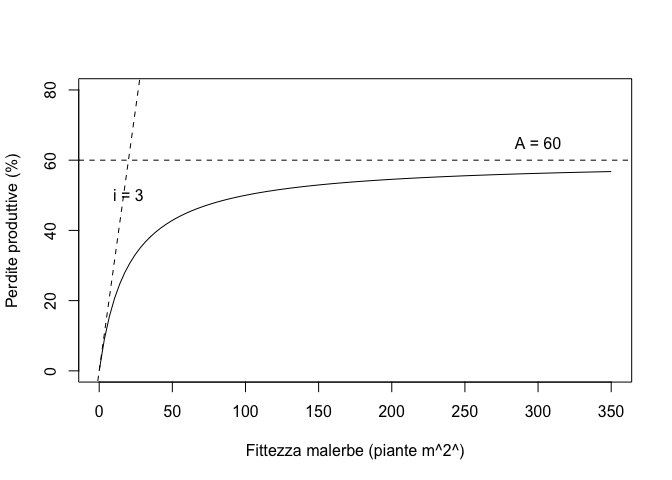

# Premessa {-}

Placeholder


## Obiettivi {-}
## Organizzazione  {-}
## Software statistico {-}
## Gli autori {-}
## Ringraziamenti e scuse {-}

<!--chapter:end:index.Rmd-->


# Scienza e pseudo-scienza

Placeholder


## Scienza = dati
## Dati 'buoni' e 'cattivi'
## Dati 'buoni' e metodi 'buoni'
## Il principio di falsificazione
## Falsificare un risultato
## Elementi fondamentali del disegno sperimentale
### Controllo degli errori
### Replicazione
### Randomizzazione
### Esperimenti invalidi
#### Cattivo controllo degli errori
#### 'Confounding' e correlazione spuria
#### Pseudo-repliche e randomizzazione poco attenta
## Chi valuta se un esperimento è attendibile?
## Conclusioni
## Altre letture

<!--chapter:end:01-introBiometria.Rmd-->


# Progettare un esperimento

Placeholder


## Gli elementi della ricerca
## Ipotesi scientifica $\rightarrow$ obiettivo dell'esperimento
## Identificazione dei fattori sperimentali
### Esperimenti (multi-)fattoriali
### Controllo o testimone
## Le unità sperimentali
## Allocazione dei trattamenti
## Le variabili sperimentali
### Variabili nominali (categoriche)
### Variabili ordinali
### Variabili quantitative discrete
### Variabili quantitative continue
### Rilievi visivi e sensoriali
### Variabili di confondimento
## Esperimenti di campo
### Scegliere il campo
### Le unità sperimentali in campo
### Numero di repliche
### La mappa di campo
### Lay-out sperimentale
#### Disegni completamente randomizzati
#### Disegni a blocchi randomizzati
#### Disegni a quadrato latino
#### Disegni a split-plot
#### Disegni a strip-plot
## Altre letture

<!--chapter:end:02-ProgettoRicerca.Rmd-->


# Richiami di statistica descrittiva

Placeholder


## Descrizione di dati quantitativi
### Indicatori di tendenza centrale
### Indicatori di dispersione
### Incertezza delle misure derivate
### Relazioni tra variabili quantitative: correlazione
## Descrizione di dati qualitativi
### Distribuzioni di frequenze e classamento
### Statistiche descrittive per le distribuzioni di frequenze 
### Distribuzioni di frequenza bivariate: le tabelle di contingenze
### Connessione
## Statistiche descrittive con R
### Descrizione dei sottogruppi
### Distribuzioni di frequenze e classamento
### Connessione
## Altre letture

<!--chapter:end:03-StatisticaDescrittiva.Rmd-->


# Modelli statistici ed analisi dei dati

Placeholder


## Verità 'vera' e modelli deterministici
## Genesi deterministica delle osservazioni sperimentali
## Errore sperimentale e modelli stocastici
### Funzioni di probabilità
### Funzioni di densità
### La distribuzione normale (curva di Gauss)
## Modelli 'a due facce'
## E allora?
## Le simulazioni Monte Carlo
## Analisi dei dati e 'model fitting'
## Modelli stocastici non-normali
## Altre letture

<!--chapter:end:04-ModelliSperimentazione.Rmd-->


# Stime ed incertezza

Placeholder


## Esempio: una soluzione erbicida
### Analisi dei dati: stima dei parametri
### La 'sampling distribution'
### L'errore standard
## Stima per intervallo
## L'intervallo di confidenza
## Qual è il senso dell'intervallo di confidenza?
## Come presentare i risultati degli esperimenti
## Alcune precisazioni
### Campioni numerosi e non
### Popolazioni gaussiane e non 
## Analisi statistica dei dati: riassunto del percorso logico
## Da ricordare
## Per approfondire un po'...
## *Coverage* degli intervalli di confidenza
### Intervalli di confidenza per fenomeni non-normali
## Altre letture

<!--chapter:end:05-InferenzaStatistica.Rmd-->


# Decisioni ed incertezza

Placeholder


## Confronto tra due medie: il test t di Student
### L'ipotesi nulla e alternativa
### La statistica T
### Simulazione Monte Carlo
### Soluzione formale
### Interpretazione del P-level
### Tipologie alternative di test t di Student
## Confronto tra due proporzioni: il test $\chi^2$
### Simulazione Monte Carlo
### Soluzione formale
## Conclusioni e riepilogo
## Altre letture

<!--chapter:end:06-TestIpotesi.Rmd-->


# Modelli ANOVA ad una via

Placeholder


## Caso-studio: confronto tra erbicidi in vaso
## Descrizione del dataset
## Definizione di un modello lineare
## Parametrizzazione del modello
## Assunzioni di base
## Fitting del modello: metodo manuale
### Stima dei parametri
### Calcolo dei residui
### Stima di $\sigma$
## Scomposizione della varianza
## Test d'ipotesi
## Inferenza statistica
## Fitting del modello con R
## Medie marginali attese
## Per concludere ...
## Altre letture

<!--chapter:end:07-ANOVAunaVia.Rmd-->


# La verifica delle assunzioni di base

Placeholder


## Violazioni delle assunzioni di base
## Procedure diagnostiche
## Analisi grafica dei residui
### Grafico dei residui contro i valori attesi
### QQ-plot
## Test d'ipotesi
## Risultati contraddittori
## 'Terapia'
### Correzione/Rimozione degli outliers
### Correzione del modello
### Trasformazione della variabile indipendente
### Impiego di metodiche statistiche avanzate
### Trasformazioni stabilizzanti
## Esempio 1
## Esempio 2
## Altre letture

<!--chapter:end:08-AssunzioniBase.Rmd-->


# Contrasti e confronti multipli

Placeholder


## Esempio
## I contrasti
## I contrasti con R
## I confronti multipli a coppie (pairwise comparisons)
## Display a lettere
## Tassi di errore per confronto e per esperimento
## Aggiustamento per la molteplicità
## E le classiche procedure di confronto multiplo?
## Consigli pratici
## Altre letture

<!--chapter:end:09-ConfrontoMultiplo.Rmd-->


# Modelli ANOVA con fattori di blocco

Placeholder


## Caso-studio: confronto tra erbicidi in campo
## Definizione di un modello lineare
## Stima dei parametri
### Coefficienti del modello
### Stima di $\sigma$
## Scomposizione della varianza
## Adattamento del modello con R
## Disegni a quadrato latino
## Caso studio: confronto tra metodi costruttivi
## Definizione di un modello lineare

<!--chapter:end:10-MultiWayANOVAModels.Rmd-->


# La regressione lineare semplice

Placeholder


## Caso studio: effetto della concimazione azotata al frumento
## Analisi preliminari
## Definizione del modello lineare
## Stima dei parametri
## Valutazione della bontà del modello
### Valutazione grafica
### Errori standard dei parametri
### Test F per la mancanza d'adattamento
### Test F per la bontà di adattamento
### Coefficiente di determinazione
## Previsioni
## Disegni a blocchi randomizzati
## Altre letture

<!--chapter:end:11-LinearRegression.Rmd-->


# Modelli ANOVA a due vie con interazione

Placeholder


## Il concetto di ’interazione’
## Effetti incrociati: interazione tra lavorazioni e diserbo chimico
## Definizione del modello lineare
## Calcoli manuali
### Scomposizione della varianza
## Calcoli con R
### Model fitting
### Verifica delle assunzioni di base
### Scomposizione della varianza
### Medie marginali attese e confronti multipli con R
## Effetti innestati: valutazione di ibridi di mais
## Definizione del modello lineare
## Fitting del modello con R

<!--chapter:end:12-AnovaDueLivelli.Rmd-->


# Breve introduzione ai modelli misti

Placeholder


## Raggruppamenti tra parcelle
## Esperimenti a split-plot
### Definizione del modello lineare
### Model fitting con R
## Esperimenti a strip-plot
### Definizione del modello lineare
### Model fitting con R
## Altre letture

<!--chapter:end:13-SplitStrip.Rmd-->

# La regressione non-lineare


I fenomeni biologici, come ad esempio la crescita di una coltura, la cinetica degradativa degli erbicidi nel terreno, la risposta produttiva delle colture a densità crescenti di malerbe o a dosi crescenti di concime, la risposta fitotossica di una specie infestante alla dose di un erbicida, hanno in genere andamenti curvilinei, posseggono punti di massimo o minimo, flessi e, soprattutto, hanno frequentemente asintoti. Pertanto, difficilmente possono essere descritti con funzioni lineari, a meno che non ci accontentiamo di approssimare localmente l'andamento dei dati, in un intervallo ristretto della variabile indipendente.

Da un punto di vista pratico, è quindi fondamentale saper adattare ai dati funzioni curvilinee di ogni tipo. Introduciamo il problema con un esempio, per il quale avremo bisogno di un package aggiuntivo che potremo installare da github (la prima volta) e caricare con il codice riportato più sotto.


```r
# Solo la prima volta
# install.packages("devtools")
# devtools::install_github("onofriandreapg/aomisc")
library(aomisc)
```

```
## Loading required package: drc
```

```
## Loading required package: MASS
```

```
## Loading required package: drcData
```

```
## 
## 'drc' has been loaded.
```

```
## Please cite R and 'drc' if used for a publication,
```

```
## for references type 'citation()' and 'citation('drc')'.
```

```
## 
## Attaching package: 'drc'
```

```
## The following objects are masked from 'package:stats':
## 
##     gaussian, getInitial
```

```
## Loading required package: plyr
```

```
## Loading required package: car
```

```
## Loading required package: carData
```

```
## Loading required package: multcompView
```


## Caso studio: degradazione di un erbicida nel terreno

Un suolo è stato trattato con metamitron (un erbicida) alla concentrazione di 100 ng g^1^. Dopo essere stato opportunamente mescolato, è stato distribuito in 24 contenitori di alluminio e posto in cella climatica alla temperatura di 20 °C. In 8 tempi diversi dopo l'inizio del saggio, sono stati prelevati 3 contenitori e sottoposti ad analisi chimica per la determinazione della concentrazione residua dell'erbicida. I risultati sono disponibili nel file 'degradation.csv', nella solita repository online.


```r
fileName <- "https://www.casaonofri.it/_datasets/degradation.csv"
degradation <- read.csv(fileName)
head(degradation, 10)
```

```
##    Time   Conc
## 1     0  96.40
## 2    10  46.30
## 3    20  21.20
## 4    30  17.89
## 5    40  10.10
## 6    50   6.90
## 7    60   3.50
## 8    70   1.90
## 9     0 102.30
## 10   10  49.20
```

Per prima cosa, plottiamo i dati osservati (Figura \@ref(fig:figName151)). Vediamo che l'andamento della concentrazione nel tempo è chiaramente curvilineo e, di conseguenza, non possiamo utilizzare la regressione lineare semplice, esposta nel capitolo precedente. 

<div class="figure" style="text-align: center">

<p class="caption">(\#fig:figName151)Degradazione di metamitron nel terreno</p>
</div>

In realtà, possiamo ancora utilizzare la stessa equazione generale che abbiamo introdotto nel capitolo 4, cioè:


$$ Y_i = f(X_i, \theta) + \varepsilon_i $$

In questa funzione, $X$ è il tempo, $Y$ la concentrazione, $\theta$ sono i parametri del modello (da stimare) ed $\varepsilon$ sono i residui, che si assumono omoscedastici e normalmente distribuiti. La differenza sta nel fatto che $f$ è non lineare.


## Scelta della funzione

Uno dei criteri fondamentali, seppur empirico, per la selezione di una funzione $f$ non-lineare  è quello di considerarne la forma, in relazione al fenomeno biologico in studio. Abbiamo dato informazioni più dettagliate altrove ([vedi questo link](https://www.statforbiology.com/2020/stat_nls_usefulfunctions/)) e, per brevità, possiamo considerare la Figura \@ref(fig:figName151b), dove si vedono gli andamenti delle funzioni non-lineari più diffuse in agricoltura. Distinguiamo andamenti:

1. convesse/concave (es. parabola, curva di crescita/decadimento esponenziale, curva di crescita asintotica, curva di potenza, iperbole rettangolare)
3. sigmoidali (es. crescita logistica, crescita di Gompertz, curva log-logistica dose-risposta)
4. con massimi/minimi (curva di Braggs)

Nella lista precedente, la parabola è un modello non-lineare nella risposta, ma lineare nei parametri, e quindi può essere adattato con la usuale funzione 'lm()', come vedremo tra poco.

<div class="figure" style="text-align: center">

<p class="caption">(\#fig:figName151b)Curve più diffuse per la descrizione di fenomeni di interesse agrario</p>
</div>

Ad ognuna delle curve evidenziate in figura corrisponde un'equazione, come indicato nella Figura \@ref(fig:figName151bis) ).

<div class="figure" style="text-align: center">

<p class="caption">(\#fig:figName151bis)Lista delle funzioni per la regressione non-lineare con R (equazione e funzione da utilizzare in R).</p>
</div>

Per il nostro caso-studio, le conoscenze relative alla cinetica di degradazione dei composti chimici ci suggeriscono un'equazione di decadimento esponenziale (cinetica del primo ordine), così definita:

$$Y_i = A e^{-k \,X_i} + \varepsilon_i$$ 

dove $A$ è la concentrazione iniziale e $k$ e il tasso di degradazione (costante nel tempo). Come anticipato, la componente stocastica $\varepsilon$ si assume normalmente distribuita e omoscedastica.

## Stima dei parametri

Dopo aver definito $f$, dobbiamo stimare i parametri $A$ e $k$. In generale esistono tre tecniche fondamentali:

1. linearizzazione della funzione tramite trasformazione delle variabili;
2. approssimazione della vera funzione curvilinea con una polinomiale in X;
3. adattamento ai dati sperimentali di funzioni curvilinee, tramite metodiche di regressione non-lineare.

### Linearizzazione della funzione

Nel caso specifico, prendendo il logaritmo di entrambe le parti dell'equazione esponenziale, otteniamo la seguente equazione:

$$ log(Y) = log(A) - k \, X $$

Quindi, se trasformiamo la Y (Concentrazione) nel suo logaritmo, possiamo utilizzare un modello di regressione lineare semplice per la stima dei parametri. Ovviamente, otterremo, come intercetta, il logaritmo della concentrazione iniziale e, come pendenza, otterremo un valore negativo per $k$, in quanto la retta è decrescente.


```r
mod <- lm(log(Conc) ~ Time, data=degradation)
summary(mod)
```

```
## 
## Call:
## lm(formula = log(Conc) ~ Time, data = degradation)
## 
## Residuals:
##      Min       1Q   Median       3Q      Max 
## -2.11738 -0.09583  0.05336  0.31166  1.01243 
## 
## Coefficients:
##              Estimate Std. Error t value Pr(>|t|)    
## (Intercept)  4.662874   0.257325   18.12 1.04e-14 ***
## Time        -0.071906   0.006151  -11.69 6.56e-11 ***
## ---
## Signif. codes:  0 '***' 0.001 '**' 0.01 '*' 0.05 '.' 0.1 ' ' 1
## 
## Residual standard error: 0.6905 on 22 degrees of freedom
## Multiple R-squared:  0.8613,	Adjusted R-squared:  0.855 
## F-statistic: 136.6 on 1 and 22 DF,  p-value: 6.564e-11
```

Le funzioni non-lineari che possono essere trasformate in lineari sono dette *linearizzabili* e hanno il vantaggio di semplificare molto i calcoli richiesti per la stima dei parametri. Un grave svantaggio è dato dal fatto che, trasformando la risposta, si trasforma anche la distribuzione degli errori e quindi bisogna verificare che le assunzioni di base dei modelli lineari (omogeneità delle varianze e normalità dei residui) siano valide nella scala trasformata.


```r
par(mfrow = c(1,2))
plot(mod, which = 1)
plot(mod, which = 2)
```

<div class="figure" style="text-align: center">

<p class="caption">(\#fig:figName152)Linearizzazione di una funzione esponenziale.</p>
</div>


Il grafico dei residui (Figura \@ref(fig:figName152) ) suggerisce che questi sono  inversamente proporzionali ai valori attesi (più alto il logaritmo della concentrazione più bassi i residui). Questo fa sospettare che le varianze potrebbero essere omogenee sulla scala originale, impedendoci quindi di analizzare i dati nella scala trasformata.

Per completezza, dobbiamo comunque dire che, qualora le assunzioni di base fossero rispettate nella scala trasformata, il metodo della linearizzazione rappresenterebbe una tecnica corretta ed affidabile per l'analisi dei dati.

### Approssimazione della vera funzione tramite una polinomiale in X

Molte andamenti non-lineari possono essere approssimati tramite funzioni polinomiali di ordine \textit{n}. Le funzioni polinomiali sono molto flessibili; contengono la funzione lineare come caso particolare (n = 1) e permettono di descrivere curvature anche molto complesse, semplicemente aumentando l' ordine della funzione. In questo modo, è possibile ottenere un adattamento ai dati sperimentali teoricamente anche perfetto.

Le funzioni polinomiali sono un tipico esempio di funzioni curvilinee, ma lineari nei parametri; esse possono essere trattate ricorrendo alle metodiche di calcolo normalmente utilizzate per la regressione lineare.

Gli svantaggi delle funzioni polinomiali sono relativi al fatto che queste presentano raramente giustificazione biologica. Per esempio, con le funzioni polinomiali non è possibile descrivere relazioni asintotiche, che sono invece molto comuni in biologia. Nel nostro esempio si potrebbe utilizzare una funzione polinomiale di II grado (parabola), che, con il suo braccio decrescente, potrebbe descrivere la degradazione di un erbicida in modo sufficientemente buono.

Eseguiamo il fitting con R, utilizzando l'usuale funzione 'lm()'. Successivamente, utilizziamo la funzione 'predict()' per generare valori attesi per una sequenza temporale da 0 a 70 giorni e plottarli.


```r
mod2 <- lm(Conc ~ Time + I(Time^2), data=degradation)
pred <- predict(mod2, newdata = data.frame(Time = seq(0, 70, by = 0.1)))
plot(Conc ~ Time, data=degradation)
lines(pred ~ seq(0, 70, by = 0.1), col = "red")
```

<div class="figure" style="text-align: center">

<p class="caption">(\#fig:figName153)Approssimazione della cinetica di degradazione con una funzione polinomiale (parabola)</p>
</div>

Vediamo come la funzione inserita, mentre approssima abbastanza bene i dati nell'intervallo da 0 a 40 giorni, successivamente mostra una ricrescita, che non ha alcun senso biologico (Figura \@ref(fig:figName153) ).

In generale, le polinomiali sono utilizzate quando non si hanno conoscenze 'a priori' sul fenomeno in studio e sia necessario approssimarlo con una funzione curvilinea, in un intervallo della X molto ristretto, senza la necessità di estrapolare previsioni al di fuori di questo intervallo. Per questi motivi, il campo d'impiego delle funzioni polinomiale è abbastanza ristretto.

### Minimi quadrati non-lineari

La terza strada, quella più percorsa, è utilizzare metodiche di regressione non-lineare, basate su algoritmi numerici di ricerca delle stime dei minimi quadrati, come il metodo di Gauss-Newton. Nel principio, questo metodo funziona partendo da stime iniziali approssimate dei parametri, che vengono corrette in ogni iterazione successiva fino ad ottenere la convergenza sui valori che minimizzano lo scostamento tra i valori osservati e quelli previsti dalla funzione. Ovviamente, trattandosi di metodi iterativi, le stime ottenute sono solo un'approssimazione dei valori reali, ma più che accettabile per le nostre finalità.

## La regressione non-lineare con R

La funzione più comune in R per la parametrizzazione di funzioni non-lineari è `nls()`. Nella chiamata alla funzione dobbiamo anche fornire stime iniziali per i valori dei parametri. Ottenere queste stime è facile pensando al loro significato biologico: $A$ è la concentrazione iniziale e quindi una stima ragionevole è data dal valor medio osservato al tempo 0 (100). Il parametro $k$ è invece il tasso di degradazione relativo; possiamo notare che nei primi 10 giorni la concentrazione si riduce della metà circa, cioè si abbassa mediamente un po' più del 5% al giorno. Possiamo quindi assegnare a $k$ un valore iniziale pari a 0.05.


```r
modNlin <- nls(Conc ~ A*exp(-k*Time), 
               start = list(A=100, k=0.05), 
               data=degradation)
summary(modNlin)
```

```
## 
## Formula: Conc ~ A * exp(-k * Time)
## 
## Parameters:
##    Estimate Std. Error t value Pr(>|t|)    
## A 99.634902   1.461047   68.19   <2e-16 ***
## k  0.067039   0.001887   35.53   <2e-16 ***
## ---
## Signif. codes:  0 '***' 0.001 '**' 0.01 '*' 0.05 '.' 0.1 ' ' 1
## 
## Residual standard error: 2.621 on 22 degrees of freedom
## 
## Number of iterations to convergence: 5 
## Achieved convergence tolerance: 4.33e-07
```

Invece che codificare il modello non-lineare a mano, possiamo ricorrere ad una delle funzioni R indicate in Figura \@ref(fig:figName151bis), che sono associate ad appositi algoritmi di self-startin e non necessitano dell'individuazione di valori iniziali (almeno nella gran parte dei casi). Queste funzioni sono disponibili nel package 'aomisc' che deve quindi essere installato da 'github'. 


```r
modNlin2 <- nls(Conc ~ NLS.expoDecay(Time, a, k),
               data = degradation)
```

## Verifica della bontà del modello

Le assunzioni parametriche di base relative ai modelli non-lineari sono le stesse dei modelli lineari e, di conseguenza, gli strumenti diagnostici sono analoghi. Bisogna tuttavia menzionare il fatto che, dato l'impiego di metodi iterativi per la ricerca dei valori dei parametri, tutti i risultati a cui si perviene (stima dei parametri, della varianza residua e numero dei gradi di libertà relativi) sono solo una approssimazione di quelli reali. Per questo motivo, nel caso non-lineare i metodi grafici (analisi dei residui) sono largamente preferiti.

### Analisi grafica dei residui

L'analisi grafica dei residui viene eseguita in modo del tutto analogo a quanto visto per la regressione lineare. In primo luogo, verifichiamo le assunzioni di base di normalità e omoscedasticità, mediante il metodo `plot()` per l'oggetto 'nls', che è disponibile nel package 'aomisc', già caricato in precedenza.


```r
par(mfrow=c(1,2))
plot(modNlin, which = 1)
plot(modNlin, which = 2)
```

<div class="figure" style="text-align: center">

<p class="caption">(\#fig:figName154)Analisi grafica dei residui per la regressione non-lineare, relativa alla degradazione di metamitron nel suolo</p>
</div>

La Figura \@ref(fig:figName154) non mostra deviazioni rispetto agli assunti di base. Pertanto, proseguiamo l'analisi grafica della bontà di adattamento, verificando il plot dei valori attesi e di quelli osservati (Figure \@ref(fig:figName155)). Questo grafico, per gli oggetti 'nls' può essere ottenuto velocemente utilizzando la funzione 'plotnls()', nel package 'aomisc'.


```r
plot(modNlin, type = "means", which = 3,
        xlab = "Tempo (giorni)", ylab = "Concentrazione (ng/g)")
```

<div class="figure" style="text-align: center">

<p class="caption">(\#fig:figName155)Cinetica di degradazione di metamitron nel suolo: i punti mostrano i valori osservati, la linea mostra i valori attesi con l'equazione esponziale.</p>
</div>

### Test F per la mancanza di adattamento (approssimato)

Se abbiamo le repliche (come nell'esempio in studio) possiamo effettuare il fitting di un modello ANOVA. Come abbiamo detto nel capitolo precedente, nel modello ANOVA i valori attesi sono costituiti dalle medie dei trattamenti (tempi e livelli di densità, rispettivamente per i due esempi) e lo scostamento di ogni dato rispetto alla 'sua' media è evidentemente dovuto solo all'errore sperimentale 'puro'. Nel modello di regressione, invece, esiste una componente aggiuntiva di errore, cioè lo scostamento di ogni media dalla curva di regressione. Questa componente si chiama mancanza d'adattamento e può essere stimata per differenza.


```r
modAov <- lm(Conc ~ factor(Time), data=degradation)
anova(modAov)
```

```
## Analysis of Variance Table
## 
## Response: Conc
##              Df  Sum Sq Mean Sq F value    Pr(>F)    
## factor(Time)  7 24698.4  3528.3  415.29 < 2.2e-16 ***
## Residuals    16   135.9     8.5                      
## ---
## Signif. codes:  0 '***' 0.001 '**' 0.01 '*' 0.05 '.' 0.1 ' ' 1
```

```r
SSa <- anova(modAov)[2,2]
SSa
```

```
## [1] 135.9387
```

Inseriamo il tempo come fattore (quindi variabile qualitativa, non quantitativa) e notiamo che la devianza del residuo è pari a 135.9. La varianza del residuo del modello di regressione si ottiene facendo la somma dei quadrati degli scarti dei dati rispetto ai valori attesi.


```r
SSr <- sum(residuals(modNlin)^2)
SSr
```

```
## [1] 151.1766
```

Come ci aspettavamo, il modello di regressione ha una devianza più alta, in quanto questa contiene la componente di mancanza d'adattamento, pari alla differenza tra SSa e SSr, cioè:


```r
SSl <- SSr - SSa
SSl
```

```
## [1] 15.23792
```

Mentre la devianza del residuo dell'ANOVA ha 16 gradi di libertà (24 dati meno 8 parametri stimati), quella del residuo della regression ha 22 gradi di libertà (24 dati meno 2 parametri stimati). La devianza del 'lack of fit' ha quindi 22 - 16 = 6 gradi di libertà. La varianza del lack of fit è quindi pari a:


```r
SSl/6
```

```
## [1] 2.539654
```

Possiamo quindi confrontare formalmente, con un test di F, le due varianze dell'errore puro (dall'ANOVA: 8.5) e quella della mancanza di adattamento, per vedere se quest'ultima è significativamente più 'grande' di quella dell'errore puro. L'ipotesi nulla è che la mancanza d'adattamento non è rilevante ed il test di F è:


```r
(Fvalue <- (SSl/6) / anova(modAov)[2,3]) #F value
```

```
## [1] 0.2989175
```

```r
pf(0.2989, 6, 16, lower.tail=F)
```

```
## [1] 0.928442
```

Chiaramente il test è non significativo. A questo risultato si arriva facilmente utilizzando la funzione 'anova()' e passandole i due modelli da confrontare anche se uno dei due è un modello di regressione non-lineare.


```r
anova(modNlin, modAov)
```

```
## Analysis of Variance Table
## 
## Model 1: Conc ~ A * exp(-k * Time)
## Model 2: Conc ~ factor(Time)
##   Res.Df Res.Sum Sq Df Sum Sq F value Pr(>F)
## 1     22     151.18                         
## 2     16     135.94  6 15.238  0.2989 0.9284
```


### Errori standard dei parametri

Un'altra valutazione importante da fare è quella relativa agli errori standard delle stime dei parametri, che non debbono mai essere superiori alla metà del valore del parametro stimato, cosa che in questo caso è pienamente verificata. Abbiamo già spiegato come, se l'intervallo di confidenza del parametro contiene lo zero, evidentemente quel parametro potrebbe essere rimosso dal modello senza che il fitting peggiori significativamente. Nel nostro esempio, se il tasso di degradazione fosse stato non significativamente diverso da zero, avremmo avuto un'indicazione per sostenere che l'erbicida, di fatto, non mostra degradazione nel tempo.

### Coefficiente di determinazione

Come abbiamo visto per la regressione lineare, anche nella regressione non-lineare si sente l'esigenza di una statistica che rappresenti in modo sintetico la bontà di adattamento. L'argomento è molto dibattuto e molti autori sono contrari all'impiego del coefficiente di determinazione, prevalentemente per due motivi:

1. i modelli di regressione non-lineare non hanno una vera e propria intercetta (almeno non nel senso usuale);
2. la somma della devianza della regressione e della devianza del residuo non è necessariamente uguale alla devianza totale.

Tuttavia, molti altri autori sono dell'opinione che, per la sua semplicità, una statistica analoga al coefficiente di determinazione possa risultare molto utile, purché utilizzata con la necessaria prudenza. In particolare viene suggerito l'impiego della statistica:

$$\textrm{Pseudo-R}^2 = 1 - \frac{SSr}{SSt}$$

che, nel caso della regressione lineare, sarebbe analoga alla formula già vista per l'R^2^ nel capitolo precedente, ma che, nel caso della regressione non-lineare, fornisce risultati diversi. In particolare, lo Pseudo-R^2^ può essere, al massimo, pari ad 1 per un modello con una bontà di adattamento perfetta, ma che, al contrario dell'$R^2$, può divenire negativo, anche se in situazioni nelle quali vi sono da sospettare gravi problemi con il modello prescelto per descrivere i dati.

Nel caso in esempio, il residuo della regressione è pari a 151.2 con 16 gradi di libertà, mentre la devianza totale dei dati (somma dei quadrati degli scarti rispetto alla media generale) è:


```r
SSt <- deviance(lm(Conc ~ 1, data=degradation))
```

ed ha 23 gradi di libertà. Il valore di Pseudo-R^2^ è:


```r
1 - SSr/SSt
```

```
## [1] 0.9939126
```

ed attesta un ottimo adattamento, in quanto è vicino ad 1. Bisogna ricordare che, pur essendo utilizzato in modo pressoché ubiquitario, il coefficiente di determinazione per i modelli non-lineari fornisce solo un'indicazione abbastanza grezza sulla bontà del modello, in quanto può rimanere alto anche quando vi sono sistematiche violazioni rispetto alla forma della funzione. Inoltre, al contrario del coefficiente di determinazione tradizionale, lo Pseudo-R^2^ non può (e non deve) essere interpretato come la quota di devianza spiegata dalla regressione.

I due coefficienti di determinazione (tradizionale e corretto) possono essere ottenuti con la funzione 'R2nls()', disponibile nel package 'aomisc'.


```r
# library(aomisc)
R2nls(modNlin)
```

```
## $PseudoR2
## [1] 0.9939126
## 
## $R2
## [1] 1.001821
```

## Funzioni lineari e nonlineari dei parametri

Gli studi di degradazione, in genere, richiedono la determinazione della semivita. E'facile vedere che questa può essere ricavata dalla funzione di degradazione in questo modo:

$$\frac{A}{2} = A \exp ( - k \,\, t_{1/2})$$

da cui:

$$t_{1/2} = - \frac{ \log \left( {\frac{1}{2}} \right) }{k}$$

Vediamo insomma che la semivita $t_{1/2}$ è una funzione non-lineare di $k$ e può essere ricavata facilmente come:


```r
-log(1/2) / coef(modNlin)[2]
```

```
##        k 
## 10.33945
```

Si pone ora il problema di ricavare l'errore standard di questa stima e/o i suoi intervalli di confidenza. La legge di propagazione degli errori ci insegna a calcolare gli errori standard per le combinazioni lineari dei parametri e ne abbiamo parlato nel capitolo 9. Per le combinazioni non-lineari, come quella che abbiamo utilizzato per calcolare la semivita, esiste un'estensione chiamata 'metodo delta'. Non ne parleremo in dettaglio, in quanto si tratta di un argomento che richiede alcune conoscenza di analisi matematica; tuttavia, mostreremo un esempio del codice R da utilizzare per applicarlo.

In particolare, possiamo utilizzare la funzione 'deltaMethod()' del package 'car'. Per evitare problemi, consiglio di estrarre le stime dei parametri dall'oggetto 'nls' ed assegnare a queste nomi corrispondenti a quelli utilizzati nella definizione della funzione di trasformazione, che deve essere fornita come stringa. 


```r
library(car)
coefs <- coef(modNlin) 
names(coefs) <- c("A", "k")
strFun <- "-log(0.5)/k"
deltaMethod(object=coefs, g=strFun, vcov.=vcov(modNlin))
```

```
##             Estimate       SE    2.5 % 97.5 %
## -log(0.5)/k 10.33945  0.29102  9.76907  10.91
```


## Previsioni		 

In taluni casi, abbastanza frequenti per la verità, l' analisi di regressione viene eseguita per stimare o predire il valore della Y corrispondente ad una data X (calibrazione), oppure della X corrispondente ad un dato Y (esempio: determinazione delle dosi efficaci). Normalmente il problema si riduce alla definizione di un'equazione predittiva; nel caso della calibrazione essa coincide con l'equazione originale, nell'altro caso con la sua inversa. Utilizzando queste equazioni è possibile ottenere il valore cercato e il suo errore standard, tramite il metodo delta.

Analogamente alla regressione lineare, per la calibrazione possiamo utilizzare il metodo 'predict()'; ad esempio, per calcolare la concentrazione dell'erbicida ai tempi 10, 15 e 20 giorni utilizziamo il codice sottostante, ricordando che i valori del tempo debbono essere forniti sotto forma di data frame, con una sola colonna, dal nome corrispondente a quello del regressore nel dataset originale


```r
predict(modNlin, newdata=data.frame(Time=c(10, 15, 20)) )
```

```
## [1] 50.96413 36.44947 26.06860
```

Come abbiamo visto, l'output non fornisce gli errori standard di queste stime. Tuttavia, dato che la calibrazione non è altro che una combinazione dei parametri del modello, possiamo ottenere lo stesso risultato utilizzando il metodo delta.


```r
strFun <- "A*exp(-k*10)"
deltaMethod(object=coefs, g=strFun, vcov.=vcov(modNlin))
```

```
##                  Estimate       SE    2.5 % 97.5 %
## A * exp(-k * 10) 50.96413  0.91006 49.18044 52.748
```

```r
strFun <- "A*exp(-k*15)"
deltaMethod(object=coefs, g=strFun, vcov.=vcov(modNlin))
```

```
##                  Estimate       SE    2.5 % 97.5 %
## A * exp(-k * 15) 36.44947  0.92053 34.64526 38.254
```

```r
strFun <- "A*exp(-k*20)"
deltaMethod(object=coefs, g=strFun, vcov.=vcov(modNlin))
```

```
##                  Estimate       SE    2.5 % 97.5 %
## A * exp(-k * 20) 26.06860  0.87816 24.34744  27.79
```

La funzione inversa è:

$$X = - \frac{log \left( \frac{Y}{A} \right)}{k} $$

Per calcolare il tempo necessario a raggiungere una certa concentrazione (es. 10 mg/g), possiamo ancora utilizzare il metodo delta.


```r
strFun <- "-(log(10/A)/k)"
deltaMethod(object=coefs, g=strFun, vcov.=vcov(modNlin))
```

```
##                Estimate       SE    2.5 % 97.5 %
## -(log(10/A)/k) 34.29237  0.88714 32.55360 36.031
```


## Gestione delle situazioni 'patologiche'

In alcuni casi la verifica della bontà del modello mette in luce situazioni patologiche. In particolare, potrebbe capitare che il modello non sia adatto ai dati, o, al contrario, che i dati non siano adatti al modello. Nel primo caso è necessario trasformare il modello, mentre nel secondo caso l'azione più comune è quella di trasformare i dati. Vediamo queste due operazioni un po' più nel dettaglio.

### Trasformazione del modello

A volte può capitare che il modello non si adatti ai dati. Ad esempio, perché la cinetica degradativa non è del primo ordine ma è lineare, oppure più concava di quello che il modello esponenziale riesca a prevedere. In una situazione del genere, la cosa migliore è cambiare equazione, utilizzandone una che mostri un miglior adattamento ai dati sperimentali.

### Trasformazione dei dati

Se non è il modello ad essere mal definito, ma sono invece i dati a non conformarsi alle assunzioni di base della regressione, è necessario valutare l'esigenza di una trasformazione stabilizzante.

Nelle regressioni non-lineari, come in quelle lineari, è possibile utilizzare la trasformazione di Box e Cox, facendo attenzione, però, al fatto che la sola trasformazione della variabile dipendente comporta anche la modifica della scala sulla quale vengono stimati i parametri, che quindi non conservano il loro valore biologico. Ad esempio, nel modello esponenziale, il parametro $A$ rappresenta la concentrazione inziale e, se i dati vengono trasformati in logaritmo, l'unità di misura di $A$ risulta anch'essa trasformata nella nuova scala logaritmica.

Per questo motivo, dato che le regressioni non-lineari vengono spesso eseguite perchè si è interessati alle stime dei parametri nella loro unità di misura originale, si preferisce adottare la cosiddetta tecnica della "trasformazione di entrambe le parti", o metodo TBS ("Transform Both Sides"). Con questo metodo, vengono trasformati sia i dati osservati per la variabile dipendente, sia il modello:

$$Y^\lambda  = f(X)^\lambda$$


Con questa tecnica, le stime dei parametri sono nella loro scala originale, come se la trasformazione non fosse stata eseguita per niente.

Con un oggetto 'nls', possiamo utilizzare la funzione 'boxcox' nel package 'aomisc', che trova il valore ottimale di $\lambda$ ed esegue la trasformazione. La funzione 'summary()' restituisce la stima dei parametri dopo la trasformazione.


```r
modNlin2 <- boxcox(modNlin)
modNlin2
```

```
## Nonlinear regression model
##   model: bcFct1(Conc) ~ bcFct2(A * exp(-k * Time))
##    data: degradation
##        A        k 
## 99.41873  0.06665 
##  residual sum-of-squares: 51.88
## 
## Number of iterations to convergence: 2 
## Achieved convergence tolerance: 7.511e-06
```

```r
summary(modNlin2)
```

```
## 
## Formula: bcFct1(Conc) ~ bcFct2(A * exp(-k * Time))
## 
## Parameters:
##    Estimate Std. Error t value Pr(>|t|)    
## A 99.418732   2.091374   47.54   <2e-16 ***
## k  0.066654   0.002042   32.65   <2e-16 ***
## ---
## Signif. codes:  0 '***' 0.001 '**' 0.01 '*' 0.05 '.' 0.1 ' ' 1
## 
## Residual standard error: 1.536 on 22 degrees of freedom
## 
## Number of iterations to convergence: 2 
## Achieved convergence tolerance: 7.511e-06
```

Invece che far scegliere alla funzione 'boxcox' il valore di $\lambda$ ottimale, possiamo imporlo noi, con l'argomento 'lambda'.


```r
modNlin3 <- boxcox(modNlin, lambda = 0.5)
summary(modNlin3)
```

```
## 
## Formula: bcFct1(Conc) ~ bcFct2(A * exp(-k * Time))
## 
## Parameters:
##    Estimate Std. Error t value Pr(>|t|)    
## A 99.532761   4.625343   21.52 2.87e-16 ***
## k  0.067068   0.002749   24.40  < 2e-16 ***
## ---
## Signif. codes:  0 '***' 0.001 '**' 0.01 '*' 0.05 '.' 0.1 ' ' 1
## 
## Residual standard error: 0.9196 on 22 degrees of freedom
## 
## Number of iterations to convergence: 1 
## Achieved convergence tolerance: 7.541e-06
```

Gli outputs mostrano che, nonostante la trasformazione, i parametri hanno conservato la loro scala originale e, di conseguenza, il loro significato biologico.

---

## Per approfondire un po'...

### Riparametrizzazione delle funzioni non-lineari

In alcuni casi abbiamo a disposizione modelli matamatici che non sono immediatamente utili per la regressione non-lineare, in quanto non si adattano alla tipologia di dati in nostro possesso o non sono adeguati alle nostre finalità. Per questo motivo, essi debbono essere opportunamente riparametrizzati, cioè posti in una differente forma algebrica. Illustriamo meglio questo aspetto con un esempio, relativo ad un esperimento nel quale è stata valutata la produzione del girasole a densità crescenti di piante infestanti, da 0 a 100 piante per metro quadrato. I risultati ottenuti sono riportati nel dataset 'competition', che è disponibile nel package 'aomisc'. L'esperimento è stato organizzato a randomizzazione completa.


```r
data(competition)
head(competition)
```

```
##   Dens    Yield
## 1    0 29.58587
## 2   10 20.16776
## 3   20 17.82846
## 4   30  9.02289
## 5   40 13.41521
## 6   50 12.80159
```

Secondo la letteratura, la relazione tra perdite produttive e densità delle piante infestanti può essere descritta con una funzione iperbolica di questo tipo (Cousens, 1985):

$$YL = \frac{iD}{1 + \frac{iD}{A}}$$

 
Dove $YL$ sta per perdite produttive (Yield Loss) percentuali, $D$ è la densità delle piante infestanti, $i$ è la pendenza nel punto iniziale (D = 0) ed $A$ è la perdita produttiva percentuale massima asintotica. Il grafico è mostrato qui sotto.

<div class="figure" style="text-align: center">

<p class="caption">(\#fig:figName25131)Relazione iperbolica tra fittezza delle piante infestanti e perdite produttive. È  visualizzata la pendenza iniziale (i) e la perdita produttiva massima asintotica (A).</p>
</div>

Normalmente, in campo non vengono determinate le perdite produttive, bensì le produzioni, come nel caso dell'esperimento relativo al dataset d'esempio. Di conseguenza, il modello iperbolico presentato più sopra non è adatto ai nostri dati, in quanto rappresenta una funzione crescente, mentre i nostri dati mostrano una variabile dipendente (produzione) che decresce al crescera della variabile indipendente (fittezza dell piante infestanti). Pertanto, abbiamo due possibilità:

1. modificare il dataset, esprimendo i dati in termini di perdite produttive percentuali;
2. modificare il modello, per utilizzare la produzione come variabile dipendente, al posto della perdita produttiva.

La prima strada è più agevole, ma ha un problema importante. Infatti, per calcolare la perdita produttiva percentuale nella parcella $i$, possiamo utilizzare la seguente equazione:

$$YL_i = \frac{YWF - Y_i}{YWF} \times 100$$

dove $YWF$ è la produzione nel testimone non infestato e $Y_i$ è la produzione nella parcella $i$. Trattandosi di una prova replicata, abbiamo quattro valori di produzione corrispondenti a YWF; quale usiamo? La scelta più logica è quella di utilizzare il valore medio, cioè;


```r
YWF <- mean(competition$Yield[competition$Dens==0])
YWF
```

```
## [1] 30.42637
```

Operando la trasformazione otteniamo una nuova variabile (YL), che possiamo sottoporre a regressione non-lineare, con il modello iperbolico precedentemente indicato. Per ottenere i valori iniziali, possiamo considerare che, con 10 piante per metro quadrato, la perdita produttiva è del 30-35%. Quindi si può immaginare che la prima pianta infestante aggiunta possa (quella che fa più danni) possa causare perdite produttive del 6-7% circa. Vediamo inoltre che la perdita produttiva massima osservata è del 70% circa, quindi possiamo immaginare una perdita produttiva massima asintotica del 75%.  


```r
YL <- (YWF - competition$Yield)/YWF * 100
mod1 <- nls(YL ~ i * Dens / (1 + i * Dens / A),
            start = list(i = 6.5, A = 75),
            data = competition)
summary(mod1)
```

```
## 
## Formula: YL ~ i * Dens/(1 + i * Dens/A)
## 
## Parameters:
##   Estimate Std. Error t value Pr(>|t|)    
## i    8.207      1.187   6.914 1.93e-08 ***
## A   75.049      2.353  31.894  < 2e-16 ***
## ---
## Signif. codes:  0 '***' 0.001 '**' 0.01 '*' 0.05 '.' 0.1 ' ' 1
## 
## Residual standard error: 6.061 on 42 degrees of freedom
## 
## Number of iterations to convergence: 3 
## Achieved convergence tolerance: 7.497e-06
```

Qual è il problema di questo approccio? Se ci facciamo caso, questo modello prevede che, quando la fittezza delle piante infestanti è 0 (testimone non infestato), la perdita produttiva è 0. Di conseguenza la produzione osservata deve essere pari alla media del testimone non infestato. Insomma, abbiamo involontariamente imposto il vincolo YWF = 30.42637, anche se sappiamo che questo vincolo non ha alcuna giustificazione, dato che la media della popolazione da cui le nostre quattro osservazioni non inerbite derivano, difficilmente coincide con la media osservata.

Invece che riorganizzare i dati perché si adattino al modello, potremmo forse tentare di riorganizzare il modello, affinchè si adatti meglio ai dati. 

Dalla precedente funzione si ricava che:

$$Y_i = YWF - \frac{YL \times YWF}{100} = YWF\left( {1 - \frac{YL}{100}} \right)$$

che mostra come la produzione in una qualunque parcella ($Y_i$) può essere ottenuta in funzione della perdita produttiva e di YWF. Considerando l'equazione precedente e il modello delle perdite produttive, possiamo scrivere:

$$Y_i = YWF\left( {1 - \frac{iD}{100\left( {1 + \frac{iD}{A}} \right)}} \right)$$

Questa equazione consente di utilizzare i dati produttivi osservati come variabile dipendente e di stimare i parametri competitivi $i$ ed $A$, insieme alla produzione stimata in asssenza di competizione.


```r
modComp <- nls(Yield ~ YWF * (1 - (i*Dens)/(100 * (1 + i * Dens/A))),
               list(YWF = 30.4, i = 6.5, A = 75),
               data=competition)
summary(modComp)
```

```
## 
## Formula: Yield ~ YWF * (1 - (i * Dens)/(100 * (1 + i * Dens/A)))
## 
## Parameters:
##     Estimate Std. Error t value Pr(>|t|)    
## YWF   30.472      0.930  32.765  < 2e-16 ***
## i      8.240      1.387   5.943 5.22e-07 ***
## A     75.073      2.422  30.998  < 2e-16 ***
## ---
## Signif. codes:  0 '***' 0.001 '**' 0.01 '*' 0.05 '.' 0.1 ' ' 1
## 
## Residual standard error: 1.866 on 41 degrees of freedom
## 
## Number of iterations to convergence: 3 
## Achieved convergence tolerance: 9.819e-06
```

Vediamo che, in questo caso, la produzione nel testimone non infestato non è più fissata al valor medio osservato, ma è stimata utilizzando tutti i dati sperimentali ed è, pertanto, più precisa.

Pur essendo entrambi gli approcci corretti, il secondo è certamente più elegante e attendibile.

### Altre letture

1. Bates, D.M., Watts, D.G., 1988. Nonlinear regression analysis & its applications. John Wiley & Sons, Inc., Books.
2. Bolker, B.M., 2008. Ecological models and data in R. Princeton University Press, Books.
3. Carroll, R.J., Ruppert, D., 1988. Transformation and weighting in regression. Chapman and Hall, Books.
4. Ratkowsky, D.A., 1990. Handbook of nonlinear regression models. Marcel Dekker Inc., Books.
5. Ritz, C., Streibig, J.C., 2008. Nonlinear regression with R. Springer-Verlag New York Inc., Books.


<!--chapter:end:14-NonLineare.Rmd-->


# Esercizi

Placeholder


## Introduzione alla biometria (Cap. 1)
### Domanda 1
### Domanda 2
### Domanda 3
### Domanda 4
### Domanda 5
## Disegno sperimentale (Cap. 2)
### Esercizio 1
### Esercizio 2
### Esercizio 3
### Esercizio 4
### Esercizio 5
## Statistica descrittiva (Cap. 3)
### Esercizio 1
### Esercizio 2
### Esercizio 3
### Esercizio 4
### Esercizio 5
## Modelli statistici (Cap. 4)
### Esercizio 1
### Esercizio 2
### Esercizio 3
### Esercizio 4
### Esercizio 5
### Esercizio 6
### Esercizio 7
### Esercizio 8
### Esercizio 9
## Stima dei parametri (Cap. 5)
### Esercizio 1
### Esercizio 2
### Esercizio 3
### Esercizio 4
### Esercizio 5
## Inferenza (Cap. 6)
### Esercizio 1
### Esercizio 2
### Esercizio 3
### Esercizio 4
### Esercizio 5
### Esercizio 6
### Esercizio 7
### Esercizio 8
### Esercizio 9
### Esercizio 10
### Esercizio 11
## Modelli ANOVA ad una via (Cap. da 7 a 9)
### Esercizio 1 
### Esercizio 2
### Esercizio 3
### Esercizio 4
## ANOVA a due vie (Cap. 10)
### Esercizio 1
### Esercizio 2
### Esercizio 3
## Regressione (Cap. 11)
### Esercizio 1
### Esercizio 2
## ANOVA a due vie con interazione (Cap. 12 e 13)
### Esercizio 1
### Esercizio 2
### Esercizio 3
### Esercizio 4
### Esercizio 5
### Esercizio 6
## Regressione non-lineare (Cap. 14)
### Esercizio 1
### Esercizio 2
### Esercizio 3
### Esercizio 4
### Esercizio 5
### Esercizio 6
### Esercizio 7

<!--chapter:end:15-Esercizi.Rmd-->


# Appendice 1: breve introduzione ad R

Placeholder


## Cosa è R? {-}
## Oggetti e assegnazioni {-}
### Costanti e vettori {-}
### Matrici {-}
### Dataframe {-}
### Quale oggetto sto utilizzando? {-}
## Operazioni ed operatori {-}
## Funzioni ed argomenti {-}
## Consigli per l'immissione di dati sperimentali {-}
### Immissione di numeri progressivi {-}
### Immissione dei codici delle tesi e dei blocchi {-}
### Immissione dei valori e creazione del datframe {-}
### Leggere e salvare dati esterni {-}
## Alcune operazioni comuni sul dataset {-}
### Selezionare un subset di dati {-}
### Ordinare un vettore o un dataframe {-}
## Workspace {-}
## Script o programmi {-}
## Interrogazione di oggetti {-}
## Altre funzioni matriciali {-}
## Cenni sulle funzionalità grafiche in R {-}
## Altre letture {-}

<!--chapter:end:17-IntroduzioneR.Rmd-->

