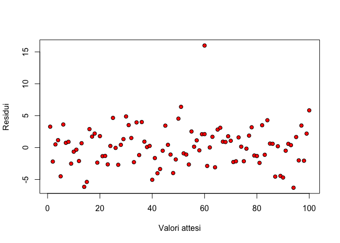
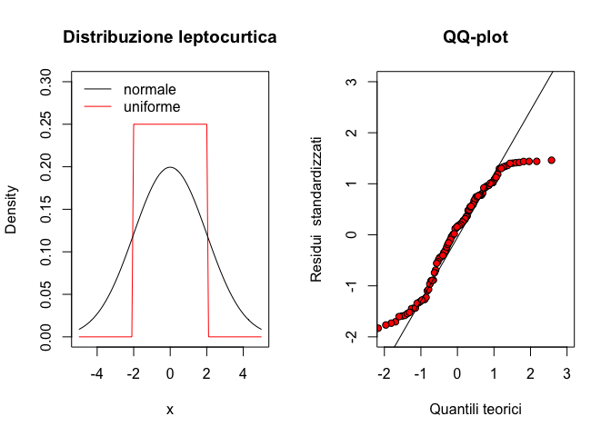

# Premessa {-}

Placeholder


## Obiettivi {-}
## Organizzazione  {-}
## Software statistico {-}
## Gli autori {-}
## Ringraziamenti e scuse {-}

<!--chapter:end:index.Rmd-->


# Scienza e pseudo-scienza

Placeholder


## Scienza = dati
## Dati 'buoni' e 'cattivi'
## Dati 'buoni' e metodi 'buoni'
## Il principio di falsificazione
## Falsificare un risultato
## Elementi fondamentali del disegno sperimentale
### Controllo degli errori
### Replicazione
### Randomizzazione
### Esperimenti invalidi
#### Cattivo controllo degli errori
#### 'Confounding' e correlazione spuria
#### Pseudo-repliche e randomizzazione poco attenta
## Chi valuta se un esperimento è attendibile?
## Conclusioni
## Altre letture

<!--chapter:end:01-introBiometria.Rmd-->


# Progettare un esperimento

Placeholder


## Gli elementi della ricerca
## Ipotesi scientifica $\rightarrow$ obiettivo dell'esperimento
## Identificazione dei fattori sperimentali
### Esperimenti (multi-)fattoriali
### Controllo o testimone
## Le unità sperimentali
## Allocazione dei trattamenti
## Le variabili sperimentali
### Variabili nominali (categoriche)
### Variabili ordinali
### Variabili quantitative discrete
### Variabili quantitative continue
### Rilievi visivi e sensoriali
### Variabili di confondimento
## Esperimenti di campo
### Scegliere il campo
### Le unità sperimentali in campo
### Numero di repliche
### La mappa di campo
### Lay-out sperimentale
#### Disegni completamente randomizzati
#### Disegni a blocchi randomizzati
#### Disegni a quadrato latino
#### Disegni a split-plot
#### Disegni a strip-plot
## Altre letture

<!--chapter:end:02-ProgettoRicerca.Rmd-->


# Richiami di statistica descrittiva

Placeholder


## Descrizione di dati quantitativi
### Indicatori di tendenza centrale
### Indicatori di dispersione
### Incertezza delle misure derivate
### Relazioni tra variabili quantitative: correlazione
## Descrizione di dati qualitativi
### Distribuzioni di frequenze e classamento
### Statistiche descrittive per le distribuzioni di frequenze 
### Distribuzioni di frequenza bivariate: le tabelle di contingenze
### Connessione
## Statistiche descrittive con R
### Descrizione dei sottogruppi
### Distribuzioni di frequenze e classamento
### Connessione
## Altre letture

<!--chapter:end:03-StatisticaDescrittiva.Rmd-->


# Modelli statistici ed analisi dei dati

Placeholder


## Verità 'vera' e modelli deterministici
## Genesi deterministica delle osservazioni sperimentali
## Errore sperimentale e modelli stocastici
### Funzioni di probabilità
### Funzioni di densità
### La distribuzione normale (curva di Gauss)
## Modelli 'a due facce'
## E allora?
## Le simulazioni Monte Carlo
## Analisi dei dati e 'model fitting'
## Modelli stocastici non-normali
## Altre letture

<!--chapter:end:04-ModelliSperimentazione.Rmd-->


# Stime ed incertezza

Placeholder


## Esempio: una soluzione erbicida
### Analisi dei dati: stima dei parametri
### La 'sampling distribution' empirica
### La 'sampling distribution' teorica
## Stima per intervallo
## Inferenza statistica: conclusioni
## Per chi avesse voglia di approfondire un po'...
### Popolazioni gaussiane e non 
### Cosa fare se il teorema centrale del limite non funziona?
## Altre letture

<!--chapter:end:05-InferenzaStatistica.Rmd-->


# Decisioni ed incertezza

Placeholder


## Il test t di Student
### L'ipotesi 'nulla' e l'ipotesi 'alternativa'
### La statistica T
### Simulazione Monte Carlo
### Soluzione formale
### Interpretazione del P-level
## Altri esempi dell'uso del test di t di Student
### Confronto tra due medie campionarie
### Varianze non omogenee
### Differenze generalizzate tra parametri
### Misure appaiate
### Test ad una coda 
## Altri test d'ipotesi: il test $\chi^2$
## Test d'ipotesi con simulazione di Monte Carlo
## Conclusioni e riepilogo
## Altre letture

<!--chapter:end:06-TestIpotesi.Rmd-->


# Modelli ANOVA ad una via

Placeholder


## Caso-studio: confronto tra erbicidi in vaso
## Descrizione del dataset
## Definizione di un modello lineare
## Parametrizzazione del modello
## Assunzioni di base
## Fitting del modello: metodo manuale
### Stima dei parametri
### Calcolo dei residui
### Stima di $\sigma$
## Scomposizione della varianza
## Test d'ipotesi
## Inferenza statistica
## Fitting del modello con R
## Medie marginali attese
## Per concludere ...
## Altre letture

<!--chapter:end:07-ANOVAunaVia.Rmd-->

# La verifica delle assunzioni di base


Torniamo ad esaminare il modello che abbiamo impiegato nel capitolo precedente:

$$Y_i = \mu + \alpha_j + \varepsilon_i$$

con:

$$ \varepsilon_i \sim N(0, \sigma) $$

Questa equazione implica che la componente random $\varepsilon_i$ (residuo) sia ottenibile per differenza tra i valori attesi e quelli osservati:

$$\varepsilon_i = Y_i - Y_{Ei}$$

dove:

$$Y_{Ei} = \mu + \alpha_i$$

Per costruzione, la media dei residui deve essere zero e la deviazione standard è comune a tutti i trattamenti. Potete notare che stiamo facendo un certo numero di assunzioni (**assunzioni di base**), la cui validità generale non è scontata, ma deve essere attentamente verificata ogni volta. In particolare, assumiamo:

1. **bontà di adattamento**: la parte deterministica del modello descrive la risposta osservata in modo sufficientemente fedele, senza deviazioni sistematiche di alcun tipo;
2. **indipendenza dei residui**: i residui sono puramente stocastici, indipendenti dal modello ed indipendenti tra loro;
3. **normalità**: i residui sono normalmente distribuiti;
4. **omoscedasticità** (dal greco 'skedasis' = dispersione): i residui hanno media zero e varianze omogenee per tutti i trattamenti (omoscedasticità).

Il rispetto di alcune di queste assunzioni di base, come l'indipendenza dei residui e l'assenza di errori sistematici, è garantito dal disegno sperimentale, quando questo sia eseguito a 'regola d'arte', cioè basato su repliche indipendenti e randomizzate. Bisogna tenere presente che gli eventuali vincoli alla randomizzazione introdotti in fase di disegno possono inficiare l'indipendenza dei residui; ad esempio, con i blocchi randomizzati, le osservazioni all'interno di ogni blocco si assomigliano di più che non quelle in blocchi diversi, proprio perché condividono le condizioni ambientali caratteristiche di ciascun blocco. Insomma, si realizza un certo grado di 'parentela' tra le osservazioni, che non è compatibile con l'ipotesi di totale indipendenza. Vedremo nei capitoli successivi che queste situazioni vengono gestite includendo nel modello ANOVA anche il fattore blocco o gli altri vincoli eventualmente imposti alla randomizzazione completa. 

Per quanto riguarda le altre assunzioni, come la bontà di adattamento l'omogeneità delle varianze e la normalità dei residui, la verifica può essere fatta solo *a posteriori*, cioè dopo aver effettuato la stima dei parametri ed aver individuato i residui stessi.

Oltre a quanto abbiamo finora esposto, dobbiamo anche tener presente che il dataset non dovrebbe contenere le cosiddette osservazioni aberranti od *outliers*. Si tratta di osservazioni molto diverse dalle altre, che spesso fanno sospettare che sia avvenuto qualche errore grossolano; la loro assenza non è postulata da alcun modello statistico, anche se esse, proprio perché molto diverse dalle altre, finiscono per inficiare la normalità dei residui e l'omogeneità delle varianze, oltre a stravolgere pericolosamente le nostre conclusioni. Pertanto, alla loro individuazione deve essere sempre dedicata la debita attenzione.

## Violazioni delle assunzioni di base

Il rispetto delle assunzioni di normalità e omogeneità delle varianze è fondamentale, dato che la *sampling distribution* di F, e quindi il P-level, sono costruiti campionando residui normali ed omoscedastici. Nel codice sottostante abbiamo immaginato di campionare residui da distribuzioni normali con la stessa media, ma diverse deviazioni standard per ognuno dei quattro trattamenti sperimentali. Abbiamo quindi ottenuti 100'000 datasets nei quali l'ipotesi nulla è vera (nessuna differenza tra le medie), ma non sussiste l'omogeneità delle varianze. Sottoponendo questi datasets ad ANOVA, notiamo che la *sampling distribution* per F non può essere descritta con la curva di densità F di Fisher e, soprattutto, che quest'ultima funzione, nella coda destra, produce una chiara sottostima della probabilità reale e, quindi del P-level. In altre parole, quando non vi è omoscedasticità, si può incorrere in un incremento del rischio di rifiutare erroneamente l'ipotesi nulla, il che rende le nostre conclusioni meno attendibili.

```
Fvals <- c()
set.seed(1234)
Treat <- factor(rep(1:4, each = 4))
for(i in 1:100000){
  # Ysim <- rnorm(16, 14.48375, 3.9177) # Omoscedasticità
  Ysim1 <- rnorm(4, 14.48375, 0.39177)
  Ysim2 <- rnorm(4, 14.48375, 3.9177)
  Ysim3 <- rnorm(4, 14.48375, 6.9177)
  Ysim4 <- rnorm(4, 14.48375, 9.9177)
  Ysim <- c(Ysim1, Ysim2, Ysim3, Ysim4)
  mod <- lm(Ysim ~ Treat)
  Fvals[i] <- anova(mod)$F[1]
}
```

<div class="figure" style="text-align: center">

<p class="caption">(\#fig:figName101a)Sampling distribution empirica per F, in caso di disomogeneità delle varianze. Vediamo che, in questo caso, la funzione di densità F di Fisher non costituisce un buon riferimento per il calcolo del P-level.</p>
</div>


## Procedure diagnostiche


Per diagnosticare eventuali problemi con le assunzioni di base, possiamo utilizzare sia metodi grafici che metodi formali, basati sul test d'ipotesi. Vediamo ora alcune possibilità.


## Analisi grafica dei residui

Dato che la gran parte delle assunzioni riguarda la struttura dei residui, l’ispezione grafica di questi ultimi è in grado di evidenziare chiaramente la gran parte dei problemi e dovrebbe, pertanto, essere considerata come una metodica da applicare in modo routinario. Esistono diversi tipi di grafici, ma ne elenchiamo fondamentalmente due: il grafico dei residui contro i valori attesi e il QQ-plot.


### Grafico dei residui contro i valori attesi

Il metodo grafico più utilizzato per l'analisi dei residui consiste nel plottare i residui verso i valori attesi. Se non vi sono problemi, i punti nel grafico dovrebbero essere distribuiti in modo assolutamente casuale, come in Figura \@ref(fig:figName101).


<div class="figure" style="text-align: center">

<p class="caption">(\#fig:figName101)Grafico dei residui verso gli attesi: non è visibile nessuna deviazione rispetto agli assunti di base dei modelli lineari</p>
</div>

Le osservazioni aberranti (*outliers*) appaiono come punti isolati rispetto agli altri (Figura \@ref(fig:figName102)). 

<div class="figure" style="text-align: center">

<p class="caption">(\#fig:figName102)Grafico dei residui verso gli attesi: presenza di un dato aberrante</p>
</div>

L’eterogeneità delle varianze è invece indicata da residui che si allargano o si stringono procedendo verso i margini del grafico (Figura \@ref(fig:figName103)), facendo emergere una sorta di proporzionalità tra media e varianza.

<div class="figure" style="text-align: center">

<p class="caption">(\#fig:figName103)Grafico dei residui verso gli attesi: esempio di eteroscedasticità</p>
</div>

La mancanza di adattamento è un problema che non riguarda tanto i modelli ANOVA, ma, soprattutto i modelli di regressione, di cui parleremo al termine di questo libro. Essa provoca effetti sul segno dei residui, che non è più casuale, ma mostra un qualche evidente *pattern* legato al valore assunto dalla variabile indipendente. Ad esempio, nella figura \@ref(fig:figName104) i residui sono tendenzialmente negativi per bassi valori attesi e positivi per alti valori, chiaro segnale di un modello deterministico che sovrastima le osservazioni quando sono basse e le sottostima quando sono alte.

<div class="figure" style="text-align: center">

<p class="caption">(\#fig:figName104)Grafico dei residui verso gli attesi: esempio di lack of fit (nonlinearità)</p>
</div>

### QQ-plot

Per evidenziare problemi di non-normalità, risulta molto utile un QQ-plot (quantile-quantile plot), nel quale i residui *standardizzati* vengono 'plottati' contro i rispettivi percentili di una distribuzione normale standardizzata. Con residui normali, queste due entità (i residui standardizzati e i percentili corrispondenti di una distribuzione normale standardizzata) sono largamente coincidenti, in modo che i punti nel QQ-plot giacciono lungo la bisettrice del primo e del terzo quadrante (\@ref(fig:figName105)).

<div class="figure" style="text-align: center">

<p class="caption">(\#fig:figName105)QQ-plot per un dataset normalmente distribuito</p>
</div>

Le deviazioni più diffuse dalla normalità sono relative alla simmetria (skewness) e alla curtosi della popolazione da cui i residui sono campionati. In particolare, può capitare che i residui provengano da una popolazione con asimmetria positiva (right-skewed), come, ad esempio, una popolazione log-normale. In questo caso, la media è maggiore della mediana e i residui negativi sono più numerosi, ma più piccoli in valore assoluto di quelli positivi. Il QQ-plot si presenta come in figura \@ref(fig:figName106).

<div class="figure" style="text-align: center">

<p class="caption">(\#fig:figName106)QQ-plot per un dataset con asimmetria positiva (right-skewed)</p>
</div>


Al contrario, se i residui provengono da una popolazione con asimmetria negativa ('left-skewed'), caratterizzata, ad esempio, da una funzione di densità 'beta', la media è minore della mediana e, di conseguenza, i valori positivi sono più numerosi, ma più vicini allo zero di quelli negativi. In questa situazione, il QQ-plot presenta un andamento abbastanza tipico, come indicato in Figura \@ref(fig:figName107).

<div class="figure" style="text-align: center">

<p class="caption">(\#fig:figName107)QQ-plot per un dataset con asimmetria negativa (left-skewed)</p>
</div>

Per quanto riguarda la curtosi, è necessario osservare le code della distribuzione: se queste sono più alte di una distribuzione normale parliamo di distribuzione platicurtica, mentre se sono più basse parliamo di distribuzione leptocurtica. Ad esempio, se i residui provengono da una distribuzione t di Student con pochi gradi di libertà sono platicurtici ed il QQ-plot mostra l'andamento indicato in figura \@ref(fig:figName108).

<div class="figure" style="text-align: center">

<p class="caption">(\#fig:figName108)QQ-plot per un dataset con distribuzione platicurtica</p>
</div>

Al contrario, se i residui provengono da una distribuzione uniforme sono tipicamente leptocurtici e presentano un QQ-plot come quello riportato in Figura \@ref(fig:figName109).


<div class="figure" style="text-align: center">

<p class="caption">(\#fig:figName109)QQ-plot per un dataset con distribuzione leptocurtica</p>
</div>


## Test d'ipotesi

La valutazioni precedentemente esposte sono basate sulla semplice osservazione di uno o più grafici, ma sono considerate sufficientemente attendibili per la maggior parte delle situazioni. Tuttavia, esistono anche test statistici formali che consentono di saggiare l’ipotesi nulla di ’assenza di deviazioni’, rifiutandola quando il P-level è inferiore a 0.05.

Per l'omogeneità delle varianze veniva utilizzato il test di Bartlett, che, tuttavia, è oggi caduto in disuso, data la sua sensibilità alla non-normalità dei residui, quasi sempre presente, insieme all'eteroscedasticità. Oggi si preferisce utilizzare il test di Levene, che consiste nel sottoporre ad ANOVA i residui in valore assoluto, al posto dei dati osservati. Per ogni trattamento, i residui hanno media zero, ma se vengono presi in valore assoluto, hanno medie più alte quando la loro varianza è alta. Per esempio, possiamo prendere due campioni centrati, con media zero a varianza rispettivamente pari a 1 e 4:


```r
A <- c(-1, 0, 1); B <- c(-4, 0, 4)
mean(A); mean(B)
```

```
## [1] 0
```

```
## [1] 0
```

```r
var(A); var(B)
```

```
## [1] 1
```

```
## [1] 16
```

Se prendiamo i valori assoluti, la media del primo campione è 2/3, mentre la media del secondo campione è 8/3. Se questa differenza è significativa, essa produce il rifiuto dell'ipotesi nulla di omogeneità delle varianze. Il test di Levene, in R, si può eseguire con la funzione 'leveneTest()' nel package 'car'.


```r
res <- c(A, B)
tratt <- rep(c("A", "B"), each = 3)
model <- lm(res ~ factor(tratt))
anova(model)
```

```
## Analysis of Variance Table
## 
## Response: res
##               Df Sum Sq Mean Sq F value Pr(>F)
## factor(tratt)  1      0     0.0       0      1
## Residuals      4     34     8.5
```

```r
car::leveneTest(res ~ factor(tratt), center=mean)
```

```
## Levene's Test for Homogeneity of Variance (center = mean)
##       Df F value Pr(>F)
## group  1  2.1176 0.2193
##        4
```

Il test di Levene può anche essere effettuato considerando gli scarti rispetto alla mediana (invece che alla media), in modo da ottenere un test più robusto nei confronti degli outliers.

Per quanto riguarda le deviazioni dalla normalità, può essere utilizzato il test di Shapiro-Wilks. Per esempio, nel caso di un dataset ottenuto da una distribuzione uniforme (quindi non-normale), il test di Shapiro porta al rifiuto dell'ipotesi nulla.


```r
shapiro.test(runif(100, min = -2, max = 2))
```

```
## 
## 	Shapiro-Wilk normality test
## 
## data:  runif(100, min = -2, max = 2)
## W = 0.94547, p-value = 0.0004227
```

## Risultati contraddittori

La valutazione degli assunti di base è un passo fondamentale nell’analisi dei dati sperimentali è non deve mai essere dimenticata. Tuttavia, l'esperienza insegna che, nella pratica, è molto facile incontrare situazioni dubbie, nelle quali i risultati ottenuti con le diverse tecniche diagnostiche appaiono contraddittori e difficili da interpretare. Come comportarsi in questi casi? A mio parere bisogna sempre ricordare che la ’verità vera’ ci sfugge e, di conseguenza, tutte le valutazioni debbono essere sempre condotte con il massimo ’buon senso’.

Un aspetto importante da considerare è la tipologia del dato: conteggi e proporzioni difficilmente sono normalmente distribuiti ed omoscedastici e, con questi dati, la prudenza non è mai troppa, quando si tratta di impiegare modelli lineari. Allo stesso modo, è necessaria una grande prudenza quando si analizzano variabili quantitative dove la differenza tra le diverse tesi è molto grande, orientativamente più di un ordine di grandezza. Con conteggi proporzioni e variabili quantitative con medie molto diverse tra loro, l'assunzione di omogeneità delle varianze è quasi sempre violata ed è quindi necessario essere molto prudenti prima di confermare il rispetto delle assunzioni di base.


## 'Terapia'

Se le procedure diagnostiche hanno evidenziato deviazioni rispetto agli assunti di base, è necessario valutare se e come intraprendere azioni correttive. Ovviamente,  la 'terapia' cambia al cambiare della 'patologia'.

### Correzione/Rimozione degli outliers

In presenza di outliers, la 'terapia' più opportuna è, banalmente, quella di rimuoverli, ottenendo così un dataset 'sbilanciato' (diverso numero di repliche per trattamento). Oggigiorno, trattare un dataset sbilanciato non costituisce un problema, ovviamente se si utilizzano le metodiche di analisi opportune. Qualche anno fa, al contrario, si cercava di evitare lo sbilanciamento a tutti i costi, utilizzando tecniche di *imputing* per l'immissione di valori ’ragionevoli’ in sostituzione di quelli mancanti/aberranti. Con le dovute eccezioni, le tecniche di *imputing* sembrano oggi abbastanza obsolete, almeno in questo contesto.

Vorremmo porre l'attenzione sul fatto che i dati aberranti possono influenzare in modo molto marcato il risultato dell’analisi (sono dati 'influenziali'); pertanto, se è sbagliato correggerli arbitrariamente, senza aver prima accertato che siano effettivamente frutto di errore, può essere altrettanto sbagliato lasciarli nel dataset. Ovviamente, la rimozione non può che riguardare una larga minoranza dei dati sperimentali raccolti, altrimenti si dovrà necessariamente pensare di ripetere l’esperimento.


### Correzione del modello

Abbiamo visto che il modello impiegato potrebbe non essere adatto a descrivere il dataset (mancanza di adattamento). Gli effetti potrebbero non essere additivi, ma moltiplicativi, oppure potrebbero essere non-lineari. Potrebbero essere presenti asintoti che il nostro modello non è in grado di descrivere, oppure la crescita/decrescita osservata potrebbero essere più lente/veloci di quanto la nostra funzione sia in grado di descrivere. Per tutti questi casi, ovviamente, la strategia più consigliabile è quella di utilizzare un diverso modello, capace di descrivere meglio le osservazioni sperimentali.

### Trasformazione della variabile indipendente

A volte la variabile dipendente non è qualitativa, bensì quantitativa. Vedremo meglio questo aspetto nei prossimi capitoli, quando parleremo di regressione. Tuttavia, anticipiamo che, quando la variabile indipendente è quantitativa, essa può essere sottoposta ad opportuna trasformazione. Ad esempio, se i dati mostrano un andamento esponenziale, la trasformazione della variabile indipendente in logaritmo può portare al sensibile miglioramento del fitting con un'equazione lineare.


### Trasformazioni stabilizzanti

Una strategia empirica, ma molto semplice, diffusa ed efficace, è quella di ricorrere alle trasformazioni correttive. Con questa tecnica, si trasformano i dati in modo da portarli su una metrica che soddisfi le assunzioni di base dei modelli lineari; successivamente si ripete l’elaborazione sui dati trasformati.

Le trasformazioni possibili sono molte: ad esempio, per i conteggi oppure per variabili continue caratterizzate da medie proporzionali alle varianze, vengono usualmente consigliate la trasformazione nella radice quadrata o quella nel logaritmo, oppure per i dati percentuali viene consigliata la trasformazione angolare (arcoseno della radice quadrata). Per evitare di scegliere la trasformazione 'al buio', si può impiegare la procedura suggerita da Box e Cox (1964), basata su una 'famiglia di trasformazioni', così definita:

$$ W = \left\{ \begin{array}{ll}
\frac{Y^\lambda - 1}{\lambda} & \quad \textrm{if} \,\,\, \lambda \neq 0 \\
\log(Y) & \quad \textrm{if} \,\,\, \lambda = 0
\end{array} \right.$$

dove $W$ è la variabile trasformata, $Y$ è la variabile originale e $\lambda$ è il parametro che definisce la trasformazione ^[Nota: Considerate che il limite dell'espressione $(Y^\lambda -1)/\lambda$ per $\lambda \rightarrow 0$ è proprio $\log(Y)$]

Questa famiglia è molto flessibile, nel senso che cambiando il valore di $\lambda$ possiamo rimediare alla gran parte delle deviazioni rispetto alle assunzioni di base. Per scegliere il valore ottimale per questo parametro, possiamo procedere in modo empirico, confrontando la verosimiglianza di modelli basati su trasformazioni diverse. In R, questa procedura è automatizzata nella funzione `boxcox()`, disponibile nel package MASS è verrà illustrata negli esempi che seguono. Bisogna tener presente che, qualora il valore ottimale risultasse $\lambda = 1$, la trasformazione sarebbe completamente fittizia, in quanto, da ogni dato, verrebbe semplicemente sottratta un'unità, senza quindi alterare minimamente i risultati dell'analisi. **Di conseguenza, trovare che $\lambda$ ottimale è uguale ad 1 viene considerato come evidenza del fatto che la trasformazione non è necessaria.**


## Esempio 1

Prima di tutto, sottoponiamo a controllo il dataset impiegato nel capitolo precedente ('mixture.csv'). Carichiamo il file e ripetiamo il fitting di un modello ANOVA ad una via, utilizzando la variabile 'Weight' come risposta e 'Treat' come fattore sperimentale.


```r
repo <- "https://www.casaonofri.it/_datasets/"
file <- "mixture.csv"
pathData <- paste(repo, file, sep = "")

dataset <- read.csv(pathData, header = T)
head(dataset)
```

```
##             Treat Weight
## 1 Metribuzin__348  15.20
## 2 Metribuzin__348   4.38
## 3 Metribuzin__348  10.32
## 4 Metribuzin__348   6.80
## 5     Mixture_378   6.14
## 6     Mixture_378   1.95
```

```r
dataset$Treat <- factor(dataset$Treat)
mod <- lm(Weight ~ Treat, data = dataset)
```

Dopo aver effettuato la stima dei parametri, i grafici dei residui possono essere ottenuti utilizzando la funzione `plot() ` applicata al risultato del fitting lineare. L'argomento 'which' specifica il tipo di grafico: se utilizziamo: 'which = 1' otteniamo il grafico dei residui verso gli attesi, se invece utilizziamo 'which = 2' otteniamo il QQ-plot. I due comandi sono:

```
plot(mod, which = 1)
plot(mod, which = 2)
```

e il risultato è mostrato nella figura \@ref(fig:figName110a).

<div class="figure" style="text-align: center">

<p class="caption">(\#fig:figName110a)Analisi grafica dei residui per un modello ANOVA ad una via adattato al dataset 'mixture.csv'</p>
</div>

Nessuno dei grafici suggerisce l'esistenza di particolari problematiche e, considerando anche che che non si tratta di un conteggio o una proporzione e che le differenze tra le medie sono piuttosto piccole (meno di un ordine di grandezza), possiamo concludere che non vi sono motivi per dubitare del rispetto delle assunzioni di base. Questa conclusione può essere confermata utilizzando la funzione `boxcox()` nel package MASS, per individuare il valore di $\lambda$ più adatto per i nostri dati. Il comando è:

```
library(MASS)
boxcox(mod)
```

e fornisce l'output in figura \@ref(fig:figName111a); il valore ottimale sarebbe $\lambda = 0.83$, ma vediamo che anche $\lambda = 1$ rientra nell'intervallo di confidenza di $\lambda$ ottimale e, di conseguenza, si conferma che non è necessaria alcuna trasformazione stabilizzante.

<div class="figure" style="text-align: center">

<p class="caption">(\#fig:figName111a)Scelta del valore ottimale di 'lambda' per la trasformazione di Box e Cox: caso in cui la trasformazione non è necessaria</p>
</div>


## Esempio 2

Proviamo ad analizzare il dataset 'insects', disponibile nella solita repository online. Si tratta di un dataset nel quale quindici piante sono state trattate con tre insetticidi diversi in modo completamente randomizzato, scegliendo cinque piante a caso per insetticida. Alcune settimane dopo il trattamento è stato rilevato il numero di insetti presenti su ciascuna pianta. Lasciando da parte le statistiche descrittive, eseguiamo subito la stima dei parametri.


```r
fileName <- "https://www.casaonofri.it/_datasets/insects.csv"
dataset <- read.csv(fileName, header = T)
dataset$Insecticide <- factor(dataset$Insecticide)
mod <- lm(Count ~ Insecticide, data = dataset)
```

L'analisi grafica dei residui fornisce l'output riportato in figura \@ref(fig:figName110).

<div class="figure" style="text-align: center">

<p class="caption">(\#fig:figName110)Analisi grafica dei residui per il dataset 'insects.csv'</p>
</div>

Questo dataset mostra una chiara eteroscedasticità (vedi il grafico di sinistra) e qualche indizio di asimmetria positiva.


```r
car::leveneTest(mod)
```

```
## Levene's Test for Homogeneity of Variance (center = median)
##       Df F value Pr(>F)
## group  2  1.0263 0.3878
##       12
```

```r
shapiro.test(residuals(mod) )
```

```
## 
## 	Shapiro-Wilk normality test
## 
## data:  residuals(mod)
## W = 0.87689, p-value = 0.04265
```

I test di Levene e Shapiro-Wilks confermano che la mancanza di normalità è significativa e, pertanto, scegliamo di impiegare una trasformazione correttiva. Utilizziamo quindi la funzione `boxcox(mod)` per individuare la trasformazione più adatta a correggere la patologia riscontrata, ottenendo l'output in figura \@ref(fig:figName111b).

<div class="figure" style="text-align: center">

<p class="caption">(\#fig:figName111b)Scelta del valore ottimale di 'lambda' per la trasformazione di Box e Cox: caso in cui è consigliabile una trasformazione logaritmica</p>
</div>

Vediamo che la verosimiglianza del modello raggiunge il massimo valore quando $\lambda$ è pari a 0.14. I limiti dell'intervallo di confidenza (linee verticali tratteggiate) vanno da poco sotto lo 0 a 0.5 circa. Rimanendo nell'ambito dell'intervallo di confidenza, scegliamo il valore $\lambda = 0$, che corrisponde alla trasformazione logaritmica. Questa scelta è motivata dal fatto che si tratta di una trasformazione molto nota e facilmente comprensibile.

Pertanto, trasformiamo i dati nel logaritmo e ripetiamo la stima dei parametri.


```r
mod <- lm(log(Count) ~ Insecticide, data = dataset)
par(mfrow = c(1,2))
plot(mod, which = 1)
plot(mod, which = 2)
```

<div class="figure" style="text-align: center">

<p class="caption">(\#fig:figName112)Analisi grafica dei residui per il dataset 'insects.csv', previa trasformazione logaritmica</p>
</div>

Vediamo che i dati trasformati non mostrano più alcun sintomo di eteroscedasticità e, di conseguenza, il P-level calcolato su questa metrica è totalmente affidabile. Procediamo quindi con l'analisi e richiediamo la tabella ANOVA, da cui si deduce che le differenze tra insetticidi sono significative (P = 1.493e-06).


```r
anova(mod)
```

```
## Analysis of Variance Table
## 
## Response: log(Count)
##             Df  Sum Sq Mean Sq F value    Pr(>F)    
## Insecticide  2 15.8200  7.9100  50.122 1.493e-06 ***
## Residuals   12  1.8938  0.1578                      
## ---
## Signif. codes:  0 '***' 0.001 '**' 0.01 '*' 0.05 '.' 0.1 ' ' 1
```

Se confrontiamo la tabella sovrastante con quella che si ottiene dai dati non trasformati, riportata di seguito, vediamo che vi sono lievi differenze nel P-value, ma, comunque, in entrambi i casi si può procedere al rigetto dell'ipotesi nulla.


```r
anova(lm(Count ~ Insecticide, data = dataset))
```

```
## Analysis of Variance Table
## 
## Response: Count
##             Df Sum Sq Mean Sq F value    Pr(>F)    
## Insecticide  2 714654  357327  18.161 0.0002345 ***
## Residuals   12 236105   19675                      
## ---
## Signif. codes:  0 '***' 0.001 '**' 0.01 '*' 0.05 '.' 0.1 ' ' 1
```

Tuttavia, l'analisi sui dati non trasformati è comunque sbagliata ed il P-value è invalido, il che può fare una grossa differenza nel caso in cui ci trovassimo vicini al valore critico di 0.05. La scelta della trasformazione è quindi un aspetto da non trascurare in fase di analisi dei dati delle porve sperimentali.

Concludiamo con un'osservazione pratica: nel caso in cui risultasse che il valore di $\lambda$ ottimale è diverso sia da 1 che da 0, la trasformazione $W = (Y^\lambda - 1)/\lambda$ potrebbe essere semplificata in $W = Y^\lambda$, in modo da ottenere una metrica più facile da interpretare. Infatti, con $\lambda = 0.5$ avremmo una semplice trasformazione nella radice quadrata, mentre con $\lambda = -1$ avremmo l'altrettanto semplice trasformazione nel reciproco. Il box seguente mostra un esempio dell'equivalenza della trasformazione di Box e Cox nella forma originale e in quella semplificata: possiamo infatti notare che il rapporto F e il P-level sono esattamente uguali.


```r
mod.1 <- lm(sqrt(Count) ~ Insecticide, data = dataset)
mod.2 <- lm((Count^0.5 - 1)/0.5 ~ Insecticide, data = dataset)
anova(mod.1)
```

```
## Analysis of Variance Table
## 
## Response: sqrt(Count)
##             Df Sum Sq Mean Sq F value    Pr(>F)    
## Insecticide  2 724.22  362.11  35.022 9.791e-06 ***
## Residuals   12 124.08   10.34                      
## ---
## Signif. codes:  0 '***' 0.001 '**' 0.01 '*' 0.05 '.' 0.1 ' ' 1
```

```r
anova(mod.2)
```

```
## Analysis of Variance Table
## 
## Response: (Count^0.5 - 1)/0.5
##             Df Sum Sq Mean Sq F value    Pr(>F)    
## Insecticide  2 2896.9 1448.44  35.022 9.791e-06 ***
## Residuals   12  496.3   41.36                      
## ---
## Signif. codes:  0 '***' 0.001 '**' 0.01 '*' 0.05 '.' 0.1 ' ' 1
```


## Altri approcci 'avanzati'

L'uso di trasformazioni stabilizzanti è stato molto di moda fino agli anni '80 del '900, quando la potenza di calcolo era estremamente bassa e rendeva possibile solo l'impiego di procedure semplici, come quelle indicate in questo libro. Oggigiorno, la diffusione di computer potenti a costo relativamente basso ha permesso la diffusione di modelli in grado di gestire anche errori non-normali e dati eteroscedastici. Questi modelli appartengono alle classi dei cosiddetti Modelli Lineari Generalizzati (GLM) o dei modelli con fitting basato sui Minimi Quadrati Generalizzati (GLS); sono molto flessibili, ma sono anche abbastanza complessi e non possono essere trattati su un testo introduttivo.

Inoltre, per completezza di informazione, mensioneremo il fatto che esistono anche metodi di analisi dei dati che non fanno assunzioni parametriche o che ne fanno molto poche e sono, pertanto, noti come metodi non-parametrici. Non parleremo neanche di questi, rinviando chi fosse interessato alla lettura di testi specifici. 


---

## Altre letture


1. Ahrens, W. H., D. J. Cox, and G. Budwar. 1990, Use of the arcsin and square root trasformation for subjectively determined percentage data. Weed science 452-458.
2. Anscombe, F. J. and J. W. Tukey. 1963, The examination and analysis of residuals. Technometrics 5: 141-160.
3. Box, G. E. P. and D. R. Cox. 1964, An analysis of transformations. Journal of the Royal Statistical Society, B-26, 211-243, discussion 244-252.
4. D’Elia, A. 2001, Un metodo grafico per la trasformazione di Box-Cox: aspetti esplorativi ed inferenziali. STATISTICA LXI: 630-648.
5. Pinheiro, J.C., Bates, D.M., 2000. Mixed-Effects Models in S and S-Plus, Springer-Verlag Inc. ed. Springer-Verlag Inc., New York.
6. Saskia, R. M. 1992, The Box-Cox transformation technique: a review. Statistician 41: 169-178.
7. Siegel, S e Castellan N.J. (1992) Statistica non-parametrica. McGraw-Hill, Milano.


6. Weisberg, S., 2005. Applied linear regression, 3rd ed. John Wiley & Sons Inc. (per il metodo 'delta')


<!--chapter:end:08-AssunzioniBase.Rmd-->


# Contrasti e confronti multipli

Placeholder


## Esempio 1
## I contrasti
## I contrasti con R
## I confronti multipli a coppie (pairwise comparisons)
## Display a lettere
## Tassi di errore per confronto e per esperimento
## Aggiustamento per la molteplicità
## Esempio 2: confronti multipli con dati trasformati
## E le classiche procedure di confronto multiplo?
## Consigli pratici
## Altre letture

<!--chapter:end:09-ConfrontoMultiplo.Rmd-->


# Modelli ANOVA con fattori di blocco

Placeholder


## Caso-studio: confronto tra erbicidi in campo
## Definizione di un modello lineare
## Stima dei parametri
### Coefficienti del modello
### Stima di $\sigma$
## Scomposizione della varianza
## Adattamento del modello con R
## Disegni a quadrato latino
## Caso studio: confronto tra metodi costruttivi
## Definizione di un modello lineare

<!--chapter:end:10-MultiWayANOVAModels.Rmd-->


# La regressione lineare semplice

Placeholder


## Caso studio: effetto della concimazione azotata al frumento
## Analisi preliminari
## Definizione del modello lineare
## Stima dei parametri
## Valutazione della bontà del modello
### Valutazione grafica
### Errori standard dei parametri
### Test F per la mancanza d'adattamento
### Test F per la bontà di adattamento
### Coefficiente di determinazione
## Previsioni
## Disegni a blocchi randomizzati
## Altre letture

<!--chapter:end:11-LinearRegression.Rmd-->


# Modelli ANOVA a due vie con interazione

Placeholder


## Il concetto di ’interazione’
## Effetti incrociati: interazione tra lavorazioni e diserbo chimico
## Definizione del modello lineare
## Calcoli manuali
### Scomposizione della varianza
## Calcoli con R
### Model fitting
### Verifica delle assunzioni di base
### Scomposizione della varianza
### Medie marginali attese e confronti multipli con R
## Effetti innestati: valutazione di ibridi di mais
## Definizione del modello lineare
## Fitting del modello con R

<!--chapter:end:12-AnovaDueLivelli.Rmd-->


# Breve introduzione ai modelli misti

Placeholder


## Raggruppamenti tra parcelle
## Esperimenti a split-plot
### Definizione del modello lineare
### Model fitting con R
## Esperimenti a strip-plot
### Definizione del modello lineare
### Model fitting con R
## Altre letture

<!--chapter:end:13-SplitStrip.Rmd-->


# La regressione non-lineare

Placeholder


## Caso studio: degradazione di un erbicida nel terreno
## Scelta della funzione
## Stima dei parametri
### Linearizzazione della funzione
### Approssimazione della vera funzione tramite una polinomiale in X
### Minimi quadrati non-lineari
## La regressione non-lineare con R
## Verifica della bontà del modello
### Analisi grafica dei residui
### Test F per la mancanza di adattamento (approssimato)
### Errori standard dei parametri
### Coefficiente di determinazione
## Funzioni lineari e nonlineari dei parametri
## Previsioni		 
## Gestione delle situazioni 'patologiche'
### Trasformazione del modello
### Trasformazione dei dati
## Per approfondire un po'...
### Riparametrizzazione delle funzioni non-lineari
### Altre letture

<!--chapter:end:14-NonLineare.Rmd-->


# Esercizi

Placeholder


## Il disegno degli esperimenti (Cap. 1 e 2)
### Domanda 1
### Domanda 2
### Domanda 3
### Domanda 4
### Domanda 5
### Domanda 6
### Domanda 7
### Domanda 8
### Domanda 9
### Domanda 10
### Domanda 12
### Domanda 13
### Esercizio 1
### Esercizio 2
### Esercizio 3
### Esercizio 4
### Esercizio 5
## Statistica descrittiva (Cap. 3)
### Domanda 1
### Domanda 2
### Domanda 3
### Domanda 4
### Esercizio 1
### Esercizio 2
### Esercizio 3
### Esercizio 4
### Esercizio 5
## Modelli statistici (Cap. 4)
### Esercizio 1
### Esercizio 2
### Esercizio 3
### Esercizio 4
### Esercizio 5
### Esercizio 6
### Esercizio 7
### Esercizio 8
### Esercizio 9
### Esercizio 10
## Stima dei parametri (Cap. 5)
### Esercizio 1
### Esercizio 2
### Esercizio 3
### Esercizio 4
### Esercizio 5
### Esercizio 6
## Test d'ipotesi (Cap. 6)
### Esercizio 1
### Esercizio 2
### Esercizio 3
### Esercizio 4
### Esercizio 5
### Esercizio 6
### Esercizio 7
### Esercizio 8
### Esercizio 9
### Esercizio 10
### Esercizio 11
### Esercizio 12
### Esercizio 13
### Esercizio 14
### Esercizio 15
## Fitting di modelli nella sperimentazione agraria
## Modelli ANOVA ad una via (Cap. da 7 a 9)
### Esercizio 1 
### Esercizio 2
### Esercizio 3
### Esercizio 4
## ANOVA a due vie (Cap. 10)
### Esercizio 1
### Esercizio 2
### Esercizio 3
## Regressione (Cap. 11)
### Esercizio 1
### Esercizio 2
## ANOVA a due vie con interazione (Cap. 12 e 13)
### Esercizio 1
### Esercizio 2
### Esercizio 3
### Esercizio 4
### Esercizio 5
### Esercizio 6
## Regressione non-lineare (Cap. 14)
### Esercizio 1
### Esercizio 2
### Esercizio 3
### Esercizio 4
### Esercizio 5
### Esercizio 6
### Esercizio 7

<!--chapter:end:15-Esercizi.Rmd-->


# Appendice: breve introduzione ad R

Placeholder


## Cosa è R?
## Prima di iniziare
## Oggetti e assegnazioni
### Costanti e vettori
### Matrici
### Dataframe
### Indicizzazione
## Espressioni e funzioni
## Funzioni di uso comune
## Creazione di funzioni personalizzate
## Uso di librerie aggiuntive
## Workspace
## Importare dati esterni
## Cenni sulle funzionalità grafiche in R
## Altre letture

<!--chapter:end:17-IntroduzioneR.Rmd-->

