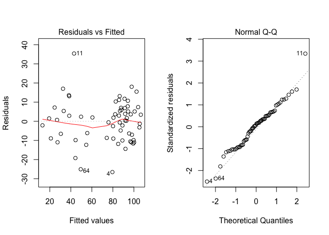

# Introduzione {-}

Placeholder


## Organizzazione del testo {-}
## Gli autori {-}
## Pre-requisiti {-}
## Package aggiuntivi {-}

<!--chapter:end:index.Rmd-->


# Scienza e pseudo-scienza

Placeholder


## Introduzione
### Cosa è quindi una prova scientifica?
##  Esperimenti buoni e cattivi!
### L'errore sperimentale
### Il campionamento
## Scienza = metodo
## Chi valuta se un esperimento è attendibile?
## Il metodo sperimentale
## Metodi sperimentali validi ed invalidi
### Primo esperimento
### Secondo esperimento
### Terzo esperimento
### Quarto esperimento: quello buono
## Incertezza residua
## Il ruolo della statistica
## Conclusioni

<!--chapter:end:01-introBiometry.Rmd-->


# Esperimenti validi ed invalidi

Placeholder


## Definizioni
## Elementi fondamentali del disegno sperimentale
### Primo elemento: controllo degli errori
#### Campionamento rappresentativo
#### Omogeneità
#### Rigore
#### Evitare le 'intrusioni demoniache'
### Secondo elemento: replicazione
### Terzo elemento: randomizzazione
#### Gradienti e blocking
#### E se ricercatori/soggetti sono influenzabili?
### Esperimenti non validi
#### Cattivo controllo degli errori
#### 'Confounding' e correlazione spuria
#### Pseudo-repliche e randomizzazione poco attenta
## Conclusione
## Per approfondimenti

<!--chapter:end:02-IntroExpMethods.Rmd-->


# Progettare un esperimento

Placeholder


## Ipotesi scientifica $\rightarrow$ obiettivo dell'esperimento
## Identificazione dei fattori sperimentali
### Esperimenti (multi)fattoriali
### Aggiungere un controllo?
### Fattori sperimentali di trattamento e di blocco
## Identificazione delle unità sperimentali
### Cornice di campionamento
### Scelta delle unità sperimentali
### Unità sperimentali in campo: le parcelle
## Allocazione dei trattamenti e disegno sperimentale
### Disegni completamente randomizzati
### Disegni a blocchi randomizzati
### Disegni a quadrato latino
## Scelta delle variabili da rilevare
### Variabili nominali (categoriche)
### Variabili ordinali
### Variabili quantitative discrete
### Variabili quantitative continue
### Rilievi visivi e sensoriali
### Variabili di confondimento
## Impianto delle prove
## Scrivere un progetto/report di ricerca: semplici indicazioni

<!--chapter:end:03-ResProject.Rmd-->


# Modelli matematici a 'due facce'

Placeholder


## Verità 'vera' e modelli deterministici
## Qualche esempio di modello deterministico
## Genesi deterministica delle osservazioni sperimentali
## Errore sperimentale e modelli stocastici
### Funzioni di probabilità
### Funzioni di densità
## La distribuzione normale (curva di Gauss)
## Modelli 'a due facce'
### Esercizio 1
### Esercizio 2
### Esercizio 3
### Esercizio 4
### Esercizio 5
### Esercizio 6
### Esercizio 7
## Altri modelli stocastici di interesse per lo sperimentatore
## E allora?
## Le simulazioni Monte Carlo
## Analisi dei dati e 'model fitting'

<!--chapter:end:04-ModelliSperimentazione.Rmd-->


# Esperimenti, stime ed incertezza

Placeholder


## L'analisi dei dati: gli 'ingredienti' fondamentali
## Esempio: una soluzione erbicida
### Il modello dei dati
### Analisi dei dati: stima dei parametri
### La 'sampling distribution'
### L'errore standard
## Riepilogo 1: Caratterizzare l'incertezza di un esperimento
## L'intervallo di confidenza
## Qual è il senso dell'intervallo di confidenza?
## Come presentare i risultati degli esperimenti
## Alcune precisazioni
### Campioni numerosi e non
### Popolazioni gaussiane e non 
## Analisi statistica dei dati: riassunto del percorso logico
## Da ricordare
## Esercizi

<!--chapter:end:06-InferenzaStatistica.Rmd-->


# Breve introduzione al test d'ipotesi

Placeholder


## Confronto tra una media osservata e una media teorica
### Simulazione Monte Carlo
### Soluzione formale
### Interpretazione del P-level
## Confronto tra due medie: il test t di Student
## Confronto tra due proporzioni: il test $\chi^2$
## Conclusioni
## Riepilogo
## Esercizi

<!--chapter:end:07-TestIpotesi.Rmd-->


# Modelli ANOVA ad una via

Placeholder


## La situazione sperimentale
## Descrizione del dataset
## Definizione di un modello descrittivo
## Parametrizzazioni di un modello lineare
## Assunzioni di base
## Stima dei parametri
### Coefficienti del modello
### Residui
### Stima di $\sigma$
### SEM e SED
## Scomposizione della devianza
## Analisi della varianza
## Test d'ipotesi
## L'ANOVA con R
## Medie marginali attese
## Per concludere ...
## Per approfondimenti

<!--chapter:end:09-oneWayANOVA.Rmd-->


# La verifica delle assunzioni di base

Placeholder


## Procedure diagnostiche
## Analisi grafica dei residui
### Grafico dei residui contro i valori attesi
### QQ-plot
## Strumenti diagnostici formali
## Risultati contraddittori
## 'Terapia'
### Correzione/Rimozione degli outliers
### Correzione del modello
### Trasformazione della variabile indipendente
### Impiego di metodiche statistiche avanzate
### Trasformazioni stabilizzanti
## Esempio
## Altre letture

<!--chapter:end:10-AssunzioniBase.Rmd-->


# Contrasti e confronti multipli

Placeholder


## Introduzione
## Esempio
## I contrasti
### Varianza del contrasto e test d'ipotesi
### I contrasti con R
## I confronti multipli a coppie (pairwise comparisons)
## Display a lettere
## Problemi di molteplicità: tassi di errore per confronto e per esperimento
### Correzione per la molteplicità
## E le classiche procedure di confronto multiplo?
## Consigli pratici
## Referenze bibliografiche

<!--chapter:end:11-ConfrontoMultiplo.Rmd-->

# Modelli ANOVA con fattori di blocco


## Introduzione

Nel capitolo precedente abbiamo visto come è possibile costruire modelli nei quali abbiamo una sola variabile dipendente quantitativa e una variabile indipendente categorica. Abbiamo anche visto che questo tipo di modelli lineari sono normalmente noti come modelli 'ANOVA' ad una via e presuppongono che le unità sperimentali siano totalmente indipendenti tra loro. Per questo motivo, essi possono essere utilizzati solo con disegni sperimentali a randomizzazione completa, dove non esistano raggruppamenti di alcun tipo, escluso quello dettato dal trattamento in studio.

Ovviamente è possibile definire modelli analoghi, ma più complessi, nei quali introdurre anche l'effetto di eventuali *blocking factors*. Vediamo ora alcuni esempi

## ANOVA a blocchi randomizzati

Abbiamo una prova di confronto tra erbicidi in mais, con 13 formulati, due testimoni inerbiti (che, per comodità, considereremo due trattamenti diversi) e un testimone scerbato. Date le dimensioni della prova, è lecito ipotizzare che, pur scegliendo un appezzamento il più omogeneo possibile, ci potrebbero essere differenze di infestazione tra un punto e l'altro del campo, con un presumibile gradiente procedendo dai lati (vicino alle fosse) verso il centro. In questa situazione, se l'esperimento fosse disegnato a randomizzazione completa, le differenze di infestazione tra una parte e l'altra del campo sarebbero trascurate e finirebbero per incrementare l'errore sperimentale, diminuendo l'efficienza dell'esperimento.

Si impiega quindi un disegno a blocchi randomizzati con quattro repliche. Ricordiamo che, con questo disegno, il campo è suddiviso in tante sezioni (dette blocchi) quante sono le repliche (quattro), perpendicolarmente al gradiente di infestazione trasversale. In questo modo, l'ambiente è relativamente omogeneo all'interno di ciascun blocco nel quale viene collocata una replica per trattamento.

Per questa lezione è necessario caricare il package 'aomisc', che deve essere preventivamente installato, facendo riferimento, se necessario, al capitolo introduttivo. Il dataset dei risultati ('rimsulfuron') è, appunto, contenuto in questo package.


```r
library(aomisc)
data(rimsulfuron)
```

Nel codice R sottostante riportiamo i dati tabulati, con le relative medie.

\tiny


```
##                                                   1         2        3         4    Medie
## Alachlor + terbuthylazine                  12.06000  49.58000  41.3400  16.37000 29.83750
## Hand-Weeded                                77.58000  92.08000  86.5900  99.63000 88.97000
## Metolachlor + terbuthylazine (pre)         51.77000  52.10000  49.4600  34.67000 47.00000
## Pendimethalin (post) + rimsuulfuron (post) 94.82000  87.72000 102.0500 101.94000 96.63250
## Pendimethalin (pre) + rimsulfuron (post)   65.51000  88.72000  95.5200  82.39000 83.03500
## Rimsulfuron (40)                           85.91000  91.09000 111.4200  93.15000 95.39250
## Rimsulfuron (45)                           93.03000 105.00000  89.1900  79.04000 91.56500
## Rimsulfuron (50)                           86.93000 105.82000 110.0200  89.10000 97.96750
## Rimsulfuron (50+30 split)                  71.36000  77.57000 115.9100  92.16000 89.25000
## Rimsulfuron (60)                           52.99000 102.86000 100.6200  97.04000 88.37750
## Rimsulfuron + Atred                        94.11000  89.86000 104.3400  99.63000 96.98500
## Rimsulfuron + hoeing                       73.22000  86.06000 118.0100  98.32000 93.90250
## Rimsulfuron + thyfensulfuron               75.28000  82.59000  94.9600  85.85000 84.67000
## Thifensulfuron                             78.47000  42.32000  62.5200  24.34000 51.91250
## Unweeded 1                                 10.88000  31.77000  23.9200  20.85000 21.85500
## Unweeded 2                                 27.58000  51.55000  25.1300  38.61000 35.71750
## Medie                                      65.71875  77.29313  83.1875  72.06812 74.56687
```

\normalsize

## Definizione di un modello descrittivo

La produzione di ogni unità sperimentale (parcella) è condizionata da più di un effetto:

1. il diserbante con cui essa è stata trattata;
2. il blocco di cui essa fa parte;
3. ogni altro effetto non conoscibile e puramente casuale.


Il modello è quindi:

$$ Y_{ij} = \mu + \gamma_i + \alpha_j + \varepsilon_{ij}$$

dove $Y$ è la produzione nel blocco $i$ e con il diserbo $j$, $\mu$ è l'intercetta, $\gamma$ è l'effetto del blocco $i$, $\alpha$ è l'effetto del trattamento $j$ e $\varepsilon$ è l'errore sperimentale per ogni singola parcella, che si assume normalmente distribuito, con media 0 e deviazione standard $\sigma$. Per gli usuali problemi di stimabilità, poniamo i vincoli $\gamma_1 = 0$ e $\alpha_1 = 0$ (vincolo sul trattamento), in modo che $\mu$ rappresenta il valore atteso nel primo blocco e per il primo trattamento in ordine alfabetico. In totale, vi sono 19 parametri da stimare, più $\sigma$.

## Stima dei parametri

### Coefficienti del modello

La stima dei parametri viene eseguita con il metodo dei minimi quadrati. In questo caso l'esperimento è completamente bilanciato e la stima potrebbe essere fatta banalmente, considerando i valori osservati e le medie aritmetiche per gruppo. Infatti, considerando la media generale, la media del primo blocco e la media del primo erbicida riportate in tabella, vediamo che il primo erbicida, rispetto alla media generale, ha determinato un aumento di -44.729375 unità. D'altra parte, il primo blocco ha comportanto un aumento di -8.848125 unità. Di conseguenza, il valore atteso nel primo trattamento e nel primo blocco dovrebbe essere pari a:

$$ \bar{Y}_{11} = \mu = 74.56687 - 44.72937 - 8.848125 = 20.98937$$

Analogamente, considerando che la media del secondo blocco è di 2.72625 unità più alta della media generale, il valore atteso per il primo trattamento nel secondo blocco è pari a:

$$ \bar{Y}_{12} = 74.56687 - 44.72937 + 2.72625 = 32.56375$$
Di conseguenza:

$$ \gamma_2 = 32.56375 - 20.98937 = 11.57438$$

Ancora, considerando che la media del secondo trattamento è di 14.403125 unità più alta della media generale, il valore atteso per il secondo trattamento nel primo blocco è pari a:

$$ \bar{Y}_{21} = 74.56687 + 14.40313 - 8.848125 = 80.12188$$

Di conseguenza:

$$ \alpha_2 = 80.12188 - 20.98937 = 59.13251$$

Ovviamente, continuare questi calcoli è abbastanza tedioso e quindi eseguiamo il 'model fitting' con R:

\scriptsize

```r
options(width = 170)
mod <- lm(Yield ~ factor(Block) + factor(Herbicide), data = rimsulfuron)
summary(mod)
```

```
## 
## Call:
## lm(formula = Yield ~ factor(Block) + factor(Herbicide), data = rimsulfuron)
## 
## Residuals:
##     Min      1Q  Median      3Q     Max 
## -26.539  -8.740   1.102   6.209  35.406 
## 
## Coefficients:
##                                                             Estimate Std. Error t value Pr(>|t|)    
## (Intercept)                                                   20.989      6.886   3.048 0.003847 ** 
## factor(Block)2                                                11.574      4.468   2.590 0.012874 *  
## factor(Block)3                                                17.469      4.468   3.910 0.000309 ***
## factor(Block)4                                                 6.349      4.468   1.421 0.162206    
## factor(Herbicide)Hand-Weeded                                  59.133      8.936   6.617 3.78e-08 ***
## factor(Herbicide)Metolachlor + terbuthylazine (pre)           17.163      8.936   1.921 0.061144 .  
## factor(Herbicide)Pendimethalin (post) + rimsuulfuron (post)   66.795      8.936   7.474 2.03e-09 ***
## factor(Herbicide)Pendimethalin (pre) + rimsulfuron (post)     53.198      8.936   5.953 3.67e-07 ***
## factor(Herbicide)Rimsulfuron (40)                             65.555      8.936   7.336 3.25e-09 ***
## factor(Herbicide)Rimsulfuron (45)                             61.728      8.936   6.907 1.40e-08 ***
## factor(Herbicide)Rimsulfuron (50)                             68.130      8.936   7.624 1.22e-09 ***
## factor(Herbicide)Rimsulfuron (50+30 split)                    59.413      8.936   6.648 3.39e-08 ***
## factor(Herbicide)Rimsulfuron (60)                             58.540      8.936   6.551 4.74e-08 ***
## factor(Herbicide)Rimsulfuron + Atred                          67.148      8.936   7.514 1.77e-09 ***
## factor(Herbicide)Rimsulfuron + hoeing                         64.065      8.936   7.169 5.73e-09 ***
## factor(Herbicide)Rimsulfuron + thyfensulfuron                 54.832      8.936   6.136 1.96e-07 ***
## factor(Herbicide)Thifensulfuron                               22.075      8.936   2.470 0.017359 *  
## factor(Herbicide)Unweeded 1                                   -7.982      8.936  -0.893 0.376473    
## factor(Herbicide)Unweeded 2                                    5.880      8.936   0.658 0.513902    
## ---
## Signif. codes:  0 '***' 0.001 '**' 0.01 '*' 0.05 '.' 0.1 ' ' 1
## 
## Residual standard error: 12.64 on 45 degrees of freedom
## Multiple R-squared:  0.8664,	Adjusted R-squared:  0.8129 
## F-statistic: 16.21 on 18 and 45 DF,  p-value: 4.916e-14
```
\normalsize

### Residui e devianze

Abbiamo visto, nel caso dell'ANOVA ad una via, come si calcolano i residui sia a mano che con R. Abbiamo anche visto che la devianza del residuo è la somma dei quadrati dei residui:


```r
RSS <- sum( residuals(mod)^2 )
RSS
```

```
## [1] 7187.348
```

Da questa possiamo ottenere la deviazione standard ($\sigma$), considerando che i gradi di libertà si calcolano partendo dallo stesso punto da cui siamo partiti per l'ANOVA ad una via: abbiamo 16 gruppi con quattro repliche, per cui la devianza, entro ogni gruppo, ha tre gradi di libertà. In totale abbiamo quindi $16 \times 3 = 48$ gradi di libertà anche se non dobbiamo dimenticare che, le repliche di ogni gruppo non differiscono solo per motivi casuali, ma anche perché appartengono a blocchi diversi. Abbiamo quattro blocchi, quindi tre gradi di libertà, che vanno dedotti dai 48 appena calcolati. Pertanto:


```r
sigma <- sqrt(RSS/45)
sigma
```

```
## [1] 12.63799
```

Più facilmente:


```r
summary(mod)$sigma
```

```
## [1] 12.63799
```


Da $\sigma$ possiamo ottenere SEM e SED, anche se questo calcolo ve lo lascio per esercizio.

## Scomposizione della devianza

La scomposizione della devianza è sequenziale ed analoga a quella che abbiamo operato per l'ANOVA ad una via; tuttavia, dobbiamo tener presente che, in questo caso, la devianza totale delle osservazione deve eseere decomposta in tre quota: una dovuta al trattamento, una dovuta al blocco ed una dovuta agli effetti stocastici.

La devianza totale dei dati, con R, potrebbe essere ottenuta considerando un modello lineare in cui esiste solo l'intercetta, il che equivale a dire che i residui rappresentano gli scostamenti rispetto alla media generale. La devianza dei residui (somma dei quadrati) è quindi la devianza totale delle osservazioni:


```r
mod1 <- lm(Yield ~ 1, data = rimsulfuron)
RSS1 <- sum( residuals(mod1)^2 )
RSS1
```

```
## [1] 53779.07
```

In seconda battuta, inseriamo l'effetto del blocco:


```r
mod2 <- lm(Yield ~ factor(Block), data = rimsulfuron)
RSS2 <- sum( residuals(mod2)^2 )
RSS2
```

```
## [1] 51118.58
```

Vediamo che la devianza del residuo è calata di `RSS1 - RSS2` unità, che corrispondono all'effetto del blocco e alla sua introduzione nel modello.

Infine, inseriamo anche l'effetto del trattamento, tornando così al modello completo che abbiamo utilizzato più sopra. Considerando i paragrafi precedenti, notiamo che l'inserimento dell'effetto del trattamento ha determinato un calo della devianza dei residui pari `RSS2 - RSS`, che corrisponde appunto all'effetto del diserbo. Insomma, ogni effetto introdotto nel modello ha determinato un decremento della variabilità non spiegata, quantitativamente pari alla variabilità attribuibile all'effetto stesso. Alla fine del processo rimane comunque un certo residuo (RSS) non spiegato, cioè $\varepsilon$.

Ci chiediamo se gli effetti attribuibili al blocco e al trattamento sono significativamente più grandi del residuo. Sappiamo già di non poter confrontare le devianze, ma possiamo calcolare e confrontare con un test di F le relative varianze. Basta tener conto che i gradi di libertà dei blocchi e dei trattamenti sono rispettivamente 3 e 15, cioè il numero dei blocchi meno uno e il numero dei trattamenti meno uno.

La tabella ANOVA può essere facilmente ottenuta con R:


```r
anova(mod)
```

```
## Analysis of Variance Table
## 
## Response: Yield
##                   Df Sum Sq Mean Sq F value    Pr(>F)    
## factor(Block)      3   2660  886.83  5.5524  0.002496 ** 
## factor(Herbicide) 15  43931 2928.75 18.3369 2.329e-14 ***
## Residuals         45   7187  159.72                      
## ---
## Signif. codes:  0 '***' 0.001 '**' 0.01 '*' 0.05 '.' 0.1 ' ' 1
```

Ovviamente, prima di considerare questa tabella dovremo preoccuparci del fatto che le assunzioni di base siano rispettate, cosa che possiamo facilmente verificare con un'analisi grafica dei residui.


```r
par(mfrow=c(1,2))
plot(mod, which = 1)
plot(mod, which = 2)
```

<!-- -->

Dopo esserci rassicurati su questo importante aspetto, possiamo vedere che abbiamo due ipotesi nulle da testare (effetto del trattamento non significativo ed effetto del blocco non significativo), che possono essere entrambe rifiutate per P < 0.05.

Da questo punto in avanti, l'analisi procede come usuale, calcolando le medie marginali attese ed, eventualmente, confrontandole tra loro con una procedura di confronto multiplo, come descritto nei capitoli precedenti. Tener presente che, in questo esperimento, abbiamo 16 trattamenti, cioè $16 \times 15 / 2 = 120$ confronti; di conseguenza, può essere opportuno operare la correzione per la molteplicità. Inoltre, dato che il trattamento più interessante è quello che rende massima la produzione, sarà opportuno ordinare le medie in senso decrescente, utilizzando l'argomento 'reverse = T'.


```r
library(emmeans)
medie <- emmeans(mod, ~factor(Herbicide))
multcomp::cld(medie, Letters = LETTERS, reverse = T)
```

```
##  Herbicide                                  emmean   SE df lower.CL upper.CL .group
##  Rimsulfuron (50)                             98.0 6.32 45    85.24    110.7  A    
##  Rimsulfuron + Atred                          97.0 6.32 45    84.26    109.7  A    
##  Pendimethalin (post) + rimsuulfuron (post)   96.6 6.32 45    83.91    109.4  A    
##  Rimsulfuron (40)                             95.4 6.32 45    82.67    108.1  A    
##  Rimsulfuron + hoeing                         93.9 6.32 45    81.18    106.6  A    
##  Rimsulfuron (45)                             91.6 6.32 45    78.84    104.3  A    
##  Rimsulfuron (50+30 split)                    89.2 6.32 45    76.52    102.0  A    
##  Hand-Weeded                                  89.0 6.32 45    76.24    101.7  A    
##  Rimsulfuron (60)                             88.4 6.32 45    75.65    101.1  A    
##  Rimsulfuron + thyfensulfuron                 84.7 6.32 45    71.94     97.4  A    
##  Pendimethalin (pre) + rimsulfuron (post)     83.0 6.32 45    70.31     95.8  AB   
##  Thifensulfuron                               51.9 6.32 45    39.19     64.6   BC  
##  Metolachlor + terbuthylazine (pre)           47.0 6.32 45    34.27     59.7    C  
##  Unweeded 2                                   35.7 6.32 45    22.99     48.4    C  
##  Alachlor + terbuthylazine                    29.8 6.32 45    17.11     42.6    C  
##  Unweeded 1                                   21.9 6.32 45     9.13     34.6    C  
## 
## Results are averaged over the levels of: Block 
## Confidence level used: 0.95 
## P value adjustment: tukey method for comparing a family of 16 estimates 
## significance level used: alpha = 0.05
```

Vi lascio il commento dei risultati come esercizio.

## ANOVA a quadrato latino

Immaginiamo di voler studiare il tempo necessario per costruire un componente elettronico, utilizzando quattro metodi diversi. E' evidente che il tempo di costruzione sarà influenzato dalla perizia del tecnico e, per questo, utilizziamo quattro tecnici diversi, ad ognuno dei quali facciamo utilizzare tutti e quattro i metodi. Un esperimento così disegnato sarebbe a blocchi randomizzati, con il tecnico che fa da blocco per i trattamenti. Tuttavia, dobbiamo anche riconoscere che i quattro tecnici saranno via via meno efficienti, e quindi il metodo che utilizzeranno per primo sarà avvantaggiato, mentre quello che utilizzeranno per ultimo sarà svantaggiato. E'vero che i metodi sono assegnati in ordine random ad ogni tecnico, ma non si può comunque evitare che un metodo venga avvantaggiato rispetto ad un altro, perché, ad esempio, non viene mai ad occupare l'ultima posizione (o meglio, l'ultimo turno).

Per evitare questo problema imponiamo un vincolo ulteriore alla randizzazione e facciamo in modo che ogni metodo occupi tutte e quattro i turni, in tecnici diversi. Il disegno è quindi a quadrato latino.

Il dataset dei risultati è disponibile su gitHub:


```r
dataset <- read.csv("https://raw.githubusercontent.com/OnofriAndreaPG/aomisc/master/data/Technicians.csv", header=T)
dataset
```

```
##    Shift Technician Method Time
## 1      I     Andrew      C   90
## 2     II     Andrew      B   90
## 3    III     Andrew      A   89
## 4     IV     Andrew      D  104
## 5      I       Anna      D   96
## 6     II       Anna      C   91
## 7    III       Anna      B   97
## 8     IV       Anna      A  100
## 9      I    Michael      A   84
## 10    II    Michael      D   96
## 11   III    Michael      C   98
## 12    IV    Michael      B  104
## 13     I      Sarah      B   88
## 14    II      Sarah      A   88
## 15   III      Sarah      D   98
## 16    IV      Sarah      C  106
```

In questo caso abbiamo un trattamento (metodo) e due effetti 'blocco' (tecnico e turno) da includere nel modello, che può essere così definito:

$$Y_{ijk} = \mu + \gamma_k + \beta_j + \alpha_i + \varepsilon_{ijk}$$

dove $\mu$ è l'intercetta, $\gamma$ è l'effetto del turno k, $\beta$ è l'effetto del tecnico j e $\alpha$ è l'effetto del metodo i. L'elemento $\varepsilon_{ijk}$ rappresenta la componente random individuale, di ogni osservazione e si assume normalmente distribuita, con media 0 e deviazione standard $\sigma$.

Avendo già illustrato il processo di stima dei parametri e di scomposizione della devianza e quindi utilizziamo subito R:


```r
mod <- lm(Time ~ Method + Technician
          + Shift, data = dataset)
```

Verifichiamo il rispetto delle assunzioni di base, con l'analisi grafica dei residui.


```r
par(mfrow=c(1,2))
plot(mod, which = 1)
plot(mod, which = 2)
```

<!-- -->

Non essendovi evidenti problemi, valutiamo la significatività degli effetti nel modello, analogamente a quanto abbiamo fatto nel caso dell'ANOVA a blocchi randomizzati. L'unica differenza sta nel fatto che, nei disegni a quadrato latino, vi sono tre effetti da testare, anche se l'unico ad avere una certa rilevanza è l'effetto del metodo di lavoro.


```r
anova(mod)
```

```
## Analysis of Variance Table
## 
## Response: Time
##            Df Sum Sq Mean Sq F value    Pr(>F)    
## Method      3 145.69  48.563 12.7377 0.0051808 ** 
## Technician  3  17.19   5.729  1.5027 0.3065491    
## Shift       3 467.19 155.729 40.8470 0.0002185 ***
## Residuals   6  22.87   3.812                      
## ---
## Signif. codes:  0 '***' 0.001 '**' 0.01 '*' 0.05 '.' 0.1 ' ' 1
```

Vediamo che esiste una differenza significativa tra i metodi e l'ipotesi nulla può essere rifiutata con una bassissima probabilità di errore di prima specie.

Ovviamente, dopo aver eswguito un'ANOVA a blocchi randomizzati o a quadrato latino, andremo eventualmente ad eseguire un test di confronto multiplo, seguendo le raccomandazioni esposte nel capitolo precedente. Anche questa parte ve la lascio per esercizio.

<!--chapter:end:12-MultiWayANOVAModels.Rmd-->


# Modelli ANOVA a due vie

Placeholder


## Il concetto di ’interazione’
## Tipi di interazione
## Descrizione del caso studio
## Analisi dei dati
## Stima dei parametri
## Verifica delle assunzioni di base
## Scomposizione delle varianze
## Funzioni dei parametri
### Medie delle combinazioni 'lavorazioni x diserbo'
## Calcolo degli errori standard (SEM e SED)
## Contrasti, medie attese e confronti multipli con R

<!--chapter:end:13-AnovaDueLivelli.Rmd-->


# La regressione lineare semplice

Placeholder


## Introduzione
## Esempio
## Stima dei parametri
## Valutazione della bontà del modello
### Valutazione grafica
### Errori standard dei parametri
### Test F per la mancanza d'adattamento
### Test F per la bontà di adattamento e coefficiente di determinazione
## Previsioni

<!--chapter:end:14-LinearRegression.Rmd-->


# La regressione non-lineare

Placeholder


## Introduzione
## Esempio 1
#### Linearizzazione della funzione
#### Approssimazione della vera funzione tramite una polinomiale in X
#### Adattamento di funzioni curvilinee qualunque: regressione non-lineare
### La regressione non-lineare con R
## Riparametrizzazione delle funzioni
### Esempio 2
## Inferenze statistiche e verifiche delle assunzioni di base
### Analisi grafica dei residui
### Errori standard dei parametri
### Coefficiente di determinazione
### Coefficiente di determinazione aggiustato
### Altre statistiche
## Gestione delle situazioni 'patologiche'
### Trasformazione del modello
### Trasformazione dei dati
## Confronto tra modelli alternativi
### Confronto tra modelli non-nested
## Il package 'drc'
## Previsioni		 
## Bibliografia

<!--chapter:end:15-NonLineare.Rmd-->


# Appendix 1: breve introduzione ad R {-}

Placeholder


## Cosa è R? {-}
## Oggetti e assegnazioni {-}
## Costanti e vettori {-}
## Matrici {-}
## Operazioni ed operatori {-}
## Funzioni ed argomenti {-}
## Dataframe {-}
## Quale oggetto sto utilizzando? {-}
## Consigli per l'immissione di dati sperimentali {-}
### Immissione manuale di dati {-}
### Immissione di numeri progressivi {-}
### Immissione dei codici delle tesi e dei blocchi {-}
### Leggere e salvare dati esterni {-}
## Alcune operazioni comuni sul dataset {-}
### Selezionare un subset di dati {-}
### Ordinare un vettore o un dataframe {-}
## Workspace {-}
## Script o programmi {-}
## Interrogazione di oggetti {-}
## Altre funzioni matriciali {-}
## Cenni sulle funzionalità grafiche in R {-}
## Per approfondimenti {-}

<!--chapter:end:23-IntroduzioneR.Rmd-->


# Appendix 2: richiami di statistica descrittiva {-}

Placeholder


## Le variabili quantitative: analisi chimiche e altre misurazioni fondamentali {-}
### Indicatori di tendenza centrale {-}
### Indicatori di variabilità {-}
### Arrotondamenti {-}
## Descrizione dei sottogruppi {-}
## Distribuzioni di frequenza e classamento {-}
## Statistiche descrittive per le distribuzioni di frequenza  {-}
## Distribuzioni di frequenza bivariate: le tabelle di contingenza  {-}
## Connessione {-}
## Correlazione {-}
## Esercizi {-}
### Esercizio 1 {-}
### Esercizio 2 {-}

<!--chapter:end:24-StatisticaDescrittiva.Rmd-->


# Appendix 3: Per chi vuole approfondire un po'... {-}

Placeholder


## Capitolo 3: Progettare un esperimento {-}
### Organizzare un esperimento di diserbo chimico {-}
### Organizzare un esperimento di confronto varietale {-}
### Organizzare un esperimento fattoriale  {-}
### Organizzare un esperimento con una coltura poliennale  {-}
### Utilizzare R per disegnare gli esperimenti  {-}
## Capitolo 4: Modelli matematici a 'due facce'  {-}
### La distribuzione t di Student {-}
### La distribuzione F di Fisher {-}
### La distribuzione binomiale {-}
#### Esercizio {-}
#### Esercizio {-}
## Capitolo 5: Esperimenti stime ed incertezza {-}
### E' realistico l'intervallo di confidenza? {-}
### Che cosa NON significa l'intervallo di confidenza? {-}
### Popolazioni non gaussiane {-}
#### Il modello dei dati {-}
#### Stima dei parametri {-}
#### Sampling distribution {-}
## Capitolo 6. Introduzione al test d'ipotesi {-}
### Simulazione Monte Carlo di un test t di Student {-}
### Tipologie alternative di test t di Student {-}
### Simulazione di un test di chi quadro {-}
### Errori di prima e di seconda specie {-}
## Capitolo 7: ANOVA ad una via {-}
## L'ANOVA 'a mano' {-}
## Capitolo 8: verifica delle assunzioni {-}
### Il QQ-plot {-}
### Correzione dati mancanti/aberranti {-}
## Capitolo 9: Contrasti e confronti multipli {-}
### Intervallo di confidenza di un contrasto {-}
### Intervalli di confidenza simultanei {-}
### E le classiche procedure di confronto multiplo? {-}
### Consigli pratici per il confronto multiplo {-}

<!--chapter:end:25-PerApprofondire.Rmd-->

