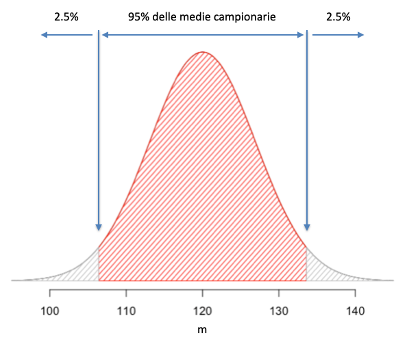

# Premessa {-}

Placeholder


## Obiettivi {-}
## Organizzazione  {-}
## Software statistico {-}
## Gli autori {-}
## Ringraziamenti e scuse {-}

<!--chapter:end:index.Rmd-->


# Scienza e pseudo-scienza

Placeholder


## Scienza = dati
## Dati 'buoni' e 'cattivi'
## Dati 'buoni' e metodi 'buoni'
## Il principio di falsificazione
## Falsificare un risultato
## Elementi fondamentali del disegno sperimentale
### Controllo degli errori
### Replicazione
### Randomizzazione
### Esperimenti invalidi
#### Cattivo controllo degli errori
#### 'Confounding' e correlazione spuria
#### Pseudo-repliche e randomizzazione poco attenta
## Chi valuta se un esperimento è attendibile?
## Conclusioni
## Altre letture

<!--chapter:end:01-introBiometria.Rmd-->


# Progettare un esperimento

Placeholder


## Gli elementi della ricerca
## Ipotesi scientifica $\rightarrow$ obiettivo dell'esperimento
## Identificazione dei fattori sperimentali
### Esperimenti (multi-)fattoriali
### Controllo o testimone
## Le unità sperimentali
## Allocazione dei trattamenti
## Le variabili sperimentali
### Variabili nominali (categoriche)
### Variabili ordinali
### Variabili quantitative discrete
### Variabili quantitative continue
### Rilievi visivi e sensoriali
### Variabili di confondimento
## Esperimenti di campo
### Scegliere il campo
### Le unità sperimentali in campo
### Numero di repliche
### La mappa di campo
### Lay-out sperimentale
#### Disegni completamente randomizzati
#### Disegni a blocchi randomizzati
#### Disegni a quadrato latino
#### Disegni a split-plot
#### Disegni a strip-plot
## Altre letture

<!--chapter:end:02-ProgettoRicerca.Rmd-->


# Richiami di statistica descrittiva

Placeholder


## Descrizione di dati quantitativi
### Indicatori di tendenza centrale
### Indicatori di dispersione
### Incertezza delle misure derivate
### Relazioni tra variabili quantitative: correlazione
## Descrizione di dati qualitativi
### Distribuzioni di frequenze e classamento
### Statistiche descrittive per le distribuzioni di frequenze 
### Distribuzioni di frequenza bivariate: le tabelle di contingenze
### Connessione
## Statistiche descrittive con R
### Descrizione dei sottogruppi
### Distribuzioni di frequenze e classamento
### Connessione
## Altre letture

<!--chapter:end:03-StatisticaDescrittiva.Rmd-->


# Modelli statistici ed analisi dei dati

Placeholder


## Verità 'vera' e modelli deterministici
## Genesi deterministica delle osservazioni sperimentali
## Errore sperimentale e modelli stocastici
### Funzioni di probabilità
### Funzioni di densità
### La distribuzione normale (curva di Gauss)
## Modelli 'a due facce'
## E allora?
## Le simulazioni Monte Carlo
## Analisi dei dati e 'model fitting'
## Modelli stocastici non-normali
## Altre letture

<!--chapter:end:04-ModelliSperimentazione.Rmd-->

# Stime ed incertezza


Nel capitolo precedente, abbiamo visto che: 

1.  i fenomeni biologici seguono una legge di natura (verità 'vera'), che ne costituisce il meccanismo deterministico fondamentale. Questa legge di natura produce un risultato atteso $Y_E$.
2.  Quando si organizza un esperimento, i soggetti sperimentali obbediscono a questo meccanismo di fondo, al quale tuttavia si sovrappongono molto altri elementi di 'confusione', altamente incontrollabili, che vanno sotto il nome di errore sperimentale.
3.  L'osservazione sperimentale è quindi un'immagine confusa della verità vera ($Y_O \neq Y_E$) e, soprattutto, essa tende ad essere sempre diversa, anche quando ripetiamo lo stesso esperimento nelle stesse condizioni.

Come facciamo, quindi, a gestire questa fondamentale 'irriproducibilità' dei risultati? Usualmente ci serviamo di un processo che prende il nome di **inferenza statistica**, attraverso il quale utilizziamo il campione per ottenere informazioni relative alla popolazione che lo ha generato, come in Figura \@ref(fig:figName61). Questo processo, nella sua forma classica, è basato sulle teorie di Karl Pearson (1857-1936), di suo figlio Egon Pearson (1895-1980), di Jarzy Neyman (1894-1981), in aggiunta al contributo di Ronald Fisher, del quale abbiamo già detto in precedenza.

<div class="figure" style="text-align: center">

<p class="caption">(\#fig:figName61)Osservazioni sperimentali e meccanismi perturbativi</p>
</div>


## Esempio: una soluzione erbicida

Riprendiamo l'esempio relativo ad un pozzo inquinato da un erbicida a concentrazione pari a 120 $mg/L$ (Capitolo 4), misurata tramite un gascromatografo che, unitamente a tutte le altre fonti ignote di errore, produce un coefficiente di variabilità del 10% (corrispondente ad una deviazione standard di 12 $mg/L$). Immaginando di fare le analisi in triplicato, come usuale per questo tipo di lavori, i risultati di questo esperimento possono essere simulati ricorrendo ad un generatore di numeri casuali, come nel box sottostante (ricordiamo che l'impiego della funzione `set.seed()` rende riproducibili i calcoli che seguono)


```r
set.seed(1234)
Y <- rnorm(3, 120, 12)
Y
```

```
## [1] 105.5152 123.3292 133.0133
```


### Analisi dei dati: stima dei parametri

A questo punto mettiamoci in una situazione reale: non sappiamo quale sia la concentrazione nel pozzo e, per determinarla, abbiamo a disposizione i risultati dell'esperimento appena citato. Per prima cosa, come abbiamo visto nel Capitolo 3, calcoliamo le statistiche descrittive di tendenza centrale e dispersione, cioè media e deviazione standard, che chiameremo, rispettivamente $m$ ed $s$.


```r
m <- mean(Y)
s <- sd(Y)
m; s
```

```
## [1] 120.6192
```

```
## [1] 13.9479
```

Il passo avanti è relativo al fatto che non siamo semplicemente interessati alle tre osservazioni che abbiamo fatto, ma siamo interessati a trarre conclusioni generali, relative all'intero pozzo e quindi a tutti i numerosi campioni che avremmo potute estrarre, ma che non abbiamo estratto. Facciamo quindi un'ipotesi sul meccanismo causa-effetto che genera le osservazioni sperimentali, che potrebbe essere del tipo:

$$Y_i = \mu + \varepsilon_i$$

con:

$$\varepsilon_i \sim N(0, \sigma)$$

Nelle due equazioni sovrastanti, gli elementi incogniti sono $\mu$ e $\sigma$, ai quali, in assenza di altre informazioni, assegniamo, rispettivamente, i valori $m$ ed $s$. Questo processo con il quale assegniamo alla popolazione le caratteristiche del campione prende il nome di **stima puntuale** dei parametri.

Si conferma che l'osservazione sperimentale non coincide con la verità 'vera' ($m \neq \mu$ e $s \neq \sigma)$, anche se, in questo caso, non siamo molto distanti, considerando il 10% di variabilità dello strumento di analisi. Tuttavia, visto che dobbiamo trarre conclusioni che riguardano l'intero meccanismo causa-effetto e non il campione, è giustificato da parte nostra un atteggiamento prudenziale: prima di dire che la concentrazione erbicida nella soluzione è pari 120.6192187, dobbiamo chiederci: che cosa succederebbe se ripetessimo l'esperimento molte altre volte?


### La 'sampling distribution' empirica

Il nostro esperimento è solo simulato e possiamo quindi ripeterlo un numero anche molto elevato di volte, seguendo questa procedura:

1.  Ripetiamo l'estrazione precedente per 100'000 volte (in altre parole: immaginiamo di ripetere l'analisi chimica per 100'000 volte, sempre con tre repliche)
2. Otteniamo 100'000 medie
3. Calcoliamo la media delle medie e la deviazione standard delle medie


```r
# Simulazione MONTE CARLO - Esempio 1
set.seed(1234)
result <- rep(0, 100000)
for (i in 1:100000){
  sample <- rnorm(3, 120, 12)
  result[i] <- mean(sample)
}
mean(result)
```

```
## [1] 120.0341
```

```r
sd(result)
```

```
## [1] 6.939063
```

Alla fine del processo ci troviamo con una popolazione di medie, che viene detta **sampling distribution**; si tratta di un 'oggetto' abbastanza 'teorico', ma fondamentale per la statistica frequentista, perché caratterizza la variabilità dei risultati di un esperimento, e quindi la sua riproducibilità.

Notiamo che:

1.  La media delle medie è praticamente coincidente con $\mu$, la verità 'vera'. Ciò conferma che $m$ è uno stimatore non distorto di $\mu$, perché tende a convergere su $\mu$ quando il numero di repliche tende a diventare molto elevato;
2.  La deviazione standard delle medie è pari a 6.939063. Questo valore è più basso della deviazione standard della popolazione di partenza, prende il nome di **errore standard** della media (SEM) e, in qualche modo, caratterizza la replicabilità di un esperimento, ovvero la sua precisione.

Con R possiamo visualizzare la *sampling distribution*, discretizzando la variabile concentrazione e riportando le frequenze di ogni intervallo su un grafico a barre (Fig. \@ref(fig:figName62) ). Vediamo con chiarezza che essa somiglia molto ad una distribuzione normale, con media pari a 120 e deviazione standard pari a 6.94. 

<div class="figure" style="text-align: center">

<p class="caption">(\#fig:figName62)Sampling distribution empirica e teorica</p>
</div>


### La 'sampling distribution' teorica

La *sampling distribution* definita più sopra è puramente empirica e potrebbe essere comunque utilizzata per gli sviluppi che seguono, anche se sarebbe molto utile poterla descrivere con una funzione di densità formale. Quanto osservato in Figura \@ref(fig:figName62) sulla somiglianza tra la *sampling distribution* empirica e la curva di Gauss può essere generalizzato grazie al teorema centrale del limite (o teorema del limite centrale), col quale si dimostra che, qualunque sia la popolazione di partenza, le medie di campioni casuali, indipendenti e di numerosità sufficientemente elevata tendono ad essere distribuite in modo normale. Insomma, la *sampling distribution* è effettivamente gaussiana, con media uguale alla media della popolazione di partenza, mentre, tenendo conto della legge di propagazione degli errori, si può dimostrare che l'errore standard è uguale a:


$$\sigma_m  = \frac{\sigma }{\sqrt n }$$

dove *n* è la dimensione del campione. Il valore ottenuto per questa espressione è pari a $12/\sqrt{3} = 6.928$ ed è molto simile a quello riscontrato con la simulazione Monte Carlo.

A questo punto possiamo trarre le nostra prima importante conclusione: **se ripetiamo un esperimento un numero molto elevato di volte, la variabilità delle medie campionarie e quindi la riproducibilità dei risultati possono essere caratterizzate utilizzando una sampling distribution gaussiana, con media pari alla media della popolazione di partenza e deviazione standard pari alla deviazione standard della popolazione di partenza, divisa per la radice quadrata del numero delle repliche**

E'importante ricordare che questa conclusione, oltre che alla media, può essere estesa ad altri stimatori campionari, anche se il calcolo dell'errore standard viene effettuato in modo diverso.


## Stima per intervallo

Sapendo che la *sampling distribution* è gaussiana, siamo in grado di individuare due valori simmetrici rispetto alla media, che contengono il 95% delle medie campionarie possibili e lasciano al loro esterno solo il 5% delle medie campionarie più 'rare'. 

<div class="figure" style="text-align: center">

<p class="caption">(\#fig:figName62b)Costruzione di un intervallo di confidenza (P = 0.95): se campioniamo da una popolazione gaussiana con media uguale a 120 e deviazione standard uguale a 12, il 95% delle medie campionarie ricadono nell'intervallo evidenziato</p>
</div>

L'espressione algebrica è la seguente:

$$P \left[ \mu - k \times \frac{\sigma}{\sqrt{n} } \leq m \leq \mu + k \times \frac{\sigma}{\sqrt{n} } \right] = 0.95 \, ,$$

dove vediamo che gli estremi dell'intervallo sono definiti aggiungendo e togliendo dalla media della popolazione $\mu$ un multiplo dell'errore standard, con moltiplicatore $k$.


Con semplici passaggi algebrici, possiamo ricavare l'espressione seguente:

$$P \left[ m - k \times \frac{\sigma}{\sqrt{n} } \leq \mu \leq m + k \times \frac{\sigma}{\sqrt{n} } \right] = 0.95$$
che è di estrema importanza, in quanto esprime il concetto che, **se facciamo un esperimento ed otteniamo una media pari ad $m$ e scegliamo accuratamente $k$, possiamo costruire un intervallo di confidenza intorno alla nostra stima, pari a $k$ volte l'errore standard e tale da contenere la media vera $\mu$ con una probabilità del 95%**. Questa espressione fornisce l'euristica più utilizzata per costruire il cosiddetto **intervallo di confidenza**.

Dato che non conosciamo $\sigma$ lo sostituiamo con la sua stima puntuale $s$ e, per il nostro esempio, otteniamo il seguente errore standard:

$$s_m = \frac{13.95}{\sqrt{3}} = 8.053$$

A questo punto dobbiamo individuare il valore più opportuno per $k$; in prima istanza, potremmo considerare $k = 1$ e calcolare l'intervallo di confidenza come $120.6192 \pm 8.053$, che permette di definire gli estremi $112.5662$ e $128.6722$. Questo intervallo è molto utilizzato in pratica come indicazione della precisione della stima e della riproducibilità dei risultati, risultando tanto più ampio quanto più il fenomeno in studio è variabile (alto valore di $\sigma$), oppure quanto meno numerose sono le repliche ($n$ piccolo).

Tuttavia, dobbiamo anche sapere che questo intervallo non è in grado di ottenere un 'coverage' del 95%, cioè non è in grado di 'catturare' la media della popolazione nel 95% dei casi. Nel codice sottostante, abbiamo ripetuto 100'000 volte l'esperimento iniziale, calcolando 100'000 intervalli di confidenza. Per ognuno di questi intervalli, abbiamo verificato se esso 'contenesse' il valore della media vera, cioè 120, oppure no (funzione `ifelse()`); nel primo caso abbiamo assegnato al vettore 'result' il valore 1, altrimenti gli abbiamo assegnato il valore 0. Alla fine del ciclo iterativo il numero dei successi (media vera catturata) sul totale degli intervalli di confidenza calcolati costituisce una misura del già citato 'coverage'.


```r
# Simulazione MONTE CARLO
# Coverage intervallo di confidenza
set.seed(1234)
result <- rep(0, 100000)
for (i in 1:100000){
  sample <- rnorm(3, 120, 12)
  media <- mean(sample)
  ES <- sd(sample)/sqrt(3)
  limSup <- media + ES
  limInf <- media - ES
  result[i] <- ifelse(limSup > 120 & limInf < 120, 1, 0)
}
sum(result)/100000
```

```
## [1] 0.57749
```

Vediamo che esso è pari al 58% circa, quindi piuttosto basso. Se la **sampling distribution** fosse veramente gaussiana, si potrebbe utilizzare un valore $k$ pari al 97.5-esimo percentile di una distribuzione normale standardizzata, cioè 1.96, approssimabile a 2, per semplicità. Purtroppo però, la *sampling distribution* non è effettivamente gaussiana, per il fatto che, nel calcolo dell'errore standard, abbiamo dovuto sostituire $\sigma$ (che è costante, ma ignoto) con la sua miglior stima $s$, che cambia ad ogni estrazione. In effetti, il teorema centrale del limite dice che la *sampling distribution* dovrebbe comunque essere approssimativamente gaussiana, ma solo quando il campione è molto numeroso (più di 15-20 unità, almeno). Nel nostro caso, la numerosità è bassa (n = 3) è l'impiego di $k = 2$ porta ad un 'coverage' dell'82%, che è ancora insufficiente, rispetto alle nostre esigenze.


```r
# Simulazione MONTE CARLO
# Coverage intervallo di confidenza - 2
set.seed(1234)
result <- rep(0, 100000)
for (i in 1:100000){
  sample <- rnorm(3, 120, 12)
  media <- mean(sample)
  ES <- sd(sample)/sqrt(3)
  limSup <- media + 2 * ES
  limInf <- media - 2 * ES
  result[i] <- ifelse(limSup > 120 & limInf < 120, 1, 0)
}
sum(result)/100000
```

```
## [1] 0.81708
```

Più in generale, si può dimostrare che è possibile ottenere il coverage desiderato (95%) utilizzando $k$ uguale al 97.5-esimo percentile della distribuzione 't di Student' con $n - 1$ gradi di libertà. Questa distribuzione di densità, simila alla normale, ma più variabile, è stata definita da William Sealy Gosset (1876 - 1937), uno statistico impiegato presso la fabbrica londinese della famosa birra Guinness, dove elaborava i dati relativi all'andamento del processo di maltazione. Egli, avendo definito questa nuova funzione di densità, per aggirare il divieto di pubblicazione impostogli dal suo datore di lavoro, pubblicò i suoi risultati sotto lo pseudonimo 'Student', da cui deriva il nome della distribuzione. 

La simulazione sottostante conferma che questa tecnica di calcolo degli intervalli di confidenza fornisce effettivamente un 'coverage' del 95%.


```r
# Simulazione MONTE CARLO
# Coverage intervallo di confidenza - 2
set.seed(1234)
result <- rep(0, 100000)
for (i in 1:100000){
  sample <- rnorm(3, 120, 12)
  media <- mean(sample)
  ES <- sd(sample)/sqrt(3)
  limSup <- media + qt(0.975, 2) * ES
  limInf <- media - qt(0.975, 2) * ES
  result[i] <- ifelse(limSup > 120 & limInf < 120, 1, 0)
}
sum(result)/100000
```

```
## [1] 0.94936
```

Considerando che, nel nostro caso (3 soggetti per campione e quindi 2 gradi di libertà), il 97.5-esimo percentile del t di Student è pari a:


```r
qt(0.975, 2)
```

```
## [1] 4.302653
```

la miglior stima per intervallo della concentrazione nel pozzo è pari a $120.6192 \pm 4.302 \times 8.053$.

Questo intervallo di confidenza (detto anche intervallo di confidenza classico o frequentista) non è solo una misura di precisione e riproducibilità dei risultati, ma esprime anche la nostra fiducia nel fatto che, se ripetessimo l'esperimento un numero molto elevato di volte, il nostro intervallo di confidenza conterrebbe la media vera della popolazione nel 95% dei casi, limitando i nostri errori entro un margine accettabile. Ovviamente, questa fiducia non si può riferire al singolo sforzo di campionamento in quanto non sapremo mai se uno specifico intervallo di confidenza (nel nostro caso, da 86.0 a 155.3) contenga o no $\mu$ e con quale probabilità (nel nostro caso lo contiene, ma possiamo dirlo solo perché conoscevamo la popolazione di partenza che, nella realtà, sarebbe totalmente ignota). Più propriamente, l'uso dell'intervallo di confidenza classico garantisce solo che, nel lungo periodo, un ricercatore dovrebbe riuscire a contenere la sua probabilità d'errore di stima al disotto del 5%. Ed è proprio per questo che abbiamo fiducia nella scienza, in quanto il metodo adottato consente di evitare errori frequenti e gravi.

## Inferenza statistica: conclusioni

Considerando quanto finora detto, possiamo riassumere la logica dell'inferenza classica nel modo seguente:

1. un esperimento è solo un campione di un numero infinito di esperimenti simili che avremmo potuto/dovuto eseguire, ma che non abbiamo eseguito, per mancanza di risorse;
2. utilizziamo il campione per stimare i parametri del modello deterministico/stocastico che presumiamo abbia generato le nostre osservazioni sperimentali;
3. definiamo, per ogni stima, la sua *sampling distribution* in modo da caratterizzare i risultati delle infinite repliche del nostro esperimento, che avremmo dovuto fare, ma che non abbiamo fatto. Per costruire la sampling distribution, assumiamo che questa sia gaussiana (in coerenza con il teorema centrale del limite) e che l'errore standard sia definibile con l'impiego di una formula affidabile. Ad esempio, per l'inferenze sulla media, utilizziamo la deviazione standard del campione divisa per la radice quadrata del numero di repliche;
4. definiamo gli intervalli di confidenza, aggiungendo e togliendo dalla stima un multiplo del relativo errore standard.

Per quanto riguarda la scelta del moltiplicatore $k$, è frequente trovare nelle pubblicazioni scientifiche l'intervallo composto dalla media più o meno l'errore standard ($k = 1$); si tratta di una tecnica accettabile per esprimere l'incertezza di stima della media o di altre statistiche campionarie, ma bisogna che il lettore sia informato di come abbiamo calcolato questo intervallo, per evitare che gli attribuisca un 'coverage' che, in realtà, esso non ha. Altrimenti, più in generale, si utilizza la distribuzione t di Student, a meno che la numerosità non sia molto elevata, nel qual caso possiamo semplificare, utilizzando $k = 2$. 

Concludiamo con una precisazione: nel capitolo sulla statistica descrittiva abbiamo visto che l'incertezza assoluta di un gruppo di misure può essere espressa utilizzando un intervallo ottenuto sommando e sottraendo alla media del campione la sua deviazione standard. Questo intervallo non ha nulla a che vedere con l'intervallo di confidenza e non ha alcun ruolo inferenziale; è semplicemente un intervallo descrittivo che caratterizza la variabilità del campione, insieme alla sua tendenza centrale, senza alcun riferimento alla popolazione che ha generato il campione.

In ultimo, ribadiamo che questo processo classico di inferenza può essere applicato anche ad altri importanti stimatori campionari, perché ci sia un metodo affidabile per il calcolo dell'errore standard.

## Per chi avesse voglia di approfondire un po'...

### Popolazioni gaussiane e non 

In questo esempio siamo partiti da una popolazione con distribuzione gaussiana. In altri casi potrebbe non essere così. Ad esempio, immaginiamo di avere una popolazione di insetti, nella quale il rapporto tra maschi e femmine è ignoto. Campioniamo 40 insetti e contiamo 14 femmine. Qual è la proporzione di femmine nella popolazione originaria?

Stiamo studiando una grandezza che, almeno nel principio, non può essere gaussiana, ma, nonostante questo, grazie al teorema centrale del limite, possiamo utilizzare la stessa tecnica per la stima dell'intervallo di confidenza; basta sapere che la proporzione osservata è $p = 14/40 = 0.375$, mentre la deviazione standard di una proporzione (che non abbiamo finora incontrato) è pari a $\sigma = \sqrt{0.375 \times (1 - 0.375)} = 0.484$ (Snedecor e Cochran, 1989).  L'errore standard è $0.484 / \sqrt{40} = 0.077$ e l'intervallo di confidenza, considerando che il campione è molto numeroso, potrà essere approssimato come:


```r
0.375 - 2 * 0.077
```

```
## [1] 0.221
```

```r
0.375 + 2 * 0.077
```

```
## [1] 0.529
```


### Cosa fare se il teorema centrale del limite non vale?

Nel caso precedente, avevamo a che fare con una distribuzione non gaussiana, ma avevamo comunque un campione numeroso, oltre ad una formula per il calcolo dell'errore standard. In altri casi, non abbiamo nessuno di questi elementi e quindi non possiamo calcolare l'intervallo di confidenza classico, come suggerito da Neyman. L'esempio tipico è la varianza, per la quale non sappiamo come calcolare un errore standard attendibile (anche se sono disponibili in letteratura alcune formule di uso comune).

Ad esempio, immaginiamo di avere un campione di 30 soggetti, la cui media è pari a 7.0 e la cui varianza è 0.5. Possiamo dire che la media della popolazione che ha generato il campione è presumibilmente compresa tra:


```r
7 - qt(0.975, 29) * sqrt(0.5)/sqrt(30)
```

```
## [1] 6.735962
```

e


```r
7 + qt(0.975, 29) * sqrt(0.5)/sqrt(30)
```

```
## [1] 7.264038
```

Invece, in relazione alla varianza della popolazione, possiamo solo dire che la stima puntuale è pari a 0.5, ma non abbiamo una formula attendibile per stimare l'errore standard e quindi per calcolare l'intervallo di confidenza. In questo caso, possiamo determinare una 'sampling distribution' empirica, con una simulazione di Monte Carlo, come indicato nel codice sottostante:


```r
# Simulazione Monte Carlo - Varianza
set.seed(1234)
result <- rep(0, 100000)
for (i in 1:100000){
  sample <- rnorm(30, 7, sqrt(0.5))
  result[i] <- var(sample)
}
mean(result)
```

```
## [1] 0.5004283
```

```r
sd(result)
```

```
## [1] 0.1313021
```

Vadiamo che la 'sampling distribution' empirica ha media pari a 0.5 circa (questo non ci sorprende) e che l'errore standard è pari a 0.131. Possiamo anche calcolare il 2.5-esimo e il 97.5-esimo percentile ed utilizzarli come margini dell'intervallo di confidenza, che comprende al suo interno il 95% dei valori:


```r
quantile(result, probs = c(0.025, 0.975))
```

```
##      2.5%     97.5% 
## 0.2770264 0.7871032
```

Questo intervallo di confidenza empirico funziona piuttosto bene ed ha campi di impiego abbastanza vasti, anche quando il teorema centrale del limite non vale; tuttavia, l'intervallo di confidenza così ottenuto può non essere simmetrico rispetto alla media, il che non dovrebbe stupire, dato che la 'sampling distribution' non è gaussiana e può essere più o meno asimmetrica.

## Altre letture

1. Hastie, T., Tibshirani, R., Friedman, J., 2009. The elements of statistical learning, Springer Series in Statistics. Springer Science + Business Media, California, USA.
2. Morey, RD, R Hoekstra, JN Rouder, MD Lee, E-J Wagenmakers, 2016. The fallacy of placing confidence in confidence intervals. Psychonomic Bulletin & Review 23, 103–123
3. Snedecor G.W. and Cochran W.G., 1989. Statistical Methods. Ames: Iowa State University Press (1989).


<!--chapter:end:05-InferenzaStatistica.Rmd-->


# Decisioni ed incertezza

Placeholder


## Confronto tra due medie: il test t di Student
### L'ipotesi 'nulla' e l'ipotesi 'alternativa'
### La statistica T
### Simulazione Monte Carlo
### Soluzione formale
### Interpretazione del P-level
## Estensioni del test di t di Student
### Significatività delle stime
### Varianze non omogenee
### Differenze generalizzate tra parametri
### Misure appaiate
### Test ad una coda 
## Altri test d'ipotesi
## Confronto tra due proporzioni: il test $\chi^2$
### Simulazione Monte Carlo
### Soluzione formale
## Conclusioni e riepilogo
## Altre letture

<!--chapter:end:06-TestIpotesi.Rmd-->


# Modelli ANOVA ad una via

Placeholder


## Caso-studio: confronto tra erbicidi in vaso
## Descrizione del dataset
## Definizione di un modello lineare
## Parametrizzazione del modello
## Assunzioni di base
## Fitting del modello: metodo manuale
### Stima dei parametri
### Calcolo dei residui
### Stima di $\sigma$
## Scomposizione della varianza
## Test d'ipotesi
## Inferenza statistica
## Fitting del modello con R
## Medie marginali attese
## Per concludere ...
## Altre letture

<!--chapter:end:07-ANOVAunaVia.Rmd-->


# La verifica delle assunzioni di base

Placeholder


## Violazioni delle assunzioni di base
## Procedure diagnostiche
## Analisi grafica dei residui
### Grafico dei residui contro i valori attesi
### QQ-plot
## Test d'ipotesi
## Risultati contraddittori
## 'Terapia'
### Correzione/Rimozione degli outliers
### Correzione del modello
### Trasformazione della variabile indipendente
### Impiego di metodiche statistiche avanzate
### Trasformazioni stabilizzanti
## Esempio 1
## Esempio 2
## Altre letture

<!--chapter:end:08-AssunzioniBase.Rmd-->


# Contrasti e confronti multipli

Placeholder


## Esempio
## I contrasti
## I contrasti con R
## I confronti multipli a coppie (pairwise comparisons)
## Display a lettere
## Tassi di errore per confronto e per esperimento
## Aggiustamento per la molteplicità
## E le classiche procedure di confronto multiplo?
## Consigli pratici
## Altre letture

<!--chapter:end:09-ConfrontoMultiplo.Rmd-->


# Modelli ANOVA con fattori di blocco

Placeholder


## Caso-studio: confronto tra erbicidi in campo
## Definizione di un modello lineare
## Stima dei parametri
### Coefficienti del modello
### Stima di $\sigma$
## Scomposizione della varianza
## Adattamento del modello con R
## Disegni a quadrato latino
## Caso studio: confronto tra metodi costruttivi
## Definizione di un modello lineare

<!--chapter:end:10-MultiWayANOVAModels.Rmd-->


# La regressione lineare semplice

Placeholder


## Caso studio: effetto della concimazione azotata al frumento
## Analisi preliminari
## Definizione del modello lineare
## Stima dei parametri
## Valutazione della bontà del modello
### Valutazione grafica
### Errori standard dei parametri
### Test F per la mancanza d'adattamento
### Test F per la bontà di adattamento
### Coefficiente di determinazione
## Previsioni
## Disegni a blocchi randomizzati
## Altre letture

<!--chapter:end:11-LinearRegression.Rmd-->


# Modelli ANOVA a due vie con interazione

Placeholder


## Il concetto di ’interazione’
## Effetti incrociati: interazione tra lavorazioni e diserbo chimico
## Definizione del modello lineare
## Calcoli manuali
### Scomposizione della varianza
## Calcoli con R
### Model fitting
### Verifica delle assunzioni di base
### Scomposizione della varianza
### Medie marginali attese e confronti multipli con R
## Effetti innestati: valutazione di ibridi di mais
## Definizione del modello lineare
## Fitting del modello con R

<!--chapter:end:12-AnovaDueLivelli.Rmd-->


# Breve introduzione ai modelli misti

Placeholder


## Raggruppamenti tra parcelle
## Esperimenti a split-plot
### Definizione del modello lineare
### Model fitting con R
## Esperimenti a strip-plot
### Definizione del modello lineare
### Model fitting con R
## Altre letture

<!--chapter:end:13-SplitStrip.Rmd-->


# La regressione non-lineare

Placeholder


## Caso studio: degradazione di un erbicida nel terreno
## Scelta della funzione
## Stima dei parametri
### Linearizzazione della funzione
### Approssimazione della vera funzione tramite una polinomiale in X
### Minimi quadrati non-lineari
## La regressione non-lineare con R
## Verifica della bontà del modello
### Analisi grafica dei residui
### Test F per la mancanza di adattamento (approssimato)
### Errori standard dei parametri
### Coefficiente di determinazione
## Funzioni lineari e nonlineari dei parametri
## Previsioni		 
## Gestione delle situazioni 'patologiche'
### Trasformazione del modello
### Trasformazione dei dati
## Per approfondire un po'...
### Riparametrizzazione delle funzioni non-lineari
### Altre letture

<!--chapter:end:14-NonLineare.Rmd-->


# Esercizi

Placeholder


## Il disegno degli esperimenti (Cap. 1 e 2)
### Domanda 1
### Domanda 2
### Domanda 3
### Domanda 4
### Domanda 5
### Domanda 6
### Domanda 7
### Domanda 8
### Domanda 9
### Domanda 10
### Domanda 12
### Domanda 13
### Esercizio 1
### Esercizio 2
### Esercizio 3
### Esercizio 4
### Esercizio 5
## Statistica descrittiva (Cap. 3)
### Domanda 1
### Domanda 2
### Domanda 3
### Domanda 4
### Esercizio 1
### Esercizio 2
### Esercizio 3
### Esercizio 4
### Esercizio 5
## Modelli statistici (Cap. 4)
### Esercizio 1
### Esercizio 2
### Esercizio 3
### Esercizio 4
### Esercizio 5
### Esercizio 6
### Esercizio 7
### Esercizio 8
### Esercizio 9
### Esercizio 10
## Stima dei parametri (Cap. 5)
### Esercizio 1
### Esercizio 2
### Esercizio 3
### Esercizio 4
### Esercizio 5
### Esercizio 6
## Test d'ipotesi (Cap. 6)
### Esercizio 1
### Esercizio 2
### Esercizio 3
### Esercizio 4
### Esercizio 5
### Esercizio 6
### Esercizio 7
### Esercizio 8
### Esercizio 9
### Esercizio 10
### Esercizio 11
## Modelli ANOVA ad una via (Cap. da 7 a 9)
### Esercizio 1 
### Esercizio 2
### Esercizio 3
### Esercizio 4
## ANOVA a due vie (Cap. 10)
### Esercizio 1
### Esercizio 2
### Esercizio 3
## Regressione (Cap. 11)
### Esercizio 1
### Esercizio 2
## ANOVA a due vie con interazione (Cap. 12 e 13)
### Esercizio 1
### Esercizio 2
### Esercizio 3
### Esercizio 4
### Esercizio 5
### Esercizio 6
## Regressione non-lineare (Cap. 14)
### Esercizio 1
### Esercizio 2
### Esercizio 3
### Esercizio 4
### Esercizio 5
### Esercizio 6
### Esercizio 7

<!--chapter:end:15-Esercizi.Rmd-->


# Appendice: breve introduzione ad R

Placeholder


## Cosa è R?
## Prima di iniziare
## Oggetti e assegnazioni
### Costanti e vettori
### Matrici
### Dataframe
### Indicizzazione
## Espressioni e funzioni
## Funzioni di uso comune
## Creazione di funzioni personalizzate
## Uso di librerie aggiuntive
## Workspace
## Importare dati esterni
## Cenni sulle funzionalità grafiche in R
## Altre letture

<!--chapter:end:17-IntroduzioneR.Rmd-->

