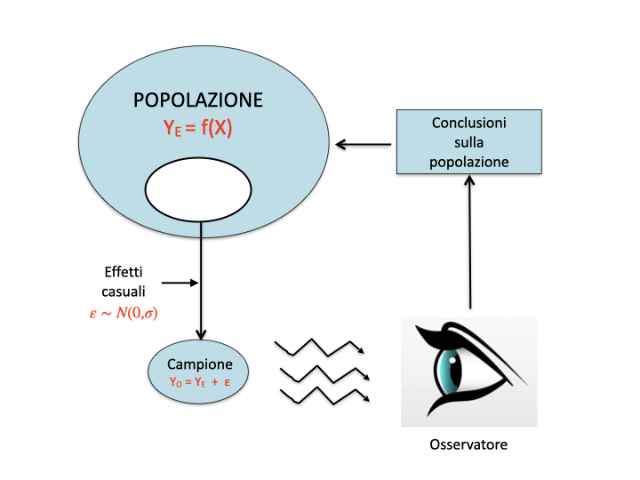

# Introduzione {-}

Placeholder


## Organizzazione del testo {-}
## Gli autori {-}
## Pre-requisiti {-}
## Package aggiuntivi {-}

<!--chapter:end:index.Rmd-->


# Scienza e pseudo-scienza

Placeholder


### Cosa è quindi una prova scientifica?
##  Esperimenti buoni e cattivi!
### L'errore sperimentale
### Il campionamento
## Scienza = metodo
## Chi valuta se un esperimento è attendibile?
## Il metodo sperimentale
## Metodi sperimentali validi ed invalidi
### Primo esperimento
### Secondo esperimento
### Terzo esperimento
### Quarto esperimento: quello buono
## Incertezza residua
## Il ruolo della statistica
## Conclusioni

<!--chapter:end:01-introBiometry.Rmd-->


# Esperimenti validi ed invalidi

Placeholder


## Definizioni
## Elementi fondamentali del disegno sperimentale
### Primo elemento: controllo degli errori
#### Campionamento rappresentativo
#### Omogeneità
#### Rigore
#### Evitare le 'intrusioni demoniache'
### Secondo elemento: replicazione
### Terzo elemento: randomizzazione
#### Gradienti e blocking
#### E se ricercatori/soggetti sono influenzabili?
### Esperimenti non validi
#### Cattivo controllo degli errori
#### 'Confounding' e correlazione spuria
#### Pseudo-repliche e randomizzazione poco attenta
## Conclusione
## Per approfondimenti

<!--chapter:end:02-IntroExpMethods.Rmd-->


# Progettare un esperimento

Placeholder


## Ipotesi scientifica $\rightarrow$ obiettivo dell'esperimento
## Identificazione dei fattori sperimentali
### Esperimenti (multi)fattoriali
### Aggiungere un controllo?
### Fattori sperimentali di trattamento e di blocco
## Identificazione delle unità sperimentali
### Cornice di campionamento
### Scelta delle unità sperimentali
### Unità sperimentali in campo: le parcelle
## Allocazione dei trattamenti e disegno sperimentale
### Disegni completamente randomizzati
### Disegni a blocchi randomizzati
### Disegni a quadrato latino
## Scelta delle variabili da rilevare
### Variabili nominali (categoriche)
### Variabili ordinali
### Variabili quantitative discrete
### Variabili quantitative continue
### Rilievi visivi e sensoriali
### Variabili di confondimento
## Impianto delle prove
## Scrivere un progetto/report di ricerca: semplici indicazioni

<!--chapter:end:03-ResProject.Rmd-->


# Modelli matematici ed analisi dei dati

Placeholder


## Verità 'vera' e modelli deterministici
### Qualche esempio di modello deterministico
## Genesi deterministica delle osservazioni sperimentali
## Errore sperimentale e modelli stocastici
### Funzioni di probabilità
### Funzioni di densità
## La distribuzione normale (curva di Gauss)
## Modelli 'a due facce'
## E allora?
## Le simulazioni Monte Carlo
## Analisi dei dati e 'model fitting'
## Per approfondire un po'...
### Generazione dei dati sperimentali: un esempio più realistico
### Modelli stocastici non-normali
#### t di Student
#### F di Fisher
#### La distribuzione binomiale

<!--chapter:end:04-ModelliSperimentazione.Rmd-->

# Stime ed incertezza


Abbiamo già visto che un esperimento scientifico non è altro che un'operazione di campionamento, con la quale io, invece che studiare una popolazione enorme di soggetti, posso studiarne un gruppo sufficientemente piccolo, e compatibile con le mie limitate risorse di tempo e denaro. Anche se il campione estratto è effettivamente rappresentativo della popolazione, rimane il fatto che esso è il risultato di uno solo degli infiniti sforzi di campionamento possibili. Con due importanti conseguenze:

1. le sue caratteristiche non necessariamente riflettono quelle della popolazione che lo ha generato;
2. campionamenti successivi forniscono risultati diversi, perché diversi sono i soggetti e, spesso, anche le condizioni in cui l'esperimento viene eseguito.

Di conseguenza, al di là del campione, il nostro interesse rimane fondamentalmente rivolto verso la popolazione che lo ha generato. Ci dobbiamo chiedere quale sia la relazione tra le caratteristiche del campione e quelle della popolazione da cui esso è estratto. Questo processo logico prende il nome di *inferenza statistica* e può essere condotto secondo le teorie di Karl Pearson (1857-1936), Egon Pearson (suo figlio: 1895-1980) e Jarzy Neyman (1894-1981), oltre al solito Ronald Fisher.

## L'analisi dei dati: gli 'ingredienti' fondamentali

Richiamiamo il percorso logico che abbiamo introdotto nel capitolo precedente:

1.  I fenomeni biologici seguono una legge di natura (verità 'vera'), che ne costituisce il meccanismo deterministico fondamentale.
2.  Quando si organizza un esperimento, i soggetti sperimentali obbediscono a questo meccanismo di fondo, al quale tuttavia si sovrappongono molto altri elementi di 'confusione', altamente incontrollabili, che vanno sotto il nome di errore sperimentale.
3.  L'osservazione sperimentale è quindi un'immagine confusa della verità vera e, soprattutto, l'osservazione sperimentale tende ad essere diversa per ogni sforzo di campionamento.
4.  Compito del ricercatore è quello di separare l'informazione (che rappresenta la verità 'vera') dal 'rumore di fondo' provocato dall'errore sperimentale.


Questo dualismo tra verità 'vera' (inconoscibile) e verità sperimentale (esplorabile tramite un esperimento opportunamente pianificato) è l'aspetto centrale di tutta la biometria ed è schematizzato nella figura \@ref(fig:figName61). Di esso abbiamo fatto menzione più volte nei capitoli precedenti.

<div class="figure" style="text-align: center">

<p class="caption">(\#fig:figName61)Osservazioni sperimentali e meccanismi perturbativi</p>
</div>

In questo percorso logico ci sono due aspetti fondamentali che debbono essere attentamente valutati:

1.  modello di generazione dei dati sperimentali;
2.  sampling distribution (o sample space).

Chiariamo i due concetti con un esempio.

## Esempio: una soluzione erbicida

Immaginiamo questa situazione: abbiamo una soluzione erbicida a concentrazione pari a 120 $mg/l$, che viene misurata tramite un gascromatografo. Lo strumento di misura, unitamente a tutte le altre fonti ignote di errore, produce un coefficiente di variabilità del 10% (corrispondete ad una deviazione standard pari a 12 $mg/l$). Facciamo le analisi in triplicato, come usuale per questo tipo di lavori.

### Il modello dei dati

In primo luogo, ci chiediamo quale sia il modello matematico che genera le nostre osservazioni. Considerando quanto detto nel capitolo precedente, possiamo assumere che:

$$ Y_i = \mu + \varepsilon_i$$

dove:

$$ \varepsilon_i \sim N(\mu, \sigma)$$

cioè possiamo assumere che i risultati delle nostre misure siano normalmente distribuiti con media $\mu = 120$ e deviazione standard $\sigma = 12$.

Con queste informazioni possiamo simulare un esperimento con R, ottenendo i seguenti risultati:


```r
set.seed(1234)
Y <- rnorm(3, 120, 12)
Y
```

```
## [1] 105.5152 123.3292 133.0133
```

### Analisi dei dati: stima dei parametri

Nelle due equazioni sovrastanti, gli elementi incogniti sono $\mu$ e $\sigma$. In realtà, dato che si tratta di una simulazione, sappiamo che essi sono pari, rispettivamente, a 120 e 12; tuttavia, nella realtà questa informazione sarebbe totalmente sconosciuta. Guardando il campione, le nostre migliori stime $\mu$ e $\sigma$, che chiameremo rispettivamente $m$ ed $s$, sono pari rispettivamente alla media e alla deviazione standard del campione.


```r
m <- mean(Y)
s <- sd(Y)
m; s
```

```
## [1] 120.6192
```

```
## [1] 13.9479
```

Questo processo con il quale assegniamo alla popolazione le caratteristiche del campione prende il nome di **stima puntuale** dei parametri. Vediamo ancora una volta che l'osservazione sperimentale non coincide con la verità 'vera' ($m \ne \mu$ e $s \ne \sigma)$, ma non siamo molto distanti, considerando il 10% di variabilità dello strumento di analisi. Tuttavia, visto che dobbiamo trarre conclusioni che riguardano la popolazione e non il campione, è giustificato da parte nostra un atteggiamento prudenziale: prima di dire che la concentrazione erbicida nella soluzione è pari 120.6192187, dobbiamo chiederci: che cosa succederebbe se ripetessimo l'esperimento molte altre volte?


### La 'sampling distribution'

In questo caso l'esperimento è solo 'elettronico' e possiamo quindi ripeterlo un numero anche molto elevato di volte, seguendo questa procedura:

1.  Ripetiamo l'estrazione precedente per 100'000 volte (ripetiamo l'analisi chimica per 100'000 volte, sempre con tre repliche)
2. Otteniamo 100'000 medie
3. Calcoliamo la media delle medie e la deviazione standard delle medie


```r
# Simulazione MONTE CARLO - Esempio 1
set.seed(1234)
result <- rep(0, 100000)
for (i in 1:100000){
  sample <- rnorm(3, 120, 12)
  result[i] <- mean(sample)
}
mean(result)
```

```
## [1] 120.0341
```

```r
sd(result)
```

```
## [1] 6.939063
```

In sostanza, la simulazione Monte Carlo ci consente di fare quello che dovremmo sempre fare, cioè ripetere l'esperimento un numero di volte molto elevato, anche se finito (un numero infinito è chiaramente impossibile!). A questo punto abbiamo in mano una popolazione di medie, che viene detta **sampling distribution**, un 'oggetto' abbastanza 'teorico', ma fondamentale per la statistica frequentista, perché caratterizza la variabilità dei risultati di un esperimento, e quindi la sua riproducibilità.

Notiamo che:

1.  La media delle medie è praticamente coincidente con $\mu$, la verità 'vera'. Ciò conferma che l'unico modo di ottenere risultati totalmente precisi è ripetere infinite volte l'esperimento;
2.  La deviazione standard delle medie è pari a 6.939063. Questo valore prende il nome di **errore standard** della media (SEM).

Esploriamo meglio la *sampling distribution*. Con R possiamo provare a discretizzarla e a riportarla su di un grafico a barre (figura \@ref(fig:figName62) ).


```r
b <- seq(80, 160, by=2.5)
hist(result, breaks = b, freq=F, xlab = expression(paste(m)),
  ylab="Density", main="")
curve(dnorm(x, 120, 6.94), add = TRUE, col = "red")
```

<div class="figure" style="text-align: center">

<p class="caption">(\#fig:figName62)Sampling distribution empirica e teorica</p>
</div>


### L'errore standard

La *sampling distribution* che abbiamo ottenuto con la simulazione Monte Carlo è puramente empirica. Sarebbe interessante capire con più esattezza se esista una funzione di densità che permetta di descriverla con esattezza. In effetti, il grafico precedente mostra che la *sampling distribution* assomiglia molto ad una distribuzione normale, con media pari a 120 e deviazione standard pari all'errore standard.

Formalmente, il problema si può risolvere grazie alla legge di propagazione degli errori, che stabilisce tre importanti elementi:

1. Se ho due variabili normalmente distribuite e le sommo tra di loro, la variabile risultante è ancora normale. Se ho una variabile normalmente distribuita e la moltiplico per una costante, la variabile risultante è ancora normale.
2. Per variabili indipendenti, la varianza della somma è uguale alla somma delle varianze.
3. La varianza del prodotto di una variabile per una costante $k$ è pari alla varianza della variabile originale moltiplicata per $k^2$. 

Consideriamo che, quando preleviamo alcuni individui da una popolazione, ognuno di essi porta con sé una sua componente di incertezza, che egli 'eredita' dalla popolazione di cui fa parte. In questo caso, la popolazione ha una varianza pari a $12^2 = 144$ e quindi ognuno dei tre soggetti campionati eredita tale varianza. Quando calcolo la media di tre osservazioni, in prima battuta io le sommo. A questo punto, dato che si tratta di osservazioni indipendenti, la propagazione degli errori (punto 2) ci dice che la varianza della somma è uguale a $144 \times 3 = 432$.

Dopo aver sommato, il calcolo della media richiede che il risultato venga diviso per 3. La legge di propagazione degli errori (punto 3) ci dice quindi che la varianza viene divisa per $3^2 = 9$. Insomma la popolazione delle medie è normale (punto 1), ha media pari a 120 e varianza pari a $432/9  = 48$ e, di conseguenza, deviazione standard pari a $\sqrt{48} = 6.928$, cioè $12/\sqrt{3}$. In generale, l'errore standard di una media è:

$$\sigma_m  = \frac{\sigma }{\sqrt n }$$

dove *n* è la dimensione del campione.


## Riepilogo 1: Caratterizzare l'incertezza di un esperimento

Che cosa ci insegna questo esperimento? Ci insegna che, se prendiamo una distribuzione normale con media $\mu$ e deviazione standard $\sigma$ e cominciamo ad estrarre campioni, le medie dei campioni sono variabili, secondo una distribuzione normale con media $\mu$ e deviazione standard $\sigma / \sqrt{n}$. Questo concetto è interessante e può essere utilizzato per caratterizzare l'incertezza dei risultati di un esperimento. Riassumiamo:

1.  Abbiamo fatto un esperimento con tre repliche campionando da una distribuzione normale incognita.
2.  Abbiamo ottenuto i tre valori 105.5152, 123.3292 e 133.0133.
3.  In base alle osservazioni in nostro possesso, concludiamo che la concentrazione erbicida è pari a m = 120.6192 $mg/l$, con una deviazione standard pari a 13.9479 $mg/l$.
4.  Dobbiamo adottare un atteggiamento prudenziale in relazione alla media, dato che non sappiamo il valore vero di $\mu$.
5.  Immaginiamo di conoscere la sampling distribution, che avrà una deviazione standard pari a:


```r
sd(Y) / sqrt(3)
```

```
## [1] 8.052824
```
6.  Concludiamo quindi che $\mu$ è pari a 120.6192 $\pm$ 8.053

Abbiamo caratterizzato l'incertezza del risultato attraverso un intervallo di valori (**stima per intervallo**).

## L'intervallo di confidenza

Sarebbe interessante poter rispondere a questa domanda: "qual è la proporzione di medie (cioè di ipotetici risultati del mio esperimento) che si trova all'interno della fascia di incertezza data?". Un passo in avanti in questo senso è stato fatto da Neyman (1941), che propose di lavorare con la statistica T, definita come:

$$T = \frac{m - \mu}{\sigma_m}$$

dove $\sigma_m$ è l'errore standard $\sigma / \sqrt{n}$. Se $m$ è distribuito normalmente con media $\mu$ e deviazione standard $\sigma$, la legge di propagazione degli errori ci dice che T è distribuito normalmente con media pari a $m - \mu = 0$ e deviazione standard $\sigma_m/\sigma_m = 1$. Cioè la *sampling distribution* di T è una distribuzione normale standardizzata. ^[Tra tutte le distribuzioni normali, ce n'è una particolare, che ha media 0 e deviazione standard 1. Questa si chiama **distribuzione normale standardizzata**].

Quindi possiamo scrivere:

$$ P \left[ \textrm{qnorm}(0.025, 0, 1) \le \frac{m - \mu }{\sigma_m} \le \textrm{qnorm}(0.975, 0, 1) \right] = 0.95 $$

cioè: esiste una probabilità pari a 0.95 che $T = (m - \mu)/\sigma_m$ è compreso tra il 2.5-esimo e il 97.5-esimo percentile di una distribuzione normale standardizzata. E' facile vedere che:


```r
qnorm(0.025, 0, 1)
```

```
## [1] -1.959964
```

```r
qnorm(0.975, 0, 1)
```

```
## [1] 1.959964
```

Quindi, approssimando alla seconda cifra decimale:

$$P \left[ -1.96 \le \frac{m - \mu }{\sigma_m} \le 1.96 \right] = 0.95$$

Con semplici passaggi algebrici, possiamo ottenere l'intervallo di confidenza:

$$P \left[ m -1.96 \times \sigma_m \le \mu \le m + 1.96 \times \sigma_m \right] = 0.95$$

Proviamo a leggere l'espressione sovrastante: se prendiamo la stima $m$ e il suo errore standard $\sigma_m$ e calcoliamo un intervallo di confidenza come 1.96 volte l'errore standard, **esiste una probabilità pari a 0.95 che questo intervallo contenga $\mu$, cioè la media vera e ignota della popolazione**. In pratica, l'intervallo di confidenza potrebbe essere approssimato con il doppio dell'errore standard.

Il problema è che, nella pratica sperimentale, $\sigma$ non è noto. Neyman propose di utilizzare $s$ al posto di $\sigma$, cioè la deviazione standard del campione, invece che quella della popolazione. Quindi, nel nostro caso, i limiti dell'intervallo di confidenza sono pari a:


```r
m + qnorm(0.025) * s/sqrt(3)
```

```
## [1] 104.836
```

```r
m + qnorm(0.975) * s/sqrt(3)
```

```
## [1] 136.4025
```

più semplicemente:


```r
m + 2 * s/sqrt(3)
```

```
## [1] 136.7249
```

```r
m + 2 * s/sqrt(3)
```

```
## [1] 136.7249
```

Questo che abbiamo calcolato è l'intervallo di confidenza per P = 0.95. Aumentando opportunamente il moltiplicatore possiamo calcolare gli intervalli di confidenza per P = 0.99, P = 0.999 e così via. Di fatto, l'intervallo di confidenza per P = 0.95 è il più utilizzato in pratica.


## Qual è il senso dell'intervallo di confidenza?

E' utile ricordare il nostro punto di partenza e il nostro punto di arrivo:

1.  PUNTO DI PARTENZA: una distribuzione normale con $\mu$ = 120 e $\sigma$ = 12. Nella realtà assumiamo che la distribuzione di partenza sia normale, mentre i suoi parametri sono totalmente ignoti.
2.  PUNTO DI ARRIVO: una stima di $\mu$ ed un intervallo di confidenza.

Che cosa significa questo intervallo? Esso fornisce:

1.  una misura di precisione: più piccolo è l'intervallo, maggiore è la precisione della stima;
2.  un'espressione di confidenza nel fatto che, se ripetessimo molte volte l'esperimento, nel 95% dei casi l'intervallo calcolato conterrebbe $\mu$.

Insomma, l'intervallo di confidenza serve ad esplicitare la nostra incertezza sulla media vera della popolazione in studio.

## Come presentare i risultati degli esperimenti

Dopo aver letto questo capitolo e quelli precedenti, dovrebbe essere chiaro che la presenza dell'errore sperimentale crea incertezza in relazione alle caratteristiche della popolazione da cui abbiamo estratto il campione. Pertanto, è sempre obbligatorio associare alle nostre stime un indicatore di incertezza, la cui assenza non è, in linea di principio, accettabile. Possiamo considerare le seguenti possibilità:

1.  riportare la media associata alla deviazione standard, per descrivere la variabilità originale del fenomeno in studio;
2.  riportare la media associata all'errore standard, per descrivere l'incertezza associata alla stima della media;
3. riportare l'intervallo di confidenza ottenuto sottraendo/aggiungendo alla media il doppio dell'errore standard, per descrivere l'incertezza associata alla stima della media;

## Alcune precisazioni

### Campioni numerosi e non

Calcolare l'intervallo di confidenza utilizzando il doppio dell'errore standard costituisce un'approssimazione che è valida solo quando abbiamo esperimenti con un numero elevato di soggetti (maggiore di 15-20 circa). Per gli esperimenti piccoli, è necessario incrementare opportunamente il moltiplicatore. A questo fine viene utilizzato il valore corrispondente al 97.5-esimo percentile della distribuzione t di Student (non alla normale standardizzata, come abbiamo fatto finora), con un numero di gradi di libertà pari a quelli del campione studiato. Con tre soggetti il moltiplicatore sarebbe:


```r
qt(0.975, 2)
```

```
## [1] 4.302653
```

Il moltiplicatore diminuisce all'aumentare della numerosità e, con 20 soggetti, diviene molto vicino a 2.


```r
qt(0.975, 20)
```

```
## [1] 2.085963
```

Nel nostro esempio, con tre soggetti, l'intervallo di confidenza sarebbe:


```r
m + qt(0.025, 2) * s/sqrt(3)
```

```
## [1] 85.97071
```

```r
m + qt(0.975, 2) * s/sqrt(3)
```

```
## [1] 155.2677
```

Quindi, ben più alto di quello approssimato calcolato in precedenza.

### Popolazioni gaussiane e non 

In questo esempio siamo partiti da una popolazione con distribuzione gaussiana. In altri casi potrebbe non essere così. Ad esempio, immaginiamo di avere una popolazione di insetti, nella quale il rapporto tra maschi e femmine è ignoto. Campioniamo 40 insetti e contiamo 15 femmine. Qual è la proporzione di femmine nella popolazione originaria?

In questo caso stiamo studiando una grandezza che, almeno nel principio, non può essere gaussiana, ma è binomiale (vedi il capitolo precedente). Nonostante questo, possiamo utilizzare la stessa tecnica per la stima dell'intervallo di confidenza: sappiamo che la media di una distribuzione binomiale è $p = 14/40 = 0.375$, mentre la deviazione standard è $\sigma = \sqrt{0.375 \times (1 - 0.375)} = 0.484$.  Di conseguenza, l'errore standard è $0.484 / \sqrt{40} = 0.077$. L'intervallo di confidenza  sarà dato quindi da:


```r
0.375 - 2 * 0.077
```

```
## [1] 0.221
```

```r
0.375 + 2 * 0.077
```

```
## [1] 0.529
```

Chi fosse interessato ad approfondire questi aspetti può proseguire nella lettura, dopo gli esercizi. Gli altri potranno fermarsi agli esercizi sottostanti.

## Analisi statistica dei dati: riassunto del percorso logico

Considerando quanto finora detto, possiamo riassumere la logica dell'inferenza tradizionale nel modo seguente:

1.  Un esperimento è solo un campione di un numero infinito di esperimenti simili che avremmo potuto/dovuto eseguire, ma che non abbiamo eseguito, per mancanza di risorse;
2.  Assumiamo che i dati del nostro esperimento sono generati da un modello matematico probabilistico, che prende una certa forma algebrica e ne stimiamo i parametri utilizzando i dati osservati;
3.  Costruiamo la sampling distribution per i parametri stimati o per altre statistiche rilevanti, in modo da caratterizzare i risultati delle infinite repliche del nostro esperimento, che avremmo dovuto fare, ma che non abbiamo fatto.
4.  Utilizziamo la sampling distribution per l'inferenza statistica.

## Da ricordare

1.  La natura genera i dati
2.  Noi scegliamo un modello deterministico che simula il meccanismo di generazione dei dati attuato dalla natura.
3.  Stimiamo i parametri.
4.  Confrontiamo le previsioni con i dati osservati. Determiniamo $\epsilon$ e la sua deviazione standard ($\sigma$)
5.  Assumiamo un modello stocastico ragionevole per spiegare $\epsilon$, quasi sempre di tipo gaussiano, con media 0 e deviazione standard pari a $\sigma$, indipendente dalla X (omoscedasticità)
6.  Qualunque stima sperimentale deve essere associata ad un indicatore di variabilità (errore standard o intervallo di confidenza).

## Esercizi

1.  Un'analisi chimica è stata eseguita in triplicato, ottenendo i seguenti risultati: 125, 169 e 142 ng/g. Calcolare media, devianza, varianza, deviazione standard, coefficiente di variabilità ed errore standard.
2.  Considerare il campione composto dai valori 140 - 170 - 155 e stimare i limiti di confidenza della media (P = 0.95).
3.  Un campione di 400 insetti a cui è stato somministrato un certo insetticida mostra che 136 di essi sono sopravvissuti. Determinare un intervallo di confidenza con grado di fiducia del 95% per la proporzione della popolazione insensibile al trattamento.

---

## Per approfondire un po'...

## *Coverage* degli intervalli di confidenza

Abbiamo visto che un metodo semplice per costruire un intervallo di confidenza è utilizzare il doppio dell'errore standard. Questo intervallo, se viene utilizzato come misura di precisione/incertezza, è sempre accettabile. Tuttavia, da un punto di vista strettamente probabilistico, è lecito chiedersi: ma è proprio vero che se io ripeto l'esperimento molte volte e calcolo sempre l'intervallo di confidenza, riesco a centrare la media $\mu$ nel 95% dei casi? È bene sapere che, con termine inglese, l'effettiva percentuale di campioni per i quali l'intervallo di confidenza, calcolato per un certo P nominale (es. P = 0.95), contiene effettivamente la media $\mu$ della popolazione, viene detta  *coverage*. Quindi la nostra domanda è: qual è il *coverage* dell'intervallo di confidenza calcolato con il doppio dell'errore standard?

Proviamo a rispondere a questa domanda con una simulazione Monte Carlo. Prendiamo la solita popolazione normalmente distribuita con $\mu = 120$ e $\sigma = 12$ ed estraiamo centomila campioni. Per ogni campione, calcoliamo l'intervallo di confidenza della media (P = 0.95) considerando il doppio dell'errore standard. Verifichiamo poi se questo intervallo contiene il valore 120: se si, assegniamo al campionamento il valore 1 (successo), altrimenti assegniamo il valore 0. 


```r
result <- rep(0, 100000)
set.seed(1234)
for (i in 1:100000){
  sample <- rnorm(3, 120, 12)
  limInf<- mean(sample) - sd(sample)/sqrt(3) * 2 
  limSup<- mean(sample) + sd(sample)/sqrt(3) * 2
  if (limInf<= 120 & limSup>= 120) result[i] = 1
}
sum(result)/100000
```

```
## [1] 0.81708
```

La simulazione mostra che la risposta alla domanda precedente è no: il nostro intervallo di confidenza non è riuscito a centrare la media nel 95% dei casi; ciò è avvenuto in poco più dell'80% dei casi (*coverage* dell 81.7%, circa). In realtà, possiamo facilmente verificare, con altre simulazioni di Monte Carlo, che il *coverage* si avvicina al 95% solo se abbiamo campioni di numerosità superiore a 15-20 circa.


```r
result <- rep(0, 100000)
set.seed(1234)
for (i in 1:100000){
  n <- 15
  sample <- rnorm(n, 120, 12)
  limInf<- mean(sample) - sd(sample)/sqrt(n) * 2 
  limSup<- mean(sample) + sd(sample)/sqrt(n) * 2
  if (limInf<= 120 & limSup>= 120) result[i] = 1
}
sum(result)/100000
```

```
## [1] 0.93594
```

Insomma, quando gli esperimenti sono piccoli, con poche repliche, dovremmo trovare un metodo di calcolo degli intervalli di confidenza un po' più affidabile, se veramente volessimo ottenere un *coverage* pari a quello nominale (P = 0.95).

Il problema, già accennato, nasce dal fatto che $\sigma_m$ viene sostituito con $s_m$, cioè il valore di errore standard stimato nel campione. Come tutte le stime, anche $s_m$ è soggetto ad incertezza, il che aggiunge un elemento ulteriore di imprecisione nella sampling distribution di $T$. Insomma ci chiediamo, la *sampling distribution* di T, calcolata con $s$ invece che $\sigma$ è ancora normale? Verifichiamo questo aspetto empiricamente, con una nuova simulazione Monte Carlo. Questa volta facciamo la seguente operazione:

1. campioniamo tre individui
2. Calcoliamo il valore di $T$ con la statistica precedente, utilizzando la deviazione standard del campione e lo salviamo
3. Con un po' di pazienza, ripetiamo il tutto 100'000 volte.


```r
#SIMULAZIONE MONTE CARLO - t di Student
set.seed(435)
result <- c()
for (i in 1:100000){
  sample3 <- rnorm(3, 120, 12)
  Ti <- (mean(sample3) - 120) / (sd(sample3)/sqrt(3))
  result[i] <- Ti
  }
```

Se riportiamo i valori ottenuti su una distribuzione di frequenze otteniamo il grafico in Figura \@ref(fig:figName2531).


```r
b <- seq(-600, 600, by=0.2)
hist(result, breaks = b, freq=F, xlab = expression(paste(m)), ylab="Density", xlim=c(-10,10), ylim=c(0,0.4), main="")
curve(dnorm(x, 0, 1), add=TRUE, col="blue")
curve(dt(x, 2), add=TRUE, col="red")
```

<div class="figure" style="text-align: center">

<p class="caption">(\#fig:figName2531)Sampling distribution empirica per le medie campionarie, insieme ad una distribuzione gaussiana (blue) e t di Student con 2 gradi di libertà (rossa)</p>
</div>

Vediamo che la *sampling distribution* di $T$, determinata utilizzando $s$ invece che $\sigma$ è solo approssimativamente normale. E' facile vedere che questa approssimazione è sufficientemente buona solo se la numerosità del campione diviene abbastanza grande (es. $n > 30)$, ma non certamente quando $n$ = 3. In questo caso, la *sampling distribution* che osserviamo è più 'dispersa' di quella normale, con un maggior numero di valori sulle code.

Neyman scoprì che la sampling distribution di T poteva essere perfettamente descritta utilizzando la distribuzione t di Student, con un numero di gradi di libertà pari a quelli del campione (in questo caso 2), come vediamo nella figura \@ref(fig:figName2531). In realtà questa conclusione era stata già raggiunta da William Sealy Gosset (1876 - 1937), uno statistico impiegato presso la fabbrica londinese della famosa birra Guinness, dove elaborava i dati relativi all'andamento del processo di maltazione. Egli, avendo definito questa nuova funzione di densità, per aggirare il divieto di pubblicazione imposto dal suo datore di lavoro, pubblicò i risultati sotto lo pseudonimo Student, da cui deriva il nome della distribuzione di densità. 

Quindi, quando i campioni sono piccoli, il modo giusto di calcolare l'intervallo di confidenza è quello di utilizzare l'espressione seguente:

$$P \left( m + \textrm{qt}(0.025,n - 1) \cdot s_m \le \mu  \le m + \textrm{qt}(0.975,n - 1) \cdot s_m \right) = 0.95$$

dove $\textrm{qt}(0.025,n - 1)$ e $\textrm{qt}(0.975,n - 1)$ sono rispettivamente il 2.5-esimo e il 97.5-esimo percentile della distribuzione t di Student, con n-1 gradi di libertà.

E' facile osservare che, se l'intervallo di confidenza è calcolato in questo modo, il suo *coverage* effettivo e pari al 95%. 


```r
result <- rep(0, 100000)
set.seed(1234)
for (i in 1:100000){
  sample <- rnorm(3, 120, 12)
  limInf<- mean(sample) + sd(sample)/sqrt(3) * qt(0.025, 2) 
  limSup<- mean(sample) + sd(sample)/sqrt(3) * qt(0.975, 2) 
  if (limInf<= 120 & limSup>= 120) result[i] = 1
}
sum(result)/100000
```

```
## [1] 0.94936
```


Tuttavia, la formula di Neyman, anche se assicura un *coverage* pari a quello nominale, si presta a cattive letture, che sono insensate da un punto di vista probabilistico, ma tuttavia molto frequenti nella pratica operativa. Ad esempio, immaginiamo di aver effettuato un campionamento dalla nostra popolazione con $\mu = 120$ e $\sigma = 12$. Il risultato è:


```r
set.seed(1234)
x <- rnorm(3, 120, 12)
m <- mean(x)
s <- sd(x)
m; s
```

```
## [1] 120.6192
```

```
## [1] 13.9479
```

Di conseguenza, l'intervallo di confidenza va da 85.9707117 a 155.2677256

1.  **NON E' VERA** l'affermazione che: *c'è il 95% di probabilità che la media 'vera' sia tra 85.0 e 155.3*. La media vera della popolazione è sempre fissa e pari a 120 e non cambia seguendo una distribuzione di probabilità. L'affermazione probabilistica deve essere riferita alla possibilità che l'intervallo di confidenza la centri, non al valore della media.
3. **E' DUBBIA** l'affermazione che: *c'è il 95% di probabilità che l'intervallo di confidenza contenga $\mu$*. In questa affermazione, la probabilità è legata all'intervallo di confidenza, ma l'affermazione è ugualmente sbagliata se si riferisce al singolo campionamento. Infatti, il singolo e specifico intervallo di confidenza (86.0 - 155.3) può contenere o no $\mu$, ma non abbiamo alcun elemento per sapere se effittavamento lo contiene, neanche in termini di probabilità. Invece l'affermazione è corretta se si riferisce al futuro, cioè alle ipotetiche repliche dell'esperimento.
3.  **NON E' VERA:** l'affermazione che *ripetendo infinite volte l'esperimento, il 95% delle stime che otteniamo cadono nell'intervallo 86.0 e 155.3*. Una semplice simulazione mostra che tutte le medie campionate cadono in quell'intervallo


```r
result <- rep(0, 100000)
set.seed(1234)
for (i in 1:100000){
  sample <- rnorm(3, 120, 12)
  if (mean(sample) <= 155.0 & mean(sample) >= 85.3) result[i] = 1
}
sum(result)/100000
```

```
## [1] 1
```

Insomma, l'intervallo di confidenza vale per la sampling distribution e non vale per ogni singolo campionamento (esperimento). L'unica cosa che possiamo lecitamente affermare è che, se ripetessimo l'esperimento un numero molto elevato di volte e calcolassimo l'intervallo di confidenza sempre con la formula di Neyman, nel 95% dei casi saremmo in grado di 'catturare' la media vera della popolazione all'interno del nostro intervallo di confidenza, che diviene in questo modo una sorta di polizza assicurativa, per contenere la nostra probabilità d'errore, nel lungo periodo, al disotto del 5%.


### Intervalli di confidenza per fenomeni non-normali

Nel sottocapitolo precedente abbiamo presentato un esempio in cui avevamo campionato da una distribuzione normale, riscontrando una *sampling distribution* per la media campionaria anch'essa normale (almeno approssimativamente). Ma che succede se la distribuzione di partenza è non-normale? La *sampling distribution* di uno stimatore è ancora normale? Vediamo un nuovo esempio.

Immaginiamo di avere 4'000'000 di semi ben mischiati (in modo che non ci siano raggruppamenti non casuali di qualche tipo), che costituiscono la nostra popolazione di partenza. Vogliamo appurare la frequenza relativa (p) dei semi dormienti. Questa informazione, nella realtà, esiste ($\pi$ = 0.25), ma non è nota.

Dato l'elevato numero di 'soggetti', non possiamo testare la germinabilità di tutti i semi, ma dobbiamo necessariamente prelevare un campione casuale di 40 soggetti; ogni seme viene saggiato e, dato che la popolazione è molto numerosa, l'estrazione di un seme non modifica sensibilmente la proporzione di quelli dormienti nella popolazione (esperimenti indipendenti).

Dopo aver descritto la popolazione e l'esperimento, ci chiediamo quale sia il modello matematico che genera i nostri dati (numero di successi su 40 semi estratti). Il disegno sperimentale ci assicura che ogni estrazione è totalmente indipendente dalla precedente e dalla successiva ed ha due soli risultati possibili, cioè successo (seme dormiente), o insuccesso (seme germinabile). Di conseguenza, ogni singola estrazione si configura come un esperimento Bernoulliano, con probabilità di successo pari a $\pi$, il cui valore 'vero' esiste, è fisso, pre-determinato (esiste ancor prima di organizzare l'esperimento), anche se incognito e inconoscibile, a meno di non voler/poter esaminare tutti i semi disponibili. L'insieme delle 40 estrazioni (40 esperimenti Bernoulliani) può produrre un ventaglio di risultati possibili, da 40 successi a 40 insuccessi, per un totale di 41 possibili 'outcomes'.

E' evidente che i 41 possibili risultati non sono ugualmente probabili e si può dimostrare che la probabilità di ottenere *k* successi (con *k* che va da 0 ad *n*; *n* è al numero delle estrazioni) dipende da $\pi$ ed è descrivibile matematicamente con la distribuzione binomiale $\phi$:

$$\phi(k, n, p) = \frac{n!}{(n-k)!k!} p^k (1 - p)^{(n-k)}$$

Abbiamo quindi definito il modello matematico che descrive la probabilità di tutti i possibili risultati del nostro esperimento e quindi può in qualche modo essere considerato il 'meccanismo' che 'genera' i dati sperimentali osservati. Si tratta di un meccanismo puramente 'stocastico' nel quale è solo il caso che, attraverso il campionamento, determina il risultato dell'esperimento.

Con queste informazioni, possiamo simulare un esperimento con R, ottenendo i seguenti risultati:


```r
set.seed(236)
rbinom(1, 40, 0.25)
```

```
## [1] 9
```

Abbiamo ottenuto 9 successi su 40, cioè 9 semi dormienti su 40 saggiati.La proporzione osservata è *p* = 9/40 = 0.225. Concludiamo (stima puntuale) che $\pi$ = 0.225. Anche in questo caso vi è chiara discrasia tra la verità 'vera' e l'osservazione sperimentale (tra $\pi$ e $p$).

Cosa succede se ripetiamo l'esperimento? Come abbiamo imparato a fare, possiamo cercare una risposta attraverso la simulazione Monte Carlo, ricorrendo ad un generatore di numeri casuali da una distribuzione binomiale con n = 40 e $\pi$ = 0.25 (in R si usa la funzione 'rbinom(numeroDatiCasuali, n, p)'). Il codice è più semplice, in quanto non è necessario impostare un ciclo iterativo:


```r
set.seed(1234)
result <- rbinom(10000000, 40, 0.25)
```

Esploriamo i risultati ottenuti:


```r
result_p <- result/40
mean(result_p)
```

```
## [1] 0.2499795
```

```r
sd(result_p)
```

```
## [1] 0.06849423
```

Osserviamo subito che, anche se i singoli esperimenti portano a stime diverse da $\pi$ vero, la media di $p$ tende ad essere uguale a $\pi$. L'errore standard (deviazione standard della *sampling distribution*) è 0.0685. Fino a qui, non vi è nulla di diverso dall'esempio precedente, se teniamo presente che la deviazione standard della popolazione originale (che è binomiale) è pari a $\sqrt{p \times (1 - p)}$, quindi l'errore standard è $\sqrt{0.25 \times 0.75 / 40} = 0.0685$.

Rimane da stabilire se la *sampling distribution* di $p$ è normale. Possiamo utilizzare i 10'000'000 di valori ottenuti per costruire una distribuzione empirica di frequenze, come nel codice sottostante.


```r
breaks <- seq(0, 0.7, by=0.025)
freqAss <- as.numeric( table(cut(result_p, breaks) ) ) 
freqRel <- freqAss/length(result_p)
density <- freqRel/0.025
p_oss <- breaks[2:length(breaks)]
```

La distribuzione empirica della proporzione campionaria è visibile in Figura \@rif(fig:figName2541).


```r
plot(density ~ p_oss, type = "h",
     xlab = expression(paste(bar(p))),
     ylab="Density", 
    xlim=c(0,0.6) )
b <- seq(0, 1, by=0.1)
curve(dnorm(x, 0.25, 0.0685), add=TRUE, col="red")
```

<div class="figure" style="text-align: center">

<p class="caption">(\#fig:figName2541)Sampling distribution per le proporzioni campionarie</p>
</div>

Vediamo che *sampling distribution* è approssimativamente normale con media pari a 0.25 e deviazione standard pari a 0.0685. Lo percepiamo chiaramente dal grafico soprastante, ma c'è una spiegazione scientifica per questo, basata sul **TEOREMA DEL LIMITE CENTRALE**:

1.  La sampling distribution di una statistica ottenuta da campioni casuali e indipendenti è approssimativamente normale, indipendentemente dalla distribuzione della popolazione da cui i campioni sono stati estratti.
2.  La media della sampling distribution è uguale al valore della statistica calcolata sulla popolazione originale, la deviazione standard della sampling distribution (errore standard) è pari alla deviazione standard della popolazione originale divisa per la radice quadrata della numerosità di un campione.


<!--chapter:end:05-InferenzaStatistica.Rmd-->


# Breve introduzione al test d'ipotesi

Placeholder


## Confronto tra una media osservata e una media teorica
### Simulazione Monte Carlo
### Soluzione formale
### Interpretazione del P-level
## Confronto tra due medie: il test t di Student
## Confronto tra due proporzioni: il test $\chi^2$
## Conclusioni
## Riepilogo
## Esercizi

<!--chapter:end:06-TestIpotesi.Rmd-->


# Modelli ANOVA ad una via

Placeholder


## Caso-studio: confronto tra erbicidi in vaso
## Descrizione del dataset
## Definizione di un modello lineare
## Parametrizzazione del modello 
### Vincolo sul trattamento
### Vincolo sulla somma
## Assunzioni di base
## Stima dei parametri
### Coefficienti del modello
### Residui
### Stima di $\sigma$
### SEM e SED
## Scomposizione della varianza
## Analisi della varianza
## Test d'ipotesi
## Operazioni con R
## Medie marginali attese
## Per concludere ...
## Per approfondimenti

<!--chapter:end:09-oneWayANOVA.Rmd-->


# La verifica delle assunzioni di base

Placeholder


## Procedure diagnostiche
## Analisi grafica dei residui
### Grafico dei residui contro i valori attesi
### QQ-plot
## Strumenti diagnostici formali
## Risultati contraddittori
## 'Terapia'
### Correzione/Rimozione degli outliers
### Correzione del modello
### Trasformazione della variabile indipendente
### Impiego di metodiche statistiche avanzate
### Trasformazioni stabilizzanti
## Esempio
## Altre letture

<!--chapter:end:10-AssunzioniBase.Rmd-->


# Contrasti e confronti multipli

Placeholder


## Esempio
## I contrasti
### Varianza del contrasto e test d'ipotesi
### I contrasti con R
## I confronti multipli a coppie (pairwise comparisons)
## Display a lettere
## Problemi di molteplicità: tassi di errore per confronto e per esperimento
### Correzione per la molteplicità
## E le classiche procedure di confronto multiplo?
## Consigli pratici
## Referenze bibliografiche

<!--chapter:end:11-ConfrontoMultiplo.Rmd-->


# Modelli ANOVA con fattori di blocco

Placeholder


## Caso-studio: confronto tra erbicidi in campo
## Definizione di un modello lineare
## Stima dei parametri
### Coefficienti del modello
### Residui e devianze
## Scomposizione della varianza
## Disegni a quadrato latino
## Caso studio: confronto tra metodi costruttivi
## Definizione di un modello lineare

<!--chapter:end:12-MultiWayANOVAModels.Rmd-->


# Modelli ANOVA a due vie

Placeholder


## Il concetto di ’interazione’
## Tipi di interazione
## Caso-studio: interazione tra lavorazioni e diserbo chimico
## Definizione del modello lineare
## Stima dei parametri
## Verifica delle assunzioni di base
## Scomposizione delle varianze
## Funzioni dei parametri
### Medie delle combinazioni 'lavorazioni x diserbo'
## Calcolo degli errori standard (SEM e SED)
## Contrasti, medie attese e confronti multipli con R

<!--chapter:end:13-AnovaDueLivelli.Rmd-->


# La regressione lineare semplice

Placeholder


## Caso studio: effetto della concimazione azotata al frumento
## Analisi preliminari
## Definizione del modello lineare
## Stima dei parametri
## Valutazione della bontà del modello
### Valutazione grafica
### Errori standard dei parametri
### Test F per la mancanza d'adattamento
### Test F per la bontà di adattamento e coefficiente di determinazione
## Previsioni

<!--chapter:end:14-LinearRegression.Rmd-->


# La regressione non-lineare

Placeholder


## Caso studio: degradazione di un erbicida nel terreno
### Scelta della funzione
### Stima dei parametri
#### Linearizzazione della funzione
#### Approssimazione della vera funzione tramite una polinomiale in X
#### Minimi quadrati non-lineari
### La regressione non-lineare con R
## Verifica della bontà del modello
### Analisi grafica dei residui
### Test F per la mancanza di adattamento (approssimato)
### Errori standard dei parametri
### Coefficienti di determinazione
## Funzioni lineari e nonlineari dei parametri
## Previsioni		 
## Gestione delle situazioni 'patologiche'
### Trasformazione del modello
### Trasformazione dei dati
## Altre letture

<!--chapter:end:15-NonLineare.Rmd-->


# Appendix 1: breve introduzione ad R

Placeholder


## Cosa è R? {-}
## Oggetti e assegnazioni {-}
### Costanti e vettori {-}
### Matrici {-}
### Dataframe {-}
### Quale oggetto sto utilizzando? {-}
## Operazioni ed operatori {-}
## Funzioni ed argomenti {-}
## Consigli per l'immissione di dati sperimentali {-}
### Immissione manuale di dati {-}
### Immissione di numeri progressivi {-}
### Immissione dei codici delle tesi e dei blocchi {-}
### Leggere e salvare dati esterni {-}
## Alcune operazioni comuni sul dataset {-}
### Selezionare un subset di dati {-}
### Ordinare un vettore o un dataframe {-}
## Workspace {-}
## Script o programmi {-}
## Interrogazione di oggetti {-}
## Altre funzioni matriciali {-}
## Cenni sulle funzionalità grafiche in R {-}
## Per approfondimenti {-}

<!--chapter:end:23-IntroduzioneR.Rmd-->


# Appendix 2: Richiami di statistica descrittiva

Placeholder


## Dati quantitativi: analisi chimiche e altre misurazioni fondamentali {-}
### Indicatori di tendenza centrale {-}
### Indicatori di dispersione {-}
### Arrotondamenti {-}
### Descrizione dei sottogruppi {-}
### Relazioni tra variabili quantitative: correlazione
## Dati qualitativi: conteggi e frequenze {-}
### Distribuzioni di frequenze e classamento {-}
### Statistiche descrittive per le distribuzioni di frequenze  {-}
### Distribuzioni di frequenza bivariate: le tabelle di contingenza  {-}
### Connessione {-}
## Esercizi {-}
### Esercizio 1 {-}
### Esercizio 2 {-}

<!--chapter:end:24-StatisticaDescrittiva.Rmd-->


# Appendix 3: Per approfondire un po'...

Placeholder


## Disegni sperimentali in pieno campo
### Disegni a split-plot
### Esperimenti a strip-plot (split-block)
### Esperimenti con sottocampionamento
### Esperimenti longitudinali
## Intervalli di confidenza: sono realistici?
## Intervalli di confidenza per fenomeni non-normali
## Simulazione del P-value nel test d'ipotesi
## Tipologie alternative di test t di Student
## Intervallo di confidenza di un contrasto
## Correzione per la molteplicità
## Anova a due vie: scomposizione 'manuale' della varianza
## Analisi dei dati con i disegni gerarchici
#### Definizione di un modello lineare {-}
#### Stima dei parametri {-}
#### Scomposizione della varianza {-}
#### Medie e SEM {-}
## ANOVA a split-plot
#### Definizione del modello lineare {-}
#### La natura dell'effetto delle main-plots {-}
#### Scomposizione della varianza {-}
#### Il fitting con R {-}
#### Medie e SEM {-}
#### SED e confronti multipli {-}
## ANOVA a split-block {-}
#### ANOVA a split-block {-}
#### SED e confronti multipli  {-}
## Riparametrizzazione delle funzioni non-lineari
## Modelli ANCOVA
## Riferimenti bibliografici

<!--chapter:end:25-PerApprofondire.Rmd-->

