# Introduction {-}


This is the website for the book "Experimental methods in agriculture", where we deal with the organisation of experiments and data analyses in agriculture and, more generally, in biology. Experiments are the key element to scientific progress and they need to be designed in a way that reliable data is produced. Once this fundamental requirement has been fulfilled, statistics can be used to summarise and explore the results, making a clear distinction between ‘signal’ and ‘noise’ and, hence, reaching appropriate conclusions.

In this book, we will try to give some essential information to support the adoption of good research practices, with particular reference to field experiments, which are used to compare, e.g., innovative genotypes, agronomic practices, herbicides and other weed control methods. We firmly believe that the advancement of cropping techniques should always be based on the evidence provided by scientifically sound experiments.

We will follow a 'learn-by-doing' approach, making use of several examples and case studies, while keeping theory and maths at a minimum level; indeed, we are talking to agronomists and biologists and not to statisticians! However, we will not totally remove theory: we think that being able to do some simple hand-calculations is the best way to master the process of data-analysis.

This website is (and will always be) free to use, and is licensed under the Creative Commons Attribution-NonCommercial-NoDerivs 3.0 License. It is written in RMarkdown with the 'bookdown' package and it is rebuilt every now and then, to incorporate corrections and updates. This is necessary, as R is a rapidly evolving language.


## Aims {-}

This book is not written aiming at completeness, but it is finely tuned for a 6 ECTS introductory course in biometry, for master or PhD students. It is mainly aimed at building solid foundations for starting a job in the research field and, eventually, to be able to tackle more advanced statistical material.

## How this book is organised  {-}

In the first two Chapters we will deal with the experimental design: we need to be able to distinguish good from bad experiments. One key aspect is that our experimental results are only a sample from a universe of possible results and we can never be totally sure that such a sample fully reflects the characteristics of the whole universe. Hence, uncertainty is an unavoidable component of science, which we need to tackle by ensuring that the experimental methods are as reliable as possible.

In Chapter 3 we will show how we can describe the experimental results, based on some simple stats, such as the mean, median, chi square value and Pearson correlation coefficient. In chapter 4 we will introduce some simple models, which we can use to describe the results of our experiments. Of course, the observed data come as the result of deterministic and stochastic processes and, therefore, we will also describe some stochastic models, with particular reference to the Gaussian Density function.

In Chapters 5 and 6 we will talk about statistical inference and Formal Hypothesis Testing. We will describe the basic concepts of confidence intervals, P-levels and error types and we will introduce t-tests and chi-square tests.

From Chapter 7 to Chapter 12 we will talk about the ANOVA, that is one of the most widely used techniques of data analysis. We will show one-way and two-ways ANOVA models and we will also introduce more complex designs, such as the split-plot and strip-plot. Chapter 13 and 14 will be devoted to describe, respectively, linear and nonlinear regression models. In the Chapters from 7 to 14, we will always start from a motivating example, so that the readers can have an idea of the experimental situation, before diving into the details. In the final chapter 15, we will provide exercises for all book chapters, which should help the readers to practice with what they have learned, while reading the book.


## Statistical software {-}

In this book, we will work through all the examples by using the R statistical software, together with the RStudio environment. We selected such software for a number of reasons: first of all we like it very much and we think that it is a pleasure to use it, once the initial difficulties have been overcame! Second, it is freeware, which is fundamental for the students. Third, in recent years the software skills of students in master degree or PhD programmes have notably increased and writing small chunks of code is no longer a problem for most of them. Last, but not least, we have seen that some experience with R is a very often required skill when applying for a job. We should acknowledge that R and RStudio are two wonderful pieces of software and we are very much indebted to the whole community who is working to ensure their wide availability and freeware nature.

R is characterised by a modular structure and its basic functionalities can be widely extended by a set of add-in packages. As this is mainly an introductory course, we decided to stick to the main packages, which come with the basic R installation. However, we could not avoid the use of a few very important packages, which we will indicate later on. Of course, it is necessary to state that many of the tasks we perform in this book could be as well (or even better) performed by using additional packages, such as those included in the relatively new 'tidyverse' package. We should also mention that this book was built by using the ‘bookdown’ package and it is hosted on the blog ‘www.statforbiology.com’, which is built by using the ‘blogdown’ package. We will not use these two packages during the course, but we should mention that they are really useful.

We will not assume any prior knowledge, and we will start from the very beginning. In order to help the readers, we also provide a very gentle introduction to R as an appendix.  


## The authors {-}

Andrea is Associate Professor at the Department of Agricultural, Food and Environmental Science, University of Perugia and he has taught 'Experimental methods in Agriculture' since 2000. Dario was Associate Professors at the Department of Agricultural, Forest and Food Sciences, University of Torino; he used to teach 'Experimental Methods in Agriculture' until 2020, when he suddenly died, far too early. Unfortunately, he could not see this book completed.  

<!--chapter:end:index.Rmd-->

# Science and pseudoscience


*A witty saying proves nothing (Voltaire)*


In the age of 'information overload', we have plenty of knowledge at our fingertips. We can 'google' for a topic and our computer screen is filled with thousands of links, where we can find every piece of information we are looking for. However, one important question remains unanswered: which information is reliable and scientifically sound? We know by experience that the web is full of personal views, opinions, beliefs or, even worse, fake-news; we have nothing against opinions (although we would rather stay away from fake-news), but we need to be able to distinguish between subjective opinions and objective facts. Let’s refer to the body of reliable and objective knowledge by using the term 'science', while all the rest is 'non-science' or 'pseudoscience'; the question is: “How can we draw the line between science and pseudoscience?”. It is a relevant question in these days, isn’t it?

A theory, in itself, is not necessarily science. It may be well-substantiated, it can incorporate good laws and/or equations, it may come either from a brilliant intuition or from a meticulous research work; it may come from a common man or from a very authoritative scientist... it does not matter: theories do not necessarily represent objective facts.

## Science needs data

Theories need to proved. This fundamental innovation is usually attributed to Galileo Galilei (1564-1642), who is usually regarded as the founder of the scientific method, as summarised in Figure \@ref(fig:figName11). 


<div class="figure" style="text-align: center">

<p class="caption">(\#fig:figName11)The steps to scientific method</p>
</div>

Two aspects need attention:

1. the fundamental role of scientific experiments, that produce data in support of pre-existing hypotheses (theories);
2. once a theory has been supported by the data, it is regarded as acceptable until new data disproves it and/or supports an alternative, more reliable or simpler, theory.

Indeed, data is the most important ingredient of science; a very famous aphorism says "In God we trust, all the others bring data". It is usually attributed to the American statistician, engineer and professor W. Edwards Deming (1900-1993), although it is also attributed to Robert W. Hayden. Trevor Hastie, Robert Tibshirani and Jerome Friedman, the authors of the famous book 'The Elements of Statistical Learning', mention that Professor Hayden told them that he cannot claim any credit for the above quote. A search on the web shows that there is no data confirming that W.E. Deming is the author of the above aphorism. Rather funny; I have just reported a sentence stating the importance of data in science, although it would appear that my attribution is just an unsupported theory!


## Not all data support science

Science is based on data, but we need to be careful: not all data can be trusted. In agriculture and, more generally, in biology and other quantitative sciences, we usually deal with measurable phenomena and, therefore, our data consists of a set of measurements of several types (we'll come back to this in Chapter 2). 

For a number of reasons, each measure may not exactly reflect the true value and such a difference is usually known as **experimental error**. This final word ('error') should not mislead you: it does not necessarily mean that we are doing something wrong. On the contrary, errors are regarded as an unavoidable component of all experiments, injecting uncertainty in all the observed results.

We can list three fundamental sources of uncertainty:

1. measurement error
2. subject-to-subject variability
3. sampling error

Measurement errors can be due, e.g., to: (i) uncalibrated instruments, (ii) incorrect measurement protocols, (iii) failures of the measuring devices, (iv) reading/writing errors and other inaccuracies relating to the experimenter's work and (v) irregularities in the object being measured. In this latter respect, taking, e.g., the precise diameter of a melon is very difficult, as this fruit is not characterised by a regular spherical shape and, furthermore, the observed value is highly dependent on the point where the measurement is taken.

Apart from measurement errors, there are other, less obvious, sources of uncertainty. In particular, we should keep into account that research studies in agriculture and biology need to consider a population of individuals; for instance, think that we have to measure the effect of a herbicide on a certain weed species, by assessing the weight reduction of treated plants. Clearly, we cannot just measure one plant, but we have to make a number of measurements on a population of weed plants. Even if we managed to avoid all measurement errors (which is nearly impossible), the observed values would always be different from one another, due to a more or less high degree of subject-to-subject variability. Such an uncertainty does not relate to any type of technical error, but it is an inherent component of the biological process under investigation.

Subject-to-subject variability would not be, in itself, a big problem, if we could measure all individuals; unfortunately, populations are so big that we are obliged to measure a small sample and we can never be sure that the observed value for the sample matches the real value for the whole population. Of course, we should do our best to select a representative sample, but we already know that the 'perfect sample' does not exist and, in the end, we are always left with several dobts. Was our sample representative? Did we left out some important group of individuals? What will it happen, if we take another sample?

**In other words, uncertainty is an intrinsic and unavoidable component of all data and, therefore, how can we decide when the data are good enough to support science?**

## Good data is based on good 'methods'

Uncertainty is produced by errors (*sensu lato* as we said above), but not all errors are created equal! In particular we need to distinguish **systematic errors** from **random errors**. Systematic errors tend to occur repeatedly with the same sign; for example, think about an uncalibrated scale, producing always a 20% weight overestimation: we can do as many measurements as we want, but the experimental error will be most often positive. Or, think about a technician, who is following a wrong measuring protocol.

On the other hand, random errors relate to unknown, unpredictable and episodic events, producing repeated measures that are different from each other and from the true value. Due to such random nature, random errors have random signs; they may be positive or negative and, at least on the long run, they are expected to produce underestimations or overestimations with equal probability. 

It is easy to grasp that the consequences of those two types of errors are totally different. In this respect, it will be useful to consider two important traits of a certain body of data:

1. precision
2. accuracy

The term **precision** is usually seen as the ability of discriminating small differences; in this sense, a standard ruler can measure lengths to the nearest millimetre and it is less precise than a calliper, that can measure lengths to the nearest 0.01 millimetre. However, in biometry, the term precision is more often used to mean low variability of results when measurements are repeated. The term **accuracy** has a totally different meaning and it refers to any possible differences between a measure and the corresponding 'true' value. The typical example is an uncalibrated instrument: the measures in themselves can be very precise, but they are inaccurate, because they do not correspond to the real value.

We clearly understand that precision is important, but accuracy is fundamental; inaccurate data are said to be *biased*. Random errors result in imprecise data, but they do not necessary lead to biased data, as we can assume that repeating the measures for a reasonable amount of times should bring to a reliable estimate of the true unknown value (we will be back to this issue later). On the contrary, systematic errors lead to inaccurate (biased) data and wrong conclusions; therefore, they need to be avoided by any possible means, which must be the central objective of all experimental studies. In this sense, perfect instrument calibration and rigorous measurement and sampling protocols play a fundamental role, as we will see later.  

Unfortunately, inaccurate data and wrong conclusions are not uncommon in science; one of the most famous case was when the American scientists Martin Fleischmann and Stanley Pons, on 23 March 1989, published the results of an important experiment, claiming that they had produced a nuclear reaction at room temperature (cold fusion). Fleischmann and Pons' announcement drew wide media attention (see Figure \@ref(fig:figName2)), but several scientists failed to reproduce the results in independent experiments. Later on, several flaws and sources of experimental error were discovered in the original experiment and most scientists considered cold fusion claims dead. Subsequently, cold fusion gained a reputation as pathological science and was marginalised by the wider scientific community, even though a minority of scientists is still investigating on that.

<div class="figure" style="text-align: center">

<p class="caption">(\#fig:figName2)Consequences of a wrong experiment, producing bad data.</p>
</div>


Apart from that famous example, we need to go back to our original question: how can we be sure that the data are accurate? The answer is simple: we can never be totally sure, but **we should strive to apply research methods as rigorous as possible, so that we can be as sure as possible that the experiment is 'valid'**, i.e. that it does not contain any sources of systematic error (bias). In other words, good data come as the consequence of valid methods, which implies that **a scientific proof is such not because we are certain that it corresponds to the truth, but because we are reasonably certain that it was obtained by using valid methods**!

## The 'falsification' principle

The above approach has an important consequence: even if we have used a perfectly valid method and we have, therefore, produced a perfectly valid scientific proof, we can never be sure that we are right, because there could always be a future observation that says we are wrong. This is the basis of the 'falsification theory', as defined by Karl Popper (1902 – 1994):  we cannot demonstrate that our data are true, but we can only demonstrate that they are false.

In practice, going back to the scientific process, we start from our hypothesis, we design a valid experiment and obtain valid data. In case this data does not appear to contradict the hypothesis, we conclude that such a hypothesis is true because it has not been falsified. The hypothesis is held as true until new valid data arise that falsify it: in this instance, the hypothesis is rejected and a new one is defined and submitted to the falsification process.

The falsification theory has been very influential in science. I would like to highlight a few key-points.

1. Science has nothing to do with truth or certainty. Science has a lot to do with uncertainty and we can never prove that a hypothesis is totally right. Therefore, we always organise experiments to reject hypothesis (i.e. to prove that they are false)!
2. We need to use valid methods to ensure that random errors have been minimised, while systematic errors have been avoided as much as possible.
3. The remaining uncertainty due to residual random errors need to be quantified by using the appropriate stats and displayed along with the results.
4. Considering the residual uncertainty, we need to evaluate whether our data are good enough to falsify the original hypothesis. Otherwise, the experiment is inconclusive (but not necessarily the original hypothesis is true!)
5. If we have two competing hypothesis and they are equally good, we select the simplest one (Occam's razor principle)


## Trying to falsify a result

One aspect to be highlighted is that if I want to try and falsify a hypothesis which has been validated by a previous experiment, I need to organise a confirmatory experiment. In this frame, we need to distinguish between:

1. replicability
2. reproducibility

An experiment is replicable when it gives the same results when repeated in the very same conditions. This explains why an accurate descriptions of materials and methods is fundamental to every scientific report: how could we repeat an experiment without knowing all detail about it?

Unfortunately, field experiments in agriculture are very seldom replicable, due to the environmental conditions, which change unpredictably from one season to the other. Therefore, we can only try to demonstrate that an experiment is reproducible, that is to say that it gives similar results when it is repeated in different conditions. Of course, failing to reproduce the results of an experiment in different conditions does not necessarily negate the validity of the original results.

This latter aspect is relevant. Think about Newton’s gravitation law, which has always worked very well to predict the motion of planets as well as objects on Earth. This law was falsified by Einstein's studies, but it was not totally abandoned; indeed, within the limits of the conditions where it was proved, Newton's laws are still valid and they are good enough to be used for relevant tasks, such as to plan the trajectory of rockets.

---

## The basic principles of experimental design

So far, we have seen that we need good data to express scientific claims and, to have good data, we need a valid experiment. A good methodology for designing experiments has been described by the English scientist Ronald A. Fisher (1890 - 1962). He graduated in 1912 and worked for six years as a statistician for  the City of London, until he became a member of the Eugenics Education Society of Cambridge, founded in 1909 by Francis Galton, the cousin of Charles Darwin. After the end of the First World War, in 1919 he was offered a position at the Galton Laboratory at the University College of London, led by Karl Pearson, but he refused, due to profound rivalry with Pearson himself. Therefore, he begun working at the Rothamsted Experimental Station (Harpenden), where he was busy analysing the vast body of data that had accumulated starting from 1842. During this period, he invented the analysis of variance and defined the basis for valid experiments, publishing his results in the famous book "The design of experiments", dating back to 1935.

In summary, Fisher recognised that a valid experiment must adhere to three fundamental principles:

1. control;
2. replication;
3. randomisation.


### Control

The term 'control' is very often mentioned in Fisher's book, with a number of different meanings. Perhaps, the most convincing definition is given at the beginning of Chapter 6: *'control' consists of establishing controlled conditions, in which all factors except one can be held constant*. We can slightly widen this definition by saying that there should not be any difference between experimental units, apart from those factors which are under investigation.

The above definition sets the basis for what we call a *comparative experiment*; I will better explain this concept by using an example. Just assume that we have found a revolutionary fertiliser and we want to compare it with a traditional one: clearly, we cannot use the innovative fertiliser in one field and compare the observed yield with that obtained in the previous season with the traditional fertiliser. We all understand that, apart from the fertiliser, several environmental variables changed from one season to the other.

A good controlled experiment would consist of using two field plots next to each other, with the same environmental condition, soil, crop genotype and everything else, apart from the fertiliser, which will be different for the two plots. In these conditions, the observed yield difference shall be reasonably attributed to the fertiliser. 

Apart from isolating the effect under study, a good control is exerted by using the greatest care to minimise the effects of all potential sources of experimental error. This may seem obvious, but putting it into practice may be overwhelming. Indeed, different types of experiments will require different types of techniques and the best to do to master those techniques is 'learning by doing',  preferably under the supervision of an expert technician. I will only underline three general aspects:

1. methodological rigour
2. accurate selection of experimental units
3. avoiding intrusions

Methodological rigor refers to the soundness or precision of a study in terms of planning, data collection, analysis, and reporting. It is obvious that, if we intend to study the degradation of a herbicide at 20°C we need an oven that is able to keep that temperature constant, the herbicide needs to be thoroughly mixed with the soil at the exact concentration and we need to use a well calibrated instrument as well as a correct protocol of analysis. However, we should never forget that there is a trade-off between methodological rigour/precision and the need for time and money resources, which is not independent from the aims of the experiment and the expected effect size. It is not necessary to attain a precision of 1 mL if we are determining the irrigation volume for maize!

In relation to the selection of experimental units, good control practices would suggest that we select very homogeneous individuals; by doing so, error is minimised and precision is maximised. However, we need to be careful: subjects also need to reliably represent the population from where they were selected. For instance, if we want to assess the effect of a particular diet, we could select cows of the same age, same weight and same sex, so that the diet effect is isolated from all other possible confounding effects. If we do so, we will probably obtain a very high precision, but our results will not allow for any sound generalisations to caws of other ages, weights and sex. Again, there is a trade-off between the homogeneity of experimental subjects and the possibility of generalisation.

Last, but not least, I would like to spend a few words about 'intrusions', i.e. all the external events that occur and negatively impact on the experiment (e.g., drought, fungi attacks, aphids). Sometimes, these events are simply unpredictable and we will see that replication and randomisation (the other two principles of experimental design) are mainly meant to avoid that such intrusions produce systematic errors in our results. Some other times, these events are not totally unpredictable and they are named 'demonic intrusions' by Hurlbert (1984) in a very influential paper (as opposed to the unpredictable non-demonic intrusions). The aforementioned author reports an example relating to a study about fox predation. If fences are used to avoid the entrance of foxes, but hawks use those fences as perches from which to search for a pray, in the end, foxes may be held responsible for the predation exerted by hawks. Therefore, we end up confounding the effect of an intrusion with the effect under investigation. Hurlbert concludes "*Whether such non-malevolent entities are regarded as demons or whether one simply attributes the problem to the experimenter's lack of foresight and the inadequacy of procedural controls is a subjective matter. It will depend on whether we believe that a reasonably thoughtful experimenter should have been able to foresee the intrusion and taken steps to forestall it*". 

### Replication

In the previous paragraph, we have set the basis of a comparative experiment, wherein two plots put totally in the same conditions are treated with two different fertilisers. Of course, this is not enough to guarantee that the experiment is valid. Indeed, *no one would now dream of testing the response to a treatment by comparing two plots, one treated and the other one untreated* (Fisher and Wishart, 1930; cited in Hurlbert, 1984).

In every valid experiment, the measurements should be replicated  in more than one experimental unit, while non-replicated experiments are usually invalid. We can list four main reasons for replication:

1. demonstrate that the measure is replicable (that does not mean it is reproducible, though);
2. ensure that any possible intrusions that affected one single experimental unit has not caused any relevant bias. Of course, the situation becomes troublesome if such an intrusion has affected all replicates! However, we will show that we can take care of this by using randomisation;
3. assess the precision of the experiment, by measuring the variability among replicates;
4. increase the precision of the experiment: the higher the number of replicates the higher the precision and the lower the uncertainty.

The key issue about replication is that, to be valid, replicates must be truly independent, i.e. the whole manipulation process to allocate the treatment must have been independently applied to the different replicates. This must be clearly distinguished from pseudo-replication, where at least part of the manipulation has been contemporarily applied to all replicates (Figure \@ref(fig:figName2b)). 

<div class="figure" style="text-align: center">

<p class="caption">(\#fig:figName2b)Schematic example of and invalid experiment, where pseudo-replication is committed</p>
</div>

Some typical examples of pseudo-replication are: (1) spraying a pot with five plants and measuring separately the weight of each plant, (2) treating one soil sample with one herbicide and making four measurements of concentration on four subsamples of the same soil, (3) collecting one soil sample from a field plot and repeating four times the same chemical analysis. In all the above cases, the treatments are applied only to one unit (pot or soil sample) and there are no true replicates, no matter how often the unit is sub-sampled. Clearly, if a random error is committed during the manipulation process, it carries over to all replicates and becomes a very dangerous systematic error.

In some cases, pseudo-replication is less evident and less dangerous; for example, when we have to spray a number of replicates with the same herbicide solution, we should prepare different lots of the same solution and independently spray them onto the replicated plots. In practise, very often we only prepare one solution and spray it onto all the replicates, one after the other. Strictly speaking, this would not be correct, because the manipulation is not totally independent: if we made a mistake while preparing the solution (e.g. a wrong concentration), this would affect all replicates and would become a source of bias. However, such a practice is usually regarded as acceptable: if we sprayed the replicates independently, the amount of solution would too small to be precisely delivered by, e.g., a knapsack sprayer. As always, experience and common sense can be good guides to designing valid experiments. 

Apart from some specific circumstances, the general rule is that valid experiments require true-replicates and pseudo-replication should never be mistaken for true replication, even in the case of laboratory experiments (Morrison & Morris, 2000). You will learn by experience the exceptions to this rule, but we prefer to sound rather prescriptive in this respect: it is not nice to have a paper rejected because we did not menage to convince the editor that our lack of true-replication should be regarded as justified!

One common question is: how many replicates do we need? In this respect, we need to find a good balance between precision and costs: four replicates are usually employed in field experiments, although also three is a common value, when the effects are expected to be rather big and we have a small budget. A higher number of replicates is not very common, mainly because the size of the experiment becomes rather big and, consequently, soil variability increases as well.


### Randomisation

Control and true-replication, in themselves, do not guarantee that the experiment is valid. Indeed, some innate characteristics of experimental units or some random intrusion might systematically influence all replicates of one treatment, so that the effect of such disturbance is confounded with the effect of the experimental treatment. For example, think that we have a field with eight plots, along a positive gradient of fertility, as shown in Figure \@ref(fig:figName2c); if we treat the plots from 1 to 4 with the fertiliser A and the plots from 5 to 8 with the fertiliser B, a possible difference between the means for A and B might be wrongly attributed to the treatment effect, while it might be due to the innate difference in fertility (confounding effect).

<div class="figure" style="text-align: center">

<p class="caption">(\#fig:figName2c)Example of lack of randomisation: the colours identify two different experimental treatments</p>
</div>

Randomisation is usually performed by way of random allocation of treatments to the experimental units, which is typical of **manipulative experiments**. In the case of field experiments, randomisation can also relate to random spatial and temporal dispersion, as we will see in the next Chapter.

The allocation of treatments is not always possible, as it may sometimes be impractical, unethical or illegal. For example, if we want to assess the efficacy of seat belts, designing an experiment where people are sent out either with or without fastened seat belts is neither ethical nor legal. In this case, we can only record, retrospectively, the outcome of previous accidents.

In this type of experiment we do not allocate the treatments, but we observe units that are 'naturally' treated (**observational experiment**); therefore, randomisation is obtained by random selection of individuals.

As the result of using proper randomisation, all experimental units are equally likely to receive any type of disturbance/intrusion, so that the probability that all replicates of the same treatment are affected is minimal. Therefore, confounding the effect of a treatment with other types of systematic effects, if not impossible, is made highly unlikely.


## Invalid experiments

Let's go back to the beginning of this chapter: how do we recognise real science from pseudo-science? By now, we should have learnt that reliable scientific information comes from data obtained in valid experiments. And we should have also learnt that experiments are valid if (and only if) they are properly controlled, replicated and randomised: the lack of any of these fundamental traits makes the results more or less unreliable and doubtful.

In our experience as reviewers and statistical consultants, we have found several instances of invalid experiments. It is a pity: in such cases, the paper is rejected and there is hardly any remedy to a poorly designed experiment. The most frequent problems are: 

1. lack of good control
2. 'Confounding' and spurious correlation
3. Lack of true replicates and/or careless randomisation 

The consequences may be very different.

### Lack of good control

In some cases, experiments are not perfectly controlled. Perhaps, this statement is difficult to be interpreted, as no experiments can, indeed, be perfectly controlled: even if we have managed to totally avoid measurement errors, subject-to-subject variability and sampling variability can never be erased. Therefore, in terms of control, how do we draw the line between a valid and an invalid experiment? The suggestion is to carefully check whether the control was good enough not to impact on accuracy. If the experiment was only imprecise, the results do not loose their validity, although they may not be strong enough to reject our initial hypothesis. In other words, imprecise experiments are valid, but, very often, inconclusive. We say that they are not powerful.

An experiment becomes invalid when there are reasons to suspect that the lack of good control impacted on data accuracy (wrong sampling, systematic errors, invalid or unacceptable methods). In this case, the experiment should be rejected, because it might be reporting measures that do not correspond to reality.

### 'Confounding' and spurious correlation

Reporting wrong measures is dangerous but **confounding** is even worse. It happens when the effect of some experimental treatments is confounded with other random or non-random systematic effects. The risk is particularly high with observational experiments. For example, if we observe the relative risk of death for individuals who were naturally exposed to a certain risk factor compared to individuals who were not exposed, the experimental outcome can be affected by several uncontrollable traits, such as sex, height, weight, age and so on. Therefore, we have a stimulus (exposure factor), a response (risk of death) and other external variables, which we call the 'confounders'. If one of the confounders is correlated both with the response and with the stimulus, a 'spurious' correlation may appear between the stimulus and the response, which does not reflect any real causal effects (Figure \@ref(fig:figName2d)).

<div class="figure" style="text-align: center">

<p class="caption">(\#fig:figName2d)Graphical representation of spurious correlation: an external confounder influences both the stimulus and the response, so that these two latter variables are correlated</p>
</div>


One typical example of spurious correlation has been found between the number of churches and the number of crimes in American cities. Such a correlation, in itself, does not prove that one factor (religiosity) causes the other one (crime); a thorough explanation should consider the existence of a possible confounder, such as the density of population: big cities have more inhabitants and, consequently, more churches and more crimes with respect to small cities. Accordingly, religiosity and crime are related to density and are related to each other, but such a relationship os only spurious.

In the web, we can found a lot of other funny examples of spurious correlations, such as between the consumption of sour cream over years and the number of motorcycle riders killed in accidents (Figure \@ref(fig:figName22)). In this case, the lack of any scientific bases is clear; in other cases, it may be more difficult to spot. A very witty saying is: "correlation does not mean causation"; please, do not forget it!

<div class="figure" style="text-align: center">

<p class="caption">(\#fig:figName22)Esempio di correlazione spuria</p>
</div>

 
### Lack of true-replicates or careless randomisation

Some issues that may lead to the immediate rejection of scientific papers are:

1. there are pseudo-replicates, but no true-replicates
2. true-replicates and pseudo-replicates are mistaken
5. there is no randomisation
6. randomisation was constrained, but the constraint has not been accounted for in statistical analyses.

It is very useful to take a look at the classification made by Hurlbert (1984), which we present in Figure  \@ref(fig:figName23).

<div class="figure" style="text-align: center">

<p class="caption">(\#fig:figName23)Different types of randomisations, although they are not all correct (taken from: Hurlbert, 1984)! See the text for more explanations.</p>
</div>

It shows eight experimental subjects, to which two treatments (black and white) were allocated, by using eight different experimental designs. Design A1 is perfectly valid, as the four 'white' units and the four 'black' units were randomly selected. 

Design A2 is correct, although the randomisation was not complete; indeed, we divided the units in four groups and, within each group, we made a random selection of the 'white' and 'black' individual. This is an example of constrained randomisation, as the random selection of individuals is forced to take place within each group. We will see that such a constraint is correct, but it must be taken into account during the process of data analysis.

Design A3 looks suspicious: there are true replicates, but treatments were not randomly, but systematically allocated to experimental units. Indeed, black units are always to the right of white units; what would happen in case of a latent right-to-left fertility gradient? Black units would be advantaged and the treatment effect and fertility effect would be confounded. Such suspect may lead to an invalid experiment. Systematic allocation of treatments may be permitted in some instances, when a spatial-temporal sequence has to be evaluated. For example:

1. when we have four trees and we want to compare the yield of a low branch with the yield of a high branch. Clearly, low and high branches are systematically ordered and cannot be randomised;
2. when we need to compare herbicide treatments in two timings (e.g., pre-emergence and post-emergence); clearly, one timing is always before the other one;
3. when we need to compare the amount of herbicide residuals at two different depths, which are always ordered along the soil profile.

In those conditions, the experiment is valid even when the randomisation follows a systematic pattern.

Design B1 is usually invalid: there is no randomisation and the systematic allocation of treatments creates the segregation of units, which are not interspersed. The treatment effect can be easily confounded with any possible location effects (right vs. left). Also for design B1, there are a few exceptions were such a design could be regarded as valid, e.g., when we want to compare two locations, two regions, two fields, two lakes or any other physically parted conditions. Such location effects need to be evaluated with great care, as we are rarely in the condition of clearly attributing the effect to a specific agronomic factor. For example, two locations can give different yields because of different soil, different weather, different sowing times and so on.

Design B2 and B3 are analogous to B1, even though the location effects are usually bigger. Isolative segregation is typical of growth chamber experiments; for example, we can use such a design to compare the germination capability at two different temperatures, by using two different ovens. In this case the temperature effect is totally confounded with the oven effect; it may not be problem in case the two ovens are very similar, but it is clear that any malfunctioning of one of the two ovens will be confounded with the treatment effect. Furthermore, the different replicates in one oven are not, indeed, true replicates, because the temperature treatment is not independently allocated (pseudo-replicates).

Design B4 is a general example of pseudo-replication, where replicates are inter-dependent; we have already given other examples in the previous paragraphs. Designs lacking true-replicates are generally invalid, unless true-replicates are also included. For example, if we have four ovens that are randomly allocated to two temperatures (two ovens per temperature) and we have four Petri dishes per oven, there are two true-replicates and four pseudo-replicates per replicate. The design is valid, although we should keep true-replicates and pseudo-replicates clearly parted during data analysis, i.e. we should not behave as if we had 4 $\times$ 2 = 8 true-replicates! 

Design B5 is clearly invalid, due to total lack of replication.


## How can we assess whether the data is valid?

As we said, we have to check the methods. However, in everyday life this is very seldom possible. Indeed, we may not be expert enough to spot possible shortcomings and, above all, the methods may not detailed in newspapers and magazines, which limit themselves to reporting the result. What can we do, then? The answer is simple: we have to carefully check the sources.

Authoritative scientific journals publish manuscripts only after a process of '*peer review*'. In practise, the submitted manuscript is managed by the handling editor, who reads the paper and sends it to one to three widely renowned experts (*reviewers*). The editor and reviewers carefully inspect the paper and decide whether it can be published either as it is, or after revision, or, on the other hand, it should be rejected. After this process, we can be reasonably sure that the results are reliable and there are no important shortcomings that would make the experiment invalid. The peer review process is rather demanding for authors and it may require months and two-three reviews before the paper is accepted. We have found a nice picture at [scienceBlog.com](http://scienceblogs.com/startswithabang/2013/06/07/the-4-jobs-of-a-referee-in-peer-review/), which summarises rather well the feelings of a scientists during the reviewing process (Figure \@ref(fig:figName3)).


<div class="figure" style="text-align: center">

<p class="caption">(\#fig:figName3)The peer review process</p>
</div>


## Conclusions

In the end, we can go back to our initial question: "How can we draw the line between science and pseudoscience?". The answer is that science is based on reliable data, obtained in valid scientific experiments, wherein every possibile source of systematic errors and confounding has been properly controlled and minimised. In particular, we have seen that every valid experiment should adhere to three fundamental principles, i.e. control, replication and randomisation.

In practice, making sure that the methods were appropriate may require a specific expertise in a certain research field. Therefore, our 'take-home message' is: unless we are particularly expert in a given subject, we should always make sure that the results were published in authoritative journals and selected by a thorough peer review process.

---

## Further readings


1. Fisher, Ronald A. (1971) [1935]. The Design of Experiments (9th ed.). Macmillan. ISBN 0-02-844690-9.
2. Hurlbert, S., 1984. Pseudoreplication and the design of ecological experiments. Ecological Monographs, 54, 187-211
3. Kuehl, R. O., 2000. Design of experiments: statistical principles of research design and analysis. Duxbury Press (CHAPTER 1)
4. Morrison, D.A. and Morris, E.C., 2000. Pseudoreplication in experimental designs for the manipulation of seed germination treatments. Austral Ecology 25, 292–296.
4. Wollaston V., 2014. Does sour cream cause bike accidents? No, but it looks like it does: Hilarious graphs reveal how statistics can create false connections. Published at: https://www.dailymail.co.uk/sciencetech/article-2640550/Does-sour-cream-cause-bike-accidents-No-looks-like-does-Graphs-reveal-statistics-produce-false-connections.html. Date of last access: 03/09/2020.


<!--chapter:end:01-Eng_introBiometry.Rmd-->

# Designing experiments


*The interest I have in believing a thing is not a proof of the existence of that thing (Voltaire)*


## The elements of research

In the previous chapter we have seen that every valid experiment should adhere to three fundamental principles, i.e. control, replication and randomisation. You may wonder: how do we put such principles into practice? Of course, there is not an easy and general answer: setting up a good experiment is mainly a matter of experience and the tuition of an experienced colleague is essential, especially while moving the first steps in the research world.

In this chapter, we will focus on some common elements that we need to care about for all experiments, of any type. These elements are:

1. the hypothesis and objectives;
2. the experimental treatments;
3. the experimental units;
4. the allocation of treatments to units;
5. the response variables.

All detail about those elements need to be clearly given at the beginning of every good research project, report or scientific manuscript.


## Hypothesis and objectives

The Galilean process of research starts from a well founded hypothesis, i.e. a predictive statement about the possible outcome of a certain biological system. Such an hypothesis is usually based on an accurate review of literature information and, possibly, on a set of preliminary experiments. It must be:

1. relevant;
2. clearly defined;
3. specific;
4. testable.

A well set hypothesis leads naturally to the definition of the objectives of the experiment, which must be:

1. realistic;
2. achievable;
3. measurable;
4. time constrained.

Objectives should always be phrased in such a way that it is possible to exactly identify the moment when they have been achieved. For complex research projects, involving more than one experiment, it may be useful to define a general objective and several specific objectives, organised in successive phases, so that it is easy to check the progress of the research study and to revise the time schedule, in case some unexpected problems arise.

Unclear objectives may lead to inefficient research, wherein unnecessary data are collected, while relevant observations are left out. 

## The experimental treatments

Once the objectives are clear, we need to define the experimental 'stimuli' that will be allocated to the experimental units. A set of related 'stimuli' is called the **experimental factor**; for example, if we want to compare the genotypes A, B and C, we have the genotype factor with three levels. If we have one factor with a unique level, we usually talk about *mensurative experiment*, otherwise, we talk about *comparative experiment*, which is, by far, the most common situation.

### Factorial experiments

When we have two (or more) experimental factors, we could either make separate experiments, or we could make a  **factorial experiment**, wherein we combine the levels of the two factors. This second solution is much more interesting, because we can assess possible interaction effects between the two factors (we will talk about this in Chapter 12).

Factorial experiments may be planned in two different ways, i.e. they can be **crossed** or **nested**. In a crossed design, we have all possible combinations between the levels for all factors; for example, if we want to compare  three sunflower genotypes (A, B and C) at two different nitrogen rates (N1 and N2), a crossed factorial experiment should include all the six combinations A-N1, A-N2, B-N1, B-N2, C-N1 and B-N2. Otherwise, in a nested design, the levels of one factor are different, depending on the level of the other factor; for example, if we want to compare organic farming and conventional farming by using the most suitable maize genotypes for each agricultural system, we should use a nested design.

Recognising crossed and nested factorial designs is important, because the resulting data needs to be analysed in different ways.


### The control

Very often, comparative experiments need a suitable *control* or *check* level, which is used as the reference against which all other treatments are evaluated. We can include either:

1. an untreated control,
2. a control treated with a placebo, or
3. a control treated with ordinary practices.

For example, in a genotype experiment we usually include a reference genotype that is very widely grown in all nearby farms. For herbicide experiments, we always include an untreated control, which is fundamental to assess the composition of weed flora and quantify weed control efficacy for all herbicides under investigation. Furthermore, we can also include a weed-free control (usually hand-weeded) as the reference to evaluate possible symptoms of herbicide phytotoxicity to the crop. In toxicology, the untreated control may be replaced by a control treated with a placebo, i.e. a compound containing the same components of the experimental treatment, except the active ingredient. The placebo is usually necessary when: 

1. the experimental subject (usually a human) perceives its condition and reacts to the expectation about the efficacy of the chemical under investigation;
2. the commercial formulation, apart from the active ingredient, contains other components, such as adjuvants, surfactants and other substances which may show some sort of biological effects.

## The experimental units

The experimental unit is the physical entity to which the treatment is allocated, e.g. a plant, a plot, an animal, a pot. In this respect, we need to be careful to clearly distinguish the experimental units from the observational units; indeed, we can allocate the treatment to a field plot and measure several plants therein or we can allocate the treatment to a tree and measure several leaves on that tree. A clear distinction between experimental units and observational units can help us avoid problems with pseudo-replication (see Chapter 1).

The experimental units are always selected from a wider population of interest. For example, we select the plots from a field, the plants from a crop or some animals from a herd. A sample should be representative and homogeneous, although these may be two contrasting characteristics. Indeed, if we select very homogeneous individuals, we run the risk of getting a sample that no longer represents the whole population, but only a subset of it. For example, if our sample was composed by adult male bovines in good health, it may not necessarily represent a population composed also by females, young and diseased animals. Sampling a population of interest in a proper way may be a daunting task, especially in the social sciences. Several sampling protocols have been defined (e.g., random sampling, systematic sampling, stratified sampling, clustered sampling, convenience sampling, quota sampling, ...), which are far beyond the scope of this book; you can read Daniel (2011) for a thorough explanation.

In some cases, the process of sampling is less obvious, but that does not mean that there is no sampling. For example, in manipulative laboratory experiments, the experimental units are specifically prepared for each assay, such as the pots for a herbicide assay or the Petri dishes for a germination assay. Even if there is no real selection process, these units should be regarded as sampled from the wider population of pots or Petri dishes that we could have possibly prepared.

## The allocation of treatments

Unless we select experimental units that are 'naturally treated' (observational experiments; see Chapter 1), one central issue of every experiment is the technique we use to allocate the treatments. In general, following Fisher's principles, we should pursue a completely randomised allocation, although, in some circumstances, it may be advantageous to put some constraints, as long as such constraints are not neglected during the process of data analysis. Constraints are very common in field experiments and we will see that they set the basis for the so-called **experimental layout**.

In some cases, it is appropriate to hide some detail of the allocation process; for example, in medical research, it may be necessary that the subjects are not aware about which treatment they are going to receive (**single-blind experiments**), in order to avoid possible unconscious effects. In agriculture, it is often necessary that the researcher is not aware about which treatment was allocated to each unit, in order to avoid that the objectivity of visual and sensory assessments is undermined. If neither the subjects nor the researcher are aware about the treatment, we talk about **double-blind experiments**.


## The variables

At the end of an experiment we produce a set of data (dataset), which is composed by a collection of variables. These variables describe the experimental units in relation to some of their characteristics and we usually distinguish (i) response variables, (ii) factor variables and (iii) accessory variables.

The response variables, obviously, describe the response of units to the experimental treatments (e.g., the yield, the weight, the height, and so on), while the factor variables describe the experimental stimulus allocated to each unit (e.g., the tillage method, fertilisation rate, genotype and so on). In some cases, we also record other accessory variables (or covariates), which measure potential confounding effects. For example, if we intend to study the yield of a number of trees, depending on how they are fertilised, the effect of tree age can act as a confounder. Therefore, if we cannot use trees of the same age, we can record the age as an accessory variable and use it to obtain a more reliable assessment of the fertilisation effect.

It is useful to classify the variables depending on their characteristics, into

1. nominal variables;
2. ordinal variables;
3. count/ratio variables;
4. continuous variables.

### Nominal variables

Nominal variables are produced by assigning the subjects to a set of categories, such as dead/alive, germinated/ungerminated, red/blue/green, and so on. The categories can be two (**binomial response**) or more (**multinomial response**), they should not have any intrinsic ordering and should be mutually exclusive, in the sense that one individual can only belong to one category. With these variables, we can only count the number of individuals in each category (frequency), while other descriptive stats such as the mean and standard deviation are not used, at least not in the usual sense. 

### Ordinal variables

Ordinal variables are similar to nominal variables, but the categories are intrinsically ordered. For example, we could ask a farmer to express his appreciation for a certain agronomic practice, by using five categories, VERY LOW, LOW, AVERAGE, HIGH and VERY HIGH. The categories are mutually exclusive and ordered by increasing appreciation; thanks to such an ordering, we can calculate both the frequency in each category and the cumulative frequency, which is obtained by summing the frequency in each category to the frequencies in all the preceding categories (see next Chapter). With ordinal variables, descriptive statistics such as the mean can, sometimes, be calculated, as long as the distance between the categories is clearly defined.

### Count and ratio variables

Sometimes the experimental units are characterised by some countable property; therefore, we can obtain a count for each unit and, consequently, a count variable. Please, note that this is different from a nominal/ordinal variable, where we count the units, not a specific trait in each single unit. For example, we obtain a count variable when we count the number of weeds in a plot, or the number of germinated seeds in a Petri dish, or the number of fruits per plant. When those counts have a predefined plateau, we can express them as relative to the plateau and obtain a ratio variable. For example, if we have ten seeds in a Petri dish, the count of germinated seeds may not exceed ten and it can be expressed as the proportion of germinated seeds. Both count and ratio data are discrete, in the sense that they can only take certain values (they are not continuous), but the mean and other descriptive stats can be be easily calculated with the usual method (see next Chapter).


### Continuous variables

Continuous variables can take any value within a certain interval, such as the weight, height, yield, time and so on. It could be argued that every measurement instrument is characterised by its own resolution, below which all measurements take the same value. Therefore we could say that all continuous variable are, in practice, discrete. However, we can neglect this detail, as long as the resolution is high enough for practical purposes.

Continuous variables give a lot of information, although, in some instances, we may be interested in transforming them into ordinal variables, by using a classification procedure: we subdivide the range in classes (e.g. < 50, 50-100, 100-150, > 150) and count the number of individuals in each class. This is often useful for descriptive purposes with big data, as we will see in the following chapter.

### Sensory and visual assessments

In some instances, instead of measuring a certain trait of interest, we make visual or sensory assessments. For example, weed control ability and selectivity of herbicides can be assessed either by counting or weighing the survived weeds or by visual observations on a scale from 0 to 100% (or similar scales). Sensory and visual assessments are rather common and give several advantages, such as:

1. low cost,
2. high speed,
3. no need for costly instruments,
4. the possibility of disregarding the effect of external confounders. For example, when scoring the effect of an herbicide, an expert technician can easily distinguish phytotoxic effects from water stress damage and, thus, he can only consider the former effects, which would be impossible with objective weight measurements. 

Of course, there are also several disadvantages, such as:

1. lower precision
2. subjectivity
3. we can be unconsciously influenced by knowing how the experimental unit has been treated
4. it may be difficult to keep a uniform judgment parameter throughout the survey
5. we need experience and training

Sensory and visual data are largely acceptable in science, although their analysis may require some extra care and specific methods.  Indeed, the resulting variable may resemble an ordinal variable (we assign one of a set of ordered categories), although the underlying scale is more or less continuous.


## Setting up a field experiment

Once all the elements of an experiment have been carefully planned, we must be laid down such an experiment in practice. The techniques greatly vary depending on the disciplines, aims, scales (climatic chamber, greenhouse, laboratory, field and so on) and it is very difficult to provide general information, apart from reinforcing the idea that all valid experiments must controlled, replicated and randomised, as detailed in the previous chapter.

In this part, we will focus on the peculiar traits of field experiments, although most of the information relating to the experimental lay-out also applies to other types of experiments.


### Selecting the field

Field selection is perhaps the key aspect for a successful experiment. First of all, a research field must be close enough to roads, laboratories and other facilities, which will permit a timely execution of sampling and measurements.

Secondly, we should not forget that there are countless reasons why a field experiment may turn out inconclusive, due to very wide environmental variability, relating to soil, weather, pests and so on. Therefore, at the onset of every experiment, we need to ensure that those sources of variability are kept to a minimum level, by selecting a very homogeneous field. We need to stay away from field parts with water stagnation, ditches, rows of trees and any other elements inducing an increase of variability in the behaviour of field crops.

Knowing the history of the field may also be rather important. Some previous crops (e.g., alfalfa or other legumes) may leave excess fertility in soil, which is not good if, e.g., a N-fertilisation experiment is to be set-up. Likewise, herbicide trials may leave non-homogeneous infestation levels, due to the presence of untreated controls and other low efficacy herbicides. The history of a field is also important, for herbicide and pest management experiments, as we may be interested in having/avoiding a certain weed or pest in our field.

If we suspect that there might be problems with soil heterogeneity, we should take some appropriate preliminary actions, such as growing a oat catch crop to remove excess soil nitrogen, growing alfalfa or other forage crops to suppress weed growth or perform deep ploughing to reduce the weed seed bank in the uppermost soil layer.

In order to enhance crop homogeneity, small plot experiments (see later) should be managed by suitable machinery, that is optimised to work on small surfaces; furthermore, some interventions (such as sowing, weeding and fertilising) can also be performed by hand. A peculiar technique that is often used to obtain a homogeneous crop density is sowing at overly high density and thin out to optimal density a few days after crop emergence.

### Selecting the units within the field

Once we have selected a suitable field, we need to identify the experimental units. In this respect, we should distinguish:

1. demonstrative on-farm trials
2. small plot research trials

Demonstrative trials usually represent the final stage of research and they are usually conducted on commercial farms under realistic environmental and management conditions, considering all the inherent variability of farming systems. The aim is usually to obtain a reliable validation of new products, managements and technologies at the farm level; therefore, the experimental unit is usually the **strip**, i.e. a long, rectangular piece of land, wherein the usual farming machinery (plough, planters, sprayers, combine harvester and so on) can be used.

The number of treatments under comparison is low and, most often, one new management practice (e.g. crop management, crop protection, plant nutrition, and plant growth regulator) is compared to a local/farmer 'control' in two contiguous strips. Such pair (the new management practice and the control) is a replicate; normally we should have a minimum of three (more is better) replicates for capturing within-field variability. For the sake of simplicity, considering the size of strips, randomisation may be omitted, so that the design resembles the type A-3 in Figure 1.4 (see previous chapter). One possible lay-out is shown in Figure \@ref(fig:figName30a), where we have four fields with two strips each; in one field, the first strip is assigned to one treatment and the second strip is assigned to the other.

<div class="figure" style="text-align: center">

<p class="caption">(\#fig:figName30a)The possible lay out of an on-farm trial, with four fields, two strips per field and a different treatment per strip (yellow and white)</p>
</div>

On-farm experiments are repeated across locations and growing seasons, so that we can have a better confidence in the selection of improved agronomic practices in new environments. 

On the other hand, small plot experiments are in the middle between on-farm and laboratory experiments: they are set up in the field, but the experimental unit is represented by a **plot**, i.e. a small piece of land, usually of 10 to 50 m$^2$ surface (Figure \@ref(fig:figName30b)). In small plot experiments we can keep a high degree of control for most confounding factors, while working in close-to-real conditions, which explains why this type of experiments is very widespread in the agricultural sciences. Of course, the observed yields in small plot experiments are usually 10-30% higher than the corresponding yields in on-farm conditions, due to more careful management of all cropping practices.


<div class="figure" style="text-align: center">

<p class="caption">(\#fig:figName30b)A small plot experiment in the field (Ph. D. Alberati)</p>
</div>

Considering the shape, we usually prefer rectangular plots, where the width is equal to a multiple of the width of the available machinery for sowing and harvesting. Plot size must be big enough to accommodate a sufficiently high number of plants; for low density crops (e.g. maize), 20-40 m^2^ minimum are usually required, while for high density crops (e.g. wheat or alfalfa) 10-20 m^2^ may suffice. Smaller plots may not produce representative results, but, unless we are planning on-farm experiments, bigger plots can also be disadvantageous, as the plot-to-plot variability is increased. If we have a big field at our disposal, we might prefer to increase the number of replicates, instead of increasing the size of plots.

When selecting plot shape and size we should consider the presence of **border effects**, that represent an important source of variability. Indeed, plant growing along the plot edges are not in the same conditions as plants in the middle of each plot; for example, they might be more vigorous and productive, because of the lack of competition on one side. Or, they might be affected by, e.g., the carry-over effects of fertilisers and herbicides across neighbouring plots. Border effects need to be minimised by restricting all measurements to the central rows of each plot, while the plants along the edges are omitted. This way, the surface area for harvest is smaller than the total plot surface area, which should be taken into account while designing the experiment.


### Number of replicates

For field experiments, the number of replicates is usually set to 3 to 5. A lower number of replicates is not to be recommended, because the experiment becomes very inefficient. On the other hand, a higher number of replicates increases the time and cost requirements and may result in increased soil variability and decreased precision. Once we have selected the number of replicates, the total number of plots is obtained as the product of the number of treatment levels and the number of replicates. 

### The field map

The layout of a field experiment is usually planned in a map (*field map*), showing the lay-out of plots within the field. An example is shown in Figure \@ref(fig:figName31), relating to an experiment with eight treatments and four replicates (32 plots, in total). In order to maximise the homogeneity, we have laid down the plots in eight vertical strips with four plots each. The plots are characterised by a rectangular shape and they are 8 m long and 2 m wide, which makes up a surface area of 16 m^2^. Around the experiment, we added 24 additional plots, in order to minimise border effects along the edges of the experiment. An arrow pointing towards the North is included, so that we can appropriately orient our map, during the field inspections. All plots are clearly identified by a univocal numbering/coding system.


<div class="figure" style="text-align: center">

<p class="caption">(\#fig:figName31)Example of a field map for an experiment with 32 plots</p>
</div>

### The experimental lay-out

We can use the map to project the allocation of treatments to the units. While the basic principle of randomisation needs to always be followed, the experimental lay-out can be different, according to our organisational needs. The following lay-outs are very common in agriculture, although we will show that they can be used also in experiments of other types. 

#### Completely randomised design (CR)

With this design, treatments are allocated to plots in a completely randomised fashion, in strict accordance with Fisher's rule. An example is shown in Figure \@ref(fig:figName33), where we have allocated 8 treatments (the letters from A to H) with four replicates to the 32 plots in Figure \@ref(fig:figName31).

<div class="figure" style="text-align: center">

<p class="caption">(\#fig:figName33)Example of an experiment laid down as a completely randomised design</p>
</div>


Such an approach is very simple and always correct, although it has the disadvantage that every possible systematic source of heterogeneity goes unnoticed. For example, let's imagine that, for some reasons, the first three plot columns in Figure \@ref(fig:figName33) (plots 1, 2, 3, 9, 10, 11, 17, 18, 19, 25, 26 and 27) are more fertile than all the other columns. In this case, the treatment G is favoured, because three out of four replicates are located in the most fertile part, while the treatment H is penalised, because only one replicate is in that most fertile part. 

Therefore, CRDs are very common in laboratory/greenhouse experiments or in field experiments characterised by a high degree of environmental, soil and crop homogeneity.


#### Randomised complete block design (RCBD)

In RCBDs, the experimental units are divided into homogeneous groups with as many subjects as there are treatments to be allocated. The division is made according to some innate characteristic of subjects, such as age, sex, proximity; for field experiments, we usually exploit some expected fertility gradients. For example, should we expect a left-to-right fertility gradient for the plots in Figure \@ref(fig:figName31), we could divide the experiment in four blocks with two plot columns each (8 plot per each block; block 1 would, e.g., contain the plots 1, 9, 17, 25, 2, 10, 18 e 26). Subsequently, we could randomly allocate the eight treatments to the plots in each block, so that there is one replicate per block. By doing so, no treatment should be penalised/favoured (Figure \@ref(fig:figName34))

<div class="figure" style="text-align: center">
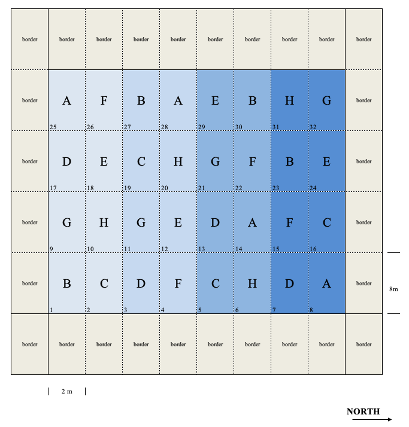
<p class="caption">(\#fig:figName34)Example of a completely randomised block design</p>
</div>

RCBD is the most common design for field experiments, although it can be used wherever the experimental units can be divided in groups, according to some innate property. In the following chapters we will see that the RCBD is very efficient when the variability across blocks is very big, as a big part of the subject-to-subject variability can be accounted for and removed from the unexplained variation.

#### Latin square design

In some cases, the experimental units can be grouped according to two innate properties, apart from the experimental treatments. Figure \@ref(fig:figName35) shows a design with 4 treatments and four replicates (16 plots in all); if we assume that there are a left-to-right and a bottom-to-top fertility gradients, we can look at the rows and columns as different blocking variables. Therefore, we can allocate the treatments to plots, so that there is one replicate in each row and in each column.

<div class="figure" style="text-align: center">
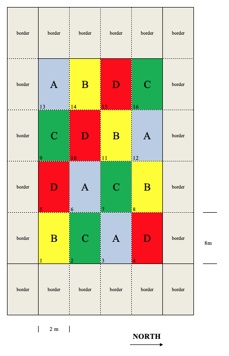
<p class="caption">(\#fig:figName35)Example of a latin square design with four treatments (A, B, C and D) and four replicates. The different colours help identify the four treatments and their allocation to the plots.</p>
</div>

Latin square designs are not only useful for field experiments. For example, if we want to test the effect of four different working protocols in the time required to accomplish a certain task, we can use a number of workers as the experimental units. In order to have four replicates, we need 16 workers, to which we allocate the different protocols, according to a CRD or CRBD. We can reduce the number of workers by allowing each worker to use all four protocols, in four subsequent shifts. For example, the first worker can use the protocols A, B, C and D, one after the other in a randomised order. By doing so, we only need four workers and the experiment is designed as CRBD, where the worker acts as a blocking factor. The advantage is that possible worker-to-worker differences in proficiency are not confounded with differences between protocols, as all workers use all protocols.

However, we should also consider that workers tend to get tired over time and loose proficiency and, therefore, the protocols used at the beginning of the sequence are favoured with respect to the protocols used later on. We can account for this effect by allocating the protocols in a way that each one is used in all shifts; as the consequence, the shift acts as the second blocking factor, as shown in Figure \@ref(fig:figName36). This is, indeed, a latin square design.

<div class="figure" style="text-align: center">
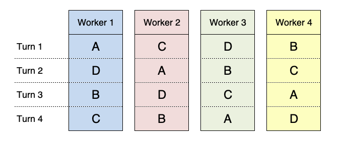
<p class="caption">(\#fig:figName36)Example of a latin square design for the comparison of four working protocols, by using four workers and four turns.</p>
</div>

The latin square takes its name from the fact that the number of replicates is equal to the number of treatments and, therefore, the field map consists of a square grid, where each treatment can be found in all rows and all columns (some of you may recognise the basic principle of the Sudoku game...). It is a useful design, as it can account for possible plot-to-plot differences in relation to two blocking factors (rows and columns, or workers and turns), so that the unexplained plot-to-plot differences are minimised. The disadvantage is that the number of replicates must be equal to the number of treatments and, therefore, the latin square can only be used for experiments with few treatments.

#### Split-plot and strip-plot designs

With factorial experiments we can simply use a CRD or RCBD, by allocating the combinations of all factor levels to the different plots. For example, think about an experiment to compare three types of tillage (minimum tillage = MIN; shallow ploughing = SP; deep ploughing = DP) and two types of chemical weed control methods (broadcast = TOT; in-furrow = PART). With four replicates, the six treatment combinations (MIN-TOT, SP-TOT, DP-TOT, MIN-PART, SP-PART and DP-PART) can be allocated to 24 plots, according to a RCBD, as shown in Figure \@ref(fig:figName37). Please note that we had to allow a wide space between the plots, in order to permit the circulation of tractors and tillage machinery.

<div class="figure" style="text-align: center">
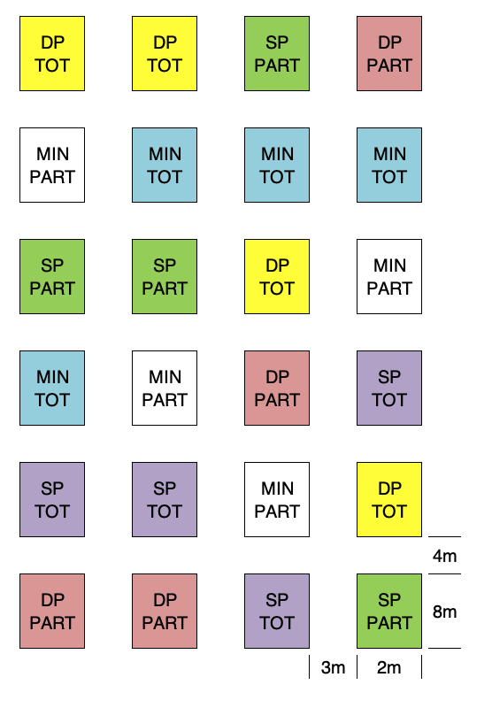
<p class="caption">(\#fig:figName37)Field map for a two-factor factorial experiment, laid down as RCBD</p>
</div>

For those who have some knowledge with field research, it may be obvious that tillage treatments require big plots and a wide space between plots, due to the size of tillage machinery. On the contrary, spraying herbicides may be easily done also on small plots. Therefore, we could think of using big plots to allocate tillage treatments and splitting these big plots into two subplots, to allocate weed control treatments (**split-plot** design). The example is shown in Figure \@ref(fig:figName38): we note that the allocation of tillage treatments to the 12 main-plots is done according to a RCBD, while the two weed control treatments are randomly allocated to the two sub-plots, within each main-plot. 


<div class="figure" style="text-align: center">
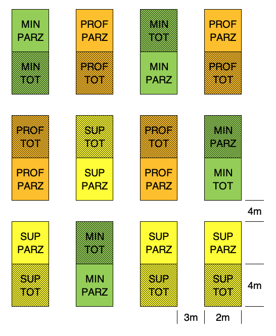
<p class="caption">(\#fig:figName38)Same design as in the previous Figure, laid down as split-plot.</p>
</div>

An important consequence of split-plot designs is that every main-plot represents a replicate for sub-plot factor levels; indeed, if we look at Figure \@ref(fig:figName38), we see that there are four replicates for each tillage level, but there are 12 replicated sub-plots for each weed control level. Therefore, subplot effects are estimated with higher precision.

As all other designs, split-plot designs are not specific to agriculture experiments and they find their place in many other research topics. In general, they are used whenever:

1. one factor require bigger experimental units, as in the above shown example;
2. the levels for one factor are difficult to allocate and it is preferable to manipulate groups of experimental units, instead of a single independent experimental unit. For example, we might be interested in studying the corrosion resistance of steel bars treated with four coatings at three furnace temperatures. This latter factor is hard to change, as it takes a long time to reach a new equilibrium temperature within the furnace. Therefore, once the equilibrium temperature is reached, it is convenient to put four steel bars with each of the four coatings inside the furnace and record their corrosion. We repeat the process at the three temperatures and repeat the whole experiment twice. This is an example of a split-plot experiment, where temperatures are allocated to a furnace (main-plot) and coatings are allocated the steel bars (sub-plots).

A useful variant of the split plot is used when the treatments are allocated in strips (**strip-plot** designs), as shown in Figure \@ref(fig:figName39). This map refers to an experiment where three crops were sown 40 days after a herbicide treatment, in order to assess possible phytotoxicity effects relating to an excessive persistence of herbicide residues. We see that each block is organised with three rows and two columns: the three crops were sown along the rows and the two herbicide treatments (rimsulfuron and the untreated control) were allocated along the columns. The combinations are, consequently, allocated to subplots. In this design, we have three types of plots: the row-plots, the column-plots and the subplots; the advantage is that the allocation of treatments is rather quick.


<div class="figure" style="text-align: center">
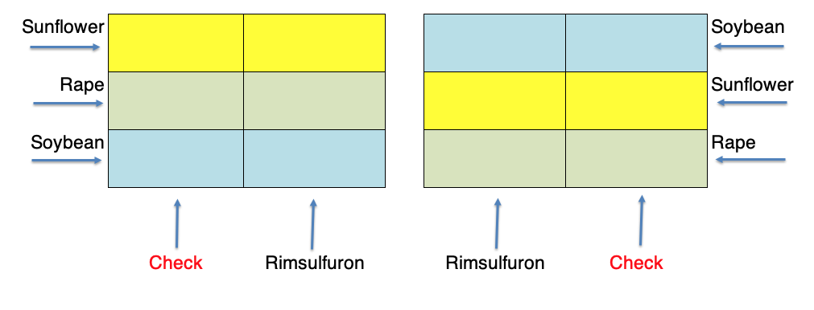
<p class="caption">(\#fig:figName39)Same design as in the previous Figure, laid down as strip-plot.</p>
</div>

## Conclusions

In this chapter we have seen the fundamental elements of a research and we have also seen how those elements, considering the three fundamental characteristics of control, replication and randomisation, can be joined together to set-up valid experiments in the field. We have also seen that the different types of designs are commonly used also for laboratory experiments or other types of experiments outside agriculture. 

---

## Further readings


1. Cochran, W.G., Cox, G.M., 1950. Experimental design. John Wiley & Sons, Inc., Books.
2. Daniel, J. 2011. Sampling Essentials: Practical Guidelines for Making Sampling Choices. USA: SAGE.
3. LeClerg, E.L., Leonard, W.H., Clark, A.G., 1962. Field Plot Technique. Burgess Publishing Company, Books.
4. Jones, B., Nachtsheim, C.J., 2009. Split plot designs: what, why and how. Journal of Quality Technology 41, 340–361.


<!--chapter:end:02-Eng_ResProject.Rmd-->

# Describing the observations


*Statistics is the grammar of science (K. Pearson)*


The final outcome of every manipulative/comparative experiment is a **dataset**, consisting of a set of measures/observations taken on several experimental subjects, in relation to one or more properties (e.g., height, weight, concentration, sex, color). We have seen that the list of values for one of those properties is called a variable; our first task is to describe that variable, by using the most appropriate descriptive stats. In this respect, the different types of variables (see Chapter 2) will require different approaches, as we will see in this chapter.

## Quantitative data

For a quantitative variable, we need to describe:

1. location
2. spread
3. shape

The three statistics respond, respectively, to the following questions: (1) where are the values located, along the measurement scale? (2) how close are the values to one another? (3) are the values symmetrically distributed around the central value, or are they skewed to the right or to the left?

In this chapter, we will only consider the statistics of location and spread, as the statistics of shape are not commonly reported in agriculture and biology.

### Statistics of location

The most widely known statistic of location is the **mean**, that is obtained as the sum of data, divided by the number of values:

$$\mu = \frac{\sum\limits_{i = 1}^n x_i}{n}$$

For example, let us consider the following variable, listing the heights of four maize plants: $x = [178, 175, 158, 153]$

The mean is easily calculated as:

$$\mu = \frac{178 + 175 + 158 + 153}{4} = 166$$

The mean can be regarded as the central value in terms of Euclidean distances; indeed, by definition, the sum of the Euclidean distances between the values and the group mean is always zero. In other words, the values above the mean and those below the mean, on average, are equally distant from the mean. That does not imply that the number of values above the mean is the same as the number of values  below the mean. For example, if we look at the following values:

1 - 4 - 7 - 9 - 10

we see that the mean is 6.2. If we change the highest value into 100, the new mean is moved upwards to 24.2 and it is no longer in central positioning, with respect to the sorted list of data values.

Another important statistic of location is the **median**, i.e. the central value in a sorted variable. The calculation is easy: first of all, we sort the values in increasing order. If the number of values is odd, the median is given by the value in the $(n + 1)/2$ position ($n$ is the number of values). Otherwise, if the number of values is even, we take the two values in the $n/2$ and $n/2 + 1$ positions and average them. 

The median is always the central value in terms of positioning, i.e., the number of values above the median is always equal to the number of values below the median. For example if we take the same values as above (1 - 4 - 7 - 9 - 10), the median is equal to 7 and it is not affected when we change the highest value into 100. Considering that extreme values (very high or very low) are usually known as *outliers*, we say that the median is more **robust** than the mean with respect to outliers.

### Statistics of spread

Knowing the location of a variable is not enough for our purpose as we miss an important information: how close are the values to the mean? The simplest statistic to express the spread is the **range**, that is the difference between the highest and lowest value. This is a very rough indicator, though, as it is extremely sensitive to outliers.

In the presence of a few outliers, the median is used as a statistic of location and, in that case, it can be associated, as a statistic of spread, to the interval defined by the 25^th^ and 75^th^ percentiles. In general, the **percentiles**, are the values below which a given percentage of observations falls. More specifically, the 25^th^ percentile is the value below which 25% of the observations falls and the 75^th^ percentile is the value below which 75% of the observations falls (you may have understood that the median corresponds to the 50^th^ percentile). The interval between the 25^th^ and 75^th^ percentile, consequently, contains 50% of all the observed values and, therefore, it is a good statistic of spread.

If we prefer to use the mean as a statistic of location, we can use several other important statistics od spread; the first one, in order of calculation, is the **deviance**, that is also known as the **sum of squares**. It is the sum of squared differences between each value and the mean:

$$SS = \sum\limits_{i = 1}^n {(x_i  - \mu)^2 }$$

In the above expression, the amounts $x_i  - \mu$ (differences between each value and the group mean) are known as **residuals**. For our sample, the deviance is:

$$SS = \left(178 - 166 \right)^2 + \left(175 - 166 \right)^2 + \left(158 - 166 \right)^2  + \left(153 - 166 \right)^2= 458$$


A high deviance corresponds to a high spread; however, we can have a high deviance also when we have low spread and a lot of values. Therefore, the deviance should not be used to compare the spread of two groups with different sizes. Another problem with the deviance is that the measurement unit is also squared with respect to the mean: for our example, if the original variable (height) is measured in cm, the deviance is measured in cm^2^, which is not very logical.

A second important measure of spread is the **variance**, that is usually obtained dividing the deviance by the number of observations minus one:

$$\sigma^2  = \frac{SS}{n - 1}$$

For our group:

$$\sigma^2  = \frac{458}{3} = 152.67$$

The variance can be used to compare the spread of two groups with different sizes, but the measurement unit is still squared, with respect to the original variable. 

The most important measure of spread is the **standard deviation**, that is the square root of the variance:
 
$$\sigma = \sqrt{\sigma^2} = \sqrt{152.67} = 12.36$$

The measurement unit is the same as the data and, for this reason, the standard deviation is the most important statistic of spread and it is usually associated to the mean to summarise a set of measurements. In particular, the interval $l = \mu \pm \sigma$ is often used to describe the **absolute uncertainty** of replicated measurements.

Sometimes, the standard deviation is expressed as a percentage of the mean (**coefficient of variability**), which is often used to describe the **relative uncertainty** of measurement instruments:

$$CV = \frac{\sigma }{\mu } \times 100$$

### Summing the uncertainty

In some cases, we measure two quantities and sum them to obtain a derived quantity. For example, we might have made replicated measurements to determine the sucrose content in a certain growth substrate, that was equal to $22 \pm 2$ (mean and standard deviation). Likewise, another independent set of measures showed that the fructose content in the same substrate was $14 \pm 3$. Total sugar content is equal to the sum of $22 + 14 = 36$. The absolute uncertainty for the sum is given by the square root of the sum of the squared absolute uncertainties, that is $36 \pm \sqrt{4 + 9}$. The absolute uncertainty for a difference is calculated in the very same way.


### Relationship between quantitative variables

Very frequently, we may have recorded, on each subject, two, or more, quantitative traits, so that, in the end, we have two, or more, response variables. We might be interested in assessing whether, for each pair of variables, when one changes, the other one changes, too (**joint variation**). The *Pearson correlation coefficient* is a measure of joint variation and it is equal to the codeviance of the two variables divided by the square root of the product of their deviances:

$$r = \frac{ \sum_{i=1}^{n}(x_i - \mu_x)(y_i-\mu_y) }{\sqrt{\sum_{i=1}^{n}(x_i-\mu_x)^2 \sum_{i=1}^{n}(y_i-\mu_y)^2}}$$

We know about the deviance, already. The codeviance is a statistic that consists of the product of the residuals for the two variables: it is positive, when the residuals for the two variables have the same signs, otherwise it is negative. Consequently, the $r$ coefficient ranges from $+1$ to $-1$: a value of $+1$ implies that, when $x$ increases, $y$ increases by a proportional amount, so that the points on a scatterplot lie on a straight line, with positive slope. On the other hand, a value of $-1$ implies that when $x$ increases, $y$ decreases by a proportional amount, so that the points on a scatterplot lie on a straight line, with negative slope. A value of 0 indicates that there is no joint variability, while intermediate values indicate a more or less high degree of joint variability, although the points on a scatterplot do not exactly lie on a straight line (Figure 3.1).

<div class="figure" style="text-align: center">
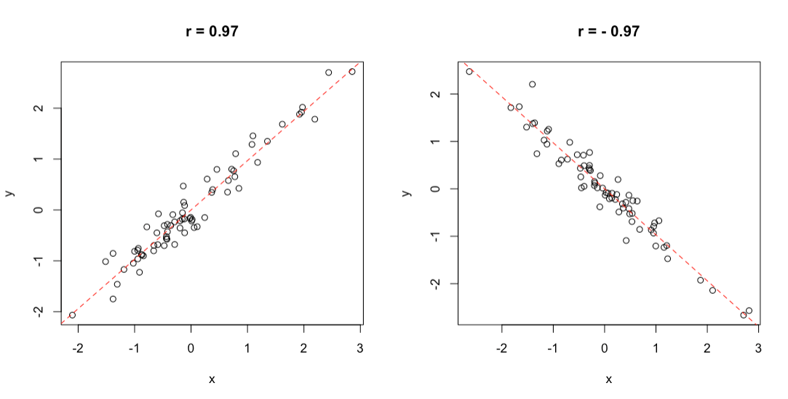
<p class="caption">(\#fig:figName311)Example of positive (left) and negative (right) correlation</p>
</div>

For example, if we have measured the oil content in sunflower seeds by using two different methods, we may be interested in describing the correlation between the results of the two methods. The observed data are shown in the box below.


```r
A <- c(45, 47, 49, 51, 44, 37, 48, 42, 53)
B <- c(44, 44, 49, 53, 48, 34, 47, 39, 51)
```

In order to calculate the correlation coefficient, we need to organise our calculations as follows:

1. calculate the residuals for A ($z_A$)
2. calculate the residuals for B ($z_B$)
3. calculate the deviances and codeviance

First of all, we calculate the two means, that are, respectively, 46.22 and 45.44. Secondly, we can calculate the residuals for both variables, as shown in Table 3.1. From the residuals, we can calculate the deviances and the codeviance, by using the equation above.


Table: (\#tab:unnamed-chunk-3)Example of the hand calculations that are used to calculate the correlation coefficient

|  A|  B|  $z_A$|   $z_B$| $z_A^2$| $z_B^2$| $z_A \times z_B$|
|--:|--:|------:|-------:|-------:|-------:|----------------:|
| 45| 44| -1.222|  -1.444|   1.494|   2.086|            1.765|
| 47| 44|  0.778|  -1.444|   0.605|   2.086|           -1.123|
| 49| 49|  2.778|   3.556|   7.716|  12.642|            9.877|
| 51| 53|  4.778|   7.556|  22.827|  57.086|           36.099|
| 44| 48| -2.222|   2.556|   4.938|   6.531|           -5.679|
| 37| 34| -9.222| -11.444|  85.049| 130.975|          105.543|
| 48| 47|  1.778|   1.556|   3.160|   2.420|            2.765|
| 42| 39| -4.222|  -6.444|  17.827|  41.531|           27.210|
| 53| 51|  6.778|   5.556|  45.938|  30.864|           37.654|


The deviances for $A$ and $B$ are, respectively, 189.55 and 286.22, while the codeviance is 214.11. Accordingly, the correlation coefficient is:

$$r = \frac{214.11}{\sqrt{189.55 \times 286.22}} = 0.919$$


It is close to 1, so we conclude that there was quite a good agreement between the two methods.

## Nominal data


### Distributions of frequencies

With nominal data, we can only assign the individuals to one of a number of categories. In the end, the only description we can give of such a dataset is based on the counts (**absolute frequencies**) of individuals in each category, producing the so called **distribution of frequencies**. 

As an example of nominal data we can take the 'mtcars' dataset, that was extracted from the 1974 Motor Trend US magazine and comprises 32 old automobiles. The dataset is available in R and we show part of it in  table 3.2.


Table: (\#tab:unnamed-chunk-4)Dataset 'mtcars' in R, representing the characteristics of 32 old automobiles; 'cs' is the type of engine and 'gear' is the number of forward gears. More detail is given in the text.

|                    | vs| gear|
|:-------------------|--:|----:|
|Mazda RX4           |  0|    4|
|Mazda RX4 Wag       |  0|    4|
|Datsun 710          |  1|    4|
|Hornet 4 Drive      |  1|    3|
|Hornet Sportabout   |  0|    3|
|Valiant             |  1|    3|
|Duster 360          |  0|    3|
|Merc 240D           |  1|    4|
|Merc 230            |  1|    4|
|Merc 280            |  1|    4|
|Merc 280C           |  1|    4|
|Merc 450SE          |  0|    3|
|Merc 450SL          |  0|    3|
|Merc 450SLC         |  0|    3|
|Cadillac Fleetwood  |  0|    3|
|Lincoln Continental |  0|    3|
|Chrysler Imperial   |  0|    3|
|Fiat 128            |  1|    4|
|Honda Civic         |  1|    4|
|Toyota Corolla      |  1|    4|
|Toyota Corona       |  1|    3|
|Dodge Challenger    |  0|    3|
|AMC Javelin         |  0|    3|
|Camaro Z28          |  0|    3|
|Pontiac Firebird    |  0|    3|
|Fiat X1-9           |  1|    4|
|Porsche 914-2       |  0|    5|
|Lotus Europa        |  1|    5|
|Ford Pantera L      |  0|    5|
|Ferrari Dino        |  0|    5|
|Maserati Bora       |  0|    5|
|Volvo 142E          |  1|    4|

The variable 'vs' in 'mtcars' takes the values 0 for V-shaped engine and 1 for straight engine. Obviously, the two values 0 and 1 are just used to name the two categories and the resulting variable is purely nominal. The absolute frequencies of cars in the two categories are, respectively 18 and 14 and they are easily obtained by a counting process.

We can also calculate the relative frequencies, dividing the absolute frequencies by the total number of observations. These frequencies are, respectively, 0.5625 and 0.4375.

If we consider a variable where the classes can be logically ordered, we can also calculate the **cumulative frequencies**, by summing up the frequency for one class with the frequencies for all previous classes. As an example we take the 'gear' variable in the 'mtcars' dataset, showing the number of forward gears for each car. We can easily see that 15 cars have 3 gears and 27 cars have 4 gears or less.

In some circumstances, it may be convenient to 'bin' a continuous variable into a set of intervals. For example, if we have recorded the ages of a big group of people, we can divide the scale into intervals of five years (e.g., from 10 to 15, from 15 to 20 and so on) and, eventually, assign each individual to the appropriate age class. Such a technique is called **binning** or **bucketing** and we will see an example later on in this chapter.


### Descriptive stats for distributions of frequencies

For categorical data, we can retrieve the **mode**, which is the class with the highest frequency. For ordinal data, wherever distances between classes are meaningful, and for discrete data, we can also calculate the median and other percentiles, as well as the mean and other statistics of spread (e.g., variance, standard deviation). The mean is calculated as:

$$ \mu = \frac{\sum\limits_{i = 1}^n f_i x_i}{\sum\limits_{i = 1}^n f_i}$$

where $x_i$ is the value for the i-th class, and $f_i$ is the frequency for the same class. Likewise, the deviance, is calculated as:

$$ SS = \sum\limits_{i = 1}^n f_i (x_i - \mu)^2 $$

For example, considerin the 'gear' variable in Table 3.2, the average number of forward gears is:

$$\frac{ 15 \times 3 + 12 \times 4 + 5 \times 5}{15 + 12 + 5} = 3.6875$$

while the deviance is:

$$SS = 15 \times (3 - 3.6875)^2 + 12 \times (4 - 3.6875)^2 + 5 \times (5 - 3.l875)^2 = 16.875$$

With interval data (binned data), descriptive statistics should be calculated by using the raw data, if they are available. If they are not,  we can use the frequency distribution obtained from binning, by assigning to each individual the central value of the interval class to which it belongs. As an example, we can consider the distribution of frequencies in Table 3.3, relating to the time (in minutes) taken to complete a statistic assignment for a group of students in biotechnology. We can see that the mean is equal to:

$$ \frac{7.5 \times 1 + 12.5 \times 4 + 17.5 \times 3 + 22.5 \times 2}{10} = 15.5$$


Table: (\#tab:unnamed-chunk-5)Distribution of frequency for the time (in minutes) taken to complete a statistic assignment for a group of students in biotechnology

| Time interval | Central value | Count |
|:-------------:|:-------------:|:-----:|
|    5 - 10     |      7.5      |   1   |
|    10 - 15    |     12.5      |   4   |
|    15 - 20    |     17.5      |   3   |
|    20 - 25    |     22.5      |   2   |


The calculation of the deviance is left as an exercise.


### Contingency tables

When we have more than one cataegorical variable, we can summarise the distribution of frequency by using two-way tables, usually known as **contingency tables**  or crosstabs. For example, we can consider the 'HairEyeColor' dataset, in the 'datasets' package, which is part of the base R installation. It shows the contingency tables of hair and eye color in 592 statistics students, depending on sex; both characters are expressed in four classes, i.e. black, brown, red and blond hair and brown, blue, hazel and green eyes. Considering females, the contingency table is reported in Table 3.4 and it is augmented with row and column sums (see later).


Table: (\#tab:unnamed-chunk-6)Distribution of hair and eye color for 313 female statistics students, augmented with row and column sums. Dataset taken from R package 'datasets'

|            | Brown eye | Blue eye | Hazel eye | Green eye | ROW SUMS |
|:-----------|:---------:|:--------:|:---------:|:---------:|:--------:|
|Black hair  |    36     |    9     |     5     |     2     |    52    |
|Brown hair  |    66     |    34    |    29     |    14     |   143    |
|Red hair    |    16     |    7     |     7     |     7     |    37    |
|Blond hair  |     4     |    64    |     5     |     8     |    81    |
|COLUMN SUMS |    122    |   114    |    46     |    31     |   313    |


### Independence

With a contingency table, we may be interested in assessing whether the two variables show some sort of dependency relationship. In the previous example, is there any relationship between the color of the eyes and the color of the hair? If not, we say that the two variables are independent. Independency is assessed by using the $\chi^2$ statistic.

As the first step, we need to calculate the *marginal frequencies*, i.e. the sums of frequencies by row and by column (please note that the entries of a contingency table are called *joint frequencies*). These sums are reported in Table 3.4.


Let's consider black hair: in total there are 52 women with black air, that is $52/313 \times 100 = 16.6$% of the total. If the two characters were independent, the above proportion should not change, depending on the color of eyes. For example, we have 122 women with brown eyes and 16.6% of those should be black haired, which makes up an expected value of 20.26837 black haired and brown eyed women (much lower than the observed 36). Another example: the expected value of blue eyed and black haired women is $114 \times 0.166 = 18.9$ (much higher than the observed). A third example may be useful: in total, there is $143/313 = 45.7$% of brown haired women and, in case of independence, we would expect $46 \times 0.457 =  21.02$ brown haired and hazel eyed woman. Keeping on with the calculations, we could derive a table of expected frequency, in the case of complete independence between the two characters. All the expected values in case of independency are reported in Table 3.5.


Table: (\#tab:unnamed-chunk-8)Expected values of hair and eye color for 313 female statistics students, augmented with row and column sums. Expectations assume total lack of dependency between the two variables.

|            | Brown eye | Blue eye  | Hazel eye | Green eye | ROW SUMS |
|:-----------|:---------:|:---------:|:---------:|:---------:|:--------:|
|Black hair  | 20.26837  | 18.93930  | 7.642173  | 5.150160  |    52    |
|Brown hair  | 55.73802  | 52.08307  | 21.015974 | 14.162939 |   143    |
|Red hair    | 14.42173  | 13.47604  | 5.437700  | 3.664537  |    37    |
|Blond hair  | 31.57189  | 29.50160  | 11.904153 | 8.022364  |    81    |
|COLUMN SUMS | 122.00000 | 114.00000 | 46.000000 | 31.000000 |   313    |


The observed (table 3.4) and expected (Table 3.5) values are different, which might indicate a some sort of relationship between the two variables; for example, having red hair might imply that we are more likely to have eyes of a certain color. In order to quantify the discrepancy between the two tables, we calculate the $\chi^2$ stat, that is:

$$\chi ^2  = \sum \left[ \frac{\left( {f_o  - f_e } \right)^2 }{f_e } \right]$$

where $f_o$ are the observed frequencies and $f_e$ are the expected frequencies. For example, for the first value we have:

$$\chi^2_1  = \left[ \frac{\left( {36  - 20.26837 } \right)^2 }{20.26837 } \right]$$

In all, we should calculate 16 ratios and sum them to each other. The final $\chi^2$ value should be equal to 0 in case of independence and it should increase as the relationship between the two variables increases, up to:

$$\max \chi ^2  = n \cdot \min (r - 1,\,c - 1)$$

i.e. the product between the number of subjects ($n$) and the minimum value between the number of rows minus one and the number of columns minus one (in our case, it is $313 \times 3 = 939$).

The observed value is 106.66 and it suggests that the two variables are not independent.


## Descriptive stats with R

Before reading this part, please make sure that you already have some basic knowledge about the R environment. Otherwise, please go and read the Appendix 1 to this book.

Relating to quantitative variables, we can use the dataset 'heights.csv', that is available in an online repository and refers to the height of 20 maize plants. In R, the mean is calculated by the function `mean()`, as shown in the box below.


```r
filePath <- "https://www.casaonofri.it/_datasets/heights.csv"
dataset <- read.csv(filePath, header = T)
mean(dataset$height)
## [1] 164
```


The median is obtained by using the function `median()`:
 


```r
median(dataset$height)
## [1] 162.5
```

The other percentiles are calculated with the function `quantile()`, passing the selected probabilities as fractions in a vector:


```r
quantile(dataset$height, probs = c(0.25, 0.75))
##    25%    75% 
## 152.75 174.25
```

 
The deviance function is not immediately available in R and we should resort to using the following expression:


```r
sum( (dataset$height - mean(dataset$height))^2 )
## [1] 4050
```

The other variability stats are straightforward to obtain, as well as the correlation coefficient:


```r
# Variance and standard deviation
var(dataset$height)
## [1] 213.1579
sd(dataset$height)
## [1] 14.59993
# Coefficient of variability
sd(dataset$height)/mean(dataset$height) * 100
## [1] 8.902395
# Correlation
cor(A, B)
## [1] 0.9192196
```

We have just listed some of the main stats that can be used to describe the properties of a quaantitative variable. In our research work we usually deal with several groups of observations, each one including the different replicates of one of a series of experimental treatments. Therefore, we need to be able to obtain the descriptive stats for all groups at the same time. The very basic method to do this, is by using the function `tapply()`, which takes three arguments, i.e. the vector of observations, the vector of groups and the function to be calculated by groups. The vector of groups is the typical accessory variable, which labels the observations according to the group they belong to.


```r
dataset$var
##  [1] "N" "S" "V" "V" "C" "N" "C" "C" "V" "N" "N" "N" "S" "C" "N" "C"
## [17] "V" "S" "C" "C"
mu.height <- tapply(dataset$height, dataset$var, FUN = mean)
mu.height
##      C      N      S      V 
## 165.00 164.00 160.00 165.25
```

Obviously, the argument `FUN` can be used to pass any other R function, such as `median` and `sd`. In particular, we can get the standard deviations by using the following code:


```r
sigma.height <- tapply(dataset$height, dataset$var, sd)
sigma.height
##        C        N        S        V 
## 14.36431 16.19877 12.16553 19.51709
```

Now, we can combine the two newly created vectors into a summary dataframe. In the box below, we use the function `data.frame()` to combine the vector of group names and the two vectors of stats to create the 'descStat' dataframe, which is handy to create a table or a graph, as we will see later.


```r
descStat <- data.frame(group = names(mu.height),
                       mu = mu.height, 
                       sigma = sigma.height)
descStat
##   group     mu    sigma
## C     C 165.00 14.36431
## N     N 164.00 16.19877
## S     S 160.00 12.16553
## V     V 165.25 19.51709
```


With nominal data, the absolute frequencies of individuals in the different classes can be retrieved by using the `table()` function, as we show below for the 'vs' variable in the 'mtcars' dataset.


```r
data(mtcars)
table(mtcars$vs)
## 
##  0  1 
## 18 14
```

We can also calculate the relative frequencies, dividing by the total number of observations.


```r
table(mtcars$vs)/length(mtcars$vs)
## 
##      0      1 
## 0.5625 0.4375
```


Cumulative frequencies can be calculated by the `cumsum()` function, as shown below for the 'gear' variable in the 'mtcars' dataset.


```r
cumsum(table(mtcars$gear))
##  3  4  5 
## 15 27 32
```

Ragarding to binning, we can consider the 'co2' dataset, that is included in the base R installation. It contains 468 values of CO_2_ atmospheric concentrations, expressed in parts per million, as observed at monthly intervals in the US. With such a big dataset, the mean and standard deviation are not sufficient to get a good feel for the data and it would be important to have an idea of the shape of the dataset. Therefore we can split the continuous scale into a series of intervals, from 310 ppm to 370 ppm, with breaks every 10 ppm and count the observations in each interval. In the box below, the function `cut()` assigns each value to the corresponding interval (please note the 'breaks' argument, which sets the margins of each interval. Intervals are, by default, left open and right-closed), while the function `table()` calculates the frequencies.


```r
data(co2)
co2 <- as.vector(co2)
mean(co2)
## [1] 337.0535
min(co2)
## [1] 313.18
max(co2)
## [1] 366.84
# discretization
classes <- cut(co2, breaks = c(310,320,330,340,350,360,370))
freq <- table(classes)
freq
## classes
## (310,320] (320,330] (330,340] (340,350] (350,360] (360,370] 
##        70       117        86        76        86        33
```


The `table()` function is also used to create contingency tables, with two (or more) classification factors. The resulting table represent a peculiar class, which is different from other tabular classes, such as arrays and dataframes. This class has methods on its own, as we will see below. In the case of the 'HairEyeColor' dataset, this is already defined as a contingency table of class 'table'.


```r
data(HairEyeColor)
tab <- HairEyeColor[,,2]
class(tab)
## [1] "table"
tab
##        Eye
## Hair    Brown Blue Hazel Green
##   Black    36    9     5     2
##   Brown    66   34    29    14
##   Red      16    7     7     7
##   Blond     4   64     5     8
```


With such a class, we can calculate the $\chi^2$ value by using the `summary()` method, as shown in the box below.


```r
summary( tab )
## Number of cases in table: 313 
## Number of factors: 2 
## Test for independence of all factors:
## 	Chisq = 106.66, df = 9, p-value = 7.014e-19
## 	Chi-squared approximation may be incorrect
```

The above function returns several results, which we will examine in further detail in a following chapter.


## Graphical representations

Apart from tables, also graphs can be used to visualise our descriptive stats. Several types of graphs are possible, and we would like to mention a few possibilities.

A barplot is very useful to visualise the properties of groups, e.g. their means or absolute frequencies. For example, if we consider the 'descStat' dataframe we have created above at 3.1.3, we could draw a barplot, where the height of bars indicate the mean for each group and we could augment such a barplot by adding error bars to represent the standard deviations ($\mu \pm \sigma$).

In the box below, we use the function `barplot`, which needs two arguments and an optional third one: the first one is the height of bars, the second one is the name of groups, the third one specifies the limits for the y-axis. We see that the function is used to return the object 'coord', a vector including the abscissas for the central point of each bar. We can use this vector inside the function `arrows()` to superimpose the error bars (Figure \@ref(fig:figName242)); the first four arguments of the `arrows()` function are, respectively, the coordinates of points from which (abscissa and ordinate) and to which (abscissa and ordinate) to draw the error bars, while the other arguments permit to fine tune the type of arrow.


```r
coord <- barplot(descStat$mu, names.arg = descStat$group, 
                 ylim = c(0, 200), ylab = "Height (cm)")
arrows(coord, descStat$mu - descStat$sigma, 
       coord, descStat$mu + descStat$sigma, 
       length = 0.05, angle = 90, code = 3)
```

<div class="figure" style="text-align: center">
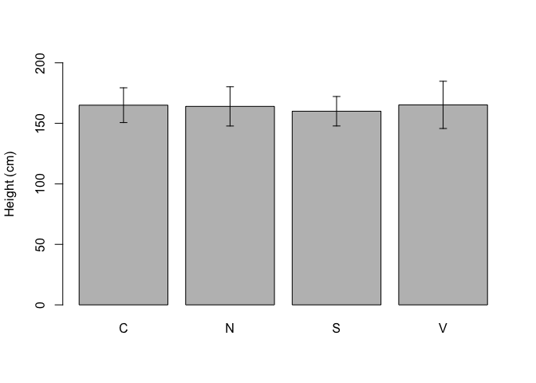
<p class="caption">(\#fig:figName242)Example of a simple barplot in R</p>
</div>

The graph is rather basic, but, with little exercise, we can improve it very much.

When the number of replicates is high (e.g., > 15), we can jointly use  the 25^th^, 50^th^ (median) and 75^th^ percentiles to draw the so-called *boxplot* (Box-Whisker plot; Figure \@ref(fig:figName241)). I will describe it by using an example: let's assume we have made an experiment with three treatments (A, B and C) and 20 replicates. We can use the code below to draw a boxplot.


```r
rm(list = ls())
A <- c(2, 31, 12, 12, 17, 13, 0, 5, 13, 10,
       14, 11, 6, 18, 6, 17,  6, 5, 4, 5)
B <- c(8, 8, 5, 3, 6, 18, 13, 20, 19, 3,
       11, 7, 8, 12, 6, 17, 6, 7,  22, 18)
C <- c(12, 12, 9, 7, 10, 22, 17, 24, 23, 7,
       15, 11, 12, 16, 10, 21, 10, 11, 26, 22)
series <- rep(c("A", "B", "C"), each = 20)
values <- c(A, B, C)
boxplot(values ~ series)
```

<div class="figure" style="text-align: center">
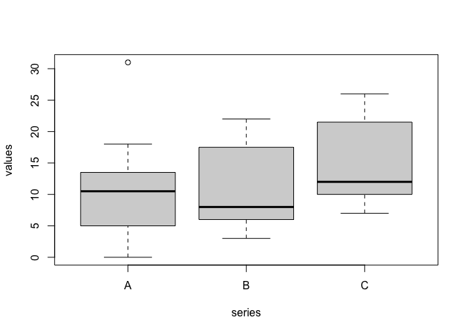
<p class="caption">(\#fig:figName241)A boxplot in R</p>
</div>

In this boxplot, each group is represented by a box, where the uppermost side is the 75^th^ percentile, the lowermost side is the 25^th^ percentile, while a line is drawn to indicate the median (50^th^ percentile). Two vertical arrows (whiskers) start from the 25^th and 75^th percentile and reach the maximum and minimum values for each group. In the case of treatment A, the maximum value is 31, which is 20.5 units above the median. As this difference is higher than 1.5 times the difference from the median and the 75^th^ percentile, this value is excluded, it is regarded as an outlier and it is represented by an empty circle.

For the case when we have a pair of quantitative variables, we can draw a **scatterplot**, by using the two variables as the co-ordinates. The simplest R plotting function is `plot()` and an example of its usage is given in Figure \@ref(fig:figName244)), with reference to the correlation data at 3.1.5.


```r
plot(A ~ B, xlab = "b", ylab = "a",
     pch = 21, col = "blue", cex = 2, bg = "blue")
```

<div class="figure" style="text-align: center">
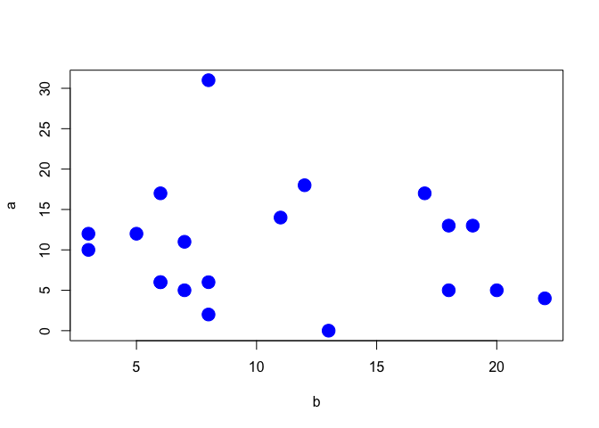
<p class="caption">(\#fig:figName244)Scatterplot showing the correlation between two variables</p>
</div>

A distribution of frequency can also be represented by using a **pie chart**, as shown in Figure \@ref(fig:figName243)), for the 'gear' variable in the 'mtcars' dataset. 


```r
pie(table(mtcars$gear))
```

<div class="figure" style="text-align: center">
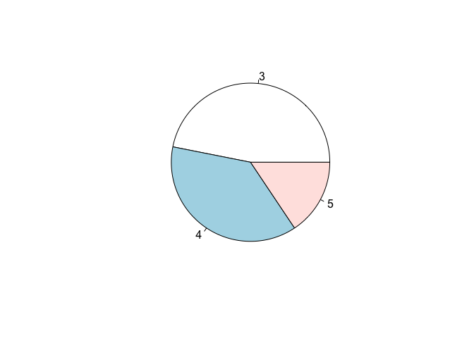
<p class="caption">(\#fig:figName243)Representation of a distribution of frequencies by using a pie chart</p>
</div>

---

## Further reading

1. Holcomb Z.C. (2017). Fundamentals of descriptive statistics. Routledge (Taylor and Francis Group), USA


<!--chapter:end:03-Eng_StatisticaDescrittiva.Rmd-->

# Modeling the experimental data


*Models are wrong, but some are useful (G. Box)*


In the previous chapter we have seen that we can use simple stats to describe, summarise and present our experimental data, which is usually the very first step of data analyses. However, we are more ambitious: we want to model our experimental data. Perhaps this term sounds unfamiliar to some of you and, therefore, we should better start by defining the terms 'model' and 'modeling'.

A mathematical model is the description of a system using the mathematical language and the process of developing a model is named mathematical modeling. In practice, we want to write an equation where our experimental observations are obtained as the result of a set of predictors and operators.

Writing mathematical models for natural processes has been one of the greatest scientific challenges, since the 19th century and it may be appropriately introduced by using a very famous quote from Pierre-Simon Laplace (1749-1827): "*We ought to regard the present state of the universe as the effect of its antecedent state and as the cause of the state that is to follow. An intelligence knowing all the forces acting in nature at a given instant, as well as the momentary positions of all things in the universe, would be able to comprehend in one single formula the motions of the largest bodies as well as the lightest atoms in the world, provided that its intellect were sufficiently powerful to subject all data to analysis; to it nothing would be uncertain, the future as well as the past would be present to its eyes. The perfection that the human mind has been able to give to astronomy affords but a feeble outline of such an intelligence.*"

Working in biology and agriculture, we need to recognise that we are very far away from Laplace's ambition; indeed, the systems which we work with are very complex and they are under the influence of a high number of external forces in strong interaction with one another. The truth is that we know too little to be able to predict the future state of the agricultural systems; think about the yield of a certain wheat genotype: in spite of our research effort, we are not yet able to forecast future yield levels, because, e.g., we are not yet able to forecast the weather for future seasons.

In this book, we will not try to write models to predict future outcomes for very complex systems; we will only write simple models to describe the responses obtained from controlled experiments, where the number of external forces has been reduced to a minimum level. You might say that modeling the past is rather a humble aim, but we argue that this is challenging enough...

One first problem we have to solve is that our experimental observations are always affected by:

1. deterministic effects, working under a cause-effect relationship;
2. stochastic effects, of purely random nature, which induce more or less visible differences among the replicates of the same measurement.

Clearly, every good descriptive model should contain two components, one for each of the above mentioned groups of effects. Models containing a random component are usually named 'statistical models', as opposed to 'mathematical models', which tend to disregard the stochastic effects.

## Deterministic models

Based on the Galileian scientific approach, our hypothesis is that all biological phoenomena are based on an underlying mechanism, which we describe by using a deterministic (cause-effect) model, where:

$$ Y_E = f(X, \theta) $$

In words, the expected outcome $Y_E$ is obtained as a result of the *stimulus* $X$, according to the function $f$, based on a number of parameters $\theta$; this simple cause-effect model, with loose language, can be called a dose-response model.

Let's look at model components in more detail. In a previous chapter we have seen that the expected response $Y_E$ can take several forms, i.e. it can be either a quantity, or a count, or a ratio or a quality. The expected response can be represented by one single variable (univariate response) or by several variables (multivariate response) and, in this book, we will only consider the simplest situation (univariate response). 

The experimental stimulus ($X$) is represented by one or more quantitative/categorical variables, usually called predictors, while the response function $f$ is a linear/non-linear equation, that is usually selected according to the biological mechanism of the process under investigation. Very often, equations are selected in a purely empirical fashion: we look at the data and select a suitable curve shape.

Every equation is based on a number of parameters, which are generally indicated by using Greek or Latin letters. In this book we will use $\theta$ to refer to the whole set of parameters in a deterministic model.

Let's see a few examples of deterministic models. The simplest model is the so-called *model of the mean*, that is expressed as:

$$ Y = \mu $$

According to this simple model, the observations should be equal to some pre-determined value ($\mu$); $f$ is the identity function with only one parameter ($\theta = \mu$) and no predictors. In this case, we do not need predictors, as the experiment is not comparative, but, simply, mensurative. For a comparative experiment, where we have two or more stimula, the previous model can be expanded as follows:

\vspace{12pt}
$$
Y = \left\{ {\begin{array}{ll}
\mu_A \quad \textrm{if} \,\, X = A \\
\mu_B \quad \textrm{if} \,\, X = B
\end{array}} \right.
$$

This is a simple example of the so-called *ANOVA models*, where the response depends on the stimulus and subjects treated with A return a response equal to $\mu_A$, while subjects treated with B return a response equal to $\mu_B$. The response is quantitative, but the predictor represents the experimental treatments and it is described by using a categorical variable, with two levels. We can make it more general by writing:

$$Y = \mu_j$$ 

where $j$ represents the experimental treatment.

Another important example is the *simple linear regression model*, where the relationship between the predictor and the response is described by using a 'straight line':

$$ Y = \beta_0 + \beta_1 \times X $$

In this case, both $Y$ and $X$ are quantitative variables and we have two parameters, i.e. $\theta = [\beta_0, \beta_1]$.

We can also describe curvilinear relationships by using other models, such as a second order polynomial (three parameters):

$$ Y = \beta_0 + \beta_1 \, X + \beta_2 \, X^2$$

or the exponential function (two parameters, $e$ is the Nepero operator):

$$ Y = \beta_0 \, e^{\beta_1 X} $$

We will see some more examples of curvilinear functions near to the end of this book.

Whatever it is, the function $f$ needs to be fully specified, i.e. we need to give a value to all unknown parameters. Consider the following situation: we have a well that is polluted by herbicide residues to a concentration of 120 mg/L. If we analyse a water sample from that well, we should expect that the concentration is $Y_E = 120$ (model of the mean). Likewise, if we have two genotypes (A and B), their yield in a certain pedo-climatic condition could be described by an ANOVA model, where we specify that, e.g.,

$$
Y = \left\{ {\begin{array}{ll}
27 \quad \textrm{if} \,\, X = A \\
32 \quad \textrm{if} \,\, X = B
\end{array}} \right.
$$

As a third example of a fully specified model, we could assume that the yield response of wheat in some specific environmental conditions is related to N fertilisation, by way of a linear function $Y = \beta_0 + \beta_1 \times X$, where $\beta_0 = 20$ e $\beta_1 = 0.3$ (i.e. $\theta = [20, 0.3]$). In this case, the model is $Y = 20 + 0.3 \times X$ and we can use it to predict the yield response to, e.g., 0, 30, 60, 90, 120 and 150 kg N ha^-1^, as shown below:


```r
X <- c(0, 30, 60, 90, 120, 150)
Ye <- 20 + 0.3 * X
Ye
## [1] 20 29 38 47 56 65
```

You may argue that this latter example is not realistic, as the relationship between N fertilisation and yield can never be linear, but, presumably, asymptotic. You are right, but that does not matter at this moment; our point is that **we can postulate the existence of an underlying, unknown mechanism that produces our experimental outcomes, by following a fully specified deterministic cause-effect model**. 


## Stochastic models

In practice, reality is more complex than our expectations and, due to experimental errors, we do never observe the expected outcome. Therefore, modelling the observations requires that we introduce the effect of unknown entities. It would seem a nonsense... how can we predict the effects of something we do not even know? 

Let's go back to the example of the polluted well, where we would expect that the concentration is $Y_E = 120$ mg/L. It is very easy to imagine that the above mechanism is overly simplistic, due to the fact that our chemical instrument is not free from measurement errors. Indeed, if we measure the concentration of several water samples from the same well, we will not always obtain exactly 120 mg/L, but we will obtain a set of values more or less different from each other. We could model this by writing that the observed values $Y_O \neq Y_E$ is: 

$$Y_O = 120 + \varepsilon$$

where $\varepsilon$ is an individual random component that brings our measure away from the expected value. Do we have any hints on how to determine $\varepsilon$? If we had enough knowledge to understand the exact cause for the effect $\varepsilon$ we could incorporate it into the deterministic model. As we do not have enough knowledge at the moment, we need to find another way to model this stochastic component.

Indeed, although we cannot precisely determine $\varepsilon$ for each single water sample, we can make some reasonable assumptions. If the expected value is 120 mg/L (this is indeed the underlying mechanism we postulate), we should expect that it is likely to find a cooncentration of 119 or 121 mg/L ($\varepsilon = \pm 1$), less likely to find a concentration of 100 or 140 mg/L ($\varepsilon = \pm 20$), very unlikely to find a concentration of 80 or 160 mg/L ($\varepsilon = \pm 40$). Consequently, it should be possible to assign a value of probability to each possible $\varepsilon$ value (and thus to each possible $Y_O$ value), by using some sort of probability function.


### Probability functions

How do we assign the probability to a stochastic experimental outcome? This is rather easy when the outcome $Y_O$ is categorical and can only take one of a finite list of possible values $y$. For example, let's consider an experiment where we sample a wheat plant from a population and count the number of lateral tillers, so that $Y_O$ can only take an integer value from, e.g., 0 to 3. The probability of finding a plant with, e.g., one lateral tiller ($Y_O$ = 1) is equal to the number of subjects with one lateral tiller divided by the total number of subjects within the population (frequentist definition of probability). If the population consists of 20 plants and, among those, 4 plants have no lateral tillers, 6 plants have one tiller, 8 plants have 2 tillers and 2 plants have three tillers, the probabilities for all the possible outcomes are:

$$P(Y_O = y) = \left\{ \begin{array}{l}
 4/20 = 0.2 \,\,\,\,\,\,\textrm{if}\,\,\,\,\,\, y = 0 \\ 
 6/20 = 0.3 \,\,\,\,\,\,\textrm{if}\,\,\,\,\,\, y = 1 \\ 
 8/20 = 0.4\,\,\,\,\,\, \textrm{if}\,\,\,\,\,\, y = 2 \\ 
 2/20 = 0.1 \,\,\,\,\,\,\textrm{if}\,\,\,\,\,\, y = 3 \\ 
 \end{array} \right.$$

In the above equation, P is a **Probability Mass Function** (PMF) or, more simply a **Probability Function** and it takes the form of a distribution of relative frequencies. It does not help us to predict the outcome of our sampling experiment, but it gives us an idea of what it is more likely to happen.
 
What are the main characteristics of a probability function? Two rules are fundamental:

1. $P(Y_O = y)$ must always be positive, for every possible $y$ value;
2. the probabilities for all possible events $y$ must sum up to one, i.e. $\sum{P \left(Y_O = y \right)} = 1$

With ordinal classes (as in our example), we can also define the **Cumulative Distribution Function** (CDFs), as the sum of the probabilities of one event with all the 'previous' ones, i.e.:

$$P(Y_O \le y) = \sum_{y_k \le y}{P(Y_O = y_k)}$$

For our wheat tillers example, we have:

$$P(Y_O \le y) = \left\{ \begin{array}{l}
 0.2\,\,\,\,\,\,\textrm{if}\,\,\,\,\,\, y \leq 0 \\ 
 0.5\,\,\,\,\,\,\textrm{if}\,\,\,\,\,\, y \leq 1 \\ 
 0.9\,\,\,\,\,\,\textrm{if}\,\,\,\,\,\, y \leq 2 \\ 
 1.0\,\,\,\,\,\,\textrm{if}\,\,\,\,\,\, y \leq 3 \\ 
 \end{array} \right.$$

For these PDFs, using the information given in Chapter 3, we can calculate descriptive statistics, such as the mean (expected value) and the variance:
 
$$\mu  = \sum{\left[ y_k \cdot P(Y_O = y_k ) \right]}$$
 
$$\sigma ^2  = \sum{ \left[ {\left( {y_k  - \mu } \right)^2 \cdot P(Y_O = y_k)} \right]}$$

In our example, it is:


```r
mu <- 0 * 0.2 + 1 * 0.3 + 2 * 0.4 + 3 * 0.1
mu
## [1] 1.4
```

and:


```r
sigma2 <- (0 - mu)^2 * 0.2 + (1 - mu)^2 * 0.3 + (2 - mu)^2 * 
  0.3 + (3 - mu)^2 * 0.2
sigma2  
## [1] 1.06
```

On average, our plants have 1.4 lateral tillers, with a variance of 1.06.

### Density functions

For quantitative variables, the outcome may take any value within a certain interval. Is it sensible to ask what probability we have to measure a concentration value that is exactly, e.g., 120 mg/L (not 120.0000001 or 119.99999 mg/L)? We do understand that such a probability is infinitesimal. In general, we cannot calculate the probability of a 'point-event' for continuous variables.

We can think of dividing the concentration scale into a finite number of intervals, e.g. < 100 mg/L, from 100 to 110 mg/L, from 110 to 120 mg/L and so on (binning; we spoke about this in Chapter 3), so that all individuals in the population can be assigned to one and only one interval. It is intuitively clear that we can always calculate the probability of one interval as the ratio between the number of individuals in that interval and the total number of individuals in the population. However, a new problem arises when we try to define a probability function: how should we select the width of intervals?

A possible solution is that we calculate the so-called **probability density**, i.e. the ratio of the probability mass in one interval to the interval width. For example, if we have a probability mass of 0.3 in the interval between 110 to 130 $mg/L$, the probability density is:

$$D([110, 130]) = \frac{P([110,130])}{20} = \frac{0.3}{20}$$

Why do we talk about 'density'? Because this is, indeed, a probability mass per unit interval (do you remember? the usual density is a mass per unit volume). 

Now we can wonder: what happens with the density, when the interval becomes smaller and smaller? This is shown in Figure \@ref(fig:figName50b); we can see that when the interval width tends to 0, the density tends to assume a finite value, according to the red function in Figure \@ref(fig:figName50b) (bottom right). 

<div class="figure" style="text-align: center">

<p class="caption">(\#fig:figName50b)Probability density function, depending on the width of the interval</p>
</div>


In the end, dealing with a continuous variable, we cannot calculate the probability of a 'point-event', but we can calculate its density. Therefore, instead of defining a probability function, we can define a **Probability Density Function** (PDF), depicting the density of all possible events.

The most common PDF is the Gaussian PDF, that is also known as the **normal curve**; it is represented in the bottom right panel of Figure \@ref(fig:figName50b) and it is introduced in the following section.

### The Gaussian PDF and CDF

The Gaussian PDF is defined as: 

$$\phi(y) = \frac{1}{{\sigma \sqrt {2\pi } }}\exp \left[{\frac{\left( {y - \mu } \right)^2 }{2\sigma ^2 }} \right]$$

where $\phi(y)$ is the probability density that the observed outcome assume the value $y$, while $\mu$ and $\sigma$ are the parameters. The gassian PDF is continuous and it is defined from $-\infty$ to $\infty$.

The density in itself is not very much useful for our task; how can we use the density to calculate the probability for an outcome $Y_O$ that is comprised between any two values $y_1$ and $y_2$?. Let's recall that the density is the probability mass per unit interval width; therefore, if we multiply the density by the interval width, we get the probability for that interval. We can imagine that the area under the gaussian curve in Figure \@ref(fig:figName50b) (bottom right) is composed by a dense comb of tiny rectangles with very small widths; the area of each rectangle is obtained as the product of a density (height) by the interval width and, therefore, it represents a probability. Consequently, if we take any two values $y_1$ and $y_2$, the probability of the corresponding interval can be obtained as the sum of the areas of all the tiny rectangles between $y_1$ and $y_2$. In other words, the probability of an interval can be obtained as the Area Under the Curve (AUC). You may recall from high school that the AUC is, indeed, the integral of the gaussian curve from $y_1$ and $y_2$:

$$P(y_1 \le Y_O < y_2) = \int\limits_{ y_1 }^{y_2} {\phi(y)} dy$$

Analogously, we can obtain the corresponding CDF, by:

$$P(Y_O \le y) = \int\limits_{ -\infty }^{y} {f(y)} dy$$

You may have noted that this is totally the same as the PDF for a discrete variable, although the summation has become an integral.

If the PDF is the defined as the function $\phi(y)$, the mean and variance for $\phi$ can also be calculated as shown above for the probability functions, by replacing summations with integrals:

$$\begin{array}{l}
\mu  = \int\limits_{ - \infty }^{ + \infty } {y f(y)} dy \\ 
\sigma ^2  = \int\limits_{ - \infty }^{ + \infty } {\left( {y - \mu } \right)^2 f(y)} dy
\end{array}$$
 
I will not go into much mathematical detail, but it is useful to note that, with a Gaussian CDF:

1. the curve shape depends only on the values of $\mu$ and $\sigma$ (Figure \@ref(fig:figName51) ). It means that if we start from the premise that a population of measures is Gaussian distributed (normally distributed), knowing the mean and the standard deviation is enough to characterise the whole population. Such a premise is usually called **parametric assumption**.
2. The curve has two asymptotes and the limits when $y$ goes to $\pm \infty$ are 0. It is implied that every $y$ values is a possible outcome for our experiment, although the probabilities of very small and very high values are negligible.
3. The integral of the Gauss curve from $- \infty$ to $+ \infty$ is 1, as this is the sum of the probability densities for all possible outcomes.
4. The area under the Gaussian curve between two points (integral) represents the probability of obtaining values within the corresponding interval. For example, Figure \@ref(fig:figName52) shows that 80% of the individuals lie within the interval from $-\infty$ to, roughly, 1;
5. The curve is symmetrical around the mode, that is equal to the median and the mean. That is, the probability density of values above the mean and below the mean is equal.
6. We can calculate that, for given $\mu$ and $\sigma$, the probability density of individuals within the interval from $\mu$ to $\mu + \sigma$ is 15.87\% and it is equal to the probability density of the individuals within the interval from $\mu - \sigma$ to $\mu$.

<div class="figure" style="text-align: center">

<p class="caption">(\#fig:figName51)The shape of the gaussian function, depending on the mean and standard deviation (left: mean = 5 and SD = 1; right: mean = 6 and SD = 3)</p>
</div>


<div class="figure" style="text-align: center">

<p class="caption">(\#fig:figName52)Getting the 80th percentile as the area under the PDF curve (left) and from the CDF (right)</p>
</div>


## A model with two components

Let's go back to our example with the polluted well. We said that, on average, the measure should be 120 mg/L, but we also said that each individual measure has its own random component $\epsilon$, so that $Y_O = 120 + \varepsilon$. The stochastic element cannot be predicted, but we can use the Gaussian to calculate the probability of any outcome $Y_O$.

Now we are ready to write a two-components model for our herbicide concentrations, in relation to each possible water sample $i$:

$$y_i = \mu + \varepsilon_i$$

where the stochastic element $\varepsilon$ is:

$$ \varepsilon \sim \textrm{Norm}(0, \sigma) $$

The above equation means that the stochastic element is gaussian distributed with mean equal to 0 and standard deviation equal to $\sigma$. Another equivalent form is:

$$Y_i \sim \textrm{Norm}(\mu, \sigma)$$

which says that the concentration is gaussian distributed with mean $\mu = 120$ (the deterministic part) and standard deviation equal to $\sigma$.

In our example, if we assume that $\sigma = 12$ (the stochastic part), we can give the best possible description of all concentration values for all possible water samples from our polluted well. For example, we can answer the following questions:

1. What is the most likely concentration value? 
2. What is the probability density of finding a water sample with a concentration of 100 mg/L?
3. What is the probability of finding a water sample with a concentration lower than 100 mg/L?
4. What is the probability of finding a water sample with a concentration higher than 140 mg/L?
5. What is the probability of finding a water sample with a concentration within the interval from 100 to 140 mg/L?
6. What is the 80th percentile, i.e. the concentration which is higher than 80% of all possible water samples?
7. What are the two values, symmetrical around the mean, which contain the concentrations of 95% of all possible water samples?


Question 1 is obvious. In order to answer all the above questions from 2 on, we need to use the available R function for gaussian distribution. For every distribution, we have a PDF (the prefix is always 'd'), a CDF (the prefix is 'p') and a quantile function (the prefix is 'q'), that is the inverse CDF, giving the value corresponding to a given percentile. For the Gaussian function, the name is 'norm', so that we have the R functions `dnorm()`, `pnorm()` and `qnorm()`. The use of these functions is straightforward: 


```r
# Question 2
dnorm(100, mean = 120, sd = 12)
## [1] 0.008289762
```


```r
# Question 3
pnorm(100, mean = 120, sd = 12)
## [1] 0.04779035
```

For the 4th question we should consider that cumulative probabilities are given for the lower curve tail, while we were asked to determine the higher tail. Therefore, we have two possible solutions, as shown below:


```r
# Question 4
1 - pnorm(140, mean = 120, sd = 12)
## [1] 0.04779035
pnorm(140, mean = 120, sd = 12, lower.tail = F)
## [1] 0.04779035
```


```r
# Question 5
pnorm(140, mean = 120, sd = 12) - pnorm(100, mean = 120, sd = 12)
## [1] 0.9044193
```

In order to calculate the percentiles we use the `qnorm()` function:


```r
# Question 6
qnorm(0.8, mean = 120, sd = 12)
## [1] 130.0995
```


```r
# Question 7
qnorm(0.025, mean = 120, sd = 12)
## [1] 96.48043
qnorm(0.975, mean = 120, sd = 12)
## [1] 143.5196
```


## And so what?

Let's summarise:

1. we use deterministic cause-effect models to predict the average behavior in a population
2. we cannot predict the exact outcome of each single experiment, but we can calculate the probability of obtaining one of several possible outcomes by using stochastic models, in the form of PDFs

In order to do so, we need to be able to assume what the form is for the PDF within the population (**parametric assumption**). Indeed, such a form can only be assumed, unless we know the whole population, which is impossible as long as we are making an experiment to know the population itself.

## Monte Carlo methods to simulate an experiment


Considering the above process, the results of every experiment can be simulated by using the so-called Monte Carlo methods, which can reproduce the mechanisms of natural phenomena. These methods are based on random number generators; for example, in R, it is possible to produce random numbers from a given PDF, by using several functions prefixed by 'r'. For example, the gaussian random number generator is `rnorm()`.

Let's go back to our polluted well. If we know that the concentration is exactly 120 mg/L, we can reproduce the results of an experiment where we analyse three replicated water samples, by using an instrument with 10% coefficient of variability (that is $\sigma = 12$).

With R, the process is as follows:


```r
set.seed(1234)
Y_E <- 120
epsilon <- rnorm(3, 0, 12)
Y_O <- Y_E + epsilon
Y_O
## [1] 105.5152 123.3292 133.0133
```

We need to note that, at the very beginning, we set the seed to the value of '1234'. Indeed, random numbers are, by definition, random and, therefore, we should all obtain different values at each run. However, random number generators are based on an initial 'seed' and, if you and I set the same seed, we can obtain the same random values, which is handy, for the sake of reproducibility. Please, also note that the first argument to the `rnorm()` function is the required number of random values.

The very same approach can be used with more complex experiments:

1. simulate the expected results by using the selected deterministic model,
2. attached random variability to the expected outcome, by sampling from the appropriate probability density function, usually by a gaussian.

In the box below we show how to simulate the results of an experiment where we compare the yield of wheat treated with four different nitrogen rates (0, 60, 120 e 180 kg/ha), on an experiment with four replicates (sixteen data in all).


```r
set.seed(1234)
Dose <- rep(c(0, 60, 120, 180), each=4) 
Yield_E <- 25 + 0.15 * Dose
epsilon <- rnorm(16, 0, 2.5)
Yield <- Yield_E + epsilon
dataset <- data.frame(Dose, Yield)
dataset
##    Dose    Yield
## 1     0 21.98234
## 2     0 25.69357
## 3     0 27.71110
## 4     0 19.13576
## 5    60 35.07281
## 6    60 35.26514
## 7    60 32.56315
## 8    60 32.63342
## 9   120 41.58887
## 10  120 40.77491
## 11  120 41.80702
## 12  120 40.50403
## 13  180 50.05937
## 14  180 52.16115
## 15  180 54.39874
## 16  180 51.72429
```


## Data analysis and model fitting

So far, we have shown how we can model the outcome of scientific experiments. In practise, we have assumed that we knew the function $f$, the parameters $\theta$, the predictors $X$ the PDF type and $\sigma$. With such knowledge, we have produced the response $y_i$. In an experimental setting the situation is the reverse: we know the predictors $X$, the measured response $y_i$ and we can assume a certain form for $f$ and for the PDF, but we do not know $\theta$ and $\sigma$.

Therefore, we use the observed data to estimate $\theta$ and $\sigma$. We see that we are totally following the Galileian process, by posing our initial hypothesis in the form of a mathematical model. This process is named **model fitting**  and we will see that, most of the times, analyzing the data can be considered as a process of model fitting. We will also see that once the unknown parameters have been retrieved from the data, we will have to assess whether the fitted model represents an accurate description of our data (**model evaluation**). Likewise, comparing different hypothesis about the data can be seen as a process of **model comparison**. Those are the tasks that will keep us busy in the following chapters.

## Some words of warning

In this chapter we have only considered one stochastic model, that is the Gaussian PDF. Of course, this is not the only possibility and there are several other probability density functions which can be used to achieve the same aim, i.e. describing random variability. For example, in Chapter 5 we will see the Student's t distribution and, in Chapter 7, we will see the Fisher-Snedecor distribution. For those who are interested further information about non-gaussian PDFs can easily be found in the existing literature (see the great Bolker's book, that is cited below).


---


## Further readings

1. Bolker, B.M., 2008. Ecological models and data in R. Princeton University Press, Books.
2. Schabenberger, O., Pierce, F.J., 2002. Contemporary statistical models for the plant and soil sciences. Taylor & Francis, CRC Press, Books.


<!--chapter:end:04-Eng_ModelliSperimentazione.Rmd-->

# Estimation of model parameters


*Death is a fact. All else is inference (W. Farr)*


In chapter 4 we have shown that the experimental data can be regarded as the outcome of a deterministic cause-effect process, where a given stimulus is expected to produce a well defined response. Unfortunately, the stochastic effects of experimental errors (random noise) 'distort' the response, so that the observed result does not fully reflect the expected outcome of the cause-effect relationship. We have also shown (Chapter 1) that a main part of such noise relates to the fact that the experimental units are sampled from a wider population and the characteristics of such sample do not necessarily match the characteristics of the whole population. Consequently, all samples are different from one another and we always obtain different results, even if we repeat the same experiment in the same conditions.

How should we cope with such a variability? We should always bear in mind that, usually, although we look at a sample, our primary interest is to retrieve information about the whole population, by using a process named **statistical inference**, as summarised in Figure \@ref(fig:figName61). This process is based on the theories by Karl Pearson (1857-1936), his son Egon Pearson (1895-1980) and Jarzy Neyman (1894-1981), as well as Ronald Fisher, about whom we spoke at the beginning of this book.

<div class="figure" style="text-align: center">
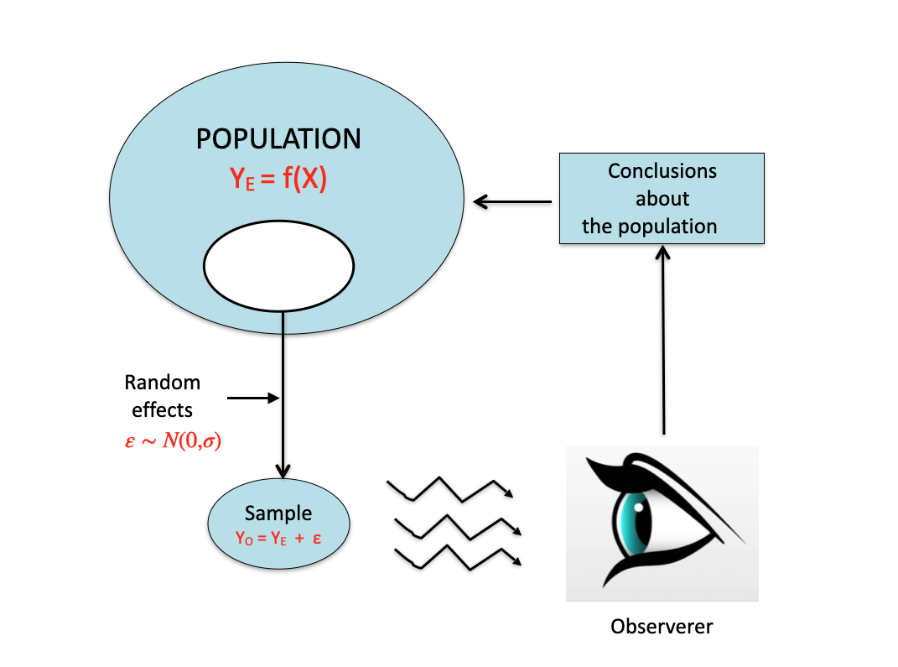
<p class="caption">(\#fig:figName61)The process of experimental research: inferring the characteristics of a population by looking at a sample</p>
</div>

In this chapter we will offer an overview about statistical inference, by using two real-life examples; the first one deals with a quantitative variable, while the second one deals with a proportion.

## Example 1: a concentration value

Let's consider again the situation we have examined in Chapter 4: a well is polluted by herbicide residues and we want to know the concentration of those residues. We plan a Monte Carlo experiment where we collect three water samples and make chromatographic analyses.

As this is a Monte Carlo experiment, we can imagine that we know the real truth: the unknown concentration is 120 mg/L and the analytic instrument is characterised by a coefficient of variability of 10%, corresponding to a standard deviation of 12 mg/L. Consequently, our observations ($Y_i$, with $i$ going from 1 to 3 replicates) will not match the real unknown concentration value, but they will be a random realisation, from the following Gaussian distribution (see Chapter 4):

$$Y_i \sim \textrm{Norm}(120, 12)$$,

Accordingly, we can simulate the results of our experiment:


```r
set.seed(1234)
Ye <- 120
Y <- rnorm(3, Ye, 12)
Y
## [1] 105.5152 123.3292 133.0133
```

Now, let's put ourselves in the usual conditions: we have seen the results and we know nothing about the real truth. What can we learn from the data, about the concentration in the whole well?

First of all, we postulate a possible model, such as the usual model of the mean:

$$Y_i \sim \textrm{Norm}(\mu, \sigma)$$

This is the same model we used to simulate the experiment, but, in the real world, we do not know the values of $\mu$ and $\sigma$ and we need to estimate them from the observed data. We know that $\mu$ and $\sigma$ are, respectively, the mean and the standard deviation of the whole population and, therefore, we calculate these two descriptive stats for our sample and name them, respectively, $m$ and $s$.


```r
m <- mean(Y)
s <- sd(Y)
m; s
## [1] 120.6192
## [1] 13.9479
```

Now the question is: having seen $m$ and $s$, can we infere the values of $\mu$ and $\sigma$? Assuming that the sample is representative (we should not question this, as long as the experiment is valid), our best guess is that $\mu = m$ and $\sigma = s$. This process by which we assign the observed sample values to the population values is known as **point estimation**.

Although point estimation is totally legitimate, we clearly see that it leads to wrong conclusions: due to sampling errors, $m$ is not exactly equal to $\mu$ and $s$ is not exactly equal to $\sigma$! Therefore, a more prudential attitude is recommended: instead of expressing our best guess as a single value, we would be much better off if we could use some sort of uncertainty interval. We need a heuristic to build such an interval.


### The empirical sampling distribution

In this book we will use the popular heuristic proposed by Jarzy Neyman, although we need to clearly state that this is not the only one and it is not free from some conceptual inconsistencies (See Morey et al., 2016). Such a heuristic is based on trying to guess what should happen if we repeat the experiment for a very high number of times. Shall we obtain similar results or different? Instead of guessing, we exploit Monte Carlo simulation to make true repeats. Therefore:

1. we repeat the sampling process 100,000 times (i.e., we collect three water samples for 100,000 times and analyse their concentrations)
2. we get 100,000 average concentration values
3. we describe this population of means.

In R, we can use the code below. Please, note the iterative procedure, based on the `for()` statement, by which all instructions between curly brackets are repeated, while the counter $i$ is updated at each cycle, from 1 to 100,000.


```r
# Monte Carlo simulation
set.seed(1234)
result <- rep(0, 100000)
for (i in 1:100000){
  sample <- rnorm(3, 120, 12)
  result[i] <- mean(sample)
}
mean(result)
## [1] 120.0341
sd(result)
## [1] 6.939063
```

Now, we have a population of sample means and we see that:

1.  the mean of this population is equal to the mean of the original population. It is, therefore, confirmed that the only way to obtain a perfect estimate of the population mean $\mu$ is to repeat the experiment an infinite number of times;
2. the standard deviation of the population of means is equal to 6.94 and it is called **standard error** (SE); this value is smaller than $\sigma$.

In order to more thouroughly describe the variability of sample means, we can bin the concentration values into a series of intervals (from 80 to 160 mg/L with a 2.5 step) and calculate the proportion of means in each interval. In this way, we build an empirical distribution of probabilities for the sample means (Figure \@ref(fig:figName62)), which is called **sampling distribution**. Indeed, this term has a more general importance and it is used to name the distribution of probabilities for every possible sample statistics. 


<div class="figure" style="text-align: center">
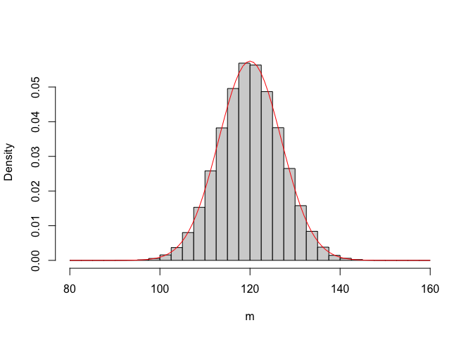
<p class="caption">(\#fig:figName62)Empirical distribution of 100,000 sample means (n = 3) from a Gaussian population with mean = 120 and SD = 12. The solid line shows a Gaussian PDF, with mean = 120 and SD = 6.94</p>
</div>

The sampling distribution and its standard error are two very important objects in research, as they are used to describe the precision of estimates: **when the standard error is big, the sampling distribution is flat and our estimates are tend to be rather uncertain and highly variable across repeated experiments. Otherwise, when the standard error is small, our estimates are very reliable and precise.**


### A theoretical sampling distribution

Building an empirical sampling distribution by Monte Carlo simulation is always possible, but it may often be impractical. Looking at Figure \@ref(fig:figName62), we see that our sampling distribution looks very much like a Gaussian PDF with mean equal to 120 and standard deviation close to 6.94. 

Indeed, such an empirical observation has a theoretical support: the **central limit theorem** states that the sampling distribution of whatever statistic obtained from random and independent samples is approximately gaussian, whatever it is the PDF of the original population where we sampled from ^[The central limit theorem holds for very large samples. With small samples, the approximation is good only with more than 15-20 units]. The same theorem proves that, if the population mean is $\mu$, the mean of the sampling distribution is $\mu$.

The standard deviation of the sampling distribution, in this case, can be derived by the law of propagation of errors, based on three main rules:  

1. the sum of gaussian variables is also gaussian. Besides, the product of a gaussian variable for a constant value is also gaussian.
2. For independent gaussian variables, the mean of the sum is equal to the sum of the means and the variance of the sum is equal to the sum of the variances.
3. If we take a gaussian variable with mean equal to $\mu$ and variance equal to $\sigma^2$ and multiply all individuals by a constant value  $k$, the mean of the product is equal to $k \times \mu$, while the variance is $k^2 \times \sigma^2$. 

In our experiment, we have three individuals coming from a gaussian distribution and each individual inherits the variance of the population from which it was sampled, which is $\sigma^2 = 12^2 = 144$. When we calculate the mean, we sum the three values as the first step and the variance of the sum is $144 + 144 + 144 = 3 \times 144 = 432$. As the second step, we divide by three and the variance of this ratio (see #3 above) is 432 divided by $3^2$, i.e.  $432/9  = 48$. The standard error is, therefore, $\sqrt{48} = 6.928$; it is not exactly equal to the empirical value of 9.94, but this is only due to the fact that we did not make an infinite number of repeated sampling.

In general, the standard error of a mean (SEM) is:

$$\sigma_m  = \frac{\sigma}{\sqrt n}$$

Now, we can make our first conclusion: **if we repeat an experiment a very high number of times, the variability of results across replicates can be described by a sampling distribution, that is (approximately) gaussian, with mean equal to the true result of our experiment and standard deviation equal to the standard error.**

### The frequentist confidence interval

If the sampling distribution is gaussian, we could take a value $k$, so that the following expression holds:

$$P \left[ \mu - k \times \frac{\sigma}{\sqrt{n} } \leq m \leq \mu + k \times \frac{\sigma}{\sqrt{n} } \right] = 0.95$$

It means that we can build an interval around $\mu$ that contains 95% of the sample means ($m$) from repeated experiments (Figure \@ref(fig:figName62b)).

<div class="figure" style="text-align: center">
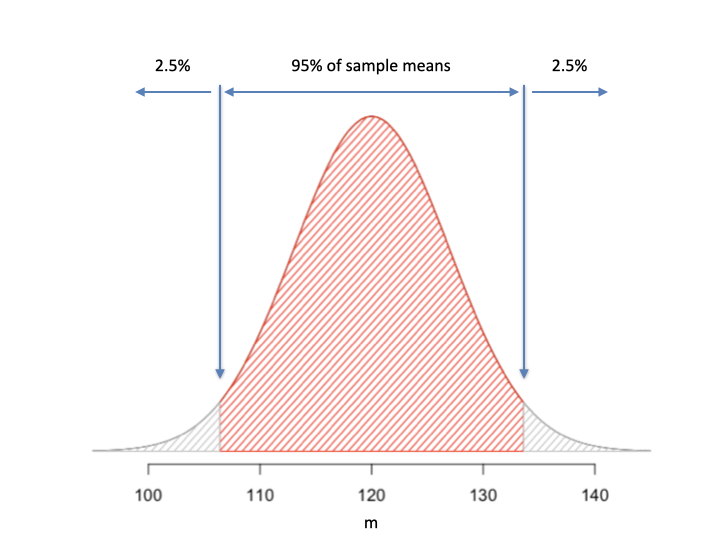
<p class="caption">(\#fig:figName62b)Building a confidence interval (P = 0.95): if we sample from a population with a mean of 120, 95 of our sample means out of 100 will be in the above interval</p>
</div>


With simple math, we get to the following expression, that is of extreme importance:

$$P \left[ m - k \times \frac{\sigma}{\sqrt{n} } \leq \mu \leq m + k \times \frac{\sigma}{\sqrt{n} } \right] = 0.95$$

It says that, **when we make an experiment and get an estimate $m$, by an appropriate selection of $k$, we can build an interval around $m$ that is equal to $k$ times the standard error, and contains the population value $\mu$ with 95% probability**. Here is the heuristic we were looking for!

For our example:

1. we calculate the sample mean. We conclude that $\mu = m = 120.6192$ mg/L and this is our point estimate;
2. we calculate the standard error as $\sigma/\sqrt{n}$. As we do not know $\sigma$, we plug-in our best guess, that is $s = 13.95$, so that $SE = 13.95 / \sqrt{3} = 8.053$;
3. we express our uncertainty about the population mean by replacing the point estimate with an interval, given by $\mu = 120.6192 \pm k \times 8.053$. This process is known as **interval estimation**.

The interval $\mu = 120.6192 \pm k \times 8.053$ is called **confidence interval** and it is supposed to give us a better confidence that we are not reporting a wrong mean for the population (be careful to this: we are in doubt about the population, not about the sample!).

But, how do we select a value for the multiplier $k$? Let's go by trial and error. We set $k = 1$ and repeat our Monte Carlo simulations, as we did before. At this time, we calculate 100,000 confidence intervals and count the number of cases where we hit the population mean. The code is shown below and it is very similar to the code we previously used to build our sampling distribution.


```r
# Monte Carlo simulation - 2
set.seed(1234)
result <- rep(0, 100000)
for (i in 1:100000){
  sample <- rnorm(3, 120, 12)
  m <- mean(sample)
  se <- sd(sample)/sqrt(3)
  limInf <- m - se
  limSup <- m + se
  if(limInf < 120 & limSup > 120) result[i] <- 1
}
sum(result)/100000
## [1] 0.57749
```

Indeed, we hit the real population mean only in less than 60 cases out of 100, which is very far away from 95%; we'd better widen our interval. If we use twice the standard error ($k = 2$), the probability becomes slightly higher than 81% (try to run the code below).


```r
# Monte Carlo simulation - 3
set.seed(1234)
result <- rep(0, 100000)
for (i in 1:100000){
  sample <- rnorm(3, 120, 12)
  m <- mean(sample)
  se <- sd(sample)/sqrt(3)
  limInf <- m - 2 * se
  limSup <- m + 2 * se
  if(limInf < 120 & limSup > 120) result[i] <- 1
}
sum(result)/100000
## [1] 0.81708
```

Using twice the standard error could be a good approximation when we have a high number of degrees of freedom. For example, running the code below shows that, with 20 replicates, a confidence interval obtained as $m \pm 2 \times s/\sqrt{3}$ hits the population mean in more than 94% of the cases. Therefore, such a confidence interval ('naive' confidence interval) is simple and it is a good approximation to the 95% confidence interval when the number of observations is sufficiently high.


```r
# Monte Carlo simulation - 4
set.seed(1234)
result <- rep(0, 100000)
for (i in 1:100000){
  n <- 20
  sample <- rnorm(n, 120, 12)
  m <- mean(sample)
  se <- sd(sample)/sqrt(n)
  limInf <- m - 2 * se
  limSup <- m + 2 * se
  if(limInf < 120 & limSup > 120) result[i] <- 1
}
sum(result)/100000
## [1] 0.94099
```

For our small sample case, we can get an exact 95% coverage by using the 97.5-th percentile of a Student's t distribution, that is calculated by using the `qt()` function in R:


```r
qt(0.975, 2)
## [1] 4.302653
```

The first argument is the desired percentile, while the second argument represents the number of degrees of freedom for the standard deviation of the sample, that is $n - 1$. The value of 4.303 can be used as the multiplier for the standard error, leading to the following confidence limits:


```r
m + qt(0.025, 2) * s/sqrt(3)
## [1] 85.33977
m + qt(0.975, 2) * s/sqrt(3)
## [1] 154.6368
```

A further Monte Carlo simulation (see below) shows that this is a good heuristic, as it gives us a confidence interval with a real 95% coverage.


```r
# Monte Carlo simulation - 4
set.seed(1234)
result <- rep(0, 100000)
for (i in 1:100000){
  sample <- rnorm(3, 120, 12)
  m <- mean(sample)
  se <- sd(sample)/sqrt(3)
  limInf <- m - qt(0.975, 2) * se
  limSup <- m + qt(0.975, 2) * se
  if(limInf < 120 & limSup > 120) result[i] <- 1
}
sum(result)/100000
## [1] 0.94936
```

Obviously, we can also build a 99% or whatever else confidence interval, we only have to select the right percentile from a Student's t distribution. In general, if $\alpha$ is the confidence level (e.g. 0.95 or 0.99), the percentile is $1 - (1 - \alpha)/2$ (e.g., $1 - (1 - 0.95)/2 = 0.975$ or $1 - (1 - 0.99)/2 = 0.995$).

## Example 2: a proportion

For the previous example, we have sampled from a gaussian population, but this is not always true. Let's imagine we have a population of seeds, which are 77.5% germinable and 22.5% dormant. If we take a sample of 40 seeds and measure their germinability, we should not necessarily obtain 31 (40 $\times$ 0.775) germinated seeds, due to random sample-to-sample fluctuations.

Analogously to the previous example, we could think that the number of germinated seeds might show random variability, according to a gaussian PDF with $\mu$ = 31 and a certain standard deviation $\sigma$. However, such an assumption is not reasonable: the count of germinated seeds is a discrete variable going from 0 to 40, while the gaussian PDF is continuous from $-\infty$ to $\infty$. A survey of literature shows that the random variability in the number of germinated seeds can be described by using a binomial PDF (Snedecor and Cochran, 1989); accordingly, we can simulate our germination experiment by using a binomial random number generator, that is the `rbinom(s, n, p)` function. The first argument represents the number of experiments we intend to request, the second represents the number of seeds under investigation in each experiment, while the third one represents the proportion of successes in the population (we can take the germination as a success). Let's simulate the results of an experiment: 


```r
set.seed(1234)
nGerm <- rbinom(1, 40, 0.775)
nGerm
## [1] 34
nGerm/40
## [1] 0.85
```

We see that we get 34 germinated seeds, corresponding to a proportion $p = 34/40 = 0.85$. Looking at the observed data, what can we conclude about the proportion of germinable seeds for the whole population? Our point estimate, as usual, is $\pi = p = 0.85$, but we see that this is expectedly wrong; how could we calculate a confidence interval around this point estimate? Can we use the same heuristic as we did before for concentration data?

Let's use Monte Carlo simulation to explore the empirical sampling distribution. We repeat the experiment 100,000 times and we obtain 100,000 proportions with which we build an empirical sampling distribution (see the code below, showing the sampled proportions for the first six experiment). How does the sampling distribution look like?


```r
res <- rbinom(100000, 40, 0.775)/40
head(res)
## [1] 0.750 0.750 0.750 0.700 0.750 0.925
mean(res)
## [1] 0.7749262
sd(res)
## [1] 0.06611151
```

Unsurprisingly, Monte Carlo simulation leads us to an approximately normal sampling distribution for $p$, as implied by the central limit theorem (Figure \@ref(fig:figName62c)). Furthermore, the mean of the sampling distribution is 0.775 and the standard deviation is 0.066.

<div class="figure" style="text-align: center">
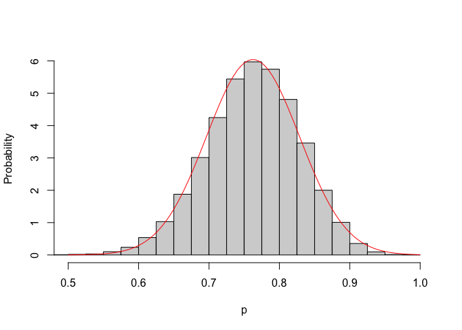
<p class="caption">(\#fig:figName62c)Monte Carlo sampling distribution for the proportion of germinable seeds, when the population proportion is 0.775</p>
</div>

We can conclude that the confidence interval for an estimated proportion can be calculated in the very same way as for the mean, with the only difference that the standard error is obtained as $\sigma_p = \sqrt{p \times (1 - p)}/\sqrt(n)$ (Snedecor and Cochran, 1989). Consequently, using the observed data, $p = 0.85$ and $s = \sqrt{0.85 \times 0.15} = 0.357$; our confidence interval is $0.85 \pm 2 \times 0.357/sqrt(40)$ and we can see that, by reporting such an interval, we have correctly hit our population proportion. In this case the size of our sample was big enough (40) to use $k = 2$ as the multiplier.


## Conclusions

The examples we used are rather simple, but they should help to understand the process: 

1. we have a population, from which we sampled the observed data;
2. we used the observed data to calculate a statistic (mean or proportion);
3. we inferred that the population statistic was equal to the sample statistic (e.g., $\mu = m$ or $\pi = p$);
4. we estimated a standard error for our sample statistic, by using either Monte Carlo simulation, or by using some simple function, depending on the selected statistic (e.g. $\sigma/\sqrt{n}$ for the mean and $\sqrt{p \times (1 - p)}/\sqrt(n)$ for the proportion);
5. we used a multiple of the standard error to build a confidence interval around our point estimate.

We will use the same process throughout this book, although the sample statistics and related standard errors will become slightly more complex, as we progress towards the end. **Please, do not forget that the standard error and confidence interval are fundamental components of science and should always be reported along with every point estimate**.

Last, but not least, it is important to put our attention on the meaning of the so-called 'frequentist' confidence interval:

1. it is a measure of precision
2. it relates to the sampling distribution; i.e. we say that, if we repeat the experiment a high number of times and, at any times, we calculate the confidence interval as shown above, we 'capture' the real unknown parameter value in 95% of the cases
3. it does not refer to a single sampling effort

Points 2 and 3 above imply that confidence intervals protect ourselves from the risk of reaching wrong conclusions only in the long run. In other words, the idea is that, if we use such a heuristic, we will not make too many mistakes in our research life, but that does not imply that we are 95% correct in each experimental effort. Indeed, a single confidence interval may contain or not the true population mean, but we have no hint to understand whether we hit it or not. Therefore, please, remember that such expressions as: "there is 95% probability that the true population parameter is within the confidence interval" are just abused and they should never find their way in any scientific manuscripts or reports.


---

## Further readings

1. Hastie, T., Tibshirani, R., Friedman, J., 2009. The elements of statistical learning, Springer Series in Statistics. Springer Science + Business Media, California, USA.
2. Morey, RD, R Hoekstra, JN Rouder, MD Lee, E-J Wagenmakers, 2016. The fallacy of placing confidence in confidence intervals. Psychonomic Bulletin & Review 23, 103–123
3. Snedecor G.W. and Cochran W.G., 1989. Statistical Methods. Ames: Iowa State University Press (1989).


<!--chapter:end:05-Eng_InferenzaStatistica.Rmd-->

# Making Decisions under uncertainty


*"... the null hypothesis is never proved or established, but it is possibly disproved, in the course of experimentation. Every experiment may be said to exist only to give the facts a chance of disproving the null hypothesis. (R. A. Fisher)*


In Chapter 5 we have seen that experimental errors and, above all, sampling errors, produce uncertainty in the estimation process, which we have to account for by determining and displaying standard errors and confidence intervals. In the very same fashion, we need to be able to make decisions in presence of uncertainty; is the effect of a treatment statistically significant? Is the effect of a treatment higher/lower than the effect of another treatment?

Making such decisions is called **Formal Hypothesis Testing** (FHT) and we will see that this is mainly based on the so-called **P-value**. As usual, I will introduce the problem by using an example.

## Comparing sample means: the Student's t-test

### The dataset

We have planned an experiment where we have compared the yield of genotype A with the yield of the genotype P and the experiment is laid down according to a completely randomised design with five replicates. This is a small-plot experiment with 10 plots, which need to be regarded as sampled from a wider population of plots; as we mentioned in the previous chapter, our interest is not in the sample, but it is in the population of plots, which means that we are looking for conclusions of general validity.

The results (in quintals per hectare) are the following:


```r
A <- c(65, 68, 69, 71, 78)
P <- c(80, 81, 84, 88, 94)
```


As usual we calculate the descriptive statistics (mean and standard deviation) for each sample:


```r
mA <- mean(A)
mP <- mean(P)
sA <- sd(A)
sP <- sd(P)
mA; sA
## [1] 70.2
## [1] 4.868265
mP; sP
## [1] 85.4
## [1] 5.727128
```


We see that the mean for the genotype P is higher than the mean for the genotype A, but such descriptive statistics are not sufficient to our aims. Therefore, we calculate standard errors, to express our uncertainty about the population means, as we have shown in the previous chapter.


```r
seA <- sA/sqrt(5); seA
## [1] 2.177154
seP <- sP/sqrt(5); seP
## [1] 2.56125
```

Consequently, we can produce interval estimates for the population means, i.e., 85.4 $\pm$ 5.12 and 70.2 $\pm$ 4.35. We note that the confidence intervals do not overlap, which supports the idea that P is better than A, but we would like to reach a more formal decision. 

First of all, we can see that the observed difference between $m_A$ and $m_P$ is equal to:


```r
mA - mP
## [1] -15.2
```

However, we are not interested in the above difference, but we are interested in the population difference, i.e. $\mu_A - \mu_P$. We know that both the means have a certain degree of uncertainty, which propagates to the difference. In the previous chapter, we have seen that the variance of the sum/difference of independent samples is equal to the sum of variances; therefore, the standard error of the difference (SED) is equal to:

$$SED = \sqrt{ SEM_1^2 + SEM_2^2 }$$

In our example, the SED is:


```r
SED <- sqrt(seA^2 + seP^2)
SED
## [1] 3.361547
```

It is intuitively clear that the difference (in quintals per hectare) should be regarded as significant when it is much higher than its standard error; indeed, this would mean that the difference is stronger than the uncertainty with which we have estimated it. We can formalise such an intuition by defining the $T$ statistic for the sample difference:

$$T = \frac{m_A - m_P}{SED}$$

which is equal to:


```r
Ti <- (mA - mP)/SED
Ti
## [1] -4.521727
```

If T is big, the difference is likely to be significant (not due to random effects); however, $T$ is a sample statistic and it is expected to change whenever we repeat the experiment. How is the sampling distribution for $T$? To answer this question, we should distinguish two possible hypotheses about the data:

* Hypothesis 1. There is no difference between the two genotypes (**null hypothesis**: $H_0$) and, consequently, we have only one population and the two samples A and P are extracted from this population.
* Hypothesis 2. The two genotypes are different (**alternative hypothesis**: $H_1$) and, consequently, the two samples are extracted from two different populations, one for the A genotype and the other one for the P genotype.

In mathematical terms, the null hypothesis is:

$$H_0: \mu_1 = \mu_2 = \mu$$

The alternative hypothesis is:

$$H_1 :\mu_1  \neq \mu_2$$

More complex alternative hypotheses are also possible, such as $H_1 :\mu _1  > \mu _2$, or $H_1 :\mu _1  < \mu _2$. However, hypotheses should be set before looking at the data (according to the Galilean principle) and, in this case, we have no prior knowledge to justify the selection of one of such complex hypotheses. Therefore, we select the simple alternative hypothesis.

Which of the two hypotheses is more reasonable, by considering the observed data? We have seen that, **according to the Popperian falsification principle, experiments should be planned to falsify hypotheses. Therefore, we take the null hypothesis and see whether we can falsify it.**

This is one hint: if the null hypothesis were true, we should observe $T = 0$, while we have observed $T = -4.521727$. Is this enough to reject the null? Not at all, obviously. Indeed, the sample means can change from one experiment to the other and it is possible to obtain $T \neq 0$ also when the experimental treatments are, indeed, the same treatment. Therefore, we need to ask ourselves: **what is the sampling distribution for $T$ under the null hypothesis?**


### Monte Carlo simulation

We can easily build an empirical sampling distribution for $T$ by using Monte Carlo simulation. Look at the code in the box below: we use the `for()` statement to repeat the experiment 100,000 times. Each experiment consists of getting two samples of five individuals from the same population, with mean and standard deviation equal to the overall mean/standard deviation of the two original samples A and P. For each of the 100,000 couples of samples, we calculate T and store the result in the 'result' vector, which, in the end, represents the sampling distribution we were looking for.


```r
# We assume a single population
mAP <- mean(c(A, P))
devStAP <- sd(c(A, P))

# we repeatedly sample from this common population
set.seed(34)
result <- rep(0, 100000)
for (i in 1:100000){
  sample1 <- rnorm(5, mAP, devStAP)
  sample2 <- rnorm(5, mAP, devStAP)
  SED <- sqrt( (sd(sample1)/sqrt(5))^2 +
                 (sd(sample2)/sqrt(5))^2 )
  result[i] <- (mean(sample1) - mean(sample2)) / SED
}
mean(result) 
## [1] -0.001230418
min(result)
## [1] -9.993187
max(result)
## [1] 9.988315
```


What values did we obtain for $T$? On average, the values are close to 0, as we expected, considering that both samples were always obtained from the same population. However, we also note pretty high and low values (close to 10 and -10), which proves that random sampling fluctuations can also bring to very 'odd' results. For our real experiment we obtained $T = -4.521727$, although the negative sign is just an artifact, relating to how we sorted the two means: we could have as well obtained $T = 4.521727$.

**Ronald Fisher proposed that we should reject the null, based on the probability of obtaining values as extreme or more extreme than those we observed, when the null is true**. Looking at the vector 'result' we see that the proportion of values lower than -4.521727 and higher than 4.521727 is  $0.00095 + 0.00082 = 0.00177$. This is the so called **P-value** (see the code below). 


```r
length(result[result < Ti]) / 100000
## [1] 0.00095
length(result[result > - Ti]) /100000
## [1] 0.00082
```

Let's summarise. We have seen that, when the null is true, the sampling distribution for $T$ contains a very low proportion of values outside the interval from -4.521727 to 4.521727. Therefore, our observation fell in a very unlikely range, corresponding to a probability of 0.00177 (P-value = 0.00177); the usual yardstick for decision is 0.05, thus we reject the null. We do so, because, if the null were true, we would have obtained a very unlikely result; in other words, our scientific evidence against the null is strong enough to reject it.

### A formal solution

A new question: is there any formal PDF, which we can use in place of our empirical, Monte-Carlo based sampling distribution for T? Let's give a closer look at the 'result' vector. In particular, we can bin this continuous variable and plot the empirical distribution of frequencies (see Figure \@ref(fig:figName71))


```r
#Sampling distribution per T 

b <- seq(-10, 10, by=0.25)
hist(result, breaks = b, freq=F, 
  xlab = expression(paste(m)), ylab="Density", 
  xlim=c(-10,10), ylim=c(0,0.45), main="")
curve(dnorm(x), add=TRUE, col="blue", n = 10001)
curve(dt(x, 8), add=TRUE, col="red", n = 10001)
```

<div class="figure" style="text-align: center">

<p class="caption">(\#fig:figName71)Empirical sampling distribution for the T statistic, compared to a standardised gaussian (blue line) and a Student's t distribution with 8 degree of freedom (red line)</p>
</div>

We see that the empirical distribution is not exactly standardised gaussian, but it can be described by using another type of distribution, that is the Student's t distribution, with eight degrees of freedom (i.e. the sum of the degrees of freedom for the two samples). Now that we know this, instead of making a time consuming Monte Carlo simulation, we can use the Student's t CDF to calculate the P-value, as shown in the box below.


```r
pt(Ti, df=8) # probability that T > 4.5217
## [1] 0.0009727349
pt(-Ti, df=8, lower.tail = F) # probability that T < -4.5217
## [1] 0.0009727349
2 * pt(Ti, df=8) #P-value
## [1] 0.00194547
```


We see that the P-value is very close to that obtained by using simulation.

### The t test with R

What we have just described is known as the Student's t-test and it is often used to compare the means of two samples. The null hypothesis is that the two samples are drawn from the same populations and, therefore, their means are not significantly different. In practice, what we do is:

1. Calculate the means and standard errors for the two samples
2. Calculate the difference between the means
3. Calculate the SED
3. Calculate the observed $T$ value
4. Use the Student's t CDF to retrieve the probabilities $P(t < -T)$ and $P(t > T)$
5. Reject the null hypothesis if the sum of the above probabilities is lower than 0.05.

More simply, we can reach the same solution by using the `t.test()` function in R, as shown in the box below.


```r
t.test(A, P, paired = F, var.equal = T)
## 
## 	Two Sample t-test
## 
## data:  A and P
## t = -4.5217, df = 8, p-value = 0.001945
## alternative hypothesis: true difference in means is not equal to 0
## 95 percent confidence interval:
##  -22.951742  -7.448258
## sample estimates:
## mean of x mean of y 
##      70.2      85.4
```

Perhaps, it is worth to discuss the meaning of the two arguments 'paired' and 'var.equal', which were set, respectively, to FALSE and TRUE. In some cases two measures are taken on the same subject and we are interested in knowing whether there is a significant difference between the first and the second measure. For example, let's imagine that we have given a group of five cows a certain drug and we have measured some blood parameter before and after the treatment. We would have a dataset composed by ten values, but we would only have five subjects, which would make a big difference with respect to our previous example.

In such a condition we talk about a paired t-test, which is performed by setting the argument 'paired' to TRUE, as shown in the box below.


```r
t.test(A, P, paired = T, var.equal = T)
## 
## 	Paired t-test
## 
## data:  A and P
## t = -22.915, df = 4, p-value = 2.149e-05
## alternative hypothesis: true mean difference is not equal to 0
## 95 percent confidence interval:
##  -17.04169 -13.35831
## sample estimates:
## mean difference 
##           -15.2
```

The calculations are totally different and, therefore, the significance is, as well, different. In particular, we consider the five pairwise differences, their mean and their standard error, as shown below:


```r
diff <- mean(A - P)
SED <- sd(A - P)/sqrt(5) 
diff/SED
## [1] -22.91486
```

One further difference is that, as we have five subjects instead of ten, we only have four degrees of freedom.

In relation to the argument 'var.equal', you have perhaps noted that we made our Monte Carlo simulation by drawing samples from one gaussian distribution. However, the two samples might come from two gaussian distributions with the same mean and different standard deviations, which would modify our sampling distribution for $T$, so that our P-level would become invalid. We talk about **heteroscedasticity** when the populations, and therefore the two samples, have different standard deviations. Otherwise we talk about **homoscedasticity**. 

If we have reasons to suppose that the two samples come from populations with different standard deviations, we should use a heteroscedastic t-test (better known as Welch test). We can set the 'var.equal' argument to FALSE, as shown in the box below.


```r
t.test(A, P, paired = F, var.equal = F)
## 
## 	Welch Two Sample t-test
## 
## data:  A and P
## t = -4.5217, df = 7.7977, p-value = 0.002076
## alternative hypothesis: true difference in means is not equal to 0
## 95 percent confidence interval:
##  -22.986884  -7.413116
## sample estimates:
## mean of x mean of y 
##      70.2      85.4
```

We see that the test is slightly less powerful (lower P-value), due to a reduced number of degrees of freedom, that is approximated by using the Satterthwaite formula:

$$DF_s \simeq \frac{ \left( s^2_1 + s^2_2 \right)^2 }{ \frac{(s^2_1)^2}{DF_1} + \frac{(s^2_2)^2}{DF_2} }$$

which reduces to:

$$DF_s = 2 \times DF$$

when the two samples are homoscedastic ($s_1 = s_2$).

in our example:


```r
dfS <- (var(A) + var(P))^2 / 
  ((var(A)^2)/4 + (var(P)^2)/4)
dfS
## [1] 7.79772
```


How do we decide whether the two samples have the same standard deviation and thus we can use a homoscedastic t-test? In general, we use a heteroscedastic t-test whenever the standard deviation for one sample is twice or three times as much with respect to the other, although some statisticians suggest that we should better use a heteroscedastic t-test in all cases, in order to increase our protection level against wrong rejections.

## Comparing proportions: the $\chi^2$ test

The t-test is very useful, but we can only use it with quantitative variables. What if we have a nominal response, e.g. death/alive, germinated/ungerminated? Let's imagine an experiment where we have sprayed two populations of insects with an insecticide, respectively with or without an adjuvant. From one population (with adjuvant), we get a random sample of 75 insects and record 56 deaths, while from the other population (without adjuvant) we get a random sample of 50 insects and record 48 deaths.

In this case the sample efficacies are $p_1 = 56/75 = 0.747$ and $p_2 = 0.96$, but we are not interested in the samples, but in the whole populations, from where we sampled our insects.

If we remember Chapter 3, we may recall that the results of such an experiment reduce to a contingency table, as shown in the box below:


```r
counts <- c(56, 19, 48, 2)
tab <- matrix(counts, 2, 2, byrow = T)
row.names(tab) <- c("I", "IA")
colnames(tab) <- c("D", "A")
tab <- as.table(tab)
tab
##     D  A
## I  56 19
## IA 48  2
```


For such a table, we already know how to calculate a $\chi^2$, which measures the dependency among the two traits (insecticide treatment and deaths); the observed value, for our sample, is 9.768 (see below).


```r
summary(tab)
## Number of cases in table: 125 
## Number of factors: 2 
## Test for independence of all factors:
## 	Chisq = 9.768, df = 1, p-value = 0.001776
```

Clearly, like any other sample based statistic, the value of $\chi^2$ changes any time we repeat the sampling effort. Therefore, the null hypothesis is:

$$H_o :\pi_1  = \pi_2  = \pi$$

Please, note that we make a reference to the populations, not to the samples. If this is true, what is the sampling distribution for $\chi^2$? And, what is the probability of obtaining a value of 9.768, or higher?

Although it is possible to set up a Monte Carlo simulation to derive an empirical distribution, we will not do so, for the sake of brevity. We anticipate that the sampling distribution for $\chi^2$ can be described by using the $\chi^2$ density function, with the appropriate number of degrees of freedom (the minimum between the number of columns and the number of rows, minus 1). In our case, we have only one degree of freedom and we can use the cumulative $\chi^2$ distribution function to derive the probability of obtaining a value of 9.768, or higher:


```r
pchisq(9.76801, 1, lower.tail=F)
## [1] 0.001775746
```

The P-value is much lower than 0.05 and thus we can reject the null. We can get to the same result by using the `chisq.test()` function:


```r
chisq.test(tab, correct = F)
## 
## 	Pearson's Chi-squared test
## 
## data:  tab
## X-squared = 9.768, df = 1, p-value = 0.001776
```

Please, note the argument 'correct = F'. A chi-square test is appropriate only when the number of subjects is high enough, e.g. higher than 30 subjects, or so. If not, we should improve our result by applying the so-called continuity correction, by using the argument 'correct = T', that is the default option in R.


## Correct interpretation of the P-value

We use the P-value as the tool to decide whether we should accept or reject the null, i.e. we use it as an heuristic tool, which was exactly Ronald Fisher's original intention. Later work by Jarzy Neyman and Egon Pearson, around 1930, gave the P-value a slightly different meaning, i.e. the probability of wrongly rejecting the null (so-called type I error rate: false positive). However, we should interpret such a probability with reference to the sampling distribution, not with reference to a single experiment. It means that we can say that: *if the null is true and we repeat the experiment an infinite number of times, we have less than 5% probability of obtaining such a high T or $\chi^2$ value*.  On the other hand, we cannot legitimately conclude our experiment by saying that: *there is less then 5% probability that we have reached wrong conclusions*. Indeed, we do not (and will never) know whether we have reached correct conclusions in our specific experiment, while our 'false-positive' probability is only valid on the long run.


## Conclusions

The intrinsic uncertainty in all experimental data does not allow us to reach conclusions and make decisions with no risk of error. As our aim is to reject hypotheses, we protect ourself as much as possible against the possibility of wrong rejection. To this aim, we use the P-value for the null hypothesis: if this is lower than the predefined yardstick level (usually $\alpha = 0.05$) we reject the null and we can be confident that such an heuristic, in the long run, will result in less than 5% of wrong rejections.

Before concluding, we should point out that we do not only run the risk of committing a false-positive error (type I error), we also run the risk of committing a false negative error (type II error), whenever we fail to reject a false null hypothesis. These two type of errors are nicely put in Figure \@ref(fig:figName72), that is commonly available in the web.

<div class="figure" style="text-align: center">

<p class="caption">(\#fig:figName72)The two types of statistical errors</p>
</div>

Please, also note that the two error types are interrelated and the highest the protection against the false-positive error, the highest the risk of committing a false negative error. In general, we should be always careful to decide which of the two errors might be more dangerous for our specific aim.


---


## Further readings

1. Hastie, T., Tibshirani, R., Friedman, J., 2009. The elements of statistical learning, Springer Series in Statistics. Springer Science + Business Media, California, USA.


<!--chapter:end:06-Eng_TestIpotesi.Rmd-->

# One-way ANOVA models


*To find out what happens when you change something, it is necessary to change it (Box, Hunter and Hunter)*


In Chapter 4 we have seen that the experimental observations can be described by way of models with both a deterministic and a stochastic component. With specific reference to the former component, we have already introduced an example of an ANOVA model, belonging to a very important class of linear models, where the response variable is quantitative, while the predictors are represented by one or several nominal explanatory factors. It is necessary to state that, strictly speaking, the term 'ANOVA model' is slightly imprecise; indeed, ANOVA stands for ANalysis Of VAriance and it is a method for decomposing the variance of a group of observations, which was invented by Ronald Fisher, almost one century ago. However, the models we are discussing here are strongly connected to the Fisherian ANOVA, which motivates their name.

In this Chapter we will use a simple (but realistic) example to introduce the ANOVA models with only one predictor (one-way ANOVA models).

## Comparing herbicides in a pot-experiment

We have designed a pot-experiment to compare weed control efficacy of two herbicides used alone and in mixture. A control was also added as a reference and, thus, the four treatments were:

1. Metribuzin
2. Rimsulfuron
3. Metribuzin + rimsulfuron
4. Untreated control


Sixteen uniform pots were prepared and sown with *Solanum nigrum*; when the plants were at the stage of 4-true-leaves, the pots were randomly sprayed with the above herbicide solution, according to a completely randomised design with four replicates. Three weeks after the treatment, the plants in each pot were harvested and weighted: the lower the weight the higher the efficacy of herbicides.

The results of this experiment are reported in a 'csv' file, that is available in a web repository. First of all, let's load the data into R.

\vspace{12pt}

```r
repo <- "https://www.casaonofri.it/_datasets/"
file <- "mixture.csv"
pathData <- paste(repo, file, sep = "")

dataset <- read.csv(pathData, header = T)
head(dataset)
##             Treat Weight
## 1 Metribuzin__348  15.20
## 2 Metribuzin__348   4.38
## 3 Metribuzin__348  10.32
## 4 Metribuzin__348   6.80
## 5     Mixture_378   6.14
## 6     Mixture_378   1.95
```

Please, note that the dataset is in a 'tidy' format, with one row per observation and one column per variable. The first row contains the names of variables. i.e., 'Treat', representing the factor level and 'Weight', representing the response variable. While other data formats might be more suitable for visualisation, the 'tidy' format is the base of every statistical analyses with most software tools and it can be easily transformed into other formats, whenever necessary (Wichkam, 2014).

## Data description

The first step is the description of the observed data. In particular, we calculate:

1. sample means for each treatment level
2. sample standard deviations for each treatment level

To do so, we use the `tapply()` function, as shown in the box below and we also use the `data.frame()` function to create a data table for visualisation purposes.

\vspace{12pt}

```r
treatMeans <- tapply(dataset$Weight, dataset$Treat, mean)
SDs <- tapply(dataset$Weight, dataset$Treat, sd)
descrit <- data.frame(treatMeans, SDs)
descrit
##                 treatMeans      SDs
## Metribuzin__348     9.1750 4.699089
## Mixture_378         5.1275 2.288557
## Rimsulfuron_30     16.8600 4.902353
## Unweeded           26.7725 3.168673
```


What do we learn, from the above table of means? We learn that:

1. the mixture is slightly more effective than the herbicides used alone;
2. the standard deviations are rather similar, for all treatments.

Now, we ask ourselves: is there any significant difference between the efficacy of herbicides? If we look at the data, the answer is yes; indeed, the four means are different. However, we do not want to reach conclusions about our dataset; we want to reach general conclusions. We observed the four means $m_1$, $m_2$, $m_3$ and $m_4$, but we are interested in $\mu_1$, $\mu_2$, $\mu_3$ and $\mu_4$, i.e. the means of the populations from where our samples were drawn. What are the populations, in this case? They consist of all possible pots that we could have treated with each herbicide, in our same environmental conditions.


## Model definition

In order to answer the above question, we need to define a suitable model to describe our dataset. A possible candidate model is:

$$Y_i = \mu + \alpha_j + \varepsilon_i$$

This model postulates that each observation $Y_i$ derives from the value $\mu$ (so called intercept and common to all observations) plus the amount $\alpha_j$, that depends on the treatment group $j$, plus the stochastic effect $\varepsilon_i$, which is specific to each observation and represents the experimental error. This stochastic element is regarded as gaussian distributed, with mean equal to 0 and standard deviation equal to $\sigma$. In mathematical terms:

$$\varepsilon_i \sim N(0, \sigma)$$

The expected value for each observation, depending on the treatment group, is

$$\bar{Y_i} = \mu + \alpha_j = \mu_j$$

and corresponds to the group mean. In order to understand the biological meaning of $\mu$ and $\alpha$ values we need to go a little bit more into the mathematical detail.


### Parameterisation

Let's consider the first observation $Y_1 = 15.20$; we need to estimate three values ($\mu$, $\alpha_1$ and $\varepsilon_1$) which return 15.20, by summation. Clearly, there is an infinite number of such triplets and, therefore, the estimation problem is undetermined, unless we put constraints on some model parameters. There are several ways to put such constraints, corresponding to different **model parameterisations**; in the following section, we will list two of them: the treatment constraint and the sum-to-zero constraint.

### Treatment constraint

A very common constraint is $\alpha_1 = 0$. As the consequence:

$$\left\{ {\begin{array}{l}
\mu_1 = \mu + \alpha_1 = \mu + 0\\
\mu_2 = \mu + \alpha_2 \\
\mu_3 = \mu + \alpha_3 \\
\mu_4 = \mu + \alpha_4
\end{array}} \right.$$

With such a constraint, $\mu$ is the mean for the first treatment level (in R, it is the first in alphabetical order), while $\alpha_2$, $\alpha_3$ and $\alpha_4$ are the differences between, respectively, the second, third and fourth treatment level means, with respect to the first one.

In general, with this parameterisation, model parameters are means or differences between means.

### Sum-to-zero constraint

Another possible constraint is $\sum{\alpha_j} = 0$. If we take the previous equation and sum all members we get:

$$\mu_1 + \mu_2 + \mu_3 + \mu_4 = 4 \mu + \sum{\alpha_j}$$

Imposing the sum-to-zero constraint we get to:

$$\mu_1 + \mu_2 + \mu_3 + \mu_4 = 4 \mu$$

and then to:

$$\mu = \frac{\mu_1 + \mu_2 + \mu_3 + \mu_4}{4}$$

Therefore, with this parameterisation $\mu$ is the overall mean, while the $\alpha_j$ values represent the differences between each treatment mean and the overall mean (**treatment effects**). A very effective herbicide will have low negative $\alpha$ values, while a bad herbicide will have high positive $\alpha$ values.

In general, with this parameterisation, model parameters represent the overall mean and the effects of the different treatments.

The selection of constraints is up to the user, depending on the aims of the experiment. In this book, we will use the sum-to-zero constraint for our hand-calculations, as parameter estimates are easier to obtain and have a clearer biological meaning. In R, the treatment constraint is used by default, although the sum-to-zero constraint can be easily obtained, by using the appropriate coding. Independent on model parameterisation, the expected values, the residuals and all the other statistics are totally equal.


## Basic assumptions

The ANOVA model above makes a number of **basic assumptions**:

1. the effects are purely additive;
2. there are no other effects apart from the treatment and random noise. In particular, there are no components of systematic error;
3. errors are independently sampled from a gaussian distribution;
4. error variances are homogeneous, independent from the experimental treatments (indeed, we only have one $\sigma$ value, common to all treatment groups)

**We need to always make sure that the above assumptions are tenable, otherwise our model will be invalid, as well as all inferences therein**. We will discuss this aspect in the next chapter.

## Fitting ANOVA models by hand

Model fitting is the process by which we take the general model defined above and use the data to find the most appropriate values for the unknown parameters. In general, linear models are fitted by using the least squares approach, i.e. we look for the parameter values that minimise the squared difference between the observed data and model predictions. Nowadays, such minimisation is always carried out by using a computer, although we think that, once in life, fitting ANOVA models by hand may be very helpful, to understand the fundamental meaning of such a brilliant technique. In order to ease the process, we will not use the least squares method, but we will use the arithmetic means and the method of moments. Please, remember that this method is only appropriate when the data are balanced, i.e. when the number of replicates is the same for all treatment groups.

### Parameter estimation

According to the sum-to-zero constraint, we calculate the overall mean (m) as:

\vspace{12pt}

```r
m <- mean(dataset$Weight)
mu <- m
```

and our point estimate is $\mu = m = 14.48375$. Next, we can estimate the $\alpha$ effects by subtracting the overall mean from the group means:

\vspace{12pt}

```r
alpha <- treatMeans - mu
alpha
## Metribuzin__348     Mixture_378  Rimsulfuron_30        Unweeded 
##        -5.30875        -9.35625         2.37625        12.28875
```


Please, note that the last parameter $\alpha_4$ was not 'freely' selected, as it was implicitly constrained to be:

$$\alpha_4 = - \left( \alpha_1 + \alpha_2 + \alpha_3 \right)$$

Now, to proceed with our hand-calculations, we need to repeat each $\alpha$ value four times, so that each original observation is matched to the correct $\alpha$ value, depending on the treatment group (see later).

\vspace{12pt}

```r
alpha <- rep(alpha, each = 4)
```


### Residuals

After deriving $\mu$ and $\alpha$ values, we can calculate the expected values by using the equation above and, lately, the residuals, as:

$$ \varepsilon_i = Y_i - \left( \mu - \alpha_j \right)$$

The results are shown in the following prospect:

\vspace{12pt}

```r
Expected <- mu + alpha
Residuals <- dataset$Weight - Expected
tab <- data.frame(dataset$Treat, dataset$Weight, mu,
             alpha, Expected, Residuals)
names(tab)[1] <- "Herbicide"
print(tab, digits = 3)
##          Herbicide dataset.Weight   mu alpha Expected Residuals
## 1  Metribuzin__348          15.20 14.5 -5.31     9.18    6.0250
## 2  Metribuzin__348           4.38 14.5 -5.31     9.18   -4.7950
## 3  Metribuzin__348          10.32 14.5 -5.31     9.18    1.1450
## 4  Metribuzin__348           6.80 14.5 -5.31     9.18   -2.3750
## 5      Mixture_378           6.14 14.5 -9.36     5.13    1.0125
## 6      Mixture_378           1.95 14.5 -9.36     5.13   -3.1775
## 7      Mixture_378           7.27 14.5 -9.36     5.13    2.1425
## 8      Mixture_378           5.15 14.5 -9.36     5.13    0.0225
## 9   Rimsulfuron_30          10.50 14.5  2.38    16.86   -6.3600
## 10  Rimsulfuron_30          20.70 14.5  2.38    16.86    3.8400
## 11  Rimsulfuron_30          20.74 14.5  2.38    16.86    3.8800
## 12  Rimsulfuron_30          15.50 14.5  2.38    16.86   -1.3600
## 13        Unweeded          24.62 14.5 12.29    26.77   -2.1525
## 14        Unweeded          30.94 14.5 12.29    26.77    4.1675
## 15        Unweeded          24.02 14.5 12.29    26.77   -2.7525
## 16        Unweeded          27.51 14.5 12.29    26.77    0.7375
```


### Standard deviation $\sigma$

In order to get an estimate for $\sigma$, we calculate the Residual Sum of Squares (RSS):

\vspace{12pt}

```r
RSS <- sum(Residuals^2)
RSS
## [1] 184.1774
```

In order to obtain the residual variance, we need to divide the RSS by the appropriate number of Degrees of Freedom (DF); the question is: what is this number? We need to consider that the residuals represent the differences between each observed value and the group mean; therefore, those residuals must sum up to zero within all treatment groups, so that we have 16 residuals, but only three per group are 'freely' selected, while the fourth one must be equal to the opposite of the sum of the other three. Hence, the number of degrees of freedom is $3 \times 4 = 12$.

In more general terms, the number of degrees of freedom for the RSS is $p (k -1)$, where $p$ is the number of treatments and $k$ is the number of replicates (assuming that this number is constant across treatments). The residual variance is:

$$MS_{e}  = \frac{184.178}{12} = 15.348$$

Consequently, our best point estimate for $\sigma$ is:

$$sigma =  \sqrt{15.348} = 3.9177$$

Now, we can use our point estimates for model parameters to calculate point estimates for the group means (e.g.: $\mu_1 = \mu + \alpha_1$), which, in this instance, are equal to the arithmetic means, although this is not generally true. However, we know that point estimates are not sufficient to draw general conclusions and we need to provide the appropriate confidence intervals.

### SEM and SED

The standard errors for the four means are easily obtained, by the usual rule ($k$ is the number of replicates):

$$SEM = \frac{s}{ \sqrt{k}} =  \frac{3.918}{ \sqrt{4}}$$

You may have noted that, for all experiments, there are two ways to calculate standard errors for the group means:

1. by taking the standard deviations for each treatment group, as shown in Chapter 3. With $k$ treatments, this method results in $k$ different standard errors;
2. by taking the pooled standard deviation estimate $s$. In this case, we have only one common SEM value, for all group means. 

You may wonder which method is the best. Indeed, if the basic assumption of variance homogeneity is tenable, the second method is better, as the pooled SEM is estimated with higher precision, with respect to the SEs for each group mean (12 degrees of freedom, instead of 3).

The standard error for the difference between any possible pairs of means is:

$$SED = \sqrt{ MS_{1} + MS_{2} } = \sqrt{ 2 \cdot \frac{MS_e}{n} } =  \sqrt{2}  \cdot \frac{3.9177}{\sqrt{4}} = \sqrt{2} \cdot SEM$$


### Variance partitioning

Fitting the above model is prodromic to the Fisherian ANalysis Of VAriance, i.e. the real ANOVA technique. The aim is to partition the total variability of all observations into two components: the first one is due to treatment effects and the other one is due to all other effects of random nature.

In practice, we start our hand calculations from the total sum of squares (SS), that is the squared sum of residuals for each value against the overall mean (see Chapter 3):

$$\begin{array}{c}
SS = \left(24.62 - 14.48375\right)^2 + \left(30.94 - 14.48375\right)^2 + ... \\
... + \left(15.50 - 14.48375\right)^2 = 1273.706
\end{array}$$

Total deviance relates to the all the effects, both from known and unknown sources (treatment + random effects). With R:

\vspace{12pt}

```r
SS <- sum( (dataset$Weight - mu)^2 )
```

Second, we can consider that the RSS represents the amount of data variability produced by random effects. Indeed, the variability of data within each treatment group cannot be due to treatment effects.

Finally, we can consider that variability produced by treatment effects is measured by the $\alpha$ values and, therefore, the treatment sum of squares (TSS) is given by the sum of squared $\alpha$ values:

\vspace{12pt}

```r
TSS <- sum(tab$alpha^2)
TSS
## [1] 1089.529
```

Please, note that the sum of the residual sum of squares (RSS) and the treatment sum of squares (TSS) is exactly equal to the total sum of squares:

\vspace{12pt}

```r
TSS + RSS
## [1] 1273.706
```

The partitioning of total variance shows that random variability is much lower than treatment variability, although we know that we cannot directly compare two deviances, when they are based on a different number of DFs (see Chapter 3).

Therefore, we calculate the corresponding variances: we have seen that the RSS has 12 degrees of freedom and the related variance is $MS_e = 15.348$. The TSS has 3 degrees of freedom, that is the number of treatment levels minus one; the related variance is:

$$MS_t = \frac{1089.529}{3} = 363.1762$$

These two variances (treatment and residual) can be directly compared. Fisher, in 1920, proposed the following F-ratio:

$$F = \frac{MS_t}{MS_e} = \frac{363.18}{15.348} = 23.663$$

It shows that the variability imposed by the experimental treatment is more than 23 times higher than the variability due to random noise, which supports the idea that the treatment effect is significant. However, we need a formal statistical test to support such a statement.

### Hypothesis testing

Let me recall a basic concept that has already appeared before and it is going to return rather often in this book (apologies for this). We have observed a set of 16 data, coming from a pot-experiment, but these data represent only a sample of an infinite number of replicated experiments that we could perform. Therefore, the observed F value is just an instance of an infinite number of possible F values, which define a sampling distribution. How does such sampling distribution look like?

In order to determine the sampling distribution for the F-ratio, we need to make some hypotheses. The null hypothesis is that the treatments have no effects and, thus:

$$H_0: \mu_1 = \mu_2 = \mu_3 = \mu_4$$

Analogously:

$$H_0: \alpha_1 = \alpha_2 = \alpha_3 = \alpha_4 = 0$$

In other words, if $H_0$ were true, the four samples would be drawn from the same gaussian population. What would become of the F-ratio? We could see this by using Monte Carlo simulation, but, for the sake of simplicity, let's exploit literature information: the American mathematician George Snedecor demonstrated that, when the null is true, the sample based F-ratio is distributed according to the F-distribution (Fisher-Snedecor distribution). In more detail, Snedecor defined a family of F-distributions, whose elements are selected, depending on the number of degrees of freedom at the numerator and denominator. For our example (three degrees of freedom at the numerator and 12 at the denominator), the F distribution is shown in Figure \@ref(fig:figNameF). We see that the mode is between 0 and 1, while the expected value is around 1. We also see that values above 6 are very unlikely.

<div class="figure" style="text-align: center">
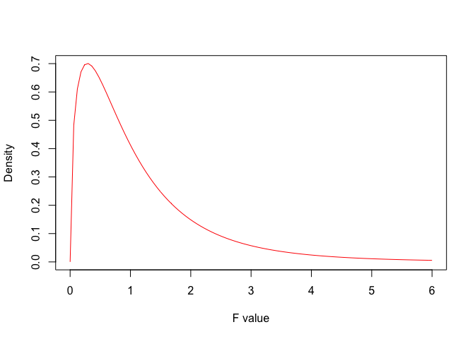
<p class="caption">(\#fig:figNameF)Probabilty density function for F distribution with three and twelve degrees of freedom</p>
</div>


Now, we can use the cumulative distribution function in R to calculate the probability of obtaining values as high as 23.663 (the observed value) or higher:

\vspace{12pt}

```r
pf(23.663, 3, 12, lower.tail = F)
## [1] 2.508789e-05
```

We can see that, if the hull is true and we repeat the experiment a very high humber of times, there is only one chance in 250,000 that we observe such a high F-value. As the consequence, we reject the null and accept the alternative, i.e. there is at least one treatment level that produced a significant effect.

## Fitting ANOVA models with R

Fitting models with R is very straightforward, by way of a very consistent platform for most types of models. For linear models, we use the `lm()` function, according to the following syntax:

```
mod <- lm(Weight ~ factor(Treat), data = dataset)
```

The first argument is the equation we want to fit: on the left side, we specified the name of the response variable, the 'tilde' means 'is a function of and replaces the = sign and, on the right side, we specified the name of the factor variable. We did not specify the intercept and the stochastic term $\varepsilon$, which are included by default. Please, also note that, prior to analysis, we transformed the 'Treat' variable into a factor, by using the `factor()` function. Such a transformation is not strictly necessary with character variables, but becomes fundamental with numeric variables, representing numbers and not classes.

\vspace{12pt}

```r
dataset$Treat <- factor(dataset$Treat)
mod <- lm(Weight ~ Treat, data = dataset)
```


After fitting the model, results are written into the 'mod' variable and can be read by using the appropriate extractor ($ sign) or by using some of the available methods. For example, the `summary()` method returns parameter estimates, according to the treatment constraint, that is the default in R.

\vspace{12pt}
\scriptsize

```r
summary(mod)
## 
## Call:
## lm(formula = Weight ~ Treat, data = dataset)
## 
## Residuals:
##    Min     1Q Median     3Q    Max 
## -6.360 -2.469  0.380  2.567  6.025 
## 
## Coefficients:
##                     Estimate Std. Error t value Pr(>|t|)    
## (Intercept)            9.175      1.959   4.684 0.000529 ***
## TreatMixture_378      -4.047      2.770  -1.461 0.169679    
## TreatRimsulfuron_30    7.685      2.770   2.774 0.016832 *  
## TreatUnweeded         17.598      2.770   6.352 3.65e-05 ***
## ---
## Signif. codes:  0 '***' 0.001 '**' 0.01 '*' 0.05 '.' 0.1 ' ' 1
## 
## Residual standard error: 3.918 on 12 degrees of freedom
## Multiple R-squared:  0.8554,	Adjusted R-squared:  0.8193 
## F-statistic: 23.66 on 3 and 12 DF,  p-value: 2.509e-05
```

\normalsize

For the sake of completeness, it might be useful to show that we can change the parameterisation, by setting the argument 'contrasts' and passing a list of factors associated to the requested parameterisation (Treat = "contr.sum", in this case). There are other methods to change the parameterisation, either globally (for the whole R session) or at the factor level; further information can be found in literature. 

\vspace{12pt}

```r
mod2 <- lm(Weight ~ Treat, data = dataset,
           contrasts = list(Treat = "contr.sum"))
summary(mod2)$coef
##             Estimate Std. Error   t value     Pr(>|t|)
## (Intercept) 14.48375  0.9794169 14.788135 4.572468e-09
## Treat1      -5.30875  1.6963999 -3.129421 8.701206e-03
## Treat2      -9.35625  1.6963999 -5.515356 1.329420e-04
## Treat3       2.37625  1.6963999  1.400761 1.866108e-01
```

Regardless of the parameterisation, fitted values and residuals can be obtained by using the `fitted()` and `residuals()` methods:

\vspace{12pt}

```r
expected <- fitted(mod)
epsilon <- residuals(mod)
```

The residual deviance is:

\vspace{12pt}

```r
deviance(mod)
## [1] 184.1774
```

while the residual standard deviation needs to be extracted from the slot 'sigma', from the output of the `summary()` method:

\vspace{12pt}

```r
summary(mod)$sigma
## [1] 3.917668
```

The ANOVA table is obtained by using the `anova()` method:

\vspace{12pt}

```r
anova(mod)
## Analysis of Variance Table
## 
## Response: Weight
##           Df  Sum Sq Mean Sq F value    Pr(>F)    
## Treat      3 1089.53  363.18  23.663 2.509e-05 ***
## Residuals 12  184.18   15.35                      
## ---
## Signif. codes:  0 '***' 0.001 '**' 0.01 '*' 0.05 '.' 0.1 ' ' 1
```


## Expected marginal means

At the beginning of this chapter we have used the arithmetic means to describe the central tendency of each group. We have also seen that the sums $\mu + \alpha_j$ return the group means, taking the name **Expected Marginal Means** (EMMs), which can also be used as measures of central tendency. When the experiment is balanced (same number of replicates for all groups), EMMs are equal to the arithmetic means, while, when the experiment is unbalanced, they differ and provide better estimators of population means.

In order to obtain expected marginal means with R, we need to install the add-in package 'emmeans' (Lenth, 2016) and use the `emmeans()` function therein.

\vspace{12pt}

```r
# Install the package (only at the very first instance)
# install.packages("emmeans") 
library(emmeans) # Load the package
muj <- emmeans(mod, ~Treat)
muj
##  Treat           emmean   SE df lower.CL upper.CL
##  Metribuzin__348   9.18 1.96 12     4.91     13.4
##  Mixture_378       5.13 1.96 12     0.86      9.4
##  Rimsulfuron_30   16.86 1.96 12    12.59     21.1
##  Unweeded         26.77 1.96 12    22.50     31.0
## 
## Confidence level used: 0.95
```


## Conclusions

Fitting ANOVA models is the subject of several chapters in this book. In practice, we are interested in assessing whether the effect of treatments produces a bigger data variability than all other unknown stochastic effects. We do so by using the F ratio that, under the null hypothesis, has a Fisher-Snedecor F distribution. If the observed F value and higher values are very unlikely to occur under the null, we reject it and conclude that the treatment effect was significant.

Finally, it is very important to point out that **all the above reasoning is only valid when the basic assumptions for linear models are met**. Therefore, it is always important to make the necessary inspections to ensure that there are no evident deviations, as we will see in the next chapter.

---

## Further readings

1. Faraway, J.J., 2002. Practical regression and Anova using R. http://cran.r-project.org/doc/contrib/Faraway-PRA.pdf.
2. Fisher, Ronald (1918). "Studies in Crop Variation. I. An examination of the yield of dressed grain from Broadbalk" (PDF). Journal of Agricultural Science. 11 (2): 107–135.
3. Kuehl, R. O., 2000. Design of experiments: statistical principles of research design and analysis. Duxbury Press (CHAPTER 2)
4. Lenth, R.V., 2016. Least-Squares Means: The R Package lsmeans. Journal of Statistical Software 69. https://doi.org/10.18637/jss.v069.i01
5. Wickham, H (2014) Tidy Data. J Stat Soft 59


<!--chapter:end:07-Eng_oneWayANOVA.Rmd-->

# Checking for the basic assumptions


*An approximate answer to the right problem is worth a good deal more than an exact answer to an approximate problem (J. Tukey)*

   
      

Let's take a further look at the ANOVA model we fitted in the previous chapter:

$$Y_i = \mu + \alpha_j + \varepsilon_i$$

with:

$$ \varepsilon_i \sim N(0, \sigma) $$

The above equations imply that the random components $\varepsilon_i$ (residuals) are the differences between observed and predicted data:

$$\varepsilon_i = Y_i - Y_{Ei}$$

where:

$$Y_{Ei} = \mu + \alpha_j$$

By definition, the mean of residuals is always 0, while the standard deviation $\sigma$ is to be estimated.

As all the other linear models, ANOVA models make a number of important assumptions, which we have already listed in the previous chapter. We repeat them here:

1. the deterministic model is linear and additive ($\mu + \alpha_j$);
2. there are no other effects apart from the treatment and random noise. In particular, there are no components of systematic error;
3. residuals are independently sampled from a gaussian distribution;
4. the variance of residuals is homogeneous and independent from the experimental treatments (homoscedasticity assumption)

The independence of residuals and the absence of systematic sources of experimental errors are ensured by the adoption of a valid experimental design and, therefore, they do not need to be checked after the analyses. On the contrary, we need to check that the residuals are gaussian and homoscedastic: if the residuals do not conform to such assumptions, the sampling distribution for the F-ratio is no longer the Fisher-Snedecor distribution and our P-values are invalid.

In this respect, we should be particularly concerned about strong deviations, as the F-test is rather robust and can tolerate slight deviations with no dramatic changes of P-values.

## Outlying observations

In some instances, deviations from  the basic assumptions can be related to the presence of **outliers**, i.e. 'odd' observations, very far away from all other observations in the sample. For example, if the residuals are gaussian with mean equal to zero and standard deviation equal to 5, finding a residual of -20 or lower should be rather unlikely (32 cases in one million observations), as shown by the `pnorm()` function in the box below:


```r
pnorm(-20, 0, 5)
## [1] 3.167124e-05
```

The presence of such an unlikely residual in a lot of, e.g., 50 residuals should be considered as highly suspicious: either we were rather unlucky, or there is something wrong with that residual. This is not irrelevant: indeed, such an 'odd' observation may have a great impact on the estimation of model parameters (means and variances) and hypothesis testing. This would be a so-called *influential observation* and we should not let it go unnoticed. We suggest that, before checking for the basic assumptions, a careful search for the presence of outliers should never be forgotten.

## The inspection of residuals
 
The residuals of linear models can be inspected either by graphical methods, or by formal hypothesis testing. Graphical methods are simple, but they are powerful enough to reveal strong deviations from the basic assumptions (as we said, slight deviations are usually tolerated). We suggest that these graphical inspection methods are routinely used with all linear models, while the support of formal hypothesis testing is left to the most dubious cases. 

Residuals can be plotted in various ways, but, in this section, we will present the two main plot types, which are widely accepted as valid methods to check for the basic assumptions.

### Plot of residuals against expected values

First of all, it is useful to plot the residuals against the expected values. If there are no components of systematic error and if variances are homogeneous across treatments, the points in this graph should be randomly scattered (Figure \@ref(fig:figName101) ), with no visible systematic patterns.

Every possible deviation from such a random pattern should be carefully inspected. For example, the presence of outliers is indicated by a few 'isolated points', as shown in Figure \@ref(fig:figName102). 

<div class="figure" style="text-align: center">
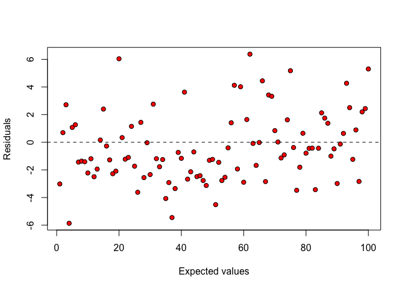
<p class="caption">(\#fig:figName101)Plot of residuals against expected values: there is no visible deviation from basic assumptions for linear model</p>
</div>

<div class="figure" style="text-align: center">
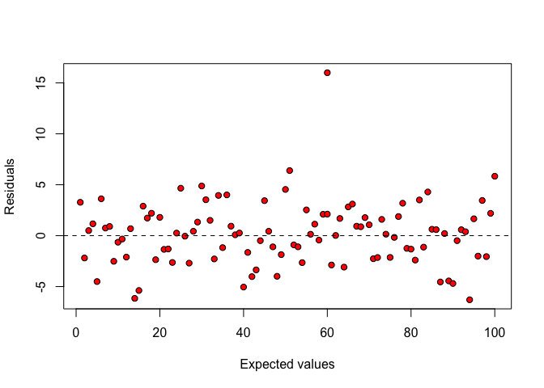
<p class="caption">(\#fig:figName102)Plot of residuals against expected values: an outlying observation is clearly visible</p>
</div>

When the cloud of points takes the form of a 'fennel' (Figure \@ref(fig:figName103)), the variances are proportional to the expected values and, therefore, they are not homogeneous across treatments (**heteroscedasticity**).

In some other cases, the residuals tend to be systematically negative/positive for small expected values and systematically positive/negative for high expected values (Figure \@ref(fig:figName104)). Such a behaviour may be due to some unknown sources of systematic error, which is not accounted for in the deterministic part of the model (**lack of fit**). Such a behaviour is not very common with ANOVA models and we postpone further detail until the final two book chapters.

<div class="figure" style="text-align: center">
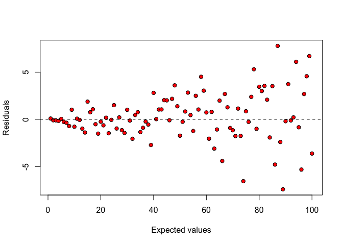
<p class="caption">(\#fig:figName103)Plot of residuals against expected values: heteroscedastic data.</p>
</div>


<div class="figure" style="text-align: center">

<p class="caption">(\#fig:figName104)Plot of residuals against expected values: lack of fit</p>
</div>

### QQ-plot

Plotting the residuals against the expected values let us discover the outliers and gives us evidence of heteroscedastic errors; however, it does not suggest whether the residuals are gaussian distributed or not. Therefore, we need to draw the so-called QQ-plot (quantile-quantile plot), where the standardised residuals are plotted against the respective percentiles of a normal distribution. But, what are the respective percentiles of a gaussian distribution?

I will not go into detail about this (you can find information in my blog, [at this link](https://www.statforbiology.com/2020/stat_general_percentiles/)), but I will give you an example. Let's imagine we have 11 standardised residuals sorted in increasing order: how do we know whether such residuals are drawn from a gaussian distribution? The simplest answer is that we should compare them with 11 values that are, for sure, drawn from a standardised gaussian distribution.

With eleven values, we know that the sixth value is the median (50^th^ percentile), while we can associate to all other values the respective percentage point by using the `ppoints()` function, as shown in the box below:


```r
pval <- ppoints(1:11)
pval
##  [1] 0.04545455 0.13636364 0.22727273 0.31818182 0.40909091 0.50000000
##  [7] 0.59090909 0.68181818 0.77272727 0.86363636 0.95454545
```

We see that the first observation corresponds the 4.5^th^ percentile, the second observation is the 13.63^th^ percentile and so on, until the final observation that is the 95.45^th^ percentile. What are these percentiles in a standardised gaussian distribution? We can calculate them by using the `qnorm()` function:


```r
perc <- qnorm(pval)
perc
##  [1] -1.6906216 -1.0968036 -0.7478586 -0.4727891 -0.2298841  0.0000000
##  [7]  0.2298841  0.4727891  0.7478586  1.0968036  1.6906216
```

If our 11 standardised residuals are gaussian, they should match the behaviour of the respective percentiles in a gaussian population: the central residual should be close to 0, the smallest one should be close to -1.691, the second one should be close to -1.097 and so on. Furthermore, the number of negative values should be approximately equal to the number of positive values and the median should be approximately equal to the mean. 

Hence, if we plot our standardised residuals against the respective percentiles of a standardised gaussian distribution, the points should lie approximately along the diagonal, as shown in Figure \@ref(fig:figName105), for a series of residuals which were randomly sampled from a gaussian distribution.


<div class="figure" style="text-align: center">
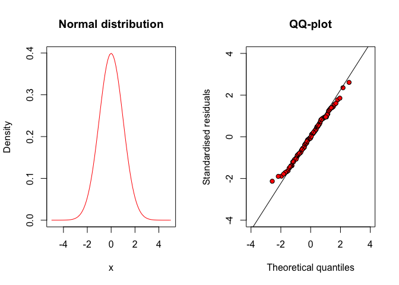
<p class="caption">(\#fig:figName105)QQ-plot for a series of gaussian residuals</p>
</div>

Any deviations from the diagonal suggests that the residuals do not come from a normal distribution, but they come from other distributions with different shapes. For example, we know that the gaussian distribution is symmetric, while residuals might come from a right-skewed distribution (leaning to the left).  In such asymmetric distribution, the mean is higher than the median and negative residuals are more numerous, but lower in absolute value than positive residuals (see Figure \@ref(fig:figName106), left). Therefore, the QQ-plot looks like the one in Figure \@ref(fig:figName106)(right).

<div class="figure" style="text-align: center">
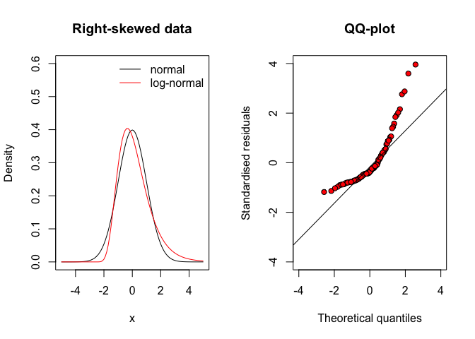
<p class="caption">(\#fig:figName106)QQ-plot for residuals coming from a right-skewed distribution (e.g., shifted log-normal)</p>
</div>

Otherwise, when the residuals come from a left-skewed distribution (asymmetric and leaning to the right), their mean is lower than the median and there are a lot of positive residuals with low absolute values (Figure \@ref(fig:figName107), left). Therefore, the QQ-plot looks like that in Figure \@ref(fig:figName107) (right).

<div class="figure" style="text-align: center">
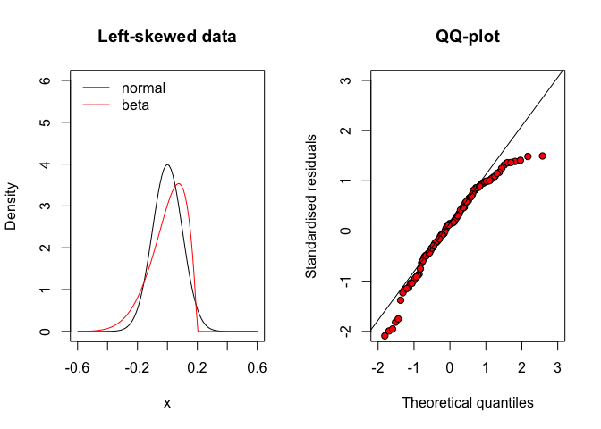
<p class="caption">(\#fig:figName107)QQ-plot for residuals coming from a left-skewed distribution (e.g., a type of beta distribution)</p>
</div>

Apart from symmetry, the deviations from a gaussian distribution may also concern the density in both the tails of the distribution. In this respect, the residuals may come from a platicurtic distribution, where the number of observations far away from the mean (outliers) is rather high, with respect to a gaussian distribution (Figure \@ref(fig:figName108), left). Therefore, the QQ-plot looks like the one in Figure  \@ref(fig:figName108) (right). Otherwise, when the residuals come from a leptocurtic distribution, the number of observations far away from the mean is rather low (see Figure \@ref(fig:figName109) and the QQ-plot looks like that in Figure \@ref(fig:figName109) (right).


<div class="figure" style="text-align: center">
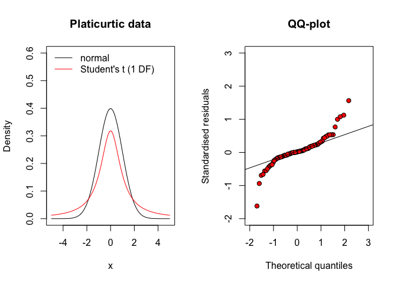
<p class="caption">(\#fig:figName108)QQ-plot for residuals coming from a platicurtic distribution (e.g., the Student's t distribution with few degrees of freedom)</p>
</div>


<div class="figure" style="text-align: center">
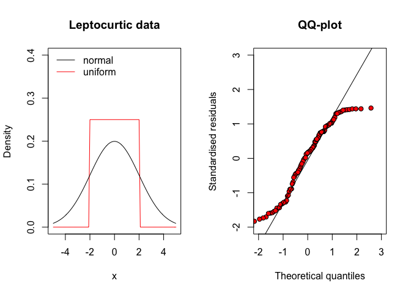
<p class="caption">(\#fig:figName109)QQ-plot for residuals coming from a leptocurtic distribution (e.g., a uniform distribution)</p>
</div>


## Formal hypotesis testing

Graphical methods usually reveal the outliers and the most important deviations from basic assumptions. However, we might be interested in formally testing the hypothesis that there are no deviations from basic assumptions (null hypothesis), by using some appropriate statistic. Nowadays, a very widespread test for variance homogeneity is the Levene's test, which consists of fitting an ANOVA model to the residuals as absolute values. The rationale is that the residuals sum up to zero within each treatment group; if we remove the signs, the residuals become positive, but the group means tend to become higher when the variances are higher. For example, we can take two samples with means equal to zero and variances respectively equal to 1 and 4.


```r
A <- c(0.052, 0.713, 1.94, 0.326, 0.019, -2.168, 0.388,
       -0.217, 0.028, -0.801, -0.281)
B <- c(3.025, -0.82, 1.716, -0.089, -2.566, -1.394,
       0.59, -1.853, -2.069, 3.255, 0.205)
mean(A); mean(B)
## [1] -9.090909e-05
## [1] 6.308085e-17
var(A); var(B)
## [1] 1.000051
## [1] 4.000271
mean(abs(A))
## [1] 0.6302727
mean(abs(B))
## [1] 1.598364
```

Taking the absolute values, the mean for A is 0.63, while the mean for B is 1.60. We see that the second mean is higher than the first, which is a sign that the two variances might not be homogeneous. If we submit to ANOVA the absolute values, the difference between groups is significant, which leads to the rejection of the homoscedasticity assumption. In R, the Levene's test can also be performed by using the `leveneTest()` function in the 'car' package.


```r
res <- c(A, B)
treat <- rep(c("A", "B"), each = 11)
model <- lm(abs(res) ~ factor(treat))
anova(model)
## Analysis of Variance Table
## 
## Response: abs(res)
##               Df  Sum Sq Mean Sq F value Pr(>F)  
## factor(treat)  1  5.1546  5.1546  5.8805 0.0249 *
## Residuals     20 17.5311  0.8766                 
## ---
## Signif. codes:  0 '***' 0.001 '**' 0.01 '*' 0.05 '.' 0.1 ' ' 1
car::leveneTest(res ~ factor(treat), center = mean)
## Levene's Test for Homogeneity of Variance (center = mean)
##       Df F value Pr(>F)  
## group  1  5.8803 0.0249 *
##       20                 
## ---
## Signif. codes:  0 '***' 0.001 '**' 0.01 '*' 0.05 '.' 0.1 ' ' 1
```

The Levene's test can also be performed by considering the medians of groups instead of the means ('center = median'), which gives us a more robust test, i.e. less sensible to possible outliers.

Possible deviances with respect to the gaussian assumption can be tested by using the Shapiro-Wilks' test. For example, taking 100 residuals from a uniform distribution (i.e. a non-gaussian distribution) and submitting them to the Shapiro-Wilks' test, the null hypothesis is rejected with P = 0.0004.


```r
set.seed(1234)
shapiro.test(runif(100, min = -2, max = 2))
## 
## 	Shapiro-Wilk normality test
## 
## data:  runif(100, min = -2, max = 2)
## W = 0.94504, p-value = 0.0003966
```

## What do we do, in practice?

Now, it's time to take a decision: do our data meet the basic assumptions for ANOVA? A wide experience in the field suggests that a decision is hard to take in most situations. Based on experience, our recommendations are:

1. a thorough check of the residuals should never be neglected;
2. be very strict when the data come as counts or ratios: for this type of data the basic assumptions are very rarely met and, therefore, you should consider them as non-normal and heteroscedastic whenever you have even a small sign to support this;
3. be very strict with quantitative data, when the differences between group means are very high (higher than one order of magnitude); for this data, variances are usually proportional to means and heteroscedasticity is the norm and not the exception;
4. for all other data, you can be slightly more liberal, without neglecting visible deviations from basic assumptions.


## Correcting measures

Whenever our checks suggest important deviations from basic assumptions, we are supposed to take correcting measures, otherwise our analyses are invalid. Of course, correcting measures change according to the problem we have found in our data.


### Removing outliers

If we have found an outlier, the simplest correcting strategy is to remove it. However, we should refrain from this behaviour as much as possible, especially when sample size is small. Before removing an outlier we should be reasonably sure that it came as the consequence of some random error or intrusion, without being, anyhow, related to the effect of some treatments.

For example, if we are making a genotype experiment and one of the genotypes is not resistant to a certain fungi disease, in the presence of such disease we might expect that yield variability for the sensible genotypes increases and, therefore, the presence of occasional plots with very low yield levels becomes more likely. In this case, outliers are not independent on the treatment and removing them is wrong, because relevant information is hidden.

In all cases, please, remember that removing data points to produce a statistically significant result is regarded as a terribly bad practice! Furthermore, by definition, outliers should be rare: if the number of outliers is rather high, we should really think about discarding the whole experiment and making a new one.


### Stabilising transformations

After having considered and managed the presence possible outliers, the most traditional method to deal with data that do not conform to the basic assumptions for linear models is to transform the response into a metric that is more amenable to linear model fitting. In particular, the logarithmic transformation is often used for counts and proportions, the square root transformation is also used for counts and the arcsin-square root transformation is very common with proportions.

Instead of making an arbitrary selection, we suggest the procedure proposed by Box and Cox (1964), that is based on the following family of transformations:

$$ W = \left\{ \begin{array}{ll}
\frac{Y^\lambda -1}{\lambda} & \quad \textrm{if} \,\,\, \lambda \neq 0 \\
\log(Y) & \quad \textrm{if} \,\,\, \lambda = 0
\end{array} \right.$$

where $W$ is the transformed variable, $Y$ is the original variable and $\lambda$ is the transformation parameter. We may note that, apart from a linear shift (subtracting 1 and dividing by $\lambda$, which does not change the distribution of data), if $\lambda = 1$ we do not transform at all. If $\lambda = 0.5$ we make a square-root transformation, while if $\lambda = 0$[^note] we make a logarithmic transformation; furthermore, if $\lambda = -1$ we transform into the reciprocal value.

[^note]: Note that the limit of $(Y^\lambda -1)/\lambda$ for $\lambda \rightarrow 0$ is $\log(y)$  

Box and Cox (1964) gave a method to calculate the likelihood of the data under a specific $\lambda$ value, so that we can try several $\lambda$ values and see which one corresponds to the maximum likelihood value. Accordingly, we can select this maximum likelihood $\lambda$ value and use it for our transformation. We'll give an example of such an approach later on.

## Examples with R


## Example 1

First of all, let's check the dataset we have used in the previous chapter ('mixture.csv'). We load the file and re-fit the ANOVA model, by using the 'Weight' as the response and the herbicide treatment 'Treat' as the treatment factor.


```r
repo <- "https://www.casaonofri.it/_datasets/"
file <- "mixture.csv"
pathData <- paste(repo, file, sep = "")

dataset <- read.csv(pathData, header = T)
head(dataset)
##             Treat Weight
## 1 Metribuzin__348  15.20
## 2 Metribuzin__348   4.38
## 3 Metribuzin__348  10.32
## 4 Metribuzin__348   6.80
## 5     Mixture_378   6.14
## 6     Mixture_378   1.95
dataset$Treat <- factor(dataset$Treat)
mod <- lm(Weight ~ Treat, data = dataset)
```

After fitting, we can get the graphical analyses of residuals by using the `plot()` method on the model object; the argument 'which' can be set to 1 or 2: the former value produces a plot of residuals against expected values, while the latter value produces a QQ-plot of residuals. The syntax is as follows:

```
plot(mod, which = 1)
plot(mod, which = 2)
```

The output is shown in Figure \@ref(fig:figName110a).

<div class="figure" style="text-align: center">
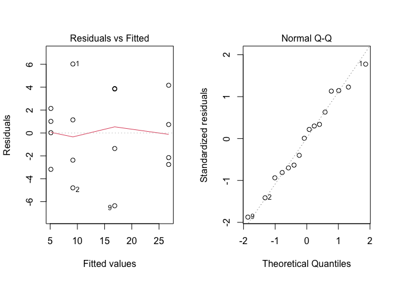
<p class="caption">(\#fig:figName110a)Graphical analyses of residuals for the 'mixture.csv' dataset</p>
</div>

None of the two graphs suggests deviations from the basic assumptions. Considering that we have a quantitative variable with small differences (less than one order of magnitude) between group means, we skip all formal analyses and conclude that we have no reasons to fear about the basic assumptions for linear models.

## Example 2

Let's consider the dataset in the 'insects.csv' file. Fifteen plants were treated with three different insecticides (five plants per insecticide) according to a completely randomised design. A few weeks after the treatment, we counted the eggs of insects over the leaf surface. In the box below we load the dataset and fit an ANOVA model, considering the variables 'Count' as the response and 'Insecticide' as the experimental factor.


```r
file <- "insects.csv"
pathData <- paste(repo, file, sep = "")
dataset <- read.csv(pathData, header = T)
head(dataset)
##   Insecticide Rep Count
## 1          T1   1   448
## 2          T1   2   906
## 3          T1   3   484
## 4          T1   4   477
## 5          T1   5   634
## 6          T2   1   211
mod <- lm(Count ~ Insecticide, data = dataset)
```

Now we plot the residuals, by using the 'plot' method, as shown above, The output is reported in Figure \@ref(fig:figName110).

<div class="figure" style="text-align: center">
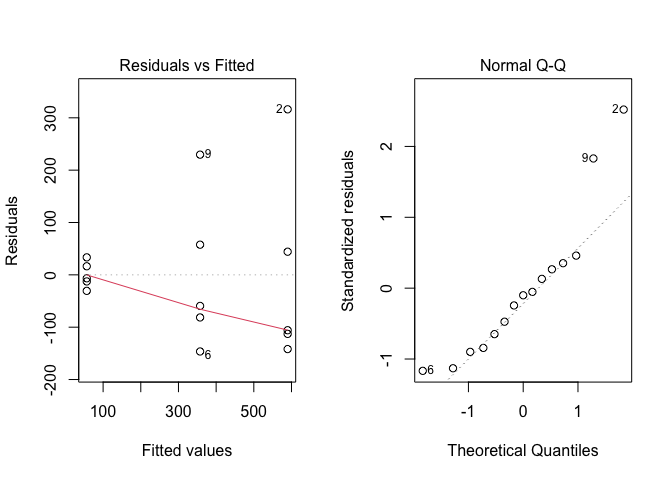
<p class="caption">(\#fig:figName110)Graphical analyses of residuals for the 'insects.csv' dataset</p>
</div>

In this case we see clear signs of heteroscedastic (left plot) and right-skewed residuals (right plot). Furthermore, the fact that we are working with counts encourages a more formal analysis. The Levene's test confirms our fears and permits to reject the null hypothesis of homoscedasticity (P = 0.043). Likewise, the hypothesis of normality is rejected (P = 0.048), by using a Shapiro-Wilks test. The adoption of some correcting measures is, therefore, in order.


```r
car::leveneTest(mod, center = mean )
## Warning in leveneTest.default(y = y, group = group, ...): group
## coerced to factor.
## Levene's Test for Homogeneity of Variance (center = mean)
##       Df F value  Pr(>F)  
## group  2   3.941 0.04834 *
##       12                  
## ---
## Signif. codes:  0 '***' 0.001 '**' 0.01 '*' 0.05 '.' 0.1 ' ' 1
shapiro.test(residuals(mod))
## 
## 	Shapiro-Wilk normality test
## 
## data:  residuals(mod)
## W = 0.87689, p-value = 0.04265
```

We decide to use a stabilising transformation and run the `boxcox()` function to select the maximum likelihood value for $\lambda$; the syntax below results in the output shown in Figure \@ref(fig:figName111).

```
library(MASS)
boxcox(mod)
```


<div class="figure" style="text-align: center">
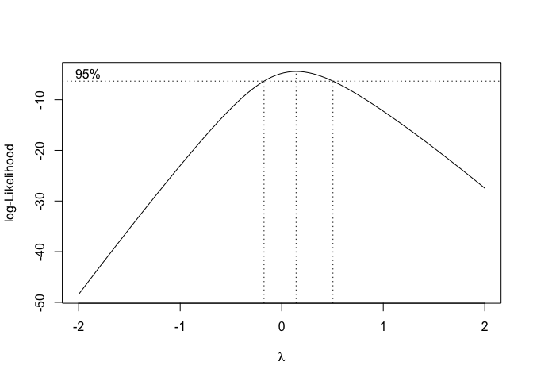
<p class="caption">(\#fig:figName111)Selecting the maximum likelihood value for the transformation parameter lambda, according to Box and Cox (1964)</p>
</div>

The graph shows that the maximum likelihood value is $\lambda = 0.14$, although the confidence limits go from slightly below zero to roughly 0.5. In conclusion, every $\lambda$ value within the interval $-0.1 < \lambda < 0.5$ can be used for the transformation. We select $\lambda = 0$, that corresponds to a logarithmic transformation, which is very widely known and understood.

In practice, we transform the data into their logarithms, re-fit the model and re-analyse the new residuals.


```r
modt <- lm(log(Count) ~ Insecticide, data = dataset)
par(mfrow = c(1,2))
plot(modt, which = 1)
plot(modt, which = 2)
```

<div class="figure" style="text-align: center">
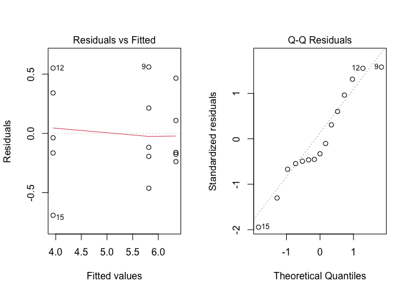
<p class="caption">(\#fig:figName112)Graphical analyses of residuals for the 'insects.csv' dataset, following logarithmic transformation of the response variable</p>
</div>

The situation has sensibly improved and, therefore, we go ahead with the analyses and request the ANOVA table.


```r
anova(modt)
## Analysis of Variance Table
## 
## Response: log(Count)
##             Df  Sum Sq Mean Sq F value    Pr(>F)    
## Insecticide  2 15.8200  7.9100  50.122 1.493e-06 ***
## Residuals   12  1.8938  0.1578                      
## ---
## Signif. codes:  0 '***' 0.001 '**' 0.01 '*' 0.05 '.' 0.1 ' ' 1
```

The above table suggests that there are significant differences among insecticides (P = 1.493e-06). It may be interesting to compare the above output with the output obtained from the analysis of untransformed data:


```r
anova(mod)
## Analysis of Variance Table
## 
## Response: Count
##             Df Sum Sq Mean Sq F value    Pr(>F)    
## Insecticide  2 714654  357327  18.161 0.0002345 ***
## Residuals   12 236105   19675                      
## ---
## Signif. codes:  0 '***' 0.001 '**' 0.01 '*' 0.05 '.' 0.1 ' ' 1
```

Apart from the fact that this latter analysis is wrong, because the basic assumptions of linear models are not respected, we can see that the analysis on transformed data is more powerful, in the sense that it results in a lower P-value. In this example, the null hypothesis is rejected both with transformed and with untransformed data, but in other situations, whenever the P-value is close to the borderline of significance, making a wise selection of the transformation becomes fundamental.


## Other possible approaches

Stabilising transformations were very much in fashion until the '80s of the previous century. At that time, computing power was limiting and widening the field of application for ANOVA models used to be compulsory. Nowadays, R and other software permit the use of alternative methods of data analysis, that allow for non-gaussian errors. These methods belong to the classes of Generalised Linear Models (GLM) and Generalised Linear Least squares models (GLS), which are two very flexible classes of models to deal with non-normal and heteroscedastic residuals. 

In other cases, when we have no hints to understand what type of frequency distribution our residuals are sampled from, we can use nonparametric methods, which make little or no assumptions about the distribution of residuals.

GLM, GLS and non-parametric methods are pretty advanced and they are not considered in this introductory book.

---

## Further readings


1. Ahrens, W. H., D. J. Cox, and G. Budwar. 1990, Use of the arcsin and square root trasformation for subjectively determined percentage data. Weed science 452-458.
2. Anscombe, F. J. and J. W. Tukey. 1963, The examination and analysis of residuals. Technometrics 5: 141-160.
3. Box, G. E. P. and D. R. Cox. 1964, An analysis of transformations. Journal of the Royal Statistical Society, B-26, 211-243, discussion 244-252.
4. D’Elia, A. 2001, Un metodo grafico per la trasformazione di Box-Cox: aspetti esplorativi ed inferenziali. STATISTICA LXI: 630-648.
5. Saskia, R. M. 1992, The Box-Cox transformation technique: a review. Statistician 41: 169-178.
6. Weisberg, S., 2005. Applied linear regression, 3rd ed. John Wiley & Sons Inc. (per il metodo 'delta')

<!--chapter:end:08-Eng_AssunzioniBase.Rmd-->

# Contrasts and multiple comparison testing


*All we know about the world teaches us that the effects of A and B are always different in some decimal place for any A and B. Thus asking "are the effects different?" is foolish (John Tukey)*


In Chapter 7 we have shown how to fit an ANOVA model to the observed data, which is very often the first step of data analysis, with two fundamental aims:

1. determining the variance of the residual (unexplained) effects, that is the basis of statistical inference;
2. test the hypothesis of no treatment effects (test of homogeneity), by using the F-ratio.

In Chapter 8, we sow that, before trusting the results of every linear model fit, we need to make sure that the basic assumptions for linear models are valid, by a thorough inspection of residuals. This is a fundamental step and should never, ever be neglected.

After the inspection of model residuals and after the adoption of possible correcting measures, wherever necessary, the process of data analysis must go ahead. Indeed, rejecting the null hypothesis of no treatment effects implies accepting the alternative, i.e. that there is, at least, one treatment level that produced a significant effect on the experimental units. Such conclusion is important, but it very rarely answers all our research questions; indeed, taking whatever pair of treatments A and B, we might ask:
 
1. is the effect of A different from the effect of B?
2. is A better/worse than B?
3. what is the difference between A and B?

In other words, for any pairs of treatments, we might be willing to assess the existence of significant differences (question 1), their sign (positive/negative; question 2) and their size (**effect size**; question 3). According to the English scientist John Tukey, the first question is 'foolish' as there are no two treatments whose effects can be regarded as totally equal (see the beginning of this Chapter), while the other two questions, particularly the third one, are much more relevant.

In order to ask the above questions, we can apply **linear contrasts** or **Multiple Comparison Procedures** (MCP). We will explore these methods by using the 'mixture.csv' dataset, which we have started analysing in Chapters 7 and 8.

## Back to the 'mixture' example

Let me remind once more that we are dealing with a pot experiment, where we compared four herbicide treatments in terms of their activity against an important weed species (*Solanum nigrum*). The experiment is completely randomised, with four replicates and the observed response is the weight of treated plants in each pot, four weeks after the treatment. One of the four treatments is the untreated control, while the other three treatments consist of two herbicides used either alone or in mixture.

Let's load the data, fit an ANOVA model and get the least squares means, as we did in Chapter 7. In Chapter 8, we have demonstrated that this model is valid and there are no evident deviations from the basic assumptions for linear models.

\vspace{12pt}

```r
repo <- "https://www.casaonofri.it/_datasets/"
file <- "mixture.csv"
pathData <- paste(repo, file, sep = "")
dataset <- read.csv(pathData, header = T)
model <- lm(Weight ~ Treat, data=dataset)

library(emmeans)
treat.means <- emmeans(model, ~Treat)
treat.means
##  Treat           emmean   SE df lower.CL upper.CL
##  Metribuzin__348   9.18 1.96 12     4.91     13.4
##  Mixture_378       5.13 1.96 12     0.86      9.4
##  Rimsulfuron_30   16.86 1.96 12    12.59     21.1
##  Unweeded         26.77 1.96 12    22.50     31.0
## 
## Confidence level used: 0.95
```


## Linear contrasts

In statistics, a **contrast** is a linear combination of means or, more generally, model parameters, where the coefficients add up to zero. In the following example, I have built a linear contrast with the means of our example:

$$k = \frac{1}{3} \cdot 9.18 + \frac{1}{3} \cdot 5.13 + \frac{1}{3} \cdot 16.86 - 1 \cdot 26.77  = -16.385$$


As we see, the sum of coefficients is 0:

$$\frac{1}{3} + \frac{1}{3} + \frac{1}{3} - 1 = 0$$

This contrast has a very clear biological meaning, as it provides an estimate for the difference between the mean weight for treated pots and the mean weight for untreated pots. The result is -16.39; it provides the answers for all the three questions above. Indeed:

1. there is a difference between herbicide treatments (on average) and the untreated control;
2. the difference is negative, meaning that the weight of the weed in treated pots is lower than the weight in untreated pots;
3. the effect size is -16.39 grams per pot.

However, we should never forget that the uncertainty about population means propagates to contrasts. The observed value of -16.39 is a point estimator of the population difference, but we need to quantify the uncertainty by using interval estimation.


### The variance of contrasts

We have already mentioned how the errors propagate when we 'combine' random variables; the basic principle is that the variance of a linear combination of independent estimates is equal to a linear combination of their variances, according to:


$$\textrm{var}(A \mu_1 + B \mu_2) = A ^2 \cdot \textrm{var}(\mu_1)  + B ^2 \cdot \textrm{var}(\mu_2)$$

where A and B are contrast coefficients, $\mu_1$ and $\mu_2$ are the estimates (means, in this case). The standard errors of the four means are equal to 1.9588 and, therefore, the variances are $1.9588^2 = 3.83703$, which are combined as shown below:


$$\textrm{var}(k) = \left( \frac{1}{3} \right)^2 \cdot 3.83703  +  \left( \frac{1}{3}\right)^2 \cdot 3.83703 + \left( \frac{1}{3}  \right)^2 \cdot 3.83703 + \left( - 1 \right)^2 \cdot 3.83703  = 5.11604$$


The standard deviation for the contrast (i.e. the standard error) is:

$$SE(k) = \sqrt{5.11604} = 2.261866$$

Here we go. We have a point estimate for the contrast (-16.4) and a standard error (2.26), which we can use to build a confidence interval, as shown in Chapter 5. However, we might also like to answer the following question: is it possible that the population contrast is 0 (no difference between treated and untreated pots) and the observed value was just due to random sampling fluctuations?

Of course, this is possible: we have already seen that sample-to-sample variation can be rather high. We can translate our question into a null hypothesis:


$$H_0: \kappa = 0$$

we use the greek letter $\kappa$ to refer to the real population value for the contrast, which we estimate by using the observed value $k$. In order to decide whether the null is true, in spite of the observed $k \neq 0$, we should contemporarily consider the estimate and its uncertainty. As we did in a previous chapter, we use the T statistics, i.e. the ratio between the estimate and its standard error:

$$T = \frac{k}{ES(k)} = \frac{-16.385}{2.261866} = -7.244$$
Let's assume that the null is true; the observed T values should 'fluctuate' around 0, by following a Student's t distribution with a number of degrees of freedom equal to that of the residual error in ANOVA. We could empirically see this by using Monte Carlo simulation, but we will not do so, for the sake of brevity.

Therefore, we can use the `pt()` function to find the probability that $t < -7.244$ and $t > 7.244$. We have:


```r
Tval <- -16.385 / 2.261866
2 * pt(Tval, 12, lower.tail = T)
## [1] 1.023001e-05
```

We see that, if the null is true and we repeat the experiment for a high number of times, we have only one possibility out of 100,000 to obtain such a high T, in absolute value. Thus we reject the null and conclude that:

1. on average, herbicide treatments produce a significant effect;
2. such an effects results in the suppression of weed growth (the sign is negative);
3. the difference in weight is -16.385 (SE = 2.26) and the evidence is strong enough to support the conclusion that such a difference, at the population level, is not 0.


### Testing linear contrasts with R

The main challenge for a scientist is to translate research questions into a set of appropriate contrasts. For our example, we might consider the following contrasts:

1. untreated vs. treated (on average)
2. mixture vs. single herbicides (on average)
3. mixture vs. rimsulfuron
4. mixture vs. metribuzin

Writing the above contrasts by hand is very tedious and, thus, we use R. First of all, we need to prepare one vector of coefficients for each contrast. For the first contrast, the vector is as above:


```r
k1 <- c(1/3, 1/3, 1/3, -1)
```

For the other three contrasts, the vectors are:


```r
k2 <- c(1/2, -1, 1/2, 0)
k3 <- c(0, -1, 1, 0)
k4 <- c(1, -1, 0, 0)
```

With these coefficients, we prepare a list:


```r
K <- list(k1, k2, k3, k4)
```

In the end, we use the `contrast()` function in the 'emmeans' package and pass the following arguments:

1. the means, obtained by using the 'emmeans()' function (see above)
2. the list of contrasts, as the 'method' argument
3. the type of adjustment (we will talk about this later, so far, please, simply use the command as shown in the box below)

\small


```r
contrast(treat.means, method = K, adjust="none")
##  contrast                                                     
##  c(0.333333333333333, 0.333333333333333, 0.333333333333333, -1
##  c(0.5, -1, 0.5, 0)                                           
##  c(0, -1, 1, 0)                                               
##  c(1, -1, 0, 0)                                               
##  estimate   SE df t.ratio p.value
##    -16.39 2.26 12  -7.244  <.0001
##      7.89 2.40 12   3.289  0.0065
##     11.73 2.77 12   4.235  0.0012
##      4.05 2.77 12   1.461  0.1697
```

\normalsize

We see that all contrasts are significantly different from zero, except the fourth one.


## Pairwise comparisons

Translating research questions into contrasts may be sort of an art and, very often, it marks the difference between ordinary and excellent papers. However, there are some sets of contrasts that are repeatedly used (and often abused) in several circumstances, such as the so-called *pairwise comparisons*. These contrasts consist of testing the differences between pairs of means, according to two possible situations:

1. all pairwise-comparisons (Tukey's method)
2. comparisons with a control (Dunnett's method)

The first situation implies a very high number of contrasts that is equal to $k = n \times (n - 1) /2$, where $n$ is the number of means. Accordingly, with four means we have six contrasts and, luckily, R provides the predefined list of coefficients, by assigning the value "pairwise" to the argument 'method', as shown below:


\footnotesize


```r
# Pairwise contrasts
contrast(treat.means, adjust="none", method="pairwise")
##  contrast                         estimate   SE df t.ratio p.value
##  Metribuzin__348 - Mixture_378        4.05 2.77 12   1.461  0.1697
##  Metribuzin__348 - Rimsulfuron_30    -7.68 2.77 12  -2.774  0.0168
##  Metribuzin__348 - Unweeded         -17.60 2.77 12  -6.352  <.0001
##  Mixture_378 - Rimsulfuron_30       -11.73 2.77 12  -4.235  0.0012
##  Mixture_378 - Unweeded             -21.64 2.77 12  -7.813  <.0001
##  Rimsulfuron_30 - Unweeded           -9.91 2.77 12  -3.578  0.0038
```
\normalsize

The second situation implies a lower number of contrasts and we can set the 'method' argument to "dunnett". However, we need to be careful, because R compares all means against the first in alphabetical order, which may not be what we are looking for. For example, in our case, we might like to compare all treatments with the herbicide mixture, which is the second in alphabetical order. Therefore, we set the argument 'ref' to 2.

\footnotesize


```r
# Dunnett contrasts
contrast(treat.means, adjust="none", method="dunnett", ref = 2)
##  contrast                      estimate   SE df t.ratio p.value
##  Metribuzin__348 - Mixture_378     4.05 2.77 12   1.461  0.1697
##  Rimsulfuron_30 - Mixture_378     11.73 2.77 12   4.235  0.0012
##  Unweeded - Mixture_378           21.64 2.77 12   7.813  <.0001
```
\normalsize

We may have noted that the above contrasts do not fully answer our questions about the effect sizes; indeed, we have a point estimate with standard error, but we do not have explicit confidence intervals. To get them, we can assign the result of the `contrast()` function to a variable and explore it by using the 'confint' method.


```r
# Confidence intervals
con <- contrast(treat.means, adjust="none", 
                method="dunnett", ref = 2)
confint(con)
##  contrast                      estimate   SE df lower.CL upper.CL
##  Metribuzin__348 - Mixture_378     4.05 2.77 12    -1.99     10.1
##  Rimsulfuron_30 - Mixture_378     11.73 2.77 12     5.70     17.8
##  Unweeded - Mixture_378           21.64 2.77 12    15.61     27.7
## 
## Confidence level used: 0.95
```


## Letter display

We mentioned that effect sizes provide full information about the results of contrasts, by which we can answer all questions above. However, reporting effects sizes for pairwise comparisons with a high number of means may be impractical. Therefore, we can use the so-called **letter display**, that consists of augmenting the table of means with significance letters, so that means followed by different letters are significantly different from each other, for a certain predefined protection level $\alpha$, usually equal to 0.05.

A letter display can be easily added by hand, according to the following procedure:

1. sort the means in increasing/decreasing order
2. start from the uppermost mean and add the A letter to this mean and to all the following means, when the difference with the first one is not significant
3. go on to the second mean and add the B letter to this mean and to all the following means, when the difference with the second one is not significant
4. go on like this, until all means have got their letters

The above procedure works well with balanced experiments, although we might prefer using the more general procedure in R, as implemented in the 'multcomp' package, which we need to install, together with the 'multcompView' package. The function is named `cld()` and requires the means and the method of adjustment (see next section). We also provide a third argument, that is 'Letters = LETTERS' (be careful with the syntax, relating to small and capital letters) to use capital letters display instead of the default number display


```r
multcomp::cld(treat.means, adjust="none", Letters=LETTERS)
##  Treat           emmean   SE df lower.CL upper.CL .group
##  Mixture_378       5.13 1.96 12     0.86      9.4  A    
##  Metribuzin__348   9.18 1.96 12     4.91     13.4  A    
##  Rimsulfuron_30   16.86 1.96 12    12.59     21.1   B   
##  Unweeded         26.77 1.96 12    22.50     31.0    C  
## 
## Confidence level used: 0.95 
## significance level used: alpha = 0.05 
## NOTE: If two or more means share the same grouping symbol,
##       then we cannot show them to be different.
##       But we also did not show them to be the same.
```

The letter display is handy, but it can only answer questions about the significance of differences, while it gives no hints about the direction and size of differences. For this reason, using the letter display is often regarded as a poor practice in the presentation of experimental results. 


## Multiplicity correction

Experiments may involve a very high number of contrasts and, therefore, a high number of hypotheses is simultaneously tested. Let's consider one of those hypotheses and imagine that the null is rejected with $P = 0.04$, which would be the **comparisonwise error rate** ($P_c$), i.e. the probability of wrong rejection. If we have a family of *n* such simultaneous contrasts where the null is always rejected at $P = 0.04$, we could define the probability of wrong rejection for at least one of those hypotheses, the so-called **familywise error rate** ($P_f$). We can get a sense that the familywise error rate is higher than the comparisonwise error rate, especially when $n$ is high.

It is important to know the relationship between $P_c$ and $P_f$. We should consider that the probability of correct rejection for each hypothesis is $1 - P_c$ and, for $n$ hypotheses, the probability of no wrong rejections is $(1 - P_c)^n$ (joint probability of independent events). The probability of having, at least, one wrong rejection (complementary event) is calculated as:

$$P_f = 1 - (1 - P_c)^n$$
What does this mean? In practice, if we have $n = 10$ contrasts, and each one in rejected at $P_c = 0.04$, the probability that we make at least one wrong decision is:


```r
1 - (1 - 0.04)^10
## [1] 0.3351674
```

This is generally known as the **multiplicity problem**: whenever we make a high number of simultaneous inferences, the probability that we make at least one mistake (wrong rejection) is much higher than the error rate for each single test. In some cases, the multiplicity problem can be particularly concerning, for example, when:

1. we want to avoid that one treatment is wrongly excluded from the group of the best ones. In this case, we take the highest ranking treatment and compare it to all the others (Dunnett type contrast); when the number of treatments is high, the probability that at least one treatment is wrongly excluded from the lot of the best ones may be very high;
2. we want to avoid false positives. Wrong rejections are false positives and their number may be high if we do not consider the multiplicity problem;
3. we want to draw conclusions for all the simultaneous set of contrasts. For example, we have used a letter display and want to state that 'treatments followed by different letters are significantly different (P < 0.05)'. In this case, the conclusion relates to the whole set of comparisons and the comparisonwise error rate is clearly invalid.

There is rather a wide consensus in literature that we should always account for the multiplicity problem in our pairwise comparisons, which means that we should take decisions based on the familywise error rate, instead of the comparisonwise error rate. That means that we should reject the null when $P_f < 0.05$ and not when $P_c < 0.05$, which implies that we correct the observed P-value, based on the number of simultaneous inferences.

And, how do we correct? The most natural method is to use the above mentioned relationship between $P_c$ and $P_f$, which is know as the Sidak's correction. In the box below, we perfom this correction either by hand, or by using the appropriate argument to the `contrast()` function in R. Please, remember that, four our example, the number of simultaneous contrasts is six.

\scriptsize


```r
# Correction by hand (six simultaneous contrasts)
con <- contrast(treat.means, method = "pairwise", adjust = "none")
Pc <- as.data.frame(con)[,6]
Pf <- 1 - (1 - Pc)^6
Pf
## [1] 6.722991e-01 9.683462e-02 2.190543e-04 6.923077e-03 2.869757e-05
## [6] 2.255183e-02
# With R
contrast(treat.means, method = "pairwise", adjust = "sidak")
##  contrast                         estimate   SE df t.ratio p.value
##  Metribuzin__348 - Mixture_378        4.05 2.77 12   1.461  0.6723
##  Metribuzin__348 - Rimsulfuron_30    -7.68 2.77 12  -2.774  0.0968
##  Metribuzin__348 - Unweeded         -17.60 2.77 12  -6.352  0.0002
##  Mixture_378 - Rimsulfuron_30       -11.73 2.77 12  -4.235  0.0069
##  Mixture_378 - Unweeded             -21.64 2.77 12  -7.813  <.0001
##  Rimsulfuron_30 - Unweeded           -9.91 2.77 12  -3.578  0.0226
## 
## P value adjustment: sidak method for 6 tests
```

\normalsize

We see that, applying this type of multiplicity correction, the second contrast is no longer significant. An alternative, simpler and much more widespread correction procedure is the so-called Bonferroni's correction, that is based on the following heuristic:

$$\alpha_E = \alpha_C \cdot k$$


```r
Pc * 6
## [1] 1.018071e+00 1.009900e-01 2.190743e-04 6.943132e-03 2.869792e-05
## [6] 2.276671e-02
contrast(treat.means, method = "pairwise", adjust = "bonferroni")
##  contrast                         estimate   SE df t.ratio p.value
##  Metribuzin__348 - Mixture_378        4.05 2.77 12   1.461  1.0000
##  Metribuzin__348 - Rimsulfuron_30    -7.68 2.77 12  -2.774  0.1010
##  Metribuzin__348 - Unweeded         -17.60 2.77 12  -6.352  0.0002
##  Mixture_378 - Rimsulfuron_30       -11.73 2.77 12  -4.235  0.0069
##  Mixture_378 - Unweeded             -21.64 2.77 12  -7.813  <.0001
##  Rimsulfuron_30 - Unweeded           -9.91 2.77 12  -3.578  0.0228
## 
## P value adjustment: bonferroni method for 6 tests
```

Both the procedures, particularly the second one, are rather conservative, in the sense that they do not account for the fact that contrasts are always correlated and, therefore, overestimated $P_f$ values are furnished. Other correcting procedures exist (e.g., Holm, Hochberg, Hommel), but they are all more or less conservative.

In recent times, a group of American scientists has found the way of accounting for the correlation between contrasts, based on the multivariate Student's t distribution (Bretz et al., 2011). Their method is the default one in R and it is incorporated in the `contrast()` function; we simply need to remove the 'correct' argument:

\small


```r
contrast(treat.means, method="pairwise")
##  contrast                         estimate   SE df t.ratio p.value
##  Metribuzin__348 - Mixture_378        4.05 2.77 12   1.461  0.4885
##  Metribuzin__348 - Rimsulfuron_30    -7.68 2.77 12  -2.774  0.0698
##  Metribuzin__348 - Unweeded         -17.60 2.77 12  -6.352  0.0002
##  Mixture_378 - Rimsulfuron_30       -11.73 2.77 12  -4.235  0.0055
##  Mixture_378 - Unweeded             -21.64 2.77 12  -7.813  <.0001
##  Rimsulfuron_30 - Unweeded           -9.91 2.77 12  -3.578  0.0173
## 
## P value adjustment: tukey method for comparing a family of 4 estimates
contrast(treat.means, method="dunnett")
##  contrast                         estimate   SE df t.ratio p.value
##  Mixture_378 - Metribuzin__348       -4.05 2.77 12  -1.461  0.3711
##  Rimsulfuron_30 - Metribuzin__348     7.68 2.77 12   2.774  0.0442
##  Unweeded - Metribuzin__348          17.60 2.77 12   6.352  0.0001
## 
## P value adjustment: dunnettx method for 3 tests
```

\normalsize

Before concluding this part, I would like to put forward the idea that also confidence intervals may be appropriately enlarged to respect familywise error rates. However, we will not explore such an issue in this book.

## Multiple comparisons with transformed data

In the previous chapter, we have seen that, sometimes, we need to transform the data to respect the basic assumptions for linear models. For example, with the 'insects.csv' dataset in the previous chapter we have performed a logarithmic transformation, which we show again here.


```r
repo <- "https://www.casaonofri.it/_datasets/"
file <- "insects.csv"
pathData <- paste(repo, file, sep = "")
dataset <- read.csv(pathData, header = T)
modt <- lm(log(Count) ~ Insecticide, data = dataset)
```

When we use the `emmeans()` function in the 'emmeans' package, we get the means in the logarithmic scale.


```r
library(emmeans)
treatMeans <- emmeans(modt, ~Insecticide)
treatMeans
##  Insecticide emmean    SE df lower.CL upper.CL
##  T1            6.34 0.178 12     5.96     6.73
##  T2            5.81 0.178 12     5.43     6.20
##  T3            3.95 0.178 12     3.56     4.34
## 
## Results are given on the log (not the response) scale. 
## Confidence level used: 0.95
```

In some instances, this may not be a problem, although there might be cases where we seek for the exact number of insect eggs in each leaf. Clearly, such an information is missing in the above analysis.

The best suggestion is to back-transform the above means by using the inverse transformation, e.g.:


$$e^{6.34} = 566.7963$$

Getting the back-trasfomed means for all treatments is easy, by using the `emmeans()` function and setting the 'type' argument to "response", as shown below.


```r
retroMedie <- emmeans(modt, ~Insecticide, 
                      type = "response")
retroMedie
##  Insecticide response     SE df lower.CL upper.CL
##  T1             568.6 101.01 12    386.1    837.3
##  T2             335.1  59.54 12    227.6    493.5
##  T3              51.9   9.22 12     35.2     76.4
## 
## Confidence level used: 0.95 
## Intervals are back-transformed from the log scale
```

What are these back-transformed means? Expectedly, we can see that they are different from the arithmetic means on the original (untrasformed) scale:


```r
emmeans(lm(Count ~ Insecticide, data = dataset), ~Insecticide)
##  Insecticide emmean   SE df lower.CL upper.CL
##  T1           589.8 62.7 12    453.1      726
##  T2           357.4 62.7 12    220.7      494
##  T3            56.6 62.7 12    -80.1      193
## 
## Confidence level used: 0.95
```

Indeed, back-transformed means are lower than arithmetic means and they are regarded as estimators of the medians in the original scale, which are not influenced by the transformation. Indeed, we should think that monotonic transformations do not alter the ordering of observations and, thus, the central value remains the same. Consequently, when we report back-transformed means we are indeed reporting an estimate of the medians of the populations that generated our samples. However, estimating the medians instead of the means may not be a bad idea, considering that the populations are non-normal and might be asymmetric.

Finally, I have to point out that, in practice, things may become more complex if the transformation is not auto-detected, as we have shown before for the logarithmic transformation. For example, a reciprocal transformation is not detected and the back-transformation is not executed.


```r
modt2 <- lm(1/Count ~ Insecticide, data = dataset)
emmeans(modt2, ~Insecticide, type = "response")
##  Insecticide  emmean      SE df lower.CL upper.CL
##  T1          0.00182 0.00279 12 -0.00426  0.00789
##  T2          0.00317 0.00279 12 -0.00291  0.00924
##  T3          0.02120 0.00279 12  0.01513  0.02727
## 
## Confidence level used: 0.95
```

In this case, the transformation can be made prior to fitting the model; next, we need to update the 'reference grid' for the model, specifying what type of transformation we have made (`tran = "inverse"`). Finally, we can pass the updated grid into the `emmeans()` function.


```r
dataset$invCount <- 1/dataset$Count
modt3 <- lm(invCount ~ Insecticide, data = dataset)
updGrid <- update(ref_grid(modt3), tran = "inverse")
emmeans(updGrid, ~Insecticide, type = "response")
##  Insecticide response    SE df lower.CL upper.CL
##  T1             550.9 845.9 12    126.8      Inf
##  T2             315.8 278.0 12    108.2      Inf
##  T3              47.2   6.2 12     36.7       66
## 
## Confidence level used: 0.95 
## Intervals are back-transformed from the inverse scale
```

We can use this method with several functions, such as: "identity", "1/mu^2", "inverse", "reciprocal", "log10", "log2", "asin.sqrt", and "asinh.sqrt".

## What about the traditional MCPs?

We have seen that the best practice to compare means is:

1. express the relevant differences by using contrasts
2. estimate those differences and their standard errors
3. test the null hypothesis that differences are zero and express the result by using familywise error rates.

This process is conceptually different from the traditional multiple comparison procedures, which were very much in fashion before the 90s of the 20th century. MCPs were based on the determination of critical differences: whenever the observed difference was higher than the critical difference it was deemed significant. We can list the following MCPs:

1. Fisher's Least Significant Difference (LSD)
2. Tukey's Honest Significant Difference (HSD)
3. Dunnett's test
4. Duncan's test
5. Newman-Keuls' test
6. Tukey's MCP

For balanced experiments, the Fisher's LSD corresponds to pairwise contrasts with no multiplicity correction, while the Tukey's HSD and Dunnett's test involve the multiplicity correction respectively for all pairwise comparisons and for the comparisons against a control. Therefore, while the Fisher's LSD adopts a comparisonwise error rate, the HSD and Dunnett's test adopt a familywise protection rate.

All the other tests adopt some mechanism by which the critical difference is increased to account for a certain degree of multiplicity, but they do not adopt either a comparisonwise or a familywise error rate. They stay in the middle and, for this reason, their usage should be discouraged, although they are very much used in practice.

## Some practical suggestions

Pairwise contrasts and MCPs have been often abused in previous years and, still today, debates with editors and reviewers are very common. We would like to put forward a few suggestions, which might be useful in the way to scientific publication.

1. It is strongly advised that pairwise contrasts are never used when the experimental treatment is represented by a quantitative series of rates, doses, times or whatever. In this case, asking whether there is a significant difference between the response at different doses may be illogical: indeed, even though we selected a few doses to include in the experiment, we are usually interested in the responses across the whole range of possible doses. In this setting, fitting a response curve is much more respectful of our aims and data (see later, in this book).
2. Consider if you want to control the comparisonwise or the familywise error rate. The former might be preferred when only a few comparisons or contrasts are to be tested, each having a strong biological relevance (single-contrast problems), while the latter should be preferred in the case of a relatively high number of simultaneous tests, especially when an overall conclusion tends to be wrong when at least one single test is wrong.
3. If you just want to control comparisonwise protection rate, do not apply any multiplicity correction. For balanced data, such an approach corresponds to using the Fisher's LSD in the traditional MCP setting.
4. If you want to control the familywise error rate, apply the appropriate multiplicity correcting measure and adjust the P-values accordingly. For balanced data, such an approach corresponds to using the Tukey HSD for all paairwise comparisons and to the Dunnett's test for the comparisons against a control.
5. Do not use Student–Newman–Keuls or Duncans' MRT, because they do not control either the familywise error rate, or the familywise error rate and do not yield a single critical difference for balanced data.


---

## Further readings

1. Hsu, J., 1996. Multiple comparisons. Theory and methods. Chapman and Hall.
2. Bretz, F., T. Hothorn, and P. Westfall. 2002, On Multiple Comparison Procedures in R. R News 2: 14-17.
3. Chew, V. 1976, Comparing treatment means: a compendium. Hortscience, 11(4), 348-357.
4. Cousens, R. 1988, Misinterpretetion of results in weed research through inappropriate use of statistics. Weed Research, 28, 281-289.

<!--chapter:end:09-Eng_ConfrontoMultiplo.Rmd-->

# Multi-way ANOVA models 


*Statisticians, like artists, have the bad habit of falling in love with their models (G. Box)*


In Chapter 7 we showed how we can fit linear models with one categorical predictor and one response variable (one-way ANOVA models). With those models, apart from differences due to the experimental treatments, all units must be completely independent and there should not be any other systematic sources of variability. On the contrary, with the most common experiments laid down as Randomised Complete Blocks (RCBDs) or, less commonly, as Latin Square (LSD), apart from the treatment factor, we also have, respectively, one and two blocking factors, which represent additional sources of systematic variability. Indeed, the block effect produces a more or less relevant increase/decrease in the observed response, with respect to the overall mean; for example, in a field experiment with two blocks, the most fertile one might might produce a yield increase of 1 t/ha, while the other one will produce a corresponding yield decrease of the same amount. Such yield variations will be systematically shared by all plots located in the same block. 

In principle, we should not fit one-way ANOVA models to the data obtained from RCBDs or LSDs; if we do so, the residuals will also contain the block effect ($\pm$ 1 t/ha, in the previous example) and, therefore, those obtained in the same block will be more alike than the residuals obtained in different blocks. Consequently, the basic assumption of independence will no longer be valid; in order to avoid this, we need a new type of models that can account for treatment effects and block effects at the same time.

## Motivating example: a genotype experiment in blocks

Let's consider a field experiment to compare eight winter wheat genotypes, laid down in complete blocks, with three replicates. Each block consists of eight plots, to which genotypes were randomly allocated, one replicate per block; the blocks are laid out one beside the other, following the direction of the fertility gradient, so that plots within each block were as homogeneous as possible. The response variable is the yield, in tons per hectare.

The dataset is available as the 'csv' file 'WinterWheat2002.csv', which can be loaded from an external repository, as shown in the box below.

\vspace{12pt}

```r
repo <- "https://www.casaonofri.it/_datasets/"
file <- "WinterWheat2002.csv"
pathData <- paste(repo, file, sep = "")

dataset <- read.csv(pathData, header = T)
head(dataset)
##   Plot Block Genotype Yield
## 1   57     A COLOSSEO  4.31
## 2   61     B COLOSSEO  4.73
## 3   11     C COLOSSEO  5.64
## 4   60     A    CRESO  3.99
## 5   10     B    CRESO  4.82
## 6   42     C    CRESO  4.17
```

The description of the dataset for each genotype (mean and standard deviation) is left to the reader, as an exercise.


## Model definition

Considering the experimental design, the yield of each plot depends on:

1. the genotype;
2. the block;
3. other random and unknown effects.


Consequently, a linear model can be specified as:

$$ Y_{ij} = \mu + \gamma_i + \alpha_j + \varepsilon_{ij}$$

where $Y_{ij}$ is the yield for the plot in the $i$^th^ block and with the $j$^th^ genotype, $\mu$ is the intercept, $\gamma_i$ is the effect of the $i$^th^ block, $\alpha_j$ is the effect of the $j$^th^ genotype and $\varepsilon$ is the residual plot error, which is assumed as gaussian, with mean equal to 0 and standard deviation equal to $\sigma$. With respect to the one-way ANOVA model, we have the additional block effect, which accounts for the grouping of observations, so that the residuals only 'contain' random and independent effects.

As we did for the one-way ANOVA model, we need to put constraints on $\alpha$ and $\gamma$ values, so that model parameters are estimable. Regardless of the constraint, we have 7 genotype parameters and 2 block parameters to estimate, apart from $\sigma$.

## Model fitting by hand

Normally, the estimation process is done with R, by using the least squares method. For the sake of exercise, we do the calculations by hand, using the method of moments, which is correct whenever the experiment is balanced (same number of replicates for all genotypes). Hand-calculations are similar to those proposed in Chapter 7 and, if you had enough with them, you can safely skip this section and jump to the next one.

For hand-calculations, we prefer to use the sum-to-zero contraint; therefore, $\mu$ is the overall mean, $\alpha_1$ to $\alpha_8$ are the effects of the genotypes, as differences with respect to the overall mean, $\gamma_1$ to $\gamma_3$ are the effects of blocks. Owing to the sum-to-zero constraint, $\alpha_8$ and $\gamma_3$ must obey the following restrictions: $\alpha_8 = -\sum_{i=1}^{7} \alpha_i$ and $\gamma_3 = -\sum_{i=1}^{2} \gamma_i$. 

The initial step is to calculate the overall mean and the means for genotypes and blocks. As usual, we use the `tapply()` function to accomplish this task.

\vspace{12pt}

```r
allMean <- mean(dataset$Yield)
gMeans <- tapply(dataset$Yield, dataset$Genotype, mean)
bMeans <- tapply(dataset$Yield, dataset$Block, mean)
allMean
## [1] 4.424583
gMeans
## COLOSSEO    CRESO   DUILIO   GRAZIA    IRIDE SANCARLO   SIMETO 
## 4.893333 4.326667 4.240000 4.340000 4.963333 4.503333 3.340000 
##    SOLEX 
## 4.790000
bMeans
##       A       B       C 
## 4.20625 4.41500 4.65250
```

Now we can calculate yield differences between the genotype means and the overall mean, so that we obtain the genotype effects $\alpha_i$. We do the same to obtain the block effects, as shown in the box below.

\vspace{12pt}

```r
alpha <- gMeans - allMean
alpha
##    COLOSSEO       CRESO      DUILIO      GRAZIA       IRIDE 
##  0.46875000 -0.09791667 -0.18458333 -0.08458333  0.53875000 
##    SANCARLO      SIMETO       SOLEX 
##  0.07875000 -1.08458333  0.36541667
gamma <- bMeans - allMean
gamma
##            A            B            C 
## -0.218333333 -0.009583333  0.227916667
```

It is useful to sort the dataset by genotypes and blocks and visualise all model parameters in a table; to do so, we need to repeat each genotype effects three times (the number of blocks) and the whole vector of block effects for eight times (the number of genotypes). Lately, we add to the table the expected values ($Y_{E(ij)} = \mu + \gamma_i + \alpha_j$) and the residuals ($\varepsilon_ij = Y_{ij} - Y_{E(ij)}$). The resulting data frame is shown in the box below. 


\vspace{12pt}
\small

```r
alpha <- rep(alpha, each = 3)
gamma <- rep(gamma, 8)
mu <- allMean
YE <- mu + gamma + alpha
epsilon <- dataset$Yield - YE
lmod <- data.frame(dataset, mu, gamma, alpha, 
                   YE, epsilon)
print(lmod, digits = 4)
##    Plot Block Genotype Yield    mu     gamma    alpha    YE  epsilon
## 1    57     A COLOSSEO  4.31 4.425 -0.218333  0.46875 4.675 -0.36500
## 2    61     B COLOSSEO  4.73 4.425 -0.009583  0.46875 4.884 -0.15375
## 3    11     C COLOSSEO  5.64 4.425  0.227917  0.46875 5.121  0.51875
## 4    60     A    CRESO  3.99 4.425 -0.218333 -0.09792 4.108 -0.11833
## 5    10     B    CRESO  4.82 4.425 -0.009583 -0.09792 4.317  0.50292
## 6    42     C    CRESO  4.17 4.425  0.227917 -0.09792 4.555 -0.38458
## 7    29     A   DUILIO  4.24 4.425 -0.218333 -0.18458 4.022  0.21833
## 8    48     B   DUILIO  4.10 4.425 -0.009583 -0.18458 4.230 -0.13042
## 9    81     C   DUILIO  4.38 4.425  0.227917 -0.18458 4.468 -0.08792
## 10   32     A   GRAZIA  4.07 4.425 -0.218333 -0.08458 4.122 -0.05167
## 11   65     B   GRAZIA  4.18 4.425 -0.009583 -0.08458 4.330 -0.15042
## 12   28     C   GRAZIA  4.77 4.425  0.227917 -0.08458 4.568  0.20208
## 13   19     A    IRIDE  5.18 4.425 -0.218333  0.53875 4.745  0.43500
## 14   79     B    IRIDE  4.88 4.425 -0.009583  0.53875 4.954 -0.07375
## 15   55     C    IRIDE  4.83 4.425  0.227917  0.53875 5.191 -0.36125
## 16    5     A SANCARLO  4.34 4.425 -0.218333  0.07875 4.285  0.05500
## 17   37     B SANCARLO  4.41 4.425 -0.009583  0.07875 4.494 -0.08375
## 18   70     C SANCARLO  4.76 4.425  0.227917  0.07875 4.731  0.02875
## 19    2     A   SIMETO  3.03 4.425 -0.218333 -1.08458 3.122 -0.09167
## 20   34     B   SIMETO  3.21 4.425 -0.009583 -1.08458 3.330 -0.12042
## 21   67     C   SIMETO  3.78 4.425  0.227917 -1.08458 3.568  0.21208
## 22   74     A    SOLEX  4.49 4.425 -0.218333  0.36542 4.572 -0.08167
## 23    9     B    SOLEX  4.99 4.425 -0.009583  0.36542 4.780  0.20958
## 24   56     C    SOLEX  4.89 4.425  0.227917  0.36542 5.018 -0.12792
```
\normalsize

From the above data frame, we can calculate all sum of squares; in detail, the residual sum of squares is obtained by squaring and summing up the residuals:

\vspace{12pt}

```r
RSS <- sum( epsilon^2 )
RSS
## [1] 1.450208
```

Likewise, the sum of squares for blocks and genotypes is obtained by squaring and summing up the $\gamma$ and $\alpha$ effects.

\vspace{12pt}

```r
TSS <- sum(alpha ^ 2)
BSS <- sum(gamma ^ 2)
TSS; BSS
## [1] 5.630529
## [1] 0.7976583
```

If we calculate the total deviance for all observations, we can confirm that this was partitioned in three parts: the first one is due to the block effects, the second one is due to the genotype effects and the third one is due to all other unknown sources of variability.

\vspace{12pt}

```r
SS <- sum((dataset$Yield - mu)^2)
SS
## [1] 7.878396
BSS + TSS + RSS
## [1] 7.878396
```

The above hand-calculations should suffice for those who would like to see what happens 'under the hood'. Now, we can go back to model fitting with R.

## Model fitting with R

As shown in Chapter 7, ANOVA models with more than one predictor can be fit by using the `lm()` function and adding the block term along with the treatment term. It is fundamental that the block variable is transformed into a factor variable, otherwise R would consider it as numeric and would fit a regression model, instead of an ANOVA model (see later in this book). This error is very common in the most frequent case where a numeric variable is used to represent the blocks and it is easily spotted by checking the number of degrees of freedom in the final ANOVA table; indeed, if this number does not appear to correspond to our expectations (that is the number of blocks minus one; see below), it may mean that our model definition was wrong. 

In the box below, we also transform the genotype variable into a factor, although this is optional, as the genotypes are represented by a character vector and not by a numeric vector.

\vspace{12pt}

```r
dataset$Block <- factor(dataset$Block)
dataset$Genotype <- factor(dataset$Genotype)

mod <- lm(Yield ~ Block + Genotype, data = dataset)
```

We do not inspect model coefficients, as they are not particularly useful in this instance. However, should you like to do so, you can use the `summary()` method; please, remember that the treatment constraint is used by default in R.

### Model checking

As we have discussed in Chapter 8, once we have got the residuals we should inspect them, searching for possible deviations from basic assumptions. Therefore, we produce a plot of residuals against expected values and a QQ-plot, by using the code below. The output is shown in Figure \@ref(fig:figName121).

\vspace{12pt}
```
par(mfrow=c(1,2))
plot(mod, which = 1)
plot(mod, which = 2)
```

\vspace{12pt}
<div class="figure" style="text-align: center">
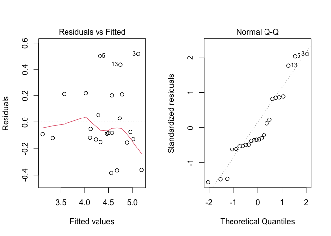
<p class="caption">(\#fig:figName121)Graphical analyses of residuals for the genotype experiment</p>
</div>

From that Figure, we observe that there are some slight signs of heteroscedasticity (see plot on the left side), although the Levene's test is not significant (but it is on the borderline of significance; see the box below). We decide not to address this problem, for the sake of simplicity and based on the unsignificant Levene's test.

\vspace{12pt}

```r
epsilon <- residuals(mod)
anova(lm(abs(epsilon) ~ factor(Genotype), data = dataset))
## Analysis of Variance Table
## 
## Response: abs(epsilon)
##                  Df  Sum Sq  Mean Sq F value  Pr(>F)  
## factor(Genotype)  7 0.24819 0.035455  2.2162 0.08887 .
## Residuals        16 0.25597 0.015998                  
## ---
## Signif. codes:  0 '***' 0.001 '**' 0.01 '*' 0.05 '.' 0.1 ' ' 1
```


### Variance partitioning

Variance partitioning with R is performed by applying the  `anova()` method to the 'lm' object.

\vspace{12pt}

```r
anova(mod)
## Analysis of Variance Table
## 
## Response: Yield
##           Df Sum Sq Mean Sq F value    Pr(>F)    
## Block      2 0.7977 0.39883  3.8502 0.0465178 *  
## Genotype   7 5.6305 0.80436  7.7651 0.0006252 ***
## Residuals 14 1.4502 0.10359                      
## ---
## Signif. codes:  0 '***' 0.001 '**' 0.01 '*' 0.05 '.' 0.1 ' ' 1
```

The sum of squares are the same as those obtained by hand-calculations and they measure the amount of data variability that can be attributed to the different effects. Sum of squares cannot be directly compared, because they are based on different degrees of freedom and, therefore, we calculate the corresponding variances.

The number of Degrees of Freedom (DF) for the block effect is equal to the number of blocks $b$ minus one ($DF_b = b - 1 = 2$), while the number of DF for the genotype effect is equal to the number of genotypes $g$ minus one ($DF_g = g - 1 = 7$). The number of DF for the residual sum of squares is $g \times (b - 1)$ as in Chapter 7 (the number of blocks is equal to the number of replicates is the number of replicates), but we have to subtract $DF_b$, so that we have $DF_r = g \times (b - 1) - (b - 1) = (g - 1) \times (b - 1) = 14$.

The residual mean square is $1.450208/14 = 0.10359$ and, from there, we can get an estimate of $\sigma = \sqrt{0.10359} = 0.3218483$. More easily, we can get $\sigma$ by using the `summary()` method and the '$sigma' extractor.

\vspace{12pt}

```r
summary(mod)$sigma
## [1] 0.3218483
```

Subsequently, we start our inference process by using $\sigma$ to estimate the standard error for a mean (SEM) and the standard error for a difference (SED), which are, respectively, equal to $0.3218483/\sqrt{3} = 0.186$ and $\sqrt{2} \times 0.3218483/\sqrt{3} = 0.263$.

Next, we set our null hypotheses as:

$$H_0: \gamma_1 = \gamma_2 = \gamma_3 = \gamma$$

and:

$$H_0: \alpha_1 = \alpha_2 = ... = \alpha_8 = 0$$

Indeed, for a RCBD, we have two F ratios, with the same denominator (residual mean square) and, respectively, the mean square for blocks and the mean square for genotypes as numerators. Based on those F-ratios, we see that both the nulls can be rejected, as the corresponding P-values are below the 0.05 yardstick. In particular, we are interested about the genotype effect, as we introduced the blocks only to be able to account for possible plot-to-plot fertility differences. Consequently, we only proceed to pairwise comparisons between the genotypes.

Please, note that we have 8 genotypes, implying that we need to test $8 \time 7 / 2 = 27$ pairwise differences, which is enough to justify the adoption of a multiplicity correction.  For the sake of clarity, we report the means and adopt a letter display, where we order the means in decreasing yield order (the best is the one with highest yield), by using the argument 'reverse = T'.

\scriptsize


```r
library(emmeans)
medie <- emmeans(mod, ~factor(Genotype))
multcomp::cld(medie, Letters = LETTERS, reverse = T)
##  Genotype emmean    SE df lower.CL upper.CL .group
##  IRIDE      4.96 0.186 14     4.56     5.36  A    
##  COLOSSEO   4.89 0.186 14     4.49     5.29  A    
##  SOLEX      4.79 0.186 14     4.39     5.19  A    
##  SANCARLO   4.50 0.186 14     4.10     4.90  A    
##  GRAZIA     4.34 0.186 14     3.94     4.74  A    
##  CRESO      4.33 0.186 14     3.93     4.73  A    
##  DUILIO     4.24 0.186 14     3.84     4.64  AB   
##  SIMETO     3.34 0.186 14     2.94     3.74   B   
## 
## Results are averaged over the levels of: Block 
## Confidence level used: 0.95 
## P value adjustment: tukey method for comparing a family of 8 estimates 
## significance level used: alpha = 0.05 
## NOTE: If two or more means share the same grouping symbol,
##       then we cannot show them to be different.
##       But we also did not show them to be the same.
```
\normalsize

The comment of results is left as an exercise.

## Another example: comparing working protocols

In Chapter 2, we introduced an example relating to the evaluation of the time required to accomplish a certain task, by using four different protocols. Four technicians were involved and each one worked with the four methods in different randomised shifts. The protocols were allocated to the different shifts and technicians so that we could have one replicate for each technician and shift. In the end, the dataset consists of one experimental factor (the protocol, with four levels) and two blocking factors (the technician and the shift for each technician). The results are available in the usual online repository.


```r
filePath <- "https://www.casaonofri.it/_datasets/"
fileName <- "Technicians.csv"
file <- paste(filePath, fileName, sep = "")
dataset <- read.csv(file, header=T)
head(dataset)
##   Shift Technician Method Time
## 1     I     Andrew      C   90
## 2    II     Andrew      B   90
## 3   III     Andrew      A   89
## 4    IV     Andrew      D  104
## 5     I       Anna      D   96
## 6    II       Anna      C   91
```

The time required for the task can be described as follows:

$$Y_{ijk} = \mu + \gamma_k + \beta_j + \alpha_i + \varepsilon_{ijk}$$

where $\mu$ is the intercept, $\gamma$ is the effect of the $k$^th^ shift, $\beta$ is the effect of the $j$^th^ technician and $\alpha$ is the effect of the $i$^th^ protocol. The elements $\varepsilon_{ijk}$ represent the individual random sources of experimental error; they are assumed as gaussian, with mean equal to 0 and standard deviation equal to $\sigma$.

For this example, model fitting is performed only with R, by including all blocking effects in the model.


```r
mod <- lm(Time ~ Method + Technician + Shift, data = dataset)
```


From the model fit object we extract the residuals and check for the basic assumptions for linear models, by using the usual `plot()` function. The resulting plots are shown in Figure \@ref(fig:figName122).

<div class="figure" style="text-align: center">
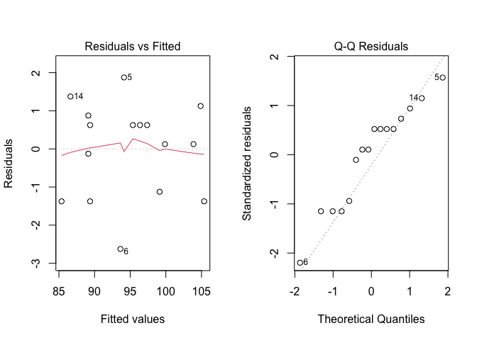
<p class="caption">(\#fig:figName122)Graphical analyses of residuals for a latin square experiment</p>
</div>

We do not see problems of any kind and, therefore, we proceed to variance partitioning, to test the significance of all experimental factors.


```r
anova(mod)
## Analysis of Variance Table
## 
## Response: Time
##            Df Sum Sq Mean Sq F value    Pr(>F)    
## Method      3 145.69  48.563 12.7377 0.0051808 ** 
## Technician  3  17.19   5.729  1.5027 0.3065491    
## Shift       3 467.19 155.729 40.8470 0.0002185 ***
## Residuals   6  22.87   3.812                      
## ---
## Signif. codes:  0 '***' 0.001 '**' 0.01 '*' 0.05 '.' 0.1 ' ' 1
```

The difference between protocols is significant, as well as the difference between shifts, while the technicians did not differ significantly. We might be interested in selecting the best working protocols, which can be done by using pairwise comparisons. I will leave this part to you, as an exercise.

<!--chapter:end:10-Eng_MultiWayANOVAModels.Rmd-->

# Multi-way ANOVA models with interactions


*A theory is just a mathematical model to describe the observations (K. Popper)*


In the previous Chapter we have seen models with more than one explanatory factor, that are used to describe data from Randomised Complete Block Designs and Latin Square designs, where we have one treatment factor and, respectively, one or two blocking factors. Most often, with these designs we have only one value for each combination between the experimental factor and the blocking factor; e.g., there is usually only one observation per treatment in each block in a Randomised Complete Block Design.

In this Chapter, we would like to introduce a new situation, where we have more than one experimental factor and more than one observation for each combination of factor levels. In Chapter 2, we have already seen an example where we compared three tillage levels and two weed control methods in a crossed factorial design and we had four replicates for each combination of tillage and weed control method. In such condition, we can obtain an estimate of the so-called **interaction** between experimental factors, which is a very relevant information. 

## The 'interaction' concept

Let's look at the Figure \@ref(fig:figName131) where we displayed three possible situations, relating to the combinations between the factor A, with two levels (A1 and A2) and the factor B with two levels (B1 and B2). Each symbol represents a combination; e.g., in the left panel we see that the A1B1 combination showed a response equal to 10, while the A2B1 combination showed a response equal to 14. Therefore, passing from A1 to A2 gave an effect of +4 units. Likewise, we see that the yield of A1B2 was 15 and, thus, passing from B1 to B2 gave an effect of +5 units. Accordingly, we can predict the yield of A2B2 by summing up the yield of A1B1, the effact of passing from A1 to A2 and the effect of passing from B1 to B2, i.e. $10 + 4 + 5 = 19$. In this case A and B do not interact to each other and their effects are simply additive.

Now, let's look at the central panel. Passing from A1B1 to A2B1 and passing from A1B1 to A1B2 produced the same effects as in the previous case (respectively +4 and +5 units), but we can no longer predict the response of A2B2, as we see that, while the expected value is 19, the observed value is 16. There must be some effect that hinders the response of this specific combination A2B2 and such an effect is known as the **interaction between the factors A and B** (or 'A $\times$ B' interaction). We can quantify such an interaction effect as $16 - 19 = -3$ units; this is an example of negative interaction, as the observed response is lower than the expected response. Furthermore, this is an example of **simple interaction**, where the expected response is lower, but the ranking of treatments is not affected; indeed, A2 is always higher than A1, regardless of B and B1 is always lower than B2, regardless of A.

If we look at the left panel, we see that the interaction effect is even more dramatic: for A2B2 we observe 9 instead of 19, which means that the interaction is -10 units and it causes the change of ranking: A2 is higher than A1 when B is equal to B1, while the ranking is reversed when B is equal to B2. Whenever the interaction effect modifies the ranking of treatments, we talk about **cross-over interaction**.


<div class="figure" style="text-align: center">

<p class="caption">(\#fig:figName131)Possible relationships between experimental factors</p>
</div>

Why are we so concerned by the interaction? Let's take a further look at the third situation, as seen in the left panel of Figure \@ref(fig:figName131). Table \@ref(tab:tabName131) shows the means for the four combinations (A1B1, A1B2, A2B1, A2B2) that are usually named **cell means**, together with the means for main factor levels (A1, A2, B1 and B2), usually named **marginal means**, and the overall mean.


Table: (\#tab:tabName131)Cross-over interaction between experimental factors

|        |   B1|   B2| Average|
|:-------|----:|----:|-------:|
|A1      | 10.0| 14.0|    12.0|
|A2      | 15.0|  9.0|    12.0|
|Average | 12.5| 11.5|    12.0|

If we look at the marginal means, we would have the wrong impression that factor A is totally ineffective and factor B only gives a minor effect. Indeed, both factors have very wide effects, although they are masked by the presence of a cross-over interaction.

That is why we are so much concerned about possible interactions between the experimental factors: these effects can be highly misleading when we look at the marginal effects of A and B. And this is also why we organise a factorial experiment, instead of making two separate experiments for A and for B.

## Genotype by N interactions

We will use an example relating to a genotype experiment, where 5 winter wheat genotypes were compared at two different nitrogen fertilisation levels, according to a RCBD, with 3 replicates. The aim of such an experiment was to assess whether the ranking of genotypes, and thus genotype recommendation, is affected by N availability. The dataset was generated by Monte Carlo methods, starting from the results reported in Stagnari et al. (2013) and it was cut to five genotypes instead of the original 15 to make the hand-calculations easier.


Yield results are reported in the file 'NGenotype.csv', that is available in the usual online repository. After loading the file we transform the numeric explanatory variables into factors.

\vspace{12pt}

```r
filePath <- "https://www.casaonofri.it/_datasets/"
fileName <- "NGenotype.csv"
file <- paste(filePath, fileName, sep = "")
dataset <- read.csv(file, header=T)
dataset$Block <- factor(dataset$Block)
dataset$N <- factor(dataset$N)
head(dataset, 10)
##    Block Genotype N Yield
## 1      1        A 1 2.146
## 2      2        A 1 2.433
## 3      3        A 1 2.579
## 4      1        A 2 2.362
## 5      2        A 2 2.919
## 6      3        A 2 2.912
## 7      1        B 1 2.935
## 8      2        B 1 2.919
## 9      3        B 1 2.892
## 10     1        B 2 3.241
```


### Model definition

Yield results are determined by four effects:

1. blocks
2. genotypes
3. N levels
4. 'genotype $\times$ N' interaction

Accordingly, a linear model can be written as:


$$Y_{ijk} = \mu + \gamma_k + \alpha_i + \beta_j + \alpha\beta_{ij} + \varepsilon_{ijk}$$


where $\mu$ is the intercept, $\gamma_k$ is the effect of the $k$^th^ block, $\alpha_i$ is the effect of the $i$^th^ genotype, $\beta_j$ is the effect of the $j$^th^ N level and $\alpha\beta_{ij}$ is the interaction effect of the combination between the $i$^th^ genotype and $j$^th^ nitrogen level. The unknown random effects are represented by the residuals $\varepsilon_{ijk}$, which we assume as gaussian distributed and homoscedastic, with mean equal to 0 and standard deviation equal to $\sigma$.

### Model fitting by hand

As in previous chapters, we will show how we can fit an ANOVA model by hand, as this is the best way to understand this technique; you can safely skip this part. if you are only interested in learning how to fit models with a computer.

Model fitting by hand is most easily perfomed by using the sum-to-zero constraint and the method of moments, although I have to remind that this latter method is only valid with balanced data.

First of all, we calculate all means: for blocks, genotypes, N levels and for the combinations between genotypes and nitrogen levels. We use the `tapply()` function, which, for the case of the 'genotype by nitrogen' combinations, returns a matrix.

\vspace{12pt}

```r
mu <- mean(dataset$Yield)
bMean <- tapply(dataset$Yield, dataset$Block, mean)
gMean <- tapply(dataset$Yield, dataset$Genotype, mean)
nMean <- tapply(dataset$Yield, dataset$N, mean)
gnMean <- tapply(dataset$Yield, list(dataset$Genotype,dataset$N), mean)
mu
## [1] 2.901967
bMean
##      1      2      3 
## 2.7997 2.9586 2.9476
gMean
##        A        B        C        D        E 
## 2.558500 3.077333 2.362167 3.151000 3.360833
gnMean
##          1        2
## A 2.386000 2.731000
## B 2.915333 3.239333
## C 2.533333 2.191000
## D 2.956000 3.346000
## E 3.256000 3.465667
```


With the sum-to-zero constraint, the effects are differences of group means with respect to the overall mean. Therefore, we can calculate $\gamma$, $\alpha$ and $\beta$, as follows:

\vspace{12pt}

```r
gamma <- bMean - mu
alpha <- gMean - mu
beta <- nMean - mu
gamma
##           1           2           3 
## -0.10226667  0.05663333  0.04563333
alpha
##          A          B          C          D          E 
## -0.3434667  0.1753667 -0.5398000  0.2490333  0.4588667
beta
##           1           2 
## -0.09263333  0.09263333
```


Now, as the average block effect is constrained to be zero (sum-to-zero contraint), the mean for a 'genotype by nitrogen' combination is equal to:

$$\bar{Y}_{ij.} = \mu + \alpha_i + \beta_j + \alpha\beta_{ij}$$

From there, we obtain the interaction effect as:

$$\alpha\beta_{ij} = \bar{Y}_{ij.} - \mu - \alpha_i - \beta_j$$

that is:

\vspace{12pt}

```r
alphaBeta <- gnMean - mu - matrix(rep(alpha, 2), 5, 2) - 
  matrix(rep(beta, 5), 5, 2, byrow = T)
alphaBeta
##             1           2
## A -0.07986667  0.07986667
## B -0.06936667  0.06936667
## C  0.26380000 -0.26380000
## D -0.10236667  0.10236667
## E -0.01220000  0.01220000
```


For example, the interaction effects for the first combination (genotype A and first nitrogen rate) is $-0.07986667$, while for the second combination (genotype B and first nitrogen rate) the interaction effect is $-0.06936667$. Indeed, both combinations produce less than expected under addivity.

\vspace{12pt}

```r
gnMean - mu - matrix(rep(alpha, 2), 5, 2) - 
  matrix(rep(beta, 5), 5, 2, byrow = T)
##             1           2
## A -0.07986667  0.07986667
## B -0.06936667  0.06936667
## C  0.26380000 -0.26380000
## D -0.10236667  0.10236667
## E -0.01220000  0.01220000
```


With little patience, we can easily complete the calculations by hand and organise them in a summary data frame, together with the expected values (i.e. the sums $\hat{Y}_{ijk} = \mu + \gamma_k + \alpha_i + \beta_j + \alpha\beta_{ij}$) and the residuals (i.e. the differences between the observed and the expected values). You can use the prospect below to check your calculations.

\vspace{12pt}
\scriptsize


\vspace{12pt}

```r
print(tab, digits = 3)
##    Block Genotype N Yield  mu   gamma  alpha    beta alphaBeta
## 1      1        A 1  2.15 2.9 -0.1023 -0.343 -0.0926   -0.0799
## 2      2        A 1  2.43 2.9  0.0566 -0.343 -0.0926   -0.0799
## 3      3        A 1  2.58 2.9  0.0456 -0.343 -0.0926   -0.0799
## 4      1        A 2  2.36 2.9 -0.1023 -0.343  0.0926    0.0799
## 5      2        A 2  2.92 2.9  0.0566 -0.343  0.0926    0.0799
## 6      3        A 2  2.91 2.9  0.0456 -0.343  0.0926    0.0799
## 7      1        B 1  2.94 2.9 -0.1023  0.175 -0.0926   -0.0694
## 8      2        B 1  2.92 2.9  0.0566  0.175 -0.0926   -0.0694
## 9      3        B 1  2.89 2.9  0.0456  0.175 -0.0926   -0.0694
## 10     1        B 2  3.24 2.9 -0.1023  0.175  0.0926    0.0694
## 11     2        B 2  3.30 2.9  0.0566  0.175  0.0926    0.0694
## 12     3        B 2  3.17 2.9  0.0456  0.175  0.0926    0.0694
## 13     1        C 1  2.38 2.9 -0.1023 -0.540 -0.0926    0.2638
## 14     2        C 1  2.53 2.9  0.0566 -0.540 -0.0926    0.2638
## 15     3        C 1  2.69 2.9  0.0456 -0.540 -0.0926    0.2638
## 16     1        C 2  2.30 2.9 -0.1023 -0.540  0.0926   -0.2638
## 17     2        C 2  2.19 2.9  0.0566 -0.540  0.0926   -0.2638
## 18     3        C 2  2.08 2.9  0.0456 -0.540  0.0926   -0.2638
## 19     1        D 1  2.69 2.9 -0.1023  0.249 -0.0926   -0.1024
## 20     2        D 1  3.34 2.9  0.0566  0.249 -0.0926   -0.1024
## 21     3        D 1  2.84 2.9  0.0456  0.249 -0.0926   -0.1024
## 22     1        D 2  3.30 2.9 -0.1023  0.249  0.0926    0.1024
## 23     2        D 2  3.29 2.9  0.0566  0.249  0.0926    0.1024
## 24     3        D 2  3.45 2.9  0.0456  0.249  0.0926    0.1024
## 25     1        E 1  3.24 2.9 -0.1023  0.459 -0.0926   -0.0122
## 26     2        E 1  3.06 2.9  0.0566  0.459 -0.0926   -0.0122
## 27     3        E 1  3.46 2.9  0.0456  0.459 -0.0926   -0.0122
## 28     1        E 2  3.41 2.9 -0.1023  0.459  0.0926    0.0122
## 29     2        E 2  3.60 2.9  0.0566  0.459  0.0926    0.0122
## 30     3        E 2  3.38 2.9  0.0456  0.459  0.0926    0.0122
##    residuals
## 1   -0.13773
## 2   -0.00963
## 3    0.14737
## 4   -0.26673
## 5    0.13137
## 6    0.13537
## 7    0.12193
## 8   -0.05297
## 9   -0.06897
## 10   0.10393
## 11   0.00803
## 12  -0.11197
## 13  -0.05407
## 14  -0.06097
## 15   0.11503
## 16   0.20827
## 17  -0.05663
## 18  -0.15163
## 19  -0.16873
## 20   0.32837
## 21  -0.15963
## 22   0.05527
## 23  -0.11563
## 24   0.06037
## 25   0.08927
## 26  -0.24963
## 27   0.16037
## 28   0.04860
## 29   0.07770
## 30  -0.12630
```

\normalsize


The table above shows all effects and permits the calculation of sum of squares, as the sums of the squared elements in each column. The residual sum of squares is:

\vspace{12pt}

```r
RSS <- sum(tab$residuals ^ 2)
RSS
## [1] 0.5849906
```

while the sum of squares for blocks, genotype, nitrogen and interaction effects are calculated as:

\vspace{12pt}

```r
BSS <- sum(tab$gamma ^ 2)
BSS
## [1] 0.1574821
GSS <- sum(tab$alpha ^ 2)
GSS
## [1] 4.276098
NSS <- sum(tab$beta ^ 2)
NSS
## [1] 0.257428
GNSS <- sum(tab$alphaBeta ^ 2)
GNSS
## [1] 0.5484518
```

Also in this case, we can see that the sum of all the above mentioned sum of squares is equal to the total deviance of all the observations.

\vspace{12pt}

```r
sum((dataset$Yield - mu)^2)
## [1] 5.824451
RSS + GSS + NSS + GNSS
## [1] 5.666969
```

We clearly see that the whole variability of yield has been partitioned in four parts, one is due to the effect of blocks, another one is due to the effect of genotypes, another one is due to the effect of N fertilisation and, finally, the last one is due to all other unknown effects of random nature.

It is no worth to keep on with manual calculations from now on, thus let's switch the computer on.

### Model fitting with R

Model fitting with R is exactly the same as shown in previous chapters: we need to include all effect, as well as the interaction, which is represented by using the colon indicator ':'. Therefore, model syntax is:

\vspace{12pt}
```
Yield ~ Block + Genotype + N + Genotype:N
```

which can be abbreviated as:

\vspace{12pt}
```
Yield ~ Block + Genotype * N
```

The full coding is:

\vspace{12pt}

```r
mod <- lm(Yield ~ Block + Genotype * N, data=dataset)
```

Before, proceeding, we need to perform the usual graphical check of model residuals, that is reported in Figure \@ref(fig:figName133).

\vspace{12pt}
<div class="figure" style="text-align: center">

<p class="caption">(\#fig:figName133)Graphical analyses of residuals for a two-way ANOVA model with replicates</p>
</div>

From the graph, we see no evident deviations from the basic assumptions for linear models: variances do not seem to be dependent on the expected values and the QQ-plot does not show any relevant deviation from the diagonal. Therefore, we proceed to data analyses with no further checks.

With ANOVA models we are not very much interested in parameter estimates and, therefore, we proceed to variance partitioning, by using the `anova()` method.

\vspace{12pt}
\footnotesize

```r
anova(mod)
## Analysis of Variance Table
## 
## Response: Yield
##            Df Sum Sq Mean Sq F value   Pr(>F)    
## Block       2 0.1575 0.07874  2.4228  0.11701    
## Genotype    4 4.2761 1.06902 32.8936 4.72e-08 ***
## N           1 0.2574 0.25743  7.9210  0.01148 *  
## Genotype:N  4 0.5485 0.13711  4.2189  0.01392 *  
## Residuals  18 0.5850 0.03250                     
## ---
## Signif. codes:  0 '***' 0.001 '**' 0.01 '*' 0.05 '.' 0.1 ' ' 1
```
\normalsize

We see that the sum of squares are the same as those obtained by hand-calculations, while the degrees of freedom are easily obtained as the number of blocks/genotypes/N levels minus one. As for the interaction, the number of degrees of freedom is given by the product of the number of genotypes minus one and the number of nitrogen levels minus 1 ($4 \times 1 = 4$). The number of degrees of freedom for the residuals is obtained by subtraction, considering that the total number of degrees of freedom for 30 yield data is 29. Therefore, the residual sum of squares has $29 - 2 - 4 - 1 - 4 = 18$ degrees of freedom.

The variances are obtained by dividing the mean squares for the respective number of degrees of freedom; These variances can be compared with the residual variance by three F ratios, which are, 2.42, 32.9, 7.9 and 4.2, respectively for the blocks, genotypes, N levels and 'genotype by nitrogen' interaction. 

Apart from the block effects, which are uninteresting from a biological point of view, it is relevant to ask whether the other effects are significant. We know that the sampling distribution for the F ratio under the null hypothesis is Fisher-Snedecor, with the appropriate number of degrees of freedom. For example, for the genotype effect, the sampling distribution is Fisher-Snedecor with 4 degrees of freedom at the numerator and 18 degrees of freedom at the denominator. The probability of observing a value of 32.9 or higher under the null hypothesis is:

\vspace{12pt}

```r
pf(32.8936, 4, 18, lower.tail = F)
## [1] 4.720112e-08
```

This is exactly the result reported in the ANOVA table above, together with the P-levels for all other effects.

Reading the P-levels for a two-way ANOVA requires some care and **it is fundamental to proceed from bottom to top**. Indeed, a significant interaction makes the P-level for main effects irrelevant, as their significance may be hidden by the presence of cross-over interaction. We have seen an example of such a situation at the beginning of this Chapter.

### Inferences and standard errors

Standard errors for means and differences are calculated by the usual rule, starting from the residual standard deviation, that is the square root of the residual variance. In R we can use the 'sigma' slot in the 'summary(mod)' object:

\vspace{12pt}

```r
sigma <- summary(mod)$sigma
sigma
## [1] 0.1802761
```

We know that we have to divide the above amount for the square root of the number of replicates, but we have to carefully consider this latter information. Indeed, the combinations of factor levels have three replicates ($r = 3$), but, for each genotype, there is a higher number of replicates, given by the product of $r$ by the number of N levels ($3 \times 2 = 6$). On the other hand, for each N level, we have $r \times 5 = 15$ replicates, where 5 is the number of genotypes (take a look at the dataset to confirm this). Therefore, the SEMs, respectively for genotype means, N level means and the combinations, are:

$$SEM_g = \frac{0.1802761}{\sqrt{3 \cdot 2}} = 0.0736$$


$$SEM_n = \frac{0.1802761}{\sqrt{3 \cdot 5}} = 0.0465$$


$$SEM_{gn} = \frac{1.87}{\sqrt{3}} = 0.104$$

We may note that the means for main effects are estimated with higher precision, owing to the higher number of replicates.

Standard errors for the differences between means can be easily derived by multiplying the SEMs for $\sqrt{2}$ as we have shown in previous Chapters.

### Expected marginal means

In general, with nominal explanatory variables we are interested in presenting and commenting the means. In this case, apart from the blocks, we have three types of means to consider:

1. the marginal means for genotypes
2. the marginal means for N fertilisation levels
3. the cell means for the combinations of genotype and N fertilisation levels

We have already calculated the arithmetic means, although expected marginal means are generally preferable, as they are equal to the arithmetic means when the data is balanced, but they are more reliable than arithmetic means when the data is unbalanced. Expected marginal means can be obtained with the `emmeans()` function in the 'emmeans' package, although we need to be careful in selecting which means to present

As a general rule, for the reasons given above, we recommend that the means for the combinations are always reported in presence of a significant interaction, while the means for main effects can be reported and commented when the interaction is not significant. In the code below we added a letter display, following pairwise comparisons with multiplicity adjustment.

\vspace{12pt}

```r
library(emmeans)
GNmeans <- emmeans(mod, ~Genotype:N)
multcomp::cld(GNmeans, Letters=LETTERS)
##  Genotype N emmean    SE df lower.CL upper.CL .group 
##  C        2   2.19 0.104 18     1.97     2.41  A     
##  A        1   2.39 0.104 18     2.17     2.60  AB    
##  C        1   2.53 0.104 18     2.31     2.75  ABC   
##  A        2   2.73 0.104 18     2.51     2.95   BCD  
##  B        1   2.92 0.104 18     2.70     3.13    CDE 
##  D        1   2.96 0.104 18     2.74     3.17    CDEF
##  B        2   3.24 0.104 18     3.02     3.46     DEF
##  E        1   3.26 0.104 18     3.04     3.47     DEF
##  D        2   3.35 0.104 18     3.13     3.56      EF
##  E        2   3.47 0.104 18     3.25     3.68       F
## 
## Results are averaged over the levels of: Block 
## Confidence level used: 0.95 
## P value adjustment: tukey method for comparing a family of 10 estimates 
## significance level used: alpha = 0.05 
## NOTE: If two or more means share the same grouping symbol,
##       then we cannot show them to be different.
##       But we also did not show them to be the same.
```

In the above output, multiplicity correction has been made for $10 \time 9 / 2 = 45$ comparisons. If we were only interested in comparing, e.g., the genotypes within each N level, we would have a lower number of comparisons ($5 \times 4/2 \times 2 = 20$) and, consequently, we would need a lower degree of multiplicity correction. We can specify such an analysis by using the following code (please note the use of the nesting operator '|').

\vspace{12pt}

```r
GNmeans2 <- emmeans(mod, ~Genotype|N)
multcomp::cld(GNmeans2, Letters=LETTERS)
## N = 1:
##  Genotype emmean    SE df lower.CL upper.CL .group
##  A          2.39 0.104 18     2.17     2.60  A    
##  C          2.53 0.104 18     2.31     2.75  AB   
##  B          2.92 0.104 18     2.70     3.13   BC  
##  D          2.96 0.104 18     2.74     3.17   BC  
##  E          3.26 0.104 18     3.04     3.47    C  
## 
## N = 2:
##  Genotype emmean    SE df lower.CL upper.CL .group
##  C          2.19 0.104 18     1.97     2.41  A    
##  A          2.73 0.104 18     2.51     2.95   B   
##  B          3.24 0.104 18     3.02     3.46    C  
##  D          3.35 0.104 18     3.13     3.56    C  
##  E          3.47 0.104 18     3.25     3.68    C  
## 
## Results are averaged over the levels of: Block 
## Confidence level used: 0.95 
## P value adjustment: tukey method for comparing a family of 5 estimates 
## significance level used: alpha = 0.05 
## NOTE: If two or more means share the same grouping symbol,
##       then we cannot show them to be different.
##       But we also did not show them to be the same.
```

From the table above, we note that the ranking of genotypes is strongly dependent on N fertilisation (C is better than A with N = 2, while it is not significantly different with A = 1), which is explained by the presence of cross-over interaction.


## Nested effects: maize crosses

In the previous example the factorial design was fully crossed, as the genotypes were the same for both N fertilisation levels. In plant breeding, it is fairly common to find nested designs, where the levels of one factor change depending on the levels of the other factor. For example, we could take three maize pollinating inbreds (A1, A2 and A3) and cross them with three female inbred lines (B1, B2 and B3 crossed with A1, B4, B5 and B6 crossed with A2 and B7, B8 and B9 crossed with A3). In the end, we harvest the yield of nine hybrids in three groups, depending on the pollinating line.

The dataset 'crosses.csv' reports the results of a similar experiments, designed as complete blocks with 4 replicates (36 values, in total) and online available, in the usual web repository.


\vspace{12pt}

```r
dataset <- read.csv("https://www.casaonofri.it/_datasets/crosses.csv", header=T)
head(dataset, 15)
##    Male Female Block     Yield
## 1    A1     B1     1  9.984718
## 2    A1     B1     2 13.932663
## 3    A1     B1     3 12.201312
## 4    A1     B1     4  1.916661
## 5    A1     B2     1  8.928465
## 6    A1     B2     2 10.513908
## 7    A1     B2     3 10.035964
## 8    A1     B2     4  2.375822
## 9    A1     B3     1 21.511028
## 10   A1     B3     2 21.859852
## 11   A1     B3     3 17.626284
## 12   A1     B3     4 13.966646
## 13   A2     B4     1 17.483089
## 14   A2     B4     2 19.480893
## 15   A2     B4     3 12.838792
```


### Model definition

In this experiment, the yield variation can be described as a function of the blocks ($\gamma$) and 'father' effect ($\alpha$), while 'mother' effect ($\delta$) can only be determined within each male line, as the female lines are different for each male line. In other words, the 'mother' effect is nested within the 'father' effect, as shown in Figure  \@ref(fig:figNameA3113). The linear model is as follows:

$$Y_{ijk} = \mu + \gamma_k + \alpha_i + \delta_{ij} + \varepsilon_{ijk}$$

where $\gamma_k$ is the block effect ($k$ goes from 1 to 4), $\alpha_i$ is the 'father' effect ($i$ goes from 1 to 3) and $\delta_{ij}$ is the 'mother' effect ($j$ goes from 1 to 9) within each male line $i$. The random component $\varepsilon$ is assumed as gaussian and homoscedastic, with mean equal to 0 and standard deviation equal to $\sigma$.

Hopefully, the difference from the above model and a model for a two-way factorial design is clear: while this latter model contains the two main effects A and B and their interaction A:B, a model for a nested design contains only the main effect for A and the effect of B within A (A/B), while the main effect B is missing, as it does not exist, in practice.


<div class="figure" style="text-align: center">

<p class="caption">(\#fig:figNameA3113)Structure for a nested design</p>
</div>


### Parameter estimation

In this case, we use R for the estimation of model parameters; as shown below, the model formula does not contain the main female effect.

\vspace{12pt}
\scriptsize

```r
mod <- lm(Yield ~ factor(Block) + Male + Male/Female, data = dataset)
```
\normalsize

As usual, before proceedin,g we inspect the residuals, by using the `plot()` method. The Figure \@ref(fig:figName137) shows no visible problems with basic assumptions and, therefore, we proceed to variance partitioning.

<div class="figure" style="text-align: center">

<p class="caption">(\#fig:figName137)Graphical analyses of residuals for a two-way nested ANOVA model with replicates</p>
</div>

\vspace{12pt}

```r
anova(mod)
## Analysis of Variance Table
## 
## Response: Yield
##               Df Sum Sq Mean Sq F value    Pr(>F)    
## factor(Block)  3 383.75 127.917  44.355 6.051e-10 ***
## Male           2 134.76  67.378  23.363 2.331e-06 ***
## Male:Female    6 575.16  95.860  33.239 1.742e-10 ***
## Residuals     24  69.21   2.884                      
## ---
## Signif. codes:  0 '***' 0.001 '**' 0.01 '*' 0.05 '.' 0.1 ' ' 1
```

From the ANOVA table we see that all effects are significant; as before, we should read the ANOVA table from bottom up and we should consider that the main affect of 'father' is relatively unimportant, as the three lines are mated to different female lines.

We can use the function 'emmeans()' to calculate the expected marginal means and compare them.

\vspace{12pt}

```r
library(emmeans)
mfMeans <- emmeans(mod, ~Female|Male)
multcomp::cld(mfMeans, Letters = LETTERS)
## Male = A1:
##  Female emmean    SE df lower.CL upper.CL .group
##  B2       7.96 0.849 24     6.21     9.72  A    
##  B1       9.51 0.849 24     7.76    11.26  A    
##  B3      18.74 0.849 24    16.99    20.49   B   
## 
## Male = A2:
##  Female emmean    SE df lower.CL upper.CL .group
##  B6       8.72 0.849 24     6.97    10.47  A    
##  B5      11.23 0.849 24     9.48    12.98  AB   
##  B4      15.18 0.849 24    13.43    16.93   B   
## 
## Male = A3:
##  Female emmean    SE df lower.CL upper.CL .group
##  B9      10.11 0.849 24     8.35    11.86  A    
##  B8      17.73 0.849 24    15.97    19.48   B   
##  B7      20.12 0.849 24    18.36    21.87   B   
## 
## Results are averaged over the levels of: Block 
## Confidence level used: 0.95 
## Results are averaged over some or all of the levels of: Block 
## P value adjustment: tukey method for comparing a family of 9 estimates 
## significance level used: alpha = 0.05 
## NOTE: If two or more means share the same grouping symbol,
##       then we cannot show them to be different.
##       But we also did not show them to be the same.
```

In conclusion, we see that the analyses of nested factorial experiments is almost the same as for fully crossed factorial experiments, with the only exception that the main effect for the 'within' factor is not included in the model.

Before concluding, we need to point out that, for a plant breeder, most often the interest is not to assess the significance of effects in ANOVA, but to evaluate the effects of male and female lines on yield variability and determine the so-called **variance components**, that are necessary to assess the heritability of the traits under investigation. We will not address this aspect here and refer the reader to the available literature.

---

## Further readings

1. Stagnari, F., Onofri, A., Codianni, P., Pisante, M., 2013. Durum wheat varieties in N-deficient environments and organic farming: a comparison of yield, quality and stability performances. Plant Breeding 132, 266–275.


<!--chapter:end:11-Eng_AnovaDueLivelli.Rmd-->

# Simple linear regression


*Regression analysis is the hydrogen bomb of the statistics arsenal (C. Wheelan)*


In the previous chapters we have presented several ANOVA models to describe the results of experiments characterised by one or more explanatory factors, in the form of nominal variables. We gave ample space to these models because they are widely used in agriculture research and plant breeding, where the aim is, most often, to compare genotypes. However, experiments are often planned to study the effect of quantitative variables, such as a sequence of doses, time elapsed from an event, the density of seeds and so on. In these cases, factor levels represent quantities and the interest is to describe the whole range of responses, beyond the levels that were actually included in the experimental design.

In those conditions, ANOVA models do not fully respect the dataset characteristics, as they concentrate exclusively on the responses to the selected levels for the factors under investigation. Therefore, we need another class of models, usually known as **regression models**, which we will introduce in these two final chapters.


## Case-study: N fertilisation in wheat

It may be important to state that this is not a real dataset, but it was generated by using Monte Carlo simulation, at the end of Chapter 4. It refers to an experiment aimed at assessing the effect of nitrogen fertilisation on wheat yield and designed with four N doses and four replicates, according to a completely randomised lay-out. The results are reported in Table \@ref(tab:tabName141) and they can be loaded into R from the usual repository, as shown in the box below.


```r
filePath <- "https://www.casaonofri.it/_datasets/"
fileName <- "NWheat.csv"
file <- paste(filePath, fileName, sep = "")
dataset <- read.csv(file, header=T)
```


```
## 
## Attaching package: 'reshape'
## The following object is masked from 'package:dplyr':
## 
##     rename
```


Table: (\#tab:tabName141)Dataset relativo ad una prova di concimazione azotata su frumento

| Dose|     1|     2|     3|     4|
|----:|-----:|-----:|-----:|-----:|
|    0| 21.98| 25.69| 27.71| 19.14|
|   60| 35.07| 35.27| 32.56| 32.63|
|  120| 41.59| 40.77| 41.81| 40.50|
|  180| 50.06| 52.16| 54.40| 51.72|

## Preliminary analysis

Looking at this dataset, we note that it has a similar structure as the dataset proposed in Chapter 7, relating to the one-way ANOVA model. The only difference is that, in this example, the explanatory variable is quantitative, instead of nominal. However, as the first step, it may be useful to forget this characteristic and regard the doses as if they were nominal classes. Therefore, we start by fitting an ANOVA model to this dataset.


```r
modelAov <- lm(Yield ~ factor(Dose), data = dataset)
```

As usual, we inspect the residuals for the basic assumptions for linear models; the graphs at Figure \@ref(fig:figName141) do not show any relevant deviation and, therefore, we proceed to variance partitioning.

<div class="figure" style="text-align: center">

<p class="caption">(\#fig:figName141)Graphical analyses of residuals for a N-fertilisation experiment</p>
</div>


```r
anova(modelAov)
## Analysis of Variance Table
## 
## Response: Yield
##              Df  Sum Sq Mean Sq F value    Pr(>F)    
## factor(Dose)  3 1725.96  575.32  112.77 4.668e-09 ***
## Residuals    12   61.22    5.10                      
## ---
## Signif. codes:  0 '***' 0.001 '**' 0.01 '*' 0.05 '.' 0.1 ' ' 1
```


We see that the treatment effect is significant and the residual standard deviation $\sigma$ is equal to $\sqrt{5.10} = 2.258$. This is a good estimate of the so-called **pure error**, measuring the variability between the replicates for each treatment.

In contrast to what we have done in previous chapters, we do not proceed to contrasts and multiple comparison procedures. It would make no sense to compare, e.g., the yield response at 60 kg N ha^-1^ with that at 120 kg N ha ^-1^; indeed, we are not specifically interested in those two doses, but we are interested in the whole range of responses, from 0 to 180 kg N ha^-1^. We just selected four rates to cover that interval, but we could have as well selected four different doses, e.g. 0, 55, 125 and 180 kg N ha^-1^. As we are interested in the whole range of responses, our best option is to fit a regression model, where the dose is regarded as a numeric variabile, which can take all values from 0 to 180 kg N ha^-1^.

## Definition of a linear model

In this case, we have generated the response by using Monte Carlo simulation and we know that this is linear, within the range from 0 to 180 kg N ha^-1^. In practice, the regression function is selected according to biological realism and simplicity, keeping into account the shape of the observed response. A linear regression model is:

$$Y_i = b_0 + b_1 X_i + \varepsilon_i$$

where $Y_i$ is the yield in the $i$^t^h plot, treated with a N rate of $X_i$, $b_0$ is the intercept (yield level at N = 0) and $b_1$ is the slope, i.e. the yield increase for 1-unit increase in N dose. The stochastic component $\varepsilon$ is assumed as homoscedastic and gaussian, with mean equal to 0 and standard deviation equal to $\sigma$.


## Parameter estimation

In general, we know that parameter estimates for linear models are obtained by using the method of least squares, i.e., by selecting the values that result in the smallest sum of squared residuals. However, for our hand-calculations with ANOVA models, we could use the method of moments, which is very simple and based on means and differences among means. Unfortunately, such a simple method cannot be used for regression models and we have to resort to the general least squares method.

Intuitively, applying this method is rather easy: we need to select the straight line that is the closest to the observed responses. In order to find a algebraic solution, we write the least squares function LS and make some slight mathematical manipulation:


$$\begin{array}{l}
LS = \sum\limits_{i = }^N {\left( {{Y_i} - \hat Y_i} \right)^2 = \sum\limits_{i = }^N {{{\left( {{Y_i} - {b_0} - {b_1}{X_i}} \right)}^2}}  = } \\
 = \sum\limits_{i = }^N {\left( {Y_i^2 + b_0^2 + b_1^2X_i^2 - 2{Y_i}{b_0} - 2{Y_i}{b_1}{X_i} + 2{b_0}{b_1}{X_i}} \right)}  = \\
 = \sum\limits_{i = }^N {Y_i^2 + Nb_0^2 + b_1^2\sum\limits_{i = }^N {X_i^2 - 2{b_0}\sum\limits_{i = }^N {Y_i^2 - 2{b_1}\sum\limits_{i = }^N {{X_i}{Y_i} + } } } } 2{b_0}{b_1}\sum\limits_{i = }^N {{X_i}} 
\end{array} $$

where $\hat{Y_i}$ is the expected value (i.e. $\hat{Y_i} = b_0 + b_1 X$). Now, we have to find the values of $b_0$ and $b_1$ that result in the minimum value of LS. You may remember from high school that a minimisation problem can be solved by setting the first derivative to zero. In this case, we have two unknown quantities $b_0$ and $b_1$, thus we have two partial derivatives, which we can set to zero. By doing so, we get to the following estimating functions:


$${b_1} = \frac{{\sum\limits_{i = 1}^N {\left[ {\left( {{X_i} - {\mu _X}} \right)\left( {{Y_i} - {\mu _Y}} \right)} \right]} }}{{\sum\limits_{i = 1}^N {{{\left( {{X_i} - {\mu _X}} \right)}^2}} }}$$

and:

$${b_0} = {\mu _Y} - {b_1}{\mu _X}$$

The hand-calculations, with R, lead to:


```r
X <- dataset$Dose
Y <- dataset$Yield
muX <- mean(X)
muY <- mean(Y)
b1 <- sum((X - muX)*(Y - muY))/sum((X - muX)^2)
b0 <- muY - b1*muX
b0; b1
## [1] 23.79375
## [1] 0.1544167
```

Hand-calculations look rather outdated, today: we would better fit the model by using the usual `lm()` function and the `summary()` method. Please, note that we use the 'Dose' vector as such, without transforming it into a factor:


```r
modelReg <- lm(Yield ~ Dose, data = dataset)
summary(modelReg)
## 
## Call:
## lm(formula = Yield ~ Dose, data = dataset)
## 
## Residuals:
##     Min      1Q  Median      3Q     Max 
## -4.6537 -1.5350 -0.4637  1.9250  3.9163 
## 
## Coefficients:
##              Estimate Std. Error t value Pr(>|t|)    
## (Intercept) 23.793750   0.937906   25.37 4.19e-13 ***
## Dose         0.154417   0.008356   18.48 3.13e-11 ***
## ---
## Signif. codes:  0 '***' 0.001 '**' 0.01 '*' 0.05 '.' 0.1 ' ' 1
## 
## Residual standard error: 2.242 on 14 degrees of freedom
## Multiple R-squared:  0.9606,	Adjusted R-squared:  0.9578 
## F-statistic: 341.5 on 1 and 14 DF,  p-value: 3.129e-11
```

Now, we know that, on average, we can expect that the relationship between wheat yield and N fertilisation dose can be described by using the following model:

$$\hat{Y_i} = 23.794 + 0.154 \times X_i$$

However, we also know that the observed response will not follow the above function, because of the stochastic element $\varepsilon_i$, which is regarded as gaussian and homoscedastic, with mean equal 0 and standard deviation equal to 2.242 (see the residual standard error in the output above).

Are we sure that the above model provides a good description of our dataset? Let's investigate this issue.


## Goodness of fit

Regression models need to be inspected with some further attention with respect to ANOVA models. Indeed, we do not only need to verify that the residuals are gaussian and homoscedastic, we also need to carefully verify that model predictions closely follow the observed data (**goodness of fit**).

The inspection of residuals can be done using the same graphical techniques, as shown for ANOVA models (plot of residuals against expected values and QQ-plot of standardised residuals). In this case, we have already made such inspections with the corresponding ANOVA model and we do not need to do them again with this regression model. However, we need to prove that the linear model provides a good fit to the observed data, which we can accomplish by using several methods.

### Graphical evaluation

The first and easiest method to check the goodness of fit is to plot the data along with model predictions, as shown in Figure \@ref(fig:figName142). Do we see any deviations from linearity? Clearly, the fitted model provides a good description of the observed data.

<div class="figure" style="text-align: center">

<p class="caption">(\#fig:figName142)Response of wheat yield to N fertilisation: the symbols show the observed data, the dashed line shows the fitted model</p>
</div>


### Standard errors for parameter estimates

In some cases, looking at the standard error for the estimated parameters may help evaluate whether the fitted model is reasonable. For example, in this case, we might ask ourselves whether the regression line is horizontal, which would mean that wheat yield is not related to N fertilisation. A horizontal line has slope equal to 0, while $b_1$ was 0.154; however, we also know that $b_1$ is our best guess for the population slope $\beta_1$ (do not forget that we have observed a sample, but we are interested in the population). Is it possible that the population slope $\beta_1$ is, indeed, zero?

If we remember the content of Chapter 5, we can build confidence intervals around an estimate by taking (approximately) twice the standard error. Consequently, the approximate confidence interval for the slope is 0.137705 - 0.171129 and we see that such an interval does not contain 0, which is, therefore, a very unlikely value. This supports the idea that the observed response is, indeed, a linear function of the predictor and that there is no relevant lack of fit.

More formally, we can test the hypothesis $H_0: \beta_1 = 0$ based on the usual T ratio between an estimate and its standard error:

$$T = \frac{b_1}{SE(b_1)} = \frac{0.154417}{0.008356} = 18.48$$

If the null is true, the sampling distribution for T is a Student's t, with 14 degrees of freedom. Thus we see that we have obtained a very unlikely T value and the P-value is:


```r
2 * pt(0.154417/0.008356, 14, lower.tail = F)
## [1] 3.131456e-11
```

Therefore, we can reject the null and conclude that $\beta_1 \ne 0$. The t-test for model parameters is reported in the output of the `summary()` method (see above).

### F test for lack of fit

Another formal test is based on comparing the fit of the ANOVA model above (where the dose was regarded as a nominal factor) and the regression model. The residual sum of squares for the ANOVA model is 61.22, while that for the regression model is 70.37 (see the box below).


```r
anova(modelReg)
## Analysis of Variance Table
## 
## Response: Yield
##           Df  Sum Sq Mean Sq F value    Pr(>F)    
## Dose       1 1716.80 1716.80  341.54 3.129e-11 ***
## Residuals 14   70.37    5.03                      
## ---
## Signif. codes:  0 '***' 0.001 '**' 0.01 '*' 0.05 '.' 0.1 ' ' 1
```

Indeed, the ANOVA model appears to provide a better description of the experimental data, which is expected, as the residuals contain only the so-called pure error, i.e. the variability of each value around the group mean. On the other hand, the residuals from the regression model contain an additional component, represented by the distances from group means to the regression line. Such a component is the so-called **lack of fit** (LF) and it may be estimated as the following difference:

$$\textrm{LF} = 70.37 - 61.22 = 9.15$$

It is perfectly logic to ask ourselves whether the lack of fit component is bigger than the pure error component. We know that we can compare variances based on an F ratio; in this case the number of  degrees of freedom for the residuals is 14 for the regression model (16 values minus 2 estimated parameters) and 12 for the ANOVA model (3 $\times$ 4). Consequently, the lack of fit component has 2 degrees of freedom (14 - 12 = 2). The F ratio for lack of fit is:

$$F_{LF} = \frac{ \frac{RSS_r - RSS_a}{DF_r - DF_a} } {\frac{RSS_a}{DF_a}} = \frac{9.15 / 2}{61.22/12} = 0.896$$

where RSS~r~ is the residual sum of squares for regression, with DF~r~ degrees of freedom and RSS~a~ is the residual sum of squares for ANOVA, with DF~a~ degrees of freedom. More quickly, with R we can use the `anova()` method, passing both models as arguments:


```r
anova(modelReg, modelAov)
## Analysis of Variance Table
## 
## Model 1: Yield ~ Dose
## Model 2: Yield ~ factor(Dose)
##   Res.Df    RSS Df Sum of Sq      F Pr(>F)
## 1     14 70.373                           
## 2     12 61.219  2    9.1542 0.8972 0.4334
```

This test is not significant (P > 0.05) and, therefore, we should not reject the null hypothesis of no significant lack of fit effect. Thus, we conclude that the regression model provides a good description of the dataset and it fits as well as an ANOVA model, but it is more parsimonious (in other words, it has a lower number of estimated parameters).

### F test for goodness of fit and coefficient of determination

As every other linear models, regression models can be reduced to the model of the mean (**null model**:  $Y_i = \mu + \varepsilon_i$) by removing parameters. For example, if we remove $b_1$, the simple linear regression model reduces to the model of the mean. If you remember from Chapter 4, the model of the mean has no predictors and, therefore, it must be the worst fitting model, as it assumes that we have no explanation for the data.

Hence, we can compare the regression model with the null model and test whether the former is significantly better than the latter. The residual sum of squares for the null model is given in the following box, while we have seen that the residual sum of squares for the regression model is 70.37.


```r
modNull <- lm(Yield ~ 1, data = dataset)
deviance(modNull)
## [1] 1787.178
```

The difference between the null model and the regression model represents the so-called **goodness of fit** (GF) and it is:

$$GF = 1787.18 - 70.37 = 1716.81$$ 

The GF value is a measure of how much the fit improves when we add the predictor to the model; we can compare GF with the residual sum of squares from regression, by using another F ratio. The degrees of freedom are, respectively, 1 and 14 for the two sum of squares and, consequently, the F ratio is:

$$ F_{GF} = \frac{\frac{RSS_t - RSS_r}{DF_t - DF_r} } {\frac{RSS_r}{DF_r}} = \frac{1716.81/1}{70.37/14}$$

where RSS~t~ is the residual sum of squares for the null model, with DF~t~ degrees of freedom. In R, we can use the `anova()` method and we do not even need to include the null model as the argument, as this is included by default:


```r
anova(modelReg)
## Analysis of Variance Table
## 
## Response: Yield
##           Df  Sum Sq Mean Sq F value    Pr(>F)    
## Dose       1 1716.80 1716.80  341.54 3.129e-11 ***
## Residuals 14   70.37    5.03                      
## ---
## Signif. codes:  0 '***' 0.001 '**' 0.01 '*' 0.05 '.' 0.1 ' ' 1
```

The null hypothesis (the goodness of fit is not significant) is rejected and we confirm that the regression model is a good model.

In order to express the goodness of fit, a frequently used statistic is the **determination coefficient** or **R^2^**, i.e. the ratio of the residual sum of squares from regression to the residual sum of squares from the null model:


$$R^2 = \frac{SS_{reg}}{SS_{tot}} = \frac{1716.81}{1787.18} = 0.961$$

This ratio goes from 0 to 1: the highest the value the highest the proportion of the total deviance that can be explained by the regression model (please, remember that the residual sum of squares from the model of the mean corresponds to the total deviance). The determination coefficient is included in the output of the `summary()` method applied to the 'modelReg' object.

## Making predictions

Once we are sure that the model provides a good description of the dataset, we can use it to make predictions for whatever N dose we have in mind, as long as it is included within the minimum and maximum N dose in the experimental design (extrapolations are not allowed). For predictions, we can use the `predict()` method; it needs two arguments: the model object and the X values to use for the prediction, as a dataframe. In the box below we predict the yield for 30 and 80 kg N ha^-1^:


```r
pred <- predict(modelReg, newdata=data.frame(Dose=c(30, 80)), se=T)
pred
## $fit
##        1        2 
## 28.42625 36.14708 
## 
## $se.fit
##         1         2 
## 0.7519981 0.5666999 
## 
## $df
## [1] 14
## 
## $residual.scale
## [1] 2.242025
```

It is also useful to make inverse prediction, i.e. to calculate the dose giving a certain response level. For example, we may wonder what N dose we need to obtain a yield of 4.5 q ha^-1^. To determine this, we need to solve the model for the dose and make the necessary calculations:

$$X = \frac{Y - b_0}{b_1} = \frac{45 - 23.79}{0.154} = 137.33$$

In R, we can use the `deltaMethod()` function in the `car` package, that also provides standard errors based on the law of propagation of errors (we spoke about this in a previous chapter):


```r
car::deltaMethod(modelReg, "(45 - b0)/b1", 
                 parameterNames=c("b0", "b1"))
##              Estimate       SE    2.5 % 97.5 %
## (45 - b0)/b1 137.3314   4.4424 128.6244 146.04
```

The above inverse predictions are often used in chemical laboratories for the process of calibration.


---

## Further readings

1. Draper, N.R., Smith, H., 1981. Applied Regression Analysis, in: Applied Regression. John Wiley & Sons, Inc., IDA, pp. 224–241.
2. Faraway, J.J., 2002. Practical regression and Anova using R. http://cran.r-project.org/doc/contrib/Faraway-PRA.pdf, R.


<!--chapter:end:12-Eng_LinearRegression.Rmd-->

# A brief intro to mixed models


*... the actual and physical conduct of an experiment must govern the statistical procedure of its interpretation (R. A. Fisher)*


Although the previous chapters have covered the analysis of data from a wide array of agricultural experiments, there are still a few important situations, which require some more advanced knowledge. In particular, we have, so far, encountered only the so-called *fixed factors*. An experimental factor is 'fixed' when its levels are purposely selected (not sampled), repeatable (we could make a new experiment with the very same levels) and of unique and direct interest, in the sense that we are not interested in any other level apart from those we have decided to include in the experiment. As we have seen in the previous chapters, fixed factors produce fixed effects, which can be expressed as differences (increases/decreases) with respect to the overall mean. Models containing only fixed effects and the residual random error term are named **fixed models**.

Apart from fixed factors, experiments in agriculture and biology may require the inclusion of *random factors*, that produce effects of random nature. An experimental factor is 'random' when its levels are not interesting in themselves, but they are sampled from a wider population of possible levels. Even if the levels are selected on purpose, they are, anyway, not 'repeatable' in the sense that, if we repeat the experiment, we cannot select the very same factor levels.

As an example of a random factor, we can imagine that we are interested in studying the variability of yield in a certain environment and, to this aim, we sample twenty representative fields at random within that environment to measure the yield level. The field factor is random, in the sense that we are not specifically interested in those twenty fields, but we are interested in the overall variability that the field effect produces on yield. Provided that the levels of the yield factor are not interesting in themselves, estimating their fixed effects (increase/decrease with respect to the overall mean) is meaningless; on the contrary, we are more interested in estimating the amount of variability, as measured by the corresponding variance (*variance component*). Models containing random factors together with fixed factors and the residual error term are named **mixed models** and, since the advent of personal computers in the 70s of the previous century, they represent a very important class of models, which require specific algorithms and fitting methods.

Mixed models are far beyond the scope of this book; for those who are interested in this subject, we recommend the wonderful book 'Linear mixed-effects models using R: a step-by-step approach' (Gałecki and Burzykowski, 2013). In this chapter we will only give a few examples relating to several common types of field experiments, that require the inclusion of random effects and, thus, the adoption of mixed models.

## Split-plot or strip-plot experiments

We have seen in Chapter 2 that factorial experiments can be designed as split-plots or strip-plots, where treatment levels are allocated to the experimental units in groups. We have seen that this is advantageous in some circumstances, e.g., when one of the factors is better allocated to bigger plots, compared to the other factor. When factor levels are allocated to groups of individuals, the independency of residuals is broken, as the individuals within the group are more alike than the individuals in different groups. For example, let's consider a field experiment: if one group of plots is, e.g., more fertile than the other groups, all plots within that group will share such a positive effect and, therefore, their yields will be correlated. In this case, we talk about *intra-class correlation*, that is a similar concept to the Pearson correlation, which we have encountered in Chapter 3.

In order to respect the basic assumption of independent residuals, data from  split-plot and strip-plot experiments cannot be analysed by using the methods proposed in Chapter 11 (multi-way ANOVA models), but they require a different approach.


### Example 1: a split-plot experiment

In chapter 2, we presented an experiment to compare three types of tillage (minimum tillage = MIN; shallow ploughing = SP; deep ploughing = DP) and two types of chemical weed control methods (broadcast = TOT; in-furrow = PART). This experiment was designed in four complete blocks with three main-plots per block, split into two sub-plots per main-plot; the three types of tillage were randomly allocated to the main-plots, while the two weed control treatments were randomly allocated to sub-plots (see Figure \@ref(fig:figName38)).

The results of this experiment are reported in the 'beet.csv' file, that is available in the online repository. In the following box we load the file and transform the explanatory variables into factors.


```r
dataset <- read.csv("https://www.casaonofri.it/_datasets/beet.csv", header=T)
dataset$Tillage <- factor(dataset$Tillage)
dataset$WeedControl <- factor(dataset$WeedControl)
dataset$Block <- factor(dataset$Block)
head(dataset)
##   Tillage WeedControl Block  Yield
## 1     MIN         TOT     1 11.614
## 2     MIN         TOT     2  9.283
## 3     MIN         TOT     3  7.019
## 4     MIN         TOT     4  8.015
## 5     MIN        PART     1  5.117
## 6     MIN        PART     2  4.306
```


By looking at the map in Figure \@ref(fig:figName38), it is easy to see that there are two types of constraints to randomisation:

1. each replicate of the six combinations was allocated to each block
2. the two weed control methods were allocated to each main plot

As the consequence, apart from treatment factors, we have two blocking factors, i.e. the blocks and the main-plots within each block; both this blocking factors should be included in the model, in order to ensure the independence of residuals.

#### Model definition

Considering the above comments, a linear model for a two-way split-plot experiment is:

$$Y_{ijk} = \mu + \gamma_k + \alpha_i + \theta_{ik} + \beta_j + \alpha\beta_{ij} + \varepsilon_{ijk}$$

where $\gamma$ is the effect of the $k$^th^ block, $\alpha$ is the effect of the $i$^th^ tillage, $\beta$ is the effect of $j$^th^ weed control method, $\alpha\beta$ is the interaction between the $i$^th^ tillage method and $j$^th^  weed control method. Apart from these effects, which are totally the same as those used in Chapter 11, we also include the main-plot effect $\theta$, where we use the $i$ and $k$ subscripts, as each main-plot is uniquely identified by the block to which it belongs and by the tillage method with which it was treated (see Figure \@ref(fig:figName38)). Obviously, the main plots can be labelled in any other way, as long as each one is uniquely identified.

Now, let's concentrate on the main-plots and forget the sub-plots for awhile; we see that the split-plot design in Figure \@ref(fig:figName38), without considering the sub-plots, is totally similar to a Randomised Complete Block Design. Consequently, we are not really interested in the main-plots we have included in the experiment, they are simply a random sample selected from a wider universe. Furthermore, the differences between main-plots treated alike (same tillage method), once the block effect has been removed, are only due to random factors, as there is no other known systematic source of variability. Last, but not least, the levels of the tillage factor were independently allocated to main-plots, which, therefore, represent true-replicates for this factor. If we consider all previous comments, we have to conclude that the main-plot factor has to be regarded as a random factor.

Likewise, the subplot effect is also random, as subplots were sampled from a wider universe and the differences between sub-plots treated alike (same 'tillage by weed control method' combination) are only due to random effects (unknown sources of variability). In the end, in split-plot designs we have two random factors and, consequently, two random effects: $\theta$ (main-plot effect) and $\varepsilon$ (sub-plot effect), which are assumed as gaussian, with means equal to 0 and standard deviations equal to, respectively, $\sigma_{\theta}$ and $\sigma$. Therefore, we need to fit a mixed model.


#### Model fitting with R

First of all, we need to build a new variable to uniquely identify the main plots. We can do this by using numeric coding, or, more easily, by creating a new factor that combines the levels of block and tillage; we have already anticipated that each main plot is uniquely identified by the block and the tillage method.


```r
dataset$mainPlot <- with(dataset, factor(Block:Tillage))
```

Due to the presence of two random effects, we cannot use the `lm()` function for model fitting, which is only able to accomodate one residual random term. In R, there are several mixed model fitting function; in this book, we propose the use of the `lmer()` function, which requires two additional packages, i.e. 'lme4' and 'lmerTest'. These two packages need to be installed, unless we have already done so and loaded in the environment before model fitting.

The syntax of the `lmer()` function is rather similar to that of the `lm()` function, although the random main-plot effect is entered by using the '1|' operator and it is put in brackets, in order to better mark the difference with fixed effects. See the box below for the exact coding.


```r
# install.packages("lme4")  #only at first time
# install.packages("lmerTest")  #only at first time
library(lme4)
library(lmerTest)
mod.split <- lmer(Yield ~ Block + Tillage * WeedControl +
                  (1|mainPlot), data=dataset)
```


As usual, the second step is based on the inspection of model residuals. The `plot()` method applied to the 'lmer' object only returns the graph of residuals against fitted values (Figure \@ref(fig:figName141b)), while there is no quick way to obtain a QQ-plot. Therefore, we use the Shapiro-Wilks test for normality, as shown in Chapter 8.


```r
shapiro.test(residuals(mod.split))
## 
## 	Shapiro-Wilk normality test
## 
## data:  residuals(mod.split)
## W = 0.93838, p-value = 0.1501
```


<div class="figure" style="text-align: center">
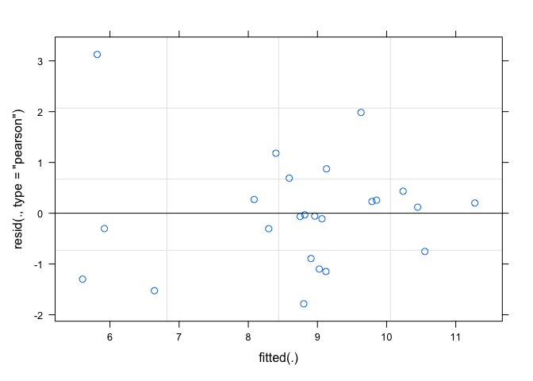
<p class="caption">(\#fig:figName141b)Graphical analyses of residuals for a split-plot ANOVA model</p>
</div>

After having made sure that the basic assumptions for linear models hold, we can proceed to variance partitioning. In this case, we use the `anova()` method for a mixed model object, which gives a slightly different output than the `anova()` method for a linear model object. As the second argument, it is necessary to indicate the method we want to use to estimate the degrees of freedom, which, in mixed models, are not as easy to calculate as in linear models.


```r
anova(mod.split, ddf="Kenward-Roger")
## Type III Analysis of Variance Table with Kenward-Roger's method
##                      Sum Sq Mean Sq NumDF DenDF F value  Pr(>F)  
## Block                3.6596  1.2199     3     6  0.6521 0.61016  
## Tillage             23.6565 11.8282     2     6  6.3228 0.03332 *
## WeedControl          3.3205  3.3205     1     9  1.7750 0.21552  
## Tillage:WeedControl 19.4641  9.7321     2     9  5.2023 0.03152 *
## ---
## Signif. codes:  0 '***' 0.001 '**' 0.01 '*' 0.05 '.' 0.1 ' ' 1
```


From the above table we see that the 'tillage by weed control method' interaction is significant and, therefore, we show the means for the corresponding combinations of experimental factors. As in previous chapters, we use the `emmeans()` function.


```r
library(emmeans)
meansAB <- emmeans(mod.split, ~Tillage:WeedControl)
multcomp::cld(meansAB, Letters = LETTERS)
##  Tillage WeedControl emmean    SE   df lower.CL upper.CL .group
##  MIN     PART          6.00 0.684 14.4     4.53     7.46  A    
##  SP      PART          8.48 0.684 14.4     7.01     9.94  AB   
##  MIN     TOT           8.98 0.684 14.4     7.52    10.45  AB   
##  SP      TOT           9.14 0.684 14.4     7.68    10.60  AB   
##  DP      TOT           9.21 0.684 14.4     7.74    10.67   B   
##  DP      PART         10.63 0.684 14.4     9.17    12.09   B   
## 
## Results are averaged over the levels of: Block 
## Degrees-of-freedom method: kenward-roger 
## Confidence level used: 0.95 
## P value adjustment: tukey method for comparing a family of 6 estimates 
## significance level used: alpha = 0.05 
## NOTE: If two or more means share the same grouping symbol,
##       then we cannot show them to be different.
##       But we also did not show them to be the same.
```

We see that we should avoid controlling the weeds only along the crop rows, if we have not plowed the soil, at least to a shallow depth.


### Example 2: a strip-plot design

In Chapter 2 we have also seen another possible arrangement of plots, relating to an experiment where three crops (sugarbeet, rape and soybean) were sown 40 days after an herbicide treatment. The aim was to assess possible phytotoxicity effects relating to an excessive persistence of herbicide residues in soil and the untreated control was added for the sake of comparison. 

Figure \@ref(fig:figName39) shows that each block was organised with three rows and two columns: the three crops were sown along the rows and the two herbicide treatments (rimsulfuron and the untreated control) were allocated along the columns. In this design, the observations are clustered in three groups:

1. the blocks
2. the rows within each block (three rows per block)
3. the columns within each block (two columns per block)

Analogously to the split-plot design, the rows represent the main plots for the crop factor, while the columns represent the main-plots for the herbicide factor. Both these grouping factors must be referenced as random effects in the model. The combinations between crops and herbicide treatments are allocated to the sub-plots, resulting from crossing the rows with the columns.

The dataset for this experiment, with four replicates, is available in the 'recropS.csv' file, that can be loaded from the usual repository. After loading, we transform all explanatory variables into factors. Furthermore, we create the definition of rows and columns, by considering that each row is uniquely defined by a specific block and crop and each column is uniquely defined by a specific herbicide and block.


```r
rm(list=ls())
dataset <- read.csv("https://www.casaonofri.it/_datasets/recropS.csv")
head(dataset)
##     Herbicide     Crop Block CropBiomass
## 1       Check soyabean     1    199.0831
## 2       Check soyabean     2    257.3081
## 3       Check soyabean     3    345.5538
## 4       Check soyabean     4    210.8574
## 5 rimsulfuron soyabean     1    225.5651
## 6 rimsulfuron soyabean     2    195.3952
dataset$Herbicide <- factor(dataset$Herbicide)
dataset$Crop <- factor(dataset$Crop)
dataset$Block <- factor(dataset$Block)
dataset$Rows <- factor(dataset$Crop:dataset$Block)
dataset$Columns <- factor(dataset$Herbicide:dataset$Block)
```


#### Model definition

A good candidate model is:

$$Y_{ijk} = \mu + \gamma_k + \alpha_i + \theta_{ik} + \beta_j + \zeta_{jk} + \alpha\beta_{ij} + \varepsilon_{ijk}$$

where $\mu$ is the intercept, $\gamma_k$ are the block effects, $\alpha_i$ are the crop effects $\theta_ik$ are the random row effects, $\beta_j$ are the herbicide effects, $\zeta_{jk}$ are the random column effects, $\alpha\beta_{ij}$ are the 'crop by herbicide' interaction effects and $\varepsilon_ijk$ is the residual random error term. The three random effects are assumed as gaussian, with mean equal to zero and variances respectively equal to $\sigma_{\theta}$, $\sigma_{\zeta}$ and $\sigma$.


#### Model fitting with R

At this stage, the code for model fitting should be straightforward, as well as that for variance partitioning


```r
model.strip <- lmer(CropBiomass ~ Block + Herbicide*Crop + 
    (1|Rows) + (1|Columns), data = dataset)
anova(model.strip, ddf = "Kenward-Roger")
## Type III Analysis of Variance Table with Kenward-Roger's method
##                Sum Sq Mean Sq NumDF  DenDF F value  Pr(>F)  
## Block           21451  7150.3     3 4.1367  2.5076 0.19387  
## Herbicide         148   147.9     1 3.0000  0.0519 0.83450  
## Crop            43874 21936.9     2 6.0000  7.6932 0.02208 *
## Herbicide:Crop  12549  6274.4     2 6.0000  2.2004 0.19198  
## ---
## Signif. codes:  0 '***' 0.001 '**' 0.01 '*' 0.05 '.' 0.1 ' ' 1
```


We see that only the crop effect is significant and, thus, we can be reasonably sure that the herbicide did not provoke unwanted carry-over effects to the crops sown in treated soil 40 days after the treatment.

## Sub-sampling designs

Sub-sampling is another very common practice in field experiments. It happens when we collect several random samples from each plot and we submit them to some sort of measurement process. An example is shown in Figure \@ref(fig:figName13.1): we have a latin square design with four treatment levels and four replicates and, for each plot, we collect four subsamples from the grain yield and submit them separately to the determination of, e.g., oil content. 

<div class="figure" style="text-align: center">
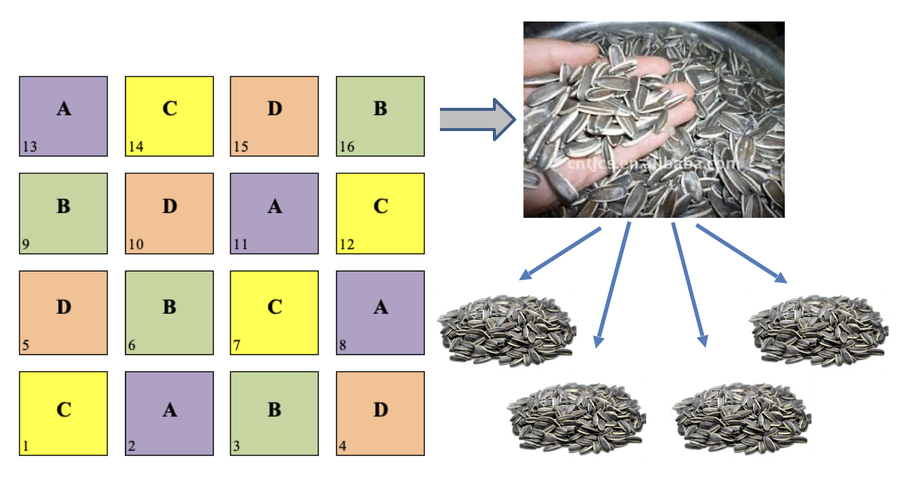
<p class="caption">(\#fig:figName13.2)An example of subsampling: from the grain yield of each plot, four samples are randomly collected and separately submitted to chemical analyses</p>
</div>

The presence of sub-samples is a good thing, as long as true-replicates are also available. It must be clear, as we discussed in Chapter 2, that sub-samples are not to be regarded as true replicates, because the experimental treatments were not independently allocated to each of them. The four sub-samples must be regarded as sub-replicates (or pseudo-replicates) and, in absence of true-replicates, the design is to be considered as invalid. 

### Example 3: A RCBD with sub-sampling

Let's consider a dataset from an experiment where we had 30 genotypes in three blocks and recorded the Weight of Thousand Kernels (TKW) in three sub-samples per plot. This dataset contains the 'Sample' variable, that is used to label the three samples in each plot. In the box below, we load the 'TKW' dataset from the usual repository and transform all the explanatory variables into factors.


```r
rm(list=ls())
library(nlme)
library(emmeans)

filePath <- "https://www.casaonofri.it/_datasets/TKW.csv"
TKW <- read.csv(filePath)
TKW$Block <- factor(TKW$Block)
TKW$Genotype <- factor(TKW$Genotype)
TKW$Sample <- factor(TKW$Sample)
head(TKW)
##   Plot Block  Genotype Sample  TKW
## 1    1     1 Meridiano      1 28.6
## 2    2     1     Solex      1 33.3
## 3    3     1  Liberdur      1 22.3
## 4    4     1  Virgilio      1 28.1
## 5    5     1   PR22D40      1 26.7
## 6    6     1    Ciccio      1 34.2
```

It may be useful to look at the 'naive' analysis, that makes no distinction between true-replicates and sub-replicates and, consequently, regard the design as a RCB with 9 replicates.


```r
# Naive analysis
mod <- lm(TKW ~ Block + Genotype, data=TKW)
anova(mod)
## Analysis of Variance Table
## 
## Response: TKW
##            Df Sum Sq Mean Sq F value    Pr(>F)    
## Block       2  110.3  55.169   7.510 0.0006875 ***
## Genotype   29 7224.7 249.129  33.913 < 2.2e-16 ***
## Residuals 238 1748.4   7.346                      
## ---
## Signif. codes:  0 '***' 0.001 '**' 0.01 '*' 0.05 '.' 0.1 ' ' 1
summary(mod)$sigma
## [1] 2.710373
pairwise <- as.data.frame(pairs(emmeans(mod, ~Genotype)))
sum(pairwise$p.value < 0.05)
## [1] 225
```

We see that the Root Mean Square Error is 2.71, the F test for the genotypes is highly significant and there are 225 significant pairwise comparisons among the 30 genotypes.

#### Model definition

The above analysis is simple, but it is also **terribly wrong**. By putting true-replicates and pseudo-replicates on an equal footing, we have forgotten that the 270 observations are grouped by plot and that the observations in the same plot are more alike than the observations in different plots, because they share the same 'origin'. In other words, the observations in each plot are correlated and, therefore, the basic assumption of independence of residuals is broken. Furthermore, we pretend a higher degree of precision then we actually have: the three sub-samples are correlated and they do not contribute three full pieces of information.

A fully correct model must make the distinction between replicates and sub-replicates, by including an extra-term for the plots, that are the 'grouping' units:

$$ Y_{ijks} = \mu + \alpha_i + \beta_j + \gamma_{k} + \varepsilon_{s}$$

In the above model, $Y$ is the thousand kernel weight for the i^th^ genotype, j^th^ block, k^th^ plot and s^th^ sub-sample, $\alpha$ is the effect of the i^th^ genotype, $\beta$ is the effect of the j^th^ block, $\gamma$ is the effect of the the k^th^ plot and $\varepsilon$ is the effect of the s^th^ subsample. The presence of the $\gamma$ element accounts for the the plot-to-plot differences, so that the independence of model residuals is restored.

Obviously, the difference between plots (for a given genotype and block) must be regarded as purely random, as well as the difference between subplots, within each plot. Consequently, this is a mixed model: the two variance components are $\sigma^2_p$ and $\sigma^2_e$ and we see that the second one is much smaller, as it does not contain some important sources of experimental error, such as the variability due to the soil, or to the cropping practices. Obviously the first component should be given the proper weight when building the correct error term to test for the genotypes.

#### Model fitting with R

We can fit this mixed model by using the `lmer()` function in the `lme4` package.


```r
# Mixed model fit
mod.mix <- lmer(TKW ~ Block + Genotype + (1|Plot), data=TKW)
print(VarCorr(mod.mix), comp = "Variance")
##  Groups   Name        Variance
##  Plot     (Intercept) 8.89201 
##  Residual             0.84526
anova(mod.mix, ddf = "Kenward-Roger")
## Type III Analysis of Variance Table with Kenward-Roger's method
##           Sum Sq Mean Sq NumDF DenDF F value    Pr(>F)    
## Block      3.389  1.6944     2    58  2.0046    0.1439    
## Genotype 221.892  7.6515    29    58  9.0522 9.944e-13 ***
## ---
## Signif. codes:  0 '***' 0.001 '**' 0.01 '*' 0.05 '.' 0.1 ' ' 1
pairwise <- as.data.frame(pairs(emmeans(mod.mix, ~Genotype)))
sum(pairwise$p.value < 0.05)
## [1] 91
```

We do not show the results of pairwise comparisons for the sake of brevity; however, we point out that there are several differences with respect to the previous 'naive' fit:

1. in the 'naive' model, we have only one estimate for $\sigma^2$, that is 7.346 with 238 DF. In this case the correct term to test for the genotype effect is $\sigma^2_p$, that is equal to 8.892 with 58 DF. Clearly, the naive analysis strongly overestimates the number of DF: the observations taken in the same plot are correlated and they do not contribute full information.
2. The RMSE for the mixed model is equal to 2.98 and it is higher than that from the 'naive' fit. The variability within plots is much smaller.
3. The number of significant pairwise comparisons between genotypes has dropped to 91.

#### A simpler alternative

We strongly recommend the previous method of data analysis, but, whenever the number of sub-samples is the same for all plots, we can also reach correct results by proceeding in two-steps. In the first step, we calculate the means of sub-samples for each plot and, in the second step, we submit the plot means to ANOVA, by considering the genotype and the block as fixed factors. In the box below we can see that the results are exactly the same as with the mixed model fit.


```r
# First step
TKWm <- aggregate(TKW ~ Block + Genotype, data = TKW, mean)

#Second step
mod2step <- lm(TKW ~ Genotype + Block, data = TKWm)
anova(mod2step)
## Analysis of Variance Table
## 
## Response: TKW
##           Df  Sum Sq Mean Sq F value    Pr(>F)    
## Genotype  29 2408.24  83.043  9.0522 9.943e-13 ***
## Block      2   36.78  18.390  2.0046    0.1439    
## Residuals 58  532.08   9.174                      
## ---
## Signif. codes:  0 '***' 0.001 '**' 0.01 '*' 0.05 '.' 0.1 ' ' 1
```

## Repeated experiments

In Chapter 1 we mentioned that results need to be replicable and, hopefully, reproducible. The presence of true replicates ensures replicability, i.e. that the results can be reproduced in the same conditions. However, true replication does not ensure that the results are reproducible in different conditions.

For this reason, experiments should be usually repeated in different runs, sites, years or, more generally, in different environments. This is a fundamental key to scientific progress in agriculture and permits sound generalisation; otherwise, the results are specific to the conditions in which they were obtained and their scope is rather limited. Multi-year or multi-site experiments are very common, e.g., in plant breeding and they may involve wide groups of research units across countries or continents. These research units usually employ a commone core of genotypes and the same experimental design (e.g.: randomised complete blocks with 3-4 replicates), while innovative genotypes are progressively introduced in each year and the old ones tend to be abandoned.

Apart from genotype trials, all types of field experiments should be usually repeated at least in two-three different environments (sites or years) to have a minimum appraisal of the reproducibility of results. More generally, we should not underrate the importance of repeating all types of experiments, including those performed in the greenhouse or in controlled conditions, especially when we make use of sampled units from populations with a high degree of spatial or temporal variability (e.g.: seeds, plants, leaves and so on). Based on our experience, we suggest that the variability of results across different runs of the same experiment may be pretty high and, therefore, we argue that a single experiment in agriculture proves nothing.

### A model for pooling the results

In general, each repeated experiment produces data that can be analysed on its own, by using one of the methods described in the previous chapters. However, a pooled analysis is in order, to consolidate the results over the runs and assess their reproducibility. When we pool a set of one-factor experiments, the pooled dataset becomes similar to a two-factor factorial experiment; analogously to what we have described in Chapter 11, a possible model is:

$$ y_{ijk} = \mu + \alpha_i + \beta_j + \alpha\beta_{ij} + \varepsilon_{ijk}$$

where $y$ is the response for the i^th^ run, j^th^ treatment level and k^th^ replicate, $\mu$ is the intercept (the overall mean, when the sum-to-zero constraint is adopted), $\alpha$ is the effect of the i^th^ run, $\beta$ is the effect of the j^th^ treatment level, $\alpha\beta$ is the 'treatment x run' interaction effect and $\varepsilon$ is the residual random effect for each observation, which we assume as normally distributed ($\epsilon_{ijk} \sim N(0, \sigma_{\varepsilon})$)

One difference with two-factor factorial experiments is that, when we repeat experiments laid down in complete blocks, we need to add to the model the term $\gamma_{ik}$, that is the effect of the k^th^ block in the i^th^ run. Indeed, the block effect is nested within runs, as the block levels are usually different in different runs.

Obviously, if we need to pool a set of multi-factorial experiments, the model becomes more complex and we need to include all possible interactions between the treatment factors and their combinations with the run factor. For example, if we have a set of two-factor (A and B) factorial experiments, we need to consider the following effects (in R notation): 'A + B + A:B + A:run + B:run + A:B:run', that is equivalent to writing 'A * B * run'.

### Preliminary analyses

It is always convenient to start with a preliminary evaluation of each single experiment and, afterwards, perform a pooled fit. We would suggest this process:

1.  fit an ANOVA model to each experiment (as shown in previous Chapters);
2.  inspect the data to assess whether we have good data for all runs. Search for possible outliers and for heteroscedasticity of within-run errors (as shown in Chapter 8);
3. if possible, fit a pooled model;
4.  inspect the residuals from the pooled model, with particular reference to possible heteroscedasticy across runs.


### Fixed or random runs?

What is peculiar about repeated experiments is that we always need to take a decision about the nature of the run effect, whether it is 'fixed' or 'random'. Such decision is specific to each experiment and it is up to the researcher, who should give solid reasons to support it. It is not easy to give suggestions; as the rule of thumb, whenever the experiment is repeated in a small number of runs (e.g. 2 or 3), we could think of taking the run effect as fixed. Indeed, a reliable estimation of variance components requires that the number of levels for the random factor is sufficiently high (roughly 4, at least).  

With field experiments repeated in a relatively high number of years/locations, the year effect seems to be reasonably random. Indeed, although the years are not sampled (we cannot sample years, we can only take them in the same order as they come), the effects they produce are not repeatable and they are clearly of random nature. On the other hand, the location effect is more dubious: sometimes, the locations are selected on purpose and they are interesting on themselves, so that the location effect is fixed. In other instances, locations are sampled to represent a macro-environment and, therefore, their effect is random.

Selecting the run factor as fixed or random has an impact on the results of data analyses, as we will see in the following two examples.


### Example 4: a seed germination experiment in two runs

The germination of three genotypes of oilseed rape was assessed by a greenhouse bioassay with six replicated Petri dishes per genotype (18 dishes in total). Fifty seeds were put in each dish and the number of germinated seeds was counted after 15 days and expressed as the Final Proportion of Germinated seeds (FGP). The assay was repeated twice in slightly different conditions, because the environmental parameters in the greenhouse were not under full control. The results are online available as the 'FGP_rape.csv' text file and they can be loaded by using the code below. 


```r
fileName <- "https://www.casaonofri.it/_datasets/FGP_rape.csv"
dataset <- read.csv(fileName)
dataset[,1:5] <- lapply(dataset[,1:5], factor)
```

Preliminarily, in order to fit the ANOVA models to each single run, we can very much simplify the coding by using the 'by()' and 'lapply()' functions. The first one, operates on subsets of the selected dataset, according to a classification variable (the run, in this case) and produces a list with the resulting model objects. 'Lapply()' applies a function to all elements in a list and, in the following code, we used it to perform a Levene's test for homoscedasticity and a Shapiro-Wilks test for normality.


```r
library(MASS)
lmFits <- by(dataset, dataset$Run,  
      function(df) lm(FGP ~ Genotype, data = df) )

# Check for within-experiments homoscedasticity/normality
lapply(lmFits, function(mods) car::leveneTest(mods))
## $`1`
## Levene's Test for Homogeneity of Variance (center = median)
##       Df F value Pr(>F)
## group  2  2.6856 0.1007
##       15               
## 
## $`2`
## Levene's Test for Homogeneity of Variance (center = median)
##       Df F value Pr(>F)
## group  2   1.222 0.3224
##       15
lapply(lmFits, function(mods) shapiro.test(residuals(mods)))
## $`1`
## 
## 	Shapiro-Wilk normality test
## 
## data:  residuals(mods)
## W = 0.94221, p-value = 0.316
## 
## 
## $`2`
## 
## 	Shapiro-Wilk normality test
## 
## data:  residuals(mods)
## W = 0.93291, p-value = 0.2184
# Variance partitioning
lapply(lmFits, function(mods) anova(mods))
## $`1`
## Analysis of Variance Table
## 
## Response: FGP
##           Df   Sum Sq   Mean Sq F value   Pr(>F)   
## Genotype   2 0.033011 0.0165056  8.1353 0.004047 **
## Residuals 15 0.030433 0.0020289                    
## ---
## Signif. codes:  0 '***' 0.001 '**' 0.01 '*' 0.05 '.' 0.1 ' ' 1
## 
## $`2`
## Analysis of Variance Table
## 
## Response: FGP
##           Df   Sum Sq   Mean Sq F value    Pr(>F)    
## Genotype   2 0.042544 0.0212722   22.34 3.177e-05 ***
## Residuals 15 0.014283 0.0009522                      
## ---
## Signif. codes:  0 '***' 0.001 '**' 0.01 '*' 0.05 '.' 0.1 ' ' 1
```

The previous results demonstrate that the basic assumptions for linear models are reasonably met and that the two assays produced significant results, in relation to the genotype effect. Therefore, we move on to pooling the data from the two experiments.

#### Model fitting with R

As we have only two runs in similar (not totally equivalent) environmental conditions, it might be appropriate to regard the 'run' effect as fixed: are the results comparable across these two specific runs? Consequently, we have a fixed effects model, that can be fitted by using the `lm()` function, as shown in the box below:


```r
mod <- lm(FGP ~ Genotype * Run, data = dataset)
```

Before looking at the results, we need to check the whole model and, in particular, we need to check that the residuals from the different runs have homogeneous variances. We do so by using a likelihood approach that is available in the 'check.hom()' function in the aomisc package. 


```r
library(nlme)
library(aomisc)
## Loading required package: drc
## Loading required package: drcData
## 
## 'drc' has been loaded.
## Please cite R and 'drc' if used for a publication,
## for references type 'citation()' and 'citation('drc')'.
## 
## Attaching package: 'drc'
## The following objects are masked from 'package:stats':
## 
##     gaussian, getInitial
## Loading required package: plyr
## --------------------------------------------------------------------
## You have loaded plyr after dplyr - this is likely to cause problems.
## If you need functions from both plyr and dplyr, please load plyr first, then dplyr:
## library(plyr); library(dplyr)
## --------------------------------------------------------------------
## 
## Attaching package: 'plyr'
## The following objects are masked from 'package:reshape':
## 
##     rename, round_any
## The following objects are masked from 'package:dplyr':
## 
##     arrange, count, desc, failwith, id, mutate, rename,
##     summarise, summarize
## Loading required package: car
## Loading required package: carData
## 
## Attaching package: 'car'
## The following object is masked from 'package:dplyr':
## 
##     recode
## Loading required package: multcompView
## Registered S3 method overwritten by 'aomisc':
##   method   from
##   plot.nls nlme
check <- check.hom(mod, Run)
check$aovtable
##      Model df       AIC       BIC   logLik   Test  L.Ratio p-value
## mod1     1  7 -85.37132 -75.56294 49.68566                        
## mod2     2  8 -85.46782 -74.25824 50.73391 1 vs 2 2.096495  0.1476
```

We see that the null hypothesis of no heteroscedasticity of residuals across runs can be accepted and, therefore, we inspect the ANOVA table for the model fit.


```r
anova(mod)
## Analysis of Variance Table
## 
## Response: FGP
##              Df   Sum Sq  Mean Sq F value    Pr(>F)    
## Genotype      2 0.074289 0.037144 24.9199 4.203e-07 ***
## Run           1 0.003025 0.003025  2.0294    0.1646    
## Genotype:Run  2 0.001267 0.000633  0.4249    0.6577    
## Residuals    30 0.044717 0.001491                      
## ---
## Signif. codes:  0 '***' 0.001 '**' 0.01 '*' 0.05 '.' 0.1 ' ' 1
```

In general, inspecting the ANOVA table gives us the possibility of veryifing to what extent the results of the first run were reproducible in the second run. When the run effect is fixed, the interpretation is very much like that for a two-factor factorial experiment; indeed, we can encounter the following situations:

1. the 'run by treatment' interaction is significant. In this case, we ought to conclude that the effects of treatment levels and, possibly, their ranking, changed in each run. Consequently, the results of our experiment were not reproducible and it makes no sense to try to pool them: **we should only display and compare the means of treatment levels within each environment/run**. 
2. The interaction is not significant, but the run main effect is significant. We ought to conclude that the treatment effect and the run effect were independent and additive; consequently, the means for treatment levels changed across repetitions, but treatment effects were fully reproducible. It is up to the researcher to decide whether it is appropriate and meaningful to calculate and display the means for treatment levels.
3. Neither the interaction, nor the run main effects are significant. The results of the repeated experiments are fully reproducible and it is usually appropriate to report only the means for treatment levels.

For our example, we see that the 'run' and 'run by treatment' effects are not significant, which means that the results are fully reproducible. Therefore, we are allowed to pool the two runs and compare the genotypes across runs, by using the usual 'emmeans()' function in the 'emmeans()' package.


```r
library(emmeans)
library(multcomp)
## Loading required package: mvtnorm
## Loading required package: survival
## Loading required package: TH.data
## 
## Attaching package: 'TH.data'
## The following object is masked from 'package:MASS':
## 
##     geyser
cld(emmeans(mod, ~ Genotype), Letters = LETTERS)
## NOTE: Results may be misleading due to involvement in interactions
##  Genotype emmean     SE df lower.CL upper.CL .group
##  C         0.781 0.0111 30    0.758    0.804  A    
##  A         0.871 0.0111 30    0.848    0.894   B   
##  B         0.882 0.0111 30    0.860    0.905   B   
## 
## Results are averaged over the levels of: Run 
## Confidence level used: 0.95 
## P value adjustment: tukey method for comparing a family of 3 estimates 
## significance level used: alpha = 0.05 
## NOTE: If two or more means share the same grouping symbol,
##       then we cannot show them to be different.
##       But we also did not show them to be the same.
```


### Example 5: a multi-year winter wheat experiment

Let's consider a field experiment to compare eight winter wheat genotypes, laid down in complete blocks, with three replicates. The experiment was repeated in seven years; please, note that part of this dataset has already been used for the example at Chapter 10. The response variable is the yield, in tons per hectare.


```r
rm(list = ls())
fileName <- "https://www.casaonofri.it/_datasets/WinterWheat.csv"
WinterWheat <- read.csv(fileName)
WinterWheat$Block <- as.factor(WinterWheat$Block)
WinterWheat$Year <- as.factor(WinterWheat$Year)
head(WinterWheat, 8)
##   Plot Block Genotype Yield Year
## 1    2     1 COLOSSEO  6.73 1996
## 2  110     2 COLOSSEO  6.96 1996
## 3  181     3 COLOSSEO  5.35 1996
## 4    2     1 COLOSSEO  6.26 1997
## 5  110     2 COLOSSEO  7.01 1997
## 6  181     3 COLOSSEO  6.11 1997
## 7   17     1 COLOSSEO  6.75 1998
## 8  110     2 COLOSSEO  6.82 1998
```


For the sake of simplicity and brevity, we disregard the preliminary analyses of each single experiment, which could be performed by using the same code as given for the previous example.

#### Model fitting with R

We have a relatively high number of years and, as we explained, the year effect is intrinsically of random nature, because it is 'not repeatable'. Therefore, we take the year effect as random and we assume that it is guassian, with mean equal 0 and standard deviation equal to $\sigma_E$:

$$\alpha_i \sim N(0, \sigma_E)$$

The corresponding variance ($\sigma^2_E$) is the so-called 'variance component' for the year effect. If the year is random, also the 'genotype x year' and the 'block|year' effects are random and they are defined as:

$$\alpha\beta_{i,j} \sim N(0, \sigma_{GE})$$

$$\gamma_{i,k} \sim N(0, \sigma_{EB})$$

Before fitting a mixed model, we decide to fit a fixed model, for a preliminary evaluation of model residuals and to compare with the results of a mixed model fit.


```r
modfix <- lm(Yield ~ Year/Block + Genotype * Year,
             data = WinterWheat)
check <- check.hom(modfix, Year)
check$aovtable
##      Model df      AIC      BIC    logLik   Test  L.Ratio p-value
## mod1     1 71 316.3539 499.8865 -87.17693                        
## mod2     2 77 319.4480 518.4904 -82.72398 1 vs 2 8.905903  0.1789
anova(modfix)
## Analysis of Variance Table
## 
## Response: Yield
##               Df  Sum Sq Mean Sq  F value    Pr(>F)    
## Year           6 159.279 26.5466 178.3996 < 2.2e-16 ***
## Genotype       7  11.544  1.6491  11.0824 2.978e-10 ***
## Year:Block    14   3.922  0.2801   1.8826   0.03738 *  
## Year:Genotype 42  27.713  0.6598   4.4342 6.779e-10 ***
## Residuals     98  14.583  0.1488                       
## ---
## Signif. codes:  0 '***' 0.001 '**' 0.01 '*' 0.05 '.' 0.1 ' ' 1
```

The previous box suggests that there is no problem with the heteroscedasticity of model residuals across years. The 'genotype by year' interaction is significant and, therefore, if the 'year effect' is taken as fixed, we could only compare genotypes within years, which is rather meaningless, due to the unreplicability of the year effect. Therefore, it is much more useful to switch to a mixed model fit.

This latter can be fitted by using the `lmer()` function, as shown below:


```r
mod <- lmer(Yield ~ (1|Year) + (1|Year:Block) + Genotype +
               (1|Year:Genotype),
             data = WinterWheat)
```


First of all, we inspect the estimates of variance components, because they represent the sources of random variability. With balanced data (as in this case), these variance components could also be obtained by using the method of moments, starting from the ANOVA table from a fixed model fit:

$$\sigma^2_{\varepsilon} = MS_{\varepsilon}$$

$$ \sigma^2_{GE} = \frac{MS_{GE} - \sigma^2_{\varepsilon}}{n_B} = \frac{0.6598 - 0.1488}{3} = 0.1703$$

$$ \sigma^2_{EB} = \frac{MS_{EB} - \sigma^2_{\varepsilon}}{n_G} = \frac{0.2801 - 0.1488}{8} = 0.0164$$

$$ \sigma^2_{E} = \frac{MS_E - 8 \, \sigma^2_{EB} - 3 \, \sigma^2_{GE} -   \sigma^2_{\varepsilon}}{n_{GB}} = $$

$$ = \frac{26.55 - 8 \times 0.0164 - 3 \times 0.1703 - 0.1488}{24} = 1.073$$

where $n_B$, $n_G$ and $n_{GB}$ are, respectively, the number of blocks, the number of genotypes and the number of 'genotype by block' combinations, while $\textrm{MS}_{\varepsilon}$, $\textrm{MS}_E$, $\textrm{MS}_{EB}$ and $\textrm{MS}_{GE}$ are the mean squares from a fixed effect fit, respectively, for the residual error, the years, the blocks within years and the genotype by year interaction. However, the REstricted Maximum Likelihood (REML) estimates provided by the 'lmer()' function are simpler to obtain, also with unbalance data.


```r
# Variance components
print( VarCorr(mod), comp=c("Variance", "Std.Dev.") )
##  Groups        Name        Variance Std.Dev.
##  Year:Genotype (Intercept) 0.170341 0.41272 
##  Year:Block    (Intercept) 0.016418 0.12813 
##  Year          (Intercept) 1.073146 1.03593 
##  Residual                  0.148804 0.38575
```

The variance component estimates show that the overall yield variability is mainly due to the year effect (year-to-year variability: $\sigma_E = 1.04$), which was the same for all genotypes. This source of variability impacts on genotype mean yields (which changes depending on the year), but it does not impact on genotype effects and differences. Another important source of variability is the genotype-by-year interaction ($\sigma_{GE} = 0.41$), which is additional to the year-to-year variability and it is highly specific to each genotype. It impacts on genotype mean, but it also impact on genotype effects (and differences), that change depending on the years. The within year plot-to-plot variability is smaller ($\sigma = 0.39$), although it is clear that it impacts on genotype means, effects and differences. Last, block-to-block variability ($\sigma_{EB} = 0.13$) is the smallest component and, similarly to year-to-year variability, it is the same for all genotypes and it impacts only on their mean value across blocks.


```r
# ANOVA table
anova(mod)
## Type III Analysis of Variance Table with Satterthwaite's method
##          Sum Sq Mean Sq NumDF DenDF F value  Pr(>F)  
## Genotype 2.6033  0.3719     7    42  2.4993 0.03058 *
## ---
## Signif. codes:  0 '***' 0.001 '**' 0.01 '*' 0.05 '.' 0.1 ' ' 1
```

The ANOVA table only includes the genotype effect, because all other effects are random and it makes no sense to test for the existence of a significant difference between the means for the different factor levels. We see that the F ratio for the genotype effect is smaller than that from a fixed model fit, because it needs to consider, at the denominator, all the main sources of variability that can impact on the genotype effects (i.e.: plot-to-plot variability and the genotype-by-year interaction). In particular, the F ratio is obtained as:

$$F = \frac{MS_G}{n_B \times \sigma^2_{GE} + \sigma^2_{\varepsilon}} = \frac{MS_G}{MS_{GE}} = \frac{1.6491}{0.6598} = 2.499$$


When the year effect is random, we can always consider and compare the means of genotypes across years and we are not restrained by a significant genotype-by-year interaction. However, SEMs and SEDs are usually higher than those from a fixed model fit, because they have to consider all possible sources of variability. In particular, with a fixed effects model, the standard errors for the genotype means is ($r$ is the number of replicates and $n_e$ is the number of environments):

$$SEM_f = \sqrt{ \frac{\sigma^2}{r\,n_e} } = \sqrt{ \frac{0.1488}{3 \cdot 7}} = 0.0842$$

With mixed models, the SEM is calculated by considering all sources of random variability:

$$SEM_m = \sqrt \frac{r \, \sigma^2_E  + \sigma^2_{EB} + r \sigma^2_{GE} + \sigma^2 }{re} = \sqrt \frac{3 \cdot 1.073  + 0.016 + 3 \cdot 0.170 + 0.1488 }{3 \cdot 7} = 0.431$$

Likewise, the Standard Error of a Difference (SED), for the mixed model, is calculated by considering the plot-to-plot variability and the genotype-by-environment variability, while the year-to-year variability and the block-to-block variability are not considered, because they impact on all the means in the same way and, therefore, they do not impact on the differences. The expressions are:

$$SED_f = \sqrt{2 \, \frac{\sigma^2}{r \, n_e} } \quad \quad SED_m = \sqrt {2 \, \frac{r \, \sigma^2_{ge}  + \sigma^2 }{r \, n_e} }$$

Marginal means and significance letters can be easily obtained as shown in previous examples and chapters:


```r
cld(emmeans(mod, ~Genotype), Letters = letters,
    adjust = "none")
##  Genotype emmean    SE   df lower.CL upper.CL .group
##  SIMETO     5.93 0.431 8.23     4.94     6.91  a    
##  CRESO      5.97 0.431 8.23     4.99     6.96  a    
##  GRAZIA     6.08 0.431 8.23     5.09     7.07  a    
##  SANCARLO   6.22 0.431 8.23     5.23     7.21  ab   
##  SOLEX      6.23 0.431 8.23     5.24     7.22  ab   
##  COLOSSEO   6.41 0.431 8.23     5.43     7.40  ab   
##  DUILIO     6.59 0.431 8.23     5.60     7.58   b   
##  IRIDE      6.70 0.431 8.23     5.71     7.68   b   
## 
## Degrees-of-freedom method: kenward-roger 
## Confidence level used: 0.95 
## significance level used: alpha = 0.05 
## NOTE: If two or more means share the same grouping symbol,
##       then we cannot show them to be different.
##       But we also did not show them to be the same.
```

We see that the correction of multiplicity and the need to consider all sources of random yield variability, does not permit to prove the existence of any significant difference between genotypes.

## Repeated measures in perennial crops

With perennial crops measures are taken repeatedly in the same plots across years. For this reason, even though the dataset looks very much like that for the winter wheat experiment repeated in several years, it must be analysed in a totally different manner.

In particular, we should not neglect that, in contrast to the winter wheat example, the observations are grouped within the same plots and, therefore, they are not independent, because the observations taken on the same plot are more alike than observations taken on different plots. We have seen a similar situation with the subsampling experiment given before, with an important difference: while subsamples were taken at random within each plot, repeated measures may not be sampled at random, they may be specifically taken to evaluate the yield in different moments of plant life.

### Example 5: genotype experiment with lucerne

Let's consider the dataset below, that refers to the yield of lucerne genotypes in three consecutive years, taken from the same plots in a single experiment lasting for three years. In the box below we load the data and make the necessary transformations. We also build a new variable to uniquely identify each plot, which is easy, considering that yield values taken for the same genotype in the same block must have been taken in the same plot.


```r
filePath <- "https://www.casaonofri.it/_datasets/alfalfa3years.csv"
dataset <- read.csv(filePath)
dataset$Block <- factor(dataset$Block)
dataset$Genotype <- factor(dataset$Genotype)
dataset$Year <- factor(dataset$Year)
head(dataset)
##   Block Genotype Year     Yield
## 1     1 4cascine 2006  6.631775
## 2     2 4cascine 2006  6.705397
## 3     3 4cascine 2006  6.499588
## 4     4 4cascine 2006  7.087686
## 5     1 4cascine 2007 14.964927
## 6     2 4cascine 2007 13.584865
# Reference the plots
dataset$Plot <- dataset$Block:dataset$Genotype
```

#### Model definition

For repeated measures designs, models can be built by using the rules in Piepho et al. (2004):

1. Consider one single year and build the treatment model
2. Consider one single year and build the block model
3. Include the year factor into the model and combine the year with all the effects in the treatment model, by crossing or nesting as appropriate. 
4. Consider that the 'plot' factor in the block model references the randomisation units, i.e. those units which received the the genotypes by a randomisation process. Assign to this plot factor a random effect.
5. Excluding the terms for randomisation units, nest the year in all the other terms in the block model.
6. Combine random effects for randomisation units with the repeated factor, by using the colon operator, in order to derive the correct error terms to accommodate correlation structures.

The models at the different steps are as follows (with R notation):

1. treatment model: YIELD ~ GENOTYPE
2. block model: YIELD ~ BLOCK + BLOCK:PLOT
3. treatment model: YIELD ~ GENOTYPE * YEAR
4. block model: YIELD ~ BLOCK + (1|BLOCK:PLOT)
5. block model: YIELD ~ BLOCK + BLOCK:YEAR + (1|BLOCK:PLOT)
6. block model: YIELD ~ BLOCK + BLOCK:YEAR + (1|BLOCK:PLOT) + (1|BLOCK:PLOT:YEAR)

In this case, considering that lucerne lasts, on average, for three years and follows a specific pattern of yield across these three years, we decided to take the block, year and genotype effects as fixed; therefore, the final model, with R notation, is:

YIELD ~ BLOCK + BLOCK:YEAR + GENOTYPE * YEAR + (1|BLOCK:PLOT) + (1|BLOCK:PLOT:YEAR)

where the last term does not need to be fitted in R, as it is the residual term, that is fitted by default. The resulting analysis (with 'lmer') is:


```r
mod <- lmer(Yield ~ Block + Block:Year + Genotype*Year +
            (1|Plot:Block),
           data = dataset)
anova(mod)
## Type III Analysis of Variance Table with Satterthwaite's method
##                Sum Sq Mean Sq NumDF DenDF   F value    Pr(>F)    
## Block            3.96    1.32     3    57    2.1389  0.105316    
## Genotype        54.00    2.84    19    57    4.6024  3.75e-06 ***
## Year          2602.53 1301.27     2   114 2107.3223 < 2.2e-16 ***
## Block:Year      14.14    2.36     6   114    3.8176  0.001667 ** 
## Year:Genotype   31.83    0.84    38   114    1.3563  0.111546    
## ---
## Signif. codes:  0 '***' 0.001 '**' 0.01 '*' 0.05 '.' 0.1 ' ' 1
emmeans(mod, ~Genotype)
## NOTE: Results may be misleading due to involvement in interactions
##  Genotype          emmean    SE df lower.CL upper.CL
##  4cascine           11.59 0.315 57    10.96     12.2
##  casalina           12.46 0.315 57    11.83     13.1
##  classe             11.59 0.315 57    10.96     12.2
##  costanza            9.89 0.315 57     9.26     10.5
##  dimitra            11.75 0.315 57    11.12     12.4
##  FDL0101            12.22 0.315 57    11.59     12.9
##  garisenda          11.76 0.315 57    11.13     12.4
##  LaBellaCampagnola  12.17 0.315 57    11.54     12.8
##  LaTorre            11.36 0.315 57    10.73     12.0
##  linfa              11.23 0.315 57    10.60     11.9
##  marina             11.76 0.315 57    11.13     12.4
##  Palladiana         10.89 0.315 57    10.26     11.5
##  PicenaGR           12.12 0.315 57    11.49     12.8
##  PR56S82            11.56 0.315 57    10.93     12.2
##  PR57Q53            11.70 0.315 57    11.07     12.3
##  prosementi         11.79 0.315 57    11.15     12.4
##  RivieraVicentina    9.98 0.315 57     9.35     10.6
##  robot              12.11 0.315 57    11.48     12.7
##  Selene             12.11 0.315 57    11.48     12.7
##  Zenith             11.94 0.315 57    11.31     12.6
## 
## Results are averaged over the levels of: Block, Year 
## Degrees-of-freedom method: kenward-roger 
## Confidence level used: 0.95
```

We see that the 'genotype x year' interaction is not significant, so that we can proceed to comparing the means of genotypes across years, which can be done with the 'emmeans()' function in the usual fashion.

It may be useful to compare this analysis with a 'naive' (and wrong) analysis that neglects the repeated measures (i.e., that neglects the 'plot' random effect). Wee see big differences and, especially, we see that the SEs for genotype means are much higher in the correct analysis.


```r
mod2 <- lm(Yield ~ Year/Block + Genotype*Year, 
           data = dataset)
anova(mod2)
## Analysis of Variance Table
## 
## Response: Yield
##                Df  Sum Sq Mean Sq   F value    Pr(>F)    
## Year            2 2602.53 1301.27 1608.2407 < 2.2e-16 ***
## Genotype       19  104.27    5.49    6.7824 4.256e-13 ***
## Year:Block      9   21.80    2.42    2.9930  0.002449 ** 
## Year:Genotype  38   31.83    0.84    1.0351  0.424687    
## Residuals     171  138.36    0.81                        
## ---
## Signif. codes:  0 '***' 0.001 '**' 0.01 '*' 0.05 '.' 0.1 ' ' 1
emmeans(mod2, ~Genotype)
## NOTE: A nesting structure was detected in the fitted model:
##     Block %in% Year
## NOTE: Results may be misleading due to involvement in interactions
##  Genotype          emmean   SE  df lower.CL upper.CL
##  4cascine           11.59 0.26 171    11.07     12.1
##  casalina           12.46 0.26 171    11.94     13.0
##  classe             11.59 0.26 171    11.08     12.1
##  costanza            9.89 0.26 171     9.38     10.4
##  dimitra            11.75 0.26 171    11.24     12.3
##  FDL0101            12.22 0.26 171    11.71     12.7
##  garisenda          11.76 0.26 171    11.24     12.3
##  LaBellaCampagnola  12.17 0.26 171    11.66     12.7
##  LaTorre            11.36 0.26 171    10.84     11.9
##  linfa              11.23 0.26 171    10.72     11.7
##  marina             11.76 0.26 171    11.25     12.3
##  Palladiana         10.89 0.26 171    10.38     11.4
##  PicenaGR           12.12 0.26 171    11.61     12.6
##  PR56S82            11.56 0.26 171    11.05     12.1
##  PR57Q53            11.70 0.26 171    11.19     12.2
##  prosementi         11.79 0.26 171    11.27     12.3
##  RivieraVicentina    9.98 0.26 171     9.47     10.5
##  robot              12.11 0.26 171    11.59     12.6
##  Selene             12.11 0.26 171    11.60     12.6
##  Zenith             11.94 0.26 171    11.42     12.5
## 
## Results are averaged over the levels of: Block, Year 
## Confidence level used: 0.95
```

We just want to conclude by saying that the above mixed model analyses regards the design as a sort of 'split-plot in time' and it is not necessarily correct, as it assumes that the within-plot correlation is the same for all pairs of observations, regardless of their distance in time. Further analyses might be necessary to assess whether serial correlation structures are necessary, although such an aspect is far beyond the scope of this book.


## Further readings

1. Annichiarico, P., 2002. Genotype x Environment Interactions - Challenges and Opportunities for Plant Breeding and Cultivar Recommendations. FAO, 1, 1-115 (This is on-line available. Just make a google search!)
2. Bates, D., Mächler, M., Bolker, B., Walker, S., 2015. Fitting Linear Mixed-Effects Models Using lme4. Journal of Statistical Software 67. https://doi.org/10.18637/jss.v067.i01
3. Gałecki, A., Burzykowski, T., 2013. Linear mixed-effects models using R: a step-by-step approach. Springer, Berlin.
4. Kuznetsova, A., Brockhoff, P.B., Christensen, H.B., 2017. lmerTest Package: Tests in Linear Mixed Effects Models. Journal of Statistical Software 82, 1--26.
5. Piepho, H.-P., Büchse, A., Richter, C., 2004. A Mixed Modelling Approach for Randomized Experiments with Repeated Measures. Journal of Agronomy and Crop Science 190, 230–247.


<!--chapter:end:13-Eng_SplitStrip.Rmd-->

# Nonlinear regression


*The aim of science is to seek the simplest explanation of complex facts.  Seek simplicity and distrust it (A.N. Whitehead)*


Biological processes, very rarely follow linear trends. Just think about how a crop grows, or responds to increasing doses of fertilisers/xenobiotics. Or, think about how an herbicide degrades in the soil, or about the germination pattern of a seed population. It is very easy to realise that curvilinear trends, asymptotes and/or inflection points are far more common, in nature. In practice, linear equations in biology are nothing more than a quick way to approximate a response over a very narrow range of the independent variable.

Therefore, we need to be able to fit simple nonlinear models to our experimental data. In this Chapter, we will see how to do this, starting from a simple, but realistic example.


## Case-study: a degradation curve

A soil was enriched with the herbicide metamitron, up to a concentration of 100 ng g^1^. It was put in 24 aluminium containers, inside a climatic chamber at 20°C. Three containers were randomly selected in eight different times and the residual concentration of metamitron was measured. The observed data are available in the 'degradation.csv' file, in an external repository. First of all we load and inspect the data.

\vspace{12pt}

```r
fileName <- "https://www.casaonofri.it/_datasets/degradation.csv"
dataset <- read.csv(fileName, header=T)
head(dataset, 10)
##    Time   Conc
## 1     0  96.40
## 2    10  46.30
## 3    20  21.20
## 4    30  17.89
## 5    40  10.10
## 6    50   6.90
## 7    60   3.50
## 8    70   1.90
## 9     0 102.30
## 10   10  49.20
```

It is always very useful to take a look at the observed data, by plotting the response against the predictor (Figure \@ref(fig:figName150)); we see that the trend is curvilinear, which rules out the use of simple linear regression.

In order to build a nonlinear regression model, we can use the general form introduced in Chapter 4, that is:

$$Y_i = f(X_i, \theta) + \varepsilon_i$$

where $X$ is the time, $Y$ is the concentration, $f$ is a nonlinear function, $\theta$ is the set of model parameters and $\varepsilon$ are the residuals, assumed as independent, gaussian and homoscedastic.

<div class="figure" style="text-align: center">
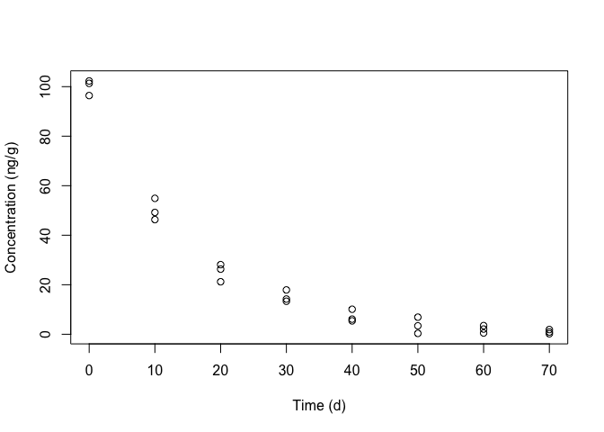
<p class="caption">(\#fig:figName150)Degradation of metamitron in soil</p>
</div>

## Model selection

The first task is to select a function $f$ that matches the observed response shape. You can find full detail elsewhere (go to [this link](https://www.statforbiology.com/2020/stat_nls_usefulfunctions/)). For now, we can look at Figure \@ref(fig:figName151), where we have displayed the shapes of some useful functions for nonlinear regression analysis in agricultural studies. We distinguish:

1. Convex/concave shapes (e.g., quadratic polynomial, exponential growth/decay, asymptotic growth, power curve and rectangular hyperbola)
2. Sigmoidal shapes (e.g., logistic growth, Gompertz growth and log-logistic dose-response)
3. Curves with maxima/minima (e.g., Bragg's function)

In the above list, the quadratic polynomial is a curvilinear model, but it is linear in the parameters and, therefore, it should have been better included in the previous Chapter about linear regression. However, we decided to include it here, considering its concave shape.


<div class="figure" style="text-align: center">
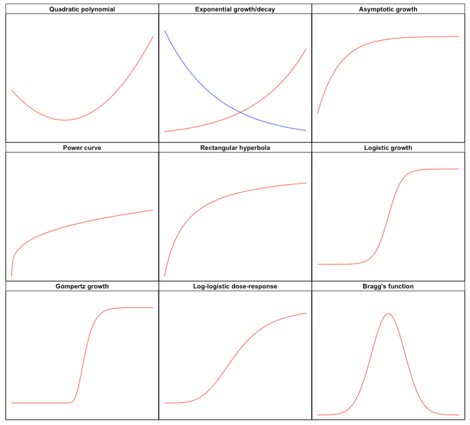
<p class="caption">(\#fig:figName151)The shapes of the most important functions</p>
</div>

Behind each of the above shapes, there is a mathematical function, which is shown in Figure \@ref(fig:figName151bis) ).

<div class="figure" style="text-align: center">
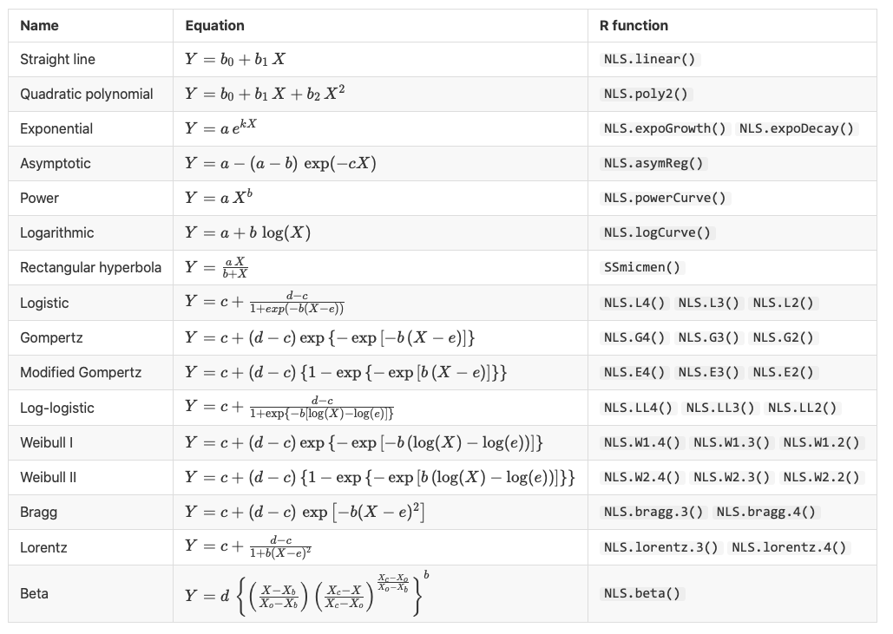
<p class="caption">(\#fig:figName151bis)Some useful functions for nonlinear regression analysis (equation and R function).</p>
</div>

For the dataset under study, considering the shapes in Figure \@ref(fig:figName151) and, above all, considering the available literature information, we select an exponential decay equation, with the following form (see also Fig. \@ref(fig:figName151bis) ):

$$Y_i = a \, e^{-k \,X_i} + \varepsilon_i$$ 

where $Y$ is the concentration at time $X$, $a$ is the initial metamitron concentration and $k$ is the constant degradation rate.

## Parameter estimation

Now, we have to obtain the least squares estimates of the parameters $a$ and $k$. Unfortunately, with nonlinear regression, the least squares problem has no closed form solution and, therefore, we need to tackle the estimation problem in a different way. In general, there are three possibilities

1. linearise the nonlinear function;
2. approximate the nonlinear function by using a polynomial;
3. use numerical methods for the minimisation.

Let's see advantages and disadvantages of all methods.

### Linearisation

In some cases, we can modify the function to make it linear. In this case, we can take the logarithm of both sides and define the following equation:

$$ \log(Y) = \log(A) - k \, X $$

which is, indeed, linear. Therefore, we can take the logarithms of the concentrations and fit a linear model, by using the `lm()` function:

\vspace{12pt}

```r
mod <- lm(log(Conc) ~ Time, data=dataset)
summary(mod)
## 
## Call:
## lm(formula = log(Conc) ~ Time, data = dataset)
## 
## Residuals:
##      Min       1Q   Median       3Q      Max 
## -2.11738 -0.09583  0.05336  0.31166  1.01243 
## 
## Coefficients:
##              Estimate Std. Error t value Pr(>|t|)    
## (Intercept)  4.662874   0.257325   18.12 1.04e-14 ***
## Time        -0.071906   0.006151  -11.69 6.56e-11 ***
## ---
## Signif. codes:  0 '***' 0.001 '**' 0.01 '*' 0.05 '.' 0.1 ' ' 1
## 
## Residual standard error: 0.6905 on 22 degrees of freedom
## Multiple R-squared:  0.8613,	Adjusted R-squared:  0.855 
## F-statistic: 136.6 on 1 and 22 DF,  p-value: 6.564e-11
```

We see that the slope has a negative sign (the line is decreasing) and the intercept is not the initial concentration value, but its logarithm.

The advantage of this process is that the calculations are very easily performed with every spreadsheet or simple calculator. However, we need to check that the basic assumptions of normal and homoscedastic residuals hold in the logarithmic scale. We do this in the following box.


```r
par(mfrow = c(1,2))
plot(mod, which = 1)
plot(mod, which = 2)
```

<div class="figure" style="text-align: center">
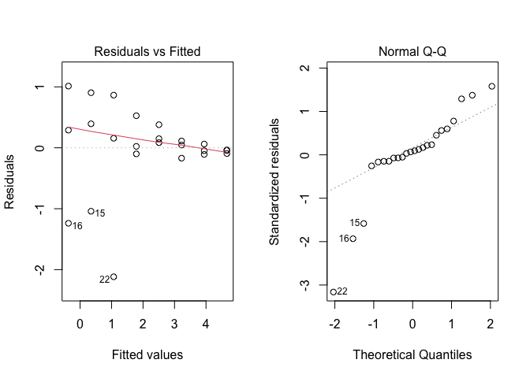
<p class="caption">(\#fig:figName152)Graphical analyses of residuals for nonlinear regression with linearisation of the mean function</p>
</div>

The plots show dramatic deviations from homoscedasticity (Figure \@ref(fig:figName152) ), which rule out the use of the linearisation method. Please, consider that this conclusion is specific to our dataset, while, in general, the linearisation method can be successfully used, whenever the basic assumptions for linear models appear to hold for the transformed response.

### Approximation with a polynomial function

In some other cases, a curvilinear shape can be approximated by using a polynomial equation, that is, indeed, linear in the parameters. In our example, we could think of the descending part of a second order polynomial (see Figure \@ref(fig:figName152)) and, thus, we fit this model by the usual `lm()` function:


```r
mod2 <- lm(Conc ~ Time + I(Time^2), data=dataset)
pred <- predict(mod2, newdata = data.frame(Time = seq(0, 70, by = 0.1)))
plot(Conc ~ Time, data=dataset)
lines(pred ~ seq(0, 70, by = 0.1), col = "red")
```

<div class="figure" style="text-align: center">

<p class="caption">(\#fig:figName153)Approximating a degradation kinetic by using a second order polynomial</p>
</div>

We see that the approximation is good up to 40 days after the beginning of the experiment. Later on, the fitted function appears to deviate from the observed pattern, depicting an unrealistic concentration increase from 55 days onwards (Figure \@ref(fig:figName153)). Clearly, the use of polynomials may be useful in some other instances, but it not a suitable solution for this case.


### Nonlinear least squares

The third possibility consists of using nonlinear least squares, based on the Gauss-Newton iterative algorithm. We need to provide reasonable initial estimates of model parameters and the algorithm updates them, iteratively, until it converges on the approximate least squares solution. Nowadays, thanks to the advent of modern computers, nonlinear least squares have become the most widespread nonlinear regression method, providing very good approximations for most practical needs.


## Nonlinear regression with R

Considering the base R installation, nonlinear least squares regression is implemented in the `nls()` function. The syntax is very similar to that of the `lm()` function, although we need to provide reasonable initial values for model parameters. In this case, obtaining such values is relatively easy: $a$ is the initial concentration and, by looking at the data, we can set this value to 100. The parameter $k$ is the constant degradation rate, i.e. the percentage daily reduction in concentration; we see that the concentration drops by 50% in ten days, thus we could assume that there is a daily 5% drop (k = 0.05). With such an information, we fit the model, as shown in the box below.


```r
modNlin <- nls(Conc ~ A*exp(-k*Time), 
               start=list(A=100, k=0.05), 
               data = dataset)
summary(modNlin)
## 
## Formula: Conc ~ A * exp(-k * Time)
## 
## Parameters:
##    Estimate Std. Error t value Pr(>|t|)    
## A 99.634902   1.461047   68.19   <2e-16 ***
## k  0.067039   0.001887   35.53   <2e-16 ***
## ---
## Signif. codes:  0 '***' 0.001 '**' 0.01 '*' 0.05 '.' 0.1 ' ' 1
## 
## Residual standard error: 2.621 on 22 degrees of freedom
## 
## Number of iterations to convergence: 5 
## Achieved convergence tolerance: 4.33e-07
```

Instead of coding the mean model from the scratch, we can use one of the available self-starting functions (Fig. \@ref(fig:figName151bis) ), which are associated to self-starting routines. This is very useful, as the self-starting functions do not need initial estimates and, thus, we are free from the task of providing them, which is rather difficult for beginners. Indeed, if our initial guesses are not close enough to least squares estimates, the algorithm may freeze during the estimation process and may not reach convergence. Self-starting functions are available within the 'aomisc' which needs to be installed from github prior to fitting the model.


```r
# Installation is required only once
# library(devtools)
# install_github("onofriandreapg/aomisc")
library(aomisc)
modNlin2 <- nls(Conc ~ NLS.expoDecay(Time, a, k),
               data = dataset)
```


## Checking the model

While the estimation of model parameters is performed by using numerical methods, checking a fitted model is done by using the very same methods as shown for simple linear regression, with slight differences. In the following section we will show some of the R methods for nonlinear models, which can be used on 'nls' objects. 

### Graphical analyses of residuals

First of all, we check the basic assumptions of normality and homoscedasticity of model residuals, by the usual diagnostic plots. We can us the `plotnls()` function, as available in the 'aomisc' package.


```r
par(mfrow=c(1,2))
plot(modNlin, which = 1)
plot(modNlin, which = 2)
```

<div class="figure" style="text-align: center">
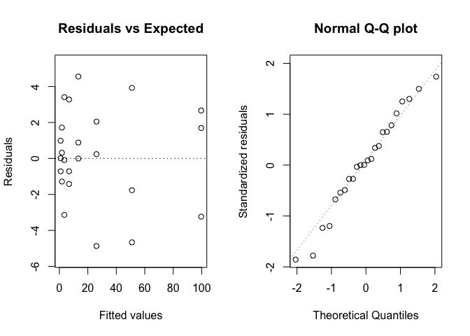
<p class="caption">(\#fig:figName154)Graphical analyses of residuals relating to the degradation of metamitron in soil.</p>
</div>

Figure \@ref(fig:figName154) does not show any visible deviations and, thus, we proceed to plotting the observed data along with model predictions (Figure \@ref(fig:figName155)), e.g., by using the `plotnls()` function, in the 'aomisc' package.


```r
plot(modNlin, type = "means",
        xlab = "Time (d)", ylab = "Concentration (ng/g)")
```

<div class="figure" style="text-align: center">
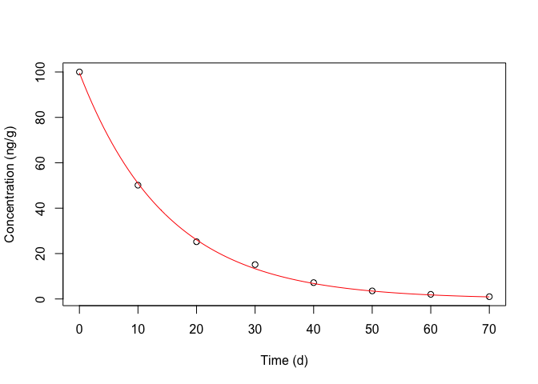
<p class="caption">(\#fig:figName155)Degradation kinetic for metamitron in soil: symbols show the observed data, the red line shows the fitted equation</p>
</div>

### Approximate F test for lack of fit

If we have replicates, we can fit an ANOVA model and compare this latter model to the nonlinear regression model, as we have already shown in Chapter 13, for linear regression models (F test for lack of fit). With R, this test can be performed by using the `anova()` method and passing the two model objects as arguments. The box below shows that the null hypothesis of no lack of fit can be accepted.


```r
modAov <- lm(Conc ~ factor(Time), data=dataset)
anova(modNlin, modAov)
## Analysis of Variance Table
## 
## Model 1: Conc ~ A * exp(-k * Time)
## Model 2: Conc ~ factor(Time)
##   Res.Df Res.Sum Sq Df Sum Sq F value Pr(>F)
## 1     22     151.18                         
## 2     16     135.94  6 15.238  0.2989 0.9284
```

### The coefficient of determination (R^2^)

The R^2^ coefficient in nonlinear regression should not be used as a measure of goodness of fit, because it represents the ratio between the residual deviances for the model under comparison and for a model with the only intercept (see previous chapter). Some non-linear models do not have an intercept and, therefore, the R^2^ value is not meaningful and can also assume values outside the range from 0 to 1.

Such an argument can be, at least partly, overcame by using the **Pseudo R^2^** (Schabenberger and Pierce, 2002), that is the proportion of variance explained by the regression effect: 

$$R_a^2  = 1 - \frac{MSE}{MST}$$

where MSE is the residual mean square and MST is total mean square. For our example:

\vspace{12pt}

```r
MSE <- summary(modNlin)$sigma ^ 2
MST <- var(dataset$Conc)
1 - MSE/MST
## [1] 0.9936359
```


Whenever necessary, The Pseudo-R^2^ value can be obtained by using the `R2nls()` function, in the 'aomisc' package, as shown in the box below.

\vspace{12pt}

```r
R2nls(modNlin)$PseudoR2
## [1] 0.9939126
```

## Stabilising transformations

In some cases, it may happen that the model does not fit the data (**lack of fit**) or that the residuals are not gaussian and homoscedastic. In the first case, we have to discard the model and select a new one, that fits better to the observed data. 

In the other cases (heteroscedastic or non-normal residuals), similarly to linear regression, we should adopt some sort of stabilising transformations, possibly selected by using the Box-Cox method. However, nonlinear regression poses an additional issue, that we should keep into account. Indeed, in most cases, the parameters of nonlinear models are characterised by a clear biological meaning, such as, for example, the parameter $a$ in the exponential equation above, that is the initial concentration value. If we transform the response into, e.g., its logarithm, the estimated $a$ represents the logarithm of the initial concentration and its biological meaning is lost.

In order to avoid such a problem and obtain parameter estimates in their original scale, the 'transform-both-sides' approach is feasible, where we use the Box-Cox family of transformations (see Chapter 8) to transform both the response and the model:

$$Y_i^\lambda  = f(X_i)^\lambda + \varepsilon_i$$

In order to use this technique in R, we can use the `boxcox.nls()` method in the 'aomisc' package, that is very similar to the 'boxcox()' method in the MASS package (see Chapter 8). The `boxcox.nls()` method returns the maximum likelihood value for $\lambda$ with confidence intervals and a likelihood graph as a function of $\lambda$ can also be obtained by using the argument 'plotit = T'

\vspace{12pt}

```r
bc <- boxcox(modNlin)
```

<!-- -->

```r
bc$lambda
## $lambda
## [1] 0.8
## 
## $ci
## [1] 0.5619080 0.9637162
## 
## $loglik
## [1] -31.55224
```


```r
boxcox(modNlin, plotit = T)
```

<div class="figure" style="text-align: center">
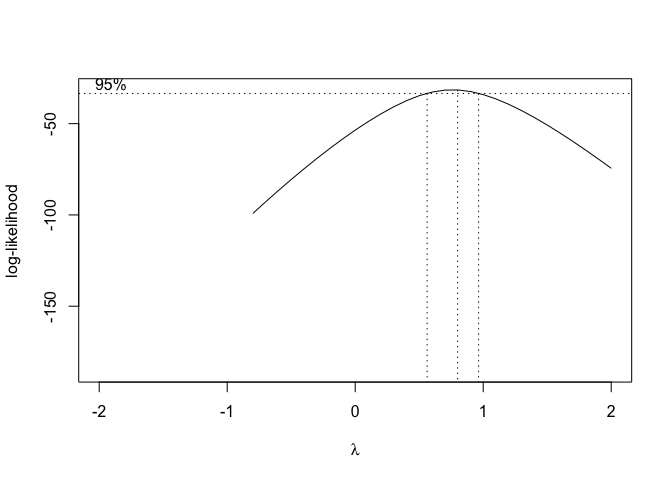
<p class="caption">(\#fig:figName156)Selection of the 'lambda' value for the Box-Cox transformation of a nonlinear regression model</p>
</div>

From Figure \@ref(fig:figName156), we see that the transformation is not required, although a value $\lambda$ = 0.5 (square-root transformation; see previous chapter) might be used to maximise the likelihood of the data under the selected model. We can specify our favourite $\lambda$ value and get the corresponding fit by using the same `boxcox.nsl()` function and passing an extra-argument, as shown in the box below.

\vspace{12pt}

```r
modNlin3 <- boxcox(modNlin, lambda = 0.5)
```

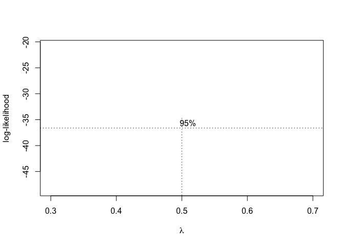<!-- -->

```r
summary(modNlin3)
## 
## Estimated lambda: 0.5 
## Confidence interval for lambda: [NA,NA]
## 
## Formula: newRes ~ eval(parse(text = newFormula), df)
## 
## Parameters:
##    Estimate Std. Error t value Pr(>|t|)    
## A 99.532761   4.625343   21.52 2.87e-16 ***
## k  0.067068   0.002749   24.40  < 2e-16 ***
## ---
## Signif. codes:  0 '***' 0.001 '**' 0.01 '*' 0.05 '.' 0.1 ' ' 1
## 
## Residual standard error: 0.9196 on 22 degrees of freedom
## 
## Number of iterations to convergence: 1 
## Achieved convergence tolerance: 7.541e-06
```

We see that, in spite of the stabilising transformation, the estimated parameters have not lost their measurement unit.

## Making predictions

As shown for linear regression in Chapter 13, every fitted model can be used to make predictions, i.e. to calculate the response for a given X-value or to calculate the X-value corresponding to a given response.

Analogously to linear regression, we could make predictions by using the `predict()` method, although, for nonlinear regression objects, this method does not return standard errors. Therefore, we can use the `gnlht()` function in the 'aomisc' package, which requires the following arguments:

1. a list of functions containing model parameters (with the same names as the fitted model) and, possibly, some other parameters
2. if the previous function contain further parameters with respect to the fitted model, their values need to be given in a data frame as an extra-argument

In the box below we make predictions for the response at 5, 10 and 15 days after the beginning of the experiment.

\vspace{12pt}

```r
func <- list(~A * exp(-k * time))
const <- data.frame(time = c(5, 10, 15)) 
gnlht(modNlin, func,  const)
##                 Form time Estimate        SE  t-value      p-value
## 1 A * exp(-k * time)    5 71.25873 0.9505532 74.96553 5.340741e-28
## 2 A * exp(-k * time)   10 50.96413 0.9100611 56.00078 3.163518e-25
## 3 A * exp(-k * time)   15 36.44947 0.9205315 39.59611 6.029672e-22
```

The same method can be used to make inverse predictions. In our case, the inverse function is:

$$X = - \frac{log \left( \frac{Y}{A} \right)}{k}$$


We can calculate the times required for the concentration to drop to, e.g., 10 and 20 mg/g by using the code in the following box.

\vspace{12pt}

```r
func <- list(~ -(log(Conc/A)/k))
const <- data.frame(Conc = c(10, 20)) 
gnlht(modNlin, func,  const)
##               Form Conc Estimate        SE  t-value      p-value
## 1 -(log(Conc/A)/k)   10 34.29237 0.8871429 38.65484 1.016347e-21
## 2 -(log(Conc/A)/k)   20 23.95291 0.6065930 39.48761 6.399715e-22
```

In the same fashion, we can calculate the half-life (i.e. the time required for the concentration to drop to half of the initial value), by considering that:

$$t_{1/2} = - \frac{ \log \left( {\frac{1}{2}} \right) }{k}$$

The code is::

\vspace{12pt}

```r
func <- list(~ -(log(0.5)/k))
gnlht(modNlin, func)
##            Form Estimate       SE t-value      p-value
## 1 -(log(0.5)/k) 10.33945 0.291017 35.5287 6.318214e-21
```


The 'gnlht()' function provides standard errors based on the delta method, which we have already introduced in a previous chapter.


--- 

## Further readings

1. Bates, D.M., Watts, D.G., 1988. Nonlinear regression analysis & its applications. John Wiley & Sons, Inc., Books.
2. Bolker, B.M., 2008. Ecological models and data in R. Princeton University Press, Books.
3. Carroll, R.J., Ruppert, D., 1988. Transformation and weighting in regression. Chapman and Hall, Books.
4. Ratkowsky, D.A., 1990. Handbook of nonlinear regression models. Marcel Dekker Inc., Books.
5. Ritz, C., Streibig, J.C., 2008. Nonlinear regression with R. Springer-Verlag New York Inc., Books.
6. Schabenberger, O., Pierce, F.J., 2002. Contemporary statistical models for the plant and soil sciences. Taylor & Francis, CRC Press


<!--chapter:end:14-Eng_NonLineare.Rmd-->

# Exercises

This book was not intended to build a solid theoretical foundation in biometry, but it was mainly intended to give you the tools to organise experiments and analyse their results. Therefore, we propose a list of exercises and case studies, so that you can build some practical experience an this matter and evaluate how clear are the concepts exposed earlier in this book. The exercises are organised in sections and each section corresponds to one or more book chapters. In some cases you will need to enter small datasets in R, while, for the bigger datasets, we usually provide the related file in an external repository, so that you can load them in R, by using the appropriate function.

## Designing experiments (ch. 1 to 2)

### Exercise 1

You have been requested to lay-out a breeding experiment, with 16 wheat genotypes, coded by using letters of the Roman alphabet. The aim is to determine which genotype is the best in a given environment.

Write the experimental protocol, where you specify all the main elements of your project (subjects, variables, replicates, experimental design) and draw the field map.

### Exercise 2

Describe the protocol of an experiment to determine the effect of sowing date (autumn and spring) on seven faba bean genotypes. Include all possible elements to assess whether the experiment is valid, describe the type of design and include the field map, showing all relevant information (including plot sizes and orientation in space). What type of check would you add (if any)? Motivate all your choices.

### Exercise 3

Describe the protocol of an experiment to determine the effect of nitrogen dose on several wheat genotypes. Include all possible elements to assess whether the experiment is valid, describe the type of design and include the field map, showing all relevant information (including plot sizes and orientation in space). Motivate all your choices.


---

## Describing the observations (ch. 3)

### Exercise 1

A chemical analysis was performed in triplicate, with the following results: 125,  169 and 142 ng/g. Calculate mean, sum of squares, mean square, standard deviation and coefficient of variation. What is a correct way to display the result?

### Exercise 2

Consider the Excel file 'rimsulfuron.csv' from [https://www.casaonofri.it/_datasets/rimsulfuron.csv](https://www.casaonofri.it/_datasets/rimsulfuron.csv) (you can either download it, or read it directly from the web repository). This is a dataset relating to a field experiment to compare 14 herbicides and two untreated checks, with 4 replicates per treatment. The response variables are maize yield and weed coverage. Describe the dataset and show the results on a barplot, including some measure of variability. Check whether yield correlates to weed coverage and comment on the results.

### Exercise 3

Load the csv file 'students.csv' from [https://www.casaonofri.it/_datasets/students.csv](https://www.casaonofri.it/_datasets/students.csv). This dataset relates to a number of students, their votes in several undergraduate exams and information on high school. Determine: (i) the absolute and relative frequencies for the different subjects; (ii) the frequency distribution of votes in three classes (bins): <24, 24-27, >27; (iii) whether the votes depend on the exam subject and (iv) whether the votes depend on the high school type.

---

## Modeling the experimental data (ch. 4)

### Exercise 1

A xenobiotic substance degrades in soil following a first-order kinetic, which is described by the following equation:

$$Y = 100 \, e^{-0.07 \, t}$$

where Y is the concentration at time $t$. After spraying this substance in soil, what is the probability that 50 days later we observe a concentration below the toxicity threshold for mammalians (2 ng/g)? Please, consider that all the unknown sources of experimental error can be regarded as gaussian, with a coefficient of variability equal to 20%.


### Exercise 2

Crop yield is a function of its density, according to the following function:

$$ Y = 0.8 + 0.8 \, X - 0.07 \, X^2$$


Draw the graph and find the required density to obtain the highest yield (use a simple graphical method). What is the probability of obtaining a yield level between 2.5 and 3 t/ha, by using the optimal density? Consider that random variability is 12%. 


### Exercise 3

The toxicity of a compound changes with the dose, according to the following expression:

$$ Y = \frac{1}{1 + exp\left\{ -2 \, \left[log(X) - log(15)\right] \right\}}$$

where $Y$ is the proportion of dead animals and $X$ is the dose. If we treat 150 animals with a dose of 35 g, what is the probability of finding more than 120 dead animals? The individual variability can be approximated by using a gaussian distribution, with a standard error equal to 10.


### Exercise 4

Consider the sample C = [140 - 170 - 155], which was drawn by a gaussian distribution. Calculate the probability of drawing an individual value from the same pupulation in the following intervals:

1.  higher than 170
2.  lower than 140
3.  within the range from 170 and 140

### Exercise 5

Reproduce the possible results of a genotype experiment, with five maize genotypes (A, B, C, D and E) and expected values of, respectively, 12, 13, 12.5, 14 and 11 tons per hectare. Assume that the experimental (random) variability can be described by a gaussian distribution, with mean equal to 0 and standard deviation equal to 1.25 (common value for all genotypes). The experiment is designed as completely randomised, with four replicates.

### Exercise 6

Consider the relationship between crop yield and density, as shown in Exercise 2 ($Y = 0.8 + 0.8 \, X - 0.07 \, X^2$). Reproduce the results of a completely randomised (four replicates) sowing density experiment, with five densities (2, 4, 6, 8 and 10 plants per square meter), considering that the experimental (random) variability can be described by a gaussian distribution, with mean equal to 0 and standard deviation equal to 0.25 (common value for all densities).


---

## Interval estimation of model parameters (ch. 5)

### Exercise 1

A chemical analysis was repeated three times, with the following results: 125, 169 and 142 ng/g. Calculate mean, deviance, variance, standard deviation, standard error and confidence intervals (P = 0.95 and P = 0.99).

### Exercise 2

An experiment was carried out, comparing the yield of four wheat genotypes (in tons per hectar). The results are as follows:


|Genotype | Rep-1| Rep-2| Rep-3| Rep4|
|:--------|-----:|-----:|-----:|----:|
|A        |  4.72|  5.45|  5.13| 5.19|
|B        |  6.29|  6.79|  7.55| 5.86|
|C        |  5.54|  4.44|  5.16| 5.92|
|D        |  6.68|  6.30|  6.70| 7.77|

For each genotype, calculate the mean, deviance, variance, standard deviation, standard error and confidence interval (P = 0.95).

### Exercise 3

We have measured the length of 30 maize seedlings, treated with selenium in water solution. The observed lengths are:

```
length <- c(2.07, 2.23, 2.04, 2.16, 2.12, 2.33, 2.21, 2.22, 2.29, 2.28, 
2.44, 2.04, 2.02, 1.49, 2.12, 2.38, 2.51, 2.27, 2.55, 2.44, 2.28, 
2.2, 2.03, 2.35, 2.34, 2.34, 1.99, 2.44, 2.44, 1.91)
```

For the above sample, calculate the mean, deviance, variance, standard deviation, standard error and confidence interval (P = 0.95).

### Exercise 4

A sample of 400 insects was sprayed with an insecticide and 136 individuals survived the treatment. Determine the efficacy of the insecticide, in terms of proportion of dead insects, together with 95% confidence limits.

---

## Making decisions under uncertainty (ch. 6)

### Exercise 1

We have compared two herbicides for weed control in maize. With the first herbicide (A), we observed the following weed coverings: 9.3, 10.2, 9.7 %. With the second herbicide, we observed: 12.6, 12.3 and 12.5 %. Are the means for the two herbicides significantly different ($\alpha = 0.05$)?


### Exercise 2

We have made an experiment to compare two fungicides A and B. The first fungicide was used to treat 200 fungi colonies and the number of surviving colonies was 180. B was used to treat 100 colonies and 50 of those survived. Is there a significant difference between the efficiacies of A and B ($\alpha = 0.05$)?


### Exercise 3

A plant pathologist studied the crop performances with (A) and without (NT) a fungicide treatment. The results (yield in tons per hectar) are as follows:

    A    NT
  ----- ----
   65    54
   71    51
   68    59

Was the treatment effect significant ($\alpha = 0.05$)?

### Exercise 4

In this year, an assay showed that 600 olive drupes out of 750 were attacked by  *Daucus olee*. In a close field, under the same environmental conditions, the count of attacked drupes was 120 on 750. Is the the observed difference statistically significant ($\alpha = 0.05$) or is it just due to random fluctuation?

### Exercise 5

In a hospital, blood cholesterol level was measured for eight patients, before and after a three months terapy. The observed values were:

    Patient   Before    After
  ---------- ---------- ----------
           1      167.3      126.7
           2      186.7      154.2
           3      105.0      107.9
           4      214.5      209.3
           5      148.5      138.5
           6      171.5      121.3
           7      161.5      112.4
           8      243.6      190.5

Can we say that this terapy is effective, or  ($\alpha = 0.05$)?

### Exercise 6

A plant breeder organised an experiment to compare three wheat genotypes, i.e. GUERCINO, ARNOVA and BOLOGNA, according to a completely randomised design with 10 replicates. The observed yields are:


| guercino | arnova | bologna |
|:--------:|:------:|:-------:|
|   53.2   |  53.1  |  43.5   |
|   59.1   |  51.0  |  41.0   |
|   62.3   |  51.9  |  41.2   |
|   48.6   |  55.3  |  44.8   |
|   59.7   |  58.8  |  40.2   |
|   60.0   |  54.6  |  37.2   |
|   55.7   |  53.0  |  45.3   |
|   55.8   |  51.4  |  38.9   |
|   55.7   |  51.7  |  42.9   |
|   54.4   |  64.7  |  39.3   |

1. Describe the three samples, by using the appropriate statistics of central tendency and spread
2. Infere the means of the pupulations from where the samples were drawn
3. For each of the three possible couples (GUERCINO vs ARNOVA, GUERCINO vs BOLOGNA and ARNOVA vs BOLOGNA), test the hypothesis that the two means are significantly different ($\alpha = 0.05$).


### Exercise 7

A botanist counted the number of germinated seeds for oilseed rape at two different temperatures (15 and 25°C). At 15°C, 358 germinations were counted out of 400 seeds. At 25°C, 286 germinations were counted out of 380 seeds.

1. Describe the proportions of germination for the three samples
2. Infere the proportion of germinated seeds in the two populations, from where the samples of seeds were extracted (remember that the variance for a proportion is calculated as $p \times (1- p)$).
3. Test the hypothesis that temperature had a significant effect on the germinability of oilseed rape seeds.


---

## Fitting models to data from agriculture experiments

In the following sections we include several case studies that imply a process of model fitting. In most of the cases, these datasets are taken from real experiments and your main aim should be to learn something from those datasets, by asking the right questions. Therefore, do not limit yourself to producing the right statistics and writing the correct R coding, but try to use the statistical tools you have built up to obtain the answers for your questions.

Please, follow the  workplan outlined below.

1. Load the data and make the necessary transformations.
2. Describe the data, by calculating, at least, the means and standard deviations for the experimental groups. This is usually called 'Initial Data Analysis' (IDA) and it is meant to get an idea about the main traits of the data at hand.
3. Specify the model, explain its components and fit the model into the data.
4. Check the model for the basic assumptions and, if necessary, adopt the appropriate correcting measures and re-fit the model
5. Test the significance of all effects, by using the appropriate variance partitioning.
6. If it is appropriate, compare the means for the most relevant effects.
7. Present the results and comment on them

The datasets for the following cases studies are bigger than the ones you met so far and you may not like to enter all the data in R. Therefore, we put all the datasets at your disposal in an Excel file, which you can download from the following link [https://www.casaonofri.it/_datasets/BookExercises.xlsx](https://www.casaonofri.it/_datasets/BookExercises.xlsx). Each dataset is in a different sheet and the sheet names are given in each exercise, so that you can load them by using the 'readxl()' function.

In order to ease you mind, we provide a summary table with the models described in this book and the R coding to fit them.


Table: (\#tab:unnamed-chunk-218)Summary of main models to describe the results of experiments in agriculture

|Model                    |Design                         |R.function  |Specification                                 |
|:------------------------|:------------------------------|:-----------|:---------------------------------------------|
|One-way ANOVA            |CRD                            |lm()        |Y ~ F1                                        |
|One-way ANOVA            |CRBD                           |lm()        |Y ~ F1 + BL                                   |
|Two-way ANOVA            |CRD                            |lm()        |Y ~ F1 * F2                                   |
|Two-way ANOVA            |CRBD                           |lm()        |Y ~ F1 * F2 + BL                              |
|Two-way ANOVA            |Split-plot CRD                 |lmer()      |Y ~ F1 * F2 + (1&#124;MAIN)                   |
|Two-way ANOVA            |Split-plot CRBD                |lmer()      |Y ~ F1 * F2 + BL + (1&#124;MAIN)              |
|Two-way ANOVA            |Strip-plot CRD                 |lmer()      |Y ~ F1 * F2 + (1&#124;ROW) + (1&#124;COL)     |
|Two-way ANOVA            |Strip-plot CRBD                |lmer()      |Y ~ F1 * F2 + BL + (1&#124;ROW + (1&#124;COL) |
|One-way ANOVA            |One-way CRD, two environments  |lm()/lmer() |Y ~ F1 * ENV                                  |
|One-way ANOVA            |One-way CRBD, two environments |lm()/lmer() |Y ~ F1 * ENV + BL&#124;ENV                    |
|Simple Linear Regression |CRD                            |lm()        |Y ~ X1                                        |
|Simple Linear Regression |CRBD                           |lm()        |Y ~ BL + X1                                   |

In the table above, Y is the response variable, that is always continuous/discrete, F1 and F2 are the names of two experimental factors (nominal variables), while X1 is the name of a covariate (continuous variable). BL is the block variable (factor), ENV is the environment variable (factor) and MAIN, ROW, COL are, respectively, the variables (factors) that represent the main plots in a split-plot design and the rows/columns in a strip-plot design.


## One-way ANOVA models (ch. 7 to 9)


### Exercise 1

An experiment was conducted with a completely randomised design to compare the yield of 5 wheat genotypes. The results (in bushels per acre) are as follows:

  
   Variety  |  1   |   2    |  3 |
  |:-----:|:-----:|:-----: |:-----:|
      A     | 32.4 |  34.3  | 37.3 |
      B     | 20.2 |  27.5  | 25.9 |
      C     | 29.2 |  27.8  | 30.2 |
      D     | 12.8 |  12.3  | 14.8 |
      E     | 21.7 |  24.5  | 23.4 |


The example is taken from: Le Clerg *et al*. (1962).

[Sheet: 7.1]

### Exercise 2

Cell cultures of tomato were grown by using three types of media, based on glucose, fructose and sucrose. The experiment was conducted with a completely randomised design with 5 replicates and a control was also added to the design. Cell growths are reported in the table below:

Control | Glucose | Fructose | Sucrose |
|:----:|:----:|:----:|:----:|
45 | 25 | 28 | 31 |
39 | 28 | 31 | 37 |
40 | 30 | 24 | 35 |
45 | 29 | 28 | 33 |
42 | 33 | 27 | 34 |

[Sheet: 7.2]


### Exercise 3

The failure time for a heating system was assessed, to discover the effect of the operating temperature. Four temperatures were tested with 6 replicates, according to a completely randomised design and the number of hours before failure were measured.
The results are as follows:

    Temp.   Hours to failure
  ------- ------------------
     1520               1953
     1520               2135
     1520               2471
     1520               4727
     1520               6134
     1520               6314
     1620               1190
     1620               1286
     1620               1550
     1620               2125
     1620               2557
     1620               2845
     1660                651
     1660                837
     1660                848
     1660               1038
     1660               1361
     1660               1543
     1708                511
     1708                651
     1708                651
     1708                652
     1708                688
     1708                729

Regard the temperature as a factor and determine the best operating temperature, in order to delay failure.

[Sheet: 7.3]

### Exercise 4

An entomologist counted the number of eggs laid from a lepidopter on three tobacco genotypes. 15 females were tested for each genotype and the results are as follows:

    Female   Field   Resistant   USDA
  -------- ------- ----------- ------
         1     211           0    448
         2     276           9    906
         3     415         143     28
         4     787           1    277
         5      18          26    634
         6     118         127     48
         7       1         161    369
         8     151         294    137
         9       0           0     29
        10     253         348    522
        11      61           0    319
        12       0          14    242
        13     275          21    261
        14       0           0    566
        15     153         218    734

Which is the most resistant genotype?    
[Sheet: 7.4]

---

## Multi-way ANOVA models (ch. 10)

### Exercise 1

Data were collected about 5 types of irrigation on orange trees in Spain. The experiment was laid down as complete randomised blocks with 5 replicates and the results are as follows:


|              Method   |  1  |   2   |  3   |  4   |  5    |
|:-----|:----:|:----:|:----:|:----:|:----:|
|            Localised  | 438 |  413  | 375  | 127  | 320   |
|              Surface  | 413 |  398  | 348  | 112  | 297   |
|            Sprinkler  | 346 |  334  | 281  |  43  | 231   |
|Sprinkler + localised  | 335 |  321  | 267  |  33  | 219   |
|           Submersion  | 403 |  380  | 336  | 101  | 293   |


[Sheet: 10.1]

### Exercise 2

A fertilisation trial was conducted according to a randomised complete block design with five replicates. One value is missing for the second treatment in the fifth block. The observed data are percentage contents in P~2~ O~5~ in leaf samples:

              Treatment       1      2     3      4      5
  ----------------------- ------ ------ ----- ------ ------
             Unfertilised    5.6    6.1   5.3    5.9    9.4
                  50 lb N    7.3    6.0   7.7    7.7    NA
                 100 lb N    6.9    6.0   5.6    7.4    8.2
     50 lb N + 75 lb P2O5   10.8   11.2   8.8   10.4   12.9
    100 lb N + 75 lb P205    9.6    9.3    12   10.6   11.6

Is the addition of P~2~ O~5~ a convenient practice, in terms of agronomic effect?

[Sheet: 10.2]

### Exercise 3

A latin square experiment was planned to assess effect of four different fertilisers on lettuce yield. The observed data are as follows:

   Fertiliser   Row   Column      Yield
  ----------- ------ --------- ------------
      A          1        1         104
      B          1        2         114
      C          1        3          90
      D          1        4         140
      A          2        4         134
      B          2        3         130
      C          2        1         144
      D          2        2         174
      A          3        3         146
      B          3        4         142
      C          3        2         152
      D          3        1         156
      A          4        2         147
      B          4        1         160
      C          4        4         160
      D          4        3         163
      
What is the best fertiliser?

[Sheet: 10.3]

---

## Multi-way ANOVA models with interactions (ch. 11 and 13)

Some of the following datasets were obtained by experiments designed as split-plots or strip-plots (see Chapter 2); please, note that, in practice, disregarding the experimental design during data analysis is not admissible! If you have not yet read Chapter 13, you can still analyse these datasets by paying attention to the following issues.

For split-plot and strip-plot designs, we need to use the 'lmer()' function and, thus, we need to install and load the 'lme4' and 'lmerTest' packages.

Before fitting the models, we need to uniquely identify the main-plots (for split-plot designs) and the rows/columns (for strip-plot designs). The main plots can be uniquely identified by crossing the block and main plot factor variables, as in the example below, with the 'Tillage' and 'Block' variables, in the 'dataset' data frame.

```
dataset$mainPlot <- with(dataset, factor(Block:Tillage))
```

For strip-plot designs, the rows and columns can be uniquely identified by crossing the block and each factor variables, as in the example below, with the 'Crop/Herbicide' and 'Block' variables, in the 'dataset' data frame.

```
dataset$Rows <- factor(dataset$Crop:dataset$Block)
dataset$Columns <- factor(dataset$Herbicide:dataset$Block)
```

The code for fitting the models is reported in the table 15.1. The 'plot()' method only returns the plot of 'residuals against expected values' and the 'which' argument does not work. Thus, do not perform the check for the normality of residuals.


### Exercise 1

A pot experiment was planned to evaluate the best timing for herbicide application against rhizome *Sorghum halepense*. Five timings were compared (2-3, 4-5, 6-7 and 8-9 leaves), including a splitted treatment in two timings (3-4/8-9 leaves) and the untreated control. In order to understand whether the application is effective against plants coming from rhizomes of different sizes, a second factor was included in the experiment, i.e. rhizome size (2, 4, six nodes). The design was a fully crossed two-way factorial, laid down as completely randomised with four replicates. The results (plant weights three weeks after the herbicide application) are as follows:

| Sizes / Timings | 2-3   | 4-5   | 6-7   | 8-9   | 3-4/8-9 | Untreated|
|:--------------|:-----:|:-----:|:-----:|:-----:|:-------:|:----:|
| 2-nodes       | 34.03 | 0.10  | 30.91 | 33.21 | 2.89    | 41.63|
|               | 22.31 | 6.08  | 35.34 | 43.44 | 19.06   | 22.96|
|               | 21.70 | 3.73  | 24.23 | 44.06 | 0.10    | 52.14|
|               | 14.90 | 9.15  | 28.27 | 35.34 | 0.68    | 59.81|
| 4-nodes       | 42.19 | 14.86 | 52.34 | 39.06 | 8.62    | 68.15|
|               | 51.06 | 36.03 | 43.17 | 61.59 | 0.05    | 42.75|
|               | 43.77 | 21.85 | 57.28 | 48.89 | 0.10    | 57.77|
|               | 31.74 | 8.71  | 29.71 | 49.14 | 9.65    | 44.85|
| 6-nodes       | 20.84 | 11.37 | 55.00 | 41.77 | 9.80    | 43.20|
|               | 26.12 | 2.24  | 28.46 | 37.38 | 0.10    | 40.68|
|               | 35.24 | 14.17 | 21.81 | 39.55 | 1.42    | 34.11|
|               | 13.32 | 23.93 | 60.72 | 48.37 | 6.83    | 32.21|

In which timing the herbicide is most effective?

[Sheet: 11.1]


### Exercise 2

Six faba bean genotypes were tested in two sowing times, according to a split-plot design in 4 complete blocks. Sowing times were randomised to main-plots within blocks and genotypes were randomised to sub-plots within main-plots and blocks. Results are:


|Sowing  Time| Genotype    |    1  |    2  |    3  |    4  |
|:-----------|------------:|:-----:|:-----:|:-----:|:-----:|
|Autum       |     Chiaro  | 4.36  | 4.00  | 4.23  | 3.83  |
|            |  Collameno  | 3.01  | 3.32  | 3.27  | 3.40  |
|            |  Palombino  | 3.85  | 3.85  | 3.68  | 3.98  |
|            |      Scuro  | 4.97  | 3.98  | 4.39  | 4.14  |
|            |    Sicania  | 4.38  | 4.01  | 3.94  | 2.99  |
|            |    Vesuvio  | 3.94  | 4.47  | 3.93  | 4.21  |
|Spring      |     Chiaro  | 2.76  | 2.64  | 2.25  | 2.38  |
|            |  Collameno  | 2.50  | 1.79  | 1.57  | 1.77  |
|            |  Palombino  | 2.24  | 2.21  | 2.50  | 2.05  |
|            |      Scuro  | 3.45  | 2.94  | 3.12  | 2.69  |
|            |    Sicania  | 3.24  | 3.60  | 3.16  | 3.08  |
|            |    Vesuvio  | 2.34  | 2.44  | 1.71  | 2.00  |

What is the best genotype for autumn sowing?

[Sheet: 11.2]

### Exercise 3

Four crops were sown in soil 20 days after the application of three herbicide treatments, in order to evaluate possible carry-over effects of residuals. The untreated control was also added for comparison and the weight of plants was assessed four weeks after sowing. The experiment was laid down as strip-plot and, within each block, the herbicide were randomised to rows and crops to columns. The weight of plants is reported below:

|  Herbidicide     |Block| sorghum  | rape  | soyabean  | sunflower |
|:-----------------|:---:|:--------:|:-----:|:---------:|:---------:|
|  Untreated       | 1   |     180  |  157  |      199  |       201 |
|                  | 2   |     236  |  111  |      257  |       358 |
|                  | 3   |     287  |  217  |      346  |       435 |
|                  | 4   |     350  |  170  |      211  |       327 |
|  Imazethapyr     | 1   |      47  |   10  |      193  |        51 |
|                  | 2   |      43  |    1  |      113  |         4 |
|                  | 3   |       0  |   20  |      187  |        13 |
|                  | 4   |       3  |   21  |      122  |        15 |
|  primisulfuron   | 1   |     271  |    8  |      335  |       379 |
|                  | 2   |     182  |    0  |      201  |       201 |
|                  | 3   |     283  |   22  |      206  |       307 |
|                  | 4   |     147  |   24  |      240  |       337 |
|  rimsulfuron     | 1   |     403  |  238  |      226  |       290 |
|                  | 2   |     227  |  169  |      195  |       494 |
|                  | 3   |     400  |  364  |      257  |       397 |
|                  | 4   |     171  |  134  |      137  |       180 |

What crops could be safely sown 20 days after the application of imazethapyr, primisulfuron and rimsulfuron?  

[Sheet: 11.3]


### Exercise 4

A field experiment was conducted to evaluate the effect of fertilisation timing (early, medium, late) on two genotypes. The experiment was designed as a randomised complete block design and the data represent the amount of absorbed nitrogen by the plant:

| Genotype | Block  |   Early |  Med  |  Late  |
|:---------|:------:|:-------:|:-----:|:------:|
| A        |    1   |   21.4  |  50.8 |  53.2  |
|          |    2   |   11.3  |  42.7 |  44.8  |
|          |    3   |   34.9  |  61.8 |  57.8  |
| B        |    1   |   54.8  |  56.9 |  57.7  |
|          |    2   |   47.9  |  46.8 |  54.0  |
|          |    3   |   40.1  |  57.9 |  62.0  |

What is the best genotype? What is the best fertilisation timing? Do these two factors interact and how?
 
[Sheet: 11.4]

### Exercise 5

A study was carried out to evaluate the effect of washing temperature on the reduction of length for four types of fabric. Results are expressed as percentage reduction and the experiment was completely randomised, with two replicates:

  | Fabric  |     210 °F  |    215 °F  |    220 °F   |  225 °F   |
  |:-------:|:-----------:|:----------:|:-----------:|:---------:|
  |    A    |     1.8     |     2.0    |     4.6     |    7.5    |
  |         |     2.1     |     2.1    |     5.0     |    7.9    |
  |    B    |     2.2     |     4.2    |     5.4     |    9.8    |
  |         |     2.4     |     4.0    |     5.6     |    9.2    |
  |    C    |     2.8     |     4.4    |     8.7     |   13.2    |
  |         |     3.2     |     4.8    |     8.4     |   13.0    |
  |    D    |     3.2     |     3.3    |     5.7     |   10.9    |
  |         |     3.6     |     3.5    |     5.8     |   11.1    |  

Consider the temperature as a factor and answer the following questions:

1. What is the best fabric, in terms of tolerance to high temperatures? What is the highest safe temperature, for each fabric?

[Sheet: 11.5]

### Exercise 6

A chemical process requires one alcohol and one base. A study is organised to evaluate the factorial combinations of three alcohols and two bases on the efficiency of the process, expressed as a percentage. The experiment is designed as completely randomised.

 | Base  | Alcohol 1 | Alcohol 2 | Alcohol 3 |
 |:-----:|:---------:|:---------:|:---------:|
 |   A   |  91.3     |    89.9   |     89.3  |
 |       |  88.1     |    89.5   |     87.6  |
 |       |  90.7     |    91.4   |     90.4  |
 |       |  91.4     |    88.3   |     90.3  |
 |   B   |  87.3     |    89.4   |     92.3  |
 |       |  91.5     |    93.1   |     90.7  |
 |       |  91.5     |    88.3   |     90.6  |
 |       |  94.7     |    91.5   |     89.8  |

What is the combination that gives the highest efficiency?
    
[Sheet: 11.6]

---

## Simple linear regression (ch. 12)

When the predictor is a quantitative variable, we may be interested to check for the existence of a possible functional relationship, in the form of some sort of dose-response curve. The simplest regression model is the 'straight line', with equation $Y = b_0 + b_1 \, X$; fitting this model implies finding maximum likelihood values for $b_0$ and $b_1$, so that the resulting line passes as close as possible to the observed values. When we fit a regression model, the workplan at Section 15.6 is changed at step 4 (model checking); indeed, apart from the usual check for the homoscedasticity and normality of residuals, we have to check for possible lack of fit (i.e., the model sistematically deviates from the observed responses). This is done by plotting the observed values against the predictor and adding the regression line. This may be done by using the following code:

```
model <- lm(Y ~ X1, data = dataset) # fits the model
summary(model) # get model parameters and use them below
b0 <- 10 # value obtained from the previous step
b1 <- 0.5 # value obtained from the previous step
plot(Y ~ X1, data = dataset) # plot the observed values
curve(B0 + B1 * x, add = T) # 'x' must be used in small letter
```

Obviously, when we fit a regression model we do not need to do any multiple comparison testing: if we can prove that the response follows a certain continuous curve, every predictor value produces a more or less different response from any other predictor value.

Regression models can be fitted also to unreplicated data or to the group means. However, when we have the replicates, we have two possible models to fit. The first possibility is to disregard the quantitative nature of the independent variable, regard it as a factor (qualitative variable) and fit an ANOVA model, as we have seen in the previous sections. This first model is the best fitting one, because we do not put any constraint on the 'shape' of the response, matching exactly the mean responses for all treatment groups. The second possibility is to recognise that the predictor is a quantity (e.g., a dose) and fit a simple linear regression model; in this case, we constrain the response to be linear and continuously increase/decrease as the predictor increases/decreases. This second model is worse than the first one, because it will never match the mean responses for all treatment group, unless these means are perfectly aligned, which is almost impossible. However, it is also simpler because, regardless of the number of levels for the predictor, we always fit two parameters: an intercept and a slope. We can test the hypothesis of no lack of fit, by comparing the regression model and the ANOVA model by using the following code:

```
anova(model1, model2)
```
The null hypothesis is that there is no lack of fit and, thus, the fit of the two models is more or less similar. This null can be accepted if the P-level is higher than 0.05 and, in such a case, we favour the regression model over the ANOVA model, for its higher simplicity (Occam's razor principle).

In the case of replicated experiments designed in blocks, we also have to add the block effect to the model, regarding the block variable as a factor (as usual). In this case the model is:

```
model <- lm(Y ~ BL + X1, data = dataset) # fits the model
summary(model)
```

and the 'summary()' method produces several intercepts (one per each block) and one slope value. In order to plot the model, we need to calculate the average intercept value, which can be done by using the 'emmeans()' function, as shown below:


```
emmeans(model, ~1, at = (X1 = 0))
```


### Exercise 1

A study was conducted to evaluate the effect of nitrogen fertilisation in lettuce. The experiment is completely randomised with 4 replicates and the yield results are as follows:

   N level   B1    B2    B3    B4
  --------- ----- ----- ----- -----
      0      124   114   109   124
     50      134   120   114   134
     100     146   132   122   146
     150     157   150   140   163
     200     163   156   156   171

What yield might be obtained by using 120 kg N ha^-1^?

[Sheet: 12.1]

### Exercise 2

A study was conducted to evaluate the effect of increasing densities of a weed (*Sinapis arvensis*) on sunflower yield. The experiment was completely randomised and the observed results are:

   density   Rep     yield
  --------- ------- --------
      0        1     36.63
     14        1     29.73
     19        1     32.12
     28        1     30.61
     32        1      27.7
     38        1     27.43
     54        1     24.79
      0        2     36.11
     14        2     34.72
     19        2     30.12
     28        2      30.8
     32        2     26.53
     38        2      27.6
     54        2     23.31
      0        3     38.35
     14        3     32.16
     19        3     31.72
     28        3     28.69
     32        3     25.88
     38        3     28.43
     54        3     30.26
      0        4     36.74
     14        4     32.566
     19        4     29.57
     28        4     33.663
     32        4     28.751
     38        4     27.114
     54        4     24.664

Assuming that the yield response is linear, parameterise the model, check the goodness of fit and find the economical threshold level of weed density, considering that the yield worths 150 Euros per ton and the herbicide treatment costs 40 Euros per hectar. 

[Sheet: 12.2]     

---

## Nonlinear regression (ch. 14)

### Exercise 1

Two soil samples were treated with two herbicides and put in a climatic chamber at 20°C. Sub-samples were collected from both samples in different times and the concentration of herbicide residues was measured. The results are as follows:

   Time   Herbicide A   Herbicide B
  ------ ------------- -------------
    0       100.00        100.00
    10       50.00         60.00
    20       25.00         40.00
    30       15.00         23.00
    40       7.00          19.00
    50       3.50          11.00
    60       2.00          5.10
    70       1.00          3.00

Assuming that the degradation follows an exponential decay trend, determine the half-life for both herbicides.    
[Sheet: 14.1]


### Exercise 2

A microbial population grows exponentially over time. Considering the following data, determine the relative rate of growth, by fitting the exponential growth model.

   Time   Cells
  ------ -------
    0       2
    10      3
    20      5
    30      9
    40     17
    50     39
    60     94
    70     201

How long does it take before we reach 100 cells?
    
[Sheet: 14.2]    

### Exercise 3

An experiment was conducted to determine the absorption of nitrogen by roots of *Lemna minor* in hydroponic colture. Results (N content) are the following:

    Conc     Rate
  -------- --------
    2.86    14.58
    5.00    24.74
    7.52    31.34
   22.10    72.97
   27.77    77.50
   39.20    96.09
   45.48    96.97
   203.78   108.88

Use nonlinear least squares to estimate the parameters for the rectangular hyperbola (Michaelis-Menten model):

$$Y = \frac{a X} {b + X}$$

and make sure that model fit is good enough.

[Sheet: 14.3]

### Exercise 4

An experiment was conducted to determine the yield of sunflower at increasing densities of a weed (*Ammi majus*). Based on the following results, parameterise a rectangular hyperbola ($Y = (a \, X)/(b + X)$ and test for possible lack of fit. The results are:

   Weed density   Yield Loss (%)
  -------------- ---------------
        0         0
        23        17.9
        31        21.6
        39        26.9
        61        29.5

[Sheet: 14.4]

### Exercise 5

An experiment was conducted in a pasture, to determine the effect of sampling area on the number of plant species (in general, the higher the sampling area and the higher the number of sampled species). The results are as follows:.

   Area   N. of species
  ------ --------------
    1         4
    2         5
    4         7
    8         8
    16       10
    32       14
    64       19
   128       22
   256       22

By using the above data, parameterise a power curve $Y = a \, X^b$ and test for lack of fit.

[Sheet: 14.5]

### Exercise 6

Crop growth can be often described by using a Gompertz model. The data below refer to an experiment were sugarbeet was grown either weed free, or weed infested; the weight of the crop per unit area was measured after six different numbers of Days After Emergence (DAE). The experiment was conducted by using a completely randomised design with three replicates and the results are reported below:

   DAE   Infested   Weed Free
  ----- ---------- -----------
   21      0.06       0.07
   21      0.06       0.07
   21      0.11       0.07
   27      0.20       0.34
   27      0.20       0.40
   27      0.21       0.25
   38      2.13       2.32
   38      3.03       1.72
   38      1.27       1.22
   49      6.13       11.78
   49      5.76       13.62
   49      7.78       12.15
   65     17.05       33.11
   65     22.48       24.96
   65     12.66       34.66
   186    21.51       38.83
   186    26.26       27.84
   186    27.68       37.72

Parameterise two Gompertz growth models (one for the weed-free crop and one for the infested crop) and evalaute which of the parameters are most influenced by the competition. The Gompertz growth model is:

$$Y = d \cdot exp\left\{- exp \left[ - b (X - e)\right] \right\}$$

[Sheet: 14.6]

### Exercise 7

Plants of *Tripleuspermum inodorum* in pots were treated with a sulphonylurea herbicide  (tribenuron-methyl) at increasing rates. Three weeks after the treatment the weight per pot was recorded, with the following results:

   Dose (g a.i. ha$^{-1}$)   Fresh weight (g pot $^{-1}$)
  ------------------------- ------------------------------
              0                         115.83
              0                         102.90
              0                         114.35
            0.25                        91.60
            0.25                        103.23
            0.25                        133.97
             0.5                        98.66
             0.5                        92.51
             0.5                        124.19
              1                         93.92
              1                         49.21
              1                         49.24
              2                         21.85
              2                         23.77
              2                         22.46

Assuming that the dose-response relationship can be described by using the following log-logistic model:

$$Y = c + \frac{d - c}{1 + exp \left\{ - b \left[ log (X) - log (e) \right] \right\}}$$

Parameterise the model and evaluate the goodnes of fit.

[Sheet: 14.7]


<!--chapter:end:15-Eng_Exercises.Rmd-->

# APPENDIX: A very gentle introduction to R

## What is R?

R is a statistical software; it is open source and it works under a freeware GNU licence. It is very powerful, but it has no graphical interface and, thus, we need to write a few lines of cod, which is something we may not be used to do.

## Installing R and moving the first steps

In order to get started, please, follow these basic steps:

1. Install R from: [https://cran.r-project.org](https://cran.r-project.org). Follow the link to CRAN (uppermost right side), select one of the available mirrors (you can simply select the first link on top), select your Operating System (OS) and download the base version. Install it by using all default options.
2. Install RStudio from: [https://rstudio.com/products/rstudio/](https://rstudio.com/products/rstudio/). Select RStudio Desktop version, open source edition and download. Install it by using all default options.
3. Launch RStudio.

You will see that RStudio consists of four panes, even hough, at the beginning, we will only use two of them, named: (1) SOURCE and (2) CONSOLE. The basic principle is to write code in the SOURCE pane and send it to the CONSOLE pane, by hitting 'ctrl-R' or 'ctrl-Return' ('cmd-Return' in Mac OSx). The SOURCE pane is a text editor and we can save script files, by using the '.R' extension. The CONSOLE pane is where the code is processed, to return the results.

Before we start, there are a few important suggestions that we should keep into consideration, in order to save a few headackes:

1. unlike most programs in WINDOWS, R is case-sensitive and, e.g., 'A' is not the same as 'a'. Please, note that most errors in R are due to small typos, which may take very long to be spotted!
2. Code written in the SOURCE pane **MUST BE** sent to the console pane, otherwise it is not executed. It's like writing a WhatsApp message: our mate cannot read our message until we send it away to him!
3. Spaces can be used to write clearer code and they are usually allowed, except within variable names, function names and some operators composed by more than one character. 
4. It is useful to comment the code, so that, in future times, we can remember what we intended to do, when we wrote that code. Every line preceded by a hash symbol (#) is not executed and it is regarded as a comment.

## Assignments

In R, we work with objects, that must be assigned a name, so that they can be stored in memory and easily recalled. The name is a **variable** and it is assigned by the assignment operator '<-' (Less-then sign + dash sign). For example, the following code assigns the value of 3 to the 'y' variable. The content of a variable can be visualised by simply writing its names and sending it to the console.


```r
y  <-  3
y
## [1] 3
```


## Data types and data objects

In R, as in most programming languages, we have different data types that can be assigned to a variable:

1. numeric (real numbers)
2. integer (natural numbers)
3. character (use quotation marks: "andrea" or "martina")
4. factor
5. logic (boolean): TRUE or FALSE

Depending on their type, data can be stored in specific objects. The most important object is the **vector**, that is a uni-dimensional array, storing data of the same type (either numeric, or integer, or logic... you can't mix!). For example, the following box shows a vector of character strings and a vector of numeric values: we see that the vector is created by the `c()` function and the elements are separated by commas.


```r
sentence <- c("this", "is", "an", "array", "of", "characters")
x <- c(12, 13, 14)
```

The factor vector is different from a character vector, as it is used to store character values belonging to a predefined set of levels; the experimental treatment variables (experimental factors, as we called them in Chapter 2) are usually stored as R factors. The code below shows a character vector that is transformed into a factor, by using the `factor()` function.


```r
treat  <-  c("A", "A", "B", "B", "C", "C")
treat
## [1] "A" "A" "B" "B" "C" "C"
factor(treat)
## [1] A A B B C C
## Levels: A B C
```

By now, we have already used a couple of functions ad we have noted that they are characterised by a name followed by a pair of round brackets (e.g., `c()` or `factor()`). The arguments go inside the brackets, but we will give more detail later on.


## Matrices

Vectors are uni-dimensional arrays, while matrices are bi-dimensional arrays, with rows and columns. The matrix object can be used to store only data of the same type (like a vector) and it is created by using the `matrix()` function. The first argument to this function is a vector of values, the second argument is the number of rows and the third one is the number of columns. The fourth argument is logical and it specifies whether the matrix is to be populated by row ('byrow = TRUE') or by column ('byrow = FALSE'). 


```r
z  <-  matrix(c(1, 2, 3, 4, 5, 6, 7, 8),
              2, 4, byrow=TRUE)
z
##      [,1] [,2] [,3] [,4]
## [1,]    1    2    3    4
## [2,]    5    6    7    8
```

## Dataframes

The dataframe is also a table (like a matrix), but columns can contain data of different types. It is the most common way to store the experimental data and it should be orginised in a 'tidy' way: with one experimental unit per row and all the traits of each unit in different columns. In the box below we create three vectors and combine them in a dataframe. 

\scriptsize

```r
plot  <-  c(1, 2, 3, 4, 5, 6)
treat  <-  factor(c("A", "A", "B", "B", "C", "C"))
yield  <-  c(12, 15, 16, 13, 11, 19)
dataset  <-  data.frame("Plot" = plot,
  "Treatment" = treat, "Yield" = yield)
dataset
##   Plot Treatment Yield
## 1    1         A    12
## 2    2         A    15
## 3    3         B    16
## 4    4         B    13
## 5    5         C    11
## 6    6         C    19
```

\normalsize

## Working with objects

If we have created a number of objects and stored them in memory, we might be interested in viewing them or accessing some of their elements. Objects can be simply viewed by using their name, as shown below.


```r
z
##      [,1] [,2] [,3] [,4]
## [1,]    1    2    3    4
## [2,]    5    6    7    8
```

With objects containing more than one value (vectors, matrices or dataframes) we can use indexing to retreive an element in a specific position. Indexing is performed by using square brackets, containing the index or a list of indices, for multi-dimensional objects.


```r
x[1] # First element in a vector
## [1] 12
z[1, 3] # Element in first row and third column, in a dataframe or matrix
## [1] 3
dataset[ ,1] # First Column
## [1] 1 2 3 4 5 6
dataset[1, ] # First Row
##   Plot Treatment Yield
## 1    1         A    12
```

Column vectors in dataframes can also be accessed by using their name and the 'dollar' sign, as shown below.


```r
dataset$Plot
## [1] 1 2 3 4 5 6
```

It is also useful to ask for infos about objects, which can be done by using two functions:

1. `str()`: tells us the structure of an object
2. `summary()` - summarizes the main traits of an object


```r
str(dataset)
## 'data.frame':	6 obs. of  3 variables:
##  $ Plot     : num  1 2 3 4 5 6
##  $ Treatment: Factor w/ 3 levels "A","B","C": 1 1 2 2 3 3
##  $ Yield    : num  12 15 16 13 11 19
summary(dataset)
##       Plot      Treatment     Yield      
##  Min.   :1.00   A:2       Min.   :11.00  
##  1st Qu.:2.25   B:2       1st Qu.:12.25  
##  Median :3.50   C:2       Median :14.00  
##  Mean   :3.50             Mean   :14.33  
##  3rd Qu.:4.75             3rd Qu.:15.75  
##  Max.   :6.00             Max.   :19.00
```

## Expressions, functions and arguments

Expressions can be used to return results or store them in new variables.


```r
2 * y
## [1] 6
f  <-  2 * y
f
## [1] 6
```


As we anticipated above, functions are characterised by a name and a list of arguments in brackets.


```r
log(5)
## [1] 1.609438
```

Very often, there are multiple arguments and we have to pay some attention on how to supply them. We can either:

1. supply them in the exact order with which R expects them
2. use argument names

We can see the required list of arguments and their order by using the R help, that is invoked by a question mark followed by the function name, as shown in the example below.

```
# Getting help
?log 
```


```r
# The two arguments are the value and the base for logarithm
log(100, 2) # Supplied in order
## [1] 6.643856
log(100, base = 2) # Supplied with names
## [1] 6.643856
log(base=2, 100) # Different order, but correct syntax
## [1] 6.643856
log(2, 100) # Wrong!!!
## [1] 0.150515
```


## A few useful functions

A few functions are useful to analyse the experimental data. For example, it is important to be able to create sequences of values, as shown below.


```r
plot  <-  seq(1, 10,1)
plot
##  [1]  1  2  3  4  5  6  7  8  9 10
```

Likewise, we need to be able to save time by repeating vectors or vector elements, as shown below.


```r
treat <- c("A", "B", "C")
rep(treat, 3) #Repeating whole vector
## [1] "A" "B" "C" "A" "B" "C" "A" "B" "C"
rep(treat, each = 3) #Repeating each element
## [1] "A" "A" "A" "B" "B" "B" "C" "C" "C"
```

Several vectors can be combined in one vector by using the `c()` function:


```r
y <- c(1,2,3)
z <- c(4,5,6)
c(y, z)
## [1] 1 2 3 4 5 6
```


During our R session, objects are created and written to the workspace (environment). At the end of a session (or at the beginning of a new one) we might like to clean the workspace, by using the `rm()` function as shown below.


```r
rm(y, z) # remove specific objects
rm(list=ls()) # remove all objects
```

## Extractors

In some cases, functions return several objects, which are allocated to different slots. To extract such objects, we use the '$' operator. For example, the `eigen()` function calculates the eigenvector and eigenvalues of a matrix and these results are saved into the same variable, but in different slots. We can extract the results as shown below.


```r
MAT  <-  matrix(c(2,1,3,4),2,2)
MAT
##      [,1] [,2]
## [1,]    2    3
## [2,]    1    4
ev  <-  eigen(MAT)
ev
## eigen() decomposition
## $values
## [1] 5 1
## 
## $vectors
##            [,1]       [,2]
## [1,] -0.7071068 -0.9486833
## [2,] -0.7071068  0.3162278
ev$values
## [1] 5 1
ev$vectors
##            [,1]       [,2]
## [1,] -0.7071068 -0.9486833
## [2,] -0.7071068  0.3162278
```


## Reading external data

R is not always the right tool to enter the experimental data and, most often, we enter the data by using a spreadsheet, such as EXCEL. This data can be stored as '.xls' or '.xlsx' files, or, as it is often the case in this book, as '.csv' file. While the former file types are specific to EXCEL, CSV files are a type of cross-platform text data, which does not store information about formatting (bold, italic or lines and background colors...), but it can be opened by all programmes and operating systems.

To open '.csv' data, we can use the `read.csv()` function, while, for EXCEL files, we need to dowload, install and load an additional package ('readxl'), which is accomplished by using the following code:


```r
# install.packages("readxl") #install the package: only at first instance
library(readxl) # Load the library: at the beginning of each session
```

Loading the file is straightforward: if we know where the file is located, we use the commands:

```
dataset  <-  read.csv("fileName", header=TRUE) # Open CSV file
dataset  <-  read_xls("fileName", sheet = "nameOfSheet") # Open XLS file
dataset  <-  read_xlss("fileName", sheet = "nameOfSheet") # Open XLSX file
```

If we know the filename and its path, we can use it in place of 'fileName', or, more easily, we can use the `file.choose()` function, which shows a selection windows, from where we can select the file to be opened.

```
dataset  <-  read.csv(file.choose()", header=TRUE) # Open CSV file
```


## Simple R graphics

This is a huge topic, that we do not intend to develop here. We would just like to show a couple of examples of how simple graphs can be created with R. The code shown below can be used to draw an x-y scatterplot and to superimpose a curve, by using its equation. This will suffice, so far, but we would like to emphasize that, whit some training, R can be used to draw very professional graphs.


```r
x  <-  c(1, 2, 3, 4)
y  <-  c(10, 11, 13, 17)
plot(y ~ x)
curve(7.77 * exp(0.189 * x), add = T, col = "red")
```

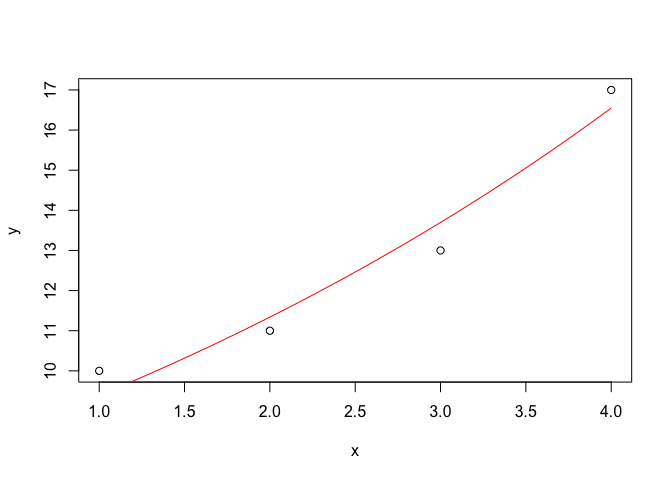

---

## Further readings 


1. Maindonald J. Using R for Data Analysis and Graphics - Introduction, Examples and Commentary. (PDF, data sets and scripts are available at [JM's homepage](https://cran.r-project.org/doc/contrib/usingR.pdff).
2. Oscar Torres Reina, 2013. Introductio to RStudio (v. 1.3). [This homepage](https://dss.princeton.edu/training/RStudio101.pdf)

<!--chapter:end:16-Eng_IntroduzioneR.Rmd-->

