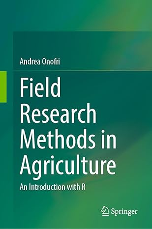
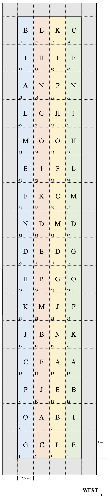
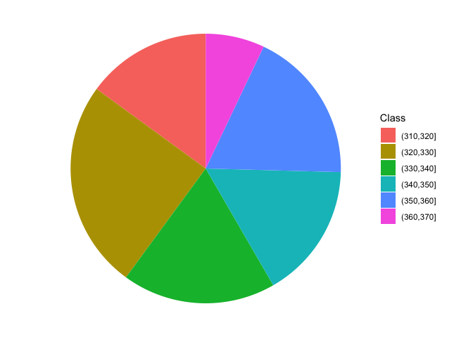

# Preface {-}


<a href = "https://link.springer.com/book/10.1007/978-3-032-08199-5"></a>


This website is associated to the book 'Experimental methods in agriculture: an introduction with R', published by Springer Nature in 2025, which is a simple, 'non-mathematical' introduction to the experimental design and basic data analyses for field experiments in agriculture and related disciplines. It focuses on small-plot experiments, which are the fundamental foundations of scientific progress in agriculture. Indeed, these experiments are used to evaluate and compare, e.g., innovative genotypes, agronomic practices, pesticides and other plant protection methods. You can [visit the Springer publication website for the table of contents and sample chapters or to buy the whole book or any of its individual Chapters](https://link.springer.com/book/10.1007/978-3-032-08199-5).

This web sites hosts additional material, which might turn out useful either for teaching purposes, or for delving a little deeper in some topics. Additional R codes, slides and other information is also provided in my blog, that hosts this e-book.

## Statistical software {-}

In this website, as in the related book and hosting blog, datasets are analysed by using the R statistical software (R Core Team, 2024), within the RStudio environment (Posit team, 2024). Such choice was made for a number of reasons, including the fact that this language is very powerful and a lot of fun to work with.  I am very much indebted to the whole community, who is working to ensure the wide availability of these tools and preserve their freeware nature.

In order to work through this website, you will need to have installed R, RStudio and the following packages (in alphabetical order): `car` \citep{Fox_2019}, `drc` \citep{ritz_2019}, `emmeans` \citep{Lenth_2024},  `lme4` \citep{Bates_2015}, `lmerTest` \citep{Kuznetsova_2017}, `MASS` \citep{venables_2002},  `multcomp` \citep{Hotorn_2008}, `multcompView` \citep{Graves_2024}, `SuppDists` \citep{Wheeler_2025} and `statforbiology` \citep{Onofri_2025}. This latter is the accompanying R package for this website and the associated blog (see later). The readers should install these packages from CRAN, before starting to work through this book. The installation can be done by using the 'install packages' entry in the 'Tools' menu in R Studio.

It is also important to mention that this book and the associated website (see later) are written in RMarkdown \citep{Xie_2018} with the `bookdown` \citep{Xie_2024} and `blogdown` \cite{Xie_2017} packages; these are very useful and we feel very much indebted to the respective authors.

## Dedication {-}

This website is dedicated to the memory of my colleague and friend Dario Sacco (University of Torino, Italy). We started working together on a book project, and he was very eager to contribute to the first two Chapters in the earlier Italian version. Unfortunately, he had no luck and suddenly died far too early. This book is heavily based on the lengthy discussions we had during the statistics courses of the Italian Society of Agronomy, and the final result would have been much better if it had benefited from the continuing support and contributions from Dario.

## Acknowledgments {-}

I would like to thank my Colleagues at the Department of Agriculture, Food, and Environmental Sciences (University of Perugia, Italy): it has been a long road together, and I am happy we walked it together. In particular, I would like to thank Dino Alberati, Egidio Ciriciofolo, Gino Covarelli, Marcello Guiducci, Euro Pannacci, and Francesco Tei, from whom I have learned most of the subtleties of the research work.

This book and website owe much to the countless questions, confusions, and concerns shared by my students. In striving to support their learning journey, I found the motivation to write more clearly, think more deeply, and explain more simply.

Last but not least, I am deeply indebted to the R Core development team for the availability of the R language and environment, as well as for their efforts to maintain and preserve its freeware nature. I also want to mention that this book and its associated website are written in \texttt{RMarkdown}, using the \texttt{bookdown} and \texttt{blogdown} packages, which are three valuable additions to the R project, for which I am very much indebted.


<!--chapter:end:index.Rmd-->

# Science, data, and experiments

Nothing to add, yet

<!--chapter:end:01-ScienceData.Rmd-->

# The design of field experiments

## Suggestions to lay out proper field experiments

In order to lay-out a proper design and draw a correct map for a field experiment, it is necessary to consider the following items:

1. Length and width of the available space in the field
2. Sowing/working direction
3. Presence of fertility gradients of any kinds

Let's consider, for example, the experiment described in the Exercise 7 of Chapter 2. The text of such an Exercise is as follows: *You have been requested to design a breeding experiment with 16 wheat genotypes coded by using letters of the Roman alphabet. The aim is to determine which genotype is the best in a given environment. Write the experimental protocol, where you specify all the main elements of your project (subjects, variables, replicates, experimental design), and draw the field map. Consider a field measuring 400 m in length, 20 m in width and with the longer side aligned north-south. Sowing is carried out longitudinally, along the north-south axis, with a 2.5 m wide machine. The field is uniform along its longitudinal axis, although there is a significant transversal fertility gradient*.

How should we design such an experiment? I'll propose a stepwise solution (which is not at all the only possible solution!).

### Step 1

Let's start by projecting the size of a plot: wheat is to be regarded as a high-density crop (350-400 plants per square meter, in central Italy) and, thus, a plot of 20 m^2^ should be regarded as big enogh to obtain reliable yield data. Considering that the available sowing machine has a working width of 2.5 m, the most appropriate plot size should be 2.5 m in width and, consequently, 8 m in length.

### Step 2

Secondly, we should project the size of the grid. Considering that the field is usually worked and sown along its longitudinal axis and that it is relatively uniform along this axis, it would be appropriate to lay out the plot with its long side along the working direction. A 16 $\times$ 4 grid would be appropriate, with four 'vertical' blocks (one beside the other, along the fertility gradient), so that all the plots in one block are located in the very same position along the fertility gradient. Such a grid should fit with no problem in the available space. The surrounding space could be used to sow winter wheat, to avoid border effects along the edges of the experiment.

### Step 3

Allocate the genotypes to the plots, according to a Randomized Complete Block Design, so that there is one and only one replicate per genotype per block. In order to ease your mind, the package `agricolae` may provide significant help to randomised the genotypes and avoid errors (see code below). The final map could be as shown in the following Figure (the four blocks are in different colors). 


```r
library(agricolae)
des <- design.rcbd(LETTERS[1:16], r = 4, seed = 1234)
des$sketch
##      [,1] [,2] [,3] [,4] [,5] [,6] [,7] [,8] [,9] [,10]
## [1,] "G"  "O"  "P"  "C"  "J"  "K"  "H"  "D"  "N"  "F"  
## [2,] "C"  "A"  "J"  "F"  "B"  "M"  "P"  "E"  "D"  "K"  
## [3,] "L"  "B"  "E"  "A"  "N"  "J"  "G"  "D"  "M"  "C"  
## [4,] "E"  "I"  "B"  "A"  "K"  "P"  "O"  "G"  "D"  "M"  
##      [,11] [,12] [,13] [,14] [,15] [,16]
## [1,] "E"   "M"   "L"   "A"   "I"   "B"  
## [2,] "I"   "O"   "G"   "N"   "H"   "L"  
## [3,] "F"   "O"   "H"   "P"   "I"   "K"  
## [4,] "L"   "H"   "J"   "N"   "F"   "C"
```


<div class="figure" style="text-align: center">

<p class="caption">(\#fig:Exercise27)Randomised Complete Blocks Design (see Exercise 2.7)</p>
</div>


'agricolae'

<!--chapter:end:02-ExperimentalLayOut.Rmd-->

# Describing nominal data

Nominal data are produced by assigning the subjects to one of a set of categories, such as dead/alive, germinated/ungerminated, red/blue/green, and so on. For this data, especially when the number of categories is higher than two, the statistics described in book Chapter 3 cannot be used and different approaches need to be sought for their description.

The most widespread technique is to derive **absolute  frequencies**, that are the counts of individuals in each category; by doing so, a  **distribution of frequencies** is built. 

As an example of nominal data we can take the 'mtcars' dataset, that was extracted from the 1974 Motor Trend US magazine and comprises 32 old automobiles. The dataset is available in R and we show part of it in  table 3.2.


Table: (\#tab:unnamed-chunk-2)Part of the dataset 'mtcars' in R, representing the characteristics of 32 old automobiles; 'vs' is the type of engine (0 for V-shaped and 1 for straight engine) and 'gear' is the number of forward gears. More detail is given in the text.

|                    | vs| gear|
|:-------------------|--:|----:|
|Mazda RX4           |  0|    4|
|Mazda RX4 Wag       |  0|    4|
|Datsun 710          |  1|    4|
|Hornet 4 Drive      |  1|    3|
|Hornet Sportabout   |  0|    3|
|Valiant             |  1|    3|
|Duster 360          |  0|    3|
|Merc 240D           |  1|    4|
|Merc 230            |  1|    4|
|Merc 280            |  1|    4|
|Merc 280C           |  1|    4|
|Merc 450SE          |  0|    3|
|Merc 450SL          |  0|    3|
|Merc 450SLC         |  0|    3|
|Cadillac Fleetwood  |  0|    3|
|Lincoln Continental |  0|    3|
|Chrysler Imperial   |  0|    3|
|Fiat 128            |  1|    4|
|Honda Civic         |  1|    4|
|Toyota Corolla      |  1|    4|
|Toyota Corona       |  1|    3|
|Dodge Challenger    |  0|    3|
|AMC Javelin         |  0|    3|
|Camaro Z28          |  0|    3|
|Pontiac Firebird    |  0|    3|
|Fiat X1-9           |  1|    4|
|Porsche 914-2       |  0|    5|
|Lotus Europa        |  1|    5|
|Ford Pantera L      |  0|    5|
|Ferrari Dino        |  0|    5|
|Maserati Bora       |  0|    5|
|Volvo 142E          |  1|    4|

The variable 'vs' in 'mtcars' takes the values 0 for V-shaped engine and 1 for straight engine. Obviously, the two values 0 and 1 are just used to name the two categories and the resulting variable is purely nominal. The absolute frequencies of cars in the two categories are, respectively 18 and 14 and they are easily obtained by a counting process. In R, these absolute frequencies can be obtained by the `table()` function, as we show in the box below.


```r
data(mtcars)
table(mtcars$vs)
## 
##  0  1 
## 18 14
```

The **relative frequencies** are obtained by dividing the absolute frequencies by the total number of observations. These frequencies are, respectively, 0.5625 and 0.4375 and, in R, they can be obtained by the joint usage of the `table()` and `length()` functions, where this latter returns the number of values in a vector.


```r
table(mtcars$vs)/length(mtcars$vs)
## 
##      0      1 
## 0.5625 0.4375
```

If we consider a variable where the classes can be logically ordered, we can also calculate the **cumulative frequencies**, by summing up the frequency for one class with the frequencies for all previous classes. As an example we take the 'gear' variable in the 'mtcars' dataset, showing the number of forward gears for each car. We can easily see that 15 cars have 3 gears and 27 cars have 4 gears or less. In R, cumulative sums can be calculated by using the `cumsum()` function, as shown in the box below.


```r
cumsum(table(mtcars$gear))
##  3  4  5 
## 15 27 32
```


In some circumstances, it may be convenient to 'bin' a continuous variable into a set of intervals. For example, if we have recorded the ages of a big group of people, we can divide the scale into intervals of five years (e.g., from 10 to 15, from 15 to 20 and so on) and, eventually, assign each individual to the appropriate age class. Such a technique is called **binning** or **bucketing**.

As an example, we can consider the 'co2' dataset, that is included in the base R installation. It contains 468 values of CO_2_ atmospheric concentrations, expressed in parts per million, as observed at monthly intervals in the US. With such a big dataset, the mean and standard deviation are not sufficient to get a good feel for the data and it would be important to have an idea of the shape of the dataset. Therefore we can split the continuous scale into a series of intervals, from 310 ppm to 370 ppm, with breaks every 10 ppm and count the observations in each interval. In the box below, the function `cut()` assigns each value to the corresponding interval (please note the 'breaks' argument, which sets the margins of each interval. Intervals are, by default, left open and right-closed), while the function `table()` calculates the frequencies.


```r
data(co2)
co2 <- as.vector(co2)
mean(co2)
## [1] 337.0535
min(co2)
## [1] 313.18
max(co2)
## [1] 366.84
# binning
classes <- cut(co2, breaks = c(310,320,330,340,350,360,370))
freq <- table(classes)
freq
## classes
## (310,320] (320,330] (330,340] (340,350] (350,360] (360,370] 
##        70       117        86        76        86        33
```


## Descriptive stats for distributions of frequencies

For categorical data, we can retrieve the **mode**, which is the class with the highest frequency. For ordinal data, wherever distances between classes are meaningful, and for discrete data, we can also calculate the median and other percentiles, as well as the mean and other statistics of spread (e.g., variance, standard deviation). The mean is calculated as:

$$\mu = \frac{\sum\limits_{i = 1}^n f_i x_i}{\sum\limits_{i = 1}^n f_i}$$

where $x_i$ is the value for the i-th class, and $f_i$ is the frequency for the same class. Likewise, the deviance, is calculated as:

$$SS = \sum\limits_{i = 1}^n f_i (x_i - \mu)^2$$

For example, considering the 'gear' variable in Table 3.2, the average number of forward gears is:

$$\frac{ 15 \times 3 + 12 \times 4 + 5 \times 5}{15 + 12 + 5} = 3.6875$$

while the deviance is:

$$SS = 15 \times (3 - 3.6875)^2 + 12 \times (4 - 3.6875)^2 + 5 \times (5 - 3.l875)^2 = 16.875$$

With interval data (binned data), descriptive statistics should be calculated by using the raw data, if they are available. If they are not,  we can use the frequency distribution obtained from binning, by assigning to each individual the central value of the interval class to which it belongs. As an example, we can consider the distribution of frequencies in Table 3.3, relating to the time (in minutes) taken to complete a statistic assignment for a group of students in biotechnology. We can see that the mean is equal to:

$$\frac{7.5 \times 1 + 12.5 \times 4 + 17.5 \times 3 + 22.5 \times 2}{10} = 15.5$$


Table: (\#tab:unnamed-chunk-7)Distribution of frequency for the time (in minutes) taken to complete a statistic assignment for a group of students in biotechnology

| Time interval | Central value | Count |
|:-------------:|:-------------:|:-----:|
|    5 - 10     |      7.5      |   1   |
|    10 - 15    |     12.5      |   4   |
|    15 - 20    |     17.5      |   3   |
|    20 - 25    |     22.5      |   2   |


The calculation of the deviance is left as an exercise.

## Graphical representations

A distribution of frequency can be represented by using a 'pie' chart, which can be drawn with `ggplot`. The coding conist of producing a bar chart with stacked segments and rotating the coordinate system, as shown in the box below.


```r
library(ggplot2)
dfr <- data.frame("Class" = names(freq),
                  "Freq" = as.numeric(freq))
ggplot(data = dfr) +
  geom_bar(aes(x = NA, y = Freq, fill = Class),
           stat="identity", position = "fill") +
  coord_polar("y", start=0) +
  theme_void() # remove background, grid, numeric labels
```

<!-- -->


## Contingency tables

When we have more than one cataegorical variable, we can summarise the distribution of frequency by using two-way tables, usually known as **contingency tables**  or crosstabs. These tables can be created by providing two or more vectors as arguments to the `table()` function; it is important to keep in mind that, even if the resulting table may resamble a matrix or a data.frame, a contingency table represents a peculiar class in R, with several specific methods, that we will explore later. The box below shows a contingency table that shows the cross tabulation for 'gear' and 'vs' in 'mtcars'.


```r
table(mtcars$vs, mtcars$gear)
##    
##      3  4  5
##   0 12  2  4
##   1  3 10  1
```

Another interesting table is contained in the 'datasets' package and is named  'HairEyeColor'. It shows the distribution of hair and eye color in 592 statistics students, depending on sex; both characters are expressed in four classes, i.e. black, brown, red and blond hair and brown, blue, hazel and green eyes. Considering females, the contingency table is reported in the following table and it is augmented with row and column sums (see later).


Table: (\#tab:unnamed-chunk-10)Distribution of hair and eye color for 313 female statistics students, augmented with row and column sums. Dataset taken from R package 'datasets'

|            | Brown eye | Blue eye | Hazel eye | Green eye | ROW SUMS |
|:-----------|:---------:|:--------:|:---------:|:---------:|:--------:|
|Black hair  |    36     |    9     |     5     |     2     |    52    |
|Brown hair  |    66     |    34    |    29     |    14     |   143    |
|Red hair    |    16     |    7     |     7     |     7     |    37    |
|Blond hair  |     4     |    64    |     5     |     8     |    81    |
|COLUMN SUMS |    122    |   114    |    46     |    31     |   313    |


## Independence

With a contingency table, we may be interested in assessing whether the two variables show some sort of dependency relationship. In the previous example, is there any relationship between the color of the eyes and the color of the hair? If not, we say that the two variables are independent. Independency is assessed by using the $\chi^2$ statistic.

As the first step, we need to calculate the *marginal frequencies*, i.e. the sums of frequencies by row and by column (please note that the entries of a contingency table are called *joint frequencies*). These sums are reported in the Table above.


Let's consider black hair: in total there are 52 women with black air, that is $52/313 \times 100 = 16.6$% of the total. If the two characters were independent, the above proportion should not change, depending on the color of eyes. For example, we have 122 women with brown eyes and 16.6% of those should be black haired, which makes up an expected value of 20.26837 black haired and brown eyed women (much lower than the observed 36). Another example: the expected value of blue eyed and black haired women is $114 \times 0.166 = 18.9$ (much higher than the observed). A third example may be useful: in total, there is $143/313 = 45.7$% of brown haired women and, in case of independence, we would expect $46 \times 0.457 =  21.02$ brown haired and hazel eyed woman. Keeping on with the calculations, we could derive a table of expected frequency, in the case of complete independence between the two characters. All the expected values in case of independency are reported in the Table below.


Table: (\#tab:unnamed-chunk-12)Expected values of hair and eye color for 313 female statistics students, augmented with row and column sums. Expectations assume total lack of dependency between the two variables.

|            | Brown eye | Blue eye  | Hazel eye | Green eye | ROW SUMS |
|:-----------|:---------:|:---------:|:---------:|:---------:|:--------:|
|Black hair  | 20.26837  | 18.93930  | 7.642173  | 5.150160  |    52    |
|Brown hair  | 55.73802  | 52.08307  | 21.015974 | 14.162939 |   143    |
|Red hair    | 14.42173  | 13.47604  | 5.437700  | 3.664537  |    37    |
|Blond hair  | 31.57189  | 29.50160  | 11.904153 | 8.022364  |    81    |
|COLUMN SUMS | 122.00000 | 114.00000 | 46.000000 | 31.000000 |   313    |


The observed and expected values are different, which might indicate a some sort of relationship between the two variables; for example, having red hair might imply that we are more likely to have eyes of a certain color. In order to quantify the discrepancy between the two tables, we calculate the $\chi^2$ stat, that is:

$$\chi ^2  = \sum \left[ \frac{\left( {f_o  - f_e } \right)^2 }{f_e } \right]$$

where $f_o$ are the observed frequencies and $f_e$ are the expected frequencies. For example, for the first value we have:

$$\chi^2_1  = \left[ \frac{\left( {36  - 20.26837 } \right)^2 }{20.26837 } \right]$$

In all, we should calculate 16 ratios and sum them to each other. The final $\chi^2$ value should be equal to 0 in case of independence and it should increase as the relationship between the two variables increases. With R, the chi square value is provided as an output of the `summary()` method, applied to the table object.


```r
data(HairEyeColor)
tab <- HairEyeColor[,,2]
summary(tab)
## Number of cases in table: 313 
## Number of factors: 2 
## Test for independence of all factors:
## 	Chisq = 106.66, df = 9, p-value = 7.014e-19
## 	Chi-squared approximation may be incorrect
```

The resulting value is 106.66 and it suggests that the two variables are not independent. In order to get a better appriciation of the extend of dependency, we can compare the chi square value with its maximum allawable value, which is:

$$\max \left( \chi ^2 \right)  = n \cdot \min (r - 1,\,c - 1)$$

i.e. the product between the number of subjects ($n$) and the minimum value between the number of rows minus one and the number of columns minus one (in our case, it is $313 \times 3 = 939$).

The square root of the ratio between the observed chi square value and the maximum value is know as the Cramer's V coefficient and it is more understandable than the chi square, as it is always included between 0 and 1.


```r
Vcram <- sqrt(summary(tab)$statistic/(sum(tab) * min(nrow(tab) - 1, ncol(tab) - 1)))
Vcram
## [1] 0.3370355
```


## Questions and exercises

1. List and discuss the main statistics for nominal and ordinal variables
2. Describe and discuss briefly the chi square coefficient
3. A scientist ha compared the proportion of females in two random samples of insects treated with two different substances (A and B). With substance A, they found 275 males and 175 females, while, with substance B they found 326 males and 297 females. Considering these results, determine the degree of association between the two variables (sex and substance), in relation to the maximum and minimum allowable level for the selected statistic.
4. Load the csv file 'students.csv' from [https://www.casaonofri.it/_datasets/students.csv](https://www.casaonofri.it/_datasets/students.csv). This dataset relates to a number of students, their votes in several undergraduate exams and information on high school. Determine: (i) the absolute and relative frequencies for the different subjects; (ii) the frequency distribution of votes in three classes (bins): <24, 24-27, >27; (iii) whether the votes depend on the exam subject and (iv) whether the votes depend on the high school type.


<!--chapter:end:03-DescriptiveStats.Rmd-->

# Cause-effect Relationships

Nothing to add, yet

<!--chapter:end:04-CauseEffect.Rmd-->

# Stochastic models

Nothing to add, yet

<!--chapter:end:05-StochasticModels.Rmd-->

# Statistical Inference

Nothing to add, yet

<!--chapter:end:06-Inference.Rmd-->

# Linear/nonlinear combinations of model parameters

## Multiplicity corrections in 'emmeans'

In the main book, at page 166 and earlier I have made the point that, with pairwise comparisons and, more generally, whenever simoultanous statistical tests are performed, it is necessary to provide P-values that account for the familywise error rate, i.e., the probability of committing at least one wrong rejection within the whole family of simuoltaneous tests (i.e., adjusted P-values).

With linear/nonlinear combinations of model parameters, a single test is usually based on the ratio between the combination (e.g., the difference between two means) and its standard error (t-test), which is supposed to follow a univariate t-distribution, when the null hypothesis is true. Consequently, when we have several simoultaneous t-tests, the vector of all the t-ratios can be supposed to follow a multivariate t-distribution, under the hypothesis that the null is true for all simoultaneous tests (Bretz et al., 2011). Therefore, adjusted P-values can be obtained by using the probability function of a multivariate t-distribution, although the calculations can be rather difficult.

As an example, let's reconsider the 'mixture' data, which we have used in Chapter 9 of the main book: three herbicide mixtures and the untreated control were tested for their weed control ability against an important weed in tomato, i.e. *Solanum nigrum*. In the code below, we load the data, fit a one-way ANOVA model, using the weight of weed plants per pot as the response variable and the herbicide treatment as the explanatory factor. For the sake of simplicity, we omit the usual check for basic assumptions (see the main book); the ANOVA table shows that the treatment effect is significant and, thus, we proceed to comparing the means of treatments in a pairwise fashion. The P-values shown below do not account for the familiwise error rate, but only for the comparisonwise error rate; those P-values can be reproduced by using the probability function of a univariate Student's t-distribution.


```r
library(statforbiology)
## Loading required package: drc
## Loading required package: MASS
## Loading required package: drcData
## 
## 'drc' has been loaded.
## Please cite R and 'drc' if used for a publication,
## for references type 'citation()' and 'citation('drc')'.
## 
## Attaching package: 'drc'
## The following objects are masked from 'package:stats':
## 
##     gaussian, getInitial
## 
## Attaching package: 'statforbiology'
## The following object is masked from 'package:agricolae':
## 
##     AMMI
library(emmeans)
library(multcomp)
## Loading required package: mvtnorm
## Loading required package: survival
## Loading required package: TH.data
## 
## Attaching package: 'TH.data'
## The following object is masked from 'package:MASS':
## 
##     geyser
dataset <- getAgroData("mixture")
dataset$Treat <- factor(dataset$Treat)
model <- lm(Weight ~ Treat, data = dataset)
anova(model)
## Analysis of Variance Table
## 
## Response: Weight
##           Df  Sum Sq Mean Sq F value    Pr(>F)    
## Treat      3 1089.53  363.18  23.663 2.509e-05 ***
## Residuals 12  184.18   15.35                      
## ---
## Signif. codes:  
## 0 '***' 0.001 '**' 0.01 '*' 0.05 '.' 0.1 ' ' 1
groupMeans <- emmeans(model, ~Treat)
tab <- contrast(groupMeans, method = "pairwise", adjust = "none")
tab
##  contrast                         estimate   SE df t.ratio
##  Metribuzin__348 - Mixture_378        4.05 2.77 12   1.461
##  Metribuzin__348 - Rimsulfuron_30    -7.68 2.77 12  -2.774
##  Metribuzin__348 - Unweeded         -17.60 2.77 12  -6.352
##  Mixture_378 - Rimsulfuron_30       -11.73 2.77 12  -4.235
##  Mixture_378 - Unweeded             -21.64 2.77 12  -7.813
##  Rimsulfuron_30 - Unweeded           -9.91 2.77 12  -3.578
##  p.value
##   0.1697
##   0.0168
##   <.0001
##   0.0012
##   <.0001
##   0.0038
# The P-value is obtained from the univariate t distribution (two-tails test)
abst <- abs(as.data.frame(tab)$t.ratio)
2 * pt(abst, 12, lower.tail = FALSE)
## [1] 1.696785e-01 1.683167e-02 3.651239e-05 1.157189e-03
## [5] 4.782986e-06 3.794451e-03
```

In order to obtain familywise error rates, we should switch from the univariate to the multivariate t-distribution. For example, let's consider the first t-ratio in the previous Code Box (t = 1.461); we should ask ourselves: "what is the probability of obtaining a t-ratio as extreme or more extreme than 1.461 from a multivariate t-distribution with 6 dimensions (i.e., the number of simoultaneous tests)?". In this calculation we should also consider that the 6 tests are correlated, at least to some extent, due to fact the they, e.g., use the same error term at the denominator. In the simplest case (homoscedasticity and balanced data), the correlation is equal to 0.5 for all pairwise comparisons.

In formers time, when the computing power used to be limiting, calculating probabilities from the multivariate t-distribution was a daunting task. However, for some specific cases (e.g., linear models with homoscedastic and balanced data), adjusted P-values could be calculated by exploiting the distribution of the Studentised Range (so called 'tukey' method), which is the default method in the `contrast()` function of the `emmeans` package, as shown in the following Code box.


```r
tab <- contrast(groupMeans, method = "pairwise")
# tab <- contrast(groupMeans, method = "pairwise", adjust = "tukey") # same as above
tab
##  contrast                         estimate   SE df t.ratio
##  Metribuzin__348 - Mixture_378        4.05 2.77 12   1.461
##  Metribuzin__348 - Rimsulfuron_30    -7.68 2.77 12  -2.774
##  Metribuzin__348 - Unweeded         -17.60 2.77 12  -6.352
##  Mixture_378 - Rimsulfuron_30       -11.73 2.77 12  -4.235
##  Mixture_378 - Unweeded             -21.64 2.77 12  -7.813
##  Rimsulfuron_30 - Unweeded           -9.91 2.77 12  -3.578
##  p.value
##   0.4885
##   0.0698
##   0.0002
##   0.0055
##   <.0001
##   0.0173
## 
## P value adjustment: tukey method for comparing a family of 4 estimates
# The P-value is obtained from the Studentised Range Distribution (two-tails test)
abst <- abs(as.data.frame(tab)$t.ratio)
ptukey(sqrt(2) * abst, 4, 12, lower.tail = FALSE)
## [1] 4.884620e-01 6.981178e-02 1.853807e-04 5.501451e-03
## [5] 2.473776e-05 1.725725e-02
```

This simple method gives exact familywise error rates with balanced data (which is the vast majority in designed field experiments in agriculture) and works fairly well with some small degree of unbalance. Considering the traditional Multiple Comparison Testing procedures, the previous approach leads to the same results as the Tukey's HSD (for balanced data) and to the Tukey-Kramer test (for unbalanced data).

In more recent times, it has become possible to directly calculate probabilities from the multivariate t-distribution, which is handy, as it provides a more general approach to obtaining familywise error rates. Such a distribution is available in the 'mvtnorm' package as the `pmvt()` function: we need to define, for each dimension, the interval for which we want to calculate the probability (in this case, for the first t-ratio such an interval is: $\pm 1.461081$), the number of degrees of freedom (12) and the correlation matrix for the linear combinations, that can be directly retrieved from the 'emmGrid' object. The code below shows the calculations; the amount 'plev' represents the probability of sampling within the interval (none of the six nulls is wrongly rejected), while the familywise error rate corresponds to the probability of sampling outside the interval (at least one null is wrongly rejected), that is obtained by subtraction.


```r
library(mvtnorm)
t1 <- abs(as.data.frame(tab)$t.ratio)[1]
ncontr <- 6
corMat <- cov2cor(vcov(tab))
plev <- pmvt(lower = rep(-t1, ncontr), upper=rep(t1, ncontr), df = 12,
     corr = corMat)[1]
1 - plev
## [1] 0.4884376
```

The above function emplyes numerical calculation methods and, thus, the results are not fully reproducible. However, it is easy to see that they are asymptotically equivalent to theose obtained with the 'tukey' adjustment method. In R, such an approach can be obtained by using the `adjust = "mvt"` argument.


```r
tab <- contrast(groupMeans, method = "pairwise", adjust = "mvt")
tab
##  contrast                         estimate   SE df t.ratio
##  Metribuzin__348 - Mixture_378        4.05 2.77 12   1.461
##  Metribuzin__348 - Rimsulfuron_30    -7.68 2.77 12  -2.774
##  Metribuzin__348 - Unweeded         -17.60 2.77 12  -6.352
##  Mixture_378 - Rimsulfuron_30       -11.73 2.77 12  -4.235
##  Mixture_378 - Unweeded             -21.64 2.77 12  -7.813
##  Rimsulfuron_30 - Unweeded           -9.91 2.77 12  -3.578
##  p.value
##   0.4885
##   0.0697
##   0.0001
##   0.0058
##   <.0001
##   0.0172
## 
## P value adjustment: mvt method for 6 tests
```

Due to its complexity, this method is not recommended for pairwise comparisons with balanced experiments, while it can turn out useful in other cases, for example with strongly unbalanced data.


<!--chapter:end:09-MCP.Rmd-->

# Updated list of datasets

Apart from those listed in the book, the package `statforbiology` contains many other dataset and the list is continuously updated. In this section you will find the full list of available datasets.


## `adjuvantsLS` {#adjuvantsls .unnumbered}

An experiment to compare three adjuvants (ammonium sulfate, mineral oil, non-ionic surfactant, and a control with no adjuvant) for rimsulfuron, which is a herbicide for weed control in maize. The experiment was designed as a Latin square with five replicates (Onofri, unpublished data), and the resulting dataset was slightly modified to make it more suitable for teaching purposes.

1. Herbicide (character): herbicide name
2. Adjuvant (character): adjuvant name
3. Dose (character): dose of the herbicide + adjuvant
4. Code (character): code for the adjuvants
5. Plot (numerical coding): code for the plots
6. Column (numerical coding): code for the column in the Latin square grid
7. Row (numerical coding): code for the row in the Latin square grid
8. Columns 8 to 23 (character): each column is a weed (identified by the respective Bayer code), and the values represent the abundances (Braun-Blanquet codes)
9. Yield (numeric): crop yield (100 kg per hectare)
10. Height (numeric): crop height (cm)

## `alfalfa3years` {#alfalfa3years .unnumbered}

A genotype experiment in alfalfa [@ligabue_2009] to compare 20 genotypes in central Italy (medium Tiber Valley). The experiment was laid out as an RCBD with four replicates and the total yearly forage yield (sum of 3-4 cuts per year) was measured in each plot over a 3 years (from 2006 to 2008).

1. Plot (numeric): code for the plot
2. Block (numeric): code for the block
3. Genotype (character): name of the genotype
4. Year (numeric): year when yield was measured
5. Yield (numeric): total yearly forage yield (sum of 3-4 cuts per year; in tons per hectare of dry matter)

## `Ammi94` {#ammi94 .unnumbered}

A field experiment to evaluate the effect of different densities of *Ammi majus* on the achene yield of sunflower [@onofri_1994]. The values represent the means of 4 replicates.

1. Density (numeric): number of weed plants per square meter
2. Yield (numeric): sunflower yield in tons per hectare

## `beet` {#beet .unnumbered}

A split-plot tillage experiment in sugarbeet, where three types of tillage (minimum tillage = MIN; shallow plowing = SP; deep plowing = DP) and two types of chemical weed control methods (broadcast = TOT; in-furrow = PART) were compared in four complete blocks with three main-plots per block, split into two sub-plots per main-plot; the three types of tillage were randomly allocated to the main-plots in each block, while the two weed control treatments were randomly allocated to the sub-plots within each main-plot (Bianchi, 1992; unpublished data).

1. Tillage (character): tillage method
2. WeedControl (character): weed control method
3. Block (numeric): code for the block
4. Yield (numeric): sugarbeet root yield in tons per hectare

## `beetGrowth` {#beetgrowth .unnumbered}

An experiment in which sugarbeet was grown either weed-free, or weed-infested [@covarelli_1998]. Crop weight per unit area (in kg/ha) was measured at six different timings (in Days After Emergence; DAE), using destructive methods from independent plots. The experiment was conducted using a completely randomized design with three replicates.

1. DAE (numeric): Day After Emergence
2. Infested (numeric): Crop Dry Weight in weed-infested plots (kg/ha)
3. WeedFree (numeric): Crop Dry Weight in weed-free plots (kg/ha)

## `citrusGrove` or `speciesArea` {#citrusgrove-or-speciesarea .unnumbered}

An experiment was conducted in a citrus grove in Sicily (Southern Italy) to determine the species-area relationship for the local weed community. In this study, a nested-plot survey was employed [@muller-dumbois_1974] where the number of weed species was counted in a plot of 1 m^2^ surface and the sampling area was progressively doubled in size. At each step, the number of new weed species was counted. The dataset is taken from @cristaudo_2015.

1. Area (numeric): sampled area (in square meters)
2. numSpecies (numeric): count of the number of species

## `crosses` {#crosses .unnumbered}

An experiment to compare nine maize hybrids, obtained from three pollinating inbred lines (A1, A2, and A3), each one crossed with three different female inbred lines (A1 was crossed with B1, B2, and B3, A2 was crossed with B4, B5, and B6, while A3 was crossed B7, B8, and B9). The experiment was laid out as complete blocks with four replicates (36 subjects in total). The dataset was generated through Monte Carlo simulation.

1. Male (character): pollinating line
2. Female (character): female line
3. Block (numeric): code for the blocks
4. Yield (numeric): maize yield (in tons per hectare)

## `failureTimes` {#failuretimes .unnumbered}

An experiment to record the failure time of heating systems as affected by four different operating temperatures. The design was completely randomized with six replicates, and the number of hours before failure was measured. The dataset is taken from @nelson_72.

1. Temp (numeric): testing temperature (in $^{\circ}$F)
2. Hours_to_failure (numeric): number of hours before failure

## `FertilizationTiming` {#fertilizationtiming .unnumbered}

A field experiment to evaluate the effect of fertilization timing (early, optimal, late) on two genotypes (A and B). The experiment was laid out as an RCBD, and the response represents the amount of absorbed nitrogen by the plant (simulated data).

1. Timing (character): timing of fertilization (early, optimal, late)
2. Genotype (character): genotype
3. Block (numeric): code for the block
4. Nabs (numeric): amount of absorbed nitrogen

## `FGP_rape` {#fgp_rape .unnumbered}

An experiment where the germination of three genotypes of oilseed rape was assessed in controlled conditions, at 20 $^{\circ}$C, according to an RCBD with six replicates. One replicate per genotype, consisting of a Petri dish with 50 seeds, was put in each of six shelves inside the oven. The number of germinated seeds was counted 15 days after the start of the assay and expressed as the Final Proportion of Germinated seeds (FGP). The assay was repeated twice in different and independent ovens with the same experimental design. The dataset is taken from @pace_2012.

1. Dish (numeric): code for the Petri dish
2. Run (numeric coding): code for the run
3. Shelf (numeric): code for the shelf
4. Species (character): plant species
5. Genotype (character): genotype
6. FGP (numeric): Final Germinated Proportion in each dish

## `floristicData1` {#floristicData1 .unnumbered}

An experiment where the weed flora composed by 8 weed species was recorded in 120 plots, included in a three-factor factorial experiment in a randomised blocks design. The counts of weeds are reported and the dataset was modified from Scavo et al (2020).

1. F1 to F3 (character): the three experimental factors, respectively with 5, 2 and 3 levels
2. Rep (character): the blocks 
3. SP1 to SP8 (numeric): the counts for the eight weed species

## `heights` {#heights .unnumbered}

Highly unbalanced dataset, containing the height (cm) and yield (t/ha) of 20 maize plants belonging to 4 different genotypes. The dataset was generated through Monte Carlo simulation.

1. Id (numeric): code for the plot
2. var (character): code for the genotype
3. height (numeric): crop height (cm)
4. yield (numeric): crop yield (t/ha)

## `insects` {#insects .unnumbered}

An experiment in which tobacco plants were treated with three different insecticides was conducted using a completely randomized design with five replicates (resulting in a total of fifteen plants). The number of insects over the surface of leaves in each plant was counted three weeks after the treatments.

1. Insecticide (character): code for the insecticide
2. Rep (numeric): code for the replicate (not blocks)
3. Count (numeric). count of insects

## `johnsongrass` {#johnsongrass .unnumbered}

A pot experiment to evaluate the best timing for herbicide application against *Sorghum halepense* originated by rhizomes. Five timings were compared including a split treatment (2-3, 4-5, 6-7, 8-9, and 3-4/8-9 leaves), and an untreated check was added for comparison. Treatments were repeated on plants originating from rhizomes of different lengths (2, 4, and 6 nodes). The design was a fully crossed two-way factorial, laid out as completely randomized with four replicates. The dataset is taken from @onofri_1994b.

1. Length (character): length of rhizomes at the beginning of the experiment
2. Timing (character): crop stage at spraying
3. RizomeWeight (numeric): weight of rhizomes four weeks after spraying (in grams per pot)

## `LeClerg` {#leclerg .unnumbered}

A genotype experiment in a completely randomized design, with five genotypes and four replicates. The dataset is modified from [@leclerg_1962].

1. Variety (character): code for the genotype
2. Yield (numeric): crop yield in bushels per acre

## `LepidopteraEggs` {#lepidopteraeggs .unnumbered}

An entomologist counted the number of eggs laid by a species of moth, on three different substrates using a completely randomized design with 15 replicates. This dataset was modified from @kuehl_2000.

1. Substrate (character): code for the substrate
2. No_of_eggs (numeric): count of the number of eggs

## `lettuceLS` {#lettucels .unnumbered}

An experiment to assess the effect of four different fertilizers on lettuce yield. The experiment was laid out as a Latin square with four replicates. The dataset was generated through Monte Carlo simulation.

1. Fertilizer (character): code for the fertilizer
2. Row (numeric): code for the row in the Latin square grid
3. Column (numeric): code for the column in the Latin square grid
4. Yield (numeric): lettuce yield (in kg per hectare $\times$ 100)

## `maizeMET` {#maizeMET .unnumbered}

A multi-environment experiment in mazie, with four genotypes and 14 environments. The data represent the average yields for each genotype in each environment. This dataset is presented in @piepho_1998 and it can be used to reproduce the analyses presented there.

1. Env (numeric coding): code for the environment
2. Gen (character): code for the genotype
3. Yield (numeric): maize yield in tons per hectar

## `metamitron` {#metamitron .unnumbered}

An experiment to study the degradation of the herbicide metamitron (M) in soil, either alone or in the presence of two co-applied herbicides, i.e. phenmedipham (P) and chloridazon (C). Ninety-six independent soil samples were treated with four herbicide combinations (i.e., M, M+P, M+C, and M+P+C, 32 samples per combination) and stored in a climatic chamber at 20$^{\circ}$C. Three random soil samples were collected for each herbicide combination at eight different time points (0, 7, 14, 21, 32, 42, 55 and 67 days after treatment). Theu were stored in a refrigerator until chemical analyses. At the end of the experiment, all soil samples were analyzed to determine the residual concentration of metamitron. This dataset is taken from @vischetti_1996, and it has been modified through Monte Carlo simulation, to make it more suitable for teaching purposes.

1. Time (numeric): the time at sampling (in Days after the treatment)
2. Herbicide (character): code for the herbicide combination
3. Rep (numeric): code for the replicate (not blocks; the experiment was fully randomized)
4. Conc (numeric): the concentration of metamitron in % of the initial value

## `missingVal` {#missingval .unnumbered}

A fertilization trial was conducted according to a randomized complete block design with five replicates; however, due to unforeseen circumstances, one value is missing for the '50N' treatment in the second block.

1. Fert (character): fertilization treatment
2. Block (numeric): code for the block
3. P2O5 (numeric): content of P~2~O~5~ in leaves (%)

## `mixture` {#mixture .unnumbered}

A pot experiment to compare weed control efficacy of two herbicides used alone and in a mixture. A control was also added as a reference, and thus, the four treatments were (i) Metribuzin, (ii) Rimsulfuron, (iii) Metribuzin + rimsulfuron, and (iv) the untreated control. Sixteen uniform pots were prepared and sown with *Solanum nigrum*. When the plants reached the 4-true-leaf stage, the pots were sprayed with the above herbicide solution following a completely randomized design with four replicates. Three weeks after the treatment, the plants in each pot were harvested and weighed: the lower the weight, the higher the efficacy of herbicides. The dataset is taken from [@onofri_1995].

1. Treat (character): herbicide treatment
2. Weight (numeric): dry weight of weed plants (grams per pot)

## `NGenotype` and `NGenotypeFull` {#ngenotype-and-ngenotypefull .unnumbered}

Fifteen genotypes of durum wheat were compared under two different N fertilization strategies (in the dataset 'NGenotype' the number of genotypes has been reduced to 5). The dataset was generated through Monte Carlo simulation that started from the original data in @stagnari_2013.

1. Block (numeric): code for the block
2. Genotype (character): code for the genotype
3. Nitrogen (numeric): code for the fertilization strategy
4. Yield (numeric): wheat yield in tons per hectare

## `NWheat` {#nwheat .unnumbered}

A N fertilization experiment was conducted in wheat using a randomized complete block design, with four N doses and four replicates. The dataset was generated through Monte Carlo simulation.

1. Dose (numeric): N fertilization rate (Kg/ha)
2. Block (numeric): code for the block
3. Yield (numeric): crop yield in tons per hectare

## `Oat1L` {#oat1l .unnumbered}

A field experiment was laid out as a CRD with three replicates to compare five genotypes of oat in one location. The data was generated through Monte Carlo simulation.

1. Genotype (character): code for the genotype
2. Yield (numeric): oat yield in tons per hectare

## `Oat2L` {#oat2l .unnumbered}

The same experiment as for 'Oat1L' was repeated in a second location, also with a completely randomized layout. Also the data for the second location were generated through Monte Carlo simulation.

1. Location (character): code for the location
2. Genotype (character): code for the genotype
3. Yield (numeric): oat yield in tons per hectare

## `orangeIrrigation` {#orangeirrigation .unnumbered}

An irrigation experiment was conducted in an orange grove in Southern Italy, comprising five irrigation systems in five complete blocks. The dataset was simulated by Monte Carlo methods.

1. Method (character): irrigation systems
2. Block (numeric): code for the block
3. Yield (numeric): orange yield in tons per hectare

## `pea_MultiLoc` {#pea_multiloc .unnumbered}

A multi-location genotype experiment in field pea, to compare 17 genotypes in 12 locations. In each location, the experiment was laid out as an RCBD, with four blocks. The dataset was generated through Monte Carlo simulation, starting from the data in @monotti_2009.

1. Id (numeric): code for the plot
2. Loc (character): code for the location
3. Var (character): code for the genotype
4. Block (character): code for the block
5. Yield (numeric): pea yield in tons per hectare

## `Rainfall2022` {#rainfall2022 .unnumbered}

Daily rainfall amounts (mm) in central Italy in 2022 from a local meteorological station.

1. DOY (numeric): Day Of the Year
2. PRP (numeric): amount of daily rainfall (mm per day)

## `recropS` {#recrops .unnumbered}

Rimsulfuron was applied at the recommended rate on bare soil, and untreated plots were included for comparison. Forty days after the treatment, sugarbeet, rape and soybean were sown on treated and untreated plots, and the weight of the plants was determined four weeks after sowing. The experiment was laid down as a strip-plot in complete blocks: in each block, the herbicide treatments (rimsulfuron and the untreated control) were randomly allocated to each of two columns, while the three crops were randomly allocated to each of three rows (Onofri, unpublished data).

1. Herbicide (Character): name of the herbicide treatment
2. Crop (character): name of the crop
3. Block (numeric): code for the block
4. CropBiomass (numeric): weight of crop biomass four weeks after sowing

## `rimsulfuron` {#rimsulfuron .unnumbered}

A herbicide experiment where rimsulfuron was used with different timings and in different mixtures and compared to several other herbicide solutions for weed control in maize. At the end of the crop cycle, herbicide efficacy was assessed by measuring the coverage of weeds (%) and the yield of maize (in 100 kg per hectare).

1. Herbicide (character): name of the herbicide treatment
2. Plot (numeric): code for the plot
3. Code (numeric): code for the herbicide
4. Block (numeric): code for the block
5. Column (numeric): code for the column within each block
6. WeedCover (numeric): coverage of weeds (in %)
7. Yield (numeric): maize yield (in 100 kg per hectare)

## `sadocchi_man` {#sadocchi_man .unnumbered}

Exemplary and simple dataset for multivariate analyses, such as MANOVA. It refers to a completely randomised, two-factor factorial experiment, with two numeric responses. The dataset was taken from Sadocchi (1987).

1. a (numerical coding): levels for the experimental factor 'a'
2. b (numerical coding): levels for the experimental factor 'b'
3. y1 (numeric): 1st quantitative response variable
4. y2 (numeric): 2nd quantitative response variable

## `Sinapis` {#sinapis .unnumbered}

A study was conducted to evaluate the effect of increasing densities of a weed (*Sinapis arvensis*) on sunflower yield (tons per hectare). The dataset was taken from @onofri_1994.

1. density (numeric): weed density in plants per square meter
2. block (numeric): code for the block
3. yield (numeric): sunflower grain yield in tons per hectare

## `SowingTime` {#sowingtime .unnumbered}

Six faba bean genotypes were tested at two sowing times using a split-plot design in four complete blocks. Sowing times were randomized to main-plots within blocks, and genotypes were randomized to sub-plots within main-plots and blocks. The dataset was taken from @stagnari_2007.

1. Plot (numeric): code for the plot
2. SowingTime (character): sowing season
3. Genotype (character): name of the genotype
4. Block (numeric): code for the block
5. Yield (numeric): crop grain yield in tons per hectare

## `starchGrain_g` {#StarchGrain_g .unnumbered}

This dataset refers to an experiment which aimed to compare the diameters of starch grains from tubers of two potato producers. Starch grains were sampled from tubers collected from the production fields of the producers. The dataset shows the counts of starch grains assigned to one of five diameter classes (<4, [4−8[, [8−12[, [12−16[,≥16 $\mu m$). For each producer, the diameters were measured from twelve photos taken with a microscope. The original dataset is in a grouped form and one record represents a photo (12 photos per each producer). The dataset was taken from @onofri_2019

1. Group (character): the producer
2. Photo (numeric): code for each photo
3. c1-c5 (numeric): the counts of individual in each class

## `starchGrain_u` {#StarchGrain_u .unnumbered}

Same dataset as 'StarchGrain_g', but in ungrouped form (one row for each starch grain).

1. Photo (numeric): code for each photo
2. Group (character): the producer
3. Class (character): the diameter class to which each grain belongs (c1 to c5)

## `starchGrain_s` {#StarchGrain_s .unnumbered}

Same dataset as 'StarchGrain_g', but in censored 'long' form (one row for each starch grain), where the class is represented by using the lower and upper diameter values whithin which the real diameter value is comprised.

1. Photo (numeric): code for each photo
2. Group (character): the producer
3. sizeLow (numeric): the lower limit for the diameter class
4. sizeUp (numeric): the upper limit for the diameter class
5. Class (character): the diameter class to which each grain belongs (c1 to c5)

## `sugarsMedia` {#sugarsmedia .unnumbered}

Plant tissues of tomato were grown in tissue cultures using three types of media, each based on the addition of a specific amount of either glucose, fructose, or sucrose to the control. The experiment was conducted using a completely randomized design with five replicates, and the growth of cells was recorded for each subject. The dataset was generated through Monte Carlo simulation, starting from the original data in @kuehl_2000.

1. Sugar (character): type of substrate
2. Growth (numeric): tissue growth in mm

## `Sunflower` {#Sunflower .unnumbered}

Water extracts of two sunflower varieties were compared in terms of phytotoxicity to the same test-plant (*Sinapis alba*). Several lots of 50 seeds of *S. alba* were put in Petri dishes and moistened with water extracts at increasing concentrations (three replicated Petri dishes for each of four concentration levels, including the untreated control). Radicle lengths were determined seven days after the treatment. The experiment was planned with a CRD.

1. Dose (numeric): concentration of extracts (g d.m. in 100 mL of water)
2. Rep (numeric): code for the replicate
3. Var (character): name of sunflower varieties
4. Length (numeric): root lengths in mm

## `Timings_77490` {#timings_77490 .unnumbered}

A field experiment with maize in which rimsulfuron was used post-emergence in maize at 4 different timings and compared to the untreated unweeded control. The aim was to assess the selectivity of the herbicide for the crop, depending on the moment of intervention. One value is missing due to an unforeseen event. The dataset is taken from Onofri (unpublished data).

1. Plot (numeric): code for the plot
2. Timing (character): timing of weed control as the number of maize leaves
3. Block (numeric): code for the the block
4. Height_30 (numeric): height of maize (cm) on 30 June (cm)
5. Weight_30 (numeric): average weight of maize plants (g per plant) on 30 June
6. FinalYield (numeric): grain yield of maize in kg/ha $\times$ 100

## `TKW` {#tkw .unnumbered}

An experiment with 30 genotypes in three blocks, where the Weight of Thousand Kernels (TKW) was recorded in three sub-samples per plot (Ciriciofolo, unpublished data)

1. Plot (numeric): code for the plot
2. Block (numeric): code for the block
3. Genotype (character): name of the genotype
4. Sample (numeric): code for the subsample in each plot
5. TKW (numeric): weight of 1000 wheat kernels (g)

## `Tripleuspermum` {#tripleuspermum .unnumbered}

Plants of *Tripleuspermum inodorum* were treated with a sulphonylurea herbicide (tribenuron-methyl) at increasing doses, and the fresh weight of the treated plants per pot was recorded 3 weeks after treatment. The experiment was completely randomized with three replicates and conducted at the Department of Integrated Pest Management, University of Aarhus, Denmark [@pannacci_2013].

1. Dose (numeric): Dose of tribenuron-methyl (in g/ha)
2. FreshWeight (numeric): weight of plants 3 weeks after the treatment (in grams per pot)

## `WeedCounts` {#weedcounts .unnumbered}

Counts of three weed species (CHEAL: *Chenopodium album*, CHEHY: *C. hybridum*, and CHEPO: *C. polyspermum*) in twenty random quadrats in a field of central Italy (Onofri, unpublished data).

1. Species (character): the weed species, identified by its Bayer code
2. Rep (numeric): code for the quadrat
3. Count (numeric): count of the number of plants per quadrat

## `WeedCover` {#weedcover .unnumbered}

Results of a survey, where the yield of maize was determined, as affected by the early determined covering of weeds. The dataset was simulated by Monte Carlo methods.

1. WeedCover (numeric): ground covering of weeds (%)
2. Yield (numeric): yield of maize in tons per hectare

## `WinterWheat` and `WinterWheat2002` {#winterwheat-and-winterwheat2002 .unnumbered}

A multi-year experiment was conducted to compare eight winter wheat genotypes, with an RCBD with three replicates in the hills of central Italy and repeated for seven years [@onofri_2007]. The dataset 'WinterWheat2022' only contains the data from the 2002 season.

1. Plot (numeric): code for the plot
2. Block (numeric): code for the block within each year
3. Genotype (character): name of the genotypes
4. Yield (numeric): grain yield in tons per hectare
5. Year (numeric): the year in which the yield was measured


<!--chapter:end:13-DatasetList.Rmd-->

